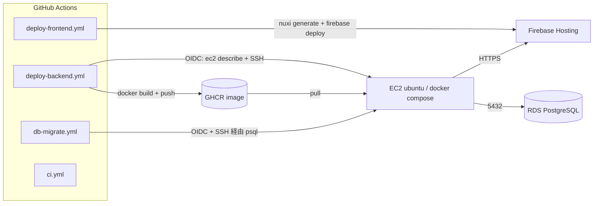

# デプロイ運用ガイド (CI/CD: GitHub Actions)

> **対象読者:** オペレーター (インフラ初級者想定)
> **SoT:** 本リポジトリの CI/CD (EC2 + GHCR + Firebase Hosting + RDS) 運用手順はこのファイルが正。
> Phase 5 `architecture.md` / Phase 7 `iteration4-prod-migration-plan.md` は当初 **App Runner** 前提で
> 記述されているが、**本実装はオペレーター判断で「EC2(ubuntu) にコンテナ配置」へ変更**している
> (§0 参照)。

---

## 0. 構成概要 (当初計画からの変更点)

| 領域 | 当初計画 (migration-plan) | 本実装 | 理由 |
|---|---|---|---|
| Backend 実行基盤 | AWS App Runner | **EC2(ubuntu) + docker compose** | オペレーター指定 |
| イメージ配信 | ECR | **GHCR** (GitHub Container Registry) | オペレーター指定 (Q1) |
| GitHub Actions → AWS 認証 | OIDC | **OIDC** (踏襲) | Q2。長期キー漏洩リスク回避 |
| Frontend 配信 | Firebase Hosting | **Firebase Hosting** (踏襲) | – |
| 設定/機密 | AWS Secrets Manager | **repository secrets → EC2 .env** | オペレーター指定 |
| DB スキーマ | EF Core Migration | **生 SQL (db/init, db/migration) を冪等適用** | 実装実態に合わせる |



- **Frontend** (`deploy-frontend.yml`): `main` push / 手動 → Nuxt 静的生成 → Firebase Hosting。
- **Backend** (`deploy-backend.yml`): `main` push / 手動 → Docker build → GHCR push → OIDC で EC2 を解決 → SSH で `.env` 配置 + `docker compose up -d` + ヘルスチェック。
- **DB** (`db-migrate.yml`): **手動のみ**。OIDC で EC2 を踏み台に、使い捨て psql コンテナで RDS に init / migrate。
- **CI** (`ci.yml`): PR / push で Backend `dotnet build` + Frontend `pnpm typecheck`。

---

## 1. オペレーター事前準備 (一度きり)

### 1.1 EC2 (ubuntu)

- Docker Engine + `docker compose` (v2 plugin) を導入。
- ユーザ (例 `ubuntu`) が `docker` を sudo なしで実行できること (`usermod -aG docker ubuntu`)。
- セキュリティグループ:
  - **Inbound:** SSH (22) を GitHub Actions から許可。GitHub ランナーは固定 IP を持たないため、
    実務では (a) 一時的に広めに許可、(b) Tailscale/SSM 等の踏み台、(c) self-hosted runner のいずれか。
    最小構成としては運用ポリシーに応じて 22 を許可する。Backend 公開ポート (既定 8080、または
    リバースプロキシ/ALB 経由 443) も業務 LAN からのアクセスに合わせて開ける。
  - **Outbound:** `ghcr.io` (443)、RDS (5432)、Firebase/Google API (443)。
- EBS ボリュームは暗号化を推奨 (`.env` に DB パスワード等が置かれるため)。
- **TLS 終端は前提条件 (必須):** 本パイプラインは Backend を 8080 で **HTTP 公開**する。Frontend は
  Firebase Hosting (HTTPS) 配信のため、API が HTTP のままだと **mixed content で全 API が失敗**し、
  Firebase ID トークン (Authorization ヘッダ) が平文で流れる。本番では次のいずれかを必須とする:
  (a) ALB/nginx + ACM 証明書で **HTTPS 終端**し `NUXT_PUBLIC_API_BASE` を `https://` にする、
  (b) 業務 LAN / VPN 内に閉じ、SG で Backend ポートを社内 CIDR に限定する。
- `cpus` / `mem_limit` (コンテナのリソース上限) は EC2 サイズに応じて
  `deploy/ec2/docker-compose.prod.yml` に追加してよい (暴走時のホスト巻き込み防止)。

### 1.2 EC2 → RDS 疎通

- RDS のセキュリティグループに **EC2 の SG からの 5432 接続** を許可。
- RDS に DB `akebono_honshu` を作成 (db/init スクリプトは DB 名 `akebono_honshu` を前提)。
- 2 種のユーザを作成 (最小権限):
  - **アプリ用** (`PROD_DB_CONNECTION` で使用): DML 権限のみ。`audit_logs` は INSERT のみ等。
  - **マイグレーション用** (`DB_ADMIN_*` で使用): DDL 権限あり (CREATE/ALTER TABLE)。

### 1.3 AWS OIDC (GitHub Actions → AWS)

1. IAM → ID プロバイダ → **GitHub OIDC** を追加 (`token.actions.githubusercontent.com`、audience `sts.amazonaws.com`)。
2. IAM ロールを作成し、信頼ポリシーで本リポジトリ・ブランチに限定 (下記)。
3. 許可ポリシーは **`ec2:DescribeInstances` のみ** (EC2 ホスト解決用)。`EC2_HOST` secret を直接指定する
   運用なら本権限も不要だが、OIDC ステップ自体は残る。

**信頼ポリシー (trust policy):**
```json
{
  "Version": "2012-10-17",
  "Statement": [{
    "Effect": "Allow",
    "Principal": { "Federated": "arn:aws:iam::<account-id>:oidc-provider/token.actions.githubusercontent.com" },
    "Action": "sts:AssumeRoleWithWebIdentity",
    "Condition": {
      "StringEquals": { "token.actions.githubusercontent.com:aud": "sts.amazonaws.com" },
      "StringLike": { "token.actions.githubusercontent.com:sub": "repo:tsunaguba/akebono-honshu:ref:refs/heads/main" }
    }
  }]
}
```

**許可ポリシー (permission policy):**
```json
{
  "Version": "2012-10-17",
  "Statement": [{
    "Sid": "ResolveEc2Host",
    "Effect": "Allow",
    "Action": "ec2:DescribeInstances",
    "Resource": "*"
  }]
}
```
> `ec2:DescribeInstances` は resource 単位の制限が効かないため `Resource: "*"` (読み取り専用)。

> **EC2 ランタイムで AWS (S3 / Secrets Manager) を使う場合:** それは CI の OIDC ロールではなく
> **EC2 インスタンスプロファイル** に最小権限を付与する (migration-plan §4.2.1 / §4.2.2 の IAM サンプル参照)。
> 本パイプラインの既定は `ImageStorage__Provider=Local` / `Secrets__Provider=Environment` のため不要。

### 1.4 EC2 SSH 鍵 / ホスト鍵

- デプロイ用のキーペアを用意し、**公開鍵を EC2 の `~/.ssh/authorized_keys`** に登録。
- **秘密鍵を repository secret `EC2_SSH_PRIVATE_KEY`** に登録 (改行込みでそのまま貼付)。
- 鍵は定期ローテーション推奨。
- **(推奨) ホスト鍵のピン留め:** `EC2_SSH_KNOWN_HOSTS` secret に EC2 の公開ホスト鍵を登録すると、
  デプロイ時に MITM 検証付きで接続する。取得は `ssh-keyscan <EC2ホスト>` の出力をそのまま貼付。
  **未設定時は `ssh-keyscan` の TOFU** (初回信頼) になり、経路上の攻撃者が偽鍵を返しても検知できない。
  DB パスワード入りの `.env` を scp する宛先のため、本番では設定を強く推奨。

### 1.5 GHCR (GitHub Container Registry)

- 追加設定は基本不要。`deploy-backend.yml` が `GITHUB_TOKEN` で push、EC2 への pull も
  ワークフロー実行中の一時トークンで行う (長期 PAT 不要)。
- 初回 push でイメージは **private** で作成される。Settings → Actions → Workflow permissions が
  read/write になっていること (既定で可)。

### 1.6 Firebase

- 本番 project (例 `akebono-honshu-prod`) を作成し、Hosting を有効化。
- **サービスアカウント JSON** を発行 (ロール: *Firebase Hosting 管理者*)。JSON 全文を repository
  secret `FIREBASE_SERVICE_ACCOUNT` に登録。
- Firebase Console → Authentication → Settings → Authorized domains に本番 Hosting ドメインを追加。
- (再現性のため) `src/Frontend/pnpm-lock.yaml` をコミットしておくと CI が `--frozen-lockfile`
  相当の固定インストールにできる (現状は未コミットのため `--no-frozen-lockfile`)。

---

## 2. 登録する Repository Secrets 一覧

> Settings → Secrets and variables → Actions → **Repository secrets** に登録。

| Secret 名 | 使うワークフロー | 例 / 形式 | 説明 |
|---|---|---|---|
| `AWS_ROLE_ARN` | backend, db | `arn:aws:iam::123…:role/akebono-gha` | OIDC で AssumeRole するロール ARN |
| `AWS_REGION` | backend, db | `ap-northeast-1` | リージョン |
| `EC2_INSTANCE_ID` | backend, db | `i-0abc…` | EC2 解決用 (EC2_HOST 未設定時) |
| `EC2_HOST` *(任意)* | backend, db | `ec2-xx.compute.amazonaws.com` | 固定ホスト/EIP を使う場合の上書き |
| `EC2_SSH_USER` | backend, db | `ubuntu` | SSH ユーザ |
| `EC2_SSH_PRIVATE_KEY` | backend, db | (PEM 全文) | SSH 秘密鍵 |
| `EC2_SSH_KNOWN_HOSTS` *(任意/推奨)* | backend, db | (`ssh-keyscan` 出力) | ホスト鍵ピン留め。未設定で TOFU |
| `PROD_DB_CONNECTION` | backend | `Host=…;Port=5432;Database=akebono_honshu;Username=…;Password=…` | アプリ用 Npgsql 接続文字列 |
| `FIREBASE_PROJECT_ID` | backend, frontend | `akebono-honshu-prod` | Backend の Audience / Firebase deploy 先 |
| `CORS_ORIGINS` | backend | `https://akebono-honshu-prod.web.app` | 許可オリジン (カンマ区切り) |
| `BACKEND_HOST_PORT` *(任意)* | backend | `8080` | EC2 公開ポート (既定 8080) |
| `IMAGE_STORAGE_PROVIDER` *(任意)* | backend | `Local` / `S3` | 既定 `Local` |
| `S3_BUCKET_NAME` *(任意)* | backend | `akebono-honshu-images-prod` | S3 運用時のみ |
| `DB_HOST` | db | `akebono1.xxx.rds.amazonaws.com` | RDS エンドポイント |
| `DB_PORT` *(任意)* | db | `5432` | 既定 5432 |
| `DB_NAME` | db | `akebono_honshu` | DB 名 |
| `DB_ADMIN_USER` | db | `akebono_migrator` | DDL 権限ユーザ |
| `DB_ADMIN_PASSWORD` | db | (パスワード) | DDL 権限ユーザのパスワード |
| `NUXT_PUBLIC_API_BASE` | frontend | `https://api.example.jp/api/v1` | Backend API URL |
| `NUXT_PUBLIC_FIREBASE_API_KEY` | frontend | `AIza…` | Firebase Web config (公開情報) |
| `NUXT_PUBLIC_FIREBASE_AUTH_DOMAIN` | frontend | `akebono-honshu-prod.firebaseapp.com` | 〃 |
| `NUXT_PUBLIC_FIREBASE_PROJECT_ID` | frontend | `akebono-honshu-prod` | 〃 |
| `NUXT_PUBLIC_FIREBASE_STORAGE_BUCKET` | frontend | `akebono-honshu-prod.appspot.com` | 〃 |
| `NUXT_PUBLIC_FIREBASE_MESSAGING_SENDER_ID` | frontend | `1234567890` | 〃 |
| `NUXT_PUBLIC_FIREBASE_APP_ID` | frontend | `1:123…:web:abc…` | 〃 |
| `FIREBASE_SERVICE_ACCOUNT` | frontend | (SA JSON 全文) | Firebase Hosting デプロイ認証 |

> **注意:** `NUXT_PUBLIC_FIREBASE_*` と `FIREBASE_PROJECT_ID` は **本番 project の値**にすること。
> dev project の値を使うと dev テストユーザが本番に到達する事故になる (migration-plan §4.2.2bis)。

---

## 3. 使い方

### 3.1 通常デプロイ
- `main` に push すると、変更パスに応じて `deploy-frontend` / `deploy-backend` が自動実行される。
- 手動実行は Actions タブ → 対象ワークフロー → **Run workflow**。

### 3.2 DB 初期化 / マイグレーション (手動)
1. **初回のみ:** Actions → *DB Init / Migrate (RDS)* → Run workflow → `action = init`。
   - 空 DB に `db/init/01..04` を投入し、現行マイグレーションを baseline 記録する。
   - 既に `public.users` がある DB では **安全のため中止**する (データ保護)。
2. **以後のスキーマ変更:** `db/migration/` に `mig-3-*` 以外の `*.sql` を追加 → `action = migrate`。
   - 台帳 (`schema_migrations`) に無いものだけを順に適用する (再実行で二重適用しない)。
3. **MIG-3 (既存 CSV データ取込)** は本ワークフロー対象外。UI `/admin/legacy-import` から実施する
   (`db/migration/README.md`)。

### 3.3 デプロイ順序 (初回)
`db-migrate (init)` → `deploy-backend` → `deploy-frontend`。Backend は RDS スキーマが無いと
起動後に各 API が失敗するため、DB を先に用意する。

---

## 4. ロールバック

| 対象 | 手順 |
|---|---|
| Backend | GHCR は過去タグ (`sha-<commit>`) を保持。EC2 で `~/akebono-deploy/.env` の `BACKEND_IMAGE` を旧タグに変えて `bash deploy.sh`、または旧 commit で `deploy-backend` を手動再実行 |
| Frontend | `firebase hosting:rollback` (Firebase Console / CLI) |
| DB | 前進専用 (forward-only)。誤適用時は RDS の PITR で復旧。`schema_migrations` 台帳と実 DB の整合を確認 |

> **health check 失敗時:** `deploy.sh` は新コンテナ起動後に `/health` を検査し、失敗すると非 0 終了
> (CI が赤)。単一 EC2 構成では新版が unhealthy のままダウンタイムになるため、**上表 Backend の
> ロールバック (旧 `sha-<commit>` タグへ) を直ちに実行**すること。自動ロールバックは未実装 (MVP 範囲)。

---

## 5. セキュリティ留意点 (システム監査観点)

- **長期鍵の最小化:** AWS は OIDC、GHCR は一時トークン。残る長期 secret は SSH 秘密鍵と DB/Firebase 認証情報のみ。SSH 鍵は定期ローテーション。
- **機密の非コミット:** CI 生成の `deploy/ec2/.env` / `.ghcr_token` / `deploy/db/.dbenv` は `.gitignore` 済。EC2 上でもトークンは使用後に削除 (`docker logout` / `rm`)。
- **本番 Swagger 無効化:** `ASPNETCORE_ENVIRONMENT=Production` 時は `/swagger` を出さない (Program.cs)。
- **ロギング抑制:** 本番 `.env` で EF Core SQL ログ等を `Warning` に抑制 (PII/SQL 値漏洩・コスト対策)。
- **既存データ保護:** DB init は既存 DB で中止、migrate は台帳で冪等 (原則 2 / 7)。
- **EBS 暗号化 / SG 最小化** を推奨。Backend を 8080 で直接公開する場合は業務 LAN/VPN に限定する。
- **SSH ホスト鍵:** `EC2_SSH_KNOWN_HOSTS` を設定して MITM 検証を有効化する (§1.4)。
- **デプロイ失敗通知:** 既定では GitHub の Actions 失敗通知 (メール) で検知する。Slack 等への能動通知が
  必要な場合は通知先を決めて各 deploy ワークフローに `if: failure()` ステップを追加する
  (migration-plan §5.5 のヒアリング事項)。
- **OIDC は main 限定:** 信頼ポリシーが `refs/heads/main` 限定のため、`workflow_dispatch` を **main 以外の
  ブランチで手動起動すると OIDC 認証が失敗**する (意図的な安全側挙動)。
- **ホスト再起動後:** `restart: unless-stopped` で通常はローカルイメージから自動復帰するが、イメージが
  ローカルから消えている場合は private イメージを再 pull できないため `deploy-backend` を再実行する。
- **サプライチェーン:** 再現性・改ざん耐性のため `src/Frontend/pnpm-lock.yaml` のコミット (§1.6) を推奨。
  重要 Actions の commit SHA ピン留め / `postgres:16-alpine` のダイジェスト固定も将来的に検討。
