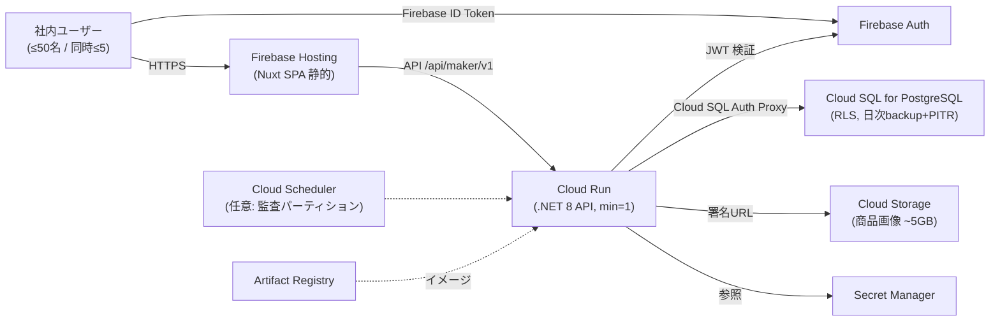

# Firebase / GCP 全面移行時の運用コスト試算（50名規模）

> **前提の要約:** 「現機能を保持したまま、インフラをすべて Firebase / GCP に寄せる」構成の
> **月額運用コスト**を試算する。単価は 2026 年時点の **asia-northeast1（東京）** 概算、
> 為替は **¥150/USD** を採用。実額は [GCP Pricing Calculator](https://cloud.google.com/products/calculator) と
> 実請求で必ず再確認すること（特に支配項の Cloud SQL）。

---

## 0. 結論（先に数字）

| シナリオ | 月額(USD) | 月額(円 概算) | 年額(円 概算) | 位置づけ |
|---|---|---|---|---|
| ① Lean（最小・コスト最適） | **≈ $60** | **≈ ¥9,000** | ≈ ¥108,000 | コスト最優先。コールドスタート等のトレードオフあり |
| ② **推奨**（NFR 準拠・HA 無し） | **≈ $140** | **≈ ¥21,000** | ≈ ¥250,000 | 文書化された非機能要件を満たす標準構成 |
| ③ 本番強化（HA 付き） | **≈ $377** | **≈ ¥57,000** | ≈ ¥684,000 | 可用性を厳格化したい場合。現 NFR には過剰 |

**要点:**
- コストは**従業員数（50名）にほぼ線形しない**。支配項は「**常時起動の Cloud SQL とバックエンド**」という固定費で、
  同時接続が 5名でも 50名でもこの層はほぼ変わらない。
- **Firebase Auth は 50,000 MAU まで無料**のため、50 ユーザー分の認証コストは **$0**。
- **フロントエンドは静的 SPA**（Firebase Hosting）で、サーバ側計算コストは実質ゼロ。
- **Cloud SQL がコストの過半**を占める。ここのサイジングと確約利用割引（CUD）が最大の最適化レバー。

---

## 1. スコープと利用前提

### 1.1 対象システム
アパレル生産管理 ERP（akebono-honshu / SCIP プラットフォームの maker テナント）。
.NET 8 minimal-API（EF Core + Npgsql）＋ PostgreSQL（RLS マルチテナント）＋ Nuxt 3 SPA。

### 1.2 利用規模の前提（文書化された非機能要件より）
`.ai-native/outputs/phase3/non-functional-requirements.md` の確定値を採用する。

| 観点 | 値 | 出典 |
|---|---|---|
| 会社規模（名義ユーザー） | 〜50名（システム上限 〜100） | 本タスク前提 / NFR §1.2 |
| **同時接続ユーザー** | **通常 1–2名 / ピーク 5名** | NFR §3 |
| スケールアウト要否 | **不要**（単一サーバで 5年想定でも十分） | NFR §3 |
| 稼働時間 | 平日 9:00–18:00（JST） | NFR §5 |
| SLA | 業務時間内 99%（月 5分以内の停止許容） | NFR §5 |
| RTO / RPO | **4時間 / 24時間**（日次バックアップから） | NFR §5 |
| データ保管地域 | **日本国内**（→ 東京リージョン固定） | NFR §4.2 |

> **含意:** RTO 4h / RPO 24h は**日次自動バックアップ + PITR で充足**するため、**マルチゾーン HA は必須ではない**。
> HA はシナリオ③のオプション扱いとする。データ国内保管要件から asia-northeast1（東京、us 比 +10〜15%）を固定採用。

### 1.3 データ量想定（5年運用、NFR §1.2）
SKU 〜20,000 / 発注明細 〜100,000 / 仕入単価 〜100,000 / 監査ログ 〜400,000 / 画像 〜10,000（約 **5GB**）。
→ **DB 実データは数 GB オーダー**、ストレージは小さく始めて緩やかに増加。

### 1.4 トラフィック前提（試算用）
| 項目 | 想定 | 根拠 |
|---|---|---|
| API リクエスト | 〜1–3M/月 | 実稼働 〜40名 × 業務日 22 × 1,000–1,500 コール/日 |
| Excel 出力 | 〜100–500/月 | 同期・ストリーム返却（ClosedXML、保存しない） |
| 画像アップロード | 〜170/月 | 5年で 10,000枚 |
| 下り転送（内部業務 LAN 主体） | 〜20–40 GB/月 | API JSON + 署名 URL 画像取得 + 静的アセット |

---

## 2. 現状 → Firebase / GCP マッピング（現機能保持）

| レイヤ | 現状（AWS + Firebase） | 移行先（Firebase / GCP） | 備考 |
|---|---|---|---|
| フロント配信 | Firebase Hosting | **Firebase Hosting**（変更なし） | 既に GCP 側 |
| 認証 | Firebase Auth | **Firebase Auth**（変更なし） | 50 ユーザーは無料枠内 |
| バックエンド実行 | .NET コンテナ on EC2 + nginx-proxy + Let's Encrypt | **Cloud Run**（コンテナそのまま、マネージド TLS + ドメインマッピング） | HTTPS/証明書は Cloud Run 内包 |
| データベース | AWS RDS PostgreSQL（RLS） | **Cloud SQL for PostgreSQL**（RLS 対応） | RLS/パーティション/トリガーそのまま移行可 |
| 画像ストレージ | S3 + pre-signed URL | **Cloud Storage（GCS）+ signed URL** | `IImageStorageService` に GCS 実装を追加 |
| シークレット | AWS Secrets Manager / repo secrets | **Secret Manager** | `Secrets:Provider` に GCP 実装を追加 |
| コンテナレジストリ | GHCR | **Artifact Registry** | |
| CI/CD | GitHub Actions | GitHub Actions 継続（デプロイ先を Cloud Run へ） | Cloud Build でも可 |
| 監査パーティション保守 | .NET `BackgroundService`（EC2 常駐） | Cloud Run 常駐（min-instances≥1）**または** Cloud Scheduler | §5 参照 |

---

## 3. 単価リファレンス（asia-northeast1 / 2026 概算 / USD）

> 出典は本試算末尾。第三者ページは変動するため、支配項は必ず公式 Calculator で再確認。

| サービス | 課金項目 | 単価 |
|---|---|---|
| **Cloud Run**（リクエスト課金） | vCPU / GiB / リクエスト | $0.0000240/vCPU秒・$0.0000025/GiB秒・$0.40/百万req |
| **Cloud Run**（インスタンス課金 / 常時CPU） | vCPU / GiB | $0.0000180/vCPU秒・$0.0000020/GiB秒（req 課金なし） |
| Cloud Run 無料枠 | 月あたり | 180,000 vCPU秒・360,000 GiB秒・200万 req |
| **Cloud SQL PostgreSQL**（Enterprise） | vCPU / RAM | ≈$0.0576/vCPU時（≈$42/月）・≈$0.0098/GB時（≈$7.2/GB月） |
| Cloud SQL ストレージ / バックアップ | SSD / backup | ≈$0.27/GB月・≈$0.11/GB月 |
| Cloud SQL HA | 計算+ストレージ | **×2** |
| Cloud Storage（Standard 東京） | 保存 / 下り(internet) | $0.023/GB月・$0.12/GB |
| Firebase Hosting | 保存 / 転送 | $0.026/GB・$0.15/GB（無料: 10GB保存 + 360MB/日 転送） |
| **Firebase Auth** | MAU | **50,000 MAU まで無料**（電話/SMS を除く） |
| Secret Manager | バージョン / アクセス | $0.06/版·月・$0.03/1万アクセス |
| Artifact Registry | 保存 | $0.10/GB月 |
| Cloud Scheduler | ジョブ | 月 3 ジョブまで無料 |
| Cloud Logging | 取込 | 月 50 GiB まで無料 |
| Cloud Run ドメインマッピング | 証明書 | 無料（マネージド） |

*常時起動換算:* 1 vCPU 24/7 = $0.0000180 × 2,592,000秒 = **$46.66/月**、1 GiB 24/7 = **$5.18/月**。

---

## 4. シナリオ別 内訳

### シナリオ② 推奨（NFR 準拠・HA 無し）※標準構成
文書化された「同時 5名・単一サーバ・RTO4h/RPO24h」に最適サイズ。

| 項目 | 構成 | 計算 | 月額(USD) |
|---|---|---|---|
| Cloud Run（バックエンド） | 1 vCPU / 1 GiB, min-instances=1, CPU 常時割当, 24/7 | $46.66 + $5.18 | **$52** |
| Cloud SQL | db-custom-1-3840（1 vCPU / 3.75 GB）, 30GB SSD, HA 無し, 日次backup+PITR | $42 + 3.75×$7.2 + 30×$0.27 + backup | **$79** |
| Cloud Storage（画像 ~5GB） | Standard | 5×$0.023 + ops | **$0.5** |
| Firebase Hosting | 静的アセット + 転送 | 無料枠超過分 | **$2** |
| 下り転送 | 〜30 GB/月 | 30×$0.12 | **$4** |
| Secret Manager | 〜10 版 | | **$1** |
| Artifact Registry | イメージ数版 | | **$0.5** |
| Scheduler / Logging / Build / ドメイン | 無料枠内 | | **$0** |
| **合計** | | | **≈ $139/月** |

→ **≈ ¥21,000/月 / ≈ ¥250,000/年**（丸め幅 $130–160 / ¥20,000–24,000）。
バックエンドが常時 warm のためコールドスタートなし、監査 `BackgroundService` もそのまま常駐で動作。

### シナリオ① Lean（最小・コスト最適）

| 項目 | 構成 | 月額(USD) |
|---|---|---|
| Cloud Run | 業務時間のみ min=1（Scheduler 制御, 〜200h/月）or 完全 scale-to-zero | **≈ $10** |
| Cloud SQL | db-g1-small（共有 1 vCPU / 1.7 GB）, 20GB SSD, HA 無し | **≈ $45** |
| Cloud Storage / Hosting / 転送 / その他 | | **≈ $5** |
| **合計** | | **≈ $60/月** |

→ **≈ ¥9,000/月**。**トレードオフ:** ①.NET コールドスタート（時間外アクセスで数秒）、②DB RAM 1.7GB は Excel 一括出力・大きめ JOIN で窮屈、③監査パーティション保守は Cloud Scheduler へ移設が必須。

### シナリオ③ 本番強化（HA 付き）

| 項目 | 構成 | 月額(USD) |
|---|---|---|
| Cloud Run | 1 vCPU / 2 GiB, min=1, 24/7 | **≈ $57** |
| Cloud SQL | db-custom-2-8192（2 vCPU / 8 GB）, 50GB SSD, **HA（2ゾーン）** | **≈ $312** |
| その他（Storage/Hosting/転送/Secret/AR） | | **≈ $8** |
| **合計** | | **≈ $377/月** |

→ **≈ ¥57,000/月**。同時 5名・RTO4h/RPO24h の現 NFR には**過剰**。「業務時間内 SLA 99% をゾーン障害に対しても厳格担保したい」場合のみ選択。

---

## 5. 設計上の注意（現機能保持のための必須事項）

1. **監査ログのパーティション保守**（`AuditPartitionMaintenanceService`, 24h ループの `IHostedService`）は、
   CPU スロットリング中や scale-to-zero では動かない。**(a)** Cloud Run を `min-instances=1` + CPU 常時割当にする（推奨②/③）、
   **または (b)** Cloud Scheduler（無料枠）から日次で専用エンドポイントを叩く（Lean①）。どちらかを必ず用意する。
2. **画像 URL 方式**は pre-signed(S3) → **signed URL(GCS)** へ実装置換が必要（コスト増ではなく改修工数）。`IImageStorageService` に GCS 実装を追加。
3. **Cloud SQL は scale-to-zero 不可**（Postgres にサーバレス自動休止なし）。DB はどのシナリオでも**固定費**として残る＝最適化の主戦場。
4. **RLS / 月次パーティション / `updated_at` トリガー**は Cloud SQL PostgreSQL でそのまま動作（RDS からの論理移行が可能）。
5. **DB 接続方式（追加ネットワーク課金の回避）**: Cloud Run → Cloud SQL は **ビルトインの Cloud SQL Auth Proxy**（`--add-cloudsql-instances`, Unix ソケット）で接続する。この経路は **Serverless VPC Access コネクタ（別途 月額課金）を必要としない**ため、本試算にネットワークコネクタ費は計上していない。Private IP + VPC コネクタ構成にすると小型でも月数十ドルの追加費が発生する点に注意。
6. **接続数**: Cloud Run はインスタンスごとに接続を張るため、Cloud SQL の `max_connections` とコネクションプール設定を確認。同時 5名規模では問題になりにくい。

---

## 6. コスト最適化レバー

| レバー | 効果 | 備考 |
|---|---|---|
| **確約利用割引（CUD）** | Cloud SQL/Run 常時分に **1年 −25% / 3年 −52%** | 固定費主因の DB に最も効く。推奨②の DB に1年CUD → 合計 **≈ $122/月** |
| **業務時間のみ warm** | バックエンド $52 → **≈ $16** | Scheduler で平日9–18時のみ min=1、夜間0。時間外はコールドスタート許容 |
| **共有コア DB（g1-small）** | DB $79 → **≈ $45** | 同時5名なら実用範囲。ただし RAM 余裕は減る |
| **自動ストレージ増加のみ有効化** | 初期ストレージ最小化 | 増加はワークロード実測で |
| **ログ/監視を無料枠内に** | Logging 50GiB/月・監視メトリクス無料 | 過剰ログを抑制（本番は Warning 既定、既存 .env 準拠） |

---

## 7. 一時（移行）コスト（月額とは別）

| 項目 | 概算 | 備考 |
|---|---|---|
| RDS → Cloud SQL データ移行 | 数百円〜（DMS/`pg_dump`・`pg_restore`） | 数 GB 規模、短時間 |
| S3 → GCS 画像移行（〜5GB） | 数百円 | Storage Transfer Service |
| コード改修（GCS signed URL / Secret Manager / デプロイ先） | **工数**（コスト外） | 現機能保持のための実装 |
| DNS 切替・ドメインマッピング | 無料（マネージド証明書） | |
| 二重稼働期間の重複費 | 移行月のみ | 切替検証中の並行運用分 |

---

## 8. 参考: 現状（AWS）との比較

| 構成 | 月額(概算) | メモ |
|---|---|---|
| 現状 AWS（共有 EC2 相乗り + RDS 小 + S3） | ≈ $50–80 | EC2 は既存 nginx-proxy に相乗りで専有費が低い |
| GCP 推奨② | ≈ $130–160 | 差の主因は「Cloud Run 常時 warm 専有課金」＋「Cloud SQL 専有インスタンス」 |
| GCP Lean① | ≈ $60 | ほぼ同等。コールドスタート等を許容する場合 |

> 見かけ上増える主因は、現状が**共有ホスト相乗り**でバックエンド専有費をほぼ払っていない点。
> GCP では Cloud Run が独立課金になるため、同等機能でも専有コストが顕在化する。Lean 構成なら現状同等に収まる。

---

## 9. 前提・免責

- 単価は **2026年時点・asia-northeast1** の概算。Google の料金改定・為替変動で変わる。**税抜**。
- 為替 **¥150/USD** 換算（直近は ¥140–160 で変動）。JPY 建て請求時は請求時レート。
- **Cloud SQL の vCPU/RAM 単価は支配項**のため、発注前に必ず [公式 Calculator](https://cloud.google.com/products/calculator) で再確認する。
- トラフィック・データ量は NFR の想定値ベース。Phase 7 の実数値で再校正すること。

### 出典
- Cloud Run pricing — https://cloud.google.com/run/pricing
- Cloud SQL pricing — https://cloud.google.com/sql/pricing
- Cloud Storage pricing — https://cloud.google.com/storage/pricing
- Firebase pricing（Auth 50k MAU 無料 / Hosting）— https://firebase.google.com/pricing
- Secret Manager pricing — https://cloud.google.com/secret-manager/pricing
- GCP Pricing Calculator — https://cloud.google.com/products/calculator
