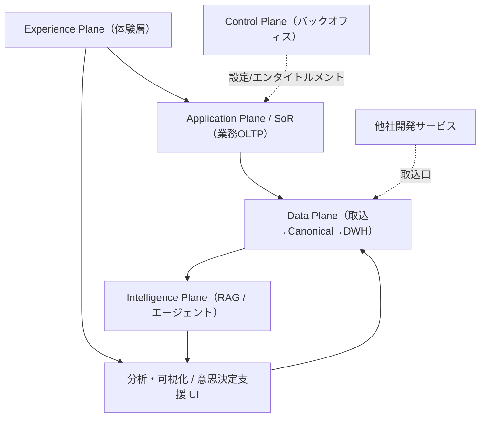
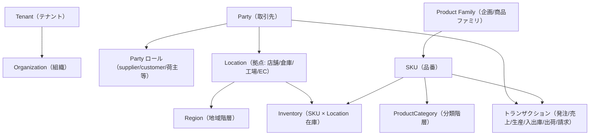

# 用語集 / ユビキタス言語（SCIP プラットフォーム）

本ドキュメントは **SCIP（Supply Chain Intelligence Platform）** の設計・実装・運用で用いる
すべての用語・エンティティ・略語・英語識別子の **権威的な定義（Source of Truth）** である。

- **本ドキュメントの所有範囲（owns）:** 用語の *定義* のみ。各用語の正式な意味・訳・英語識別子はここが権威。
- **他ドキュメントは再定義しない:** 各テーブル/エンティティの *構造（DDL・カラム・制約）* は
  ファウンデーション・ブリーフ §14 の所有マップに従い各設計ドキュメントが所有する。本用語集はそこへ **リンク** する。
- 用語の揺れ・別名・非推奨表現を発見した場合は本ドキュメントを更新し、全ドキュメントの表記を合わせる。

> **読み方:** 用語を引くときは §3〜§9 の分類別テーブルを参照。用語がどのドキュメントで
> 構造定義されているかは各行の「所有ドキュメント」列を辿る。ドキュメント全体の地図は §2。

---

## 1. 命名の基本規約（用語 ⇄ 識別子の対応原則）

用語（日本語）と実装識別子（英語）の対応は、ファウンデーション・ブリーフ §9 の DDL 規約に従う。
本用語集の各テーブルでは「英語識別子」列にテーブル名・カラム名の由来を示す。

| 観点 | 規約（要約） | 例 |
|------|------------|-----|
| テーブル/カラム名 | snake_case・英語・単数系エンティティ名 | `canonical_product`, `tenant_id` |
| 主キー | `id BIGSERIAL PRIMARY KEY`（DWH のみサロゲート `*_key`） | `product.id`, `dim_product.product_key` |
| テナント列 | テナントスコープ全テーブルに `tenant_id BIGINT NOT NULL` | `tenant_id` |
| 業務自然キー（DWH） | ディメンションは `*_bk`（business key）を保持 | `dim_product.product_bk` |
| 外部キー | `<参照先単数>_id`（例外: DWH は `*_key`） | `sales_transaction.customer_id` |
| ステータス | `SMALLINT + CHECK`（PG ENUM は使わない） | `status SMALLINT CHECK (status IN (0,1,2))` |
| 論理削除 | プラットフォーム標準 `is_deleted`、メーカー継承は `delete_flag`（§9） | `is_deleted`, `delete_flag` |
| 来歴列 | 取込データは `source_system` / `source_record_id` / `legacy_id` | — |
| API リソース | 複数形 kebab-case（`/api/v1/<resource>`） | `/api/v1/purchase-orders` |

> **注:** 継承実装（Honshu）は英語識別子・`delete_flag`・`TIMESTAMP`(JST-naive) を採用。プラットフォームは
> `TIMESTAMPTZ`(UTC 保存) を標準とする。差分は各 OLTP ドキュメント（特に 32 メーカー OLTP）が明記する。

---

## 2. ドキュメントマップ（全ドキュメントの索引）

SCIP 設計ドキュメントセット。各行の「主な所有範囲」はファウンデーション・ブリーフ §14 の所有マップに基づく。
本用語集はここに列挙した全ドキュメントの上位参照（用語のハブ）である。

### 2.1 overview（概要）

| ID | タイトル | パス | 主な所有範囲 |
|----|---------|------|------------|
| readme | 索引と読み方 | [`./README.md`](./README.md) | ドキュメントマップ・読み順 |
| glossary | 用語集 / ユビキタス言語（本書） | [`./00-glossary.md`](./00-glossary.md) | **用語定義（権威）** |

### 2.2 basic-design（基本設計）

| ID | タイトル | パス | 主な所有範囲 |
|----|---------|------|------------|
| 01 | 構想と全体像 | [`./basic-design/01-concept-and-vision.md`](./basic-design/01-concept-and-vision.md) | プロダクトビジョン・スコープ |
| 02 | 全体アーキテクチャ | [`./basic-design/02-overall-architecture.md`](./basic-design/02-overall-architecture.md) | 5 プレーン構成・技術スタック配置 |
| 03 | 正準ドメインモデル | [`./basic-design/03-canonical-domain-model.md`](./basic-design/03-canonical-domain-model.md) | ユビキタス言語の概念モデル図 |
| 04 | 小売サービス | [`./basic-design/04-service-retail.md`](./basic-design/04-service-retail.md) | クロスリテーラー業務設計 |
| 05 | メーカーサービス | [`./basic-design/05-service-manufacturer.md`](./basic-design/05-service-manufacturer.md) | メーカー業務設計（Honshu 一般化） |
| 06 | WMS | [`./basic-design/06-service-wms.md`](./basic-design/06-service-wms.md) | 倉庫業務設計・荷主請求 |
| 07 | 分析・可視化 | [`./basic-design/07-service-analytics.md`](./basic-design/07-service-analytics.md) | スタースキーマ分析・可視化設計 |
| 08 | 意思決定支援 / AIエージェント | [`./basic-design/08-service-decision-support-ai.md`](./basic-design/08-service-decision-support-ai.md) | バーチャルカンパニー構想 |
| 09 | バックオフィス | [`./basic-design/09-service-backoffice.md`](./basic-design/09-service-backoffice.md) | 契約・課金・エンタイトルメント |
| 10 | データ連携とマッピング | [`./basic-design/10-data-integration-and-mapping.md`](./basic-design/10-data-integration-and-mapping.md) | 取込・項目マッピング業務設計 |
| 11 | 非機能 / セキュリティ / テナンシー | [`./basic-design/11-nonfunctional-security-tenancy.md`](./basic-design/11-nonfunctional-security-tenancy.md) | RLS・マルチテナンシー・非機能 |
| 12 | ADR（意思決定記録） | [`./basic-design/12-architecture-decision-records.md`](./basic-design/12-architecture-decision-records.md) | 技術選定の根拠 |

### 2.3 detailed-design（詳細設計）

| ID | タイトル | パス | 主な所有範囲 |
|----|---------|------|------------|
| 20 | Canonical / MDM / 名寄せ | [`./detailed-design/20-canonical-mdm-and-entity-resolution.md`](./detailed-design/20-canonical-mdm-and-entity-resolution.md) | 名寄せ・ゴールデンレコード解決 |
| 21 | 取込とマッピングパイプライン | [`./detailed-design/21-ingestion-and-mapping-pipeline.md`](./detailed-design/21-ingestion-and-mapping-pipeline.md) | Ingestion → Raw → Canonical |
| 22 | スタースキーマ変換 | [`./detailed-design/22-star-schema-transformation.md`](./detailed-design/22-star-schema-transformation.md) | ELT・SCD2 ロード設計 |
| 23 | AI / RAG / ベクター化 | [`./detailed-design/23-ai-rag-and-vectorization.md`](./detailed-design/23-ai-rag-and-vectorization.md) | 埋め込み・RAG パイプライン |
| 24 | AIエージェント / バーチャルカンパニー | [`./detailed-design/24-ai-agent-and-virtual-company.md`](./detailed-design/24-ai-agent-and-virtual-company.md) | エージェント・オーケストレーション |
| 25 | API / 連携コントラクト | [`./detailed-design/25-api-and-integration-contracts.md`](./detailed-design/25-api-and-integration-contracts.md) | OpenAPI・取込 I/F |
| 26 | スナップショット / DocDB | [`./detailed-design/26-snapshot-and-document-db.md`](./detailed-design/26-snapshot-and-document-db.md) | 事前集計・読み取りモデル |
| 27 | SIカスタマイズ / プロビジョニング | [`./detailed-design/27-si-customization-and-provisioning.md`](./detailed-design/27-si-customization-and-provisioning.md) | フィーチャーフラグ・拡張項目 |

### 2.4 database-design（DBスキーマ設計）

| ID | タイトル | パス | 主な所有テーブル（権威） |
|----|---------|------|------------------------|
| 30 | スキーマ戦略と SoT | [`./database-design/30-schema-strategy-and-sot.md`](./database-design/30-schema-strategy-and-sot.md) | 命名規約・RLS 方針・SoT マップ |
| 31 | 小売 OLTP | [`./database-design/31-oltp-retail-schema.md`](./database-design/31-oltp-retail-schema.md) | `store`, `ec_channel`, `sales_transaction`(+line), `retail_inventory` |
| 32 | メーカー OLTP | [`./database-design/32-oltp-manufacturer-schema.md`](./database-design/32-oltp-manufacturer-schema.md) | `product_families`, `products`, 18マスタ, `purchase_orders`, `production_instructions`, `material_orders`, `product_materials`(BOM) |
| 33 | WMS OLTP | [`./database-design/33-oltp-wms-schema.md`](./database-design/33-oltp-wms-schema.md) | `sku_master`, `location`/`zone`/`bin`, `inbound_receipt`, `outbound_order`, `wms_inventory`, `shipment`, `shipper`, `shipper_billing`, `billing_rate` |
| 34 | MDM / Canonical | [`./database-design/34-mdm-canonical-schema.md`](./database-design/34-mdm-canonical-schema.md) | `canonical_party`, `party_role`, `canonical_location`, `canonical_product`, `canonical_sku`, `product_category`, `region`, `uom`, `currency`, 各 xref |
| 35 | スタースキーマ DWH | [`./database-design/35-star-schema-dwh.md`](./database-design/35-star-schema-dwh.md) | 全 `dim_*` / `fact_*` |
| 36 | マッピングメタデータ | [`./database-design/36-mapping-metadata-schema.md`](./database-design/36-mapping-metadata-schema.md) | `source_system`, `source_dataset`, `source_field`, `mapping_rule`, `dq_rule`, `load_run`, `data_lineage`, `mapping_review` |
| 37 | コントロールプレーン / バックオフィス | [`./database-design/37-control-plane-backoffice-schema.md`](./database-design/37-control-plane-backoffice-schema.md) | `tenant`, `organization`, `app_user`, `role`, `permission`, `contract`, `plan`, `entitlement`, `subscription`, `usage_metering`, `invoice`, `feature_flag`, `connector`, `provisioning_task`, `audit_logs` |
| 38 | AI / ベクター / ナレッジ | [`./database-design/38-ai-vector-knowledge-schema.md`](./database-design/38-ai-vector-knowledge-schema.md) | `kb_document`, `kb_chunk`, `kb_embedding`, `domain_knowledge`, `insight`, `analysis_run`, `agent`, `agent_session`, `agent_message`, `agent_memory` |

---

## 3. プラットフォーム・アーキテクチャ用語

### 3.1 プラットフォームと論理プレーン

| 用語 | 英語識別子 / コード | 定義 | 所有ドキュメント |
|------|------------------|------|----------------|
| SCIP | Supply Chain Intelligence Platform | 本プラットフォームのコード名。小売・メーカー・倉庫を横断してつなぎ、共通データ基盤上で分析・可視化・意思決定支援を提供する SaaS。正式名称は未確定 | 01 |
| akebono-honshu / Honshu | `honshu` | 履物メーカー Honshu の既存単一テナント実装。SCIP のリファレンス実装 / 最初のメーカーテナント | 05, 32 |
| TSUNAGUBA | — | SCIP の提供主体（事業者） | 01 |
| Experience Plane（体験層） | — | 各業務アプリ UI・分析可視化アプリ・意思決定支援アプリ（Nuxt 3） | 02 |
| Application Plane / SoR（業務アプリ層） | — | Retail / Manufacturer / WMS の各 OLTP。System of Record | 02, 31, 32, 33 |
| Control Plane（コントロールプレーン） | — | バックオフィス。テナント・契約・課金・エンタイトルメント・プロビジョニング・SI 設定 | 09, 37 |
| Data Plane（データ層） | — | 取込 → Raw/Staging → Canonical/MDM → 変換 → Star Schema DWH → セマンティック層 → サービング | 10, 20, 21, 22 |
| Intelligence Plane（AI層） | — | 埋め込み・RAG・集計/分類 AI・インサイト・AI エージェント・意思決定支援 | 08, 23, 24 |
| バーチャルカンパニー | virtual company | 部門ロール（企画/営業/調達/在庫/経営 等）を担う AI エージェント群による意思決定支援の総称 | 08, 24 |
| リファレンス実装 | reference implementation | 一般化の出発点となる既存単一テナント実装（= Honshu） | 01, 05 |

概念上の層構成（構造の詳細は 02 が所有。ここでは用語の位置関係のみ示す）:

### 3.2 マルチテナンシー・アクセス制御

| 用語 | 英語識別子 / コード | 定義 | 所有ドキュメント |
|------|------------------|------|----------------|
| テナント | `tenant` / `tenant_id` | 契約単位。全テナントスコープテーブルは `tenant_id BIGINT NOT NULL` を持つ | 37 |
| 組織 | `organization` | テナント内部の組織単位 | 37 |
| Pooled（プール型） | — | 共有 DB・共有スキーマ + RLS でテナント分離（標準/小〜中規模） | 11, 30 |
| Silo（サイロ型） | — | スキーマ分離 or DB 分離（大規模/高分離要件）。同一 DDL を維持 | 11, 30 |
| RLS（行レベルセキュリティ） | Row-Level Security | `tenant_id = current_setting('app.tenant_id')::bigint` を PostgreSQL が強制 | 11, 30 |
| テナントスコープ一意性 | — | 一意制約は先頭に `tenant_id` を含める（`UNIQUE(tenant_id, code)` 等） | 30 |
| Custom Claims | — | Firebase 認証トークンに格納する `tenant_id`・権限。RDS を SoT とするキャッシュ | 11, 37 |
| エンタイトルメント | `entitlement` | 契約プランに基づく機能・上限の付与定義 | 09, 37 |
| フィーチャーフラグ | `feature_flag` / `tenant_feature` | テナント別の機能 ON/OFF 制御 | 27, 37 |
| コネクタ | `connector` / `connector_config` | 外部システム連携の接続定義 | 10, 37 |

---

## 4. データ基盤 / SoT 用語

| 用語 | 英語識別子 / コード | 定義 | 所有ドキュメント |
|------|------------------|------|----------------|
| SoT（Source of Truth） | — | あるデータの正本を保持するシステム。SoT 側書込を先行し派生/キャッシュは後追い | 30 |
| SoR（System of Record） | — | 業務トランザクション/マスタの正本となる OLTP | 30, 31, 32, 33 |
| OLTP | Online Transaction Processing | 各業務アプリのトランザクション DB（RDS PostgreSQL） | 31, 32, 33 |
| OLAP / DWH | Online Analytical Processing / Data Warehouse | 分析用データウェアハウス（Amazon Redshift Serverless） | 07, 35 |
| Canonical / MDM | Master Data Management | 名寄せ済みの正規エンティティ（ゴールデンレコード）を保持する層 | 20, 34 |
| ゴールデンレコード | golden record | 複数ソースを名寄せして得た唯一の正規レコード | 20, 34 |
| クロスウォーク | crosswalk / xref | アプリローカル ID ⇄ Canonical ID の名寄せ対応表（`*_xref`） | 20, 34, 36 |
| Raw / Staging | — | 取込生データ（S3 Parquet/JSON + Glue Catalog）。再変換の源泉 | 21 |
| レイクハウス | lakehouse | S3(Parquet) + Iceberg + Athena/Glue によるレイク型分析基盤（DWH 代替併記） | 22 |
| セマンティック層 / メトリクス層 | semantic / metrics layer | 指標を一元定義する層。数値は必ずここ/DWH から取得 | 07, 22 |
| スナップショット | snapshot | 事前集計した静的ファイル（S3 Parquet/JSON + CloudFront）。高速サービング用の派生 | 26 |
| DocDB | document database | 柔軟属性・読み取りモデル・スナップショットメタを保持（DynamoDB 主 / Firestore 代替） | 26, 38 |
| ETL / ELT | Extract-Transform-Load / Extract-Load-Transform | 取込・変換処理。SCIP は ELT を基本（Raw ロード後に変換） | 21, 22 |
| データリネージ | `data_lineage` | データの由来・変換経路の追跡記録 | 36 |
| DQ ルール | `dq_rule`（Data Quality） | 取込データの品質検証ルール | 21, 36 |
| 監査ログ | `audit_logs` | 改竄防止の append-only ログ（INSERT 専用 → S3 Glacier IR） | 37 |
| 来歴列 | `source_system` / `source_record_id` / `legacy_id` | 取込データの出所を保持する列群 | 30, 36 |

---

## 5. 正準ドメインモデル用語（ユビキタス言語の背骨）

ファウンデーション・ブリーフ §7 の正準エンティティ。**構造の権威は 34（MDM/Canonical）**。
各アプリ OLTP はアプリローカルなエンティティを持ち、クロスウォークで正準版に対応づける。

| 用語 | 英語識別子 | 定義 | 所有ドキュメント |
|------|-----------|------|----------------|
| Party（取引先/当事者） | `canonical_party` | 単一エンティティ + 複数ロール。1 社が複数ロールを持てる Party モデル | 34 |
| Party ロール | `party_role` | supplier / customer / retailer / manufacturer / warehouse_operator / shipper(荷主) / carrier | 34 |
| Location / Site（拠点） | `canonical_location` | type = store / ec_channel / warehouse / dc / factory / office。住所・Region に紐付く | 34 |
| Product（品目 / 商品ファミリ） | `canonical_product` / `product_family` | 2 層モデルの親（企画・商品ファミリ） | 34, 32 |
| SKU | `canonical_sku` / `product` | 色 × サイズ等で増殖する最小在庫管理単位。Honshu の 11 桁品番はこの一実装 | 34, 32 |
| ProductCategory（商品分類） | `product_category` | 可変段数の商品分類階層 | 34 |
| Region / Geography（地域） | `region` | 動的粒度階層 country > prefecture(都道府県) > municipality(市区町村) > mesh。`level` で粒度制御 | 34 |
| Inventory（在庫） | `inventory` / `*_inventory` | SKU × Location の在庫（on-hand / allocated / available）。スナップショットと移動の両面 | 31, 32, 33 |
| Channel（チャネル） | `dim_channel`（分析軸） | 店舗 / EC / 卸 の販売経路。分析軸としては `dim_channel` | 35 |
| Customer / SalesDestination（販売先） | `canonical_party`（role=customer via `party_role`）/ `dim_customer` | 売上の相手先。正準版は Party モデルの一ロール（`party_role=customer`）として 34 が所有し、分析軸「販売先」は 35 の `dim_customer` | 34, 35 |
| Employee / 担当者 | `employee` / `app_user` | 業務担当者。企画者・営業担当・発注担当等 | 37 |
| UoM（単位） | `uom` | 数量の単位（Unit of Measure） | 34 |
| Currency（通貨） | `currency` / `currency_code CHAR(3)` | 通貨。既定 `'JPY'` | 34 |
| Calendar / Time（暦） | `dim_date` | 日付・会計期・季節等の暦次元 | 35 |
| Price / Cost（価格 / 原価） | `price` / `cost` | 単価・原価。機微値は既定マスク | 31, 32 |

正準エンティティの関係（概念レベル。物理 ER・カラムは 34 が所有。ここでは用語の関係のみ）:

### 5.1 トランザクション / ムーブメント・イベント

| 用語 | 英語識別子 | 定義 | 所有ドキュメント |
|------|-----------|------|----------------|
| 発注 / 仕入 | `purchase_order`(+line) | 仕入先への発注イベント | 32, 35 |
| 受注 / 売上 | `sales_transaction`(+line) | 販売イベント（POS / EC / 卸を包含） | 31, 35 |
| 生産 | `production_order` / `production_instructions`(+line) | 生産指示イベント | 32, 35 |
| 入庫 | `inbound` / `inbound_receipt`(+line) | 倉庫への入庫イベント | 33, 35 |
| 出庫 | `outbound` / `outbound_order`(+line) | 倉庫からの出庫イベント | 33, 35 |
| 出荷 | `shipment` | 出荷イベント（WMS outbound） | 33, 35 |
| 納品 | `delivery` | 納品先への納品イベント | 32 |
| 請求 | `invoice` / `billing` / `shipper_billing` | 請求イベント（荷主請求含む） | 33, 37, 35 |
| 在庫移動 | `inventory_movement` | 入出庫・調整による在庫の増減イベント（±） | 33, 35 |

---

## 6. スタースキーマ（分析）用語

Kimball 準拠。**構造の権威は 35（DWH）**。全 dim/fact は `tenant_id` を持つ。

| 用語 | 英語識別子 | 定義 | 所有ドキュメント |
|------|-----------|------|----------------|
| ディメンション（次元） | `dim_*` | 分析の切り口（商品/拠点/地域/販売先/暦 等）。サロゲート `*_key` を PK とする | 35 |
| ファクト（事実） | `fact_*` | 測定値（measures）を保持する明細。`*_key` への FK + `tenant_id` を持つ | 35 |
| Conformed Dimension（適合次元） | conformed dimension | 複数ファクト間で共有される標準化済み次元。横断分析を可能にする | 35 |
| サロゲートキー | surrogate key（`*_key BIGSERIAL`） | 業務キーと独立した DWH 内部の代理主キー | 35 |
| ビジネスキー | business key（`*_bk`） | ディメンションが保持する業務自然キー | 35 |
| SCD Type2（履歴次元） | SCD2 | 属性変更を新レコードで履歴保持（`valid_from`/`valid_to`/`is_current`/`row_hash`） | 22, 35 |
| SCD Type1 | SCD1 | 属性変更を上書き（履歴を残さない。例 `dim_date`） | 35 |
| grain（粒度） | grain | ファクト 1 行が表す最小単位（例: fact_sales = SKU × 拠点/チャネル × 日付 × 販売先） | 35 |
| degenerate dimension（退化次元） | degenerate dimension | 次元テーブルを持たずファクトに保持する業務番号（伝票番号等） | 35 |
| measures（測定値） | measures | ファクトの数値項目（qty, gross_amount, margin_amount 等） | 35 |
| DISTKEY / SORTKEY | — | Redshift の分散キー / ソートキー。DWH はテナント分離を DISTKEY 等で実現 | 22, 35 |
| 周期スナップショットファクト | periodic snapshot fact | 一定周期で在庫等を記録するファクト（`fact_inventory_snapshot`） | 35 |
| トランザクションファクト | transaction fact | イベント発生ごとに 1 行を記録するファクト（`fact_inventory_movement` 等） | 35 |

主要ファクトの粒度（詳細は 35 が所有）:

| ファクト | grain（粒度） | 主な measures |
|---------|-------------|--------------|
| `fact_sales` | SKU × 拠点/チャネル × 日付 × 販売先 | qty, gross_amount, net_amount, cost_amount, margin_amount, discount_amount, return_qty |
| `fact_inventory_snapshot` | SKU × 拠点 × 日付 | on_hand_qty, on_hand_value, allocated_qty, available_qty, in_transit_qty |
| `fact_inventory_movement` | 移動イベント | qty(±), value |
| `fact_purchase_order` | 発注明細 × 日付 | — |
| `fact_production` | 生産指示明細 × 日付 | — |
| `fact_shipment` | 出荷明細 | — |
| `fact_billing` | 請求明細 | — |

---

## 7. 略語一覧

| 略語 | 正式名称 | 意味 |
|------|---------|------|
| SCIP | Supply Chain Intelligence Platform | 本プラットフォームのコード名 |
| MDM | Master Data Management | マスタデータ管理（名寄せ・ゴールデンレコード） |
| DWH | Data Warehouse | 分析用データウェアハウス |
| ETL | Extract-Transform-Load | 抽出→変換→ロード |
| ELT | Extract-Load-Transform | 抽出→ロード→変換（SCIP 基本方針） |
| RAG | Retrieval-Augmented Generation | 検索拡張生成（ナレッジ検索 + LLM 生成） |
| RLS | Row-Level Security | 行レベルセキュリティ |
| WMS | Warehouse Management System | 倉庫管理システム |
| POS | Point of Sale | 店舗販売時点の売上（レジ） |
| EC | Electronic Commerce | 電子商取引（オンライン販売） |
| BOM | Bill of Materials | 部品表（`product_materials`） |
| ASN | Advance Shipping Notice | 事前出荷通知 |
| SI | System Integration | システム構築・導入（共通化 + 固有カスタマイズの戦略） |
| SoT | Source of Truth | 正本 |
| SoR | System of Record | 記録の正本システム |
| SCD | Slowly Changing Dimension | 緩やかに変化する次元（Type1/Type2） |
| UoM | Unit of Measure | 単位 |
| HITL | Human-in-the-Loop | 人間の介在（エージェント承認等） |
| 荷主 | shipper | 倉庫に在庫を預け保管・出荷を委託する事業者（WMS の請求相手） |

---

## 8. 業務ドメイン用語（小売 / メーカー / 倉庫）

### 8.1 小売（クロスリテーラー）

| 用語 | 英語識別子 | 定義 | 所有ドキュメント |
|------|-----------|------|----------------|
| クロスリテーラーサービス | — | 小売向け自社サービス。店舗経営と EC の両対応 | 04 |
| 店舗 | `store` | 実店舗の販売拠点 | 31 |
| EC チャネル | `ec_channel` | オンライン販売チャネル | 31 |
| クロスリテーラー分析 | cross-retailer | 複数小売をまたいだ横断分析（商品 × 地域 × 販売先） | 04, 07 |
| 商圏 | trade area | 販売先の地理的範囲。Region の動的粒度で表現 | 04 |

### 8.2 メーカー（Honshu リファレンス）

| 用語 | 英語識別子 | 定義 | 所有ドキュメント |
|------|-----------|------|----------------|
| 品番 | `products.sku VARCHAR(11)` | Honshu の 11 桁 SKU。色 × サイズごとに 1 レコード | 32 |
| 企画 / 商品企画 | `product_families` | 品番の親概念（色・サイズ違いを束ねる商品ファミリ） | 32 |
| 品番コード変換 | `item_conversion_code` | 各マスタが持つ、品番を機械生成するための構成コード | 32 |
| 発注 | `purchase_orders`(+lines) | 仕入先への発注 | 32 |
| 生産指示 | `production_instructions`(+lines) | 工場への生産指示 | 32 |
| 材料発注 | `material_orders`(+lines) | 原材料の発注 | 32 |
| BOM / 部品表 | `product_materials` | 製品と材料の構成関係 | 32 |
| 甲皮素材 / 中底素材 / 底素材 | → `material.code` | 品番台帳の素材項目。いずれも素材マスタを参照 | 32 |
| 工場 | `suppliers`（MVP 兼用） | 品番 7 桁目の工場。MVP では仕入先マスタ（`suppliers`）を兼用（`supplier_type` で区別） | 32 |
| 納品先 | `delivery_destination` | 小売流通センター/チャネル（しまむらセンター等） | 32 |
| 企画費 | `product_group.planning_fee` | 原価計算シミュレーション時に適用するコストパラメータ | 32 |

**11 桁品番の桁構成**（詳細は 32 / `honshu-product-code-rule.md`）:

| 桁 | 項目 | 由来（英語識別子） |
|----|------|-------------------|
| 1 | 年式 | `product_families.planned_year_code`（レター化ロジック A-K/N/Z、`I` 不使用） |
| 2 | 型式（商品タイプ） | `product_types.item_conversion_code` |
| 3 | 季節 | `product_seasons.item_conversion_code` |
| 4-6 | 品番連番（4 桁目はサブ分類） | `product_families.sequence_no` |
| 7 | 工場 | `suppliers.item_conversion_code`（工場兼用） |
| 8-9 | カラー | `colors.item_conversion_code` |
| 10-11 | サイズ | `sizes.item_conversion_code` 由来 |

### 8.3 倉庫（WMS）

| 用語 | 英語識別子 | 定義 | 所有ドキュメント |
|------|-----------|------|----------------|
| WMS | — | 倉庫向け自社サービス。SKU マスタ・入出庫・出荷帳票・荷主請求 | 06, 33 |
| 荷主 | `shipper` | 倉庫に在庫を預ける事業者。請求の相手先 | 33 |
| 荷主請求 | `shipper_billing`(+lines) | 荷主に対する保管・作業料の請求 | 33 |
| 請求レート | `billing_rate` | 荷主請求の単価・料率定義 | 33 |
| ロケーション / ゾーン / ビン | `location` / `zone` / `bin` | 倉庫内の格納階層（区画 > ゾーン > 棚） | 33 |
| ビン単位在庫 | `wms_inventory` | 棚（bin）粒度の在庫 | 33 |
| 入庫 | `inbound_receipt`(+lines) | 倉庫への入荷受付 | 33 |
| 出庫 / 出荷指示 | `outbound_order`(+lines) | 出庫・出荷の指示 | 33 |
| 出荷帳票 | `shipping_document` | 出荷作業帳票（ピッキングリスト等） | 33 |
| 棚卸 | stocktaking | 実地在庫調査による在庫確定 | 33 |

### 8.4 横断・分析共通

| 用語 | 定義 | 所有ドキュメント |
|------|------|----------------|
| 分析基本軸 | 商品 × 地域 × 販売先。地域粒度は動的（商圏規模で都道府県〜市区町村を切替） | 07 |
| 項目マッピング | 他社アプリのデータ項目を Canonical 属性へ人的に対応づける作業 | 10, 36 |
| インサイト | `insight` | 分析結果から AI が生成する示唆・気づき | 08, 38 |
| ドメインナレッジ | `domain_knowledge` | 業界横断 + クライアント固有の業務知識（RAG の源泉） | 23, 38 |
| ベクター / 埋め込み | `kb_embedding`（pgvector on Aurora） | 原文チャンクを数値ベクトル化した埋め込み表現。RAG 検索の索引。原文由来の派生（SoT は原文） | 23, 38 |
| ナレッジベース / KB | `kb_document` / `kb_chunk` | RAG が参照する原文ドキュメントとそのチャンク。原文が SoT、ベクターは派生 | 23, 38 |

---

## 9. エラーコード・ドメイン接頭辞

エラーコードは `DOMAIN-NNN`（3 桁ゼロ埋め）形式（ファウンデーション・ブリーフ §10）。
接頭辞の一覧のみをここに定義する。**各コードの詳細は各機能ドキュメントが付与・一覧化する。**

| 接頭辞 | 領域 | 区分 |
|-------|------|------|
| TEN | テナント / バックオフィス | プラットフォーム新規 |
| RTL | 小売 | プラットフォーム新規 |
| WMS | 倉庫 | プラットフォーム新規 |
| ANL | 分析 | プラットフォーム新規 |
| ETL | 取込 / マッピング | プラットフォーム新規 |
| AI | AI / RAG / エージェント | プラットフォーム新規 |
| MAP | マッピング解決 | プラットフォーム新規 |
| CMN | 共通 | プラットフォーム新規 |
| AUTH | 認証 | 継承（メーカー） |
| PROD | 商品 | 継承（メーカー） |
| ORDER | 受注 | 継承（メーカー） |
| MASTER | マスタ | 継承（メーカー） |
| IMAGE | 画像 | 継承（メーカー） |
| EXPORT | 帳票出力 | 継承（メーカー） |
| USR | ユーザ | 継承（メーカー） |
| PRICE | 価格 | 継承（メーカー） |
| BOM | 部品表 | 継承（メーカー） |
| PINST | 生産指示 | 継承（メーカー） |
| MORD | 材料発注 | 継承（メーカー） |
| AUDIT | 監査 | 継承（メーカー） |

### 用語集自体の想定エラーコード

本ドキュメントは定義集であり実行時エラーを持たない。用語ガバナンス運用上の想定コードのみ挙げる。

| コード | 意味 | 契機 |
|-------|------|------|
| CMN-001 | 未定義用語の参照 | ドキュメントが本用語集に無い用語を新規使用 |
| CMN-002 | 用語表記の揺れ検出 | 同一概念に別表記が混在（レビュー検出） |

---

## 未決事項 / 論点

| # | 論点 | 選択肢 / トレードオフ | 関連 |
|---|------|---------------------|------|
| 1 | プラットフォーム正式名称 | SCIP はコード名。正式名称はオペレーター確定事項 | 01 |
| 2 | ドキュメントファイル名スラッグの確定 | 本用語集 §2 のパスは numbering + 英語スラッグの予測。README（正本の索引）と実ファイル名で最終確定する。ズレた場合は README を正として本表を追随 | readme |
| 3 | Party 汎用次元 `dim_party` の採否 | `dim_customer`/`dim_supplier` を包摂する `dim_party` に統合するか、分離維持か（35 と整合） | 35 |
| 4 | 工場と仕入先の同一/別概念 | MVP は `supplier` 兼用。将来 `factory` を分離するかは業務ヒアリング待ち。用語としては「工場」を残す | 32 |
| 5 | 日本語ステータス語彙の正規化 | 継承の '受注'/'出荷済' 等の日本語文字列ステータスは SMALLINT+CHECK へ正規化。用語 ⇄ コード値の対応表を各 OLTP ドキュメントで確定 | 31, 32, 33 |
| 6 | 「値札 1-5」「色系 -/+」等の Honshu 固有色概念 | 業務概念が未確定（現場ヒアリング待ち）。確定後に本用語集へ追記 | 32 |

---

## 関連ドキュメント

- 本用語集は全ドキュメントの用語ハブである。ドキュメント全体の索引・読み順は [`./README.md`](./README.md) を参照。
- 各エンティティ/テーブルの構造定義は §2 のドキュメントマップ「主な所有範囲」列のドキュメントが権威を持つ。
- 命名規約・SoT マップ・マルチテナンシー方針の詳細は [`./database-design/30-schema-strategy-and-sot.md`](./database-design/30-schema-strategy-and-sot.md) および [`./basic-design/11-nonfunctional-security-tenancy.md`](./basic-design/11-nonfunctional-security-tenancy.md) を参照。
- 正準ドメインモデルの概念図は [`./basic-design/03-canonical-domain-model.md`](./basic-design/03-canonical-domain-model.md)、物理定義は [`./database-design/34-mdm-canonical-schema.md`](./database-design/34-mdm-canonical-schema.md) を参照。
