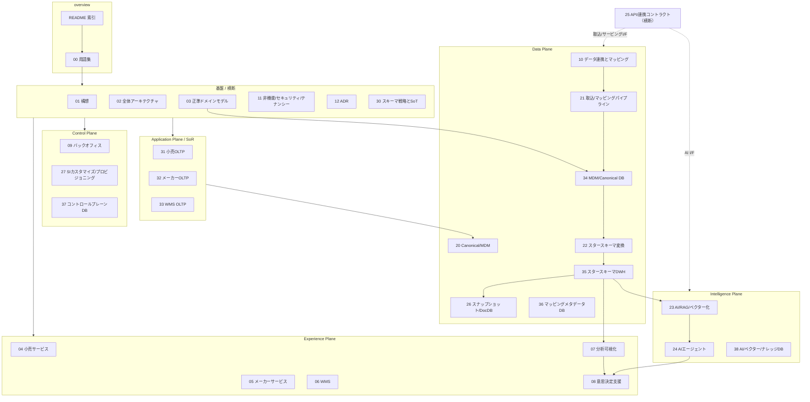
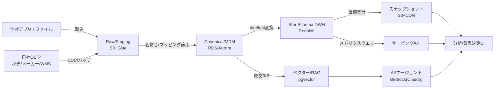
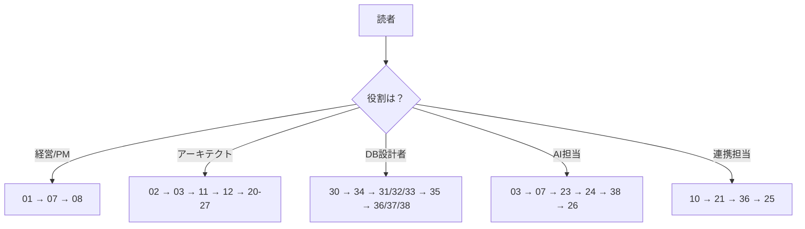
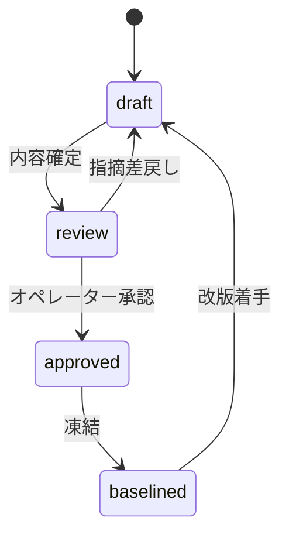

# SCIP プラットフォーム設計ドキュメント 索引

> **SCIP** = **S**upply **C**hain **I**ntelligence **P**latform（コード名。正式名称はオペレーター確定前）
> ステータス: `draft` / バージョン `0.1.0` / Phase 3-5 相当（PoC 前の設計フェーズ）

本ドキュメント群は、TSUNAGUBA が提供する **小売・メーカー・倉庫を横断的につなぐ SCM 分析基盤「SCIP」** のプラットフォーム設計一式です。既存の単一テナント実装 **akebono-honshu**（履物メーカー Honshu の生産・受発注・販売管理システム / .NET 8 + Nuxt 3 + RDS PostgreSQL）を**リファレンス実装 / 最初のメーカーテナント**と位置づけ、これをマルチテナント SaaS プラットフォームへ一般化する設計を扱います。

このページは全 31 本の**索引**であり、読み方・依存関係・読者別の推奨順序・全体ステータスを示します。テーブル定義や個別設計の権威的記述は各ドキュメントが所有します（本索引はテーブルを定義しません）。

---

## 1. プラットフォーム一言要約と背景

- **一言要約**: 小売・メーカー・倉庫の業務データを共通データ基盤に集約し、スタースキーマ + AI による**分析・可視化・意思決定支援**を提供するマルチテナント SaaS。
- **提供主体**: TSUNAGUBA。
- **ミッション**: 商品 × 地域 × 販売先を基本軸に、サプライチェーンを横断して「分析・可視化・意思決定支援」を届ける。**自社アプリ利用**（小売・メーカー・WMS）と**他社アプリ連携**（データ取込 + 人的マッピング → 正規化 → スタースキーマ化）の双方を受け入れる。
- **差別化の源泉**: 「分析サービスへの連携難易度の低さ」と「各分析機能の実現性」。自社アプリは最初からスタースキーマ連携前提のスキーマで設計する。
- **背景**: 単一テナントの Honshu 実装（tenant_id を一切持たない）を土台に、テナント分離・正準ドメインモデル・DWH・AI を積み上げてプラットフォーム化する。最大の移行ギャップは「tenant_id の全面導入」と「TZ 方針（JST-naive → TIMESTAMPTZ/UTC）」。

### サービスポートフォリオ

| 対象 | サービス | 中核 |
|------|---------|------|
| 小売 | クロスリテーラーサービス（自社） | 商品マスタ・商取引・売上/在庫の管理と分析（店舗 + EC） |
| メーカー | メーカー向けサービス（自社） | 商品マスタ・生産/発注/納品/売上/在庫の管理と分析 |
| 倉庫 | WMS（自社） | SKU マスタ・入出庫/在庫・出荷帳票・荷主請求 |
| 横断 | 分析・可視化 | スタースキーマ + AI（集計/分類/インデックス/ベクター/インサイト） |
| 横断 | 意思決定支援 + AI エージェント | バーチャルカンパニー（部門エージェント群） |
| 自社/クライアント | バックオフィス | 契約・稼働設定・請求・エンタイトルメント（コントロールプレーン） |
| 外部 | 他社サービス連携 | データ取込 + 人的マッピング → 正規化 → スタースキーマ化 |

---

## 2. ドキュメントマップ（全 31 本）

ディレクトリは 4 カテゴリ（`overview` / `basic-design` / `detailed-design` / `database-design`）。番号帯は **00 番台=overview、01-12=基本設計、20-27=詳細設計、30-38=DB設計**。各ドキュメントは §5 の「テーブル所有マップ」に従い、自分の owns のみを権威的に定義します。

### 2.1 overview（2 本）

| # | document_id | パス | 目的 |
|---|-------------|------|------|
| — | `readme` | [`README.md`](./README.md) | 本索引。読み方・ドキュメントマップ・全体ステータス |
| 00 | `glossary` | [`00-glossary.md`](./00-glossary.md) | 用語集 / ユビキタス言語。正準エンティティ名・略語・ドメイン用語の統一定義 |

### 2.2 basic-design（基本設計 / 12 本）

| # | document_id | パス | 目的 |
|---|-------------|------|------|
| 01 | `concept-vision` | [`basic-design/01-concept-and-vision.md`](./basic-design/01-concept-and-vision.md) | 構想と全体像。ビジョン・スコープ・ステークホルダー・提供価値 |
| 02 | `overall-architecture` | [`basic-design/02-overall-architecture.md`](./basic-design/02-overall-architecture.md) | 全体アーキテクチャ。5 プレーン構成・技術スタック・AWS 配置 |
| 03 | `canonical-domain-model` | [`basic-design/03-canonical-domain-model.md`](./basic-design/03-canonical-domain-model.md) | 正準ドメインモデル（概念）。Party/Product/Location/Region 等のユビキタス言語 |
| 04 | `service-retail` | [`basic-design/04-service-retail.md`](./basic-design/04-service-retail.md) | 小売（クロスリテーラー）サービスの基本設計 |
| 05 | `service-manufacturer` | [`basic-design/05-service-manufacturer.md`](./basic-design/05-service-manufacturer.md) | メーカーサービスの基本設計（Honshu 一般化） |
| 06 | `service-wms` | [`basic-design/06-service-wms.md`](./basic-design/06-service-wms.md) | WMS（倉庫管理）サービスの基本設計 |
| 07 | `service-analytics` | [`basic-design/07-service-analytics.md`](./basic-design/07-service-analytics.md) | 分析・可視化プラットフォームの基本設計 |
| 08 | `decision-support-ai` | [`basic-design/08-service-decision-support-ai.md`](./basic-design/08-service-decision-support-ai.md) | 意思決定支援 / AI エージェント（バーチャルカンパニー）の基本設計 |
| 09 | `service-backoffice` | [`basic-design/09-service-backoffice.md`](./basic-design/09-service-backoffice.md) | バックオフィス（コントロールプレーン）の基本設計 |
| 10 | `data-integration-mapping` | [`basic-design/10-data-integration-and-mapping.md`](./basic-design/10-data-integration-and-mapping.md) | データ連携とマッピングの基本設計（他社アプリ取込） |
| 11 | `nonfunctional-security-tenancy` | [`basic-design/11-nonfunctional-security-tenancy.md`](./basic-design/11-nonfunctional-security-tenancy.md) | 非機能 / セキュリティ / マルチテナンシーの基本設計 |
| 12 | `adr` | [`basic-design/12-architecture-decision-records.md`](./basic-design/12-architecture-decision-records.md) | アーキテクチャ決定記録（ADR）。技術選定の根拠 |

### 2.3 detailed-design（詳細設計 / 8 本）

| # | document_id | パス | 目的 |
|---|-------------|------|------|
| 20 | `canonical-mdm-detail` | [`detailed-design/20-canonical-mdm-and-entity-resolution.md`](./detailed-design/20-canonical-mdm-and-entity-resolution.md) | Canonical / MDM / 名寄せ（マッチング/マージ/ゴールデンレコード）の詳細設計 |
| 21 | `ingestion-mapping-pipeline` | [`detailed-design/21-ingestion-and-mapping-pipeline.md`](./detailed-design/21-ingestion-and-mapping-pipeline.md) | 取込とマッピングパイプライン（Raw → Staging → Canonical）の詳細設計 |
| 22 | `star-schema-transformation` | [`detailed-design/22-star-schema-transformation.md`](./detailed-design/22-star-schema-transformation.md) | スタースキーマ変換（Canonical → dim/fact、SCD、ロード）の詳細設計 |
| 23 | `ai-rag-vectorization` | [`detailed-design/23-ai-rag-and-vectorization.md`](./detailed-design/23-ai-rag-and-vectorization.md) | AI / RAG / ベクター化パイプラインの詳細設計 |
| 24 | `ai-agent-virtual-company` | [`detailed-design/24-ai-agent-and-virtual-company.md`](./detailed-design/24-ai-agent-and-virtual-company.md) | AI エージェント / バーチャルカンパニー（オーケストレーション/HITL）の詳細設計 |
| 25 | `api-integration-contracts` | [`detailed-design/25-api-and-integration-contracts.md`](./detailed-design/25-api-and-integration-contracts.md) | API / 連携コントラクト（REST/OpenAPI、取込 I/F、サービング）の詳細設計 |
| 26 | `snapshot-document-db` | [`detailed-design/26-snapshot-and-document-db.md`](./detailed-design/26-snapshot-and-document-db.md) | スナップショット / DocDB（事前集計静的ファイル、読み取りモデル）の詳細設計 |
| 27 | `si-customization-provisioning` | [`detailed-design/27-si-customization-and-provisioning.md`](./detailed-design/27-si-customization-and-provisioning.md) | SI カスタマイズ / プロビジョニング（フィーチャーフラグ/拡張項目/テナント作成）の詳細設計 |

### 2.4 database-design（DB スキーマ設計 / 9 本）

| # | document_id | パス | 目的 |
|---|-------------|------|------|
| 30 | `schema-strategy-sot` | [`database-design/30-schema-strategy-and-sot.md`](./database-design/30-schema-strategy-and-sot.md) | スキーマ戦略と SoT。命名/DDL 規約、RLS、TZ 方針の総則 |
| 31 | `oltp-retail-schema` | [`database-design/31-oltp-retail-schema.md`](./database-design/31-oltp-retail-schema.md) | 小売 OLTP スキーマ（`sales_transaction`、`store`/`ec_channel`、`retail_inventory` 等） |
| 32 | `oltp-manufacturer-schema` | [`database-design/32-oltp-manufacturer-schema.md`](./database-design/32-oltp-manufacturer-schema.md) | メーカー OLTP スキーマ（Honshu 18 マスタ + txn に tenant_id 導入） |
| 33 | `oltp-wms-schema` | [`database-design/33-oltp-wms-schema.md`](./database-design/33-oltp-wms-schema.md) | WMS OLTP スキーマ（`sku_master`、bin 在庫、入出庫、荷主請求） |
| 34 | `mdm-canonical-schema` | [`database-design/34-mdm-canonical-schema.md`](./database-design/34-mdm-canonical-schema.md) | MDM / Canonical スキーマ（`canonical_party/product/sku/location`、`region`、各 xref） |
| 35 | `star-schema-dwh` | [`database-design/35-star-schema-dwh.md`](./database-design/35-star-schema-dwh.md) | スタースキーマ DWH（全 `dim_*`/`fact_*`、Redshift DISTKEY/SORTKEY） |
| 36 | `mapping-metadata-schema` | [`database-design/36-mapping-metadata-schema.md`](./database-design/36-mapping-metadata-schema.md) | マッピングメタデータ（`source_*`、`mapping_rule`、`data_lineage`、`load_run`） |
| 37 | `control-plane-backoffice-schema` | [`database-design/37-control-plane-backoffice-schema.md`](./database-design/37-control-plane-backoffice-schema.md) | コントロールプレーン / バックオフィス（`tenant`、`app_user`、`contract`、`audit_logs` 等） |
| 38 | `ai-vector-knowledge-schema` | [`database-design/38-ai-vector-knowledge-schema.md`](./database-design/38-ai-vector-knowledge-schema.md) | AI / ベクター / ナレッジ（`kb_*`、`agent_*`、`insight`、DocDB アイテム形状） |

> **合計 = 2 (overview) + 12 (basic-design) + 8 (detailed-design) + 9 (database-design) = 31 本**（README を含む）。

---

## 3. ドキュメント依存関係とプレーン対応

SCIP は論理 **5 プレーン**（Experience / Application(SoR) / Control / Data / Intelligence）で構成されます。基本設計がプレーンごとの構想を、詳細設計がパイプライン/コントラクトを、DB 設計が各プレーンのスキーマを担います。

### 3.1 プレーンとドキュメントの対応

### 3.2 データフローの背骨（SoT → 派生）

> **原則**: SoT 側書込を先行、キャッシュ/派生は後追い（逆順は不整合の温床）。詳細な SoT マップは §4 と各 DB 設計ドキュメント（30-38）を参照。

---

## 4. 読者別の推奨読み順

| 読者 | 目的 | 推奨読み順 |
|------|------|-----------|
| 経営 / PM | 構想・提供価値・スコープの把握 | `README` → `00 用語集` → `01 構想` → `07 分析可視化` → `08 意思決定支援` → `11 非機能`（該当節）|
| アーキテクト | 全体構造・技術選定・非機能の把握 | `README` → `02 全体アーキテクチャ` → `03 正準ドメインモデル` → `11 非機能/テナンシー` → `12 ADR` → 各詳細設計 `20`-`27` |
| DB 設計者 | スキーマ・SoT・DDL 規約の把握 | `README` → `30 スキーマ戦略とSoT` → `34 MDM/Canonical` → `31`/`32`/`33` OLTP → `35 DWH` → `36`/`37`/`38` |
| AI 担当 | RAG / エージェント / ベクターの把握 | `README` → `03 正準ドメインモデル` → `07 分析可視化` → `23 AI/RAG` → `24 AIエージェント` → `38 AI/ベクターDB` → `26 スナップショット/DocDB` |
| 連携（他社アプリ）担当 | 取込 I/F とマッピングの把握 | `README` → `10 データ連携` → `21 取込パイプライン` → `36 マッピングメタデータ` → `25 API/連携コントラクト` |

---

## 5. 確定事項サマリと SoT マップ

本ドキュメント群は**共有ファウンデーション・ブリーフ**（設計判断の Single Source of Decisions）に従います。主要な確定事項は以下（詳細は各ドキュメント）。

### 5.1 主要確定事項

| 領域 | 確定事項 | 一次ソース |
|------|---------|-----------|
| プレーン構成 | Experience / Application(SoR) / Control / Data / Intelligence の論理 5 層 | `02` / `11` |
| マルチテナント | ハイブリッド（Pooled=共有DB+RLS / Silo=スキーマ/DB分離）。全テナントスコープ表に `tenant_id BIGINT NOT NULL`、`SET app.tenant_id` で RLS 強制。一意制約は先頭に tenant_id | `11` / `30` |
| 正準ドメイン | Party（1社=複数ロール）/ Product 2 層（family/SKU）/ Location（type別）/ Region（動的粒度）。正準版は MDM(34) が所有 | `03` / `34` |
| スタースキーマ | Kimball 準拠、Conformed Dimension 共有、SCD Type2。`dim_*`/`fact_*` は DWH(35) が所有 | `22` / `35` |
| AI | RAG 主軸。埋め込み/LLM は Amazon Bedrock（Anthropic Claude）。数値は DWH/メトリクス層から取得しハルシネーション抑制。テナント境界を厳守 | `23` / `24` / `38` |
| 技術スタック | 継承: Nuxt 3 + .NET 8 + RDS PostgreSQL 16 + Firebase Auth + AWS Tokyo。拡張: Redshift Serverless / pgvector on Aurora / DynamoDB / S3+CloudFront / Bedrock | `02` / `12` |
| TZ 方針 | プラットフォーム標準は `TIMESTAMPTZ`（UTC 保存 / テナントローカル表示）。継承実装は JST-naive `TIMESTAMP` のため 32 が移行差分を明記 | `12` / `30` / `32` |
| API 規約 | REST + OpenAPI 3.0、`/api/v1/<複数形 kebab>`、Firebase Bearer、RFC 7807 Problem Details、`{data, meta}` エンベロープ、`Idempotency-Key` | `25` |
| エラーコード | `DOMAIN-NNN`（3 桁ゼロ埋め）。新規: TEN/RTL/WMS/ANL/ETL/AI/CMN/MAP。継承: AUTH/PROD/ORDER 等を尊重 | 各ドキュメント |

### 5.2 データストア SoT マップ（抜粋）

| データ | ストア | SoT | 派生/キャッシュ |
|------|--------|-----|----------------|
| 業務トランザクション/マスタ | RDS PostgreSQL（OLTP） | 各アプリ OLTP | — |
| Canonical/MDM（ゴールデンレコード） | RDS/Aurora PostgreSQL | Canonical DB | OLTP から |
| Star Schema DWH | Redshift Serverless | 派生（Canonical/Raw 由来） | — |
| スナップショット | S3(Parquet/JSON)+CDN | 派生（DWH 由来） | ○ |
| ベクター/埋め込み | pgvector on Aurora | 派生（原文/KB 由来） | ○ |
| 認証情報（UID/Email） | Firebase Authentication | SoT | — |
| ユーザ業務情報/権限 | RDS（Control Plane） | SoT | Custom Claims=キャッシュ |
| 監査ログ | RDS(append-only)→S3 Glacier IR | SoT | — |

> 完全な SoT マップは各 DB 設計ドキュメント（特に `30 スキーマ戦略とSoT`）を参照。

---

## 6. ステータスと版管理方針

| 項目 | 値 |
|------|-----|
| ステータス | `draft`（PoC 前 / **オペレーター確定前**）|
| フェーズ | Phase 3-5 相当（構想〜基本〜詳細設計）|
| バージョン | `0.1.0`（全ドキュメント共通の初版）|
| 出力言語 | 日本語 |
| 対象読者 | 日本の SIer / 事業会社のエンジニア・PM・オペレーター |

### 版管理方針

- 各ドキュメントは冒頭 YAML フロントマターに `version` / `status` を持つ。**プラットフォーム全体で版を揃える**（初版は全て `0.1.0`）。
- ステータス遷移: `draft` → `review`（レビュー中）→ `approved`（オペレーター承認）→ `baselined`（凍結）。承認は本設計群の外にあるオペレーター判断で行う。
- 変更時は該当ドキュメントの `version` を SemVer で更新し、影響する兄弟ドキュメント（`related`）を**全件チェック**して整合させる（CLAUDE.md 開発原則 5「コードとドキュメントの一貫性」）。
- 正準エンティティ名・テーブル所有・命名規約はファウンデーション・ブリーフを唯一の決定源とし、各ドキュメントで再定義・命名ブレを起こさない。

---

## 未決事項 / 論点

本索引レベルの未決事項。個別の論点は各ドキュメントの「未決事項 / 論点」節に集約されます。

| # | 論点 | 選択肢 / トレードオフ | 一次議論先 |
|---|------|---------------------|-----------|
| R-1 | プラットフォーム正式名称 | コード名 SCIP は仮。正式名称はブランディング/商標確認を経てオペレーターが確定 | `01 構想` |
| R-2 | ドキュメント最終確定の承認主体 | 現状 `draft`。承認プロセス（誰が `approved` を付与するか）が未定 | 本索引 / 運用 |
| R-3 | ファイル名の最終確定 | 本索引のパスは設計時の想定命名。実ファイル名は各ドキュメント作成時に確定し、差異があれば本索引を更新 | 本索引 |
| R-4 | DWH エンジンの最終選定 | Redshift Serverless（主）か S3+Iceberg+Athena（代替）か。コスト/性能/運用で判断 | `12 ADR` / `35 DWH` |
| R-5 | ベクター基盤の規模判断 | pgvector on Aurora（主）か OpenSearch（大規模代替）か。データ量で切替閾値を要定義 | `12 ADR` / `38 AI DB` |
| R-6 | DocDB 選定 | DynamoDB（主）か Firestore（Firebase 資産活用の代替）か | `12 ADR` / `26` / `38` |

---

## 関連ドキュメント

- [`00-glossary.md`](./00-glossary.md) — 用語集 / ユビキタス言語（正準エンティティ名の統一定義）
- [`basic-design/02-overall-architecture.md`](./basic-design/02-overall-architecture.md) — 全体アーキテクチャ（5 プレーン詳細）
- [`basic-design/11-nonfunctional-security-tenancy.md`](./basic-design/11-nonfunctional-security-tenancy.md) — 非機能 / セキュリティ / マルチテナンシー
- [`basic-design/12-architecture-decision-records.md`](./basic-design/12-architecture-decision-records.md) — アーキテクチャ決定記録（技術選定の根拠）
- [`database-design/30-schema-strategy-and-sot.md`](./database-design/30-schema-strategy-and-sot.md) — スキーマ戦略と SoT（命名/DDL 規約の総則）
- 全ドキュメントの一覧は §2 ドキュメントマップを参照
