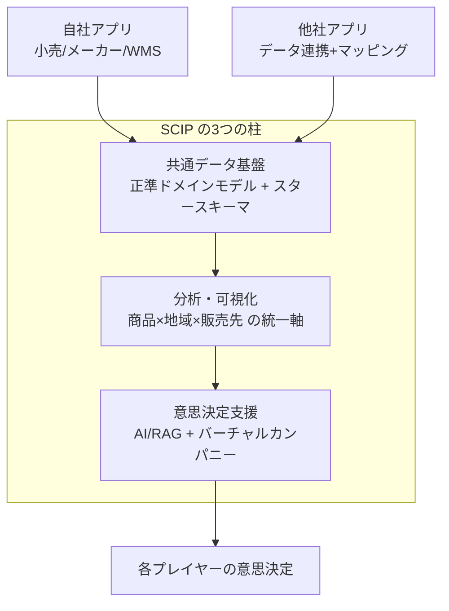
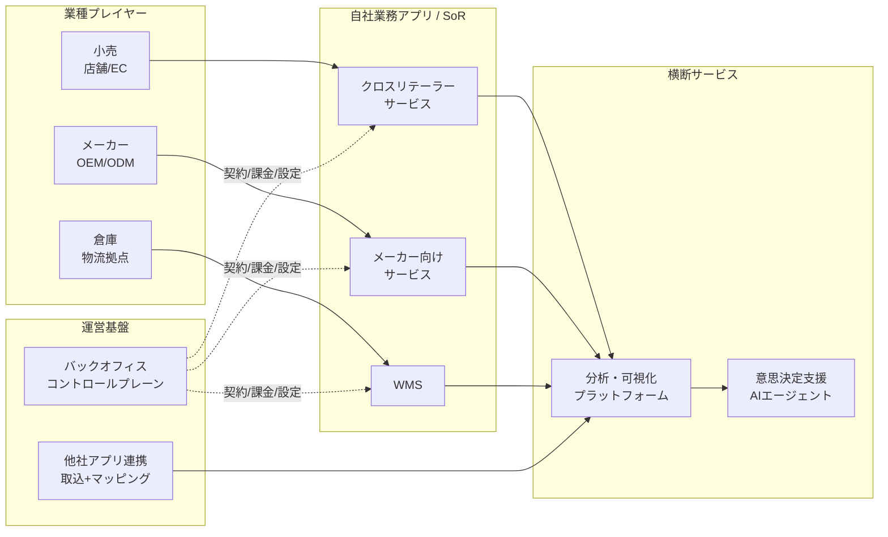
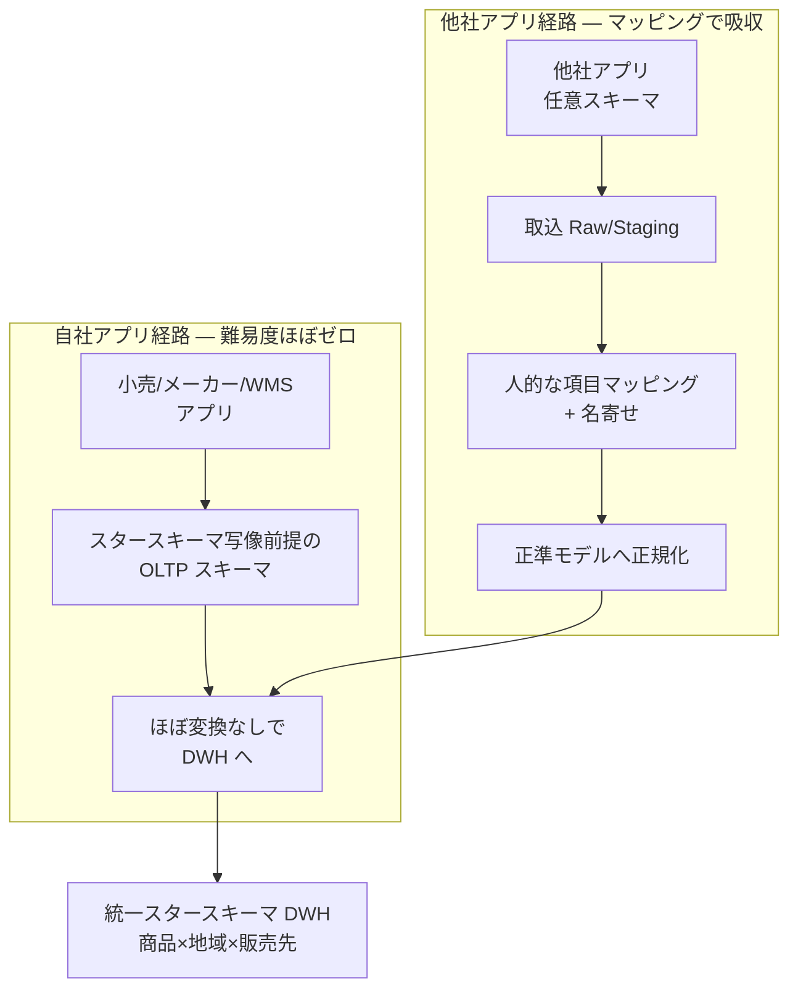
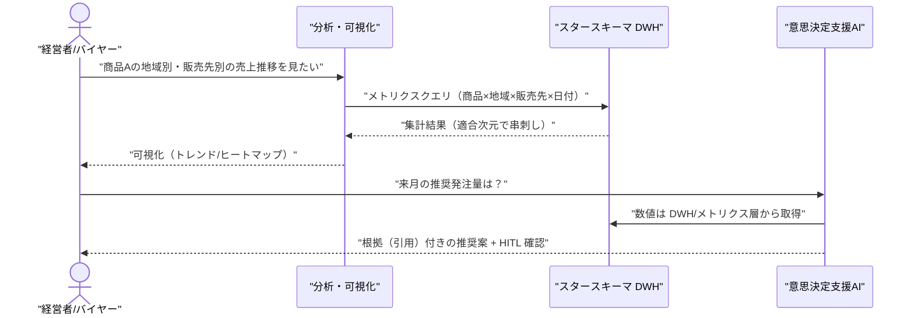
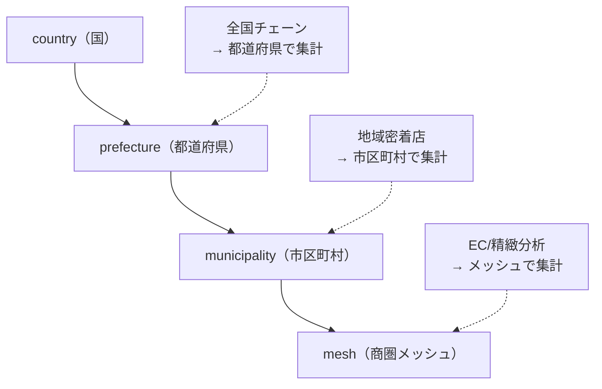
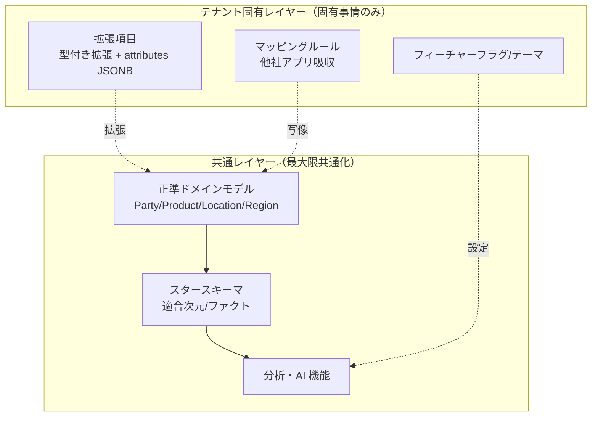
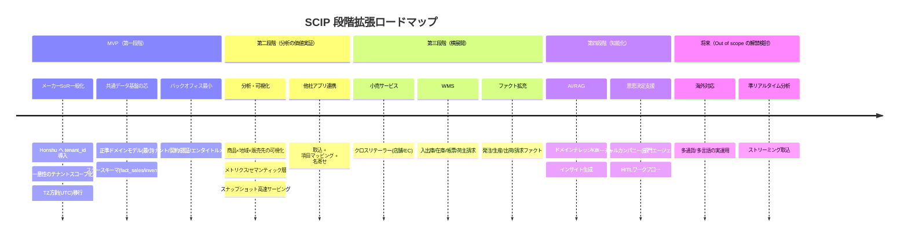

# 基本設計: 構想と全体像

本書は **SCIP（Supply Chain Intelligence Platform、コード名。正式名称は未確定）** の最上位の設計ドキュメントであり、
プラットフォームが「何を・誰のために・なぜ」提供するのかを定義する。以降の全設計ドキュメント（全体アーキテクチャ、
正準ドメインモデル、各サービス設計、データベース設計）は、本書が定めた構想・スコープ・優先順位を前提とする。

> 位置づけ: 本書は構想・ビジョン・スコープ・ロードマップを**権威的に所有**する。アーキテクチャの具体は
> [全体アーキテクチャ](./02-overall-architecture.md)、共通エンティティの定義は
> [正準ドメインモデル](./03-canonical-domain-model.md)、分析基盤の詳細は
> [分析・可視化サービス](./07-analytics-visualization.md) が所有する。本書はそれらを参照し、再定義しない。

---

## 1. 事業ドメインとビジョン

### 1.1 出発点 — リファレンス実装 Honshu

本プラットフォームの原点は、履物・ホームウェア OEM/ODM メーカー **Honshu** 向けに構築された単一テナント基幹システム
`akebono-honshu`（.NET 8 + Nuxt 3 + RDS PostgreSQL）である。このシステムが解決した真の課題は、
[Phase 1 真の課題](../../../.ai-native/outputs/phase1/true-problem.md) で言語化されている:

> 生産管理・販売管理・受発注の3基幹システムが **ファイル受け渡し** でしか連携できておらず、
> 商品マスタや取引データの **二重・三重入力** がオペレータの時間を深刻に消耗させている。

Honshu 実装はこの課題を「共通データ基盤上での業務統合」で解決した。SCIP はこの成功パターンを
**1社の中の分断（システム間分断）の解消**から、**サプライチェーン全体の分断（企業間・業種間分断）の解消**へと一般化する。

### 1.2 ビジョン

> **小売・メーカー・倉庫を横断的につなぎ、共通データ基盤の上で「分析・可視化・意思決定支援」を提供する。**

サプライチェーンは「作る（メーカー）」「運ぶ・保管する（倉庫）」「売る（小売）」の連鎖であり、
各プレイヤーは自分の領域しか見えていない。SCIP は各プレイヤーの業務データを共通のデータ構造に写像し、
**商品 × 地域 × 販売先** という統一された軸で全体を俯瞰・分析できる基盤を提供する。

自社アプリ（後述のサービスポートフォリオ）の利用と、他社アプリからのデータ連携の**双方**を受け入れ、
すべてを同一のスタースキーマ（分析用の定型スキーマ）へ集約する。個社最適で分断されたデータを
「つなぐ場（TSUNAGUBA が提供する場）」がプラットフォームの本質である。

### 1.3 ミッションを支える3つの柱

- **共通データ基盤**: 業種横断の正準エンティティ（Party/Product/Location/Region 等）とスタースキーマ。詳細は [正準ドメインモデル](./03-canonical-domain-model.md)。
- **分析・可視化**: 統一軸での集計・比較・トレンド分析。詳細は [分析・可視化サービス](./07-analytics-visualization.md)。
- **意思決定支援**: 分析結果を起点に、AIエージェント群（バーチャルカンパニー）が意思決定を支援する。

---

## 2. ステークホルダーとサービスポートフォリオ

SCIP は複数の業種プレイヤーに対し、業務アプリ（System of Record）と横断サービス（分析・意思決定支援）を提供する。
各プレイヤーは自社開発アプリを使うか、既存の他社アプリを連携させるかを選べる。

### 2.1 サービスポートフォリオ俯瞰

### 2.2 サービス一覧

| 対象 | サービス | 提供形態 | 中核機能 |
|------|---------|---------|---------|
| 小売 | クロスリテーラーサービス | 自社開発 | 商品マスタ管理、商取引トランザクション、売上/在庫の管理と分析。店舗経営と EC の両対応 |
| メーカー | メーカー向けサービス | 自社開発 | 商品マスタ管理、生産/発注/納品/売上/在庫のトランザクション管理と分析（Honshu を一般化） |
| 倉庫 | WMS | 自社開発 | SKU マスタ管理、入出庫/在庫トランザクション、出荷作業帳票出力、荷主への請求管理 |
| 横断 | 分析・可視化プラットフォーム | 自社開発 | スタースキーマ + AI（集計/分類/インデックス化/ベクター化/インサイト） |
| 横断 | 意思決定支援 + AIエージェント | 自社開発 | バーチャルカンパニー化（部門エージェント群による意思決定支援） |
| 運営/任意でクライアント | バックオフィス | 自社開発 | 契約・稼働設定・請求・エンタイトルメント（コントロールプレーン）。分析も自社利用するため連携対象 |
| 外部 | 他社開発サービス連携 | 連携 | データ取込 + 人的な項目マッピング → 正規化 → スタースキーマ化 |

> 各サービスの業務設計は基本設計 04〜10、データベース設計は 31〜38 が所有する。本書はポートフォリオの全体像のみを定義する。

---

## 3. 差別化戦略

SCIP の競合は「BI ツール」「ETL/iPaaS」「業種別業務パッケージ」「データウェアハウス基盤」であるが、
それらは「箱（インフラ・道具）」を提供するに留まり、**サプライチェーン分析に必要なデータ構造の設計とマッピングは利用者任せ**である。
SCIP の差別化の源泉は次の2点に集約される。

### 3.1 差別化の2つの源泉

| 源泉 | 内容 | なぜ他社が真似しにくいか |
|------|------|----------------------|
| **① 分析連携の難易度の低さ** | データを分析基盤に載せるまでのコスト（設計・マッピング・変換）を極小化する | 自社アプリは最初からスタースキーマ写像前提で設計。他社アプリ向けにはマッピング資産を蓄積 |
| **② 各分析機能の実現性** | 「商品×地域×販売先」の統一軸と正準ドメインモデルにより、意味のある分析が実際に動く | 業種横断の正準モデルとナレッジベースは一朝一夕には構築できない |

### 3.2 「連携の難易度」を下げる二段構え

- **自社アプリ = スタースキーマ前提設計**: 小売/メーカー/WMS の各 OLTP は、DWH のディメンション・ファクトへ
  ほぼ機械的に写像できるスキーマとして最初から設計する（正準ドメインモデルとの整合を DDL レベルで担保）。
  これにより「分析に載せるための後付け変換」がほぼ不要になり、連携難易度が構造的に低い。
- **他社アプリ = マッピング連携**: 他社アプリは任意のスキーマを持つため、取込 → 人的な項目マッピング → 名寄せ →
  正準モデルへの正規化 → スタースキーマ化、という経路で吸収する。この経路の設計は
  [データ連携とマッピング](./10-data-integration-mapping.md) が所有する。

> 重要: 自社アプリ経路と他社アプリ経路は**最終的に同一のスタースキーマ**に合流する。
> 分析・AI 機能は合流地点（DWH + セマンティック層）に対して構築されるため、データ源が自社か他社かを意識しない。

### 3.3 分析機能の「実現性」を担保する要素

- 業種横断の**正準ドメインモデル**（Party/Product/Location/Region）が、異なるプレイヤーのデータを同じ意味空間に置く。
- **Conformed Dimension（適合次元）** により、売上・在庫・発注・生産・出荷・請求の各ファクトが同じ商品/地域/販売先で串刺し分析できる。
- 業界・クライアント固有の**ドメインナレッジ**を蓄積し、RAG（検索拡張生成）で分析・インサイト生成に活用する。

---

## 4. 主要ペルソナと利用シーン

SCIP の利用者は業種プレイヤーの現場担当から経営者、そして運営側オペレーターまで多層にわたる。

| ペルソナ | 所属 | 主な利用シーン | 主に使うサービス |
|---------|------|--------------|----------------|
| 小売バイヤー | 小売 | 商品別・地域別の売れ筋を把握し、仕入・発注量を判断する | 分析・可視化 / クロスリテーラー |
| 店長 | 小売（店舗） | 自店舗の売上・在庫を確認し、品揃え・補充を判断する | クロスリテーラー / 分析 |
| EC 担当 | 小売（EC） | オンライン販売の実績を店舗と横断比較し、チャネル戦略を練る | クロスリテーラー / 分析 |
| 生産管理担当 | メーカー | 商品マスタ〜発注〜生産〜在庫を一元管理し、二重入力を排除する（Honshu の実ユーザ） | メーカー向けサービス |
| 営業担当 | メーカー | 販売先別の受注・売上動向を把握し、提案に活かす | メーカー向けサービス / 分析 |
| 倉庫オペレータ | 倉庫 | 入出庫作業・帳票出力・在庫確認を行う | WMS |
| 荷主 | 倉庫の顧客 | 委託在庫・出荷状況・請求内容を確認する | WMS / 分析 |
| 経営者 | 各プレイヤー | 全社横断の KPI と AI インサイトで意思決定する | 分析・可視化 / 意思決定支援 |
| 運営オペレーター | TSUNAGUBA | テナント契約・課金・SI 設定・マッピング整備・監査を行う | バックオフィス |

> 現時点の実ユーザ知見はメーカー（Honshu 生産管理部）に厚く、小売・倉庫のペルソナは仮説を含む。
> [プロジェクトスポンサーペルソナ](../../../.ai-native/domain-context/persona/project-sponsor-persona.md) の委任境界に従い、
> 各業種の実ユーザヒアリングを段階的に実施して精緻化する（→ 未決事項 D-1）。

### 4.1 代表的な利用シーン（クロスプレイヤー分析）

> ハルシネーション抑制の原則（ブリーフ §12）に従い、**数値は DWH/メトリクス層から取得し LLM に生成させない**。

---

## 5. 分析の基本軸とオプション取込

### 5.1 基本軸 — 商品 × 地域 × 販売先

SCIP の分析は3つの基本軸で構成される。これはスタースキーマの適合次元に直接対応する。

| 軸 | 対応ディメンション | 内容 |
|----|------------------|------|
| 商品 | `dim_product` | SKU 粒度。family/category/brand/season/type/size/color/material の階層属性で集計 |
| 地域 | `dim_region` | country > prefecture（都道府県）> municipality（市区町村）> mesh の**動的粒度**階層 |
| 販売先 | `dim_customer` / `dim_channel` | 販売先（顧客）とチャネル（店舗/EC/卸） |

> ディメンション・ファクトの権威的定義は [DWH スタースキーマ設計](../database-design/35-star-schema-dwh.md) が所有する。
> 本書は分析の「考え方」を示すに留め、テーブルは再定義しない。

### 5.2 地域の動的粒度

地域軸はクライアントの商売規模に応じて集計粒度を切り替える。全国展開の小売なら都道府県、
地域密着なら市区町村、EC 中心ならメッシュ（商圏メッシュ）といった具合に、`dim_region` の `level` 属性で制御する。

### 5.3 オプション取込の考え方

基本軸（商品×地域×販売先）は全クライアント共通の必須軸である。それに加えて、クライアント固有の
有効データ（例: 天候、イベント、独自の顧客セグメント、キャンペーン属性）は**オプションとして取り込む**。

- オプションデータは正準モデルの拡張（型付き拡張テーブル + `attributes JSONB`、または DocDB）として扱う（ブリーフ §9/§14）。
- オプション軸を追加してもコアの分析（基本軸）は影響を受けない。段階的に軸を増やせる設計とする。
- 取込の可否・マッピングは SI（システムインテグレーション）フェーズで判断する（→ §6）。

---

## 6. 共通化と SI 戦略

SCIP は「共通化できる部分は最大限共通化し、固有事情のみカスタマイズする」を SI の基本方針とする。
これは開発原則3（既存パターンの再利用）と原則6（データフロー整合性 / 共通汎用データ構造を土台）に基づく。

### 6.1 共通汎用データ構造を土台にする

- **土台 = 共通汎用データ構造**: 全テナント・全業種が共有する正準モデルとスタースキーマ。ここは作り込まない（設定で吸収）。
- **カスタマイズ = 固有事情のみ**: テナント固有の拡張項目・フィーチャーフラグ・テーマ・マッピングルールで対応する。
  スキーマ本体を分岐させず、設定とメタデータで差分を吸収する。

### 6.2 マルチテナンシーが共通化を支える

共通化は技術的にはマルチテナンシー（ブリーフ §6）で担保される。詳細は
[非機能・セキュリティ・テナンシー](./11-nonfunctional-security-tenancy.md) が所有するが、本書に関わる要点:

- 標準は **Pooled（共有 DB・共有スキーマ + `tenant_id` + RLS）**、大規模/高分離要件は **Silo**。同一 DDL を保つ。
- 一意性制約はすべてテナントスコープ（`UNIQUE(tenant_id, ...)`）。
- リファレンス実装 Honshu には `tenant_id` が存在しない点が最大の移行ギャップであり、
  メーカー OLTP 設計で `tenant_id` 導入・TZ 方針・一意性のテナントスコープ化を差分として扱う。

---

## 7. スコープとロードマップ

### 7.1 スコープ方針

SCIP は「一気に全業種・全機能を作る」のではなく、**リファレンス実装 Honshu の一般化を起点に段階拡張**する。
MVP は「Honshu をマルチテナント化し、分析基盤に接続する」ことに絞る。

#### In Scope（本プラットフォームで実現する）

- 小売/メーカー/WMS の自社業務アプリ（SoR）とその一般化
- 共通データ基盤（正準ドメインモデル + スタースキーマ DWH）
- 分析・可視化（商品×地域×販売先の統一軸）
- 意思決定支援 + AIエージェント（バーチャルカンパニー）
- 他社アプリのデータ取込 + 項目マッピング + 名寄せ
- バックオフィス（契約・課金・エンタイトルメント・SI 設定）
- マルチテナンシー（Pooled/Silo ハイブリッド、RLS）

#### Out of Scope（本プラットフォームでは想定しない）

- **物流実行の最適化エンジン**（配車・ルート最適化・WMS のマテハン制御）。WMS は在庫・帳票・請求管理に留める。
- **会計・給与などの基幹バックオフィス業務**（財務会計/人事）。請求は行うが会計仕訳・決算は範囲外。
- **EC フロント/POS レジそのものの提供**。SCIP は EC/POS の**データを取り込む**が、販売チャネル UI 自体は作らない。
- **海外展開（多通貨実運用・多言語ローカライズ）は初期段階では非対応**。設計上は Currency/TZ を UTC・多通貨対応可能に保つが、
  実運用は国内（JST 表示・JPY 主）を優先する（スポンサーの「国内だけ MVP、海外は後回し」判断に整合）。
- **リアルタイムストリーミング分析（秒単位の即時集計）**。分析は日次バッチ + スナップショットを基本とし、準リアルタイムは段階拡張。

### 7.2 ロードマップ

> このロードマップは方針であり、各段階の詳細スケジュールは PoC 検証結果を受けて確定する（→ 未決事項 D-2）。
> MVP は [Phase 1 真の課題](../../../.ai-native/outputs/phase1/true-problem.md) の「生産管理↔受発注の統合」を
> プラットフォーム文脈で再解釈し、「メーカー SoR の一般化 + 分析基盤接続」を第一の検証実装とする。

---

## 8. ビジネス上の主要リスクと前提

### 8.1 主要リスク

| ID | リスク | 影響 | 緩和策 |
|----|-------|------|-------|
| R-1 | 他社アプリのデータ品質・マッピングコストが想定を超える | 連携難易度の低さ（差別化①）が損なわれる | マッピング資産の蓄積・再利用、DQ ルール（データ品質検証）、人的レビューの記録化（[マッピング設計](./10-data-integration-mapping.md)） |
| R-2 | 正準モデルが特定業種（履物メーカー）に引きずられ汎用性を欠く | 小売/倉庫展開時に破綻・大改修 | 業種横断の正準モデルを先に固め、Honshu はその一実装として写像（[正準ドメインモデル](./03-canonical-domain-model.md)） |
| R-3 | 実ユーザ知見がメーカーに偏り、小売/倉庫のペルソナ・要件が仮説のまま | 誤った機能への投資 | 段階拡張で各業種の実ユーザヒアリングを先行実施（→ D-1） |
| R-4 | Honshu 実装の技術的負債（tenant_id 不在・JST-naive TS・日本語VARCHARステータス）の移行難度 | 移行遅延・データ不整合 | 差分を明示設計し下位互換パッチを用意（ブリーフ §6/§9、原則7 データ保護） |
| R-5 | AI インサイトのハルシネーション（誤った数値提示） | 意思決定の誤誘導・信頼喪失 | 数値は DWH/メトリクス層から取得、LLM に生成させない。出力に根拠引用・HITL（ブリーフ §12） |
| R-6 | マルチテナント境界の破れ（テナント間データ漏洩） | 致命的なセキュリティ事故 | RLS 強制 + テナントクレーム突合 + RAG のテナントスコープ厳守（[非機能・テナンシー](./11-nonfunctional-security-tenancy.md)） |
| R-7 | 分析の「実現性」が期待に届かず価値実証に失敗 | プラットフォーム事業の停滞 | MVP で fact_sales/inventory に絞り、早期に価値検証（§7 ロードマップ第二段階） |

### 8.2 前提

- 提供主体は TSUNAGUBA。最初のメーカーテナントは Honshu（リファレンス実装）。
- 技術スタックは Honshu の継承基盤（.NET 8 + Nuxt 3 + RDS PostgreSQL）を土台に、プラットフォーム拡張
  （Redshift Serverless / pgvector / DynamoDB / Bedrock 等）を加える（ブリーフ §4、[技術スタック決定](../../../.ai-native/outputs/phase4/tech-stack-decision.md)）。
- インフラは AWS 東京リージョン（ap-northeast-1）。国内利用を前提とし、データ境界は国内に保つ。
- 本設計は PoC 前の設計フェーズ（Phase 3-5 相当）であり、数値目標（二重入力削減量・分析利用率等）は
  MVP 検証時に実測する（Phase 1 ゲート G-3 に整合）。

---

## 9. 想定エラーコード

本書は構想ドキュメントであり固有の実装は持たないが、構想上の境界・スコープに関わる代表的なエラー種別を、
共通レジストリ（ブリーフ §10、`DOMAIN-NNN` 形式）に沿って例示する。実際の付番は各機能ドキュメントが確定する。

| コード | 意味 | 発生する構想上の文脈 |
|--------|------|-------------------|
| `CMN-001` | スコープ外機能の要求 | Out of scope（§7.1）に該当する機能が要求された |
| `TEN-001` | テナント未解決/契約未締結 | エンタイトルメント外のサービスへアクセス |
| `TEN-002` | エンタイトルメント（利用権）不足 | 契約プランに含まれないサービス/軸の利用 |
| `MAP-001` | 未マッピングのソース項目 | 他社アプリ取込で正準属性に写像されない項目が存在 |
| `ANL-001` | 未定義の分析軸/メトリクス | 基本軸・オプション軸のいずれにも定義がない分析要求 |
| `AI-001` | 数値をDWH/メトリクス層から取得できずインサイト生成不可 | ハルシネーション抑制ガードレールにより生成拒否 |

> `CMN`/`TEN`/`MAP`/`ANL`/`AI` は新規ドメイン接頭辞（ブリーフ §10）。逆引き一覧は各所有ドキュメントで整備する。

---

## 10. SoT 宣言

本書が権威的に所有する情報の Source of Truth を明示する。

| 情報 | SoT | 備考 |
|------|-----|------|
| プラットフォーム構想・ビジョン・ミッション | 本書（§1） | 上位方針。他ドキュメントは参照する |
| サービスポートフォリオの全体像 | 本書（§2） | 各サービスの詳細設計は 04〜10 が所有 |
| 差別化戦略 | 本書（§3） | — |
| スコープ（In/Out）・ロードマップ | 本書（§7） | 各段階の詳細スケジュールは別途 |
| ビジネスリスク・前提 | 本書（§8） | 技術リスクは各設計ドキュメントが詳細化 |
| 正準エンティティの定義 | [正準ドメインモデル](./03-canonical-domain-model.md) | 本書は概念参照のみ、再定義しない |
| スタースキーマのテーブル定義 | [DWH 設計](../database-design/35-star-schema-dwh.md) | 本書は軸の考え方のみ |
| アーキテクチャ（5プレーン）の具体 | [全体アーキテクチャ](./02-overall-architecture.md) | 本書は3つの柱として概観のみ |
| データストア別 SoT マップ | ブリーフ §5 / [全体アーキテクチャ](./02-overall-architecture.md) | 本書は個別データの SoT を再定義しない |

---

## 未決事項 / 論点

| ID | 論点 | 選択肢とトレードオフ | 現時点の傾き |
|----|------|-------------------|------------|
| D-1 | 小売・倉庫の実ユーザペルソナが仮説段階 | (a) 段階拡張前に各業種ヒアリングを先行 / (b) メーカー MVP を先に出し、実データで学習 | (b) を主とし、第三段階着手前に (a) を差し込む |
| D-2 | 各ロードマップ段階の期間・体制が未確定 | (a) 四半期固定 / (b) 各段階の PoC ゲート通過で次段階へ | (b)（Phase ゲート方式、方法論に整合） |
| D-3 | 正式名称（SCIP はコード名） | オペレーター確定事項（ブリーフ §1） | 未確定。設計中は SCIP を使用 |
| D-4 | 海外対応の解禁時期 | (a) 需要が出たら / (b) 第三段階完了を条件に検討 | Out of scope 継続、設計は多通貨/UTC で将来対応可能に保つ |
| D-5 | 分析基本軸「販売先」を `dim_customer` と `dim_channel` のどちらを主軸にするか | (a) 顧客主軸 / (b) チャネル主軸 / (c) 両立（適合次元で串刺し） | (c)。詳細は [DWH 設計](../database-design/35-star-schema-dwh.md) で確定 |
| D-6 | オプション取込データの標準化範囲 | (a) 都度個別マッピング / (b) 業界共通のオプション軸カタログを整備 | 段階的に (b) へ。マッピング資産蓄積（R-1 緩和と連動） |

---

## 関連ドキュメント

- [全体アーキテクチャ](./02-overall-architecture.md) — 5プレーン論理アーキテクチャ、データフロー、SoT マップの具体（`overall-architecture`）
- [正準ドメインモデル](./03-canonical-domain-model.md) — Party/Product/Location/Region 等の共通エンティティ定義（`canonical-domain-model`）
- [分析・可視化サービス](./07-analytics-visualization.md) — 商品×地域×販売先の分析機能、メトリクス/セマンティック層（`service-analytics`）
- [非機能・セキュリティ・テナンシー](./11-nonfunctional-security-tenancy.md) — マルチテナンシー方式・RLS・非機能要件
- [データ連携とマッピング](./10-data-integration-mapping.md) — 他社アプリ取込・項目マッピング・名寄せ
- [Phase 1 真の課題](../../../.ai-native/outputs/phase1/true-problem.md) — リファレンス実装 Honshu が解いた原点課題
- [プロジェクトスポンサーペルソナ](../../../.ai-native/domain-context/persona/project-sponsor-persona.md) — 業務知見の代理提供者と委任境界
- [技術スタック決定](../../../.ai-native/outputs/phase4/tech-stack-decision.md) — 継承技術スタックの根拠
