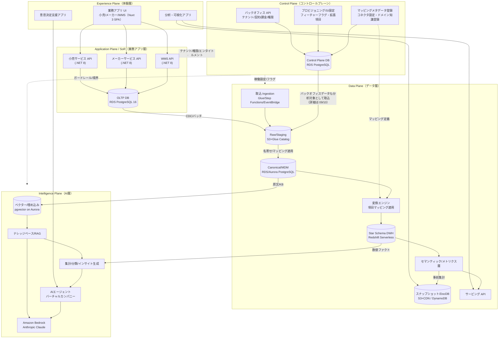
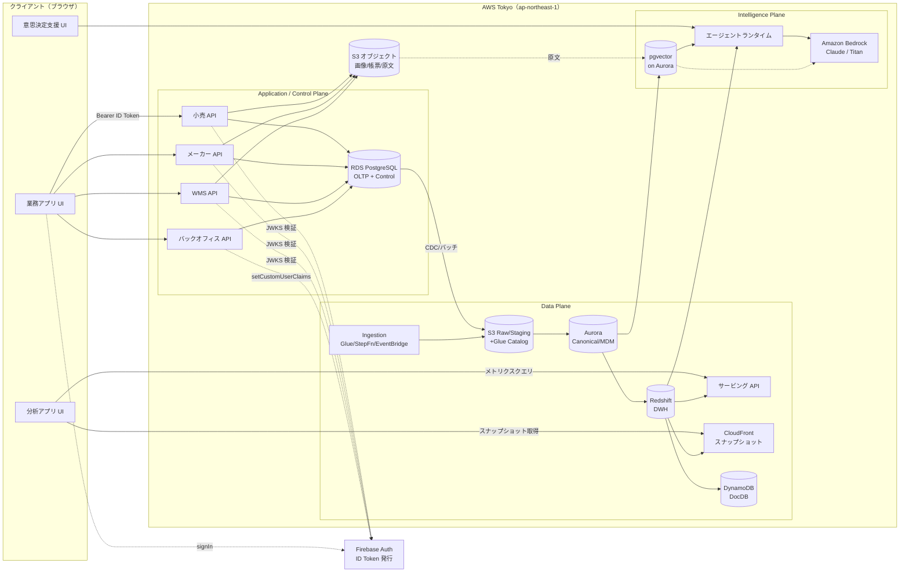
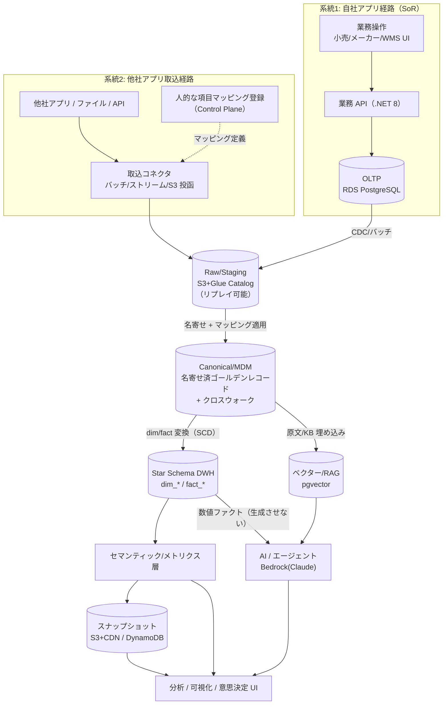
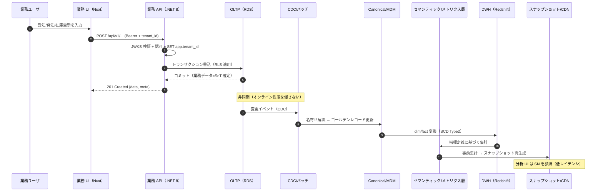
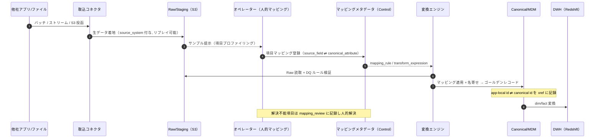
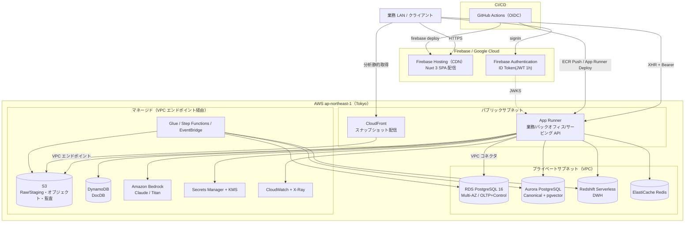
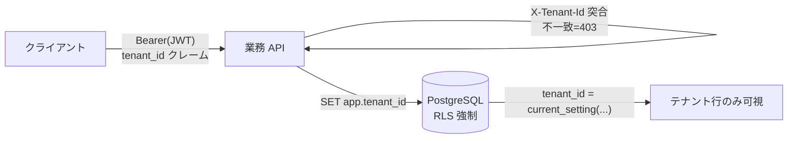
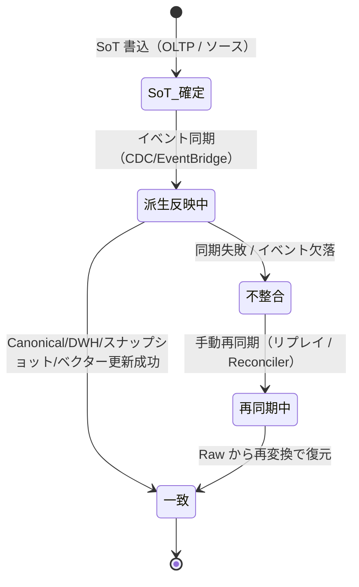

# 基本設計: 全体アーキテクチャ

本ドキュメントは **SCIP（Supply Chain Intelligence Platform）** の全体アーキテクチャを俯瞰する。
論理 **5 プレーン**（Experience / Application(SoR) / Control / Data / Intelligence）の責務、主要コンポーネントと相互接続、
自社アプリ経路と他社アプリ取込経路の 2 系統のデータフロー、AWS Tokyo でのデプロイトポロジ、層別の技術スタックを定義する。

- **本ドキュメントの所有範囲（owns）:** 全体アーキテクチャ・プレーン定義・コンポーネント接続関係・デプロイトポロジの**権威的記述**。
- **他ドキュメントへの委譲:** 個別テーブルの DDL は各 DB 設計ドキュメント（30-38）が所有し本書は再定義しない。
  マルチテナンシー詳細は [`11 非機能/セキュリティ/テナンシー`](./11-nonfunctional-security-tenancy.md)、
  AI/RAG・エージェント詳細は詳細設計 23/24、技術選定の根拠は [`12 ADR`](./12-architecture-decision-records.md) が所有する。
- **土台:** 既存の単一テナント実装 **akebono-honshu**（履物メーカー Honshu の .NET 8 + Nuxt 3 + RDS PostgreSQL）を
  リファレンス実装 / 最初のメーカーテナントと位置づけ、マルチテナント SaaS へ一般化する（ファウンデーション・ブリーフ §1・§15）。

---

## 1. アーキテクチャ全体像（論理5プレーン）

SCIP は責務ごとに **5 つの論理プレーン**へ分離する。プレーンは物理配置ではなく**責務境界**であり、
1 つのプレーンが複数の AWS サービス／プロセスにまたがる。プレーン間の依存方向は原則
「上位（体験）→ 下位（データ／知能）」の一方向読み取り、書込は各プレーンの SoT へ集約する。

### 1.1 各プレーンの責務

| プレーン | 責務 | 主なコンポーネント | 主要データストア | SoT 上の位置 |
|---|---|---|---|---|
| **Experience（体験）** | 各業務アプリ UI、分析・可視化アプリ、意思決定支援アプリ。認証トークン取得と表示制御。 | Nuxt 3 SPA（業務/分析/意思決定） | — | 保持しない（表示専用） |
| **Application / SoR（業務アプリ）** | 小売 / メーカー / WMS の OLTP。業務トランザクション・マスタの発生源（System of Record）。**他社アプリはここに来ず Data Plane の取込口へ接続する**。 | 小売 API / メーカー API / WMS API（.NET 8） | RDS PostgreSQL 16（OLTP） | **業務データの SoT** |
| **Control（コントロール）** | テナント/契約/課金/エンタイトルメント/プロビジョニング、SI 設定（フィーチャーフラグ・テーマ・拡張項目）、マッピングメタデータ登録、コネクタ設定、ドメインナレッジ登録。 | バックオフィス API、プロビジョナ、マッピング/コネクタ登録 UI | RDS PostgreSQL（Control Plane DB） | **テナント/契約/権限/設定の SoT** |
| **Data（データ）** | 取込 → Raw/Staging → Canonical/MDM（名寄せ）→ 変換（項目マッピング適用）→ Star Schema DWH → セマンティック/メトリクス層 → スナップショット/DocDB → サービング。 | Ingestion、変換エンジン、DWH、メトリクス層、サービング API | S3+Glue / Aurora(Canonical) / Redshift(DWH) / S3+CDN(スナップショット) / DynamoDB | Canonical=名寄せ結果の SoT、他は**派生** |
| **Intelligence（AI）** | 埋め込み/ベクター、ナレッジベース/RAG、集計/分類 AI、インサイト生成、AI エージェント/バーチャルカンパニー、意思決定支援ワークフロー。 | ベクターストア、RAG オーケストレータ、エージェントランタイム、Bedrock | pgvector on Aurora / DynamoDB / S3(原文) | 原文=SoT、ベクター/インサイトは**派生** |

> **委譲:** マルチテナンシーの分離方式・RLS・非機能要件は [`11 非機能/セキュリティ/テナンシー`](./11-nonfunctional-security-tenancy.md) が、
> Intelligence Plane のパイプライン詳細は詳細設計 23/24 が権威。本節はプレーン境界と責務の俯瞰に留める。

---

## 2. 主要コンポーネントと相互接続

### 2.1 コンポーネント一覧

| # | コンポーネント | 所属プレーン | 実装 | 主な責務 | 接続先 |
|---|---|---|---|---|---|
| C-01 | 業務アプリ UI | Experience | Nuxt 3 SPA / Firebase Hosting | 小売/メーカー/WMS の業務操作 | 各業務 API、Firebase Auth |
| C-02 | 分析・可視化アプリ | Experience | Nuxt 3 SPA | ダッシュボード、指標クエリ、スナップショット表示 | サービング API、スナップショット CDN |
| C-03 | 意思決定支援アプリ | Experience | Nuxt 3 SPA | AI エージェントとの対話、HITL 承認 | エージェントランタイム |
| C-04 | 小売サービス API | Application | .NET 8 / App Runner | 商品マスタ・商取引・売上/在庫（店舗+EC） | OLTP、Control Plane、S3 |
| C-05 | メーカーサービス API | Application | .NET 8 / App Runner | 商品マスタ・生産/発注/納品/売上/在庫 | OLTP、Control Plane、S3 |
| C-06 | WMS API | Application | .NET 8 / App Runner | SKU マスタ・入出庫/在庫・出荷帳票・荷主請求 | OLTP、Control Plane、S3 |
| C-07 | バックオフィス API | Control | .NET 8 / App Runner | テナント/契約/課金/権限/プロビジョニング | Control Plane DB、Firebase Admin |
| C-08 | 取込コネクタ / Ingestion | Data | Glue / Step Functions / EventBridge / 自社 | 他社アプリ・ファイルの取込、リプレイ | Raw/Staging(S3)、Control Plane |
| C-09 | 変換エンジン | Data | 自社 + Glue | 名寄せ・項目マッピング適用・dim/fact 生成 | Canonical、DWH、マッピングメタデータ |
| C-10 | Canonical/MDM | Data | Aurora PostgreSQL | 名寄せ済みゴールデンレコード + クロスウォーク | OLTP、Raw、DWH、ベクター |
| C-11 | Star Schema DWH | Data | Redshift Serverless | dim/fact による分析中核 | Canonical、メトリクス層、スナップショット |
| C-12 | セマンティック/メトリクス層 | Data | 自社（定義=RDS） | 指標の一元定義とクエリ | DWH、サービング API |
| C-13 | スナップショット/DocDB | Data | S3+CloudFront / DynamoDB | 事前集計静的ファイル・読み取りモデル | DWH、分析アプリ |
| C-14 | サービング API | Data | .NET 8 / App Runner | メトリクスクエリ・スナップショット取得 I/F | メトリクス層、スナップショット |
| C-15 | ベクター/RAG | Intelligence | pgvector on Aurora + Bedrock | 埋め込み・検索・RAG 取得 | Canonical/原文、Bedrock |
| C-16 | AI エージェントランタイム | Intelligence | 自社 + Bedrock Agents(選択肢) | バーチャルカンパニー、オーケストレーション、HITL | RAG、DWH、Bedrock |
| C-17 | 認証（Firebase Auth） | 横断 | Firebase Authentication | UID/Email/PW ハッシュの SoT、ID Token 発行 | 全 API（Bearer 検証） |
| C-18 | オブジェクトストレージ | 横断 | S3 | 画像/帳票/添付/原文/監査アーカイブ | 全 API（Pre-signed URL） |

### 2.2 コンポーネント相互接続図

> **接続の原則:**
> - 業務 UI → 業務 API → OLTP は同期リクエスト（低レイテンシ）。分析 UI → サービング/スナップショットは事前集計参照が基本。
> - Data Plane / Intelligence Plane への書込は**非同期**（CDC・バッチ・イベント）で、OLTP のオンライン性能を侵さない。
> - すべての API は Firebase ID Token（Bearer）を JWKS 検証し、テナントは JWT の `tenant_id` クレームで解決する（ブリーフ §11、[`11`](./11-nonfunctional-security-tenancy.md)）。

---

## 3. エンドツーエンドのデータフロー（2 系統）

SCIP は **自社アプリ経路**（SoR から直接 Canonical へ）と **他社アプリ取込経路**（取込 + 人的マッピング → 正規化）の
2 系統を受け入れる。差別化の源泉は「連携難易度の低さ」であり、自社アプリは最初から**スタースキーマ連携前提のスキーマ**で設計される。

### 3.1 全体フロー（2 系統の合流）

> **2 系統の非対称性:** 自社アプリは Canonical への写像コストが低い（スキーマ設計済み）。他社アプリは Raw に着地後、
> **人的なマッピング（項目対応表）** を経て Canonical に写像される。マッピングメタデータは Control Plane に登録され
> 変換エンジンが参照する（詳細は [`10 データ連携とマッピング`](./10-data-integration-and-mapping.md) と詳細設計 21/36）。

### 3.2 系統1: 自社アプリの書込〜分析反映（シーケンス）

### 3.3 系統2: 他社アプリ取込〜正規化（シーケンス）

> **SoT 順序（ブリーフ §5 原則）:** いずれの系統も **SoT 側書込を先行**（自社=OLTP、他社=ソースシステム/Raw）、
> Canonical → DWH → スナップショット/ベクターは**すべて派生**として後追いで更新する。逆順は不整合の温床。

---

## 4. データストアカタログと SoT マップ（俯瞰）

以下はファウンデーション・ブリーフ §5 のデータストア SoT マップの**俯瞰**である。
各ストアの DDL・詳細な SoT 宣言・同期パスは [`30 スキーマ戦略と SoT`](../database-design/30-schema-strategy-and-sot.md) 以下の
DB 設計ドキュメント（30-38）が権威的に所有する。**本書は再定義せず、全体像の把握のためだけに列挙する。**

| データ | ストア | SoT | 派生/キャッシュ | 詳細委譲先 |
|---|---|---|---|---|
| 業務トランザクション/マスタ | RDS PostgreSQL（OLTP, テナント分離） | 各アプリ OLTP | — | 31/32/33 |
| Canonical/MDM（ゴールデンレコード） | RDS/Aurora PostgreSQL | Canonical DB | OLTP から | 34 |
| クロスウォーク（app-local id ⇄ canonical id） | Canonical DB | マッピング解決の SoT | — | 34 |
| Raw/Staging（取込生データ） | S3(Parquet/JSON)+Glue Catalog | ソース側システム | — | 21/36 |
| Star Schema DWH（dim/fact） | Redshift Serverless | 派生（Canonical/Raw 由来） | — | 35 |
| メトリクス/セマンティック定義 | メタデータ DB（RDS） | 定義は SoT | — | 30/22 |
| スナップショット（事前集計静的ファイル） | S3(Parquet/JSON)+CDN | 派生（DWH 由来） | ○ | 26 |
| ドキュメント DB（柔軟属性/読み取りモデル） | DynamoDB（or Firestore） | テナント拡張属性=SoT / 読み取りモデル=派生 | 一部○ | 26/38 |
| ベクター/埋め込み | pgvector on Aurora（or OpenSearch） | 派生（原文/KB 由来） | ○ | 38 |
| ナレッジベース（ドメイン知識） | RDS + S3(原文) + ベクター | 原文=SoT | ベクターは派生 | 38 |
| オブジェクト（画像/帳票/添付） | S3 | SoT | — | 30 |
| 認証情報（UID/Email/PW ハッシュ） | Firebase Authentication | SoT | — | 11/37 |
| ユーザ業務情報/権限ロール | RDS（Control Plane） | SoT | Custom Claims=キャッシュ | 37 |
| 監査ログ | RDS(append-only)→S3 Glacier IR | SoT | — | 37 |
| シークレット | Secrets Manager + KMS | SoT | — | 11 |

> **SoT 宣言（本書の立場）:** 本ドキュメントは**いずれのテーブルも所有しない**。上表は俯瞰であり、
> 各データの権威的 SoT 宣言・同期パス（イベント受信 + 手動再同期の両方）は所有ドキュメント（§14 所有マップ）に従う。

---

## 5. 技術スタック（層別）

ブリーフ §4 に従い、**継承（akebono-honshu Phase 4 確定 / 変更しない土台）** と **プラットフォーム拡張（本設計で追加）** を層別に示す。
拡張分の技術選定の根拠は [`12 ADR`](./12-architecture-decision-records.md) が所有する。

| 層 | 継承（土台） | プラットフォーム拡張 | 備考 |
|---|---|---|---|
| フロント | Nuxt 3（Vue 3+TS, SPA モード, Firebase Hosting）、TailwindCSS + Reka UI + lucide、Pinia | 分析ダッシュボード部品、意思決定支援チャット UI | SPA（`ssr: false`）維持 |
| API/バック | C# 12 / .NET 8 LTS、ASP.NET Core Minimal API、EF Core 8 + Npgsql、FluentValidation、Serilog、Mapster、ClosedXML | サービング API、取込 I/F、エージェント API | Vertical Slice + 軽量レイヤード |
| OLTP DB | Amazon RDS for PostgreSQL 16（Multi-AZ） | RLS（`tenant_id`）、テナントスコープ一意制約 | ブリーフ §6・§9 |
| OLAP/DWH | — | **Amazon Redshift Serverless**（主）／ S3(Parquet)+Iceberg+Athena/Glue（代替） | ADR で最終選定（R-4） |
| Canonical/MDM | — | Aurora PostgreSQL（名寄せ + クロスウォーク） | 34 が所有 |
| ベクター | — | **pgvector on Aurora**（主）／ OpenSearch（大規模代替） | ADR（R-5） |
| ドキュメント DB | — | **DynamoDB**（主）／ Firestore（代替） | ADR（R-6） |
| スナップショット | — | S3(Parquet/JSON)+CloudFront | 事前集計高速サービング |
| 全文検索 | — | pg_trgm/tsvector（小）／ OpenSearch（大） | 規模で切替 |
| キャッシュ | — | ElastiCache for Redis | プラットフォーム規模で導入 |
| LLM/AI | — | **Amazon Bedrock（Anthropic Claude）**。埋め込みは Bedrock（Titan/Cohere） | 国内リージョン・データ境界制御 |
| ETL/オーケストレーション | — | AWS Glue / Step Functions / EventBridge + 自社変換エンジン | 取込・変換 |
| 認証 | Firebase Authentication（Email/Password, Custom Claims） | Custom Claims に `tenant_id` 付与 | UID/Email=Firebase、権限=RDS |
| インフラ | AWS Tokyo（ap-northeast-1）、App Runner、S3、Secrets Manager+KMS、CloudWatch+X-Ray、GitHub Actions+OIDC | Redshift/Aurora/DynamoDB/Bedrock/CloudFront | 単一リージョン |
| 時刻 | 継承は JST-naive `TIMESTAMP` + DB レベル Asia/Tokyo | **プラットフォーム標準は `TIMESTAMPTZ`（UTC 保存, テナントローカル表示）** | 移行差分は 32 が明記 |

---

## 6. AWS デプロイトポロジ（Tokyo リージョン）

物理配置は AWS Tokyo（ap-northeast-1）に集約する。フロント配信と認証は Firebase（Google 管理）、
業務・データ・AI は AWS VPC 内に閉じる。継承実装のトポロジ（App Runner + RDS + S3 + Secrets Manager）を
土台に、Data Plane / Intelligence Plane のマネージドサービスを積む。

### 6.1 デプロイ・環境

| 環境 | フロント | バック | データ層 | 用途 |
|---|---|---|---|---|
| dev（ローカル） | `nuxt dev` | `dotnet run` | Docker PostgreSQL + Firebase Emulator | 開発 |
| preview | Firebase Hosting プレビューチャネル（PR ごと） | App Runner プレビュー（検討） | 共有 dev DB | PR レビュー |
| stg | Firebase Hosting（stg ドメイン） | App Runner stg | RDS/Aurora/Redshift stg | UAT |
| prod | Firebase Hosting（本番） | App Runner prod | Multi-AZ / Serverless 本番 | 本番運用 |

> **VPC 境界:** OLTP/Canonical/DWH/キャッシュは**プライベートサブネット**。App Runner は VPC コネクタで到達する。
> S3/DynamoDB/Bedrock は VPC エンドポイント経由でインターネットに出さない。詳細な NW 3 層（SG/NACL/ルート）とデータ境界は [`11`](./11-nonfunctional-security-tenancy.md) が所有。
>
> **スナップショット経路の統一:** 論理的な事前集計経路は全図で **DWH → セマンティック/メトリクス層 → スナップショット**（ブリーフ §5: スナップショットは DWH 由来の派生）で統一する。
> 本図の物理配置 `Redshift → CloudFront` は、この論理経路（セマンティック層での指標集計を含む）を配信面に圧縮した表現であり、経路の相違ではない。

---

## 7. マルチテナンシーと AI 基盤の位置づけ（俯瞰）

### 7.1 マルチテナンシー

- **方式:** ハイブリッド（Pooled + Silo）。Pooled は共有 DB・共有スキーマ + `tenant_id BIGINT NOT NULL` + PostgreSQL **RLS**（`tenant_id = current_setting('app.tenant_id')::bigint`）。Silo は大規模/高分離要件でスキーマ or DB 分離（同一 DDL）。
- **テナント識別:** Firebase Custom Claims の `tenant_id` → API がクレームから解決。任意で `X-Tenant-Id` ヘッダをクレームと突合（不一致は 403）。全 DB セッションで `SET app.tenant_id` を張り RLS を効かせる。
- **DWH:** `dim_tenant` + fact の `tenant_id`（Redshift DISTKEY/パーティション）で分離。
- **移行ギャップ:** 継承実装（Honshu）には `tenant_id` が一切存在しない。これが最大の移行差分であり、[`32 メーカー OLTP`](../database-design/32-oltp-manufacturer-schema.md) が「既存 DDL への tenant_id 導入 + 全 UNIQUE のテナントスコープ化」を明記する。

> **委譲:** RLS ポリシー・Silo ルーティング・分離レベル・鍵管理は [`11 非機能/セキュリティ/テナンシー`](./11-nonfunctional-security-tenancy.md) が権威。本節は配置の俯瞰に留める。

### 7.2 AI 基盤

- **主軸:** RAG（原文取込 → チャンク化 → 埋め込み(Bedrock) → ベクター格納(pgvector) → 取得 → LLM(Claude via Bedrock)）。
- **ガードレール:** テナント境界厳守（RAG 検索はテナントスコープ）、機微データマスキング、根拠提示（引用）、**数値は DWH/メトリクス層から取得し LLM に生成させない**（ハルシネーション抑制）。
- **バーチャルカンパニー:** 部門 role（企画/営業/調達/在庫/経営）を担うエージェント群 + オーケストレーション + HITL。

> **委譲:** RAG パイプライン詳細は詳細設計 23、AI エージェント/バーチャルカンパニーは詳細設計 24、AI/ベクター/ナレッジのスキーマは 38 が所有。

---

## 8. 同期パスと再同期パス（全体像）

ブリーフの原則「同期パス（イベント受信）と手動回復パス（再同期）の両方を欠落なく設計する」に従い、
派生データの一貫性を保つ 2 経路を全体像として示す。個別の実装は各パイプライン/DB ドキュメントが所有する。

| 経路 | トリガー | 実装 | 冪等性 | 非ブロッキング |
|---|---|---|---|---|
| **同期（イベント）** | SoT 書込（OLTP コミット / 取込着地） | CDC → EventBridge → 変換エンジン → Canonical/DWH。権限は RDS 先行 → Firebase Custom Claims 後追い。 | `Idempotency-Key` / 冪等 upsert | 補助処理の失敗は主フローを止めない（ブリーフ原則4） |
| **再同期（手動回復）** | イベント欠落・変換不整合・スキーマ変更 | Raw/Staging からのリプレイ（再変換）、Reconciler バッチ（SoT ⇄ キャッシュ差分照合）、権限の日次 diff 修復。 | Raw は不変・リプレイ可能で冪等 | 部分適用可（できたところまで反映して報告） |

> **原則整合:** SoT から復元できない派生データは持たない設計（Raw を保持しリプレイ可能にする）。
> Firebase Custom Claims のように SoT（RDS）から再構成できるキャッシュは、Reconciler で回復する（ブリーフ §5 / CLAUDE.md 原則 2・4・6）。

---

## 9. 想定エラーコード（アーキテクチャ横断）

本書は特定機能を実装しないが、全体アーキテクチャで横断的に発生する代表エラーを俯瞰する。
コード体系は `DOMAIN-NNN`（ブリーフ §10）。各機能固有コードの権威一覧は各機能ドキュメントが所有する。

| コード | 意味 | 発生箇所 | HTTP |
|---|---|---|---|
| `CMN-401` | ID Token 未提供 / 署名検証失敗 | 全 API（JWKS 検証） | 401 |
| `CMN-403` | 認可失敗（権限不足） | 全 API（ポリシー評価） | 403 |
| `TEN-001` | テナント解決失敗（クレーム欠落） | テナント解決層 | 401 |
| `TEN-002` | `X-Tenant-Id` とクレーム不一致 | テナント突合 | 403 |
| `CMN-409` | 冪等キー衝突 / 一意制約違反 | 書込 API | 409 |
| `ETL-001` | 取込データのスキーマ/DQ 検証失敗 | Ingestion / 変換エンジン | 422 |
| `MAP-001` | マッピング未解決（項目対応表欠落） | 変換エンジン | 422 |
| `ANL-001` | メトリクス定義未登録 / クエリ不整合 | サービング API | 400 |
| `AI-001` | RAG テナント境界違反（越境検索の遮断） | Intelligence Plane | 403 |
| `CMN-503` | 派生ストア一時不整合（再同期待ち） | 分析/AI サービング | 503 |

> **委譲:** 継承メーカー系（AUTH/PROD/ORDER/MASTER 等）と各新規ドメイン（RTL/WMS/ANL/ETL/AI/MAP）の完全なレジストリは各機能・DB 設計ドキュメントが逆引き可能に一覧化する。

---

## 未決事項 / 論点

| # | 論点 | 選択肢 / トレードオフ | 一次議論先 |
|---|---|---|---|
| A-1 | DWH エンジンの最終選定 | Redshift Serverless（主, 運用容易）か S3+Iceberg+Athena（コスト最適/レイクハウス）か。データ量・クエリ特性で判断 | [`12 ADR`](./12-architecture-decision-records.md) / 35 |
| A-2 | ベクター基盤の規模切替閾値 | pgvector on Aurora（主, 統合容易）か OpenSearch（大規模）か。ベクター件数の閾値を要定義 | [`12 ADR`](./12-architecture-decision-records.md) / 38 |
| A-3 | DocDB 選定 | DynamoDB（主, AWS ネイティブ）か Firestore（Firebase 資産活用）か | [`12 ADR`](./12-architecture-decision-records.md) / 26 / 38 |
| A-4 | CDC 実装方式 | DMS / Debezium / 論理レプリケーション / アプリイベントのいずれで OLTP → Raw を実現するか | 21 / 10 |
| A-5 | サービング API の DWH 直結 vs スナップショット優先 | 直結（鮮度）とスナップショット（低レイテンシ/コスト）の使い分け方針 | 26 / 07 |
| A-6 | App Runner のマルチインスタンス時のプロセスローカルキャッシュ | 継承実装で顕在化（権限キャッシュ 60s 不整合）。ElastiCache 共有への置換判断 | [`11`](./11-nonfunctional-security-tenancy.md) |
| A-7 | プラットフォーム正式名称 | コード名 SCIP は仮。ブランディング/商標確認を経てオペレーター確定 | [`01 構想`](./01-concept-and-vision.md) |

---

## 関連ドキュメント

- [`01-concept-and-vision.md`](./01-concept-and-vision.md) — 構想と全体像（ビジョン・スコープ・提供価値）
- [`03-canonical-domain-model.md`](./03-canonical-domain-model.md) — 正準ドメインモデル（Party/Product/Location/Region 等の概念）
- [`10-data-integration-and-mapping.md`](./10-data-integration-and-mapping.md) — データ連携とマッピング（他社アプリ取込経路の詳細）
- [`11-nonfunctional-security-tenancy.md`](./11-nonfunctional-security-tenancy.md) — 非機能 / セキュリティ / マルチテナンシー（RLS・VPC・分離レベル）
- [`12-architecture-decision-records.md`](./12-architecture-decision-records.md) — アーキテクチャ決定記録（DWH/ベクター/DocDB/Bedrock 選定の根拠）
- [`../database-design/30-schema-strategy-sot.md`](../database-design/30-schema-strategy-and-sot.md) — スキーマ戦略と SoT（命名/DDL 規約・TZ 方針の総則、データストア SoT の権威）
- [`../README.md`](../README.md) — ドキュメント索引 / 全体マップ
