# 基本設計: 正準ドメインモデル

本書は **SCIP（Supply Chain Intelligence Platform、コード名。正式名称は未確定）** の
**正準ドメインモデル（Canonical Domain Model）** を概念・論理レベルで定義する。
小売・メーカー・倉庫の各業務アプリ（OLTP）と分析基盤（DWH）が共有する「ユビキタス言語」と
共通エンティティの意味・関係・状態を確定し、各アプリのローカルエンティティが正準エンティティへ
どう写像されるか（クロスウォーク）の概念を示す。

> **位置づけ / 所有範囲:** 本書は正準ドメインモデルの**概念・論理**を権威的に所有する。
> 正準エンティティの**物理スキーマ（CREATE TABLE・制約・索引）は [MDM/Canonical スキーマ設計](../database-design/34-mdm-canonical-schema.md)（34）が所有**し、
> 分析用の**スタースキーマ（dim/fact）は [スタースキーマ DWH](../database-design/35-star-schema-dwh.md)（35）が所有**する。
> 本書はそれらを参照するが物理定義を再定義しない。用語の正規定義は [用語集](../overview/00-glossary.md) が所有する。

---

## 1. 目的とスコープ

### 1.1 なぜ正準ドメインモデルが必要か

SCIP は「自社アプリ（小売/メーカー/倉庫）の利用」と「他社アプリのデータ連携」の双方を受け入れ、
すべてを**同一のスタースキーマ**へ集約して「商品 × 地域 × 販売先」の統一軸で分析する
（[構想と全体像](./01-concept-and-vision.md) 参照）。この集約が成立するには、アプリごとに異なる
名前・粒度・コード体系で表現された「取引先」「商品」「拠点」「地域」を、**意味が一意に定まる共通の型**へ
名寄せ（reconcile）する必要がある。この共通の型の集合が正準ドメインモデルである。

正準ドメインモデルは以下の3つの役割を持つ。

1. **共有カーネル（Shared Kernel）:** 全境界づけられたコンテキストが合意する共通概念の定義。
2. **写像の基準点（Crosswalk Target）:** 各アプリ・各外部ソースのローカルエンティティが対応づく先。
3. **分析次元の源泉（Dimension Source）:** スタースキーマの適合次元（Conformed Dimension）が導出される元。

### 1.2 3階層のモデル

| 階層 | 内容 | 所有ドキュメント |
|------|------|-----------------|
| **概念モデル（Conceptual）** | エンティティの意味・関係・境界。本書 §3〜§9。 | 本書（03） |
| **論理モデル（Logical）** | 属性・キー・カーディナリティ・状態遷移。本書 §3〜§10。物理型は伴わない。 | 本書（03） |
| **物理モデル（Physical）** | PostgreSQL 実 DDL（列型・制約・索引・RLS・監査列）。 | 34（MDM）/ 31-33（各 OLTP）/ 35（DWH） |

本書は概念・論理に集中し、物理は所有ドキュメントへ委譲する。したがって本書に CREATE TABLE は登場しない
（論理属性は erDiagram/classDiagram のラベルとテキストで表現する）。

---

## 2. 全体像 — 正準エンティティのランドスケープ

ブリーフ §7 の正準エンティティを、役割で6グループに整理する。

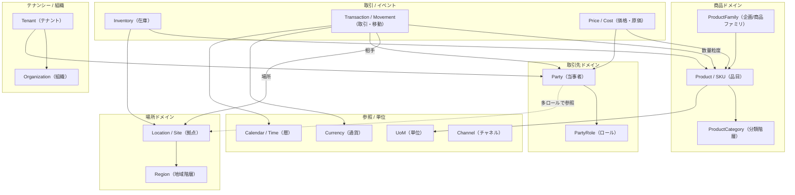

- **テナンシー / 組織**は全エンティティを包含するスコープ（マルチテナント、ブリーフ §6）。
- **取引先・場所・商品・地域**は名寄せ対象の「マスタ系正準エンティティ」で、**34（MDM）が物理所有**する。
- **在庫・取引/移動**は各アプリ OLTP（31-33）が発生源で、正準モデルとしては「イベントの意味・粒度」を定義する。
- **参照/単位**はコード表系（UoM・Currency は 34 所有、Calendar は 35 の `dim_date` に対応）。

> **本書が概念定義する範囲と、物理所有の対応（ブリーフ §14）**
>
> | 正準エンティティ | 物理テーブル（参照のみ・再定義しない） | 物理所有 |
> |------------------|--------------------------------------|----------|
> | Tenant / Organization | `tenant`, `organization` | 37 |
> | Party / PartyRole | `canonical_party`, `party_role` | 34 |
> | Location / Site | `canonical_location` | 34 |
> | Region | `region` | 34 |
> | ProductFamily / SKU | `canonical_product`, `canonical_sku` | 34 |
> | ProductCategory | `product_category` | 34 |
> | UoM / Currency | `uom`, `currency` | 34 |
> | クロスウォーク | `party_xref`, `product_xref`, `sku_xref`, `location_xref` | 34 |
> | Calendar / Time | `dim_date` | 35 |

---

## 3. 境界づけられたコンテキストと共有カーネル

SCIP は複数の業務ドメインを跨ぐため、DDD の**境界づけられたコンテキスト（Bounded Context）**で
モデルの責務境界を明確化する。各コンテキストは独自のローカルモデルを持ち、**Canonical（共有カーネル）**を
介して相互運用する。

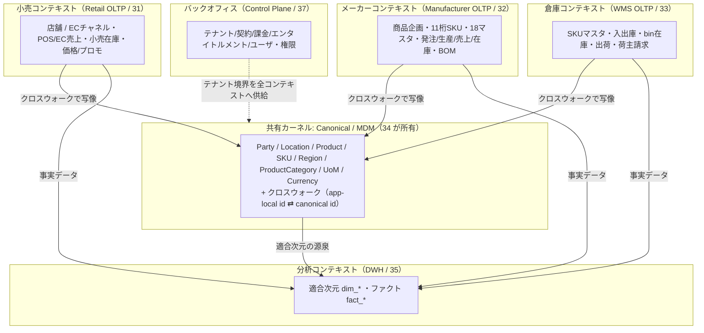

### 3.1 コンテキストマップの関係種別

| 上流 → 下流 | 関係種別（DDD） | 意味 |
|-------------|----------------|------|
| Canonical → 各 OLTP | 共有カーネル（Shared Kernel） | 共通概念の定義を全コンテキストが合意・共有する |
| 各 OLTP → Canonical | 顧客/供給者 + 変換層（ACL 相当） | OLTP のローカル語彙を正準語彙へ名寄せ変換する。逆流はしない |
| Canonical → DWH | 上流/下流（Conformist） | DWH は Canonical の意味体系をそのまま次元へ写す |
| 外部（他社アプリ） → Canonical | 腐敗防止層（ACL） | 項目マッピング（36）を介し、外部語彙の混入を防ぐ |
| Control Plane → 全体 | オープンホストサービス | テナント/ユーザ/権限を横断供給する |

### 3.2 なぜ共有カーネルを「薄く」保つか

共有カーネルは全コンテキストが合意する必要があるため、変更コストが最も高い。したがって
**共有カーネルには「全コンテキストが同じ意味で使う概念」だけを置き、コンテキスト固有の詳細は各 OLTP に閉じ込める**。
例: 「11桁品番の桁構成ルール」はメーカー固有であり共有カーネルには持ち込まず、
共有カーネルには「SKU という粒度と、その正準識別子」だけを置く（§7・§8 で詳説）。

---

## 4. Party モデル（1エンティティ・多ロール）

### 4.1 設計判断

取引先を「仕入先テーブル」「得意先テーブル」「荷主テーブル」…とロールごとに分割すると、
1社が複数ロールを持つ実態（例: ある会社が「仕入先」であり同時に「得意先」でもある）を表現できず、
名寄せも二重化する。SCIP は **Party モデル**を採用し、**当事者（Party）は単一エンティティ**、
**ロール（PartyRole）は Party に付与される多重の役割**として分離する。

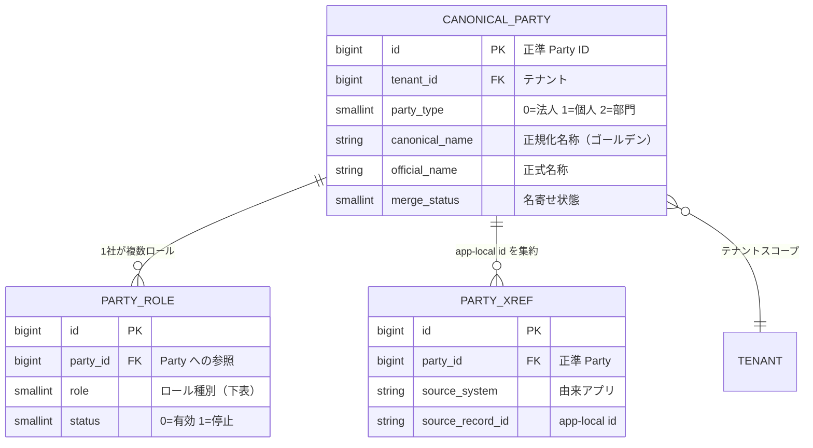

### 4.2 ロール体系（`PartyRole.role`）

ブリーフ §7 の role 集合を SMALLINT + CHECK で表現する（ハウススタイル、ブリーフ §9。物理定義は 34）。

| role 値 | ロール | 意味 | 主な発生コンテキスト |
|---------|--------|------|---------------------|
| 0 | supplier（仕入先） | 商品・原材料の供給元 | メーカー（発注先）、倉庫 |
| 1 | customer（得意先） | 注文・請求の相手（販売先） | 小売、メーカー、分析軸「販売先」 |
| 2 | retailer（小売） | 小売事業者 | 小売 |
| 3 | manufacturer（メーカー） | 製造事業者 | メーカー |
| 4 | warehouse_operator（倉庫事業者） | 倉庫を運営する事業者 | 倉庫 |
| 5 | shipper（荷主） | 倉庫に在庫を預ける主体 | 倉庫（請求対象） |
| 6 | carrier（運送業者） | 輸送を担う事業者 | 倉庫、物流 |

> **Honshu からの写像例:** Honshu の `supplier` マスタは MVP で工場（factory）を兼用している
> （[Honshu マスタ仕様](../../../.ai-native/domain-context/industry/honshu-master-schema.md#41-mvp-追加マスタの確定) §4.1）。
> 正準モデルでは 1 つの Party に `supplier` ロールを付与し、`supplier_type`（国内/海外）などの
> ローカル属性はメーカー OLTP（32）のローカル拡張として保持、正準側には持ち込まない。
> Honshu `delivery_destination`（納品先: しまむらセンター等）は Party の `customer`/`carrier` ロール、
> または Location（拠点）として写像される（§5.3 で整理）。

### 4.3 Party とロールの状態

ロールは Party のライフサイクルと独立して有効化/停止できる（例: 取引を停止した仕入先でも
過去取引の参照整合のために Party 自体は残す）。詳細な状態遷移は §10 参照。

---

## 5. Location / Site（拠点）タイプ体系

### 5.1 型と Region 紐付け

拠点は「物理的・論理的な場所」を表す単一エンティティで、`type` で用途を区別する
（ブリーフ §7）。すべての拠点は住所を持ち、**Region（地域階層）へ紐付く**ことで分析軸「地域」を供給する。

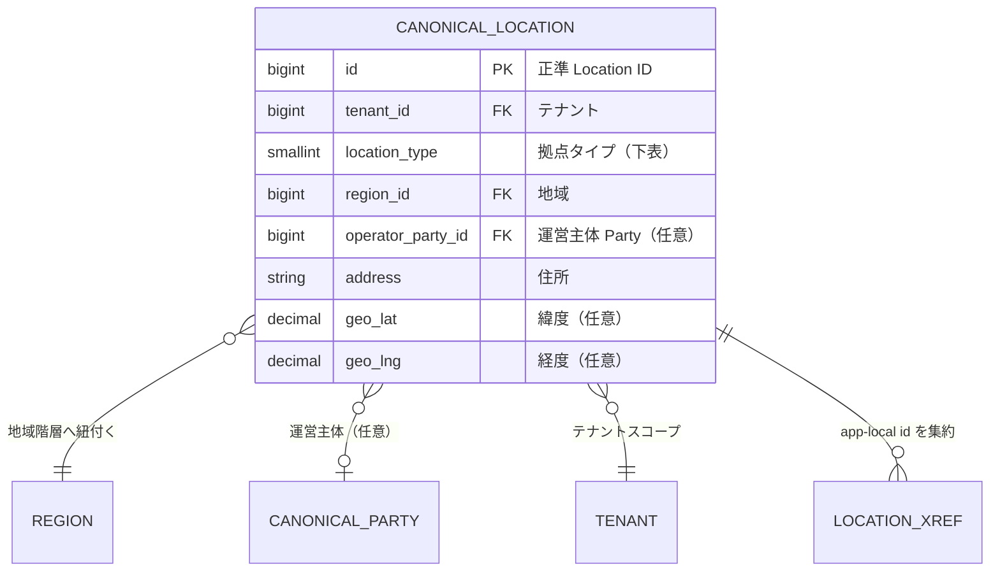

### 5.2 拠点タイプ（`location_type`）

| type 値 | タイプ | 意味 | 主コンテキスト |
|---------|--------|------|---------------|
| 0 | store（店舗） | 実店舗 | 小売 |
| 1 | ec_channel（EC チャネル） | EC 販売チャネル | 小売 |
| 2 | warehouse（倉庫） | 保管倉庫 | 倉庫 |
| 3 | dc（物流センター） | 配送センター | 倉庫・物流 |
| 4 | factory（工場） | 製造拠点 | メーカー |
| 5 | office（事業所） | 事務所・本社 | 全般 |

### 5.3 Honshu の拠点系マスタの写像

Honshu には `warehouse`（倉庫コード）と `delivery_destination`（納品先）という 2 つの場所系マスタがある。
正準モデルへの写像方針は以下（Honshu マスタ仕様 §6 の未確認事項「倉庫と納品先の使い分け」を踏まえた設計案）。

| Honshu ローカル | 正準写像 | 補足 |
|-----------------|----------|------|
| `warehouse`（納入倉庫1〜3） | Location `type=warehouse` または `dc` | 自社/取引先の保管・中継拠点 |
| `delivery_destination`（しまむらセンター等） | Location `type=dc`（物流拠点として）+ 運営主体 Party に `customer` ロール | 「物理的な届け先」= Location、「請求先の会社」= Party の二面性を分離 |

> この分離は業務フロー観察の「発注先/荷揚地/得意先/納品先の4ロール構造」
> （[業務フロー](../../../.ai-native/domain-context/business-flow/product-master-to-purchase-order-flow.md#28-取引先-vs-納品先の整理重要前回判断を更新) §2.8）と整合する。
> Party（誰）と Location（どこ）を分けることで、海外フローの「得意先 ≠ 納品先」も自然に表現できる。

---

## 6. Region / Geography（動的粒度の地域階層）

### 6.1 設計判断 — 単一の自己参照階層 + level 属性

分析の基本軸「商品 × 地域 × 販売先」のうち**地域粒度は動的**であり、
クライアントの商圏規模に応じて都道府県〜市区町村を切り替える（ブリーフ §2・§7）。
これを「都道府県テーブル」「市区町村テーブル」…と固定段数で分割すると粒度切替が硬直化するため、
**単一の Region エンティティを `level` 属性付きの自己参照階層**として設計する。

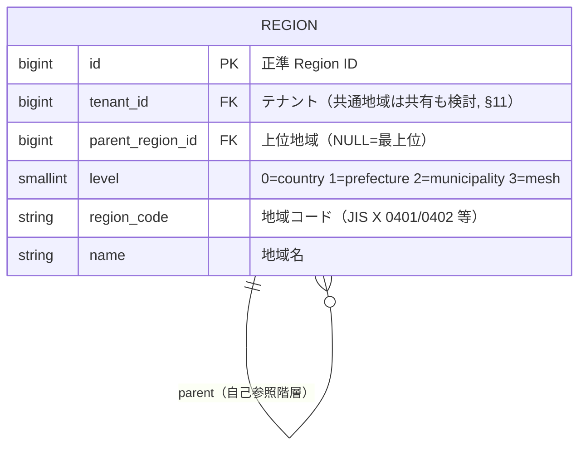

### 6.2 粒度階層

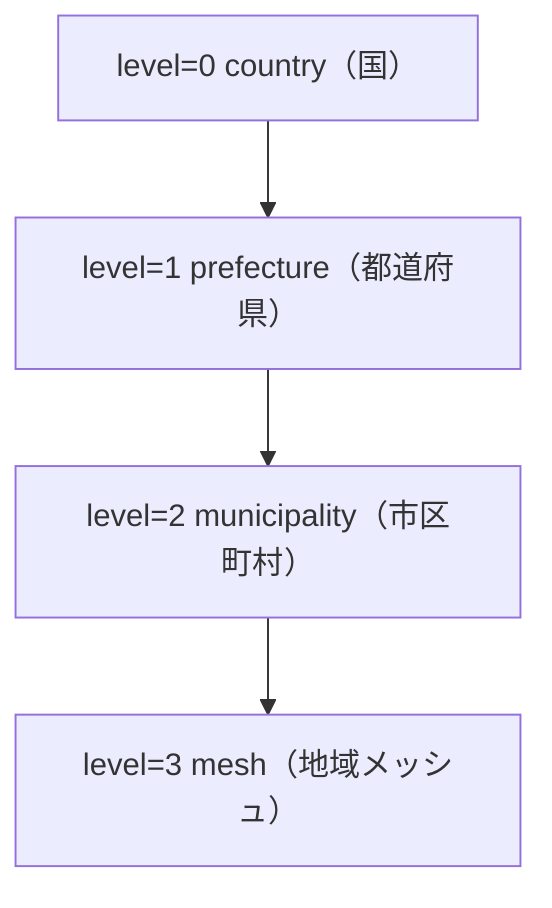

- **level 属性で粒度を制御:** 分析クエリは「level ≤ n で集計」のように粒度を動的に選択できる。
- **動的粒度の実現:** 小規模クライアントは prefecture 止まり、大規模クライアントは municipality/mesh まで
  展開する。集計側（DWH の `dim_region`, 35）は同じ階層を SCD で保持する。
- **標準コード:** 都道府県は JIS X 0401、市区町村は JIS X 0402 の準拠を推奨（未決事項 §12-3）。

---

## 7. Product / SKU（2層モデル）と分類階層

### 7.1 2層モデル

商品は「企画/商品ファミリ（ProductFamily）」と「品目（SKU = Product）」の**2層**で表現する
（ブリーフ §7）。SKU は色 × サイズ等の組み合わせで増殖する。

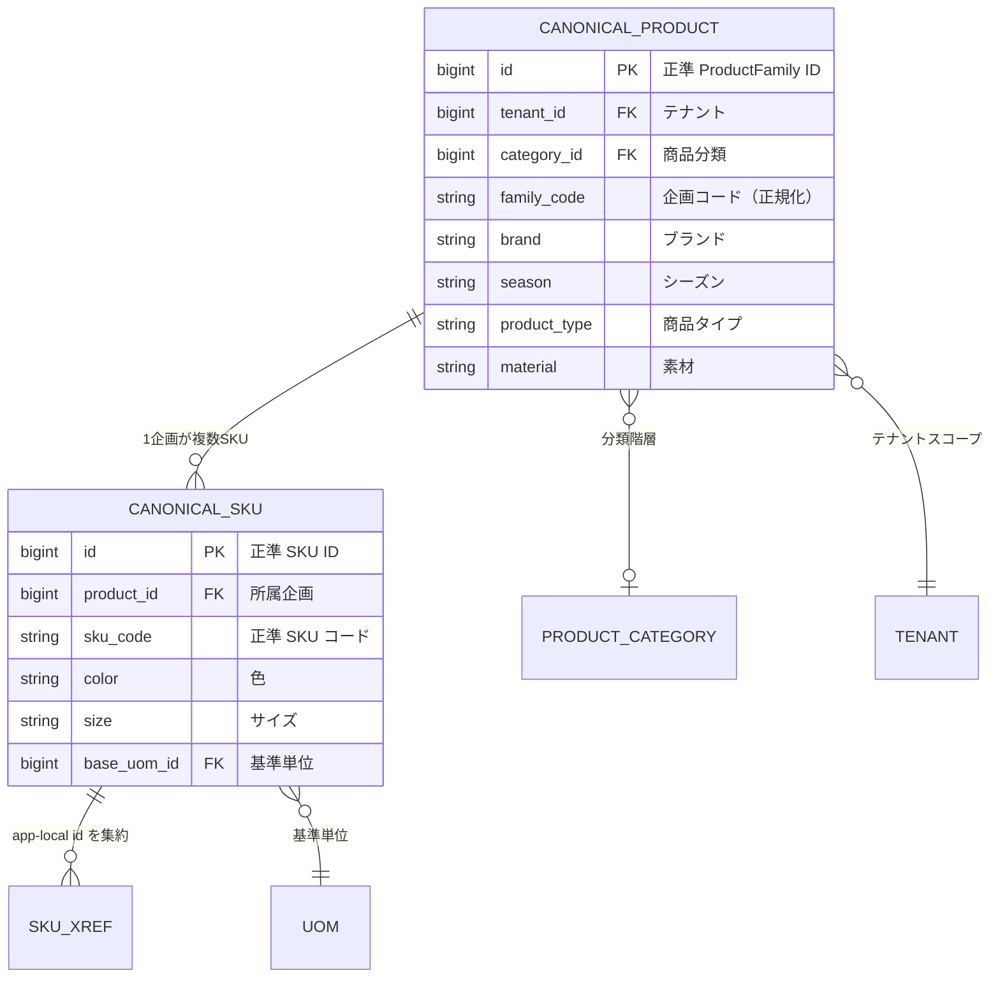

- **ProductFamily（企画）:** brand/category/season/type/material 等の企画レベル属性を持つ。
- **SKU（品目）:** ProductFamily に color/size を掛けた最小販売/在庫単位。分析・在庫・取引の粒度。

### 7.2 ProductCategory（可変段数の分類階層）

商品分類は Region と同様、**単一エンティティの自己参照階層**で可変段数を表現する。

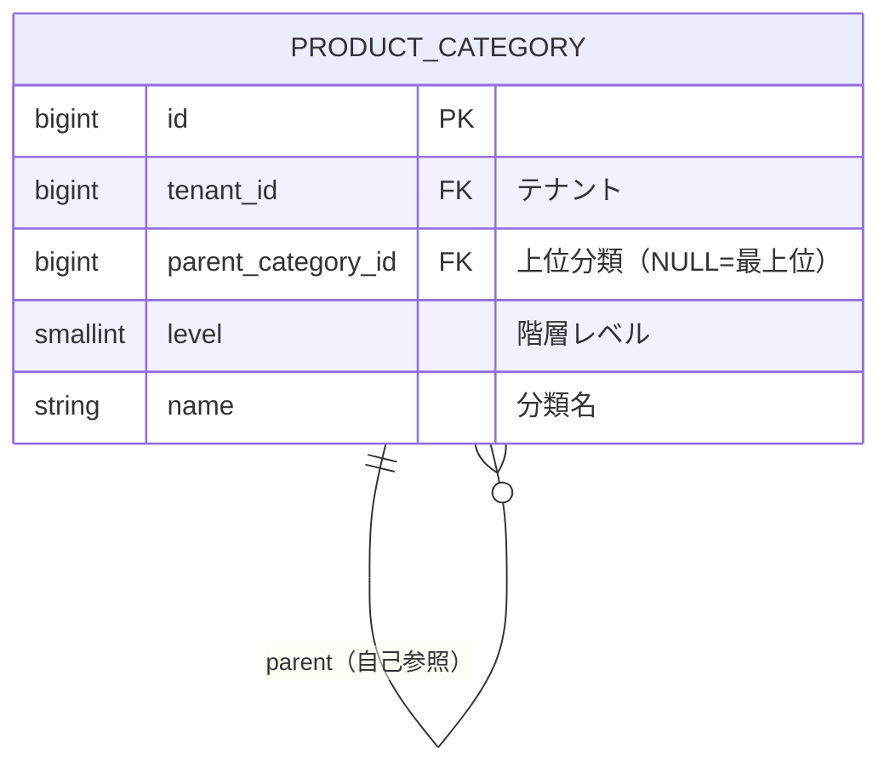

### 7.3 Honshu 11桁 SKU の写像（具体例）

Honshu の 2 層商品（`product_families` / `products`）と 11 桁品番は、正準 Product/SKU の**一実装**である。
11 桁品番の桁構成はメーカー固有ルール（[Honshu マスタ仕様](../../../.ai-native/domain-context/industry/honshu-master-schema.md#32-item_conversion_code-を持つマスタは-5-件のみ) §3.2）であり、
**桁構成ルール自体は共有カーネルに持ち込まず**、メーカー OLTP（32）のローカル知識に閉じる。
正準側には「企画」「SKU」という粒度と正準識別子だけを持ち、クロスウォークで対応づける。

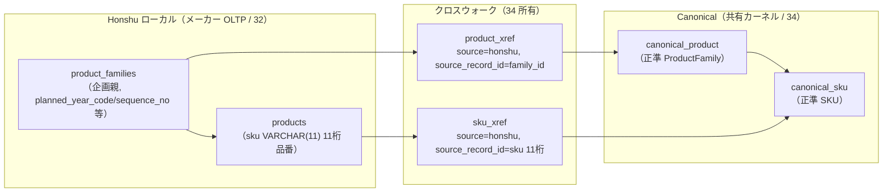

11桁品番の桁ソース（Honshu マスタ仕様 §3.2、参考）を正準属性へ写す対応の代表例。

| 11桁品番の桁 | Honshu ソースマスタ | 正準属性への写像先 |
|--------------|--------------------|--------------------|
| 1桁目（年式） | コードロジック（`planned_year_code`） | `canonical_product.season` の年次要素（属性化） |
| 2桁目 | `product_type.item_conversion_code` | `canonical_product.product_type` |
| 3桁目 | `product_season.item_conversion_code` | `canonical_product.season` |
| 4-6桁目 | `product_families.sequence_no` | `canonical_product.family_code`（連番部） |
| 7桁目 | `supplier.item_conversion_code`（工場） | 取引（発注）側の supplier Party として関連づけ |
| 8-9桁目 | `color.item_conversion_code` | `canonical_sku.color` |
| 10-11桁目 | `size.item_conversion_code` 由来 | `canonical_sku.size` |

> **写像の非可逆性に関する注記:** 正準 SKU は「色・サイズ・企画」という意味を保持するが、
> 11桁への**再構築**は Honshu のコード変換ルール（`item_conversion_code`）を要するため、
> 正準側からローカル品番を一意に再生成することは保証しない。ローカル品番の SoT はメーカー OLTP（32）であり、
> 正準側は `sku_xref` を介した対応関係のみを SoT とする（ブリーフ §5 のクロスウォーク SoT 宣言）。

---

## 8. 在庫・取引/移動イベントの正準概念

在庫と取引は各アプリ OLTP（31-33）が発生源（System of Record）であり、
本書は「意味・粒度・分析次元との対応」を概念定義する（物理は各 OLTP、分析集約は 35 が所有）。

### 8.1 Inventory（在庫）

SKU × Location を粒度とし、**スナップショット（時点残高）**と**移動（増減イベント）**の両面を持つ。

| 側面 | 意味 | measures（例） | 対応ファクト（35） |
|------|------|----------------|--------------------|
| スナップショット | 周期時点の残高 | on_hand / allocated / available / in_transit | `fact_inventory_snapshot` |
| 移動 | 入出庫の増減イベント | qty(±), value | `fact_inventory_movement` |

### 8.2 Transaction / Movement（取引・移動イベント）

ブリーフ §7 の取引イベント種別と、対応する分析ファクト（ブリーフ §8）の対応。

| 正準イベント | 意味 | 主コンテキスト | 対応ファクト（35 所有） |
|-------------|------|---------------|------------------------|
| purchase_order | 発注/仕入 | メーカー | `fact_purchase_order` |
| sales_transaction | 受注/売上（POS/EC/卸） | 小売・メーカー | `fact_sales` |
| production_order | 生産指示 | メーカー | `fact_production` |
| inbound / outbound | 入庫/出庫 | 倉庫 | `fact_inventory_movement` |
| shipment | 出荷 | 倉庫 | `fact_shipment` |
| delivery | 納品 | 倉庫・メーカー | （fact_shipment に包含） |
| invoice / billing | 請求（荷主請求含む） | 倉庫・バックオフィス | `fact_billing` |

> これらのイベントの物理スキーマは発生元 OLTP が所有し（例: purchase_order は 32、shipment は 33）、
> ファクトへの変換は [スタースキーマ変換](../detailed-design/22-star-schema-transform.md)（22）が担う。

---

## 9. 論理ドメインモデル全体図

正準エンティティ間の主要関係を 1 枚に統合した論理 ER 図（属性は代表のみ、物理型は伴わない）。

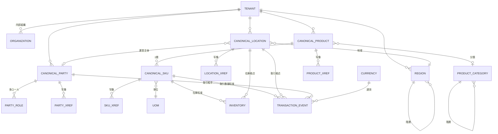

> `INVENTORY` / `TRANSACTION_EVENT` は概念集約であり、実体は各 OLTP のローカルテーブル群
> （小売 `sales_transaction`、メーカー `purchase_orders`、倉庫 `inventory_movement` 等）へ分解される。
> 本図は「正準概念としてどの次元に接続するか」を示すためのもの。

---

## 10. エンティティのライフサイクルと状態遷移

代表的な正準エンティティの状態遷移を stateDiagram-v2 で示す。ステータスは SMALLINT + CHECK で表現し、
日本語文字列ステータスは採らない（ブリーフ §9）。

### 10.1 Party の名寄せ（Merge）ライフサイクル

MDM の中核。取込された取引先候補が正準 Party へ解決されるまでの状態。

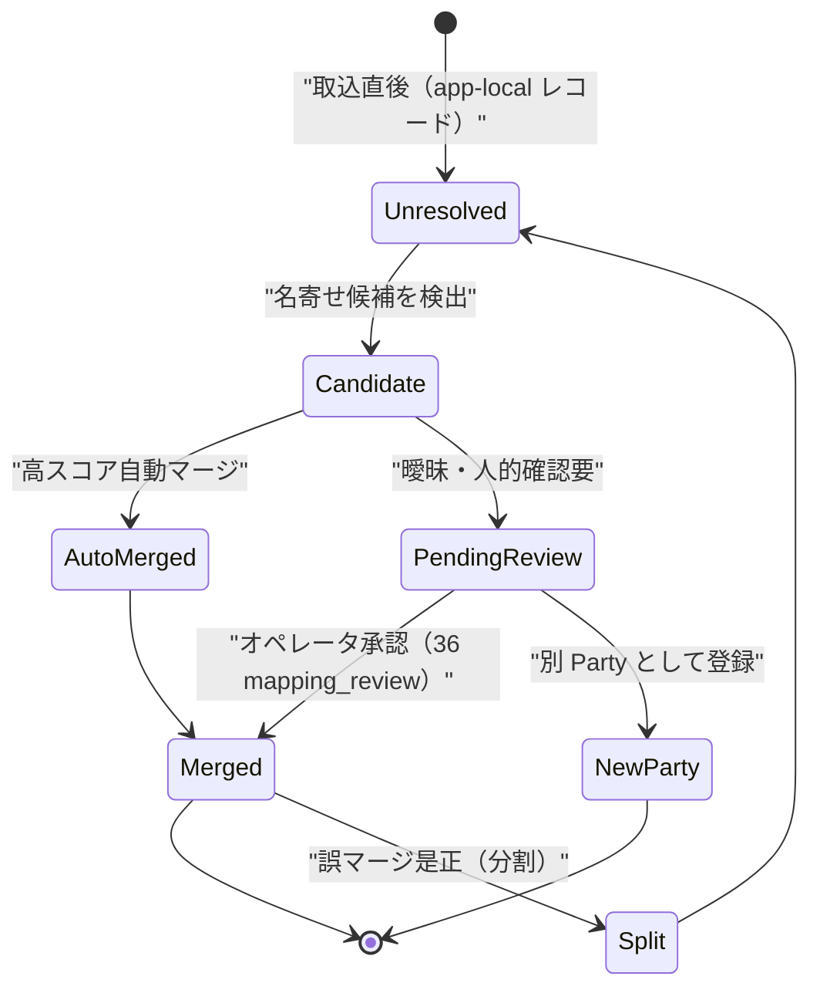

> 名寄せの詳細アルゴリズム・スコアリング・人的レビュー記録は
> [Canonical/MDM/名寄せ](../detailed-design/20-canonical-mdm-reconciliation.md)（20）と
> `mapping_review`（36）が所有する。本書は状態の意味のみを定義する。

### 10.2 ProductFamily / SKU のカタログ状態

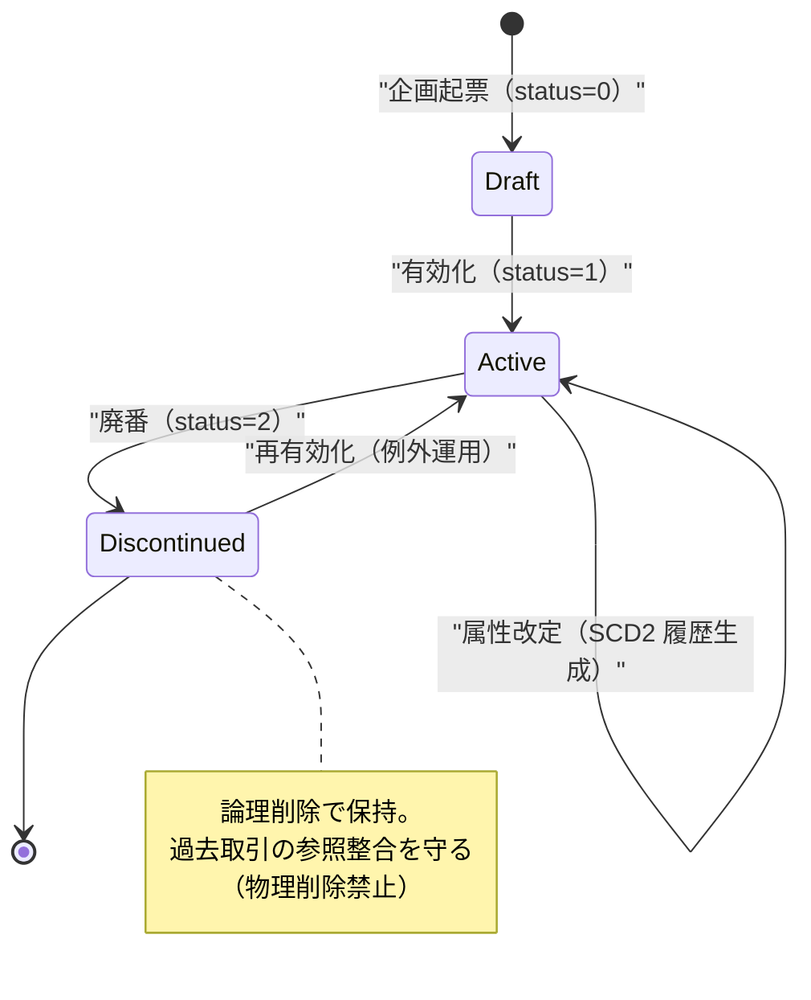

- status は `0=Draft / 1=Active / 2=Discontinued`（ブリーフ §9 の enum ハウススタイル）。
- 属性改定は DWH 側 `dim_product` の **SCD Type2**（valid_from/valid_to/is_current）で履歴化される（35）。
- 廃番は論理削除で保持（Honshu マスタ仕様 §3.3 の「物理削除禁止」を正準方針として継承）。

### 10.3 取引イベント（発注書）の状態 — 業務フロー整合

メーカー発注書は Phase 6 で Active/Cancelled の 2 値に簡素化された
（[業務フロー](../../../.ai-native/domain-context/business-flow/product-master-to-purchase-order-flow.md#33-編集再出力) §3.3）。
正準の取引イベント状態はこれを一般化する。

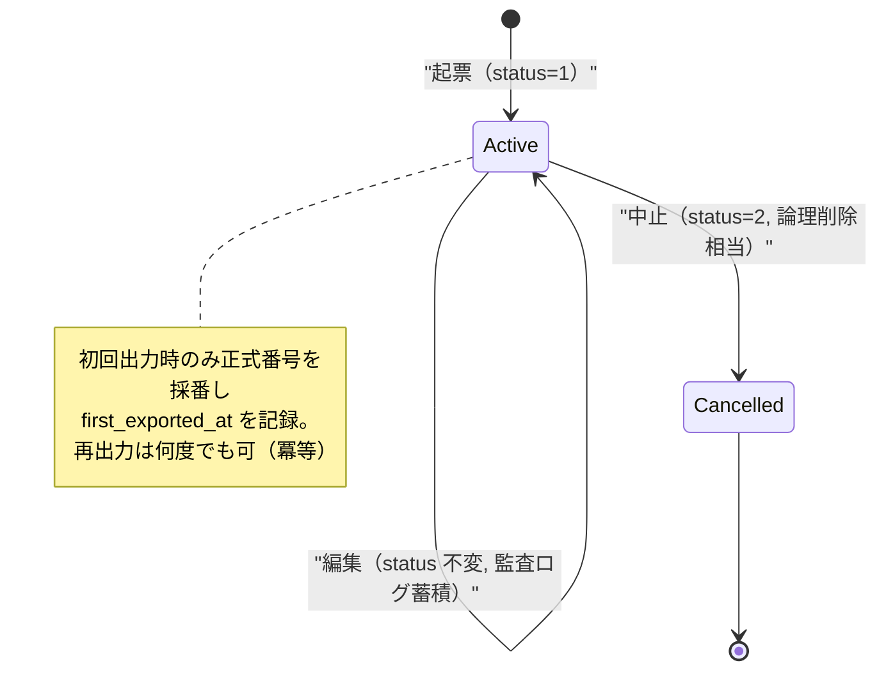

> 状態値・採番規則の物理実装はメーカー OLTP（32）が所有。日本語文字列ステータス
> （'受注'/'出荷済' 等の継承プロトタイプ）は SMALLINT+CHECK に正規化する（ブリーフ §9、§15）。

---

## 11. 共通化 vs 固有拡張の設計方針

SI 戦略「共通化できる部分は最大限共通化、固有事情のみカスタマイズ」（ブリーフ §2）を、
正準モデルでは**3層の拡張戦略**で実現する。

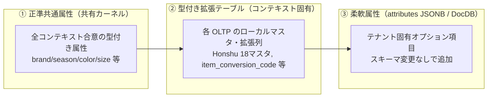

| 層 | 適用対象 | 実現手段 | 所有 |
|----|----------|----------|------|
| ① 正準共通属性 | 全テナント・全コンテキストが同義で使う属性 | 正準エンティティの型付き列 | 34 |
| ② 型付き拡張 | コンテキスト固有だが構造が安定した属性 | 各 OLTP のローカルテーブル/列 | 31-33 |
| ③ 柔軟属性 | テナント固有・可変・疎な属性 | `attributes JSONB` + DocDB(DynamoDB) | 27（SI カスタマイズ）/ 26（DocDB）/ 34 |

- **判断基準:** 「全テナント共通か」→ ①、「コンテキスト内で安定か」→ ②、「テナント固有・可変か」→ ③。
- **JSONB / DocDB の使い分け:** 検索・集計対象になる準構造化属性は PostgreSQL `attributes JSONB`
  （GIN 索引可）、大規模・非構造・読み取りモデルは DynamoDB。詳細は
  [SI カスタマイズ/プロビジョニング](../detailed-design/27-si-customization-provisioning.md)（27）と
  [スナップショット/DocDB](../detailed-design/26-snapshot-docdb.md)（26）へ委譲する。
- **SoT 原則:** テナント拡張属性の SoT は DocDB（ブリーフ §5）。正準共通属性の SoT は Canonical DB。
  ①→②→③ の順に「共通性が下がり・可変性が上がる」ため、**上位層を優先**し、
  安易に ③ へ逃がして正準化を放棄しない（IQ 原則: 汎用化はユーザ価値に貢献する場合のみ）。

---

## 12. 分析軸「商品 × 地域 × 販売先」と次元の対応

ブリーフ §2 の基本分析軸が、正準エンティティおよびスタースキーマの適合次元（35 所有）へ
どう対応するかを明示する。これが「自社アプリを最初から分析連携しやすいスキーマで設計する」ための写像契約である。

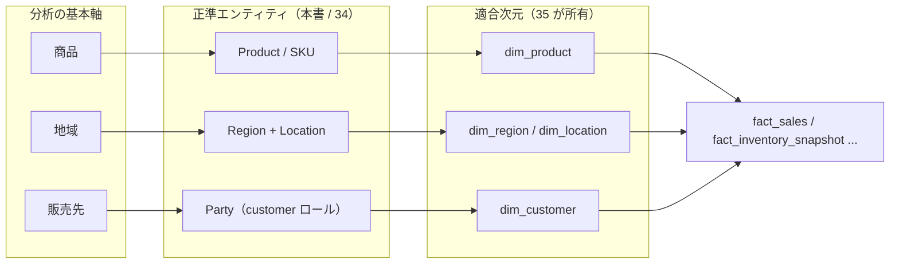

| 分析軸 | 正準エンティティ | 適合次元（35） | 粒度制御 |
|--------|-----------------|----------------|----------|
| 商品 | Product / SKU（2層） | `dim_product`（SKU 粒度 + family/category 階層属性） | 企画/SKU/分類で roll-up |
| 地域 | Region（動的階層）+ Location | `dim_region`（country/prefecture/municipality）/ `dim_location` | level 属性で動的粒度切替 |
| 販売先 | Party（`customer` ロール） | `dim_customer`（`dim_party` に包摂する選択肢あり） | 販売先/チャネルで roll-up |

> `dim_party` を汎用取引先次元として `dim_customer`/`dim_supplier` を包摂するか、分離するかは
> DWH（35）の設計選択（ブリーフ §8）。本書は Party モデルの多ロール性がどちらにも写像可能であることを保証する。

---

## 13. 想定エラーコード

本書が定義する正準ドメインモデルに関わる検証・名寄せ・写像で発生しうる想定エラー
（ブリーフ §10、`DOMAIN-NNN` 形式）。物理実装は各所有ドキュメントが担うが、意味の逆引きのため一覧化する。

| コード | 意味 | 発生箇所 | 主所有 |
|--------|------|----------|--------|
| MAP-001 | クロスウォーク解決失敗（app-local id に対応する正準エンティティ未確定） | 名寄せ/取込 | 20/36 |
| MAP-002 | 名寄せ候補が複数一致し自動解決不能（人的レビュー要） | 名寄せ | 20/36 |
| MAP-003 | 誤マージ検出（Split 要求） | 名寄せ是正 | 20 |
| CMN-001 | テナントスコープ違反（tenant_id 不一致の参照） | 全コンテキスト | 11/37 |
| CMN-002 | 正準エンティティの必須属性欠落（canonical_name/level 等） | Canonical 検証 | 34 |
| CMN-003 | 不正な列挙値（role/location_type/status が CHECK 範囲外） | Canonical 検証 | 34 |
| CMN-004 | 階層の循環参照（Region/ProductCategory の parent ループ） | 階層検証 | 34 |
| ETL-001 | 写像元 source_system/source_record_id の欠落 | 取込 | 21/36 |

---

## 14. データフロー整合性と SoT 宣言

本書が扱うエンティティの SoT を明示する（ブリーフ §5 準拠。CLAUDE.md 原則6）。

| データ | SoT | 派生/キャッシュ | 同期方向 |
|--------|-----|----------------|----------|
| 各アプリのローカルエンティティ（商品/取引先/拠点/取引） | 各 OLTP（31-33） | — | 発生元が権威 |
| 正準エンティティ（ゴールデンレコード） | Canonical DB（34） | OLTP から名寄せ派生 | OLTP → 名寄せ → Canonical |
| クロスウォーク（app-local id ⇄ canonical id） | Canonical DB（34） | — | 名寄せ解決の SoT |
| 適合次元 dim_*（分析用） | 派生（Canonical/Raw 由来, 35） | ○ | Canonical → DWH（一方向） |
| テナント拡張属性 | DocDB（DynamoDB, 26） | 一部読み取りモデルは派生 | 拡張属性は DocDB が SoT |

**原則（ブリーフ §5）:** SoT 側書込を先行、派生/キャッシュは後追い。名寄せは
「イベント受信（OLTP 変更の CDC/Webhook）」と「手動再同期（再名寄せ）」の**両パスを欠落なく**設計する
（詳細は 20/21 が所有）。正準側から OLTP へは書き戻さない（逆流は不整合の温床）。

---

## 15. 未決事項 / 論点

| # | 論点 | 選択肢とトレードオフ | 委譲先 |
|---|------|---------------------|--------|
| 1 | `dim_party` 単一 vs `dim_customer`/`dim_supplier` 分離 | 単一=適合次元が簡潔・多ロール自然／分離=クエリ直感的だが Party 多ロールと二重化 | 35 で確定 |
| 2 | Region をテナント共有にするか、テナントスコープにするか | 共有=地域マスタの重複排除・標準コード一元化／スコープ=テナント境界厳格・RLS 一貫。共通地域（JIS）は共有、商圏定義はスコープのハイブリッドも候補 | 34 / 11 で確定 |
| 3 | 地域コードの標準準拠（JIS X 0401/0402 / 独自コード / 国際 ISO 3166） | 標準=相互運用・外部データ結合容易／独自=既存資産流用。mesh 粒度は標準地域メッシュ（JIS X 0410）採用可否 | 34 で確定 |
| 4 | 11桁品番の正準側からの再構築保証 | 保証する=双方向同期可能だが変換ルールを共有カーネルに漏らす／保証しない（本書採用）=ローカル SoT を尊重。将来メーカー分離時の影響 | 32 / 20 |
| 5 | Party の階層（親会社-子会社-事業所）の表現 | Party 自己参照 vs Organization で表現 vs Location office で近似。取引先グループ分析の要否次第 | 34 で確定 |
| 6 | 拡張属性の「集計対象化」判断基準（JSONB 昇格 → 型付き列化のトリガ） | 使用頻度/検索頻度の閾値をどこに置くか。SI カスタマイズ運用と連動 | 27 で確定 |
| 7 | Calendar/Time を正準エンティティとして持つか、DWH `dim_date` のみか | 業務日付の会計期/シーズン定義をテナント別に持つ必要があれば正準化。現状は 35 `dim_date` に集約 | 35 で確定 |

---

## 関連ドキュメント

- [基本設計: 構想と全体像](./01-concept-and-vision.md)（01） — 本書の上位。ビジョン・スコープ・分析軸の出所。
- [基本設計: 全体アーキテクチャ](./02-overall-architecture.md)（02） — プレーン構成・コンテキスト配置の全体像。
- [データベース設計: MDM/Canonical スキーマ](../database-design/34-mdm-canonical-schema.md)（34） — 本書の正準エンティティの**物理所有**。
- [データベース設計: スタースキーマ DWH](../database-design/35-star-schema-dwh.md)（35） — 適合次元・ファクトの**物理所有**。
- [詳細設計: Canonical/MDM/名寄せ](../detailed-design/20-canonical-mdm-reconciliation.md)（20） — 名寄せアルゴリズム・状態遷移の実装。
- [詳細設計: 取込とマッピングパイプライン](../detailed-design/21-ingestion-mapping-pipeline.md)（21） / [データベース設計: マッピングメタデータ](../database-design/36-mapping-metadata.md)（36） — クロスウォーク・写像の実装。
- [用語集](../overview/00-glossary.md)（00） — ユビキタス言語の正規定義。
- グラウンディング: [Honshu マスタ仕様](../../../.ai-native/domain-context/industry/honshu-master-schema.md)、[商品マスタ→発注業務フロー](../../../.ai-native/domain-context/business-flow/product-master-to-purchase-order-flow.md)
