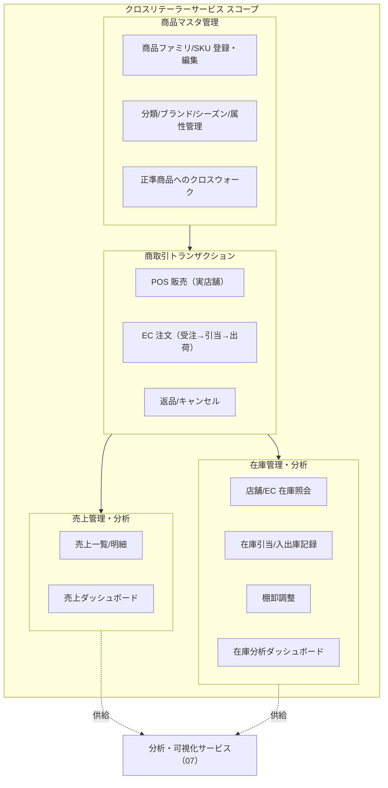
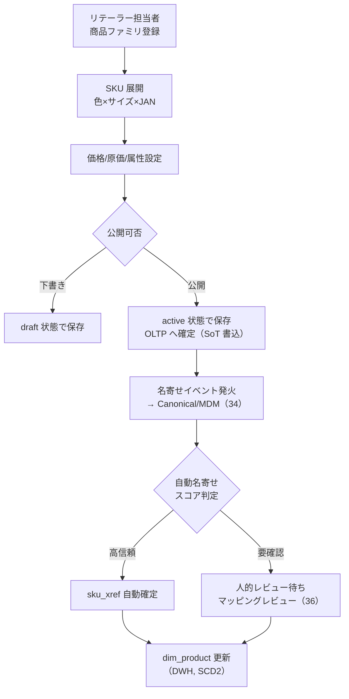
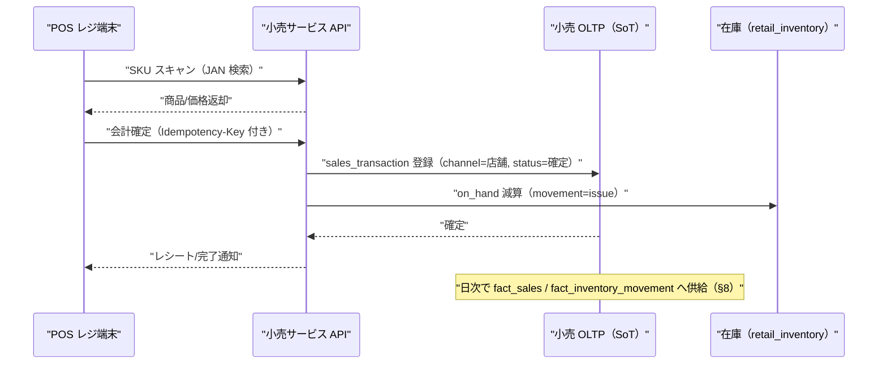
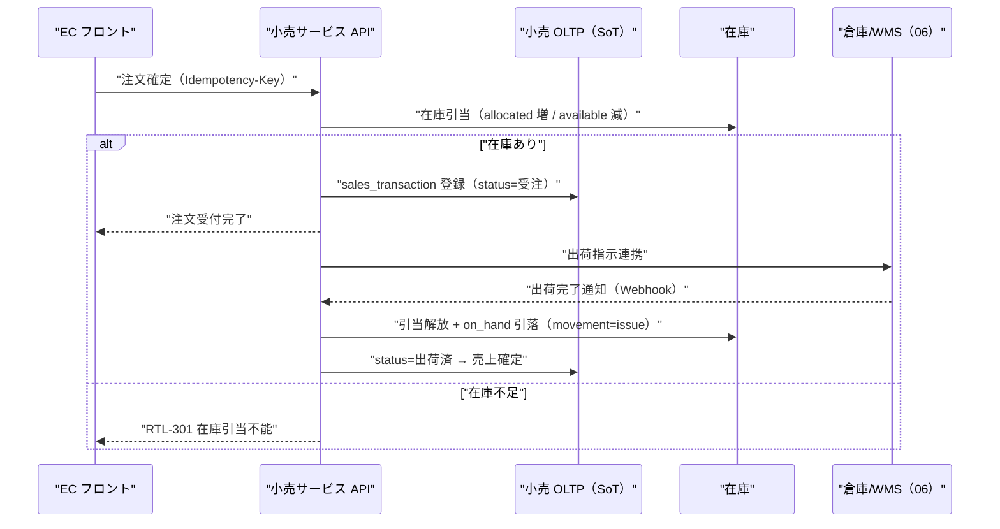
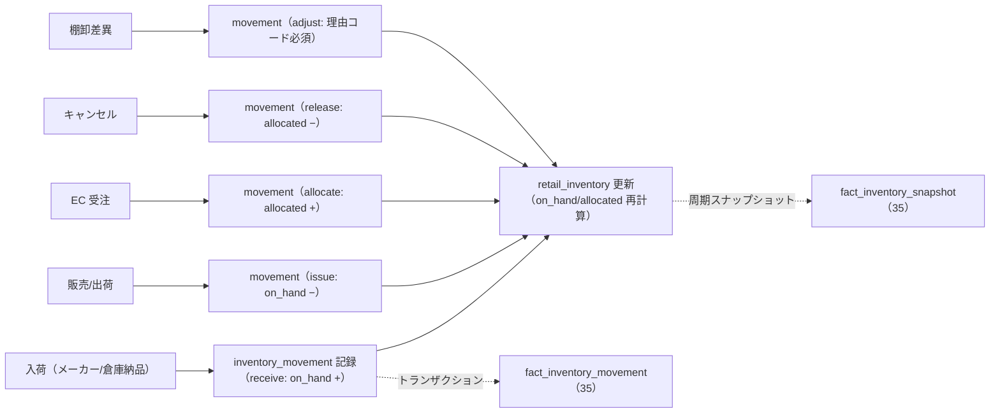
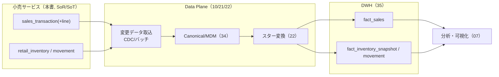
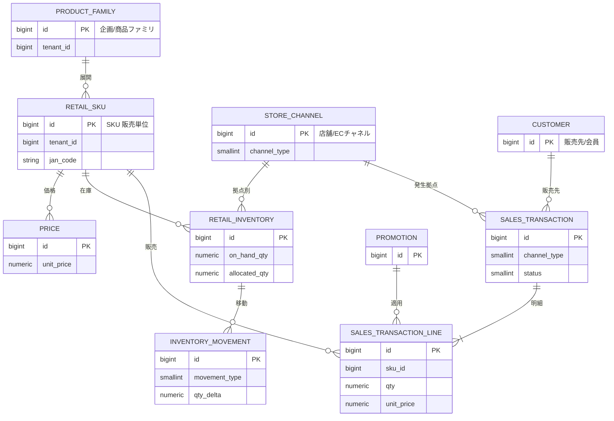
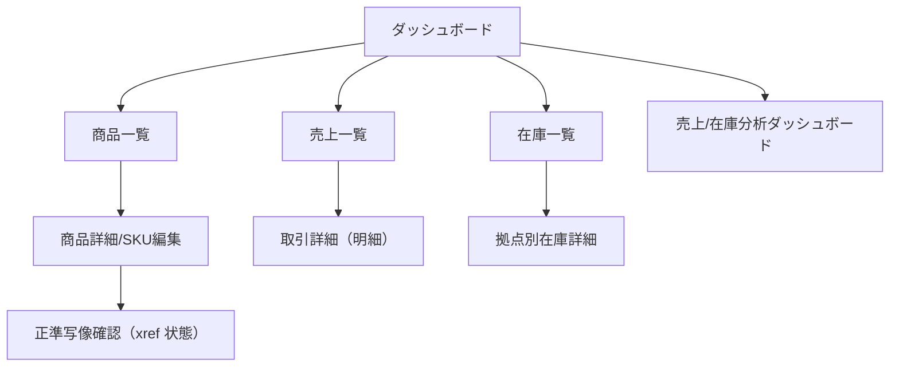
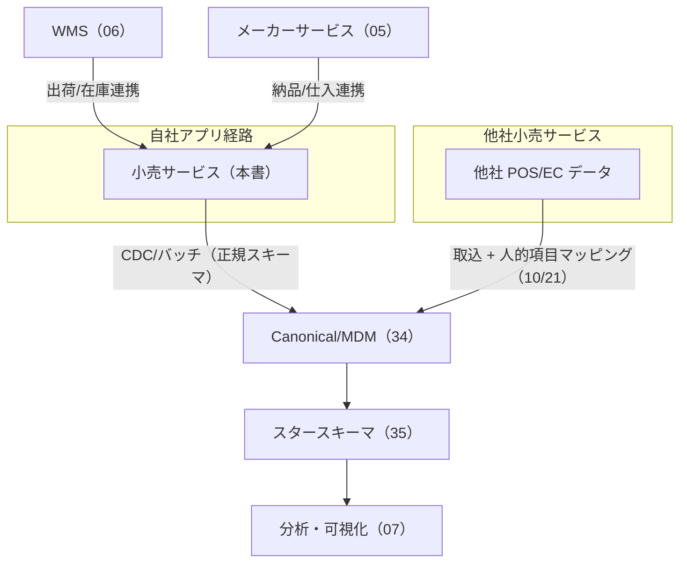
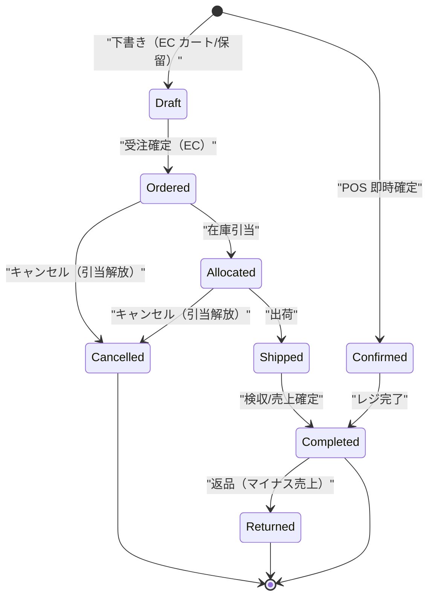

# 基本設計: クロスリテーラーサービス（小売）

本書は **SCIP（Supply Chain Intelligence Platform、コード名）** の自社開発サービス群のうち、
**小売事業者（リテーラー）向けの「クロスリテーラーサービス」** の基本設計を定義する。
店舗経営（POS）と EC の双方を単一のデータ基盤上で扱い、商品マスタ・商取引・売上・在庫を管理しつつ、
そのデータを最初から **スタースキーマ連携前提** で設計することで、分析・可視化プラットフォームへの供給難易度を最小化する。

> **本ドキュメントの所有範囲（owns）:** 小売サービスの**機能・業務フロー・画面・論理データ設計**の権威的記述。
> **物理スキーマ（CREATE TABLE / 索引 / 制約）は本書では定義しない。** 小売 OLTP の物理スキーマは
> [`31 小売OLTP`](../database-design/31-oltp-retail-schema.md) が権威的に所有する。本書はエンティティを
> **論理レベル**で記述し、正準モデル（[`03 正準ドメインモデル`](./03-canonical-domain-model.md) / MDM）および
> スタースキーマ（[`35 DWH`](../database-design/35-star-schema-dwh.md)）への写像方針を示すに留める。
> `canonical_*` / `dim_*` / `fact_*` / `tenant` / `app_user` 等の共通テーブルは所有ドキュメントの定義を参照し、再定義しない。

- **位置づけ:** ファウンデーション・ブリーフ §2 のサービスポートフォリオにおける「小売 / クロスリテーラーサービス（自社開発）」に対応する。
- **土台:** 継承実装 `akebono-honshu`（履物メーカー Honshu の .NET 8 + Nuxt 3 + RDS PostgreSQL）の 2 層商品モデル・
  DDL 慣習・API 規約を踏襲しつつ、**マルチテナント化（`tenant_id` + RLS）** と **スタースキーマ写像容易性** を新たに織り込む。

---

## 1. サービス概要とターゲット

### 1.1 「クロスリテーラー」の意味

本サービスの「クロスリテーラー」は、**複数のリテーラー（小売事業者）をテナントとして横断的に収容し、共通のデータ構造で運用する**ことを指す。
各リテーラーは独立したテナントとして分離（Pooled + RLS、大規模は Silo。ブリーフ §6）されつつ、
プラットフォーム側では **商品 × 地域 × 販売先** という共通軸（ブリーフ §2）でデータが揃うため、
横断分析・ベンチマーク・サプライチェーン連携が可能になる。個社の商流を壊さず、分析基盤に載せることが差別化の源泉である。

### 1.2 ターゲットと対応チャネル

| 軸 | 内容 |
|----|------|
| 対象事業者 | 店舗小売（実店舗を持つリテーラー）、EC 事業者、両方を運営するオムニチャネル事業者 |
| 対応チャネル | **店舗（POS）** / **EC チャネル** / 卸（将来拡張）。`Channel` は正準モデルの `dim_channel`（店舗/EC/卸）に写像 |
| 中核業務 | 商品マスタ管理、商取引トランザクション（販売・返品）、売上管理・分析、在庫管理・分析 |
| 商圏粒度 | 動的（`Region.level` で都道府県〜市区町村を切替。ブリーフ §2/§7） |

### 1.3 提供価値と SoT 宣言

本サービスが SoT（Source of Truth）となるデータと、参照するデータを明示する（ブリーフ §5 の原則: SoT 先行書込 → 派生後追い）。

| データ | 本サービスにおける扱い | SoT | 備考 |
|--------|----------------------|-----|------|
| 小売の商品マスタ（アプリローカル） | **本サービス OLTP が SoT** | 小売 OLTP（テーブルは 31 所有） | canonical_product へクロスウォークで対応づけ |
| 店舗 / EC チャネル（拠点） | **本サービス OLTP が SoT** | 小売 OLTP（31 所有） | canonical_location へ写像 |
| 商取引トランザクション（POS/EC 売上・返品） | **本サービス OLTP が SoT（System of Record）** | 小売 OLTP（31 所有） | fact_sales の源泉 |
| 小売在庫（店舗/EC 在庫、引当） | **本サービス OLTP が SoT** | 小売 OLTP（31 所有） | fact_inventory_snapshot/movement の源泉 |
| 価格 / プロモーション | **本サービス OLTP が SoT** | 小売 OLTP（31 所有） | dim_promotion / 単価の源泉 |
| 正準商品/取引先/拠点/地域（名寄せ済） | **参照のみ**（SoT は MDM） | Canonical DB（34 所有） | 名寄せ解決結果を受領 |
| スタースキーマ dim/fact | **供給元**（SoT は DWH 側の派生） | Redshift（35 所有） | 本サービスは源泉を提供、集計値は生成しない |
| テナント / ユーザ / 権限 | **参照のみ** | Control Plane（37 所有） | RLS の `tenant_id`、監査列の `app_user` FK |

---

## 2. スコープと機能一覧

**スコープ外（他ドキュメント所有）:** 名寄せ・MDM（34/20）、取込マッピング（10/21）、スタースキーマ変換（22/35）、
分析ダッシュボードの集計エンジン本体（07/35。本サービスは源泉供給と軽量な自サービス内ビューまで）、
契約・課金・エンタイトルメント（09/37）。

---

## 3. 主要機能

### 3.1 商品マスタ管理

継承実装 Honshu の **2 層商品モデル**（`product_family`（企画/商品ファミリ）＋ `product`（SKU、色×サイズで増殖））を踏襲する（ブリーフ §7/§15）。
小売はメーカーと異なり**自社で製造しない商品も扱う**ため、商品ファミリは「取扱商品の企画単位」、SKU は「販売単位（JAN/バーコード対応）」として運用する。

| 機能 | 内容 | 正準/スター写像 |
|------|------|----------------|
| 商品ファミリ管理 | ブランド・カテゴリ・シーズン・商品タイプの登録。分類階層（可変段数）に紐付け | canonical_product（family 属性） / dim_product.family |
| SKU 管理 | 色・サイズ・素材・JAN コード・仕入原価・標準販売価格。論理削除で廃番管理 | canonical_sku / dim_product（SKU 粒度、SCD2） |
| 分類・属性マスタ | category / brand / season / color / size / material 等の動的マスタ（CRUD） | dim_product の階層属性 |
| クロスウォーク登録 | アプリローカル SKU ⇔ canonical_sku の対応づけ（自動名寄せ + 人的確認） | sku_xref（34 所有） |
| バーコード/JAN 検索 | POS スキャン・EC 出荷検品用の高速検索（pg_trgm/部分索引） | — |

> **設計方針（データ層）:** 商品は正準モデルの `Product/SKU` 2 層に**そのまま写像できる**構造で持つ。
> 機微値（仕入原価）は既定マスク、明示フラグ + 権限 + 監査ログで開示（ブリーフ §11）。

### 3.2 商取引トランザクション

商取引は **ヘッダ + 明細**（`sales_transaction` + `sales_transaction_line`。31 所有）で表現し、POS と EC を **単一エンティティ**で統合する。
チャネルは `channel_type`（0=店舗POS / 1=EC / 2=卸）で区別し、EC 固有項目（配送先・与信・注文ステータス）は EC のときのみ充足する。

| トランザクション種別 | 起点 | 在庫の扱い | 売上確定タイミング |
|------------------|------|-----------|------------------|
| POS 販売 | 店舗レジ（スキャン） | 即時引落（on_hand 減） | レジ確定＝即時 |
| EC 注文 | EC フロント/カート | 受注時に引当（allocated 増）→ 出荷時に引落 | 出荷/検収時 |
| 返品 | 店舗/EC | on_hand 戻し（要検品） | 返品確定でマイナス売上計上 |
| キャンセル | EC（出荷前） | 引当解除（allocated 減） | 売上未計上のため取消のみ |

> **アンチパターン是正:** 継承実装の ops-data 層（07）は自然キー + 日本語 VARCHAR ステータス（'受注'/'出荷済'）の軽量プロトタイプだが、
> 本サービスでは **SMALLINT + CHECK ステータス・マスタ FK 化・正規化**して設計し直す（ブリーフ §9/§15）。ステータス値は §9 参照。

### 3.3 売上管理・分析

| 機能 | 内容 |
|------|------|
| 売上一覧 | 期間・店舗/チャネル・商品・販売先でフィルタした取引ヘッダ一覧（一覧 API は集約責務を持たない。ブリーフ §11） |
| 売上明細 | 取引 1 件の明細（SKU・数量・単価・値引・原価・粗利）。一覧とは別 API（責務分離） |
| 自サービス内サマリー | 日次/店舗別/カテゴリ別の軽量集計（自 OLTP 内の即応ビュー。重い横断分析は 07 に委譲） |
| 分析供給 | fact_sales の源泉として日次で Data Plane へ供給（§8） |

measures は fact_sales（ブリーフ §8）の `qty, gross_amount, net_amount, cost_amount, margin_amount, discount_amount, return_qty` を**トランザクション明細から算出可能**な形で保持する。

### 3.4 在庫管理・分析

在庫は **SKU × Location（店舗/EC チャネル）** の粒度で保持し、`on_hand`（実在庫）/ `allocated`（引当済）/ `available`（＝on_hand − allocated）の 3 値を管理する（ブリーフ §7）。

| 機能 | 内容 | スター写像 |
|------|------|-----------|
| 在庫スナップショット照会 | 拠点別・SKU 別の現在在庫（on_hand/allocated/available） | fact_inventory_snapshot（周期スナップショット） |
| 入出庫記録 | 入荷（メーカー/倉庫からの納品）・出庫（販売・出荷）・移動（店舗間）の移動イベント | fact_inventory_movement（トランザクションファクト） |
| 引当 | EC 受注時の在庫確保（allocated 増）、キャンセル/出荷での解放/引落 | movement（allocate/release/issue） |
| 棚卸調整 | 実棚差異の調整記録（監査可能。理由コード必須） | movement（adjust） |
| 在庫分析 | 滞留・欠品・回転率の分析源泉供給 | fact_inventory_snapshot / movement |

---

## 4. 主要ユースケースと業務フロー

### 4.1 商品登録から正準写像まで

> SoT 書込（OLTP 確定）を先行し、正準/DWH は**イベント + 手動再同期の両パス**で後追いする（ブリーフ §5、CLAUDE.md 原則6）。

### 4.2 販売フロー（POS：実店舗）

### 4.3 販売フロー（EC：受注→引当→出荷）

### 4.4 在庫更新フロー（入荷・棚卸）

> `available` は保存列ではなく `GENERATED ALWAYS AS (on_hand_qty - allocated_qty) STORED`（物理定義は 31）で導出し、整合を DB レベルで保証する。

### 4.5 売上/在庫分析の供給フロー

---

## 5. エンティティモデルと正準/スター写像

### 5.1 論理 ER（本サービスが SoT の主要エンティティ）

> 下図は**論理モデル**。物理 DDL（列型・制約・索引・`tenant_id`/RLS/監査列）は [`31 小売OLTP`](../database-design/31-oltp-retail-schema.md) が所有する。

### 5.2 正準モデル / スタースキーマへの写像表

各エンティティが**最初からスター写像しやすい**構造で設計されていることを示す（ブリーフ §2 の差別化要件）。

| 本サービスのローカルエンティティ | 正準モデル（34 所有） | クロスウォーク | スタースキーマ（35 所有） |
|--------------------------------|----------------------|---------------|--------------------------|
| RETAIL_SKU / PRODUCT_FAMILY | canonical_sku / canonical_product / product_category | sku_xref / product_xref | dim_product（SKU 粒度, SCD2） |
| STORE_CHANNEL（店舗/EC） | canonical_location（type=store/ec_channel）+ region | location_xref | dim_location / dim_channel / dim_region |
| CUSTOMER（販売先/会員） | canonical_party（role=customer） | party_xref | dim_customer |
| SALES_TRANSACTION_LINE | — | — | **fact_sales**（SKU×拠点/チャネル×日付×販売先） |
| INVENTORY_MOVEMENT | — | — | **fact_inventory_movement** |
| RETAIL_INVENTORY（周期断面） | — | — | **fact_inventory_snapshot**（SKU×拠点×日付） |
| PROMOTION | — | — | dim_promotion |

### 5.3 fact_sales へ供給する measures の由来

| fact_sales measure（35 定義） | 本サービスでの由来（明細から算出） |
|------------------------------|--------------------------------|
| qty | sales_transaction_line.qty |
| gross_amount | qty × unit_price |
| discount_amount | プロモーション/値引適用額 |
| net_amount | gross_amount − discount_amount |
| cost_amount | qty × 仕入原価（機微値・マスク対象） |
| margin_amount | net_amount − cost_amount |
| return_qty | 返品トランザクションの数量 |

> **キー設計（review-standards 1.2）:** PK はすべて意味を持たない `id BIGSERIAL`（ブリーフ §9）。JAN/SKU コードは業務自然キーだが PK にはせず、
> `uq_<table>_(tenant_id, jan_code)` の**テナントスコープ一意制約**で担保する（ブリーフ §6）。複合キーによる強い制約は避ける。

---

## 6. EC 対応と店舗対応の差分

単一の `sales_transaction` / `retail_inventory` でチャネルを統合しつつ、以下の差分をチャネル種別で分岐する。

| 観点 | 店舗（POS） | EC |
|------|-----------|-----|
| 拠点 | store（実店舗）。地域＝店舗所在地 | ec_channel（論理拠点）。地域＝配送先で集計 |
| 在庫引当 | なし（即時引落） | あり（受注時 allocate → 出荷時 issue） |
| available の意味 | 店頭実在庫 | 販売可能在庫（引当控除後）＝ 欠品判定に使用 |
| 売上確定 | レジ確定＝即時 | 出荷/検収時 |
| 追加項目 | — | 配送先住所、注文ステータス、与信、出荷連携（WMS/06）、決済 |
| 返品 | 店頭返品（即時） | 返品受領検品後に確定 |
| ステータス遷移 | 確定 → （返品） | 受注 → 引当 → 出荷 → 完了（各段でキャンセル/返品分岐） |

> **変更耐性（review-standards 3.2）:** `channel_type` は将来「卸」「マーケットプレイス」等が増える可能性があるため、
> 固定 2 分岐ではなく **SMALLINT + CHECK の enum 相当**で定義し、分岐ロジックはチャネル属性で駆動する。

---

## 7. 画面構成の骨格とレスポンシブ方針

### 7.1 画面一覧（Nuxt 3 SPA）

| 画面 | 種別 | 主コンテンツ | API 責務（ブリーフ §11） |
|------|------|------------|------------------------|
| 商品一覧 | 一覧 | 商品ファミリ/SKU の検索・フィルタ | 一覧取得のみ（集約なし） |
| 商品詳細 | 詳細 | SKU 属性・価格・原価（マスク）・xref 状態 | 詳細取得（別 API） |
| 売上一覧 | 一覧 | 期間/店舗/チャネル別トランザクション | 一覧取得のみ |
| 取引詳細 | 詳細 | 明細行・数量・単価・粗利 | 詳細取得（別 API） |
| 在庫一覧 | 一覧 | 拠点×SKU の on_hand/available | 一覧取得のみ |
| 分析ダッシュボード | 分析 | 売上/在庫の集計チャート（07 のメトリクス/スナップショット取得） | メトリクスクエリ/スナップショット |

### 7.2 レスポンシブ方針（CLAUDE.md 原則8 / U-2）

- **PC:** 一覧・在庫・売上は**表（テーブル）** で高密度表示。ソート・列固定・一括操作を提供。
- **モバイル:** 表を **カード型レイアウト**に切替（1 レコード＝1 カード、主要指標を大きく、詳細は展開）。POS/店舗現場・EC 運用者のスマホ利用を前提。
- ダッシュボードのチャートはコンテナ幅追従。横長テーブルは `overflow-x: auto` の専用スクロール領域に収め、ページ本体は横スクロールさせない。
- U-4（エラー時誘導）: 在庫引当失敗・重複登録等は次アクション（入荷待ち/再試行/上書き確認）を明示。

---

## 8. 他アプリ / 他社小売サービス連携と分析供給

### 8.1 連携点

- **自社アプリ経路:** 本サービスは最初から正準/スター写像可能なスキーマで持つため、取込は**項目マッピング不要**（差別化点。ブリーフ §2）。
- **他社小売サービス経路:** 他社 POS/EC は Data Plane の取込口に接続し、[`10 データ連携とマッピング`](./10-data-integration-and-mapping.md) の人的マッピングで正規化される。本サービスと**同じ canonical/fact に着地**する。
- **WMS（06）連携:** EC 出荷指示・出荷完了 Webhook・倉庫在庫の突合。**手動再同期パス**も設ける（イベント欠落時の回復。ブリーフ §5、CLAUDE.md 原則6-2）。
- **メーカーサービス（05）連携:** 仕入・納品データの受領（在庫入荷の源泉）。

### 8.2 分析サービスへの供給契約

| 供給対象（35） | 粒度 | 頻度 | 冪等性 |
|--------------|------|------|--------|
| fact_sales | 明細×日付 | 日次 CDC/バッチ | load_run 単位で再実行可（36）。`Idempotency-Key`/`source_record_id` で重複排除 |
| fact_inventory_movement | 移動イベント | 準リアルタイム/日次 | 同上 |
| fact_inventory_snapshot | SKU×拠点×日 | 日次周期スナップショット | 日付キーで冪等 upsert |

> **データフロー整合（review-standards 2.3 / CLAUDE.md 原則6）:** 本サービス OLTP（SoT）→ Data Plane（派生）の一方向。
> 逆流（DWH → OLTP 書戻し）は行わない。来歴列 `source_system`/`source_record_id`/`legacy_id`（ブリーフ §9）で追跡可能にする。

---

## 9. 状態遷移とステータス定義

商取引ステータスは **SMALLINT + CHECK**（日本語文字列ステータスは踏襲しない。ブリーフ §9/§15）。

| status（SMALLINT） | 意味 | 適用チャネル |
|------|------|------------|
| 0 | Draft（下書き/カート） | EC |
| 1 | Ordered（受注） | EC |
| 2 | Allocated（引当済） | EC |
| 3 | Shipped（出荷済） | EC |
| 4 | Confirmed（POS 確定） | 店舗 |
| 5 | Completed（完了/売上確定） | 共通 |
| 8 | Cancelled（取消） | EC |
| 9 | Returned（返品） | 共通 |

在庫移動 `movement_type`（SMALLINT）: 0=receive（入荷）/1=issue（出庫）/2=allocate（引当）/3=release（引当解放）/4=transfer（移動）/5=adjust（棚卸調整）。

---

## 10. 想定エラーコード（RTL-NNN）

ブリーフ §10 のドメイン接頭辞 `RTL`（小売）に準拠。RFC 7807 Problem Details の `code` フィールドに格納する（ブリーフ §11）。

| コード | 発生機能 | 意味 | 重大度 | 対処/誘導（U-4） |
|--------|----------|------|--------|-----------------|
| RTL-001 | 共通 | テナントスコープ外アクセス（RLS 違反/`X-Tenant-Id` 不一致） | CRITICAL | 403。再認証/権限確認 |
| RTL-002 | 共通 | 必須項目欠落/バリデーションエラー | WARNING | 入力補正を誘導 |
| RTL-101 | 商品マスタ | SKU コード/JAN のテナント内重複 | WARNING | 既存 SKU の参照/上書き確認 |
| RTL-102 | 商品マスタ | 商品ファミリ未存在で SKU 登録 | WARNING | 先に商品ファミリ登録を誘導 |
| RTL-103 | 商品マスタ | 廃番（論理削除済）SKU への操作 | WARNING | 再有効化 or 新規登録を誘導 |
| RTL-104 | 商品マスタ | 正準写像未確定（xref 未解決）での分析供給要求 | INFO | 名寄せ確認待ちを通知（36 レビューへ） |
| RTL-201 | 商取引 | 販売価格未設定の SKU を販売 | WARNING | 価格登録を誘導 |
| RTL-202 | 商取引 | Idempotency-Key 重複（二重会計/二重注文） | INFO | 既存トランザクション結果を返却 |
| RTL-203 | 商取引 | 不正なステータス遷移（例: Shipped→Ordered） | WARNING | 現在状態を提示し可能な操作へ誘導 |
| RTL-204 | 商取引 | 出荷済トランザクションのキャンセル要求 | WARNING | 返品フローへ誘導 |
| RTL-301 | 在庫 | 在庫引当不能（available 不足） | WARNING | 入荷待ち/一部引当/取寄せを誘導 |
| RTL-302 | 在庫 | 引当解放対象が存在しない | WARNING | 引当状態を再照会 |
| RTL-303 | 在庫 | 棚卸調整の理由コード未指定 | WARNING | 理由コード入力を必須化 |
| RTL-304 | 在庫 | on_hand が負になる移動 | CRITICAL | 移動を拒否しログ記録。整合性調査へ |
| RTL-401 | 連携 | WMS 出荷完了 Webhook の突合失敗（対象注文不明） | WARNING | 手動再同期パスへ誘導 |
| RTL-402 | 連携 | 分析供給バッチの重複ロード | INFO | load_run 冪等で無害化・記録のみ |
| RTL-501 | 権限 | 機微値（仕入原価）の未権限開示要求 | WARNING | 既定マスク維持。開示は権限+監査ログ必須 |

> **エラーハンドリング（review-standards 3.4 / CLAUDE.md 原則4）:** 補助処理（名寄せ・分析供給・Webhook 突合）の失敗は主要フロー（販売確定）を止めない
> グレースフルデグラデーション。致命的（RTL-001/RTL-304）のみ例外を投げる。全想定エラーにコードを付与し逆引き可能に一元管理する。

---

## 11. 非機能・テナンシー観点（サマリ）

詳細は [`11 非機能/セキュリティ/テナンシー`](./11-nonfunctional-security-tenancy.md) が所有。本サービス固有の要点のみ記す。

- **テナント分離:** 全テーブルに `tenant_id BIGINT NOT NULL`、RLS で `tenant_id = current_setting('app.tenant_id')::bigint` を強制（ブリーフ §6）。一意制約はすべてテナントスコープ。
- **認証/認可:** Firebase Bearer + tenant クレーム解決、任意で `X-Tenant-Id` 突合（不一致 403 = RTL-001）。全 API 認可必須。
- **機微データ:** 仕入原価・粗利は既定マスク。開示は権限 + 明示フラグ + 監査ログ（audit_logs は 37 所有、append-only）。
- **パフォーマンス（RP-6）:** 一覧・在庫照会・POS スキャンは 100–200ms 目標。重集計はスナップショット（07/26）へ委譲し体感停止を回避。
- **TZ 方針:** プラットフォーム標準の `TIMESTAMPTZ`（UTC 保存・テナントローカル表示）。業務日付は DATE。継承実装の JST-naive TIMESTAMP は採用しない（ブリーフ §9）。

---

## 12. 未決事項 / 論点

| # | 論点 | 選択肢とトレードオフ | 暫定方針 |
|---|------|--------------------|----------|
| 1 | 商品ファミリの必須度 | (a) 小売でも 2 層必須 / (b) SKU 単層も許容（雑貨系リテーラー） | 暫定(a)。単層要件が出れば family を「暗黙 1:1」で吸収する拡張を検討 |
| 2 | EC 在庫引当の粒度 | (a) チャネル論理在庫で引当 / (b) 倉庫（WMS/06）実在庫と同期引当 | 暫定(a)。オムニチャネルの在庫共有は 06 と協議（分散在庫の SoT 境界） |
| 3 | 分析供給の鮮度 | (a) 日次バッチ / (b) 準リアルタイム CDC | 暫定(a)。在庫欠品判定のリアルタイム要件次第で(b)（コスト増） |
| 4 | 決済/会計連携 | 本サービス内で決済ステータスを持つか、外部決済/会計に委ねるか | スコープ外候補。09 バックオフィス/外部連携で判断 |
| 5 | 会員（CUSTOMER）の正準化 | 個人情報を canonical_party に載せる範囲（プライバシー境界） | 11 非機能・34 MDM と協議。分析は非識別化集計を基本 |
| 6 | 卸チャネルの扱い | channel_type=卸 を本サービスで扱うか、メーカー側（05）で扱うか | 暫定: 小売の卸出荷は本サービス、メーカー出荷は 05。要整理 |

---

## 13. 関連ドキュメント

- [`03 正準ドメインモデル`](./03-canonical-domain-model.md) — 共通エンティティ（Product/SKU・Location・Party・Region）の定義。本書はこれへ写像。
- [`07 分析・可視化サービス`](./07-service-analytics.md)（document_id: service-analytics） — 本サービスが供給する fact の消費側。集計・ダッシュボードの本体。
- [`10 データ連携とマッピング`](./10-data-integration-and-mapping.md) — 他社小売サービスの取込・人的マッピング経路。
- [`31 小売OLTP`](../database-design/31-oltp-retail-schema.md)（document_id: oltp-retail-schema） — 本サービスの**物理スキーマを権威的に所有**（CREATE TABLE / 索引 / 制約 / tenant_id / RLS）。
- [`02 全体アーキテクチャ`](./02-overall-architecture.md) — 5 プレーンと本サービスの位置づけ。
- [`35 スタースキーマDWH`](../database-design/35-star-schema-dwh.md) — dim/fact の権威的定義（本書は写像方針のみ）。
- 参考: [`01 構想と全体像`](./01-concept-and-vision.md)、[`05 メーカーサービス`](./05-service-manufacturer.md)、[`06 WMS`](./06-service-wms.md)。
