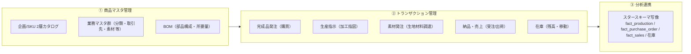
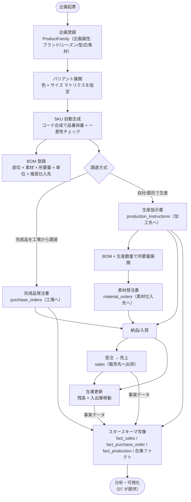
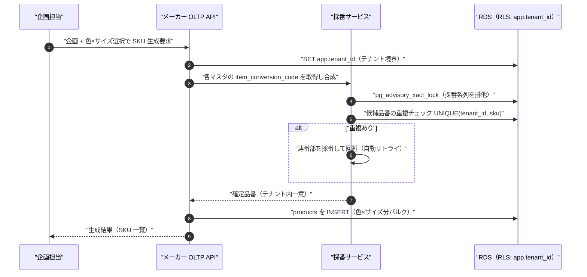
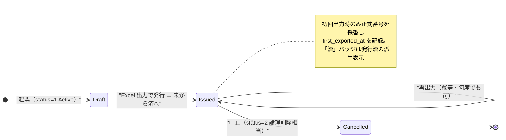
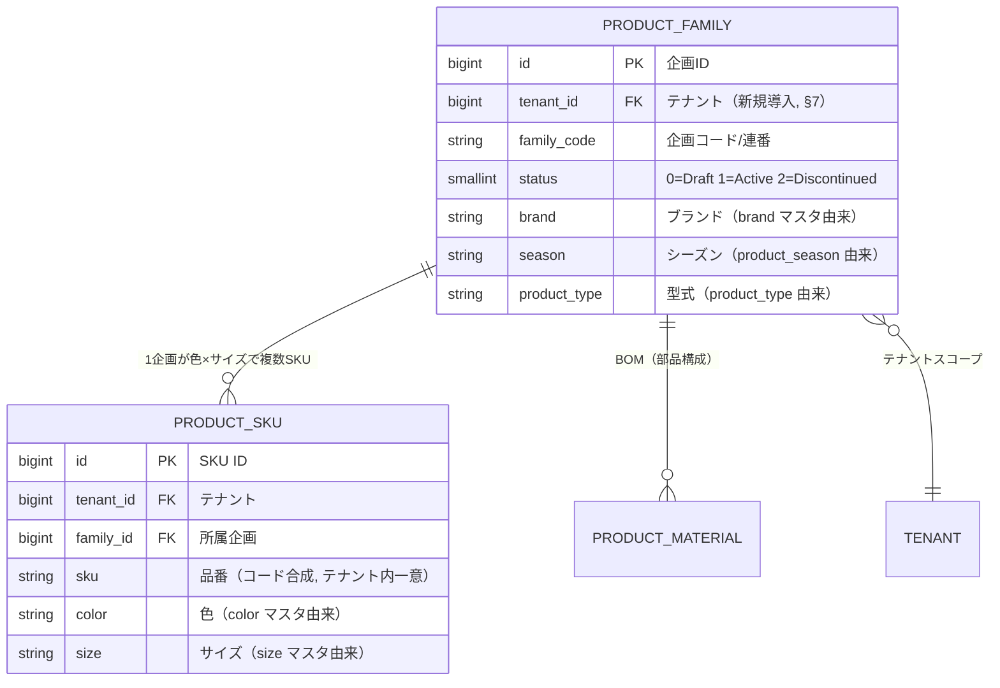
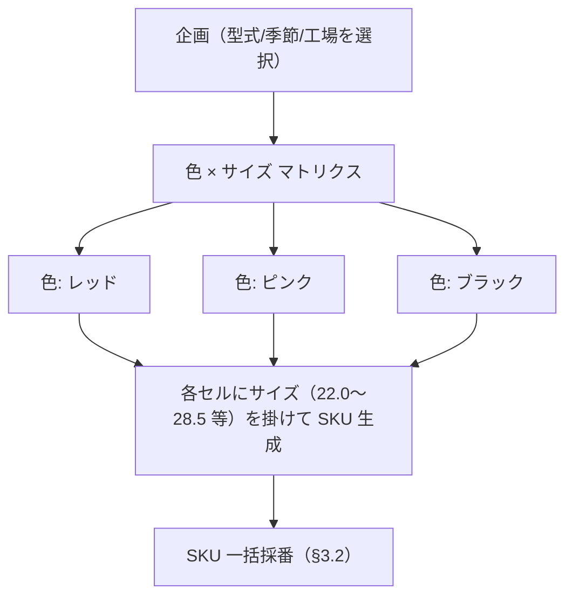
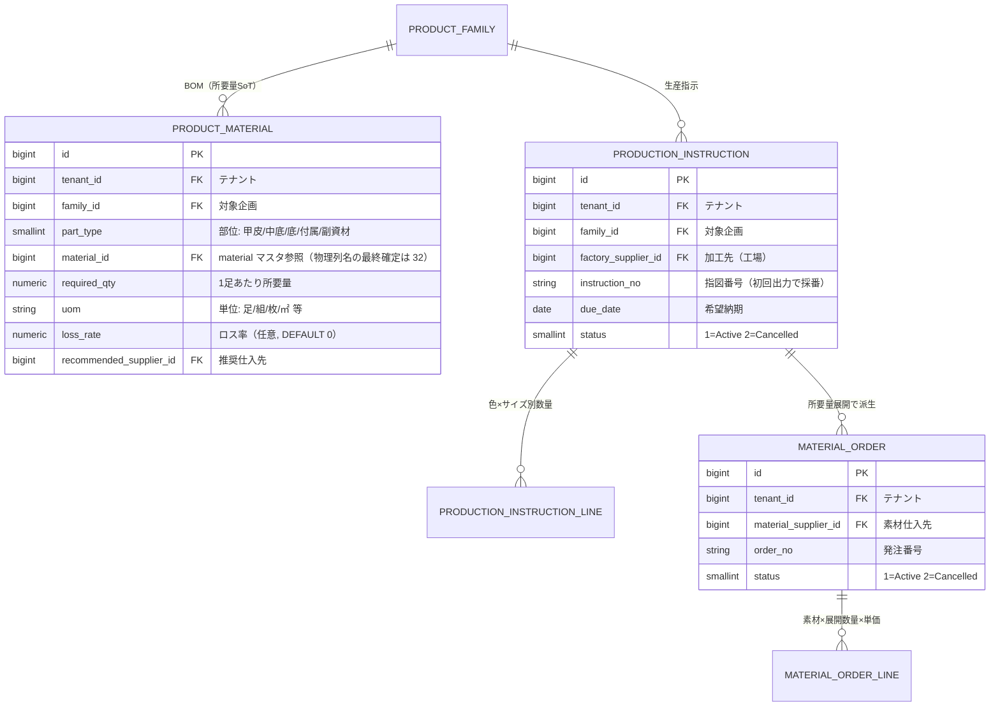
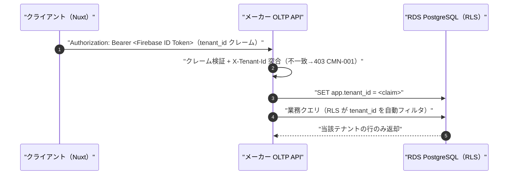
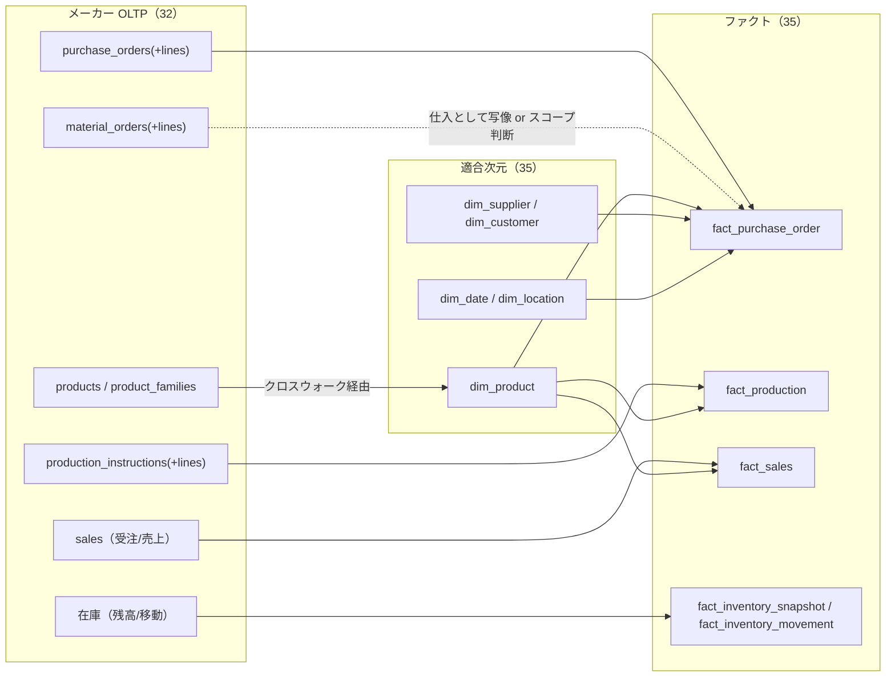

# 基本設計: メーカー向けサービス

本書は **SCIP（Supply Chain Intelligence Platform、コード名。正式名称は未確定）** の
**メーカー向けサービス**の機能・業務・データフローを基本設計として定義する。
リファレンス実装である履物メーカー Honshu の単一テナント実装（`akebono-honshu`、.NET 8 + Nuxt 3 + RDS PostgreSQL）を
**汎用化**し、マルチテナント SaaS のメーカーコンテキスト（[正準ドメインモデル](./03-canonical-domain-model.md) §3 の Manufacturer Bounded Context）として位置づける。

> **位置づけ / 所有範囲:** 本書は**メーカーサービスの機能・業務の基本設計**を権威的に所有する。
> メーカー OLTP の**物理スキーマ（CREATE TABLE・制約・索引・RLS・監査列）は
> [メーカー OLTP スキーマ設計](../database-design/32-oltp-manufacturer-schema.md)（32）が所有**し、
> 分析用スタースキーマ（dim/fact）は [スタースキーマ DWH](../database-design/35-star-schema-dwh.md)（35）が、
> 正準エンティティ・写像は [正準ドメインモデル](./03-canonical-domain-model.md)（03）/
> [MDM/Canonical スキーマ](../database-design/34-mdm-canonical-schema.md)（34）が所有する。
> 本書はこれらを**参照するが物理定義を再定義しない**（ブリーフ §14 テーブル所有マップ準拠）。

---

## 1. サービス概要

### 1.1 提供価値とスコープ

メーカー向けサービスは、アパレル/履物/生活雑貨等の **企画・製造・卸を営むメーカー**の基幹業務を支える。
中核は **①商品マスタ管理**と、**②生産・発注・納品・売上・在庫のトランザクション管理**、
そして SCIP プラットフォームの差別化源泉である **③スタースキーマへの分析連携**である。



- **他アプリとの関係:** メーカーサービスは Application Plane / SoR（[全体アーキテクチャ](./02-overall-architecture.md)（02））に属する
  OLTP アプリであり、業務トランザクション/マスタの **System of Record（SoT）**である（ブリーフ §5）。
  取引先・商品・拠点・地域の**正準版は 34（MDM）が所有**し、メーカー OLTP はローカルエンティティを保持して
  クロスウォーク（`product_xref`/`party_xref` 等）で正準版へ写像する。
- **分析連携の前提設計:** 自社アプリであるメーカーサービスは、**最初からスタースキーマへ写像しやすいスキーマ**で設計される
  （ブリーフ §2「差別化の源泉＝分析連携難易度の低さ」）。日本語文字列ステータス等の
  プロトタイプ由来アンチパターンは踏襲せず、`SMALLINT + CHECK` に正規化する（§8.4、ブリーフ §9/§15）。

### 1.2 機能ブロック一覧

| ブロック | 機能 | 主エンティティ（物理所有=32） | 主エラーコード接頭辞 |
|----------|------|------------------------------|----------------------|
| 商品カタログ | 企画登録・SKU 生成（色×サイズ展開）・品番自動採番・カタログ状態管理 | `product_families`, `products` | PROD |
| 業務マスタ | 分類/取引先/素材/物流/文書テンプレート等のマスタ CRUD（論理削除） | 18マスタ（§4） | MASTER |
| BOM | 部位×素材×所要量×単位×推奨仕入先の部品構成登録 | `product_materials` | BOM |
| 完成品発注 | OEM 工場への完成品発注書作成・Excel 出力・採番・編集 | `purchase_orders`(+lines) | ORDER |
| 生産指示 | 加工指図書の作成・色×サイズ内訳・Excel 出力・未/済 | `production_instructions`(+lines) | PINST |
| 素材発注 | BOM×生産数量の所要量展開・素材仕入先別発注書・Excel 出力・未/済 | `material_orders`(+lines) | MORD |
| 納品・売上 | 受注/売上/納品トランザクション（正規化再設計） | sales(受注/売上), deliveries | ORDER |
| 在庫 | SKU×拠点の在庫残高・入出庫移動（正規化再設計） | 在庫 | PROD |
| 分析連携 | ファクトへの写像（ETL は 22 が担当、本書は写像契約を定義） | — | ANL/ETL |

> **リファレンス実装の到達点:** Honshu では商品マスタ→完成品発注書（既存 MVP）に加え、
> BOM・生産指示・素材発注・未/済の生産軸が実装済（`.ai-native/outputs/production-extension-design.md`）。
> 売上/在庫の一部は自然キー＋日本語 VARCHAR ステータスの軽量プロトタイプ（07-ops-data 層）であり、
> **プラットフォームでは正規化・マスタ FK 化・`SMALLINT+CHECK` 化して再設計する**（ブリーフ §15、§8.4）。

---

## 2. Honshu リファレンス実装の一般化方針

Honshu 固有の実装を、メーカー一般に通用する機能設計へ「引き上げる」対応を明示する。
**固有ルール（11桁品番の桁構成等）は共有カーネルに漏らさず**、メーカー OLTP のローカル知識に閉じる
（[正準ドメインモデル](./03-canonical-domain-model.md) §3.2/§7.3）。

| Honshu 固有（リファレンス） | 一般化した機能概念 | 汎用化の要点 |
|-----------------------------|--------------------|--------------|
| 2層商品 `product_families`/`products` | 企画（ProductFamily）× SKU（Product）2層カタログ | 業種非依存。色×サイズは「バリアント軸」の一例に一般化 |
| 11桁品番（年式+型式+季節+連番+工場+色+サイズ） | **コード合成方式の SKU 採番規則**（§5.3） | 桁構成をメタデータ駆動化。マスタの `item_conversion_code` を連結する規則をテナント設定に |
| 18マスタ（`size`/`color`/`supplier` 等） | メーカー業務マスタ群（分類・取引先・素材・物流・文書） | `item_conversion_code` を持つマスタが採番ソース（§4.2） |
| `supplier` が工場を兼用（MVP 判断） | Party の `supplier`/`manufacturer` ロールへ写像 | 工場分離は将来余地。正準側は Party ロールで表現（03 §4.2） |
| BOM `product_materials`（部位×素材×所要量） | 部品構成表（所要量 SoT） | 3部位代表素材 FK は表示用、BOM が所要量の SoT（疎結合、§6.1） |
| 生産指示 `production_instructions` | 加工指図（生産オーダー） | 色×サイズ別生産数量。fact_production の源泉 |
| 素材発注 `material_orders` | 生地材料発注（完成品発注と別系統） | 提案書も製品発注/生地材料発注を分離（§6.3） |
| 日本語 VARCHAR ステータス（07 層） | `SMALLINT + CHECK` 正規化ステータス | 分析連携・多言語のため文字列ステータス廃止 |
| tenant_id 不在（単一テナント） | 全テナントスコープ列に `tenant_id`（§7） | 最大の移行ギャップ。一意性のテナントスコープ化 |
| `TIMESTAMP`(JST-naive) | `TIMESTAMPTZ`(UTC 保存/ローカル表示)（§7.3） | 差分は 32 が移行方針として明記 |

---

## 3. 主要業務フロー

### 3.1 エンドツーエンド業務フロー（企画→品番→生産/発注→納品→売上/在庫→分析）



### 3.2 品番採番フロー（コード合成 + 一意性保証）

品番採番は「マスタ選択 → コード連結 → 一意性チェック → 確定」のフロー（`honshu-product-code-rule.md` §7）。
テナントスコープの一意性と同時実行採番の安全性を保証する。



> 採番の同時実行/リトライ設計は Honshu 実装で `pg_advisory_xact_lock` ＋ `UNIQUE` ＋自動リトライにより確立済
> （`production-extension-design.md` §6 SA C-4）。プラットフォームでは **ロックキーにも tenant_id を含める**（§7.2）。

### 3.3 生産指示・素材発注の状態遷移（未/済 2軸）

品番ごとに「生産指示 未/済」「素材発注 未/済」の 2 軸を可視化する（オペレーター確定判断、
`production-management-flow.md` §3）。ステータスは `SMALLINT + CHECK`。



- **未/済は派生算出:** denormalized 列を持たず、`production_instructions`/`material_orders` の存在・状態から
  `EXISTS` サブクエリ + 部分インデックスで算出する（同期バグ回避、`production-extension-design.md` §3/§6）。
- **BOM 未登録は第3状態:** BOM 未登録の品番は素材発注をブロックし（MORD-001）、バッジは「未（BOM 未登録）」を表示する。

---

## 4. 商品マスタ管理

### 4.1 2層カタログと業務マスタ群

商品は **企画（ProductFamily）× SKU（Product）** の 2 層で表現する（[正準ドメインモデル](./03-canonical-domain-model.md) §7）。
Honshu の 18 マスタ（既存 17 + `user`）を役割で 5 階層に整理する（`honshu-master-schema.md` §3.1）。
物理定義は 32 が所有し、本書は役割と採番寄与を定義する。



| 階層 | マスタ | 役割 | 論理削除列（継承慣習） |
|------|--------|------|------------------------|
| 品番構成系 | `size`, `product_type`, `product_season`, `color`, `supplier` | `item_conversion_code` を持ち品番採番ソース | `delete_flag` |
| 商品属性系 | `brand`, `function`, `material`, `material_classification`, `product_group` | 検索・分類・原価計算 | `delete_flag` |
| 組織・取引先系 | `department`, `country`, `delivery_destination` | 業務組織と取引先情報 | `delete_flag` |
| 物流系 | `warehouse` | ルーティング/物流ノード | `delete_flag` |
| 文書テンプレート系 | `document_template_purchase`, `document_template_confirmation`, `document_text_purchase` | 発注書・確認表の定型文 | `delete_flag` |
| 認証・権限 | `user`（利用者マスタ） | 担当者選択・4権限カテゴリ | 論理削除 |

> **論理削除方針（重要）:** マスタは全て**物理削除禁止・論理削除**（`delete_flag`）。過去取引が削除済みマスタを
> 参照する状況を許容する（`honshu-master-schema.md` §3.3）。ブリーフ §9 は継承実装の慣習
> （マスタ=`delete_flag`、トランザクション=`is_deleted`、子/明細=論理削除なし CASCADE）を**後方互換で維持**すると定める。
> 物理列名・命名の差分は 32 が明記する。

### 4.2 品番構成マスタと `item_conversion_code`

品番採番に寄与するのは `item_conversion_code` を持つ 5 マスタのみ（`honshu-master-schema.md` §3.2）。

| マスタ | `item_conversion_code` の桁 | 例 |
|--------|----------------------------|-----|
| `product_type`（型式） | 2桁目（string(1)） | 'A'=吊込W底 |
| `product_season`（季節） | 3桁目（string(1)） | '2'=春夏。`conversion_order` で同義複数コードを関連付け |
| `supplier`（工場兼用） | 7桁目（string(1)） | 'F'=藤東 |
| `color`（色） | 8-9桁目（string(2)） | '11'=ピンク |
| `size`（サイズ） | 10-11桁目 | '110c' 等 |

> 1桁目「年式」は西暦下1桁への文字マッピング（A=1…K=0、`I` は数字1と混同のため使用不可）で、
> 専用マスタを持たず**コードロジック**で解決する（`honshu-product-code-rule.md` §3.1、§4）。

### 4.3 色×サイズの一括展開 UI

1 企画に対し「色数 × サイズ数」分の SKU が増殖するため、**色 × サイズのマトリクス一括登録**が業務効率上必須
（`honshu-product-code-rule.md` §7）。UI はブリーフ §8（レスポンシブ、CLAUDE.md 原則8）に従い、
PC ではマトリクス表、モバイルではカード型に切替える。



---

## 5. SKU 採番規則（一般化）

### 5.1 コード合成方式

Honshu の 11桁品番は「各マスタの `item_conversion_code` を機械的に連結して自動生成」される
（`honshu-product-code-rule.md` §1）。これを **コード合成方式の採番規則**として一般化する。
桁構成（どの桁がどのマスタの何桁を占めるか）は**テナント設定（メタデータ）**として持ち、
規則そのものはメーカー OLTP のローカル知識に閉じる（共有カーネルに漏らさない、03 §3.2）。

```
[年式1][型式1][季節1][連番3][工場1][色2][サイズ2] = 11桁（Honshu の一実装）
  A     D      2     001    N     00    00
```

| 桁 | 項目 | ソース |
|----|------|--------|
| 1 | 年式 | コードロジック（西暦下1桁マッピング） |
| 2 | 型式 | `product_type.item_conversion_code` |
| 3 | 季節 | `product_season.item_conversion_code` |
| 4-6 | 品番連番 | `product_families.sequence_no`（4桁目はサブ分類の場合あり） |
| 7 | 工場 | `supplier.item_conversion_code` |
| 8-9 | 色 | `color.item_conversion_code` |
| 10-11 | サイズ | `size.item_conversion_code` 由来 |

### 5.2 一意性と重複回避

- **一意性:** `sku` はテナント内で一意。プラットフォームでは `UNIQUE(tenant_id, sku)`（§7.2）。
- **重複回避:** 同一構成が衝突する場合は**品番連番（4-6桁目）で回避**する（§3.2 の自動リトライ）。
- **文字使用制約:** 年式は `I` 使用不可、工場は `I`/`O` 使用不可（数字 1/0 との混同回避、`honshu-product-code-rule.md` §4）。
  採番サービスは合成後に制約バリデーションを行う（違反は PROD-003）。

### 5.3 採番規則のメタデータ駆動化（プラットフォーム拡張）

テナントごとに桁構成・桁数・ソースマスタ・使用禁止文字が異なりうるため、
採番規則を**設定として外部化**する（SI 戦略「固有事情のみカスタマイズ」、ブリーフ §2）。

- Honshu は「11桁・上記構成」を既定プロファイルとして持つ。
- 他メーカーテナントは自社の採番規則をプロファイルとして登録する（詳細は
  [SI カスタマイズ/プロビジョニング](../detailed-design/27-si-customization-and-provisioning.md)（27）へ委譲）。
- **SKU の SoT はメーカー OLTP（32）**。正準側（34）は `sku_xref` で対応づけるのみで、
  正準側からローカル品番を一意に再構築することは保証しない（03 §7.3 の非可逆性注記）。

---

## 6. 生産管理（BOM・生産指示・素材発注）

Honshu の生産軸（`production-management-flow.md` / `production-extension-design.md`）を一般化する。
既存の完成品発注（`purchase_orders`）とは**別系統**である点が中核（提案書 Apparel-ZONE も製品発注/生地材料発注を分離）。



### 6.1 BOM（部品構成・所要量）

- **所要量の SoT は BOM（`product_materials`）**。企画側の 3 部位代表素材 FK（甲皮/中底/底、表示用に存置）とは
  **疎結合**とし、BOM から企画側へは書き戻さない（差分 upsert・書戻しなし、`production-extension-design.md` §3/§6）。
- 付属（面ファスナー等）・副資材（値札/証紙/箱）も `material` マスタに登録して BOM 行にする（甲皮素材も
  `material` マスタ参照で対応、`honshu-master-schema.md` §4-2）。素材マスタ名は §4.1 の `material`（単数）に統一する
  （継承実装の単数マスタ命名慣習に整合。物理列名・参照先の最終確定は 32 に委ねる）。

### 6.2 生産指示（加工指図）

- 品番を選択 → 加工先（工場）・生産数量（色×サイズ別内訳）・希望納期を指定 → Excel 出力で発行。
- 生産数量は既存の色×サイズマトリクス UI を踏襲（§4.3）。合計＝総生産足数。

### 6.3 素材発注（生地材料発注、完成品発注と別系統）

- 生産指示を起点に **BOM × 生産数量で所要量を自動展開**し、素材仕入先ごとに発注書を作成する。
- **推奨発注数量** ＝ Σ(所要量 × 各 SKU 生産数量)。ロス率を設定した行のみ `×(1+loss_rate)` を加味する
  （MVP 基本式は `所要量×数量`、`production-management-flow.md` §3.2）。実発注は端数・ロット考慮で担当者が上書き可。
- 素材単価は**機微値**。既定マスク＋権限＋監査ログで開示する（ブリーフ §11、§8.5）。

---

## 7. マルチテナント化の設計差分（概念レベル）

Honshu には `tenant_id` が一切存在しない（単一テナント）ことが最大の移行ギャップ（ブリーフ §6/§15）。
本書は**概念レベルの差分**を示し、物理 DDL・移行パッチは 32 が所有する。

### 7.1 tenant_id 導入と RLS

- テナントスコープの**全テーブルに `tenant_id BIGINT NOT NULL REFERENCES tenant(id)`** を導入する（ブリーフ §6/§9）。
  `tenant` テーブルは 37（コントロールプレーン）が所有し、メーカー OLTP は FK 参照するのみ。
- PostgreSQL **Row-Level Security (RLS)** で `tenant_id = current_setting('app.tenant_id')::bigint` を強制する。
- テナント識別は Firebase Custom Claims の `tenant_id` → API がクレームから解決 → 全 DB セッションで `SET app.tenant_id`。
  任意で `X-Tenant-Id` ヘッダをクレームと突合し、不一致は 403（ブリーフ §11）。



### 7.2 一意性のテナントスコープ化

継承実装の `UNIQUE(code)` / `UNIQUE(sku)` / `UNIQUE(mgmt_no)` 等は、すべて**先頭に tenant_id を含める**
（ブリーフ §6/§9）。

| 継承の一意制約 | プラットフォーム |
|----------------|------------------|
| `UNIQUE(sku)`（品番） | `UNIQUE(tenant_id, sku)` |
| マスタ `UNIQUE(code)` | `UNIQUE(tenant_id, code)` |
| 発注番号 `UNIQUE(order_no)` | `UNIQUE(tenant_id, order_no)` |
| 採番ロック `pg_advisory_xact_lock(key)` | ロックキーに `tenant_id` を織り込む（テナント間の採番干渉を排除） |

### 7.3 タイムゾーン方針

- 継承実装は `TIMESTAMP`(JST-naive) + DB レベル Asia/Tokyo を前提とする。
- **プラットフォーム標準は `TIMESTAMPTZ`（UTC 保存・テナントローカル表示）**、業務日付は `DATE`（ブリーフ §4/§9）。
- この差分（移行時の TZ 変換方針）は **32 が移行方針として明記**する。本書は方針の存在を宣言するに留める。

### 7.4 プーリング方式

標準は Pooled（共有 DB・共有スキーマ + RLS）。大規模/高分離要件のテナントは Silo（スキーマ/DB 分離）へ
同一 DDL のままルーティングで切替える（ブリーフ §6）。非機能・テナンシーの詳細は
[非機能/セキュリティ/テナンシー](./11-nonfunctional-security-tenancy.md)（11）が所有する。

---

## 8. スタースキーマ連携（写像契約）

メーカーサービスの事実データを、DWH（35 所有）の適合次元・ファクトへ写す**写像契約**を定義する。
実際の ETL 変換は [スタースキーマ変換](../detailed-design/22-star-schema-transformation.md)（22）が担い、
本書は「どの業務テーブルがどのファクトへ、どの粒度で写るか」を宣言する（自社アプリの分析連携前提設計）。



### 8.1 ファクト別写像

| 業務トランザクション | ファクト（35 所有） | 粒度 | 主 measures |
|----------------------|---------------------|------|-------------|
| 完成品発注 `purchase_orders` 明細 | `fact_purchase_order` | 発注明細 × 日付 | 発注数量・発注単価・発注金額 |
| 生産指示 `production_instructions` 明細 | `fact_production` | 生産指示明細（色×サイズ）× 日付 | 生産数量・（原価） |
| 売上 `sales` | `fact_sales` | SKU × 拠点/チャネル × 日付 × 販売先 | qty, gross/net/cost/margin/discount, return_qty |
| 在庫残高 | `fact_inventory_snapshot` | SKU × 拠点 × 日付 | on_hand/allocated/available/in_transit |
| 入出庫移動 | `fact_inventory_movement` | 移動イベント | qty(±), value |
| 素材発注 `material_orders` | `fact_purchase_order`（区分列で識別）or スコープ外 | 発注明細 × 日付 | 素材発注数量・単価（§12 論点） |

### 8.2 次元への写像

- **dim_product:** メーカー SKU（`products`）は `sku_xref`（34）経由で `dim_product`（SKU 粒度、family/category/brand/season/type/size/color/material の階層属性、SCD2）へ写る。
- **dim_supplier / dim_customer:** 工場・素材仕入先は `supplier` ロール、販売先は `customer` ロールの Party として
  `dim_supplier`/`dim_customer` へ（03 §12、Party の多ロール性がどちらへも写像可能）。
- **dim_date:** 発注日・生産指示日・売上日・在庫スナップショット日は `dim_date`（35）に対応。

### 8.3 分析連携を容易にする設計制約（自社アプリの責務）

差別化源泉「分析連携難易度の低さ」を満たすため、メーカー OLTP は以下を**設計時点で**満たす。

1. **代理キー写像可能性:** 全業務行に安定した自然キー（`tenant_id + sku` 等）を持ち、SCD2 追跡を可能にする。
2. **粒度整合:** 売上・在庫は SKU × 拠点 × 日付の粒度に集約可能な形で保持する。
3. **金額/数量の型統一:** 単価 `NUMERIC(12,2)`、数量 `NUMERIC(12,4)` 等（ブリーフ §9）で保持し、ファクト measure と一致させる。
4. **来歴列:** 取込・移行行は `source_system`/`source_record_id`/`legacy_id` を保持し、data_lineage（36）を成立させる。

### 8.4 ステータス正規化（07 プロトタイプの是正）

継承の売上/在庫（07-ops-data 層 `sales_orders`/`inbound_records` 等）は自然キー＋日本語 VARCHAR ステータス
（'受注'/'出荷済' 等）の軽量プロトタイプ。これは**分析連携・多言語のアンチパターン**であり、プラットフォームでは
`SMALLINT + CHECK` ＋マスタ FK 化して再設計する（ブリーフ §9/§15）。**この再設計は 32 が物理定義を所有**する。

### 8.5 機微値の取り扱い

仕入単価・素材単価等の機微値は**既定マスク**。明示フラグ＋権限（`price:read` 相当）＋監査ログで開示する
（ブリーフ §11）。Honshu 実装では `MaterialPrice.View` を含む金額閲覧の監査記録が導入済で、
価格権限ゲートの本格導入は横断改修として次イテレーションに繰延（`production-extension-design.md` §8.3）。

---

## 9. データフロー整合性と SoT 宣言

本書が扱うデータの SoT を明示する（ブリーフ §5、CLAUDE.md 原則6）。

| データ | SoT | 派生/キャッシュ | 同期方向 |
|--------|-----|----------------|----------|
| 商品カタログ・業務マスタ・発注/生産/売上/在庫 | メーカー OLTP（32、RDS） | — | System of Record |
| 品番（SKU） | メーカー OLTP（32） | 正準 `canonical_sku` は派生 | OLTP → 名寄せ → Canonical（一方向） |
| BOM 所要量 | `product_materials`（32） | 企画側3部位FKは表示用（書戻さない） | BOM が SoT、疎結合 |
| 未/済ステータス | 派生（`EXISTS` 算出） | denormalized 列は持たない | 存在・状態から都度算出 |
| 正準エンティティ（商品/取引先/拠点） | Canonical DB（34） | OLTP から名寄せ派生 | OLTP → Canonical |
| 分析ファクト/次元 | 派生（35、Canonical/OLTP 由来） | ○ | OLTP/Canonical → DWH（一方向） |
| ユーザ権限ロール | RDS Control Plane（37） | Firebase Custom Claims=キャッシュ | SoT 先行 → クレーム後追い |
| 認証情報（UID/Email） | Firebase Authentication | — | SoT |

**原則:** SoT 側書込を先行、派生/キャッシュは後追い（逆順は不整合の温床）。名寄せ・分析連携は
「イベント受信（CDC/Webhook）」と「手動再同期」の**両パスを欠落なく**設計する（詳細は 20/21/22 が所有）。
正準側・DWH 側から OLTP へは書き戻さない。

---

## 10. 想定エラーコード

本サービスの機能で発生しうる想定エラー（ブリーフ §10、`DOMAIN-NNN` 形式）。
継承実装のメーカー系接頭辞（PROD/ORDER/MASTER/BOM/PINST/MORD 等）を尊重する。物理実装の詳細は 32 が担う。

| コード | 意味 | 発生機能 |
|--------|------|----------|
| PROD-001 | 企画/SKU の必須属性欠落 | 商品カタログ |
| PROD-002 | SKU 採番の一意性違反（テナント内重複、回避不能） | 品番採番（§5） |
| PROD-003 | 品番の文字使用制約違反（年式 `I`、工場 `I`/`O` 等） | 品番採番 |
| PROD-004 | 在庫数量の不整合（負残・二重計上） | 在庫 |
| MASTER-001 | マスタコードのテナント内重複 | 業務マスタ CRUD |
| MASTER-002 | 参照中マスタの物理削除試行（論理削除のみ許可） | 業務マスタ CRUD |
| MASTER-003 | マスタ間 FK 参照先が存在しない（例: `material_classification` 未登録） | 業務マスタ CRUD |
| BOM-001 | BOM 部位/素材の必須欠落・重複行 | BOM 登録 |
| BOM-002 | 所要量/ロス率が不正（負値・範囲外） | BOM 登録 |
| ORDER-001 | 発注/受注明細の必須欠落 | 完成品発注・売上 |
| ORDER-002 | 発注番号のテナント内重複 | 完成品発注 |
| PINST-001 | 生産指示の生産数量が空/不正 | 生産指示 |
| PINST-005 | 指図番号採番のリトライ上限超過 | 生産指示採番 |
| MORD-001 | BOM 未登録の品番に対する素材発注ブロック | 素材発注 |
| MORD-004 | 発注番号採番のリトライ上限超過 | 素材発注採番 |
| PRICE-001 | 機微値（仕入/素材単価）の権限外アクセス | 単価開示 |
| CMN-001 | テナントスコープ違反（tenant_id 不一致・クレーム突合失敗） | 全機能 |
| ETL-001 | 分析写像元の source_system/source_record_id 欠落 | 分析連携 |

---

## 11. レビュー観点の充足（review-standards）

| 層 | 観点 | 本書での充足 |
|----|------|--------------|
| データ層 | 正規化/キー設計/マスタ設計 | 2層カタログ・18マスタの役割整理・BOM 所要量 SoT・ステータス正規化（§4/§6/§8.4） |
| データ層 | SoT の明確化 | §9 で全データの SoT・同期方向を宣言、逆流禁止を明記 |
| IF 層 | 責務分離（1API=1責務） | 一覧/詳細分離・完成品発注/素材発注の別系統（§6.3、ブリーフ §11） |
| IF 層 | データフロー整合 | OLTP→Canonical→DWH の一方向、イベント+手動再同期の両パス（§8/§9） |
| 非機能層 | テナンシー/機微値/レスポンシブ | RLS・一意性スコープ化・単価マスク・マトリクス UI のモバイル対応（§7/§4.3/§8.5） |

---

## 12. 未決事項 / 論点

| # | 論点 | 選択肢とトレードオフ | 委譲先 |
|---|------|---------------------|--------|
| 1 | 素材発注（`material_orders`）を `fact_purchase_order` に写すか、分析スコープ外にするか | 写す=素材調達コストも分析可能だが完成品発注と粒度/区分の混在／スコープ外=ファクトが純粋。区分列で識別する折衷案あり | 35 / 22 |
| 2 | 工場（factory）を `supplier` から分離するか | 兼用=移行容易（MVP 判断）／分離=工場固有属性を正規化。将来メーカー拡大時に再検討 | 32 / 34 |
| 3 | 品番採番規則のメタデータ駆動化の範囲 | 桁構成のみ設定化／使用禁止文字・連番採番ロジックまで設定化。テナント多様性次第 | 27 / 32 |
| 4 | TZ 移行方針（JST-naive→TIMESTAMPTZ）の変換ルール | 一律 Asia/Tokyo→UTC 変換／業務日付は DATE 維持。既存データのバックフィル手順 | 32 / 11 |
| 5 | 未/済の denormalized キャッシュ導入時期 | MVP は EXISTS 算出／規模拡大時にキャッシュ列。同期バグとのトレードオフ | 32 |
| 6 | 価格権限ゲート（`price:read`）の本格導入 | 既存仕入単価と素材単価を一括で横断改修／段階導入。既存 4 権限モデルとの整合 | 32 / 11 |
| 7 | 支給材モデル（素材を工場へ支給 vs 工場調達）の有無 | 品番により異なる可能性。BOM の「支給/調達」区分列要否 | 実ユーザヒアリング（生産管理部） |

---

## 関連ドキュメント

- [データベース設計: メーカー OLTP スキーマ](../database-design/32-oltp-manufacturer-schema.md)（32） — 本サービスの**物理スキーマ所有**（tenant_id 導入・移行パッチ・TZ 方針）。
- [基本設計: 分析・可視化](./07-service-analytics.md)（07） — 本サービスの事実データを消費する分析サービス。
- [基本設計: 正準ドメインモデル](./03-canonical-domain-model.md)（03） — 商品/取引先/拠点の正準エンティティと写像（クロスウォーク）。
- [基本設計: 全体アーキテクチャ](./02-overall-architecture.md)（02） — プレーン構成・コンテキスト配置。
- [基本設計: 構想と全体像](./01-concept-and-vision.md)（01） — ビジョン・分析軸の出所。
- [データベース設計: スタースキーマ DWH](../database-design/35-star-schema-dwh.md)（35） / [詳細設計: スタースキーマ変換](../detailed-design/22-star-schema-transformation.md)（22） — ファクト/次元の物理所有と ETL 変換。
- [詳細設計: SI カスタマイズ/プロビジョニング](../detailed-design/27-si-customization-and-provisioning.md)（27） — 採番規則プロファイル等のテナント設定。
- [基本設計: 非機能/セキュリティ/テナンシー](./11-nonfunctional-security-tenancy.md)（11） — RLS・プーリング・機微値の非機能詳細。
- グラウンディング: [Honshu マスタ仕様](../../../.ai-native/domain-context/industry/honshu-master-schema.md)、[品番コード変換ルール](../../../.ai-native/domain-context/industry/honshu-product-code-rule.md)、[生産管理業務フロー](../../../.ai-native/domain-context/business-flow/production-management-flow.md)、[生産管理拡張設計サマリ](../../../.ai-native/outputs/production-extension-design.md)
