# 基本設計: 倉庫向けサービス（WMS）

本書は **SCIP（Supply Chain Intelligence Platform、コード名）** の自社開発サービス群のうち、
**倉庫事業者（3PL / 物流センター運営者）向けの WMS（Warehouse Management System）** の基本設計を定義する。
SKU マスタ（倉庫視点）・入出庫と在庫のトランザクション・出荷作業帳票の出力・荷主への請求を管理しつつ、
そのデータを最初から **スタースキーマ連携前提**（`fact_shipment` / `fact_inventory_movement` / `fact_billing`）で設計することで、
分析・可視化プラットフォームへの供給難易度を最小化する。これが「他社 WMS からのデータ取込」に対する差別化の源泉である。

> **本ドキュメントの所有範囲（owns）:** WMS サービスの**機能・業務フロー・帳票・荷主請求の基本設計**の権威的記述。
> **物理スキーマ（CREATE TABLE / 索引 / 制約 / `tenant_id` / RLS / 監査列）は本書では定義しない。** WMS OLTP の物理スキーマは
> [`33 WMS OLTP`](../database-design/33-oltp-wms-schema.md) が権威的に所有する。本書はエンティティを**論理レベル**で記述し、
> 正準モデル（[`03 正準ドメインモデル`](./03-canonical-domain-model.md) / MDM 34）およびスタースキーマ（[`35 DWH`](../database-design/35-star-schema-dwh.md)）への写像方針を示すに留める。
> `canonical_*` / `dim_*` / `fact_*` / `tenant` / `app_user` 等の共通テーブルは所有ドキュメントの定義を参照し、再定義しない。

- **位置づけ:** ファウンデーション・ブリーフ §2 のサービスポートフォリオにおける「倉庫 / WMS（自社開発）」に対応する。
- **土台:** 継承実装 `akebono-honshu` の DDL 慣習・API 規約・帳票技術（ClosedXML）を踏襲しつつ、**マルチテナント化（`tenant_id` + RLS）**、
  **荷主（shipper）単位のデータ分離**、**スタースキーマ写像容易性** を新たに織り込む。

---

## 1. サービス概要とターゲット

### 1.1 WMS の対象と「二重の分離」

WMS のテナント（契約主体）は **倉庫事業者（倉庫会社・3PL）** である。1 つの倉庫事業者は複数の **荷主（shipper、荷主 = 貨物の所有者）** の在庫を預かり、
入出庫作業を代行し、その作業量・保管量に応じて荷主へ請求する。したがって WMS のデータ分離は **2 段階**になる。

| 分離レイヤ | 識別子 | 意味 | 実装 |
|-----------|--------|------|------|
| テナント分離 | `tenant_id` | 倉庫事業者間の分離（SCIP の契約単位） | 全テーブル `tenant_id`＋PostgreSQL RLS（ブリーフ §6） |
| 荷主分離 | `shipper_id` | 同一倉庫事業者が預かる荷主間の分離 | 在庫・作業・請求系テーブルの `shipper_id`＋アプリ層フィルタ（荷主ポータル利用時は RLS も併用） |

> **差別化上の要点（§6 で詳述）:** `shipper_id` は `tenant_id` の**下位**にある業務パーティションである。他社 WMS が単一荷主前提や独自の分離モデルを持つのに対し、
> 本サービスは「テナント × 荷主」を最初から正準・スター写像可能な形で保持する。

### 1.2 中核業務スコープ

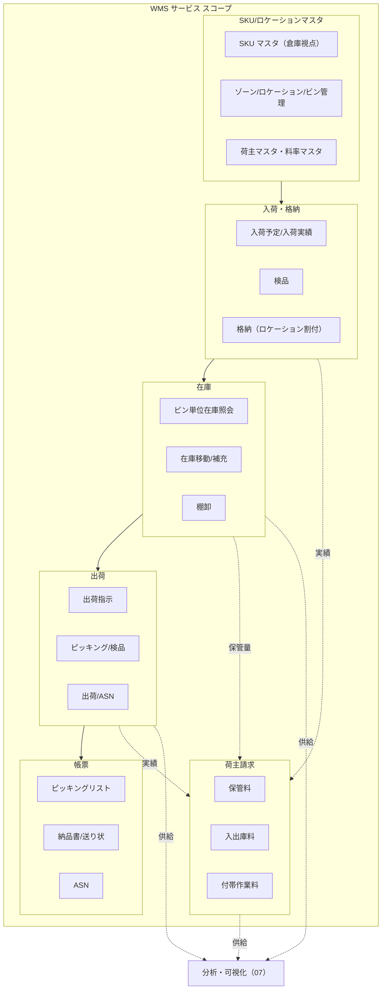

**スコープ外（他ドキュメント所有）:** 名寄せ・MDM（34/20）、他社 WMS の取込マッピング（10/21）、スタースキーマ変換エンジン（22/35）、
分析ダッシュボードの集計本体（07/35。本サービスは源泉供給と自サービス内の軽量ビューまで）、契約・課金プラン・エンタイトルメント（09/37。荷主**請求**は本書所有だが、SCIP 自身の倉庫事業者への**課金**は 37 所有）。

### 1.3 SoT 宣言

本サービスが SoT（Source of Truth）となるデータと参照するデータを明示する（ブリーフ §5 の原則: SoT 先行書込 → 派生後追い）。

| データ | 本サービスにおける扱い | SoT | 備考 |
|--------|----------------------|-----|------|
| SKU マスタ（倉庫視点: 荷主 SKU・荷姿・ロット/期限管理属性） | **本サービス OLTP が SoT** | WMS OLTP（`sku_master`、33 所有） | canonical_sku へクロスウォーク |
| ゾーン/ロケーション/ビン（倉庫内物理構造） | **本サービス OLTP が SoT** | WMS OLTP（`zone`/`location`/`bin`、33 所有） | canonical_location（type=warehouse/dc）へ写像 |
| 荷主（shipper） | **本サービス OLTP が SoT**（アプリローカル） | WMS OLTP（`shipper`、33 所有） | canonical_party（role=shipper）へクロスウォーク |
| 入荷（予定/実績/検品） | **本サービス OLTP が SoT（System of Record）** | WMS OLTP（`inbound_receipt`+lines、33 所有） | fact_inventory_movement（+方向）の源泉 |
| ビン単位在庫（on_hand/allocated/available、ロット/期限） | **本サービス OLTP が SoT** | WMS OLTP（`wms_inventory`、33 所有） | fact_inventory_snapshot の源泉 |
| 在庫移動（格納/補充/移動/ピッキング/棚卸/出庫） | **本サービス OLTP が SoT** | WMS OLTP（`inventory_movement`、33 所有） | fact_inventory_movement の源泉 |
| 出荷指示・出荷・ASN | **本サービス OLTP が SoT** | WMS OLTP（`outbound_order`+lines / `shipment`、33 所有） | fact_shipment の源泉 |
| 帳票（発行メタデータ） | **本サービス OLTP が SoT** | WMS OLTP（`shipping_document`、33 所有） | 生成実体（PDF/xlsx）は S3 |
| 帳票の生成実体（PDF/xlsx バイナリ） | **参照/保管** | S3（ブリーフ §5、オブジェクト＝SoT） | Pre-signed URL で配布 |
| 料率（保管料/入出庫料/付帯作業料の料率定義） | **本サービス OLTP が SoT** | WMS OLTP（`billing_rate`、33 所有） | 荷主×料金種別×単位 |
| 荷主請求（月次請求ヘッダ/明細） | **本サービス OLTP が SoT** | WMS OLTP（`shipper_billing`+lines、33 所有） | fact_billing の源泉 |
| 正準 SKU/取引先/拠点（名寄せ済） | **参照のみ**（SoT は MDM） | Canonical DB（34 所有） | 名寄せ解決結果を受領 |
| スタースキーマ dim/fact | **供給元**（集計値の SoT は DWH 側の派生） | Redshift（35 所有） | 本サービスは源泉を提供、集計値は生成しない |
| テナント/ユーザ/権限 | **参照のみ** | Control Plane（37 所有） | RLS の `tenant_id`、監査列の `app_user` FK |

---

## 2. スコープと機能一覧

| 機能領域 | 機能 | 内容 | 正準/スター写像 |
|---------|------|------|----------------|
| SKU マスタ | SKU 登録・編集 | 荷主 SKU・JAN・荷姿（ケース入数/バラ）・ロット管理要否・期限管理要否・保管条件 | canonical_sku / dim_product |
| ロケーション | ゾーン/ロケーション/ビン管理 | 倉庫内の階層（ゾーン→ロケーション→ビン）と属性（温度帯・ピッキング/保管区分・容量） | canonical_location / dim_location |
| 荷主 | 荷主マスタ | 荷主（貨物所有者）の登録・請求条件・締め日 | canonical_party(role=shipper) / dim_customer |
| 入荷 | 入荷予定/実績/検品 | ASN/入荷予定 → 入荷実績 → 検品（良品/不良/保留） | fact_inventory_movement(receive) |
| 格納 | 格納指示・ロケーション割付 | 検品済み在庫を保管ロケーション（ビン）へ格納 | fact_inventory_movement(putaway) |
| 在庫 | ビン単位在庫照会 | SKU × ビン × 荷主 × ロット/期限 の在庫（on_hand/allocated/available） | fact_inventory_snapshot |
| 在庫 | 補充/移動 | ピッキングロケーションへの補充、ロケーション間移動 | fact_inventory_movement(replenish/transfer) |
| 在庫 | 棚卸 | 循環棚卸/一斉棚卸、差異調整（理由コード必須） | fact_inventory_movement(adjust) |
| 出荷 | 出荷指示 | 荷主/EC/小売からの出荷依頼を出荷オーダとして受領・波動割付（ウェーブ） | fact_shipment の起点 |
| 出荷 | ピッキング/検品 | ピッキングリスト発行 → ピック → 出荷検品 → 梱包 | fact_inventory_movement(pick) |
| 出荷 | 出荷/ASN | 出荷確定・送り状/納品書発行・ASN 送信 | fact_shipment |
| 帳票 | 帳票出力 | ピッキングリスト/納品書/送り状/ASN/荷主請求書（ClosedXML/PDF） | — |
| 請求 | 荷主請求 | 保管料/入出庫料/付帯作業料の料率計算・月次締め・請求書発行 | fact_billing |

---

## 3. 主要業務フロー

### 3.1 入荷・検品・格納フロー

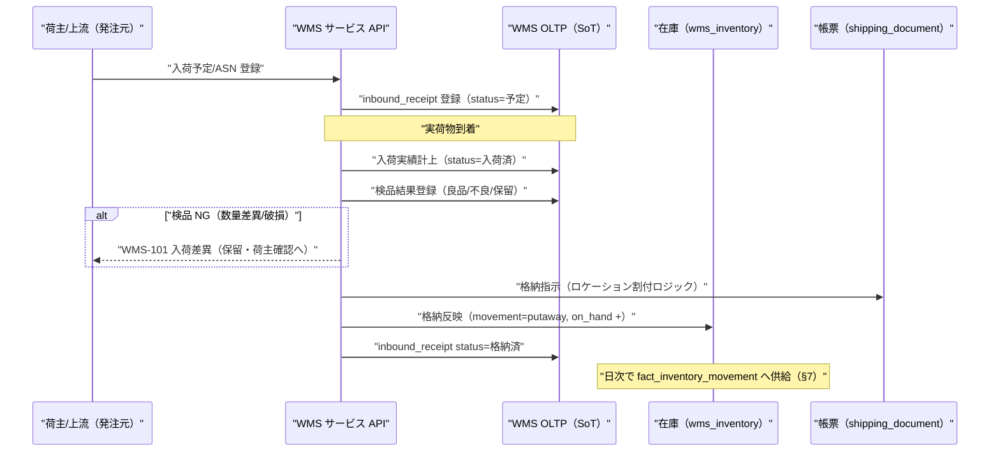

**ロケーション割付（格納）ロジック:** SKU の保管条件（温度帯・保管区分）・荷姿・空きビン容量・荷主専用ロケーション指定を評価し、格納先ビンを提案する。
自動提案を基本とし、作業者が上書き可能（提案外への格納は理由記録）。

### 3.2 出荷指示・ピッキング・出荷/ASN フロー

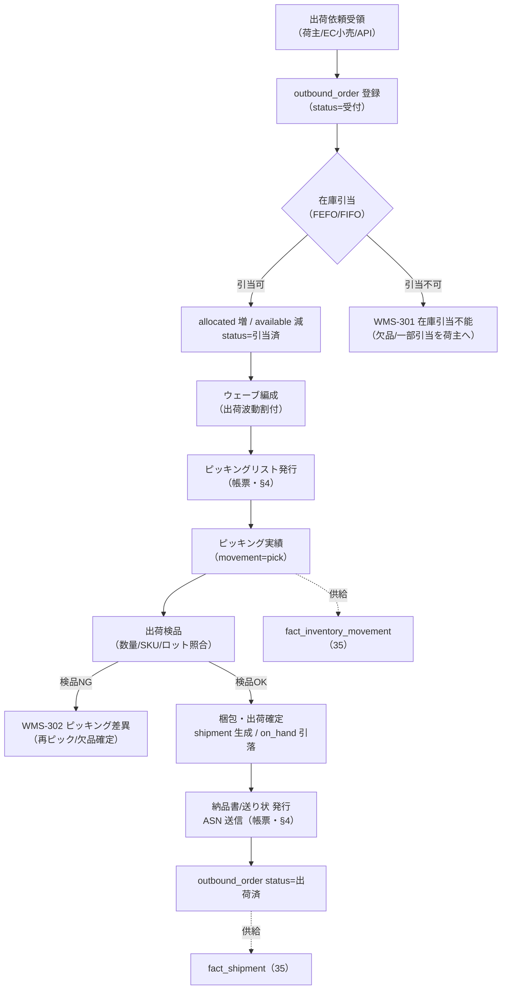

> **引当ロジック:** ロット/期限管理 SKU は **FEFO（First Expired First Out、期限先出し）**、非期限管理は **FIFO** を既定とし、荷主単位で切替可能。
> 引当は `wms_inventory.allocated` を増やし `available`（＝on_hand − allocated）を減らす。逆流（出荷取消）は引当解放で戻す。

### 3.3 棚卸フロー

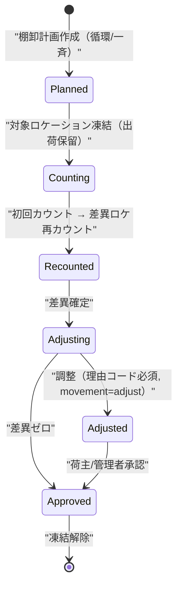

- **循環棚卸（サイクルカウント）:** ロケーション/SKU を periodically 巡回。ABC 分析でA品を高頻度に。
- **差異調整:** 実棚と理論在庫の差は `inventory_movement(adjust)` に**理由コード必須**で記録（監査可能）。棚卸中の対象ロケーションは出荷引当から凍結。

---

## 4. 出荷作業用帳票の出力設計

### 4.1 帳票一覧と出力方式

WMS は「作業指示書」と「対外文書」の 2 系統の帳票を持つ。生成メタデータは `shipping_document`（33 所有）で管理し、
生成実体（xlsx/PDF）は **S3 に保管し Pre-signed URL で配布**する（ブリーフ §5）。

| 帳票 | 系統 | 出力方式 | 用途 | トリガ |
|------|------|---------|------|--------|
| ピッキングリスト | 作業指示 | **ClosedXML（xlsx）** / PDF | ピッカーへの作業指示。ロケーション順・ウェーブ単位 | ウェーブ編成後 |
| 出荷検品リスト | 作業指示 | ClosedXML（xlsx）/ PDF | 出荷前の SKU/数量/ロット照合 | ピッキング完了後 |
| 納品書 | 対外文書 | **PDF**（レイアウト固定） | 荷受人（納品先）向け同梱書類 | 出荷確定時 |
| 送り状（配送ラベル） | 対外文書 | **PDF/ラベル**（宅配 API 連携も選択肢） | 運送会社への引渡し | 出荷確定時 |
| ASN（事前出荷明細） | 対外データ | **EDI/CSV/XML**（+ 人可読 PDF 併用可） | 納品先の入荷予定連携 | 出荷確定時 |
| 荷主請求書 | 対外文書 | **ClosedXML（xlsx）/ PDF** | 月次締め後の荷主請求 | 請求締め処理（§5） |
| 在庫報告書 | 対外データ | ClosedXML（xlsx）/ CSV | 荷主への在庫残高報告 | 締め日/オンデマンド |

### 4.2 出力技術方針（継承実装との整合）

- **xlsx:** 継承実装で確定済みの **ClosedXML**（テンプレート流し込み）を採用（ブリーフ §4、tech-stack-decision O-06）。
  作業帳票・帳票的な表形式（ピッキングリスト・在庫報告・請求明細）はテンプレートに明細を流し込む方式。NFR「50 明細 5 秒以内」を満たす。
- **PDF:** レイアウト固定の対外文書（納品書・送り状・請求書）は PDF を基本とする。**PDF 生成ライブラリは未確定**（継承実装は xlsx のみ）。候補と方針は §9 未決事項で扱う。
- **非同期化:** 大量明細・大量部数の帳票はバックグラウンドジョブ化し、生成完了を通知 → S3 の Pre-signed URL で取得（体感停止の回避。CLAUDE.md 原則4/8）。
- **冪等性:** 帳票再発行は `shipping_document` に版（version/reissue_seq）を持ち、**既存の発行記録を巻き戻さず追記**する（CLAUDE.md 原則2、監査可能な再発行）。

### 4.3 帳票発行フロー

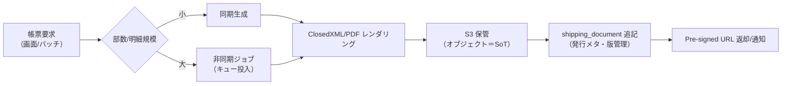

> **設計方針:** 帳票の「発行した事実」は記録系データであり、再実行で**巻き戻さない**（原則2）。同一出荷に対する再発行は新しい版として積む。

---

## 5. 荷主（shipper）と荷主請求の設計

### 5.1 荷主モデル

荷主（shipper）は貨物の所有者であり、倉庫事業者（テナント）にとっての「請求先顧客」に相当する。荷主は正準モデルでは **`canonical_party`（role=shipper）** に写像され、
分析では **`dim_customer`**（倉庫事業者から見た顧客）として扱う。荷主ごとに請求条件（締め日・料率適用・保管料計算方式）を保持する。

### 5.2 料金体系（3 区分）

| 料金区分 | 課金根拠 | 代表的な単位 | 主なデータ源 |
|---------|---------|-------------|-------------|
| **保管料** | 期間内の保管量 | パレット/坪/才/ケース × 期間 | `wms_inventory`（在庫残高）+ `inventory_movement`（入庫） |
| **入出庫料**（荷役料） | 入荷/出荷の作業量 | ケース/バラ/行/オーダ | `inbound_receipt` / `outbound_order` / `shipment` |
| **付帯作業料** | 検品・ラベル貼り・アソート・返品処理等 | 作業件数/時間 | 付帯作業実績（`inventory_movement` の作業種別 or 作業実績） |

### 5.3 保管料の計算方式（日本の倉庫業慣行）

保管料は方式が複数あり、荷主単位で `billing_rate` に方式を保持する。代表は **三期制（三期制料金）**。

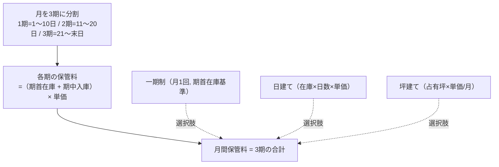

- **三期制:** 各期の「期首在庫数量 ＋ その期に入庫した数量」に保管単価を乗じ、3 期を合算する。日本の倉庫業で標準的な方式。
- **一期制/日建て/坪建て:** 荷主・貨物特性に応じて選択。`billing_rate.calc_method`（SMALLINT + CHECK）で方式を保持し、計算ロジックを分岐する（変更耐性: review-standards 3.2）。

### 5.4 請求締め処理フロー

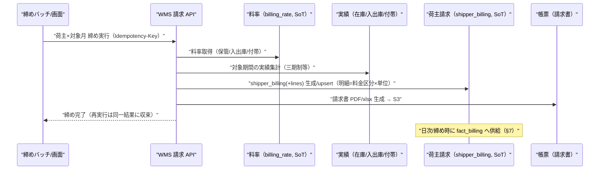

> **冪等性と状態保護（CLAUDE.md 原則2）:** 締め処理は再実行可能とし、`Idempotency-Key` と（荷主, 対象月）キーで冪等 upsert する。
> **確定済み（確定フラグ/請求書発行済）の請求は再締めで巻き戻さない**。未確定分のみ再計算し、確定後の修正は「訂正明細（マイナス/追加）」として追記する（記録系データの保護）。

### 5.5 請求明細と fact_billing への写像

| shipper_billing_line（33 所有）の属性 | 意味 | fact_billing（35）measure/dim への写像 |
|--------------------------------------|------|--------------------------------------|
| billing_category（0=保管/1=入出庫/2=付帯） | 料金区分 | degenerate dimension（請求区分） |
| shipper_id | 荷主 | dim_customer（荷主） |
| quantity / unit | 課金数量・単位 | billed_qty |
| unit_rate | 適用単価 | — |
| amount（GENERATED: qty×rate） | 金額 | billed_amount |
| billing_period（対象月/期） | 対象期間 | dim_date（請求月） |

---

## 6. マルチテナント / 荷主分離と他社 WMS 取込との差別化

### 6.1 二層分離の実装

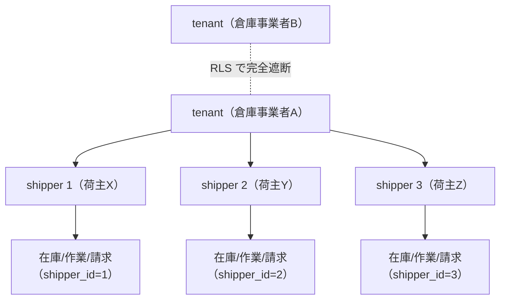

- **テナント分離（`tenant_id`）:** ブリーフ §6 準拠。全テーブル `tenant_id BIGINT NOT NULL`、RLS で `tenant_id = current_setting('app.tenant_id')::bigint` 強制。一意制約はテナントスコープ（例 `uq_sku_master_tenant_id_shipper_id_sku`＝テナント＋荷主スコープで SKU 一意。確定 DDL は 33 が所有）。
- **荷主分離（`shipper_id`）:** 同一テナント内で在庫・作業・請求を荷主で分離。**倉庫作業者は複数荷主を横断**して作業するため既定は tenant スコープでアクセスし、`shipper_id` で業務フィルタ。
  **荷主自身がポータルで自社在庫を閲覧する場合**は、追加で `app.shipper_id` を張り荷主スコープ RLS を効かせ、他荷主データを遮断する。
- **共有 vs 専用ロケーション:** ビンは荷主専用（`bin.dedicated_shipper_id`）と共用（フリーロケーション）を属性で区別。共用ビンでも在庫レコード（`wms_inventory`）は必ず `shipper_id` を持ち、混在保管でも所有権を追跡できる。

### 6.2 他社 WMS 取込との差別化

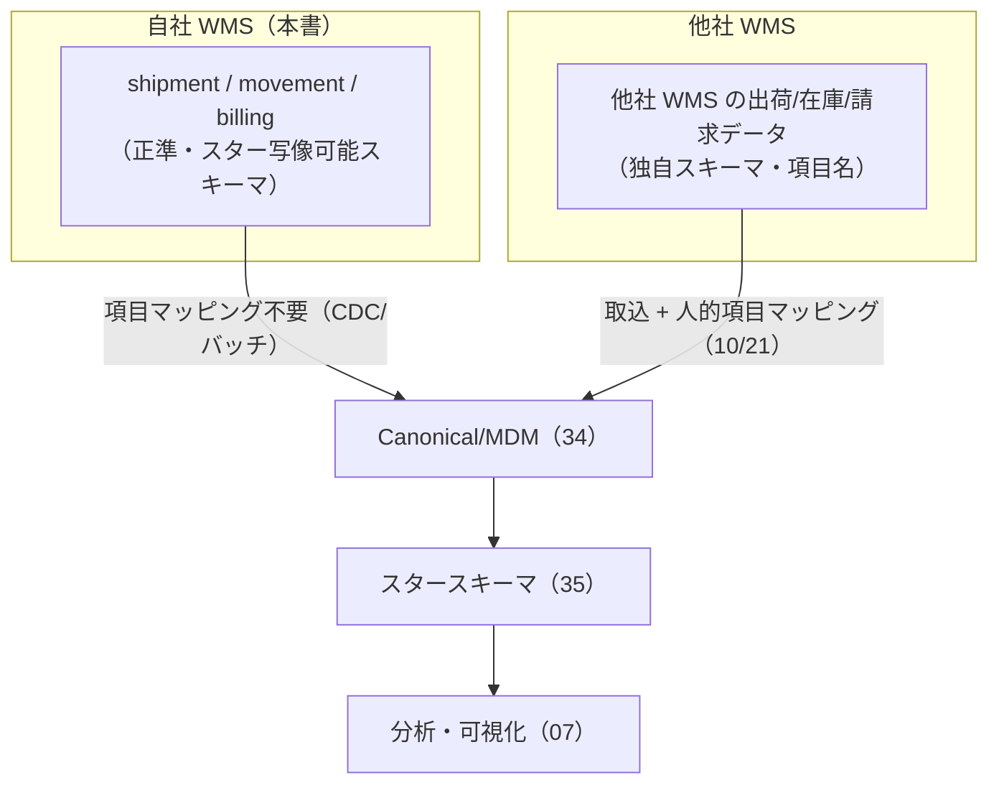

| 観点 | 自社 WMS（本書） | 他社 WMS 取込（10/21） |
|------|-----------------|----------------------|
| スキーマ | 最初から canonical/fact 写像可能 | 独自。項目マッピングが必要 |
| 荷主分離 | `shipper_id` を第一級で保持 | 取込時に荷主を人的に同定 |
| 連携難易度 | **低**（マッピング不要が差別化） | 中〜高（人的マッピング・DQ ルール） |
| 着地点 | 同じ `fact_shipment`/`fact_inventory_movement`/`fact_billing` | 同上（正規化後は同一 fact） |

> **差別化の源泉（ブリーフ §2）:** 自社 WMS は「分析サービスへの連携難易度の低さ」を最初から満たす。他社 WMS は取込口（Data Plane）で人的マッピングを経て**同じ fact に着地**するが、そのコストが差別化の対比になる。

---

## 7. スタースキーマ連携（分析供給）

### 7.1 論理 ER（本サービスが SoT の主要エンティティ）

> 下図は**論理モデル**。物理 DDL（列型・制約・索引・`tenant_id`/`shipper_id`/RLS/監査列）は [`33 WMS OLTP`](../database-design/33-oltp-wms-schema.md) が所有する。

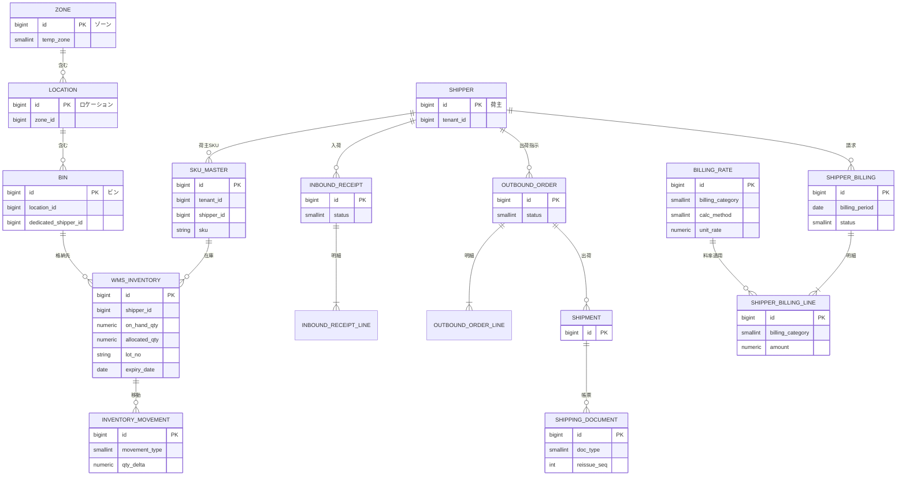

### 7.2 正準モデル / スタースキーマへの写像表

| 本サービスのローカルエンティティ | 正準モデル（34 所有） | クロスウォーク | スタースキーマ（35 所有） |
|--------------------------------|----------------------|---------------|--------------------------|
| SKU_MASTER | canonical_sku / canonical_product | sku_xref | dim_product（SKU 粒度, SCD2） |
| BIN / LOCATION / ZONE（倉庫拠点） | canonical_location（type=warehouse/dc） | location_xref | dim_location |
| SHIPPER（荷主） | canonical_party（role=shipper） | party_xref | dim_customer（荷主） / dim_party |
| SHIPMENT / OUTBOUND_ORDER_LINE | — | — | **fact_shipment**（出荷明細粒度） |
| INVENTORY_MOVEMENT | — | — | **fact_inventory_movement**（移動イベント） |
| WMS_INVENTORY（周期断面） | — | — | **fact_inventory_snapshot**（適合粒度 = SKU×拠点×日付。※ビン明細は WMS OLTP ローカルの粒度で、供給時に拠点粒度へ集約） |
| SHIPPER_BILLING_LINE | — | — | **fact_billing**（請求明細粒度） |

### 7.3 fact への供給契約

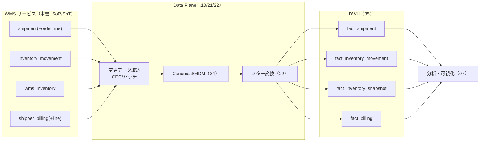

| 供給対象（35） | 粒度 | 頻度 | 冪等性 |
|--------------|------|------|--------|
| fact_shipment | 出荷明細 × 日付 | 日次 CDC/バッチ | `Idempotency-Key`/`source_record_id` で重複排除。load_run 単位再実行可（36） |
| fact_inventory_movement | 移動イベント | 準リアルタイム/日次 | 同上 |
| fact_inventory_snapshot | SKU × 拠点 × 日（§8 適合粒度。WMS OLTP は bin×SKU×ロット行粒度で保持し、供給時に拠点粒度へ集約） | 日次周期スナップショット | 日付キーで冪等 upsert |
| fact_billing | 請求明細 × 対象月 | 月次締め時 | （荷主, 対象月, 区分）キーで冪等 upsert |

> **データフロー整合（review-standards 2.3 / CLAUDE.md 原則6）:** 本サービス OLTP（SoT）→ Data Plane（派生）の一方向。逆流（DWH → OLTP 書戻し）は行わない。
> 来歴列 `source_system`/`source_record_id`/`legacy_id`（ブリーフ §9）で追跡可能にする。同期パスは **イベント（CDC）＋ 手動再同期** の両方を備える（ブリーフ §5、CLAUDE.md 原則6-2）。

---

## 8. 状態遷移とステータス定義

継承実装の日本語 VARCHAR ステータス（'入荷済'/'出荷済' 等）は踏襲せず、**SMALLINT + CHECK** に正規化する（ブリーフ §9/§15）。

### 8.1 入荷ステータス（inbound_receipt.status）

| 値 | 意味 |
|----|------|
| 0 | 予定（ASN/入荷予定登録） |
| 1 | 入荷済（実荷到着・数量計上） |
| 2 | 検品済 |
| 3 | 格納済 |
| 8 | 保留（差異/不良で荷主確認待ち） |
| 9 | 取消 |

### 8.2 出荷ステータス（outbound_order.status）

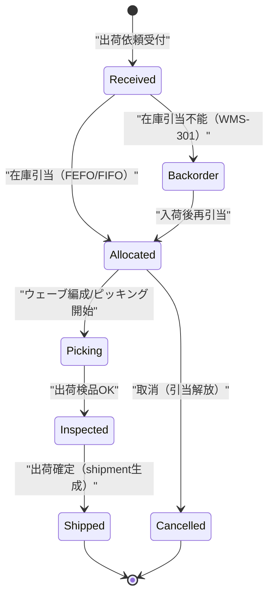

| 値 | 意味 |
|----|------|
| 0 | 受付 |
| 1 | 引当済 |
| 2 | ピッキング中 |
| 3 | 検品済 |
| 4 | 出荷済 |
| 7 | 欠品保留（バックオーダ） |
| 9 | 取消 |

### 8.3 在庫移動種別（inventory_movement.movement_type）

| 値 | 種別 | 在庫への影響 |
|----|------|------------|
| 0 | receive（入荷） | on_hand + |
| 1 | putaway（格納） | ロケーション移動（総量不変） |
| 2 | pick（ピッキング） | allocated 消込 → on_hand − |
| 3 | issue（出庫確定） | on_hand −（pick と統合運用も可） |
| 4 | allocate（引当） | allocated + |
| 5 | release（引当解放） | allocated − |
| 6 | replenish（補充） | ロケーション移動 |
| 7 | transfer（移動） | ロケーション/ビン間移動 |
| 8 | adjust（棚卸調整） | on_hand ±（理由コード必須） |

### 8.4 荷主請求ステータス（shipper_billing.status）

| 値 | 意味 |
|----|------|
| 0 | 下書き（締め計算中/未確定） |
| 1 | 確定（金額確定・巻き戻し禁止） |
| 2 | 請求書発行済 |
| 3 | 入金消込済 |
| 9 | 訂正（訂正明細で調整） |

---

## 9. 画面構成とレスポンシブ方針

### 9.1 画面骨格（Nuxt 3 SPA）

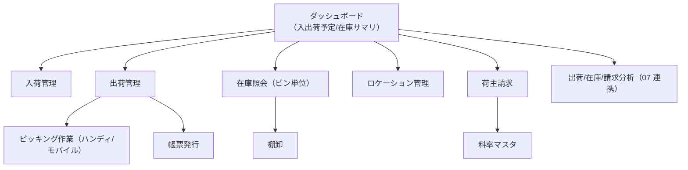

| 画面 | 種別 | API 責務（ブリーフ §11） |
|------|------|------------------------|
| 入荷一覧 | 一覧 | 一覧取得のみ（集約なし） |
| 入荷詳細/検品 | 詳細/操作 | 詳細取得＋実績登録（別 API） |
| 出荷一覧 | 一覧 | 一覧取得のみ |
| ピッキング作業 | 操作（モバイル最適化） | 作業実績登録（Idempotency-Key） |
| 在庫照会（ビン単位） | 一覧/詳細 | 一覧・詳細を分離 |
| 荷主請求 | 一覧/操作 | 締め実行・明細取得を分離 |

### 9.2 レスポンシブ方針（CLAUDE.md 原則8 / U-2）

- **PC:** 入出荷一覧・在庫照会・請求明細は**表（テーブル）** で高密度表示（ソート・列固定・一括操作）。
- **モバイル/ハンディ:** 現場作業（ピッキング・検品・棚卸・格納）は**モバイル前提**。1 タスク＝1 カード、SKU/ロケーション/数量を大きく、バーコードスキャン主導の操作フロー。表は**カード型レイアウト**に切替。
- 横長テーブル（在庫・請求明細）は `overflow-x: auto` の専用スクロール領域に収め、ページ本体は横スクロールさせない。
- U-4（エラー時誘導）: 在庫引当不能・入荷差異・ピッキング差異は次アクション（一部引当/再ピック/欠品確定/荷主確認）を明示。

---

## 10. 想定エラーコード（WMS-NNN）

ブリーフ §10 のドメイン接頭辞 `WMS`（倉庫）に準拠。RFC 7807 Problem Details の `code` フィールドに格納する（ブリーフ §11、3 桁ゼロ埋め）。

| コード | 発生機能 | 意味 | 重大度 | 対処/誘導（U-4） |
|--------|----------|------|--------|-----------------|
| WMS-001 | 共通 | テナントスコープ外アクセス（RLS 違反/`X-Tenant-Id` 不一致） | CRITICAL | 403。再認証/権限確認 |
| WMS-002 | 共通 | 必須項目欠落/バリデーションエラー | WARNING | 入力補正を誘導 |
| WMS-003 | 共通 | 荷主スコープ外アクセス（荷主ポータルで他荷主データ要求） | CRITICAL | 403。荷主 RLS で遮断・監査記録 |
| WMS-101 | 入荷 | 入荷数量差異/破損（検品 NG） | WARNING | 保留・荷主確認へ誘導 |
| WMS-102 | 入荷 | 予定なし入荷（ASN 未登録での入荷） | INFO | 予定外入荷として登録・荷主通知 |
| WMS-103 | 格納 | 格納先ビンの容量超過/保管条件不一致 | WARNING | 代替ロケーション提案 |
| WMS-104 | 格納 | 荷主専用ビンへの他荷主格納 | WARNING | 割付を拒否し共用/専用ビンへ誘導 |
| WMS-201 | SKU | SKU コードのテナント×荷主内重複 | WARNING | 既存 SKU 参照/上書き確認 |
| WMS-202 | ロケーション | ゾーン/ロケーション/ビンの階層不整合（親不在） | WARNING | 先に上位階層登録を誘導 |
| WMS-203 | 在庫 | ロット/期限管理 SKU の必須ロット/期限未指定 | WARNING | ロット/期限入力を必須化 |
| WMS-301 | 出荷 | 在庫引当不能（available 不足） | WARNING | 入荷待ち/一部引当/バックオーダを誘導 |
| WMS-302 | 出荷 | ピッキング差異（指示と実ピック数量/SKU 不一致） | WARNING | 再ピック/欠品確定へ誘導 |
| WMS-303 | 出荷 | 期限切れ/引当禁止ロットのピッキング | CRITICAL | ピックを拒否・FEFO 再引当 |
| WMS-304 | 出荷 | 不正なステータス遷移（例: Shipped→Received） | WARNING | 現在状態を提示し可能操作へ誘導 |
| WMS-305 | 出荷 | 出荷済オーダの取消要求 | WARNING | 返品/出荷取消フローへ誘導 |
| WMS-401 | 在庫 | on_hand が負になる移動 | CRITICAL | 移動を拒否・ログ記録・整合性調査へ |
| WMS-402 | 棚卸 | 棚卸調整の理由コード未指定 | WARNING | 理由コード入力を必須化 |
| WMS-403 | 在庫 | 棚卸凍結中ロケーションへの出荷引当 | WARNING | 棚卸完了後に再試行を誘導 |
| WMS-501 | 帳票 | 帳票生成失敗（テンプレート不整合/レンダリング失敗） | WARNING | 主要フローは継続、再発行を誘導（非ブロッキング） |
| WMS-502 | 帳票 | ASN 送信失敗（連携先エラー） | WARNING | 手動再送パスへ誘導（主要フロー非ブロッキング） |
| WMS-601 | 請求 | 料率未設定の荷主/区分で締め実行 | WARNING | 料率登録を誘導 |
| WMS-602 | 請求 | 確定済請求月の再締め要求（巻き戻し禁止） | WARNING | 訂正明細フローへ誘導 |
| WMS-603 | 請求 | 締めバッチの重複実行（Idempotency-Key 重複） | INFO | 既存締め結果を返却・冪等無害化 |
| WMS-701 | 連携 | 分析供給バッチの重複ロード | INFO | load_run 冪等で無害化・記録のみ |
| WMS-702 | 連携 | 上流（本書 06 の外＝EC/小売 04・メーカー 05）からの出荷指示の突合失敗 | WARNING | 手動再同期パスへ誘導 |

> **エラーハンドリング（review-standards 3.4 / CLAUDE.md 原則4）:** 補助処理（帳票発行・ASN 送信・分析供給・名寄せ）の失敗は主要フロー（入荷計上・出荷確定・在庫更新）を止めない
> グレースフルデグラデーション。致命的（WMS-001/003/303/401）のみ例外を投げる。全想定エラーにコードを付与し逆引き可能に一元管理する。

---

## 11. 非機能・テナンシー観点（サマリ）

詳細は [`11 非機能/セキュリティ/テナンシー`](./11-nonfunctional-security-tenancy.md) が所有。本サービス固有の要点のみ記す。

- **二層分離:** `tenant_id`（RLS 強制）＋ `shipper_id`（荷主業務分離、ポータル時は荷主 RLS 併用）。一意制約はテナント（＋荷主）スコープ（ブリーフ §6）。
- **認証/認可:** Firebase Bearer ＋ tenant クレーム解決、任意で `X-Tenant-Id` 突合（不一致 403 = WMS-001）。荷主ポータルは荷主スコープの限定ロール。全 API 認可必須。
- **在庫整合:** `available` は `GENERATED ALWAYS AS (on_hand_qty - allocated_qty) STORED`（物理定義は 33）で導出。on_hand 負値を DB/アプリ両面で拒否（WMS-401）。
- **パフォーマンス:** 一覧・在庫照会・ピッキングスキャンは 100–200ms 目標。帳票の大量出力・請求締めは非同期化して体感停止を回避（CLAUDE.md 原則4/8）。ClosedXML は「50 明細 5 秒以内」（NFR）。
- **TZ 方針:** プラットフォーム標準の `TIMESTAMPTZ`（UTC 保存・テナントローカル表示）。業務日付（入荷日・出荷日・請求対象月）は DATE。継承実装の JST-naive TIMESTAMP は採用しない（ブリーフ §9）。
- **監査:** 在庫調整（棚卸差異）・機微操作・請求確定は監査ログ（audit_logs は 37 所有、append-only）に記録。

---

## 12. 未決事項 / 論点

| # | 論点 | 選択肢とトレードオフ | 暫定方針 |
|---|------|--------------------|----------|
| 1 | PDF 生成ライブラリ | (a) QuestPDF（.NET ネイティブ・宣言的レイアウト） / (b) HTML→PDF（Playwright/wkhtmltopdf） / (c) ClosedXML→PDF 変換 | 暫定(a)。継承実装は xlsx のみのため新規選定。ライセンス（QuestPDF Community 条件）と帳票レイアウト自由度を 12 ADR で確定 |
| 2 | 荷主分離の RLS 適用範囲 | (a) 倉庫作業者は tenant スコープ＋アプリフィルタ、荷主のみ RLS / (b) 全アクセスで shipper RLS 強制 | 暫定(a)。作業者は複数荷主横断が必須のため。荷主ポータルのみ(b)相当を適用 |
| 3 | 保管料計算方式の既定 | (a) 三期制を既定 / (b) 荷主ごとに必ず明示指定 | 暫定(a)＋荷主単位上書き。日本の倉庫業慣行に整合。海外/特殊貨物は日建て/坪建て |
| 4 | 出荷指示の入口 | (a) 荷主直接 API / (b) 小売（04 EC 連携）/メーカー（05）からの連携 / (c) ファイル投函 | 全経路サポート。突合失敗は手動再同期（WMS-702）。SoT 境界は「出荷指示受領後は WMS が SoT」 |
| 5 | ロット/期限の在庫粒度 | (a) `wms_inventory` にロット/期限を含めた行粒度 / (b) 別ロットテーブルに分離 | 暫定(a)（ビン×SKU×ロット×期限を 1 行）。ロット多発時のカーディナリティは 33 で索引設計 |
| 6 | 付帯作業料の実績データ源 | (a) `inventory_movement` の作業種別に集約 / (b) 独立の作業実績テーブル | 暫定(a)。付帯作業が多様化したら(b)へ分離（33 と協議） |
| 7 | 荷主請求と SCIP 課金の関係 | 荷主請求（本書）と倉庫事業者への SCIP 利用料課金（37）の帳票/データ二重管理 | 明確分離: 荷主請求＝WMS 業務データ（fact_billing）、SCIP 課金＝Control Plane（37）。相互参照のみ |
| 8 | ウェーブ/波動最適化の高度化 | 単純ウェーブ / ルート最適化・マルチオーダーピッキング | MVP は単純ウェーブ。最適化は将来拡張（Intelligence Plane 連携の候補） |

---

## 13. 関連ドキュメント

- [`33 WMS OLTP`](../database-design/33-oltp-wms-schema.md)（document_id: oltp-wms-schema） — 本サービスの**物理スキーマを権威的に所有**（`sku_master`/`zone`/`location`/`bin`/`inbound_receipt`/`outbound_order`/`wms_inventory`/`inventory_movement`/`shipment`/`shipping_document`/`shipper`/`shipper_billing`/`billing_rate` の CREATE TABLE / 索引 / 制約 / `tenant_id` / `shipper_id` / RLS）。
- [`07 分析・可視化サービス`](./07-service-analytics.md)（document_id: service-analytics） — 本サービスが供給する `fact_shipment`/`fact_inventory_movement`/`fact_billing` の消費側。集計・ダッシュボードの本体。
- [`09 バックオフィス`](./09-service-backoffice.md)（document_id: service-backoffice） — テナント（倉庫事業者）の契約・SCIP 利用料課金・エンタイトルメント。荷主**請求**（本書）とは責務が異なる（対比を §5.4/§12-7 で明示）。
- [`03 正準ドメインモデル`](./03-canonical-domain-model.md) — 共通エンティティ（Product/SKU・Location・Party(role=shipper)・Region）の定義。本書はこれへ写像。
- [`10 データ連携とマッピング`](./10-data-integration-and-mapping.md) — 他社 WMS の取込・人的マッピング経路（差別化の対比、§6.2）。
- [`35 スタースキーマDWH`](../database-design/35-star-schema-dwh.md) — dim/fact の権威的定義（本書は写像方針のみ）。
- 参考: [`02 全体アーキテクチャ`](./02-overall-architecture.md)、[`04 クロスリテーラーサービス`](./04-service-retail.md)（EC 出荷連携）、[`05 メーカーサービス`](./05-service-manufacturer.md)。
