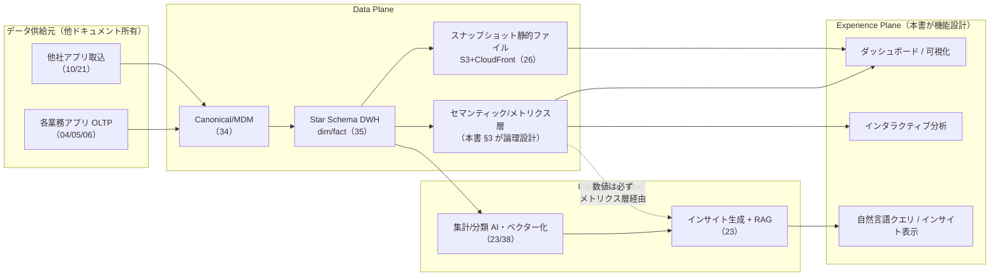
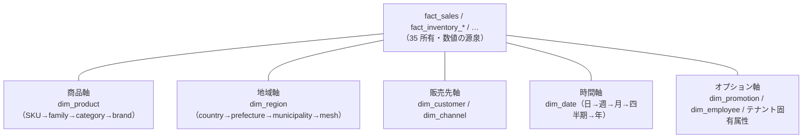
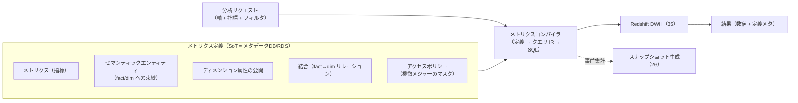
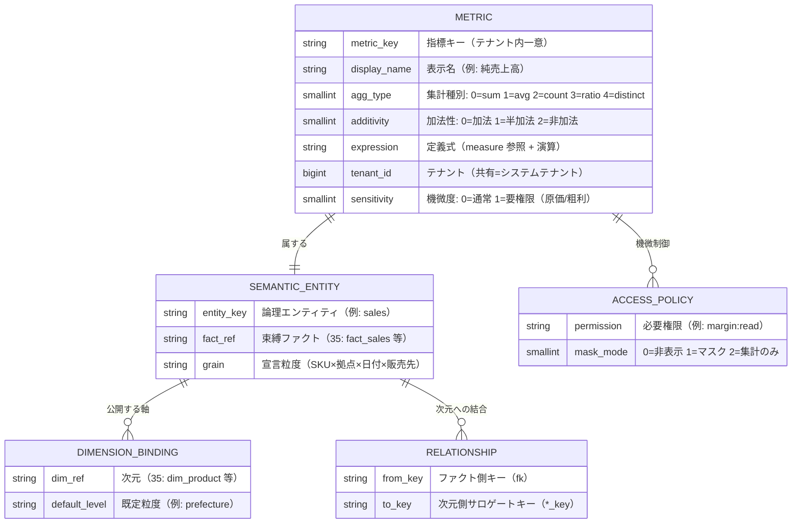
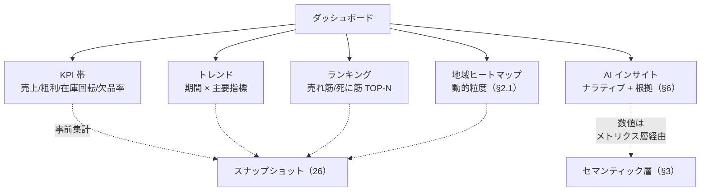
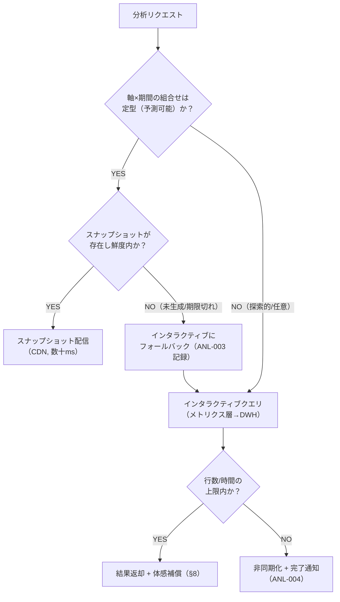
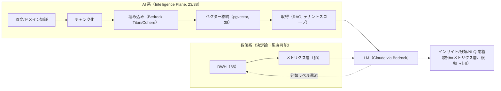
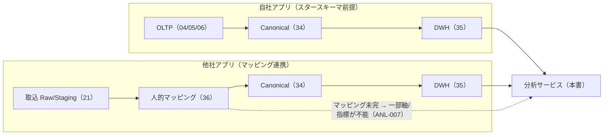

# 基本設計: 分析・可視化プラットフォーム

本書は **SCIP（Supply Chain Intelligence Platform、コード名。正式名称は未確定）** の
**分析・可視化プラットフォーム**を基本設計として定義する。小売・メーカー・倉庫の各業務アプリ（SoR）と
他社アプリ連携から集約された事実データを、**スタースキーマ（Kimball 準拠）上の定型分析**と
**AI による集計・分類・インデックス化・ベクター化・インサイト生成**の 2 系統で価値化し、
**商品 × 地域 × 販売先**を基本軸とする横断分析を提供する。SCIP の**差別化の源泉**である
「分析サービスへの連携難易度の低さ」と「各分析機能の実現性」（ブリーフ §2）を、体験層（分析アプリ）の
機能設計として具体化する。

> **位置づけ / 所有範囲:** 本書は**分析・可視化サービスの機能・データフロー・サービング方式の基本設計**を
> 権威的に所有する（分析機能カタログ、セマンティック/メトリクス層の論理設計、サービング二系統の使い分け、
> ANL エラーコードレジストリ）。以下は**参照するが物理定義を再定義しない**（ブリーフ §14 テーブル所有マップ準拠）:
> - DWH の全 `dim_*`/`fact_*` 物理スキーマ（DISTKEY/SORTKEY 含む）は
>   [スタースキーマ DWH](../database-design/35-star-schema-dwh.md)（35）が所有。
> - Canonical → dim/fact の **ETL 変換・SCD・ロード**は
>   [スタースキーマ変換](../detailed-design/22-star-schema-transformation.md)（22）が所有。
> - **AI/RAG/ベクター化の詳細**（チャンク化・埋め込み・取得・LLM オーケストレーション・プロンプト）は
>   [AI/RAG/ベクター化](../detailed-design/23-ai-rag-and-vectorization.md)（23）および
>   [AI/ベクター/ナレッジ スキーマ](../database-design/38-ai-vector-knowledge-schema.md)（38）が所有。
> - **スナップショット静的ファイル / DocDB 読み取りモデル**の詳細は
>   [スナップショット/DocDB](../detailed-design/26-snapshot-and-document-db.md)（26）が所有。
> - AI エージェント/バーチャルカンパニーによる意思決定支援は
>   [意思決定支援/AIエージェント](./08-service-decision-support-ai.md)（08）が所有。

---

## 1. サービス概要

### 1.1 提供価値とスコープ

分析・可視化サービスは、SCIP の**横断サービス**（ブリーフ §2/§3 Experience Plane + Data Plane サービング +
Intelligence Plane）として、以下 2 系統を統合的に提供する。

| 系統 | 中核 | 特徴 | 主な提供 |
|------|------|------|----------|
| ① 定型分析（スタースキーマ） | 適合次元 × ファクトの OLAP 集計 | 決定論的・監査可能・高精度な数値 | ダッシュボード、クロス集計、ランキング、トレンド、シェア、ABC 分析、ドリルダウン/アクロス |
| ② AI 分析（Intelligence Plane） | 集計/分類の自動化・インデックス化/ベクター化・インサイト生成・RAG | 非定型・自然言語・ドメイン知識活用 | 自然言語クエリ、異常検知、需要予測、自動分類、ナラティブ生成（示唆の言語化） |

**設計原則（ハルシネーション抑制、ブリーフ §12）:** **数値そのものは常に DWH / メトリクス層から取得**し、
LLM に生成させない。AI は「どの数値を、どう並べ、何を示唆するか」の**解釈・言語化・非定型化**を担い、
数値の**出所（メトリクス定義とファクト行）を根拠として提示**する。これにより「AI で楽をする」ことと
「監査可能な正確さ」を両立する。



### 1.2 サービス境界（何を所有し、何に委譲するか）

- **本書が所有:** 分析機能カタログ（§2.2）、分析軸モデル（§2.1）、セマンティック/メトリクス層の**論理設計**（§3）、
  ダッシュボード/可視化の設計方針（§4）、サービング二系統の使い分け（§5）、AI 組み込みの**概要**（§6）、
  自社/他社アプリでの分析実現性の差（§7）、ユーザビリティ適用（§8）、ANL エラーコード（§10）。
- **委譲:** ファクト/次元の物理（35）、ETL 変換（22）、AI/RAG 詳細（23/38）、スナップショット/DocDB 物理（26）、
  意思決定支援ワークフロー（08）、取込/マッピング（10/21/36）、非機能/テナンシー詳細（11）。

---

## 2. 分析軸と分析機能カタログ

### 2.1 分析軸モデル（商品 × 地域 × 販売先 + 動的粒度 + オプション軸）

分析の**基本軸は「商品 × 地域 × 販売先」**（ブリーフ §2）。これに**時間軸**と**チャネル軸**を常に併用し、
さらに**クライアント固有のオプション軸**を取り込む。軸は DWH の適合次元（35 所有）へ写像される。



**軸の階層と動的粒度:**

| 軸 | 次元（35） | 粒度階層（上位←→下位） | 動的粒度の扱い |
|----|-----------|------------------------|----------------|
| 商品 | `dim_product` | category → family → SKU | 企画（family）と SKU を切替。分類階層は可変段数（03/34） |
| 地域 | `dim_region` | country → prefecture → municipality → mesh | **クライアントの商圏規模に応じ `level` で既定粒度を切替**（全国卸=都道府県、地域小売=市区町村） |
| 販売先 | `dim_customer` / `dim_channel` | チャネル（店舗/EC/卸）→ 販売先グループ → 個社 | Party の多ロール性で customer 側を写像（03） |
| 時間 | `dim_date` | 年 → 四半期 → 月 → 週 → 日 | 会計暦/シーズン暦の属性も保持（35） |
| オプション | `dim_promotion` / `dim_employee` / 拡張属性 | テナント定義 | クライアント固有の有効データをオプション取込（§7） |

> **動的地域粒度の設計判断:** 粒度は**データを再ロードせず、集計時に `dim_region.level` で GROUP BY を切替える**
> ことで実現する（DWH は最も細かい粒度で保持し、集計で丸める）。クライアントの既定粒度は
> テナント設定（27）に持ち、分析リクエストで上書き可能。商圏規模と設定が不整合な場合は ANL-008 で誘導する。

### 2.2 分析機能カタログ

提供する分析機能を、定型分析（スタースキーマで決定論的に算出）と AI 分析（Intelligence Plane）に分けて示す。
各機能は**セマンティック/メトリクス層（§3）の指標定義**を介して DWH へクエリする。

| # | 機能 | 系統 | 入力（軸/指標） | 出力表現（§4） | サービング（§5） |
|---|------|------|------------------|----------------|------------------|
| A1 | ダッシュボード（KPI 俯瞰） | 定型 | 売上/在庫/粗利 × 期間 | KPI タイル + スパークライン | スナップショット |
| A2 | トレンド分析 | 定型 | 指標 × 時間軸 × 任意軸 | 折れ線 / エリア | スナップショット/インタラクティブ |
| A3 | ランキング（売れ筋/死に筋） | 定型 | 数量/金額 × 商品/販売先 | 横棒 / 表 | スナップショット |
| A4 | クロス集計（ピボット） | 定型 | 任意 2〜3 軸 × 指標 | マトリクス表 / ヒートマップ | インタラクティブ |
| A5 | シェア/構成比 | 定型 | 指標 × カテゴリ軸 | 帯 / ツリーマップ | スナップショット |
| A6 | 前年/前月比較（YoY/MoM） | 定型 | 指標 × dim_date 期間比較 | 併記表 / 増減バー | スナップショット |
| A7 | ABC 分析（重点管理） | 定型 | 累積構成比（金額/数量） | パレート図 | インタラクティブ |
| A8 | 地域ヒートマップ | 定型 | 指標 × dim_region 粒度 | 地図/メッシュ濃淡 | スナップショット |
| A9 | ドリルダウン/ドリルアクロス | 定型 | 階層軸の掘り下げ/ファクト横断 | インタラクティブ表/図 | インタラクティブ |
| A10 | 在庫回転/滞留分析 | 定型 | 在庫（半加法）× 出荷 | 表/ヒートマップ | インタラクティブ |
| B1 | 自然言語クエリ（NLQ） | AI | 自然文 → メトリクスクエリに変換 | 表/図 + 生成した SQL 根拠 | インタラクティブ（23） |
| B2 | インサイト/ナラティブ生成 | AI | 定型分析結果 → 示唆の言語化 | 文章 + 根拠数値/引用 | ダッシュボード付随（23） |
| B3 | 異常検知（アラート） | AI | 時系列 × しきい値/学習 | アラート + 該当明細 | バッチ + 通知 |
| B4 | 需要/売上予測 | AI | 時系列 + 説明変数 | 予測線 + 信頼区間 | バッチ（23/24 と連携） |
| B5 | 自動分類/タグ付け | AI | 非構造テキスト/属性 | 分類ラベル（DWH へ還流） | バッチ（23/38） |
| B6 | 類似検索（ベクター） | AI | 商品/文書の埋め込み類似 | 類似リスト | インタラクティブ（38 pgvector） |

> **NLQ の安全性（B1）:** 自然言語は**メトリクス層のクエリ IR（中間表現）へコンパイル**し、
> 生 SQL を直接生成させない。未定義指標/軸への要求は ANL-001（未定義メトリクス）で拒否する。
> テナント境界は `SET app.tenant_id` と RLS/DWH tenant_id で機械的に強制する（LLM に境界判断を委ねない）。

---

## 3. セマンティック / メトリクス層（指標の一元定義）

### 3.1 目的と責務

指標（売上、粗利、在庫回転率 …）を**ダッシュボードや BI ツールに散在させず、一箇所で権威的に定義**する層。
「同じ『売上』が画面ごとに違う」を構造的に防ぎ（メトリクス・ドリフトの排除）、定型分析・AI 分析・
スナップショット生成の**すべてが同一の指標定義を参照**する。**メトリクス定義の SoT はメタデータ DB（RDS）**
（ブリーフ §5）。定義から DWH（35）向け SQL を機械生成する（数値は必ず DWH 由来）。



### 3.2 メトリクス層の論理モデル（概念）

本書はメトリクス層を**論理設計**として所有する（物理スキーマの所有先は §11 論点で確定させる）。
概念エンティティは以下。実際の格納は RDS メタデータ DB（ブリーフ §5）で、全エンティティは
`tenant_id` を持つ（共有定義 + テナント拡張を許容）。



### 3.3 加法性（additivity）の明示 — 集計事故の防止

在庫スナップショット（`fact_inventory_snapshot` の `on_hand_qty` 等）は**半加法メジャー**である。
**時間軸で SUM してはならない**（月合計在庫は無意味）。メトリクス定義に加法性を明示し、コンパイラが
不正な集計を機械的に拒否/是正する。

| 加法性 | 例 | 許容集計 | 誤用の是正 |
|--------|----|----------|-----------|
| 加法（additive） | 売上金額、数量、粗利額 | すべての軸で SUM 可 | — |
| 半加法（semi-additive） | 在庫残高（on_hand） | 時間以外で SUM 可。時間は期末値/平均 | 時間 SUM 要求は ANL-009 で拒否し、期末/平均に誘導 |
| 非加法（non-additive） | 在庫回転率、粗利率、シェア | SUM 不可。分子/分母を各々集計後に比 | 事前計算率の SUM を禁止（ratio は agg_type=3） |

### 3.4 指標定義例（宣言的）

物理 DDL ではなく、メトリクス定義の宣言例（実際の格納形式は 26/38 と別途調整）。

```
metric: net_sales_amount        # 純売上高
  entity: sales -> fact_sales (35)
  expression: SUM(net_amount)
  agg_type: sum   additivity: additive   sensitivity: 0

metric: gross_margin_amount     # 粗利額
  entity: sales -> fact_sales (35)
  expression: SUM(net_amount) - SUM(cost_amount)
  agg_type: sum   additivity: additive   sensitivity: 1   # 要 margin:read

metric: inventory_turnover      # 在庫回転率
  expression: metric(cogs) / metric(avg_on_hand_value)
  agg_type: ratio additivity: non_additive
```

> **SoT / 一貫性:** すべての画面・API・AI が上記定義を参照する。定義変更はメタデータ DB（SoT）へ先行書込し、
> スナップショット（派生, 26）は再生成で追従する（逆流禁止, CLAUDE.md 原則6）。

---

## 4. ダッシュボード / 可視化の設計方針

### 4.1 可視化の選択規約（データ型 → 表現）

分析意図に対して**過不足のない図表**を選ぶ（IQ-2「他者が読んで意図がわかるか」、
USABILITY_STANDARDS U-2 出力の直感性）。

| 分析意図 | 推奨表現 | 非推奨 |
|----------|----------|--------|
| 時系列トレンド | 折れ線 / エリア | 3D、円グラフ |
| 構成比（少数カテゴリ） | 帯 / ツリーマップ | 多分類の円グラフ |
| ランキング/比較 | 横棒 | 縦棒（ラベル長い時） |
| 2 軸の交差 | ヒートマップ / マトリクス表 | 散布の乱用 |
| 地域分布 | コロプレス地図 / メッシュ | 表のみ |
| KPI 単値 + 傾向 | KPI タイル + スパークライン | 生数字のみ |

- **色設計:** カテゴリカル配色は色覚多様性に配慮（コントラスト比確保、色のみに意味を依存させない）。
  ライト/ダーク両テーマで可読性を担保する（§8）。
- **数値の根拠提示:** 各図表は参照メトリクス定義（§3）と集計粒度・期間を**表示可能**にし、
  「この数字は何か」を追跡可能にする（監査性）。

### 4.2 ダッシュボード構成



### 4.3 インタラクション

- **ドリルダウン/アクロス（A9）:** 商品 category→family→SKU、地域 prefecture→municipality を掘り下げ、
  fact をまたぐ（売上→在庫）横断を可能にする。各操作は**新規スナップショット取得 or インタラクティブクエリ**に
  マッピングされる（§5）。
- **フィルタ/期間ピッカー:** 軸フィルタ（`?filter[field]=`）と期間は API 規約（ブリーフ §11）に準拠。
- **エクスポート:** 表/集計は Excel（継承の ClosedXML）/CSV へ。機微メジャーはマスク状態を維持（§8）。

---

## 5. サービング二系統（スナップショット vs インタラクティブ）の使い分け

### 5.1 判断基準

| 観点 | スナップショット静的ファイル（26） | インタラクティブクエリ |
|------|-----------------------------------|------------------------|
| 実体 | 事前集計 Parquet/JSON（S3 + CloudFront） | メトリクス層 → Redshift へリアルタイムクエリ |
| 用途 | 定型ダッシュボード、高頻度 KPI、TOP-N | アドホック掘り下げ、任意軸クロス集計、NLQ |
| レイテンシ | 数十 ms（CDN エッジ） | 数百 ms〜秒（DWH 依存） |
| 鮮度 | バッチ更新（日次/時次） | 最新（DWH ロード時点） |
| コスト | 生成時のみ計算、配信は安価 | クエリ毎に DWH 課金 |
| 選択規約 | 軸・期間の組合せが**有限で予測可能** | 組合せが**任意/探索的** |



### 5.2 体感パフォーマンスとの整合（review-standards 4.1）

- 初期表示は**スナップショット優先**で 200ms 以下を狙う。インタラクティブが 100ms を超える見込みは
  スケルトン + 非同期ロード、超過時はキュー化 + 完了プッシュ（review-standards 4.1 の体感パフォーマンス補償）。
  ※レスポンシブ（CLAUDE.md 原則8）はレイアウトの適用であり本節の体感補償とは別観点。原則8 の適用は §8 を参照。
- スナップショット未生成時は**インタラクティブへフォールバック**し、機能停止させない
  （非ブロッキング、CLAUDE.md 原則4）。フォールバックは ANL-003 として記録し、スナップショット生成を促す。

### 5.3 スナップショット生成の SoT と冪等性

- **スナップショットは DWH（35）由来の派生**（ブリーフ §5）。DWH → スナップショット の一方向。
  再生成は冪等（同一入力・同一期間で同一結果、CLAUDE.md 原則2）。生成失敗は既存版を残し配信継続。
- 生成トリガー・パーティション設計・保持/ローテーションは **26 が所有**。本書は「何を事前集計するか」
  （定型ダッシュボードの軸×期間セット）を消費側要件として供給する。

---

## 6. AI の組み込み（概要 — 詳細は 23）

### 6.1 AI パイプライン概要

ブリーフ §12 のパイプラインに沿い、ドメイン知識（業界横断 + クライアント固有）を RAG で分析に活用する。
**本書は分析サービスから見た組み込み点の概要**を示し、チャンク化・埋め込み・取得・LLM の詳細は 23、
物理スキーマは 38 が所有する。



### 6.2 用途別の組み込み点

| AI 用途 | 分析サービスでの役割 | 数値の扱い | 委譲先 |
|---------|---------------------|-----------|--------|
| 集計/分類の自動化 | 非定型集計・自動タグ付け（B5） | メトリクス層で集計、AI は分類/ラベル | 23 |
| インデックス化/ベクター化 | 商品/文書/ナレッジの検索・類似（B6） | ベクターは派生、原文が SoT | 23/38 |
| インサイト生成 | 定型結果の**示唆をナラティブ化**（B2） | 数値は必ずメトリクス層、生成禁止 | 23 |
| 需要/売上予測 | 時系列予測（B4） | 学習/推論は AI、実績は DWH | 23/24 |
| 自然言語クエリ | 自然文 → メトリクス IR（B1） | IR 経由で DWH、生 SQL 生成禁止 | 23 |
| 意思決定支援 | 部門エージェント群への分析供給 | 分析結果を根拠として供給 | 08/24 |

### 6.3 ガードレール（ブリーフ §12）

1. **テナント境界:** RAG 検索・分析はテナントスコープ厳守（`SET app.tenant_id` + RLS + DWH tenant_id）。
2. **機微データのマスキング:** 原価/粗利/仕入単価等はメトリクス層のアクセスポリシー（§3.2）で制御。
   権限のない主体には AI 出力でも露出させない（ANL-006）。
3. **根拠提示:** インサイト/NLQ は参照メトリクス定義・ファクト行・ドメイン知識の**引用**を添える。
4. **ハルシネーション抑制:** **数値は DWH/メトリクス層から取得し LLM に生成させない**（§1.1 の原則）。

---

## 7. 自社アプリ / 他社アプリでの分析実現性の差

SCIP の差別化源泉は「連携難易度の低さ」と「分析機能の実現性」（ブリーフ §2）。**自社アプリは最初から
スタースキーマ連携前提のスキーマ**で設計される（04/05/06）一方、**他社アプリは取込 + 人的マッピング**を
介する（10/21/36）。この差が分析実現性にどう表れるかを明示する。



### 7.1 実現性マトリクス

| 分析要素 | 自社アプリ | 他社アプリ（マッピング連携） |
|----------|-----------|------------------------------|
| 基本軸（商品×地域×販売先×時間） | 全面提供（設計時に写像保証, 05 §8.3） | マッピング被覆に依存。未マップ軸は不能（ANL-007） |
| 粒度（SKU・市区町村） | 最細粒度で提供 | ソース粒度が粗い場合は上位粒度に制限 |
| 機微メジャー（原価/粗利） | 定義済・権限制御下で提供 | ソースに原価が無ければ算出不能 |
| データ鮮度 | CDC/準リアルタイム | 取込バッチ周期に依存 |
| オプション軸（固有属性） | ネイティブに保持 | 拡張属性マッピング + DocDB 併用（26）で吸収 |
| 導入リードタイム | 短（既定プロファイル） | マッピング/DQ 整備分だけ長い |

### 7.2 グレースフルデグラデーション

他社アプリでマッピング未完の軸・指標は、**分析全体を止めず**、当該軸のみ「未対応（マッピング要）」として
提示し、マッピング完了パス（36 の `mapping_review`）へ誘導する（ANL-007、CLAUDE.md 原則4）。
被覆率（分析可能軸/全軸）を可視化し、オンボーディングの進捗を示す。

---

## 8. ユーザビリティ（レスポンシブ / 可読性 / アクセシビリティ）

UI を持つサービスのため、USABILITY_STANDARDS（U-1〜U-5）と CLAUDE.md 原則8（レスポンシブ）を適用する。

| 観点 | 適用 |
|------|------|
| U-1 入力の最適化 | 軸/指標/期間は**選択式**（メトリクス定義から候補提示）。既定粒度をテナント設定から初期表示 |
| U-2 出力の直感性 | 分析意図に最適な図表を規約選択（§4.1）。数値の根拠（定義/粒度/期間）を明示 |
| U-3 操作フローの自然さ | ドリルダウン/アクロスで迂回なく掘り下げ。パンくずで階層を提示 |
| U-4 エラー時の誘導 | ANL エラーは次アクションを明示（未定義指標→候補提示、未マップ→マッピング画面へ）（§10, U-4） |
| U-5 アクセシビリティ | キーボード操作、スクリーンリーダー対応、色覚多様性配慮（色のみに依存しない）、ライト/ダーク両対応 |
| レスポンシブ | PC はテーブル/マトリクス、**モバイルはカード型/縦積み**に切替。地図/ヒートマップは操作可能な縮退表示 |

- **モバイル方針:** PC のクロス集計マトリクスは、モバイルでは指標カードの縦リストへ再構成し、
  横スクロールは表単位のコンテナ内に閉じる（body 横スクロール禁止）。KPI 帯は 1〜2 列グリッドに折り返す。

---

## 9. データフロー整合性と SoT 宣言

本書が扱うデータの SoT を明示する（ブリーフ §5、CLAUDE.md 原則6）。**分析サービスは基本的に「派生の消費側」**で
あり、OLTP/Canonical/DWH へは書き戻さない（AI 分類ラベルの還流のみ例外、§6.1、経路は 22/23 が管理）。

| データ | SoT | 派生/キャッシュ | 同期方向 |
|--------|-----|----------------|----------|
| dim/fact（分析の数値源泉） | DWH（35, 派生） | — | Canonical/OLTP → DWH（一方向, 22） |
| メトリクス/セマンティック定義 | メタデータ DB（RDS）— 定義は SoT | — | 定義変更 → 派生（スナップショット）再生成 |
| スナップショット静的ファイル | 派生（DWH 由来, 26） | ○（S3+CDN） | DWH → スナップショット（一方向） |
| ベクター/埋め込み | 派生（原文/KB 由来, 38） | ○ | 原文 → 埋め込み（一方向, 23） |
| ドメイン知識（原文） | 原文=SoT（38, RDS+S3） | ベクターは派生 | 原文 → チャンク → ベクター |
| AI インサイト（生成物） | `insight`（38 が格納） | — | 数値は DWH 参照、生成物を保存 |
| ユーザ権限（機微メジャー制御） | RDS Control Plane（37） | Custom Claims=キャッシュ | SoT 先行 → クレーム後追い |

**原則:** SoT 側書込を先行、派生/キャッシュは後追い（逆順は不整合の温床）。同期は「イベント受信
（DWH ロード完了イベント → スナップショット再生成）」と「**手動再同期**（スナップショット強制再生成、
ベクター再インデックス）」の**両パスを欠落なく**設計する（詳細トリガーは 22/23/26 が所有）。

---

## 10. 想定エラーコード（ANL-NNN）

本サービスで発生しうる想定エラー（ブリーフ §10、`DOMAIN-NNN` 形式）。本書が **ANL 接頭辞の
レジストリを権威的に所有**する（下表の ANL-NNN のみが権威定義）。API は RFC 7807 Problem Details の
`code` に本コードを載せる（ブリーフ §11）。ANL-001 は既存の兄弟ドキュメント（01/02）の用法と整合させる。

> **CMN-001 の扱い（参照・非所有）:** CMN 接頭辞は共通ドメインが SoT（ブリーフ §10）であり、本書は所有しない。
> 下表末尾の CMN-001 は分析機能が返し得る**参照エントリ**として掲げるにとどめ、正規定義は共通ドメイン側に従う。
> **適用面の切り分け:** CMN-001 は **I/F 層**（API のクレーム/`X-Tenant-Id` ヘッダ突合の失敗、ブリーフ §11）で返し、
> ANL-005 は **データ層**（DWH クエリ/RLS の `tenant_id` 不一致）で返す。同一リクエストが両面で違反する場合は
> 早期に検出される I/F 層の CMN-001 が優先する。

| コード | 意味 | 発生機能 | 誘導（U-4） | HTTP |
|--------|------|----------|-------------|------|
| ANL-001 | メトリクス定義未登録 / 未定義の分析軸・指標 | メトリクス層・NLQ | 定義済み候補を提示（§3） | 400 |
| ANL-002 | 分析軸の粒度がメトリクス宣言粒度と非整合 | クロス集計・ドリル | 有効粒度に丸める/切替 | 400 |
| ANL-003 | スナップショット未生成/鮮度切れ（インタラクティブへフォールバック） | サービング | 自動フォールバック（非停止, §5.2） | 200（記録） |
| ANL-004 | インタラクティブクエリの行数上限/タイムアウト超過 | インタラクティブ | 非同期化 + 完了通知（§5.1） | 202/413 |
| ANL-005 | 分析対象のテナント境界違反（データ層 = DWH/RLS の tenant_id 不一致） | 全機能 | 遮断（RLS/DWH で機械強制） | 403 |
| ANL-006 | 権限外の機微メジャー（原価/粗利）アクセス | メトリクス/AI 出力 | マスク維持 + 権限案内（§3.2） | 403 |
| ANL-007 | 他社アプリのマッピング未完により当該軸/指標が分析不能 | 他社アプリ分析 | マッピング画面へ誘導（§7.2, MAP/ETL 連携） | 409 |
| ANL-008 | 動的地域粒度の設定が商圏規模と不整合 | 地域分析 | 推奨粒度を提示（§2.1） | 400 |
| ANL-009 | 半加法/非加法メジャーの不正集計（時間 SUM 等） | 集計 | 期末/平均・比率算出に是正（§3.3） | 400 |
| ANL-010 | クライアント固有オプション軸が未登録/未マッピング | オプション軸分析 | 軸登録/マッピングへ誘導（§7） | 409 |
| ANL-011 | NLQ を安全なメトリクス IR に変換不能（曖昧/範囲外） | NLQ（B1） | 明確化を促す/定型分析へ誘導 | 422 |
| CMN-001（参照・CMN 所有） | 共通: テナントスコープ違反（I/F 層 = クレーム/ヘッダ突合失敗） | 全機能 | 遮断（ブリーフ §11、SoT は共通ドメイン） | 403 |

---

## 11. レビュー観点の充足（review-standards）

| 層 | 観点 | 本書での充足 |
|----|------|--------------|
| データ層 | 正規化/キー設計/マスタ設計 | 指標を一元定義（§3）、加法性の明示（§3.3）、軸=適合次元（35）への写像（§2.1） |
| データ層 | SoT の明確化 | §9 で全データの SoT・同期方向を宣言、逆流禁止・両同期パスを明記 |
| IF 層 | 責務分離（1API=1責務） | メトリクスクエリ（インタラクティブ）とスナップショット取得を分離（§5）。集約責務をクライアントに押し付けない |
| IF 層 | データフロー整合（6視点） | OLTP/Canonical→DWH→（メトリクス層/スナップショット）→UI の一気通貫、AI は数値をメトリクス層経由に限定（§1.1/§6） |
| 非機能層 | パフォーマンス（UI 体感） | スナップショット優先 + 体感補償 + 非同期フォールバック（§5.2, review-standards 4.1） |
| 非機能層 | セキュリティ/機微値 | 機微メジャーのアクセスポリシー・AI 出力マスク・テナント境界機械強制（§3.2/§6.3） |
| 横断 | ユーザビリティ/レスポンシブ | U-1〜U-5 とモバイル再構成（§8） |

---

## 12. 未決事項 / 論点

| # | 論点 | 選択肢とトレードオフ | 委譲先 |
|---|------|---------------------|--------|
| 1 | メトリクス/セマンティック定義の**物理スキーマ所有先** | 30（スキーマ戦略）に新設 / 37（コントロールプレーンのメタデータ）へ同居 / 26 と併置。本書は論理設計のみ所有 | 30 / 37 |
| 2 | メトリクス層の実装方式 | 自社実装の軽量メトリクスコンパイラ / dbt Semantic Layer 等 OSS 準拠 / Cube 等の専用エンジン。運用コストと表現力のトレードオフ | 12（ADR）/ 22 |
| 3 | スナップショットの事前集計セット（軸×期間の組合せ） | 網羅（コスト高・鮮度管理増）/ 高頻度アクセスのみ（探索はインタラクティブ）。アクセスログ駆動の自動選定余地 | 26 |
| 4 | NLQ の変換方式 | メトリクス IR へのコンパイル（安全・表現制限）/ 制約付き SQL 生成（柔軟・リスク）。ハルシネーション/権限との兼合い | 23 |
| 5 | AI 分類ラベルの DWH 還流経路 | ETL（22）経由で dim/fact へ / 別テーブルで疎結合保持。SoT と再現性の担保 | 22 / 23 / 35 |
| 6 | 動的地域粒度の mesh（メッシュ）対応範囲 | 都道府県/市区町村まで（MVP）/ メッシュ・商圏ポリゴンまで。データ入手性とクライアント需要次第 | 35 / 34 |
| 7 | ドキュメントマップ上のファイル名不整合 | 本書のパスは `07-service-analytics.md`。README/glossary/01/04 は `07-analytics-visualization.md`/`07-analytics.md` を参照しており不一致。リンク切れ防止のため統一が必要（CLAUDE.md 原則5） | README / 00-glossary / overview 保守 |

---

## 関連ドキュメント

- [データベース設計: スタースキーマ DWH](../database-design/35-star-schema-dwh.md)（35, `star-schema-dwh`） — 分析の数値源泉である全 `dim_*`/`fact_*` の**物理所有**（DISTKEY/SORTKEY）。本書の軸・指標はここへ写像。
- [詳細設計: スタースキーマ変換](../detailed-design/22-star-schema-transformation.md)（22, `star-schema-transformation`） — Canonical → dim/fact の ETL・SCD・ロード。AI 分類ラベルの還流経路も管理。
- [詳細設計: AI/RAG/ベクター化](../detailed-design/23-ai-rag-and-vectorization.md)（23, `ai-rag-vectorization`） — AI 組み込みの詳細（チャンク化・埋め込み・取得・LLM・NLQ）。本書 §6 の詳細委譲先。
- [詳細設計: スナップショット/DocDB](../detailed-design/26-snapshot-and-document-db.md)（26, `snapshot-document-db`） — スナップショット静的ファイル/読み取りモデルの物理・生成トリガー。本書 §5 の詳細委譲先。
- [基本設計: 意思決定支援/AIエージェント](./08-service-decision-support-ai.md)（08, `decision-support-ai`） — 分析結果を根拠として消費するバーチャルカンパニー/意思決定支援。
- [データベース設計: AI/ベクター/ナレッジ](../database-design/38-ai-vector-knowledge-schema.md)（38） — `insight`/`kb_*`/ベクターの物理所有。
- [基本設計: 全体アーキテクチャ](./02-overall-architecture.md)（02） — プレーン構成（Data/Intelligence Plane）と本サービスの配置。
- [基本設計: 構想と全体像](./01-concept-and-vision.md)（01） — 分析軸（商品×地域×販売先）とビジョンの出所。
- [基本設計: 小売サービス](./04-service-retail.md)（04） / [基本設計: メーカーサービス](./05-service-manufacturer.md)（05） — 事実データの供給側（自社アプリの写像契約）。
- [基本設計: データ連携とマッピング](./10-data-integration-and-mapping.md)（10） — 他社アプリの取込・マッピング（§7 の実現性差の前提）。
- [基本設計: 非機能/セキュリティ/テナンシー](./11-nonfunctional-security-tenancy.md)（11） — RLS・機微値・体感性能の非機能詳細。
