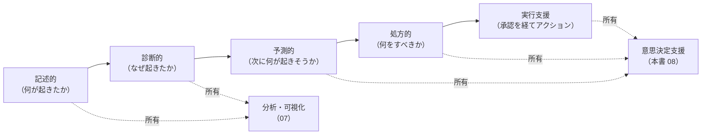
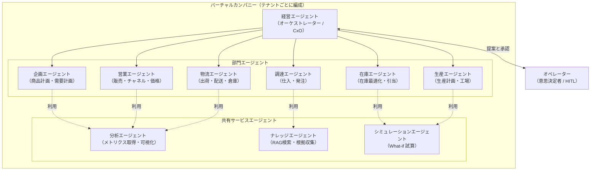
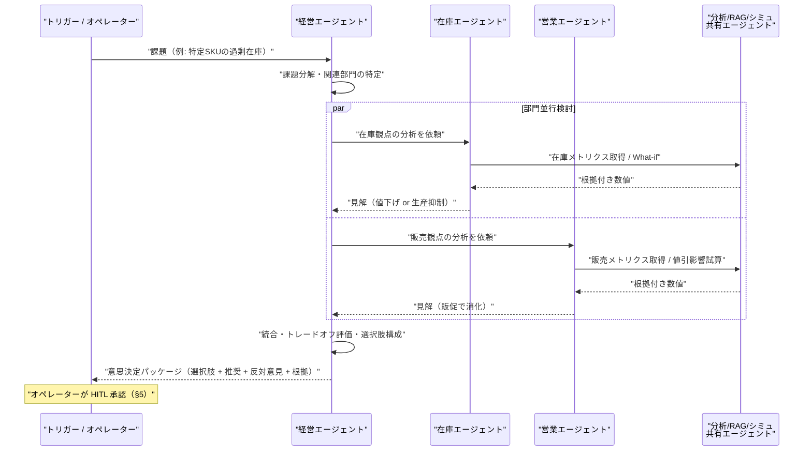
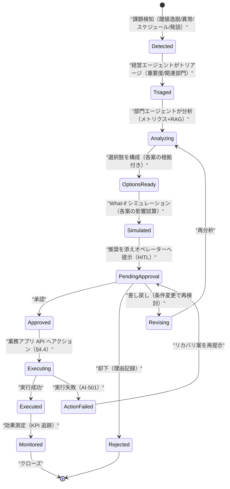
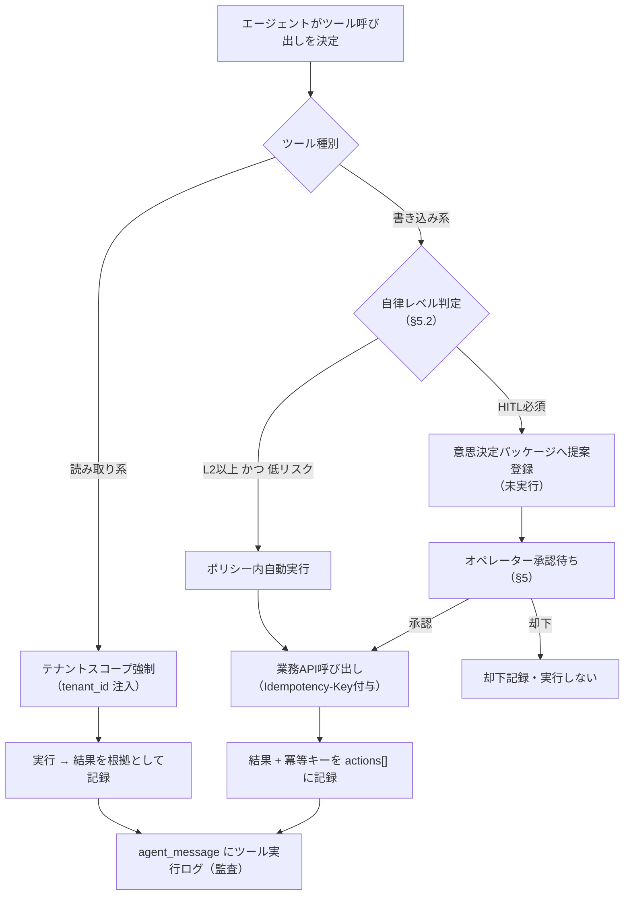
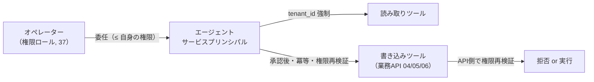
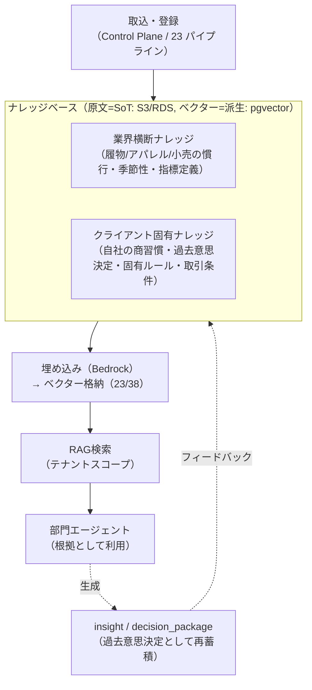
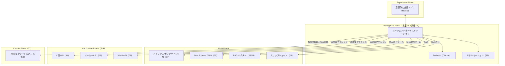

# 基本設計: 意思決定支援 / AIエージェント / バーチャルカンパニー

本書は **SCIP（Supply Chain Intelligence Platform、コード名）** の **Intelligence Plane（AI層、ブリーフ §3）** が提供する
**意思決定支援サービス**の基本設計を定義する。分析・可視化サービス（[`07`](./07-analytics-visualization.md)）が「事実を可視化する」のに対し、
本サービスは **「事実から次の一手を提案し、人間の承認を得て実行に橋渡しする」** ことを責務とする。
その実現手段が **バーチャルカンパニー化** — 企画・営業・調達・生産・在庫・物流・経営といった部門ロールを担う **AIエージェント群** の編成である。

> **本ドキュメントの所有範囲（owns）:** 意思決定支援 / AIエージェントサービスの**機能・エージェント編成・意思決定支援ワークフロー・ツール利用方針・HITL とガバナンス・ドメイン知識活用方針**の権威的記述（基本設計レベル）。
> **詳細アーキテクチャ（オーケストレーション実装・メモリ管理・ツール実行基盤・プロンプト設計・状態機械の実装詳細）は [`24 AIエージェント/バーチャルカンパニー`](../detailed-design/24-ai-agent-virtual-company.md) が所有。**
> **物理スキーマ（`agent` / `agent_session` / `agent_message` / `agent_memory` / `insight` / `analysis_run` / DocDB アイテム形状の CREATE TABLE・索引・制約・`tenant_id`・RLS）は [`38 AI/ベクター/ナレッジ`](../database-design/38-ai-vector-knowledge-schema.md) が所有。**
> 本書はエンティティを**論理レベル**で記述するに留め、`kb_*` / `domain_knowledge` / `dim_*` / `fact_*` / `tenant` / `app_user` 等の共通テーブルは所有ドキュメントの定義を参照し、再定義しない。

- **位置づけ:** ブリーフ §2 サービスポートフォリオの「横断 / 意思決定支援 + AIエージェント（バーチャルカンパニー化）」に対応する。
- **土台:** ブリーフ §12（AI/RAG/エージェント規約）を実装方針の起点とし、LLM は **Amazon Bedrock 上の Anthropic Claude モデル群**（ブリーフ §4）、
  埋め込み・ベクター検索は [`23 AI/RAG/ベクター化`](../detailed-design/23-ai-rag-vectorization.md) の RAG パイプラインに委譲する。数値は必ず DWH / メトリクス層（07/35）から取得し、LLM に生成させない。

---

## 1. サービス概要

### 1.1 「分析インサイト」から「意思決定支援」への進化

分析・可視化サービス（07）が提供するのは **記述的分析（何が起きたか）** と **診断的分析（なぜ起きたか）** までである。
本サービスはその上に **予測的分析（次に何が起きそうか）** と **処方的分析（何をすべきか）** の層を重ね、
さらに **人間の承認を経て業務アプリ（04/05/06）へアクションを橋渡しする** ところまでを射程とする。

**責務境界:** 集計・指標定義・ダッシュボードの本体は 07/35 が所有する。本サービスはそれらを**消費**して意思決定を組み立てる。
本サービスは新たな数値を**計算しない**（数値の SoT は常に DWH / メトリクス層）。エージェントは「取得した数値の解釈・比較・選択肢の構成・シミュレーション条件の設定」を担う。

### 1.2 3 つの提供形態

| 形態 | 概要 | トリガー | 主な出力 |
|------|------|----------|----------|
| **プロアクティブ提案** | 課題を自動検知し、分析・選択肢・推奨を先回りで提示 | メトリクス閾値逸脱・異常検知・スケジュール | 意思決定パッケージ（下記 §3.5） |
| **対話型アシスト** | オペレーターの自然言語質問に、根拠付きで回答・提案 | ユーザ発話 | 回答 + 根拠（引用）+ 追加アクション候補 |
| **バーチャルカンパニー協議** | 複数部門エージェントが1つの意思決定を多角的に検討し、統合案を提示 | 経営課題・部門横断テーマ | 部門別見解 + 統合推奨 + 反対意見 |

### 1.3 SoT 宣言

本サービスが SoT となるデータと、参照に留めるデータを明示する（ブリーフ §5 の原則: SoT 先行書込 → 派生後追い）。

| データ | 本サービスにおける扱い | SoT | 備考 |
|--------|----------------------|-----|------|
| エージェント定義（役割・ツール権限・自律レベル・プロンプト構成） | **本サービスが SoT** | AI DB（`agent`、38 所有） | テナントごとに編成をカスタム可能 |
| エージェントセッション / メッセージ / ツール実行ログ | **本サービスが SoT（append-only）** | AI DB（`agent_session`/`agent_message`、38 所有） | 監査・再現性の源泉 |
| エージェントメモリ（短期=会話文脈 / 長期=学習事実） | **本サービスが SoT** | AI DB（`agent_memory`、38 所有） | 長期メモリはテナントスコープ |
| 意思決定パッケージ（課題・選択肢・推奨・承認履歴） | **本サービスが SoT** | AI DocDB アイテム形状（`decision_package`、38 所有・§3.5） | ネスト構造が大きいため DocDB(DynamoDB) 読み取りモデルで保持（ブリーフ §5）。確定承認・機微操作は `audit_logs`(37) にも二重記録 |
| インサイト（生成された気づき） | **本サービスが SoT**（生成メタ）だが**数値は派生** | AI DB（`insight`、38 所有） | 数値の根拠は DWH を参照 |
| 分析実行ログ（analysis_run） | **本サービスが SoT** | AI DB（`analysis_run`、38 所有） | どのメトリクス/RAG を使ったか |
| メトリクス値・集計値・dim/fact | **参照のみ**（数値の SoT は DWH） | Redshift / メトリクス層（07/35 所有） | 数値はここから取得、LLM 生成禁止 |
| ナレッジベース原文・チャンク・埋め込み | **参照のみ** | KB（原文=S3/RDS が SoT、ベクター=派生。23/38 所有） | RAG 検索で消費 |
| ドメイン知識（業界横断 + クライアント固有） | **参照のみ**（登録は Control Plane / 23） | `domain_knowledge`（38 所有）+ 原文（S3） | §6 |
| 業務トランザクション / マスタ | **参照 + アクション書込は業務アプリ API 経由** | 各 OLTP（04/05/06 所有） | 本サービスは直接 DB を書かない（§4.4） |
| テナント / ユーザ / 権限ロール / 監査ログ | **参照のみ** | Control Plane（37 所有） | RLS の `tenant_id`、監査は `audit_logs`（37） |

> **重要な設計判断:** 本サービスは **業務データストア（OLTP）を直接書き換えない**。アクションは必ず各業務アプリの公開 API（04/05/06 の `/api/v1/...`）を経由し、
> それらの API が持つバリデーション・権限・監査・冪等性（`Idempotency-Key`）を通す。これにより SoR の SoT を業務アプリ側に一元化し、二重書込・整合性崩壊を防ぐ（ブリーフ §5 / CLAUDE.md 原則6）。

---

## 2. バーチャルカンパニー構想

### 2.1 部門エージェント編成

バーチャルカンパニーは、実企業の組織構造を模した **部門ロールエージェント群** と、それらを束ねる **経営（オーケストレーター）エージェント**、
横断機能を担う **共有サービスエージェント** で構成する。各エージェントは「役割（責務）」「利用可能ツール」「参照ドメイン知識」「自律レベル（§5.2）」で定義される。

### 2.2 部門エージェントの責務・ツール・関心指標

| 部門エージェント | 主責務（意思決定の観点） | 主に使うツール（§4） | 主に見る fact/メトリクス（07/35） | 対応する業務アプリ |
|-----------------|------------------------|---------------------|----------------------------------|------------------|
| 企画 | 商品計画・需要予測・品揃え・投入時期 | メトリクス / RAG / シミュレーション | fact_sales, dim_product, dim_date | メーカー(05) |
| 営業 | 販売施策・チャネル配分・価格/値引・販促 | メトリクス / RAG / シミュレーション | fact_sales（margin/discount）, dim_customer, dim_channel | 小売(04)/メーカー(05) |
| 調達 | 仕入先選定・発注量/タイミング・原価 | メトリクス / RAG / 業務API(発注) | fact_purchase_order, dim_supplier | メーカー(05) |
| 生産 | 生産計画・能力配分・BOM/材料手配 | メトリクス / シミュレーション / 業務API(生産) | fact_production, BOM | メーカー(05) |
| 在庫 | 在庫最適化・引当優先・欠品/過剰の是正 | メトリクス / シミュレーション / 業務API(在庫) | fact_inventory_snapshot, fact_inventory_movement | 全アプリ |
| 物流 | 出荷計画・配送最適化・倉庫作業負荷平準化 | メトリクス / 業務API(WMS) | fact_shipment, fact_inventory_movement | WMS(06) |
| 経営（オーケストレーター） | 部門横断の統合判断・トレードオフ調整・優先度付け | 全ツール（部門エージェントを子として呼ぶ） | 全 fact のロールアップ | 全アプリ |

> **編成のカスタマイズ性（SI 戦略）:** ブリーフ §2 の「共通化 + 固有カスタマイズ」に従い、上表は**標準編成テンプレート**である。
> テナントの業態（小売のみ・倉庫のみ 等）に応じ、`agent` 定義（38 所有）で不要な部門を無効化・統合し、固有部門を追加できる。編成は Control Plane のフィーチャーフラグ / エンタイトルメント（37）で制御する。

### 2.3 オーケストレーションパターン

経営エージェントを **スーパーバイザー** とする階層型オーケストレーションを標準とする。ユーザ / トリガーからの課題は経営エージェントが受け、
関連部門エージェントに委譲（ファンアウト）し、各見解を収集（ファンイン）して統合案を構成する。**反対意見・少数意見を潰さず併記する**（意思決定の質を担保、SP-7 の透明性原則に整合）。

---

## 3. 意思決定支援ワークフロー

### 3.1 標準ワークフロー（6 ステージ）

意思決定支援は **課題検知 → 分析 → 選択肢提示 → シミュレーション → HITL 承認 → アクション** の 6 ステージで進む。
各ステージの成果物は **意思決定パッケージ**（§3.5）に蓄積され、全過程が監査可能である。

### 3.2 ステージ1: 課題検知（トリガー）

課題検知は 3 経路。いずれも**冪等**に扱い、同一課題の多重起票を抑止する（`Idempotency-Key` 相当のディデュープキー。ブリーフ §11）。

| 経路 | 実装 | 例 |
|------|------|-----|
| メトリクス閾値 | 07 のメトリクス層に閾値ルールを登録し、EventBridge スケジュールで評価 | 在庫回転日数 > N、粗利率 < X% |
| 異常検知 | 07/23 の異常検知（時系列外れ値・分類）からイベント受信 | 特定チャネルの売上急落 |
| スケジュール / 発話 | 定例（週次レビュー）または対話型アシストのユーザ発話 | 「今週の要注意 SKU は？」 |

> **非ブロッキング原則（CLAUDE.md 原則4）:** 検知は補助フロー。検知エンジンの一時失敗が業務アプリの主要フローを止めてはならない。
> 検知イベントは EventBridge / キュー経由で非同期に受け、失敗はリトライ + 手動再評価パス（再スキャン）で回復する。

### 3.3 ステージ2〜3: 分析と選択肢提示

- **分析:** 担当部門エージェントが、メトリクスツール（数値）と RAG ツール（文脈・過去事例・業界知識）を組み合わせて課題を診断する。**数値は必ずメトリクス/DWH から取得**し、根拠（メトリクス定義・期間・フィルタ・引用元 KB チャンク）を選択肢に添付する。
- **選択肢提示:** 各案は「概要・前提・期待効果・副作用/リスク・必要アクション・関与部門」を構造化して提示する。**必ず 2 案以上 + 現状維持案**を含める（単一案の押し付けを禁止、意思決定者の裁量を確保）。

### 3.4 ステージ4: シミュレーション（What-if）

シミュレーションエージェントが各選択肢の影響を試算する。試算は **決定論的な計算モデル**（在庫展開・粗利計算・リードタイム展開等）を用い、
**LLM に数値を生成させない**（ハルシネーション抑制、ブリーフ §12）。LLM はシナリオ設定・結果の説明・比較の言語化を担う。

| シミュレーション種別 | 入力 | 計算基盤 | 出力例 |
|--------------------|------|----------|--------|
| 在庫消化シミュレーション | 販売ペース・値引率・入荷予定 | メトリクス層 + 計算エンジン（22/24） | 消化完了予測日・欠品/過剰リスク |
| 発注/生産量シミュレーション | 需要予測・現在庫・リードタイム | 同上 | 推奨発注量・欠品確率 |
| 価格/値引シミュレーション | 弾力性推定・在庫・粗利目標 | 同上 | 想定販売数・粗利影響 |

> **試算の位置づけ:** シミュレーションは**意思決定支援**であり、断定ではない。結果には前提条件・信頼区間/感度・免責を明示する（推測を断定で書かない、ブリーフ §0）。
> シミュレーション計算エンジンの実装詳細は [`24`](../detailed-design/24-ai-agent-virtual-company.md) が所有。

### 3.5 意思決定パッケージ（成果物モデル・論理定義）

ワークフローの全過程を束ねる中核成果物。**本サービスが SoT**。ネストの深い構造（options[]/evidence[]/simulations[]/approvals[]）を持つため、物理形状は **DocDB(DynamoDB) アイテム（読み取りモデル）** として [`38`](../database-design/38-ai-vector-knowledge-schema.md) が所有する（ブリーフ §5 の DocDB 用途区分）。論理的な構成要素は以下。

| 要素 | 内容 | 由来 |
|------|------|------|
| 課題（issue） | 検知トリガー・重要度・関連部門・対象エンティティ（SKU/拠点/取引先） | ステージ1 |
| 分析根拠（evidence[]） | 参照したメトリクス定義・期間・値・引用 KB チャンク（RAG）・insight | ステージ2、07/35/38 参照 |
| 選択肢（options[]） | 各案の概要・前提・期待効果・リスク・必要アクション | ステージ3 |
| シミュレーション結果（simulations[]） | 各案の試算・前提・感度 | ステージ4 |
| 推奨（recommendation） | 経営エージェントの推奨案 + 反対/少数意見 | ステージ4 |
| 承認履歴（approvals[]） | 承認者・日時・判断・理由・自律レベル | ステージ5（HITL、§5） |
| アクション結果（actions[]） | 呼んだ業務 API・冪等キー・結果・効果測定 KPI | ステージ6（§4.4） |

---

## 4. エージェントが利用するツール

### 4.1 ツールカタログ

エージェントは **ツール（関数）呼び出し** を通じてのみ外部システムに作用する（LLM の直接的な副作用を禁止）。ツールは **読み取り系** と **書き込み系** に大別し、書き込み系は HITL 承認を必須とする（§5）。

| ツール | 種別 | 接続先 | 責務 | 所有 |
|--------|------|--------|------|------|
| `metrics_query` | 読み取り | メトリクス/セマンティック層 | 指標を定義に基づき取得（数値の正） | 07/35 |
| `dwh_query` | 読み取り | Redshift（パラメタライズド・読み取り専用ロール） | 定型クエリで dim/fact を取得 | 35 |
| `snapshot_fetch` | 読み取り | S3 スナップショット + CDN | 事前集計の高速取得 | 26 |
| `rag_search` | 読み取り | ベクター検索（pgvector）+ KB | テナントスコープの根拠検索 | 23/38 |
| `domain_lookup` | 読み取り | `domain_knowledge`（業界+クライアント固有） | 業界慣行・クライアント固有ルールの参照 | 23/38 |
| `simulate` | 読み取り（計算） | シミュレーション計算エンジン | What-if 試算 | 24 |
| `insight_read` | 読み取り | `insight` | 既存インサイトの参照 | 38 |
| `app_action.*` | **書き込み** | 各業務アプリ API（04/05/06） | 発注/生産/価格/引当/出荷指示等の起票 | 04/05/06 |
| `notify` | 書き込み（低リスク） | 通知（メール/アプリ内） | オペレーターへの提案通知 | 09/本書 |

### 4.2 ツール実行の安全設計

### 4.3 読み取り系ツールのテナント境界

全読み取り系ツールは、エージェントのセッションが属する `tenant_id` を**呼び出し側で強制注入**する（プロンプト経由でテナントを渡さない）。
`rag_search` / `domain_lookup` はベクター検索・KB 参照ともにテナントスコープ（+ 業界横断の共有ナレッジは明示フラグのある公開分のみ）に限定する（ブリーフ §12 ガードレール、§5.3）。

### 4.4 書き込み系ツール（app_action）の設計原則

- **業務アプリ API 経由のみ。** 本サービスは OLTP を直接書かない（§1.3 の設計判断）。呼び先は 04/05/06 の公開 `/api/v1` エンドポイント。
- **HITL 承認後にのみ実行**（自律レベル L3 の限定的例外は §5.2）。
- **冪等性:** 全書込に `Idempotency-Key`（意思決定パッケージ + アクション ID から導出）を付与し、二重実行を無害化（ブリーフ §11、CLAUDE.md 原則2）。
- **権限の下位性:** エージェントのサービスプリンシパルが持つ権限は、承認したオペレーターの権限を**超えない**（§5.1）。
- **失敗の非ブロッキング化:** アクション失敗（AI-501）は意思決定パッケージにリカバリ案を積み、オペレーターへ再提示する。エージェントの失敗が業務アプリの主要フローを止めない（CLAUDE.md 原則4）。

---

## 5. 人間 in the loop（HITL）とガバナンス

### 5.1 権限モデル

エージェントは **サービスプリンシパル**（テナントスコープの機械アカウント）として動作し、その権限は **委任元オペレーターの権限の部分集合**に制約される。
権限ロールの SoT は Control Plane（37）。エージェントが `app_action.*` を実行する際は、承認者の権限で当該操作が許可されるかを業務アプリ API 側が再検証する（多層防御）。

### 5.2 自律レベル（Autonomy Level）

エージェントの自律度をレベルで制御する。既定は **L1（提案のみ）**。レベルはテナント × 部門 × アクション種別ごとに Control Plane（37 のフィーチャーフラグ/エンタイトルメント）で設定する。

| レベル | 名称 | 挙動 | 適用例 |
|--------|------|------|--------|
| L0 | 観測のみ | 検知・可視化のみ。提案しない | 導入初期・信頼構築前 |
| L1 | 提案（既定） | 選択肢と推奨を提示。実行は必ず人間 | 全ての書込アクション既定 |
| L2 | 承認付き実行 | 人間が個別承認したアクションのみ実行 | 発注・価格変更等の重要操作 |
| L3 | 監督付き自動実行 | 事前定義ポリシー内の**低リスク**操作のみ自動実行、事後に人間へ通知 | 定型補充発注（金額上限内）等、限定的に許可 |

> **L3 の厳格な制約:** L3 は「金額上限・対象 SKU/取引先の許可リスト・時間帯・1 日あたり回数上限」等の**明示的ポリシー**の内側でのみ許可し、逸脱は自動的に L2（人間承認）へ降格する。
> L3 の有効化はテナントのオプトインを必須とし、全自動実行は事後に必ず通知・監査記録する。既定は無効。

### 5.3 テナント境界とデータガバナンス

| ガードレール | 内容 | 実装 |
|------------|------|------|
| テナント境界厳守 | RAG 検索・ツール実行・メモリ参照は全て `tenant_id` スコープ。クロステナント参照は不可 | 呼び出し側で `tenant_id` 注入 + RLS（DB）+ ベクター検索フィルタ（23） |
| 機微データマスキング | 仕入単価・原価等（ブリーフ §11）は既定マスク。開示は権限 + 明示フラグ + 監査 | 業務 API のマスク方針を継承。プロンプトに機微生値を安易に載せない |
| 根拠提示（説明可能性） | 全推奨・回答に根拠（メトリクス定義・期間・値・引用 KB・insight）を添付 | 意思決定パッケージ evidence[]（§3.5） |
| ハルシネーション抑制 | 数値は DWH/メトリクスから取得、LLM 生成禁止。根拠なき主張を出さない | ツール設計（§4）+ 検証プロンプト |
| プロンプトインジェクション対策 | 取込ドメイン文書・ユーザ入力を信頼境界外として扱い、ツール権限を昇格させない | 入力サニタイズ + ツール allowlist（24） |
| 監査可能性 | 全セッション・メッセージ・ツール実行・承認を append-only 記録 | `agent_session`/`agent_message`（38）+ `audit_logs`（37） |

### 5.4 監査と再現性

意思決定の全過程は再現可能でなければならない。`agent_message`（38）には LLM の入出力参照・ツール呼び出し・引用根拠を、承認は `decision_package.approvals[]` に記録する。
機微操作（`app_action.*` の実行・L3 自動実行・自律レベル変更）は Control Plane の `audit_logs`（37 所有、append-only）にも二重記録し、改竄防止・逆引きを担保する（CLAUDE.md 原則2/6）。

---

## 6. ドメイン知識（業界 + クライアント固有）の活用方針

### 6.1 ナレッジの二層構造

エージェントの判断品質は **ドメイン知識** に依存する。ブリーフ §12 に従い、知識は RAG（主）で活用する。知識は**業界横断層**と**クライアント固有層**の 2 層で管理する。

### 6.2 活用の原則

- **テナントスコープ厳守:** クライアント固有層は当該テナントのエージェントのみ参照可（§5.3）。業界横断層は明示的に公開マーク（`is_shared`）された分のみ全テナント共有（ブリーフ §12）。
- **RAG 主・微調整従:** 既定は RAG による文脈注入。微調整（ファインチューニング）はコスト・データ境界・陳腐化リスクを勘案し限定適用（未決事項 §12-3）。
- **意思決定の再蓄積:** 承認された意思決定パッケージは、匿名化・構造化のうえクライアント固有ナレッジへ戻し、以降の類似課題の根拠に再利用する（学習ループ）。**個人情報・機微情報の再蓄積前マスキングを必須**とする。
- **数値はナレッジに載せない:** 変動する数値（在庫・売上）は RAG に埋め込まず、常に DWH/メトリクスからライブ取得する（陳腐化・矛盾回避）。ナレッジは「解釈・慣行・ルール・過去判断の文脈」を担う。

> **所有境界:** ドメイン知識の取込パイプライン（チャンク化・埋め込み・ベクター格納）の実装は [`23`](../detailed-design/23-ai-rag-vectorization.md)、
> 物理スキーマ（`kb_document`/`kb_chunk`/`kb_embedding`/`domain_knowledge`）は [`38`](../database-design/38-ai-vector-knowledge-schema.md) が所有。本書は活用方針のみ。

---

## 7. エージェントのメモリ・セッション・状態（論理レベル）

エージェントの継続性を支える 3 種のメモリを論理レベルで定義する（物理は 38 の `agent_session`/`agent_message`/`agent_memory` が所有）。

| メモリ種別 | 保持内容 | スコープ | 寿命 |
|-----------|----------|----------|------|
| 短期メモリ（会話文脈） | 現セッションの発話・ツール結果・中間推論 | セッション | セッション終了で要約化 |
| 長期メモリ（学習事実） | テナント固有の確定事実・嗜好・過去意思決定の要約 | テナント × 部門 | 永続（更新は SoT 先行、§1.3） |
| 手続き記憶（ツール手順） | 定型タスクの実行手順・成功パターン | テナント × 部門 | 永続（改善で更新） |

> **メモリの整合性（CLAUDE.md 原則2）:** 長期メモリの更新は SoT（`agent_memory`）先行 → キャッシュ後追い。再実行でメモリ・セッションログが巻き戻らないよう append-only を基本とし、
> 誤学習の訂正は「打ち消しレコード追加」で行い履歴を破壊しない。詳細な状態機械・要約タイミングは [`24`](../detailed-design/24-ai-agent-virtual-company.md) が所有。

---

## 8. アーキテクチャ上の位置づけ

本サービスは Intelligence Plane（ブリーフ §3）に属し、Data Plane（07/22/35）と Application Plane（04/05/06）の中間で「読み取り」と「承認済み書き込み」を仲介する。

---

## 9. API 概要（サービング）

REST + JSON、`/api/v1`、Firebase Bearer、tenant クレーム解決、RFC 7807 Problem Details、`{data, meta}` エンベロープ、ページング（ブリーフ §11）に準拠する。詳細コントラクトは [`25 API/連携コントラクト`](../detailed-design/25-api-integration-contract.md) が所有。

| エンドポイント（例） | メソッド | 責務 | 備考 |
|--------------------|----------|------|------|
| `/api/v1/agent-sessions` | POST | 対話セッション開始 | 部門/編成を指定 |
| `/api/v1/agent-sessions/{id}/messages` | POST | 発話送信（対話型アシスト） | `Idempotency-Key` 対応 |
| `/api/v1/decision-packages` | GET | 意思決定パッケージ一覧（1 責務=一覧のみ） | フィルタ/ページング |
| `/api/v1/decision-packages/{id}` | GET | 詳細取得（一覧と分離、ブリーフ §11） | evidence/options/simulations 含む |
| `/api/v1/decision-packages/{id}/approve` | POST | HITL 承認 → アクション実行 | 承認者権限で API 側再検証 |
| `/api/v1/decision-packages/{id}/reject` | POST | 却下（理由必須） | 監査記録 |
| `/api/v1/decision-packages/{id}/revise` | POST | 差し戻し（条件変更で再検討） | 再分析トリガー |
| `/api/v1/agents` | GET/PUT | エージェント編成の参照/設定 | 権限限定・37 と連動 |

> **API 責務分離（review-standards 2.1）:** 一覧取得（`GET /decision-packages`）と詳細取得（`GET /decision-packages/{id}`）を分離し、集約責務をクライアントに押し付けない。承認・却下・差し戻しは別アクション API に分離する。

---

## 10. 非機能・テナンシー観点（サマリ）

詳細は [`11 非機能/セキュリティ/テナンシー`](./11-nfr-security-tenancy.md) が所有。本サービス固有の要点のみ記す。

- **テナント境界:** 全ツール・メモリ・RAG は `tenant_id` スコープ強制（呼び出し側注入 + RLS + ベクター検索フィルタ）。クロステナント参照は構造的に不可（§5.3）。
- **データ境界:** LLM は国内リージョン（ap-northeast-1）の Bedrock を使用（ブリーフ §4）。機微生値をプロンプトに載せず、マスク方針を継承。
- **可用性/劣化耐性:** LLM/RAG/シミュレーションの遅延・失敗は非同期化とタイムアウト + フォールバック（部分結果 + 「根拠不足」明示）で吸収し、業務アプリの主要フローを止めない（CLAUDE.md 原則4）。
- **コスト管理:** LLM/埋め込みのトークン消費は `usage_metering`（37）で計測しエンタイトルメントと連動。無制限のエージェントループを防ぐステップ上限・予算上限を設ける。
- **TZ 方針:** プラットフォーム標準の `TIMESTAMPTZ`（UTC 保存・テナントローカル表示、ブリーフ §9）。意思決定・承認の時刻は監査上重要なため厳密に記録。
- **レスポンシブ（CLAUDE.md 原則8 / U-2）:** 意思決定支援アプリはモバイル前提。**PC は選択肢比較を表（テーブル）で高密度表示**、**モバイルは選択肢を 1 カード = 1 案のカード型**に切替。承認 UI はモバイルでも 1 タップ承認 + 根拠展開。横長の根拠テーブルは `overflow-x: auto` の専用領域に収め本体を横スクロールさせない。

---

## 11. 想定エラーコード（AI-NNN）

ブリーフ §10 のドメイン接頭辞 `AI`（AI/RAG/エージェント）に準拠。RFC 7807 Problem Details の `code` フィールドに格納する（ブリーフ §11、3 桁ゼロ埋め）。

| コード | 発生機能 | 意味 | 重大度 | 対処/誘導（U-4） |
|--------|----------|------|--------|-----------------|
| AI-001 | 共通 | テナントスコープ外アクセス（RLS 違反 / `X-Tenant-Id` 不一致） | CRITICAL | 403。再認証/権限確認・監査記録 |
| AI-002 | 共通 | 必須項目欠落 / バリデーションエラー | WARNING | 入力補正を誘導 |
| AI-003 | 共通 | エンタイトルメント外機能の要求（AI機能未契約） | WARNING | 契約プラン確認へ誘導（37） |
| AI-101 | 課題検知 | 検知イベントの重複起票（ディデュープキー衝突） | INFO | 既存課題を返却・冪等無害化 |
| AI-102 | 課題検知 | 検知エンジン一時失敗 | WARNING | 非ブロッキング。リトライ/再スキャンへ誘導 |
| AI-201 | 分析 | メトリクス/DWH からの数値取得失敗 | WARNING | 根拠不足を明示し部分結果提示・再試行 |
| AI-202 | 分析 | 根拠不足で推奨を構成できない | WARNING | 追加データ/期間指定を誘導・断定しない |
| AI-203 | RAG | RAG 検索結果ゼロ（該当ナレッジなし） | INFO | 根拠なしを明示・ナレッジ登録を提案 |
| AI-301 | LLM | Bedrock 応答タイムアウト/レート超過 | WARNING | 非同期再試行・フォールバック提示 |
| AI-302 | LLM | LLM 応答が数値を生成しようとした（グラウンディング違反検出） | WARNING | メトリクス取得へ再ルーティング・出力棄却 |
| AI-303 | ガードレール | プロンプトインジェクション/ツール権限昇格の試行を検出 | CRITICAL | 実行拒否・セッション隔離・監査記録 |
| AI-304 | ガードレール | 機微データ（原価/仕入単価）の権限外開示要求 | CRITICAL | マスク維持・拒否・監査記録 |
| AI-401 | エージェント | エージェント実行ステップ上限/予算上限に到達 | WARNING | 部分結果提示・人間へエスカレーション |
| AI-402 | エージェント | オーケストレーションの循環参照/デッドロック検出 | WARNING | 実行打ち切り・課題を再トリアージ |
| AI-403 | メモリ | 長期メモリ更新の競合（SoT 整合違反） | WARNING | SoT 再読込・打ち消しレコードで訂正 |
| AI-501 | アクション | 業務アプリ API 呼び出し失敗（承認済アクションの実行失敗） | WARNING | 非ブロッキング。リカバリ案を再提示（HITL） |
| AI-502 | アクション | 承認なしでの書き込みツール実行要求（自律レベル違反） | CRITICAL | 実行拒否・HITL へ差し戻し・監査記録 |
| AI-503 | アクション | 承認者権限で当該操作が不許可（API 側再検証で拒否） | CRITICAL | 実行拒否・権限確認へ誘導 |
| AI-504 | アクション | L3 自動実行がポリシー上限（金額/回数/対象）を逸脱 | WARNING | L2（人間承認）へ自動降格・通知 |
| AI-505 | アクション | アクションの重複実行（Idempotency-Key 重複） | INFO | 既存実行結果を返却・冪等無害化 |
| AI-601 | 承認 | 確定済（承認/却下済）パッケージへの再承認要求 | WARNING | 巻き戻し禁止。訂正は新規パッケージへ誘導 |

> **エラーハンドリング（review-standards 3.4 / CLAUDE.md 原則4）:** 補助処理（検知・RAG・通知・分析供給）の失敗は主要フローを止めないグレースフルデグラデーション。
> 致命的（AI-001/303/304/502/503）のみ例外を投げ、実行を拒否して監査記録する。全想定エラーにコードを付与し逆引き可能に一元管理する。

---

## 12. 未決事項 / 論点

| # | 論点 | 選択肢とトレードオフ | 暫定方針 |
|---|------|--------------------|----------|
| 1 | オーケストレーション実装基盤 | (a) 自社実装オーケストレータ / (b) Bedrock Agents / (c) OSS フレームワーク（LangGraph 等） | 暫定(a)を主・(b)を選択肢併記（ブリーフ §12）。データ境界制御と自律レベル制御の作り込み容易性を 12 ADR / 24 で確定 |
| 2 | 自律レベル L3 の導入範囲 | (a) MVP は L1/L2 のみ / (b) 限定領域（定型補充発注）で L3 を初期導入 | 暫定(a)。信頼構築後に(b)をオプトインで段階導入。L3 ポリシーの表現方法は 24 で設計 |
| 3 | ドメイン知識の微調整（ファインチューニング）適用 | (a) RAG のみ / (b) 業界横断層のみ微調整 / (c) テナント別微調整 | 暫定(a)。コスト・データ境界・陳腐化リスク大。効果が RAG で頭打ちの領域のみ(b)を検討（23 と協議） |
| 4 | シミュレーション計算エンジンの所在 | (a) 24 の専用計算エンジン / (b) 22 の変換エンジン再利用 / (c) メトリクス層の派生指標 | 暫定(a)。予測モデル（弾力性・需要予測）を含むため。決定論計算部は(b)/(c)と共通化余地。24/22 で境界確定 |
| 5 | 需要予測モデルの実装 | (a) Bedrock/統計モデル自社実装 / (b) Amazon Forecast 等マネージド | 暫定未定。精度・コスト・運用性を比較し 12 ADR で決定。数値の SoT は予測結果を DWH に書き戻す方式を検討 |
| 6 | 意思決定の学習ループ（再蓄積）の匿名化基準 | どこまでを固有ナレッジへ戻すか・PII/機微のマスキング範囲 | 個人情報・原価等は再蓄積前マスキング必須。基準の詳細は 11（セキュリティ）と 23 で確定 |
| 7 | プロアクティブ提案の通知頻度・疲労対策 | (a) 全検知を即通知 / (b) 重要度スコアで間引き・ダイジェスト | 暫定(b)。閾値・重要度スコアリングは 07 メトリクス層と連携。通知疲労は U-2 の観点で調整 |
| 8 | エージェント編成のバージョン管理 | 編成（agent 定義）の変更履歴と再現性 | 編成変更は Control Plane（37）で版管理。過去意思決定は当時の編成版を参照可能にする（監査要件、38 と協議） |

---

## 13. 関連ドキュメント

- [`24 AIエージェント/バーチャルカンパニー`](../detailed-design/24-ai-agent-virtual-company.md)（document_id: ai-agent-virtual-company） — 本書の**詳細アーキテクチャを所有**（オーケストレーション実装・状態機械・メモリ管理・ツール実行基盤・プロンプト設計・シミュレーション計算エンジン）。
- [`23 AI/RAG/ベクター化`](../detailed-design/23-ai-rag-vectorization.md)（document_id: ai-rag-vectorization） — RAG パイプライン（チャンク化・埋め込み・ベクター検索）の詳細。本書の `rag_search`/`domain_lookup` ツールの基盤。
- [`07 分析・可視化サービス`](./07-analytics-visualization.md)（document_id: service-analytics） — メトリクス/セマンティック層・集計・異常検知の本体。本書は数値をここから取得（数値の SoT）。
- [`11 非機能/セキュリティ/テナンシー`](./11-nfr-security-tenancy.md)（document_id: nonfunctional-security-tenancy） — テナント境界・機微データ・監査・可用性の権威的定義。
- [`38 AI/ベクター/ナレッジ`](../database-design/38-ai-vector-knowledge-schema.md)（document_id: ai-vector-knowledge-schema） — `agent`/`agent_session`/`agent_message`/`agent_memory`/`insight`/`analysis_run`/`kb_*`/`domain_knowledge` の**物理スキーマ**、および `decision_package`（DocDB アイテム形状）を**所有**。
- 参考: [`02 全体アーキテクチャ`](./02-overall-architecture.md)、[`03 正準ドメインモデル`](./03-canonical-domain-model.md)、[`25 API/連携コントラクト`](../detailed-design/25-api-integration-contract.md)、[`26 スナップショット/DocDB`](../detailed-design/26-snapshot-docdb.md)、[`37 コントロールプレーン`](../database-design/37-control-plane-schema.md)。
