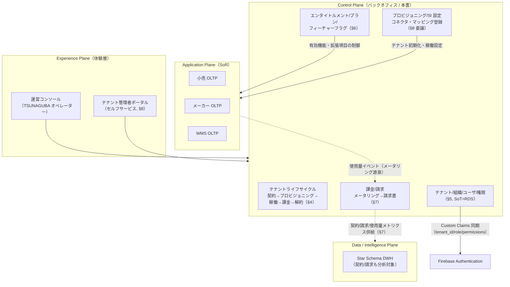
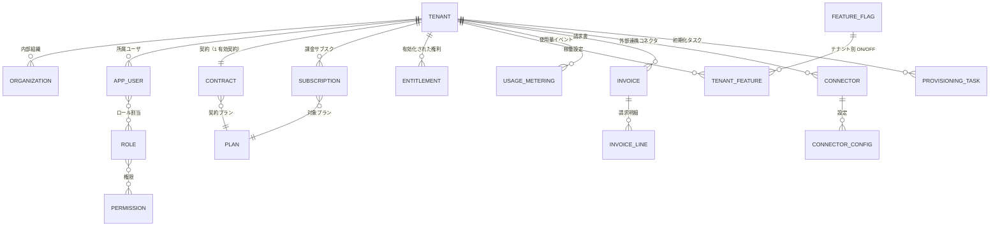
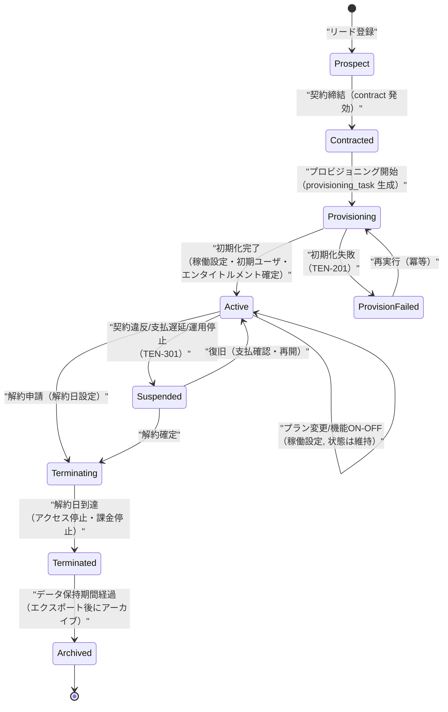
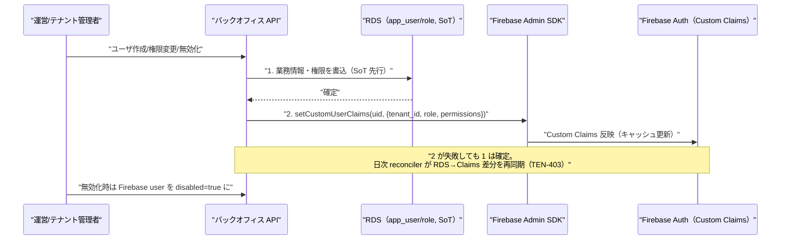
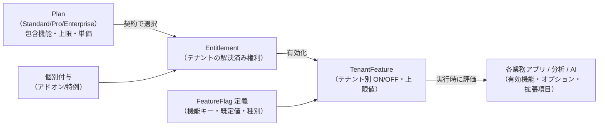
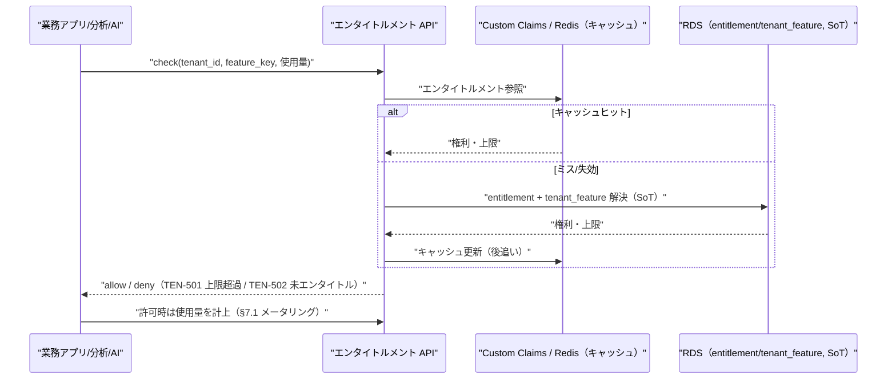
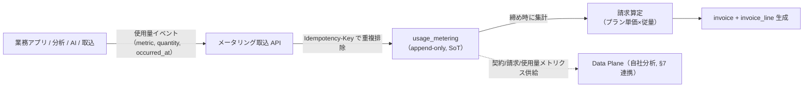
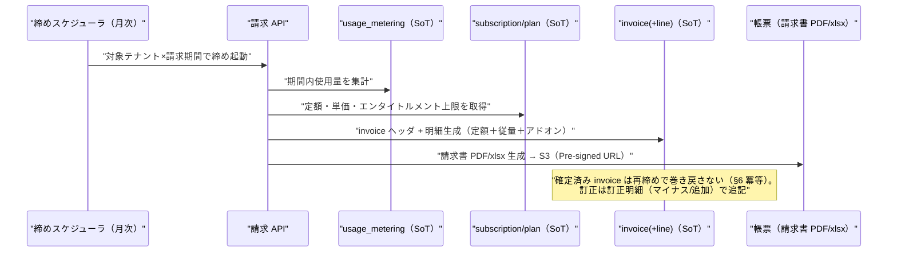
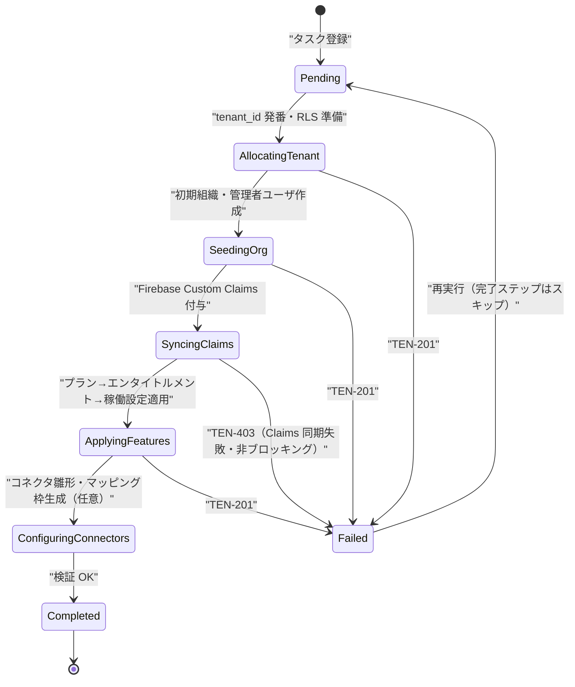

# 基本設計: バックオフィス（コントロールプレーン）

本書は **SCIP（Supply Chain Intelligence Platform、コード名）** の **コントロールプレーン（Control Plane）= バックオフィス** の基本設計を定義する。
バックオフィスは、SCIP を運営する **TSUNAGUBA（提供主体）** が、各テナント（小売 / メーカー / 倉庫 / 外部連携）の
**契約・プロビジョニング・稼働設定（SI 設定）・課金/請求・エンタイトルメント（有効機能の制御）** を一元管理する運営基盤である。
業務データそのものを持つ Application Plane（SoR）や分析を担う Data/Intelligence Plane とは責務が分離され、
「**テナントを生かし、機能を有効化し、使用量を計測して請求する**」ことに特化する。

バックオフィス自身の稼働データ（契約・請求・使用量）は SCIP が **自社の分析対象** としても利用するため、
Data Plane への**連携対象**でもある（§7 で契約・請求メトリクスの供給を扱う）。さらに、SI 事業として
**このバックオフィスをクライアント（例: 複数店舗を束ねる小売本部、複数荷主を抱える倉庫事業者）へ再提供**する
自己サービス化の可能性も検討範囲に含める（§9）。

> **本ドキュメントの所有範囲（owns）:** バックオフィス / コントロールプレーンの **機能・ライフサイクル・稼働設定・課金モデル・エンタイトルメントの基本設計** の権威的記述。
> **物理スキーマ（CREATE TABLE / 索引 / 制約 / `tenant_id` / RLS / 監査列）は本書では定義しない。**
> コントロールプレーンの物理スキーマ（`tenant` / `organization` / `app_user` / `role` / `permission` / `contract` / `plan` /
> `entitlement` / `subscription` / `usage_metering` / `invoice`(+`invoice_line`) / `feature_flag` / `tenant_feature` /
> `connector`(+`connector_config`) / `provisioning_task` / `audit_logs`）は
> [`37 コントロールプレーン/バックオフィス スキーマ`](../database-design/37-control-plane-backoffice-schema.md) が権威的に所有する。
> 本書はこれらを**論理レベル**で記述し、状態遷移・データフロー・SoT・同期パスを示すに留める。
> `canonical_*` / `dim_*` / `fact_*` 等の共通テーブルは所有ドキュメント（34 / 35）の定義を参照し、再定義しない。

- **位置づけ:** ファウンデーション・ブリーフ §2 サービスポートフォリオの「自社/任意でクライアント: バックオフィス（契約・稼働設定・請求・エンタイトルメント）」に対応し、§3 論理 5 層の **第 3 層 Control Plane** を担う。
- **土台:** 継承技術スタック（[Phase 4 技術スタック確定](../../../.ai-native/outputs/phase4/tech-stack-decision.md)）の認証（Firebase Authentication）・権限 SoT（RDS）・API 規約（Firebase Bearer / RFC7807 / `{data, meta}`）を踏襲し、そこへ **マルチテナント（`tenant_id` + RLS）** と **エンタイトルメント/課金** を新規に織り込む。

---

## 1. サービス概要と責務境界

### 1.1 コントロールプレーンの役割

SCIP は「小売・メーカー・倉庫を横断的につなぎ、共通データ基盤の上で分析・可視化・意思決定支援を提供する」プラットフォームである
（ブリーフ §1）。その運営には、**どのテナントが / どのプランで / どの機能を有効に / どれだけ使い / いくら請求するか** を制御する
運営面（コントロールプレーン）が不可欠である。これは業務データ（受注・在庫・売上等）とは異なる関心事であり、
Application Plane（SoR）から切り離してバックオフィスに集約する。

### 1.2 責務境界（本書が所有する / 他へ委譲する）

| 関心事 | 所有 | 委譲先 / 備考 |
|--------|------|--------------|
| 契約・プラン・エンタイトルメント・使用量計測・**SCIP がテナント（倉庫事業者/メーカー等）へ課す請求** | **本書（機能）+ 37（物理）** | SCIP → テナントの B2B 課金 |
| テナント/組織/ユーザ/権限ロールの業務情報 | **本書（機能）+ 37（物理）** | SoT=RDS。認証情報（UID/Email/PW）は Firebase（§5） |
| フィーチャーフラグ・稼働設定（テーマ/拡張項目の有効化） | **本書（制御モデル）** | 拡張項目の**物理適用**と SI カスタマイズ詳細は [`27 SI カスタマイズ/プロビジョニング`](../detailed-design/27-si-customization-and-provisioning.md) |
| コネクタ設定・マッピングメタデータ・ドメインナレッジ登録の**運用起点** | **本書（登録オペレーションの入口）** | 実体はそれぞれ [`10 データ連携`](./10-data-integration-and-mapping.md) / [`21 取込パイプライン`](../detailed-design/21-ingestion-and-mapping-pipeline.md) / [`36 マッピングメタデータ`](../database-design/36-mapping-metadata-schema.md) / [`38 AI/ナレッジ`](../database-design/38-ai-vector-knowledge-schema.md) |
| **荷主（shipper）への請求** | **所有しない** | 倉庫テナントが自社の荷主へ課す B2B 請求は WMS の業務機能。[`06 WMS`](./06-service-wms.md) 所有 / `shipper_billing`（33）。本書の SCIP 課金とは**別レイヤ**（§6.4 で対比） |
| RLS・機微値マスク・体感性能の非機能詳細 | 参照 | [`11 非機能/セキュリティ/テナンシー`](./11-nonfunctional-security-tenancy.md) |

> **課金の二層性（重要）:** SCIP プラットフォームには請求が **2 階層**存在する。
> (a) **SCIP → テナント**（本書 §6）＝プラットフォーム利用料。SaaS のサブスクリプション + 使用量課金。
> (b) **倉庫テナント → 荷主**（WMS §5, 33 所有）＝倉庫の業務としての保管料・入出庫料請求。
> 両者は**同一の請求という語だが別ドメイン・別 SoT・別テーブル**である。混同しない（§6.4）。

---

## 2. テナント・契約の中核概念（論理モデル）

バックオフィスの中核は「**誰と（Tenant）どういう約束で（Contract/Plan）何を使えるか（Entitlement）** を管理し、**使った分（Usage）を請求（Invoice）する**」ことにある。以下は論理エンティティ関連（物理は 37 所有）。

| 論理エンティティ | 役割 | SoT | 37 の物理テーブル |
|-----------------|------|-----|------------------|
| Tenant（テナント） | 契約単位。小売/メーカー/倉庫/外部連携の別を `tenant_kind` で保持 | RDS | `tenant` |
| Organization（組織） | テナント内部の部門/拠点グループ。ユーザ・権限のスコープ | RDS | `organization` |
| AppUser（ユーザ） | 業務ユーザ。Firebase UID で認証情報と紐付く | RDS（業務情報）/ Firebase（認証） | `app_user` |
| Role / Permission | 権限ロールと権限。RBAC | RDS | `role` / `permission` |
| Contract（契約） | テナントと SCIP の約款。開始/終了/自動更新/解約条項 | RDS | `contract` |
| Plan（プラン） | 提供メニュー（例: Standard/Pro/Enterprise）。**包含機能は `plan` の属性**（`plan.features` JSONB、または個別権利は `entitlement` で表現）として保持し、独立した中間テーブルは設けない。定額・従量単価も保持 | RDS | `plan` |
| Entitlement（エンタイトルメント） | 「このテナントは機能 X を使える」という**解決済みの権利**。プラン + 個別付与の合成結果 | RDS | `entitlement` |
| Subscription（サブスク） | 課金の継続契約。請求周期・課金開始日・状態 | RDS | `subscription` |
| FeatureFlag / TenantFeature | 機能フラグ定義とテナント別 ON/OFF（稼働設定） | RDS | `feature_flag` / `tenant_feature` |
| UsageMetering（使用量） | 従量課金の源泉となる使用量イベント（記録系・追記専用） | RDS | `usage_metering` |
| Invoice / InvoiceLine | 請求書ヘッダ/明細（SCIP → テナント） | RDS | `invoice` / `invoice_line` |
| Connector / ConnectorConfig | 外部システム連携の接続定義と設定 | RDS | `connector` / `connector_config` |
| ProvisioningTask | テナント初期化の非同期タスク（冪等・状態保持） | RDS | `provisioning_task` |
| AuditLog | 運営操作の監査ログ（追記専用・改竄防止） | RDS→S3 | `audit_logs` |

> **マルチテナントにおける自己参照:** バックオフィス自身のテーブルの多くは `tenant_id` を持つ（テナントスコープ）。ただし
> `tenant` / `plan` / `feature_flag` / `permission` のような**プラットフォームグローバルなマスタ**はテナント横断で共有し、
> `tenant.id` を持たない（または `plan` はグローバル定義 + `tenant_feature` でテナント別上書き）。この境界は 37 が物理で確定する（§12 未決事項 1）。

> **多対多の中間テーブルの扱い:** 上図の `APP_USER }o--o{ ROLE`（ロール割当）と `ROLE }o--o{ PERMISSION`（権限）は、
> 物理では中間テーブル `user_role` / `role_permission` を要する。これらは RBAC の解決に必要な物理テーブルであり、
> **37（コントロールプレーン）が所有する前提**とする（ブリーフ §14 の 37 所有マップに準じて物理は 37 が確定）。
> 本書はこれらを論理レベルの関連として示すに留め、物理定義（列・制約）は 37 に委ねる。プラン包含機能も同様に
> 独立テーブル化せず `plan` の属性（`plan.features` JSONB / `entitlement`）として表現し、所有テーブル集合を増やさない。

---

## 3. テナントライフサイクル（状態遷移）

テナントは「見込み → 契約 → プロビジョニング → 稼働 → （停止）→ 解約 → アーカイブ」というライフサイクルを持つ。
各状態はバックオフィスが権威的に管理し、**状態遷移は必ず監査ログに記録**する。状態は 37 の `tenant.status`（SMALLINT + CHECK）で保持する（ブリーフ §9 enum 規約）。

### 3.1 各フェーズの責務とデータ影響

| フェーズ | 状態 | 主な処理 | データ書込（SoT 先行順） | 冪等性 |
|---------|------|----------|--------------------------|--------|
| 契約 | `Contracted` | 契約締結、プラン選定、初期エンタイトルメント確定 | `tenant`(status) → `contract` → `subscription` | 契約 ID で冪等 |
| プロビジョニング | `Provisioning` | RLS ポリシー用 `tenant_id` 発番、初期組織/管理者ユーザ作成、Firebase Custom Claims 付与、稼働設定初期化、（Silo の場合）スキーマ払い出し | `provisioning_task` を状態機械として駆動（§8.1） | タスク単位で再実行可・進捗は巻き戻さない |
| 稼働設定 | `Active` 維持 | フィーチャーフラグ ON/OFF、テーマ、拡張項目、コネクタ設定、マッピング/ナレッジ登録 | `tenant_feature` / `connector_config` upsert | 設定は upsert 冪等 |
| 課金 | `Active` 維持 | 使用量メータリング集計、請求書生成、支払照合 | `usage_metering`（追記）→ `invoice`(+line) 生成 | 請求期間キーで冪等（確定分は再生成しない, §7.3） |
| 解約 | `Terminating`→`Terminated` | 解約日設定、アクセス停止、課金停止、データエクスポート提示 | `contract`(termination) → `tenant`(status) → Firebase disable | 解約日で冪等 |

> **冪等性と状態保護（CLAUDE.md 原則 2）:** プロビジョニング・課金の再実行で **既存の進捗・確定請求・使用量ログを巻き戻さない**。
> `provisioning_task` は完了ステップを再実行時にスキップし、確定済み `invoice` は再締めで上書きしない（未確定分のみ再計算）。使用量イベント（`usage_metering`）は追記専用で不変。

---

## 4. テナント / 組織 / ユーザ / 権限管理（認証は Firebase、業務情報の SoT は RDS）

### 4.1 二重 SoT モデルと同期方向

ユーザは **認証情報（UID / Email / パスワードハッシュ）** と **業務情報（氏名・所属組織・権限ロール・有効/無効）** を持ち、それぞれ SoT が異なる（ブリーフ §5、技術スタック §3.5）。

| データ | SoT | 派生/キャッシュ | 同期方向 |
|--------|-----|----------------|----------|
| UID / Email / パスワードハッシュ | **Firebase Authentication** | — | Firebase が権威 |
| 氏名・所属テナント/組織・権限ロール・有効フラグ | **RDS（`app_user` / `role` / `permission`）** | Firebase **Custom Claims**（`tenant_id` / `role` / `permissions[]`） | **RDS 先行 → Custom Claims 後追い** |

- **順序厳守（原則 6 / データフロー整合）:** RDS へ先に書き、Custom Claims は後追いで反映。逆順は「権限があるのに業務情報が無い」不整合を生む。
- **手動回復パス:** Custom Claims 反映は補助処理であり、失敗しても主フロー（RDS 書込）は成立させる（原則 4 非ブロッキング）。**日次 reconciler バッチ**が RDS を正として Firebase Custom Claims を再同期し、ズレを是正する（技術スタック R-11 緩和策）。
- **無効化（削除）:** RDS `app_user.is_active=false`（先行）→ Firebase `disabled=true`（後追い）。Firebase 側 disabled で以後の ID Token 発行を停止し、既存 Token も次回検証で拒否。

### 4.2 テナント境界の機械的強制

- API はリクエストの Firebase ID Token から `tenant_id` クレームを解決し、**全 DB セッションで `SET app.tenant_id`** を張る。RLS が `tenant_id = current_setting('app.tenant_id')::bigint` を全テーブルに強制する（ブリーフ §6、詳細は 11）。
- 任意の `X-Tenant-Id` ヘッダはクレームと突合し、不一致は **403（TEN-402）**。
- 運営オペレーター（TSUNAGUBA）はテナント横断アクセスが必要なため、**プラットフォーム管理ロール**を別途定義し、RLS バイパスは監査ログ必須の特権経路に限定する（§12 未決事項 4）。

### 4.3 権限モデル（RBAC）

- `permission`（機能×操作の最小単位）を `role` に束ね、`app_user` にロールを割り当てる RBAC。権限は Custom Claims の `permissions[]` にキャッシュされ、ASP.NET Core Authorization Policy で評価する（技術スタック §3.5）。
- ロールは (a) プラットフォーム定義ロール（グローバル） と (b) テナント定義ロール（`tenant_id` スコープ）の 2 系統。テナントはグローバルロールを土台に、稼働設定でテナント固有ロールを追加できる。

---

## 5. エンタイトルメント / プラン / フィーチャーフラグ

### 5.1 3 層の制御モデル

「何が使えるか」は 3 層で決まる。**Plan（メニュー）→ Entitlement（テナントの権利）→ FeatureFlag/TenantFeature（実際の ON/OFF と拡張項目）**。

| 層 | 意味 | 決定タイミング | 例 |
|----|------|--------------|----|
| Plan | 販売メニュー。機能セット + 使用上限 + 課金単価 | 契約時 | Pro = 分析ダッシュボード + AI インサイト月 1,000 回 |
| Entitlement | プランと個別付与を合成した「このテナントが持つ権利」 | 契約時 + 変更時 | tenant#7 は `analytics.ai_insight` を月 2,000 回（Pro + アドオン） |
| FeatureFlag / TenantFeature | 実際の機能 ON/OFF・上限値・拡張項目の有効化。稼働設定 | 稼働中いつでも | `feature.ec_channel = ON`、地域粒度 = 市区町村、拡張項目 `attributes.brand_line` 有効 |

### 5.2 エンタイトルメント解決フロー

実行時、各アプリは「この機能を使ってよいか / 上限内か」をバックオフィスに問い合わせる。解決は **キャッシュ優先 + SoT フォールバック**。

- **SI 設定としてのフィーチャーフラグ:** 「共通化できる部分は最大限共通化、固有事情のみカスタマイズ」（ブリーフ §2）の実装手段。有効機能・オプション・拡張項目（`attributes` JSONB / 型付き拡張テーブル）を**コード分岐でなくデータ駆動**で切り替える。物理適用と拡張項目のスキーマ制御は [`27 SI カスタマイズ/プロビジョニング`](../detailed-design/27-si-customization-and-provisioning.md) が担う。
- **地域粒度の動的制御:** 分析軸の地域粒度（都道府県〜市区町村〜メッシュ）はテナントの商圏規模に応じて `tenant_feature` で制御する（ブリーフ §2 / §7）。この値は分析（07）と DWH（35）の集計粒度に伝播する。
- **下位互換（原則 7）:** プラン/エンタイトルメント定義を変更する際、既存テナントの `tenant_feature` を破壊しない。プラン改定は新バージョンとして追加し、既存契約は移行するまで旧プランを維持する。

---

## 6. 課金 / 請求（メータリング → 請求書生成）

### 6.1 課金モデル

SCIP → テナントの課金は **定額（サブスクリプション）+ 従量（メータリング）** のハイブリッド。

| 課金要素 | 種別 | 源泉 |
|---------|------|------|
| プラン基本料 | 定額（月次/年次） | `subscription` × `plan.base_price` |
| 従量課金 | メータリング | `usage_metering`（例: AI インサイト実行回数、取込レコード数、ストレージ量、アクティブユーザ数） |
| アドオン | 定額 or 従量 | 個別 `entitlement` |

### 6.2 使用量メータリング

各プレーンで発生する**使用量イベント**をバックオフィスへ送り、`usage_metering`（追記専用・記録系）に蓄積する。

- **冪等取込（原則 2 / API 規約）:** 使用量イベントは `Idempotency-Key`（イベント UUID）で重複排除。再送で二重計上しない。
- **記録系保護:** `usage_metering` は追記専用・不変。集計は読み取り側で行い、元イベントは修正しない（訂正は打消しイベントで表現）。

### 6.3 請求書生成フロー

- **確定保護（原則 2）:** 発行済み `invoice` は再締めで上書きしない。修正が必要な場合は**訂正明細（クレジット/追加）**を新規に追記する（WMS 荷主請求の締め処理と同じ原則, 06 §5.4 と整合）。
- **帳票技術:** 継承実装の ClosedXML（xlsx）を踏襲。対外文書としての請求書 PDF 化は WMS と共通の未確定論点（PDF ライブラリ未確定, 06 §9 と共有 → §12 未決事項 3）。

### 6.4 WMS 荷主請求との違い / 連携

| 観点 | SCIP → テナント請求（本書 §6 = 課金 `invoice`） | 倉庫テナント → 荷主請求（WMS `shipper_billing`, 33 所有） |
|------|-------------------------------------------------|----------------------------------------------------------|
| 主体 → 客体 | TSUNAGUBA → 倉庫/メーカー/小売テナント | 倉庫事業者テナント → その荷主（shipper） |
| ドメイン | プラットフォーム利用料（SaaS 課金） | 倉庫業務（保管料/入出庫料/付帯作業料） |
| SoT テーブル | `invoice` / `invoice_line`（37 所有） | `shipper_billing`(+lines) / `billing_rate`（33 所有） |
| 課金源泉 | `usage_metering` + `subscription` | 入出庫実績・保管数量（WMS OLTP）× 料率 |
| 分析写像 | 契約/請求メトリクス（自社分析） | `fact_billing`（35, 分析対象） |

> **連携（重要）:** 両者は別 SoT だが**接点がある**。倉庫テナントの WMS 使用実態（処理荷主数・出荷件数等）は
> `usage_metering` を介して **SCIP → テナント課金の従量要素**になりうる。つまり「テナントが荷主へ請求している事業規模」を
> 使用量シグナルとして SCIP 課金に取り込む設計が可能。ただし**荷主請求の金額そのものを SCIP 課金へ流用しない**（別ドメイン・別 SoT を混同しない）。
> 実装では WMS が発する使用量イベント（出荷件数等）のみをメータリング源泉とし、`shipper_billing` の金額には触れない。

---

## 7. バックオフィスデータの分析連携（自社利用）

バックオフィス自身の稼働データ（契約・請求・使用量・エンタイトルメント）は SCIP の**自社経営分析**の対象である（ブリーフ §2 「分析も自社利用するため連携対象」）。

- **供給方向:** Control Plane（`contract` / `invoice` / `usage_metering` 等, SoT）→ Data Plane（Canonical/DWH）。
- **写像:** テナントは `dim_tenant`（35 所有）へ、契約/請求は契約・請求メトリクス（MRR/ARR、チャーン、機能別利用度、テナント別収益）として集計。**バックオフィスは派生の SoT ではなく源泉**であり、DWH 側は派生（逆流禁止, ブリーフ §5 原則）。
- **同期パス（欠落なし, 原則 6）:** (a) 変更イベント（契約締結/請求確定/使用量計上）を取込トリガに供給、(b) **手動再同期パス**（全テナント再ロード）を運用機能として用意。イベント欠落時の回復を保証する。
- **テナント境界:** 自社分析は運営（TSUNAGUBA）視点のためテナント横断集計が正当。ただし個別テナントの機微値は運営ロール権限 + 監査で保護（11 と整合）。

---

## 8. プロビジョニングと SI 設定オペレーション

### 8.1 プロビジョニングタスクの状態機械

テナント初期化は失敗し得る複数ステップの集合であり、`provisioning_task`（37 所有）を**冪等な状態機械**として駆動する。手動手順を残さず、コード側で完結させる（原則 1）。

- **冪等・進捗保護:** 各ステップは完了フラグを持ち、再実行時に既完了ステップをスキップ。部分失敗しても進捗を巻き戻さない（原則 2）。
- **非ブロッキング:** Claims 同期（補助処理）の失敗はタスク全体を止めず、reconciler で回復（原則 4）。
- **Silo テナント:** 高分離要件のテナントは同一 DDL でスキーマ/DB を払い出す（ブリーフ §6）。ルーティング設定もこのタスクで確定する。

### 8.2 マッピングメタデータ / コネクタ設定 / ドメインナレッジ登録の入口

バックオフィスは、SI が行う以下の登録オペレーションの**運用起点（UI と登録 API の入口）**を提供するが、実体・詳細は各所有ドキュメントへ委譲する。

| 登録対象 | バックオフィスの役割 | 実体の所有 |
|---------|--------------------|-----------|
| コネクタ設定（外部システム接続） | `connector` / `connector_config` の登録・有効化・資格情報参照（Secrets Manager 経由） | 取込動作は [`10 データ連携`](./10-data-integration-and-mapping.md) / [`21 取込パイプライン`](../detailed-design/21-ingestion-and-mapping-pipeline.md) |
| マッピングメタデータ（項目対応） | 登録タスクの起票・担当割当・レビュー状態の管理 | メタデータ実体は [`36 マッピングメタデータ`](../database-design/36-mapping-metadata-schema.md)（`mapping_rule` 等） |
| ドメインナレッジ登録 | ナレッジ登録ジョブの起票・テナント帰属の設定 | 実体は [`38 AI/ベクター/ナレッジ`](../database-design/38-ai-vector-knowledge-schema.md)（`kb_document` / `domain_knowledge`） |

> **資格情報:** コネクタの接続シークレット（API キー・DB 認証）は **Secrets Manager + KMS** が SoT。`connector_config` には**参照（ARN/キー名）のみ**を保持し、値を持たない（ブリーフ §5 / 技術スタック §3.4）。

---

## 9. クライアント提供時の考慮（自己サービス化）

バックオフィスは第一義的には TSUNAGUBA の運営基盤だが、**マルチテナント SaaS として、テナント管理者が自社領域を自己管理できる**セルフサービス面を段階的に開放できる。

| 開放レベル | 対象操作 | 提供先 | 前提 |
|-----------|---------|--------|------|
| L0 運営専用 | 契約締結・プラン定義・プロビジョニング・SCIP 課金 | TSUNAGUBA のみ | 現行 MVP 想定 |
| L1 テナント自己設定 | 自テナント内のユーザ/組織/ロール管理、稼働設定（機能 ON/OFF の一部） | テナント管理者ポータル | RLS でテナント境界を機械強制、危険操作は運営承認 |
| L2 セルフサブスク | プラン変更・アドオン購入・使用量/請求の閲覧 | テナント管理者 | 課金連携・与信の整備 |
| L3 再販（マルチ階層） | 小売本部が配下店舗を、倉庫が配下荷主をサブテナントとして管理 | パートナーテナント | 階層テナント（親子）モデルの導入 |

- **設計上の担保:** 全テーブルの `tenant_id` + RLS（ブリーフ §6）により、セルフサービス開放時もテナント境界は**アプリのバグに依存せず DB が強制**する。UI の権限だけに頼らない。
- **レスポンシブ（CLAUDE.md 原則 8）:** テナント管理者ポータル・運営コンソールは Web UI を持つため、**モバイル表示前提のレスポンシブ**を組み込む。契約一覧・請求一覧・使用量はモバイルでカード型に再構成する。
- **L3 階層テナント**は現時点で未確定（親子テナント・課金ロールアップの設計が必要）。§12 未決事項 2 で扱う。

---

## 10. 想定エラーコード（TEN-NNN）

バックオフィスで発生する想定エラーにコードを付与する（ブリーフ §10、`TEN` = テナント/バックオフィス、3 桁ゼロ埋め）。API は RFC7807 Problem Details の `code` に格納する（ブリーフ §11）。

| コード | 区分 | 意味 | HTTP | 対応/備考 |
|--------|------|------|------|-----------|
| TEN-001 | 契約 | 契約が存在しない/未発効のテナントへの操作 | 409 | 契約状態を確認 |
| TEN-002 | 契約 | 契約プランと要求機能が不整合 | 409 | プラン/エンタイトルメント確認 |
| TEN-101 | テナント | テナントが存在しない | 404 | — |
| TEN-102 | テナント | テナント状態が操作を許さない（例: `Terminated` に稼働設定） | 409 | 状態遷移（§3）参照 |
| TEN-201 | プロビジョニング | 初期化タスク失敗 | 500 | `provisioning_task` を再実行（冪等） |
| TEN-202 | プロビジョニング | Silo スキーマ払い出し失敗 | 500 | ルーティング/権限確認 |
| TEN-301 | ライフサイクル | 支払遅延/契約違反による停止 | 403 | `Suspended`。支払確認で復旧 |
| TEN-302 | ライフサイクル | 解約済みテナントへのアクセス | 403 | データ保持期間内はエクスポートのみ |
| TEN-401 | 認可 | 権限不足（ロール/権限が要求を満たさない） | 403 | RBAC 確認 |
| TEN-402 | テナンシー | `X-Tenant-Id` ヘッダとトークンクレーム不一致 | 403 | 境界侵害の疑い・監査記録 |
| TEN-403 | 同期 | Firebase Custom Claims 同期失敗（非ブロッキング） | 202/500 | 主フローは成立。reconciler で回復 |
| TEN-404 | ユーザ | ユーザが無効/削除済み | 403 | `is_active=false` / Firebase disabled |
| TEN-501 | エンタイトルメント | 使用量上限超過 | 429 | アドオン/プラン変更を案内 |
| TEN-502 | エンタイトルメント | 未エンタイトル機能へのアクセス | 403 | 機能はプラン外 |
| TEN-503 | フィーチャーフラグ | 機能が稼働設定で無効 | 403 | `tenant_feature` OFF |
| TEN-601 | 課金 | 使用量イベントの冪等キー重複（無害・記録のみ） | 200 | 二重計上防止で無視 |
| TEN-602 | 課金 | 確定済み請求の再締め/改変試行 | 409 | 訂正明細で対応（§6.3） |
| TEN-603 | 課金 | 請求算定に必要な単価/プラン定義が欠落 | 500 | プラン定義を確認 |
| TEN-701 | コネクタ | コネクタ資格情報（Secrets）参照不能 | 502 | Secrets Manager/KMS 権限確認 |
| TEN-702 | コネクタ | コネクタ設定検証失敗 | 400 | 設定値バリデーション |

---

## 11. レビュー基準の充足（自己点検）

| 層 | 観点 | 本書での充足 |
|----|------|--------------|
| データ層 | 正規化/キー設計/マスタ設計 | 論理エンティティを正規化（§2）、物理は 37 へ一元化し再定義しない。グローバルマスタとテナントスコープの境界を明示 |
| データ層 | SoT の明確化 | ユーザ認証=Firebase / 業務・権限=RDS（§4）、課金源泉=`usage_metering`（§6）、コネクタ資格情報=Secrets Manager（§8.2）を宣言。SoT 先行・キャッシュ後追いを厳守 |
| IF 層 | 責務分離（1API=1責務） | エンタイトルメント解決・メータリング取込・請求生成・ユーザ同期を各 API に分離（§4/§5/§6） |
| IF 層 | データフロー整合（6 視点） | RDS→Custom Claims、使用量→請求、Control Plane→Data Plane の一方向フローと両同期パス（イベント+手動再同期）を設計（§4/§6/§7） |
| IF 層 | 冪等性/非ブロッキング | プロビジョニング状態機械・メータリング冪等キー・請求確定保護（§3/§6/§8）、Claims 同期の非ブロッキング（§4） |
| 非機能層 | セキュリティ/テナント境界 | `tenant_id`+RLS の機械的強制、`X-Tenant-Id` 突合、特権経路の監査（§4.2）。詳細は 11 |
| 非機能層 | 下位互換 | プラン/エンタイトルメント改定時の既存 `tenant_feature` 保護（§5.2, 原則 7） |
| 横断 | レスポンシブ | 運営コンソール/テナントポータルのモバイルカード再構成（§9, 原則 8） |

---

## 12. 未決事項 / 論点

| # | 論点 | 選択肢とトレードオフ | 委譲先 |
|---|------|---------------------|--------|
| 1 | グローバルマスタ vs テナントスコープの物理境界 | `plan`/`feature_flag`/`permission` をグローバル無 `tenant_id` にするか、テナント別上書きを `tenant_feature` に寄せるか。RLS 対象範囲に直結 | 37 |
| 2 | 階層テナント（親子/再販 L3, §9）の導入 | 親子 `tenant` 自己参照 + 課金ロールアップ / 別モデル。小売本部×店舗・倉庫×荷主の自己サービス化に必要だが MVP スコープ外の可能性 | 37 / 12（ADR） |
| 3 | 請求書 PDF 生成ライブラリ | 継承実装は xlsx（ClosedXML）のみ。対外文書 PDF 化のライブラリ未確定（WMS 06 §9 と共通論点） | 12（ADR）/ 06 |
| 4 | 運営（TSUNAGUBA）のテナント横断アクセス方式 | RLS バイパス特権ロール / 専用の管理用接続（`app.tenant_id` 未設定時の管理ビュー）。監査と最小権限の両立 | 11 / 37 |
| 5 | メータリング源泉イベントの標準スキーマ | 各プレーンが送る使用量イベントの共通形（metric キー体系・単位・冪等キー）。取込 API 契約として 25 と整合が必要 | 25 / 21 |
| 6 | エンタイトルメントキャッシュの実装 | Custom Claims（1h 失効）/ ElastiCache Redis / メモリ。上限チェックの即時性と整合性のトレードオフ | 11 / 27 |
| 7 | 使用量課金と WMS 荷主請求の接続範囲（§6.4） | WMS 使用量イベントのどの指標を SCIP 従量課金に採用するか。金額流用の禁止は確定、指標選定は未確定 | 06 / 25 |

---

## 関連ドキュメント

- [データベース設計: コントロールプレーン/バックオフィス スキーマ](../database-design/37-control-plane-backoffice-schema.md)（37, `control-plane-backoffice-schema`） — 本書で論理記述した全テーブル（`tenant`/`contract`/`plan`/`entitlement`/`invoice` 等）の**物理所有**（CREATE TABLE / `tenant_id` / RLS / 索引 / 監査列）。
- [詳細設計: SI カスタマイズ/プロビジョニング](../detailed-design/27-si-customization-and-provisioning.md)（27, `si-customization-provisioning`） — フィーチャーフラグ・拡張項目・テーマの**物理適用**とプロビジョニングの実装詳細。本書 §5/§8 の委譲先。
- [基本設計: 非機能/セキュリティ/テナンシー](./11-nonfunctional-security-tenancy.md)（11, `nonfunctional-security-tenancy`） — RLS・テナント境界・機微値・特権経路・体感性能の非機能詳細。本書 §4.2 の詳細。
- [基本設計: データ連携とマッピング](./10-data-integration-and-mapping.md)（10, `data-integration-mapping`） — コネクタ・取込・項目マッピングの業務設計。本書 §8.2 のコネクタ/マッピング登録の実体。
- [基本設計: WMS](./06-service-wms.md)（06, `service-wms`） — 荷主請求（`shipper_billing`）の設計。本書 §6.4 で SCIP 課金と対比・連携する相手。
- [データベース設計: マッピングメタデータ](../database-design/36-mapping-metadata-schema.md)（36） / [データベース設計: AI/ベクター/ナレッジ](../database-design/38-ai-vector-knowledge-schema.md)（38） — マッピングメタデータ / ドメインナレッジ登録の実体（§8.2）。
- [基本設計: 全体アーキテクチャ](./02-overall-architecture.md)（02） — プレーン構成における Control Plane の配置。
- [Phase 4 技術スタック確定](../../../.ai-native/outputs/phase4/tech-stack-decision.md) — 認証（Firebase）・権限 SoT（RDS）・課金基盤の継承技術根拠。
