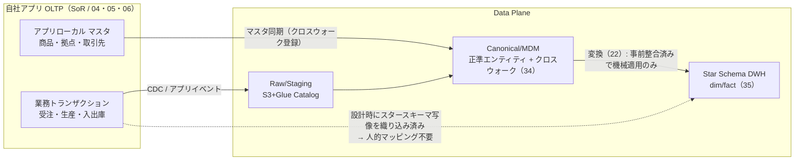
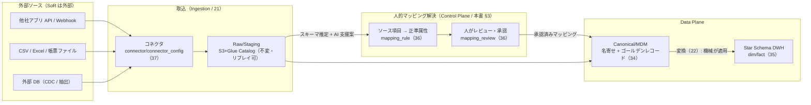
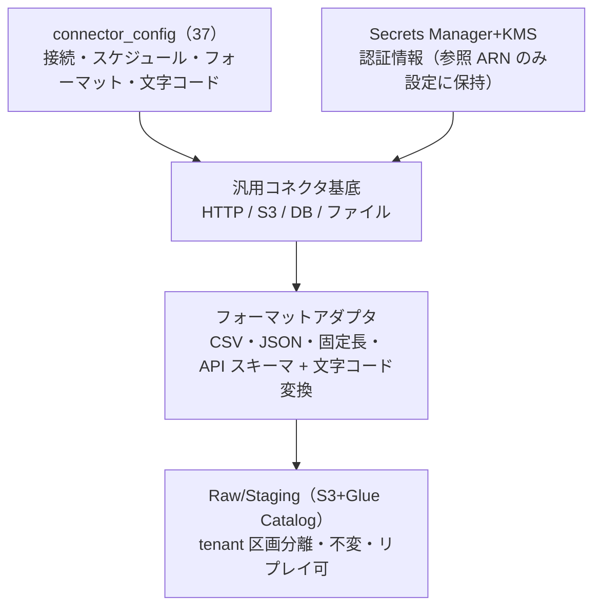
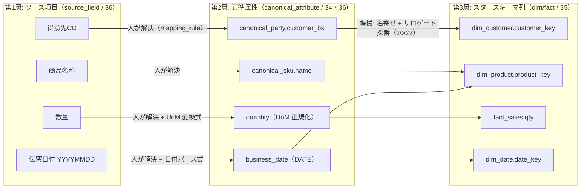
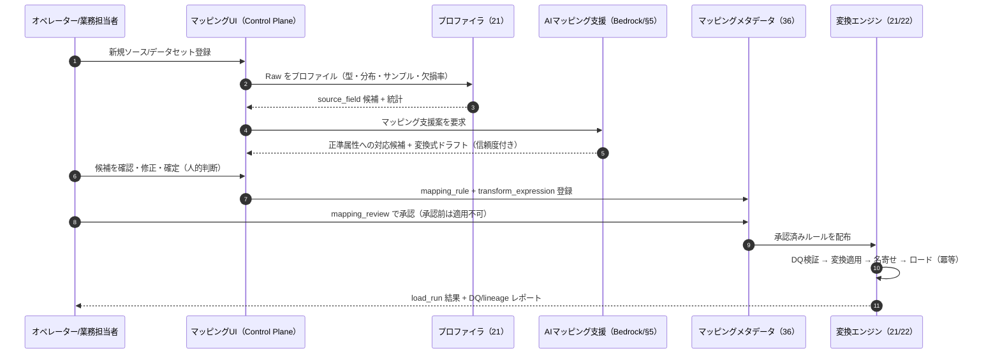
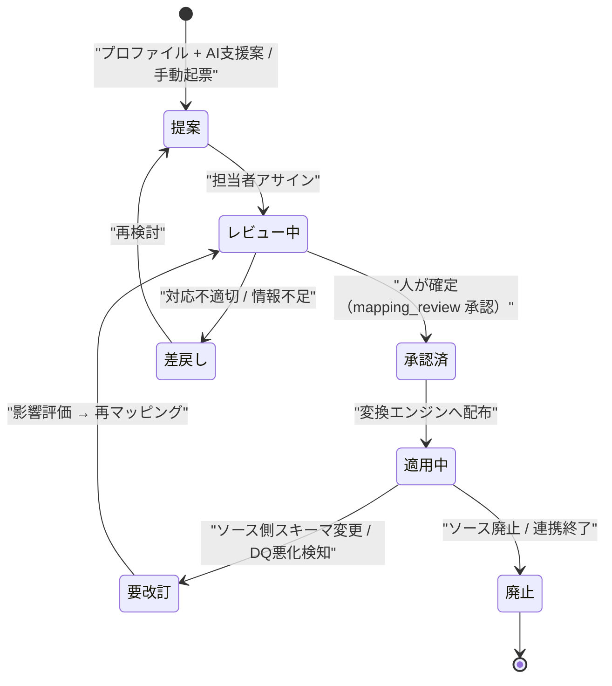
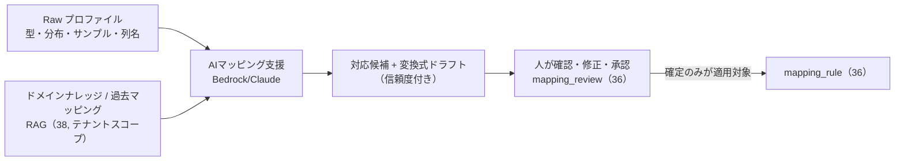
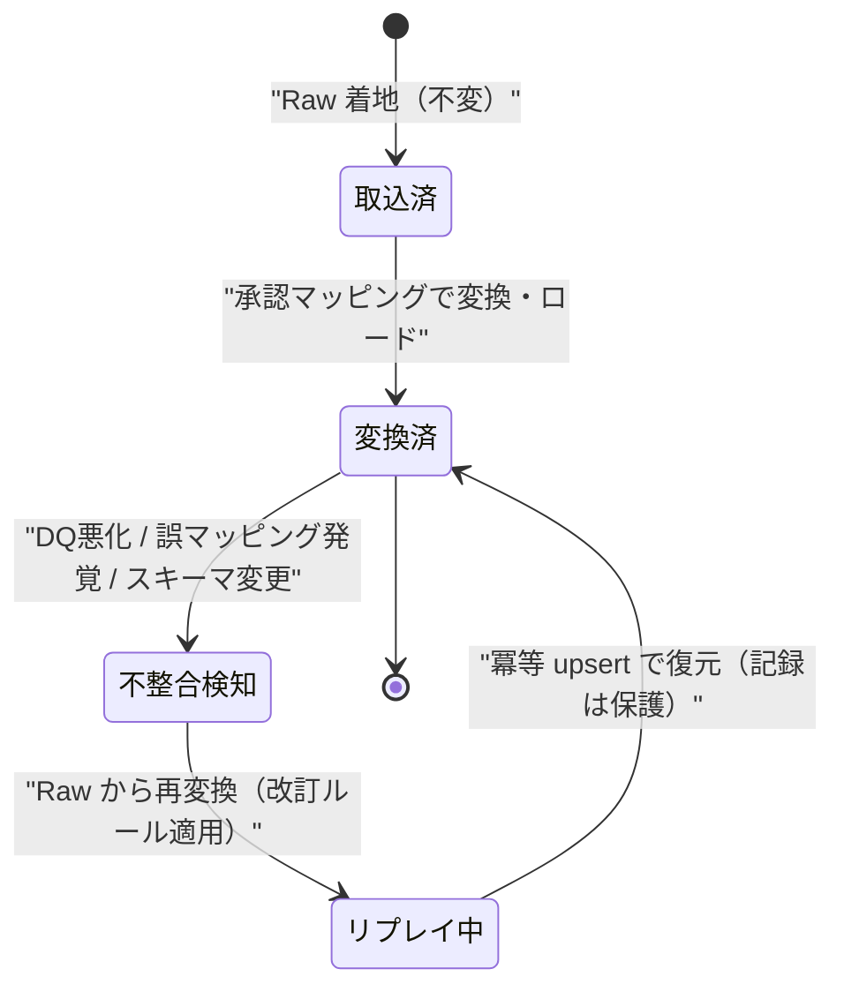
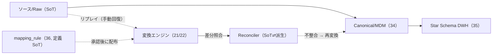

# 基本設計: データ連携と項目マッピング

本書は **SCIP（Supply Chain Intelligence Platform、コード名。正式名称は未確定）** における
**データ連携（Ingestion）と項目マッピング（Mapping）** の基本設計を定義する。
SCIP の**差別化の源泉**は「分析サービスへの連携難易度の低さ」と「各分析機能の実現性」（ブリーフ §2）であり、
その大部分は本書が扱う**連携の入口**で決まる。すなわち、

- **自社アプリ**（小売 / メーカー / WMS）は、最初から**スタースキーマへ写像しやすいスキーマ**で設計されるため、
  連携は「事前設計済みの直結」となり、人的マッピングを原則不要とする。
- **他社アプリ / レガシーシステム**は、多様な項目体系を持つため、**取込（Raw 着地）→ 人的な項目マッピング →
  正準化（MDM/名寄せ）→ 変換（スタースキーマ化）** の経路を通す。ここで **人がマッピングを解決し、機械が変換を適用する**
  という責務分離を徹底し、連携立ち上げの難易度と工数を継続的に下げる。

> **位置づけ / 所有範囲:** 本書は**データ連携とマッピングの「基本設計」を権威的に所有する**
> （連携二系統モデル、取込方式カタログ、コネクタの考え方、人的マッピングの業務プロセス、
> DQ/冪等性/来歴/リプレイの方針、ETL/MAP エラーコードレジストリ）。以下は**参照するが物理定義・詳細実装を再定義しない**
> （ブリーフ §14 テーブル所有マップ準拠）:
> - **取込・変換パイプラインの詳細実装**（Glue/Step Functions ジョブ、CDC 実装、変換エンジン内部）は
>   [取込とマッピングパイプライン](../detailed-design/21-ingestion-mapping-pipeline.md)（21）が所有。
> - **マッピングメタデータの物理スキーマ**（`source_system`/`source_field`/`canonical_attribute`/`mapping_rule`/
>   `transform_expression`/`dq_rule`/`load_run`/`data_lineage`/`mapping_review` の DDL）は
>   [マッピングメタデータスキーマ](../database-design/36-mapping-metadata-schema.md)（36）が所有。
> - **Canonical/MDM・名寄せの詳細**（マッチングアルゴリズム、ゴールデンレコード生成、クロスウォーク解決）は
>   [Canonical/MDM/名寄せ](../detailed-design/20-canonical-mdm-matching.md)（20）および
>   [MDM/Canonical スキーマ](../database-design/34-mdm-canonical-schema.md)（34）が所有。
> - **Canonical → dim/fact の変換（SCD・サロゲートキー採番・ロード）** は
>   [スタースキーマ変換](../detailed-design/22-star-schema-transformation.md)（22）、
>   物理 dim/fact は [スタースキーマ DWH](../database-design/35-star-schema-dwh.md)（35）が所有。
> - コネクタ/接続設定の登録（`connector`/`connector_config`）は
>   [コントロールプレーン/バックオフィス](../database-design/37-control-plane-backoffice.md)（37）が所有。

---

## 1. 連携の全体像（二系統モデル）

### 1.1 なぜ二系統か

SCIP に到達するデータは、**発生源が自社アプリか他社アプリか**で連携難易度が大きく異なる。
自社アプリは SCIP が SoR（System of Record）を握り、スキーマも SCIP 側で設計するため、
分析（スタースキーマ）へ写像しやすい構造を**事前に埋め込める**。一方、他社アプリ / レガシーは
項目体系・粒度・コード体系・文字コードが SCIP と一致しないため、**人的な項目マッピング**を挟んで
正準モデルへ橋渡しする必要がある。この非対称性を設計に明示的に織り込むことが、連携コストの最小化につながる。

| 観点 | 自社アプリ（直結系） | 他社アプリ / レガシー（取込+マッピング系） |
|------|--------------------|--------------------------------------------|
| SoR | SCIP の各 OLTP（04/05/06） | 外部システム（SCIP は Raw を保持） |
| スキーマ設計主体 | SCIP（スタースキーマ写像前提で設計） | 外部（SCIP は関与できない） |
| 項目マッピング | 原則不要（設計時に正準属性へ整合済み） | **必須**（人が解決、機械が適用） |
| 正準化（MDM/名寄せ） | クロスウォーク登録は必要（app-local id ⇄ canonical id） | 名寄せ + クロスウォーク解決が本格的に必要 |
| 主な取込トリガー | CDC / アプリイベント（コミット連動） | バッチ / ファイル投函 / API / Webhook |
| 立ち上げ工数 | 低（テンプレート適用に近い） | 中〜高（初回マッピング解決が支配的） |
| 代表 SoT | 各 OLTP（ブリーフ §5） | ソース側システム（Raw は再変換の源泉） |

> **設計原則:** 両系統とも**着地先は共通**（Raw/Staging → Canonical/MDM → Star Schema DWH）。
> 差は「入口の変換難易度」だけであり、**Canonical 以降のデータフローは一本化**する。これにより
> 分析機能（07/08）は供給元を意識せず同一の適合次元・ファクト上で成立する。

### 1.2 二系統フロー図

**系統 A: 自社アプリ（スタースキーマ前提の直結）**

**系統 B: 他社アプリ / レガシー（取込 + 人的マッピング）**

> **図の要点:** 系統 A では「マッピング」に相当する作業が**設計時に前倒し**されているため、実行時は機械適用のみ。
> 系統 B では **Raw 着地までは自動化**され、**マッピングの解決だけが人的タスク**として切り出される。
> 変換の実行（transform 適用・ロード）はどちらも機械（変換エンジン, 21/22）が担う。

---

## 2. 取込方式とコネクタの考え方

### 2.1 取込方式カタログ

外部・内部のデータ特性（鮮度要件・データ量・ソース側の連携能力）に応じて、以下の取込方式を使い分ける。
すべての方式は**最終的に Raw/Staging（S3+Glue Catalog）へ着地**し、以降のパイプラインを共通化する。

| # | 方式 | 適用ケース | トリガー | 鮮度 | 冪等化キー | 主な実装 |
|---|------|-----------|---------|------|-----------|---------|
| 1 | **バッチ（Pull）** | 夜間全件/差分抽出、外部 DB からの定期抽出 | スケジュール（EventBridge cron） | 日次〜時間 | `load_run_id` + 自然キー | Glue Job / Step Functions |
| 2 | **ストリーミング** | 高頻度イベント（POS 売上、IoT） | イベント到達 | 準リアルタイム | イベント ID | Kinesis / MSK → Firehose → S3 |
| 3 | **Webhook（Push）** | 他社 SaaS のイベント通知 | 外部システムの POST | 準リアルタイム | `Idempotency-Key` / イベント ID | API Gateway → Lambda → S3 |
| 4 | **ファイル投函** | CSV/Excel/固定長/帳票の受け渡し | S3 PutObject | 不定（人手投入含む） | ファイルハッシュ + 行番号 | S3 イベント → Glue |
| 5 | **CDC（変更データ捕捉）** | 自社/外部 OLTP の増分同期 | コミット連動 | 準リアルタイム | LSN / トランザクション ID | DMS / 論理レプリケーション / Debezium |
| 6 | **API（Pull, ページング）** | 他社 REST/GraphQL からの取得 | スケジュール or オンデマンド | 時間〜オンデマンド | カーソル + 自然キー | Lambda / Glue（コネクタ） |

> **鮮度と方式の対応:** 分析の多くは日次スナップショット（26）で足り、CDC/ストリーミングは「在庫のニアリアルタイム可視化」など
> 鮮度要件が明確な指標に限定して採用する。過剰なリアルタイム化はコスト・複雑性を増すため、**指標の鮮度要件から逆算**して選ぶ。
> CDC の具体実装方式（DMS / Debezium / 論理レプリケーション / アプリイベント）は未決（§9 論点 D-4、詳細は 21）。

### 2.2 コネクタの考え方

「コネクタ」は、あるソースシステム / データセットを SCIP の Raw に着地させるための**接続定義 + 取得ロジック**の単位である。

- **登録は宣言的:** コネクタは Control Plane に `connector` / `connector_config`（37 所有）として登録する。
  接続情報（エンドポイント、認証、スケジュール、対象データセット、文字コード、区切り文字等）は**設定データ**として持ち、
  コード変更なしに追加・変更できる（ブリーフ原則1「手動ステップを残さない」/ 原則3「既存パターン再利用」）。
- **シークレット分離:** 認証情報は **Secrets Manager + KMS**（ブリーフ §5）に格納し、`connector_config` は参照（ARN）のみ保持。
  平文の資格情報を設定テーブルやリポジトリに置かない。
- **コネクタ種別 = 取込方式 × フォーマットアダプタ:** 取込方式（§2.1）に、フォーマット解釈（CSV/JSON/固定長/API スキーマ）と
  文字コード変換（例: SHIFT_JIS → UTF-8）を組み合わせて構成する。汎用コネクタ（HTTP/S3/DB/ファイル）を基底に、
  ソース固有差分のみを設定で吸収する。**ソースごとに新規コードを書かない**ことを原則とする。
- **非ブロッキング:** コネクタの補助処理（メタデータ更新、通知、ラベル付け）の失敗は取込本体を止めない
  （ブリーフ原則4）。致命的失敗（認証不能・スキーマ全崩れ）のみ `ETL-002` として停止・通知する。
- **テナント境界:** すべてのコネクタは `tenant_id` に紐づく。取込データは Raw の時点でテナント区画（S3 プレフィックス / パーティション）を分離し、
  以降のパイプライン全体で RLS（Pooled）またはサイロ境界を維持する（ブリーフ §6）。

---

## 3. 人的な項目マッピングのプロセス

### 3.1 責務分離: 人が解決し、機械が適用する

項目マッピングは**「対応関係の意思決定」と「変換の実行」を分離**する。前者は業務・ドメイン知識を要する人的判断であり、
後者は決定論的・冪等な機械処理である。この分離が SP-2（相互牽制）と review-standards IF 層（責務分離・1責務）に整合する。

| 責務 | 担い手 | 成果物 | 特性 |
|------|--------|--------|------|
| **マッピングの解決**（どのソース項目がどの正準属性か、どう変換するか） | 人（オペレーター / 業務担当者） | `mapping_rule` + `transform_expression` の承認（`mapping_review`, 36） | 業務判断・非決定論的・レビュー対象 |
| **変換の適用**（承認済みルールをデータに実行） | 機械（変換エンジン, 21） | 正準化データ + `data_lineage`（36） | 決定論的・冪等・監査可能 |

### 3.2 マッピングの三層構造

マッピングは **ソース項目 → 正準属性 → スタースキーマ列** の三層で捉える。
人が解決するのは主に**第1層（ソース → 正準）** であり、**第2層（正準 → スタースキーマ）は自社設計済みの定型写像**として
機械が担う。これにより、他社アプリごとに解決すべき人的タスクは「正準属性への対応づけ」だけに絞られる。

> **要点:** 第1層の解決を人が行い（`mapping_rule` に `transform_expression` を添えて `mapping_review` で承認）、
> 第2層以降（名寄せ・サロゲートキー採番・SCD 適用・ロード）は 20/22 の機械処理に委ねる。
> 自社アプリは第1層が設計時に整合済みのため、この人的タスクをスキップできる。

### 3.3 マッピング解決の業務フロー

### 3.4 マッピングの状態遷移

`mapping_review`（36 所有）が管理するマッピング定義のライフサイクル。**未承認のマッピングは変換に適用されない**
（誤マッピングのまま DWH を汚染しないための安全弁）。

> **レガシー取込の実例:** 既存生産管理システムの CSV 取込（[MIG-3](../../migration/mig-3-strategy.md)）では、
> 旧カラーコード 31 種 → 新 4 種、旧サイズ「16.0」「3L4L」、旧仕入先 11 種、旧商品分類 1〜20 など、
> **機械的に一意対応できない項目**が多数存在した。SCIP ではこれらを「人が解決し、未解決分は Staging に保持して
> `mapping_review` で後追い確定」する運用に一般化する（MIG-3 の「legacy_id 保存のみ・業務担当者が UI で後ひも付け」
> と同じ思想）。マスタ自動補完（未知コードの正準側マスタ登録）は §5 のテンプレート/DQ と連動させる。

---

## 4. 正準化（MDM）・名寄せと変換の位置づけ

本書はデータフロー上の**接続関係**のみを定義し、アルゴリズム詳細は各所有ドキュメントに委ねる。

### 4.1 正準化（MDM）・名寄せ（詳細は 20 / 34）

- マッピングで**正準属性へ寄せた**データは、Canonical/MDM 層で**名寄せ**（同一実体の統合）を受け、
  **ゴールデンレコード**（`canonical_party`/`canonical_product`/`canonical_sku`/`canonical_location`/`region` 等, 34 所有）に解決される。
- app-local id と canonical id の対応は**クロスウォーク**（`party_xref`/`product_xref`/`sku_xref`/`location_xref`, 34 所有）に記録する。
  クロスウォークは**マッピング解決の SoT**（ブリーフ §5）であり、名寄せ結果の一貫性を担保する。
- **本書の関与範囲は「マッピングで正準属性のキー（`*_bk`）を確定させ、名寄せの入力を整える」ところまで**。
  マッチングロジック・スコアリング・生存ルール（survivorship）は [20](../detailed-design/20-canonical-mdm-matching.md) が所有する。

### 4.2 変換からスタースキーマ化（詳細は 22 / 35）

- 名寄せ済みの正準データは、変換エンジンにより **dim/fact（35 所有）** へロードされる。
  ディメンションはサロゲートキー採番 + SCD（Type2 は valid_from/valid_to/is_current/row_hash）を経て、
  ファクトは適合次元 FK 解決 + degenerate dimension 付与で構成される。
- **第2層（正準 → スタースキーマ）の写像は SCIP が設計する定型**であり、他社アプリごとに再設計しない。
  他社アプリの差分はすべて**第1層（ソース → 正準）のマッピング**に閉じ込める。これが「連携難易度を第1層に局所化」する設計の肝。

---

## 5. 差別化の核: 連携難易度をどう下げるか

SCIP の競争優位（ブリーフ §2）を実現するため、連携立ち上げの難易度・工数を下げる4つの仕掛けを設計に組み込む。

| # | 仕掛け | 内容 | 効く局面 |
|---|--------|------|---------|
| 1 | **自社アプリの事前設計** | 自社アプリのスキーマを**正準属性・スタースキーマ写像前提**で設計。第1層マッピングを設計時に前倒し | 自社系（系統 A）で人的マッピングを原則ゼロ化 |
| 2 | **マッピングテンプレート** | 業種・製品カテゴリ・代表 SaaS ごとに「よくあるソース項目 → 正準属性」の定型マッピングを蓄積・再利用 | 他社系（系統 B）の初回解決工数を削減 |
| 3 | **DQ 検証（データ品質）** | 取込・変換の各段でルールベース検証。異常を早期・自動検出し手戻りを防ぐ（§6） | 全系統。誤データの DWH 流入を未然遮断 |
| 4 | **AI によるマッピング支援案** | Raw のプロファイル（型・分布・サンプル・列名の意味）から、正準属性への**対応候補と変換式ドラフト**を信頼度付きで提示 | 他社系の第1層解決を人が「確認・修正」に軽減 |

### 5.1 マッピングテンプレートの考え方

- テンプレートは `mapping_rule`（36）の**再利用可能なプリセット**として管理し、新規ソース登録時に「近いテンプレート」を初期値に採用する。
- テンプレートは**提案の初期値**であって確定ではない。必ず人が `mapping_review` で確認・承認する（誤テンプレ適用の防止）。
- 蓄積源: 過去に承認されたマッピング（`mapping_review` 履歴）から頻出パターンを抽出。ドメインナレッジ（38）とも連携。

### 5.2 AI マッピング支援案（ブリーフ §12 / 07 のハルシネーション抑制と整合）

- **支援案は「提案」であり「決定」ではない。** AI は列名・データ分布・サンプル値・ドメイン知識（RAG, 38）から
  正準属性への対応候補と変換式ドラフトを**信頼度付き**で生成するが、確定は必ず人が行う（§3.1 の責務分離を崩さない）。
- **数値・実データは AI に生成させない。** AI が扱うのは「対応関係の推定」であり、変換適用・集計値の算出は決定論的な変換エンジンが担う
  （数値をLLMに作らせない原則, ブリーフ §12）。
- **テナント境界厳守:** 支援案生成の RAG 検索はテナントスコープに閉じる（越境禁止, `AI-001` / ブリーフ §12）。

---

## 6. データ品質・冪等性・来歴・再取込

### 6.1 データ品質（DQ）

DQ ルール（`dq_rule`, 36 所有）を**取込直後（Raw）と変換前後（Canonical/DWH ロード前）** の複数段で評価する。
「とりあえず動く」データを下流に流さない（IQ-3）。

| 分類 | 例 | 失敗時の扱い |
|------|----|-------------|
| **構造** | 列数・型・必須項目・文字コード | 致命 → `ETL-001` で当該ロード停止・隔離 |
| **ドメイン** | コード値の許容集合、範囲（数量 ≥ 0）、日付妥当性 | 行単位で隔離（quarantine）・レポート。ロードは継続（非ブロッキング） |
| **参照整合** | 正準キーへの解決可否（未知コード） | 未解決行を保留 → `MAP-002`。マスタ自動補完 or 人的解決へ |
| **一貫性** | 明細合計とヘッダ金額の一致、重複検知 | 警告 + 隔離。閾値超過で `ETL-004` |

> **非ブロッキング原則（ブリーフ原則4）:** 行単位の DQ 逸脱は**当該行を隔離して残りを流す**（グレースフルデグラデーション）。
> ロード全体を止めるのは構造崩壊・認証不能など致命的失敗のみ。隔離行は `mapping_review` / DQ レポートで可視化し、人的回復に回す。

### 6.2 冪等性

- **取込:** ファイルハッシュ + 行番号 / イベント ID / `Idempotency-Key`（ブリーフ §11）で重複取込を無害化。
  同一 `load_run` の再実行で二重ロードを起こさない。
- **変換/ロード:** 自然キー + `load_run_id` を用いた**冪等 upsert**。再実行しても既存の確定データ・進捗・DQ ログを巻き戻さない
  （ブリーフ原則2「冪等性と状態保護」）。記録系（`load_run`/`data_lineage`/`mapping_review`）は保護し、設定系（マッピング定義）のみ更新する。

### 6.3 来歴（Lineage）

- すべての正準化・変換出力に**来歴列**（`source_system` / `source_record_id` / `legacy_id`, ブリーフ §9）を保持し、
  `data_lineage`（36 所有）で**「どの Raw の、どのルールで、どの load_run で生成されたか」** を追跡可能にする。
- 来歴により、誤マッピング発覚時の**影響範囲特定**と**部分リプレイ**が可能になる（原則6 データフロー整合性 / 原則7 データ保護）。

### 6.4 再取込（リプレイ）

- **Raw/Staging は不変（immutable）・リプレイ可能**（ブリーフ §5）。マッピング改訂・変換バグ修正・DQ ルール更新時は、
  **Raw を源泉に再変換**して Canonical/DWH を復元する。SoT（ソース/Raw）から派生を再生成できる設計を守る。
- リプレイは冪等 upsert により安全に反復でき、部分適用（対象 load_run / 期間 / テナント限定）も可能。

---

## 7. SoT とデータフロー整合性

ブリーフ §5 の SoT マップと原則6（データフロー整合性）に従い、本書が扱うデータの SoT と同期方向を宣言する。

| データ | SoT | 派生/キャッシュ | 同期方向 |
|--------|-----|----------------|---------|
| 取込生データ（Raw/Staging） | **ソース側システム**（外部 or 自社 OLTP） | — | ソース → Raw（不変保持） |
| マッピング定義（`mapping_rule`/`transform_expression`/`dq_rule`） | **マッピングメタデータDB（36）** | 変換エンジンへ配布 | 定義（SoT）→ 適用（後追い） |
| マッピング解決記録（`mapping_review`/`load_run`/`data_lineage`） | **メタデータDB（36, append中心）** | — | 記録系・保護対象（巻き戻さない） |
| クロスウォーク（app-local id ⇄ canonical id） | **Canonical DB（34）** | — | 名寄せ解決の SoT |
| 正準エンティティ（ゴールデンレコード） | **Canonical DB（34）** | DWH dim へ反映 | 正準（SoT）→ dim（後追い, 22） |
| Star Schema dim/fact | 派生（Canonical/Raw 由来, 35） | — | Canonical → DWH（一方向） |

**整合原則（ブリーフ §5 / CLAUDE.md 原則6）:**
1. **SoT 先行・派生後追い:** ソース/Raw → Canonical → DWH の一方向。逆流（DWH から正準を書き戻す等）は禁止。
2. **同期パスと手動再同期の両立:** イベント受信（CDC/Webhook）による同期に加え、**Raw からのリプレイ**と
   **Reconciler（SoT ⇄ 派生の差分照合）** を手動回復パスとして常備する（イベント欠落・変換不整合への備え, 原則6-2）。
3. **SoT から復元不能な派生を持たない:** DWH は Raw/Canonical から常に再生成可能に保つ。

---

## 8. 想定エラーコード（ETL-NNN / MAP-NNN）

コード体系は `DOMAIN-NNN`（ブリーフ §10、3桁ゼロ埋め）。本書は取込（`ETL`）とマッピング解決（`MAP`）ドメインの
**権威的レジストリ**を所有する（02 が横断俯瞰で引用した `ETL-001`/`MAP-001` を含む）。API エラーは RFC 7807（ブリーフ §11）で返す。

| コード | 意味 | 発生箇所 | HTTP | ブロッキング |
|--------|------|---------|------|-------------|
| `ETL-001` | 取込データのスキーマ/構造 DQ 検証失敗 | Ingestion / 変換エンジン | 422 | 当該ロード停止 |
| `ETL-002` | コネクタ認証/接続失敗（致命） | コネクタ | 502 | 停止・通知 |
| `ETL-003` | 文字コード/フォーマット解釈不能 | フォーマットアダプタ | 422 | 当該ファイル停止 |
| `ETL-004` | 一貫性 DQ 逸脱（合計不一致/重複超過） | DQ 検証 | 422 | 隔離 + 閾値超で停止 |
| `ETL-005` | 冪等キー衝突（同一 load_run 二重投入） | 取込冪等化 | 409 | 無害化（再実行抑止） |
| `ETL-006` | リプレイ対象の Raw 欠落/破損 | リプレイ | 404 | 当該リプレイ停止 |
| `MAP-001` | マッピング未解決（項目対応表欠落） | 変換エンジン | 422 | 当該項目/行を保留 |
| `MAP-002` | 正準キー解決不能（未知コード/名寄せ不成立） | Canonical 解決 | 422 | 行隔離（保留） |
| `MAP-003` | 未承認マッピングの適用要求（`mapping_review` 未承認） | 変換配布 | 409 | 適用拒否 |
| `MAP-004` | 変換式（`transform_expression`）実行エラー | 変換エンジン | 422 | 当該行隔離 |
| `MAP-005` | ソース側スキーマ変更検知（既存マッピング不整合） | プロファイラ | 409 | 要改訂へ遷移 |
| `MAP-006` | マッピングテンプレート/AI 支援案生成失敗 | 支援層 | 503 | 非ブロッキング（手動起票にフォールバック） |

> **委譲:** 認証/認可/テナントの横断コード（`CMN-401/403`、`TEN-001/002`、`CMN-409/503`）は 02/11 が俯瞰し、
> 各 API で共通適用する。AI 支援の越境遮断は `AI-001`（23/38）。本書は ETL/MAP の逆引きレジストリを所有する。

---

## 未決事項 / 論点

| # | 論点 | 選択肢 / トレードオフ | 一次議論先 |
|---|------|--------------------|-----------|
| D-1 | CDC 実装方式 | DMS（マネージド/運用容易）／ Debezium（柔軟/自前運用）／ 論理レプリケーション／ アプリイベント。ソース側 DB 種別と鮮度要件で判断 | [`21`](../detailed-design/21-ingestion-mapping-pipeline.md) / [`12 ADR`](./12-adr.md) |
| D-2 | AI マッピング支援の適用度合い | 「候補提示のみ（人が全確定）」か「高信頼度は自動承認 + 事後監査」か。誤マッピングリスクと工数のトレードオフ | [`23`](../detailed-design/23-ai-rag-vectorization.md) / §5.2 |
| D-3 | 未知マスタコードの自動補完ポリシー | MIG-3 型「自動 INSERT（legacy_id 保存）+ 後追い確定」を標準にするか、常に人的承認を要求するか | [`20`](../detailed-design/20-canonical-mdm-matching.md) / [`34`](../database-design/34-mdm-canonical-schema.md) |
| D-4 | DQ 逸脱行の保持期間・再処理 SLA | 隔離行の保持と再処理の運用（自動リトライ有無・エスカレーション） | [`21`](../detailed-design/21-ingestion-mapping-pipeline.md) / [`11`](./11-nfr-security-tenancy.md) |
| D-5 | ストリーミング/CDC の採用範囲 | どの指標を準リアルタイム化するか（在庫のみ等）。日次スナップショット（26）で足りる範囲との線引き | [`07`](./07-service-analytics.md) / [`26`](../detailed-design/26-snapshot-docdb.md) |
| D-6 | マッピングテンプレートの初期セット | 業種/代表 SaaS ごとにどこまで事前整備するか。初期投資と立ち上げ速度のトレードオフ | [`36`](../database-design/36-mapping-metadata-schema.md) / §5.1 |

---

## 関連ドキュメント

- [`02-overall-architecture.md`](./02-overall-architecture.md) — 全体アーキテクチャ（プレーン構成・横断エラーコード俯瞰・同期/再同期）
- [`03-canonical-domain-model.md`](./03-canonical-domain-model.md) — 正準ドメインモデル（Party/Product/Location/Region 等の概念）
- [`07-service-analytics.md`](./07-service-analytics.md) — 分析・可視化（連携先の定型分析・セマンティック層・ハルシネーション抑制）
- [`11-nfr-security-tenancy.md`](./11-nfr-security-tenancy.md) — 非機能 / セキュリティ / テナンシー（RLS・境界・SLA）
- [`12-adr.md`](./12-adr.md) — アーキテクチャ決定記録（CDC/DWH/ベクター選定の根拠）
- [`../detailed-design/20-canonical-mdm-matching.md`](../detailed-design/20-canonical-mdm-matching.md) — Canonical/MDM/名寄せ（マッチング・ゴールデンレコード）
- [`../detailed-design/21-ingestion-mapping-pipeline.md`](../detailed-design/21-ingestion-mapping-pipeline.md) — 取込とマッピングパイプライン（詳細実装）
- [`../detailed-design/22-star-schema-transformation.md`](../detailed-design/22-star-schema-transformation.md) — スタースキーマ変換（SCD・ロード）
- [`../database-design/34-mdm-canonical-schema.md`](../database-design/34-mdm-canonical-schema.md) — MDM/Canonical スキーマ（正準エンティティ・クロスウォーク）
- [`../database-design/35-star-schema-dwh.md`](../database-design/35-star-schema-dwh.md) — スタースキーマ DWH（dim/fact 物理定義）
- [`../database-design/36-mapping-metadata-schema.md`](../database-design/36-mapping-metadata-schema.md) — マッピングメタデータスキーマ（source/rule/dq/lineage/review）
- [`../database-design/37-control-plane-backoffice.md`](../database-design/37-control-plane-backoffice.md) — コントロールプレーン（connector/connector_config）
- [`../../migration/mig-3-strategy.md`](../../migration/mig-3-strategy.md) — 既存生産管理システム CSV 取込戦略（レガシー人的マッピングの実例）
- [`../README.md`](../README.md) — ドキュメント索引 / 全体マップ
