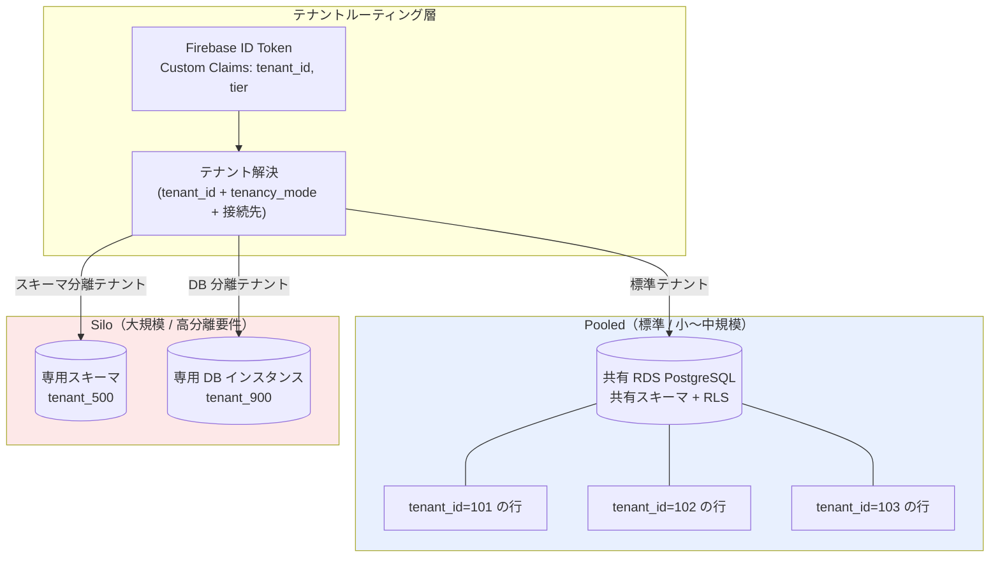
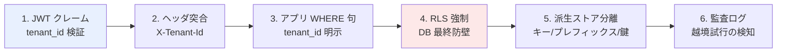
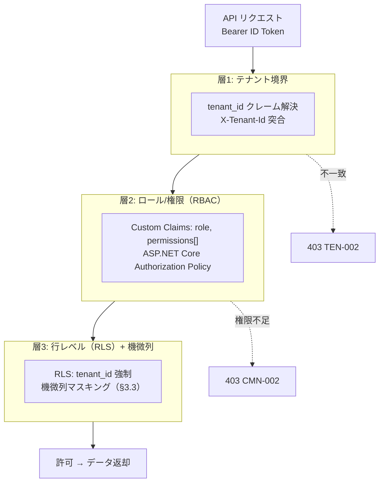
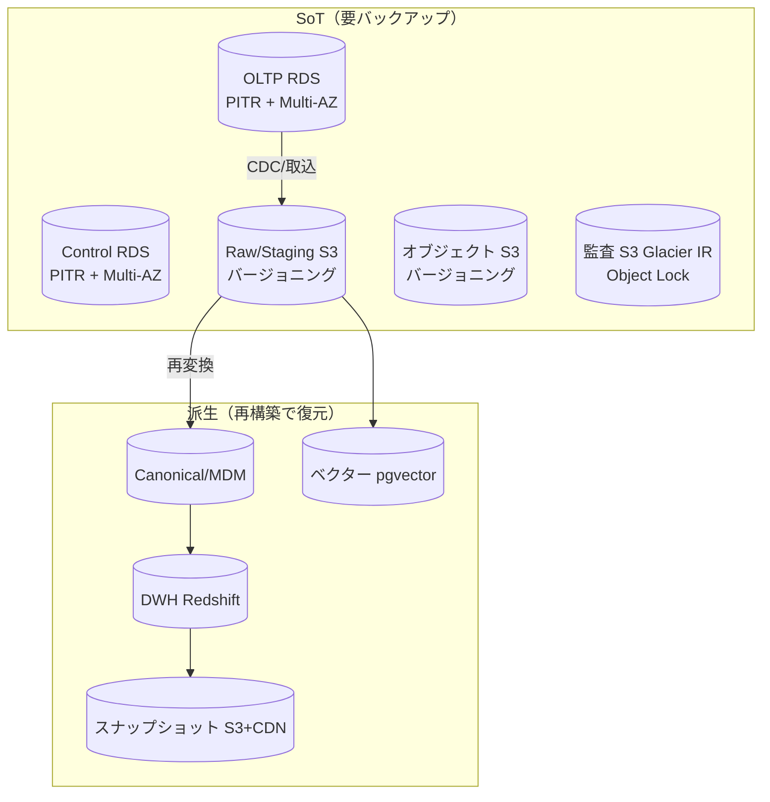
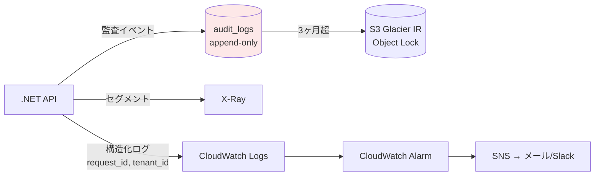
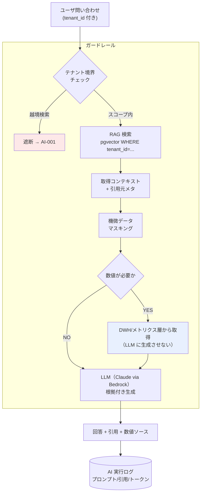

# 基本設計: 非機能要件 / セキュリティ / マルチテナンシー

本書は **SCIP（Supply Chain Intelligence Platform、コード名）** の**非機能横断方針**を権威的に定義する。
対象は (1) マルチテナント分離、(2) セキュリティ（認証・認可・テナント境界・機微データ保護・データ主権）、
(3) 性能/スケーラビリティ、(4) 可用性/SLA/RTO/RPO/DR、(5) 可観測性、(6) コスト/キャパシティ、
(7) コンプライアンス、(8) AI ガバナンスである。

本プラットフォームは既存の単一テナント実装 **akebono-honshu**（履物メーカー Honshu の .NET 8 + Nuxt 3 + RDS PostgreSQL）を
リファレンス実装 / 最初のメーカーテナントと位置づけ、マルチテナント SaaS へ一般化する
（ファウンデーション・ブリーフ §1・§15）。継承実装の Phase 3 非機能要件（性能基準・セキュリティ 19 項目・可用性・データ機密度）を
土台とし、**マルチテナント化・複数プレーン化・従量課金型分析基盤という新条件の下で拡張**する。

> **本ドキュメントの所有範囲（owns）:** 非機能・セキュリティ・テナンシーの**横断方針**の権威的記述。
> RLS の適用方針・テナント解決フロー・機微データマスキング方針・可観測性の標準・SLA/DR 目標・AI ガバナンスの原則を定義する。
> **物理スキーマ（CREATE TABLE / 索引 / 制約 / `tenant_id` 列 / RLS ポリシーの DDL）は本書では定義しない。**
> 命名/DDL 規約と SoT の総則は [`30 スキーマ戦略と SoT`](../database-design/30-schema-strategy-and-sot.md)、
> `tenant`/`app_user`/`role`/`permission`/`audit_logs` 等の物理定義は [`37 コントロールプレーン/バックオフィス スキーマ`](../database-design/37-control-plane-backoffice-schema.md)、
> 技術選定の根拠は [`12 ADR`](./12-architecture-decision-records.md) が所有する。本書はこれらを横断的な**方針レベル**で束ねる。

---

## 1. 非機能要件のベースラインと拡張方針

継承実装（Honshu 単一テナント）の非機能要件は Phase 3 で確定済みである。プラットフォーム化に伴い、
**単一テナント前提だった基準を「1 テナント当たりの基準」として維持しつつ、マルチテナント総量・分析基盤・従量課金の観点を追加**する。

| 領域 | 継承実装のベースライン（Phase 3） | プラットフォーム拡張方針 |
|------|--------------------------------|----------------------|
| 性能 | 一覧 500ms / 詳細 200ms / 検索 100ms（95%ile） | **テナント単位で維持**。OLTP は現行水準、OLAP/ベクター/DocDB は別基準（§4）を新設 |
| 同時接続 | 1-2 名（通常）/ 5 名（ピーク）、スケールアウト不要 | **テナント総数 × テナント内同時利用**で再計算。App Runner の水平スケール + 従量 DWH を前提化 |
| 可用性 | 業務時間 99% / RTO 4h / RPO 24h | **テナント種別・プレーン別に SLA を層別化**（§5）。Control/Application は業務時間 SLA、Data/Intelligence は非同期許容 |
| データ機密度 | 総合「中（営業秘密含む）」、仕入単価=中-高 | **テナント間漏洩防止を最上位リスクに追加**。機微仕入原価はテナント跨ぎで絶対に混在させない |
| 監査 | 主要トランザクションのみ / 3 年保管 / 改竄防止 | **全プレーン横断の監査 + ユーザアクションログ + AI 実行ログ**へ拡張（§6） |
| データ保管 | 日本国内保管（業務データ本体） | **国内保管を維持**。認証情報（Firebase）の海外配置はオペレーター許容済（§2.6 / ADR） |

> **review-standards 非機能層の適用:** 本書は [`review-standards`](../../../.ai-native/methodology/common/review-standards.md) の
> LAYER_4（4.1 パフォーマンス=UI 体感、4.2 セキュリティ=機密度で深度決定、4.3 リソースコスト=キャパシティ/致命的パターン）を
> プラットフォーム規模へ適用したものである。UI 体感パフォーマンスは品質ゲート、インフラ負荷・スケーラビリティ・致命的パターンは安全ゲートで検証する。

---

## 2. マルチテナンシー

### 2.1 テナント分離モデル（Pooled + Silo ハイブリッド）

SCIP は **Pooled（共有）と Silo（分離）のハイブリッド**を採用する（ブリーフ §6）。
標準は Pooled（共有 DB・共有スキーマ + RLS）で運用コストを最小化し、
高分離要件・大規模テナントのみ Silo（スキーマ分離 / DB 分離）へ昇格させる。**同一 DDL を保ち、ルーティングで切替**する。



**分離モードの選定基準:**

| モード | 対象テナント | 分離手段 | トレードオフ |
|--------|------------|---------|-------------|
| Pooled | 小〜中規模、標準契約 | 共有 DB・共有スキーマ + `tenant_id` + RLS | 運用コスト最小 / RLS 実装ミスが即漏洩リスク |
| Silo(schema) | 中〜大規模、規制要件あり | スキーマ分離（同一 DB） | 中コスト / スキーマ数増によるメタデータ肥大 |
| Silo(db) | 最大規模、専用性能・専用鍵要件 | DB インスタンス分離 | 高コスト / 数増でパッチ・監視負荷増 |

昇格（Pooled → Silo）はデータ移行を伴うため、[`27 SIカスタマイズ/プロビジョニング`](../detailed-design/27-si-customization-and-provisioning.md) の
プロビジョニングタスクとして扱う。既定は Pooled で開始し、契約・負荷・監査要件の変化で昇格する。

### 2.2 テナント識別列と一意性のテナントスコープ化

- **全テナントスコープテーブルに `tenant_id BIGINT NOT NULL REFERENCES tenant(id)`** を持たせる（物理定義は 30/37 が所有）。
- **一意性制約はすべてテナントスコープ**。継承実装の `UNIQUE(code)` / `UNIQUE(sku)` / `UNIQUE(mgmt_no)` 等は、
  プラットフォームでは `UNIQUE(tenant_id, code)` のように **tenant_id を先頭に含める**（ブリーフ §6・§9）。
- 継承実装（Honshu）には `tenant_id` が一切存在しない点が最大の移行ギャップである。
  既存 DDL への `tenant_id` 導入と全 UNIQUE のテナントスコープ化の差分は [`32 メーカーOLTP`](../database-design/32-oltp-manufacturer-schema.md) が具体設計する。
- DWH はテナントを `dim_tenant` + 各 fact の `tenant_id`（Redshift DISTKEY/パーティション）で分離する（[`35 DWH`](../database-design/35-star-schema-dwh.md) 所有）。

### 2.3 テナント解決とセッションコンテキスト（RLS 強制）

全 API リクエストで、JWT の `tenant_id` クレームからテナントを解決し、**DB セッションに `SET app.tenant_id` を張って RLS を効かせる**。
任意で `X-Tenant-Id` ヘッダをクレームと突合し、不一致は 403（`TEN-002`）で遮断する。

```mermaid
sequenceDiagram
    participant UI as "Nuxt SPA"
    participant API as ".NET API<br/>(App Runner)"
    participant MW as "テナント解決<br/>ミドルウェア"
    participant DB as "RDS PostgreSQL<br/>(RLS 有効)"

    UI->>API: "Authorization: Bearer &lt;ID Token&gt;<br/>X-Tenant-Id: 102 (任意)"
    API->>MW: "JWKS 署名検証 → クレーム抽出"
    alt "tenant_id クレーム欠落"
        MW-->>UI: "401 TEN-001（テナント解決失敗）"
    else "X-Tenant-Id とクレーム不一致"
        MW-->>UI: "403 TEN-002（テナント突合失敗）"
    else "解決成功"
        MW->>DB: "接続取得 → SET app.tenant_id = 102"
        Note over DB: "RLS: USING (tenant_id = current_setting('app.tenant_id')::bigint)"
        MW->>DB: "業務クエリ（tenant_id 条件は RLS が自動付与）"
        DB-->>API: "テナント 102 の行のみ返却"
        API-->>UI: "{ data, meta }"
    end
```

**RLS 適用の設計原則（safety net として必須）:**

- RLS は**アプリ層の WHERE 句に依存しない最終防壁**。アプリのクエリに `tenant_id` 条件が欠落しても、RLS が越境参照を物理的に遮断する。
- 接続プール利用時は、**チェックアウトした接続を業務クエリ前に必ず `SET app.tenant_id`（または `SET LOCAL` をトランザクション内で）で汚染除去**する。
  前リクエストの `app.tenant_id` が残留すると越境の温床になる（EF Core の接続インターセプタで強制）。
- **アプリの DB ロールは `BYPASSRLS` を持たない**。RLS バイパスは移行・保守バッチ専用の別ロールに限定し、監査対象とする。
- Pooled テーブルは `ENABLE ROW LEVEL SECURITY` かつ `FORCE ROW LEVEL SECURITY`（テーブル所有者にも RLS を適用）を標準とする。
- クロステナント集計を要する運営（TSUNAGUBA 自社分析）は、**RLS を越える専用サービスアカウント**でのみ実行し、必ず監査ログへ記録する。

> **継承実装との整合:** 継承実装は単一テナント前提で RLS を持たない。プラットフォームでは RLS を新規導入するため、
> 移行時に「RLS 有効化 → `tenant_id` バックフィル → 一意制約再定義」の順で適用する。詳細手順は 30/32 が所有する。

### 2.4 DWH / 派生ストアのテナント分離

| ストア | テナント分離手段 | 備考 |
|--------|----------------|------|
| Redshift Serverless（DWH） | 全 dim/fact に `tenant_id`。DISTKEY はカーディナリティで選定し、`tenant_id` はクエリ述語 + SORTKEY 先頭に含める | クロステナント集計は運営専用ワークグループに限定 |
| pgvector on Aurora（ベクター） | `tenant_id` + RLS。RAG 検索は必ずテナント述語を付与（§8） | 越境検索は `AI-001` で遮断 |
| DynamoDB（DocDB） | パーティションキーに `tenant_id` を含める（例 `PK = TENANT#102#...`） | IAM 条件キーで leading-key 制約も検討 |
| S3（Raw/スナップショット/オブジェクト） | プレフィックスに `tenant_id`（例 `s3://.../tenant=102/...`）。IAM/バケットポリシーで prefix 制限 | Silo は専用バケット/専用 KMS 鍵も選択肢 |
| ElastiCache（Redis） | キーに `tenant_id` プレフィックス（例 `t:102:...`） | キー衝突による越境を物理的に排除 |

### 2.5 テナント間データ漏洩防止（最上位リスク）

テナント間の機微データ混在は**本プラットフォームの最上位セキュリティリスク**である。多層で防止する。



各層は独立して機能し、上流が破られても下流で遮断する多層防御（defense in depth）とする。
**特に機微仕入原価（中-高機密度）は、集計・キャッシュ・ベクター化・スナップショットのいずれの派生ストアでもテナント跨ぎで混在させない**。

### 2.6 データ主権 / 国内保管

- **業務データ本体（仕入単価・取引先・発注/売上・在庫・DWH・ベクター・スナップショット・オブジェクト）は AWS Tokyo（`ap-northeast-1`）に国内保管**する。
- **認証情報（UID/Email/PW ハッシュ）は Firebase Authentication（Google グローバル配置）**であり、NFR §4.2「データ国内保管」とは部分矛盾するが、
  **オペレーター判断で許容済**（tech-stack-decision #11 / R-13）。業務データ本体は国内保管を維持する。
- LLM/埋め込みは **Amazon Bedrock（Anthropic Claude 群、東京リージョン）** を主とし、テナントの機微データが海外に出ないデータ境界を確保する（ブリーフ §4・§12）。
- **テナント個別のデータレジデンシ要件**（例: 特定テナントは専用 KMS 鍵・専用バケット必須）が発生した場合は Silo(db) 昇格で対応する（§2.1）。

---

## 3. セキュリティ

### 3.1 認証（Firebase Authentication）

- 認証基盤は **Firebase Authentication（Email/Password プロバイダ）**。ID Token（JWT、有効期限 1 時間）+ Refresh Token（SDK 自動管理）。
- パスワードは Firebase 標準（scrypt）でハッシュ化（SEC-04）。平文保管禁止。ブルートフォース対策は Firebase 標準レートリミット + 不正検知（SEC-06）。
- **UID/Email/認証情報の SoT は Firebase**、**ユーザ業務情報・権限ロールの SoT は RDS（Control Plane）**（ブリーフ §4・§5）。
- セッションは 8 時間アイドルタイムアウト（SEC-05）をフロント側で制御。削除済ユーザ（SEC-12）は Firebase `disabled=true` + RDS `is_active=false` を同期し、ログイン不可とする（`AUTH-003`）。
- SSO は MVP 対象外。Post-MVP で Google/Microsoft プロバイダ追加により拡張可能（認証層は `IAuthService` で抽象化しベンダーロックインを緩和 / R-12）。

### 3.2 認可（Custom Claims + ポリシー + テナント境界）

認可は **3 層**で構成する。テナント境界 → ロール/権限 → 行レベル（RLS）の順に絞り込む。



- **権限の SoT は RDS（`role`/`permission`、37 所有）**。Custom Claims は**権限のキャッシュ**であり、RDS で権限変更時に Firebase Admin SDK の `setCustomUserClaims()` で再同期する（**SoT 先行 → キャッシュ後追い**、ブリーフ §5 / CLAUDE.md 原則 6）。
- 同期パスは (1) RDS 更新イベント → Custom Claims 更新、(2) 日次 reconciler バッチによる RDS ⇄ Firebase 照合（R-11 緩和）の**両方**を備える。
- **全 API エンドポイントで認可必須（匿名なし）**。UI のボタン非活性化は補助であり、最終判定は必ずサーバ側（SEC-11/SEC-13）。実装漏れは CI Lint で `[Authorize]` 必須化して防ぐ（R-6）。
- 機微値（仕入単価等）は**既定マスク**。開示は明示フラグ + 権限 + 監査ログの三点セットを条件とする（§3.3、ブリーフ §11）。

### 3.3 機微データの暗号化とマスキング

データ機密度（NFR §6）に応じて保護深度を決定する（review-standards 4.2）。

| データ | 機密度 | 保存時暗号化 | 通信時 | アクセス制御 | マスキング |
|--------|--------|-------------|--------|-------------|-----------|
| 仕入単価 / 機微仕入原価 | 中-高 | RDS/Aurora Storage Encryption（KMS）。**列単位暗号化（pgcrypto）は Phase 5 で再評価** | TLS 1.2+ | 5 権限ポリシー + テナント境界（2026-07-27 更新: 継承実装の権限カテゴリは 4 → 5）| **既定マスク**、開示は明示フラグ + 権限 + 監査 |
| 商品マスタ・発注/売上 | 中 | KMS | TLS | 権限ポリシー + 監査 | 通常表示 |
| 取引先・仕入先 | 中 | KMS | TLS | 権限ポリシー | 通常表示 |
| ユーザ業務情報・権限 | 軽微（個人情報） | KMS | TLS | 認証保護 | 通常表示 |
| 監査ログ | 中 | KMS + S3 Object Lock（アーカイブ不変化） | TLS | 改竄防止設計 | 通常表示 |
| シークレット / SA 鍵 | 高 | Secrets Manager + KMS（CMK） | TLS | Managed IAM Role 限定 | 常時秘匿 |

- **仕入単価マスキングの実装方針:** API 応答で既定は `null` またはマスク値（例 `"***"`）を返し、開示条件（権限 + 明示 `reveal` フラグ）成立時のみ実値を返す。開示は必ず監査ログに `PRICE` 系イベントとして記録する。
- **マルチテナントでの鍵管理:** Pooled は共有 KMS 鍵、Silo(db) は**テナント専用 KMS 鍵**を選択可能とし、テナント個別のデータレジデンシ/鍵分離要件に対応する。
- エラー応答はスタックトレース等を開示せず、エラーコードのみ返す（SEC-18、RFC 7807 の `code`）。

### 3.4 通信・入力・依存の防御

- HTTPS 必須（SEC-01、Firebase Hosting / App Runner で強制）。CORS は App Runner 側で Firebase Hosting ドメインを明示許可（R-14）。CSP を設定（SEC-08）。
- CSRF は Bearer トークン方式で防御（SEC-07）。XSS はフレームワーク標準エスケープ + CSP。SQL Injection は EF Core パラメタライズドクエリのみ（SEC-09）。
- ファイルアップロードは MIME + 拡張子 + サイズ上限検証（SEC-10）。オブジェクトは S3 Pre-signed URL で時限アクセス。
- 依存ライブラリ脆弱性は CI で継続スキャン（Dependabot / `dotnet list package --vulnerable` / Trivy / Amazon Inspector、SEC-19）。シークレットは Secrets Manager + KMS で一元管理しハードコード禁止。

---

## 4. 性能 / スケーラビリティ

ストア種別ごとに性能特性が異なるため、**基準を層別化**する。UI 体感（review-standards 4.1）を最終判断基準とし、
重い処理は非同期化 + 完了通知で体感の停止感を排除する。

| ストア/経路 | 想定ワークロード | 性能基準 | スケール方式 |
|------------|----------------|---------|-------------|
| OLTP（RDS/Aurora PostgreSQL） | 業務トランザクション、単票/一覧 | 一覧 500ms / 詳細 200ms / 検索 100ms（95%ile、テナント単位） | App Runner 水平スケール + RDS スケールアップ + 読取レプリカ（必要時） |
| OLAP（Redshift Serverless） | 集計・分析クエリ、ダッシュボード | 対話クエリ数秒〜十数秒。重い集計は非同期 + 完了通知 | RPU オートスケール（従量）。スナップショット事前集計で低レイテンシ化 |
| ベクター（pgvector on Aurora） | RAG 近傍検索 | 検索 200ms〜数百 ms 目標 | ANN インデックス（HNSW/IVFFlat）+ 規模拡大時 OpenSearch へ移行（閾値は ADR A-2） |
| DocDB（DynamoDB） | 読み取りモデル/スナップショットメタ/柔軟属性 | 一桁 ms（キー引き） | オンデマンド or プロビジョンド + Auto Scaling |
| スナップショット（S3 + CloudFront） | 事前集計の高速サービング | CDN キャッシュヒットで数十 ms | CDN で水平スケール |

**設計原則:**

- **分析の重い処理はオンライン同期に載せない。** メトリクスクエリ（セマンティック層）とスナップショット取得で対話性を確保し、
  DWH 直結は鮮度要求時に限定する（使い分け方針は ADR A-5 / [`26 スナップショット/DocDB`](../detailed-design/26-snapshot-and-document-db.md)）。
- **キャッシュ共有:** 継承実装はプロセスローカルの権限キャッシュ（60s）で App Runner マルチインスタンス時に不整合が顕在化した（ADR A-6）。
  プラットフォーム規模では **ElastiCache for Redis 共有キャッシュ**へ置換し、テナントスコープキーで管理する。
- **スケールアウト前提化:** 継承実装は「スケールアウト不要」だったが、マルチテナントでは App Runner の水平スケール・従量 DWH を前提とする。
  ステートレス API + 共有キャッシュ + マネージド DB により水平スケールを阻害しない設計とする。
- データ量想定はテナント総量で再計算する（継承実装は 1 テナントで SKU 2 万 / 発注 5,000 規模。§7 でキャパシティを扱う）。

---

## 5. 可用性 / SLA / RTO / RPO / DR

### 5.1 プレーン別 SLA 層別化

継承実装の「業務時間 99% / RTO 4h / RPO 24h」を土台に、プレーン特性で層別化する。

| プレーン | 可用性目標 | RTO | RPO | 根拠 |
|---------|-----------|-----|-----|------|
| Application（SoR / OLTP） | 業務時間 99%（RDS Multi-AZ で実効 99.95%） | 4h | 24h（PITR + ログ）。**Multi-AZ で実効数分** | 業務停止に直結。継承実装水準を維持 |
| Control（バックオフィス） | 業務時間 99% | 4h | 24h | 契約/課金は停止許容が業務系よりやや広い |
| Data（DWH/スナップショット） | 非同期許容（分析は準リアルタイム可） | 24h | 24h（Raw から再変換可能） | 派生データは Raw/Canonical から再構築可能 |
| Intelligence（AI/RAG/エージェント） | ベストエフォート（劣化許容） | 24h | ベクターは原文から再生成可能 | 補助機能。障害時はグレースフルデグラデーション |

> **グレースフルデグラデーション（CLAUDE.md 原則 4）:** AI/分析の一時障害は業務系（OLTP）をブロックしない。
> 派生ストアの一時不整合は `CMN-004`（再同期待ち）で通知し、業務トランザクションは継続する。

### 5.2 バックアップ / DR

- **RDS/Aurora:** 自動バックアップ（PITR 最大 35 日）+ Multi-AZ 自動フェイルオーバ。任意で Cross-Region Snapshot。
- **DWH:** Redshift Serverless のスナップショット。障害時は Raw/Canonical から再変換で復元可能（**派生は SoT から再構築**）。
- **S3:** バージョニング + Cross-Region Replication（任意）。監査アーカイブは Object Lock で不変化。
- **DynamoDB:** PITR + オンデマンドバックアップ。
- **Firebase Auth:** Google 標準冗長化。Admin SDK でユーザエクスポート可能。
- **ベクター/スナップショット:** 原文・DWH から再生成可能なため、バックアップより再構築パイプラインの健全性を優先する。



---

## 6. 可観測性

### 6.1 監視スタック

- **メトリクス/ログ/アラーム:** AWS CloudWatch（Logs / Metrics / Alarms）。API は Serilog → CloudWatch Logs（構造化 JSON）。
- **分散トレース:** AWS X-Ray。テナント境界を跨ぐ処理・N+1 クエリ（R-4）・機微データ開示経路の追跡に利用。
- **フロント/認証:** Firebase Console（Hosting 配信・Auth ログイン状況）。
- **アラート:** CloudWatch Alarm → SNS → メール/Slack。課金アラート（§7）も同経路。
- **相関 ID:** 全ログ・トレースに `request_id` / `trace_id`（API 応答 `meta.request_id` と一致）+ **`tenant_id` を付与**し、テナント単位で横断追跡可能にする。



### 6.2 監査ログ / ユーザアクションログ / AI 実行ログ

3 系統のログを区別して設計する。SoT・保管・改竄防止要件が異なる。

| ログ種別 | 内容 | SoT / 保管 | 改竄防止 | エラーコード領域 |
|---------|------|-----------|---------|----------------|
| **監査ログ**（`audit_logs`、37 所有） | who/when/what/before/after。機微データ開示・権限変更・テナント越境試行 | RDS append-only（直近 3ヶ月）→ S3 Glacier IR（3 年、SEC-16） | INSERT 専用（UPDATE/DELETE を DB ロールで REVOKE、SEC-17）+ Object Lock | `AUDIT` |
| **ユーザアクションログ** | 画面操作・検索・エクスポート等の利用状況 | 構造化ログ（CloudWatch）+ 分析用に DWH 連携も可 | 改竄防止は不要（統計用途） | `CMN` |
| **AI 実行ログ** | プロンプト・取得コンテキスト・引用・モデル・トークン数・コスト | DocDB / RDS（38 所有の `analysis_run` 等） | テナント境界厳守。機微データはマスク後記録 | `AI` |

- **監査ログは業務テーブルと分離した append-only 設計**（改竄防止、SEC-17）。RLS でテナントスコープ化しつつ、運営の監査参照は専用ロールで実施し、その参照自体も記録する。
- **AI 実行ログはガバナンスの根拠**（§8）。出力の引用元・数値ソースを保持し、事後検証・監査に供する。

---

## 7. コスト / キャパシティプランニング

従量課金サービス（Redshift Serverless / Bedrock / DynamoDB オンデマンド / S3 / CloudFront）が主コストドライバとなるため、
**テナント単位の使用量計測と課金への写像**を前提化する。

| サービス | 課金モデル | コスト制御 | 計測 → 課金写像 |
|---------|-----------|-----------|----------------|
| Redshift Serverless | RPU-秒（従量） | スナップショット事前集計でクエリ量削減、重い集計を非同期化、使用上限アラート | クエリ実行量をテナント別に `usage_metering`（37 所有）へ |
| Bedrock（Claude/埋め込み） | トークン従量 | RAG コンテキスト量の制御、キャッシュ、数値は DWH 取得で LLM 生成を抑制（§8） | 入出力トークン・埋め込み数をテナント別計測 |
| DynamoDB | オンデマンド RCU/WCU or プロビジョンド | 読み取りモデル最適化、TTL でアイテム削減 | 読み書き量をテナント別計測 |
| S3 / CloudFront | 保管量 + 転送量 | ライフサイクル（Glacier IR 移行）、CDN キャッシュ | 保管/転送をテナント別プレフィックス集計 |
| App Runner / RDS | インスタンス時間 | min/max 上限固定、Pooled 共有で単価分散 | 基本料金は契約プランに内包 |

- **課金アラート必須:** CloudWatch 課金アラームで月額上限超過を SNS 通知（R-9 継承、プラットフォーム規模で従量サービス全体に拡張）。
- **使用量計測の SoT は Control Plane（`usage_metering`、37 所有）**。本書はテナント別計測を「必須の非機能要件」として宣言するに留め、計測スキーマは 37、課金モデルは [`09 バックオフィス`](./09-service-backoffice.md) が所有する。
- **キャパシティ再校正:** 継承実装のデータ量想定（1 テナント SKU 2 万）はテナント数増で線形に膨らむ。テナント総数・平均規模のパラメータで DWH RPU・RDS サイジングを定期再校正する（Phase 7 相当で実数校正）。
- **致命的パターン検出（review-standards 4.3）:** メモリリーク・無限ループ・デッドロック、および**従量サービスの暴走課金**（無制限クエリ・リトライループ）を安全ゲートで常時監視する。

---

## 8. AI ガバナンス

AI/RAG/エージェントは**テナント境界・出力根拠・ハルシネーション抑制**を三本柱にガバナンスする（ブリーフ §12）。



**AI ガバナンス原則:**

1. **RAG テナント境界厳守:** ベクター検索は必ずテナントスコープ（`tenant_id` + RLS）。越境検索は `AI-001` で遮断し監査ログへ記録する。テナント跨ぎのナレッジ共有は明示契約がある業界横断知識のみに限定する。
2. **出力の根拠提示:** 回答には引用元（`kb_document`/`kb_chunk`、38 所有）を付与する。根拠のない断定を抑制する。
3. **ハルシネーション抑制（数値の非生成）:** **数値は DWH/メトリクス層から取得し LLM に生成させない**。LLM は取得済み数値の解釈・要約・提示に限定する。
4. **機微データマスキング:** プロンプト・コンテキスト・ログのいずれでも機微仕入原価等はマスク後に扱う。AI 実行ログにも生の機微値を残さない。
5. **バーチャルカンパニー / エージェントの HITL:** 部門ロールエージェント群の意思決定支援は Human-in-the-Loop を前提とし、重要判断は人的承認を挟む。エージェントのメモリ/セッション/ツール実行はテナントスコープで隔離する（[`24 AIエージェント`](../detailed-design/24-ai-agent-and-virtual-company.md) / 38 所有）。
6. **監査可能性:** AI 実行ログ（§6.2）で入出力・引用・モデル・トークン・コストを保持し、事後検証・コンプライアンス監査に供する。

---

## 9. コンプライアンス

| 規制 / 対象 | 適用範囲 | 対応方針 |
|------------|---------|---------|
| 個人情報保護法 | ユーザ業務情報（担当者名・部署）。住所/電話/個人番号は含まない | 安全管理措置（アクセス制御・暗号化・監査ログ）。監査ログ 3 年保管（SEC-16） |
| 不正競争防止法（営業秘密） | 仕入単価・機微仕入原価・取引先関係 | 営業秘密管理: アクセス制御 + 監査ログ + 契約上の秘密保持。**テナント間漏洩防止を最上位対策**（§2.5） |
| 電子帳簿保存法 | 該当書類（請求/発注等） | 業務テーブル側で 7 年保管（監査ログの 3 年とは別基準、SEC-16 注記） |
| テナント間データ分離（SaaS 固有） | 全機微データ | RLS + 派生ストア分離 + 監査（§2）。マルチテナントで新規に最上位化 |
| データ主権 / 国内保管 | 業務データ本体 | AWS Tokyo 保管。認証情報の海外配置はオペレーター許容済（§2.6 / R-13） |
| 国際送金・税務（海外発注） | 海外フロー | MVP 対象外。Post-MVP で確認（データモデルは NULL 許容列で拡張余地を確保） |

- **機微仕入原価はコンプライアンス上の最重要データ。** テナント内でも 5 権限（2026-07-27 更新: 継承実装は勤怠を加え 5 カテゴリ。仕入単価の開示制御に使うのは品番台帳管理権限）で開示制御し、テナント跨ぎでは集計・キャッシュ・ベクター・スナップショットのいずれでも混在させない（§2.5・§3.3）。
- 監査ログの改竄防止（append-only + Object Lock）は、営業秘密管理・社内統制の証跡として機能する。

---

## 10. 想定エラーコード

本書が横断的に扱うテナンシー/セキュリティ/可観測性/AI 関連の想定エラー（ブリーフ §10 / 02 のレジストリと整合）。

> **採番方式:** ブリーフ §10 の「`DOMAIN-NNN`・3 桁ゼロ埋めの逆引きレジストリ」規約に従い、**`NNN` はドメイン内の逐次採番**とする（HTTP ステータス値を `NNN` に流用しない）。HTTP ステータスは下表の **HTTP 列のみ**で表現する。継承実装由来のコード（`AUTH`/`PRICE`/`AUDIT` 系）も既存の逐次採番を尊重する。

| コード | 意味 | 発生箇所 | HTTP |
|--------|------|---------|------|
| `CMN-001` | ID Token 未提供 / 署名検証失敗 | 全 API（JWKS 検証） | 401 |
| `CMN-002` | 認可失敗（権限不足） | 全 API（ポリシー評価） | 403 |
| `CMN-003` | 冪等キー衝突 / 一意制約違反 | 書込 API | 409 |
| `CMN-004` | 派生ストア一時不整合（再同期待ち） | 分析/AI サービング | 503 |
| `TEN-001` | テナント解決失敗（クレーム欠落） | テナント解決ミドルウェア | 401 |
| `TEN-002` | `X-Tenant-Id` とクレーム不一致 | テナント突合 | 403 |
| `AUTH-003` | 削除済/無効ユーザのログイン試行（継承） | 認証 | 403 |
| `PRICE-xxx` | 機微価格の開示条件不成立（継承 PRICE 系） | 機微列開示 | 403 |
| `AI-001` | RAG テナント境界違反（越境検索の遮断） | Intelligence Plane | 403 |
| `AUDIT-xxx` | 監査ログ記録失敗（継承 AUDIT 系） | 監査記録 | 500 |

> **委譲:** 各コードの完全な逆引きレジストリは、発生元の機能・DB 設計ドキュメント（32/37/38 等）が所有する。本表は横断方針で参照する主要コードの抜粋である。`CMN` 共通ドメインの逐次採番は 02 のレジストリと突合し、衝突がないよう一元管理する。

---

## 未決事項 / 論点

| # | 論点 | 選択肢 / トレードオフ | 一次議論先 |
|---|------|---------------------|-----------|
| N-1 | Pooled → Silo 昇格の閾値 | データ量/契約/監査要件のどの指標で昇格判定するか。自動昇格 vs 運営判断 | [`27 プロビジョニング`](../detailed-design/27-si-customization-and-provisioning.md) / 09 |
| N-2 | 仕入単価の列単位暗号化 | KMS ストレージ暗号化のみ（MVP）か pgcrypto 列暗号化か。運用負荷 vs 保護深度。Phase 5 で再評価（tech-stack #5） | [`12 ADR`](./12-architecture-decision-records.md) / 32 |
| N-3 | テナント専用 KMS 鍵の適用範囲 | 全 Silo に専用鍵か、要求テナントのみか。鍵管理コスト vs レジデンシ要件 | [`12 ADR`](./12-architecture-decision-records.md) / 30 |
| N-4 | Custom Claims 同期の一貫性 | イベント同期のみか、reconciler バッチ併用か。頻度と整合性のトレードオフ（R-11） | [`37 スキーマ`](../database-design/37-control-plane-backoffice-schema.md) / 09 |
| N-5 | DWH クロステナント集計の分離 | 運営専用ワークグループ分離か、行フィルタか。運営自社分析の安全な実現方式 | [`35 DWH`](../database-design/35-star-schema-dwh.md) / 07 |
| N-6 | ベクター規模の OpenSearch 切替閾値 | pgvector（主）から OpenSearch への移行件数閾値（ADR A-2 と連動） | [`12 ADR`](./12-architecture-decision-records.md) / 38 |
| N-7 | NFR §4.2 記述の改訂 | 認証情報の海外配置を「業務データは国内保管、認証情報は Firebase によりグローバル配置を許容」と明示化（tech-stack #11 推奨） | Phase 3 NFR 改訂 / [`12 ADR`](./12-architecture-decision-records.md) |
| N-8 | 本書ファイル名の統一 | 兄弟ドキュメントは `11-nfr-security-tenancy.md` へリンクするが本ファイルは `11-nonfunctional-security-tenancy.md`。索引で別名解決 or リネームを要確定 | [`README`](../README.md) |

---

## 関連ドキュメント

- [`01-concept-and-vision.md`](./01-concept-and-vision.md) — 構想と全体像（ビジョン・スコープ）
- [`02-overall-architecture.md`](./02-overall-architecture.md) — 全体アーキテクチャ（5 プレーン・デプロイトポロジ・共通エラーレジストリ）
- [`09-service-backoffice.md`](./09-service-backoffice.md) — バックオフィス（課金モデル・エンタイトルメント・使用量計測の論理設計）
- [`10-data-integration-mapping.md`](./10-data-integration-and-mapping.md) — データ連携とマッピング（他社アプリ取込のテナント境界）
- [`12-adr.md`](./12-architecture-decision-records.md) — アーキテクチャ決定記録（DWH/ベクター/DocDB/Bedrock/暗号化方針の根拠）
- [`../database-design/30-schema-strategy-sot.md`](../database-design/30-schema-strategy-and-sot.md) — スキーマ戦略と SoT（命名/DDL 規約・RLS・TZ 方針の総則）
- [`../database-design/37-control-plane-backoffice-schema.md`](../database-design/37-control-plane-backoffice-schema.md) — コントロールプレーン物理スキーマ（`tenant`/`app_user`/`role`/`permission`/`audit_logs`/`usage_metering`）
- [`../database-design/35-star-schema-dwh.md`](../database-design/35-star-schema-dwh.md) — スタースキーマ DWH（テナント分離・DISTKEY/SORTKEY）
- [`../database-design/38-ai-vector-knowledge-schema.md`](../database-design/38-ai-vector-knowledge-schema.md) — AI/ベクター/ナレッジ（RAG テナント境界・AI 実行ログ）
- [`../detailed-design/26-snapshot-docdb.md`](../detailed-design/26-snapshot-and-document-db.md) — スナップショット/DocDB（サービング性能）
- [`../detailed-design/27-si-customization-provisioning.md`](../detailed-design/27-si-customization-and-provisioning.md) — SI カスタマイズ/プロビジョニング（Silo 昇格）
