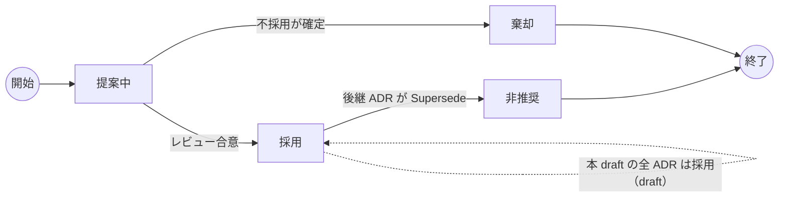
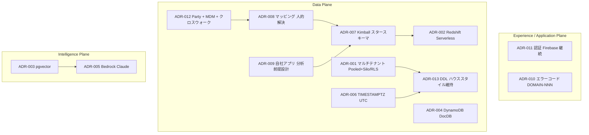

# 基本設計: アーキテクチャ決定記録（ADR）

本書は SCIP（Supply Chain Intelligence Platform）の設計における**主要なアーキテクチャ決定を権威的に記録**するドキュメントである。個々の決定の「なぜ」「どの選択肢を捨てたか」「継承実装（akebono-honshu / Honshu）からの差分影響」を将来の設計者・レビュアー・オペレーターが追跡できるようにすることを目的とする。

- 各 ADR は「1 決定 = 1 レコード」で記述する。テーブル定義や API 詳細の**権威的所有はしない**（それらは所有ドキュメントに委ねる）。本書は決定の根拠を保持する。
- 本書の決定は設計ファウンデーション・ブリーフ（共有契約）の確定事項を**根拠づける記録**であり、ブリーフと矛盾しない。ブリーフが「何を」を確定し、本書が「なぜそうしたか」を記録する。
- ステータス表記: `提案中` / `採用` / `非推奨（Superseded）` / `棄却`。本フェーズ（PoC 前 / Phase 3-5 相当）の ADR はすべて `採用`（暫定確定、オペレーターレビューで変動しうる draft）とする。

---

## 1. ADR フォーマット

各 ADR は以下の節で構成する。

| 節 | 内容 |
|----|------|
| **ステータス** | 提案中 / 採用 / 非推奨 / 棄却。Supersede される場合は後継 ADR 番号を記す |
| **コンテキスト** | 決定を必要とした背景・制約・要件・継承実装の前提 |
| **決定** | 採用した方針（1 行で言い切る） |
| **検討した選択肢** | 比較した代替案と評価軸（表） |
| **根拠** | なぜその選択肢を選んだか |
| **影響（トレードオフ）** | 得るもの・失うもの・残るリスク |
| **Honshu 差分** | 継承実装（単一テナント）からの変更点・移行影響 |

### 1.1 ADR 一覧（決定サマリ）

| # | 決定 | 領域 | ステータス | 所有/根拠ドキュメント |
|---|------|------|-----------|---------------------|
| [ADR-001](#adr-001-マルチテナント方式にハイブリッドpooledsilo--rls-を採用) | マルチテナント = ハイブリッド（Pooled+Silo）+ RLS | テナンシー | 採用 | 11 非機能, 30 スキーマ戦略 |
| [ADR-002](#adr-002-olapdwh-に-amazon-redshift-serverless-を採用) | OLAP/DWH = Amazon Redshift Serverless | データ層 | 採用 | 35 DWH |
| [ADR-003](#adr-003-ベクター基盤に-pgvector-on-aurora-postgresql-を採用) | ベクター = pgvector on Aurora PostgreSQL | AI 層 | 採用 | 38 AI/ベクター |
| [ADR-004](#adr-004-ドキュメントdb-に-amazon-dynamodb-を採用) | ドキュメント DB = Amazon DynamoDB | データ層 | 採用 | 26/38 |
| [ADR-005](#adr-005-llm-基盤に-amazon-bedrockanthropic-claude-を採用) | LLM = Amazon Bedrock（Claude） | AI 層 | 採用 | 23/24 |
| [ADR-006](#adr-006-タイムスタンプを-timestamptzutc-保存に統一継承の-jst-naive-からの移行) | タイムスタンプ = TIMESTAMPTZ(UTC) 統一 | データ層 | 採用 | 30 スキーマ戦略, 32 メーカー OLTP |
| [ADR-007](#adr-007-分析モデルに-kimball-スタースキーマscd-type2-を採用) | 分析モデル = Kimball スタースキーマ + SCD2 | 分析 | 採用 | 35 DWH |
| [ADR-008](#adr-008-項目マッピングを人的解決--メタデータ駆動変換で行う) | マッピング = 人的解決 + メタデータ駆動変換 | 取込 | 採用 | 10/21/36 |
| [ADR-009](#adr-009-自社アプリをスタースキーマ連携前提のスキーマで最初から設計する) | 自社アプリ = スタースキーマ前提設計 | 差別化 | 採用 | 04/05/06, 22 |
| [ADR-010](#adr-010-エラーコード体系を-domain-nnn-に統一する) | エラーコード = DOMAIN-NNN 体系 | 横断 | 採用 | 全ドキュメント |
| [ADR-011](#adr-011-認証は-firebase-authentication-を継続しiauthservice-で抽象化する) | 認証 = Firebase 継続 + IAuthService 抽象化 | 認証 | 採用 | 11 非機能 |
| [ADR-012](#adr-012-正準ドメインを-party-モデル--canonicalmdm--クロスウォークで構成する) | 正準ドメイン = Party モデル + MDM + クロスウォーク | ドメイン | 採用 | 03, 34 MDM |
| [ADR-013](#adr-013-継承の-ddl-ハウススタイルを維持し日本語文字列ステータスのみ正規化する) | DDL ハウススタイル継承維持 + 日本語ステータス正規化 | データ層 | 採用 | 30 スキーマ戦略 |

### 1.2 ADR ステータスのライフサイクル

### 1.3 決定領域の俯瞰（プレーン別マッピング）

---

## ADR-001: マルチテナント方式にハイブリッド（Pooled+Silo）+ RLS を採用

**ステータス:** 採用

### コンテキスト
SCIP は複数のメーカー・小売・倉庫テナントを収容する SaaS である。継承実装 Honshu は**単一テナント**で `tenant_id` が一切存在しない。テナント間のデータ分離（機密漏洩の防止）は非機能・法務上の最重要要件であり、同時に 1-2 名体制での運用負荷を抑える必要がある。小テナントは共有リソースで効率化したいが、大口・高分離要件テナント（規制業種・大規模）は物理分離を求める可能性がある。

### 決定
標準は **Pooled（共有 DB・共有スキーマ）**とし、全テナントスコープテーブルに `tenant_id BIGINT NOT NULL` を持たせ、PostgreSQL **Row-Level Security (RLS)** で `tenant_id = current_setting('app.tenant_id')::bigint` を強制する。高分離要件テナントには **Silo（スキーマ分離 or DB 分離）**を同一 DDL のまま提供し、ルーティングで切り替える。

### 検討した選択肢
| 選択肢 | 分離度 | 運用コスト | 単位コスト効率 | 評価 |
|--------|--------|-----------|--------------|------|
| **A. Pooled + RLS（標準）** | 論理（DB 強制） | 低 | 高 | 採用（標準） |
| **B. Silo（スキーマ/DB 分離）** | 物理 | 高 | 低 | 採用（オプション） |
| **C. アプリ層 WHERE 句のみでフィルタ** | アプリ依存 | 低 | 高 | 棄却（実装漏れで越境） |
| **D. テナント単位 DB を常に分離** | 物理 | 非常に高 | 非常に低 | 棄却（1-2 名運用で破綻） |

### 根拠
- **C を棄却**した最大の理由は、テナント境界をアプリコードの規律に依存させると 1 箇所の `WHERE tenant_id` 漏れが即データ越境になるため。RLS は DB エンジン側で強制するので、ORM の生クエリ・管理スクリプト・BI 直結クエリすべてに一律に効く（多層防御）。
- **A + B のハイブリッド**にすることで、大多数の小〜中テナントはコスト効率の高い Pooled、少数の高分離要件テナントのみ Silo という段階的分離を、**同一 DDL / 同一アプリコード**のまま提供できる（Silo は接続ルーティングの差のみ）。
- Aurora/RDS PostgreSQL は RLS を標準サポートし、EF Core からは接続オープン直後に `SET app.tenant_id` を張るインターセプタで実装できる。

### 影響（トレードオフ）
- 得るもの: DB 強制のテナント境界、単一コードベース、段階的分離、コスト効率。
- 失うもの / 注意: RLS のバイパス（テーブル所有者・`BYPASSRLS` ロール）を運用上厳禁とし、マイグレーション実行ロールと業務接続ロールを分離する必要がある。RLS 有効テーブルへの `FORCE ROW LEVEL SECURITY` 設定と、セッション変数未設定時に「全件見える」のではなく「0 件」になる既定ポリシーが必須。
- DWH（Redshift）には RLS が OLTP と同等には効かないため、テナント分離は `dim_tenant` + fact の `tenant_id`（DISTKEY/パーティション）+ サービング層のクエリ制約で担保する（ADR-002 参照）。

### Honshu 差分
- Honshu の全テーブルに `tenant_id BIGINT NOT NULL` を導入する（最大の移行ギャップ）。
- 継承の `UNIQUE(code)` / `UNIQUE(sku)` / `UNIQUE(mgmt_no)` 等は**すべて `UNIQUE(tenant_id, ...)` にテナントスコープ化**する。この変更はメーカー OLTP（32）が差分として明記・所有する。
- 想定エラーコード: `TEN-001`（テナントコンテキスト未解決）、`TEN-002`（テナント越境アクセス検知）。

---

## ADR-002: OLAP/DWH に Amazon Redshift Serverless を採用

**ステータス:** 採用

### コンテキスト
SCIP の差別化の源泉は「分析サービスへの連携難易度の低さと各分析機能の実現性」であり、商品 × 地域 × 販売先の多次元集計を高速に返す OLAP 基盤が中核となる。継承実装 Phase 4 では「NoSQL 不要・RDB で十分」と判断していたが、それは単一テナント OLTP 前提の判断であり、マルチテナント横断分析（スタースキーマ・大量ファクト集計）には別基盤が要る。1-2 名運用のため、クラスタ常時稼働の管理・チューニング負荷は避けたい。

### 決定
DWH の主基盤に **Amazon Redshift Serverless** を採用する。レイクハウス代替として **S3(Parquet) + Apache Iceberg + Athena/Glue** を併記（コスト最適・スキャン頻度低のワークロード向け選択肢）とする。

### 検討した選択肢
| 選択肢 | 集計性能 | 運用負荷 | コスト特性 | 評価 |
|--------|---------|---------|-----------|------|
| **A. Redshift Serverless** | 高（MPP・列指向） | 低（サーバレス自動スケール） | RPU 課金（アイドルで停止） | 採用（主） |
| **B. Athena + Iceberg on S3** | 中（クエリ都度スキャン） | 低 | スキャン量課金 | 併記（代替） |
| **C. RDS/Aurora PostgreSQL のまま集計** | 低〜中（行指向・OLTP 競合） | 低 | 既存内 | 棄却（OLTP と資源競合、大量ファクトで劣化） |
| **D. Redshift プロビジョンドクラスタ** | 高 | 中〜高（常時稼働・チューニング） | 常時課金 | 棄却（1-2 名運用に過大） |

### 根拠
- **C を棄却**: OLTP と同一 DB で大規模集計を回すと、行指向ストレージとトランザクション負荷の競合で一覧 500ms 等の OLTP SLA を守れない。分析ワークロードは物理分離するのが定石。
- **D を棄却**: 常時稼働クラスタは 1-2 名運用に対しチューニング・容量管理の負荷が過大。Serverless は使った分のみ課金で、断続的な分析ワークロードに最適。
- **A 採用**: MPP・列指向による多次元集計の高速性と、`DISTKEY`（`tenant_id` 等でノード分散）/`SORTKEY`（`date_key` 等で範囲スキャン最適化）による Kimball スタースキーマ（ADR-007）との親和性。テナント分離は `tenant_id` を DISTKEY/フィルタで担保。
- **B 併記**: スキャン頻度が低くコスト最優先のテナント/データセットには Iceberg レイクハウスが有利。Glue Catalog を Raw/Staging（S3）と共有できる。

### 影響（トレードオフ）
- 得るもの: OLTP から分離した高速分析、サーバレスのコスト弾力性、スタースキーマ最適化。
- 失うもの / 注意: OLTP の RLS がそのまま効かないため、テナント境界はサービング層（メトリクスクエリ）とクエリ生成で厳格に担保する必要がある（ADR-001 参照）。データは Canonical/Raw からの**派生**であり Redshift 自体は SoT ではない（再構築可能に保つ）。Redshift と Athena/Iceberg の二系統を併記すると運用が分岐しうるため、標準を Redshift に寄せ、Iceberg は明示的要件がある場合のみ採用する。

### Honshu 差分
- Honshu には DWH が存在しない（OLTP のみ）。DWH は新規レイヤーとして丸ごと追加される。
- 継承実装の集計クエリ（あれば）は DWH のスタースキーマクエリに置換される。
- 想定エラーコード: `ANL-001`（メトリクスクエリのテナント制約欠落）、`ANL-002`（DWH ロード未完了データへの参照）。

---

## ADR-003: ベクター基盤に pgvector on Aurora PostgreSQL を採用

**ステータス:** 採用

### コンテキスト
RAG（ドメイン知識検索・インサイト生成）にベクター検索が必要。埋め込みは Bedrock（ADR-005）で生成する。1-2 名運用のため専用検索基盤の追加運用は避けたいが、テナント境界（RAG 検索はテナントスコープ厳守）とスケール成長への逃げ道は確保したい。

### 決定
ベクター/埋め込みの主基盤に **pgvector on Aurora PostgreSQL** を採用する。大規模化時の代替として **Amazon OpenSearch Service** を併記する。

### 検討した選択肢
| 選択肢 | 運用負荷 | テナント分離 | スケール上限 | 評価 |
|--------|---------|-------------|-------------|------|
| **A. pgvector on Aurora** | 低（既存 PG 運用に統合） | RLS で厳格 | 中（HNSW で数百万件規模） | 採用（主） |
| **B. OpenSearch Service** | 中 | インデックス/フィルタ | 高 | 併記（大規模代替） |
| **C. 専用ベクター DB（Pinecone 等）** | 中（別 SaaS） | 別途設計 | 高 | 棄却（外部 SaaS 追加・データ境界懸念） |
| **D. DynamoDB + アプリ側類似計算** | 高（自前 ANN） | 手実装 | 低 | 棄却（実装コスト過大） |

### 根拠
- **A 採用**: ベクターを PostgreSQL に置くことで、**RLS によるテナント境界をベクター検索にもそのまま適用**でき（ガードレール §12 のテナントスコープ厳守を DB 強制で実現）、既存の PG 運用・バックアップ・監視に統合できる。`kb_document`/`kb_chunk`/`kb_embedding`（38 所有）と原文メタを同一トランザクション境界で扱える。
- **C を棄却**: 外部ベクター SaaS はデータ境界（国内保管方針）とテナント分離を別建てで設計する必要があり、1-2 名運用に対し統合コストが見合わない。
- **B 併記**: 数千万〜億件規模やハイブリッド検索（BM25 + ベクター）が要件化した場合に OpenSearch へ移行する逃げ道を残す。ベクターは原文/KB からの**派生**なので再インデックス可能。

### 影響（トレードオフ）
- 得るもの: RLS 統合のテナント安全性、運用一元化、トランザクション整合。
- 失うもの / 注意: pgvector は超大規模・高 QPS では専用エンジンに劣る。HNSW インデックスのメモリ・再構築コストを監視する。埋め込みモデル変更時は次元数変更 = 全再ベクター化が必要（`kb_embedding` の来歴にモデル ID を保持）。
- OLTP（App Runner 接続先の RDS）とベクター用 Aurora は**用途で分離**しうる（本番トラフィック競合回避）。

### Honshu 差分
- Honshu にはベクター/AI レイヤーは存在しない。新規追加。
- 想定エラーコード: `AI-001`（埋め込み生成失敗）、`AI-002`（RAG 検索のテナントスコープ違反）、`AI-003`（埋め込みモデル次元不一致）。

---

## ADR-004: ドキュメント DB に Amazon DynamoDB を採用

**ステータス:** 採用

### コンテキスト
テナント固有の柔軟な拡張属性、読み取り最適化モデル（読み取りモデル/CQRS 的キャッシュ）、スナップショットメタ、非構造データのアイテム保持に、リレーショナル以外の柔軟ストアが要る。継承 Phase 4 では NoSQL を「業務データが関係的なので不要」と棄却したが、それは OLTP の話であり、プラットフォームの拡張属性・読み取りモデル・スナップショットメタは可変スキーマで NoSQL 適合。

### 決定
ドキュメント DB の主基盤に **Amazon DynamoDB** を採用する。既存 Firebase 資産活用の代替として **Firestore** を併記する。

### 検討した選択肢
| 選択肢 | 運用負荷 | 柔軟属性 | AWS 統合 | 評価 |
|--------|---------|---------|---------|------|
| **A. DynamoDB** | 低（フルマネージド・サーバレス） | 高 | 高（IAM/Streams/PITR） | 採用（主） |
| **B. Firestore** | 低 | 高 | 中（Firebase 既存資産） | 併記（代替） |
| **C. PostgreSQL JSONB のみ** | 低 | 中 | 高 | 部分採用（型付き拡張は JSONB 併用） |
| **D. DocumentDB(Mongo 互換)** | 中（クラスタ運用） | 高 | 中 | 棄却（クラスタ管理負荷） |

### 根拠
- **A 採用**: サーバレス・オンデマンド課金で 1-2 名運用に適合。IAM 統合・PITR・DynamoDB Streams（読み取りモデルの非同期更新トリガ）が AWS ネイティブで揃う。テナント境界はパーティションキー先頭に `tenant_id` を含める設計で担保。
- **用途で SoT を区別**: **テナント拡張属性は DynamoDB が SoT**、**読み取りモデル/スナップショットメタは派生**（DWH/OLTP から再構築可能）。この区別を各ドキュメント（26/38）が明記する。
- **C 部分採用**: 少量・強整合が要る型付き拡張は PostgreSQL の `attributes JSONB`（§9 拡張規約）を併用。大量・高スループット・可変形状は DynamoDB。線引きは 26 が定義。
- **B 併記**: Firebase Auth を既に使うため（ADR-011）、Firestore を選ぶと認証と同一エコシステムで統合できる利点があるが、業務データの国内保管方針・AWS 一元運用の観点から主は DynamoDB とする。

### 影響（トレードオフ）
- 得るもの: 柔軟スキーマ、サーバレス運用、AWS ネイティブ統合。
- 失うもの / 注意: DynamoDB はアクセスパターン先行設計（GSI/PK 設計）が必須で、後からのクエリ追加が苦手。読み取りモデルは派生なので、SoT（OLTP/DWH）→ DynamoDB の同期パス（Streams/EventBridge + 手動再同期）を欠落なく設計する（原則 6）。強整合が要る箇所には使わない。

### Honshu 差分
- Honshu には DocDB は存在しない。新規追加。
- 想定エラーコード: `CMN-010`（読み取りモデル同期遅延）、`CMN-011`（拡張属性スキーマ検証失敗）。

---

## ADR-005: LLM 基盤に Amazon Bedrock（Anthropic Claude）を採用

**ステータス:** 採用

### コンテキスト
集計・分類の自動化、インサイト生成、意思決定支援（バーチャルカンパニー）、RAG に LLM が必要。要件として国内リージョン・データ境界制御・AWS ネイティブ統合・機密データのマスキングがある。埋め込みモデルも同一基盤で揃えたい。

### 決定
LLM 基盤に **Amazon Bedrock（Anthropic Claude モデル群）**を主として採用する。埋め込みは Bedrock（Titan / Cohere）。RAG オーケストレーションは**自社実装**を主とし、Bedrock Knowledge Bases / Bedrock Agents を選択肢として併記する。

### 検討した選択肢
| 選択肢 | データ境界 | AWS 統合 | 推論品質 | 評価 |
|--------|-----------|---------|---------|------|
| **A. Bedrock（Claude）** | 高（AWS 内・リージョン制御） | 高（IAM/PrivateLink/CloudWatch） | 高 | 採用（主） |
| **B. OpenAI / Azure OpenAI API** | 中（別クラウド/海外） | 中 | 高 | 棄却（データ境界・AWS 一元運用と不整合） |
| **C. 自前ホスト OSS LLM（EC2/EKS）** | 高 | 中 | 中 | 棄却（GPU 運用が 1-2 名体制に過大） |
| **D. Bedrock Agents/KB フルマネージド** | 高 | 高 | 高 | 併記（オーケストレーションの一部委譲先） |

### 根拠
- **A 採用**: Bedrock は AWS ネイティブで IAM/監査/PrivateLink によりデータ境界とテナントガードレール（§12）を AWS の統制内で実現できる。Claude は長文・構造化出力・ツール使用・日本語に強く、インサイト生成/エージェントに適する。埋め込みも同一基盤で運用一元化。
- **B を棄却**: 別クラウド/海外リージョン経由は国内保管・データ境界の統制が分岐し、AWS 一元運用（AS-1/AS-3）と不整合。
- **C を棄却**: GPU クラスタ運用は 1-2 名体制に過大。
- **RAG オーケストレーションは自社実装が主**: テナント境界・引用（根拠提示）・**数値は DWH/メトリクス層から取得し LLM に生成させない**（ハルシネーション抑制）というガードレールを厳密に制御するため、パイプラインは自社で握る。フルマネージド（D）は定型ユースで委譲する選択肢に留める。

### 影響（トレードオフ）
- 得るもの: データ境界統制、AWS 統合、Claude の推論品質、運用一元化、モデル切替の柔軟性（Bedrock 内でモデル差替え可）。
- 失うもの / 注意: Bedrock 提供モデル・リージョン可用性に依存（モデル ID/バージョンのピン留めと移行手順を運用に含める）。LLM 呼び出しコスト・レイテンシを監視し、数値算出は必ずメトリクス層へ委譲する規律を守る。プロンプト/出力の監査ログを残す。

### Honshu 差分
- Honshu には AI レイヤーは存在しない。新規追加。
- 想定エラーコード: `AI-010`（LLM 呼び出しタイムアウト/レート超過）、`AI-011`（ガードレール違反: 数値のLLM生成検知）、`AI-012`（引用根拠の欠落）。

---

## ADR-006: タイムスタンプを TIMESTAMPTZ(UTC) 保存に統一（継承の JST-naive からの移行）

**ステータス:** 採用

### コンテキスト
継承実装 Honshu は `TIMESTAMP`（タイムゾーンなし = JST-naive）+ DB レベル `Asia/Tokyo` 前提で時刻を保存している。SCIP は複数テナント・将来のマルチリージョン/多拠点・海外取引先を想定し、時刻の一意な解釈が必要。naive TIMESTAMP は「どの TZ か」がスキーマに表現されず、集計・跨日処理・DST を持つ地域データで不整合の温床になる。

### 決定
プラットフォーム標準の時刻列は **`TIMESTAMPTZ NOT NULL DEFAULT now()`（UTC 保存、テナントローカル表示）**に統一する。業務日付は `DATE`、イベント時刻は `TIMESTAMPTZ`。表示層でテナントの TZ に変換する。

### 検討した選択肢
| 選択肢 | 一意性 | 移行コスト | 表示制御 | 評価 |
|--------|-------|-----------|---------|------|
| **A. TIMESTAMPTZ(UTC 保存) + 表示変換** | 高 | 中（既存列の変換） | 表示層 | 採用 |
| **B. JST-naive TIMESTAMP 継続** | 低（TZ 不明示） | ゼロ | 暗黙 JST | 棄却（マルチTZで破綻） |
| **C. 文字列/ローカル時刻を各テナント TZ で保存** | 低 | 高 | 分散 | 棄却（集計不能） |

### 根拠
- **A 採用**: UTC 単一基準で保存すれば、テナント/地域を跨ぐ集計・順序付け・比較が一意になる。表示は API/フロントでテナント TZ（既定 `Asia/Tokyo`）へ変換。PostgreSQL の `TIMESTAMPTZ` は内部 UTC 正規化で、`AT TIME ZONE` により表示変換が容易。
- **B を棄却**: naive 継続は当面楽だが、海外拠点・DST・マルチリージョンで必ず破綻し、後からの是正コストが指数的に増える。

### 影響（トレードオフ）
- 得るもの: 時刻の一意解釈、マルチ TZ/リージョン耐性、正しい集計。
- 失うもの / 注意: **継承データの移行**が必要。既存 `TIMESTAMP`（JST-naive）を UTC に読み替える一括変換（`col AT TIME ZONE 'Asia/Tokyo'` で TIMESTAMPTZ 化）が要る。この変換手順・データ更新パッチはメーカー OLTP（32）が下位互換の観点で明記・所有する（原則 7）。アプリ層の日付境界ロジック（締め処理等）も TZ 変換を前提に見直す。
- 業務日付（受注日等）で「暦日」の意味が支配的な列は `DATE` を維持し、TZ 変換の対象外とする（線引きを 30/32 が定義）。

### Honshu 差分
- Honshu の全 `TIMESTAMP` 列 → `TIMESTAMPTZ`（UTC）への移行。移行パッチとロールバック手順が必要。
- DB レベル `Asia/Tokyo` 依存の暗黙解釈を廃止し、表示層 TZ 変換に置換。
- 想定エラーコード: `CMN-020`（TZ 未指定時刻の受理拒否）、`CMN-021`（移行時の TZ 変換不整合検知）。

---

## ADR-007: 分析モデルに Kimball スタースキーマ（SCD Type2）を採用

**ステータス:** 採用

### コンテキスト
分析の基本軸は「商品 × 地域 × 販売先」で、地域粒度は動的。テナント横断・多次元集計を高速に返し、かつ「過去のある時点でのマスタ状態」での分析（例: 当時のカテゴリ・当時の担当店舗）を可能にする必要がある。マスタは時間とともに変化する（商品の分類変更・店舗の統廃合）。

### 決定
分析モデルは **Kimball 準拠のスタースキーマ**を採用する。適合次元（Conformed Dimension）を fact 間で共有し、履歴管理が要る次元は **SCD Type2**（`valid_from`/`valid_to`/`is_current`/`row_hash`）で保持する。ディメンションはサロゲートキー `*_key BIGINT` を PK、業務自然キー `*_bk` を別保持。

### 検討した選択肢
| 選択肢 | クエリ単純性 | 履歴分析 | 保守性 | 評価 |
|--------|------------|---------|-------|------|
| **A. Kimball スタースキーマ + SCD2** | 高 | 可（時点再現） | 高 | 採用 |
| **B. スノーフレーク（正規化次元）** | 中（JOIN 多） | 可 | 中 | 棄却（集計 JOIN が増え Redshift で不利） |
| **C. Data Vault** | 低（クエリ複雑） | 高 | 中 | 棄却（分析クエリ直結に不向き、規模過大） |
| **D. OLTP 正規化スキーマで直接集計** | 低 | 不可（現在値のみ） | 低 | 棄却（時点分析不能・遅い） |

### 根拠
- **A 採用**: 非正規化した次元 + 中心の fact により、多次元集計が最小 JOIN で書け、Redshift（ADR-002）の列指向 MPP と相性が良い。**適合次元**で `fact_sales`/`fact_inventory_*` 等が同じ `dim_product`/`dim_location`/`dim_date` を共有し、指標の横比較が成立する。**SCD Type2** により「当時のマスタ状態」での分析（時点再現）が可能。
- **B を棄却**: スノーフレークは次元を正規化して JOIN が増え、Redshift の集計性能・クエリ単純性で不利。
- 動的地域粒度は `dim_region`（country/prefecture/municipality の level 属性）で表現し、テナントの商圏規模で集計粒度を切り替える。

### 影響（トレードオフ）
- 得るもの: 高速集計、時点再現分析、指標の横比較（適合次元）、Redshift 最適化。
- 失うもの / 注意: SCD2 は次元行が増殖し ETL（サロゲートキー採番・row_hash 差分検知・valid_to クローズ）が必要（22 変換 / 35 DWH が所有）。fact は次元の**サロゲートキー**を参照するため、ロード時に自然キー → サロゲートキーのルックアップが必須。全 dim/fact に `tenant_id` を持たせテナント分離を担保。

### Honshu 差分
- Honshu にはスタースキーマは存在しない。DWH レイヤーとして新規構築。
- Honshu の 2 層商品（product_families/products）・11 桁 SKU は `dim_product`（SKU 粒度、階層属性）に写像される。
- 想定エラーコード: `ANL-010`（SCD2 サロゲートキー未解決）、`ANL-011`（適合次元の粒度不一致）。

---

## ADR-008: 項目マッピングを人的解決 + メタデータ駆動変換で行う

**ステータス:** 採用

### コンテキスト
他社開発サービスからのデータ取込では、ソース側の項目名・粒度・コード体系が正準モデルと一致しない。完全自動の項目マッピングは誤対応（例: 「単価」が税込か税抜か、どの通貨か）を招き、分析品質を毀損する。差別化は「連携難易度の低さ」だが、それは**マッピングを構造化・再利用可能にすること**であって、精度を犠牲にした全自動ではない。

### 決定
項目マッピングは、ソース項目 → 正準属性の対応を**人が確認・承認して解決**（`mapping_review` に記録）し、その解決結果を**メタデータ（`mapping_rule` / `transform_expression`）として登録**、変換エンジンがメタデータ駆動で正準化・スタースキーマ化を実行する方式とする。マッピングは登録後は自動適用され、リプレイ可能。

### 検討した選択肢
| 選択肢 | 初期精度 | 再利用性 | 運用負荷 | 評価 |
|--------|---------|---------|---------|------|
| **A. 人的解決 + メタデータ駆動変換** | 高 | 高（ルール再利用） | 中（初回のみ人手） | 採用 |
| **B. 完全自動（LLM/推論で全マッピング）** | 低〜中 | 中 | 低 | 棄却（誤対応で分析品質毀損） |
| **C. 案件ごとハードコード変換スクリプト** | 高 | 低（都度実装） | 高 | 棄却（スケールしない） |
| **D. 人的解決の AI 支援（候補提示 + 人承認）** | 高 | 高 | 低〜中 | 併記（A の発展形として推奨） |

### 根拠
- **A 採用**: マッピングを一度人が確定してメタデータ化すれば、以降は自動適用・リプレイでき、初回コストが再利用で償却される。SoT/来歴（`source_system`/`source_record_id`/`data_lineage`）を保持し、DQ ルール（`dq_rule`）で品質を担保。**C の都度スクリプトの負債**を避け、**B の全自動の誤対応リスク**を避ける中庸。
- **D 併記**: LLM でマッピング候補を提示し人が承認する半自動化は「連携難易度の低さ」をさらに高める発展形として推奨（人の最終承認は維持）。
- メタデータ駆動なので、マッピング変更は変換エンジンのコード変更なしに `mapping_rule` の更新で反映できる。

### 影響（トレードオフ）
- 得るもの: 高いマッピング精度、ルール再利用、来歴・リプレイ、コード非依存の変更。
- 失うもの / 注意: 初回オンボーディングに人手（マッピングレビュー）が要る。メタデータのバージョニングと、マッピング変更時の**過去データ再変換（リプレイ）**の設計が必要（Raw/Staging を SoT として保持）。マッピング解決の SoT はクロスウォーク（`*_xref`, MDM 34 所有）と `mapping_rule`（36 所有）。

### Honshu 差分
- Honshu は単一実装で外部マッピングを持たない。自社アプリはスタースキーマ前提設計（ADR-009）でマッピングがほぼ不要、他社アプリのみ本方式を適用。
- 想定エラーコード: `MAP-001`（未マッピング項目の検出）、`MAP-002`（マッピング承認前データのロード拒否）、`ETL-001`（変換式評価エラー）、`ETL-002`（DQ ルール違反）。

---

## ADR-009: 自社アプリをスタースキーマ連携前提のスキーマで最初から設計する

**ステータス:** 採用

### コンテキスト
SCIP の差別化は「分析サービスへの連携難易度の低さ」。他社アプリは項目マッピング（ADR-008）を経るが、自社アプリ（Retail / Manufacturer / WMS）まで同じマッピング労力をかけるのは非効率。自社アプリは自分たちが設計できるので、最初から分析に写像しやすい形にできる。

### 決定
自社アプリ（04 小売 / 05 メーカー / 06 WMS）の OLTP スキーマは、**スタースキーマ（ADR-007）の適合次元・ファクト粒度に写像しやすい構造**で最初から設計する。正準ドメイン（ADR-012）のエンティティ・コード体系・粒度を OLTP 段階で踏襲し、マッピングを最小化する。

### 検討した選択肢
| 選択肢 | 連携容易性 | OLTP 設計自由度 | 一貫性 | 評価 |
|--------|-----------|---------------|-------|------|
| **A. 分析前提で OLTP を設計（analytics-ready by design）** | 高 | 中（規約に従う） | 高 | 採用 |
| **B. OLTP は自由設計し全て事後マッピング** | 低 | 高 | 中 | 棄却（自社分も他社並みの労力） |
| **C. OLTP と DWH を同一スキーマで兼用** | — | 低 | — | 棄却（OLTP/OLAP の要求が相反） |

### 根拠
- **A 採用**: 自社アプリの OLTP を正準ドメイン準拠（Party/Product/Location/Region の粒度・コード）で設計すれば、Canonical 化・スタースキーマ変換（22）が最小の変換で通り、DWH ロードのマッピングコスト・DQ リスクが激減する。これが「連携難易度の低さ」という差別化の実装。
- **C を棄却**: OLTP（正規化・整合・高頻度書込）と OLAP（非正規化・集計最適）の要求は相反し、兼用は両方を劣化させる。分離は維持し、写像を容易にするのが正解。
- **B を棄却**: 自社アプリまで事後マッピングにすると、自ら作るアプリなのに他社連携と同じ人手をかける不合理。

### 影響（トレードオフ）
- 得るもの: 自社アプリの連携ほぼ自動化、DWH 品質、差別化の実装。
- 失うもの / 注意: 自社アプリ OLTP の設計自由度が正準規約に制約される（コード体系・粒度・命名を規約準拠に）。ただしこれは一貫性の利得として許容。継承 Honshu のように既存の自由設計を持つアプリは差分吸収（正準準拠への寄せ）が必要。

### Honshu 差分
- Honshu は分析前提で設計されていない（単一テナント OLTP）。メーカーサービス（05/32）は Honshu を尊重しつつ、正準ドメインへの写像を容易にする補正（コード体系の整理・日本語ステータスの正規化 = ADR-013）を差分として設計する。
- 想定エラーコード: `ANL-020`（自社 OLTP → 正準写像の粒度不整合）。

---

## ADR-010: エラーコード体系を DOMAIN-NNN に統一する

**ステータス:** 採用

### コンテキスト
プラットフォームは多数のドメイン（テナント・小売・倉庫・分析・取込・AI …）と継承実装のドメイン（認証・商品・受注 …）を横断する。エラーの一貫した識別・逆引き・API エラーエンベロープ（RFC 7807 の `code`）への埋め込みが必要。継承実装は既にドメイン別プレフィックスのコード（AUTH/PROD/ORDER 等）を持つ。

### 決定
エラーコードを **`DOMAIN-NNN`（ドメイン接頭辞 + 3 桁ゼロ埋め連番）**に統一する。継承実装のプレフィックス（AUTH, PROD, ORDER, MASTER, IMAGE, EXPORT, USR, PRICE, BOM, PINST, MORD, AUDIT）は尊重して継続し、プラットフォーム新規プレフィックス（TEN, RTL, WMS, ANL, ETL, AI, CMN, MAP）を追加する。各ドキュメントは自機能の想定エラーにコードを付与し逆引き可能に一覧化する。

### 検討した選択肢
| 選択肢 | 一貫性 | 継承互換 | 逆引き | 評価 |
|--------|-------|---------|-------|------|
| **A. DOMAIN-NNN（継承尊重 + 新規追加）** | 高 | 高 | 容易 | 採用 |
| **B. 全ドメインを連番リセットで再設計** | 高 | 低（既存コード破壊） | 容易 | 棄却（下位互換破壊） |
| **C. HTTP ステータスのみ / 自由文字列** | 低 | — | 困難 | 棄却（識別・集計不能） |

### 根拠
- **A 採用**: ドメイン接頭辞で発生源が一目で分かり、3 桁連番で逆引き表を維持できる。RFC 7807 の `code` フィールド（§11 API 規約）に埋め込め、フロント/監視でのハンドリングが一貫する。
- **B を棄却**: 既存コードのリセットは継承実装のクライアント・ドキュメント・テストを破壊する（原則 7 下位互換）。継承プレフィックスをそのまま活かす。
- プレフィックスの重複・衝突を避けるため、本 ADR がレジストリの分割統治を宣言し、各ドキュメントが自ドメインのみ採番する。

### 影響（トレードオフ）
- 得るもの: 一貫した識別・逆引き・API 統合・監視集計。
- 失うもの / 注意: プレフィックスの追加は本 ADR/ブリーフ §10 のレジストリ更新を伴う（新ドメイン追加時にプレフィックス予約）。連番の枯渇（1 ドメイン 1000 コード上限）に留意し、必要なら 4 桁化を将来 ADR で検討。
- **本 ADR ドキュメント自体は runtime エラーコードを新規発生させない**（設計記録のため）。各 ADR の「想定エラーコード」は所有ドメインのドキュメントが正規に採番する参照である。

### Honshu 差分
- 継承のコード（AUTH-003 等）はそのまま有効。プラットフォームは新規プレフィックスを非衝突で追加するのみ。破壊的変更なし。

---

## ADR-011: 認証は Firebase Authentication を継続し、IAuthService で抽象化する

**ステータス:** 採用

### コンテキスト
継承 Phase 4 で認証を Firebase Authentication（Email/Password, Custom Claims）に確定済み。運用実績とスキル資産があり、scrypt ハッシュ・レート制限・SSO 拡張容易性の利得がある。一方で (1) Firebase はユーザ識別情報が Google グローバル配置となり NFR「国内保管」と部分矛盾（オペレーター許容済）、(2) 単一ベンダーへのロックインリスク（R-12）がある。プラットフォーム化に伴い `tenant_id` を認証コンテキストに載せる必要がある。

### 決定
認証基盤は **Firebase Authentication を継続**する。UID/Email/PW ハッシュの SoT は Firebase、ユーザ業務情報・権限ロールの SoT は RDS（Control Plane）、Custom Claims は権限のキャッシュとする。ベンダーロックイン緩和のため、アプリ層は **`IAuthService` 抽象化レイヤー**で認証を包み、将来 Cognito / Entra ID 等へ切替可能な設計とする。テナント識別は Custom Claims の `tenant_id` に載せ、API はクレームから解決する。

### 検討した選択肢
| 選択肢 | 運用継続性 | データ境界 | ロックイン | 評価 |
|--------|-----------|-----------|-----------|------|
| **A. Firebase 継続 + IAuthService 抽象化** | 高（既存資産） | 中（海外配置、許容済） | 中→低（抽象化で緩和） | 採用 |
| **B. AWS Cognito へ移行** | 低（作り直し） | 高（AWS 内） | 中 | 棄却（現時点で移行コスト過大、切替パスは残す） |
| **C. Firebase 継続・抽象化なし** | 高 | 中 | 高 | 棄却（ロックイン緩和なし） |
| **D. 自前認証（ASP.NET Core Identity）** | 低 | 高 | 低 | 棄却（scrypt/レート制限/SSO を自前運用は負荷過大） |

### 根拠
- **A 採用**: 既存の Firebase 運用資産・スキルを活かしつつ、`IAuthService`（トークン検証・ユーザ管理・クレーム操作を抽象）でベンダー依存をアプリ境界に閉じ込める。将来 Cognito/Entra ID へ切り替える場合も実装差替えを認証アダプタ層に局所化できる（R-12 緩和）。
- **SoT の分離を厳守**: 権限変更は **RDS（SoT）先行 → Firebase Admin SDK で `setCustomUserClaims()` によりキャッシュ後追い**（原則 6）。削除は RDS `is_active=false` 先行 → Firebase `disabled=true` 反映。日次 reconciler で照合（R-11 緩和）。
- **B/D を現時点で棄却**: Cognito 移行・自前認証は現行の作り直しコストが大きい。抽象化で切替パスを担保することで、規制変化時に移行できる状態を保つ。

### 影響（トレードオフ）
- 得るもの: 運用継続、堅牢な認証、SSO 拡張容易性、ロックイン緩和の切替パス。
- 失うもの / 注意: ユーザ識別情報の海外配置（NFR §4.2 部分矛盾、オペレーター許容済 / 11 が権威的に扱う）。Firebase↔RDS の同期ずれリスク（同期パスと reconciler が必須）。`IAuthService` 抽象化は「Firebase 固有機能を漏らさない」設計規律が要る（抽象が漏れると切替不能）。マルチテナント化で Custom Claims に `tenant_id` を追加し、`X-Tenant-Id` ヘッダとの突合（不一致 403）を実装。

### Honshu 差分
- Honshu も Firebase 認証だが `tenant_id` クレームを持たない。プラットフォームは Custom Claims に `tenant_id` を追加し、全 DB セッションで `SET app.tenant_id`（ADR-001 RLS）を張る。
- 想定エラーコード: `AUTH-001`（トークン検証失敗、継承）、`AUTH-003`（削除済ユーザ、継承）、`TEN-003`（クレームとヘッダのテナント不一致）。

---

## ADR-012: 正準ドメインを Party モデル + Canonical/MDM + クロスウォークで構成する

**ステータス:** 採用

### コンテキスト
1 社が「仕入先」であり同時に「販売先」「荷主」でもある（複数ロール）ことは商流で普通に起きる。各アプリ（小売/メーカー/倉庫）はローカルなエンティティ（Honshu の `suppliers` 等）を持つが、テナント横断分析には名寄せ済みのゴールデンレコードが要る。同一取引先を各アプリが別 ID で持つと集計が割れる。

### 決定
正準ドメインは **Party モデル**（単一の `canonical_party` + 複数の `party_role`: supplier/customer/retailer/manufacturer/warehouse_operator/shipper/carrier）を採用する。Party/Product/Location/Region の正準版は **Canonical/MDM（34 が所有）**が名寄せ解決の SoT として保持し、各アプリのローカル ID は**クロスウォーク（`*_xref`）**で正準 ID に対応づける。

### 検討した選択肢
| 選択肢 | 多ロール表現 | 名寄せ | 集計整合 | 評価 |
|--------|------------|-------|---------|------|
| **A. Party モデル + MDM + クロスウォーク** | 自然（役割は別テーブル） | 集約 | 高 | 採用 |
| **B. ロール別マスタ（supplier/customer を別実体）** | 重複（同一社が複数実体） | 困難 | 低 | 棄却（同一社が割れる） |
| **C. アプリローカル ID のまま横串分析** | — | なし | 破綻 | 棄却（集計不能） |

### 根拠
- **A 採用**: 1 エンティティ + 複数ロールで「1 社が複数の顔を持つ」現実を自然に表現。MDM が名寄せ結果（ゴールデンレコード）の SoT を握り、クロスウォークで app-local id ⇄ canonical id を解決するので、テナント横断・アプリ横断の集計が一意に成立する。
- **B を棄却**: ロールごとに別実体にすると同一社が複数レコードに割れ、名寄せ・集計が破綻する。
- 各データの SoT: 各アプリ OLTP のローカルエンティティ = そのアプリの SoR、名寄せ解決結果 = Canonical DB が SoT、クロスウォーク = マッピング解決の SoT（原則 6）。

### 影響（トレードオフ）
- 得るもの: 多ロールの自然表現、名寄せの一元管理、横断集計の整合。
- 失うもの / 注意: 名寄せ（MDM）の運用（自動 + 人的レビュー = ADR-008 と連動）が必要。クロスウォークの維持と、OLTP → Canonical の同期パス（イベント + 手動再同期）を欠落なく設計する。Party/Product/Location/Region の**再定義は 34/03 のみが行い、本書・他書は参照に留める**（所有マップ §14 厳守）。

### Honshu 差分
- Honshu は `suppliers` 等のローカルマスタのみで正準層を持たない。メーカー OLTP（32）はローカルを維持し、クロスウォーク（`party_xref` 等、34 所有）で正準版に紐付ける差分を設計する。
- 想定エラーコード: `MAP-010`（クロスウォーク未解決の app-local id）、`CMN-030`（名寄せ候補の重複検知）。

---

## ADR-013: 継承の DDL ハウススタイルを維持し、日本語文字列ステータスのみ正規化する

**ステータス:** 採用

### コンテキスト
継承 Honshu には実測された DDL 慣習（`id BIGSERIAL` PK、マスタ=`delete_flag`/txn=`is_deleted`、`SMALLINT+CHECK` ステータス、監査列、`legacy_id`、索引命名 `idx_`/`uq_`/`chk_`、金額 NUMERIC）がある。一方で 07-ops-data 層は自然キー + **日本語 VARCHAR ステータス**（'受注'/'出荷済' 等）というプロトタイプ由来のアンチパターンを含む。プラットフォーム全体で命名・型の一貫性が要るが、継承実装を無用に破壊したくない。

### 決定
継承の DDL ハウススタイル（`BIGSERIAL` PK、`SMALLINT+CHECK` ステータス、監査列、`legacy_id`、索引命名規約、金額 NUMERIC、PG ENUM 不使用、GENERATED IDENTITY 不使用）を**プラットフォーム標準として維持**する。ただし **07-ops-data 層の日本語 VARCHAR ステータス等のプロトタイプ由来アンチパターンは踏襲せず、`SMALLINT + CHECK` + マスタ FK 化に正規化**する。論理削除はプラットフォーム新規テーブルで `is_deleted BOOLEAN` を標準、メーカー OLTP（32）は継承慣習（マスタ=`delete_flag`）を後方互換で維持する。

### 検討した選択肢
| 選択肢 | 一貫性 | 継承互換 | 移行コスト | 評価 |
|--------|-------|---------|-----------|------|
| **A. ハウススタイル維持 + 日本語ステータスのみ正規化** | 高 | 高 | 低〜中 | 採用 |
| **B. 全面的にモダン規約へ刷新（UUID/ENUM/IDENTITY）** | 高 | 低 | 高 | 棄却（継承破壊・C# long 不整合） |
| **C. 日本語ステータスもそのまま踏襲** | 低 | 高 | ゼロ | 棄却（アンチパターン固定化・集計/多言語不能） |

### 根拠
- **A 採用**: 継承の実測慣習は C#（`long` ↔ `BIGSERIAL`）親和・既存コード互換の面で合理的で、無用に変える理由がない（原則 3 既存パターン再利用）。一方、日本語文字列ステータスは (1) 集計キーとして脆い、(2) 表示と保存が結合し多言語/表示変更に弱い、(3) タイプミス耐性がない、というアンチパターンなので `SMALLINT + CHECK`（例 0=Draft/1=Active/2=Discontinued）に正規化し、表示は解釈層に委ねる。
- **B を棄却**: UUID/ENUM/IDENTITY への全面刷新は継承コード・C# 型・移行を破壊し、利得に見合わない。
- **C を棄却**: 日本語ステータスの固定化は分析（スタースキーマの `dim`/status 次元）・API 一貫性・将来の多言語化を阻害する。

### 影響（トレードオフ）
- 得るもの: 継承互換、C# 親和、命名一貫、分析に耐えるステータス正規化。
- 失うもの / 注意: 07-ops-data 由来のテーブル（`sales_orders`/`inbound_records` 等）は SMALLINT 化・マスタ FK 化の再設計 + 既存データの値変換パッチ（'受注'→0 等）が必要（下位互換 = 原則 7、変換パッチはメーカー OLTP 32 が所有）。論理削除の二本立て（新規 `is_deleted` / 継承 `delete_flag`）は各テーブルでどちらかを明記して混乱を防ぐ（30 スキーマ戦略が線引きを所有）。

### Honshu 差分
- 継承の DDL 慣習は原則そのまま。07-ops-data 層の日本語ステータス・自然キーのみ SMALLINT+CHECK・サロゲートキー・マスタ FK に正規化。値変換パッチとオペレーター説明を用意。
- 想定エラーコード: `MASTER-001`（ステータス CHECK 制約違反、継承系）、`CMN-040`（旧日本語ステータス値の移行未変換検知）。

---

## 2. 想定エラーコード一覧（本書が参照するもの）

本書は設計記録であり runtime エラーコードを**新規に採番・所有しない**。各 ADR で言及したコードは所有ドメインのドキュメントが正規に定義する（ADR-010）。以下は本書の決定に関連して各ドメインが採番する想定コードの逆引き集約である。

| コード | 意味 | 関連 ADR | 正規所有 |
|--------|------|---------|---------|
| `TEN-001` | テナントコンテキスト未解決 | ADR-001/011 | 37/11 |
| `TEN-002` | テナント越境アクセス検知 | ADR-001 | 11 |
| `TEN-003` | クレームとヘッダのテナント不一致 | ADR-011 | 11 |
| `ANL-001/002/010/011/020` | メトリクス制約欠落 / 未ロード参照 / SCD2 未解決 / 粒度不一致 | ADR-002/007/009 | 07/35 |
| `AI-001/002/003/010/011/012` | 埋め込み/RAG/モデル次元/LLM 呼出/ガードレール/引用欠落 | ADR-003/005 | 23/24/38 |
| `CMN-010/011` | 読取モデル同期遅延 / 拡張属性スキーマ検証失敗 | ADR-004 | 26 |
| `CMN-020/021` | TZ 未指定時刻の受理拒否 / 移行時 TZ 変換不整合検知 | ADR-006 | 30 |
| `CMN-030` | 名寄せ候補の重複検知 | ADR-012 | 34 |
| `CMN-040` | 旧日本語ステータス値の移行未変換検知 | ADR-013 | 32/30 |
| `MAP-001/002/010` | 未マッピング / 承認前ロード / クロスウォーク未解決 | ADR-008/012 | 36/34 |
| `ETL-001/002` | 変換式評価 / DQ 違反 | ADR-008 | 36/21 |
| `AUTH-001/003` | トークン検証 / 削除済ユーザ（継承尊重） | ADR-011 | 11 |
| `MASTER-001` | ステータス CHECK 違反（継承尊重） | ADR-013 | 32 |

---

## 3. SoT 宣言（本書のスコープ）

- 本書が権威的に所有するのは **「アーキテクチャ決定の根拠記録」**（各 ADR の背景・選択肢・トレードオフ）である。
- テーブル定義・エンティティ・API コントラクト・エラーコードの**正規定義は所有しない**。それらは §14 所有マップの各ドキュメントが SoT。本書はそれらの決定の「なぜ」を保持する参照点。
- 本書の各決定はブリーフ（共有契約）の確定事項と一致する。両者に齟齬が生じた場合、ブリーフ（および所有ドキュメント）を優先し、本書を改訂する。

---

## 未決事項 / 論点

| # | 論点 | 選択肢 / トレードオフ | 現状 |
|---|------|---------------------|------|
| Q-1 | DWH を Redshift Serverless 一本にするか、Iceberg レイクハウスを標準併用にするか | Redshift = 集計性能高/運用簡、Iceberg = コスト最適/スキャン課金。二系統は運用分岐リスク | ADR-002 は Redshift 主・Iceberg 明示要件時のみ。オペレーター確定待ち |
| Q-2 | DocDB を DynamoDB に寄せるか、Firebase 既存資産で Firestore を選ぶか | DynamoDB = AWS 一元/国内、Firestore = 認証と同一エコシステム | ADR-004 は DynamoDB 主。認証統合を重視するなら再評価 |
| Q-3 | TIMESTAMPTZ 移行の実施タイミング（Honshu 現行データの一括変換） | 早期移行 = 是正コスト小 / 稼働中システムの停止影響 | ADR-006 採用。移行手順・パッチは 32 が所有、実施時期は Phase 6/7 |
| Q-4 | `IAuthService` 抽象化の粒度（どこまで Firebase 固有機能を隠すか） | 厚い抽象 = 切替容易/実装コスト増、薄い抽象 = 漏れリスク | ADR-011 採用。抽象境界の詳細は 11/25 で確定 |
| Q-5 | ベクターを OLTP と同一 Aurora に置くか、専用 Aurora に分けるか | 同一 = 運用簡 / 本番トラフィック競合、分離 = 独立性/コスト増 | ADR-003 は用途分離を推奨。負荷試験後に確定 |
| Q-6 | エラーコード連番の上限（1 ドメイン 1000）到達時の拡張 | 4 桁化 = 余裕 / 既存表記変更、サブドメイン分割 = 互換維持 | ADR-010 で将来 ADR に委譲 |
| Q-7 | 日本語ステータス正規化時の値マッピング表の網羅性 | 全 07-ops-data 層の値の洗い出しが必要（移行漏れ = CMN-040） | ADR-013 採用。マッピング表は 32 が所有・実測要 |

---

## 関連ドキュメント

- [`02 全体アーキテクチャ`](./02-overall-architecture.md)（document_id: overall-architecture） — 本書の各決定が具体化される論理 5 プレーン構成・コンポーネント・デプロイトポロジ。決定の適用先。
- [`11 非機能/セキュリティ/テナンシー`](./11-nonfunctional-security-tenancy.md)（document_id: nonfunctional-security-tenancy） — ADR-001（テナント境界/RLS）・ADR-011（認証/データ境界）・監査の**権威的定義**。本書は根拠を保持し、境界仕様は 11 が所有。
- [`30 スキーマ戦略と SoT`](../database-design/30-schema-strategy-and-sot.md)（document_id: schema-strategy-sot） — ADR-006（TIMESTAMPTZ）・ADR-013（DDL ハウススタイル/論理削除線引き）の DDL 標準を**権威的に所有**。本書は採否根拠を保持。
- [`00 用語集`](../00-glossary.md)（document_id: glossary） — ユビキタス言語。
- 設計ファウンデーション・ブリーフ（共有契約 §4 技術スタック / §5 SoT マップ / §6 テナンシー / §8 スタースキーマ / §9 DDL 規約 / §10 エラーコード）— 本書の全決定の上位契約。
- [`Phase 4 技術スタック確定`](../../../.ai-native/outputs/phase4/tech-stack-decision.md) — 継承技術スタックの根拠（Firebase/RDS/App Runner 等）。ADR-002〜005 はこの Phase 4 判断を「マルチテナント・分析プラットフォーム化」の文脈で拡張する。
