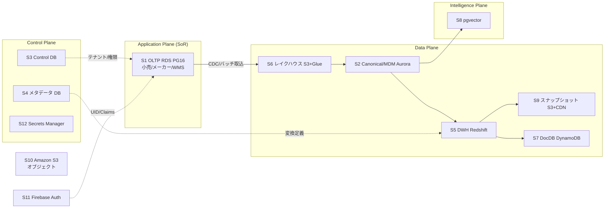
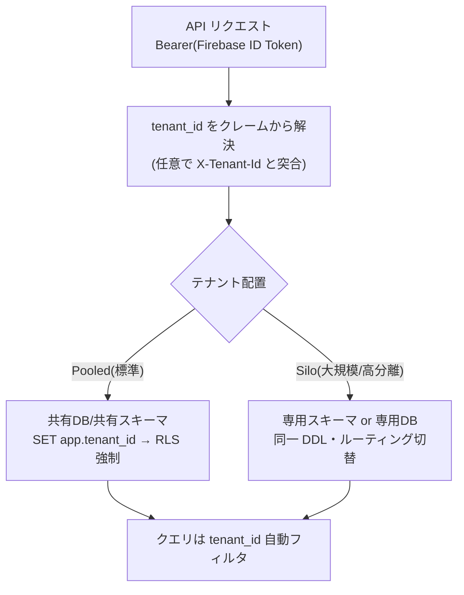
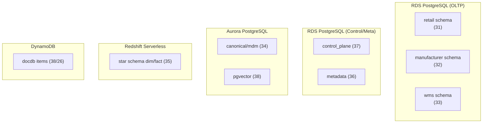

# DBスキーマ設計: スキーマ戦略と SoT

本ドキュメントは SCIP（Supply Chain Intelligence Platform）のデータベース設計における**横断的な戦略・規約・SoT（Source of Truth）マップ・マルチテナンシー物理設計・共通列テンプレート・移行方針**を権威的に確定する。全ての DB 設計ドキュメント（31 小売OLTP / 32 メーカーOLTP / 33 WMS OLTP / 34 MDM / 35 DWH / 36 マッピング / 37 コントロールプレーン / 38 AI）は本ドキュメントの規約に従う。

> **本ドキュメントが権威的に所有する範囲（owns）:** スキーマ横断の戦略・命名/DDL規約・SoTマップ・テナンシー物理設計・共通列テンプレート・キー戦略・スキーマ分割/物理配置・移行方針。
> **所有しない範囲:** 個別の業務テーブル定義。これらは各 OLTP/MDM/DWH ドキュメントが所有する（ブリーフ §14 のテーブル所有マップに従う）。本ドキュメントで業務テーブルに言及する場合は**参照に留め、再定義しない**。

---

## 1. データストアカタログ

SCIP は多目的の分析基盤であり、単一 DB では役割を満たせない。各データの特性（トランザクション整合性 / 分析集計 / 柔軟属性 / ベクター近傍検索 / 大容量オブジェクト）に応じて最適なストアを選定する（Polyglot Persistence）。以下がプラットフォームで採用するデータストアの正規カタログである（ブリーフ §5 準拠）。

| # | ストア | 物理サービス | 主用途 | 選定理由 |
|---|--------|------------|--------|---------|
| S1 | OLTP DB | Amazon RDS for PostgreSQL 16 (Multi-AZ) | 各業務アプリ（小売/メーカー/WMS）の System of Record | 継承実装の技術スタック。強整合トランザクション、RLS によるテナント分離、`NUMERIC` 金額演算 |
| S2 | Canonical/MDM DB | Amazon Aurora PostgreSQL (pgvector 併載) | 名寄せ済ゴールデンレコード + クロスウォーク | 名寄せ解決結果の SoT。読み取り主体でスケールが必要。pgvector を同居し名寄せ候補のベクター類似も担える |
| S3 | Control Plane DB | Amazon RDS for PostgreSQL 16 | テナント/契約/課金/ユーザ/権限/監査 | プラットフォームの背骨。全テナント共通のメタ。強整合が必須 |
| S4 | メタデータ DB | Amazon RDS for PostgreSQL 16 | マッピング定義・メトリクス/セマンティック定義 | 定義系は関係モデルが適する。DWH 変換の駆動元 |
| S5 | Star Schema DWH | Amazon Redshift Serverless | dim/fact の分析集計 | 列指向・MPP。大量集計を秒応答。`DISTKEY`/`SORTKEY` で結合最適化。代替 = S3(Parquet)+Iceberg+Athena |
| S6 | レイクハウス Raw/Staging | Amazon S3 (Parquet/JSON) + AWS Glue Data Catalog | 取込生データ・再変換の源泉 | 安価・不変・リプレイ可能。スキーマオンリード |
| S7 | ドキュメント DB | Amazon DynamoDB | テナント拡張属性・読み取りモデル・スナップショットメタ | 柔軟属性/高スループット読取。代替 = Firestore（既存 Firebase 資産） |
| S8 | ベクターストア | pgvector on Aurora (= S2 併載) | 埋め込み近傍検索（RAG） | Aurora に同居しトランザクション境界を共有。大規模時は Amazon OpenSearch へ |
| S9 | スナップショット静的配信 | Amazon S3 (Parquet/JSON) + CloudFront | 事前集計の高速サービング | 計算済結果を CDN でエッジ配信。DWH 負荷を軽減 |
| S10 | オブジェクトストア | Amazon S3 | 画像/帳票/添付 | Pre-signed URL で配信。大容量非構造 |
| S11 | 認証ストア | Firebase Authentication | UID/Email/パスワードハッシュ | 継承実装の認証基盤。UID/Email の SoT |
| S12 | シークレット | AWS Secrets Manager + KMS | 接続文字列・API キー | 暗号化保管・ローテーション |
| S13 | キャッシュ | Amazon ElastiCache for Redis | セッション/クエリ結果キャッシュ | プラットフォーム規模で導入。派生のみ格納 |



> **原則（ブリーフ §5）:** SoT 側書込を先行、キャッシュ/派生は後追い。逆順は不整合の温床。各ドキュメントは自分が扱うデータの SoT を明示し、同期パス（イベント受信 + 手動再同期の両方）を欠落なく設計する。

---

## 2. SoT マップ（権威的確定版）

以下のマトリクスは、各エンティティ/データ種別について**どのストアが SoT か、どのストアが派生/キャッシュか**を確定する。全 DB ドキュメントはこのマップを拠り所とし、独自に SoT を宣言し直してはならない。派生ストアへの書込は必ず SoT 書込の後追いとする。

| エンティティ / データ種別 | SoT ストア | 派生/キャッシュ ストア | 所有ドキュメント | 同期方向 |
|---|---|---|---|---|
| 業務トランザクション/マスタ（小売/メーカー/WMS） | S1 OLTP | S6 Raw → S2 Canonical → S5 DWH | 31 / 32 / 33 | OLTP → 取込 → Canonical → DWH |
| Canonical エンティティ（party/product/location/region 等ゴールデンレコード） | S2 Canonical | S5 DWH の dim_* | 34 MDM | Canonical → DWH |
| クロスウォーク（app-local id ⇄ canonical id） | S2 Canonical | — | 34 MDM | 名寄せ解決時に確定 |
| Raw/Staging（取込生データ） | ソース側システム（各 OLTP / 他社アプリ） | S6 に保持 | 36 マッピング | ソース → S6 |
| Star Schema（dim/fact） | 派生（Canonical/Raw 由来） | — | 35 DWH | Canonical/Raw → DWH |
| メトリクス/セマンティック定義（指標一元定義） | S4 メタデータ | S5 での物化ビュー | 37 コントロールプレーン（メタデータ同居） | 定義 → 変換 |
| マッピング定義（source_field / mapping_rule 等） | S4 メタデータ | — | 36 マッピング | — |
| スナップショット（事前集計） | 派生（DWH 由来） | S9 S3+CDN | 26（詳細設計） | DWH → S9 |
| テナント拡張属性 | S7 DocDB | — | 38 / 27 | アプリ → DocDB |
| 読み取りモデル（DocDB） | 派生（OLTP/DWH 由来） | S7 DocDB | 26 / 38 | SoT → DocDB |
| ベクター/埋め込み | 派生（原文/KB 由来） | S8 pgvector | 38 AI | 原文 → 埋め込み → pgvector |
| ナレッジ原文 | S10 Amazon S3（原文=SoT） + S2 Aurora（`kb_*` メタデータ） | S8 ベクター | 38 AI | 原文 → チャンク → ベクター |
| オブジェクト（画像/帳票） | S10 S3 | — | 各 OLTP | Pre-signed URL |
| 認証情報（UID/Email/PW ハッシュ） | S11 Firebase Auth | — | 37（参照） | — |
| ユーザ業務情報/権限ロール | S3 Control Plane | Firebase Custom Claims | 37 コントロールプレーン | **RDS 先行 → Claims 後追い** |
| テナント/契約/課金/エンタイトルメント | S3 Control Plane | — | 37 コントロールプレーン | — |
| 監査ログ | S3 Control Plane（append-only） | S6 → Amazon S3 Glacier IR（長期） | 37 コントロールプレーン | INSERT 専用 → アーカイブ |
| シークレット | S12 Secrets Manager | — | 非機能（11） | — |

> **表記規約（ストア ID と Amazon S3 の綴り分け）:** カタログのストア ID `S3` は **Control Plane DB（RDS PG16）** を指す（§1）。ストレージサービスとしての Amazon S3 は必ず「Amazon S3」「Amazon S3 Glacier」と綴り、ストア ID `S3` と混同しない。本マップ内の Amazon S3 参照は S6（レイクハウス）/ S9（スナップショット）/ S10（オブジェクト）が該当する。
>
> **ナレッジメタデータの格納ストア確定（§7・カタログと一致）:** `kb_document` / `kb_chunk` 等のメタデータは **S2 Aurora PostgreSQL** に格納する（pgvector = S8 を Aurora に同居させる 38 の設計に合わせ、メタとベクターのトランザクション境界を共有するため）。原文は **S10 Amazon S3** が SoT。ブリーフ §5 は同メタを「RDS」と表記するが、本プラットフォームでは pgvector 同居性を優先し **Aurora（S2）を正**とする（§7 物理配置表の「AI ベクター/ナレッジ(38) = Aurora + S3 + DynamoDB」と一致）。この差分は 38 AI ドキュメントでも同一に扱う。
>
> **メトリクス/セマンティック定義の所有ドキュメント一意確定（07 §12-1 未決の解消）:** 指標一元定義（メトリクス/セマンティック定義）の**物理スキーマ所有先を 37 コントロールプレーン/バックオフィスに一意確定**する。定義系メタデータは S4 メタデータ DB（Control 系と同一 RDS インスタンスに同居, §7）に格納し、プラットフォーム共通の定義メタとして 37 が CREATE TABLE を権威的に所有する。**36 マッピングメタデータは「マッピング定義（`source_field` / `mapping_rule` / `transform_expression` 等）の SoT」に限定**し、メトリクス/セマンティック定義テーブルは所有しない（ブリーフ §14 の 36 所有一覧に指標定義テーブルが存在しないことと整合）。07 §12 未決 #1 が挙げた候補「30 新設 / 37 同居」のうち、30 は本ドキュメント冒頭（owns 宣言）で個別業務テーブル定義を所有しないと明示しているため、自己整合的な選択肢は **37** のみ。**追随修正が必要（他ファイル）:** ① 07 §12 未決 #1 を「37 所有で確定」に更新し §9 所有マップにも反映、② ブリーフ §14 の 37 所有一覧に `metric_definition` / `semantic_entity` 等の指標定義テーブルを追記、③ 36 マッピングメタデータドキュメントに「メトリクス定義は非所有（37 が所有）」を明記——の 3 点を本確定に揃える。

### SoT 二重管理の要注意ポイント

権限ロール（ユーザ業務情報）は RDS（Control Plane）が SoT、Firebase Custom Claims はキャッシュである。**RDS 更新を先に確定し、Claims を後追いで再発行する**。Claims 単独更新は禁止（SoT から復元不能な状態を生む）。障害時は RDS を正として Claims を再同期する回復パスを 37 で設計する。CLAUDE.md 開発原則 6（データフロー整合性）の「SoT 側書込を先、キャッシュ更新が後」に厳密準拠する。

---

## 3. 命名・DDL 規約（確定版）

継承実装（akebono-honshu）の実測慣習に整合させたハウススタイル。全 OLTP/MDM ドキュメントはこの規約で CREATE TABLE を記述する。

### 3.1 命名規約

| 対象 | 規約 | 例 |
|------|------|-----|
| テーブル名 | `snake_case`。業務エンティティは複数形も継承実装踏襲で可（`products`, `purchase_orders`）。共通/正準は単数（`tenant`, `canonical_party`） | `sales_transaction`, `products` |
| 列名 | `snake_case` | `unit_price`, `ordered_at` |
| PK | `id` | `id BIGSERIAL` |
| FK | `<referent単数>_id` | `supplier_id`, `tenant_id` |
| DWH サロゲート | `<dim>_key` | `product_key`, `date_key` |
| DWH 業務自然キー | `<dim>_bk` | `product_bk` |
| 一意制約 | `uq_<table>_<cols>` | `uq_products_tenant_sku` |
| 索引 | `idx_<table>_<cols>`（部分索引は WHERE 併記） | `idx_products_tenant_active` |
| CHECK 制約 | `chk_<table>_<rule>` | `chk_products_status` |
| 外部キー制約 | `fk_<table>_<referent>` | `fk_products_family` |
| updated_at トリガ | `trg_<table>_set_updated_at` | — |

### 3.2 DDL 規約サマリ

| 項目 | 規約 | 補足 |
|------|------|------|
| PK | `id BIGSERIAL PRIMARY KEY` | C# `long` に対応。`GENERATED IDENTITY` / PG ENUM は使わないハウススタイル |
| テナント列 | `tenant_id BIGINT NOT NULL`（テナントスコープ全テーブル）。`tenant(id)` への参照は**論理参照**（§7 のインスタンス分離のため物理 FK は張らない） | RLS 前提。§4 / §6 / §7 参照 |
| タイムスタンプ | `created_at`/`updated_at TIMESTAMPTZ NOT NULL DEFAULT now()`（UTC 保存/ローカル表示） | 継承実装の JST-naive `TIMESTAMP` からの移行差分は §8 / 32 で明記 |
| 論理削除（新規） | `is_deleted BOOLEAN NOT NULL DEFAULT FALSE` | メーカー OLTP(32) は継承慣習（マスタ=`delete_flag`）を後方互換維持 |
| 監査列 | `created_by_user_id`/`updated_by_user_id BIGINT`（`app_user(id)` への**論理参照**。§7 のインスタンス分離のため物理 FK は張らない） | 軽量ログ系は省略可（明記のこと） |
| enum/ステータス | `SMALLINT + CHECK(x IN (...))` + アプリ解釈 | 日本語文字列ステータスはアンチパターン。正規化する |
| 金額 | 単価 `NUMERIC(12,2)`、明細小計 `NUMERIC(14,2)`〜`(16,2)` | 計算列は `GENERATED ALWAYS AS (...) STORED` |
| 数量 | `NUMERIC(12,4)`〜`(14,4)` | — |
| 率 | `NUMERIC(10,4)` / `(5,4)` | — |
| 通貨 | `currency_code CHAR(3) NOT NULL DEFAULT 'JPY'` | ISO 4217 |
| 来歴列 | `source_system VARCHAR`, `source_record_id VARCHAR`, `legacy_id VARCHAR(64)` | 取込データの追跡 |
| 拡張列 | 型付き拡張テーブル + `attributes JSONB` | DocDB 併用も選択肢（26 参照） |
| 列コメント | `COMMENT ON COLUMN ...` で**日本語**注釈 | 全 DDL ドキュメント必須 |
| FK 削除規則 | 既定 `NO ACTION`（論理削除運用）、明細→ヘッダのみ `ON DELETE CASCADE` | §6 参照 |

---

## 4. マルチテナンシー物理設計

方式は**ハイブリッド（Pooled + Silo）**（ブリーフ §6）。標準は Pooled（共有 DB・共有スキーマ + `tenant_id` + RLS）、大規模/高分離要件は Silo（スキーマ分離 or DB 分離）に切替。**両者は同一 DDL を保つ**ことで、Pooled → Silo の昇格をアプリ変更なしにルーティングで実現する。



### 4.1 Pooled パターンの DDL 例（雛形）

以下は本ドキュメントが定義する**テナントスコープテーブルの物理雛形**。個別業務テーブルは各ドキュメントがこの雛形を適用する（`example_entity` は雛形説明用のダミー名であり実テーブルではない）。

```sql
-- テナントスコープテーブルの物理雛形（Pooled + RLS）
CREATE TABLE example_entity (
    id                  BIGSERIAL   PRIMARY KEY,                       -- 代理主キー
    tenant_id           BIGINT      NOT NULL,                          -- テナント識別子（RLS対象。tenant(id) への論理参照, §7）
    code                VARCHAR(64) NOT NULL,                          -- 業務コード（テナント内一意）
    name                VARCHAR(255) NOT NULL,                         -- 名称
    status              SMALLINT    NOT NULL DEFAULT 0,                -- 状態 0=Draft/1=Active/2=Discontinued
    attributes          JSONB       NOT NULL DEFAULT '{}'::jsonb,      -- テナント固有拡張属性
    legacy_id           VARCHAR(64) NULL,                              -- 移行元レコードID（来歴）
    is_deleted          BOOLEAN     NOT NULL DEFAULT FALSE,            -- 論理削除フラグ
    created_at          TIMESTAMPTZ NOT NULL DEFAULT now(),            -- 作成日時（UTC保存）
    updated_at          TIMESTAMPTZ NOT NULL DEFAULT now(),            -- 更新日時（UTC保存）
    created_by_user_id  BIGINT      NULL,                              -- 作成者（app_user(id) への論理参照, §7）
    updated_by_user_id  BIGINT      NULL,                              -- 更新者（app_user(id) への論理参照, §7）
    CONSTRAINT chk_example_entity_status CHECK (status IN (0, 1, 2))
);

-- 注: tenant_id / created_by_user_id / updated_by_user_id は Control Plane（別インスタンス, §7）が
--     所有する tenant / app_user を指すため、物理 FK ではなく論理参照とする（整合はアプリ層 + RLS で保証）。
--     tenant / app_user を同一インスタンスに同居させる配置を採る場合に限り REFERENCES を付与できる（§7 参照）。

-- ★ 一意性はすべてテナントスコープ（tenant_id を先頭に含める）
ALTER TABLE example_entity
    ADD CONSTRAINT uq_example_entity_tenant_code UNIQUE (tenant_id, code);

-- ★ テナントスコープ索引（tenant_id を先頭に）。論理削除済は部分索引で除外
CREATE INDEX idx_example_entity_tenant_active
    ON example_entity (tenant_id, status)
    WHERE is_deleted = FALSE;

COMMENT ON COLUMN example_entity.tenant_id IS 'テナント識別子。RLS により current_setting(app.tenant_id) と照合';
```

### 4.2 RLS ポリシー例

```sql
-- RLS を有効化し、全操作を tenant_id でスコープする
ALTER TABLE example_entity ENABLE ROW LEVEL SECURITY;
ALTER TABLE example_entity FORCE ROW LEVEL SECURITY;   -- テーブル所有者にも適用

-- セッション変数 app.tenant_id によるスコープ強制
CREATE POLICY tenant_isolation ON example_entity
    USING      (tenant_id = current_setting('app.tenant_id')::bigint)
    WITH CHECK (tenant_id = current_setting('app.tenant_id')::bigint);
```

- アプリは DB セッション確立直後に `SET app.tenant_id = <解決済テナント>` を張る（トランザクション単位なら `SET LOCAL` 推奨、コネクションプール汚染防止）。
- `USING` は読取・更新・削除の可視行を、`WITH CHECK` は挿入・更新後の行を制約する。両方指定で「他テナント行の混入」を防ぐ。
- `FORCE ROW LEVEL SECURITY` を付与し、テーブル所有ロールでも RLS を回避できないようにする。バッチ/ETL 用の横断ロールのみ `BYPASSRLS` を限定付与し、その利用を監査ログに残す。
- `current_setting('app.tenant_id')` 未設定時は例外となり「全行漏洩」を防ぐ（fail-closed）。アプリ層で未設定クエリを禁止する。

### 4.3 Silo パターン

- **スキーマ分離**: `tenant_<id>` スキーマに同一 DDL を展開し、`search_path` でルーティング。
- **DB 分離**: 専用 RDS/Aurora インスタンス。接続文字列を Control Plane が管理し、テナント解決時に切替。
- いずれも DDL は Pooled と同一（`tenant_id` 列は残置し値は単一）。これにより DWH 取込・共通クエリを方式非依存に保つ。昇格（Pooled→Silo）は「該当テナント行の抽出 → Silo へ移送 → Pooled から削除」の移行手順で行う（無停止化は 27 で設計）。

---

## 5. 共通列テンプレートと共通トリガ

全テナントスコープテーブルが持つべき共通列を「監査列 / タイムスタンプ / 論理削除 / テナント / 来歴」の 5 系統に定める。§4.1 の雛形がこのテンプレートの適用形である。

| 系統 | 列 | 型 | 必須 | 備考 |
|------|-----|-----|------|------|
| テナント | `tenant_id` | `BIGINT NOT NULL` | ○（テナントスコープ） | RLS 対象。UNIQUE 先頭。`tenant(id)` へは論理参照（§7） |
| タイムスタンプ | `created_at` / `updated_at` | `TIMESTAMPTZ NOT NULL DEFAULT now()` | ○ | UTC 保存 |
| 論理削除 | `is_deleted` | `BOOLEAN NOT NULL DEFAULT FALSE` | ○（新規） | 32 はマスタ=`delete_flag` 後方互換 |
| 監査 | `created_by_user_id` / `updated_by_user_id` | `BIGINT`（`app_user(id)` へ論理参照, §7） | △ | 軽量ログ系は省略可 |
| 来歴 | `source_system` / `source_record_id` / `legacy_id` | `VARCHAR` | △（取込系） | 移行・取込データのみ |

### 5.1 updated_at 自動更新トリガ（共通）

`updated_at` はアプリ実装差異で更新漏れが起きやすい。DB トリガで確実に維持する（全テナントスコープテーブルに適用する共通関数）。

```sql
-- 共通: 行更新時に updated_at を現在時刻に自動セット
CREATE OR REPLACE FUNCTION set_updated_at()
RETURNS TRIGGER AS $$
BEGIN
    NEW.updated_at := now();
    RETURN NEW;
END;
$$ LANGUAGE plpgsql;

-- 各テーブルへの適用（テーブルごとにトリガ名を uq に）
CREATE TRIGGER trg_example_entity_set_updated_at
    BEFORE UPDATE ON example_entity
    FOR EACH ROW EXECUTE FUNCTION set_updated_at();
```

> **冪等性（CLAUDE.md 原則 2）:** `set_updated_at()` は `CREATE OR REPLACE` で再実行安全。トリガは `DROP TRIGGER IF EXISTS` → `CREATE` のマイグレーションパターンで冪等化する。マイグレーションは記録系（監査ログ・load_run）を巻き戻さないこと。

---

## 6. キー戦略

review-standards LAYER_1「キー設計」に準拠する。**意味を持たない代理キーを PK とし、リレーションには代理キーを使う。複合キーによる強い制約は避ける。**

| 種別 | 方針 | 根拠 |
|------|------|------|
| OLTP 主キー | `id BIGSERIAL`（単一列代理キー） | review-standards 1.2「意味を持たないユニーク ID を PK」。アジャイルで業務キーの PK 化は致命的 |
| 自然キー（品番/SKU/コード） | PK にしない。`UNIQUE(tenant_id, <natural>)` 制約で表現 | 桁構成変更・再採番に耐える。継承実装の 11 桁品番も `products.sku` を UNIQUE 制約で保持し PK は `id` |
| 複合 PK | 原則回避 | review-standards 1.2「複合キーによる強い制約は DB 変更に弱い」 |
| 中間テーブル | `id` 代理 PK + `UNIQUE(tenant_id, a_id, b_id)` | 多対多も代理キー PK。組合せは UNIQUE で表現 |
| DWH ディメンション | サロゲート `*_key BIGSERIAL` を PK、業務自然キー `*_bk` を別保持 | Kimball 準拠。SCD2 で同一 `*_bk` が複数行を持つため自然キーは PK 不可 |
| DWH ファクト | `id BIGSERIAL` 代理 PK + `*_key` 群への FK + degenerate dimension | 集計最適化 |

- FK は原則 `NO ACTION`（論理削除運用のため物理削除連鎖を避ける）。**明細 → ヘッダの親子のみ `ON DELETE CASCADE`**（明細は論理削除を持たず親に従属）。
- テナント間参照は発生しない（RLS が保証）。FK は必ず同一テナント内で閉じる。`tenant_id` は FK 列に含めず、参照先テーブルの RLS が整合を担保する（アプリ層で `tenant_id` 一致を保証）。

---

## 7. スキーマ分割と物理配置

サービスごとにスキーマ/DB を分割し、境界を明確にする（マイクロサービス的データ所有）。



| スキーマ/データ領域 | 所有ドキュメント | 物理配置 | 分離方針 |
|---|---|---|---|
| 小売 OLTP | 31 | RDS PG16 | サービス別スキーマ or DB。Pooled+RLS |
| メーカー OLTP | 32 | RDS PG16 | 同上。継承実装から一般化 |
| WMS OLTP | 33 | RDS PG16 | 同上 |
| Canonical/MDM | 34 | Aurora PG | 読取スケール。pgvector 同居 |
| マッピングメタデータ（`source_field`/`mapping_rule` 等） | 36 | RDS PG16 | Control 系と同居可 |
| メトリクス/セマンティック定義（指標一元定義） | 37 | RDS PG16（メタデータ同居, S4） | 定義メタとして Control 系と同居（§2 で 37 所有に確定） |
| コントロールプレーン | 37 | RDS PG16（独立） | プラットフォーム共通。テナント横断 |
| Star Schema DWH | 35 | Redshift Serverless | 列指向 MPP。テナントは `tenant_id`+`DISTKEY` |
| AI ベクター/ナレッジ | 38 | Aurora(pgvector) + S3 + DynamoDB | 用途別 |

> **コントロールプレーンは例外的にテナント横断**（`tenant` テーブル自体を持つため）。それ以外の業務スキーマは全テーブルが `tenant_id` を持つテナントスコープ。

### 7.1 インスタンス分離と参照整合（物理 FK の可否）

`tenant` / `app_user` は **Control Plane DB（S3 / RDS PG16, 独立インスタンス）** が所有する（37 / ブリーフ §14）。一方、業務 OLTP（S1）・Canonical（S2）等は別インスタンス（別データベース）である。PostgreSQL は**別インスタンス間の物理外部キー制約を張れない**ため、業務テーブルの `tenant_id` / `created_by_user_id` / `updated_by_user_id` から `tenant(id)` / `app_user(id)` への参照は、以下の方針で確定する。

- **標準（インスタンス分離を維持する場合）:** これらの列は**論理参照**とし、物理 FK 制約を張らない。整合は次の三層で保証する。
  1. **RLS**: `tenant_id` は全セッションで `SET app.tenant_id` により強制され、他テナント値の混入を防ぐ（§4.2 / §6）。
  2. **アプリ層**: 書込時に有効な `tenant_id` / ユーザ ID をクレーム由来で解決し付与する（存在しない ID を書かない）。
  3. **参照健全性ジョブ**: 孤児参照（削除済ユーザ ID 等）を定期検知し是正する（37 で設計）。
- **例外（同居配置を採る場合）:** テナント数が少ない Silo テナント等で `tenant` / `app_user` を業務 OLTP と**同一インスタンスの別スキーマに同居**させる配置を採る場合に限り、cross-schema FK（`REFERENCES tenant(id)` / `REFERENCES app_user(id)`）を付与できる。この場合は §4.1 雛形・§5・§8.3 の該当列に `REFERENCES` を復活させる。

> **ブリーフ §9 との対応:** ブリーフ §9 の `tenant_id BIGINT NOT NULL REFERENCES tenant(id)` / `... REFERENCES app_user(id)` という表記は**参照関係（論理的な意図）**を示す簡略記法であり、物理 FK 制約の必須を意味しない。本プラットフォームの標準配置（Control Plane 独立インスタンス, §7）では上記のとおり論理参照として実装する。§6「`tenant_id` は FK 列に含めず、参照先テーブルの RLS が整合を担保する（アプリ層で `tenant_id` 一致を保証）」と平仄が一致する。

---

## 8. 移行 / マイグレーション方針

### 8.1 マイグレーションツール

| 対象 | ツール | 理由 |
|------|--------|------|
| OLTP（.NET 8 サービス） | **EF Core 8 Migration** | 継承実装のスタック。コードファースト。`dotnet ef migrations` |
| Canonical/MDM/メタデータ（.NET） | EF Core 8 Migration | 同上 |
| DWH（Redshift） | **Flyway**（SQL ベース） | Redshift は EF Core 非対応。宣言的 SQL マイグレーション |
| DynamoDB | IaC（CDK）でテーブル定義 | スキーマレスだが GSI/キー設計は IaC 管理 |

継承実装は `db/init/01-schema.sql`（Iteration 0 の最小 raw SQL）で初期化しているが、プラットフォームでは **EF Core Migration に置換**（同ファイル冒頭コメントの想定どおり）。初期化・セットアップはコード側で完結させる（CLAUDE.md 原則 1「手動ステップを残さない」）。

### 8.2 継承実装からの主要差分（メーカー OLTP の移行ギャップ）

継承実装（Honshu, 単一テナント）→ プラットフォーム（マルチテナント）の 3 大差分。詳細な差分 DDL とデータ更新パッチは **32 メーカー OLTP** が所有する。ここでは横断方針のみ確定する。

| # | 差分 | 継承実装 | プラットフォーム | 移行方式 |
|---|------|---------|----------------|---------|
| M1 | tenant_id 導入 | 列なし（単一テナント） | 全テーブルに `tenant_id BIGINT NOT NULL` + RLS | 既存全行に既定テナント（Honshu）を付与するバックフィルパッチ |
| M2 | 一意性のテナントスコープ化 | `UNIQUE(code)`, `UNIQUE(sku)` 等 | `UNIQUE(tenant_id, code)` へ再定義 | 旧 UNIQUE を DROP → 新 UNIQUE を ADD |
| M3 | TZ 移行 | `TIMESTAMP`（JST-naive）+ DB timezone=Asia/Tokyo | `TIMESTAMPTZ`（UTC 保存） | JST-naive 値を `AT TIME ZONE 'Asia/Tokyo'` で UTC 化して移行 |

### 8.3 tenant_id 導入パッチの手順（M1 / M2）

```sql
-- 例: 既存テーブルへの tenant_id 後付けバックフィル（32 が各テーブルに適用）
-- 1) NULL 許容で列追加（既存行を壊さない = 下位互換, CLAUDE.md 原則 7）
ALTER TABLE products ADD COLUMN tenant_id BIGINT;

-- 2) 既定テナント(Honshu = 1 と仮定)でバックフィル
UPDATE products SET tenant_id = 1 WHERE tenant_id IS NULL;

-- 3) NOT NULL を確定（tenant は Control Plane の別インスタンス, §7 のため物理 FK は張らず論理参照とする。
--    整合はアプリ層 + RLS が保証。tenant を同一インスタンスに同居させる配置時のみ REFERENCES を付与可）
ALTER TABLE products ALTER COLUMN tenant_id SET NOT NULL;

-- 4) 旧 UNIQUE をテナントスコープへ差し替え（M2）
ALTER TABLE products DROP CONSTRAINT IF EXISTS uq_products_sku;
ALTER TABLE products ADD CONSTRAINT uq_products_tenant_sku UNIQUE (tenant_id, sku);

-- 5) RLS 有効化（§4.2 と同型）
ALTER TABLE products ENABLE ROW LEVEL SECURITY;
ALTER TABLE products FORCE ROW LEVEL SECURITY;
CREATE POLICY tenant_isolation ON products
    USING      (tenant_id = current_setting('app.tenant_id')::bigint)
    WITH CHECK (tenant_id = current_setting('app.tenant_id')::bigint);
```

### 8.4 TZ 移行パッチの手順（M3）

```sql
-- JST-naive TIMESTAMP を UTC 保存の TIMESTAMPTZ へ変換
-- 既存値は Asia/Tokyo のローカル時刻として解釈し UTC へ正規化する
ALTER TABLE products
    ALTER COLUMN created_at TYPE TIMESTAMPTZ
        USING created_at AT TIME ZONE 'Asia/Tokyo',
    ALTER COLUMN updated_at TYPE TIMESTAMPTZ
        USING updated_at AT TIME ZONE 'Asia/Tokyo';
```

> **下位互換とデータ保護（CLAUDE.md 原則 7）:** 上記は既存データを破壊せず値の意味を保存する。`AT TIME ZONE 'Asia/Tokyo'` はナイーブ値を JST として解釈し `timestamptz`（内部 UTC）に変換するため、表示上の JST は不変。移行はメンテナンスウィンドウで実施し、実行前後で代表行の JST 表示が一致することを検証する。移行手順書とロールバック手順を 32 に添付し、オペレーターに説明する。

### 8.5 マイグレーションの冪等性・状態保護

- スキーマ変更（DDL）は前方専用マイグレーションで管理し、各マイグレーションに一意バージョンを付与。適用済みは再実行しない（EF Core `__EFMigrationsHistory` / Flyway `flyway_schema_history`）。
- 記録系データ（`audit_logs`, `load_run`, `provisioning_task` 等）はマイグレーションで巻き戻さない（CLAUDE.md 原則 2）。設定系（feature_flag デフォルト等）のみ upsert。
- RLS ポリシー/トリガの再作成は `DROP ... IF EXISTS` → `CREATE` で冪等化する。

---

## 9. 想定エラーコード

本ドキュメント（横断規約）に起因する運用時エラーに CMN（共通）接頭辞を付与する。個別業務のエラーは各ドキュメントが所有（ブリーフ §10）。

| コード | 事象 | 契機 | 対処 |
|--------|------|------|------|
| CMN-001 | テナントコンテキスト未設定（`app.tenant_id` 未設定でクエリ実行） | RLS 評価時に `current_setting` 例外 | セッション確立時に `SET app.tenant_id` を必須化。fail-closed |
| CMN-002 | テナント越境アクセス検知（クレーム tenant_id と `X-Tenant-Id` 不一致） | API 認可 | 403 応答・監査ログ記録 |
| CMN-003 | 一意制約違反（テナントスコープ UNIQUE） | INSERT/UPDATE | 重複コードをユーザに提示し再入力誘導 |
| CMN-004 | マイグレーション整合性エラー（バージョン不整合/未適用） | デプロイ時 | デプロイ中断・手動確認 |
| CMN-005 | SoT 同期失敗（RDS 更新後 Claims 再発行失敗） | 権限更新 | 非ブロッキング。再同期ジョブで回復（CLAUDE.md 原則 4） |
| CMN-006 | TZ 移行検証失敗（移行前後で JST 表示不一致） | 移行バッチ | ロールバックし原因調査 |

---

## 10. SoT 宣言（本ドキュメント）

- 本ドキュメントは**スキーマ横断の戦略・命名/DDL 規約・SoT マップ・テナンシー物理設計・共通列テンプレート・キー戦略・スキーマ分割/物理配置・移行方針の SoT** である。
- これらの規約に関して他ドキュメントと矛盾が生じた場合、本ドキュメントの定義を優先する（ただし方法論全体の原則は `.ai-native/methodology/` が上位）。
- 個別業務テーブルの定義は本ドキュメントの SoT ではない。各所有ドキュメント（ブリーフ §14）が SoT。

---

## 11. 未決事項 / 論点

| # | 論点 | 選択肢とトレードオフ | 暫定 |
|---|------|--------------------|------|
| Q1 | Pooled → Silo 昇格の閾値 | 行数/QPS/契約プランのどれをトリガにするか。契約主導は予測可能だが技術負荷と乖離、負荷主導は自動化容易だが契約と不整合 | プランを主・負荷指標を副とする（27 で確定） |
| Q2 | Canonical と Control Plane の物理同居可否 | 同一 RDS でコスト削減 vs Aurora 読取スケール分離。名寄せ負荷が読取集中なら分離が有利 | Canonical=Aurora、Control=RDS で分離（本ドキュメント §7）。負荷実測で再評価 |
| Q3 | tenant_id を FK 列に含める複合 FK にするか | 複合 FK（`(tenant_id, x_id)`）は越境参照を DB で防げるが複合キー制約増（review-standards 1.2 に反する）。単一 FK + RLS は軽量だがアプリ層保証依存 | 単一 FK + RLS（本ドキュメント §6）。高分離要件テナントのみ複合を検討 |
| Q4 | DWH のテナント分離を DISTKEY か物理分離か | `tenant_id` DISTKEY は運用単純 vs 大規模テナントの偏り。Silo テナントは専用 Redshift も選択肢 | DISTKEY 標準（35 で確定）。偏り検知時に見直し |
| Q5 | DocDB を DynamoDB か Firestore か | DynamoDB は AWS ネイティブ/IAM 統合 vs Firestore は既存 Firebase 資産・リアルタイム同期 | DynamoDB 主（ブリーフ §4）。Firestore は既存連携用途で併記（26/38 で確定） |
| Q6 | RLS の `BYPASSRLS` を持つ ETL ロールの監査 | 横断ロールは利便性 vs 越境リスク。利用範囲をどこまで絞るか | ETL 専用ロールに限定付与 + 全利用を監査ログ化（11 非機能で確定） |

---

## 12. 関連ドキュメント

- [31 小売 OLTP スキーマ](./31-oltp-retail-schema.md) — 本規約に従う小売業務テーブルの所有
- [32 メーカー OLTP スキーマ](./32-oltp-manufacturer-schema.md) — 継承実装の一般化（tenant_id 導入・TZ 移行・一意性スコープ化の差分 DDL 所有）
- [33 WMS OLTP スキーマ](./33-oltp-wms-schema.md) — 倉庫業務テーブルの所有
- [34 MDM / Canonical スキーマ](./34-mdm-canonical-schema.md) — 正準エンティティ・クロスウォークの SoT
- [35 スタースキーマ DWH](./35-star-schema-dwh.md) — dim/fact・DISTKEY/SORTKEY の所有
- [36 マッピングメタデータ スキーマ](./36-mapping-metadata-schema.md) — マッピング定義の SoT
- [37 コントロールプレーン / バックオフィス スキーマ](./37-control-plane-backoffice-schema.md) — tenant/app_user/権限/監査の SoT
- [38 AI / ベクター / ナレッジ スキーマ](./38-ai-vector-knowledge-schema.md) — kb_*/agent_*/pgvector の所有
- [11 非機能 / セキュリティ / テナンシー](../basic-design/11-nonfunctional-security-tenancy.md) — RLS・暗号化・監査の非機能要件
