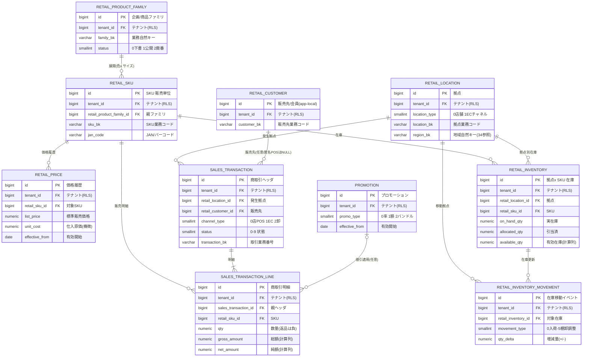
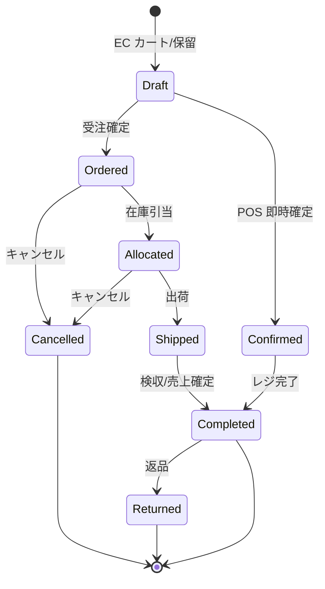
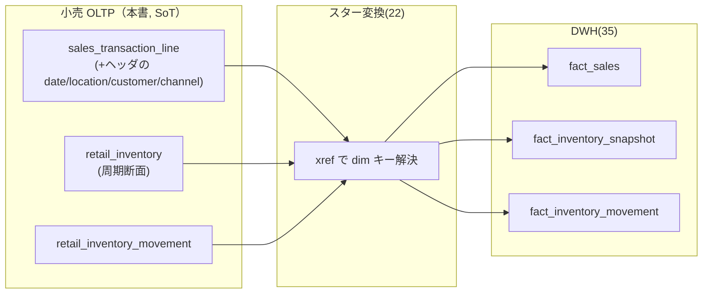

# DBスキーマ設計: 小売 OLTP（クロスリテーラーサービス）

本ドキュメントは **SCIP（Supply Chain Intelligence Platform）** の自社開発サービスのうち、
**小売向け「クロスリテーラーサービス」の OLTP スキーマ（Amazon RDS for PostgreSQL 16）** を
権威的に定義する。店舗（POS）と EC を単一のデータ基盤で扱い、商品マスタ・商取引・売上・在庫を
**最初からスタースキーマ写像を意識した構造**で保持する（[`04 小売サービス`](../basic-design/04-service-retail.md) が差別化点として掲げる「分析連携難易度の最小化」を物理レベルで担保する）。

> **本ドキュメントが権威的に所有する範囲（owns, ブリーフ §14）:** 小売 OLTP の全業務テーブル
> — `retail_product_family` / `retail_sku`（小売の商品マスタビュー）, `retail_location`（店舗/EC チャネル）,
> `retail_customer`（販売先/会員, app-local）, `retail_price` / `promotion`（価格・プロモーション）,
> `sales_transaction`(+`sales_transaction_line`), `retail_inventory`, `retail_inventory_movement`。
>
> **所有しない範囲（参照のみ）:** `tenant` / `app_user`（[37 コントロールプレーン](./37-control-plane-backoffice-schema.md)）、
> `canonical_*` / `product_category` / `region` / 各 `*_xref`（[34 MDM](./34-mdm-canonical-schema.md)）、
> `dim_*` / `fact_*`（[35 DWH](./35-star-schema-dwh.md)）。これらは**再定義せず FK / クロスウォークで参照**する。
> 横断規約（命名 / DDL / RLS / 共通列 / キー戦略 / 移行）は [30 スキーマ戦略と SoT](./30-schema-strategy-and-sot.md) が SoT。

---

## 1. 位置づけと設計原則

### 1.1 物理配置と SoT

| 項目 | 内容 |
|------|------|
| 物理ストア | Amazon RDS for PostgreSQL 16（Multi-AZ）、`retail` スキーマ（[30 §7](./30-schema-strategy-and-sot.md) の物理配置に準拠） |
| テナンシー | Pooled（共有DB・共有スキーマ + `tenant_id` + RLS）標準。大規模は Silo（同一 DDL・ルーティング切替）。ブリーフ §6 |
| 本サービスが SoT のデータ | 小売の商品マスタ（アプリローカル）、店舗/EC チャネル、商取引トランザクション（POS/EC 売上・返品）、小売在庫、価格/プロモーション（[04 §1.3](../basic-design/04-service-retail.md)） |
| 参照のみ（SoT は他） | 正準商品/取引先/拠点/地域（34 MDM）、テナント/ユーザ/権限（37 Control Plane）、dim/fact（35 DWH） |
| データフロー方向 | 本 OLTP（SoT）→ Data Plane（Raw → Canonical → DWH）の**一方向**。逆流（DWH→OLTP 書戻し）は行わない（ブリーフ §5 / CLAUDE.md 原則6） |

### 1.2 継承実装からの主要差分

継承実装 `akebono-honshu`（単一テナントの履物メーカー）に対し、本スキーマは以下を織り込む（ブリーフ §6/§9/§15、[30 §8](./30-schema-strategy-and-sot.md)）。

- **`tenant_id` 導入 + RLS**: 全テーブルが `tenant_id BIGINT NOT NULL`。一意制約は先頭に `tenant_id` を含める。
- **論理削除は `is_deleted`（新規標準）**: 継承実装のマスタ `delete_flag` は踏襲せず、プラットフォーム標準の `is_deleted` に統一（本サービスは新規テーブル群のため後方互換の制約がない）。
- **`TIMESTAMPTZ`（UTC 保存 / ローカル表示）**: 継承実装の JST-naive `TIMESTAMP` は採用しない。業務日付は `DATE`。
- **日本語文字列ステータスの排除**: 継承 ops-data 層の `'受注'`/`'出荷済'` 等のアンチパターンは踏襲せず、`SMALLINT + CHECK` に正規化（値は [04 §9](../basic-design/04-service-retail.md) / 本書 §3）。

### 1.3 スタースキーマ写像を意識した列設計

自社アプリの差別化要件（項目マッピング不要でスター供給できる、ブリーフ §2）を満たすため、以下を設計原則とする。

- 明細（`sales_transaction_line`）は **fact_sales の measures（qty/gross/net/cost/margin/discount/return）を計算列で保持**し、変換時に写像するだけで済む構造にする。
- 在庫（`retail_inventory`）は **fact_inventory_snapshot の measures（on_hand/allocated/available/in_transit）を保持**し、周期スナップショットにそのまま供給する。
- 移動（`retail_inventory_movement`）は **fact_inventory_movement（トランザクションファクト）**へ 1:1 写像する。
- 各ローカルエンティティは**業務自然キー（`*_bk` 相当）**を保持し、名寄せ（34）と DWH（35, `dim_*.*_bk`）の突合に使う。

---

## 2. ER 図（小売 OLTP 全体像）



> 上図は本ドキュメントが所有するテーブルのみを示す。外部参照（`tenant` / `app_user` / `canonical_*` / `dim_*` / `*_xref`）は §9 の外部参照表を参照。名寄せ（app-local id ⇄ canonical id）は 34 のクロスウォークで解決され、OLTP 側に canonical への物理 FK は張らない（DB 境界を跨ぐため。§9 参照）。

---

## 3. ステータス / 区分値の正規定義（SMALLINT + CHECK）

継承実装の日本語 VARCHAR ステータスは踏襲せず、`SMALLINT + CHECK + アプリ解釈`（ブリーフ §9）で表現する。値は [04 §9](../basic-design/04-service-retail.md) と一致させる。

### 3.1 `sales_transaction.status`（商取引ステータス）

| 値 | 定数 | 意味 | 適用チャネル |
|----|------|------|------------|
| 0 | Draft | 下書き/カート | EC |
| 1 | Ordered | 受注 | EC |
| 2 | Allocated | 引当済 | EC |
| 3 | Shipped | 出荷済 | EC |
| 4 | Confirmed | POS 確定 | 店舗 |
| 5 | Completed | 完了/売上確定 | 共通 |
| 8 | Cancelled | 取消（引当解放） | EC |
| 9 | Returned | 返品（マイナス売上） | 共通 |



### 3.2 その他の区分値

| 列 | 値定義 |
|----|--------|
| `sales_transaction.channel_type` | 0=店舗POS / 1=EC / 2=卸（将来拡張） |
| `retail_location.location_type` | 0=store（実店舗） / 1=ec_channel（EC 論理拠点） / 2=wholesale（卸, 将来） |
| `retail_inventory_movement.movement_type` | 0=receive（入荷） / 1=issue（出庫） / 2=allocate（引当） / 3=release（引当解放） / 4=transfer（移動） / 5=adjust（棚卸調整） |
| `retail_product_family.status` / `retail_sku.status` | 0=Draft（下書き） / 1=Active（公開） / 2=Discontinued（廃番） |
| `promotion.promo_type` | 0=percentage（率引き） / 1=amount（額引き） / 2=bundle（バンドル/セット） |
| `promotion.status` | 0=Draft / 1=Active / 2=Suspended |
| `retail_price.price_type` | 0=list（標準販売価格） / 1=cost（仕入原価, 機微） |

> **設計判断:** `retail_location` は継承的な二分（店舗/EC）を**単一テーブル + `location_type` 判別子**で統合する（ブリーフ §14 の「store/ec_channel」を型判別で実装）。これにより (a) `sales_transaction` / `retail_inventory` が単一 `retail_location_id` で参照でき（多態 FK を回避）、(b) 正準 `canonical_location`（type=store/ec_channel）および `dim_location` へ 1:1 で写像できる。ポリモーフィックな 2 テーブル分割は結合と DWH 写像を複雑化するため採らない（§10 未決事項 R-1 でオペレーター確認）。

---

## 4. 商品マスタ・拠点・販売先・価格

### 4.1 `retail_product_family` — 商品ファミリ（企画単位, 小売視点）

```sql
-- 商品ファミリ（企画/取扱商品の企画単位、小売視点の 2 層商品モデルの親）
CREATE TABLE retail_product_family (
    id                   BIGSERIAL    PRIMARY KEY,                    -- 代理主キー
    tenant_id            BIGINT       NOT NULL REFERENCES tenant(id), -- テナント識別子（RLS 対象）
    family_bk            VARCHAR(64)  NOT NULL,                       -- 業務自然キー（名寄せ/DWH 突合用、dim_product.family_bk へ）
    family_name          VARCHAR(255) NOT NULL,                       -- 商品ファミリ名
    brand_name           VARCHAR(128) NULL,                           -- ブランド（denormalized 表示・分析属性）
    category_bk          VARCHAR(64)  NULL,                           -- 商品分類の業務キー（34 product_category へ xref）
    category_path        VARCHAR(512) NULL,                           -- 分類階層パス（可変段数, 表示用 denormalized）
    season_code          VARCHAR(32)  NULL,                           -- シーズン（分析属性）
    product_type_code    VARCHAR(32)  NULL,                           -- 商品タイプ（分析属性）
    status               SMALLINT     NOT NULL DEFAULT 0,             -- 0=Draft/1=Active/2=Discontinued
    attributes           JSONB        NOT NULL DEFAULT '{}'::jsonb,   -- テナント固有拡張属性（型付き列に無い項目）
    source_system        VARCHAR(64)  NULL,                           -- 来歴：取込元システム
    source_record_id     VARCHAR(128) NULL,                           -- 来歴：取込元レコード ID
    legacy_id            VARCHAR(64)  NULL,                           -- 移行元レコード ID
    is_deleted           BOOLEAN      NOT NULL DEFAULT FALSE,         -- 論理削除フラグ
    created_at           TIMESTAMPTZ  NOT NULL DEFAULT now(),         -- 作成日時（UTC 保存）
    updated_at           TIMESTAMPTZ  NOT NULL DEFAULT now(),         -- 更新日時（UTC 保存）
    created_by_user_id   BIGINT       NULL REFERENCES app_user(id),  -- 作成者
    updated_by_user_id   BIGINT       NULL REFERENCES app_user(id),  -- 更新者
    CONSTRAINT chk_retail_product_family_status CHECK (status IN (0, 1, 2))
);

ALTER TABLE retail_product_family
    ADD CONSTRAINT uq_retail_product_family_tenant_bk UNIQUE (tenant_id, family_bk);

CREATE INDEX idx_retail_product_family_tenant_active
    ON retail_product_family (tenant_id, status)
    WHERE is_deleted = FALSE;
CREATE INDEX idx_retail_product_family_tenant_category
    ON retail_product_family (tenant_id, category_bk)
    WHERE is_deleted = FALSE;

COMMENT ON TABLE  retail_product_family              IS '商品ファミリ（企画単位、小売視点）。SoT=小売OLTP。canonical_product へ product_xref で対応づけ';
COMMENT ON COLUMN retail_product_family.tenant_id    IS 'テナント識別子。RLS により current_setting(app.tenant_id) と照合';
COMMENT ON COLUMN retail_product_family.family_bk    IS '業務自然キー。dim_product の family 属性と突合。PK にはしない（キー戦略, 30 §6）';
COMMENT ON COLUMN retail_product_family.category_bk  IS '商品分類の業務キー。分類マスタは 34 product_category が SoT。本列は xref 突合用';
```

### 4.2 `retail_sku` — SKU（販売単位, 色×サイズ）

```sql
-- SKU（販売単位、色 x サイズで増殖、JAN/バーコード対応）
CREATE TABLE retail_sku (
    id                        BIGSERIAL    PRIMARY KEY,                    -- 代理主キー
    tenant_id                 BIGINT       NOT NULL REFERENCES tenant(id), -- テナント識別子（RLS 対象）
    retail_product_family_id  BIGINT       NOT NULL REFERENCES retail_product_family(id), -- 親ファミリ
    sku_bk                    VARCHAR(64)  NOT NULL,                       -- SKU 業務コード（品番/管理番号。継承実装の 11 桁品番もここに保持）
    jan_code                  VARCHAR(20)  NULL,                           -- JAN/EAN/UPC バーコード（POS スキャン・EC 検品）
    color_name                VARCHAR(64)  NULL,                           -- 色（分析属性、dim_product.color へ）
    size_name                 VARCHAR(64)  NULL,                           -- サイズ（分析属性、dim_product.size へ）
    material_name             VARCHAR(128) NULL,                           -- 素材（分析属性）
    uom_code                  VARCHAR(16)  NOT NULL DEFAULT 'EA',          -- 販売単位（34 uom 参照。既定=個 EA）
    status                    SMALLINT     NOT NULL DEFAULT 1,             -- 0=Draft/1=Active/2=Discontinued（廃番は論理削除ではなく status=2）
    attributes                JSONB        NOT NULL DEFAULT '{}'::jsonb,   -- テナント固有拡張属性
    source_system             VARCHAR(64)  NULL,                           -- 来歴：取込元システム
    source_record_id          VARCHAR(128) NULL,                           -- 来歴：取込元レコード ID
    legacy_id                 VARCHAR(64)  NULL,                           -- 移行元レコード ID
    is_deleted                BOOLEAN      NOT NULL DEFAULT FALSE,         -- 論理削除フラグ
    created_at                TIMESTAMPTZ  NOT NULL DEFAULT now(),         -- 作成日時（UTC 保存）
    updated_at                TIMESTAMPTZ  NOT NULL DEFAULT now(),         -- 更新日時（UTC 保存）
    created_by_user_id        BIGINT       NULL REFERENCES app_user(id),  -- 作成者
    updated_by_user_id        BIGINT       NULL REFERENCES app_user(id),  -- 更新者
    CONSTRAINT chk_retail_sku_status CHECK (status IN (0, 1, 2))
);

-- SKU 業務コードはテナント内一意（ブリーフ §6 テナントスコープ一意性）
ALTER TABLE retail_sku
    ADD CONSTRAINT uq_retail_sku_tenant_bk UNIQUE (tenant_id, sku_bk);
-- JAN はテナント内一意（NULL は複数許容）。部分一意インデックスで表現
CREATE UNIQUE INDEX uq_retail_sku_tenant_jan
    ON retail_sku (tenant_id, jan_code)
    WHERE jan_code IS NOT NULL AND is_deleted = FALSE;

CREATE INDEX idx_retail_sku_tenant_family
    ON retail_sku (tenant_id, retail_product_family_id)
    WHERE is_deleted = FALSE;
-- POS スキャン/EC 検品の高速検索（部分一致は pg_trgm を別途 GIN で付与可、04 §3.1）
CREATE INDEX idx_retail_sku_tenant_bk_trgm
    ON retail_sku USING gin (sku_bk gin_trgm_ops);

COMMENT ON TABLE  retail_sku            IS 'SKU（販売単位）。SoT=小売OLTP。canonical_sku へ sku_xref で対応づけ。dim_product（SKU 粒度, SCD2）の源泉';
COMMENT ON COLUMN retail_sku.sku_bk     IS 'SKU 業務コード（品番）。継承実装の 11 桁品番もここに格納。PK にはせず UNIQUE(tenant_id, sku_bk) で担保';
COMMENT ON COLUMN retail_sku.jan_code   IS 'JAN/EAN/UPC。POS スキャンと EC 出荷検品の検索キー。テナント内一意（部分索引）';
COMMENT ON COLUMN retail_sku.status     IS '廃番は is_deleted ではなく status=2 で表現（在庫/履歴の参照整合を保つため）';
```

### 4.3 `retail_location` — 拠点（店舗 / EC チャネル統合）

```sql
-- 拠点（店舗/EC チャネルを location_type で統合。canonical_location type=store/ec_channel へ写像）
CREATE TABLE retail_location (
    id                   BIGSERIAL    PRIMARY KEY,                    -- 代理主キー
    tenant_id            BIGINT       NOT NULL REFERENCES tenant(id), -- テナント識別子（RLS 対象）
    location_bk          VARCHAR(64)  NOT NULL,                       -- 拠点業務コード（店舗コード/チャネルコード）
    location_type        SMALLINT     NOT NULL,                       -- 0=store/1=ec_channel/2=wholesale
    location_name        VARCHAR(255) NOT NULL,                       -- 拠点名
    region_bk            VARCHAR(64)  NULL,                           -- 地域自然キー（34 region へ xref。動的粒度）
    postal_code          VARCHAR(16)  NULL,                           -- 郵便番号（店舗所在地。EC は配送起点/NULL）
    address_line         VARCHAR(512) NULL,                           -- 住所（店舗のみ）
    ec_platform          VARCHAR(64)  NULL,                           -- EC プラットフォーム識別（location_type=1 のみ）
    status               SMALLINT     NOT NULL DEFAULT 1,             -- 0=Draft/1=Active/2=Closed（閉店/廃止）
    attributes           JSONB        NOT NULL DEFAULT '{}'::jsonb,   -- テナント固有拡張属性
    source_system        VARCHAR(64)  NULL,                           -- 来歴：取込元システム
    source_record_id     VARCHAR(128) NULL,                           -- 来歴：取込元レコード ID
    legacy_id            VARCHAR(64)  NULL,                           -- 移行元レコード ID
    is_deleted           BOOLEAN      NOT NULL DEFAULT FALSE,         -- 論理削除フラグ
    created_at           TIMESTAMPTZ  NOT NULL DEFAULT now(),         -- 作成日時（UTC 保存）
    updated_at           TIMESTAMPTZ  NOT NULL DEFAULT now(),         -- 更新日時（UTC 保存）
    created_by_user_id   BIGINT       NULL REFERENCES app_user(id),  -- 作成者
    updated_by_user_id   BIGINT       NULL REFERENCES app_user(id),  -- 更新者
    CONSTRAINT chk_retail_location_type   CHECK (location_type IN (0, 1, 2)),
    CONSTRAINT chk_retail_location_status CHECK (status IN (0, 1, 2))
);

ALTER TABLE retail_location
    ADD CONSTRAINT uq_retail_location_tenant_bk UNIQUE (tenant_id, location_bk);

CREATE INDEX idx_retail_location_tenant_type
    ON retail_location (tenant_id, location_type)
    WHERE is_deleted = FALSE;
CREATE INDEX idx_retail_location_tenant_region
    ON retail_location (tenant_id, region_bk)
    WHERE is_deleted = FALSE;

COMMENT ON TABLE  retail_location               IS '拠点（店舗/EC チャネル）。SoT=小売OLTP。canonical_location へ location_xref で対応づけ。dim_location/dim_channel/dim_region の源泉';
COMMENT ON COLUMN retail_location.location_type IS '0=store(実店舗)/1=ec_channel(EC 論理拠点)/2=wholesale(卸)。dim_channel と整合';
COMMENT ON COLUMN retail_location.region_bk     IS '地域自然キー。地域階層は 34 region が SoT（動的粒度）。dim_region 突合用';
```

### 4.4 `retail_customer` — 販売先 / 会員（app-local）

```sql
-- 販売先/会員（app-local。canonical_party role=customer へ party_xref で対応づけ）
CREATE TABLE retail_customer (
    id                   BIGSERIAL    PRIMARY KEY,                    -- 代理主キー
    tenant_id            BIGINT       NOT NULL REFERENCES tenant(id), -- テナント識別子（RLS 対象）
    customer_bk          VARCHAR(64)  NOT NULL,                       -- 販売先業務コード（会員番号/取引先コード）
    customer_type        SMALLINT     NOT NULL DEFAULT 0,             -- 0=個人会員/1=法人/2=匿名(POS walk-in 集約)
    display_name         VARCHAR(255) NULL,                           -- 表示名（匿名 POS は NULL）
    region_bk            VARCHAR(64)  NULL,                           -- 販売先地域（EC 配送先地域の集計軸、34 region 参照）
    status               SMALLINT     NOT NULL DEFAULT 1,             -- 0=Draft/1=Active/2=Inactive
    attributes           JSONB        NOT NULL DEFAULT '{}'::jsonb,   -- 拡張属性（PII 最小化。詳細プロファイルは持たない）
    source_system        VARCHAR(64)  NULL,                           -- 来歴：取込元システム
    source_record_id     VARCHAR(128) NULL,                           -- 来歴：取込元レコード ID
    legacy_id            VARCHAR(64)  NULL,                           -- 移行元レコード ID
    is_deleted           BOOLEAN      NOT NULL DEFAULT FALSE,         -- 論理削除フラグ
    created_at           TIMESTAMPTZ  NOT NULL DEFAULT now(),         -- 作成日時（UTC 保存）
    updated_at           TIMESTAMPTZ  NOT NULL DEFAULT now(),         -- 更新日時（UTC 保存）
    created_by_user_id   BIGINT       NULL REFERENCES app_user(id),  -- 作成者
    updated_by_user_id   BIGINT       NULL REFERENCES app_user(id),  -- 更新者
    CONSTRAINT chk_retail_customer_type   CHECK (customer_type IN (0, 1, 2)),
    CONSTRAINT chk_retail_customer_status CHECK (status IN (0, 1, 2))
);

ALTER TABLE retail_customer
    ADD CONSTRAINT uq_retail_customer_tenant_bk UNIQUE (tenant_id, customer_bk);

CREATE INDEX idx_retail_customer_tenant_active
    ON retail_customer (tenant_id, status)
    WHERE is_deleted = FALSE;

COMMENT ON TABLE  retail_customer            IS '販売先/会員（app-local）。SoT=小売OLTP。canonical_party(role=customer) へ party_xref で対応づけ、dim_customer の源泉。PII は最小化し分析は非識別化集計（04 §12-5）';
COMMENT ON COLUMN retail_customer.customer_type IS '2=匿名（POS walk-in）。匿名会計を単一集約レコードに束ねる運用も可';
```

> **設計判断（R-2, §10）:** `retail_customer` はブリーフ §14 の 31 owns 明示列挙には無いが、`sales_transaction` の**販売先**（fact_sales の粒度軸「販売先」）を保持するために app-local エンティティとして本書が所有する（[04 §5.2](../basic-design/04-service-retail.md) が CUSTOMER→canonical_party→dim_customer の写像を規定）。個人情報は最小限に留め、正準化範囲（プライバシー境界）は 34 MDM / 11 非機能と協議する。

### 4.5 `retail_price` — 価格履歴（標準販売価格・仕入原価）

```sql
-- 価格履歴（SKU 単位。有効日で履歴管理。標準販売価格と仕入原価を price_type で区別）
CREATE TABLE retail_price (
    id                   BIGSERIAL    PRIMARY KEY,                    -- 代理主キー
    tenant_id            BIGINT       NOT NULL REFERENCES tenant(id), -- テナント識別子（RLS 対象）
    retail_sku_id        BIGINT       NOT NULL REFERENCES retail_sku(id), -- 対象 SKU
    price_type           SMALLINT     NOT NULL DEFAULT 0,             -- 0=list(標準販売価格)/1=cost(仕入原価, 機微)
    price_channel        SMALLINT     NULL,                           -- チャネル別価格（NULL=全チャネル共通の既定）
    list_price           NUMERIC(12,2) NULL,                          -- 標準販売価格（price_type=0 のとき必須）
    unit_cost            NUMERIC(12,2) NULL,                          -- 仕入原価（price_type=1 のとき必須。機微・既定マスク）
    currency_code        CHAR(3)      NOT NULL DEFAULT 'JPY',         -- 通貨（ISO 4217）
    effective_from       DATE         NOT NULL,                       -- 有効開始日
    effective_to         DATE         NULL,                           -- 有効終了日（NULL=現在有効）
    is_deleted           BOOLEAN      NOT NULL DEFAULT FALSE,         -- 論理削除フラグ
    created_at           TIMESTAMPTZ  NOT NULL DEFAULT now(),         -- 作成日時（UTC 保存）
    updated_at           TIMESTAMPTZ  NOT NULL DEFAULT now(),         -- 更新日時（UTC 保存）
    created_by_user_id   BIGINT       NULL REFERENCES app_user(id),  -- 作成者
    updated_by_user_id   BIGINT       NULL REFERENCES app_user(id),  -- 更新者
    CONSTRAINT chk_retail_price_type      CHECK (price_type IN (0, 1)),
    CONSTRAINT chk_retail_price_channel   CHECK (price_channel IS NULL OR price_channel IN (0, 1, 2)),
    CONSTRAINT chk_retail_price_period    CHECK (effective_to IS NULL OR effective_to > effective_from),
    CONSTRAINT chk_retail_price_amount     CHECK (
        (price_type = 0 AND list_price IS NOT NULL AND list_price >= 0)
     OR (price_type = 1 AND unit_cost  IS NOT NULL AND unit_cost  >= 0)
    )
);

-- 同一 SKU・同一種別・同一チャネル・同一開始日の重複防止（NULL チャネルは COALESCE で一意化, 30/継承実装パターン）
CREATE UNIQUE INDEX uq_retail_price_sku_type_chan_from
    ON retail_price (tenant_id, retail_sku_id, price_type, COALESCE(price_channel, -1), effective_from)
    WHERE is_deleted = FALSE;

-- 現行価格ルックアップ（effective_to IS NULL の選択性を確保）
CREATE INDEX idx_retail_price_current
    ON retail_price (tenant_id, retail_sku_id, price_type, COALESCE(price_channel, -1), effective_from DESC)
    WHERE effective_to IS NULL AND is_deleted = FALSE;

COMMENT ON TABLE  retail_price            IS '価格履歴（SKU 単位）。標準販売価格(price_type=0)と仕入原価(price_type=1)。SoT=小売OLTP';
COMMENT ON COLUMN retail_price.unit_cost  IS '仕入原価（機微度 中-高）。既定マスク、開示は権限+監査(Price.View)。KMS 保存時暗号化（04 §11 / 11 非機能）';
COMMENT ON COLUMN retail_price.price_channel IS 'チャネル別価格。NULL=全チャネル共通の既定。非 NULL=そのチャネル専用（既定をオーバーライド）';
```

> **価格解決（現単価）:** 「(sku, price_type, 対象 channel) の現行行 → 無ければ (…, channel=NULL 既定) の現行行」のフォールバックで解決する（継承実装 `product_supplier_prices` の size フォールバックと同型）。新価格設定時は同一バケットの旧行の `effective_to` を `新 effective_from - 1日` で UPDATE + 新行 INSERT を 1 トランザクションで行う（履歴の連続性）。

### 4.6 `promotion` — プロモーション / 値引ルール

```sql
-- プロモーション（値引/キャンペーン。sales_transaction_line から適用参照。dim_promotion の源泉）
CREATE TABLE promotion (
    id                   BIGSERIAL    PRIMARY KEY,                    -- 代理主キー
    tenant_id            BIGINT       NOT NULL REFERENCES tenant(id), -- テナント識別子（RLS 対象）
    promotion_bk         VARCHAR(64)  NOT NULL,                       -- プロモーション業務コード（dim_promotion.promotion_bk へ）
    promotion_name       VARCHAR(255) NOT NULL,                       -- プロモーション名
    promo_type           SMALLINT     NOT NULL,                       -- 0=percentage/1=amount/2=bundle
    discount_rate        NUMERIC(5,4) NULL,                           -- 率引き（promo_type=0、例 0.1000=10%）
    discount_amount      NUMERIC(12,2) NULL,                          -- 額引き（promo_type=1）
    priority             SMALLINT     NOT NULL DEFAULT 0,             -- 適用優先度（重複時の解決）
    effective_from       DATE         NOT NULL,                       -- 有効開始日
    effective_to         DATE         NULL,                           -- 有効終了日（NULL=無期限）
    status               SMALLINT     NOT NULL DEFAULT 1,             -- 0=Draft/1=Active/2=Suspended
    attributes           JSONB        NOT NULL DEFAULT '{}'::jsonb,   -- 適用条件等の拡張（対象カテゴリ/最低購入額 等）
    source_system        VARCHAR(64)  NULL,                           -- 来歴：取込元システム
    source_record_id     VARCHAR(128) NULL,                           -- 来歴：取込元レコード ID
    legacy_id            VARCHAR(64)  NULL,                           -- 移行元レコード ID
    is_deleted           BOOLEAN      NOT NULL DEFAULT FALSE,         -- 論理削除フラグ
    created_at           TIMESTAMPTZ  NOT NULL DEFAULT now(),         -- 作成日時（UTC 保存）
    updated_at           TIMESTAMPTZ  NOT NULL DEFAULT now(),         -- 更新日時（UTC 保存）
    created_by_user_id   BIGINT       NULL REFERENCES app_user(id),  -- 作成者
    updated_by_user_id   BIGINT       NULL REFERENCES app_user(id),  -- 更新者
    CONSTRAINT chk_promotion_type   CHECK (promo_type IN (0, 1, 2)),
    CONSTRAINT chk_promotion_status CHECK (status IN (0, 1, 2)),
    CONSTRAINT chk_promotion_period CHECK (effective_to IS NULL OR effective_to > effective_from),
    CONSTRAINT chk_promotion_value  CHECK (
        (promo_type = 0 AND discount_rate   IS NOT NULL AND discount_rate BETWEEN 0 AND 1)
     OR (promo_type = 1 AND discount_amount IS NOT NULL AND discount_amount >= 0)
     OR (promo_type = 2)
    )
);

ALTER TABLE promotion
    ADD CONSTRAINT uq_promotion_tenant_bk UNIQUE (tenant_id, promotion_bk);

CREATE INDEX idx_promotion_tenant_active
    ON promotion (tenant_id, status, effective_from)
    WHERE is_deleted = FALSE;

COMMENT ON TABLE  promotion            IS 'プロモーション/値引ルール。SoT=小売OLTP。dim_promotion の源泉。sales_transaction_line.promotion_id から適用参照';
COMMENT ON COLUMN promotion.promo_type IS '0=率引き(discount_rate)/1=額引き(discount_amount)/2=バンドル(attributes に条件)';
```

---

## 5. 商取引トランザクション（POS / EC / 返品）

### 5.1 `sales_transaction` — 商取引ヘッダ

```sql
-- 商取引ヘッダ（POS/EC を単一エンティティで統合。channel_type で区別、返品はマイナス売上明細で表現）
CREATE TABLE sales_transaction (
    id                     BIGSERIAL    PRIMARY KEY,                    -- 代理主キー
    tenant_id              BIGINT       NOT NULL REFERENCES tenant(id), -- テナント識別子（RLS 対象）
    transaction_bk         VARCHAR(64)  NOT NULL,                       -- 取引業務番号（レシート番号/注文番号。degenerate dimension）
    channel_type           SMALLINT     NOT NULL,                       -- 0=店舗POS/1=EC/2=卸
    status                 SMALLINT     NOT NULL DEFAULT 0,             -- §3.1 参照（0..9）
    retail_location_id     BIGINT       NOT NULL REFERENCES retail_location(id), -- 発生拠点（店舗/EC チャネル）
    retail_customer_id     BIGINT       NULL REFERENCES retail_customer(id),     -- 販売先/会員（匿名 POS は NULL 可）
    business_date          DATE         NOT NULL,                       -- 業務日付（売上計上日。dim_date 突合の粒度）
    ordered_at             TIMESTAMPTZ  NULL,                           -- 受注日時（EC）
    confirmed_at           TIMESTAMPTZ  NULL,                           -- 確定日時（POS レジ確定/EC 検収）
    shipped_at             TIMESTAMPTZ  NULL,                           -- 出荷日時（EC）
    cancelled_at           TIMESTAMPTZ  NULL,                           -- 取消日時
    returned_at            TIMESTAMPTZ  NULL,                           -- 返品確定日時
    original_transaction_id BIGINT      NULL REFERENCES sales_transaction(id),   -- 返品時の元取引（自己参照。返品明細の紐付け）
    currency_code          CHAR(3)      NOT NULL DEFAULT 'JPY',         -- 通貨（ISO 4217）
    header_gross_amount    NUMERIC(16,2) NOT NULL DEFAULT 0,            -- ヘッダ総額（明細合計のキャッシュ。トリガ/アプリで整合）
    header_net_amount      NUMERIC(16,2) NOT NULL DEFAULT 0,            -- ヘッダ純額（値引後合計のキャッシュ）
    -- EC 固有項目（channel_type=1 のときのみ充足）
    ship_to_postal_code    VARCHAR(16)  NULL,                           -- 配送先郵便番号（EC。配送先地域の集計）
    ship_to_region_bk      VARCHAR(64)  NULL,                           -- 配送先地域自然キー（EC 集計軸。34 region 参照）
    order_status_note      VARCHAR(255) NULL,                           -- EC 注文ステータス補足
    idempotency_key        VARCHAR(64)  NULL,                           -- 冪等キー（二重会計/二重注文の排除, ブリーフ §11）
    source_system          VARCHAR(64)  NULL,                           -- 来歴：取込元システム
    source_record_id       VARCHAR(128) NULL,                           -- 来歴：取込元レコード ID
    legacy_id              VARCHAR(64)  NULL,                           -- 移行元レコード ID
    is_deleted             BOOLEAN      NOT NULL DEFAULT FALSE,         -- 論理削除フラグ
    created_at             TIMESTAMPTZ  NOT NULL DEFAULT now(),         -- 作成日時（UTC 保存）
    updated_at             TIMESTAMPTZ  NOT NULL DEFAULT now(),         -- 更新日時（UTC 保存）
    created_by_user_id     BIGINT       NULL REFERENCES app_user(id),  -- 作成者
    updated_by_user_id     BIGINT       NULL REFERENCES app_user(id),  -- 更新者
    CONSTRAINT chk_sales_transaction_channel CHECK (channel_type IN (0, 1, 2)),
    CONSTRAINT chk_sales_transaction_status  CHECK (status IN (0, 1, 2, 3, 4, 5, 8, 9)),
    CONSTRAINT chk_sales_transaction_cancel  CHECK ((status = 8) = (cancelled_at IS NOT NULL)),
    CONSTRAINT chk_sales_transaction_return  CHECK (status <> 9 OR (returned_at IS NOT NULL AND original_transaction_id IS NOT NULL))
);

-- 取引業務番号はテナント内一意
ALTER TABLE sales_transaction
    ADD CONSTRAINT uq_sales_transaction_tenant_bk UNIQUE (tenant_id, transaction_bk);
-- 冪等キーはテナント内一意（二重処理の排除、RTL-202）
CREATE UNIQUE INDEX uq_sales_transaction_tenant_idem
    ON sales_transaction (tenant_id, idempotency_key)
    WHERE idempotency_key IS NOT NULL;

-- 売上一覧（期間 x 拠点/チャネル）: fact_sales 供給とダッシュボードの主クエリ
CREATE INDEX idx_sales_transaction_tenant_date
    ON sales_transaction (tenant_id, business_date DESC, channel_type)
    WHERE is_deleted = FALSE;
CREATE INDEX idx_sales_transaction_tenant_location
    ON sales_transaction (tenant_id, retail_location_id, business_date DESC)
    WHERE is_deleted = FALSE;
CREATE INDEX idx_sales_transaction_tenant_status
    ON sales_transaction (tenant_id, status)
    WHERE is_deleted = FALSE;
-- CDC/日次供給の増分抽出（updated_at 基点）
CREATE INDEX idx_sales_transaction_tenant_updated
    ON sales_transaction (tenant_id, updated_at);

COMMENT ON TABLE  sales_transaction                 IS '商取引ヘッダ（POS/EC/返品）。SoT=小売OLTP（System of Record）。fact_sales の源泉。逆流書戻しなし';
COMMENT ON COLUMN sales_transaction.transaction_bk  IS '取引業務番号。fact_sales の degenerate dimension として保持';
COMMENT ON COLUMN sales_transaction.business_date   IS '売上計上日（業務日付, DATE）。dim_date の date_bk と突合する分析の主粒度';
COMMENT ON COLUMN sales_transaction.idempotency_key IS 'Idempotency-Key（クライアント UUID）。二重会計/二重注文を排除（RTL-202）';
COMMENT ON COLUMN sales_transaction.original_transaction_id IS '返品(status=9)の元取引への自己参照。返品明細のマイナス売上を元取引と紐付ける';
```

### 5.2 `sales_transaction_line` — 商取引明細（fact_sales 源泉）

```sql
-- 商取引明細（fact_sales の measures を計算列で保持。返品は qty を負で表現）
CREATE TABLE sales_transaction_line (
    id                     BIGSERIAL    PRIMARY KEY,                    -- 代理主キー
    tenant_id              BIGINT       NOT NULL REFERENCES tenant(id), -- テナント識別子（RLS 対象）
    sales_transaction_id   BIGINT       NOT NULL REFERENCES sales_transaction(id) ON DELETE CASCADE, -- 親ヘッダ（明細はヘッダに従属）
    line_no                SMALLINT     NOT NULL,                       -- 明細番号
    retail_sku_id          BIGINT       NOT NULL REFERENCES retail_sku(id), -- SKU
    sku_bk_snapshot        VARCHAR(64)  NOT NULL,                       -- SKU 業務コードのスナップショット（マスタ変更耐性）
    promotion_id           BIGINT       NULL REFERENCES promotion(id),  -- 適用プロモーション（値引根拠）
    qty                    NUMERIC(12,4) NOT NULL,                      -- 数量（返品はマイナス、fact_sales.qty へ）
    unit_price             NUMERIC(12,2) NOT NULL,                      -- 販売単価（スナップショット）
    unit_cost              NUMERIC(12,2) NOT NULL DEFAULT 0,            -- 仕入原価（機微。cost_amount 算出用スナップショット）
    discount_amount        NUMERIC(14,2) NOT NULL DEFAULT 0,           -- 値引額（プロモーション適用結果）
    currency_code          CHAR(3)      NOT NULL DEFAULT 'JPY',         -- 通貨
    -- fact_sales measures（計算列。全て基底列のみ参照）
    gross_amount           NUMERIC(16,2) GENERATED ALWAYS AS (qty * unit_price) STORED,                        -- 総額
    net_amount             NUMERIC(16,2) GENERATED ALWAYS AS (qty * unit_price - discount_amount) STORED,      -- 純額（値引後）
    cost_amount            NUMERIC(16,2) GENERATED ALWAYS AS (qty * unit_cost) STORED,                         -- 原価
    margin_amount          NUMERIC(16,2) GENERATED ALWAYS AS (qty * unit_price - discount_amount - qty * unit_cost) STORED, -- 粗利
    is_return              BOOLEAN      GENERATED ALWAYS AS (qty < 0) STORED,                                  -- 返品明細判定（qty<0）
    created_at             TIMESTAMPTZ  NOT NULL DEFAULT now(),         -- 作成日時（UTC 保存）
    updated_at             TIMESTAMPTZ  NOT NULL DEFAULT now(),         -- 更新日時（UTC 保存）
    created_by_user_id     BIGINT       NULL REFERENCES app_user(id),  -- 作成者
    updated_by_user_id     BIGINT       NULL REFERENCES app_user(id),  -- 更新者
    CONSTRAINT chk_sales_line_qty          CHECK (qty <> 0),
    CONSTRAINT chk_sales_line_price        CHECK (unit_price >= 0),
    CONSTRAINT chk_sales_line_discount     CHECK (discount_amount >= 0)
);

-- 一意制約は先頭に tenant_id を含める（ブリーフ §6/§9 の規約統一。親 FK でテナントスコープは担保されるが本書の全 UNIQUE と表記をそろえる）
ALTER TABLE sales_transaction_line
    ADD CONSTRAINT uq_sales_line_txn_no UNIQUE (tenant_id, sales_transaction_id, line_no);

CREATE INDEX idx_sales_line_tenant_txn
    ON sales_transaction_line (tenant_id, sales_transaction_id);
CREATE INDEX idx_sales_line_tenant_sku
    ON sales_transaction_line (tenant_id, retail_sku_id);
CREATE INDEX idx_sales_line_tenant_promo
    ON sales_transaction_line (tenant_id, promotion_id)
    WHERE promotion_id IS NOT NULL;

COMMENT ON TABLE  sales_transaction_line               IS '商取引明細。fact_sales（SKU x 拠点/チャネル x 日付 x 販売先）の源泉。measures は計算列で DB 保証。論理削除なし・親に ON DELETE CASCADE';
COMMENT ON COLUMN sales_transaction_line.qty           IS '数量。返品はマイナス。fact_sales.qty / return_qty(qty<0 の絶対値)へ写像';
COMMENT ON COLUMN sales_transaction_line.unit_cost     IS '仕入原価（機微度 中-高）。cost_amount/margin_amount 算出用。監査ログには本体を残さずマスク（04 §11）';
COMMENT ON COLUMN sales_transaction_line.margin_amount IS '粗利=純額-原価（計算列）。基底列のみ参照（生成列は他生成列を参照不可のため展開式）';
```

> **返品の表現:** 返品は独立した `sales_transaction`（`status=9`, `original_transaction_id` で元取引参照）+ `qty` マイナスの明細で表現する。`fact_sales.return_qty` は `qty<0` 明細の絶対値を集計して写像する（04 §5.3）。これにより売上と返品を単一 fact で扱え、ネット売上が自然に算出される。

---

## 6. 在庫

### 6.1 `retail_inventory` — 拠点×SKU 在庫（fact_inventory_snapshot 源泉）

```sql
-- 拠点 x SKU 在庫（on_hand/allocated/available の 3 値。周期スナップショットの源泉）
CREATE TABLE retail_inventory (
    id                   BIGSERIAL    PRIMARY KEY,                    -- 代理主キー
    tenant_id            BIGINT       NOT NULL REFERENCES tenant(id), -- テナント識別子（RLS 対象）
    retail_location_id   BIGINT       NOT NULL REFERENCES retail_location(id), -- 拠点
    retail_sku_id        BIGINT       NOT NULL REFERENCES retail_sku(id),      -- SKU
    on_hand_qty          NUMERIC(14,4) NOT NULL DEFAULT 0,            -- 実在庫
    allocated_qty        NUMERIC(14,4) NOT NULL DEFAULT 0,           -- 引当済（EC 受注確保分）
    available_qty        NUMERIC(14,4) GENERATED ALWAYS AS (on_hand_qty - allocated_qty) STORED, -- 有効在庫（欠品判定, 04 §4.4）
    in_transit_qty       NUMERIC(14,4) NOT NULL DEFAULT 0,           -- 入荷予定（在庫移動中。fact_inventory_snapshot.in_transit_qty）
    last_movement_at     TIMESTAMPTZ  NULL,                           -- 最終在庫移動日時
    is_deleted           BOOLEAN      NOT NULL DEFAULT FALSE,         -- 論理削除フラグ
    created_at           TIMESTAMPTZ  NOT NULL DEFAULT now(),         -- 作成日時（UTC 保存）
    updated_at           TIMESTAMPTZ  NOT NULL DEFAULT now(),         -- 更新日時（UTC 保存）
    created_by_user_id   BIGINT       NULL REFERENCES app_user(id),  -- 作成者
    updated_by_user_id   BIGINT       NULL REFERENCES app_user(id),  -- 更新者
    CONSTRAINT chk_retail_inventory_on_hand   CHECK (on_hand_qty >= 0),
    CONSTRAINT chk_retail_inventory_allocated CHECK (allocated_qty >= 0),
    CONSTRAINT chk_retail_inventory_intransit CHECK (in_transit_qty >= 0)
);

-- 拠点 x SKU は 1 レコード（現在在庫の一意性）
ALTER TABLE retail_inventory
    ADD CONSTRAINT uq_retail_inventory_loc_sku UNIQUE (tenant_id, retail_location_id, retail_sku_id);

CREATE INDEX idx_retail_inventory_tenant_sku
    ON retail_inventory (tenant_id, retail_sku_id)
    WHERE is_deleted = FALSE;
-- 欠品/滞留の抽出（available で絞る分析源泉）
CREATE INDEX idx_retail_inventory_tenant_avail
    ON retail_inventory (tenant_id, retail_location_id, available_qty)
    WHERE is_deleted = FALSE;

COMMENT ON TABLE  retail_inventory              IS '拠点 x SKU 在庫。SoT=小売OLTP。fact_inventory_snapshot（SKU x 拠点 x 日付）の源泉';
COMMENT ON COLUMN retail_inventory.available_qty IS '有効在庫=実在庫-引当（計算列, DB 保証）。EC 欠品判定に使用。RTL-304: on_hand が負になる移動は拒否';
COMMENT ON COLUMN retail_inventory.allocated_qty IS 'EC 受注時に増（allocate）、出荷時に解放+実在庫引落（issue）、キャンセルで解放（release）';
```

### 6.2 `retail_inventory_movement` — 在庫移動イベント（fact_inventory_movement 源泉）

```sql
-- 在庫移動イベント（トランザクションファクトの源泉。入荷/出庫/引当/解放/移動/棚卸調整）
-- 命名: WMS(33) の inventory_movement（bin 単位）と区別するため retail_ 接頭辞を付す
CREATE TABLE retail_inventory_movement (
    id                   BIGSERIAL    PRIMARY KEY,                    -- 代理主キー
    tenant_id            BIGINT       NOT NULL REFERENCES tenant(id), -- テナント識別子（RLS 対象）
    retail_inventory_id  BIGINT       NOT NULL REFERENCES retail_inventory(id), -- 対象在庫（拠点 x SKU）
    retail_location_id   BIGINT       NOT NULL REFERENCES retail_location(id),  -- 移動拠点（分析軸の冗長保持）
    retail_sku_id        BIGINT       NOT NULL REFERENCES retail_sku(id),       -- SKU（分析軸の冗長保持）
    movement_type        SMALLINT     NOT NULL,                       -- 0=receive/1=issue/2=allocate/3=release/4=transfer/5=adjust
    qty_delta            NUMERIC(14,4) NOT NULL,                      -- 増減量（入荷+/出庫-/引当は allocated 増 等。fact_inventory_movement.qty へ）
    reason_code          VARCHAR(32)  NULL,                           -- 理由コード（movement_type=5 棚卸調整で必須, RTL-303）
    related_transaction_id BIGINT     NULL REFERENCES sales_transaction(id),    -- 関連商取引（issue/allocate/release の起点）
    occurred_at          TIMESTAMPTZ  NOT NULL DEFAULT now(),         -- 移動発生日時（イベント時刻）
    business_date        DATE         NOT NULL,                       -- 業務日付（dim_date 突合）
    source_system        VARCHAR(64)  NULL,                           -- 来歴：取込元システム
    source_record_id     VARCHAR(128) NULL,                           -- 来歴：取込元レコード ID
    -- 移動は追記専用イベント（論理削除は持たない。訂正は逆仕訳で表現）
    created_at           TIMESTAMPTZ  NOT NULL DEFAULT now(),         -- 作成日時（UTC 保存）
    created_by_user_id   BIGINT       NULL REFERENCES app_user(id),  -- 作成者
    CONSTRAINT chk_retail_movement_type   CHECK (movement_type IN (0, 1, 2, 3, 4, 5)),
    CONSTRAINT chk_retail_movement_reason CHECK (movement_type <> 5 OR reason_code IS NOT NULL),
    CONSTRAINT chk_retail_movement_delta  CHECK (qty_delta <> 0)
);

CREATE INDEX idx_retail_movement_tenant_inv
    ON retail_inventory_movement (tenant_id, retail_inventory_id, occurred_at DESC);
CREATE INDEX idx_retail_movement_tenant_sku_date
    ON retail_inventory_movement (tenant_id, retail_sku_id, business_date DESC);
-- CDC/準リアルタイム供給の増分抽出
CREATE INDEX idx_retail_movement_tenant_occurred
    ON retail_inventory_movement (tenant_id, occurred_at);

COMMENT ON TABLE  retail_inventory_movement            IS '在庫移動イベント（追記専用）。SoT=小売OLTP。fact_inventory_movement の源泉。WMS(33) の inventory_movement とは別（拠点/EC 視点）';
COMMENT ON COLUMN retail_inventory_movement.qty_delta  IS '増減量（+/-）。receive:+ / issue:- / adjust:実棚差異。fact_inventory_movement.qty へ 1:1 写像';
COMMENT ON COLUMN retail_inventory_movement.reason_code IS '棚卸調整(movement_type=5)で必須（RTL-303）。監査可能な差異理由';
```

> **在庫整合の保証:** `retail_inventory`（現在在庫スナップショット）と `retail_inventory_movement`（移動明細）を 1 トランザクションで更新する。移動記録 → 在庫再計算の順で、`on_hand_qty < 0` となる移動は CHECK（`chk_retail_inventory_on_hand`）で拒否し RTL-304 を返す。`available_qty` は計算列で DB レベル整合を保証する（04 §4.4）。棚卸調整（adjust）は逆仕訳ではなく差異量を `qty_delta` に記録し `reason_code` 必須。

---

## 7. RLS（Row-Level Security）ポリシー

全テナントスコープテーブル（本書所有の全 10 テーブル）に、[30 §4.2](./30-schema-strategy-and-sot.md) と同型の RLS を適用する。`current_setting('app.tenant_id')` 未設定時は例外となり全行漏洩を防ぐ（fail-closed, CMN-001）。

```sql
-- 本書所有の全テーブルに一括適用（冪等: DROP ... IF EXISTS → CREATE でマイグレーション化）
DO $$
DECLARE
    t TEXT;
    tables TEXT[] := ARRAY[
        'retail_product_family', 'retail_sku', 'retail_location', 'retail_customer',
        'retail_price', 'promotion', 'sales_transaction', 'sales_transaction_line',
        'retail_inventory', 'retail_inventory_movement'
    ];
BEGIN
    FOREACH t IN ARRAY tables LOOP
        EXECUTE format('ALTER TABLE %I ENABLE ROW LEVEL SECURITY;', t);
        EXECUTE format('ALTER TABLE %I FORCE ROW LEVEL SECURITY;', t);
        EXECUTE format('DROP POLICY IF EXISTS tenant_isolation ON %I;', t);
        EXECUTE format(
            'CREATE POLICY tenant_isolation ON %I '
            'USING (tenant_id = current_setting(''app.tenant_id'')::bigint) '
            'WITH CHECK (tenant_id = current_setting(''app.tenant_id'')::bigint);', t);
    END LOOP;
END $$;
```

- アプリはトランザクション確立直後に `SET LOCAL app.tenant_id = <解決済テナント>` を張る（コネクションプール汚染防止）。
- `USING`（可視行）+ `WITH CHECK`（挿入/更新後の行）の両指定で他テナント行の混入を防ぐ。
- `FORCE ROW LEVEL SECURITY` でテーブル所有ロールにも RLS を適用。ETL 横断ロールのみ `BYPASSRLS` を限定付与し利用を監査（11 非機能 / 30 §4.2）。
- **共通トリガ:** `updated_at` は 30 §5.1 の `set_updated_at()` を各テーブル（`retail_inventory_movement` を除く追記専用以外）に `trg_<table>_set_updated_at` として適用する。

### 7.1 ヘッダ金額キャッシュの再計算トリガ（SoT→キャッシュ同期パス）

`sales_transaction.header_gross_amount` / `header_net_amount` は **明細（`sales_transaction_line`, SoT）の集計キャッシュ**である（[5.1](#51-sales_transaction--商取引ヘッダ)）。SoT である明細の変更（INSERT / UPDATE / DELETE）を契機に、ヘッダ金額を `SUM(gross_amount)` / `SUM(net_amount)` から**再計算**するトリガを定義し、キャッシュのドリフトを DB レベルで防ぐ（ブリーフ §5「SoT→キャッシュの同期パスを欠落なく設計」/ CLAUDE.md 原則6・原則2）。集計は現在値からの全再計算（`SUM`）であり**冪等**。差分加算方式は再実行でドリフトするため採らない。

```sql
-- 明細(SoT)→ヘッダ金額キャッシュの冪等再計算。対象ヘッダを SUM から丸ごと再集計する
CREATE OR REPLACE FUNCTION trg_fn_sales_transaction_line_rollup()
RETURNS TRIGGER AS $$
DECLARE
    v_txn_id BIGINT;
BEGIN
    -- INSERT/UPDATE は NEW、DELETE は OLD の親ヘッダを対象にする
    v_txn_id := COALESCE(NEW.sales_transaction_id, OLD.sales_transaction_id);

    -- UPDATE で親ヘッダが付け替えられた場合は旧ヘッダも再集計（両ヘッダの整合を保つ）
    IF (TG_OP = 'UPDATE'
        AND NEW.sales_transaction_id IS DISTINCT FROM OLD.sales_transaction_id) THEN
        UPDATE sales_transaction h
        SET header_gross_amount = COALESCE(agg.g, 0),
            header_net_amount   = COALESCE(agg.n, 0)
        FROM (
            SELECT SUM(l.gross_amount) AS g, SUM(l.net_amount) AS n
            FROM sales_transaction_line l
            WHERE l.sales_transaction_id = OLD.sales_transaction_id
        ) agg
        WHERE h.id = OLD.sales_transaction_id;
    END IF;

    -- 対象ヘッダを SUM から全再計算（明細が全消滅した場合は 0）。
    -- ヘッダ自体が CASCADE 削除済みなら該当行なしで no-op（安全）。
    UPDATE sales_transaction h
    SET header_gross_amount = COALESCE(agg.g, 0),
        header_net_amount   = COALESCE(agg.n, 0)
    FROM (
        SELECT SUM(l.gross_amount) AS g, SUM(l.net_amount) AS n
        FROM sales_transaction_line l
        WHERE l.sales_transaction_id = v_txn_id
    ) agg
    WHERE h.id = v_txn_id;

    RETURN NULL; -- AFTER トリガ。戻り値は無視される
END;
$$ LANGUAGE plpgsql;

-- 明細の INSERT/UPDATE/DELETE 後にヘッダ金額を再計算（行単位 AFTER）
DROP TRIGGER IF EXISTS trg_sales_transaction_line_rollup ON sales_transaction_line;
CREATE TRIGGER trg_sales_transaction_line_rollup
    AFTER INSERT OR UPDATE OR DELETE ON sales_transaction_line
    FOR EACH ROW EXECUTE FUNCTION trg_fn_sales_transaction_line_rollup();
```

- **CASCADE 削除の扱い:** ヘッダ削除時は明細が `ON DELETE CASCADE`（[5.2](#52-sales_transaction_line--商取引明細fact_sales-源泉)）で先に消えるが、その際ヘッダ行は既に削除対象のため上記 `UPDATE ... WHERE h.id = v_txn_id` は該当行なしの no-op となり安全（ドリフトも例外も生じない）。
- **RLS 整合:** トリガはトランザクション内で実行され、`app.tenant_id` が張られた同一セッションで動くため、再集計対象は自テナント行に限定される（§7 の RLS と整合）。
- **アプリ側の責務:** アプリはヘッダ金額を直接書かない（DB がキャッシュを保証）。バルク取込や移行で `sales_transaction_line` を一括投入した後の**手動再同期**が必要な場合は、同一ロジック（`UPDATE sales_transaction h SET (header_gross_amount, header_net_amount) = (SELECT SUM(gross_amount), SUM(net_amount) FROM sales_transaction_line l WHERE l.sales_transaction_id = h.id)`）を全ヘッダに適用すれば冪等に回復できる。
- **代替案（未決事項 R-7, §12）:** キャッシュを廃し明細集計ビュー/オンデマンド集計に切替える選択肢を残す。トレードオフはヘッダ一覧のクエリコスト（都度集計）とキャッシュ整合コストの比較。

---

## 8. スタースキーマ連携（写像設計）

本 OLTP は最初からスター写像可能な構造で設計され、[22 スター変換](../detailed-design/22-star-schema-transformation.md) は**項目マッピング不要**で dim/fact に着地させられる（自社アプリの差別化点、ブリーフ §2）。

### 8.1 ディメンション写像（正準経由）

| 本書のローカルエンティティ | 正準（34 所有） | クロスウォーク（34） | DWH ディメンション（35 所有） |
|--------------------------|----------------|---------------------|------------------------------|
| `retail_product_family` / `retail_sku` | `canonical_product` / `canonical_sku` / `product_category` | `product_xref` / `sku_xref` | `dim_product`（SKU 粒度, SCD2） |
| `retail_location`（store/ec_channel） | `canonical_location` + `region` | `location_xref` | `dim_location` / `dim_channel` / `dim_region` |
| `retail_customer` | `canonical_party`（role=customer） | `party_xref` | `dim_customer` |
| `promotion` | —（小売固有） | — | `dim_promotion` |

### 8.2 ファクト写像



| DWH ファクト（35） | 粒度 | 本書の源泉 | measures 由来 |
|--------------------|------|-----------|--------------|
| `fact_sales` | SKU × 拠点/チャネル × 日付 × 販売先 | `sales_transaction_line` + ヘッダ | qty=qty / gross_amount / net_amount / discount_amount / cost_amount / margin_amount（計算列）/ return_qty=`qty<0` 集計 |
| `fact_inventory_snapshot` | SKU × 拠点 × 日付 | `retail_inventory`（日次断面） | on_hand_qty / allocated_qty / available_qty / in_transit_qty。on_hand_value は 34/35 で unit_cost 適用 |
| `fact_inventory_movement` | 移動イベント | `retail_inventory_movement` | qty=qty_delta / value（unit_cost 適用は変換側） |

### 8.3 供給契約（冪等性）

| 供給対象 | 頻度 | 冪等キー |
|----------|------|---------|
| `fact_sales` | 日次 CDC/バッチ | `source_record_id`=`sales_transaction_line.id`、`load_run`（36）単位で再実行可 |
| `fact_inventory_movement` | 準リアルタイム/日次 | `source_record_id`=`retail_inventory_movement.id`（追記専用のため自然冪等） |
| `fact_inventory_snapshot` | 日次周期スナップショット | `(business_date, location, sku)` で冪等 upsert |

> **データフロー整合（CLAUDE.md 原則6）:** OLTP（SoT）→ Data Plane（派生）の一方向。増分抽出は `updated_at`/`occurred_at` の索引で行い、イベント欠落時は `source_record_id` を鍵にした**手動再同期パス**（load_run 再実行）で回復する。逆流（DWH→OLTP）は行わない。

---

## 9. 外部参照テーブル（再定義しない）

本書は以下を **FK / クロスウォーク / 業務自然キー**で参照する。定義は各所有ドキュメントが SoT。

| 参照テーブル | 所有 | 本書での参照方法 |
|-------------|------|----------------|
| `tenant` | 37 Control Plane | 全テーブル `tenant_id BIGINT NOT NULL REFERENCES tenant(id)` + RLS |
| `app_user` | 37 Control Plane | 監査列 `created_by_user_id` / `updated_by_user_id` の FK |
| `canonical_product` / `canonical_sku` / `product_category` | 34 MDM | `family_bk` / `sku_bk` / `category_bk` を xref（`product_xref` / `sku_xref`）で対応づけ |
| `canonical_location` / `region` | 34 MDM | `location_bk` / `region_bk` を `location_xref` / region 突合 |
| `canonical_party` | 34 MDM | `customer_bk` を `party_xref`（role=customer）で対応づけ |
| `uom` / `currency` | 34 MDM | `uom_code` / `currency_code` を業務コードで参照（値は ISO/正準） |
| `dim_*` / `fact_*` | 35 DWH | §8 の写像で供給（本書は源泉のみ） |

> **DB 境界に関する重要注記（データフロー整合）:** `tenant` / `app_user` は Control Plane（37, 別 RDS）、`canonical_*` は Aurora（34）に物理配置され、小売 OLTP（RDS）とは**別データベース**である（30 §7）。PostgreSQL は DB 跨ぎの物理 FK を張れないため、上記 DDL の `REFERENCES tenant(id)` / `REFERENCES app_user(id)` は**同一 DB に `tenant`/`app_user` を読取レプリカ（または Pooled 同居配置）で持つ構成を前提**とする。Silo/物理分離構成では、これらは**アプリ層で整合を保証する論理参照**に降格する（`tenant_id` の RLS 整合はセッション変数で担保）。canonical への参照は**物理 FK を張らず** xref（34）で解決する。この配置方針は §10 R-3 でオペレーター確定とする。

---

## 10. 想定エラーコード（RTL-NNN）と制約の対応

ブリーフ §10 の `RTL`（小売）接頭辞。[04 §10](../basic-design/04-service-retail.md) のレジストリを SoT とし、本書は**どの DB 制約がどのコードを惹起するか**を対応づける（逆引き）。

| コード | 意味 | 惹起する DB 制約 / 契機 | 重大度 |
|--------|------|------------------------|--------|
| RTL-001 | テナントスコープ外アクセス | RLS `tenant_isolation` / `X-Tenant-Id` 不一致（CMN-001/002） | CRITICAL |
| RTL-101 | SKU/JAN のテナント内重複 | `uq_retail_sku_tenant_bk` / `uq_retail_sku_tenant_jan` | WARNING |
| RTL-102 | 商品ファミリ未存在で SKU 登録 | `fk`（`retail_sku.retail_product_family_id`）違反 | WARNING |
| RTL-103 | 廃番（status=2）SKU への操作 | アプリ検証（`retail_sku.status=2`） | WARNING |
| RTL-104 | 正準写像未確定での分析供給 | xref 未解決（34, アプリ検証） | INFO |
| RTL-201 | 販売価格未設定 SKU を販売 | `retail_price`（list）現行行なし（アプリ検証） | WARNING |
| RTL-202 | Idempotency-Key 重複 | `uq_sales_transaction_tenant_idem` | INFO |
| RTL-203 | 不正なステータス遷移 | `chk_sales_transaction_status` / アプリ状態機械 | WARNING |
| RTL-204 | 出荷済取引のキャンセル | `chk_sales_transaction_cancel` / アプリ検証 | WARNING |
| RTL-301 | 在庫引当不能（available 不足） | アプリ検証（`available_qty < 要求`） | WARNING |
| RTL-302 | 引当解放対象が存在しない | アプリ検証（`allocated_qty` 不足） | WARNING |
| RTL-303 | 棚卸調整の理由コード未指定 | `chk_retail_movement_reason` | WARNING |
| RTL-304 | on_hand が負になる移動 | `chk_retail_inventory_on_hand` | CRITICAL |
| RTL-401 | WMS 出荷 Webhook 突合失敗 | アプリ（対象注文不明）→ 手動再同期 | WARNING |
| RTL-402 | 分析供給バッチの重複ロード | `source_record_id` 冪等（36 load_run） | INFO |
| RTL-501 | 機微値（仕入原価）未権限開示 | アプリ認可（`retail_price.unit_cost` / `sales_transaction_line.unit_cost` マスク） | WARNING |

> **エラーハンドリング（CLAUDE.md 原則4）:** 補助処理（名寄せ・分析供給・Webhook 突合）の失敗は主要フロー（販売確定）を止めないグレースフルデグラデーション。致命的（RTL-001 / RTL-304）のみ例外を投げる。制約違反は RFC 7807 Problem Details の `code` に上記を格納して返す。

---

## 11. SoT 宣言（本ドキュメント）

- 本ドキュメントは**小売 OLTP の全業務テーブル（§1 owns）の物理スキーマの SoT**である。
- テーブルが保持するデータの SoT は**小売 OLTP（System of Record）**。Raw/Canonical/DWH/スナップショットは全て派生であり、本 OLTP 書込を先行させる（ブリーフ §5）。
- `tenant` / `app_user` / `canonical_*` / `dim_*` / `fact_*` は本書の SoT ではない（§9 の所有ドキュメントが SoT）。本書は参照のみ。
- 横断規約（命名/DDL/RLS/共通列/キー戦略/移行）は 30 が SoT。矛盾時は 30 を優先（方法論全体の原則は `.ai-native/methodology/` が上位）。

---

## 12. 未決事項 / 論点

| # | 論点 | 選択肢とトレードオフ | 暫定 |
|---|------|--------------------|------|
| R-1 | `store`/`ec_channel` を単一 `retail_location`（type 判別）にするか 2 テーブルに分けるか | 単一=多態 FK 回避・dim_location 1:1 写像が容易。2 テーブル=型別制約を強く表現できるが結合/写像が複雑 | **単一 `retail_location` + `location_type`**（本書 §3/§4.3）。ブリーフ §14 の store/ec_channel を型判別で実装 |
| R-2 | `retail_customer` の所有（§14 owns に明示列挙なし） | 本書が app-local で所有=販売先粒度を保持できる。所有しない=sales_transaction が販売先を持てない | **本書が app-local として所有**。PII 最小化・正準化範囲は 34/11 と協議（04 §12-5） |
| R-3 | `tenant`/`app_user`/`canonical_*` への物理 FK 可否（DB 境界跨ぎ） | 同居/レプリカなら物理 FK 可。物理分離なら論理参照+アプリ保証 | Control 系は同一 DB にレプリカ配置で物理 FK、canonical は常に xref（物理 FK なし）。§9 注記。負荷/分離要件で 27/37 と確定 |
| R-4 | 小売固有の属性マスタ（brand/category/season 等）を持つか、canonical/dim に委ねるか | 自前マスタ=CRUD/整合を握れるが 34 と二重。denormalized 列+xref=軽量だが整合はアプリ依存 | **denormalized 列 + `attributes JSONB` + category_bk xref**（本書 §4.1）。重い属性マスタリングは 34 に委譲。大規模テナントで自前マスタ要否を再評価 |
| R-5 | 在庫引当の SoT 境界（チャネル論理在庫 vs WMS 実在庫） | 本サービス在庫で引当=単純。WMS(06/33) と同期引当=オムニチャネル整合だが分散在庫 SoT が複雑 | 暫定: チャネル論理在庫で引当（04 §12-2）。オムニチャネルは 06/33 と分散在庫 SoT を協議 |
| R-6 | `promotion` 適用ロジックの保持先 | DB（priority + attributes 条件）=一元化だが表現力に限界。アプリ=柔軟だが監査性低下 | 暫定: 単純割引は DB、複雑バンドルは attributes + アプリ評価。値引結果は明細 `discount_amount` に確定保存 |
| R-7 | ヘッダ金額（`header_gross_amount`/`header_net_amount`）をキャッシュ列で保持するか、明細集計ビュー/オンデマンド集計にするか | キャッシュ列=ヘッダ一覧/CDC 供給が軽いが再計算トリガの保守が要る。集計ビュー=常に整合だがヘッダ一覧で都度集計コスト | 暫定: **キャッシュ列 + 冪等再計算トリガ**（§7.1）。大量明細テナントで一覧クエリ負荷を計測し、ビュー化/マテビュー化を再評価 |

---

## 13. 関連ドキュメント

- [`04 クロスリテーラーサービス`](../basic-design/04-service-retail.md)（service-retail） — 本スキーマの**論理設計・業務フロー・画面・ステータス/エラーコードの源泉**。本書は物理 DDL を所有。
- [`30 スキーマ戦略と SoT`](./30-schema-strategy-and-sot.md)（schema-strategy-sot） — 命名/DDL/RLS/共通列/キー戦略/移行の横断規約（SoT）。
- [`34 MDM / Canonical スキーマ`](./34-mdm-canonical-schema.md)（mdm-canonical-schema） — `canonical_*` / `product_category` / `region` / 各 `*_xref` の SoT。本書の名寄せ先。
- [`35 スタースキーマ DWH`](./35-star-schema-dwh.md)（star-schema-dwh） — `dim_*` / `fact_*` の SoT。本書は源泉を供給（§8）。
- [`37 コントロールプレーン / バックオフィス`](./37-control-plane-backoffice-schema.md)（control-plane-backoffice-schema） — `tenant` / `app_user` / `audit_logs` の SoT。
- [`33 WMS OLTP`](./33-oltp-wms-schema.md)（oltp-wms-schema） — `inventory_movement`（bin 単位）の所有。本書の `retail_inventory_movement` とは別（EC 出荷連携で協働）。
- 参考: [`22 スター変換`](../detailed-design/22-star-schema-transformation.md)、[`21 取込とマッピング`](../detailed-design/21-ingestion-and-mapping-pipeline.md)。
