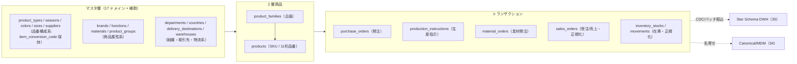
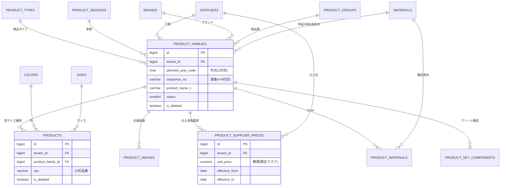
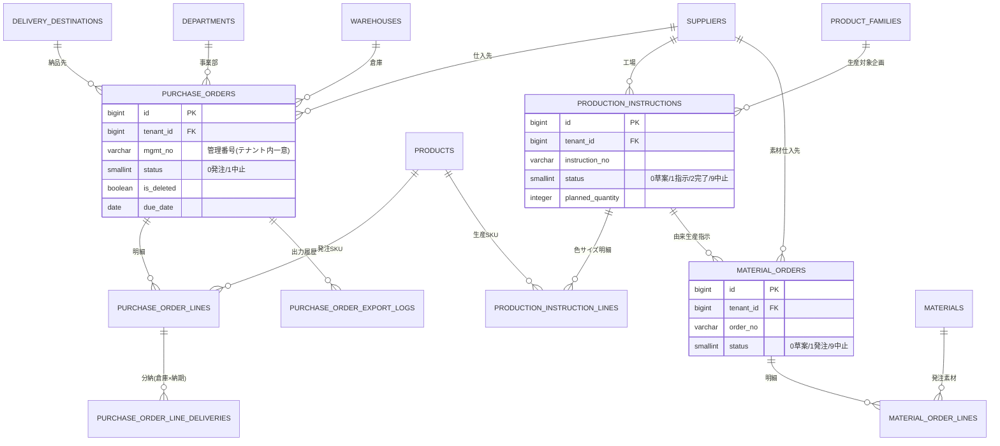
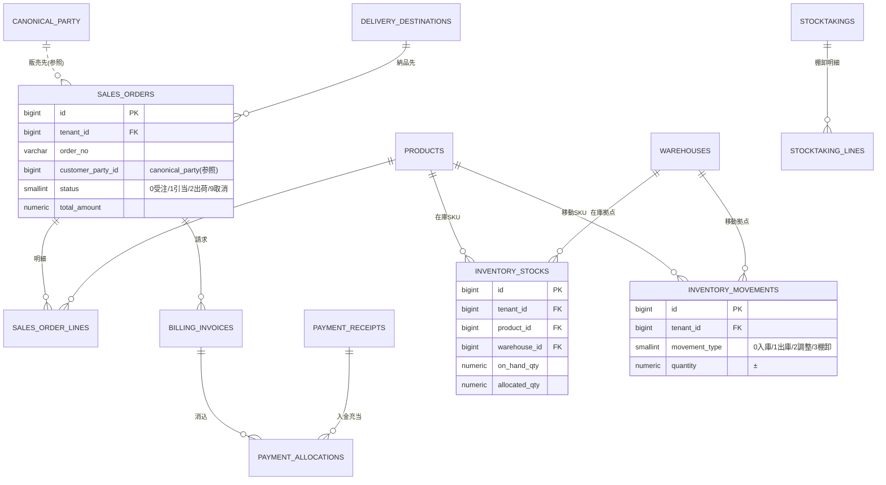
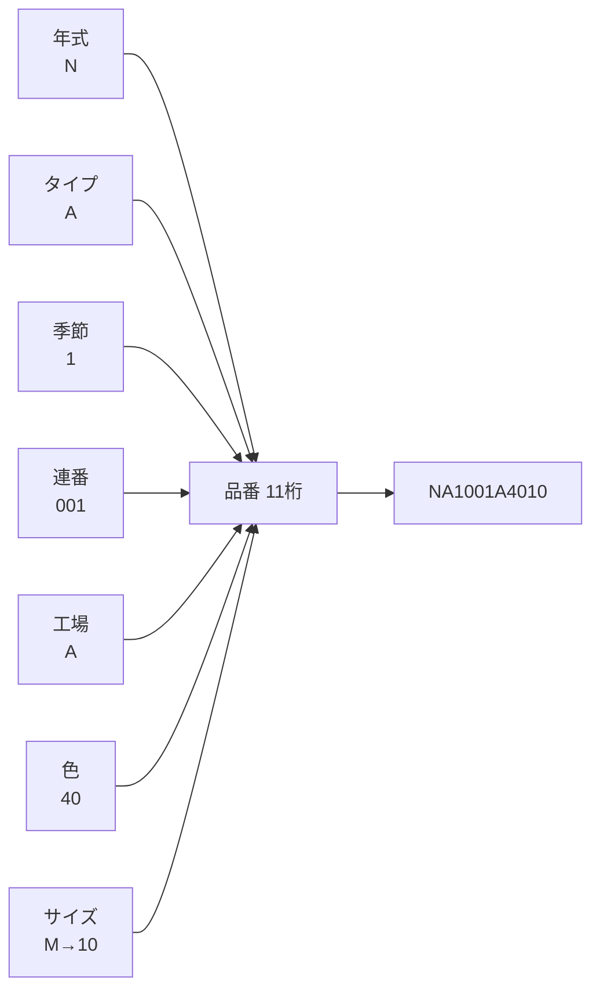
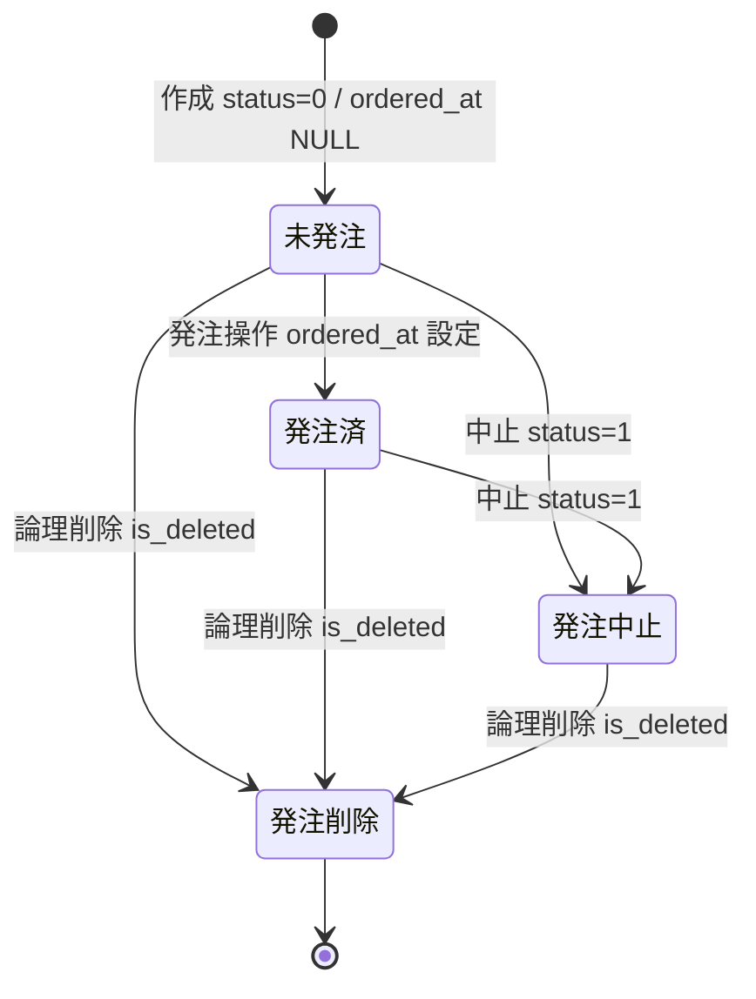
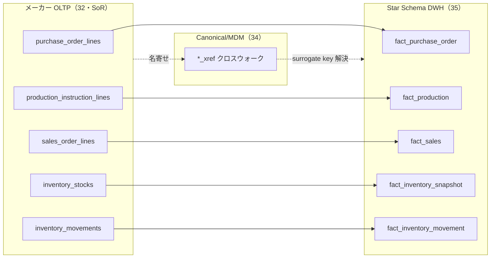

# DBスキーマ設計: メーカー OLTP

本ドキュメントは SCIP（Supply Chain Intelligence Platform）の**メーカー向けサービスの OLTP スキーマ**を権威的に定義する。リファレンス実装 **akebono-honshu**（履物メーカー Honshu の単一テナント実装 / .NET 8 + Nuxt 3 + RDS PostgreSQL 16）の実測 DDL を土台に、プラットフォーム化に必要な 3 大差分（`tenant_id` + RLS 導入 / TZ を `TIMESTAMPTZ` へ移行 / 一意性のテナントスコープ化）を適用し、さらに継承実装の販売/在庫プロトタイプ層（`07-ops-data`）を SMALLINT+CHECK・マスタ FK・canonical_party 参照へ正規化する。

> **本ドキュメントが権威的に所有する範囲（owns）:** メーカー OLTP の全業務テーブル — 2 層商品（`product_families`/`products`）、17 ドメインマスタ + 補助マスタ、価格・BOM、発注（`purchase_orders`(+lines/deliveries)）、生産指示（`production_instructions`(+lines)）、素材発注（`material_orders`(+lines)）、正規化した販売（`sales_orders`(+lines)/請求/入金/債権）・在庫（`inventory_stocks`/`inventory_movements`/棚卸）。
> **所有しない範囲（参照のみ）:** `tenant` / `app_user`（→ [37 コントロールプレーン](./37-control-plane-backoffice-schema.md)）、`canonical_party` / `canonical_product` / `region` 等の正準エンティティとクロスウォーク（→ [34 MDM/Canonical](./34-mdm-canonical-schema.md)）、`dim_*`/`fact_*`（→ [35 DWH](./35-star-schema-dwh.md)）、横断の命名/DDL 規約・RLS 雛形・移行方針（→ [30 スキーマ戦略と SoT](./30-schema-strategy-and-sot.md)）。これらは再定義せず FK 参照・リンク参照に留める。

本ドキュメントの DDL は [30 スキーマ戦略と SoT](./30-schema-strategy-and-sot.md) の命名・DDL 規約（§3）、マルチテナンシー物理設計（§4）、共通列テンプレート（§5）、キー戦略（§6）、移行方針（§8）に**全面的に従う**。横断規約と矛盾が生じた場合は 30 が優先する。

---

## 1. 位置づけとスコープ

継承実装は履物（フットウェア/スリッパ）メーカーの生産・受発注・販売・在庫管理システムであり、以下の構造を持つ。

- **2 層商品モデル**: 企画単位 `product_families`（11 桁品番の上位 9 桁を確定）→ SKU `products`（色 × サイズで増殖、`sku VARCHAR(11)`）。
- **18 マスタ**: 17 ドメインマスタ（`size`/`brand`/`supplier`/`color` 等） + 利用者マスタ。利用者マスタはプラットフォームでは Control Plane の `app_user`（37）へ昇格する（§4.4）。
- **トランザクション**: 発注（`purchase_orders`）、生産指示（`production_instructions`）、素材発注（`material_orders`）、BOM（`product_materials`）。
- **販売/在庫プロトタイプ層（`07-ops-data`）**: 自然キー + 日本語文字列ステータス（`'受注'`/`'出荷済'`）の軽量テーブル群。**プラットフォームではアンチパターンとして踏襲せず正規化する**（§9）。



---

## 2. 継承実装からの差分サマリ（移行ギャップ）

[30 §8.2](./30-schema-strategy-and-sot.md) が横断方針を確定する 3 大差分（M1〜M3）に加え、本ドキュメント固有の差分 M4（販売/在庫層の正規化）と M5（利用者マスタの Control Plane 昇格）を定義する。差分 DDL とデータ更新パッチの**所有は本ドキュメント**である（30 §8.2 の委譲どおり）。

| # | 差分 | 継承実装（Honshu 単一テナント） | プラットフォーム（マルチテナント） | 移行方式 |
|---|------|-------------------------------|--------------------------------|---------|
| M1 | tenant_id 導入 | 列が一切存在しない | 全テナントスコープテーブルに `tenant_id BIGINT NOT NULL REFERENCES tenant(id)` + RLS | 既存全行に既定テナント（Honshu=1）をバックフィル（§11.1） |
| M2 | 一意性のテナントスコープ化 | `UNIQUE(code)` / `products.sku UNIQUE` / `purchase_orders.mgmt_no UNIQUE` 等 | `UNIQUE(tenant_id, code)` 等へ再定義。先頭に `tenant_id` | 旧 UNIQUE を DROP → 新 UNIQUE を ADD（§11.1） |
| M3 | TZ 移行 | `TIMESTAMP`（JST-naive）+ `ALTER DATABASE ... timezone='Asia/Tokyo'` | `TIMESTAMPTZ`（UTC 保存 / テナントローカル表示） | `AT TIME ZONE 'Asia/Tokyo'` で UTC 化（§11.2） |
| M4 | 販売/在庫層の正規化 | 自然キー PK + 日本語 VARCHAR ステータス + 監査列なし（`07-ops-data`） | `id BIGSERIAL` + `SMALLINT+CHECK` ステータス + マスタ/canonical FK + 監査列 | プロトタイプは破棄し再設計（§9）。表示データは移行対象外 |
| M5 | 利用者マスタの昇格 | `users` テーブル（メーカー DB 内） | Control Plane `app_user`（37）へ集約。監査列 FK は `app_user(id)` を参照 | `users` → `app_user` へデータ移送。旧 FK を張り替え（§4.4） |

### 2.1 論理削除の慣習（継承維持 + 明示）

継承実装は 3 系統の論理削除慣習を持ち、プラットフォームでも**後方互換で維持**する（30 §5 が新規テーブルの標準を `is_deleted` と定めるが、32 は継承慣習を優先する例外として明記）。

| 対象 | 論理削除列 | 物理削除 | 根拠 |
|------|-----------|---------|------|
| マスタ（`suppliers`/`colors` 等 17 件） | `delete_flag BOOLEAN NOT NULL DEFAULT FALSE` | 禁止 | 過去取引が削除済みマスタを参照する状況を許容（[honshu-master-schema §3.3](../../../.ai-native/domain-context/industry/honshu-master-schema.md)） |
| トランザクション/親（`purchase_orders` 等） | `is_deleted BOOLEAN NOT NULL DEFAULT FALSE` | 禁止 | 発注状態の導出に使用（`is_deleted` > `status` > 導出） |
| 明細/子（`*_lines`/`*_deliveries`） | 持たない | `ON DELETE CASCADE` | 親に従属。親の全置換で明細を作り直す（BOM/色サイズ展開と同パターン） |

> **注意（原則 5 コードとドキュメントの一貫性）:** 継承実装の `product_families`/`products` は `is_deleted` を採用しており「マスタ=`delete_flag`」の一般則から外れる（商品はマスタではなくトランザクション性の企画エンティティのため）。本ドキュメントは実測に忠実に、商品 2 層・BOM は `is_deleted`、17 ドメインマスタは `delete_flag` とする。

---

## 3. ER 図

規模が大きいため 3 つのサブドメイン（商品・価格・BOM / 発注・生産 / 販売・在庫）に分割する。共通列（`tenant_id`/監査列/タイムスタンプ）は図では省略し、業務上の主要属性と関係のみ示す。`app_user`・`canonical_party` は外部参照（点線）。

### 3.1 商品・価格・BOM



### 3.2 発注・生産・素材発注



### 3.3 販売・在庫（正規化層）



---

## 4. マスタ層（18 マスタ）

### 4.1 マスタ台帳と所有

継承実装の 17 ドメインマスタ + 補助マスタ（為替レート）を本ドキュメントが所有する。**通貨マスタ（`currency`, ISO 4217）は [34 MDM/Canonical](./34-mdm-canonical-schema.md) が所有する正準エンティティであり、本ドキュメントでは再定義せず論理参照する**（ブリーフ §14 所有マップ・「共通エンティティは所有ドキュメントが定義し他は参照のみ」）。トランザクション各表の通貨は §9 規約どおり inline `currency_code CHAR(3) DEFAULT 'JPY'` で保持し、`currency` マスタへの物理 FK は張らない。利用者マスタは Control Plane（37）へ昇格し**本ドキュメントは参照のみ**（§4.4）。全マスタに `tenant_id` を付与し、`code` の一意性を `UNIQUE(tenant_id, code)` へスコープ化する（M1/M2）。

| # | テーブル | 役割 | 品番寄与 | 識別列 | 主要 FK |
|---|---------|------|---------|--------|---------|
| 1 | `sizes` | サイズ（大人 S/M/L・子供 110-160cm） | ○ 10-11 桁目 | `item_conversion_code` | — |
| 2 | `product_types` | 商品タイプ（吊込W底 婦人 等） | ○ 2 桁目 | `item_conversion_code(1)` / `size_demographic_code(1)` | — |
| 3 | `product_seasons` | 商品季節（通年/春夏/秋冬） | ○ 3 桁目 | `item_conversion_code(1)` / `conversion_order` | — |
| 4 | `colors` | 色（個別 + アソート） | ○ 8-9 桁目 | `item_conversion_code(2)` | — |
| 5 | `suppliers` | 仕入先（工場兼用・MVP 判断） | ○ 7 桁目 | `item_conversion_code(1)` / `supplier_type` / `alert_target` | `country_id` |
| 6 | `brands` | ブランド（現行/廃止ライセンス） | — | — | — |
| 7 | `functions` | 機能（静音/超軽量 等） | — | — | — |
| 8 | `materials` | 素材（甲皮/中底/底） | — | — | `material_classification_id` |
| 9 | `material_classifications` | 素材分類（化繊/天然 等） | — | — | — |
| 10 | `product_groups` | 商品群（商業ポジショニング） | — | `planning_fee` | — |
| 11 | `departments` | 事業部 | — | — | — |
| 12 | `countries` | 生産国 | — | — | — |
| 13 | `warehouses` | 倉庫コード（物流ノード） | — | — | — |
| 14 | `delivery_destinations` | 納品先（しまむらセンター 等） | — | `remark_1..3` | — |
| 15 | `document_template_purchases` | 発注書 定型本文 | — | — | — |
| 16 | `document_template_confirmations` | 確認表 定型本文 | — | `standard_print_flag` | — |
| 17 | `document_text_purchases` | 発注書 動的条項 | — | `standard_print_flag` | — |
| 補 | `exchange_rates` | 為替レート履歴（メーカー固有・§4.3.8） | — | `base_currency_code` / `quote_currency_code` | 34 canonical `currency` への論理参照（越境 FK なし） |
| ※ | ~~`users`~~ → `app_user`（37 所有） | 利用者/権限 | — | — | 参照のみ |

### 4.2 マスタ共通雛形（tenant_id + delete_flag 版）

継承実装のマスタは `code VARCHAR(3)` PK・`name`・`delete_flag` を基底 3 列とする。プラットフォームでは `id BIGSERIAL` を PK に、`code` は `UNIQUE(tenant_id, code)` へスコープ化する（30 §6 キー戦略: 自然キーは PK にしない）。以下は全ドメインマスタに共通する雛形。

```sql
-- マスタ共通雛形（例: brands。他の属性なしマスタも同型）
CREATE TABLE brands (
    id                  BIGSERIAL    PRIMARY KEY,                    -- 代理主キー
    tenant_id           BIGINT       NOT NULL REFERENCES tenant(id), -- テナント識別子（RLS対象・M1）
    code                VARCHAR(3)   NOT NULL,                       -- 業務コード 000-999（テナント内一意・M2）
    name                VARCHAR(255) NOT NULL,                       -- 名称
    delete_flag         BOOLEAN      NOT NULL DEFAULT FALSE,         -- 論理削除（マスタ慣習・物理削除禁止）
    created_at          TIMESTAMPTZ  NOT NULL DEFAULT now(),         -- 作成日時（UTC保存・M3）
    updated_at          TIMESTAMPTZ  NOT NULL DEFAULT now(),         -- 更新日時（UTC保存・M3）
    created_by_user_id  BIGINT       NULL REFERENCES app_user(id),  -- 作成者（37 app_user 参照・M5）
    updated_by_user_id  BIGINT       NULL REFERENCES app_user(id),  -- 更新者
    legacy_id           VARCHAR(64)  NULL,                           -- 移行元レコードID（来歴）
    CONSTRAINT uq_brands_tenant_code UNIQUE (tenant_id, code)        -- ★ 一意性はテナントスコープ（M2）
);
CREATE INDEX idx_brands_tenant_active ON brands (tenant_id) WHERE delete_flag = FALSE;

COMMENT ON COLUMN brands.tenant_id   IS 'テナント識別子。RLS により current_setting(app.tenant_id) と照合';
COMMENT ON COLUMN brands.code        IS '業務コード。ゼロパディング連番。テナント内で一意';
COMMENT ON COLUMN brands.delete_flag IS 'マスタ論理削除フラグ。過去取引の参照整合性保護のため物理削除は禁止';
```

同型のマスタ（`functions`, `departments`, `countries`, `warehouses`, `product_groups`, `material_classifications`, `document_template_purchases`, `document_template_confirmations`, `document_text_purchases`）は上記雛形に固有属性列を加えるのみ。`product_groups.planning_fee NUMERIC(12,2)`、`document_template_confirmations.standard_print_flag SMALLINT`、`document_text_purchases.standard_print_flag SMALLINT` を追加する。

### 4.3 固有属性を持つマスタの DDL

品番構成・FK・区分を持つマスタは全 DDL を示す。

```sql
-- 4.3.1 sizes — サイズマスタ（品番 10-11 桁目のソース）
CREATE TABLE sizes (
    id                    BIGSERIAL    PRIMARY KEY,
    tenant_id             BIGINT       NOT NULL REFERENCES tenant(id),
    code                  VARCHAR(3)   NOT NULL,                     -- ソート順を保つ戦略的採番
    name                  VARCHAR(255) NOT NULL,                     -- 例: 'M', '110cm'
    item_conversion_code  VARCHAR(8)   NULL,                         -- 品番変換コード（例 '110c', 'AS'）
    delete_flag           BOOLEAN      NOT NULL DEFAULT FALSE,
    created_at            TIMESTAMPTZ  NOT NULL DEFAULT now(),
    updated_at            TIMESTAMPTZ  NOT NULL DEFAULT now(),
    created_by_user_id    BIGINT       NULL REFERENCES app_user(id),
    updated_by_user_id    BIGINT       NULL REFERENCES app_user(id),
    legacy_id             VARCHAR(64)  NULL,
    CONSTRAINT uq_sizes_tenant_code UNIQUE (tenant_id, code)
);
CREATE INDEX idx_sizes_tenant_active ON sizes (tenant_id) WHERE delete_flag = FALSE;
COMMENT ON COLUMN sizes.item_conversion_code IS '品番変換コード。11桁品番の末尾2桁生成に使用';

-- 4.3.2 product_types — 商品タイプ（品番 2 桁目 + 性別識別）
CREATE TABLE product_types (
    id                    BIGSERIAL    PRIMARY KEY,
    tenant_id             BIGINT       NOT NULL REFERENCES tenant(id),
    code                  VARCHAR(3)   NOT NULL,
    name                  VARCHAR(255) NOT NULL,                     -- 例: '吊込W底 婦人'
    item_conversion_code  CHAR(1)      NULL,                         -- 構造文字（品番2桁目、例 'A'）
    size_demographic_code CHAR(1)      NULL,                         -- 'R'=婦人/'M'=紳士/'J'=子供
    delete_flag           BOOLEAN      NOT NULL DEFAULT FALSE,
    created_at            TIMESTAMPTZ  NOT NULL DEFAULT now(),
    updated_at            TIMESTAMPTZ  NOT NULL DEFAULT now(),
    created_by_user_id    BIGINT       NULL REFERENCES app_user(id),
    updated_by_user_id    BIGINT       NULL REFERENCES app_user(id),
    legacy_id             VARCHAR(64)  NULL,
    CONSTRAINT uq_product_types_tenant_code UNIQUE (tenant_id, code)
);
CREATE INDEX idx_product_types_tenant_active ON product_types (tenant_id) WHERE delete_flag = FALSE;

-- 4.3.3 product_seasons — 商品季節（品番 3 桁目）
CREATE TABLE product_seasons (
    id                    BIGSERIAL    PRIMARY KEY,
    tenant_id             BIGINT       NOT NULL REFERENCES tenant(id),
    code                  VARCHAR(3)   NOT NULL,
    name                  VARCHAR(255) NOT NULL,
    item_conversion_code  CHAR(1)      NULL,                         -- '1'=通年/'2'=春夏/'3'=秋冬 等
    conversion_order      VARCHAR(32)  NULL,                         -- 通年の複数コード対応（例 '1,6,7,8,9'）
    delete_flag           BOOLEAN      NOT NULL DEFAULT FALSE,
    created_at            TIMESTAMPTZ  NOT NULL DEFAULT now(),
    updated_at            TIMESTAMPTZ  NOT NULL DEFAULT now(),
    created_by_user_id    BIGINT       NULL REFERENCES app_user(id),
    updated_by_user_id    BIGINT       NULL REFERENCES app_user(id),
    legacy_id             VARCHAR(64)  NULL,
    CONSTRAINT uq_product_seasons_tenant_code UNIQUE (tenant_id, code)
);
CREATE INDEX idx_product_seasons_tenant_active ON product_seasons (tenant_id) WHERE delete_flag = FALSE;

-- 4.3.4 colors — 色マスタ（品番 8-9 桁目）
CREATE TABLE colors (
    id                    BIGSERIAL    PRIMARY KEY,
    tenant_id             BIGINT       NOT NULL REFERENCES tenant(id),
    code                  VARCHAR(3)   NOT NULL,
    name                  VARCHAR(255) NOT NULL,                     -- 個別色 + アソート
    item_conversion_code  VARCHAR(2)   NULL,                         -- 標準2桁識別子（品番8-9桁目）
    delete_flag           BOOLEAN      NOT NULL DEFAULT FALSE,
    created_at            TIMESTAMPTZ  NOT NULL DEFAULT now(),
    updated_at            TIMESTAMPTZ  NOT NULL DEFAULT now(),
    created_by_user_id    BIGINT       NULL REFERENCES app_user(id),
    updated_by_user_id    BIGINT       NULL REFERENCES app_user(id),
    legacy_id             VARCHAR(64)  NULL,
    CONSTRAINT uq_colors_tenant_code UNIQUE (tenant_id, code)
);
CREATE INDEX idx_colors_tenant_active ON colors (tenant_id) WHERE delete_flag = FALSE;

-- 4.3.5 suppliers — 仕入先マスタ（工場兼用・品番 7 桁目）
CREATE TABLE suppliers (
    id                    BIGSERIAL    PRIMARY KEY,
    tenant_id             BIGINT       NOT NULL REFERENCES tenant(id),
    code                  VARCHAR(3)   NOT NULL,
    name                  VARCHAR(255) NOT NULL,
    official_name         VARCHAR(255) NULL,                         -- 法的書面・調達書用の正式社名
    item_conversion_code  CHAR(1)      NULL,                         -- 工場コード（品番7桁目、例 'Z'）
    country_id            BIGINT       NULL REFERENCES countries(id),-- 生産国
    supplier_type         SMALLINT     NOT NULL DEFAULT 0,           -- 0=国内/1=海外・輸入
    alert_target          SMALLINT     NOT NULL DEFAULT 0,           -- 納期/品質リスク管理フラグ
    delete_flag           BOOLEAN      NOT NULL DEFAULT FALSE,
    created_at            TIMESTAMPTZ  NOT NULL DEFAULT now(),
    updated_at            TIMESTAMPTZ  NOT NULL DEFAULT now(),
    created_by_user_id    BIGINT       NULL REFERENCES app_user(id),
    updated_by_user_id    BIGINT       NULL REFERENCES app_user(id),
    legacy_id             VARCHAR(64)  NULL,
    CONSTRAINT uq_suppliers_tenant_code   UNIQUE (tenant_id, code),
    CONSTRAINT chk_suppliers_type         CHECK (supplier_type IN (0, 1)),
    CONSTRAINT chk_suppliers_alert_target CHECK (alert_target IN (0, 1))
);
CREATE INDEX idx_suppliers_tenant_active ON suppliers (tenant_id) WHERE delete_flag = FALSE;
COMMENT ON COLUMN suppliers.item_conversion_code IS '工場コード。11桁品番の7桁目。MVP では工場マスタを兼用';

-- 4.3.6 materials — 素材マスタ（分類 FK 保持）
CREATE TABLE materials (
    id                          BIGSERIAL    PRIMARY KEY,
    tenant_id                   BIGINT       NOT NULL REFERENCES tenant(id),
    code                        VARCHAR(3)   NOT NULL,
    name                        VARCHAR(255) NOT NULL,               -- 原料組成（例 '綿'）
    material_classification_id  BIGINT       NULL REFERENCES material_classifications(id),
    delete_flag                 BOOLEAN      NOT NULL DEFAULT FALSE,
    created_at                  TIMESTAMPTZ  NOT NULL DEFAULT now(),
    updated_at                  TIMESTAMPTZ  NOT NULL DEFAULT now(),
    created_by_user_id          BIGINT       NULL REFERENCES app_user(id),
    updated_by_user_id          BIGINT       NULL REFERENCES app_user(id),
    legacy_id                   VARCHAR(64)  NULL,
    CONSTRAINT uq_materials_tenant_code UNIQUE (tenant_id, code)
);
CREATE INDEX idx_materials_tenant_active ON materials (tenant_id) WHERE delete_flag = FALSE;

-- 4.3.7 delivery_destinations — 納品先マスタ
CREATE TABLE delivery_destinations (
    id                    BIGSERIAL    PRIMARY KEY,
    tenant_id             BIGINT       NOT NULL REFERENCES tenant(id),
    code                  VARCHAR(3)   NOT NULL,
    name                  VARCHAR(255) NOT NULL,                     -- 小売流通センター（例 'しまむらセンター'）
    remark_1              VARCHAR(255) NULL,                         -- 発送先住所
    remark_2              VARCHAR(255) NULL,                         -- 電話番号
    remark_3              VARCHAR(255) NULL,                         -- FAX 番号
    canonical_party_id    BIGINT       NULL,                         -- 名寄せ済 canonical_party への参照（34、越境 FK は張らない）
    delete_flag           BOOLEAN      NOT NULL DEFAULT FALSE,
    created_at            TIMESTAMPTZ  NOT NULL DEFAULT now(),
    updated_at            TIMESTAMPTZ  NOT NULL DEFAULT now(),
    created_by_user_id    BIGINT       NULL REFERENCES app_user(id),
    updated_by_user_id    BIGINT       NULL REFERENCES app_user(id),
    legacy_id             VARCHAR(64)  NULL,
    CONSTRAINT uq_delivery_destinations_tenant_code UNIQUE (tenant_id, code)
);
CREATE INDEX idx_delivery_destinations_tenant_active ON delivery_destinations (tenant_id) WHERE delete_flag = FALSE;
COMMENT ON COLUMN delivery_destinations.canonical_party_id IS '名寄せ済取引先（34 canonical_party.id）への論理参照。物理 FK は張らず party_xref で解決';
```

> **canonical への参照方針:** `canonical_party_id` は別スキーマ（Aurora 上の MDM）を指すため物理 FK を張れない。クロスウォーク `party_xref`（34 所有）で app-local id ⇄ canonical id を解決するのが正である。本列は「解決結果のキャッシュ」であり SoT は `party_xref`（30 SoT マップ準拠）。NULL は「未名寄せ」を意味する。

```sql
-- 4.3.8 exchange_rates — 為替レート履歴（メーカー固有）
-- 通貨マスタ（currency）は 34 MDM/Canonical が所有。本表は通貨を再定義せず、
-- 通貨コードは §9 の inline currency_code（ISO 4217）で保持し、canonical currency へは論理参照のみ張る。
CREATE TABLE exchange_rates (
    id                    BIGSERIAL     PRIMARY KEY,
    tenant_id             BIGINT        NOT NULL REFERENCES tenant(id),  -- M1（RLS 対象）
    base_currency_code    CHAR(3)       NOT NULL DEFAULT 'JPY',          -- 基軸通貨（ISO 4217、§9 inline。34 currency 論理参照）
    quote_currency_code   CHAR(3)       NOT NULL,                        -- 相手通貨（ISO 4217、§9 inline。34 currency 論理参照）
    rate                  NUMERIC(18,8) NOT NULL,                        -- 1 base = rate quote
    effective_from        DATE          NOT NULL,                        -- 有効開始日
    effective_to          DATE          NULL,                            -- NULL=現在有効
    delete_flag           BOOLEAN       NOT NULL DEFAULT FALSE,          -- マスタ論理削除（物理削除禁止）
    created_at            TIMESTAMPTZ   NOT NULL DEFAULT now(),          -- M3
    updated_at            TIMESTAMPTZ   NOT NULL DEFAULT now(),
    created_by_user_id    BIGINT        NULL REFERENCES app_user(id),
    updated_by_user_id    BIGINT        NULL REFERENCES app_user(id),
    legacy_id             VARCHAR(64)   NULL,
    CONSTRAINT chk_er_rate             CHECK (rate > 0),
    CONSTRAINT chk_er_effective_range  CHECK (effective_to IS NULL OR effective_to > effective_from),
    CONSTRAINT uq_er_tenant_pair_from  UNIQUE (tenant_id, base_currency_code, quote_currency_code, effective_from)
);
CREATE INDEX idx_er_tenant_current
    ON exchange_rates (tenant_id, base_currency_code, quote_currency_code, effective_from DESC)
    WHERE effective_to IS NULL AND delete_flag = FALSE;
COMMENT ON COLUMN exchange_rates.base_currency_code  IS '基軸通貨コード（ISO 4217）。通貨メタデータの正準定義は 34 MDM canonical currency が所有。本列は §9 inline 表現であり currency マスタへの物理 FK は張らない';
COMMENT ON COLUMN exchange_rates.quote_currency_code IS '相手通貨コード（ISO 4217）。34 canonical currency への論理参照。越境 FK は張らない';
```

> **通貨所有の是正:** 継承実装が持っていた `currencies` テーブル（ISO 4217 通貨マスタ）は、ブリーフ §14 の所有マップにより通貨（`currency`）・単位（`uom`）が [34 MDM/Canonical](./34-mdm-canonical-schema.md) の所有エンティティであるため、本ドキュメントでは**所有を主張せず削除**した。`exchange_rates` はメーカー固有の為替履歴として残すが、通貨識別は §9 の inline `currency_code`（ISO 4217）で表し、通貨の正準定義（表示名・小数桁・記号等）は 34 の canonical `currency` を論理参照する（物理 FK・越境参照は張らない）。トランザクション各表も従来どおり inline `currency_code CHAR(3) DEFAULT 'JPY'` を用い、`currencies` への FK は存在しない。

### 4.4 利用者マスタ → app_user 昇格（M5）

継承実装の `users` テーブル（`employee_no`/`login_id`/`display_name` + 4 権限カテゴリ）は、プラットフォームでは Control Plane の `app_user`（37 所有）へ集約する（ブリーフ §5「ユーザ業務情報/権限は RDS Control Plane が SoT」）。

- メーカー OLTP は `app_user` を**参照のみ**とし、監査列（`created_by_user_id`/`updated_by_user_id`）と発注担当者（`orderer_user_id` 等）で `REFERENCES app_user(id)` を張る。
- 継承実装の 4 権限カテゴリ（品番台帳管理 / 発注書作成 / 発注情報管理 / 工程実績管理）は、Control Plane の `role`/`permission`（37）へマッピングする。メーカー固有権限のコード体系は 37 と [05 メーカーサービス](../basic-design/05-service-manufacturer.md) で確定する。
- 移行: `users` 行を `app_user` へ移送（`employee_no`→ビジネスキー、`login_id`→Firebase Email 連携キー）。旧メーカー DB 内 `users` は移行後に廃止し、全 FK を `app_user(id)` へ張り替える。

---

## 5. 2 層商品モデルと 11 桁品番

### 5.1 product_families（商品企画）

11 桁品番の上位 9 桁を確定する企画単位。継承実装の全列を尊重し `tenant_id`・`TIMESTAMPTZ` 化・一意性のテナントスコープ化を適用する。

```sql
CREATE TABLE product_families (
    id                    BIGSERIAL     PRIMARY KEY,
    tenant_id             BIGINT        NOT NULL REFERENCES tenant(id),  -- M1
    planned_year_code     CHAR(1)       NOT NULL,                        -- 年式（品番1桁目）
    product_type_id       BIGINT        NOT NULL REFERENCES product_types(id),
    product_season_id     BIGINT        NOT NULL REFERENCES product_seasons(id),
    sequence_no           VARCHAR(3)    NOT NULL,                        -- 連番（品番4-6桁目）
    factory_supplier_id   BIGINT        NOT NULL REFERENCES suppliers(id),  -- 工場（品番7桁目）
    brand_id              BIGINT        NOT NULL REFERENCES brands(id),
    function_id           BIGINT        NULL     REFERENCES functions(id),
    product_group_id      BIGINT        NOT NULL REFERENCES product_groups(id),
    upper_material_id     BIGINT        NOT NULL REFERENCES materials(id),  -- 甲皮素材
    insole_material_id    BIGINT        NOT NULL REFERENCES materials(id),  -- 中底素材
    outsole_material_id   BIGINT        NOT NULL REFERENCES materials(id),  -- 底素材
    product_name_1        VARCHAR(255)  NOT NULL,
    product_name_2        VARCHAR(255)  NULL,
    -- 品番台帳の企画・原価属性（継承維持、全 NULL 許容 = 下位互換）
    product_year          SMALLINT      NULL,                            -- 商品年度（9999=通年）
    management_season_id  BIGINT        NULL REFERENCES product_seasons(id),
    planner_user_id       BIGINT        NULL REFERENCES app_user(id),    -- 企画者（M5）
    provisional_number    VARCHAR(64)   NULL,
    sample_approval_date  DATE          NULL,
    retail_price          NUMERIC(12,2) NULL,                            -- 小売価格
    delivery_price        NUMERIC(12,2) NULL,                            -- 納品価格
    planning_cost         NUMERIC(12,2) NULL,
    brand_cost            NUMERIC(12,2) NULL,
    royalty_target        SMALLINT      NULL,                            -- 版権対象 1=小売/2=納品価格
    royalty_rate          NUMERIC(5,2)  NULL,                            -- 版権料率(%)
    remark                TEXT          NULL,
    color_remark          TEXT          NULL,
    status                SMALLINT      NOT NULL DEFAULT 0,              -- 0=草案/1=有効/2=終了
    is_deleted            BOOLEAN       NOT NULL DEFAULT FALSE,          -- 企画は is_deleted（§2.1 注記）
    created_at            TIMESTAMPTZ   NOT NULL DEFAULT now(),          -- M3
    created_by_user_id    BIGINT        NULL REFERENCES app_user(id),
    updated_at            TIMESTAMPTZ   NOT NULL DEFAULT now(),
    updated_by_user_id    BIGINT        NULL REFERENCES app_user(id),
    legacy_id             VARCHAR(64)   NULL,
    CONSTRAINT chk_pf_planned_year_code CHECK (planned_year_code IN ('A','B','C','D','E','F','G','H','I','J','K','N','Z')),
    CONSTRAINT chk_pf_status            CHECK (status BETWEEN 0 AND 2),
    CONSTRAINT chk_pf_royalty_target    CHECK (royalty_target IS NULL OR royalty_target IN (1, 2)),
    -- ★ M2: 企画の自然キー一意性をテナントスコープへ
    CONSTRAINT uq_product_families_tenant_natural
        UNIQUE (tenant_id, planned_year_code, product_type_id, product_season_id, sequence_no, factory_supplier_id)
);
CREATE INDEX idx_pf_tenant_status  ON product_families (tenant_id, status) WHERE is_deleted = FALSE;
CREATE INDEX idx_pf_tenant_brand   ON product_families (tenant_id, brand_id);
CREATE INDEX idx_pf_tenant_factory ON product_families (tenant_id, factory_supplier_id);

COMMENT ON COLUMN product_families.planned_year_code IS '年式。11桁品番の1桁目。A-K/N/Z のコードロジックで表現（年式マスタは設けない）';
COMMENT ON COLUMN product_families.retail_price       IS '小売価格。機微度中。既定マスク・権限開示（ブリーフ §11）';
```

### 5.2 products（SKU / 11 桁品番）

```sql
CREATE TABLE products (
    id                    BIGSERIAL    PRIMARY KEY,
    tenant_id             BIGINT       NOT NULL REFERENCES tenant(id),
    product_family_id     BIGINT       NOT NULL REFERENCES product_families(id),
    color_id              BIGINT       NOT NULL REFERENCES colors(id),
    size_id               BIGINT       NOT NULL REFERENCES sizes(id),
    sku                   VARCHAR(11)  NOT NULL,                        -- 11桁品番（自然キー・PK にしない）
    canonical_sku_id      BIGINT       NULL,                            -- 名寄せ済 canonical_sku 参照（34、物理 FK なし）
    is_deleted            BOOLEAN      NOT NULL DEFAULT FALSE,
    created_at            TIMESTAMPTZ  NOT NULL DEFAULT now(),
    created_by_user_id    BIGINT       NULL REFERENCES app_user(id),
    updated_at            TIMESTAMPTZ  NOT NULL DEFAULT now(),
    updated_by_user_id    BIGINT       NULL REFERENCES app_user(id),
    legacy_id             VARCHAR(64)  NULL,
    -- ★ M2: sku / 色サイズ組合せの一意性をテナントスコープへ
    CONSTRAINT uq_products_tenant_sku          UNIQUE (tenant_id, sku),
    CONSTRAINT uq_products_tenant_family_color_size UNIQUE (tenant_id, product_family_id, color_id, size_id)
);
CREATE INDEX idx_products_tenant_family ON products (tenant_id, product_family_id);
CREATE INDEX idx_products_tenant_active ON products (tenant_id, sku) WHERE is_deleted = FALSE;

COMMENT ON COLUMN products.sku IS '11桁品番（SKU）。自然キー。PK は id、一意性は uq_products_tenant_sku で保証';
COMMENT ON COLUMN products.canonical_sku_id IS '名寄せ済 SKU（34 canonical_sku.id）への論理参照。SoT は sku_xref。NULL=未名寄せ';
```

### 5.3 11 桁品番の構成と採番

11 桁品番は 6 マスタ + 年式コードロジックから合成する。桁配置は継承実装の実測（[ブリーフ §15](../../../.ai-native/domain-context/industry/honshu-master-schema.md)）どおり。

| 桁 | 内容 | ソース列 |
|----|------|---------|
| 1 | 年式 | `product_families.planned_year_code`（コードロジック） |
| 2 | 商品タイプ（構造） | `product_types.item_conversion_code` |
| 3 | 季節 | `product_seasons.item_conversion_code` |
| 4-6 | 連番 | `product_families.sequence_no` |
| 7 | 工場 | `suppliers.item_conversion_code`（`factory_supplier_id` 経由） |
| 8-9 | 色 | `colors.item_conversion_code` |
| 10-11 | サイズ | `sizes.item_conversion_code` 由来 |



- **採番方針:** 上位 9 桁（1-9 桁目 + 連番）は `product_families` 登録時に確定。10-11 桁は `products`（色 × サイズ展開）生成時に `sizes.item_conversion_code` から合成。`sequence_no`（4-6 桁）は `(tenant_id, planned_year_code, product_type_id, product_season_id, factory_supplier_id)` の範囲内で採番する。採番の同時実行制御はアプリ層のアドバイザリロック or `SELECT ... FOR UPDATE` + 連番テーブルで担保（詳細は [05 メーカーサービス](../basic-design/05-service-manufacturer.md)）。
- **一意性:** 合成後の `sku` は `uq_products_tenant_sku` で担保。桁構成変更・再採番に耐えるため `sku` は PK にせず `id` を PK とする（30 §6）。

### 5.4 product_images（商品画像）

企画単位で最大 5 枚（企画/本番の区分ごと）。S3 オブジェクトを参照（SoT は S3、本テーブルはメタ）。

```sql
CREATE TABLE product_images (
    id                    BIGSERIAL    PRIMARY KEY,
    tenant_id             BIGINT       NOT NULL REFERENCES tenant(id),
    product_family_id     BIGINT       NOT NULL REFERENCES product_families(id),
    image_category        SMALLINT     NOT NULL DEFAULT 0,             -- 0=企画/1=本番
    s3_key                VARCHAR(512) NOT NULL,                       -- S3 オブジェクトキー（SoT=S3）
    thumb_s3_key          VARCHAR(512) NULL,
    order_no              SMALLINT     NOT NULL,                       -- 表示順 1-5
    mime_type             VARCHAR(64)  NOT NULL,
    file_size_bytes       INTEGER      NOT NULL,
    width_px              INTEGER      NULL,
    height_px             INTEGER      NULL,
    original_filename     VARCHAR(255) NULL,
    is_deleted            BOOLEAN      NOT NULL DEFAULT FALSE,
    created_at            TIMESTAMPTZ  NOT NULL DEFAULT now(),
    created_by_user_id    BIGINT       NULL REFERENCES app_user(id),
    updated_at            TIMESTAMPTZ  NOT NULL DEFAULT now(),
    updated_by_user_id    BIGINT       NULL REFERENCES app_user(id),
    CONSTRAINT chk_pi_order_no       CHECK (order_no BETWEEN 1 AND 5),
    CONSTRAINT chk_pi_image_category CHECK (image_category IN (0, 1)),
    CONSTRAINT chk_pi_file_size      CHECK (file_size_bytes <= 5242880)
);
CREATE UNIQUE INDEX uq_pi_tenant_family_category_order
    ON product_images (tenant_id, product_family_id, image_category, order_no) WHERE is_deleted = FALSE;
```

---

## 6. 価格・BOM

### 6.1 product_supplier_prices（マルチ仕入先単価・履歴）

アイテム（企画）単位・サイズ別の仕入単価履歴。**仕入単価は機微値**であり既定マスク + 権限開示 + 監査（ブリーフ §11）。有効日レンジで履歴管理（BR-04）。

```sql
CREATE TABLE product_supplier_prices (
    id                     BIGSERIAL     PRIMARY KEY,
    tenant_id              BIGINT        NOT NULL REFERENCES tenant(id),
    product_family_id      BIGINT        NOT NULL REFERENCES product_families(id),
    supplier_id            BIGINT        NOT NULL REFERENCES suppliers(id),
    size_id                BIGINT        NULL     REFERENCES sizes(id),   -- NULL=全サイズ共通の既定単価
    unit_price             NUMERIC(12,2) NOT NULL,                        -- 機微値。既定マスク
    currency_code          CHAR(3)       NOT NULL DEFAULT 'JPY',
    exchange_rate          NUMERIC(10,4) NULL,
    estimate_unit_price    NUMERIC(12,2) NULL,                            -- 見積単価
    estimate_received_date DATE          NULL,
    estimate_cost          NUMERIC(12,2) NULL,
    estimate_margin_rate   NUMERIC(5,2)  NULL,
    purchase_cost          NUMERIC(12,2) NULL,
    purchase_margin_rate   NUMERIC(5,2)  NULL,
    loss_cost              NUMERIC(12,2) NULL,
    drayage_cost           NUMERIC(12,2) NULL,                            -- ドレー代
    tax_rate               NUMERIC(5,2)  NULL,
    effective_from         DATE          NOT NULL,
    effective_to           DATE          NULL,                            -- NULL=現在有効
    decided_at             DATE          NOT NULL,
    is_deleted             BOOLEAN       NOT NULL DEFAULT FALSE,
    created_at             TIMESTAMPTZ   NOT NULL DEFAULT now(),
    created_by_user_id     BIGINT        NULL REFERENCES app_user(id),
    updated_at             TIMESTAMPTZ   NOT NULL DEFAULT now(),
    updated_by_user_id     BIGINT        NULL REFERENCES app_user(id),
    CONSTRAINT chk_psp_unit_price      CHECK (unit_price > 0),
    CONSTRAINT chk_psp_effective_range CHECK (effective_to IS NULL OR effective_to > effective_from)
);
-- size_id=NULL 既定行どうしの一意性を保つため COALESCE 式インデックス（移植性重視。継承実装踏襲）
CREATE UNIQUE INDEX uq_psp_tenant_family_supplier_size_from
    ON product_supplier_prices (tenant_id, product_family_id, supplier_id, COALESCE(size_id, -1), effective_from)
    WHERE is_deleted = FALSE;
CREATE INDEX idx_psp_tenant_current
    ON product_supplier_prices (tenant_id, product_family_id, supplier_id, COALESCE(size_id, -1), effective_from DESC)
    WHERE effective_to IS NULL AND is_deleted = FALSE;

COMMENT ON COLUMN product_supplier_prices.unit_price IS '仕入単価。機微値。API 既定マスク・明示フラグ+権限+監査で開示（ブリーフ §11）';
```

### 6.2 product_materials（BOM / 素材構成）

1 足あたり所要量の SoT。`product_families.upper/insole/outsole_material_id`（表示用の疎結合 FK）とは独立し、BOM 側が所要量の権威。

```sql
CREATE TABLE product_materials (
    id                      BIGSERIAL     PRIMARY KEY,
    tenant_id               BIGINT        NOT NULL REFERENCES tenant(id),
    product_family_id       BIGINT        NOT NULL REFERENCES product_families(id),
    material_role           SMALLINT      NOT NULL,                      -- 0甲皮/1中底/2底/3付属/4副資材
    material_id             BIGINT        NOT NULL REFERENCES materials(id),
    required_qty_per_unit   NUMERIC(12,4) NOT NULL,                      -- 1足あたり所要量
    unit                    VARCHAR(8)    NOT NULL,                      -- 足/組/枚/個/m/㎡/cm/本
    recommended_supplier_id BIGINT        NULL REFERENCES suppliers(id),
    loss_rate               NUMERIC(5,4)  NOT NULL DEFAULT 0,            -- 0以上1未満
    remark                  VARCHAR(255)  NULL,
    is_deleted              BOOLEAN       NOT NULL DEFAULT FALSE,
    created_at              TIMESTAMPTZ   NOT NULL DEFAULT now(),
    created_by_user_id      BIGINT        NULL REFERENCES app_user(id),
    updated_at              TIMESTAMPTZ   NOT NULL DEFAULT now(),
    updated_by_user_id      BIGINT        NULL REFERENCES app_user(id),
    CONSTRAINT chk_pm_role CHECK (material_role BETWEEN 0 AND 4),
    CONSTRAINT chk_pm_qty  CHECK (required_qty_per_unit > 0),
    CONSTRAINT chk_pm_loss CHECK (loss_rate >= 0 AND loss_rate < 1)
);
CREATE UNIQUE INDEX uq_pm_tenant_family_role_material
    ON product_materials (tenant_id, product_family_id, material_role, material_id) WHERE is_deleted = FALSE;
CREATE INDEX idx_pm_tenant_family ON product_materials (tenant_id, product_family_id) WHERE is_deleted = FALSE;
```

`product_set_components`（アソート/セット構成明細）は継承実装どおり `product_family_id` に `ON DELETE CASCADE`、`child_item_number VARCHAR(32)`（手入力テキスト、FK なし）、`quantity`、`line_no` を持つ。`tenant_id` を付与し `UNIQUE` は持たない（全置換コレクション）。

---

## 7. 発注（purchase_orders）

### 7.1 purchase_orders（発注書ヘッダ）

継承実装の全列を尊重（帳票手入力項目・国内/海外項目・連絡文書 6 行・出力履歴タイムスタンプ）。`status` は 2 値（0=発注/1=中止）、`is_deleted` と併せた導出モデルを維持。

```sql
CREATE TABLE purchase_orders (
    id                              BIGSERIAL    PRIMARY KEY,
    tenant_id                       BIGINT       NOT NULL REFERENCES tenant(id),
    mgmt_no                         VARCHAR(16)  NOT NULL,                    -- 管理番号（テナント内一意・M2）
    order_no                        VARCHAR(16)  NULL,                        -- 発注番号（帳票手入力）
    order_date                      DATE         NULL,
    shipping_instruction_no         VARCHAR(32)  NULL,
    status                          SMALLINT     NOT NULL DEFAULT 0,          -- 0=発注/1=中止
    cancelled_at                    TIMESTAMPTZ  NULL,
    cancelled_by_user_id            BIGINT       NULL REFERENCES app_user(id),
    cancel_reason                   VARCHAR(255) NULL,
    ordered_at                      TIMESTAMPTZ  NULL,                        -- 発注済（明示設定）
    ordered_by_user_id              BIGINT       NULL REFERENCES app_user(id),
    delivered_at                    TIMESTAMPTZ  NULL,
    delivered_by_user_id            BIGINT       NULL REFERENCES app_user(id),
    is_deleted                      BOOLEAN      NOT NULL DEFAULT FALSE,      -- 発注削除（導出最優先）
    deleted_at                      TIMESTAMPTZ  NULL,
    deleted_by_user_id              BIGINT       NULL REFERENCES app_user(id),
    supplier_id                     BIGINT       NOT NULL REFERENCES suppliers(id),
    supplier_official_name_snapshot VARCHAR(255) NULL,                        -- 発注時点凍結
    supplier_code_snapshot          VARCHAR(3)   NULL,
    delivery_destination_id         BIGINT       NOT NULL REFERENCES delivery_destinations(id),
    customer_name_snapshot          VARCHAR(255) NULL,
    department_id                   BIGINT       NOT NULL REFERENCES departments(id),
    warehouse_id                    BIGINT       NOT NULL REFERENCES warehouses(id),
    due_date                        DATE         NOT NULL,
    orderer_user_id                 BIGINT       NOT NULL REFERENCES app_user(id),
    sub_orderer_1_user_id           BIGINT       NULL REFERENCES app_user(id),
    sub_orderer_2_user_id           BIGINT       NULL REFERENCES app_user(id),
    sub_orderer_3_user_id           BIGINT       NULL REFERENCES app_user(id),
    sub_orderer_4_user_id           BIGINT       NULL REFERENCES app_user(id),
    sub_orderer_5_user_id           BIGINT       NULL REFERENCES app_user(id),
    sub_orderer_6_user_id           BIGINT       NULL REFERENCES app_user(id),
    manager_user_id                 BIGINT       NOT NULL REFERENCES app_user(id),
    is_overseas                     BOOLEAN      NOT NULL DEFAULT FALSE,      -- 発注区分（国内/海外）
    landing_place                   VARCHAR(128) NULL,
    customer_ref                    VARCHAR(128) NULL,
    factory_shipping_date           DATE         NULL,
    delivery_place_shipping_date    DATE         NULL,
    overseas_departure_date         DATE         NULL,
    warehouse2_id                   BIGINT       NULL REFERENCES warehouses(id),
    warehouse3_id                   BIGINT       NULL REFERENCES warehouses(id),
    communication_text              TEXT         NULL,                        -- 旧連絡文書（後方互換フォールバック）
    communication_line_1            TEXT         NULL,                        -- 連絡文書 01-06 行（構造化 SoT）
    communication_line_2            TEXT         NULL,
    communication_line_3            TEXT         NULL,
    communication_line_4            TEXT         NULL,
    communication_line_5            TEXT         NULL,
    communication_line_6            TEXT         NULL,
    first_exported_at               TIMESTAMPTZ  NULL,
    last_exported_at                TIMESTAMPTZ  NULL,
    created_at                      TIMESTAMPTZ  NOT NULL DEFAULT now(),
    created_by_user_id              BIGINT       NULL REFERENCES app_user(id),
    updated_at                      TIMESTAMPTZ  NOT NULL DEFAULT now(),
    updated_by_user_id              BIGINT       NULL REFERENCES app_user(id),
    legacy_id                       VARCHAR(64)  NULL,
    CONSTRAINT chk_po_status              CHECK (status IN (0, 1)),
    CONSTRAINT chk_po_last_after_first    CHECK (last_exported_at IS NULL OR first_exported_at IS NOT NULL),
    CONSTRAINT chk_po_cancelled_consistency CHECK ((status = 1) = (cancelled_at IS NOT NULL)),
    CONSTRAINT chk_po_deleted_consistency   CHECK (is_deleted = (deleted_at IS NOT NULL)),
    CONSTRAINT uq_po_tenant_mgmt_no       UNIQUE (tenant_id, mgmt_no)         -- M2
);
CREATE UNIQUE INDEX uq_po_tenant_order_no ON purchase_orders (tenant_id, order_no) WHERE order_no IS NOT NULL;
CREATE INDEX idx_po_tenant_status   ON purchase_orders (tenant_id, status, due_date);
CREATE INDEX idx_po_tenant_supplier ON purchase_orders (tenant_id, supplier_id);
CREATE INDEX idx_po_tenant_dates    ON purchase_orders (tenant_id, created_at DESC);
CREATE INDEX idx_po_tenant_not_deleted ON purchase_orders (tenant_id, created_at DESC) WHERE is_deleted = FALSE;

COMMENT ON COLUMN purchase_orders.status IS '発注状態。導出優先: is_deleted(削除) > status=1(中止) > ordered_at(発注済) > 未発注';
```

**発注状態の導出（状態遷移）:**



### 7.2 purchase_order_lines / deliveries / export_logs

明細は発注時点スナップショット（`sku`/`name`/`unit_price`/`currency`）を凍結。`subtotal` は `GENERATED ALWAYS AS STORED`。明細は論理削除を持たず親に `ON DELETE CASCADE`。

```sql
CREATE TABLE purchase_order_lines (
    id                          BIGSERIAL     PRIMARY KEY,
    tenant_id                   BIGINT        NOT NULL REFERENCES tenant(id),
    purchase_order_id           BIGINT        NOT NULL REFERENCES purchase_orders(id) ON DELETE CASCADE,
    line_no                     SMALLINT      NOT NULL,
    product_id                  BIGINT        NOT NULL REFERENCES products(id),
    sku_snapshot                VARCHAR(11)   NOT NULL,
    product_name_snapshot       VARCHAR(255)  NOT NULL,
    quantity                    INTEGER       NOT NULL,
    unit_price_snapshot         NUMERIC(12,2) NOT NULL,
    currency_code_snapshot      CHAR(3)       NOT NULL,
    pack_quantity               INTEGER       NULL,
    estimate_unit_price         NUMERIC(12,2) NULL,
    provisional_number_snapshot VARCHAR(64)   NULL,
    remark                      TEXT          NULL,
    subtotal                    NUMERIC(14,2) GENERATED ALWAYS AS (quantity * unit_price_snapshot) STORED,
    created_at                  TIMESTAMPTZ   NOT NULL DEFAULT now(),
    created_by_user_id          BIGINT        NULL REFERENCES app_user(id),
    updated_at                  TIMESTAMPTZ   NOT NULL DEFAULT now(),
    updated_by_user_id          BIGINT        NULL REFERENCES app_user(id),
    CONSTRAINT chk_pol_quantity   CHECK (quantity > 0),
    CONSTRAINT chk_pol_unit_price CHECK (unit_price_snapshot >= 0),
    CONSTRAINT uq_pol_order_line  UNIQUE (purchase_order_id, line_no)
);
CREATE INDEX idx_pol_tenant_order   ON purchase_order_lines (tenant_id, purchase_order_id);
CREATE INDEX idx_pol_tenant_product ON purchase_order_lines (tenant_id, product_id);

-- 分納×倉庫の多次元明細（分納 0 件=単一明細で後方互換）
CREATE TABLE purchase_order_line_deliveries (
    id                       BIGSERIAL    PRIMARY KEY,
    tenant_id                BIGINT       NOT NULL REFERENCES tenant(id),
    purchase_order_line_id   BIGINT       NOT NULL REFERENCES purchase_order_lines(id) ON DELETE CASCADE,
    warehouse_id             BIGINT       NULL REFERENCES warehouses(id),
    delivery_date            DATE         NULL,
    quantity                 INTEGER      NOT NULL,
    pack_quantity            INTEGER      NULL,
    seq                      SMALLINT     NOT NULL DEFAULT 1,
    created_at               TIMESTAMPTZ  NOT NULL DEFAULT now(),
    created_by_user_id       BIGINT       NULL REFERENCES app_user(id),
    updated_at               TIMESTAMPTZ  NOT NULL DEFAULT now(),
    updated_by_user_id       BIGINT       NULL REFERENCES app_user(id),
    CONSTRAINT chk_pold_quantity CHECK (quantity > 0)
);
CREATE INDEX idx_pold_tenant_line ON purchase_order_line_deliveries (tenant_id, purchase_order_line_id);

-- Excel 出力履歴（監査用。記録系のため tenant_id は付与、監査 FK は保持）
CREATE TABLE purchase_order_export_logs (
    id                     BIGSERIAL    PRIMARY KEY,
    tenant_id              BIGINT       NOT NULL REFERENCES tenant(id),
    purchase_order_id      BIGINT       NOT NULL REFERENCES purchase_orders(id),
    exported_at            TIMESTAMPTZ  NOT NULL DEFAULT now(),
    exported_by_user_id    BIGINT       NULL REFERENCES app_user(id),
    is_first_export        BOOLEAN      NOT NULL,
    excel_template_version VARCHAR(16)  NOT NULL
);
CREATE INDEX idx_poel_tenant_order_at ON purchase_order_export_logs (tenant_id, purchase_order_id, exported_at DESC);
```

> **記録系の状態保護（原則 2）:** `purchase_order_export_logs` は append-only の記録系。マイグレーションや再同期で巻き戻さない。

---

## 8. 生産・素材発注

### 8.1 production_instructions / lines（生産指示書）

```sql
CREATE TABLE production_instructions (
    id                             BIGSERIAL    PRIMARY KEY,
    tenant_id                      BIGINT       NOT NULL REFERENCES tenant(id),
    instruction_no                 VARCHAR(16)  NOT NULL,                 -- テナント内一意（M2）
    product_family_id              BIGINT       NOT NULL REFERENCES product_families(id),
    factory_supplier_id            BIGINT       NOT NULL REFERENCES suppliers(id),
    planned_quantity               INTEGER      NOT NULL,
    due_date                       DATE         NOT NULL,
    status                         SMALLINT     NOT NULL DEFAULT 0,       -- 0草案/1指示/2完了/9中止
    instructed_at                  TIMESTAMPTZ  NULL,
    completed_at                   TIMESTAMPTZ  NULL,
    cancelled_at                   TIMESTAMPTZ  NULL,
    cancelled_by_user_id           BIGINT       NULL REFERENCES app_user(id),
    cancel_reason                  VARCHAR(255) NULL,
    factory_official_name_snapshot VARCHAR(255) NULL,
    factory_code_snapshot          VARCHAR(3)   NULL,
    product_sku9_snapshot          VARCHAR(9)   NULL,                     -- 上位9桁スナップショット
    product_name_snapshot          VARCHAR(255) NULL,
    communication_text             TEXT         NULL,
    first_exported_at              TIMESTAMPTZ  NULL,
    last_exported_at               TIMESTAMPTZ  NULL,
    is_deleted                     BOOLEAN      NOT NULL DEFAULT FALSE,
    created_at                     TIMESTAMPTZ  NOT NULL DEFAULT now(),
    created_by_user_id             BIGINT       NULL REFERENCES app_user(id),
    updated_at                     TIMESTAMPTZ  NOT NULL DEFAULT now(),
    updated_by_user_id             BIGINT       NULL REFERENCES app_user(id),
    legacy_id                      VARCHAR(64)  NULL,
    CONSTRAINT chk_pin_status           CHECK (status IN (0, 1, 2, 9)),
    CONSTRAINT chk_pin_qty              CHECK (planned_quantity > 0),
    CONSTRAINT chk_pin_last_after_first CHECK (last_exported_at IS NULL OR first_exported_at IS NOT NULL),
    CONSTRAINT chk_pin_cancelled        CHECK ((status = 9) = (cancelled_at IS NOT NULL)),
    CONSTRAINT uq_pin_tenant_instruction_no UNIQUE (tenant_id, instruction_no)
);
CREATE INDEX idx_pin_tenant_family  ON production_instructions (tenant_id, product_family_id);
CREATE INDEX idx_pin_tenant_factory ON production_instructions (tenant_id, factory_supplier_id);
CREATE INDEX idx_pin_tenant_status  ON production_instructions (tenant_id, status, due_date);
CREATE INDEX idx_pin_tenant_active  ON production_instructions (tenant_id, product_family_id)
    WHERE status IN (1, 2) AND is_deleted = FALSE;

CREATE TABLE production_instruction_lines (
    id                          BIGSERIAL    PRIMARY KEY,
    tenant_id                   BIGINT       NOT NULL REFERENCES tenant(id),
    production_instruction_id   BIGINT       NOT NULL REFERENCES production_instructions(id) ON DELETE CASCADE,
    line_no                     SMALLINT     NOT NULL,
    product_id                  BIGINT       NOT NULL REFERENCES products(id),
    sku_snapshot                VARCHAR(11)  NOT NULL,
    product_name_snapshot       VARCHAR(255) NOT NULL,
    quantity                    INTEGER      NOT NULL,
    created_at                  TIMESTAMPTZ  NOT NULL DEFAULT now(),
    created_by_user_id          BIGINT       NULL REFERENCES app_user(id),
    updated_at                  TIMESTAMPTZ  NOT NULL DEFAULT now(),
    updated_by_user_id          BIGINT       NULL REFERENCES app_user(id),
    CONSTRAINT chk_pinl_qty              CHECK (quantity > 0),
    CONSTRAINT uq_pinl_instruction_line    UNIQUE (production_instruction_id, line_no),
    CONSTRAINT uq_pinl_instruction_product UNIQUE (production_instruction_id, product_id)
);
CREATE INDEX idx_pinl_tenant_instruction ON production_instruction_lines (tenant_id, production_instruction_id);
CREATE INDEX idx_pinl_tenant_product     ON production_instruction_lines (tenant_id, product_id);
```

> **命名注記:** 継承実装は `production_instructions` の制約に `chk_pi_*` を使うが、本ドキュメントでは `product_images` の `chk_pi_*` と衝突しないよう生産指示側を `chk_pin_*` / `idx_pin_*` に改める（30 §3.1 命名規約: `chk_<table>_<rule>`）。移行時に旧制約名を張り替える。

### 8.2 material_orders / lines（素材発注書）

```sql
CREATE TABLE material_orders (
    id                              BIGSERIAL    PRIMARY KEY,
    tenant_id                       BIGINT       NOT NULL REFERENCES tenant(id),
    order_no                        VARCHAR(16)  NOT NULL,                 -- テナント内一意（M2）
    material_supplier_id            BIGINT       NOT NULL REFERENCES suppliers(id),
    production_instruction_id       BIGINT       NULL REFERENCES production_instructions(id),
    due_date                        DATE         NOT NULL,
    status                          SMALLINT     NOT NULL DEFAULT 0,       -- 0草案/1発注/9中止
    instructed_at                   TIMESTAMPTZ  NULL,
    cancelled_at                    TIMESTAMPTZ  NULL,
    cancelled_by_user_id            BIGINT       NULL REFERENCES app_user(id),
    cancel_reason                   VARCHAR(255) NULL,
    supplier_official_name_snapshot VARCHAR(255) NULL,
    supplier_code_snapshot          VARCHAR(3)   NULL,
    communication_text              TEXT         NULL,
    first_exported_at               TIMESTAMPTZ  NULL,
    last_exported_at                TIMESTAMPTZ  NULL,
    is_deleted                      BOOLEAN      NOT NULL DEFAULT FALSE,
    created_at                      TIMESTAMPTZ  NOT NULL DEFAULT now(),
    created_by_user_id              BIGINT       NULL REFERENCES app_user(id),
    updated_at                      TIMESTAMPTZ  NOT NULL DEFAULT now(),
    updated_by_user_id              BIGINT       NULL REFERENCES app_user(id),
    legacy_id                       VARCHAR(64)  NULL,
    CONSTRAINT chk_mo_status           CHECK (status IN (0, 1, 9)),
    CONSTRAINT chk_mo_last_after_first CHECK (last_exported_at IS NULL OR first_exported_at IS NOT NULL),
    CONSTRAINT chk_mo_cancelled        CHECK ((status = 9) = (cancelled_at IS NOT NULL)),
    CONSTRAINT uq_mo_tenant_order_no   UNIQUE (tenant_id, order_no)
);
CREATE INDEX idx_mo_tenant_supplier    ON material_orders (tenant_id, material_supplier_id);
CREATE INDEX idx_mo_tenant_instruction ON material_orders (tenant_id, production_instruction_id) WHERE production_instruction_id IS NOT NULL;
CREATE INDEX idx_mo_tenant_status      ON material_orders (tenant_id, status, due_date);

CREATE TABLE material_order_lines (
    id                     BIGSERIAL     PRIMARY KEY,
    tenant_id              BIGINT        NOT NULL REFERENCES tenant(id),
    material_order_id      BIGINT        NOT NULL REFERENCES material_orders(id) ON DELETE CASCADE,
    line_no                SMALLINT      NOT NULL,
    material_id            BIGINT        NOT NULL REFERENCES materials(id),
    material_name_snapshot VARCHAR(255)  NOT NULL,
    product_family_id      BIGINT        NULL REFERENCES product_families(id),          -- 由来品番（ロールアップ）
    source_pi_line_id      BIGINT        NULL REFERENCES production_instruction_lines(id),
    required_quantity      NUMERIC(14,4) NOT NULL,
    unit                   VARCHAR(8)    NOT NULL,
    unit_price             NUMERIC(12,2) NULL,                            -- 機微値（仕入単価と同等保護）
    currency_code          CHAR(3)       NOT NULL DEFAULT 'JPY',
    subtotal               NUMERIC(16,2) GENERATED ALWAYS AS (required_quantity * COALESCE(unit_price, 0)) STORED,
    created_at             TIMESTAMPTZ   NOT NULL DEFAULT now(),
    created_by_user_id     BIGINT        NULL REFERENCES app_user(id),
    updated_at             TIMESTAMPTZ   NOT NULL DEFAULT now(),
    updated_by_user_id     BIGINT        NULL REFERENCES app_user(id),
    CONSTRAINT chk_mol_qty       CHECK (required_quantity > 0),
    CONSTRAINT chk_mol_price     CHECK (unit_price IS NULL OR unit_price >= 0),
    CONSTRAINT uq_mol_order_line UNIQUE (material_order_id, line_no)
);
CREATE INDEX idx_mol_tenant_order    ON material_order_lines (tenant_id, material_order_id);
CREATE INDEX idx_mol_tenant_material ON material_order_lines (tenant_id, material_id);
CREATE INDEX idx_mol_tenant_family   ON material_order_lines (tenant_id, product_family_id) WHERE product_family_id IS NOT NULL;
```

---

## 9. 販売・在庫（正規化層 / M4）

継承実装の `07-ops-data` は自然キー PK + 日本語 VARCHAR ステータス + 監査列なしの**表示用プロトタイプ**である。ブリーフ §9/§15 の指針に従い、プラットフォームでは以下の正規化を施して再設計する（プロトタイプの表示データは移行対象外）。

| プロトタイプ（07） | 正規化後 | 主な変更 |
|------------------|---------|---------|
| `sales_orders`（`customer_name`, `status '受注'`） | `sales_orders`(+`sales_order_lines`) | `customer_party_id`→canonical_party 参照、`status SMALLINT+CHECK`、明細分離、`total_amount` は明細ロールアップ |
| `billing_invoices` | `billing_invoices` | `sales_order_id` FK、`status SMALLINT+CHECK` |
| `payment_receipts` | `payment_receipts` + `payment_allocations` | 入金と請求の消込を明細化（多対多） |
| `accounts_receivable` | ビュー or 派生テーブル | 請求−入金から導出（SoT は請求/入金） |
| `inbound_records`/`outbound_records`/`stock_adjustments` | `inventory_movements`（`movement_type SMALLINT`） | 統合。`product_id`/`warehouse_id` FK、`quantity ±` |
| （在庫残高） | `inventory_stocks`（SKU×拠点スナップショット） | 移動から集計。on_hand/allocated/available |
| `stocktaking_adjustments` | `stocktakings`(+`stocktaking_lines`) | ヘッダ/明細分離、`diff` は GENERATED |

### 9.1 sales_orders / lines（受注・売上）

```sql
CREATE TABLE sales_orders (
    id                      BIGSERIAL     PRIMARY KEY,
    tenant_id               BIGINT        NOT NULL REFERENCES tenant(id),
    order_no                VARCHAR(16)   NOT NULL,                        -- テナント内一意（M2）
    customer_party_id       BIGINT        NULL,                            -- 販売先（34 canonical_party 論理参照。SoT=party_xref）
    delivery_destination_id BIGINT        NULL REFERENCES delivery_destinations(id),  -- 納品先（ローカルマスタ）
    customer_name_snapshot  VARCHAR(255)  NOT NULL,                        -- 受注時点の販売先名（凍結）
    order_date              DATE          NOT NULL,
    status                  SMALLINT      NOT NULL DEFAULT 0,              -- 0受注/1引当/2出荷/9取消
    total_amount            NUMERIC(14,2) NOT NULL DEFAULT 0,             -- 明細 subtotal のロールアップ
    currency_code           CHAR(3)       NOT NULL DEFAULT 'JPY',
    is_deleted              BOOLEAN       NOT NULL DEFAULT FALSE,
    created_at              TIMESTAMPTZ   NOT NULL DEFAULT now(),
    created_by_user_id      BIGINT        NULL REFERENCES app_user(id),
    updated_at              TIMESTAMPTZ   NOT NULL DEFAULT now(),
    updated_by_user_id      BIGINT        NULL REFERENCES app_user(id),
    legacy_id               VARCHAR(64)   NULL,
    CONSTRAINT chk_so_status       CHECK (status IN (0, 1, 2, 9)),
    CONSTRAINT chk_so_total        CHECK (total_amount >= 0),
    CONSTRAINT uq_so_tenant_order_no UNIQUE (tenant_id, order_no)
);
CREATE INDEX idx_so_tenant_status   ON sales_orders (tenant_id, status, order_date);
CREATE INDEX idx_so_tenant_customer ON sales_orders (tenant_id, customer_party_id) WHERE customer_party_id IS NOT NULL;

COMMENT ON COLUMN sales_orders.status IS '受注状態。0=受注/1=引当済/2=出荷済/9=取消。旧プロトタイプの日本語 VARCHAR を正規化';
COMMENT ON COLUMN sales_orders.customer_party_id IS '販売先。34 canonical_party への論理参照。SoT は party_xref、NULL=未名寄せ';

CREATE TABLE sales_order_lines (
    id                     BIGSERIAL     PRIMARY KEY,
    tenant_id              BIGINT        NOT NULL REFERENCES tenant(id),
    sales_order_id         BIGINT        NOT NULL REFERENCES sales_orders(id) ON DELETE CASCADE,
    line_no                SMALLINT      NOT NULL,
    product_id             BIGINT        NOT NULL REFERENCES products(id),
    sku_snapshot           VARCHAR(11)   NOT NULL,
    product_name_snapshot  VARCHAR(255)  NOT NULL,
    quantity               INTEGER       NOT NULL,
    unit_price             NUMERIC(12,2) NOT NULL,
    currency_code          CHAR(3)       NOT NULL DEFAULT 'JPY',
    subtotal               NUMERIC(14,2) GENERATED ALWAYS AS (quantity * unit_price) STORED,
    created_at             TIMESTAMPTZ   NOT NULL DEFAULT now(),
    created_by_user_id     BIGINT        NULL REFERENCES app_user(id),
    updated_at             TIMESTAMPTZ   NOT NULL DEFAULT now(),
    updated_by_user_id     BIGINT        NULL REFERENCES app_user(id),
    CONSTRAINT chk_sol_quantity   CHECK (quantity > 0),
    CONSTRAINT chk_sol_unit_price CHECK (unit_price >= 0),
    CONSTRAINT uq_sol_order_line  UNIQUE (sales_order_id, line_no)
);
CREATE INDEX idx_sol_tenant_order   ON sales_order_lines (tenant_id, sales_order_id);
CREATE INDEX idx_sol_tenant_product ON sales_order_lines (tenant_id, product_id);
```

### 9.2 請求・入金・消込

```sql
CREATE TABLE billing_invoices (
    id                 BIGSERIAL     PRIMARY KEY,
    tenant_id          BIGINT        NOT NULL REFERENCES tenant(id),
    invoice_no         VARCHAR(16)   NOT NULL,
    sales_order_id     BIGINT        NULL REFERENCES sales_orders(id),   -- 元受注（複数受注束ね時は NULL + 明細で表現）
    customer_party_id  BIGINT        NULL,                                -- 34 参照
    customer_name_snapshot VARCHAR(255) NOT NULL,
    invoice_date       DATE          NOT NULL,
    invoice_amount     NUMERIC(14,2) NOT NULL DEFAULT 0,
    due_date           DATE          NOT NULL,                            -- 入金予定日
    status             SMALLINT      NOT NULL DEFAULT 0,                  -- 0発行待/1請求済/2一部入金/3入金済
    currency_code      CHAR(3)       NOT NULL DEFAULT 'JPY',
    is_deleted         BOOLEAN       NOT NULL DEFAULT FALSE,
    created_at         TIMESTAMPTZ   NOT NULL DEFAULT now(),
    created_by_user_id BIGINT        NULL REFERENCES app_user(id),
    updated_at         TIMESTAMPTZ   NOT NULL DEFAULT now(),
    updated_by_user_id BIGINT        NULL REFERENCES app_user(id),
    legacy_id          VARCHAR(64)   NULL,
    CONSTRAINT chk_bi_status         CHECK (status IN (0, 1, 2, 3)),
    CONSTRAINT uq_bi_tenant_invoice_no UNIQUE (tenant_id, invoice_no)
);
CREATE INDEX idx_bi_tenant_status ON billing_invoices (tenant_id, status, due_date);

CREATE TABLE payment_receipts (
    id                 BIGSERIAL     PRIMARY KEY,
    tenant_id          BIGINT        NOT NULL REFERENCES tenant(id),
    payment_no         VARCHAR(16)   NOT NULL,
    customer_party_id  BIGINT        NULL,
    customer_name_snapshot VARCHAR(255) NOT NULL,
    payment_date       DATE          NOT NULL,
    payment_amount     NUMERIC(14,2) NOT NULL DEFAULT 0,
    method             SMALLINT      NOT NULL,                            -- 0銀行振込/1手形/2相殺/9その他
    status             SMALLINT      NOT NULL DEFAULT 0,                  -- 0未消込/1一部消込/2消込済
    is_deleted         BOOLEAN       NOT NULL DEFAULT FALSE,
    created_at         TIMESTAMPTZ   NOT NULL DEFAULT now(),
    created_by_user_id BIGINT        NULL REFERENCES app_user(id),
    updated_at         TIMESTAMPTZ   NOT NULL DEFAULT now(),
    updated_by_user_id BIGINT        NULL REFERENCES app_user(id),
    CONSTRAINT chk_pr_method CHECK (method IN (0, 1, 2, 9)),
    CONSTRAINT chk_pr_status CHECK (status IN (0, 1, 2)),
    CONSTRAINT uq_pr_tenant_payment_no UNIQUE (tenant_id, payment_no)
);
CREATE INDEX idx_pr_tenant_status ON payment_receipts (tenant_id, status, payment_date);

-- 消込（入金 × 請求の多対多充当）
CREATE TABLE payment_allocations (
    id                  BIGSERIAL     PRIMARY KEY,
    tenant_id           BIGINT        NOT NULL REFERENCES tenant(id),
    payment_receipt_id  BIGINT        NOT NULL REFERENCES payment_receipts(id) ON DELETE CASCADE,
    billing_invoice_id  BIGINT        NOT NULL REFERENCES billing_invoices(id),
    allocated_amount    NUMERIC(14,2) NOT NULL,
    created_at          TIMESTAMPTZ   NOT NULL DEFAULT now(),
    created_by_user_id  BIGINT        NULL REFERENCES app_user(id),
    updated_at          TIMESTAMPTZ   NOT NULL DEFAULT now(),
    updated_by_user_id  BIGINT        NULL REFERENCES app_user(id),
    CONSTRAINT chk_pa_amount CHECK (allocated_amount > 0),
    CONSTRAINT uq_pa_tenant_payment_invoice UNIQUE (tenant_id, payment_receipt_id, billing_invoice_id)
);
CREATE INDEX idx_pa_tenant_invoice ON payment_allocations (tenant_id, billing_invoice_id);
```

> **売掛債権（accounts_receivable）:** プロトタイプは独立テーブルだったが、正規化後は「請求残高 − 消込充当」から導出可能なため**派生ビュー**とする（SoT は `billing_invoices`/`payment_allocations`）。滞留日数の高速集計が必要になれば周期スナップショットの派生テーブル `ar_snapshots` を別途設ける（DWH `fact_sales`/請求ファクトへの写像で代替も可）。SoT から復元可能なため OLTP には残高を持たない（30 SoT マップ準拠）。

### 9.3 在庫（スナップショット + 移動）

在庫は「スナップショット（SKU × 拠点の現在残高）」と「移動（入出庫/調整イベント）」の二面で持つ。移動が事実、スナップショットは移動から集計される派生（同一 OLTP 内の整合キャッシュ）。

```sql
-- SKU × 倉庫の在庫残高（スナップショット。移動から集計される整合キャッシュ）
CREATE TABLE inventory_stocks (
    id                 BIGSERIAL     PRIMARY KEY,
    tenant_id          BIGINT        NOT NULL REFERENCES tenant(id),
    product_id         BIGINT        NOT NULL REFERENCES products(id),
    warehouse_id       BIGINT        NOT NULL REFERENCES warehouses(id),
    on_hand_qty        NUMERIC(14,4) NOT NULL DEFAULT 0,                 -- 実在庫
    allocated_qty      NUMERIC(14,4) NOT NULL DEFAULT 0,                 -- 引当済
    available_qty      NUMERIC(14,4) GENERATED ALWAYS AS (on_hand_qty - allocated_qty) STORED,  -- 有効在庫
    last_movement_at   TIMESTAMPTZ   NULL,
    created_at         TIMESTAMPTZ   NOT NULL DEFAULT now(),
    updated_at         TIMESTAMPTZ   NOT NULL DEFAULT now(),
    created_by_user_id BIGINT        NULL REFERENCES app_user(id),
    updated_by_user_id BIGINT        NULL REFERENCES app_user(id),
    CONSTRAINT chk_is_on_hand   CHECK (on_hand_qty >= 0),
    CONSTRAINT chk_is_allocated CHECK (allocated_qty >= 0),
    CONSTRAINT uq_is_tenant_product_warehouse UNIQUE (tenant_id, product_id, warehouse_id)
);
CREATE INDEX idx_is_tenant_warehouse ON inventory_stocks (tenant_id, warehouse_id);

-- 入出庫・調整・棚卸の統合移動イベント（トランザクションファクトの源泉）
CREATE TABLE inventory_movements (
    id                 BIGSERIAL     PRIMARY KEY,
    tenant_id          BIGINT        NOT NULL REFERENCES tenant(id),
    movement_no        VARCHAR(20)   NOT NULL,
    movement_type      SMALLINT      NOT NULL,                           -- 0入庫/1出庫/2在庫調整/3棚卸調整
    product_id         BIGINT        NOT NULL REFERENCES products(id),
    warehouse_id       BIGINT        NOT NULL REFERENCES warehouses(id),
    quantity           NUMERIC(14,4) NOT NULL,                           -- 符号付（+入 / -出）
    reason             VARCHAR(128)  NULL,                               -- 調整理由（不良品廃棄 等）
    ref_source_type    SMALLINT      NULL,                               -- 由来 0発注/1生産/2受注/3手動
    ref_source_id      BIGINT        NULL,                               -- 由来トランザクション id（同 OLTP 内）
    occurred_at        TIMESTAMPTZ   NOT NULL DEFAULT now(),
    created_at         TIMESTAMPTZ   NOT NULL DEFAULT now(),
    created_by_user_id BIGINT        NULL REFERENCES app_user(id),
    updated_at         TIMESTAMPTZ   NOT NULL DEFAULT now(),
    updated_by_user_id BIGINT        NULL REFERENCES app_user(id),
    CONSTRAINT chk_im_type       CHECK (movement_type IN (0, 1, 2, 3)),
    CONSTRAINT chk_im_qty_nonzero CHECK (quantity <> 0),
    CONSTRAINT uq_im_tenant_movement_no UNIQUE (tenant_id, movement_no)
);
CREATE INDEX idx_im_tenant_product   ON inventory_movements (tenant_id, product_id, occurred_at DESC);
CREATE INDEX idx_im_tenant_warehouse ON inventory_movements (tenant_id, warehouse_id, occurred_at DESC);
CREATE INDEX idx_im_tenant_type      ON inventory_movements (tenant_id, movement_type, occurred_at DESC);

COMMENT ON COLUMN inventory_movements.quantity IS '在庫増減。符号付。入庫は正、出庫は負。inventory_stocks.on_hand_qty はこの集計';
```

> **データフロー整合性（原則 6）:** 在庫の SoT は `inventory_movements`（イベント）。`inventory_stocks` は移動書込に後追いで更新する整合キャッシュ。書込順序は「移動 INSERT → 残高 UPSERT」を同一トランザクションで行い、逆順にしない。残高の再計算パス（移動からの全再集計バッチ）を回復手段として必ず用意する。

### 9.4 棚卸

```sql
CREATE TABLE stocktakings (
    id                 BIGSERIAL    PRIMARY KEY,
    tenant_id          BIGINT       NOT NULL REFERENCES tenant(id),
    stocktaking_no     VARCHAR(20)  NOT NULL,
    warehouse_id       BIGINT       NOT NULL REFERENCES warehouses(id),
    counted_date       DATE         NOT NULL,
    status             SMALLINT     NOT NULL DEFAULT 0,                  -- 0実施中/1確定/9中止
    is_deleted         BOOLEAN      NOT NULL DEFAULT FALSE,
    created_at         TIMESTAMPTZ  NOT NULL DEFAULT now(),
    created_by_user_id BIGINT       NULL REFERENCES app_user(id),
    updated_at         TIMESTAMPTZ  NOT NULL DEFAULT now(),
    updated_by_user_id BIGINT       NULL REFERENCES app_user(id),
    CONSTRAINT chk_st_status CHECK (status IN (0, 1, 9)),
    CONSTRAINT uq_st_tenant_no UNIQUE (tenant_id, stocktaking_no)
);
CREATE INDEX idx_st_tenant_warehouse ON stocktakings (tenant_id, warehouse_id, counted_date DESC);

CREATE TABLE stocktaking_lines (
    id                 BIGSERIAL    PRIMARY KEY,
    tenant_id          BIGINT       NOT NULL REFERENCES tenant(id),
    stocktaking_id     BIGINT       NOT NULL REFERENCES stocktakings(id) ON DELETE CASCADE,
    line_no            SMALLINT     NOT NULL,
    product_id         BIGINT       NOT NULL REFERENCES products(id),
    book_qty           NUMERIC(14,4) NOT NULL,                           -- 帳簿在庫
    actual_qty         NUMERIC(14,4) NOT NULL,                           -- 実地在庫
    diff               NUMERIC(14,4) GENERATED ALWAYS AS (actual_qty - book_qty) STORED,
    created_at         TIMESTAMPTZ  NOT NULL DEFAULT now(),
    created_by_user_id BIGINT       NULL REFERENCES app_user(id),
    updated_at         TIMESTAMPTZ  NOT NULL DEFAULT now(),
    updated_by_user_id BIGINT       NULL REFERENCES app_user(id),
    CONSTRAINT uq_stl_stocktaking_line UNIQUE (stocktaking_id, line_no)
);
CREATE INDEX idx_stl_tenant_product ON stocktaking_lines (tenant_id, product_id);
```

棚卸確定時、`diff <> 0` の各明細から `inventory_movements`（`movement_type=3`）を生成し在庫残高に反映する（`stocktaking_adjustments` プロトタイプの正規化）。

---

## 10. RLS・共通列の適用方針

全テナントスコープテーブル（本ドキュメントの全 OWNS テーブル）に、30 §4.2 の RLS ポリシーと §5.1 の `updated_at` トリガを一律適用する。**個別再定義せず 30 の雛形を機械適用**する（DRY / 原則 3）。

```sql
-- 全テナントスコープテーブルに適用（例。テーブル名を差し替えて全件に展開）
ALTER TABLE products ENABLE ROW LEVEL SECURITY;
ALTER TABLE products FORCE ROW LEVEL SECURITY;
CREATE POLICY tenant_isolation ON products
    USING      (tenant_id = current_setting('app.tenant_id')::bigint)
    WITH CHECK (tenant_id = current_setting('app.tenant_id')::bigint);

CREATE TRIGGER trg_products_set_updated_at
    BEFORE UPDATE ON products
    FOR EACH ROW EXECUTE FUNCTION set_updated_at();   -- 30 §5.1 の共通関数
```

適用対象一覧（RLS + updated_at トリガ + tenant_id FK）:

| 区分 | テーブル |
|------|---------|
| マスタ（17 + 補助 1） | `sizes` `product_types` `product_seasons` `colors` `suppliers` `brands` `functions` `materials` `material_classifications` `product_groups` `departments` `countries` `warehouses` `delivery_destinations` `document_template_purchases` `document_template_confirmations` `document_text_purchases` `exchange_rates` |
| 商品・価格・BOM | `product_families` `products` `product_images` `product_supplier_prices` `product_materials` `product_set_components` |
| 発注 | `purchase_orders` `purchase_order_lines` `purchase_order_line_deliveries` `purchase_order_export_logs` |
| 生産・素材 | `production_instructions` `production_instruction_lines` `material_orders` `material_order_lines` |
| 販売・在庫 | `sales_orders` `sales_order_lines` `billing_invoices` `payment_receipts` `payment_allocations` `inventory_stocks` `inventory_movements` `stocktakings` `stocktaking_lines` |

> **明細テーブルの tenant_id 冗長性:** 明細（`*_lines`）は親経由でテナントが一意に定まるが、RLS を各テーブルで独立評価させるため `tenant_id` を明細にも持たせる（非正規化だが RLS 性能とフェイルクローズのため許容）。アプリは明細 INSERT 時に親と同一 `tenant_id` を設定し、`WITH CHECK` で越境を防ぐ。

---

## 11. 移行パッチ（M1〜M3 の具体手順）

30 §8.3/§8.4 の横断手順を、本ドキュメントの全テーブルへ適用する。ここでは代表テーブルの完全なパッチを示し、残りは同型で機械展開する。オペレーターへの説明と実行はメンテナンスウィンドウで行う（原則 7）。

### 11.1 tenant_id 導入 + 一意性スコープ化（M1/M2）

```sql
-- 代表: products（他テーブルも同型。既定テナント Honshu=1）
-- 1) NULL 許容で列追加（既存行を壊さない = 下位互換）
ALTER TABLE products ADD COLUMN tenant_id BIGINT;
-- 2) 既定テナントでバックフィル
UPDATE products SET tenant_id = 1 WHERE tenant_id IS NULL;
-- 3) NOT NULL + FK 確定
ALTER TABLE products ALTER COLUMN tenant_id SET NOT NULL;
ALTER TABLE products ADD CONSTRAINT fk_products_tenant FOREIGN KEY (tenant_id) REFERENCES tenant(id);
-- 4) 旧 UNIQUE をテナントスコープへ差し替え（M2）
ALTER TABLE products DROP CONSTRAINT IF EXISTS products_sku_key;           -- 継承実装の暗黙 UNIQUE
DROP INDEX IF EXISTS idx_products_search;
ALTER TABLE products ADD CONSTRAINT uq_products_tenant_sku UNIQUE (tenant_id, sku);
CREATE INDEX idx_products_tenant_active ON products (tenant_id, sku) WHERE is_deleted = FALSE;
-- 5) RLS 有効化（§10）
ALTER TABLE products ENABLE ROW LEVEL SECURITY;
ALTER TABLE products FORCE ROW LEVEL SECURITY;
CREATE POLICY tenant_isolation ON products
    USING (tenant_id = current_setting('app.tenant_id')::bigint)
    WITH CHECK (tenant_id = current_setting('app.tenant_id')::bigint);
```

> **監査列 FK の張り替え（M5）:** 同一パッチ内で `created_by_user_id` 等の参照先を旧 `users(id)` から `app_user(id)` へ変更する（`users` → `app_user` データ移送後）。旧 FK を DROP → 新 FK を ADD。

### 11.2 TZ 移行（M3）

```sql
-- JST-naive TIMESTAMP を UTC 保存の TIMESTAMPTZ へ（表示上の JST は不変）
ALTER TABLE products
    ALTER COLUMN created_at TYPE TIMESTAMPTZ USING created_at AT TIME ZONE 'Asia/Tokyo',
    ALTER COLUMN updated_at TYPE TIMESTAMPTZ USING updated_at AT TIME ZONE 'Asia/Tokyo';
-- 発注等のイベント時刻列（ordered_at/cancelled_at/first_exported_at 等）も同様に変換
```

- `AT TIME ZONE 'Asia/Tokyo'` はナイーブ値を JST として解釈し UTC 内部値へ変換するため、表示上の JST 時刻は保存される（原則 7 データ保護）。
- 移行前後で代表行の JST 表示が一致することを検証（不一致は CMN-006 / 後述 MFG-901 でロールバック）。
- 継承実装の `ALTER DATABASE ... timezone='Asia/Tokyo'` はプラットフォームでは撤廃し、接続はテナントローカル TZ を表示層で適用する。ロールバック手順（`TIMESTAMPTZ` → `TIMESTAMP AT TIME ZONE 'Asia/Tokyo'`）を移行手順書に添付する。

### 11.3 マイグレーションの冪等性・状態保護

- DDL は EF Core 8 前方専用マイグレーションで管理（`__EFMigrationsHistory`）。適用済みは再実行しない（原則 2）。
- 記録系（`purchase_order_export_logs`・`inventory_movements`・`audit_logs`）はマイグレーションで巻き戻さない。設定系（マスタ既定値）のみ upsert。
- RLS ポリシー/トリガは `DROP ... IF EXISTS` → `CREATE` で冪等化。

---

## 12. スタースキーマ写像

メーカー OLTP の各トランザクションを DWH（35 所有）の fact/dim へ写像する。**dim/fact は本ドキュメントで再定義せず**、写像元と結合キー、conformed dimension の対応のみ定義する（取込・変換の詳細は [22 スタースキーマ変換](../detailed-design/22-star-schema-transformation.md)）。

| DWH fact（35 所有） | 写像元（32 OLTP） | 粒度 | 主 measures | 主 dim 結合 |
|--------------------|------------------|------|-------------|------------|
| `fact_purchase_order` | `purchase_order_lines`（+ `purchase_orders`） | 発注明細 × 日付 | `quantity`, `subtotal`, `unit_price_snapshot` | dim_product, dim_supplier, dim_date, dim_location(warehouse) |
| `fact_production` | `production_instruction_lines`（+ `production_instructions`） | 生産指示明細 × 日付 | `quantity`, `planned_quantity` | dim_product, dim_supplier(factory), dim_date |
| `fact_sales` | `sales_order_lines`（+ `sales_orders`） | SKU × 販売先 × 日付 | `quantity`, `subtotal`(gross), `unit_price` | dim_product, dim_customer, dim_date, dim_channel |
| `fact_inventory_snapshot` | `inventory_stocks`（周期スナップショット） | SKU × 拠点 × 日付 | `on_hand_qty`, `allocated_qty`, `available_qty` | dim_product, dim_location, dim_date |
| `fact_inventory_movement` | `inventory_movements` | 移動イベント | `quantity`(±) | dim_product, dim_location, dim_date |

| DWH dim（35 所有） | 写像元（32 OLTP） | 名寄せ | SCD |
|-------------------|------------------|--------|-----|
| `dim_product` | `products` + `product_families` + 属性マスタ | `canonical_sku_id`（sku_xref, 34） | Type2 |
| `dim_supplier` | `suppliers` | `canonical_party_id`（party_xref, 34） | Type2 |
| `dim_customer` | `sales_orders.customer_party_id` / `delivery_destinations` | `canonical_party`（34） | Type2 |
| `dim_location` | `warehouses` | `canonical_location`（34） | Type2 |
| `dim_date` | 事前生成 | — | Type1 |



> **設計意図（ブリーフ §2）:** 自社アプリはスタースキーマ連携前提で設計する。上記 OLTP テーブルは fact 粒度（明細 × 日付）へ素直に写像できる構造とし、`*_snapshot` 列で歴史的属性を凍結、`canonical_*_id` で conformed dimension の surrogate key 解決を容易にする（差別化源泉=連携難易度の低さ）。

---

## 13. 想定エラーコード

継承実装のメーカー系接頭辞（`PROD`/`ORDER`/`MASTER`/`PRICE`/`BOM`/`PINST`/`MORD`）を尊重する。販売/在庫（`SALES`/`INV`）と移行（`MFG`）の 3 接頭辞は本ドキュメントで独自増設せず、**プラットフォーム共通のエラーコードレジストリ（ブリーフ §10）へメーカー系拡張として正式登録したうえで使用する**。登録元・SoT は [30 スキーマ戦略と SoT](./30-schema-strategy-and-sot.md) §9（継承メーカー系接頭辞の拡張定義を所有）であり、本節はそこに登録済みの接頭辞を参照して逆引き一覧を提供する（レジストリ未登録の接頭辞を各ドキュメントが独自に増設しない）。テナント越境等の横断エラーは `CMN`（30 §9 所有）を参照。

> **接頭辞レジストリ整合（原則 5・6）:** `SALES`（受注/売上）・`INV`（在庫）・`MFG`（メーカー移行バッチ）は、既存の `ORDER`（発注）／`CMN`（横断）とドメインが重複しないメーカー固有領域として 30 §9 とブリーフ §10 のレジストリへ双方向に登録する。30 側にこの 3 接頭辞が追加されるまで本節のコードは暫定であり、登録完了をもって確定とする（未登録のまま運用しない）。

| コード | 事象 | 契機 | 対処 |
|--------|------|------|------|
| MASTER-001 | マスタコード一意制約違反（`UNIQUE(tenant_id, code)`） | マスタ登録/更新 | 重複コードを提示し再入力（CMN-003 の具体化） |
| MASTER-002 | 削除済みマスタ参照（`delete_flag=TRUE` を新規トランザクションで選択） | 発注/生産登録 | 有効マスタのみ選択肢に出す。既存参照は維持 |
| PROD-001 | 11 桁品番採番衝突（`uq_products_tenant_sku`） | SKU 展開 | 採番ロック競合。リトライ or 連番再取得 |
| PROD-002 | 企画自然キー重複（`uq_product_families_tenant_natural`） | 企画登録 | 年式/タイプ/季節/連番/工場の重複を提示 |
| PRICE-001 | 有効日レンジ矛盾（`effective_to <= effective_from`） | 仕入単価登録 | 日付整合を促す |
| PRICE-002 | 機微値（仕入単価）を権限なしで開示要求 | 価格参照 API | 403 + 監査ログ（ブリーフ §11） |
| BOM-001 | 所要量が 0 以下 / ロス率が範囲外 | BOM 登録 | 値域チェック提示 |
| ORDER-001 | 発注管理番号重複（`uq_po_tenant_mgmt_no`） | 発注作成 | 管理番号採番をリトライ |
| ORDER-002 | 発注状態遷移の不整合（中止/削除の consistency 違反） | 発注更新 | 状態導出ルールに従い補正 |
| PINST-001 | 生産指示番号重複 / 明細 SKU 重複 | 生産指示登録 | 一意制約提示 |
| MORD-001 | 素材発注番号重複 | 素材発注登録 | 採番リトライ |
| SALES-001 | 受注番号重複（`uq_so_tenant_order_no`） | 受注登録 | 採番リトライ |
| SALES-002 | 消込額が請求残高を超過 | 入金消込 | 充当額を残高以内に制限 |
| INV-001 | 在庫残高が負に転落（`chk_is_on_hand`） | 出庫/調整 | 引当・実在庫を確認し出庫量を制限 |
| INV-002 | 在庫スナップショットと移動集計の乖離 | 整合検証バッチ | 移動からの再集計で回復（非ブロッキング・原則 4） |
| MFG-901 | TZ 移行検証失敗（移行前後で JST 表示不一致） | 移行バッチ | ロールバック（CMN-006 の具体化） |
| MFG-902 | tenant_id バックフィル欠落（NULL 残存） | 移行バッチ | 既定テナント再適用。NOT NULL 化を中断 |

---

## 14. SoT 宣言（本ドキュメント）

- 本ドキュメントは**メーカー OLTP の全業務テーブル定義の SoT**である（ブリーフ §14・30 §7）。商品 2 層・マスタ・価格・BOM・発注・生産・素材発注・正規化した販売/在庫の DDL はここが権威。
- 参照のみ（本ドキュメントは SoT でない）: `tenant`/`app_user`（37）、`canonical_party`/`canonical_product`/`canonical_sku`/`canonical_location`/`region` と各 `*_xref`（34）、`dim_*`/`fact_*`（35）、横断規約・RLS 雛形・移行方針（30）。
- OLTP 内の SoT/派生関係:
  - **在庫**: `inventory_movements`（イベント）が SoT、`inventory_stocks`（残高）は後追い整合キャッシュ。回復パス（移動からの全再集計）を用意。
  - **売掛残高**: `billing_invoices`/`payment_allocations` が SoT、`accounts_receivable` は派生ビュー（OLTP に残高を持たない）。
  - **canonical 参照**: `products.canonical_sku_id`・`suppliers`/`delivery_destinations`/`sales_orders.customer_party_id` は解決結果キャッシュ。SoT は 34 の `*_xref`。
  - **BOM 所要量**: `product_materials` が SoT、`product_families.upper/insole/outsole_material_id` は表示用の疎結合参照（書戻しなし）。
- 全アプリ→分析の同期は「OLTP（SoR）→ 取込 → Canonical → DWH」の一方向（30 SoT マップ）。逆流はしない。

---

## 15. 未決事項 / 論点

| # | 論点 | 選択肢とトレードオフ | 暫定 |
|---|------|--------------------|------|
| Q1 | 販売/在庫プロトタイプ（07）の扱い | (a) 完全再設計しデータ破棄 / (b) 表示データも移行 | (a)。プロトタイプは表示用サンプルであり業務データではない（ブリーフ §15）。実データ移行は不要 |
| Q2 | `customer_party_id` の物理化 | (a) canonical への論理参照 + xref 解決 / (b) メーカー内ローカル customer マスタを新設し FK | (a)。B2B 販売先は canonical_party（34）で名寄せ。ローカル customer は作らず delivery_destinations で代替 |
| Q3 | 在庫を SKU 粒度 or family 粒度で持つか | SKU 粒度は精緻だが行数増、family 粒度は集計容易だが色サイズ別在庫を失う | SKU 粒度（`inventory_stocks` は product_id）。分析は DWH で family へロールアップ |
| Q4 | `product_year=9999`（通年）の DWH 表現 | dim_date の特殊行 or 属性フラグ | 22/35 で確定。OLTP は 9999 を保持 |
| Q5 | 利用者マスタの権限モデル移行粒度 | 継承 4 権限カテゴリを (a) そのまま role へ / (b) permission へ分解 | 37/05 で確定。32 は FK 参照のみ |
| Q6 | 明細テーブルへの `tenant_id` 冗長化 | (a) 冗長保持で RLS 独立評価（本設計） / (b) 親経由の RLS で省略 | (a)。フェイルクローズと RLS 性能を優先（§10）。30 の複合 FK 回避方針とは別軸 |
| Q7 | `suppliers` の工場兼用の将来分離 | MVP は兼用（`supplier_type`）/ 将来 `factories` 分離 | 兼用維持。分離時は品番 7 桁目のソースを factory へ移す（honshu-master §4-1） |

---

## 16. 関連ドキュメント

- [30 スキーマ戦略と SoT](./30-schema-strategy-and-sot.md) — 命名/DDL 規約・RLS 雛形・共通列・移行方針の SoT（本ドキュメントが従う横断規約）
- [05 メーカーサービス（基本設計）](../basic-design/05-service-manufacturer.md) — 業務フロー・画面・採番/権限の要件
- [34 MDM / Canonical スキーマ](./34-mdm-canonical-schema.md) — `canonical_party`/`canonical_sku`/`canonical_location`・各 `*_xref` の SoT（本ドキュメントの canonical 参照先）
- [35 スタースキーマ DWH](./35-star-schema-dwh.md) — `dim_*`/`fact_*`・DISTKEY/SORTKEY（§12 写像先）
- [37 コントロールプレーン / バックオフィス](./37-control-plane-backoffice-schema.md) — `tenant`/`app_user`/権限/監査の SoT（監査列・利用者マスタ昇格先）
- [22 スタースキーマ変換（詳細設計）](../detailed-design/22-star-schema-transformation.md) — OLTP → DWH の取込・変換パイプライン
- [honshu-master-schema（ドメインコンテキスト）](../../../.ai-native/domain-context/industry/honshu-master-schema.md) — 継承実装の 18 マスタ・11 桁品番の正規仕様
