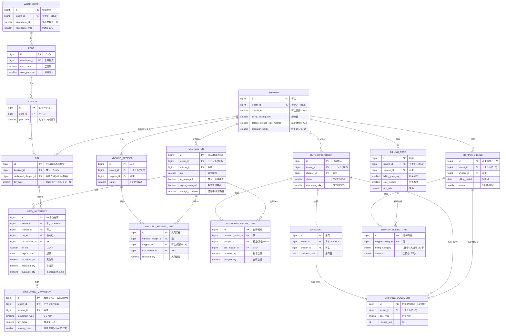
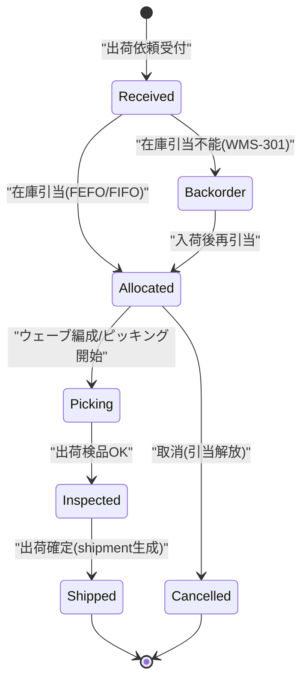
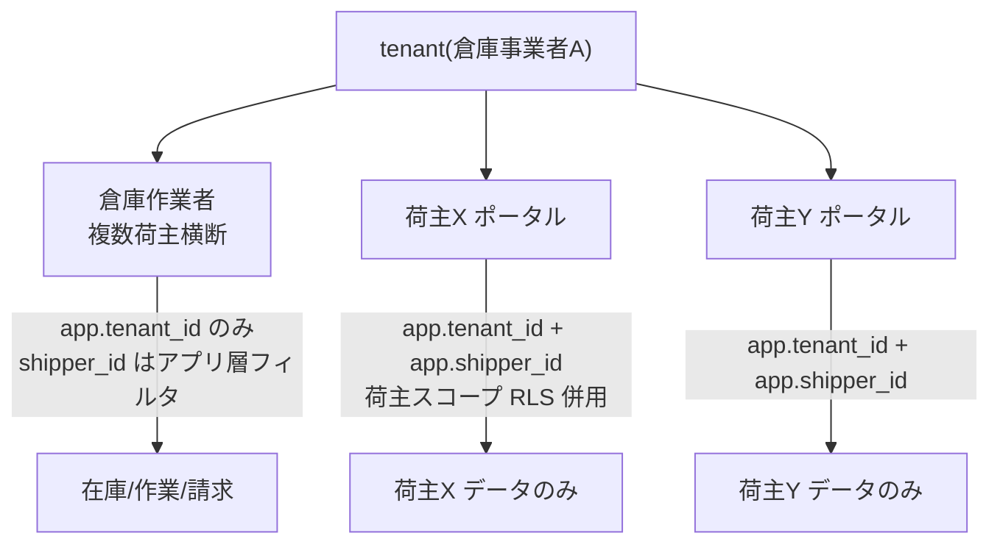
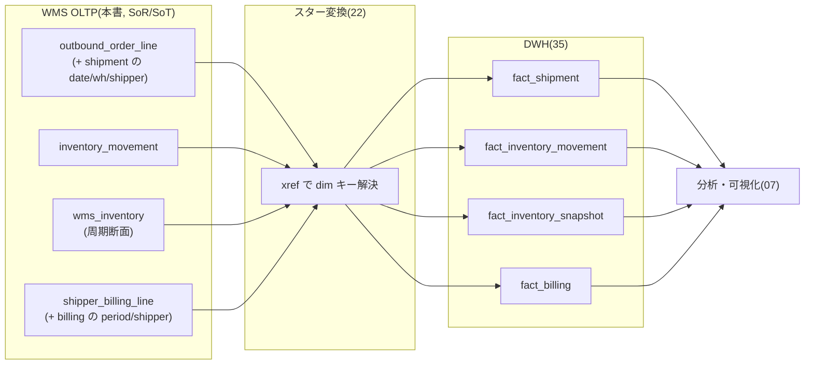

# DBスキーマ設計: WMS OLTP（倉庫向けサービス）

本ドキュメントは **SCIP（Supply Chain Intelligence Platform）** の自社開発サービスのうち、
**倉庫事業者（3PL / 物流センター運営者）向け WMS の OLTP スキーマ（Amazon RDS for PostgreSQL 16）** を
権威的に定義する。SKU マスタ（倉庫視点）・ゾーン/ロケーション/ビンの物理構造・入出庫と在庫のトランザクション・
出荷作業帳票の発行履歴・荷主請求を、**テナント（倉庫事業者）× 荷主（貨物所有者）の二層分離**を第一級に保持し、
かつ **最初からスタースキーマ写像を意識した構造**（`fact_shipment` / `fact_inventory_movement` /
`fact_inventory_snapshot` / `fact_billing` へ項目マッピング不要で着地）で設計する。
これが [`06 WMS サービス`](../basic-design/06-service-wms.md) が掲げる「他社 WMS 取込に対する分析連携難易度の低さ」を物理レベルで担保する。

> **本ドキュメントが権威的に所有する範囲（owns, ブリーフ §14）:** WMS OLTP の全業務テーブル
> — `shipper`（荷主）, `sku_master`（倉庫視点 SKU）, `warehouse` / `zone` / `location` / `bin`（倉庫内物理構造）,
> `billing_rate`（料率）, `inbound_receipt`(+`inbound_receipt_line`), `wms_inventory`（bin 単位在庫）,
> `inventory_movement`（入出庫移動履歴）, `outbound_order`(+`outbound_order_line`), `shipment`（出荷）,
> `shipping_document`（帳票発行履歴）, `shipper_billing`(+`shipper_billing_line`)（荷主請求）。
>
> **所有しない範囲（参照のみ）:** `tenant` / `app_user`（[37 コントロールプレーン](./37-control-plane-backoffice-schema.md)）、
> `canonical_*` / `product_category` / `region` / 各 `*_xref`（[34 MDM](./34-mdm-canonical-schema.md)）、
> `dim_*` / `fact_*`（[35 DWH](./35-star-schema-dwh.md)）。これらは**再定義せず FK / クロスウォークで参照**する。
> 横断規約（命名 / DDL / RLS / 共通列 / キー戦略 / 移行）は [30 スキーマ戦略と SoT](./30-schema-strategy-and-sot.md) が SoT。

---

## 1. 位置づけと設計原則

### 1.1 物理配置と SoT

| 項目 | 内容 |
|------|------|
| 物理ストア | Amazon RDS for PostgreSQL 16（Multi-AZ）、`wms` スキーマ（[30 §7](./30-schema-strategy-and-sot.md) の物理配置に準拠） |
| テナンシー | Pooled（共有DB・共有スキーマ + `tenant_id` + RLS）標準。大規模は Silo（同一 DDL・ルーティング切替）。ブリーフ §6 |
| 二層分離 | `tenant_id`（倉庫事業者間の分離、RLS 強制）＋ `shipper_id`（同一倉庫事業者が預かる荷主間の業務分離）。[06 §1.1](../basic-design/06-service-wms.md) |
| 本サービスが SoT のデータ | SKU マスタ（倉庫視点）、倉庫内物理構造（warehouse/zone/location/bin）、荷主、入荷（予定/実績/検品）、bin 単位在庫（ロット/期限）、在庫移動、出荷指示・出荷・ASN、帳票発行メタ、料率、荷主請求 |
| 参照のみ（SoT は他） | 正準 SKU/取引先/拠点/地域（34 MDM）、テナント/ユーザ/権限（37 Control Plane）、dim/fact（35 DWH） |
| データフロー方向 | 本 OLTP（SoR/SoT）→ Data Plane（Raw → Canonical → DWH）の**一方向**。逆流（DWH→OLTP 書戻し）は行わない（ブリーフ §5 / CLAUDE.md 原則6） |

### 1.2 継承実装からの主要差分

継承実装 `akebono-honshu`（単一テナントの履物メーカー）は WMS を持たないため、本スキーマは**新規テーブル群**である。
したがって後方互換の制約はなく、プラットフォーム新規標準（ブリーフ §9）を全面採用する。

- **`tenant_id` 導入 + RLS**: 全テーブルが `tenant_id BIGINT NOT NULL`。一意制約は先頭に `tenant_id` を含める。
- **`shipper_id` による荷主分離**: 在庫・作業・請求系テーブルは `shipper_id` を保持。一意性は原則 `(tenant_id, shipper_id, ...)` スコープ。
- **論理削除は `is_deleted`（新規標準）**: マスタ `delete_flag` は用いない。追記専用イベント（`inventory_movement` / `shipping_document`）は論理削除を持たない。
- **`TIMESTAMPTZ`（UTC 保存 / ローカル表示）**: JST-naive `TIMESTAMP` は採用しない。業務日付・請求対象月は `DATE`。
- **日本語文字列ステータスの排除**: 継承 ops-data 層の `'入荷済'`/`'出荷済'` 等のアンチパターンは踏襲せず、`SMALLINT + CHECK` に正規化（値は [06 §8](../basic-design/06-service-wms.md) / 本書 §3 と一致）。

> **DDL 適用順序に関する注記:** 本書の CREATE TABLE は説明順（マスタ → 入荷 → 在庫 → 出荷 → 帳票 → 請求）で記述する。一部に**前方参照**の FK がある（`inventory_movement.related_outbound_id`/`related_shipment_id` → §7 のテーブル、`shipping_document.shipper_billing_id` → §9）。実マイグレーションでは**全テーブルを先に作成し、これらの前方参照 FK を末尾で `ALTER TABLE ... ADD CONSTRAINT` として付与**する（生成順序に依存しない冪等な適用）。上記 DDL 中の該当 `REFERENCES` はその論理的な参照関係を示すものである。

### 1.3 スタースキーマ写像を意識した列設計

自社アプリの差別化要件（項目マッピング不要でスター供給できる、ブリーフ §2）を満たすため、以下を設計原則とする。

- 出荷明細（`outbound_order_line`）は **fact_shipment の measures（ordered/allocated/picked/shipped qty）** を保持し、`shipment` ヘッダの日付/拠点/荷主で写像するだけで済む構造にする。
- bin 単位在庫（`wms_inventory`）は **fact_inventory_snapshot の measures（on_hand/allocated/available）** を保持し、周期スナップショットにそのまま供給する。
- 在庫移動（`inventory_movement`）は **fact_inventory_movement（トランザクションファクト）** へ 1:1 写像する。
- 荷主請求明細（`shipper_billing_line`）は **fact_billing の measures（billed_qty/billed_amount）** を計算列で保持する。
- 各ローカルエンティティは**業務自然キー（`*_bk` / `sku` / `lot_no`）** を保持し、名寄せ（34）と DWH（35, `dim_*.*_bk`）の突合に使う。

---

## 2. ER 図（WMS OLTP 全体像）



> 上図は本ドキュメントが所有するテーブルのみを示す。外部参照（`tenant` / `app_user` / `canonical_*` / `dim_*` / `*_xref`）は §11 の外部参照表を参照。名寄せ（app-local id ⇄ canonical id）は 34 のクロスウォークで解決され、OLTP 側に canonical への物理 FK は張らない（DB 境界を跨ぐため）。
>
> **`shipping_document` の帳票対象は種別により排他的に 4 系統:** `related_entity_type` で `0=outbound_order`（ピッキング/検品リスト）/ `1=shipment`（納品書/送り状/ASN）/ `2=shipper_billing`（請求書）/ `3=inbound_receipt`（在庫報告等）のいずれか 1 つのみを充足する（§8.1 `chk_shipdoc_target`）。ER 上の 3 本の `... ||--o{ SHIPPING_DOCUMENT` 関連（種別 0/1/2）は同時ではなく種別により**排他的**に成立する。**種別 3（`inbound_receipt` 相当）は物理 FK 列を持たず**（`chk_shipdoc_target` の種別 3 は全 FK が NULL）、荷主単位の在庫報告書等を `shipper_id` のみで結び付ける論理参照であるため ER には FK 関連として描かない。
>
> **06 §7.1 ER との整合:** [`06 WMS`](../basic-design/06-service-wms.md) の論理 ER は「ZONE → LOCATION → BIN」を示すが、複数拠点を運営する倉庫事業者を表現するため本書は最上位に **`warehouse`（倉庫拠点）** を追加し「WAREHOUSE → ZONE → LOCATION → BIN」の 4 階層とする（06 §7.2 が「BIN/LOCATION/ZONE（倉庫拠点）→ canonical_location」と括った拠点概念を物理テーブルに具体化したもの）。`warehouse` が `canonical_location`（type=warehouse/dc）へ写像する主体である（§8 未決 W-1）。

---

## 3. ステータス / 区分値の正規定義（SMALLINT + CHECK）

継承実装の日本語 VARCHAR ステータスは踏襲せず、`SMALLINT + CHECK + アプリ解釈`（ブリーフ §9）で表現する。値は [06 §8](../basic-design/06-service-wms.md) と一致させる。

### 3.1 `inbound_receipt.status`（入荷ステータス）

| 値 | 定数 | 意味 |
|----|------|------|
| 0 | Planned | 予定（ASN/入荷予定登録） |
| 1 | Received | 入荷済（実荷到着・数量計上） |
| 2 | Inspected | 検品済 |
| 3 | PutAway | 格納済 |
| 8 | OnHold | 保留（差異/不良で荷主確認待ち） |
| 9 | Cancelled | 取消 |

### 3.2 `outbound_order.status`（出荷ステータス）

| 値 | 定数 | 意味 |
|----|------|------|
| 0 | Received | 受付 |
| 1 | Allocated | 引当済 |
| 2 | Picking | ピッキング中 |
| 3 | Inspected | 検品済 |
| 4 | Shipped | 出荷済 |
| 7 | Backorder | 欠品保留（バックオーダ） |
| 9 | Cancelled | 取消 |



### 3.3 `inventory_movement.movement_type`（在庫移動種別）

| 値 | 種別 | 在庫への影響 |
|----|------|------------|
| 0 | receive（入荷） | on_hand + |
| 1 | putaway（格納） | ロケーション移動（総量不変） |
| 2 | pick（ピッキング） | allocated 消込 → on_hand − |
| 3 | issue（出庫確定） | on_hand −（pick と統合運用も可） |
| 4 | allocate（引当） | allocated + |
| 5 | release（引当解放） | allocated − |
| 6 | replenish（補充） | ロケーション移動 |
| 7 | transfer（移動） | ロケーション/ビン間移動 |
| 8 | adjust（棚卸調整） | on_hand ±（理由コード必須） |

### 3.4 `shipper_billing.status`（荷主請求ステータス）

| 値 | 定数 | 意味 |
|----|------|------|
| 0 | Draft | 下書き（締め計算中/未確定） |
| 1 | Confirmed | 確定（金額確定・巻き戻し禁止） |
| 2 | Issued | 請求書発行済 |
| 3 | Settled | 入金消込済 |
| 9 | Corrected | 訂正（訂正明細で調整） |

### 3.5 その他の区分値

| 列 | 値定義 |
|----|--------|
| `warehouse.warehouse_type` | 0=warehouse（倉庫） / 1=dc（物流センター） |
| `zone.temp_zone` / `sku_master.storage_condition` | 0=常温 / 1=定温 / 2=冷蔵 / 3=冷凍 |
| `zone.zone_purpose` | 0=保管 / 1=ピッキング / 2=入荷（バッファ） / 3=出荷（バッファ） / 4=返品 / 5=不良/保留 |
| `bin.bin_type` | 0=保管ビン / 1=ピッキングビン / 2=一時（仮置き） |
| `shipper.allocation_policy` / `outbound_order.allocation_policy` | 0=FIFO（先入先出） / 1=FEFO（期限先出し）。ロット/期限管理 SKU の既定は FEFO（06 §3.2） |
| `outbound_order.order_source` | 0=荷主直接 / 1=EC（04/06 連携） / 2=小売 / 3=メーカー（05） / 4=ファイル投函 |
| `billing_rate.billing_category` / `shipper_billing_line.billing_category` | 0=保管料 / 1=入出庫料（荷役料） / 2=付帯作業料 |
| `billing_rate.calc_method` | 0=三期制 / 1=一期制 / 2=日建て / 3=坪建て / 9=実績数量建て（入出庫/付帯の既定） |
| `billing_rate.charge_unit` / `shipper_billing_line.charge_unit` | 0=パレット / 1=坪 / 2=才 / 3=ケース / 4=バラ（ピース） / 5=行（明細） / 6=オーダ / 7=作業件数 / 8=作業時間 / 9=重量 |
| `inventory_movement.work_category` | 付帯作業種別（付帯作業料の集計軸）。0=検品 / 1=ラベル貼り / 2=アソート/セット組 / 3=返品処理 / 4=流通加工 / 9=その他（NULL=付帯作業でない移動） |
| `shipping_document.doc_type` | 0=ピッキングリスト / 1=出荷検品リスト / 2=納品書 / 3=送り状 / 4=ASN / 5=荷主請求書 / 6=在庫報告書 |
| `shipping_document.format` | 0=xlsx（ClosedXML） / 1=pdf / 2=csv / 3=xml / 4=edi |
| `shipping_document.status` | 0=生成中 / 1=完了 / 2=失敗（WMS-501） |
| `shipment.asn_status` | 0=未送信 / 1=送信済 / 2=送信失敗（WMS-502） / 3=対象外 |

---

## 4. 荷主・SKU マスタ・倉庫物理構造・料率

### 4.1 `shipper` — 荷主（貨物所有者 / 請求先）

```sql
-- 荷主（貨物の所有者。倉庫事業者にとっての請求先顧客。canonical_party role=shipper へ party_xref で対応づけ）
CREATE TABLE shipper (
    id                          BIGSERIAL    PRIMARY KEY,                    -- 代理主キー
    tenant_id                   BIGINT       NOT NULL REFERENCES tenant(id), -- テナント識別子（RLS 対象、倉庫事業者）
    shipper_bk                  VARCHAR(64)  NOT NULL,                       -- 荷主業務コード（名寄せ/DWH 突合用、dim_customer.customer_bk へ）
    shipper_name                VARCHAR(255) NOT NULL,                       -- 荷主名
    billing_closing_day         SMALLINT     NOT NULL DEFAULT 99,            -- 締め日（1..28 の日、99=末日締め）
    default_storage_calc_method SMALLINT     NOT NULL DEFAULT 0,             -- 既定保管料方式（0=三期制/1=一期制/2=日建て/3=坪建て）
    allocation_policy           SMALLINT     NOT NULL DEFAULT 1,             -- 出荷引当方針（0=FIFO/1=FEFO）。ロット/期限管理は既定 FEFO
    portal_enabled              BOOLEAN      NOT NULL DEFAULT FALSE,         -- 荷主ポータル利用（true のとき荷主スコープ RLS を併用、§9）
    contact_email               VARCHAR(255) NULL,                           -- 請求書/在庫報告の送付先
    status                      SMALLINT     NOT NULL DEFAULT 1,             -- 0=Draft/1=Active/2=Inactive
    attributes                  JSONB        NOT NULL DEFAULT '{}'::jsonb,   -- テナント固有拡張属性（型付き列に無い項目）
    source_system               VARCHAR(64)  NULL,                           -- 来歴：取込元システム
    source_record_id            VARCHAR(128) NULL,                           -- 来歴：取込元レコード ID
    legacy_id                   VARCHAR(64)  NULL,                           -- 移行元レコード ID
    is_deleted                  BOOLEAN      NOT NULL DEFAULT FALSE,         -- 論理削除フラグ
    created_at                  TIMESTAMPTZ  NOT NULL DEFAULT now(),         -- 作成日時（UTC 保存）
    updated_at                  TIMESTAMPTZ  NOT NULL DEFAULT now(),         -- 更新日時（UTC 保存）
    created_by_user_id          BIGINT       NULL REFERENCES app_user(id),  -- 作成者
    updated_by_user_id          BIGINT       NULL REFERENCES app_user(id),  -- 更新者
    CONSTRAINT chk_shipper_status         CHECK (status IN (0, 1, 2)),
    CONSTRAINT chk_shipper_calc_method    CHECK (default_storage_calc_method IN (0, 1, 2, 3)),
    CONSTRAINT chk_shipper_alloc_policy   CHECK (allocation_policy IN (0, 1)),
    CONSTRAINT chk_shipper_closing_day    CHECK (billing_closing_day BETWEEN 1 AND 28 OR billing_closing_day = 99)
);

ALTER TABLE shipper
    ADD CONSTRAINT uq_shipper_tenant_bk UNIQUE (tenant_id, shipper_bk);

CREATE INDEX idx_shipper_tenant_active
    ON shipper (tenant_id, status)
    WHERE is_deleted = FALSE;

COMMENT ON TABLE  shipper                      IS '荷主（貨物所有者/請求先）。SoT=WMS OLTP。canonical_party(role=shipper) へ party_xref で対応づけ、dim_customer の源泉（06 §5.1）';
COMMENT ON COLUMN shipper.shipper_bk           IS '荷主業務コード。dim_customer.customer_bk と突合。PK にはしない（キー戦略, 30 §6）';
COMMENT ON COLUMN shipper.default_storage_calc_method IS '既定保管料方式。個別料率で billing_rate.calc_method が優先。日本の倉庫業慣行は三期制が標準（06 §5.3）';
COMMENT ON COLUMN shipper.portal_enabled       IS '荷主ポータル利用フラグ。true のとき app.shipper_id を張り荷主スコープ RLS を併用し他荷主データを遮断（§9 / WMS-003）';
```

### 4.2 `sku_master` — SKU（倉庫視点、荷主単位）

```sql
-- SKU マスタ（倉庫視点。荷主 SKU・荷姿・ロット/期限管理要否・保管条件。canonical_sku へ sku_xref で対応づけ）
CREATE TABLE sku_master (
    id                   BIGSERIAL    PRIMARY KEY,                    -- 代理主キー
    tenant_id            BIGINT       NOT NULL REFERENCES tenant(id), -- テナント識別子（RLS 対象）
    shipper_id           BIGINT       NOT NULL REFERENCES shipper(id),-- 荷主（SKU は荷主に帰属）
    sku                  VARCHAR(64)  NOT NULL,                       -- 荷主 SKU コード（業務自然キー、dim_product.sku_bk へ）
    jan_code             VARCHAR(20)  NULL,                           -- JAN/EAN/UPC バーコード（入出荷スキャン）
    product_name         VARCHAR(255) NOT NULL,                       -- 品名
    lot_managed          BOOLEAN      NOT NULL DEFAULT FALSE,         -- ロット管理要否（true=在庫/入出荷でロット必須, WMS-203）
    expiry_managed       BOOLEAN      NOT NULL DEFAULT FALSE,         -- 期限管理要否（true=期限必須, FEFO 引当対象）
    storage_condition    SMALLINT     NOT NULL DEFAULT 0,             -- 温度帯/保管条件（0=常温/1=定温/2=冷蔵/3=冷凍）
    case_qty             NUMERIC(12,4) NULL,                          -- ケース入数（バラ換算）
    inner_qty            NUMERIC(12,4) NULL,                          -- ボール/内装入数
    uom_code             VARCHAR(16)  NOT NULL DEFAULT 'EA',          -- 在庫単位（34 uom 参照。既定=個 EA）
    weight_kg            NUMERIC(12,4) NULL,                          -- 単重（kg。重量建て課金/積載計算用）
    volume_m3            NUMERIC(12,6) NULL,                          -- 才/容積（m3。坪建て/才建て課金・容量計算用）
    hazmat_flag          BOOLEAN      NOT NULL DEFAULT FALSE,         -- 危険物フラグ（保管区分の制約）
    status               SMALLINT     NOT NULL DEFAULT 1,             -- 0=Draft/1=Active/2=Discontinued（廃番は status=2）
    attributes           JSONB        NOT NULL DEFAULT '{}'::jsonb,   -- テナント固有拡張属性
    source_system        VARCHAR(64)  NULL,                           -- 来歴：取込元システム
    source_record_id     VARCHAR(128) NULL,                           -- 来歴：取込元レコード ID
    legacy_id            VARCHAR(64)  NULL,                           -- 移行元レコード ID
    is_deleted           BOOLEAN      NOT NULL DEFAULT FALSE,         -- 論理削除フラグ
    created_at           TIMESTAMPTZ  NOT NULL DEFAULT now(),         -- 作成日時（UTC 保存）
    updated_at           TIMESTAMPTZ  NOT NULL DEFAULT now(),         -- 更新日時（UTC 保存）
    created_by_user_id   BIGINT       NULL REFERENCES app_user(id),  -- 作成者
    updated_by_user_id   BIGINT       NULL REFERENCES app_user(id),  -- 更新者
    CONSTRAINT chk_sku_master_status   CHECK (status IN (0, 1, 2)),
    CONSTRAINT chk_sku_master_storage  CHECK (storage_condition IN (0, 1, 2, 3))
);

-- SKU コードはテナント×荷主内一意（ブリーフ §6 テナント×荷主スコープ、WMS-201）
ALTER TABLE sku_master
    ADD CONSTRAINT uq_sku_master_tenant_shipper_sku UNIQUE (tenant_id, shipper_id, sku);
-- JAN はテナント×荷主内一意（NULL は複数許容）
CREATE UNIQUE INDEX uq_sku_master_tenant_shipper_jan
    ON sku_master (tenant_id, shipper_id, jan_code)
    WHERE jan_code IS NOT NULL AND is_deleted = FALSE;

CREATE INDEX idx_sku_master_tenant_shipper
    ON sku_master (tenant_id, shipper_id, status)
    WHERE is_deleted = FALSE;
-- SKU/品名の部分一致検索（pg_trgm、入出荷画面のインクリメンタル検索）
CREATE INDEX idx_sku_master_sku_trgm
    ON sku_master USING gin (sku gin_trgm_ops);

COMMENT ON TABLE  sku_master                  IS 'SKU マスタ（倉庫視点）。SoT=WMS OLTP。canonical_sku へ sku_xref で対応づけ、dim_product（SKU 粒度, SCD2）の源泉';
COMMENT ON COLUMN sku_master.sku              IS '荷主 SKU コード。テナント×荷主内で一意（uq_sku_master_tenant_shipper_sku）。同一 SKU 文字列でも荷主が異なれば別 SKU';
COMMENT ON COLUMN sku_master.lot_managed      IS 'ロット管理要否。true のとき在庫/入出荷でロット必須（WMS-203）。wms_inventory の行粒度に影響';
COMMENT ON COLUMN sku_master.expiry_managed   IS '期限管理要否。true のとき FEFO 引当対象（期限先出し）。期限切れロットのピック拒否（WMS-303）';
COMMENT ON COLUMN sku_master.volume_m3        IS '容積（才/坪/才建て課金・格納容量判定用）。保管料の坪建て/才建てで使用（billing_rate）';
```

### 4.3 `warehouse` — 倉庫拠点（物理サイト）

```sql
-- 倉庫拠点（物理サイト。倉庫内階層の最上位。canonical_location type=warehouse/dc へ location_xref で写像）
CREATE TABLE warehouse (
    id                   BIGSERIAL    PRIMARY KEY,                    -- 代理主キー
    tenant_id            BIGINT       NOT NULL REFERENCES tenant(id), -- テナント識別子（RLS 対象）
    warehouse_bk         VARCHAR(64)  NOT NULL,                       -- 拠点業務コード（dim_location.location_bk へ）
    warehouse_name       VARCHAR(255) NOT NULL,                       -- 拠点名
    warehouse_type       SMALLINT     NOT NULL DEFAULT 0,             -- 0=warehouse/1=dc
    region_bk            VARCHAR(64)  NULL,                           -- 地域自然キー（34 region へ xref。動的粒度）
    postal_code          VARCHAR(16)  NULL,                           -- 郵便番号
    address_line         VARCHAR(512) NULL,                           -- 住所
    status               SMALLINT     NOT NULL DEFAULT 1,             -- 0=Draft/1=Active/2=Closed（閉鎖）
    attributes           JSONB        NOT NULL DEFAULT '{}'::jsonb,   -- 拡張属性
    source_system        VARCHAR(64)  NULL,                           -- 来歴：取込元システム
    source_record_id     VARCHAR(128) NULL,                           -- 来歴：取込元レコード ID
    legacy_id            VARCHAR(64)  NULL,                           -- 移行元レコード ID
    is_deleted           BOOLEAN      NOT NULL DEFAULT FALSE,         -- 論理削除フラグ
    created_at           TIMESTAMPTZ  NOT NULL DEFAULT now(),         -- 作成日時（UTC 保存）
    updated_at           TIMESTAMPTZ  NOT NULL DEFAULT now(),         -- 更新日時（UTC 保存）
    created_by_user_id   BIGINT       NULL REFERENCES app_user(id),  -- 作成者
    updated_by_user_id   BIGINT       NULL REFERENCES app_user(id),  -- 更新者
    CONSTRAINT chk_warehouse_type   CHECK (warehouse_type IN (0, 1)),
    CONSTRAINT chk_warehouse_status CHECK (status IN (0, 1, 2))
);

ALTER TABLE warehouse
    ADD CONSTRAINT uq_warehouse_tenant_bk UNIQUE (tenant_id, warehouse_bk);

CREATE INDEX idx_warehouse_tenant_active
    ON warehouse (tenant_id, status)
    WHERE is_deleted = FALSE;

COMMENT ON TABLE  warehouse           IS '倉庫拠点（物理サイト）。SoT=WMS OLTP。canonical_location(type=warehouse/dc) へ location_xref で対応づけ、dim_location/dim_region の源泉';
COMMENT ON COLUMN warehouse.region_bk IS '地域自然キー。地域階層は 34 region が SoT（動的粒度）。dim_region 突合用';
```

### 4.4 `zone` / `location` / `bin` — 倉庫内物理階層

```sql
-- ゾーン（倉庫内エリア。温度帯・用途区分を保持。warehouse の子）
CREATE TABLE zone (
    id                   BIGSERIAL    PRIMARY KEY,                    -- 代理主キー
    tenant_id            BIGINT       NOT NULL REFERENCES tenant(id), -- テナント識別子（RLS 対象）
    warehouse_id         BIGINT       NOT NULL REFERENCES warehouse(id), -- 所属倉庫拠点
    zone_bk              VARCHAR(64)  NOT NULL,                       -- ゾーン業務コード
    zone_name            VARCHAR(128) NOT NULL,                       -- ゾーン名
    temp_zone            SMALLINT     NOT NULL DEFAULT 0,             -- 温度帯（0=常温/1=定温/2=冷蔵/3=冷凍）
    zone_purpose         SMALLINT     NOT NULL DEFAULT 0,             -- 用途区分（0=保管/1=ピッキング/2=入荷/3=出荷/4=返品/5=不良）
    status               SMALLINT     NOT NULL DEFAULT 1,             -- 0=Draft/1=Active/2=Closed
    is_deleted           BOOLEAN      NOT NULL DEFAULT FALSE,         -- 論理削除フラグ
    created_at           TIMESTAMPTZ  NOT NULL DEFAULT now(),         -- 作成日時（UTC 保存）
    updated_at           TIMESTAMPTZ  NOT NULL DEFAULT now(),         -- 更新日時（UTC 保存）
    created_by_user_id   BIGINT       NULL REFERENCES app_user(id),  -- 作成者
    updated_by_user_id   BIGINT       NULL REFERENCES app_user(id),  -- 更新者
    CONSTRAINT chk_zone_temp    CHECK (temp_zone IN (0, 1, 2, 3)),
    CONSTRAINT chk_zone_purpose CHECK (zone_purpose IN (0, 1, 2, 3, 4, 5)),
    CONSTRAINT chk_zone_status  CHECK (status IN (0, 1, 2))
);

ALTER TABLE zone
    ADD CONSTRAINT uq_zone_tenant_wh_bk UNIQUE (tenant_id, warehouse_id, zone_bk);
CREATE INDEX idx_zone_tenant_wh ON zone (tenant_id, warehouse_id) WHERE is_deleted = FALSE;

COMMENT ON TABLE  zone            IS 'ゾーン（倉庫内エリア）。warehouse の子。温度帯・用途でロケーション割付ロジックを制約（06 §3.1）';
COMMENT ON COLUMN zone.temp_zone  IS '温度帯。sku_master.storage_condition と突合し格納可否を判定（WMS-103 保管条件不一致）';

-- ロケーション（ラック/間口。zone の子）
CREATE TABLE location (
    id                   BIGSERIAL    PRIMARY KEY,                    -- 代理主キー
    tenant_id            BIGINT       NOT NULL REFERENCES tenant(id), -- テナント識別子（RLS 対象）
    zone_id              BIGINT       NOT NULL REFERENCES zone(id),   -- 所属ゾーン
    location_bk          VARCHAR(64)  NOT NULL,                       -- ロケーション業務コード（間口番地。例 A-01-03）
    aisle                VARCHAR(16)  NULL,                           -- 通路（ピッキング順ソート用）
    rack                 VARCHAR(16)  NULL,                           -- ラック
    level_no             SMALLINT     NULL,                           -- 段
    pick_face            BOOLEAN      NOT NULL DEFAULT FALSE,         -- ピッキング間口か（true=補充対象の前線ロケーション）
    pick_sequence        INTEGER      NULL,                           -- ピッキング巡回順（ピッキングリストのソートキー）
    status               SMALLINT     NOT NULL DEFAULT 1,             -- 0=Draft/1=Active/2=Closed（閉鎖/棚卸凍結は別途）
    is_deleted           BOOLEAN      NOT NULL DEFAULT FALSE,         -- 論理削除フラグ
    created_at           TIMESTAMPTZ  NOT NULL DEFAULT now(),         -- 作成日時（UTC 保存）
    updated_at           TIMESTAMPTZ  NOT NULL DEFAULT now(),         -- 更新日時（UTC 保存）
    created_by_user_id   BIGINT       NULL REFERENCES app_user(id),  -- 作成者
    updated_by_user_id   BIGINT       NULL REFERENCES app_user(id),  -- 更新者
    CONSTRAINT chk_location_status CHECK (status IN (0, 1, 2))
);

ALTER TABLE location
    ADD CONSTRAINT uq_location_tenant_zone_bk UNIQUE (tenant_id, zone_id, location_bk);
CREATE INDEX idx_location_tenant_zone ON location (tenant_id, zone_id) WHERE is_deleted = FALSE;
CREATE INDEX idx_location_pick_seq ON location (tenant_id, zone_id, pick_sequence) WHERE pick_face = TRUE AND is_deleted = FALSE;

COMMENT ON TABLE  location             IS 'ロケーション（ラック/間口）。zone の子、bin の親。pick_sequence でピッキング巡回順を制御';
COMMENT ON COLUMN location.pick_face   IS 'ピッキング間口。true のとき補充（replenish）の補充先。保管ロケーションから補充される';

-- ビン（最小格納単位。location の子。荷主専用/共用を区別）
CREATE TABLE bin (
    id                   BIGSERIAL    PRIMARY KEY,                    -- 代理主キー
    tenant_id            BIGINT       NOT NULL REFERENCES tenant(id), -- テナント識別子（RLS 対象）
    location_id          BIGINT       NOT NULL REFERENCES location(id), -- 所属ロケーション
    bin_bk               VARCHAR(64)  NOT NULL,                       -- ビン業務コード
    bin_type             SMALLINT     NOT NULL DEFAULT 0,             -- 0=保管/1=ピッキング/2=一時（仮置き）
    dedicated_shipper_id BIGINT       NULL REFERENCES shipper(id),    -- 荷主専用ビン（NULL=共用フリーロケーション）
    capacity_qty         NUMERIC(14,4) NULL,                          -- 容量（数量ベース。NULL=無制限）
    capacity_uom         VARCHAR(16)  NULL,                           -- 容量単位（パレット/ケース 等）
    max_weight_kg        NUMERIC(12,4) NULL,                          -- 最大積載重量
    max_volume_m3        NUMERIC(12,6) NULL,                          -- 最大容積
    is_frozen            BOOLEAN      NOT NULL DEFAULT FALSE,         -- 棚卸凍結中フラグ（true=出荷引当から除外, WMS-403）
    status               SMALLINT     NOT NULL DEFAULT 1,             -- 0=Draft/1=Active/2=Blocked（使用停止）
    is_deleted           BOOLEAN      NOT NULL DEFAULT FALSE,         -- 論理削除フラグ
    created_at           TIMESTAMPTZ  NOT NULL DEFAULT now(),         -- 作成日時（UTC 保存）
    updated_at           TIMESTAMPTZ  NOT NULL DEFAULT now(),         -- 更新日時（UTC 保存）
    created_by_user_id   BIGINT       NULL REFERENCES app_user(id),  -- 作成者
    updated_by_user_id   BIGINT       NULL REFERENCES app_user(id),  -- 更新者
    CONSTRAINT chk_bin_type   CHECK (bin_type IN (0, 1, 2)),
    CONSTRAINT chk_bin_status CHECK (status IN (0, 1, 2))
);

ALTER TABLE bin
    ADD CONSTRAINT uq_bin_tenant_loc_bk UNIQUE (tenant_id, location_id, bin_bk);
CREATE INDEX idx_bin_tenant_loc ON bin (tenant_id, location_id) WHERE is_deleted = FALSE;
-- 荷主専用ビンの検索（格納割付ロジック）
CREATE INDEX idx_bin_dedicated_shipper ON bin (tenant_id, dedicated_shipper_id) WHERE dedicated_shipper_id IS NOT NULL AND is_deleted = FALSE;

COMMENT ON TABLE  bin                      IS 'ビン（最小格納単位）。location の子。wms_inventory の格納先。荷主専用/共用を dedicated_shipper_id で区別（06 §6.1）';
COMMENT ON COLUMN bin.dedicated_shipper_id IS '荷主専用ビン。NULL=共用（フリーロケーション）。専用ビンへの他荷主格納は拒否（WMS-104）。共用ビンでも wms_inventory は必ず shipper_id を持ち所有権を追跡';
COMMENT ON COLUMN bin.is_frozen            IS '棚卸凍結中。true のとき当該ビンの在庫は出荷引当から除外（WMS-403）。棚卸完了で解除';
```

### 4.5 `billing_rate` — 料率（保管料 / 入出庫料 / 付帯作業料）

```sql
-- 料率（荷主 × 料金区分 × 単位。有効日で履歴管理。保管料は calc_method で計算方式を保持）
CREATE TABLE billing_rate (
    id                   BIGSERIAL    PRIMARY KEY,                    -- 代理主キー
    tenant_id            BIGINT       NOT NULL REFERENCES tenant(id), -- テナント識別子（RLS 対象）
    shipper_id           BIGINT       NOT NULL REFERENCES shipper(id),-- 荷主（料率は荷主単位）
    billing_category     SMALLINT     NOT NULL,                       -- 0=保管料/1=入出庫料/2=付帯作業料
    rate_bk              VARCHAR(64)  NOT NULL,                       -- 料率業務コード（区分内の細目。付帯作業種別/入庫・出庫別 等）
    rate_name            VARCHAR(128) NOT NULL,                       -- 料率名（請求書表示）
    calc_method          SMALLINT     NOT NULL DEFAULT 9,             -- 計算方式（0=三期制/1=一期制/2=日建て/3=坪建て/9=実績数量建て）
    charge_unit          SMALLINT     NOT NULL,                       -- 課金単位（0=パレット/1=坪/…/8=時間/9=重量、§3.5）
    unit_rate            NUMERIC(12,2) NOT NULL,                      -- 適用単価（機微度 中。既定マスク・開示は権限+監査）
    currency_code        CHAR(3)      NOT NULL DEFAULT 'JPY',         -- 通貨（ISO 4217）
    min_charge           NUMERIC(14,2) NULL,                          -- 最低請求額（NULL=なし）
    effective_from       DATE         NOT NULL,                       -- 有効開始日
    effective_to         DATE         NULL,                           -- 有効終了日（NULL=現在有効）
    attributes           JSONB        NOT NULL DEFAULT '{}'::jsonb,   -- 段階料率/条件等の拡張
    is_deleted           BOOLEAN      NOT NULL DEFAULT FALSE,         -- 論理削除フラグ
    created_at           TIMESTAMPTZ  NOT NULL DEFAULT now(),         -- 作成日時（UTC 保存）
    updated_at           TIMESTAMPTZ  NOT NULL DEFAULT now(),         -- 更新日時（UTC 保存）
    created_by_user_id   BIGINT       NULL REFERENCES app_user(id),  -- 作成者
    updated_by_user_id   BIGINT       NULL REFERENCES app_user(id),  -- 更新者
    CONSTRAINT chk_billing_rate_category CHECK (billing_category IN (0, 1, 2)),
    CONSTRAINT chk_billing_rate_method   CHECK (calc_method IN (0, 1, 2, 3, 9)),
    CONSTRAINT chk_billing_rate_unit     CHECK (charge_unit IN (0, 1, 2, 3, 4, 5, 6, 7, 8, 9)),
    CONSTRAINT chk_billing_rate_amount   CHECK (unit_rate >= 0),
    CONSTRAINT chk_billing_rate_period   CHECK (effective_to IS NULL OR effective_to > effective_from),
    -- 保管料のみ三期制/一期制/日建て/坪建てを許容。入出庫/付帯は実績数量建て
    CONSTRAINT chk_billing_rate_method_scope CHECK (
        (billing_category = 0) OR (calc_method = 9)
    )
);

-- 同一荷主・区分・細目・同一開始日の重複防止（有効日履歴）
CREATE UNIQUE INDEX uq_billing_rate_shipper_cat_bk_from
    ON billing_rate (tenant_id, shipper_id, billing_category, rate_bk, effective_from)
    WHERE is_deleted = FALSE;
-- 現行料率ルックアップ（締め処理の料率解決）
CREATE INDEX idx_billing_rate_current
    ON billing_rate (tenant_id, shipper_id, billing_category, rate_bk, effective_from DESC)
    WHERE effective_to IS NULL AND is_deleted = FALSE;

COMMENT ON TABLE  billing_rate                 IS '料率（保管/入出庫/付帯）。SoT=WMS OLTP。荷主 × 料金区分 × 単位。締め処理（shipper_billing）が参照（06 §5.2）';
COMMENT ON COLUMN billing_rate.calc_method     IS '保管料計算方式。三期制が日本の倉庫業標準（06 §5.3）。入出庫/付帯は 9=実績数量建て（chk_billing_rate_method_scope で担保）';
COMMENT ON COLUMN billing_rate.unit_rate       IS '適用単価（機微度 中）。既定マスク、開示は権限+監査。締め時に shipper_billing_line.rate_snapshot へ凍結';
```

> **料率の履歴管理:** `retail_price`（31）と同型。新料率設定時は同一（荷主, 区分, 細目）の旧行の `effective_to` を `新 effective_from − 1日` で UPDATE + 新行 INSERT を 1 トランザクションで行う。締め処理は対象期間に有効な料率を解決し、`shipper_billing_line.rate_snapshot` に凍結する（後日の料率変更で確定済み請求が変動しない）。

---

## 5. 入荷（予定 / 実績 / 検品 / 格納）

### 5.1 `inbound_receipt` — 入荷（ヘッダ）

```sql
-- 入荷（ASN/入荷予定 → 入荷実績 → 検品 → 格納。荷主単位、System of Record）
CREATE TABLE inbound_receipt (
    id                   BIGSERIAL    PRIMARY KEY,                    -- 代理主キー
    tenant_id            BIGINT       NOT NULL REFERENCES tenant(id), -- テナント識別子（RLS 対象）
    shipper_id           BIGINT       NOT NULL REFERENCES shipper(id),-- 荷主
    warehouse_id         BIGINT       NOT NULL REFERENCES warehouse(id), -- 入荷先倉庫拠点
    receipt_bk           VARCHAR(64)  NOT NULL,                       -- 入荷番号（業務自然キー）
    asn_no               VARCHAR(64)  NULL,                           -- ASN 番号（事前出荷明細。予定なし入荷は NULL, WMS-102）
    status               SMALLINT     NOT NULL DEFAULT 0,             -- §3.1 参照（0予定/1入荷済/2検品済/3格納済/8保留/9取消）
    source_party_name    VARCHAR(255) NULL,                           -- 発送元（仕入先/上流。表示・突合用）
    expected_arrival_date DATE        NULL,                           -- 入荷予定日
    received_at          TIMESTAMPTZ  NULL,                           -- 入荷実績計上日時
    inspected_at         TIMESTAMPTZ  NULL,                           -- 検品完了日時
    putaway_at           TIMESTAMPTZ  NULL,                           -- 格納完了日時
    business_date        DATE         NULL,                           -- 業務日付（入荷計上日、dim_date 突合）
    hold_reason          VARCHAR(255) NULL,                           -- 保留理由（status=8, WMS-101）
    idempotency_key      VARCHAR(64)  NULL,                           -- 冪等キー（二重入荷登録の排除, ブリーフ §11）
    source_system        VARCHAR(64)  NULL,                           -- 来歴：取込元システム
    source_record_id     VARCHAR(128) NULL,                           -- 来歴：取込元レコード ID
    legacy_id            VARCHAR(64)  NULL,                           -- 移行元レコード ID
    is_deleted           BOOLEAN      NOT NULL DEFAULT FALSE,         -- 論理削除フラグ
    created_at           TIMESTAMPTZ  NOT NULL DEFAULT now(),         -- 作成日時（UTC 保存）
    updated_at           TIMESTAMPTZ  NOT NULL DEFAULT now(),         -- 更新日時（UTC 保存）
    created_by_user_id   BIGINT       NULL REFERENCES app_user(id),  -- 作成者
    updated_by_user_id   BIGINT       NULL REFERENCES app_user(id),  -- 更新者
    CONSTRAINT chk_inbound_status CHECK (status IN (0, 1, 2, 3, 8, 9)),
    -- 入荷実績以降は received_at 必須（状態と時刻の整合）
    CONSTRAINT chk_inbound_received CHECK (status NOT IN (1, 2, 3) OR received_at IS NOT NULL)
);

ALTER TABLE inbound_receipt
    ADD CONSTRAINT uq_inbound_receipt_tenant_bk UNIQUE (tenant_id, receipt_bk);
CREATE UNIQUE INDEX uq_inbound_receipt_tenant_idem
    ON inbound_receipt (tenant_id, idempotency_key)
    WHERE idempotency_key IS NOT NULL;

CREATE INDEX idx_inbound_tenant_shipper_status
    ON inbound_receipt (tenant_id, shipper_id, status)
    WHERE is_deleted = FALSE;
CREATE INDEX idx_inbound_tenant_expected
    ON inbound_receipt (tenant_id, warehouse_id, expected_arrival_date)
    WHERE is_deleted = FALSE;
-- CDC/日次供給の増分抽出
CREATE INDEX idx_inbound_tenant_updated
    ON inbound_receipt (tenant_id, updated_at);

COMMENT ON TABLE  inbound_receipt         IS '入荷（予定/実績/検品/格納）。SoT=WMS OLTP（System of Record）。fact_inventory_movement(receive/putaway) の源泉';
COMMENT ON COLUMN inbound_receipt.asn_no  IS 'ASN 番号。NULL=予定なし入荷（WMS-102 として登録・荷主通知）';
COMMENT ON COLUMN inbound_receipt.status  IS '入荷ステータス（06 §8.1）。8=保留は検品差異/不良で荷主確認待ち（WMS-101）';
```

### 5.2 `inbound_receipt_line` — 入荷明細

```sql
-- 入荷明細（SKU × ロット/期限単位。予定数量と実績数量・検品内訳を保持）
CREATE TABLE inbound_receipt_line (
    id                   BIGSERIAL    PRIMARY KEY,                    -- 代理主キー
    tenant_id            BIGINT       NOT NULL REFERENCES tenant(id), -- テナント識別子（RLS 対象）
    inbound_receipt_id   BIGINT       NOT NULL REFERENCES inbound_receipt(id) ON DELETE CASCADE, -- 親（明細はヘッダに従属）
    shipper_id           BIGINT       NOT NULL REFERENCES shipper(id),-- 荷主（分析軸/荷主 RLS のための冗長保持。親 inbound_receipt.shipper_id と一致・アプリ保証）
    line_no              SMALLINT     NOT NULL,                       -- 明細番号
    sku_master_id        BIGINT       NOT NULL REFERENCES sku_master(id), -- SKU
    sku_snapshot         VARCHAR(64)  NOT NULL,                       -- SKU スナップショット（マスタ変更耐性）
    lot_no               VARCHAR(64)  NULL,                           -- ロット番号（lot_managed=true で必須, WMS-203）
    expiry_date          DATE         NULL,                           -- 使用期限（expiry_managed=true で必須）
    mfg_date             DATE         NULL,                           -- 製造日
    expected_qty         NUMERIC(14,4) NOT NULL DEFAULT 0,           -- 予定数量
    received_qty         NUMERIC(14,4) NOT NULL DEFAULT 0,           -- 入荷数量（実績）
    good_qty             NUMERIC(14,4) NOT NULL DEFAULT 0,           -- 良品数量（検品）
    defect_qty           NUMERIC(14,4) NOT NULL DEFAULT 0,           -- 不良数量（検品）
    hold_qty             NUMERIC(14,4) NOT NULL DEFAULT 0,           -- 保留数量（検品）
    putaway_bin_id       BIGINT       NULL REFERENCES bin(id),        -- 格納先ビン（格納後に確定）
    uom_code             VARCHAR(16)  NOT NULL DEFAULT 'EA',          -- 単位
    created_at           TIMESTAMPTZ  NOT NULL DEFAULT now(),         -- 作成日時（UTC 保存）
    updated_at           TIMESTAMPTZ  NOT NULL DEFAULT now(),         -- 更新日時（UTC 保存）
    created_by_user_id   BIGINT       NULL REFERENCES app_user(id),  -- 作成者
    updated_by_user_id   BIGINT       NULL REFERENCES app_user(id),  -- 更新者
    CONSTRAINT chk_inbound_line_qty      CHECK (expected_qty >= 0 AND received_qty >= 0),
    CONSTRAINT chk_inbound_line_inspect  CHECK (good_qty >= 0 AND defect_qty >= 0 AND hold_qty >= 0),
    -- 検品内訳の合計は入荷数量を超えない（検品確定後の整合）
    CONSTRAINT chk_inbound_line_balance  CHECK (good_qty + defect_qty + hold_qty <= received_qty)
);

ALTER TABLE inbound_receipt_line
    ADD CONSTRAINT uq_inbound_line_receipt_no UNIQUE (inbound_receipt_id, line_no);
CREATE INDEX idx_inbound_line_tenant_receipt ON inbound_receipt_line (tenant_id, inbound_receipt_id);
CREATE INDEX idx_inbound_line_tenant_sku ON inbound_receipt_line (tenant_id, sku_master_id);
-- 荷主ポータルの明細直接クエリ（荷主 RLS の絞り込み）
CREATE INDEX idx_inbound_line_tenant_shipper ON inbound_receipt_line (tenant_id, shipper_id);

COMMENT ON TABLE  inbound_receipt_line          IS '入荷明細（SKU × ロット/期限）。予定 vs 実績 vs 検品内訳。論理削除なし・親に ON DELETE CASCADE';
COMMENT ON COLUMN inbound_receipt_line.shipper_id IS '荷主（冗長保持）。親 inbound_receipt.shipper_id と一致（アプリ保証）。明細を直接クエリする荷主ポータルで shipper_isolation RLS を効かせるため保有（§10.2 / WMS-003）';
COMMENT ON COLUMN inbound_receipt_line.good_qty IS '良品数量。格納（putaway）で wms_inventory.on_hand に加算される数量の源泉';
COMMENT ON COLUMN inbound_receipt_line.lot_no   IS 'ロット番号。sku_master.lot_managed=true で必須（WMS-203, アプリ検証）';
```

---

## 6. 在庫（bin 単位）と在庫移動

### 6.1 `wms_inventory` — bin 単位在庫（fact_inventory_snapshot 源泉）

```sql
-- bin 単位在庫（ビン × SKU × ロット × 期限を 1 行。on_hand/allocated/available の 3 値。荷主単位）
CREATE TABLE wms_inventory (
    id                   BIGSERIAL    PRIMARY KEY,                    -- 代理主キー
    tenant_id            BIGINT       NOT NULL REFERENCES tenant(id), -- テナント識別子（RLS 対象）
    shipper_id           BIGINT       NOT NULL REFERENCES shipper(id),-- 荷主（共用ビンでも所有権を追跡）
    warehouse_id         BIGINT       NOT NULL REFERENCES warehouse(id), -- 倉庫拠点（分析軸の冗長保持）
    bin_id               BIGINT       NOT NULL REFERENCES bin(id),    -- 格納ビン
    sku_master_id        BIGINT       NOT NULL REFERENCES sku_master(id), -- SKU
    lot_no               VARCHAR(64)  NOT NULL DEFAULT '',            -- ロット（非ロット管理は空文字。一意キー安定化のため NOT NULL）
    expiry_date          DATE         NULL,                           -- 使用期限（FEFO 引当のキー）
    mfg_date             DATE         NULL,                           -- 製造日
    on_hand_qty          NUMERIC(14,4) NOT NULL DEFAULT 0,           -- 実在庫
    allocated_qty        NUMERIC(14,4) NOT NULL DEFAULT 0,           -- 引当済（出荷確保分）
    available_qty        NUMERIC(14,4) GENERATED ALWAYS AS (on_hand_qty - allocated_qty) STORED, -- 有効在庫（引当可能量）
    uom_code             VARCHAR(16)  NOT NULL DEFAULT 'EA',          -- 単位
    last_movement_at     TIMESTAMPTZ  NULL,                           -- 最終在庫移動日時
    is_deleted           BOOLEAN      NOT NULL DEFAULT FALSE,         -- 論理削除フラグ（在庫ゼロ行のクローズ用）
    created_at           TIMESTAMPTZ  NOT NULL DEFAULT now(),         -- 作成日時（UTC 保存）
    updated_at           TIMESTAMPTZ  NOT NULL DEFAULT now(),         -- 更新日時（UTC 保存）
    created_by_user_id   BIGINT       NULL REFERENCES app_user(id),  -- 作成者
    updated_by_user_id   BIGINT       NULL REFERENCES app_user(id),  -- 更新者
    CONSTRAINT chk_wms_inventory_on_hand   CHECK (on_hand_qty >= 0),
    CONSTRAINT chk_wms_inventory_allocated CHECK (allocated_qty >= 0),
    -- 引当は実在庫を超えない（over-allocation 防止）
    CONSTRAINT chk_wms_inventory_alloc_le  CHECK (allocated_qty <= on_hand_qty)
);

-- ビン × SKU × ロット × 期限 は 1 レコード（現在在庫の一意性）。NULL 期限は COALESCE で安定化
CREATE UNIQUE INDEX uq_wms_inventory_bin_sku_lot_exp
    ON wms_inventory (tenant_id, bin_id, sku_master_id, lot_no, COALESCE(expiry_date, DATE '9999-12-31'))
    WHERE is_deleted = FALSE;

CREATE INDEX idx_wms_inventory_tenant_shipper_sku
    ON wms_inventory (tenant_id, shipper_id, sku_master_id)
    WHERE is_deleted = FALSE;
-- FEFO 引当（期限昇順の可用在庫探索）
CREATE INDEX idx_wms_inventory_fefo
    ON wms_inventory (tenant_id, shipper_id, sku_master_id, expiry_date)
    WHERE is_deleted = FALSE AND available_qty > 0;
-- 在庫照会（拠点/ビン視点）
CREATE INDEX idx_wms_inventory_tenant_bin
    ON wms_inventory (tenant_id, bin_id)
    WHERE is_deleted = FALSE;

COMMENT ON TABLE  wms_inventory               IS 'bin 単位在庫（ビン × SKU × ロット × 期限）。SoT=WMS OLTP。fact_inventory_snapshot（SKU × 拠点/ビン × 日付）の源泉（06 §7.2）';
COMMENT ON COLUMN wms_inventory.available_qty IS '有効在庫=実在庫-引当（計算列, DB 保証）。出荷引当の可用量。on_hand が負になる移動は拒否（WMS-401）';
COMMENT ON COLUMN wms_inventory.lot_no        IS 'ロット。非ロット管理 SKU は空文字（NOT NULL DEFAULT）。一意キー（uq_wms_inventory_bin_sku_lot_exp）の安定化のため NULL を使わない';
COMMENT ON COLUMN wms_inventory.shipper_id    IS '荷主。共用ビン（bin.dedicated_shipper_id IS NULL）でも必ず保持し混在保管の所有権を追跡（06 §6.1）。sku_master.shipper_id と一致（アプリ保証）';
```

### 6.2 `inventory_movement` — 在庫移動履歴（fact_inventory_movement 源泉）

```sql
-- 在庫移動履歴（入荷/格納/ピック/出庫/引当/解放/補充/移動/棚卸調整。追記専用イベント。荷主単位）
CREATE TABLE inventory_movement (
    id                   BIGSERIAL    PRIMARY KEY,                    -- 代理主キー
    tenant_id            BIGINT       NOT NULL REFERENCES tenant(id), -- テナント識別子（RLS 対象）
    shipper_id           BIGINT       NOT NULL REFERENCES shipper(id),-- 荷主
    warehouse_id         BIGINT       NOT NULL REFERENCES warehouse(id), -- 倉庫拠点（分析軸の冗長保持）
    sku_master_id        BIGINT       NOT NULL REFERENCES sku_master(id), -- SKU（分析軸の冗長保持）
    movement_type        SMALLINT     NOT NULL,                       -- §3.3 参照（0receive..8adjust）
    qty_delta            NUMERIC(14,4) NOT NULL,                      -- 増減量（入荷+/出庫-/引当は allocated 側。fact_inventory_movement.qty へ）
    from_bin_id          BIGINT       NULL REFERENCES bin(id),        -- 移動元ビン（transfer/replenish/pick で使用）
    to_bin_id            BIGINT       NULL REFERENCES bin(id),        -- 移動先ビン（receive/putaway/transfer で使用）
    lot_no               VARCHAR(64)  NULL,                           -- ロット
    expiry_date          DATE         NULL,                           -- 期限
    reason_code          VARCHAR(32)  NULL,                           -- 理由コード（movement_type=8 棚卸調整で必須, WMS-402）
    work_category        SMALLINT     NULL,                           -- 付帯作業種別（§3.5。付帯作業料の集計軸。NULL=付帯でない）
    related_inbound_id   BIGINT       NULL REFERENCES inbound_receipt(id), -- 関連入荷（receive/putaway の起点）
    related_outbound_id  BIGINT       NULL REFERENCES outbound_order(id),  -- 関連出荷指示（allocate/pick/issue の起点）
    related_shipment_id  BIGINT       NULL REFERENCES shipment(id),        -- 関連出荷（issue の確定）
    occurred_at          TIMESTAMPTZ  NOT NULL DEFAULT now(),         -- 移動発生日時（イベント時刻）
    business_date        DATE         NOT NULL,                       -- 業務日付（dim_date 突合）
    source_system        VARCHAR(64)  NULL,                           -- 来歴：取込元システム
    source_record_id     VARCHAR(128) NULL,                           -- 来歴：取込元レコード ID
    -- 追記専用（論理削除なし。訂正は逆仕訳で表現）
    created_at           TIMESTAMPTZ  NOT NULL DEFAULT now(),         -- 作成日時（UTC 保存）
    created_by_user_id   BIGINT       NULL REFERENCES app_user(id),  -- 作成者
    CONSTRAINT chk_movement_type   CHECK (movement_type IN (0, 1, 2, 3, 4, 5, 6, 7, 8)),
    CONSTRAINT chk_movement_delta  CHECK (qty_delta <> 0),
    CONSTRAINT chk_movement_reason CHECK (movement_type <> 8 OR reason_code IS NOT NULL),
    CONSTRAINT chk_movement_work   CHECK (work_category IS NULL OR work_category IN (0, 1, 2, 3, 4, 9))
);

CREATE INDEX idx_movement_tenant_shipper_sku_date
    ON inventory_movement (tenant_id, shipper_id, sku_master_id, business_date DESC);
CREATE INDEX idx_movement_tenant_type_date
    ON inventory_movement (tenant_id, movement_type, business_date DESC);
-- 付帯作業料の集計（work_category 別）
CREATE INDEX idx_movement_tenant_work
    ON inventory_movement (tenant_id, shipper_id, work_category, business_date)
    WHERE work_category IS NOT NULL;
-- CDC/準リアルタイム供給の増分抽出
CREATE INDEX idx_movement_tenant_occurred
    ON inventory_movement (tenant_id, occurred_at);

COMMENT ON TABLE  inventory_movement            IS '在庫移動履歴（追記専用）。SoT=WMS OLTP。fact_inventory_movement の源泉。棚卸差異調整は逆仕訳ではなく差異量を記録し reason_code 必須';
COMMENT ON COLUMN inventory_movement.qty_delta  IS '増減量（+/-）。fact_inventory_movement.qty へ 1:1 写像。value（金額換算）は変換側（22/35）で単価適用';
COMMENT ON COLUMN inventory_movement.work_category IS '付帯作業種別。付帯作業料（billing_category=2）の実績集計軸（06 §5.2、未決 W-5）';
COMMENT ON COLUMN inventory_movement.reason_code IS '棚卸調整（movement_type=8）で必須（WMS-402）。監査可能な差異理由';
```

> **在庫整合の保証:** `wms_inventory`（現在在庫）と `inventory_movement`（移動明細）を **1 トランザクション**で更新する。移動記録 → 在庫再計算の順で、`on_hand_qty < 0` となる移動は CHECK（`chk_wms_inventory_on_hand`）で拒否し WMS-401 を返す。引当（allocate）は `allocated_qty` を増やし、`chk_wms_inventory_alloc_le` で over-allocation を防ぐ。`available_qty` は計算列で DB レベル整合を保証する。棚卸調整（adjust）は差異量を `qty_delta` に記録し `reason_code` 必須（WMS-402）。

> **棚卸:** 棚卸は `bin.is_frozen` で対象ビンを凍結（出荷引当から除外, WMS-403）し、実棚差異を `inventory_movement(movement_type=8, reason_code)` で記録する。棚卸計画・カウント状態は [`06 §3.3`](../basic-design/06-service-wms.md) の状態遷移に従いアプリ層で管理する（MVP は専用テーブルを持たず movement に集約、未決 W-4）。

---

## 7. 出荷（出荷指示 / 明細 / 出荷）

### 7.1 `outbound_order` — 出荷指示（ヘッダ）

```sql
-- 出荷指示（荷主/EC/小売/メーカーからの出荷依頼。引当 → ピッキング → 検品 → 出荷。荷主単位、System of Record）
CREATE TABLE outbound_order (
    id                   BIGSERIAL    PRIMARY KEY,                    -- 代理主キー
    tenant_id            BIGINT       NOT NULL REFERENCES tenant(id), -- テナント識別子（RLS 対象）
    shipper_id           BIGINT       NOT NULL REFERENCES shipper(id),-- 荷主
    warehouse_id         BIGINT       NOT NULL REFERENCES warehouse(id), -- 出荷元倉庫拠点
    order_bk             VARCHAR(64)  NOT NULL,                       -- 出荷指示番号（業務自然キー）
    status               SMALLINT     NOT NULL DEFAULT 0,             -- §3.2 参照（0受付/1引当済/2ピッキング中/3検品済/4出荷済/7欠品保留/9取消）
    order_source         SMALLINT     NOT NULL DEFAULT 0,             -- 出荷指示の入口（0荷主直接/1EC/2小売/3メーカー/4ファイル）
    allocation_policy    SMALLINT     NOT NULL DEFAULT 1,             -- 引当方針（0=FIFO/1=FEFO。既定は荷主設定を継承）
    wave_no              VARCHAR(32)  NULL,                           -- ウェーブ番号（波動編成）
    ship_to_name         VARCHAR(255) NULL,                           -- 出荷先名（納品先）
    ship_to_postal_code  VARCHAR(16)  NULL,                           -- 出荷先郵便番号
    ship_to_address      VARCHAR(512) NULL,                           -- 出荷先住所
    ship_to_region_bk    VARCHAR(64)  NULL,                           -- 出荷先地域自然キー（34 region 参照、分析軸）
    carrier_code         VARCHAR(32)  NULL,                           -- 運送会社コード
    requested_ship_date  DATE         NULL,                           -- 出荷希望日
    business_date        DATE         NULL,                           -- 業務日付（出荷計上日、dim_date 突合）
    allocated_at         TIMESTAMPTZ  NULL,                           -- 引当完了日時
    picked_at            TIMESTAMPTZ  NULL,                           -- ピッキング完了日時
    inspected_at         TIMESTAMPTZ  NULL,                           -- 出荷検品完了日時
    shipped_at           TIMESTAMPTZ  NULL,                           -- 出荷確定日時
    cancelled_at         TIMESTAMPTZ  NULL,                           -- 取消日時
    idempotency_key      VARCHAR(64)  NULL,                           -- 冪等キー（二重出荷指示の排除, ブリーフ §11）
    source_system        VARCHAR(64)  NULL,                           -- 来歴：取込元システム
    source_record_id     VARCHAR(128) NULL,                           -- 来歴：取込元レコード ID（上流 EC/小売の注文 ID）
    legacy_id            VARCHAR(64)  NULL,                           -- 移行元レコード ID
    is_deleted           BOOLEAN      NOT NULL DEFAULT FALSE,         -- 論理削除フラグ
    created_at           TIMESTAMPTZ  NOT NULL DEFAULT now(),         -- 作成日時（UTC 保存）
    updated_at           TIMESTAMPTZ  NOT NULL DEFAULT now(),         -- 更新日時（UTC 保存）
    created_by_user_id   BIGINT       NULL REFERENCES app_user(id),  -- 作成者
    updated_by_user_id   BIGINT       NULL REFERENCES app_user(id),  -- 更新者
    CONSTRAINT chk_outbound_status   CHECK (status IN (0, 1, 2, 3, 4, 7, 9)),
    CONSTRAINT chk_outbound_source   CHECK (order_source IN (0, 1, 2, 3, 4)),
    CONSTRAINT chk_outbound_alloc    CHECK (allocation_policy IN (0, 1)),
    CONSTRAINT chk_outbound_shipped  CHECK (status <> 4 OR shipped_at IS NOT NULL),
    CONSTRAINT chk_outbound_cancel   CHECK ((status = 9) = (cancelled_at IS NOT NULL))
);

ALTER TABLE outbound_order
    ADD CONSTRAINT uq_outbound_order_tenant_bk UNIQUE (tenant_id, order_bk);
CREATE UNIQUE INDEX uq_outbound_order_tenant_idem
    ON outbound_order (tenant_id, idempotency_key)
    WHERE idempotency_key IS NOT NULL;
-- 上流注文 ID の突合（WMS-702 手動再同期の逆引き）
CREATE UNIQUE INDEX uq_outbound_order_source_ref
    ON outbound_order (tenant_id, source_system, source_record_id)
    WHERE source_record_id IS NOT NULL;

CREATE INDEX idx_outbound_tenant_shipper_status
    ON outbound_order (tenant_id, shipper_id, status)
    WHERE is_deleted = FALSE;
CREATE INDEX idx_outbound_tenant_wave
    ON outbound_order (tenant_id, warehouse_id, wave_no)
    WHERE wave_no IS NOT NULL AND is_deleted = FALSE;
CREATE INDEX idx_outbound_tenant_reqdate
    ON outbound_order (tenant_id, warehouse_id, requested_ship_date)
    WHERE is_deleted = FALSE;
CREATE INDEX idx_outbound_tenant_updated
    ON outbound_order (tenant_id, updated_at);

COMMENT ON TABLE  outbound_order              IS '出荷指示。SoT=WMS OLTP（System of Record）。fact_shipment の起点（06 §7.2）。出荷確定で shipment を生成';
COMMENT ON COLUMN outbound_order.order_source IS '出荷指示の入口（06 §12-4）。EC/小売/メーカー連携の突合失敗は手動再同期（WMS-702）。受領後は WMS が SoT';
COMMENT ON COLUMN outbound_order.allocation_policy IS '引当方針。期限管理 SKU は既定 FEFO（06 §3.2）。期限切れ/引当禁止ロットのピックは拒否（WMS-303）';
```

### 7.2 `outbound_order_line` — 出荷明細（fact_shipment 源泉）

```sql
-- 出荷明細（SKU 単位。指示/引当/ピック/出荷の各数量を保持。fact_shipment の measures 源泉）
CREATE TABLE outbound_order_line (
    id                   BIGSERIAL    PRIMARY KEY,                    -- 代理主キー
    tenant_id            BIGINT       NOT NULL REFERENCES tenant(id), -- テナント識別子（RLS 対象）
    outbound_order_id    BIGINT       NOT NULL REFERENCES outbound_order(id) ON DELETE CASCADE, -- 親（明細はヘッダに従属）
    shipper_id           BIGINT       NOT NULL REFERENCES shipper(id),-- 荷主（分析軸/荷主 RLS のための冗長保持。親 outbound_order.shipper_id と一致・アプリ保証）
    line_no              SMALLINT     NOT NULL,                       -- 明細番号
    sku_master_id        BIGINT       NOT NULL REFERENCES sku_master(id), -- SKU
    sku_snapshot         VARCHAR(64)  NOT NULL,                       -- SKU スナップショット（マスタ変更耐性）
    product_name_snapshot VARCHAR(255) NOT NULL,                      -- 品名スナップショット（帳票凍結）
    ordered_qty          NUMERIC(14,4) NOT NULL,                     -- 指示数量（fact_shipment.ordered_qty へ）
    allocated_qty        NUMERIC(14,4) NOT NULL DEFAULT 0,           -- 引当数量
    picked_qty           NUMERIC(14,4) NOT NULL DEFAULT 0,           -- ピック数量
    shipped_qty          NUMERIC(14,4) NOT NULL DEFAULT 0,           -- 出荷数量（fact_shipment.shipped_qty へ）
    lot_no               VARCHAR(64)  NULL,                           -- 引当ロット（FEFO 結果）
    expiry_date          DATE         NULL,                           -- 引当ロットの期限
    uom_code             VARCHAR(16)  NOT NULL DEFAULT 'EA',          -- 単位
    created_at           TIMESTAMPTZ  NOT NULL DEFAULT now(),         -- 作成日時（UTC 保存）
    updated_at           TIMESTAMPTZ  NOT NULL DEFAULT now(),         -- 更新日時（UTC 保存）
    created_by_user_id   BIGINT       NULL REFERENCES app_user(id),  -- 作成者
    updated_by_user_id   BIGINT       NULL REFERENCES app_user(id),  -- 更新者
    CONSTRAINT chk_outbound_line_ordered   CHECK (ordered_qty > 0),
    CONSTRAINT chk_outbound_line_nonneg    CHECK (allocated_qty >= 0 AND picked_qty >= 0 AND shipped_qty >= 0),
    -- 出荷数量はピック数量を超えない（作業整合）
    CONSTRAINT chk_outbound_line_ship_le   CHECK (shipped_qty <= picked_qty)
);

ALTER TABLE outbound_order_line
    ADD CONSTRAINT uq_outbound_line_order_no UNIQUE (outbound_order_id, line_no);
CREATE INDEX idx_outbound_line_tenant_order ON outbound_order_line (tenant_id, outbound_order_id);
CREATE INDEX idx_outbound_line_tenant_sku ON outbound_order_line (tenant_id, sku_master_id);
-- 荷主ポータルの明細直接クエリ（荷主 RLS の絞り込み）
CREATE INDEX idx_outbound_line_tenant_shipper ON outbound_order_line (tenant_id, shipper_id);

COMMENT ON TABLE  outbound_order_line             IS '出荷明細。fact_shipment（出荷明細粒度）の source。measures=ordered/allocated/picked/shipped。論理削除なし・親に ON DELETE CASCADE';
COMMENT ON COLUMN outbound_order_line.shipper_id  IS '荷主（冗長保持）。親 outbound_order.shipper_id と一致（アプリ保証）。明細を直接クエリする荷主ポータルで shipper_isolation RLS を効かせるため保有（§10.2 / WMS-003）';
COMMENT ON COLUMN outbound_order_line.shipped_qty IS '出荷数量。shipment 確定時に on_hand 引落と対応。fact_shipment.shipped_qty へ写像';
COMMENT ON COLUMN outbound_order_line.lot_no      IS '引当ロット（FEFO 結果）。ピッキング差異（WMS-302）や期限切れロット（WMS-303）の照合キー';
```

### 7.3 `shipment` — 出荷（確定）

```sql
-- 出荷（出荷確定イベント。1 出荷指示に対し 1 以上。ASN 送信・送り状発行の起点。fact_shipment のヘッダ側）
CREATE TABLE shipment (
    id                   BIGSERIAL    PRIMARY KEY,                    -- 代理主キー
    tenant_id            BIGINT       NOT NULL REFERENCES tenant(id), -- テナント識別子（RLS 対象）
    shipper_id           BIGINT       NOT NULL REFERENCES shipper(id),-- 荷主
    warehouse_id         BIGINT       NOT NULL REFERENCES warehouse(id), -- 出荷元倉庫拠点
    outbound_order_id    BIGINT       NOT NULL REFERENCES outbound_order(id), -- 出荷指示（NO ACTION、履歴保全）
    shipment_bk          VARCHAR(64)  NOT NULL,                       -- 出荷番号（業務自然キー、送り状照合）
    shipped_at           TIMESTAMPTZ  NOT NULL DEFAULT now(),         -- 出荷確定日時
    business_date        DATE         NOT NULL,                       -- 業務日付（出荷計上日、dim_date 突合）
    carrier_code         VARCHAR(32)  NULL,                           -- 運送会社コード
    tracking_no          VARCHAR(64)  NULL,                           -- 送り状/追跡番号
    package_count        INTEGER      NOT NULL DEFAULT 1,             -- 梱包数（個口）
    total_shipped_qty    NUMERIC(16,4) NOT NULL DEFAULT 0,           -- 出荷総数量（明細合計のキャッシュ）
    ship_to_name         VARCHAR(255) NULL,                           -- 出荷先名スナップショット（帳票凍結）
    ship_to_postal_code  VARCHAR(16)  NULL,                           -- 出荷先郵便番号スナップショット
    ship_to_region_bk    VARCHAR(64)  NULL,                           -- 出荷先地域自然キー（分析軸）
    asn_status           SMALLINT     NOT NULL DEFAULT 0,             -- 0=未送信/1=送信済/2=送信失敗/3=対象外
    asn_sent_at          TIMESTAMPTZ  NULL,                           -- ASN 送信日時
    source_system        VARCHAR(64)  NULL,                           -- 来歴：取込元システム
    source_record_id     VARCHAR(128) NULL,                           -- 来歴：取込元レコード ID
    legacy_id            VARCHAR(64)  NULL,                           -- 移行元レコード ID
    is_deleted           BOOLEAN      NOT NULL DEFAULT FALSE,         -- 論理削除フラグ
    created_at           TIMESTAMPTZ  NOT NULL DEFAULT now(),         -- 作成日時（UTC 保存）
    updated_at           TIMESTAMPTZ  NOT NULL DEFAULT now(),         -- 更新日時（UTC 保存）
    created_by_user_id   BIGINT       NULL REFERENCES app_user(id),  -- 作成者
    updated_by_user_id   BIGINT       NULL REFERENCES app_user(id),  -- 更新者
    CONSTRAINT chk_shipment_asn_status CHECK (asn_status IN (0, 1, 2, 3)),
    CONSTRAINT chk_shipment_pkg        CHECK (package_count >= 1)
);

ALTER TABLE shipment
    ADD CONSTRAINT uq_shipment_tenant_bk UNIQUE (tenant_id, shipment_bk);

CREATE INDEX idx_shipment_tenant_shipper_date
    ON shipment (tenant_id, shipper_id, business_date DESC)
    WHERE is_deleted = FALSE;
CREATE INDEX idx_shipment_tenant_order
    ON shipment (tenant_id, outbound_order_id)
    WHERE is_deleted = FALSE;
-- ASN 再送対象の抽出（WMS-502 手動再送）
CREATE INDEX idx_shipment_asn_retry
    ON shipment (tenant_id, asn_status)
    WHERE asn_status = 2 AND is_deleted = FALSE;
CREATE INDEX idx_shipment_tenant_updated
    ON shipment (tenant_id, updated_at);

COMMENT ON TABLE  shipment              IS '出荷（確定イベント）。SoT=WMS OLTP。fact_shipment の日付/拠点/荷主/運送を供給。明細粒度は outbound_order_line が源泉（06 §7.2）';
COMMENT ON COLUMN shipment.asn_status   IS 'ASN 送信状態。2=送信失敗は主要フロー（出荷確定）を止めず手動再送へ（WMS-502、非ブロッキング）';
COMMENT ON COLUMN shipment.business_date IS '出荷計上日（業務日付, DATE）。dim_date 突合の主粒度。fact_shipment の日付キー';
```

---

## 8. 帳票発行履歴

### 8.1 `shipping_document` — 帳票発行履歴（追記専用・版管理）

```sql
-- 帳票発行履歴（ピッキングリスト/納品書/送り状/ASN/請求書/在庫報告）。発行メタのみ。実体は S3。追記専用・版管理
CREATE TABLE shipping_document (
    id                   BIGSERIAL    PRIMARY KEY,                    -- 代理主キー
    tenant_id            BIGINT       NOT NULL REFERENCES tenant(id), -- テナント識別子（RLS 対象）
    shipper_id           BIGINT       NULL REFERENCES shipper(id),    -- 荷主（請求書/在庫報告は荷主単位。作業帳票は NULL 可）
    doc_type             SMALLINT     NOT NULL,                       -- §3.5（0ピッキング/1検品/2納品書/3送り状/4ASN/5請求書/6在庫報告）
    -- 対象エンティティ（種別により排他的に 1 つが充足。related_entity_type で判別）
    related_entity_type  SMALLINT     NOT NULL,                       -- 0=outbound_order/1=shipment/2=shipper_billing/3=inbound_receipt
    outbound_order_id    BIGINT       NULL REFERENCES outbound_order(id),  -- ピッキング/検品リスト対象
    shipment_id          BIGINT       NULL REFERENCES shipment(id),        -- 納品書/送り状/ASN 対象
    shipper_billing_id   BIGINT       NULL REFERENCES shipper_billing(id), -- 請求書対象
    reissue_seq          INTEGER      NOT NULL DEFAULT 1,             -- 版（同一対象・同一種別の再発行連番。1 起点）
    format               SMALLINT     NOT NULL,                       -- 0=xlsx/1=pdf/2=csv/3=xml/4=edi
    template_version     VARCHAR(16)  NOT NULL DEFAULT 'v1',          -- テンプレートバージョン（テンプレ変更追跡）
    s3_key               VARCHAR(512) NULL,                           -- 生成実体の S3 キー（生成完了後にセット。オブジェクト=SoT）
    status               SMALLINT     NOT NULL DEFAULT 0,             -- 0=生成中/1=完了/2=失敗（WMS-501）
    error_detail         VARCHAR(512) NULL,                           -- 失敗詳細（status=2）
    generated_at         TIMESTAMPTZ  NULL,                           -- 生成完了日時
    -- 追記専用（論理削除なし。発行の事実は巻き戻さない, CLAUDE.md 原則2）
    created_at           TIMESTAMPTZ  NOT NULL DEFAULT now(),         -- 発行要求日時（UTC 保存）
    created_by_user_id   BIGINT       NULL REFERENCES app_user(id),  -- 発行操作者
    CONSTRAINT chk_shipdoc_type        CHECK (doc_type IN (0, 1, 2, 3, 4, 5, 6)),
    CONSTRAINT chk_shipdoc_entity_type CHECK (related_entity_type IN (0, 1, 2, 3)),
    CONSTRAINT chk_shipdoc_format      CHECK (format IN (0, 1, 2, 3, 4)),
    CONSTRAINT chk_shipdoc_status      CHECK (status IN (0, 1, 2)),
    CONSTRAINT chk_shipdoc_reissue     CHECK (reissue_seq >= 1),
    -- related_entity_type と対応 FK の整合（排他的充足）
    CONSTRAINT chk_shipdoc_target CHECK (
        (related_entity_type = 0 AND outbound_order_id  IS NOT NULL)
     OR (related_entity_type = 1 AND shipment_id        IS NOT NULL)
     OR (related_entity_type = 2 AND shipper_billing_id IS NOT NULL)
     OR (related_entity_type = 3 AND outbound_order_id IS NULL AND shipment_id IS NULL AND shipper_billing_id IS NULL)
    )
);

CREATE INDEX idx_shipdoc_tenant_order
    ON shipping_document (tenant_id, outbound_order_id, doc_type, reissue_seq DESC)
    WHERE outbound_order_id IS NOT NULL;
CREATE INDEX idx_shipdoc_tenant_shipment
    ON shipping_document (tenant_id, shipment_id, doc_type, reissue_seq DESC)
    WHERE shipment_id IS NOT NULL;
CREATE INDEX idx_shipdoc_tenant_billing
    ON shipping_document (tenant_id, shipper_billing_id, reissue_seq DESC)
    WHERE shipper_billing_id IS NOT NULL;

COMMENT ON TABLE  shipping_document              IS '帳票発行履歴（追記専用・版管理）。SoT=WMS OLTP（発行メタ）。生成実体は S3（Pre-signed URL 配布）。再発行は reissue_seq を積む（06 §4.2）';
COMMENT ON COLUMN shipping_document.reissue_seq  IS '版（再発行連番）。既存発行記録を巻き戻さず追記（CLAUDE.md 原則2、監査可能な再発行）';
COMMENT ON COLUMN shipping_document.s3_key       IS '生成実体（xlsx/pdf/csv/xml）の S3 キー。オブジェクト=SoT（ブリーフ §5）。生成失敗時は NULL（status=2, WMS-501）';
```

> **帳票発行の非ブロッキング設計:** 帳票生成の失敗（テンプレート不整合等）は主要フロー（出荷確定・請求締め）を止めない（CLAUDE.md 原則4）。`status=2`（失敗）を記録し WMS-501 で再発行を誘導する。大量明細・大量部数はバックグラウンドジョブ化し、`status=0`（生成中）→ `1`（完了）と遷移させ Pre-signed URL を通知する（06 §4.2/§4.3）。

---

## 9. 荷主請求

### 9.1 `shipper_billing` — 荷主請求（ヘッダ）

```sql
-- 荷主請求ヘッダ（月次締め。荷主 × 対象月で一意。保管/入出庫/付帯の小計と総額。fact_billing の集約側）
CREATE TABLE shipper_billing (
    id                   BIGSERIAL    PRIMARY KEY,                    -- 代理主キー
    tenant_id            BIGINT       NOT NULL REFERENCES tenant(id), -- テナント識別子（RLS 対象）
    shipper_id           BIGINT       NOT NULL REFERENCES shipper(id),-- 荷主（請求先）
    billing_bk           VARCHAR(64)  NOT NULL,                       -- 請求番号（業務自然キー）
    billing_period       DATE         NOT NULL,                       -- 対象月（月初日 1 日で正規化。dim_date 突合）
    period_from          DATE         NOT NULL,                       -- 集計対象期間 開始
    period_to            DATE         NOT NULL,                       -- 集計対象期間 終了（締め日基準）
    status               SMALLINT     NOT NULL DEFAULT 0,             -- §3.4（0下書/1確定/2発行済/3入金消込/9訂正）
    storage_calc_method  SMALLINT     NOT NULL DEFAULT 0,             -- 適用した保管料方式のスナップショット（0三期制..3坪建て）
    subtotal_storage     NUMERIC(16,2) NOT NULL DEFAULT 0,           -- 保管料 小計
    subtotal_handling    NUMERIC(16,2) NOT NULL DEFAULT 0,           -- 入出庫料 小計
    subtotal_ancillary   NUMERIC(16,2) NOT NULL DEFAULT 0,           -- 付帯作業料 小計
    total_amount         NUMERIC(16,2) GENERATED ALWAYS AS (subtotal_storage + subtotal_handling + subtotal_ancillary) STORED, -- 税抜合計（計算列）
    tax_rate             NUMERIC(5,4) NOT NULL DEFAULT 0.1000,        -- 消費税率（例 0.1000=10%）
    tax_amount           NUMERIC(16,2) NOT NULL DEFAULT 0,           -- 消費税額（アプリ算出・端数処理を反映）
    grand_total          NUMERIC(16,2) GENERATED ALWAYS AS (subtotal_storage + subtotal_handling + subtotal_ancillary + tax_amount) STORED, -- 税込総額（計算列）
    currency_code        CHAR(3)      NOT NULL DEFAULT 'JPY',         -- 通貨（ISO 4217）
    confirmed_at         TIMESTAMPTZ  NULL,                           -- 確定日時（status=1）
    issued_at            TIMESTAMPTZ  NULL,                           -- 請求書発行日時（status=2）
    settled_at           TIMESTAMPTZ  NULL,                           -- 入金消込日時（status=3）
    idempotency_key      VARCHAR(64)  NULL,                           -- 締めバッチ冪等キー（荷主×対象月, WMS-603）
    source_system        VARCHAR(64)  NULL,                           -- 来歴：取込元システム
    source_record_id     VARCHAR(128) NULL,                           -- 来歴：取込元レコード ID
    legacy_id            VARCHAR(64)  NULL,                           -- 移行元レコード ID
    is_deleted           BOOLEAN      NOT NULL DEFAULT FALSE,         -- 論理削除フラグ
    created_at           TIMESTAMPTZ  NOT NULL DEFAULT now(),         -- 作成日時（UTC 保存）
    updated_at           TIMESTAMPTZ  NOT NULL DEFAULT now(),         -- 更新日時（UTC 保存）
    created_by_user_id   BIGINT       NULL REFERENCES app_user(id),  -- 作成者
    updated_by_user_id   BIGINT       NULL REFERENCES app_user(id),  -- 更新者
    CONSTRAINT chk_shipper_billing_status CHECK (status IN (0, 1, 2, 3, 9)),
    CONSTRAINT chk_shipper_billing_method CHECK (storage_calc_method IN (0, 1, 2, 3)),
    CONSTRAINT chk_shipper_billing_period CHECK (period_to >= period_from),
    CONSTRAINT chk_shipper_billing_tax    CHECK (tax_rate >= 0 AND tax_amount >= 0),
    -- 確定以降は confirmed_at 必須（状態と時刻の整合、巻き戻し禁止の起点）
    CONSTRAINT chk_shipper_billing_confirmed CHECK (status NOT IN (1, 2, 3) OR confirmed_at IS NOT NULL)
);

-- 荷主 × 対象月 は 1 請求（重複締め防止, WMS-602/603）
ALTER TABLE shipper_billing
    ADD CONSTRAINT uq_shipper_billing_shipper_period UNIQUE (tenant_id, shipper_id, billing_period);
ALTER TABLE shipper_billing
    ADD CONSTRAINT uq_shipper_billing_tenant_bk UNIQUE (tenant_id, billing_bk);
CREATE UNIQUE INDEX uq_shipper_billing_tenant_idem
    ON shipper_billing (tenant_id, idempotency_key)
    WHERE idempotency_key IS NOT NULL;

CREATE INDEX idx_shipper_billing_tenant_shipper
    ON shipper_billing (tenant_id, shipper_id, billing_period DESC)
    WHERE is_deleted = FALSE;
CREATE INDEX idx_shipper_billing_tenant_status
    ON shipper_billing (tenant_id, status)
    WHERE is_deleted = FALSE;

COMMENT ON TABLE  shipper_billing              IS '荷主請求ヘッダ（月次締め）。SoT=WMS OLTP。fact_billing の集約側。荷主 × 対象月で一意（06 §5.4）';
COMMENT ON COLUMN shipper_billing.billing_period IS '対象月（月初日で正規化）。dim_date（請求月）突合。荷主×対象月の一意制約で重複締めを排除（WMS-602）';
COMMENT ON COLUMN shipper_billing.grand_total  IS '税込総額（計算列）。基底列のみ参照（生成列は他生成列を参照不可のため小計を直接合算）';
COMMENT ON COLUMN shipper_billing.status       IS '請求ステータス（06 §8.4）。1=確定以降は巻き戻し禁止。修正は訂正明細（status=9）で追記（CLAUDE.md 原則2）';
```

### 9.2 `shipper_billing_line` — 荷主請求明細（fact_billing 源泉）

```sql
-- 荷主請求明細（料金区分 × 単位 × 数量。fact_billing の measures を計算列で保持）
CREATE TABLE shipper_billing_line (
    id                   BIGSERIAL    PRIMARY KEY,                    -- 代理主キー
    tenant_id            BIGINT       NOT NULL REFERENCES tenant(id), -- テナント識別子（RLS 対象）
    shipper_id           BIGINT       NOT NULL REFERENCES shipper(id),-- 荷主（分析軸の冗長保持）
    shipper_billing_id   BIGINT       NOT NULL REFERENCES shipper_billing(id) ON DELETE CASCADE, -- 親（明細はヘッダに従属）
    line_no              SMALLINT     NOT NULL,                       -- 明細番号
    billing_category     SMALLINT     NOT NULL,                       -- 0=保管料/1=入出庫料/2=付帯作業料（degenerate dimension）
    billing_rate_id      BIGINT       NULL REFERENCES billing_rate(id), -- 適用料率（履歴保全のため NO ACTION）
    rate_bk_snapshot     VARCHAR(64)  NULL,                           -- 料率コードスナップショット
    description          VARCHAR(255) NOT NULL,                       -- 明細摘要（請求書表示。例「保管料 三期制 パレット」）
    charge_unit          SMALLINT     NOT NULL,                       -- 課金単位（§3.5）
    quantity             NUMERIC(14,4) NOT NULL,                      -- 課金数量（fact_billing.billed_qty へ）
    rate_snapshot        NUMERIC(12,2) NOT NULL,                      -- 適用単価スナップショット（締め時に billing_rate.unit_rate から凍結）
    amount               NUMERIC(16,2) GENERATED ALWAYS AS (quantity * rate_snapshot) STORED, -- 金額（計算列。fact_billing.billed_amount へ）
    currency_code        CHAR(3)      NOT NULL DEFAULT 'JPY',         -- 通貨
    is_correction        BOOLEAN      NOT NULL DEFAULT FALSE,         -- 訂正明細フラグ（status=9 の追記。マイナス/追加）
    period_from          DATE         NULL,                           -- 明細の対象期間 開始（三期制の期など）
    period_to            DATE         NULL,                           -- 明細の対象期間 終了
    created_at           TIMESTAMPTZ  NOT NULL DEFAULT now(),         -- 作成日時（UTC 保存）
    updated_at           TIMESTAMPTZ  NOT NULL DEFAULT now(),         -- 更新日時（UTC 保存）
    created_by_user_id   BIGINT       NULL REFERENCES app_user(id),  -- 作成者
    updated_by_user_id   BIGINT       NULL REFERENCES app_user(id),  -- 更新者
    CONSTRAINT chk_billing_line_category CHECK (billing_category IN (0, 1, 2)),
    CONSTRAINT chk_billing_line_unit     CHECK (charge_unit IN (0, 1, 2, 3, 4, 5, 6, 7, 8, 9)),
    CONSTRAINT chk_billing_line_rate     CHECK (rate_snapshot >= 0)
    -- quantity は訂正明細でマイナスを許容するため符号制約を課さない（is_correction=true で減額）
);

ALTER TABLE shipper_billing_line
    ADD CONSTRAINT uq_billing_line_billing_no UNIQUE (shipper_billing_id, line_no);
CREATE INDEX idx_billing_line_tenant_billing ON shipper_billing_line (tenant_id, shipper_billing_id);
CREATE INDEX idx_billing_line_tenant_cat ON shipper_billing_line (tenant_id, shipper_id, billing_category);

COMMENT ON TABLE  shipper_billing_line               IS '荷主請求明細。fact_billing（請求明細粒度）の源泉。measures=billed_qty(quantity)/billed_amount(amount)。論理削除なし・親に ON DELETE CASCADE';
COMMENT ON COLUMN shipper_billing_line.rate_snapshot IS '適用単価スナップショット。締め時に billing_rate.unit_rate から凍結（後日の料率変更で確定済み請求が変動しない）';
COMMENT ON COLUMN shipper_billing_line.amount        IS '金額=数量×単価（計算列, DB 保証）。fact_billing.billed_amount へ写像。degenerate dim=billing_category';
COMMENT ON COLUMN shipper_billing_line.is_correction IS '訂正明細（status=9）。確定後の修正は逆仕訳/追加として追記し、確定済み明細を書き換えない（CLAUDE.md 原則2）';
```

> **冪等な締め処理（CLAUDE.md 原則2）:** 締めは `Idempotency-Key` と（荷主, 対象月）の一意制約（`uq_shipper_billing_shipper_period`）で冪等化する。**確定済み（status≥1）の請求は再締めで巻き戻さない**（WMS-602）。未確定（status=0）分のみ再計算し、確定後の修正は `is_correction=true` の訂正明細として追記する。保管料は `storage_calc_method` に応じ三期制（各期の期首在庫＋期中入庫 × 単価の 3 期合算）等で算出する（06 §5.3）。

---

## 10. RLS（Row-Level Security）ポリシーと荷主分離

### 10.1 テナント分離 RLS（全テーブル共通）

全テナントスコープテーブル（本書所有の全 17 テーブル）に、[30 §4.2](./30-schema-strategy-and-sot.md) と同型の RLS を適用する。`current_setting('app.tenant_id')` 未設定時は例外となり全行漏洩を防ぐ（fail-closed, CMN-001 / WMS-001）。

```sql
-- 本書所有の全テーブルに一括適用（冪等: DROP ... IF EXISTS → CREATE でマイグレーション化）
DO $$
DECLARE
    t TEXT;
    tables TEXT[] := ARRAY[
        'shipper', 'sku_master', 'warehouse', 'zone', 'location', 'bin', 'billing_rate',
        'inbound_receipt', 'inbound_receipt_line', 'wms_inventory', 'inventory_movement',
        'outbound_order', 'outbound_order_line', 'shipment', 'shipping_document',
        'shipper_billing', 'shipper_billing_line'
    ];
BEGIN
    FOREACH t IN ARRAY tables LOOP
        EXECUTE format('ALTER TABLE %I ENABLE ROW LEVEL SECURITY;', t);
        EXECUTE format('ALTER TABLE %I FORCE ROW LEVEL SECURITY;', t);
        EXECUTE format('DROP POLICY IF EXISTS tenant_isolation ON %I;', t);
        EXECUTE format(
            'CREATE POLICY tenant_isolation ON %I '
            'USING (tenant_id = current_setting(''app.tenant_id'')::bigint) '
            'WITH CHECK (tenant_id = current_setting(''app.tenant_id'')::bigint);', t);
    END LOOP;
END $$;
```

- アプリはトランザクション確立直後に `SET LOCAL app.tenant_id = <解決済テナント>` を張る（コネクションプール汚染防止）。
- `USING`（可視行）+ `WITH CHECK`（挿入/更新後の行）の両指定で他テナント行の混入を防ぐ。
- `FORCE ROW LEVEL SECURITY` でテーブル所有ロールにも RLS を適用。ETL 横断ロールのみ `BYPASSRLS` を限定付与し利用を監査（11 非機能 / 30 §4.2）。
- **共通トリガ:** `updated_at` は 30 §5.1 の `set_updated_at()` を各テーブル（追記専用の `inventory_movement` / `shipping_document` を除く）に `trg_<table>_set_updated_at` として適用する。

### 10.2 荷主分離（`shipper_id`）の二段階適用

`shipper_id` は `tenant_id` の**下位**にある業務パーティションである（06 §6.1）。適用は利用者種別で二段階とする。



- **倉庫作業者:** 複数荷主を横断して作業するため、既定は tenant スコープでアクセスし、`shipper_id` は**アプリ層フィルタ**で業務分離する（06 §6.1、未決 W-2）。
- **荷主ポータル利用者（`shipper.portal_enabled=true`）:** 追加で `SET LOCAL app.shipper_id` を張り、`shipper_id` 保有テーブルに荷主スコープ RLS を**併用**して他荷主データを遮断する（WMS-003）。**明細テーブル（`inbound_receipt_line` / `outbound_order_line`）も荷主が直接クエリしうるため、親と同型の冗長 `shipper_id`（アプリ保証）を保有し、本ポリシーの展開対象に含める**（親ヘッダにのみ RLS を張り明細を tenant スコープのまま残すと、他荷主の SKU/数量/ロット/期限が漏洩する）。

```sql
-- 荷主ポータル用の追加ポリシー（shipper_id を持つ全テーブルに同型で展開。app.shipper_id 未設定時は全荷主可＝作業者モード）
-- 展開対象（shipper_id 保有）: shipper, sku_master, billing_rate,
--   inbound_receipt, inbound_receipt_line, wms_inventory, inventory_movement,
--   outbound_order, outbound_order_line, shipment, shipper_billing, shipper_billing_line
--   （shipping_document は shipper_id NULL 可＝作業帳票。NULL 行はポータルから不可視となり所望どおり）
-- 例: wms_inventory（下記を上記全テーブルに同型展開）
CREATE POLICY shipper_isolation ON wms_inventory
    USING (
        current_setting('app.shipper_id', TRUE) IS NULL
        OR shipper_id = current_setting('app.shipper_id')::bigint
    )
    WITH CHECK (
        current_setting('app.shipper_id', TRUE) IS NULL
        OR shipper_id = current_setting('app.shipper_id')::bigint
    );
```

> `current_setting('app.shipper_id', TRUE)`（第 2 引数 `TRUE`＝missing_ok）で未設定時に NULL を返し、作業者モードでは荷主フィルタを効かせない（tenant_isolation は常に効く）。ポータルモードでは必ず `app.shipper_id` を張るのをアプリ層で強制する。`shipper_id` を持たないテーブル（`warehouse`/`zone`/`location`/`bin` の倉庫物理構造）はテナント共有のため荷主 RLS を適用しない（`bin.dedicated_shipper_id` は割付制約でありアクセス制御ではない）。

---

## 11. スタースキーマ連携（写像設計）

本 OLTP は最初からスター写像可能な構造で設計され、[22 スター変換](../detailed-design/22-star-schema-transformation.md) は**項目マッピング不要**で dim/fact に着地させられる（自社アプリの差別化点、ブリーフ §2）。

### 11.1 ディメンション写像（正準経由）

| 本書のローカルエンティティ | 正準（34 所有） | クロスウォーク（34） | DWH ディメンション（35 所有） |
|--------------------------|----------------|---------------------|------------------------------|
| `sku_master` | `canonical_sku` / `canonical_product` | `sku_xref` | `dim_product`（SKU 粒度, SCD2） |
| `warehouse`（＋ zone/location/bin の階層属性） | `canonical_location`（type=warehouse/dc） | `location_xref` | `dim_location` |
| `shipper` | `canonical_party`（role=shipper） | `party_xref` | `dim_customer`（荷主） / `dim_party` |
| `warehouse.region_bk` / `shipment.ship_to_region_bk` | `region` | region 突合 | `dim_region` |

### 11.2 ファクト写像



| DWH ファクト（35） | 粒度 | 本書の源泉 | measures 由来 |
|--------------------|------|-----------|--------------|
| `fact_shipment` | 出荷明細 × 日付 | `outbound_order_line` + `shipment`（日付/拠点/荷主/運送） | ordered_qty / shipped_qty / picked_qty。金額は 34/35 で単価適用 |
| `fact_inventory_movement` | 移動イベント | `inventory_movement` | qty=qty_delta / value（unit_cost 適用は変換側） |
| `fact_inventory_snapshot` | SKU × 拠点/ビン × 日付 | `wms_inventory`（日次断面） | on_hand_qty / allocated_qty / available_qty。on_hand_value は 34/35 で単価適用 |
| `fact_billing` | 請求明細 × 対象月 | `shipper_billing_line` + `shipper_billing`（対象月/荷主） | billed_qty=quantity / billed_amount=amount（計算列） |

### 11.3 供給契約（冪等性）

| 供給対象 | 頻度 | 冪等キー |
|----------|------|---------|
| `fact_shipment` | 日次 CDC/バッチ | `source_record_id`=`outbound_order_line.id`（+ shipment 突合）、`load_run`（36）単位で再実行可 |
| `fact_inventory_movement` | 準リアルタイム/日次 | `source_record_id`=`inventory_movement.id`（追記専用のため自然冪等） |
| `fact_inventory_snapshot` | 日次周期スナップショット | `(business_date, warehouse, bin, sku, lot)` で冪等 upsert |
| `fact_billing` | 月次締め時 | `(shipper_id, billing_period, billing_category, line)` で冪等 upsert |

> **データフロー整合（CLAUDE.md 原則6）:** OLTP（SoT）→ Data Plane（派生）の一方向。増分抽出は `updated_at`/`occurred_at` の索引で行い、イベント欠落時は `source_record_id` を鍵にした**手動再同期パス**（load_run 再実行）で回復する。逆流（DWH→OLTP）は行わない。同期パスは**イベント（CDC）＋ 手動再同期**の両方を備える（ブリーフ §5 / CLAUDE.md 原則6-2）。

---

## 12. 外部参照テーブル（再定義しない）

本書は以下を **FK / クロスウォーク / 業務自然キー**で参照する。定義は各所有ドキュメントが SoT。

| 参照テーブル | 所有 | 本書での参照方法 |
|-------------|------|----------------|
| `tenant` | 37 Control Plane | 全テーブル `tenant_id BIGINT NOT NULL REFERENCES tenant(id)` + RLS |
| `app_user` | 37 Control Plane | 監査列 `created_by_user_id` / `updated_by_user_id` の FK |
| `audit_logs` | 37 Control Plane | 在庫調整/請求確定/機微操作の監査記録先（本書は書込側、append-only） |
| `canonical_sku` / `canonical_product` | 34 MDM | `sku` を `sku_xref` で対応づけ |
| `canonical_location` / `region` | 34 MDM | `warehouse_bk` / `region_bk` を `location_xref` / region 突合 |
| `canonical_party` | 34 MDM | `shipper_bk` を `party_xref`（role=shipper）で対応づけ |
| `uom` / `currency` | 34 MDM | `uom_code` / `currency_code` を業務コードで参照（値は ISO/正準） |
| `dim_*` / `fact_*` | 35 DWH | §11 の写像で供給（本書は源泉のみ） |

> **DB 境界に関する重要注記（データフロー整合）:** `tenant` / `app_user` / `audit_logs` は Control Plane（37, 別 RDS）、`canonical_*` は Aurora（34）に物理配置され、WMS OLTP（RDS）とは**別データベース**である（30 §7）。PostgreSQL は DB 跨ぎの物理 FK を張れないため、上記 DDL の `REFERENCES tenant(id)` / `REFERENCES app_user(id)` は**同一 DB に `tenant`/`app_user` を読取レプリカ（または Pooled 同居配置）で持つ構成を前提**とする。Silo/物理分離構成では、これらは**アプリ層で整合を保証する論理参照**に降格する（`tenant_id` の RLS 整合はセッション変数で担保）。canonical への参照は**物理 FK を張らず** xref（34）で解決する。この配置方針は 31 §10 R-3 と共通で、27/37 と確定する。

---

## 13. 想定エラーコード（WMS-NNN）と制約の対応

ブリーフ §10 の `WMS`（倉庫）接頭辞。[06 §10](../basic-design/06-service-wms.md) のレジストリを SoT とし、本書は**どの DB 制約がどのコードを惹起するか**を対応づける（逆引き、RFC 7807 Problem Details の `code` に格納）。

| コード | 意味 | 惹起する DB 制約 / 契機 | 重大度 |
|--------|------|------------------------|--------|
| WMS-001 | テナントスコープ外アクセス | RLS `tenant_isolation` / `X-Tenant-Id` 不一致（CMN-001/002） | CRITICAL |
| WMS-003 | 荷主スコープ外アクセス（荷主ポータル） | RLS `shipper_isolation`（`app.shipper_id`） | CRITICAL |
| WMS-101 | 入荷数量差異/破損（検品 NG） | `chk_inbound_line_balance` / アプリ検証（予定 vs 実績） | WARNING |
| WMS-102 | 予定なし入荷（ASN 未登録） | `inbound_receipt.asn_no IS NULL`（アプリ検証） | INFO |
| WMS-103 | 格納先ビンの容量超過/保管条件不一致 | `bin.capacity_*` / `zone.temp_zone` vs `sku_master.storage_condition`（アプリ検証） | WARNING |
| WMS-104 | 荷主専用ビンへの他荷主格納 | `bin.dedicated_shipper_id` 不一致（アプリ検証） | WARNING |
| WMS-201 | SKU コードのテナント×荷主内重複 | `uq_sku_master_tenant_shipper_sku` / `uq_sku_master_tenant_shipper_jan` | WARNING |
| WMS-202 | ゾーン/ロケーション/ビンの階層不整合（親不在） | `fk`（`zone.warehouse_id` / `location.zone_id` / `bin.location_id`）違反 | WARNING |
| WMS-203 | ロット/期限管理 SKU の必須ロット/期限未指定 | アプリ検証（`sku_master.lot_managed`/`expiry_managed`） | WARNING |
| WMS-301 | 在庫引当不能（available 不足） | アプリ検証（`wms_inventory.available_qty < 要求`） | WARNING |
| WMS-302 | ピッキング差異（指示と実ピック不一致） | `chk_outbound_line_ship_le` / アプリ検証 | WARNING |
| WMS-303 | 期限切れ/引当禁止ロットのピッキング | アプリ検証（`wms_inventory.expiry_date` / FEFO） | CRITICAL |
| WMS-304 | 不正なステータス遷移 | `chk_outbound_status` / `chk_inbound_status` / アプリ状態機械 | WARNING |
| WMS-305 | 出荷済オーダの取消要求 | `chk_outbound_cancel` / アプリ検証 | WARNING |
| WMS-401 | on_hand が負になる移動 | `chk_wms_inventory_on_hand` / `chk_wms_inventory_alloc_le` | CRITICAL |
| WMS-402 | 棚卸調整の理由コード未指定 | `chk_movement_reason` | WARNING |
| WMS-403 | 棚卸凍結中ロケーションへの出荷引当 | `bin.is_frozen`（アプリ検証） | WARNING |
| WMS-501 | 帳票生成失敗（テンプレート/レンダリング） | `shipping_document.status=2`（非ブロッキング） | WARNING |
| WMS-502 | ASN 送信失敗（連携先エラー） | `shipment.asn_status=2`（非ブロッキング） | WARNING |
| WMS-601 | 料率未設定の荷主/区分で締め実行 | `billing_rate` 現行行なし（アプリ検証） | WARNING |
| WMS-602 | 確定済請求月の再締め要求（巻き戻し禁止） | `uq_shipper_billing_shipper_period` / `status≥1` 検証 | WARNING |
| WMS-603 | 締めバッチの重複実行（Idempotency-Key 重複） | `uq_shipper_billing_tenant_idem` | INFO |
| WMS-701 | 分析供給バッチの重複ロード | `source_record_id` 冪等（36 load_run） | INFO |
| WMS-702 | 上流出荷指示の突合失敗 | `uq_outbound_order_source_ref` / アプリ → 手動再同期 | WARNING |

> **エラーハンドリング（review-standards 3.4 / CLAUDE.md 原則4）:** 補助処理（帳票発行・ASN 送信・分析供給・名寄せ）の失敗は主要フロー（入荷計上・出荷確定・在庫更新・請求確定）を止めないグレースフルデグラデーション。致命的（WMS-001/003/303/401）のみ例外を投げる。制約違反は RFC 7807 の `code` に上記を格納して返す。

---

## 14. SoT 宣言（本ドキュメント）

- 本ドキュメントは **WMS OLTP の全業務テーブル（§owns）の物理スキーマの SoT** である。
- テーブルが保持するデータの SoT は **WMS OLTP（System of Record）**。Raw/Canonical/DWH/スナップショットは全て派生であり、本 OLTP 書込を先行させる（ブリーフ §5）。
- `tenant` / `app_user` / `audit_logs` / `canonical_*` / `dim_*` / `fact_*` は本書の SoT ではない（§12 の所有ドキュメントが SoT）。本書は参照のみ。
- 帳票の生成実体（xlsx/pdf/csv/xml）の SoT は **S3**（オブジェクト）。本書 `shipping_document` は発行メタの SoT。
- 横断規約（命名/DDL/RLS/共通列/キー戦略/移行）は 30 が SoT。矛盾時は 30 を優先（方法論全体の原則は `.ai-native/methodology/` が上位）。

---

## 15. 未決事項 / 論点

| # | 論点 | 選択肢とトレードオフ | 暫定 |
|---|------|--------------------|------|
| W-1 | 倉庫物理構造の階層（`warehouse` 追加の是非） | (a) `warehouse`+zone+location+bin の 4 階層（複数拠点・dim_location 明確）/ (b) 06 §7.1 通り zone を最上位に据え warehouse を持たない | **(a)（暫定・オペレーター確定前）**。倉庫事業者は複数拠点運営が一般的で dim_location の拠点粒度が必要。06 の「BIN/LOCATION/ZONE（倉庫拠点）」を物理具体化。**本書は暫定的に `warehouse` を最上位に追加しているが、共有契約（ブリーフ §14 の 33 owns＝「location/zone/bin」）に `warehouse` は未収載であり、この差分は未確定**。確定時は次を同時整合する差分パッチをオペレーターに提示する: ①ブリーフ §14 の 33 owns を「warehouse/location/zone/bin」へ更新、②06（拠点写像）/34（`location_xref` の拠点写像元）/35（`dim_location` 粒度）の件数・階層記述を同期。確定までは W-8/§10.2 の「物理構造はテナント共有・荷主 RLS 非適用」も暫定として維持 |
| W-2 | 荷主分離の RLS 適用範囲 | (a) 作業者は tenant スコープ＋アプリフィルタ、荷主のみ RLS / (b) 全アクセスで shipper RLS 強制 | **(a)**。作業者は複数荷主横断が必須（06 §12-2）。荷主ポータルのみ `shipper_isolation` 併用（§10.2） |
| W-3 | 出荷の粒度（`shipment` を明細なしヘッダにするか） | (a) shipment=ヘッダのみ、明細は outbound_order_line.shipped_qty / (b) shipment_line を新設し分割出荷を厳密表現 | **(a)**（MVP）。1 指示 1 出荷が主。分割出荷が多発する荷主が出たら (b) を追加（fact_shipment 粒度は出荷明細で不変） |
| W-4 | 棚卸の専用テーブル要否 | (a) `inventory_movement(adjust)` + `bin.is_frozen` に集約 / (b) 棚卸計画/カウントの専用テーブル | **(a)**（MVP）。棚卸プロセス（計画/カウント/再カウント）が複雑化したら (b) を追加（06 §3.3） |
| W-5 | 付帯作業料の実績データ源 | (a) `inventory_movement.work_category` に集約 / (b) 独立の作業実績テーブル | **(a)**（06 §12-6）。付帯作業が多様化したら (b) へ分離 |
| W-6 | ロット/期限の在庫粒度 | (a) `wms_inventory` にロット/期限を含めた行粒度 / (b) 別ロットテーブルに分離 | **(a)**（ビン×SKU×ロット×期限を 1 行、06 §12-5）。カーディナリティは §6.1 の FEFO 索引で吸収 |
| W-7 | 保管量（三期制）算出データ源 | 在庫残高スナップショット（`wms_inventory` 日次断面）+ 入庫（`inventory_movement` receive）の組合せ | 暫定: 日次スナップショットから期首在庫、movement から期中入庫を集計。スナップショット保持世代数は 26/35 と協議 |
| W-8 | `warehouse`/`zone`/`location`/`bin` への荷主 RLS 非適用 | 物理構造はテナント共有（荷主横断）。荷主専用ビンは `dedicated_shipper_id` の割付制約で表現 | 暫定: 物理構造に荷主 RLS を課さない（§10.2）。荷主ポータルでの自社在庫のビン位置開示範囲は 11 非機能と協議 |

---

## 16. 関連ドキュメント

- [`06 WMS サービス`](../basic-design/06-service-wms.md)（service-wms） — 本スキーマの**論理設計・業務フロー・帳票・荷主請求・ステータス/エラーコードの源泉**。本書は物理 DDL を所有。
- [`30 スキーマ戦略と SoT`](./30-schema-strategy-and-sot.md)（schema-strategy-sot） — 命名/DDL/RLS/共通列/キー戦略/移行の横断規約（SoT）。
- [`34 MDM / Canonical スキーマ`](./34-mdm-canonical-schema.md)（mdm-canonical-schema） — `canonical_*` / `region` / 各 `*_xref` の SoT。本書の名寄せ先（sku_xref/location_xref/party_xref）。
- [`35 スタースキーマ DWH`](./35-star-schema-dwh.md)（star-schema-dwh） — `dim_*` / `fact_*` の SoT。本書は `fact_shipment`/`fact_inventory_movement`/`fact_inventory_snapshot`/`fact_billing` の源泉を供給（§11）。
- [`37 コントロールプレーン / バックオフィス`](./37-control-plane-backoffice-schema.md)（control-plane-backoffice-schema） — `tenant` / `app_user` / `audit_logs` の SoT。荷主**請求**（本書）と SCIP **課金**（37）は責務が異なる。
- 参考: [`31 小売 OLTP`](./31-oltp-retail-schema.md)（`retail_inventory_movement` と本書 `inventory_movement` は別。EC 出荷連携で協働）、[`22 スター変換`](../detailed-design/22-star-schema-transformation.md)、[`21 取込とマッピング`](../detailed-design/21-ingestion-and-mapping-pipeline.md)。
