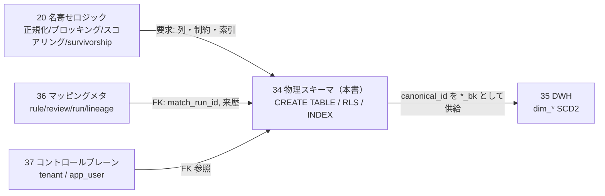
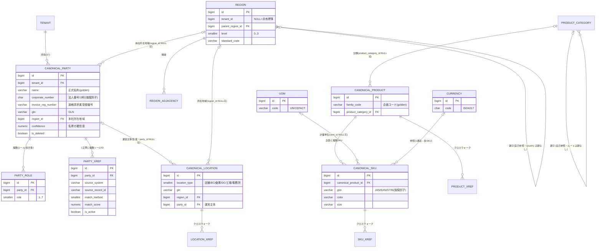
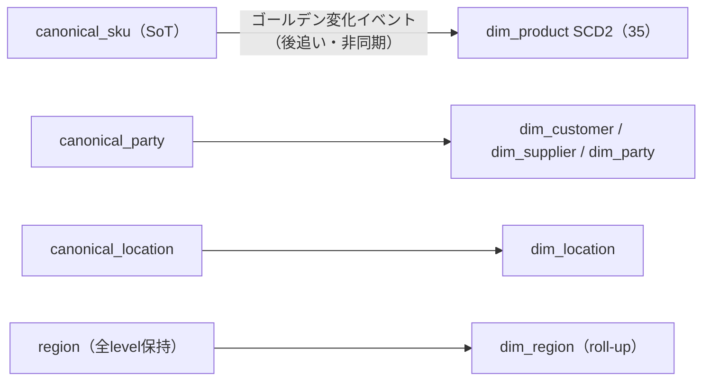

# DBスキーマ設計: MDM / Canonical

本ドキュメントは **SCIP（Supply Chain Intelligence Platform、コード名。正式名称は未確定）** の
**Canonical / MDM（Master Data Management）** の**物理スキーマ**を PostgreSQL の DDL レベルで権威的に定義する。
対象は「取引先（Party）・拠点（Location）・商品（Product/SKU）・地域（Region）」の正準エンティティ、
それらを支える共通参照マスタ（UoM・Currency）、商品分類階層（ProductCategory）、
およびアプリローカル ID を正準 ID へ束ねる**クロスウォーク（xref）群**である。

> **本ドキュメントが権威的に所有する範囲（owns / ブリーフ §14）:**
> `canonical_party`, `party_role`, `canonical_location`, `canonical_product`, `canonical_sku`,
> `product_category`, `region`, `region_adjacency`, `uom`, `currency`, および
> `party_xref` / `product_xref` / `sku_xref` / `location_xref`。
> **所有しない範囲（参照のみ）:** `tenant`・`app_user`（[37 コントロールプレーン](./37-control-plane-backoffice-schema.md)所有）、
> 名寄せルール/レビュー/来歴 `mapping_rule` / `mapping_review` / `load_run` / `data_lineage`（[36 マッピングメタデータ](./36-mapping-metadata-schema.md)所有）、
> `dim_*` / `fact_*`（[35 DWH](./35-star-schema-dwh.md)所有）、各 OLTP のローカルエンティティ（[31](./31-oltp-retail-schema.md)/[32](./32-oltp-manufacturer-schema.md)/[33](./33-oltp-wms-schema.md)）。
> **名寄せロジック（正規化・ブロッキング・スコアリング・survivorship・運用フロー）は
> [20 Canonical/MDM/名寄せ詳細](../detailed-design/20-canonical-mdm-and-entity-resolution.md)が所有**する。本書はそのロジックが要求する
> 「テーブル・列・制約・索引・RLS」を確定する物理層である。命名/DDL/テナンシー横断規約は
> [30 スキーマ戦略と SoT](./30-schema-strategy-and-sot.md)が SoT。

---

## 1. SoT 宣言と責務境界

### 1.1 Canonical DB の SoT 位置づけ（ブリーフ §5 / CLAUDE.md 原則6）

| データ | SoT | 派生元 / 同期方向 | 備考 |
|--------|-----|------------------|------|
| ゴールデンレコード（正準属性: 名称/識別子/住所等） | **Canonical DB（本書 `canonical_*`）** | 各 OLTP（31-33）+ Raw（21）から名寄せ派生。OLTP → 名寄せ → Canonical の**一方向** | 名寄せ**解決結果**の SoT。正準側から OLTP へ書き戻さない |
| クロスウォーク（app-local id ⇄ canonical id） | **Canonical DB（本書 `*_xref`）** | 名寄せ解決で生成 | 解決の唯一の権威。id 対応表 |
| 商品分類階層 `product_category` | **Canonical DB（本書）** | ソース分類を `mapping_rule`(36) で写像 | 正準の分類軸 |
| 地域階層 `region` / 隣接 `region_adjacency` | **Canonical DB（本書）** | 標準地域=標準コード由来（共有）／商圏=テナント定義 | 動的粒度の背骨（§6） |
| 共通参照 `uom` / `currency` | **Canonical DB（本書, プラットフォーム共有）** | 国際標準（UN/CEFACT・ISO 4217）から初期投入 | 全テナント共有・不変マスタ |
| 原データ（ローカル商品/取引先/拠点/取引） | 各 OLTP（31-33）/ Raw（21） | — | 発生元が権威。本書は参照しない |
| 属性単位の来歴（どのソース値を採用したか） | `data_lineage`（36） | — | 本書は**レコード単位**のゴールデンメタのみ保持（§2.3） |
| 名寄せルール/閾値/レビュー | `mapping_rule` / `mapping_review`（36） | — | 本書は `match_run_id` で参照 |

**書込順序（CLAUDE.md 原則6・20 §7.3）:** ①各 OLTP/Raw（SoT）→ ②`canonical_*` ゴールデン UPSERT → ③`data_lineage`(36) → ④`*_xref` UPSERT → ⑤`dim_*`(35) へ非同期公開。本書のテーブルは②と④を担う。

### 1.2 責務境界（本書 = 物理、20 = ロジック）



---

## 2. 共通設計方針（ブリーフ §9 / 30 §4-6 準拠）

### 2.1 全テーブル共通の規約

- **PK:** `id BIGSERIAL PRIMARY KEY`（ハウススタイル）。正準 id は下流（`dim_*.*_bk`）が参照するため**再割当禁止・不変**（20 §3.2）。
- **テナント列:** テナントスコープ表は `tenant_id BIGINT NOT NULL REFERENCES tenant(id)`。RLS 強制（§8）。UNIQUE は先頭に `tenant_id` を含める。例外は共有マスタ `uom`/`currency`（テナント非依存, §5）と `region`（ハイブリッド, §6.1）。
- **論理削除:** Canonical はプラットフォーム新規テーブルのため**標準の `is_deleted BOOLEAN NOT NULL DEFAULT FALSE`** を採用（継承実装の `delete_flag` 慣習は使わない。§9 と 32 の後方互換対象外）。子テーブル `party_role`・`region_adjacency` は論理削除を持たず `ON DELETE CASCADE`。
- **タイムスタンプ:** `created_at`/`updated_at TIMESTAMPTZ NOT NULL DEFAULT now()`（UTC 保存・テナントローカル表示）。名寄せイベント時刻 `resolved_at` も TIMESTAMPTZ。
- **監査列:** `created_by_user_id`/`updated_by_user_id BIGINT NULL REFERENCES app_user(id)`。名寄せは自動処理が多いため NULL 許容（自動解決は NULL、人的解決は解決者 id）。
- **来歴列:** `source_system VARCHAR(64)` / `source_record_id VARCHAR(128)` / `legacy_id VARCHAR(64)`。ゴールデンは複数ソース由来のため、ここには**最優先ソース（primary provenance）**を保持し、属性単位の来歴は `data_lineage`(36) に委譲。
- **索引/制約命名:** 索引 `idx_<table>_<cols>`、一意 `uq_<table>_<cols>`、CHECK `chk_<table>_<rule>`。
- **enum/区分:** `SMALLINT + CHECK(IN (...))`（PG ENUM は使わない）。

### 2.2 ゴールデンレコード共通列（正準エンティティ 4 種に付与）

`canonical_party` / `canonical_location` / `canonical_product` / `canonical_sku` は、業務属性に加えて**レコード単位のゴールデンメタ列**を共通で持つ。

| 列 | 型 | 役割 |
|----|----|------|
| `confidence` | `NUMERIC(5,4)` | 名寄せ確信度（0.0000–1.0000）。自動確定=解決時スコア、人的確定=1.0000、新規採番=1.0000 |
| `match_method` | `SMALLINT` | ゴールデン確定の解決方式。0=決定的 / 1=確率的 / 2=AI支援 / 3=人的（xref と整合, 20 §3.2） |
| `last_match_run_id` | `BIGINT` | 最終解決を行った `load_run`(36) の id（論理参照）。ルール版・モデル版の追跡 |
| `resolved_at` | `TIMESTAMPTZ` | 最終名寄せ確定日時 |
| `resolved_by_user_id` | `BIGINT` | 人的解決者（`match_method=3` 時）。自動は NULL |
| `merged_source_count` | `INTEGER` | このゴールデンに束ねられたソースレコード数（`*_xref` の active 件数と一致させる） |

> **属性単位の provenance は 36 が SoT。** 本書のゴールデンメタは「レコード全体としてどう確定したか」を表す。「正式名称は法定書類ソース、住所は最新ソース」といった**属性ごとの採用元**は `data_lineage`(36) に保持し、本書では二重管理しない（CLAUDE.md 原則3: 重複を作らない）。

### 2.3 名寄せ支援列（ブロッキング / 決定的マッチ）

20 §4 の名寄せロジックが要求する**事前計算列と索引**を正準側に持つ。これにより取込時の候補生成（ブロッキング）と決定的マッチを索引スキャンで実行できる。

| 列種別 | 例 | 索引 |
|--------|----|------|
| 正規化名称（NFKC・法人格除去済） | `name_normalized` | `idx_<t>_tenant_name_norm`（ブロッキング先頭 N-gram も別列可） |
| 音写キー（かな） | `name_kana` | ブロッキング補助 |
| 強識別子（決定的マッチ） | 法人番号 / GTIN / GLN / 標準地域コード | 部分一意索引（非 NULL 行のみ, §3-6） |

---

## 3. ER 図（全体像）



> `CURRENCY`/`UOM` は全テナント共有マスタ。**Canonical DB 内に co-locate される `canonical_sku` は `uom`/`currency` の両方へ物理 FK（`uom_id`/`currency_id`）を張る**（同一 DB のため FK が成立）。加えて `currency_code CHAR(3)`（ブリーフ §9）を表示/検証用の値として別途保持する。一方、**別 DB に分離される各 OLTP（31-33）は物理 FK を張らず `currency_code` を値として保持**する（マルチ DB 配置では共有マスタへの FK が成立しないため）。参照方式の適用範囲は §5.3 で確定。

---

## 4. 地域階層 `region` / `region_adjacency`

分析の基本軸「商品 × **地域** × 販売先」の背骨。20 §5 のロジック（動的粒度・粒度切替・親子整合・循環検出）を物理化する。

### 4.1 テナント共有 vs スコープ（ハイブリッド確定）

20 §5.5 / §10-1 で 34 へ委譲された論点を本書で確定する。**標準地域（国/都道府県/市区町村/メッシュ）は全テナント共有、テナント固有の商圏定義（カスタム trade area）はテナントスコープ**とする。

- `tenant_id BIGINT NULL`: **NULL = 共有標準地域**（JIS/ISO 由来, 管理者が投入）、**非 NULL = テナント固有商圏**。
- RLS は `tenant_id IS NULL OR tenant_id = 現テナント` を可視とし、挿入は自テナントのみに制約（共有地域は `BYPASSRLS` の管理バッチのみ投入）。
- **粒度は非破壊**（20 §5.4）: 既定表示粒度を下げても最深段（mesh）データは削除しない。集計 roll-up は `dim_region`(35) 側。

### 4.2 DDL

```sql
-- region — 動的粒度の地域階層（国 > 都道府県 > 市区町村 > メッシュ）
CREATE TABLE region (
    id                  BIGSERIAL    PRIMARY KEY,                      -- 代理主キー（不変・dim_region.region_bk へ供給）
    tenant_id           BIGINT       NULL REFERENCES tenant(id),       -- NULL=共有標準地域 / 非NULL=テナント固有商圏
    parent_region_id    BIGINT       NULL REFERENCES region(id),       -- 親地域（level-1）。country は NULL
    level               SMALLINT     NOT NULL,                         -- 0=country 1=prefecture 2=municipality 3=mesh
    code_system         VARCHAR(32)  NULL,                             -- 'ISO3166-1' | 'JISX0401' | 'JISX0402' | 'JISX0410' | 'custom'
    standard_code       VARCHAR(32)  NULL,                             -- 標準コード値（例 '13'=東京都, '13113'=渋谷区）
    name                VARCHAR(255) NOT NULL,                         -- 地域名（例 '東京都', '渋谷区'）
    name_normalized     VARCHAR(255) NOT NULL,                         -- 正規化名（旧字体/ケ・ヶ ゆれ吸収, 名寄せ用）
    center_lat          NUMERIC(9,6) NULL,                             -- 代表点緯度（メッシュ中心等）
    center_lng          NUMERIC(9,6) NULL,                             -- 代表点経度
    is_deleted          BOOLEAN      NOT NULL DEFAULT FALSE,           -- 論理削除
    created_at          TIMESTAMPTZ  NOT NULL DEFAULT now(),
    updated_at          TIMESTAMPTZ  NOT NULL DEFAULT now(),
    created_by_user_id  BIGINT       NULL REFERENCES app_user(id),
    updated_by_user_id  BIGINT       NULL REFERENCES app_user(id),
    legacy_id           VARCHAR(64)  NULL,
    CONSTRAINT chk_region_level CHECK (level BETWEEN 0 AND 3),         -- 粒度は 0-3（MDM-002）
    CONSTRAINT chk_region_root  CHECK (                                -- level 0 は親なし、それ以外は親必須（段飛ばし検証は§4.3 トリガ）
        (level = 0 AND parent_region_id IS NULL) OR
        (level > 0 AND parent_region_id IS NOT NULL))
);
-- 標準コードはコード体系×コード値でテナント内一意（NULL 商圏は対象外）
CREATE UNIQUE INDEX uq_region_scope_stdcode ON region (COALESCE(tenant_id, 0), code_system, standard_code)
    WHERE standard_code IS NOT NULL AND is_deleted = FALSE;
CREATE INDEX idx_region_parent      ON region (parent_region_id);
CREATE INDEX idx_region_level       ON region (level) WHERE is_deleted = FALSE;
CREATE INDEX idx_region_name_norm   ON region (name_normalized);      -- 地域名 確率マッチのブロッキング
COMMENT ON COLUMN region.tenant_id      IS 'NULL=全テナント共有の標準地域。非NULL=テナント固有商圏。RLS は NULL を全テナント可視とする';
COMMENT ON COLUMN region.level          IS '地域粒度。0=国 1=都道府県 2=市区町村 3=標準地域メッシュ。親は必ず level-1（20 §5.2）';
COMMENT ON COLUMN region.standard_code  IS 'JIS X 0401/0402/0410 または ISO 3166-1 の標準コード。市区町村コード上2桁で都道府県を導出可能';

-- region_adjacency — 地域隣接関係（商圏の隣接分析用。無向グラフを 2 行で表現）
CREATE TABLE region_adjacency (
    id                  BIGSERIAL   PRIMARY KEY,
    tenant_id           BIGINT      NULL REFERENCES tenant(id),        -- region と同じスコープ規則（NULL=共有）
    region_id           BIGINT      NOT NULL REFERENCES region(id) ON DELETE CASCADE,       -- 起点
    neighbor_region_id  BIGINT      NOT NULL REFERENCES region(id) ON DELETE CASCADE,       -- 隣接先
    created_at          TIMESTAMPTZ NOT NULL DEFAULT now(),
    CONSTRAINT chk_region_adjacency_distinct CHECK (region_id <> neighbor_region_id),       -- 自己隣接禁止
    CONSTRAINT uq_region_adjacency UNIQUE (region_id, neighbor_region_id)
);
CREATE INDEX idx_region_adjacency_region ON region_adjacency (region_id);
```

### 4.3 親子整合・循環検出（トリガ要求 → 20 §5.2 のロジックを物理強制）

- **段連続性:** `parent_region_id` の指す親は `level - 1` でなければならない（段飛ばし禁止, `MAP-006`）。CHECK 単体では親行 level を参照できないため、**BEFORE INSERT/UPDATE トリガ**で親 level を検証する（`getAfter` 相当の整合を DB 側で保証）。
- **循環検出:** parent チェーンを辿り自分に戻る閉路を禁止（`MDM-003`）。トリガで再帰 CTE により祖先集合を計算し、自身が含まれれば拒否する。
- 実装はトリガ関数 `trg_region_hierarchy_check()` を本書 owns の一部として定義（詳細アルゴリズムは 20 §5.2、DDL 化は 34 の責務）。

---

## 5. 共通参照マスタ `uom` / `currency`

計量単位・通貨は**国際標準に基づく全テナント共有の不変マスタ**であり、テナント分離の対象外とする（30 §4 の共有参照方針）。ゆえに `tenant_id` を持たず RLS も適用しない。

### 5.1 `uom`（計量単位）

```sql
-- uom — 計量単位（UN/CEFACT Recommendation 20 準拠の共有マスタ）
CREATE TABLE uom (
    id          BIGSERIAL   PRIMARY KEY,
    code        VARCHAR(8)  NOT NULL,                                  -- UN/CEFACT コード（例 'C62'=個, 'KGM'=kg, 'MTR'=m）
    name        VARCHAR(64) NOT NULL,                                  -- 表示名（例 '個', 'キログラム'）
    category    SMALLINT    NOT NULL,                                  -- 1=数量 2=質量 3=長さ 4=面積 5=体積 6=時間
    is_deleted  BOOLEAN     NOT NULL DEFAULT FALSE,
    created_at  TIMESTAMPTZ NOT NULL DEFAULT now(),
    updated_at  TIMESTAMPTZ NOT NULL DEFAULT now(),
    CONSTRAINT chk_uom_code_nonempty CHECK (char_length(code) > 0),  -- CHECK は chk_ 接頭辞（uq_ は一意制約/索引専用, §2.1）
    CONSTRAINT chk_uom_category CHECK (category BETWEEN 1 AND 6)
);
CREATE UNIQUE INDEX uq_uom_code_active ON uom (code) WHERE is_deleted = FALSE;
COMMENT ON TABLE uom IS '計量単位マスタ。全テナント共有・UN/CEFACT 標準から初期投入。テナント分離しない';
```

### 5.2 `currency`（通貨）

```sql
-- currency — 通貨（ISO 4217 準拠の共有マスタ）
CREATE TABLE currency (
    id          BIGSERIAL   PRIMARY KEY,
    code        CHAR(3)     NOT NULL,                                  -- ISO 4217（'JPY','USD','CNY' 等）
    name        VARCHAR(64) NOT NULL,                                  -- 通貨名
    symbol      VARCHAR(8)  NULL,                                      -- 記号（'¥','$'）
    minor_unit  SMALLINT    NOT NULL DEFAULT 0,                        -- 補助単位桁数（JPY=0, USD=2）
    is_deleted  BOOLEAN     NOT NULL DEFAULT FALSE,
    created_at  TIMESTAMPTZ NOT NULL DEFAULT now(),
    updated_at  TIMESTAMPTZ NOT NULL DEFAULT now(),
    CONSTRAINT chk_currency_code CHECK (code ~ '^[A-Z]{3}$')          -- 3 文字大文字
);
CREATE UNIQUE INDEX uq_currency_code_active ON currency (code) WHERE is_deleted = FALSE;
COMMENT ON TABLE currency IS '通貨マスタ。全テナント共有・ISO 4217 から初期投入。OLTP は currency_code CHAR(3) を直接保持し本表で検証';
```

### 5.3 共有参照マスタ（`uom`/`currency`）の参照方式（ブリーフ §9 との整合）

共有マスタへの参照方式は**「参照元が共有マスタと同一 DB に co-locate されるか否か」で一貫して決定**する。同種の共有マスタ（`uom`・`currency`）に対して根拠が片方だけに適用される矛盾を避けるため、以下に統一する。

- **Canonical DB 内（co-locate）— 物理 FK を張る:** `uom`・`currency`・`canonical_*` はいずれも同一 Canonical DB 内に配置されるため、物理 FK が成立する。`canonical_sku` は `uom_id BIGINT REFERENCES uom(id)` と `currency_id BIGINT REFERENCES currency(id)` の**両方に物理 FK** を張り、参照整合性を DB 側で保証する。
- **表示/検証用の値保持は併存:** `canonical_sku.currency_code CHAR(3) NOT NULL DEFAULT 'JPY'`（ブリーフ §9）は、FK とは別に (a) 表示、(b) `dim_currency`(35) 生成、(c) OLTP 由来値との突合、のために保持する。`currency_id` と `currency_code` の整合はアプリ/取込層で担保する（両者が指す通貨は一致させる）。
- **別 DB の各 OLTP（31-33）— 物理 FK を張らない:** OLTP は Canonical DB とは別の DB に分離されるため、共有マスタへの物理 FK は**マルチ DB 配置で成立しない**。ゆえに OLTP は `currency_code CHAR(3)` を値として保持し、コード妥当性はアプリ/取込層で CHECK 相当を担保する。

すなわち「マルチ DB 配置で FK が成立しない」という根拠は**別 DB に分離される OLTP にのみ適用**され、Canonical DB 内で完結する `canonical_sku`→`uom`/`currency` には適用されない。この判断は 30（横断規約）と整合する。`currency` テーブルは (a) コード妥当性の検証、(b) 表示名/記号/minor_unit の解決、(c) `dim_currency`(35) の生成元、として機能する。

---

## 6. 取引先 `canonical_party` / `party_role`

Party モデル（1 エンティティ + 複数ロール, ブリーフ §7）。強識別子（法人番号・適格請求書登録番号・GLN）で決定的マッチ、弱識別子（正規化名・住所・電話）で確率的マッチ（20 §3.1）。

```sql
-- canonical_party — 取引先ゴールデンレコード
CREATE TABLE canonical_party (
    id                  BIGSERIAL     PRIMARY KEY,                     -- 正準 Party id（不変・dim_party/customer/supplier の *_bk）
    tenant_id           BIGINT        NOT NULL REFERENCES tenant(id),  -- テナント（RLS 対象）
    -- ゴールデン業務属性
    name                VARCHAR(255)  NOT NULL,                        -- 正式名称（survivorship: 法定書類ソース優先）
    name_kana           VARCHAR(255)  NULL,                            -- カナ名（音写ブロッキング）
    name_normalized     VARCHAR(255)  NOT NULL,                        -- 正規化名（法人格除去・NFKC, ブロッキング/確率マッチ）
    corporate_number    CHAR(13)      NULL,                            -- 法人番号（13桁・強識別子。チェックデジット検証済）
    invoice_reg_number  VARCHAR(14)   NULL,                            -- 適格請求書発行事業者登録番号（'T'+13桁・強識別子）
    gln                 VARCHAR(13)   NULL,                            -- GLN（強識別子）
    representative_name VARCHAR(255)  NULL,                            -- 代表者名（弱識別子・補助）
    phone               VARCHAR(20)   NULL,                            -- 正規化電話（数字のみ）
    postal_code         VARCHAR(8)    NULL,                            -- 郵便番号（ハイフンなし）
    address_line        VARCHAR(500)  NULL,                            -- 住所（正規化済・本社所在地）
    region_id           BIGINT        NULL REFERENCES region(id),      -- 本社所在地域（§4）
    -- ゴールデンメタ（§2.2）
    confidence          NUMERIC(5,4)  NOT NULL DEFAULT 1.0000,
    match_method        SMALLINT      NOT NULL DEFAULT 3,              -- 0=決定的 1=確率的 2=AI支援 3=人的
    last_match_run_id   BIGINT        NULL,                            -- load_run(36) 論理参照
    resolved_at         TIMESTAMPTZ   NULL,
    resolved_by_user_id BIGINT        NULL REFERENCES app_user(id),
    merged_source_count INTEGER       NOT NULL DEFAULT 0,
    -- 来歴（primary provenance）
    source_system       VARCHAR(64)   NULL,                            -- 最優先ソース識別（36 source_system）
    source_record_id    VARCHAR(128)  NULL,
    legacy_id           VARCHAR(64)   NULL,
    -- 標準列
    is_deleted          BOOLEAN       NOT NULL DEFAULT FALSE,
    created_at          TIMESTAMPTZ   NOT NULL DEFAULT now(),
    updated_at          TIMESTAMPTZ   NOT NULL DEFAULT now(),
    created_by_user_id  BIGINT        NULL REFERENCES app_user(id),
    updated_by_user_id  BIGINT        NULL REFERENCES app_user(id),
    CONSTRAINT chk_canonical_party_method CHECK (match_method BETWEEN 0 AND 3),
    CONSTRAINT chk_canonical_party_conf   CHECK (confidence >= 0 AND confidence <= 1)
);
-- 強識別子の部分一意（決定的マッチ・テナントスコープ, 20 §4.3）
CREATE UNIQUE INDEX uq_canonical_party_corpnum
    ON canonical_party (tenant_id, corporate_number) WHERE corporate_number IS NOT NULL AND is_deleted = FALSE;
CREATE UNIQUE INDEX uq_canonical_party_invoicereg
    ON canonical_party (tenant_id, invoice_reg_number) WHERE invoice_reg_number IS NOT NULL AND is_deleted = FALSE;
CREATE UNIQUE INDEX uq_canonical_party_gln
    ON canonical_party (tenant_id, gln) WHERE gln IS NOT NULL AND is_deleted = FALSE;
-- ブロッキング索引（確率的マッチの候補生成）
CREATE INDEX idx_canonical_party_name_norm ON canonical_party (tenant_id, name_normalized);
CREATE INDEX idx_canonical_party_postal    ON canonical_party (tenant_id, postal_code) WHERE postal_code IS NOT NULL;
CREATE INDEX idx_canonical_party_region    ON canonical_party (tenant_id, region_id);
COMMENT ON COLUMN canonical_party.name             IS '正式名称ゴールデン値。survivorship で法定書類ソースを優先（属性来歴は 36 data_lineage）';
COMMENT ON COLUMN canonical_party.corporate_number IS '法人番号13桁。強識別子。決定的マッチ最優先。テナント内で部分一意';
COMMENT ON COLUMN canonical_party.confidence       IS '名寄せ確信度 0-1。自動確定=解決スコア、人的/新規=1.0';

-- party_role — Party の複数ロール（多対多。子テーブル＝論理削除なし CASCADE）
CREATE TABLE party_role (
    id                  BIGSERIAL   PRIMARY KEY,
    tenant_id           BIGINT      NOT NULL REFERENCES tenant(id),
    party_id            BIGINT      NOT NULL REFERENCES canonical_party(id) ON DELETE CASCADE,   -- 明細→親 CASCADE
    role                SMALLINT    NOT NULL,                          -- 1=supplier 2=customer 3=retailer 4=manufacturer 5=warehouse_operator 6=shipper(荷主) 7=carrier
    created_at          TIMESTAMPTZ NOT NULL DEFAULT now(),
    updated_at          TIMESTAMPTZ NOT NULL DEFAULT now(),
    CONSTRAINT chk_party_role_role CHECK (role BETWEEN 1 AND 7),
    CONSTRAINT uq_party_role UNIQUE (tenant_id, party_id, role)        -- 同一 Party に同一ロール重複禁止
);
CREATE INDEX idx_party_role_role ON party_role (tenant_id, role);      -- 「全 supplier」等のロール引き
COMMENT ON COLUMN party_role.role IS 'ロール区分。1社が複数ロールを持てる（Party モデル, ブリーフ §7）。荷主=6/carrier=7';
```

---

## 7. 拠点 `canonical_location`

拠点タイプ（店舗/EC/倉庫/DC/工場/事務所, ブリーフ §7）。地域（`region`）と運営主体（`canonical_party`）へ紐付く。強識別子は GLN・施設コード・郵便番号+建物（20 §3.1）。

```sql
-- canonical_location — 拠点ゴールデンレコード
CREATE TABLE canonical_location (
    id                  BIGSERIAL     PRIMARY KEY,                     -- 正準 Location id（dim_location.location_bk）
    tenant_id           BIGINT        NOT NULL REFERENCES tenant(id),
    location_type       SMALLINT      NOT NULL,                        -- 1=store 2=ec_channel 3=warehouse 4=dc 5=factory 6=office
    name                VARCHAR(255)  NOT NULL,                        -- 拠点名
    name_normalized     VARCHAR(255)  NOT NULL,                        -- 正規化名（ブロッキング）
    gln                 VARCHAR(13)   NULL,                            -- GLN（強識別子）
    facility_code       VARCHAR(64)   NULL,                            -- 施設コード（ソース固有・強識別子候補）
    postal_code         VARCHAR(8)    NULL,                            -- 郵便番号
    address_line        VARCHAR(500)  NULL,                            -- 正規化住所
    building_name       VARCHAR(255)  NULL,                            -- 建物名（郵便番号+建物で決定的マッチ）
    region_id           BIGINT        NULL REFERENCES region(id),      -- 所在地域（§4）
    party_id            BIGINT        NULL REFERENCES canonical_party(id),  -- 運営主体（任意。店舗運営会社/倉庫事業者）
    latitude            NUMERIC(9,6)  NULL,                            -- 緯度（商圏メッシュ解決・弱識別子）
    longitude           NUMERIC(9,6)  NULL,                            -- 経度
    -- ゴールデンメタ（§2.2）
    confidence          NUMERIC(5,4)  NOT NULL DEFAULT 1.0000,
    match_method        SMALLINT      NOT NULL DEFAULT 3,
    last_match_run_id   BIGINT        NULL,
    resolved_at         TIMESTAMPTZ   NULL,
    resolved_by_user_id BIGINT        NULL REFERENCES app_user(id),
    merged_source_count INTEGER       NOT NULL DEFAULT 0,
    -- 来歴
    source_system       VARCHAR(64)   NULL,
    source_record_id    VARCHAR(128)  NULL,
    legacy_id           VARCHAR(64)   NULL,
    -- 標準列
    is_deleted          BOOLEAN       NOT NULL DEFAULT FALSE,
    created_at          TIMESTAMPTZ   NOT NULL DEFAULT now(),
    updated_at          TIMESTAMPTZ   NOT NULL DEFAULT now(),
    created_by_user_id  BIGINT        NULL REFERENCES app_user(id),
    updated_by_user_id  BIGINT        NULL REFERENCES app_user(id),
    CONSTRAINT chk_canonical_location_type   CHECK (location_type BETWEEN 1 AND 6),
    CONSTRAINT chk_canonical_location_method CHECK (match_method BETWEEN 0 AND 3),
    CONSTRAINT chk_canonical_location_conf   CHECK (confidence >= 0 AND confidence <= 1)
);
CREATE UNIQUE INDEX uq_canonical_location_gln
    ON canonical_location (tenant_id, gln) WHERE gln IS NOT NULL AND is_deleted = FALSE;
CREATE UNIQUE INDEX uq_canonical_location_facility
    ON canonical_location (tenant_id, facility_code) WHERE facility_code IS NOT NULL AND is_deleted = FALSE;
CREATE INDEX idx_canonical_location_name_norm ON canonical_location (tenant_id, name_normalized);
CREATE INDEX idx_canonical_location_region    ON canonical_location (tenant_id, region_id);
CREATE INDEX idx_canonical_location_party     ON canonical_location (tenant_id, party_id);
CREATE INDEX idx_canonical_location_type      ON canonical_location (tenant_id, location_type) WHERE is_deleted = FALSE;
COMMENT ON COLUMN canonical_location.location_type IS '拠点タイプ。1=店舗 2=ECチャネル 3=倉庫 4=DC 5=工場 6=事務所';
COMMENT ON COLUMN canonical_location.party_id      IS '運営主体 Party（任意）。店舗運営会社・倉庫事業者・工場保有会社';
```

---

## 8. 商品分類 `product_category` / 商品 `canonical_product` / SKU `canonical_sku`

2 層商品モデル（企画/商品ファミリ = `canonical_product`、SKU = `canonical_sku`, ブリーフ §7）。Honshu 11 桁品番はこのモデルの一実装であり、桁構成ルールは**共有カーネルに持ち込まず** xref で対応づける（20 §6.2）。

### 8.1 `product_category`（自己参照・可変段数）

```sql
-- product_category — 商品分類階層（正準の分類軸。自己参照・段数可変）
CREATE TABLE product_category (
    id                  BIGSERIAL     PRIMARY KEY,
    tenant_id           BIGINT        NOT NULL REFERENCES tenant(id),
    parent_category_id  BIGINT        NULL REFERENCES product_category(id),   -- 親分類（ルートは NULL）
    level               SMALLINT      NOT NULL,                        -- 0 起点の階層深さ（段飛ばし禁止・§8.4 トリガ）
    code                VARCHAR(32)   NOT NULL,                        -- 分類コード（テナント内一意）
    name                VARCHAR(255)  NOT NULL,                        -- 分類名
    name_normalized     VARCHAR(255)  NOT NULL,                        -- 正規化名（マッピング用）
    sort_order          INTEGER       NOT NULL DEFAULT 0,              -- 表示順
    is_deleted          BOOLEAN       NOT NULL DEFAULT FALSE,
    created_at          TIMESTAMPTZ   NOT NULL DEFAULT now(),
    updated_at          TIMESTAMPTZ   NOT NULL DEFAULT now(),
    created_by_user_id  BIGINT        NULL REFERENCES app_user(id),
    updated_by_user_id  BIGINT        NULL REFERENCES app_user(id),
    legacy_id           VARCHAR(64)   NULL,
    CONSTRAINT chk_product_category_level CHECK (level >= 0),
    CONSTRAINT uq_product_category_code UNIQUE (tenant_id, code)
);
CREATE INDEX idx_product_category_parent ON product_category (parent_category_id);
CREATE INDEX idx_product_category_tenant ON product_category (tenant_id) WHERE is_deleted = FALSE;
COMMENT ON COLUMN product_category.parent_category_id IS '親分類。循環参照は MDM-003 で拒否（§8.4 トリガ）。未マップは「未分類」ノードへ退避（MAP-004）';
```

### 8.2 `canonical_product`（企画/商品ファミリ）

```sql
-- canonical_product — 商品企画（ファミリ）ゴールデンレコード
CREATE TABLE canonical_product (
    id                  BIGSERIAL     PRIMARY KEY,                     -- 正準 Product id（企画粒度）
    tenant_id           BIGINT        NOT NULL REFERENCES tenant(id),
    -- ゴールデン業務属性
    family_code         VARCHAR(64)   NULL,                            -- 企画コード（テナント内・正規品番の企画部）
    name                VARCHAR(255)  NOT NULL,                        -- 品名（企画名, golden）
    name_normalized     VARCHAR(255)  NOT NULL,                        -- 正規化品名（トークン化・ブロッキング）
    brand_code          VARCHAR(32)   NULL,                            -- ブランド（弱識別子）
    product_category_id BIGINT        NULL REFERENCES product_category(id),  -- 分類（§8.1）
    season              VARCHAR(32)   NULL,                            -- シーズン（通年/春夏/秋冬 + 年次要素）
    product_type        VARCHAR(64)   NULL,                            -- 商品タイプ（構造・ターゲット）
    material_code       VARCHAR(32)   NULL,                            -- 主素材（弱識別子）
    positioning_tag     VARCHAR(64)   NULL,                            -- 商業ポジショニング（Honshu product_group 相当・分類とは別軸, 20 §6.3）
    -- ゴールデンメタ（§2.2）
    confidence          NUMERIC(5,4)  NOT NULL DEFAULT 1.0000,
    match_method        SMALLINT      NOT NULL DEFAULT 3,
    last_match_run_id   BIGINT        NULL,
    resolved_at         TIMESTAMPTZ   NULL,
    resolved_by_user_id BIGINT        NULL REFERENCES app_user(id),
    merged_source_count INTEGER       NOT NULL DEFAULT 0,
    -- 来歴
    source_system       VARCHAR(64)   NULL,
    source_record_id    VARCHAR(128)  NULL,
    legacy_id           VARCHAR(64)   NULL,
    -- 標準列
    is_deleted          BOOLEAN       NOT NULL DEFAULT FALSE,
    created_at          TIMESTAMPTZ   NOT NULL DEFAULT now(),
    updated_at          TIMESTAMPTZ   NOT NULL DEFAULT now(),
    created_by_user_id  BIGINT        NULL REFERENCES app_user(id),
    updated_by_user_id  BIGINT        NULL REFERENCES app_user(id),
    CONSTRAINT chk_canonical_product_method CHECK (match_method BETWEEN 0 AND 3),
    CONSTRAINT chk_canonical_product_conf   CHECK (confidence >= 0 AND confidence <= 1)
);
CREATE UNIQUE INDEX uq_canonical_product_family
    ON canonical_product (tenant_id, family_code) WHERE family_code IS NOT NULL AND is_deleted = FALSE;
CREATE INDEX idx_canonical_product_name_norm ON canonical_product (tenant_id, name_normalized);
CREATE INDEX idx_canonical_product_category  ON canonical_product (tenant_id, product_category_id);
COMMENT ON COLUMN canonical_product.positioning_tag IS 'Honshu product_group（商業ポジショニング）は分類軸と別軸のため category に写像せずタグ保持（20 §6.3）';
```

### 8.3 `canonical_sku`（SKU 粒度）

```sql
-- canonical_sku — SKU ゴールデンレコード（色×サイズ等で増殖する最小単位）
CREATE TABLE canonical_sku (
    id                   BIGSERIAL    PRIMARY KEY,                     -- 正準 SKU id（dim_product.product_bk）
    tenant_id            BIGINT       NOT NULL REFERENCES tenant(id),
    canonical_product_id BIGINT       NOT NULL REFERENCES canonical_product(id),  -- 所属企画（§8.2）。NO ACTION（独立解決エンティティ・論理削除運用）
    -- ゴールデン業務属性
    sku_code             VARCHAR(64)  NULL,                            -- 正準 SKU コード（正規品番。Honshu は 11桁を保持）
    gtin                 VARCHAR(14)  NULL,                            -- JAN/EAN/GTIN（13/8/14桁・強識別子。モジュラス10検証済）
    name                 VARCHAR(255) NOT NULL,                        -- SKU 名
    name_normalized      VARCHAR(255) NOT NULL,                        -- 正規化名（ブロッキング）
    color                VARCHAR(64)  NULL,                            -- 色（弱識別子）
    size                 VARCHAR(32)  NULL,                            -- サイズ（弱識別子）
    material_code        VARCHAR(32)  NULL,                            -- 素材
    uom_id               BIGINT       NULL REFERENCES uom(id),         -- 計量単位（§5.1・共有マスタ・Canonical DB 内 co-locate のため物理 FK）
    currency_id          BIGINT       NULL REFERENCES currency(id),    -- 通貨（§5.2・Canonical DB 内 co-locate のため物理 FK, §5.3）
    currency_code        CHAR(3)      NOT NULL DEFAULT 'JPY',          -- 通貨コード（表示/検証用の値・§5.3。currency_id と整合させる）
    -- ゴールデンメタ（§2.2）
    confidence           NUMERIC(5,4) NOT NULL DEFAULT 1.0000,
    match_method         SMALLINT     NOT NULL DEFAULT 3,
    last_match_run_id    BIGINT       NULL,
    resolved_at          TIMESTAMPTZ  NULL,
    resolved_by_user_id  BIGINT       NULL REFERENCES app_user(id),
    merged_source_count  INTEGER      NOT NULL DEFAULT 0,
    -- 来歴
    source_system        VARCHAR(64)  NULL,
    source_record_id     VARCHAR(128) NULL,
    legacy_id            VARCHAR(64)  NULL,
    -- 標準列
    is_deleted           BOOLEAN      NOT NULL DEFAULT FALSE,
    created_at           TIMESTAMPTZ  NOT NULL DEFAULT now(),
    updated_at           TIMESTAMPTZ  NOT NULL DEFAULT now(),
    created_by_user_id   BIGINT       NULL REFERENCES app_user(id),
    updated_by_user_id   BIGINT       NULL REFERENCES app_user(id),
    CONSTRAINT chk_canonical_sku_method CHECK (match_method BETWEEN 0 AND 3),
    CONSTRAINT chk_canonical_sku_conf   CHECK (confidence >= 0 AND confidence <= 1),
    CONSTRAINT chk_canonical_sku_ccy    CHECK (currency_code ~ '^[A-Z]{3}$')
);
CREATE UNIQUE INDEX uq_canonical_sku_gtin
    ON canonical_sku (tenant_id, gtin) WHERE gtin IS NOT NULL AND is_deleted = FALSE;
CREATE UNIQUE INDEX uq_canonical_sku_code
    ON canonical_sku (tenant_id, sku_code) WHERE sku_code IS NOT NULL AND is_deleted = FALSE;  -- 正規品番テナント内一意（決定的マッチ）
CREATE INDEX idx_canonical_sku_product   ON canonical_sku (tenant_id, canonical_product_id);
CREATE INDEX idx_canonical_sku_name_norm ON canonical_sku (tenant_id, name_normalized);
COMMENT ON COLUMN canonical_sku.canonical_product_id IS '所属企画。SKU は独立に名寄せ解決される第一級エンティティのため CASCADE でなく論理削除運用';
COMMENT ON COLUMN canonical_sku.sku_code             IS '正準 SKU コード。Honshu 11桁品番は正規化して強識別子に使用。桁分解には依存しない（20 §6.2）';
COMMENT ON COLUMN canonical_sku.currency_id          IS '通貨（currency.id への物理 FK）。Canonical DB 内 co-locate のため FK を張る（§5.3）';
COMMENT ON COLUMN canonical_sku.currency_code        IS '通貨コード ISO4217。表示/検証用の値として保持（§5.3）。currency_id が指す通貨と整合させる';
```

### 8.4 分類・SKU 階層の整合

- **`product_category` 段連続・循環:** `region` と同型のトリガ `trg_product_category_hierarchy_check()` で親 level 検証（段飛ばし禁止）・循環検出（`MDM-003`）を DB 側で強制。
- **未マップ分類の退避:** ソース分類が正準へ未対応の場合、テナントごとの「未分類」`product_category` ノードへ暫定紐付けし `MAP-004` を発行、人的レビュー（36 `mapping_review`）で解消（20 §6.3）。

---

## 9. クロスウォーク（xref）群

app-local id ⇄ canonical id の対応表。**解決の SoT**（ブリーフ §5）。4 正準エンティティに対応する 4 表を**同一形状**で定義する（20 §3.2 の不変性ルールを物理化）。

### 9.1 共通形状と不変性ルール

| ルール | 物理強制 |
|--------|---------|
| 同一ソースの同一ローカル ID は高々 1 正準に対応（多重対応禁止） | `uq_<x>_tenant_source_record (tenant_id, source_system, source_record_id)` |
| 1 正準は複数ソース ID を集約（1 対多） | canonical id への FK（非一意） |
| canonical id は再割当しない（split は新 id + 旧 xref 無効化） | `is_active BOOLEAN`。物理削除しない |
| 解決方式・スコア・実行を監査可能に記録 | `match_method` / `match_score` / `match_run_id` |
| 来歴からリプレイ可能 | `source_system` / `source_record_id` 必須 |

### 9.2 DDL

```sql
-- party_xref — 取引先クロスウォーク
CREATE TABLE party_xref (
    id                  BIGSERIAL    PRIMARY KEY,
    tenant_id           BIGINT       NOT NULL REFERENCES tenant(id),
    party_id            BIGINT       NOT NULL REFERENCES canonical_party(id),  -- 解決先 正準 Party
    source_system       VARCHAR(64)  NOT NULL,                        -- 由来アプリ（36 source_system）
    source_record_id    VARCHAR(128) NOT NULL,                        -- ソース内ローカル id
    match_method        SMALLINT     NOT NULL,                        -- 0=決定的 1=確率的 2=AI支援 3=人的
    match_score         NUMERIC(5,4) NULL,                            -- 解決時スコア（決定的/新規は 1.0/NULL）
    match_run_id        BIGINT       NULL,                            -- 解決を行った load_run(36)
    is_active           BOOLEAN      NOT NULL DEFAULT TRUE,           -- 誤マージ是正で無効化（split）
    created_at          TIMESTAMPTZ  NOT NULL DEFAULT now(),
    updated_at          TIMESTAMPTZ  NOT NULL DEFAULT now(),
    resolved_by_user_id BIGINT       NULL REFERENCES app_user(id),   -- 人的解決者
    legacy_id           VARCHAR(64)  NULL,
    CONSTRAINT chk_party_xref_method CHECK (match_method BETWEEN 0 AND 3),
    CONSTRAINT uq_party_xref_tenant_source_record UNIQUE (tenant_id, source_system, source_record_id)
);
CREATE INDEX idx_party_xref_party  ON party_xref (tenant_id, party_id) WHERE is_active = TRUE;
CREATE INDEX idx_party_xref_run    ON party_xref (match_run_id);
COMMENT ON TABLE party_xref IS '取引先 app-local id ⇄ canonical_party.id の解決 SoT。1正準に複数ソース、逆は高々1対応';

-- location_xref — 拠点クロスウォーク（party_xref と同型）
CREATE TABLE location_xref (
    id                  BIGSERIAL    PRIMARY KEY,
    tenant_id           BIGINT       NOT NULL REFERENCES tenant(id),
    location_id         BIGINT       NOT NULL REFERENCES canonical_location(id),
    source_system       VARCHAR(64)  NOT NULL,
    source_record_id    VARCHAR(128) NOT NULL,
    match_method        SMALLINT     NOT NULL,
    match_score         NUMERIC(5,4) NULL,
    match_run_id        BIGINT       NULL,
    is_active           BOOLEAN      NOT NULL DEFAULT TRUE,
    created_at          TIMESTAMPTZ  NOT NULL DEFAULT now(),
    updated_at          TIMESTAMPTZ  NOT NULL DEFAULT now(),
    resolved_by_user_id BIGINT       NULL REFERENCES app_user(id),
    legacy_id           VARCHAR(64)  NULL,
    CONSTRAINT chk_location_xref_method CHECK (match_method BETWEEN 0 AND 3),
    CONSTRAINT uq_location_xref_tenant_source_record UNIQUE (tenant_id, source_system, source_record_id)
);
CREATE INDEX idx_location_xref_location ON location_xref (tenant_id, location_id) WHERE is_active = TRUE;
CREATE INDEX idx_location_xref_run      ON location_xref (match_run_id);

-- product_xref — 商品企画クロスウォーク（source_record_id = family_id 等）
CREATE TABLE product_xref (
    id                  BIGSERIAL    PRIMARY KEY,
    tenant_id           BIGINT       NOT NULL REFERENCES tenant(id),
    canonical_product_id BIGINT      NOT NULL REFERENCES canonical_product(id),
    source_system       VARCHAR(64)  NOT NULL,
    source_record_id    VARCHAR(128) NOT NULL,
    match_method        SMALLINT     NOT NULL,
    match_score         NUMERIC(5,4) NULL,
    match_run_id        BIGINT       NULL,
    is_active           BOOLEAN      NOT NULL DEFAULT TRUE,
    created_at          TIMESTAMPTZ  NOT NULL DEFAULT now(),
    updated_at          TIMESTAMPTZ  NOT NULL DEFAULT now(),
    resolved_by_user_id BIGINT       NULL REFERENCES app_user(id),
    legacy_id           VARCHAR(64)  NULL,
    CONSTRAINT chk_product_xref_method CHECK (match_method BETWEEN 0 AND 3),
    CONSTRAINT uq_product_xref_tenant_source_record UNIQUE (tenant_id, source_system, source_record_id)
);
CREATE INDEX idx_product_xref_product ON product_xref (tenant_id, canonical_product_id) WHERE is_active = TRUE;
CREATE INDEX idx_product_xref_run     ON product_xref (match_run_id);

-- sku_xref — SKU クロスウォーク（source_record_id = 11桁品番等）
CREATE TABLE sku_xref (
    id                  BIGSERIAL    PRIMARY KEY,
    tenant_id           BIGINT       NOT NULL REFERENCES tenant(id),
    canonical_sku_id    BIGINT       NOT NULL REFERENCES canonical_sku(id),
    source_system       VARCHAR(64)  NOT NULL,
    source_record_id    VARCHAR(128) NOT NULL,
    match_method        SMALLINT     NOT NULL,
    match_score         NUMERIC(5,4) NULL,
    match_run_id        BIGINT       NULL,
    is_active           BOOLEAN      NOT NULL DEFAULT TRUE,
    created_at          TIMESTAMPTZ  NOT NULL DEFAULT now(),
    updated_at          TIMESTAMPTZ  NOT NULL DEFAULT now(),
    resolved_by_user_id BIGINT       NULL REFERENCES app_user(id),
    legacy_id           VARCHAR(64)  NULL,
    CONSTRAINT chk_sku_xref_method CHECK (match_method BETWEEN 0 AND 3),
    CONSTRAINT uq_sku_xref_tenant_source_record UNIQUE (tenant_id, source_system, source_record_id)
);
CREATE INDEX idx_sku_xref_sku ON sku_xref (tenant_id, canonical_sku_id) WHERE is_active = TRUE;
CREATE INDEX idx_sku_xref_run ON sku_xref (match_run_id);
```

> **split（誤マージ是正）の物理挙動:** 当該 xref を `is_active=FALSE` に更新（物理削除しない）→ 切り出す実体へ**新 canonical id を採番**→ 新 xref を `is_active=TRUE` で登録。旧 canonical id は履歴として残し再利用しない（`MAP-003`, 20 §4.7）。`merged_source_count` は active xref 件数へ再計算。

---

## 10. RLS（Row-Level Security）

テナントスコープ表に一律適用（30 §4.2）。共有マスタ `uom`/`currency` は非適用。`region`/`region_adjacency` は共有行（`tenant_id IS NULL`）を全テナント可視とする特別ポリシー。

```sql
-- テナントスコープ表（canonical_party/party_role/canonical_location/product_category/
--   canonical_product/canonical_sku/party_xref/location_xref/product_xref/sku_xref）に一律適用
ALTER TABLE canonical_party ENABLE ROW LEVEL SECURITY;
ALTER TABLE canonical_party FORCE  ROW LEVEL SECURITY;
CREATE POLICY tenant_isolation ON canonical_party
    USING      (tenant_id = current_setting('app.tenant_id')::bigint)
    WITH CHECK (tenant_id = current_setting('app.tenant_id')::bigint);
-- ... 上記10表すべてに同型ポリシーを適用（テーブル名のみ差し替え）

-- region / region_adjacency は共有行（tenant_id IS NULL）を全テナント可視
ALTER TABLE region ENABLE ROW LEVEL SECURITY;
ALTER TABLE region FORCE  ROW LEVEL SECURITY;
CREATE POLICY tenant_isolation_region ON region
    USING      (tenant_id IS NULL OR tenant_id = current_setting('app.tenant_id')::bigint)
    WITH CHECK (tenant_id = current_setting('app.tenant_id')::bigint);  -- 挿入は自テナントのみ（共有は BYPASSRLS 管理バッチ）

-- region_adjacency も region と同型（共有行 tenant_id IS NULL を全テナント可視、挿入は自テナントのみ）
ALTER TABLE region_adjacency ENABLE ROW LEVEL SECURITY;
ALTER TABLE region_adjacency FORCE  ROW LEVEL SECURITY;
CREATE POLICY tenant_isolation_region_adjacency ON region_adjacency
    USING      (tenant_id IS NULL OR tenant_id = current_setting('app.tenant_id')::bigint)
    WITH CHECK (tenant_id = current_setting('app.tenant_id')::bigint);  -- 挿入は自テナントのみ（共有は BYPASSRLS 管理バッチ）
```

- `SET LOCAL app.tenant_id` をトランザクション単位で張る（コネクションプール汚染防止）。未設定時は `current_setting` が例外を投げ fail-closed（全行漏洩を防止）。
- 名寄せバッチ/ETL の横断処理は `BYPASSRLS` ロールを限定付与し、その利用を監査ログ（37 `audit_logs`）へ残す。共有標準地域の投入もこのロールで行う。
- テナント跨ぎの名寄せは禁止（`CMN-001`）。決定的マッチも `tenant_id` を必ず条件に含める（20 §4.3）。

---

## 11. DWH ディメンションとの対応（35 との契約）

正準 id が `dim_*` の業務自然キー `*_bk` を供給する。ゴールデン属性が変化したら DWH 側 SCD Type2 で履歴化する（22/35 所有）。本書は「ゴールデン変化を検知し公開する」責務、35 は「dim へ反映する」責務。

| 正準テーブル（本書） | 供給する dim（35 所有） | `*_bk` の由来 | SCD |
|---------------------|------------------------|--------------|-----|
| `canonical_sku` | `dim_product`（SKU 粒度） | `canonical_sku.id` | SCD2（family/category/brand/season/color/size 属性変化を履歴化） |
| `canonical_product` | `dim_product` の企画属性 | `canonical_product.id`（family_bk） | SCD2 |
| `canonical_location` | `dim_location` | `canonical_location.id` | SCD2 |
| `canonical_party`（role=customer） | `dim_customer` / `dim_party` | `canonical_party.id` | SCD2 |
| `canonical_party`（role=supplier/manufacturer） | `dim_supplier` / `dim_party` | `canonical_party.id` | SCD2 |
| `region` | `dim_region` | `region.id`（全 level 保持・roll-up） | SCD2/固定 |
| `product_category` | `dim_product` の分類階層属性 | `product_category.id` | SCD1/2 |
| `currency` | `dim_currency` | `currency.code` | SCD1 |
| `uom` | `dim_uom` | `uom.code` | SCD1 |



> **split の下流影響（20 §10-6）:** canonical id 再採番時、既存 fact の dim FK 付け替えが必要。再処理契約は 22/35 が確定。本書は旧 id を保持し（`is_active=FALSE` xref）追跡可能にする。

---

## 12. 想定エラーコード

ブリーフ §10（`DOMAIN-NNN`）。本書が**物理制約として**発火/検出するもの。名寄せロジック起因のコード（`MAP-001/002/003/004/005/007`）は 20 が主所有し、本書はそれらが書き込む先の制約を提供する。

> **接頭辞の権威整合（30 §9 との衝突回避）:** `CMN-00N`（共通）の**逆引き定義は [30 §9](./30-schema-strategy-and-sot.md) が単一の権威**であり、本書は 30 §9 の意味（CMN-001=テナントコンテキスト未設定/越境、CMN-002=テナント越境アクセス検知、CMN-003=一意制約違反、CMN-004=マイグレーション整合性、CMN-005=SoT 同期失敗、CMN-006=TZ 移行検証失敗）を上書きしない。本書が独自に検出する MDM 固有事象（正準必須属性欠落・不正列挙値・階層循環・xref 一意違反）は、CMN と衝突しない **MDM 接頭辞**（34 所有・MDM/Canonical ドメイン）に割当てる。`MDM-00N` 接頭辞の逆引き表への登録は 30 §9 側の追随修正が必要（本書 notes 参照）。

| コード | 意味 | 発生する物理箇所 | 主所有 |
|--------|------|-----------------|--------|
| CMN-001 | テナントコンテキスト未設定/越境（RLS fail-closed・`app.tenant_id` 未設定/不一致。逆引きは 30 §9 が権威） | 全表 RLS ポリシー（§10） | 30/11/37 |
| MDM-001 | 正準必須属性欠落（`name`/`name_normalized`/`level` 等 NOT NULL 違反） | `canonical_*`/`region` INSERT | 34 |
| MDM-002 | 不正な列挙値（`role`/`location_type`/`level`/`match_method` の CHECK 違反） | 各 CHECK 制約 | 34 |
| MDM-003 | 階層の循環参照（`region`/`product_category` の parent ループ） | 階層検証トリガ（§4.3/§8.4） | 20/34 |
| MDM-004 | クロスウォーク一意制約違反（同一ソース同一 record_id の多重対応） | `uq_*_xref_tenant_source_record` | 34 |
| MAP-001 | クロスウォーク解決失敗（app-local id に正準未確定） | 名寄せ → xref 未登録 | 20/36 |
| MAP-003 | 誤マージ検出（split：xref 無効化 + 再採番） | `is_active` 更新 + 新 id 採番（§9.2） | 20 |
| MAP-004 | 商品分類マッピング未解決（「未分類」退避） | `product_category` 未マップ（§8.4） | 20/36 |
| MAP-006 | 地域階層の不整合（親 level 不連続・段飛ばし） | `region` 階層検証トリガ（§4.3） | 20/34 |

---

## 13. データフロー整合性・冪等性チェック（CLAUDE.md 準拠）

| 問い（Push 前チェック） | 本書での担保 |
|------------------------|-------------|
| SoT → キャッシュの方向 | `canonical_*`（SoT）→ `data_lineage`(36) → `*_xref`（SoT）→ `dim_*`(35, 派生) の順（§1.1）。逆流なし |
| 2 回実行で既存データが壊れないか | `*_xref` は UPSERT + `uq_*_tenant_source_record` で重複防止。ゴールデンは決定的合成で同値収束（20 §8.3） |
| 記録系が巻き戻らないか | canonical id 不変・再割当禁止（§2.1）。split は物理削除せず `is_active=FALSE` で履歴保護 |
| 補助処理失敗が主フローを止めないか | `dim_*` 公開は非同期・非ブロッキング（原則4）。SoT 書込をロールバックしない |
| 新エンティティ追加時の同時更新 | 型定義（本書 DDL）+ RLS（§10）+ SoT 宣言（§1.1）を同時に定義済（原則6-変更時確認4） |
| 下位互換・データ保護 | region 粒度は非破壊（§4.1）。共有マスタ拡張は既存 code を変えない。canonical id は下流参照のため不変 |

---

## 14. 未決事項 / 論点

| # | 論点 | 選択肢とトレードオフ | 委譲先 |
|---|------|---------------------|--------|
| 1 | `region` の tenant_id NULL 共有方式の最終承認 | 本書は「標準=共有(NULL) / 商圏=スコープ」で確定。RLS の NULL 可視がセキュリティレビューを通るか（20 §10-1 を本書で暫定クローズ、最終署名は 11） | 11 で最終確定 |
| 2 | 地域メッシュ（level=3）の標準 | JIS X 0410 標準地域メッシュ採用（本書既定）／独自グリッド。mesh 全国投入のストレージ試算が必要 | 34 継続（PoC 実測後） |
| 3 | 名寄せ用ブロッキング/埋め込みの索引方式 | `name_normalized` の trigram（pg_trgm）GIN 索引を追加するか、別列に先頭 N-gram を持つか。ブロッキング再現率とストレージのトレードオフ（20 §4.4.1 が要求仕様） | 34 / 20 で確定 |
| 4 | ゴールデンメタの粒度（レコード単位 vs 属性単位の二重化回避） | 本書はレコード単位のみ保持し属性来歴を 36 `data_lineage` へ委譲（採用）。分析都合で一部属性の confidence を canonical 側に持つ要望が出る可能性 | 34 / 36 |
| 5 | `canonical_sku` → `canonical_product` を CASCADE にするか NO ACTION にするか | 本書は NO ACTION + 論理削除（独立解決エンティティのため）。企画削除時の SKU 孤児防止をアプリ/トリガで担保する必要 | 34 継続 |
| 6 | Party 階層（親会社-子会社-事業所）を持つか | 持てばグループ分析可だが名寄せ複雑化。現状 `canonical_party` はフラット + `party_role`。階層は将来 `parent_party_id` 追加で拡張可（下位互換） | 34 / 03 §15-5 と連動 |
| 7 | split 時の下流 fact 付け替え契約 | canonical id 再採番で `fact_*` の dim FK 再解決要。22/35 の再処理契約と連動（20 §10-6） | 22 / 35 で確定 |

---

## 関連ドキュメント

- [詳細設計: Canonical / MDM / 名寄せ](../detailed-design/20-canonical-mdm-and-entity-resolution.md)（20） — 本書のロジック上位。正規化/ブロッキング/スコアリング/survivorship/運用フローの SoT。本書はその要求を物理化する。
- [基本設計: 正準ドメインモデル](../basic-design/03-canonical-domain-model.md)（03） — 概念・論理モデル・ユビキタス言語の出所。
- [DBスキーマ設計: スキーマ戦略と SoT](./30-schema-strategy-and-sot.md)（30） — 命名/DDL/テナンシー/共通列の横断規約の SoT。
- [DBスキーマ設計: スタースキーマ DWH](./35-star-schema-dwh.md)（35） — 本書の正準 id を `*_bk` として受ける `dim_*`/`fact_*` の物理所有。
- [DBスキーマ設計: マッピングメタデータ](./36-mapping-metadata-schema.md)（36） — `mapping_rule`/`mapping_review`/`load_run`/`data_lineage`。本書 xref の `match_run_id`・属性来歴の記録先。
- [DBスキーマ設計: メーカー OLTP](./32-oltp-manufacturer-schema.md)（32） — `products`/`product_families` 等ローカル商品。本書 `sku_xref`/`product_xref` の解決元。
- グラウンディング: [Honshu マスタ仕様](../../../.ai-native/domain-context/industry/honshu-master-schema.md)（17/18 マスタ・11桁品番・item_conversion_code）
