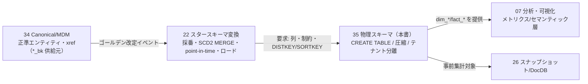
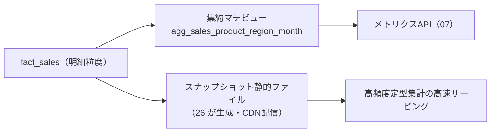
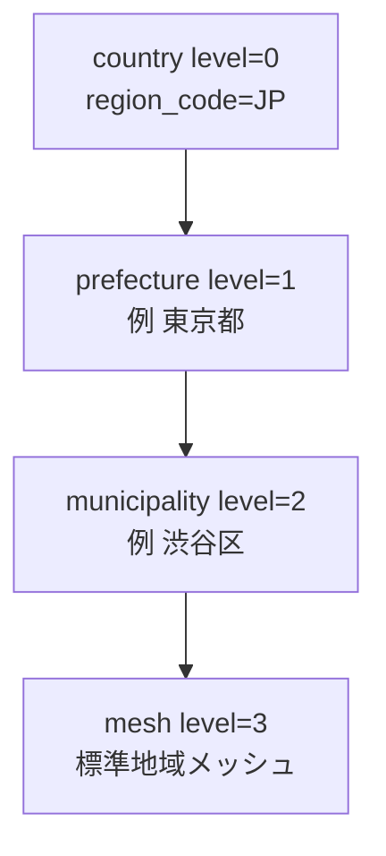
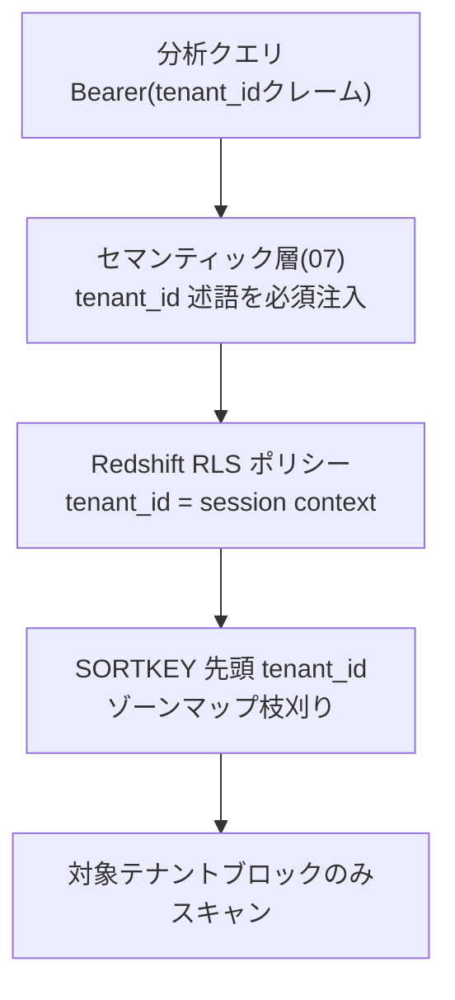

# DBスキーマ設計: スタースキーマ DWH

本書は **SCIP（Supply Chain Intelligence Platform、コード名。正式名称は未確定）** の分析中核である
**スタースキーマ DWH（`dim_*` / `fact_*`）の物理スキーマ**を、実装者が着手できる粒度で権威的に定義する。
対象 DWH エンジンは **Amazon Redshift Serverless**（ブリーフ §4 の主選択。レイクハウス代替 = S3(Parquet)+Iceberg+Athena は §8.6 / ADR で併記）。

本書が確定するもの:
(1) Kimball 準拠のスタースキーマ全体像（適合次元 + ファクト）、
(2) 全 13 ディメンション（`dim_date`/`dim_product`/`dim_location`/`dim_region`/`dim_customer`/`dim_supplier`/`dim_channel`/`dim_party`/`dim_tenant`/`dim_currency`/`dim_uom`/`dim_promotion`/`dim_employee`）の CREATE TABLE、
(3) サロゲートキー `*_key` / 業務自然キー `*_bk` / SCD Type2 列（`valid_from`/`valid_to`/`is_current`/`row_hash`）の物理定義、
(4) 全 7 ファクト（`fact_sales`/`fact_inventory_snapshot`/`fact_inventory_movement`/`fact_purchase_order`/`fact_production`/`fact_shipment`/`fact_billing`）の CREATE TABLE（グレイン・メジャー明記）、
(5) Redshift の DISTKEY/SORTKEY/圧縮エンコード・パーティション方針・テナント分離、
(6) degenerate dimension・factless fact・集約テーブル/マテリアライズドビュー方針、
(7) 動的地域粒度のディメンション表現（`dim_region` の level 階層）、
(8) 各アプリ OLTP / Canonical から `dim_*`/`fact_*` への写像対応表 — である。

> **位置づけ / 所有範囲（ブリーフ §14）:** 本書は **全 `dim_*` / `fact_*` の物理スキーマ**（列・制約・サロゲート/SCD2 列・DISTKEY/SORTKEY・圧縮・テナント分離）を権威的に所有する。
> **変換ロジック（サロゲート採番・SCD2 MERGE・point-in-time 解決・グレイン整形・増分/バックフィル/再構築・整合性検証）は [スタースキーマ変換](../detailed-design/22-star-schema-transformation.md)（22）が所有**する。本書は 22 の変換が要求する物理最適化を実 DDL として確定する下流であり、変換手続きは再定義せず参照する。
> **`*_bk` を供給する正準エンティティ（`canonical_sku`/`canonical_product`/`canonical_location`/`canonical_party`/`region`/`product_category`/`currency`/`uom`）は [MDM/Canonical スキーマ](./34-mdm-canonical-schema.md)（34）が所有**する。本書は正準 id を `*_bk` として受けるのみで再定義しない。
> **命名・DDL・テナンシー・共通列の横断規約は [スキーマ戦略と SoT](./30-schema-strategy-and-sot.md)（30）が所有**する。本書は DWH 固有の逸脱（サロゲート PK・SCD2・Redshift 制約非強制）のみ明示する。

---

## 1. SoT 宣言と責務境界

### 1.1 DWH の SoT 位置づけ（ブリーフ §5 / CLAUDE.md 原則6）

DWH（`dim_*`/`fact_*`）は **Canonical/Raw 由来の派生**であり、それ自体は SoT ではない。したがって本書のテーブルは
「上流から一方向に再生成可能」であることを物理設計の前提とする（再構築で失われるデータを DWH に持たない）。

| データ | SoT | 本書での位置づけ |
|--------|-----|-----------------|
| 次元の属性（商品/拠点/顧客/仕入先/地域） | Canonical ゴールデン（34） | `dim_*` = 派生（SCD2 で履歴化した投影） |
| ファクトの事実（取引/在庫/移動/発注/生産/出荷/請求） | 各 OLTP（31-33）/ Raw（21） | `fact_*` = 派生（グレイン確定・サロゲート解決済の投影） |
| サロゲートキー `*_key` ⇄ 業務自然キー `*_bk` の対応 | **本書の `dim_*`**（35 で採番・保持） | DWH 内で完結する分析キー体系の SoT |
| SCD2 版履歴（`valid_from`/`valid_to`/`is_current`/`row_hash`） | **本書の `dim_*`**（35） | 変換が生成し記録系として保護（巻き戻さない） |

- サロゲートキー体系と SCD2 版履歴だけは「DWH でしか存在しない」ため、フル再構築時のサロゲート安定性が論点になる（22 §7.3 / 本書 §12-3）。
- SoT → 派生の一方向は不可侵: **Canonical → dim → fact → スナップショット**（22 §2 不変則2）。DWH から上流へは書き戻さない。

### 1.2 責務境界（本書 = 物理、22 = ロジック、34 = 正準）



- 本書は「`dim_*`/`fact_*` が**何を**持つか」を定義する。「**どのように**埋めるか」は 22。
- Redshift の制約（PK/FK/UNIQUE）は**情報提供（informational, 非強制）**である（§3.4）。実データ整合性（一意グレイン・参照整合）は 22 の変換ロジックと §9 の整合性検証で担保する。

---

## 2. スタースキーマ全体像

### 2.1 ER 図（fact 中心・conformed dimension を放射）

適合次元（conformed dimension）を複数ファクトで共有し、同一 `*_key` で drill-across（売上×在庫×発注を同一軸で突合）できる構造とする。

```mermaid
erDiagram
    dim_date        ||--o{ fact_sales : "date_key"
    dim_product     ||--o{ fact_sales : "product_key"
    dim_location    ||--o{ fact_sales : "location_key"
    dim_customer    ||--o{ fact_sales : "customer_key"
    dim_channel     ||--o{ fact_sales : "channel_key"
    dim_currency    ||--o{ fact_sales : "currency_key"
    dim_promotion   ||--o{ fact_sales : "promotion_key"
    dim_employee    ||--o{ fact_sales : "employee_key"
    dim_tenant      ||--o{ fact_sales : "tenant_id 対 tenant_bk（自然キー結合）"

    dim_date        ||--o{ fact_inventory_snapshot : "date_key"
    dim_product     ||--o{ fact_inventory_snapshot : "product_key"
    dim_location    ||--o{ fact_inventory_snapshot : "location_key"

    dim_date        ||--o{ fact_inventory_movement : "date_key"
    dim_product     ||--o{ fact_inventory_movement : "product_key"
    dim_location    ||--o{ fact_inventory_movement : "location_key"

    dim_date        ||--o{ fact_purchase_order : "order_date_key"
    dim_product     ||--o{ fact_purchase_order : "product_key"
    dim_supplier    ||--o{ fact_purchase_order : "supplier_key"
    dim_location    ||--o{ fact_purchase_order : "deliver_to_location_key"

    dim_date        ||--o{ fact_production : "production_date_key"
    dim_product     ||--o{ fact_production : "product_key"
    dim_supplier    ||--o{ fact_production : "factory_supplier_key"

    dim_date        ||--o{ fact_shipment : "ship_date_key"
    dim_product     ||--o{ fact_shipment : "product_key"
    dim_location    ||--o{ fact_shipment : "from_location_key"
    dim_customer    ||--o{ fact_shipment : "consignee_customer_key"

    dim_date        ||--o{ fact_billing : "billing_date_key"
    dim_customer    ||--o{ fact_billing : "shipper_customer_key"
    dim_currency    ||--o{ fact_billing : "currency_key"

    dim_region      ||--o{ dim_location : "region_key"
    dim_region      ||--o{ dim_customer : "region_key"
    dim_party       ||--o{ dim_customer : "包摂候補"
    dim_party       ||--o{ dim_supplier : "包摂候補"
    dim_party       ||--o{ fact_shipment : "carrier（将来・dim_party採用時のみ）"
```



- `dim_party` は `dim_customer`/`dim_supplier` を包摂する**選択肢**として併記する（ブリーフ §8）。初期スコープは役割特化次元（customer/supplier）を主とし、Party 統合次元は横断分析要件が確定した段階で採用する（§12-5）。
- `fact_shipment.carrier_party_key`（運送事業者軸）は `dim_party` の carrier ロール解決に依存するが、初期スコープでは `dim_party` を投入せず **0=Not Applicable 固定 + degenerate な `carrier_no`** で表現する（`dim_party` 採用まで carrier 次元解決は保留。§4.7 / §12-5）。上図の carrier リレーションは将来採用時の参照を破線的に示す（初期は非解決）。
- `dim_region` は `dim_location` / `dim_customer` の **outrigger（アウトリガー次元）**として参照される（地域階層を正規化保持し、roll-up をクエリで実施）。

### 2.2 バスマトリクス（適合次元 × ファクト）

Kimball のバスマトリクスで、どのファクトがどの適合次元を参照するかを一覧化する（`R` = 役割複数の date）。

| ファクト＼次元 | date | product | location | region | customer | supplier | channel | currency | uom | promotion | employee | party | tenant |
|---|:--:|:--:|:--:|:--:|:--:|:--:|:--:|:--:|:--:|:--:|:--:|:--:|:--:|
| fact_sales | R | ● | ● | ○ | ● | | ● | ● | ○ | ● | ● | | ● |
| fact_inventory_snapshot | ● | ● | ● | ○ | | | | ● | ○ | | | | ● |
| fact_inventory_movement | ● | ● | ● | ○ | | ● | | | ○ | | ● | | ● |
| fact_purchase_order | R | ● | ● | | | ● | | ● | ○ | | ● | | ● |
| fact_production | R | ● | ○ | | | ● | | | ○ | | ● | | ● |
| fact_shipment | R | ● | ● | ○ | ● | | | | ○ | | ● | △ | ● |
| fact_billing | R | ○ | ● | | ● | | | ● | ○ | | ● | | ● |

凡例: ● = 直接参照（FK 列）、○ = outrigger または任意参照、△ = 将来参照（`dim_party` 採用時のみ有効。初期は 0=N/A 固定 + degenerate `carrier_no`）、R = 役割複数（role-playing、§8.5）、空白 = 非参照。

- `party` 列は `fact_shipment.carrier_party_key`（運送事業者=carrier ロール）に対応する。初期スコープでは `dim_party` を投入せず carrier 次元解決を保留するため △（将来参照）とし、当面は degenerate な `carrier_no` で表現する（§4.7 / §5.6 / §12-5）。
- `fact_inventory_snapshot` の `currency`（●）は在庫評価額 `on_hand_value` の通貨帰属に対応（§5.2 に `currency_key` を保持）。`fact_billing` の `employee`（●）は請求担当者に対応（§5.7 に `employee_key` を保持）。

---

## 3. 共通設計方針（Redshift 前提）

### 3.1 サロゲートキー `*_key` と業務自然キー `*_bk`

- **PK は業務意味を持たないサロゲート `*_key BIGINT`**（ブリーフ §9 の DWH 例外規約）。SCD2 で同一自然キーに複数版が生じ得るため自然キーは PK になれない。
- Redshift では **`IDENTITY(1,1)`** で採番する（採番の一意性は保証されるが、並列ロードで連番・単調性は保証されない → 連番前提のロジックを書かない。22 §3.2）。
- **業務自然キー `*_bk`** を別列に保持する。由来は 34 §11 の契約に従う（例: `dim_product.product_bk = canonical_sku.id`）。
- サロゲートは**プラットフォーム全体で一意**（テナント跨ぎで衝突しない単一採番）。テナント分離は各行の `tenant_id`（+ RLS/SORTKEY）で担保する（§8.4）。

### 3.2 予約メンバー（unknown / invalid / not-applicable）

各次元に固定サロゲートの**予約メンバー**を先行投入し、早期到着ファクト（次元未着）を破棄せず紐付ける（22 §3.3）。

| `*_key` | 意味 | 用途 |
|---------|------|------|
| `-1` | Unknown（未解決） | xref 未解決のファクトを暫定紐付け（`ANL-001`）→ 後日再解決 |
| `-2` | Invalid（不正/検証失敗） | 桁検証失敗等（`MAP-005`）を分離 |
| `0` | Not Applicable（該当なし） | その次元が業務上存在しない事実（例: 卸取引に店舗次元なし） |

- Redshift の `IDENTITY` 列へ明示値を投入するには **`COPY ... EXPLICIT_IDS`** を用いる。予約メンバーは IDENTITY レンジ（1 起点）と衝突しない負値/0 で `COPY EXPLICIT_IDS` により先行シードする（採番方式の最終確定は §12-1）。

### 3.3 SCD 共通列（Type2 次元）

履歴管理する次元（`dim_product`/`dim_location`/`dim_customer`/`dim_supplier`/`dim_region`/`dim_promotion`/`dim_employee`/`dim_party`）は以下の SCD2 列を持つ。SCD1 次元（`dim_date`/`dim_channel`/`dim_currency`/`dim_uom`/`dim_tenant`）は持たず単純上書きとする（22 §4.1）。

| 列 | 型 | 意味 |
|----|----|------|
| `valid_from` | `TIMESTAMPTZ NOT NULL` | 版の有効開始（左閉）。既定はゴールデン改定検知日 |
| `valid_to` | `TIMESTAMPTZ NOT NULL DEFAULT '9999-12-31'` | 版の有効終了（右開）。現行版は遠未来 |
| `is_current` | `BOOLEAN NOT NULL DEFAULT TRUE` | 現行版フラグ（`valid_to` 無限大の冗長・高速化用） |
| `row_hash` | `CHAR(32) NOT NULL` | Type2 追跡属性の MD5。変更検知に使用（22 §4.2） |
| `is_inferred` | `BOOLEAN NOT NULL DEFAULT FALSE` | 推論メンバー（属性未着で先行生成）フラグ（22 §4.5） |
| `load_run_id` | `BIGINT` | 生成ラン（36 `load_run`）。来歴・情報提供 FK |

- 区間規約は `[valid_from, valid_to)`（左閉右開）。point-in-time 解決（22 §4.6）で重複・空白を防ぐ。
- `row_hash` は Type2 追跡属性のみで計算する（Type1 上書き属性は含めない）。追跡/上書きの属性分類は各次元 DDL のコメントに明記する。

### 3.4 Redshift DDL 規約（30 からの DWH 固有逸脱）

| 項目 | Redshift での扱い | 備考（OLTP 30 との差） |
|------|------------------|----------------------|
| PK | サロゲート `*_key BIGINT IDENTITY(1,1)` | OLTP は `id BIGSERIAL`。DWH のみサロゲート採用（ブリーフ §9） |
| PK/FK/UNIQUE 制約 | **宣言するが非強制（informational）** | オプティマイザのヒント。実整合性は 22 変換 + §9 検証で担保 |
| 計算列 | **`GENERATED ALWAYS AS ... STORED` は非対応** | 派生メジャー（margin 等）は ELT で算出し実列に格納（30 の OLTP 規約とは異なる） |
| タイムスタンプ | `TIMESTAMPTZ`（UTC 保存）、業務日付は `date_key INT` + `dim_date` | ブリーフ §9 整合 |
| 論理削除 | 次元は SCD2 の `is_current=FALSE` で表現（`is_deleted` 列は持たない） | ファクトは訂正行/取消行で表現（§12-4） |
| 圧縮 | 列単位 `ENCODE`（既定 AUTO、数値 `az64`、コード/名称 `zstd`、低カーディナリティ `bytedict`/`runlength`） | Redshift 固有 |
| 監査列 | 次元/ファクトは `load_run_id` + `source_system` で来歴保持（`created_by_user_id` 等の業務監査列は持たない） | DWH は派生のため業務監査は OLTP 側 |

- Redshift は PostgreSQL 派生だが RLS・DISTKEY/SORTKEY・圧縮・IDENTITY の挙動が異なる。以下 DDL は **Redshift 方言**で記述し、レイクハウス代替（Athena+Iceberg）採用時の差分は §8.6 に記す。

---

## 4. ディメンション DDL

> 以下の DDL はテナントスコープ次元に共通の SCD2 列（§3.3）と Redshift 物理句（DISTSTYLE/DISTKEY/SORTKEY/ENCODE）を含む。列コメントは日本語（`COMMENT ON COLUMN`）。制約は informational（§3.4）。

### 4.1 dim_date（暦・SCD1・事前生成・共有）

暦は普遍的（テナント非依存）のため **`tenant_id` を持たず `DISTSTYLE ALL`（全ノード複製）で全ファクトへブロードキャスト結合を回避**する。これはブリーフ §8「全 dim/fact は tenant_id を持つ」に対する**明示的な逸脱**である。**共有次元の物理スキーマ（`tenant_id` 列の有無・NULL 許容）はブリーフ §14 により本書 35 が所有する物理決定であり、本書はこれを (B) 非保持/NULL 方式で確定する**（`dim_date`/`dim_currency`/`dim_uom` は列なし、`dim_region` は `tenant_id NULL`=共有）。これにより **[スタースキーマ変換](../detailed-design/22-star-schema-transformation.md)（22）§3.2/§3.5 が採る共有テナント sentinel `tenant_id=0`（NOT NULL）方式は本物理決定に置換される**（22 側の追随修正を要する。§12-9）。兄弟ドキュメント 34 が `currency`/`uom`/標準 `region` をテナント共有（`NULL`=共有）とする判断とは整合する。ただしブリーフ §8「全 dim tenant_id」原則の但し書き正式化（30/34 側）はオペレーター確認・上流正式化を要する事項として **§12-9 に論点化**する（テナント固有の会計期/祝日は §12-2 で別機構に委譲）。同様に `dim_currency`/`dim_uom`/標準 `dim_region` も共有次元として `tenant_id` 非保持/NULL とする（§4.10/§4.11/§4.2）。

```sql
CREATE TABLE dim_date (
    date_key          INTEGER      NOT NULL ENCODE az64,        -- 日付キー YYYYMMDD 整数（自然キー兼サロゲート）
    full_date         DATE         NOT NULL ENCODE az64,        -- 実日付
    year              SMALLINT     NOT NULL ENCODE az64,        -- 年
    quarter           SMALLINT     NOT NULL ENCODE bytedict,    -- 四半期 1-4
    month             SMALLINT     NOT NULL ENCODE bytedict,    -- 月 1-12
    month_name        VARCHAR(16)  NOT NULL ENCODE zstd,        -- 月名称（日本語）
    day               SMALLINT     NOT NULL ENCODE bytedict,    -- 日 1-31
    day_of_week       SMALLINT     NOT NULL ENCODE bytedict,    -- 曜日 0=日..6=土
    day_name          VARCHAR(16)  NOT NULL ENCODE zstd,        -- 曜日名称（日本語）
    week_of_year      SMALLINT     NOT NULL ENCODE bytedict,    -- 年内週番号
    iso_week          SMALLINT     NOT NULL ENCODE bytedict,    -- ISO 8601 週番号
    is_weekend        BOOLEAN      NOT NULL ENCODE runlength,   -- 週末フラグ
    is_holiday        BOOLEAN      NOT NULL ENCODE runlength,   -- 祝日フラグ（日本標準暦）
    is_business_day   BOOLEAN      NOT NULL ENCODE runlength,   -- 営業日フラグ
    fiscal_year       SMALLINT     NOT NULL ENCODE az64,        -- 会計年度（プラットフォーム標準暦）
    fiscal_quarter    SMALLINT     NOT NULL ENCODE bytedict,    -- 会計四半期
    fiscal_month      SMALLINT     NOT NULL ENCODE bytedict,    -- 会計月
    PRIMARY KEY (date_key)                                      -- informational（非強制）
)
DISTSTYLE ALL
SORTKEY (date_key);

COMMENT ON TABLE  dim_date            IS '日付/暦ディメンション。SCD1・事前生成（将来20年分）・テナント非依存の共有次元（DISTSTYLE ALL）';
COMMENT ON COLUMN dim_date.date_key   IS '日付キー YYYYMMDD 整数。予約メンバー -1=Unknown を含む';
COMMENT ON COLUMN dim_date.fiscal_year IS '会計年度。テナント固有の会計期はプラットフォーム標準を格納し、差分は別機構で吸収（§12-2）';
```

- `date_key` は **YYYYMMDD 整数を自然キー兼サロゲート**とする（唯一 IDENTITY を使わない次元）。予約メンバー `-1`（Unknown）を投入し、日付未確定ファクトを紐付ける。
- 会計期/祝日カレンダーのテナント差は、`dim_date` にはプラットフォーム標準を保持し、テナント別会計期を別次元 `dim_fiscal_period`（将来）または属性オーバーレイで吸収する（22 §12-4 / 本書 §12-2）。

### 4.2 dim_region（地域階層・動的粒度・SCD2/固定）

「商品 × 地域 × 販売先」の地域軸（ブリーフ §2）。**動的粒度**を `region_level` 階層で表現し、最深段まで保持してクエリで roll-up する（§7）。標準地域はテナント共有（`tenant_id` NULL 可）、商圏カスタム地域はテナントスコープ（34 §4.1 と整合）。

```sql
CREATE TABLE dim_region (
    region_key        BIGINT       IDENTITY(1,1) NOT NULL ENCODE az64,  -- サロゲートPK
    region_bk         BIGINT       NOT NULL ENCODE az64,        -- 業務自然キー = region.id（34）
    tenant_id         BIGINT       NULL ENCODE az64,            -- テナント（標準地域は NULL=共有／商圏カスタムは値）
    region_code       VARCHAR(32)  NOT NULL ENCODE zstd,        -- 地域コード（JIS 行政区域コード等）
    region_level      SMALLINT     NOT NULL ENCODE bytedict,    -- 粒度 0=country/1=prefecture/2=municipality/3=mesh
    region_name       VARCHAR(128) NOT NULL ENCODE zstd,        -- 地域名称
    parent_region_key BIGINT       NULL ENCODE az64,            -- 親地域（自己参照・roll-up 用）
    country_code      VARCHAR(2)   NOT NULL DEFAULT 'JP' ENCODE bytedict, -- 国コード（ISO 3166-1）
    country_name      VARCHAR(64)  NOT NULL ENCODE zstd,        -- 国名称（roll-up 平坦化）
    prefecture_code   VARCHAR(8)   NULL ENCODE zstd,            -- 都道府県コード（平坦化）
    prefecture_name   VARCHAR(64)  NULL ENCODE zstd,            -- 都道府県名称
    municipality_code VARCHAR(16)  NULL ENCODE zstd,            -- 市区町村コード（平坦化）
    municipality_name VARCHAR(64)  NULL ENCODE zstd,            -- 市区町村名称
    mesh_code         VARCHAR(16)  NULL ENCODE zstd,            -- 標準地域メッシュコード（JIS X 0410）
    valid_from        TIMESTAMPTZ  NOT NULL ENCODE az64,        -- SCD2 有効開始（左閉）
    valid_to          TIMESTAMPTZ  NOT NULL DEFAULT '9999-12-31' ENCODE az64, -- SCD2 有効終了（右開）
    is_current        BOOLEAN      NOT NULL DEFAULT TRUE ENCODE runlength,    -- 現行版フラグ
    row_hash          CHAR(32)     NOT NULL ENCODE zstd,        -- 追跡属性ハッシュ
    is_inferred       BOOLEAN      NOT NULL DEFAULT FALSE ENCODE runlength,   -- 推論メンバーフラグ
    load_run_id       BIGINT       NULL ENCODE az64,            -- 生成ラン（36）
    source_system     VARCHAR(64)  NULL ENCODE zstd,            -- 来歴
    PRIMARY KEY (region_key)
)
DISTSTYLE ALL
SORTKEY (region_level, region_code);

COMMENT ON TABLE  dim_region              IS '地域階層ディメンション。動的粒度（country/prefecture/municipality/mesh）を region_level で表現。標準地域は共有・行政区再編のみ SCD2';
COMMENT ON COLUMN dim_region.region_level IS '地域粒度 0=country/1=prefecture/2=municipality/3=mesh。クライアント商圏規模に応じ集計粒度を切替';
COMMENT ON COLUMN dim_region.tenant_id    IS 'テナント。標準地域は NULL（全テナント共有）、商圏カスタム地域はテナント値（34 §4.1）';
```

- `DISTSTYLE ALL`（地域数は数万規模で全ノード複製が有利）。roll-up は平坦化列（country/prefecture/municipality）と `parent_region_key` の双方で可能（§7）。
- 標準地域は原則不変（SCD1 相当）。行政区再編・商圏定義変更のみ SCD2 で履歴化する。

### 4.3 dim_product（SKU 粒度・SCD2）

分析の主軸「商品」。SKU 粒度で、企画/ファミリ・分類・ブランド・シーズン・型・サイズ・色・素材の階層属性を平坦化保持する。`*_bk = canonical_sku.id`（34 §11）。Honshu の 11 桁品番は `sku_code` に格納する。

```sql
CREATE TABLE dim_product (
    product_key         BIGINT      IDENTITY(1,1) NOT NULL ENCODE az64, -- サロゲートPK
    product_bk          BIGINT      NOT NULL ENCODE az64,       -- 業務自然キー = canonical_sku.id（34）
    tenant_id           BIGINT      NOT NULL ENCODE az64,       -- テナント
    sku_code            VARCHAR(64) NOT NULL ENCODE zstd,       -- SKUコード（Honshu 11桁品番等）
    gtin                VARCHAR(14) NULL ENCODE zstd,           -- GTIN/JAN（決定的マッチ用）
    product_name        VARCHAR(255) NOT NULL ENCODE zstd,      -- 商品名称
    family_bk           BIGINT      NULL ENCODE az64,           -- 企画/ファミリ自然キー = canonical_product.id
    family_code         VARCHAR(64) NULL ENCODE zstd,           -- 企画コード（Type2 追跡）
    product_family_name VARCHAR(255) NULL ENCODE zstd,          -- 企画名称
    category_bk         BIGINT      NULL ENCODE az64,           -- 分類自然キー = product_category.id
    category_code       VARCHAR(64) NULL ENCODE zstd,           -- 分類コード（Type2 追跡）
    category_name       VARCHAR(128) NULL ENCODE zstd,          -- 分類名称
    category_path       VARCHAR(512) NULL ENCODE zstd,          -- 分類階層パス（roll-up 平坦化）
    brand_code          VARCHAR(64) NULL ENCODE zstd,           -- ブランドコード（Type2 追跡）
    brand_name          VARCHAR(128) NULL ENCODE zstd,          -- ブランド名称
    season_code         VARCHAR(32) NULL ENCODE bytedict,       -- シーズンコード（Type2 追跡）
    season_name         VARCHAR(64) NULL ENCODE zstd,           -- シーズン名称
    product_type_code   VARCHAR(32) NULL ENCODE bytedict,       -- 型/種別コード（Type2 追跡）
    product_type_name   VARCHAR(64) NULL ENCODE zstd,           -- 型/種別名称
    size_code           VARCHAR(32) NULL ENCODE bytedict,       -- サイズコード（Type2 追跡）
    size_name           VARCHAR(32) NULL ENCODE zstd,           -- サイズ名称
    color_code          VARCHAR(32) NULL ENCODE bytedict,       -- カラーコード（Type2 追跡）
    color_name          VARCHAR(64) NULL ENCODE zstd,           -- カラー名称
    material_code       VARCHAR(32) NULL ENCODE bytedict,       -- 素材コード（Type2 追跡）
    material_name       VARCHAR(64) NULL ENCODE zstd,           -- 素材名称
    base_uom_code       VARCHAR(16) NULL ENCODE bytedict,       -- 基本計量単位（dim_uom.uom_code）
    status              SMALLINT    NOT NULL DEFAULT 1 ENCODE bytedict, -- 状態 0=Draft/1=Active/2=Discontinued
    display_name        VARCHAR(255) NULL ENCODE zstd,          -- 表示名（Type1 上書き・表記ゆれ修正）
    valid_from          TIMESTAMPTZ NOT NULL ENCODE az64,       -- SCD2 有効開始
    valid_to            TIMESTAMPTZ NOT NULL DEFAULT '9999-12-31' ENCODE az64, -- SCD2 有効終了
    is_current          BOOLEAN     NOT NULL DEFAULT TRUE ENCODE runlength,    -- 現行版フラグ
    row_hash            CHAR(32)    NOT NULL ENCODE zstd,        -- 追跡属性ハッシュ
    is_inferred         BOOLEAN     NOT NULL DEFAULT FALSE ENCODE runlength,   -- 推論メンバーフラグ
    load_run_id         BIGINT      NULL ENCODE az64,           -- 生成ラン
    source_system       VARCHAR(64) NULL ENCODE zstd,           -- 来歴
    PRIMARY KEY (product_key)
)
DISTSTYLE KEY DISTKEY (product_key)
SORTKEY (tenant_id, product_bk);

COMMENT ON TABLE  dim_product           IS '商品(SKU)ディメンション。SKU粒度・SCD2。family/category/brand/season/type/size/color/material の階層属性を平坦化保持';
COMMENT ON COLUMN dim_product.product_bk IS '業務自然キー = canonical_sku.id（34 §11）。tenant_id と併せ現行版を一意特定';
COMMENT ON COLUMN dim_product.row_hash   IS 'Type2 追跡属性（family/category/brand/season/type/size/color/material のコード）から算出。display_name 等 Type1 属性は含めない';
COMMENT ON COLUMN dim_product.display_name IS 'Type1 上書き属性の例。表記ゆれ修正は版を切らず現行版を更新';
```

- **最大カーディナリティ次元**（SKU は色×サイズで増殖）のため `DISTSTYLE KEY DISTKEY(product_key)` でファクトと co-locate（§8.3）。
- Type2 追跡（`row_hash` 対象）: family/category/brand/season/type/size/color/material のコード群。Type1 上書き: `display_name` 等表記系。

### 4.4 dim_location（拠点・SCD2）

拠点（store/ec_channel/warehouse/dc/factory/office）。`*_bk = canonical_location.id`。地域は `region_key` で outrigger 参照しつつ、主要地域属性を平坦化保持する。

```sql
CREATE TABLE dim_location (
    location_key      BIGINT       IDENTITY(1,1) NOT NULL ENCODE az64, -- サロゲートPK
    location_bk       BIGINT       NOT NULL ENCODE az64,        -- 業務自然キー = canonical_location.id
    tenant_id         BIGINT       NOT NULL ENCODE az64,        -- テナント
    location_code     VARCHAR(64)  NOT NULL ENCODE zstd,        -- 拠点コード
    location_name     VARCHAR(255) NOT NULL ENCODE zstd,        -- 拠点名称
    location_type     SMALLINT     NOT NULL ENCODE bytedict,    -- 拠点種別 1=store/2=ec_channel/3=warehouse/4=dc/5=factory/6=office
    region_key        BIGINT       NULL ENCODE az64,            -- 地域 outrigger（dim_region）
    prefecture_name   VARCHAR(64)  NULL ENCODE zstd,            -- 都道府県名称（平坦化・高速集計用）
    municipality_name VARCHAR(64)  NULL ENCODE zstd,            -- 市区町村名称（平坦化）
    postal_code       VARCHAR(16)  NULL ENCODE zstd,            -- 郵便番号
    address_line      VARCHAR(255) NULL ENCODE zstd,            -- 住所
    status            SMALLINT     NOT NULL DEFAULT 1 ENCODE bytedict, -- 状態 0=Draft/1=Active/2=Closed
    valid_from        TIMESTAMPTZ  NOT NULL ENCODE az64,        -- SCD2 有効開始
    valid_to          TIMESTAMPTZ  NOT NULL DEFAULT '9999-12-31' ENCODE az64, -- SCD2 有効終了
    is_current        BOOLEAN      NOT NULL DEFAULT TRUE ENCODE runlength,    -- 現行版フラグ
    row_hash          CHAR(32)     NOT NULL ENCODE zstd,        -- 追跡属性ハッシュ
    is_inferred       BOOLEAN      NOT NULL DEFAULT FALSE ENCODE runlength,   -- 推論メンバーフラグ
    load_run_id       BIGINT       NULL ENCODE az64,            -- 生成ラン
    source_system     VARCHAR(64)  NULL ENCODE zstd,            -- 来歴
    PRIMARY KEY (location_key)
)
DISTSTYLE ALL
SORTKEY (tenant_id, location_type, location_bk);

COMMENT ON TABLE  dim_location             IS '拠点ディメンション。store/ec/warehouse/dc/factory/office。SCD2。地域はregion_keyでoutrigger参照 + 主要属性を平坦化';
COMMENT ON COLUMN dim_location.location_type IS '拠点種別 1=store/2=ec_channel/3=warehouse/4=dc/5=factory/6=office（SMALLINT+アプリ解釈）';
COMMENT ON COLUMN dim_location.region_key    IS '地域アウトリガー（dim_region.region_key）。point-in-timeで解決した当時の地域版';
```

- 拠点数は中小規模のため `DISTSTYLE ALL`（複製）でファクト結合のブロードキャストを回避。

### 4.5 dim_customer（販売先/顧客・SCD2）

`*_bk = canonical_party.id`（role=customer）。地域を outrigger 参照。

```sql
CREATE TABLE dim_customer (
    customer_key      BIGINT       IDENTITY(1,1) NOT NULL ENCODE az64, -- サロゲートPK
    customer_bk       BIGINT       NOT NULL ENCODE az64,        -- 業務自然キー = canonical_party.id（role=customer）
    tenant_id         BIGINT       NOT NULL ENCODE az64,        -- テナント
    customer_code     VARCHAR(64)  NOT NULL ENCODE zstd,        -- 顧客コード
    customer_name     VARCHAR(255) NOT NULL ENCODE zstd,        -- 顧客名称
    customer_type     SMALLINT     NOT NULL DEFAULT 0 ENCODE bytedict, -- 顧客区分 0=unknown/1=retailer/2=wholesale/3=consumer/4=shipper
    region_key        BIGINT       NULL ENCODE az64,            -- 地域 outrigger
    prefecture_name   VARCHAR(64)  NULL ENCODE zstd,            -- 都道府県（平坦化）
    channel_affinity  SMALLINT     NULL ENCODE bytedict,        -- 主要チャネル区分（任意）
    status            SMALLINT     NOT NULL DEFAULT 1 ENCODE bytedict, -- 状態 0=Draft/1=Active/2=Inactive
    valid_from        TIMESTAMPTZ  NOT NULL ENCODE az64,        -- SCD2 有効開始
    valid_to          TIMESTAMPTZ  NOT NULL DEFAULT '9999-12-31' ENCODE az64, -- SCD2 有効終了
    is_current        BOOLEAN      NOT NULL DEFAULT TRUE ENCODE runlength,    -- 現行版フラグ
    row_hash          CHAR(32)     NOT NULL ENCODE zstd,        -- 追跡属性ハッシュ
    is_inferred       BOOLEAN      NOT NULL DEFAULT FALSE ENCODE runlength,   -- 推論メンバーフラグ
    load_run_id       BIGINT       NULL ENCODE az64,            -- 生成ラン
    source_system     VARCHAR(64)  NULL ENCODE zstd,            -- 来歴
    PRIMARY KEY (customer_key)
)
DISTSTYLE ALL
SORTKEY (tenant_id, customer_bk);

COMMENT ON TABLE  dim_customer            IS '販売先/顧客ディメンション。canonical_party(role=customer)由来。SCD2。地域はoutrigger参照';
COMMENT ON COLUMN dim_customer.customer_type IS '顧客区分 0=unknown/1=retailer/2=wholesale/3=consumer/4=shipper(荷主)';
```

### 4.6 dim_supplier（仕入先/工場・SCD2）

`*_bk = canonical_party.id`（role=supplier/manufacturer）。工場（生産）と仕入先（発注）を包含する。

```sql
CREATE TABLE dim_supplier (
    supplier_key      BIGINT       IDENTITY(1,1) NOT NULL ENCODE az64, -- サロゲートPK
    supplier_bk       BIGINT       NOT NULL ENCODE az64,        -- 業務自然キー = canonical_party.id（role=supplier/manufacturer）
    tenant_id         BIGINT       NOT NULL ENCODE az64,        -- テナント
    supplier_code     VARCHAR(64)  NOT NULL ENCODE zstd,        -- 仕入先コード
    supplier_name     VARCHAR(255) NOT NULL ENCODE zstd,        -- 仕入先名称
    supplier_type     SMALLINT     NOT NULL DEFAULT 1 ENCODE bytedict, -- 区分 1=supplier/2=manufacturer/3=factory
    item_conversion_code VARCHAR(8) NULL ENCODE zstd,           -- 品番変換コード（Honshu 11桁の工場桁由来・任意）
    region_key        BIGINT       NULL ENCODE az64,            -- 地域 outrigger
    status            SMALLINT     NOT NULL DEFAULT 1 ENCODE bytedict, -- 状態 0=Draft/1=Active/2=Inactive
    valid_from        TIMESTAMPTZ  NOT NULL ENCODE az64,        -- SCD2 有効開始
    valid_to          TIMESTAMPTZ  NOT NULL DEFAULT '9999-12-31' ENCODE az64, -- SCD2 有効終了
    is_current        BOOLEAN      NOT NULL DEFAULT TRUE ENCODE runlength,    -- 現行版フラグ
    row_hash          CHAR(32)     NOT NULL ENCODE zstd,        -- 追跡属性ハッシュ
    is_inferred       BOOLEAN      NOT NULL DEFAULT FALSE ENCODE runlength,   -- 推論メンバーフラグ
    load_run_id       BIGINT       NULL ENCODE az64,            -- 生成ラン
    source_system     VARCHAR(64)  NULL ENCODE zstd,            -- 来歴
    PRIMARY KEY (supplier_key)
)
DISTSTYLE ALL
SORTKEY (tenant_id, supplier_bk);

COMMENT ON TABLE  dim_supplier            IS '仕入先/工場ディメンション。canonical_party(role=supplier/manufacturer)由来。SCD2。発注・生産ファクトから参照';
COMMENT ON COLUMN dim_supplier.supplier_type IS '区分 1=supplier(仕入先)/2=manufacturer(メーカー)/3=factory(工場)';
```

### 4.7 dim_party（汎用取引先・SCD2・包摂候補）

`customer`/`supplier` を包摂する**選択肢**（ブリーフ §8）。1 社が複数ロールを持つ Party モデル（34）を単一次元で表現する。初期スコープでは役割特化次元を主とし、本次元は横断分析要件確定後に採用する（§12-5）。

> **carrier（運送事業者）ロールの初期スコープ解決:** `fact_shipment.carrier_party_key` は本次元の carrier ロールを解決先とするが、初期スコープでは役割特化次元（customer/supplier）を主とする方針上、carrier 専用の役割特化次元（`dim_carrier` 等）も本次元も投入しない。したがって **carrier 次元解決は `dim_party` 採用まで保留**し、初期は `carrier_party_key = 0`（Not Applicable）固定 + degenerate な `fact_shipment.carrier_no` で carrier 分析軸を表現する（§5.6）。`dim_party` を先行採用する場合は carrier ロースに限り本次元を投入して解決する（§12-5）。

```sql
CREATE TABLE dim_party (
    party_key         BIGINT       IDENTITY(1,1) NOT NULL ENCODE az64, -- サロゲートPK
    party_bk          BIGINT       NOT NULL ENCODE az64,        -- 業務自然キー = canonical_party.id
    tenant_id         BIGINT       NOT NULL ENCODE az64,        -- テナント
    party_code        VARCHAR(64)  NOT NULL ENCODE zstd,        -- 取引先コード
    party_name        VARCHAR(255) NOT NULL ENCODE zstd,        -- 取引先名称
    is_customer       BOOLEAN      NOT NULL DEFAULT FALSE ENCODE runlength, -- 顧客ロール保持
    is_supplier       BOOLEAN      NOT NULL DEFAULT FALSE ENCODE runlength, -- 仕入先ロール保持
    is_manufacturer   BOOLEAN      NOT NULL DEFAULT FALSE ENCODE runlength, -- メーカーロール保持
    is_warehouse_op   BOOLEAN      NOT NULL DEFAULT FALSE ENCODE runlength, -- 倉庫事業者ロール保持
    is_shipper        BOOLEAN      NOT NULL DEFAULT FALSE ENCODE runlength, -- 荷主ロール保持
    is_carrier        BOOLEAN      NOT NULL DEFAULT FALSE ENCODE runlength, -- 運送事業者ロール保持
    region_key        BIGINT       NULL ENCODE az64,            -- 地域 outrigger
    status            SMALLINT     NOT NULL DEFAULT 1 ENCODE bytedict, -- 状態
    valid_from        TIMESTAMPTZ  NOT NULL ENCODE az64,        -- SCD2 有効開始
    valid_to          TIMESTAMPTZ  NOT NULL DEFAULT '9999-12-31' ENCODE az64, -- SCD2 有効終了
    is_current        BOOLEAN      NOT NULL DEFAULT TRUE ENCODE runlength,    -- 現行版フラグ
    row_hash          CHAR(32)     NOT NULL ENCODE zstd,        -- 追跡属性ハッシュ
    is_inferred       BOOLEAN      NOT NULL DEFAULT FALSE ENCODE runlength,   -- 推論メンバーフラグ
    load_run_id       BIGINT       NULL ENCODE az64,            -- 生成ラン
    source_system     VARCHAR(64)  NULL ENCODE zstd,            -- 来歴
    PRIMARY KEY (party_key)
)
DISTSTYLE ALL
SORTKEY (tenant_id, party_bk);

COMMENT ON TABLE dim_party IS '汎用取引先ディメンション（Partyモデル）。customer/supplierを包摂する選択肢。複数ロールをフラグで保持。初期は役割特化次元を主とし本次元は将来採用（§12-5）';
```

### 4.8 dim_channel（チャネル・SCD1）

```sql
CREATE TABLE dim_channel (
    channel_key       BIGINT       IDENTITY(1,1) NOT NULL ENCODE az64, -- サロゲートPK
    channel_bk        VARCHAR(64)  NOT NULL ENCODE zstd,        -- 業務自然キー = ソースの不変元コード（名寄せ・突合の基準。変更しない）
    tenant_id         BIGINT       NOT NULL ENCODE az64,        -- テナント
    channel_code      VARCHAR(64)  NOT NULL ENCODE zstd,        -- 表示用正規化チャネルコード（表記統一・BI 表示用。改称時は上書き）
    channel_name      VARCHAR(128) NOT NULL ENCODE zstd,        -- チャネル名称
    channel_type      SMALLINT     NOT NULL ENCODE bytedict,    -- 区分 1=store/2=ec/3=wholesale
    load_run_id       BIGINT       NULL ENCODE az64,            -- 生成ラン
    PRIMARY KEY (channel_key)
)
DISTSTYLE ALL
SORTKEY (tenant_id, channel_code);

COMMENT ON TABLE  dim_channel            IS 'チャネルディメンション。店舗/EC/卸。SCD1（履歴分析価値が低いため単純上書き）';
COMMENT ON COLUMN dim_channel.channel_bk   IS '業務自然キー = ソースの不変元チャネルコード。名寄せ・突合の基準で改称後も不変（SCD1 上書き対象外）';
COMMENT ON COLUMN dim_channel.channel_code IS '表示用正規化チャネルコード。表記統一/改称を反映する現行表示値（SCD1 で上書き）。channel_bk とは役割が異なり、通常は元コード=表示コードだが分離を許容する';
COMMENT ON COLUMN dim_channel.channel_type IS '区分 1=store(店舗)/2=ec(EC)/3=wholesale(卸)';
```

### 4.9 dim_tenant（テナント・SCD1）

`*_bk = tenant.id`（37 所有の `tenant` を参照）。DWH 上でテナント属性（業種/プラン/地域）を分析軸にするための次元。ファクトの `tenant_id` は本次元の `tenant_bk` に一致する。

> **サロゲート `tenant_key` はファクト結合に使われない:** 全ファクト（および tenant スコープ次元）は `tenant_key` 列を**持たず**、業務自然キー `tenant_id`（= `dim_tenant.tenant_bk`）で結合する。これは `tenant_id` が RLS・DISTKEY/SORTKEY 枝刈りの起点（§8.4）であり、全行に自然キーを持たせる方が物理最適化と一致するためである。サロゲート `tenant_key` は dim-to-dim 参照（例: 他次元の `home_region_key` 経由の分析軸連結）や BI ツールでの一意識別のみに用いる。§2.1 ER 図の `dim_tenant`—`fact_sales` リレーションも `tenant_id → tenant_bk` の自然キー結合であり、`tenant_key` FK は存在しない。

```sql
CREATE TABLE dim_tenant (
    tenant_key        BIGINT       IDENTITY(1,1) NOT NULL ENCODE az64, -- サロゲートPK
    tenant_bk         BIGINT       NOT NULL ENCODE az64,        -- 業務自然キー = tenant.id（37）。ファクトの tenant_id と一致
    tenant_code       VARCHAR(64)  NOT NULL ENCODE zstd,        -- テナントコード
    tenant_name       VARCHAR(255) NOT NULL ENCODE zstd,        -- テナント名称
    industry_code     VARCHAR(32)  NULL ENCODE bytedict,        -- 業種コード
    plan_code         VARCHAR(32)  NULL ENCODE bytedict,        -- 契約プランコード（37）
    home_region_key   BIGINT       NULL ENCODE az64,            -- 主要地域 outrigger
    is_reference_impl BOOLEAN      NOT NULL DEFAULT FALSE ENCODE runlength, -- リファレンス実装(Honshu)フラグ
    load_run_id       BIGINT       NULL ENCODE az64,            -- 生成ラン
    PRIMARY KEY (tenant_key)
)
DISTSTYLE ALL
SORTKEY (tenant_bk);

COMMENT ON TABLE  dim_tenant           IS 'テナントディメンション。tenant(37)由来。SCD1。業種/プラン/地域を分析軸化。ファクトの tenant_id は tenant_bk に一致';
COMMENT ON COLUMN dim_tenant.tenant_bk IS '業務自然キー = tenant.id（37 所有）。全ファクト/次元の tenant_id と同値';
```

### 4.10 dim_currency（通貨・SCD1・共有）

`*_bk = currency.code`（34 共有マスタ）。全テナント共有・`DISTSTYLE ALL`。

```sql
CREATE TABLE dim_currency (
    currency_key      BIGINT       IDENTITY(1,1) NOT NULL ENCODE az64, -- サロゲートPK
    currency_code     CHAR(3)      NOT NULL ENCODE bytedict,    -- 業務自然キー = currency.code（ISO 4217）
    currency_name     VARCHAR(64)  NOT NULL ENCODE zstd,        -- 通貨名称
    minor_unit        SMALLINT     NOT NULL DEFAULT 0 ENCODE bytedict, -- 補助単位桁数（JPY=0, USD=2）
    symbol            VARCHAR(8)   NULL ENCODE zstd,            -- 通貨記号
    PRIMARY KEY (currency_key)
)
DISTSTYLE ALL
SORTKEY (currency_code);

COMMENT ON TABLE dim_currency IS '通貨ディメンション。currency(34)共有マスタ由来。全テナント共有・SCD1・DISTSTYLE ALL';
```

### 4.11 dim_uom（計量単位・SCD1・共有）

`*_bk = uom.code`（34 共有マスタ）。数量メジャーの単位換算の基準次元。

```sql
CREATE TABLE dim_uom (
    uom_key           BIGINT       IDENTITY(1,1) NOT NULL ENCODE az64, -- サロゲートPK
    uom_code          VARCHAR(16)  NOT NULL ENCODE bytedict,    -- 業務自然キー = uom.code（UN/CEFACT）
    uom_name          VARCHAR(64)  NOT NULL ENCODE zstd,        -- 単位名称
    uom_category      VARCHAR(32)  NULL ENCODE bytedict,        -- 単位カテゴリ（数量/重量/体積/長さ）
    base_factor       NUMERIC(18,6) NULL ENCODE az64,           -- 基本単位への換算係数
    PRIMARY KEY (uom_key)
)
DISTSTYLE ALL
SORTKEY (uom_code);

COMMENT ON TABLE dim_uom IS '計量単位ディメンション。uom(34)共有マスタ由来。全テナント共有・SCD1。数量メジャーの単位換算基準';
```

### 4.12 dim_promotion（施策・SCD2）

売上ファクトが参照する販促施策。

```sql
CREATE TABLE dim_promotion (
    promotion_key     BIGINT       IDENTITY(1,1) NOT NULL ENCODE az64, -- サロゲートPK
    promotion_bk      BIGINT       NOT NULL ENCODE az64,        -- 業務自然キー（施策id）
    tenant_id         BIGINT       NOT NULL ENCODE az64,        -- テナント
    promotion_code    VARCHAR(64)  NOT NULL ENCODE zstd,        -- 施策コード
    promotion_name    VARCHAR(255) NOT NULL ENCODE zstd,        -- 施策名称
    promo_type        SMALLINT     NOT NULL DEFAULT 0 ENCODE bytedict, -- 施策種別 0=none/1=percent_off/2=amount_off/3=bundle/4=coupon
    discount_type     SMALLINT     NULL ENCODE bytedict,        -- 割引方式
    start_date_key    INTEGER      NULL ENCODE az64,            -- 施策開始日（dim_date.date_key）
    end_date_key      INTEGER      NULL ENCODE az64,            -- 施策終了日（dim_date.date_key）
    status            SMALLINT     NOT NULL DEFAULT 1 ENCODE bytedict, -- 状態
    valid_from        TIMESTAMPTZ  NOT NULL ENCODE az64,        -- SCD2 有効開始
    valid_to          TIMESTAMPTZ  NOT NULL DEFAULT '9999-12-31' ENCODE az64, -- SCD2 有効終了
    is_current        BOOLEAN      NOT NULL DEFAULT TRUE ENCODE runlength,    -- 現行版フラグ
    row_hash          CHAR(32)     NOT NULL ENCODE zstd,        -- 追跡属性ハッシュ
    is_inferred       BOOLEAN      NOT NULL DEFAULT FALSE ENCODE runlength,   -- 推論メンバーフラグ
    load_run_id       BIGINT       NULL ENCODE az64,            -- 生成ラン
    PRIMARY KEY (promotion_key)
)
DISTSTYLE ALL
SORTKEY (tenant_id, promotion_bk);

COMMENT ON TABLE  dim_promotion        IS '販促施策ディメンション。SCD2。fact_salesから参照。施策の期間帰属を分析';
COMMENT ON COLUMN dim_promotion.promo_type IS '施策種別 0=none/1=percent_off/2=amount_off/3=bundle/4=coupon';
```

### 4.13 dim_employee（担当者・SCD2）

各取引の担当者次元。

```sql
CREATE TABLE dim_employee (
    employee_key      BIGINT       IDENTITY(1,1) NOT NULL ENCODE az64, -- サロゲートPK
    employee_bk       BIGINT       NOT NULL ENCODE az64,        -- 業務自然キー（担当者id）
    tenant_id         BIGINT       NOT NULL ENCODE az64,        -- テナント
    employee_code     VARCHAR(64)  NOT NULL ENCODE zstd,        -- 担当者コード
    employee_name     VARCHAR(128) NOT NULL ENCODE zstd,        -- 担当者名称
    department_code   VARCHAR(32)  NULL ENCODE bytedict,        -- 部門コード（Type2 追跡）
    department_name   VARCHAR(64)  NULL ENCODE zstd,            -- 部門名称
    role_code         VARCHAR(32)  NULL ENCODE bytedict,        -- 役割コード
    home_location_key BIGINT       NULL ENCODE az64,            -- 所属拠点 outrigger
    status            SMALLINT     NOT NULL DEFAULT 1 ENCODE bytedict, -- 状態 0=Draft/1=Active/2=Retired
    valid_from        TIMESTAMPTZ  NOT NULL ENCODE az64,        -- SCD2 有効開始
    valid_to          TIMESTAMPTZ  NOT NULL DEFAULT '9999-12-31' ENCODE az64, -- SCD2 有効終了
    is_current        BOOLEAN      NOT NULL DEFAULT TRUE ENCODE runlength,    -- 現行版フラグ
    row_hash          CHAR(32)     NOT NULL ENCODE zstd,        -- 追跡属性ハッシュ
    is_inferred       BOOLEAN      NOT NULL DEFAULT FALSE ENCODE runlength,   -- 推論メンバーフラグ
    load_run_id       BIGINT       NULL ENCODE az64,            -- 生成ラン
    PRIMARY KEY (employee_key)
)
DISTSTYLE ALL
SORTKEY (tenant_id, employee_bk);

COMMENT ON TABLE dim_employee IS '担当者ディメンション。SCD2。部門異動を履歴化し施策/取引の担当者帰属を分析';
```

---

## 5. ファクト DDL

> 各ファクトは §5.0 の共通規約に従う。グレインを最初に固定し、メジャーの加法性を明示する（半加法メジャーは §6.2 / `ANL-004`）。次元 FK は `*_key`（informational）、degenerate dimension は伝票番号等をファクトに直接保持する。

### 5.0 ファクト共通規約

| 列種別 | 規約 |
|--------|------|
| テナント | `tenant_id BIGINT NOT NULL`（= `dim_tenant.tenant_bk`）。全ファクト必須。DISTKEY/SORTKEY/RLS の起点 |
| 次元 FK | `<role>_<dim>_key BIGINT NOT NULL`（未解決は予約メンバー -1/0）。point-in-time 解決済（22 §4.6） |
| degenerate dimension | 伝票番号・明細番号等の業務キーを次元化せずファクト列に保持（監査・トレース） |
| メジャー | 数量 `NUMERIC(14,4)`、金額 `NUMERIC(16,2)`、単価 `NUMERIC(12,2)`、率 `NUMERIC(10,4)`（ブリーフ §9） |
| 派生メジャー | Redshift は GENERATED 非対応 → ELT で算出し実列格納（例: margin = net - cost） |
| 来歴 | `load_run_id BIGINT`, `source_system VARCHAR`, `source_record_id VARCHAR`（再構築・突合） |
| 監査 | `created_at TIMESTAMPTZ DEFAULT sysdate`（ロード時刻。業務監査は OLTP 側） |

### 5.1 fact_sales（売上・トランザクション・全加法）

**グレイン: SKU × 拠点/チャネル × 日付 × 販売先 の売上明細 1 行**（POS/EC/卸を包含）。

```sql
CREATE TABLE fact_sales (
    sales_fact_id        BIGINT      IDENTITY(1,1) NOT NULL ENCODE az64, -- サロゲート行id（内部管理）
    tenant_id            BIGINT      NOT NULL ENCODE az64,       -- テナント
    date_key             INTEGER     NOT NULL ENCODE az64,       -- 売上日（dim_date）
    product_key          BIGINT      NOT NULL ENCODE az64,       -- 商品SKU（dim_product）
    location_key         BIGINT      NOT NULL ENCODE az64,       -- 拠点（dim_location）
    channel_key          BIGINT      NOT NULL ENCODE az64,       -- チャネル（dim_channel）
    customer_key         BIGINT      NOT NULL ENCODE az64,       -- 販売先（dim_customer、消費者は 0=N/A）
    currency_key         BIGINT      NOT NULL ENCODE az64,       -- 通貨（dim_currency）
    promotion_key        BIGINT      NOT NULL DEFAULT 0 ENCODE az64, -- 施策（dim_promotion、無施策は 0）
    employee_key         BIGINT      NOT NULL DEFAULT 0 ENCODE az64, -- 担当者（dim_employee）
    uom_key              BIGINT      NOT NULL DEFAULT 0 ENCODE az64, -- 数量単位（dim_uom）
    -- degenerate dimension（伝票トレース）
    sales_order_no       VARCHAR(64) NULL ENCODE zstd,           -- 受注/売上伝票番号（degenerate）
    sales_order_line_no  INTEGER     NULL ENCODE az64,           -- 明細番号（degenerate）
    pos_receipt_no       VARCHAR(64) NULL ENCODE zstd,           -- POSレシート番号（degenerate）
    transaction_type     SMALLINT    NOT NULL DEFAULT 1 ENCODE bytedict, -- 取引種別 1=sale/2=return/3=exchange
    -- measures（全加法）
    qty                  NUMERIC(14,4) NOT NULL DEFAULT 0 ENCODE az64, -- 販売数量
    return_qty           NUMERIC(14,4) NOT NULL DEFAULT 0 ENCODE az64, -- 返品数量
    unit_price           NUMERIC(12,2) NULL ENCODE az64,         -- 単価
    gross_amount         NUMERIC(16,2) NOT NULL DEFAULT 0 ENCODE az64, -- 総額（値引前）
    discount_amount      NUMERIC(16,2) NOT NULL DEFAULT 0 ENCODE az64, -- 値引額
    net_amount           NUMERIC(16,2) NOT NULL DEFAULT 0 ENCODE az64, -- 純売上額（gross-discount）
    cost_amount          NUMERIC(16,2) NOT NULL DEFAULT 0 ENCODE az64, -- 原価額
    margin_amount        NUMERIC(16,2) NOT NULL DEFAULT 0 ENCODE az64, -- 粗利額（net-cost、ELT算出）
    tax_amount           NUMERIC(16,2) NOT NULL DEFAULT 0 ENCODE az64, -- 消費税額
    -- 来歴・監査
    load_run_id          BIGINT      NULL ENCODE az64,           -- ロードラン
    source_system        VARCHAR(64) NULL ENCODE zstd,           -- ソースシステム
    source_record_id     VARCHAR(128) NULL ENCODE zstd,          -- ソースレコードid
    created_at           TIMESTAMPTZ NOT NULL DEFAULT SYSDATE ENCODE az64, -- ロード時刻
    PRIMARY KEY (sales_fact_id)
)
DISTSTYLE KEY DISTKEY (product_key)
COMPOUND SORTKEY (tenant_id, date_key, product_key);

COMMENT ON TABLE  fact_sales             IS '売上ファクト。グレイン=SKU×拠点/チャネル×日付×販売先の売上明細1行。POS/EC/卸包含。全加法';
COMMENT ON COLUMN fact_sales.margin_amount IS '粗利額=net_amount-cost_amount。Redshiftは計算列非対応のためELTで算出し格納';
COMMENT ON COLUMN fact_sales.customer_key IS '販売先。BtoC(消費者)は 0=Not Applicable。卸/小売先は dim_customer を参照';
```

- **半加法/非加法なし**（全メジャー全加法）。返品は `transaction_type=2` + `return_qty` の別行または反対符号（業務ポリシーは 07 と確定・§12-4）。

### 5.2 fact_inventory_snapshot（在庫スナップショット・周期スナップショット・半加法）

**グレイン: SKU × 拠点 × 日付（在庫締め断面）1 行**。在庫残高は**時間軸で半加法**（日付では SUM 不可、最新/平均を取る・`ANL-004`）。

```sql
CREATE TABLE fact_inventory_snapshot (
    inv_snap_id       BIGINT       IDENTITY(1,1) NOT NULL ENCODE az64, -- サロゲート行id
    tenant_id         BIGINT       NOT NULL ENCODE az64,        -- テナント
    date_key          INTEGER      NOT NULL ENCODE az64,        -- 在庫締め日（dim_date）
    product_key       BIGINT       NOT NULL ENCODE az64,        -- 商品SKU（dim_product）
    location_key      BIGINT       NOT NULL ENCODE az64,        -- 拠点（dim_location）
    currency_key      BIGINT       NOT NULL DEFAULT 0 ENCODE az64, -- 評価額の通貨（dim_currency）。on_hand_value の通貨帰属
    uom_key           BIGINT       NOT NULL DEFAULT 0 ENCODE az64, -- 数量単位（dim_uom）
    -- measures（半加法: 拠点/商品では加算可、時間軸は不可）
    on_hand_qty       NUMERIC(14,4) NOT NULL DEFAULT 0 ENCODE az64, -- 実在庫数量
    on_hand_value     NUMERIC(16,2) NOT NULL DEFAULT 0 ENCODE az64, -- 実在庫金額（評価額、currency_key の通貨建て）
    allocated_qty     NUMERIC(14,4) NOT NULL DEFAULT 0 ENCODE az64, -- 引当済数量
    available_qty     NUMERIC(14,4) NOT NULL DEFAULT 0 ENCODE az64, -- 有効在庫数量（on_hand-allocated）
    in_transit_qty    NUMERIC(14,4) NOT NULL DEFAULT 0 ENCODE az64, -- 輸送中数量
    load_run_id       BIGINT       NULL ENCODE az64,            -- ロードラン
    source_system     VARCHAR(64)  NULL ENCODE zstd,            -- ソースシステム
    created_at        TIMESTAMPTZ  NOT NULL DEFAULT SYSDATE ENCODE az64, -- ロード時刻
    PRIMARY KEY (inv_snap_id)
)
DISTSTYLE KEY DISTKEY (product_key)
COMPOUND SORTKEY (tenant_id, date_key, location_key);

COMMENT ON TABLE  fact_inventory_snapshot IS '在庫スナップショットファクト。周期スナップショット。グレイン=SKU×拠点×日付。半加法（時間軸SUM禁止）';
COMMENT ON COLUMN fact_inventory_snapshot.available_qty IS '有効在庫=on_hand_qty-allocated_qty。半加法メジャー。日付軸ではSUMせず最新値/平均を取る';
COMMENT ON COLUMN fact_inventory_snapshot.currency_key IS '評価額 on_hand_value の通貨（dim_currency）。マルチ通貨テナントで評価額の通貨を特定。単一通貨テナントは基軸通貨キーで固定';
```

- **密度**（在庫 0 SKU も行を作るか）は未決（22 §12-3 / 本書 §12-6）。締め日基準で全 SKU×拠点を再計測する周期スナップショット。

### 5.3 fact_inventory_movement（入出庫移動・トランザクション・全加法）

**グレイン: 移動イベント 1 行**。入庫 = +、出庫 = − に符号正規化。

```sql
CREATE TABLE fact_inventory_movement (
    inv_move_id       BIGINT       IDENTITY(1,1) NOT NULL ENCODE az64, -- サロゲート行id
    tenant_id         BIGINT       NOT NULL ENCODE az64,        -- テナント
    date_key          INTEGER      NOT NULL ENCODE az64,        -- 移動日（dim_date）
    product_key       BIGINT       NOT NULL ENCODE az64,        -- 商品SKU（dim_product）
    from_location_key BIGINT       NOT NULL DEFAULT 0 ENCODE az64, -- 移動元拠点（外部入庫は 0=N/A）
    to_location_key   BIGINT       NOT NULL DEFAULT 0 ENCODE az64, -- 移動先拠点（外部出庫は 0=N/A）
    supplier_key      BIGINT       NOT NULL DEFAULT 0 ENCODE az64, -- 関連仕入先（入庫元・任意）
    employee_key      BIGINT       NOT NULL DEFAULT 0 ENCODE az64, -- 作業担当者
    uom_key           BIGINT       NOT NULL DEFAULT 0 ENCODE az64, -- 数量単位
    movement_no       VARCHAR(64)  NULL ENCODE zstd,            -- 移動伝票番号（degenerate）
    movement_type     SMALLINT     NOT NULL ENCODE bytedict,    -- 移動種別 1=inbound/2=outbound/3=transfer/4=adjust/5=stocktaking
    qty               NUMERIC(14,4) NOT NULL DEFAULT 0 ENCODE az64, -- 移動数量（±符号正規化）
    value             NUMERIC(16,2) NOT NULL DEFAULT 0 ENCODE az64, -- 移動金額（±）
    load_run_id       BIGINT       NULL ENCODE az64,            -- ロードラン
    source_system     VARCHAR(64)  NULL ENCODE zstd,            -- ソースシステム
    source_record_id  VARCHAR(128) NULL ENCODE zstd,            -- ソースレコードid
    created_at        TIMESTAMPTZ  NOT NULL DEFAULT SYSDATE ENCODE az64, -- ロード時刻
    PRIMARY KEY (inv_move_id)
)
DISTSTYLE KEY DISTKEY (product_key)
COMPOUND SORTKEY (tenant_id, date_key, movement_type);

COMMENT ON TABLE  fact_inventory_movement IS '入出庫移動ファクト。トランザクション。グレイン=移動イベント1行。入=+/出=-に符号正規化。全加法';
COMMENT ON COLUMN fact_inventory_movement.movement_type IS '移動種別 1=inbound/2=outbound/3=transfer/4=adjust/5=stocktaking';
```

### 5.4 fact_purchase_order（発注/仕入・トランザクション・全加法）

**グレイン: 発注明細 × 日付 1 行**。発注日/希望納期/入荷日を role-playing date で保持。

```sql
CREATE TABLE fact_purchase_order (
    po_fact_id            BIGINT      IDENTITY(1,1) NOT NULL ENCODE az64, -- サロゲート行id
    tenant_id             BIGINT      NOT NULL ENCODE az64,      -- テナント
    order_date_key        INTEGER     NOT NULL ENCODE az64,      -- 発注日（dim_date・role-playing）
    requested_date_key    INTEGER     NOT NULL DEFAULT -1 ENCODE az64, -- 希望納期（dim_date・role-playing）
    received_date_key     INTEGER     NOT NULL DEFAULT -1 ENCODE az64, -- 入荷日（dim_date・未入荷は -1）
    product_key           BIGINT      NOT NULL ENCODE az64,      -- 商品SKU（dim_product）
    supplier_key          BIGINT      NOT NULL ENCODE az64,      -- 仕入先（dim_supplier）
    deliver_to_location_key BIGINT    NOT NULL DEFAULT 0 ENCODE az64, -- 納入先拠点（dim_location）
    employee_key          BIGINT      NOT NULL DEFAULT 0 ENCODE az64, -- 発注担当者
    currency_key          BIGINT      NOT NULL ENCODE az64,      -- 通貨
    uom_key               BIGINT      NOT NULL DEFAULT 0 ENCODE az64, -- 数量単位
    po_no                 VARCHAR(64) NULL ENCODE zstd,          -- 発注番号（degenerate）
    po_line_no            INTEGER     NULL ENCODE az64,          -- 明細番号（degenerate）
    po_type               SMALLINT    NOT NULL DEFAULT 1 ENCODE bytedict, -- 発注種別 1=product/2=material
    order_status          SMALLINT    NOT NULL DEFAULT 0 ENCODE bytedict, -- 状態 0=open/1=partial/2=received/3=cancelled
    -- measures（全加法）
    order_qty             NUMERIC(14,4) NOT NULL DEFAULT 0 ENCODE az64, -- 発注数量
    received_qty          NUMERIC(14,4) NOT NULL DEFAULT 0 ENCODE az64, -- 入荷数量
    outstanding_qty       NUMERIC(14,4) NOT NULL DEFAULT 0 ENCODE az64, -- 未入荷数量（order-received、ELT算出）
    unit_cost             NUMERIC(12,2) NULL ENCODE az64,        -- 発注単価
    order_amount          NUMERIC(16,2) NOT NULL DEFAULT 0 ENCODE az64, -- 発注金額
    received_amount       NUMERIC(16,2) NOT NULL DEFAULT 0 ENCODE az64, -- 入荷金額
    load_run_id           BIGINT      NULL ENCODE az64,          -- ロードラン
    source_system         VARCHAR(64) NULL ENCODE zstd,          -- ソースシステム
    source_record_id      VARCHAR(128) NULL ENCODE zstd,         -- ソースレコードid
    created_at            TIMESTAMPTZ NOT NULL DEFAULT SYSDATE ENCODE az64, -- ロード時刻
    PRIMARY KEY (po_fact_id)
)
DISTSTYLE KEY DISTKEY (product_key)
COMPOUND SORTKEY (tenant_id, order_date_key, supplier_key);

COMMENT ON TABLE  fact_purchase_order   IS '発注/仕入ファクト。トランザクション。グレイン=発注明細×日付。メーカーの製品発注・材料発注を包含。全加法';
COMMENT ON COLUMN fact_purchase_order.received_date_key IS '入荷日。未入荷は -1=Unknown。発注日/希望納期/入荷日はrole-playing dim_date';
COMMENT ON COLUMN fact_purchase_order.po_type IS '発注種別 1=product(製品発注 purchase_orders)/2=material(材料発注 material_orders)';
```

### 5.5 fact_production（生産・トランザクション・全加法）

**グレイン: 生産指示明細 × 日付 1 行**。計画/実績/不良を分解。

```sql
CREATE TABLE fact_production (
    production_fact_id    BIGINT      IDENTITY(1,1) NOT NULL ENCODE az64, -- サロゲート行id
    tenant_id             BIGINT      NOT NULL ENCODE az64,      -- テナント
    production_date_key   INTEGER     NOT NULL ENCODE az64,      -- 生産日/指示日（dim_date・role-playing）
    completion_date_key   INTEGER     NOT NULL DEFAULT -1 ENCODE az64, -- 完了日（dim_date・未完は -1）
    product_key           BIGINT      NOT NULL ENCODE az64,      -- 生産対象SKU（dim_product）
    factory_supplier_key  BIGINT      NOT NULL DEFAULT 0 ENCODE az64, -- 工場（dim_supplier role=factory）
    factory_location_key  BIGINT      NOT NULL DEFAULT 0 ENCODE az64, -- 工場拠点（dim_location・任意）
    employee_key          BIGINT      NOT NULL DEFAULT 0 ENCODE az64, -- 生産管理担当者
    uom_key               BIGINT      NOT NULL DEFAULT 0 ENCODE az64, -- 数量単位
    production_no         VARCHAR(64) NULL ENCODE zstd,          -- 生産指示番号（degenerate）
    production_line_no    INTEGER     NULL ENCODE az64,          -- 明細番号（degenerate）
    production_status     SMALLINT    NOT NULL DEFAULT 0 ENCODE bytedict, -- 状態 0=planned/1=in_progress/2=completed/3=cancelled
    -- measures（全加法）
    planned_qty           NUMERIC(14,4) NOT NULL DEFAULT 0 ENCODE az64, -- 計画数量
    produced_qty          NUMERIC(14,4) NOT NULL DEFAULT 0 ENCODE az64, -- 実績数量
    defect_qty            NUMERIC(14,4) NOT NULL DEFAULT 0 ENCODE az64, -- 不良数量
    production_cost       NUMERIC(16,2) NOT NULL DEFAULT 0 ENCODE az64, -- 生産原価
    load_run_id           BIGINT      NULL ENCODE az64,          -- ロードラン
    source_system         VARCHAR(64) NULL ENCODE zstd,          -- ソースシステム
    source_record_id      VARCHAR(128) NULL ENCODE zstd,         -- ソースレコードid
    created_at            TIMESTAMPTZ NOT NULL DEFAULT SYSDATE ENCODE az64, -- ロード時刻
    PRIMARY KEY (production_fact_id)
)
DISTSTYLE KEY DISTKEY (product_key)
COMPOUND SORTKEY (tenant_id, production_date_key, factory_supplier_key);

COMMENT ON TABLE fact_production IS '生産ファクト。トランザクション。グレイン=生産指示明細×日付。計画/実績/不良を分解。全加法。メーカー production_instructions 由来';
```

### 5.6 fact_shipment（出荷/WMS outbound・トランザクション・全加法）

**グレイン: 出荷明細 1 行**。荷姿・重量・個口を付与。

```sql
CREATE TABLE fact_shipment (
    shipment_fact_id       BIGINT      IDENTITY(1,1) NOT NULL ENCODE az64, -- サロゲート行id
    tenant_id              BIGINT      NOT NULL ENCODE az64,     -- テナント
    ship_date_key          INTEGER     NOT NULL ENCODE az64,     -- 出荷日（dim_date・role-playing）
    delivery_date_key      INTEGER     NOT NULL DEFAULT -1 ENCODE az64, -- 着荷日（dim_date・未着は -1）
    product_key            BIGINT      NOT NULL ENCODE az64,     -- 商品SKU（dim_product）
    from_location_key      BIGINT      NOT NULL ENCODE az64,     -- 出荷元倉庫（dim_location）
    consignee_customer_key BIGINT      NOT NULL DEFAULT 0 ENCODE az64, -- 荷受人（dim_customer）
    carrier_party_key      BIGINT      NOT NULL DEFAULT 0 ENCODE az64, -- 運送事業者（dim_party role=carrier）。初期スコープは 0=N/A 固定・将来 dim_party 採用時に解決（§4.7/§12-5）
    employee_key           BIGINT      NOT NULL DEFAULT 0 ENCODE az64, -- 出荷作業担当者
    uom_key                BIGINT      NOT NULL DEFAULT 0 ENCODE az64, -- 数量単位
    shipment_no            VARCHAR(64) NULL ENCODE zstd,         -- 出荷番号（degenerate）
    shipment_line_no       INTEGER     NULL ENCODE az64,         -- 明細番号（degenerate）
    shipping_document_no   VARCHAR(64) NULL ENCODE zstd,         -- 出荷帳票番号（degenerate）
    carrier_no             VARCHAR(64) NULL ENCODE zstd,         -- 運送事業者コード/伝票（degenerate）。初期スコープの carrier 分析軸（dim_party 未投入のため次元化せず保持）
    -- measures（全加法）
    shipped_qty            NUMERIC(14,4) NOT NULL DEFAULT 0 ENCODE az64, -- 出荷数量
    shipment_weight        NUMERIC(14,4) NOT NULL DEFAULT 0 ENCODE az64, -- 出荷重量(kg)
    package_count          INTEGER      NOT NULL DEFAULT 0 ENCODE az64,  -- 個口数
    load_run_id            BIGINT      NULL ENCODE az64,         -- ロードラン
    source_system          VARCHAR(64) NULL ENCODE zstd,         -- ソースシステム
    source_record_id       VARCHAR(128) NULL ENCODE zstd,        -- ソースレコードid
    created_at             TIMESTAMPTZ NOT NULL DEFAULT SYSDATE ENCODE az64, -- ロード時刻
    PRIMARY KEY (shipment_fact_id)
)
DISTSTYLE KEY DISTKEY (product_key)
COMPOUND SORTKEY (tenant_id, ship_date_key, from_location_key);

COMMENT ON TABLE fact_shipment IS '出荷ファクト（WMS outbound）。トランザクション。グレイン=出荷明細1行。荷姿/重量/個口を付与。全加法。WMS shipment 由来';
COMMENT ON COLUMN fact_shipment.carrier_party_key IS '運送事業者（dim_party role=carrier）。初期スコープは dim_party 未投入のため 0=Not Applicable 固定、carrier 分析軸は degenerate な carrier_no で代替。dim_party 採用時に本キーで解決（§4.7/§12-5）';
```

### 5.7 fact_billing（荷主請求/請求・トランザクション・全加法）

**グレイン: 請求明細 1 行**。WMS の荷主請求（`shipper_billing`）を中核とし、課金レート適用結果を格納。

```sql
CREATE TABLE fact_billing (
    billing_fact_id       BIGINT      IDENTITY(1,1) NOT NULL ENCODE az64, -- サロゲート行id
    tenant_id             BIGINT      NOT NULL ENCODE az64,      -- テナント
    billing_date_key      INTEGER     NOT NULL ENCODE az64,      -- 請求日（dim_date・role-playing）
    due_date_key          INTEGER     NOT NULL DEFAULT -1 ENCODE az64, -- 支払期日（dim_date）
    shipper_customer_key  BIGINT      NOT NULL ENCODE az64,      -- 荷主/請求先（dim_customer role=shipper）
    product_key           BIGINT      NOT NULL DEFAULT 0 ENCODE az64, -- 対象商品（明細が商品紐付く場合。役務請求は 0=N/A）
    location_key          BIGINT      NOT NULL DEFAULT 0 ENCODE az64, -- 対象拠点（倉庫）
    currency_key          BIGINT      NOT NULL ENCODE az64,      -- 通貨
    employee_key          BIGINT      NOT NULL DEFAULT 0 ENCODE az64, -- 請求担当者（dim_employee、未割当は 0=N/A）
    uom_key               BIGINT      NOT NULL DEFAULT 0 ENCODE az64, -- 数量単位
    invoice_no            VARCHAR(64) NULL ENCODE zstd,          -- 請求書番号（degenerate）
    invoice_line_no       INTEGER     NULL ENCODE az64,          -- 明細番号（degenerate）
    billing_rate_code     VARCHAR(64) NULL ENCODE zstd,          -- 適用課金レートコード（degenerate、WMS billing_rate）
    billing_type          SMALLINT    NOT NULL DEFAULT 0 ENCODE bytedict, -- 請求種別 0=storage/1=handling/2=shipping/3=other
    billing_status        SMALLINT    NOT NULL DEFAULT 0 ENCODE bytedict, -- 状態 0=draft/1=issued/2=paid/3=void
    -- measures（全加法）
    quantity              NUMERIC(14,4) NOT NULL DEFAULT 0 ENCODE az64, -- 課金数量（保管数/作業件数等）
    unit_rate             NUMERIC(12,2) NULL ENCODE az64,        -- 適用単価（課金レート）
    billed_amount         NUMERIC(16,2) NOT NULL DEFAULT 0 ENCODE az64, -- 請求額（税抜）
    tax_amount            NUMERIC(16,2) NOT NULL DEFAULT 0 ENCODE az64, -- 消費税額
    total_amount          NUMERIC(16,2) NOT NULL DEFAULT 0 ENCODE az64, -- 請求総額（billed+tax、ELT算出）
    load_run_id           BIGINT      NULL ENCODE az64,          -- ロードラン
    source_system         VARCHAR(64) NULL ENCODE zstd,          -- ソースシステム
    source_record_id      VARCHAR(128) NULL ENCODE zstd,         -- ソースレコードid
    created_at            TIMESTAMPTZ NOT NULL DEFAULT SYSDATE ENCODE az64, -- ロード時刻
    PRIMARY KEY (billing_fact_id)
)
DISTSTYLE KEY DISTKEY (shipper_customer_key)
COMPOUND SORTKEY (tenant_id, billing_date_key, shipper_customer_key);

COMMENT ON TABLE  fact_billing         IS '請求ファクト（荷主請求中心）。トランザクション。グレイン=請求明細1行。WMS shipper_billing + billing_rate 適用結果。全加法';
COMMENT ON COLUMN fact_billing.billing_type IS '請求種別 0=storage(保管料)/1=handling(荷役)/2=shipping(配送)/3=other';
COMMENT ON COLUMN fact_billing.product_key IS '商品紐付く明細のみ dim_product 参照。役務(保管/荷役)請求は 0=Not Applicable';
```

---

## 6. degenerate dimension / factless fact / 集約テーブル方針

### 6.1 degenerate dimension（縮退次元）

伝票番号・明細番号など**次元テーブルを持たない業務キー**は、ファクトに列として直接保持する（`sales_order_no`, `po_no`, `shipment_no`, `invoice_no`, `movement_no` 等）。これにより:
- 明細レベルのトレース（監査・突合・ソース照合）が可能。
- 同一伝票の明細群を `GROUP BY <伝票番号>` で束ねられる。
- 次元化不要（属性を持たない単なる識別子）なので `dim_*` を増やさず I/F をシンプルに保つ（IQ-1）。

### 6.2 半加法メジャーの取り扱い

`fact_inventory_snapshot` の在庫残高（`on_hand_qty`/`available_qty` 等）は**半加法**（拠点・商品では加算可、時間軸では加算不可）。メトリクス層（07）へ加法性区分をメタとして伝達し、時間軸集計では `LAST_VALUE`（期末在庫）または `AVG`（平均在庫）を用いる。時間軸 SUM は `ANL-004` として検出する。

### 6.3 factless fact（事実なしファクト）— 将来パターン

「事実（メジャー）を持たず、次元の交差＝出来事の発生のみを記録する」ファクトを将来の分析要件に応じて追加する。初期スコープ外だが設計余地として定義する。

| 候補 factless fact | グレイン | 用途 |
|---|---|---|
| `fact_promotion_coverage` | 施策 × SKU × 拠点 × 日付 | 施策が「適用可能だった」SKU×拠点の網羅（売れなくても記録）。売上ファクトとの差で「施策未消化」を分析 |
| `fact_assortment_plan` | SKU × 拠点 × 期間 | 品揃え計画（棚割）の被覆。実売（fact_sales）との突合で欠品・死に筋を分析 |

- factless fact はカウント集計（`COUNT(*)`）で「何が起きた/起きなかった」を測る。導入是非は 07 の分析要件確定後（§12-7）。

### 6.4 集約テーブル / マテリアライズドビュー方針

高頻度の定型集計は事前集計して応答を高速化する。二層で提供する。



| 層 | 実体 | 用途 | 所有 |
|----|------|------|------|
| DWH 内集約 | Redshift **マテリアライズドビュー**（`AUTO REFRESH` or ロード後 `REFRESH`） | 中頻度・アドホック混在の集計（商品×地域×月次の売上/粗利） | 本書（DDL）+ 22（更新契機） |
| 静的サービング | S3 Parquet/JSON + CloudFront スナップショット | 超高頻度・定型ダッシュボード | 26（生成/配信）、22（起動契約） |

代表的な集約マテビュー例（商品 × 地域 × 月次売上サマリ・ブリーフ §2 の分析主軸）:

```sql
CREATE MATERIALIZED VIEW agg_sales_product_region_month
DISTSTYLE KEY DISTKEY (product_key)
SORTKEY (tenant_id, year_month)
AS
SELECT
    fs.tenant_id,
    fs.product_key,
    l.region_key,
    (d.year * 100 + d.month)          AS year_month,   -- 年月（YYYYMM）
    SUM(fs.qty)                        AS total_qty,     -- 全加法メジャーのみ集約
    SUM(fs.net_amount)                 AS total_net_amount,
    SUM(fs.margin_amount)              AS total_margin_amount,
    SUM(fs.discount_amount)            AS total_discount_amount
FROM fact_sales fs
JOIN dim_date     d ON d.date_key     = fs.date_key
JOIN dim_location l ON l.location_key = fs.location_key
GROUP BY fs.tenant_id, fs.product_key, l.region_key, (d.year * 100 + d.month);

COMMENT ON TABLE agg_sales_product_region_month IS '売上集約マテビュー（商品×地域×月次）。全加法メジャーのみSUM。在庫等の半加法は集約せずfactを直接参照';
```

- **集約に含めるのは全加法メジャーのみ**。半加法（在庫）は集約テーブル化せず、必要な集約関数（期末/平均）でファクトを直接参照する（誤集計防止・`ANL-004`）。
- マテビューはテナント横断で 1 本作り、`tenant_id` を SORTKEY 先頭に置いてテナント枝刈りする（§8.4）。

---

## 7. 動的地域粒度のディメンション表現

「地域粒度は動的（都道府県〜市区町村を切替）」（ブリーフ §2）を、`dim_region` の **`region_level` 階層 + 平坦化列 + `parent_region_key` 自己参照**で表現する。**最深段まで保持し、クエリで任意粒度へ roll-up** する（集計時に粒度を選べる）。



- **roll-up の 2 方式:**
  1. **平坦化列**（`country_name`/`prefecture_name`/`municipality_name`）で `GROUP BY prefecture_name` のように任意粒度集計（高速・単純）。
  2. **`parent_region_key` 再帰**で階層探索（可変段数・行政区再編対応）。
- **クライアント商圏規模に応じた切替:** テナント設定（37/27）の既定集計粒度に応じ、メトリクス層（07）が `GROUP BY` 対象の平坦化列を選択する。小商圏テナントは `municipality`、全国テナントは `prefecture` を既定にする等。
- **ファクトは最深段の `region_key` を持たず、`dim_location`/`dim_customer` の `region_key`（outrigger）経由**で地域に到達する。これにより地域粒度変更が拠点/顧客次元の再解決に閉じ、ファクト再ロードを不要にする（下位互換・原則7）。
- 標準地域はテナント共有（`tenant_id` NULL）、商圏カスタム地域はテナントスコープ（34 §4.1）。両者を同一 `dim_region` に共存させ、`tenant_id IS NULL OR tenant_id = :t` で解決する。

---

## 8. Redshift 物理設計（DISTKEY / SORTKEY / 圧縮 / テナント分離）

### 8.1 設計原則

MPP（Redshift）の性能は「結合時のデータ再配置（ブロードキャスト/シャッフル）の最小化」と「スキャン時のブロック枝刈り（ゾーンマップ）」で決まる。本書は 22 §7.4 の**変換側要求**を物理として確定する。

### 8.2 DISTKEY / SORTKEY 確定表

| テーブル | DISTSTYLE / DISTKEY | SORTKEY | 根拠 |
|---------|--------------------|---------|------|
| 小規模次元（date/region/location/customer/supplier/channel/party/tenant/currency/uom/promotion/employee） | `ALL`（全ノード複製） | 自然キー or level | ファクトと頻繁結合。複製で結合時ブロードキャスト回避 |
| `dim_product`（SKU 粒度・最大次元） | `KEY (product_key)` | `(tenant_id, product_bk)` | ファクトと `product_key` で co-locate |
| `fact_sales` / `_movement` / `_purchase_order` / `_production` / `_shipment` | `KEY (product_key)` | `COMPOUND (tenant_id, <date_key>, <2nd>)` | `dim_product` と co-locate + テナント/時間枝刈り |
| `fact_inventory_snapshot` | `KEY (product_key)` | `(tenant_id, date_key, location_key)` | 締め日 + 拠点枝刈り |
| `fact_billing` | `KEY (shipper_customer_key)` | `(tenant_id, billing_date_key, shipper_customer_key)` | 荷主粒度の集計が主。商品紐付きが疎なため荷主でco-locate |

- **なぜ `dim_product` 以外の次元は `ALL` か:** これら次元は数万行以下で全ノード複製のストレージコストが小さく、ファクトとの結合を各ノードローカルで完結できる（再配置ゼロ）。`dim_product` のみ SKU 増殖で大きくなり得るため `KEY` 分散でファクトと co-locate する。
- **なぜファクト DISTKEY は `product_key`（`tenant_id` でない）か:** `tenant_id` を DISTKEY にすると少数の巨大テナントで**データスキュー**（1 ノード偏在）が発生する。最大カーディナリティの結合キー `product_key` を DISTKEY にし、`tenant_id` は SORTKEY 先頭で枝刈りする（22 §7.4 と一致）。

### 8.3 圧縮エンコード方針

| 列種別 | 推奨 ENCODE | 理由 |
|--------|------------|------|
| サロゲート/FK/日付キー（BIGINT/INT） | `az64` | 整数列の Redshift 標準高効率エンコード |
| コード/名称（VARCHAR） | `zstd` | 高圧縮率・汎用 |
| 低カーディナリティ（種別/level/status SMALLINT） | `bytedict` / `runlength` | 反復値に最適 |
| メジャー（NUMERIC） | `az64` | 数値集計に最適 |
| ハッシュ（`row_hash` CHAR(32)） | `zstd` | 高エントロピー文字列 |

- 迷う場合は `ENCODE AUTO`（Redshift 自動選択）を許容し、`ANALYZE COMPRESSION` で実測後に固定する（PoC）。

### 8.4 テナント分離（Row-Level Security + 物理枝刈り）

ブリーフ §6 のハイブリッドテナンシーを DWH では **3 層**で担保する。



1. **セマンティック層での必須述語注入（第一防衛線）:** メトリクス/サービング層（07）が全クエリに `tenant_id = :tenant` を必須注入。テナント未指定クエリを禁止（fail-closed）。
2. **Redshift RLS ポリシー（第二防衛線）:** Redshift Serverless の Row-Level Security でテナント述語を強制。セッションコンテキスト（DB ロール ⇄ テナントのマッピング、または `current_setting` 相当）へのバインド方式は PoC で確定（§12-8）。

```sql
-- Redshift RLS ポリシー（テナント分離）。※セッションコンテキスト束縛方式は PoC で確定（§12-8）
CREATE RLS POLICY rls_tenant_isolation
    WITH (tenant_id BIGINT)
    USING (tenant_id = current_setting('app.tenant_id', FALSE)::bigint);

ALTER TABLE fact_sales             ROW LEVEL SECURITY ON;
ATTACH RLS POLICY rls_tenant_isolation ON fact_sales             TO ROLE analytics_reader;
-- 全 fact_*/tenant スコープ dim_* に同一ポリシーを ATTACH する
-- ETL ロードロールは RLS を回避する必要があるため IGNORE RLS 権限を限定付与し監査ログに残す
```

3. **物理枝刈り（第三防衛線・性能）:** 全 `fact_*` と tenant スコープ `dim_*` の SORTKEY 先頭を `tenant_id` にし、ゾーンマップで対象テナントブロックのみスキャン。
4. **Silo テナント（大規模/高分離）:** 別 Redshift Serverless namespace へ分離。同一 DDL を保ちルーティングで切替（30 §4.3 と同思想。§12-8）。

> **共有次元の RLS 除外:** `dim_date`/`dim_currency`/`dim_uom` と `dim_region` の共有行（`tenant_id IS NULL`）は RLS 対象外（全テナント可視）。`dim_region` のカスタム商圏行のみ `tenant_id IS NULL OR tenant_id = :t` で解決する。共有次元の NULL 可視がセキュリティレビューを通るかは 11 で最終署名（34 §14-1 と連動）。

### 8.5 role-playing dimension（役割複数次元）

`dim_date` は「発注日/入荷日/出荷日/請求日」など複数の役割で参照される。物理的には**単一 `dim_date`** を保持し、ファクトが複数の `*_date_key` FK 列で参照する。BI からの利用性のため、役割ごとの**ビュー別名**を提供する。

```sql
-- role-playing 用のビュー別名（物理は単一 dim_date を共有）
CREATE VIEW dim_order_date    AS SELECT * FROM dim_date;
CREATE VIEW dim_received_date AS SELECT * FROM dim_date;
CREATE VIEW dim_ship_date     AS SELECT * FROM dim_date;
```

- 同様に `dim_location`（出荷元/納入先）、`dim_supplier`（仕入先/工場）も役割複数。物理は単一次元、参照はファクトの別 FK 列 + 必要に応じビュー別名で表現する。

### 8.6 パーティション方針とレイクハウス代替

- **Redshift（主）:** ネイティブパーティションを持たないため、**SORTKEY（ゾーンマップ）**で時間・テナント枝刈りを実現する（§8.2）。古いデータは `UNLOAD` で S3 Parquet へアーカイブし DWH を軽量化する選択肢。
- **レイクハウス代替（Athena + Iceberg・ブリーフ §4）:** 採用時は `tenant_id` / `date`（年月）で物理パーティション化し、Iceberg のスナップショット隔離・パーティション進化を活用。DWH 実体の最終選択（Redshift Serverless vs Athena+Iceberg）は ADR（12）/ §12-1 で確定。同一の論理スキーマ（列・グレイン・サロゲート）を両実体で維持し、実体差を吸収する。

---

## 9. ソース写像対応表（OLTP / Canonical → dim / fact）

「どのソースがどの `fact_*`/`dim_*` を埋めるか」を一覧化する（22 §5.4 / 34 §11 と整合）。

### 9.1 ディメンションのソース写像

| dim | `*_bk` 供給元（SoT） | 主要ソース属性 | SCD |
|-----|---------------------|--------------|-----|
| `dim_product` | `canonical_sku.id`（34） | family/category/brand/season/type/size/color/material（Honshu 11桁品番構成列） | 2 |
| `dim_location` | `canonical_location.id`（34） | store/ec/warehouse/dc/factory + 地域 | 2 |
| `dim_region` | `region.id`（34） | country/prefecture/municipality/mesh 階層 | 2/固定 |
| `dim_customer` | `canonical_party.id` role=customer（34） | 顧客区分・地域 | 2 |
| `dim_supplier` | `canonical_party.id` role=supplier/manufacturer（34） | 仕入先/工場・品番変換コード | 2 |
| `dim_party` | `canonical_party.id`（34） | 複数ロールフラグ | 2 |
| `dim_channel` | チャネルコード（31 小売） | 店舗/EC/卸 | 1 |
| `dim_tenant` | `tenant.id`（37） | 業種/プラン/地域 | 1 |
| `dim_currency` | `currency.code`（34 共有） | ISO 4217 | 1 |
| `dim_uom` | `uom.code`（34 共有） | UN/CEFACT 単位 | 1 |
| `dim_promotion` | 小売施策id（31） | 施策種別/期間 | 2 |
| `dim_employee` | 担当者id（各 OLTP app_user/担当者） | 部門/役割 | 2 |
| `dim_date` | 事前生成（YYYYMMDD） | 暦・会計期 | 1 |

### 9.2 ファクトのソース写像

| fact | 自社 OLTP ソース | 他社アプリ経路 | 変換要点 |
|------|-----------------|--------------|----------|
| `fact_sales` | メーカー売上（受注/売上, 32）、小売 `sales_transaction`（31, POS/EC）、卸 | Raw→マッピング→名寄せ（21/36/20） | 明細→SKU×拠点×日付×販売先。値引/返品/原価分解。継承の日本語ステータスは SMALLINT 正規化後投入（ブリーフ §15） |
| `fact_inventory_snapshot` | メーカー在庫、WMS `wms_inventory`（33, bin 単位） | 同上 | bin→拠点粒度へ roll-up。締め日基準で全 SKU×拠点。半加法 |
| `fact_inventory_movement` | WMS `inventory_movement`（33）、入出庫 | 同上 | 移動イベントを ±qty へ符号正規化 |
| `fact_purchase_order` | メーカー `purchase_orders`+lines / `material_orders`（32） | 同上 | 発注明細×日付。`po_type` で製品/材料を区別。受領差分は別メジャー |
| `fact_production` | メーカー `production_instructions`+lines（32） | 同上 | 生産指示明細×日付。計画/実績/不良分解 |
| `fact_shipment` | WMS `shipment`+lines（33） | 同上 | 出荷明細。荷姿/重量/個口付与 |
| `fact_billing` | WMS `shipper_billing`+lines / `billing_rate`（33） | 同上 | 請求明細。課金レート適用結果。荷主別 |

- 自社アプリはスタースキーマ前提スキーマ（31-33）で写像がほぼ 1:1（22 §6）。他社アプリは「Raw→Canonical」段（21/36/20）で差分を吸収し、「Canonical/Staging→dim/fact」段（本書の物理 + 22 の変換）はソース種別非依存の単一変換に収束する。

---

## 10. データフロー整合性・SoT 宣言・冪等性（CLAUDE.md 準拠）

### 10.1 SoT マップ（本書が扱うデータ）

| データ | SoT | 派生/キャッシュ | 同期方向 |
|--------|-----|----------------|----------|
| 次元の属性 | Canonical ゴールデン（34） | `dim_*`（本書、派生） | Canonical → 22 変換 → dim（一方向） |
| ファクトの事実 | 各 OLTP（31-33）/ Raw（21） | `fact_*`（本書、派生） | ソース → 22 変換 → fact（一方向） |
| サロゲート `*_key` ⇄ `*_bk` 対応 | **本書 `dim_*`** | — | 22 が採番・本書が保持（DWH 内 SoT） |
| SCD2 版履歴 | **本書 `dim_*`** | — | 22 が生成・記録系として保護 |
| 集約マテビュー/スナップショット | 派生（fact 由来） | ○ | fact → 集約 → MV/静的ファイル（26） |

### 10.2 冪等性・下位互換チェック（Push 前・CLAUDE.md 原則2/6/7）

| 問い | 本書での担保 |
|------|-------------|
| 2 回ロードで二重計上しないか | ファクトはグレイン単位差分置換 or MERGE（22 §5.2）、次元は `row_hash` 差分で版を増やさない（22 §4.4）。本書は一意グレイン検証の対象列（degenerate + 自然キー）を提供 |
| 記録系が巻き戻らないか | サロゲート/SCD2 版履歴は再構築時も可能な限り `*_bk` ベースで維持（§12-3）。Canonical/監査ログ/load_run は不可侵 |
| SoT → 派生の順序 | Canonical → dim → fact → 集約の一方向（§10.1）。逆流なし |
| 新次元/新ファクト追加時 | グレイン宣言・加法性・適合次元共有・SCD タイプ・DISTKEY/SORTKEY・RLS を同時に定義（本書 DDL + §8）。22 の変換契約と同期 |
| 下位互換（スキーマ変更） | 列追加は末尾追加 + DEFAULT で非破壊。地域粒度変更は outrigger（§7）に閉じファクト再ロード不要。サロゲート振り直しは 26 スナップショット参照に影響（§12-3） |
| テナント分離 | 全 fact/tenant スコープ dim に RLS + SORTKEY 先頭 tenant_id（§8.4）。共有次元は RLS 除外を明示 |

---

## 11. 想定エラーコード

ブリーフ §10（`DOMAIN-NNN`）。本書は**物理スキーマ側で検出/表現するもの**を列挙する。変換ロジック起因の `ANL-001`〜`ANL-010` は 22 が主所有し、本書はその書込先の列・制約を提供する。

> **接頭辞について（ブリーフ §10 レジストリ整合）:** ブリーフ §10 の登録済みドメイン接頭辞に `DWH` は**存在しない**。DWH 固有の物理エラー（DISTKEY/SORTKEY 未設定・圧縮不整合・予約メンバー欠落・採番衝突）は**未登録接頭辞を新設せず、分析ドメイン `ANL` の連番（`ANL-020`〜）に寄せる**。これらは分析基盤（DWH）の物理レイヤで発生し所有は 35 だが、コード体系上は分析ドメインに属する。将来 DWH を独立ドメインとして扱う必要が生じた場合は、勝手な新設ではなくレジストリ SoT（30 / 共通ドキュメント）へ `DWH` を正式登録したうえで移行する。

| コード | 意味 | 発生する物理箇所 | 主所有 |
|--------|------|-----------------|--------|
| ANL-001 | ファクトのサロゲート解決失敗（予約メンバー -1 送り） | ファクト FK 列（§3.2/§5） | 22（参照） |
| ANL-003 | 一意グレイン違反（degenerate + 自然キー重複） | ファクトの一意グレイン検証（§10.2） | 22（参照） |
| ANL-004 | 半加法メジャーの不正集計（在庫の時間軸 SUM 等） | `fact_inventory_snapshot`/集約 MV（§6.2） | 22/07 |
| ANL-005 | 適合次元の粒度不一致（fact 間で dim 粒度が食い違う） | 適合次元 DDL（§2/§4） | 22/35 |
| ANL-020 | DISTKEY/SORTKEY 未設定または不整合（ブロードキャスト多発） | 物理 DDL（§8.2） | 35 |
| ANL-021 | 圧縮エンコード不整合（ストレージ/スキャン非効率） | ENCODE 定義（§8.3） | 35 |
| ANL-022 | 予約メンバー未投入（-1/0 欠落で早期到着ファクトが FK 違反相当） | 次元シード（§3.2） | 35 |
| ANL-023 | サロゲート採番衝突（IDENTITY と予約メンバー値の重複） | IDENTITY seed / EXPLICIT_IDS（§3.2） | 35 |
| CMN-001 | テナントスコープ違反（RLS 由来・tenant_id 不整合） | 全 fact/dim の RLS（§8.4） | 11/37（参照） |
| MAP-003 | 誤マージ split（canonical id 再採番 → fact の dim FK 付け替え） | dim メンバー再生成 + fact 再処理（22 §7.2） | 20（参照） |

---

## 12. 未決事項 / 論点

| # | 論点 | 選択肢とトレードオフ | 委譲先 |
|---|------|---------------------|--------|
| 1 | DWH 実体の最終選択（Redshift Serverless vs Athena+Iceberg） | Redshift=低レイテンシ結合・DISTKEY/SORTKEY 最適化／レイクハウス=安価・柔軟パーティション。物理設計が分岐（§8.6） | 35 / ADR（12） |
| 2 | `dim_date` の会計期/祝日のテナント差の吸収方法 | 単一 dim_date + 会計期別次元 `dim_fiscal_period`／テナント別 dim_date。共有と個別のトレードオフ（§4.1） | 35 / 37（22 §12-4 と連動） |
| 3 | フル再構築時のサロゲート安定性の担保方式 | `*_bk` ベース再マッピング表で維持／振り直し許容（26 スナップショット参照は再解決）。IDENTITY の非単調性と両立 | 35 / 26（22 §7.3 と連動） |
| 4 | CDC 削除・返品/訂正のファクト反映方式 | 取消行（反対符号）=監査追跡容易・行増／論理削除フラグ=軽量／物理削除=最軽量だが履歴喪失。ファクトに `is_reversal`/`reversed_by` 列を持つか | 35 / 07（22 §12-8 と連動） |
| 5 | `dim_party` 統合次元の採用時期 | 役割特化次元（customer/supplier）を主とするか、Party 統合次元へ寄せるか。横断ロール分析の要件次第（§4.7） | 35 / 03 / 07 |
| 6 | `fact_inventory_snapshot` の密度（在庫 0 SKU も行を作るか） | 密=欠品分析容易だがストレージ増／疎=軽量だが 0 在庫可視化に補完要（§5.2） | 35（22 §12-3 と連動） |
| 7 | factless fact（promotion_coverage / assortment_plan）の導入是非 | 施策未消化・欠品分析の価値 vs 追加ロード/ストレージ。07 の分析要件確定後（§6.3） | 35 / 07 |
| 8 | Redshift RLS のセッションコンテキスト束縛方式 | `current_setting('app.tenant_id')` 相当が Redshift Serverless で機能するか、DB ロール⇄テナントのマッピング表方式か。PoC で実証（§8.4） | 35 / 11（セキュリティ最終署名） |
| 9 | 共有次元（`dim_date`/`dim_currency`/`dim_uom`/標準 `dim_region`）の `tenant_id` 物理表現（22 との整合） | 本書 §4.1 は暦/通貨/単位/標準地域を `tenant_id` 非保持（`dim_region` は `NULL`=共有）・`DISTSTYLE ALL` の共有次元とする。これは**ブリーフ §8「全 dim/fact は tenant_id を持つ」に対する明示的な逸脱**であり、かつ **[スタースキーマ変換](../detailed-design/22-star-schema-transformation.md)（22）§3.2（採番表 178-179 行）/§3.2 末尾（187 行）/§3.5 が採る「共有テナント sentinel `tenant_id=0`（NOT NULL）」方式・および 22 の「NULL tenant_id は採用しない」断定と正面から矛盾する**（22 の変換は 35 に存在しない `tenant_id` 列へ 0 を書こうとし、かつ 22 が否定した NULL 方式を 35 が採るため、そのままでは ELT ロードが破綻する）。34 の共有マスタ判断（`currency`/`uom`/標準 `region` のテナント共有・`NULL`=共有）とは整合する。**解決（本書の決定・SoT）:** 共有次元の**物理スキーマ（`tenant_id` 列の有無・NULL 許容）はブリーフ §14 により本書 35 が所有・SoT** であるため、本書は **(B) 非保持/NULL 方式に一本化する**（`dim_date`/`dim_currency`/`dim_uom` は列なし、`dim_region` は `tenant_id NULL`=共有）。**22 §3.2/§3.5/§187 の sentinel `tenant_id=0` 記述および NULL 否定の根拠は本物理決定に置換され、22 側の追随修正（sentinel=0 前提の採番表・共有次元段落の撤回、共有参照の `*_bk` を `tenant_id` 非依存に修正）を要する。** 残る論点は「ブリーフ §8『全 dim tenant_id』原則の但し書き正式化」のみ: (a) ブリーフ §8 に「共有マスタ由来次元は tenant 非スコープ」但し書きを 30/34 側で正式化し本書はそれを参照（推奨）、(b) 逸脱として本項でオペレーター確認を得たうえで維持。トレードオフ = 共有次元に `tenant_id` を強制すると全テナント複製で冗長・ブロードキャスト増、非保持だと RLS 除外行（§8.4）のセキュリティ署名（11）が必要 | 35（物理 SoT・決定）/ 22（追随修正）/ 30 / 34 / 11（ブリーフ §8 の但し書き正式化） |

---

## 関連ドキュメント

- [詳細設計: スタースキーマ変換](../detailed-design/22-star-schema-transformation.md)（22） — 本書の `dim_*`/`fact_*` を埋める変換ロジック（採番・SCD2 MERGE・point-in-time・グレイン整形・増分/バックフィル/再構築・整合性検証）の SoT。本書の物理最適化要求（§8）の発注元。
- [DBスキーマ設計: MDM / Canonical](./34-mdm-canonical-schema.md)（34） — `*_bk` を供給する正準エンティティ（`canonical_sku`/`canonical_product`/`canonical_location`/`canonical_party`/`region`/`product_category`/`currency`/`uom`）と DWH 対応契約（34 §11）の所有元。
- [DBスキーマ設計: スキーマ戦略と SoT](./30-schema-strategy-and-sot.md)（30） — 命名/DDL/テナンシー/共通列の横断規約。本書の DWH 固有逸脱（サロゲート PK・SCD2・Redshift 制約非強制）の基準。
- [基本設計: 分析・可視化サービス](../basic-design/07-service-analytics.md)（07） — メトリクス/セマンティック層・加法性制約の消費者。本書のファクト加法性区分（§6.2）と集約方針（§6.4）を利用する。
- [詳細設計: スナップショット / DocDB](../detailed-design/26-snapshot-and-document-db.md)（26） — 集約スナップショット静的ファイルの生成・版管理・CDN 配信。本書の集約テーブル方針（§6.4）の下流。
