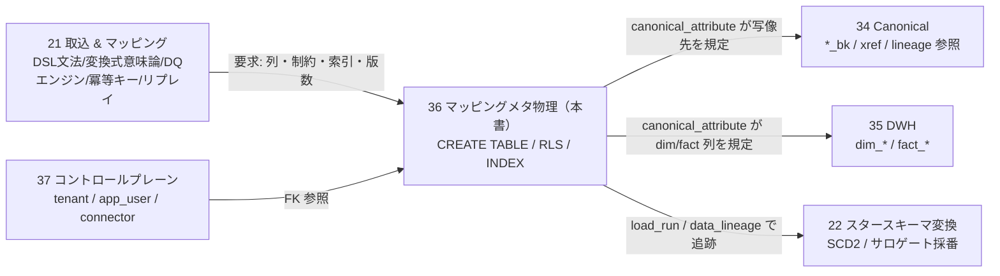
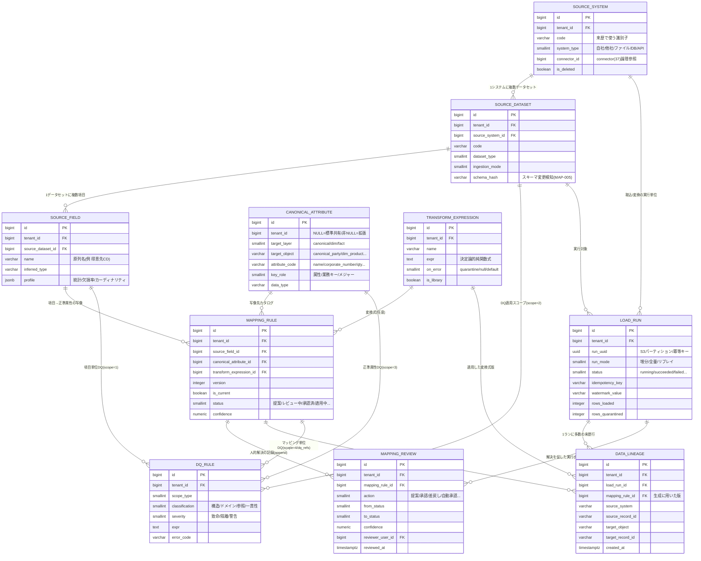
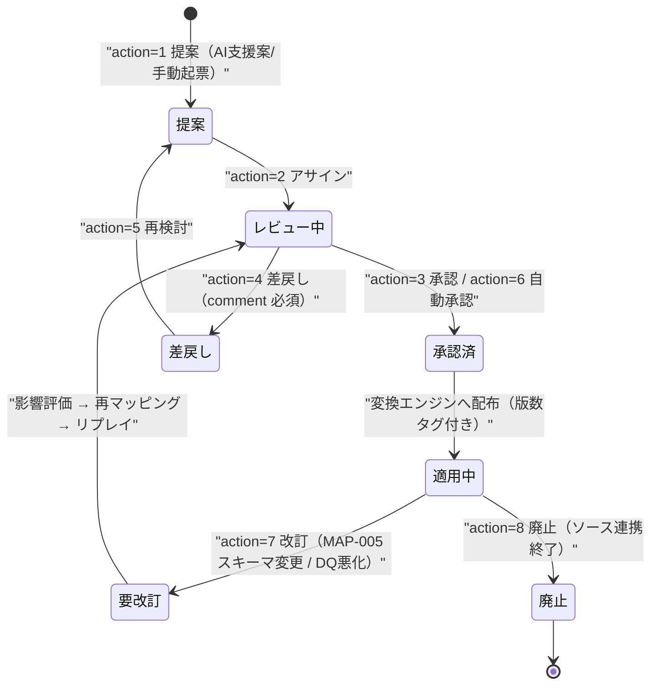
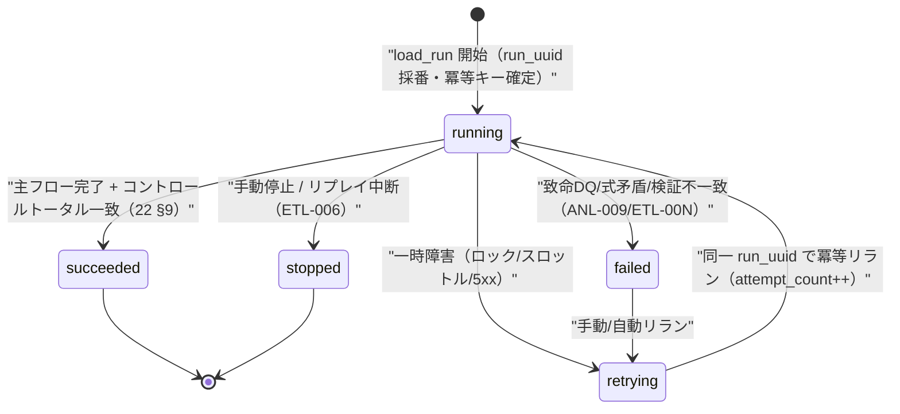
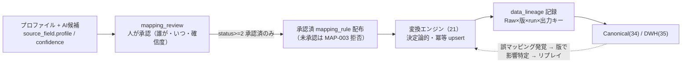

# DBスキーマ設計: マッピング / メタデータ

本ドキュメントは **SCIP（Supply Chain Intelligence Platform、コード名。正式名称は未確定）** の
**取込メタデータ・項目マッピング・変換・データ品質（DQ）・来歴（Lineage）・ロード実行**の**物理スキーマ**を
PostgreSQL の DDL レベルで権威的に定義する。対象は「取込元の定義（`source_system` → `source_dataset` → `source_field`）」・
「正準属性/スタースキーマ列のカタログ（`canonical_attribute`）」・「項目マッピングの宣言（`mapping_rule` / `transform_expression`）」・
「人的解決の記録（`mapping_review`）」・「データ品質ルール（`dq_rule`）」・「ロード実行（`load_run`）」・「来歴（`data_lineage`）」である。

> **本ドキュメントが権威的に所有する範囲（owns / ブリーフ §14）:**
> `source_system`, `source_dataset`, `source_field`, `canonical_attribute`, `mapping_rule`, `transform_expression`,
> `dq_rule`, `load_run`, `data_lineage`, `mapping_review`。
> **所有しない範囲（参照のみ）:**
> - `tenant` / `app_user` / `connector` / `connector_config` / `audit_logs`（[37 コントロールプレーン](./37-control-plane-backoffice-schema.md)所有）
> - 正準エンティティ `canonical_party` / `canonical_product` / `canonical_sku` / `canonical_location` / `region` / 各 `*_xref`（[34 MDM/Canonical](./34-mdm-canonical-schema.md)所有）
> - `dim_*` / `fact_*`（[35 スタースキーマ DWH](./35-star-schema-dwh.md)所有）
> - 各 OLTP ローカルエンティティ（[31](./31-oltp-retail-schema.md) / [32](./32-oltp-manufacturer-schema.md) / [33](./33-oltp-wms-schema.md)）
> - **取込・変換の詳細ロジック**（コネクタ実行モデル・マッピング DSL 文法・変換式言語の意味論・DQ 評価エンジン・冪等キー計算・リプレイ手順・人的マッピング UX）は
>   [21 取込 & 項目マッピングパイプライン](../detailed-design/21-ingestion-and-mapping-pipeline.md)が所有。本書は**そのロジックが要求する「テーブル・列・制約・索引・RLS」を確定する物理層**である。
> - **ETL/MAP エラーコードの権威的レジストリ**は [10 データ連携と項目マッピング](../basic-design/10-data-integration-and-mapping.md) が所有。本書は自身が物理制約として検出するコードのみ逆引き（§13）。
> - 命名 / DDL / テナンシー横断規約は [30 スキーマ戦略と SoT](./30-schema-strategy-and-sot.md) が SoT。

---

## 1. SoT 宣言と責務境界

### 1.1 メタデータ DB の SoT 位置づけ（ブリーフ §5 / 30 §2 / CLAUDE.md 原則6）

本書のテーブルは **メタデータ DB（30 カタログ S4 = RDS PostgreSQL 16）** に配置し、性質の異なる 2 系統を明確に分離する。

| データ系統 | テーブル | SoT | 派生/後追い | 巻き戻し可否 |
|-----------|---------|-----|-----------|------------|
| **定義系（設定）** | `source_system` / `source_dataset` / `source_field` / `canonical_attribute` / `mapping_rule` / `transform_expression` / `dq_rule` | **メタデータ DB（本書）** | 変換エンジン（21）へ**承認後に配布** | 更新可（版数管理で旧版保持） |
| **記録系（実行ログ）** | `load_run` / `data_lineage` / `mapping_review` | **メタデータ DB（本書, append 中心）** | — | **不可（保護対象・原則2）** |

- **定義系は「何をどう写像するか」の SoT**。承認済み定義のみが変換エンジンへ配布され、Raw → Canonical（34）→ DWH（35）へ一方向に適用される（逆流禁止, ブリーフ §5）。
- **記録系は「いつ・誰が・どのルール版で・何を生成/解決したか」の append 中心の監査記録**。再実行（リプレイ・リラン）で**巻き戻さない**（原則2・原則9）。これが「マッピングは人的解決である」運用（§12）を監査可能に支える。

**書込順序（原則6 データフロー整合）:** ①ソース/Raw（SoT, 21）→ ②`load_run` 開始記録（本書, 冪等キー確定）→ ③承認済 `mapping_rule`+`transform_expression` 適用 → ④`data_lineage` 記録（本書）→ ⑤Canonical ゴールデン/xref（34）→ ⑥`dim_*`/`fact_*`（35）へ非同期公開。本書は②④と全定義系を担う。

### 1.2 責務境界（本書 = 物理、21 = ロジック、34/35 = 適用先）



---

## 2. 共通設計方針（ブリーフ §9 / 30 §3-6 準拠）

### 2.1 全テーブル共通の規約

- **PK:** `id BIGSERIAL PRIMARY KEY`（ハウススタイル）。定義系の id は下流（`mapping_rule.canonical_attribute_id`・`data_lineage.mapping_rule_id`）が参照するため不変。
- **テナント列:** テナントスコープ表は `tenant_id BIGINT NOT NULL REFERENCES tenant(id)`。RLS 強制（§11）。UNIQUE は先頭に `tenant_id` を含める。**例外は `canonical_attribute`**（プラットフォーム標準カタログはテナント共有 / 拡張のみスコープ、§5.1 のハイブリッド）。
- **論理削除:** プラットフォーム新規テーブルのため**標準の `is_deleted BOOLEAN NOT NULL DEFAULT FALSE`** を採用（30 §3.2）。ただし**記録系（`load_run` / `data_lineage` / `mapping_review`）は append 中心で論理削除を持たない**（改訂は新レコード追記で表現し、履歴を消さない）。
- **タイムスタンプ:** `created_at` / `updated_at TIMESTAMPTZ NOT NULL DEFAULT now()`（UTC 保存・テナントローカル表示, ブリーフ §9）。実行イベント時刻（`started_at` / `resolved_at` / `reviewed_at`）も TIMESTAMPTZ。業務日付は DATE。
- **監査列:** 定義系は `created_by_user_id` / `updated_by_user_id BIGINT NULL REFERENCES app_user(id)`。**記録系のうち自動実行（`load_run` / `data_lineage`）は行為者が人でない**ため監査列を省略し、代わりに実行主体を専用列（`triggered_by` / `resolved_by_user_id`）で保持する（省略の根拠を明記, 30 §5）。
- **enum/区分:** `SMALLINT + CHECK(IN (...))`（PG ENUM は使わない, ブリーフ §9）。
- **索引/制約命名:** 索引 `idx_<table>_<cols>`、一意 `uq_<table>_<cols>`、CHECK `chk_<table>_<rule>`、FK `fk_<table>_<referent>`。
- **`updated_at` トリガ:** 定義系は 30 §5.1 の共通関数 `set_updated_at()` を `trg_<table>_set_updated_at` で適用（DDL 内では代表例のみ記載、全定義系に適用）。

### 2.2 版数管理（マッピング定義の下位互換とリプレイ再現性）

`mapping_rule` / `transform_expression` / `dq_rule` は**版数管理**する（21 §3.5「ルールは版数管理」）。改訂は**旧版を上書きせず新版を追記**し、`is_current` で現行を示す。
`data_lineage`（§10）は生成に用いた**具体的な版レコードの id** を保持するため、後日「どの版で生成されたか」を復元でき、誤マッピング発覚時に**影響 `load_run` を特定して部分リプレイ**できる（原則6・原則7・原則2）。

| ルール | 物理表現 |
|--------|---------|
| 論理マッピングの同一性 | `(tenant_id, source_field_id, canonical_attribute_id)` |
| 版の識別 | `version INTEGER`（同一論理マッピング内で単調増加） |
| 現行版は 1 つ | 各版数管理表に部分一意索引を張り物理担保: `mapping_rule`=`uq_mapping_rule_current`（`tenant_id, source_field_id, canonical_attribute_id`）／ `dq_rule`=`uq_dq_rule_current`（`tenant_id, code`）／ `transform_expression`=`uq_transform_expression_current`（`tenant_id, name`, ライブラリ式）。いずれも `WHERE is_current = TRUE AND is_deleted = FALSE` |
| 旧版の保持 | 旧版は `is_current = FALSE` で残置（物理削除しない） |
| 適用実績の追跡 | `data_lineage.mapping_rule_id` が版レコードを直接指す |

---

## 3. ER 図（全体像）



> `tenant`・`app_user`・`connector` は 37 所有（本書は FK/論理参照）。`canonical_party` 等の写像先は 34、`dim_*`/`fact_*` は 35 所有で、本書は `canonical_attribute.target_object`（文字列）で**論理的に**規定し物理 FK は張らない（別 DB/別ストア配置のため, §5.2）。

---

## 4. 取込元の定義: `source_system` / `source_dataset` / `source_field`

取込元を 3 階層で正規化する。**`source_system.code` は 34 の `*_xref.source_system` / `canonical_*.source_system` / 本書 `data_lineage.source_system` に格納される来歴識別子の SoT** であり、全ストアで同一値を用いる（原則6 命名の一貫性）。

### 4.1 `source_system`（取込元システム）

```sql
-- source_system — 取込元システムの定義（自社アプリ / 他社SaaS / ファイル / DB / API）
CREATE TABLE source_system (
    id                  BIGSERIAL    PRIMARY KEY,                       -- 代理主キー
    tenant_id           BIGINT       NOT NULL REFERENCES tenant(id),    -- テナント（RLS対象）
    code                VARCHAR(64)  NOT NULL,                          -- 来歴識別子（34 xref/lineage の source_system と同値・テナント内一意）
    name                VARCHAR(255) NOT NULL,                          -- 表示名（例 '他社POS_A社', 'Honshu生産管理'）
    system_type         SMALLINT     NOT NULL,                          -- 1=自社アプリ 2=他社SaaS 3=ファイル 4=外部DB 5=API 6=ストリーム
    connector_id        BIGINT       NULL,                              -- connector(37)への論理参照（別DBのため物理FK非張, §5.2）
    owner_org           VARCHAR(255) NULL,                              -- ソース提供元組織名（他社連携時）
    description         TEXT         NULL,                              -- 用途・連携経緯メモ
    is_active           BOOLEAN      NOT NULL DEFAULT TRUE,             -- 連携有効フラグ（廃止時 FALSE）
    is_deleted          BOOLEAN      NOT NULL DEFAULT FALSE,            -- 論理削除
    created_at          TIMESTAMPTZ  NOT NULL DEFAULT now(),
    updated_at          TIMESTAMPTZ  NOT NULL DEFAULT now(),
    created_by_user_id  BIGINT       NULL REFERENCES app_user(id),
    updated_by_user_id  BIGINT       NULL REFERENCES app_user(id),
    legacy_id           VARCHAR(64)  NULL,
    CONSTRAINT chk_source_system_type CHECK (system_type BETWEEN 1 AND 6),
    CONSTRAINT uq_source_system_code  UNIQUE (tenant_id, code)          -- 来歴識別子はテナント内一意
);
CREATE INDEX idx_source_system_tenant ON source_system (tenant_id) WHERE is_deleted = FALSE;
COMMENT ON TABLE  source_system              IS '取込元システムの定義。code は 34 xref/本書 lineage の source_system と同値の来歴 SoT';
COMMENT ON COLUMN source_system.connector_id IS 'connector(37)への論理参照。別DB配置のため物理FKは張らずアプリ層で整合を担保';
COMMENT ON COLUMN source_system.system_type  IS '取込元種別。1=自社アプリ 2=他社SaaS 3=ファイル 4=外部DB 5=API 6=ストリーム';
```

### 4.2 `source_dataset`（データセット = ソース内の表/ファイル種別/エンドポイント）

```sql
-- source_dataset — ソース内の論理データセット（テーブル・CSV種別・APIエンドポイント・ストリーム）
CREATE TABLE source_dataset (
    id                  BIGSERIAL    PRIMARY KEY,
    tenant_id           BIGINT       NOT NULL REFERENCES tenant(id),
    source_system_id    BIGINT       NOT NULL REFERENCES source_system(id),  -- 所属ソース
    code                VARCHAR(64)  NOT NULL,                          -- データセットコード（システム内一意, 例 'sales_lines'）
    name                VARCHAR(255) NOT NULL,                          -- 表示名（例 '売上明細CSV'）
    dataset_type        SMALLINT     NOT NULL,                          -- 1=table 2=file 3=stream 4=api_endpoint 5=webhook
    ingestion_mode      SMALLINT     NOT NULL,                          -- 1=batch_pull 2=streaming 3=webhook 4=file_drop 5=cdc 6=api_paging
    grain_description   VARCHAR(500) NULL,                              -- 1行の意味（グレイン。例 '受注明細1行=SKU×受注'）
    business_key_fields VARCHAR(500) NULL,                             -- ソース自然キー列（カンマ区切り。冪等キー計算に使用, 21 §4.1）
    watermark_field     VARCHAR(128) NULL,                             -- 増分ウォーターマーク列（例 'updated_at' / LSN）
    schema_hash         VARCHAR(64)  NULL,                             -- 現行スキーマのハッシュ（source_field 集合。差分で MAP-005 検知, 21 §3.1）
    target_canonical    VARCHAR(64)  NULL,                             -- 主たる写像先エンティティのヒント（例 'canonical_party'）
    is_active           BOOLEAN      NOT NULL DEFAULT TRUE,
    is_deleted          BOOLEAN      NOT NULL DEFAULT FALSE,
    created_at          TIMESTAMPTZ  NOT NULL DEFAULT now(),
    updated_at          TIMESTAMPTZ  NOT NULL DEFAULT now(),
    created_by_user_id  BIGINT       NULL REFERENCES app_user(id),
    updated_by_user_id  BIGINT       NULL REFERENCES app_user(id),
    legacy_id           VARCHAR(64)  NULL,
    CONSTRAINT chk_source_dataset_type CHECK (dataset_type BETWEEN 1 AND 5),
    CONSTRAINT chk_source_dataset_mode CHECK (ingestion_mode BETWEEN 1 AND 6),
    CONSTRAINT uq_source_dataset_code  UNIQUE (tenant_id, source_system_id, code)
);
CREATE INDEX idx_source_dataset_system ON source_dataset (tenant_id, source_system_id) WHERE is_deleted = FALSE;
COMMENT ON COLUMN source_dataset.schema_hash    IS 'source_field 集合のハッシュ。取込時の再計算差分でソーススキーマ変更(MAP-005)を検知し要改訂へ遷移';
COMMENT ON COLUMN source_dataset.watermark_field IS '増分ロードの基準列。実行値は load_run.watermark_value に永続化（21 §5.2）';
```

### 4.3 `source_field`（ソース項目 = 列）

```sql
-- source_field — ソースの項目（列）。プロファイル統計を保持しマッピング候補生成の入力に使う
CREATE TABLE source_field (
    id                  BIGSERIAL    PRIMARY KEY,
    tenant_id           BIGINT       NOT NULL REFERENCES tenant(id),
    source_dataset_id   BIGINT       NOT NULL REFERENCES source_dataset(id) ON DELETE CASCADE,  -- 明細→親 CASCADE（データセット従属）
    name                VARCHAR(255) NOT NULL,                          -- 原列名（例 '得意先CD', 'qty', '伝票日付'）
    ordinal             INTEGER      NULL,                              -- 列順（固定長/CSV位置）
    inferred_type       VARCHAR(32)  NULL,                             -- 推定物理型（'string'|'number'|'date'|'boolean'...）
    is_nullable         BOOLEAN      NOT NULL DEFAULT TRUE,            -- 欠損許容（プロファイル由来）
    sample_values       JSONB        NOT NULL DEFAULT '[]'::jsonb,    -- 代表サンプル値（UX U-2 で提示, 21 §3.6）
    profile             JSONB        NOT NULL DEFAULT '{}'::jsonb,    -- 統計（欠損率/カーディナリティ/型分布/正規表現パターン, 21 §3.1）
    is_active           BOOLEAN      NOT NULL DEFAULT TRUE,           -- スキーマ変更で消えた列は FALSE（履歴保持）
    is_deleted          BOOLEAN      NOT NULL DEFAULT FALSE,
    created_at          TIMESTAMPTZ  NOT NULL DEFAULT now(),
    updated_at          TIMESTAMPTZ  NOT NULL DEFAULT now(),
    legacy_id           VARCHAR(64)  NULL,
    CONSTRAINT uq_source_field_name UNIQUE (tenant_id, source_dataset_id, name)  -- データセット内で列名一意
);
CREATE INDEX idx_source_field_dataset ON source_field (tenant_id, source_dataset_id) WHERE is_deleted = FALSE;
COMMENT ON TABLE  source_field         IS 'ソース項目。プロファイル統計はマッピング候補生成(21 §3-4)とDQ設計の入力。監査列は省略（プロファイラ自動生成のため）';
COMMENT ON COLUMN source_field.profile IS '型分布/欠損率/カーディナリティ/正規表現パターン。AI支援マッピングの信頼度算出に使用（21 §4.2）';
```

> **監査列の省略根拠（30 §5）:** `source_field` はプロファイラ（Glue）が自動生成する高頻度データのため `created_by_user_id` を省略する。人的に確定するのは下流の `mapping_rule` / `mapping_review` であり、そこで解決者を記録する。

---

## 5. 正準属性カタログ: `canonical_attribute`

**マッピングの写像先を規定するカタログ**。34 の正準エンティティ列・35 の `dim_*`/`fact_*` 列を「1 属性 = 1 行」で登録し、`mapping_rule` はこのカタログ id を写像先として参照する。
21 §3.2 の DSL における `"canonical_target": "canonical_party.customer_bk"` は、物理的には `canonical_attribute` の 1 行（`target_object='canonical_party'`, `attribute_code='customer_bk'`）へ解決される。

### 5.1 テナント共有 vs 拡張（ハイブリッド確定, `region` と同型）

正準/スタースキーマの**標準列はプラットフォーム共通**であり全テナントで同一。一方、ブリーフ §2「固有事情のみカスタマイズ」に従い**テナント固有の拡張属性**（オプション取込項目）を許容する。

- `tenant_id BIGINT NULL`: **NULL = プラットフォーム標準カタログ属性**（管理者が投入・全テナント可視）、**非 NULL = テナント固有拡張属性**。
- RLS は `tenant_id IS NULL OR tenant_id = 現テナント` を可視とし、挿入は自テナントのみ（標準属性は `BYPASSRLS` 管理バッチのみ投入。34 §4.1 と同一方式）。
- 拡張属性の物理格納先は `attributes JSONB`（型付き拡張テーブル併用も選択肢, ブリーフ §9 / 26）。本カタログは**「その属性が存在し、どの型・どのキー役割か」を宣言**する。

### 5.2 DDL

```sql
-- canonical_attribute — 正準属性/スタースキーマ列のカタログ（マッピングの写像先を規定）
CREATE TABLE canonical_attribute (
    id                  BIGSERIAL    PRIMARY KEY,                       -- 代理主キー（mapping_rule/dq_rule/data_lineage が参照）
    tenant_id           BIGINT       NULL REFERENCES tenant(id),        -- NULL=標準共有カタログ / 非NULL=テナント拡張属性
    target_layer        SMALLINT     NOT NULL,                          -- 1=canonical 2=star_dim 3=star_fact 4=semantic
    target_object       VARCHAR(64)  NOT NULL,                          -- 写像先テーブル論理名（例 'canonical_party','dim_product','fact_sales'）
    attribute_code      VARCHAR(64)  NOT NULL,                          -- 属性/列コード（例 'name','corporate_number','product_bk','qty'）
    display_name        VARCHAR(255) NOT NULL,                          -- 日本語表示名（マッピングUXで提示）
    data_type           VARCHAR(32)  NOT NULL,                          -- 論理型 'string'|'numeric'|'date'|'timestamptz'|'boolean'|'smallint_enum'
    key_role            SMALLINT     NOT NULL DEFAULT 1,                -- 1=属性 2=業務キー(*_bk) 3=メジャー 4=degenerate 5=サロゲート
    is_required         BOOLEAN      NOT NULL DEFAULT FALSE,            -- 写像必須（未充足で MAP-001）
    is_pii              BOOLEAN      NOT NULL DEFAULT FALSE,            -- 個人情報/機微（マスキング対象, ブリーフ §11/§12）
    uom_hint            VARCHAR(32)  NULL,                              -- 想定単位（メジャー正規化のヒント, 34 uom）
    allowed_values      JSONB        NULL,                             -- 許容集合（enum/コード。DQドメイン検証の既定）
    description         TEXT         NULL,                              -- 意味定義（セマンティック層と整合）
    owner_document      VARCHAR(32)  NULL,                             -- 定義所有ドキュメント（'34'|'35'）追跡用メタ
    sort_order          INTEGER      NOT NULL DEFAULT 0,
    is_deleted          BOOLEAN      NOT NULL DEFAULT FALSE,
    created_at          TIMESTAMPTZ  NOT NULL DEFAULT now(),
    updated_at          TIMESTAMPTZ  NOT NULL DEFAULT now(),
    created_by_user_id  BIGINT       NULL REFERENCES app_user(id),
    updated_by_user_id  BIGINT       NULL REFERENCES app_user(id),
    CONSTRAINT chk_canonical_attribute_layer CHECK (target_layer BETWEEN 1 AND 4),
    CONSTRAINT chk_canonical_attribute_role  CHECK (key_role BETWEEN 1 AND 5)
);
-- 標準/拡張ともに (スコープ, 写像先, 属性コード) で一意（NULL スコープは COALESCE で 0 に畳む）
CREATE UNIQUE INDEX uq_canonical_attribute_obj_code
    ON canonical_attribute (COALESCE(tenant_id, 0), target_object, attribute_code)
    WHERE is_deleted = FALSE;
CREATE INDEX idx_canonical_attribute_object ON canonical_attribute (target_object) WHERE is_deleted = FALSE;
CREATE INDEX idx_canonical_attribute_layer  ON canonical_attribute (target_layer)  WHERE is_deleted = FALSE;
COMMENT ON TABLE  canonical_attribute              IS '正準属性/スタースキーマ列のカタログ。34/35 の列を1属性1行で登録しマッピング写像先を規定。物理FKは張らず論理名で参照';
COMMENT ON COLUMN canonical_attribute.tenant_id    IS 'NULL=全テナント共有の標準カタログ。非NULL=テナント固有拡張属性。RLS は NULL を全テナント可視';
COMMENT ON COLUMN canonical_attribute.key_role     IS '属性の役割。2=業務キー(dim の *_bk)、3=fact のメジャー、4=degenerate dimension。写像時の適用先を決定';
COMMENT ON COLUMN canonical_attribute.target_object IS '写像先テーブル論理名。34/35 の物理テーブルへ別DB/別ストア配置のため物理FKを張らずアプリ層で整合';
```

> **物理 FK を張らない根拠（30 §6 / 34 §5.3）:** 写像先（34 = Aurora、35 = Redshift）は本書のメタデータ DB（RDS）と別ストアに配置されるため、`target_object`/`attribute_code` を**論理名**で保持しアプリ/変換層で妥当性を担保する。カタログは 34/35 の DDL 変更時に**同時更新**する（CLAUDE.md 原則5 コードとドキュメントの一貫性・変更波及の全件確認）。

---

## 6. 項目マッピング: `mapping_rule` / `transform_expression`

`mapping_rule` 1 行 = 「1 ソース項目 → 1 正準属性」の 1 版の宣言（21 §3.2）。変換が必要なら `transform_expression` を参照する（恒等写像は NULL）。

### 6.1 DSL（21 §3.2 所有）↔ 物理列の対応

| DSL キー（21 §3.2） | 物理列（本書） |
|--------------------|--------------|
| `source_dataset_id` / `source_field` | `mapping_rule.source_field_id`（→ `source_field` → `source_dataset`） |
| `canonical_target` | `mapping_rule.canonical_attribute_id`（→ `canonical_attribute`） |
| `transform.expr` / `transform.on_error` | `transform_expression.expr` / `.on_error`（`mapping_rule.transform_expression_id`） |
| `dq_refs[]` | `dq_rule`（`scope_type=mapping_rule`, `mapping_rule_id` で紐付け, §7） |
| `review_status` | `mapping_rule.status`（履歴は `mapping_review`） |
| `confidence` | `mapping_rule.confidence` |
| `template_origin` | `mapping_rule.template_origin` |

### 6.2 `transform_expression`（変換式）

```sql
-- transform_expression — 決定論的・副作用なし・冪等な純関数の変換式（21 §3.3 の意味論に従う）
CREATE TABLE transform_expression (
    id                  BIGSERIAL    PRIMARY KEY,
    tenant_id           BIGINT       NOT NULL REFERENCES tenant(id),
    name                VARCHAR(128) NULL,                              -- ライブラリ式の名称（再利用時）
    expr                TEXT         NOT NULL,                          -- 式本体（例 lpad(trim($source),8,'0')）。時刻/乱数/外部参照禁止
    expr_lang           SMALLINT     NOT NULL DEFAULT 1,               -- 1=SCIP変換式DSL（将来 2=SQL式 等）
    on_error            SMALLINT     NOT NULL DEFAULT 1,               -- 失敗時: 1=quarantine 2=null 3=default（21 §3.3）
    default_value       VARCHAR(255) NULL,                             -- on_error=3 の既定値
    is_library          BOOLEAN      NOT NULL DEFAULT FALSE,           -- TRUE=再利用可能ライブラリ式（原則3 重複回避）
    version             INTEGER      NOT NULL DEFAULT 1,               -- 版数（改訂は新版追記）
    is_current          BOOLEAN      NOT NULL DEFAULT TRUE,
    is_deleted          BOOLEAN      NOT NULL DEFAULT FALSE,
    created_at          TIMESTAMPTZ  NOT NULL DEFAULT now(),
    updated_at          TIMESTAMPTZ  NOT NULL DEFAULT now(),
    created_by_user_id  BIGINT       NULL REFERENCES app_user(id),
    updated_by_user_id  BIGINT       NULL REFERENCES app_user(id),
    CONSTRAINT chk_transform_expression_onerr  CHECK (on_error BETWEEN 1 AND 3),
    CONSTRAINT chk_transform_expression_deflt  CHECK (on_error <> 3 OR default_value IS NOT NULL)  -- default時は既定値必須
);
CREATE UNIQUE INDEX uq_transform_expression_lib
    ON transform_expression (tenant_id, name, version)
    WHERE is_library = TRUE AND is_deleted = FALSE;                     -- ライブラリ式は名称×版で一意
-- ライブラリ式の現行版は名称ごとに高々1つ（§2.2「現行版は1つ」を物理担保。名称なしのインライン式は対象外）
CREATE UNIQUE INDEX uq_transform_expression_current
    ON transform_expression (tenant_id, name)
    WHERE is_current = TRUE AND is_library = TRUE AND is_deleted = FALSE AND name IS NOT NULL;
CREATE INDEX idx_transform_expression_current ON transform_expression (tenant_id) WHERE is_current = TRUE AND is_deleted = FALSE;
COMMENT ON TABLE  transform_expression         IS '変換式。決定論的・副作用なし・冪等（21 §3.3）。リプレイ再現性のため時刻/乱数/外部I/O/副問合せを禁止';
COMMENT ON COLUMN transform_expression.on_error IS '式失敗時の扱い。1=当該行をquarantine(MAP-004) 2=null化 3=default_value 充当';
```

### 6.3 `mapping_rule`（マッピングルール）

```sql
-- mapping_rule — ソース項目→正準属性/スタースキーマ列の写像宣言（1版=1行, §2.2）
CREATE TABLE mapping_rule (
    id                     BIGSERIAL    PRIMARY KEY,
    tenant_id              BIGINT       NOT NULL REFERENCES tenant(id),
    source_field_id        BIGINT       NOT NULL REFERENCES source_field(id),          -- 写像元（§4.3）
    canonical_attribute_id BIGINT       NOT NULL REFERENCES canonical_attribute(id),   -- 写像先カタログ（§5）
    transform_expression_id BIGINT      NULL REFERENCES transform_expression(id),      -- 変換式（恒等写像は NULL）
    version                INTEGER      NOT NULL DEFAULT 1,                            -- 論理マッピング内の版数（§2.2）
    is_current             BOOLEAN      NOT NULL DEFAULT TRUE,                         -- 現行版フラグ
    supersedes_rule_id     BIGINT       NULL REFERENCES mapping_rule(id),             -- 直前版（版系列の追跡）
    status                 SMALLINT     NOT NULL DEFAULT 0,                            -- 0=提案 1=レビュー中 2=承認済 3=差戻し 4=適用中 5=要改訂 6=廃止
    confidence             NUMERIC(5,4) NULL,                                          -- AI支援の合成信頼度 0-1（21 §4.2）。人的確定=1.0000
    match_origin           SMALLINT     NOT NULL DEFAULT 3,                            -- 由来 0=決定的 1=確率的 2=AI支援 3=人的
    template_origin        VARCHAR(128) NULL,                                          -- 由来テンプレート（21 §4.4）
    priority               INTEGER      NOT NULL DEFAULT 0,                            -- 複数ソース→同一属性の採用優先度（survivorship 入力, 34/20）
    is_deleted             BOOLEAN      NOT NULL DEFAULT FALSE,
    created_at             TIMESTAMPTZ  NOT NULL DEFAULT now(),
    updated_at             TIMESTAMPTZ  NOT NULL DEFAULT now(),
    created_by_user_id     BIGINT       NULL REFERENCES app_user(id),
    updated_by_user_id     BIGINT       NULL REFERENCES app_user(id),
    approved_by_user_id    BIGINT       NULL REFERENCES app_user(id),                 -- 承認者（status>=2 時）
    approved_at            TIMESTAMPTZ  NULL,                                          -- 承認日時
    legacy_id              VARCHAR(64)  NULL,
    CONSTRAINT chk_mapping_rule_status   CHECK (status BETWEEN 0 AND 6),
    CONSTRAINT chk_mapping_rule_origin   CHECK (match_origin BETWEEN 0 AND 3),
    CONSTRAINT chk_mapping_rule_conf     CHECK (confidence IS NULL OR (confidence >= 0 AND confidence <= 1)),
    CONSTRAINT uq_mapping_rule_version   UNIQUE (tenant_id, source_field_id, canonical_attribute_id, version)  -- 論理マッピング×版で一意
);
-- 現行版は論理マッピングごとに高々1つ（適用対象の一意性を物理保証）
CREATE UNIQUE INDEX uq_mapping_rule_current
    ON mapping_rule (tenant_id, source_field_id, canonical_attribute_id)
    WHERE is_current = TRUE AND is_deleted = FALSE;
CREATE INDEX idx_mapping_rule_field    ON mapping_rule (tenant_id, source_field_id)        WHERE is_deleted = FALSE;
CREATE INDEX idx_mapping_rule_target   ON mapping_rule (tenant_id, canonical_attribute_id) WHERE is_deleted = FALSE;
CREATE INDEX idx_mapping_rule_status   ON mapping_rule (tenant_id, status)                 WHERE is_deleted = FALSE;  -- レビュー待ち抽出
COMMENT ON COLUMN mapping_rule.status         IS '状態機械（21 §3.5）。0=提案 1=レビュー中 2=承認済 3=差戻し 4=適用中 5=要改訂 6=廃止。承認済(2)以上のみ変換エンジンへ配布可(MAP-003)';
COMMENT ON COLUMN mapping_rule.is_current     IS '現行版フラグ。改訂は旧版を is_current=FALSE で残置し新版追記（下位互換・リプレイ再現性, §2.2）';
COMMENT ON COLUMN mapping_rule.priority       IS '同一正準属性へ複数ソースが写像する場合の採用優先度。survivorship の入力（34/20）';
```

> **未承認は適用不可（原則: 人が解決し機械が適用）:** `status < 2`（提案/レビュー中/差戻し）のルールを変換エンジンが要求した場合は配布拒否 → `MAP-003`（21 §7）。適用は必ず承認済版に限る。

---

## 7. データ品質: `dq_rule`

`dq_rule` は宣言的な DQ ルール。DQ 評価エンジン（21 §6.1 所有）が Raw 直後・変換前後の複数段で解釈実行する。スコープを 4 段（項目/データセット/正準属性/マッピングルール）で持ち、致命度で挙動を分ける。

```sql
-- dq_rule — データ品質ルール（構造/ドメイン/参照整合/一貫性。21 §6.1 のエンジンが評価）
CREATE TABLE dq_rule (
    id                     BIGSERIAL    PRIMARY KEY,
    tenant_id              BIGINT       NOT NULL REFERENCES tenant(id),
    code                   VARCHAR(64)  NOT NULL,                        -- ルールコード（テナント内一意, 例 'dq_customer_code_format'）
    name                   VARCHAR(255) NOT NULL,                        -- 表示名
    scope_type             SMALLINT     NOT NULL,                        -- 1=field 2=dataset 3=canonical_attribute 4=mapping_rule
    source_field_id        BIGINT       NULL REFERENCES source_field(id)        ON DELETE CASCADE,  -- scope=1
    source_dataset_id      BIGINT       NULL REFERENCES source_dataset(id)      ON DELETE CASCADE,  -- scope=2
    canonical_attribute_id BIGINT       NULL REFERENCES canonical_attribute(id),                    -- scope=3
    mapping_rule_id        BIGINT       NULL REFERENCES mapping_rule(id)        ON DELETE CASCADE,   -- scope=4（dq_refs）
    classification         SMALLINT     NOT NULL,                        -- 1=構造 2=ドメイン 3=参照整合 4=一貫性（21 §6.1）
    severity               SMALLINT     NOT NULL,                        -- 1=致命(ロード停止) 2=行隔離(非ブロッキング) 3=警告
    expr                   TEXT         NOT NULL,                        -- 検証式（例 '$value ~ ''^[0-9]{8}$''' / 'qty >= 0'）
    threshold              NUMERIC(6,4) NULL,                            -- 一貫性系の逸脱許容率（超過で severity 昇格）
    error_code             VARCHAR(16)  NOT NULL,                        -- 送出コード（ETL-004 / MAP-002 等。レジストリは 10 所有）
    version                INTEGER      NOT NULL DEFAULT 1,              -- 版数
    is_current             BOOLEAN      NOT NULL DEFAULT TRUE,
    is_active              BOOLEAN      NOT NULL DEFAULT TRUE,
    is_deleted             BOOLEAN      NOT NULL DEFAULT FALSE,
    created_at             TIMESTAMPTZ  NOT NULL DEFAULT now(),
    updated_at             TIMESTAMPTZ  NOT NULL DEFAULT now(),
    created_by_user_id     BIGINT       NULL REFERENCES app_user(id),
    updated_by_user_id     BIGINT       NULL REFERENCES app_user(id),
    CONSTRAINT chk_dq_rule_scope   CHECK (scope_type BETWEEN 1 AND 4),
    CONSTRAINT chk_dq_rule_class   CHECK (classification BETWEEN 1 AND 4),
    CONSTRAINT chk_dq_rule_sev     CHECK (severity BETWEEN 1 AND 3),
    -- スコープと FK の整合（該当スコープの FK のみ非 NULL）
    CONSTRAINT chk_dq_rule_scope_fk CHECK (
        (scope_type = 1 AND source_field_id        IS NOT NULL) OR
        (scope_type = 2 AND source_dataset_id      IS NOT NULL) OR
        (scope_type = 3 AND canonical_attribute_id IS NOT NULL) OR
        (scope_type = 4 AND mapping_rule_id        IS NOT NULL)),
    CONSTRAINT uq_dq_rule_code UNIQUE (tenant_id, code, version)
);
-- DQ ルールの現行版は code ごとに高々1つ（§2.2「現行版は1つ」を物理担保。評価エンジンの現行版選択を決定的にする）
CREATE UNIQUE INDEX uq_dq_rule_current
    ON dq_rule (tenant_id, code)
    WHERE is_current = TRUE AND is_deleted = FALSE;
CREATE INDEX idx_dq_rule_dataset ON dq_rule (tenant_id, source_dataset_id) WHERE is_active = TRUE AND is_deleted = FALSE;
CREATE INDEX idx_dq_rule_field   ON dq_rule (tenant_id, source_field_id)   WHERE is_active = TRUE AND is_deleted = FALSE;
CREATE INDEX idx_dq_rule_rule    ON dq_rule (tenant_id, mapping_rule_id)   WHERE is_active = TRUE AND is_deleted = FALSE;
COMMENT ON COLUMN dq_rule.severity   IS '致命度。1=致命(当該ロード停止 ETL-001/003) 2=行隔離(非ブロッキング, quarantineへ ETL-004/MAP-002) 3=警告。原則4 グレースフルデグラデーション';
COMMENT ON COLUMN dq_rule.threshold  IS '一貫性系の逸脱許容率。超過で severity を実効的に昇格し当該ロードを停止（21 §6.1）';
COMMENT ON COLUMN dq_rule.error_code IS '送出エラーコード。権威的レジストリは 10 が所有。本書は付与のみ';
```

> **非ブロッキング原則の物理化（原則4）:** `severity=2` の行単位逸脱は当該行のみ quarantine ゾーン（21 §2.5）へ退避し残りを流す。全体停止は `severity=1`（構造崩壊・認証不能等の致命）のみ。隔離行は `data_lineage` と DQ レポートに可視化し人的回復へ回す。

---

## 8. 人的解決の記録: `mapping_review`

**「誰がいつマッピングを解決したか、確信度はいくつか」の append 中心の監査記録**（本ドキュメントの核心要件）。`mapping_rule.status` の**遷移ごとに 1 行を追記**し、履歴を消さない。承認・差戻し・自動承認・改訂・廃止のすべてを追跡する。

> **マイグレーション順序の注意（本書の唯一の前方参照）:** `mapping_review.load_run_id` は §9 の `load_run(id)` を参照するが、本書はセクション順に CREATE TABLE を並べるため定義位置は `load_run`（§9）より前にある。**実マイグレーションでは `load_run` を先行作成する**（またはこの FK を `ALTER TABLE mapping_review ADD CONSTRAINT ... FOREIGN KEY (load_run_id) REFERENCES load_run(id)` で後付け分離する）。本書はドキュメントとして人的解決（§8）→ 実行記録（§9）の設計順を優先し提示している。

```sql
-- mapping_review — マッピングの人的解決/レビューの記録（append 中心・巻き戻さない, 原則2）
CREATE TABLE mapping_review (
    id                  BIGSERIAL    PRIMARY KEY,
    tenant_id           BIGINT       NOT NULL REFERENCES tenant(id),
    mapping_rule_id     BIGINT       NOT NULL REFERENCES mapping_rule(id),  -- 対象マッピング版
    action              SMALLINT     NOT NULL,                          -- 1=提案 2=アサイン 3=承認 4=差戻し 5=再検討 6=自動承認 7=改訂 8=廃止
    from_status         SMALLINT     NULL,                              -- 遷移前 status（mapping_rule.status と整合）
    to_status           SMALLINT     NOT NULL,                          -- 遷移後 status
    confidence          NUMERIC(5,4) NULL,                              -- 解決時の確信度（人的=1.0000 / 自動承認=元スコア）
    is_auto_approved    BOOLEAN      NOT NULL DEFAULT FALSE,            -- 自動承認フラグ（事後監査対象, 21 §4.3）
    reviewer_user_id    BIGINT       NULL REFERENCES app_user(id),      -- 解決者（自動承認は NULL・システム主体）
    reviewed_at         TIMESTAMPTZ  NOT NULL DEFAULT now(),            -- 解決日時
    load_run_id         BIGINT       NULL REFERENCES load_run(id),      -- 解決を促した実行（要改訂トリガ等・任意）
    comment             TEXT         NULL,                              -- 理由（差戻し時は必須・アプリ層で強制, 21 §3.6 U-3）
    CONSTRAINT chk_mapping_review_action  CHECK (action BETWEEN 1 AND 8),
    CONSTRAINT chk_mapping_review_status  CHECK (to_status BETWEEN 0 AND 6),
    CONSTRAINT chk_mapping_review_conf    CHECK (confidence IS NULL OR (confidence >= 0 AND confidence <= 1)),
    CONSTRAINT chk_mapping_review_reviewer CHECK (is_auto_approved = TRUE OR reviewer_user_id IS NOT NULL)  -- 人的解決は解決者必須
);
CREATE INDEX idx_mapping_review_rule     ON mapping_review (tenant_id, mapping_rule_id, reviewed_at);
CREATE INDEX idx_mapping_review_reviewer ON mapping_review (tenant_id, reviewer_user_id);
CREATE INDEX idx_mapping_review_auto     ON mapping_review (tenant_id) WHERE is_auto_approved = TRUE;  -- 事後監査対象抽出
COMMENT ON TABLE  mapping_review                 IS '人的解決/レビューの記録。誰がいつどの確信度で解決したかを改竄不能に保持。論理削除なし append 中心（原則2）';
COMMENT ON COLUMN mapping_review.is_auto_approved IS '高信頼度の自動承認フラグ（未決 D-2）。TRUE でも本行は残り事後に人が覆せる（原則7）';
COMMENT ON COLUMN mapping_review.comment          IS '解決理由。差戻し(action=4)は必須（アプリ層で強制）。差戻し理由の追跡性を担保';
```

### 8.1 状態遷移の物理表現（21 §3.5 のロジックを記録）



> `mapping_rule.status` が**現在状態**（1 行）、`mapping_review` が**遷移履歴**（append）。両者は `from_status`/`to_status` で整合し、Control Plane の承認操作は `audit_logs`（37, INSERT 専用）にも二重記録して改竄不能性を強化する（21 §6.5）。

---

## 9. ロード実行: `load_run`

1 回の取込/変換実行を 1 行で追跡する記録系。冪等キー・ウォーターマーク・コントロールトータル・状態機械を保持し、**冪等リラン**（同一 `run_uuid` で再実行）と**リプレイ**（Raw から再生成）を支える（21 §5 / 22 §9）。

```sql
-- load_run — 取込/変換の実行単位（記録系・append 中心。冪等リランは同一行を更新, 22 §11）
CREATE TABLE load_run (
    id                  BIGSERIAL    PRIMARY KEY,
    tenant_id           BIGINT       NOT NULL REFERENCES tenant(id),
    run_uuid            UUID         NOT NULL,                          -- 実行識別子（S3 raw パーティション/冪等キーに使用, 21 §2.5）
    source_system_id    BIGINT       NULL REFERENCES source_system(id), -- 取込元（変換のみのランは NULL 可）
    source_dataset_id   BIGINT       NULL REFERENCES source_dataset(id),-- 対象データセット
    run_kind            SMALLINT     NOT NULL,                          -- 取込方式 1=batch 2=stream 3=webhook 4=file 5=cdc 6=api（21 §2.4）
    run_mode            SMALLINT     NOT NULL DEFAULT 1,               -- 1=増分 2=全量 3=リプレイ（21 §5.2）
    status              SMALLINT     NOT NULL DEFAULT 1,               -- 1=running 2=succeeded 3=failed 4=retrying 5=stopped
    idempotency_key     VARCHAR(128) NULL,                             -- 冪等キー（file_sha256/Idempotency-Key/LSN 等, 21 §4.1）
    attempt_count       INTEGER      NOT NULL DEFAULT 1,               -- リトライ回数（同一 run_uuid で冪等リラン, 22 §11）
    watermark_kind      SMALLINT     NULL,                             -- 1=updated_at 2=LSN 3=cursor 4=file
    watermark_value     VARCHAR(255) NULL,                             -- 到達ウォーターマーク（成功時のみ確定。次回増分開始点, 21 §5.2）
    -- コントロールトータル（22 §9 の照合に使用）
    rows_read           INTEGER      NOT NULL DEFAULT 0,               -- ソース読取行数
    rows_staged         INTEGER      NOT NULL DEFAULT 0,               -- staging 生成行数
    rows_loaded         INTEGER      NOT NULL DEFAULT 0,               -- 正準/DWH へ投入行数
    rows_quarantined    INTEGER      NOT NULL DEFAULT 0,               -- DQ 隔離行数（非ブロッキング）
    rows_rejected       INTEGER      NOT NULL DEFAULT 0,               -- 恒久拒否行数
    amount_control_total NUMERIC(18,4) NULL,                          -- 金額系コントロールトータル（合計照合, 22 §9）
    -- 主フロー/補助処理の完了を分離（21 §5.1・原則4）
    main_completed_at   TIMESTAMPTZ  NULL,                             -- 主フロー完了時刻
    aux_completed_at    TIMESTAMPTZ  NULL,                             -- 補助処理（通知/カタログ更新/レポート）完了時刻
    raw_partition_uri   VARCHAR(512) NULL,                             -- Raw 着地の S3 プレフィックス（リプレイ源泉, 21 §2.5）
    ingest_date         DATE         NULL,                             -- 取込業務日付（パーティション）
    triggered_by        SMALLINT     NOT NULL DEFAULT 1,               -- 起動主体 1=scheduler 2=event 3=manual 4=replay
    triggered_by_user_id BIGINT      NULL REFERENCES app_user(id),     -- 手動起動者（triggered_by=3/4 時）
    error_code          VARCHAR(16)  NULL,                             -- 失敗時コード（ETL-00N/MAP-00N, レジストリは 10）
    message             TEXT         NULL,                             -- 失敗詳細/メモ
    started_at          TIMESTAMPTZ  NOT NULL DEFAULT now(),           -- 実行開始
    finished_at         TIMESTAMPTZ  NULL,                             -- 実行終了（成功/失敗確定時）
    CONSTRAINT chk_load_run_kind   CHECK (run_kind BETWEEN 1 AND 6),
    CONSTRAINT chk_load_run_mode   CHECK (run_mode BETWEEN 1 AND 3),
    CONSTRAINT chk_load_run_status CHECK (status BETWEEN 1 AND 5),
    CONSTRAINT chk_load_run_trig   CHECK (triggered_by BETWEEN 1 AND 4),
    CONSTRAINT uq_load_run_uuid    UNIQUE (run_uuid)                    -- 実行識別子はグローバル一意（冪等リランは同一行更新）
);
CREATE INDEX idx_load_run_dataset  ON load_run (tenant_id, source_dataset_id, started_at);
CREATE INDEX idx_load_run_status   ON load_run (tenant_id, status)      WHERE status IN (1, 4);   -- 実行中/リトライ中の監視
CREATE INDEX idx_load_run_idem     ON load_run (tenant_id, idempotency_key) WHERE idempotency_key IS NOT NULL;  -- 冪等キー衝突検出(ETL-005)
COMMENT ON TABLE  load_run                  IS '取込/変換の実行単位。記録系（巻き戻さない, 原則2）。冪等リランは同一 run_uuid の行を更新し attempt_count を増分';
COMMENT ON COLUMN load_run.idempotency_key  IS '冪等キー。同一キー再投入は ETL-005 で無害化（二重ロード防止, 21 §4.1）';
COMMENT ON COLUMN load_run.watermark_value  IS '増分の到達点。成功時のみ確定し次回増分の開始点となる（SoT 化）。全量/リプレイは無視';
COMMENT ON COLUMN load_run.main_completed_at IS '主フロー完了。補助処理(aux)の失敗は主フローを止めない（原則4）。両者を別列で保持';
```

### 9.1 実行状態機械（22 §11 と整合）



---

## 10. 来歴: `data_lineage`

「どの Raw の、どのルール版で、どの `load_run` で、どの出力キーが生成されたか」を記録する append 専用の来歴。**誤マッピング発覚時の影響範囲特定と部分リプレイ**（21 §6.3・原則6/7）を可能にし、34 が委譲する**属性単位の provenance**（どのソース値を採用したか）もここに保持する（34 §2.2）。

```sql
-- data_lineage — 来歴（append 専用・論理削除なし）。Raw × ルール版 × load_run × 出力キーを結ぶ
CREATE TABLE data_lineage (
    id                     BIGSERIAL    PRIMARY KEY,
    tenant_id              BIGINT       NOT NULL REFERENCES tenant(id),
    load_run_id            BIGINT       NOT NULL REFERENCES load_run(id),           -- 生成した実行
    mapping_rule_id        BIGINT       NULL REFERENCES mapping_rule(id),           -- 生成に用いたマッピング版（§2.2）
    transform_expression_id BIGINT      NULL REFERENCES transform_expression(id),   -- 適用変換式版
    -- 入力（Raw 由来）
    source_system          VARCHAR(64)  NOT NULL,                        -- 由来ソース（source_system.code と同値）
    source_record_id       VARCHAR(128) NULL,                            -- ソース内レコード id（冪等キー/リプレイの起点）
    source_field_id        BIGINT       NULL REFERENCES source_field(id),-- 属性単位来歴時の入力項目
    raw_uri                VARCHAR(512) NULL,                            -- Raw オブジェクトの S3 パス（リプレイ源泉）
    -- 出力（Canonical/DWH 由来）
    target_layer           SMALLINT     NOT NULL,                        -- 1=canonical 2=star_dim 3=star_fact
    target_object          VARCHAR(64)  NOT NULL,                        -- 出力テーブル論理名（canonical_party/dim_product...）
    target_record_id       VARCHAR(128) NULL,                            -- 出力レコード id（canonical id / dim key）
    canonical_attribute_id BIGINT       NULL REFERENCES canonical_attribute(id),  -- 属性単位来歴時の対象属性（NULL=レコード単位）
    is_value_adopted       BOOLEAN      NOT NULL DEFAULT TRUE,           -- survivorship でこのソース値が採用されたか（属性単位来歴, 34 §2.2）
    rule_version           INTEGER      NULL,                            -- 適用ルール版（mapping_rule.version の写し・高速検索用）
    created_at             TIMESTAMPTZ  NOT NULL DEFAULT now(),          -- 来歴記録時刻（更新なし）
    CONSTRAINT chk_data_lineage_layer CHECK (target_layer BETWEEN 1 AND 3)
);
CREATE INDEX idx_data_lineage_run     ON data_lineage (tenant_id, load_run_id);
CREATE INDEX idx_data_lineage_source  ON data_lineage (tenant_id, source_system, source_record_id);  -- ソース起点の追跡
CREATE INDEX idx_data_lineage_target  ON data_lineage (tenant_id, target_object, target_record_id);  -- 出力起点の逆引き（影響特定）
CREATE INDEX idx_data_lineage_rule    ON data_lineage (tenant_id, mapping_rule_id);                   -- 誤マッピング版の影響範囲抽出
COMMENT ON TABLE  data_lineage                  IS '来歴。append 専用（更新/論理削除なし）。誤マッピング発覚時の影響 load_run 特定と部分リプレイを可能にする（原則6/7）';
COMMENT ON COLUMN data_lineage.canonical_attribute_id IS 'NULL=レコード単位来歴。非NULL=属性単位 provenance（どのソース値を採用したか, 34 §2.2 が本表へ委譲）';
COMMENT ON COLUMN data_lineage.is_value_adopted IS 'survivorship で当該ソース値が採用されたか。属性ごとの採用元を復元可能にする';
```

> **高ボリューム対策（未決 §14-4）:** `data_lineage` は出力行数に比例して増大する。実装では `created_at` 月次パーティション（PostgreSQL 宣言的パーティショニング）+ 一定期間後の S3 アーカイブ（22 §12 append と整合）を想定。レコード単位来歴を既定とし、属性単位来歴（`canonical_attribute_id` 非 NULL）は PII/係争リスク属性に限定して肥大を抑える。

---

## 11. RLS（Row-Level Security）

テナントスコープ表に一律適用（30 §4.2）。`canonical_attribute` のみ共有行（`tenant_id IS NULL`）を全テナント可視とする特別ポリシー（34 `region` と同型）。

```sql
-- 定義系/記録系のテナントスコープ表に一律適用（source_system/source_dataset/source_field/
--   mapping_rule/transform_expression/dq_rule/mapping_review/load_run/data_lineage）
ALTER TABLE mapping_rule ENABLE ROW LEVEL SECURITY;
ALTER TABLE mapping_rule FORCE  ROW LEVEL SECURITY;
CREATE POLICY tenant_isolation ON mapping_rule
    USING      (tenant_id = current_setting('app.tenant_id')::bigint)
    WITH CHECK (tenant_id = current_setting('app.tenant_id')::bigint);
-- ... 上記9表すべてに同型ポリシーを適用（テーブル名のみ差し替え）

-- canonical_attribute は標準カタログ（tenant_id IS NULL）を全テナント可視
ALTER TABLE canonical_attribute ENABLE ROW LEVEL SECURITY;
ALTER TABLE canonical_attribute FORCE  ROW LEVEL SECURITY;
CREATE POLICY tenant_isolation_catalog ON canonical_attribute
    USING      (tenant_id IS NULL OR tenant_id = current_setting('app.tenant_id')::bigint)
    WITH CHECK (tenant_id = current_setting('app.tenant_id')::bigint);  -- 挿入は自テナントのみ（標準は BYPASSRLS 管理バッチ）
```

- `SET LOCAL app.tenant_id` をトランザクション単位で張る（コネクションプール汚染防止, 30 §4.2）。未設定時は `current_setting` が例外を投げ fail-closed（`CMN-001`）。
- 変換エンジン/ETL の横断処理は `BYPASSRLS` ロールを限定付与し、利用を `audit_logs`（37）へ記録する。標準カタログ属性の投入もこのロールで行う。
- **テナント跨ぎのマッピング/来歴参照は禁止**。RAG によるマッピング支援（21 §4）も検索はテナントスコープ厳守（ブリーフ §12・`AI-001`）。

---

## 12. 人的解決運用を支えるスキーマ設計（原則2 冪等性 / 原則6 データフロー整合）

「マッピングは人が解決し機械が適用する」運用を、スキーマがどう保証するかを明示する。

### 12.1 冪等性（原則2）の物理担保

| 担保対象 | 物理機構 |
|---------|---------|
| 取込の二重ロード防止 | `load_run.idempotency_key` + `idx_load_run_idem` → 同一キー再投入は `ETL-005` で無害化 |
| 変換リランで確定データが増殖しない | `mapping_rule.version` + `is_current` + `data_lineage` の版記録 → 同一版の再適用は同値収束 |
| 記録系が巻き戻らない | `mapping_review` / `load_run` / `data_lineage` は append 中心・論理削除なし。リランは同一 `run_uuid` を更新し履歴を消さない |
| 人的解決の消失防止 | `mapping_review` は遷移ごとに追記。承認/差戻し/自動承認の全アクションが残り、誰がいつ解決したかを復元可能 |

### 12.2 データフロー整合（原則6）の物理担保

| 変更時確認（CLAUDE.md 原則6） | 本書での担保 |
|------------------------------|-------------|
| 新データストア書込の SoT 先行 | 定義系（本書）が SoT、Canonical(34)/DWH(35) は派生。承認済 `mapping_rule` のみ配布し逆流させない（§1.1） |
| 外部連携のイベント受信 + 手動回復 | イベント（CDC/Webhook）= `load_run` 記録、手動回復 = Raw からの**リプレイ**（`run_mode=3`）+ `data_lineage` による影響特定 |
| イベントトリガの冪等性・非ブロッキング | `load_run` 冪等リラン（§9.1）+ 主/補助完了の分離列（§9・原則4） |
| 新エンティティ追加時の同時更新 | 本書 DDL（型）+ RLS（§11）+ SoT 宣言（§1.1）を同時定義。写像先追加時は `canonical_attribute` を 34/35 と同時更新（原則5） |

### 12.3 人が解決し機械が適用する責務分離（21 §3.4）



---

## 13. 想定エラーコード

ブリーフ §10（`DOMAIN-NNN`）。**権威的レジストリは基本設計 [10 §8](../basic-design/10-data-integration-and-mapping.md) が所有**。本書は自身が**物理制約として**検出/発火するものを逆引きする。

| コード | 意味 | 発生する物理箇所（本書） | 主所有 |
|--------|------|------------------------|--------|
| CMN-001 | テナントコンテキスト未設定 | 全表 RLS（§11） | 11/37 |
| CMN-003 | 一意制約違反（テナントスコープ UNIQUE） | `uq_source_system_code` / `uq_dq_rule_code` 等 | 30 |
| ETL-005 | 冪等キー衝突（同一キー再投入・無害化） | `idx_load_run_idem`（§9） | 10/21 |
| MAP-001 | 項目対応表欠落（写像先未確定・必須属性未充足） | `canonical_attribute.is_required` 未充足 | 10/21 |
| MAP-003 | 未承認ルール適用要求 | `mapping_rule.status < 2` の配布拒否（§6.3） | 10/21 |
| MAP-004 | 変換式実行エラー / 未マップ分類の退避 | `transform_expression.on_error`（§6.2） | 10/21 |
| MAP-005 | ソーススキーマ変更検知 | `source_dataset.schema_hash` 差分（§4.2）→ `mapping_rule.status=5 要改訂` | 10/21 |
| ETL-004 | DQ 一貫性逸脱（合計不一致/重複超過） | `dq_rule.severity=2`（§7）→ quarantine | 10/21 |
| ANL-009 | コントロールトータル不一致 | `load_run` 検証（§9.1・22 §9） | 22 |

---

## 14. データフロー整合性・冪等性チェック（CLAUDE.md Push 前チェック）

| 問い | 本書での担保 |
|------|-------------|
| SoT → 派生の方向 | 定義系（本書 SoT）→ 承認 → 変換エンジン適用 → Canonical(34) → DWH(35)。逆流なし（§1.1） |
| 2 回実行で既存データが壊れないか | `load_run` 冪等キー + 同一 `run_uuid` リラン。`mapping_rule` 版で同値収束（§12.1） |
| 記録系が巻き戻らないか | `mapping_review` / `load_run` / `data_lineage` は append・論理削除なし。リランで履歴を消さない |
| 補助処理失敗が主フローを止めないか | `load_run.main_completed_at` / `aux_completed_at` を分離（§9・原則4） |
| 新エンティティ追加時の同時更新 | DDL + RLS（§11）+ SoT 宣言（§1.1）を同時定義。写像先は `canonical_attribute` を 34/35 と同時更新 |
| 下位互換・データ保護 | マッピング改訂は旧版を `is_current=FALSE` で保持（破壊しない）。`canonical_attribute` 拡張は既存 code を変えない（原則7） |
| 波及範囲の網羅確認 | `data_lineage` の版索引で誤マッピングの影響 `load_run` を Grep 相当で機械的に特定（§10） |

---

## 15. 未決事項 / 論点

| # | 論点 | 選択肢とトレードオフ | 委譲先 |
|---|------|---------------------|--------|
| 1 | `transform_expression` を `mapping_rule` に埋め込むか独立表にするか | 独立表（採用）=再利用・版管理容易 vs 埋め込み=結合削減。ライブラリ式の共有価値を優先し独立表 + `is_library` | 36 / 21 |
| 2 | `dq_rule` の `mapping_rule` 紐付けを scope 列で持つか junction 表にするか | scope 列（採用）=表数削減・単純 vs junction=多対多柔軟。1 DQ が複数ルールに効く要件が出れば junction 化（下位互換で追加可） | 36 / 21 §6.1 |
| 3 | AI 支援の自動承認（`is_auto_approved`）を有効化するか | 既定=候補提示のみ人が全確定（安全） vs 高信頼度は自動承認 + 事後監査。有効時も `mapping_review` に痕跡を残す（原則7） | 21 §4.3（D-2）/ 23 |
| 4 | `data_lineage` の粒度と保持 | レコード単位（既定）vs 属性単位（PII 限定）。月次パーティション + S3 アーカイブの保持期間・肥大試算が必要 | 36（PoC 実測後）/ 22 §12 |
| 5 | `canonical_attribute` の 34/35 との同期方式 | 手動同時更新（原則5）vs 34/35 DDL からのカタログ自動生成（メタデータ抽出）。自動化で乖離を防げるが実装コスト | 36 / 34 / 35 |
| 6 | 未知マスタコードの自動補完を標準にするか | MIG-3 型「自動 INSERT（legacy_id 保存）+ 後追い確定」を `mapping_rule` 経路の標準にするか、常に人的承認か | 20 / 34（D-3）|
| 7 | `source_field.profile` JSONB を型付き列に昇格するか | JSONB（採用・柔軟）vs 主要統計（欠損率/カーディナリティ）を型付き列化して索引・集計を高速化 | 36 継続 |

---

## 関連ドキュメント

- [詳細設計: 取込 & 項目マッピングパイプライン](../detailed-design/21-ingestion-and-mapping-pipeline.md)（21） — 本書のロジック上位。コネクタ実行/マッピング DSL 文法/変換式意味論/DQ 評価エンジン/冪等キー計算/リプレイ手順の SoT。本書はその要求を物理化する。
- [基本設計: データ連携と項目マッピング](../basic-design/10-data-integration-and-mapping.md)（10） — 二系統モデル・取込方式カタログ・ETL/MAP エラーコードレジストリの所有。
- [詳細設計: スタースキーマ変換](../detailed-design/22-star-schema-transformation.md)（22） — `load_run`/`data_lineage` を用いた SCD2・サロゲート採番・コントロールトータル照合の所有。
- [DBスキーマ設計: MDM / Canonical](./34-mdm-canonical-schema.md)（34） — 写像先の正準エンティティ・クロスウォーク。属性単位 provenance を本書 `data_lineage` へ委譲。
- [DBスキーマ設計: スタースキーマ DWH](./35-star-schema-dwh.md)（35） — `canonical_attribute` が規定する `dim_*`/`fact_*` 列の物理所有。
- [DBスキーマ設計: スキーマ戦略と SoT](./30-schema-strategy-and-sot.md)（30） — 命名/DDL/テナンシー/共通列/SoT マップの横断規約の SoT。
- [DBスキーマ設計: コントロールプレーン / バックオフィス](./37-control-plane-backoffice-schema.md)（37） — `tenant`/`app_user`/`connector`/`connector_config`/`audit_logs` の所有（本書は FK/論理参照）。
- [移行: 既存生産管理システム CSV 取込戦略](../../migration/mig-3-strategy.md) — レガシー人的マッピング（`legacy_id` 保存・自動補完・staging）の実例。本書 `source_*`/`mapping_rule`/`data_lineage` の運用原型。
- [README / ドキュメント索引](../README.md)
