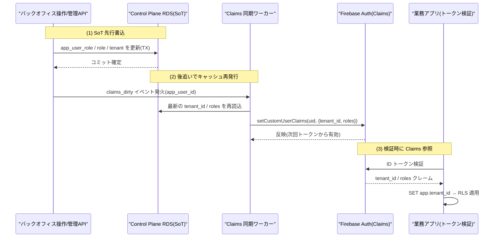
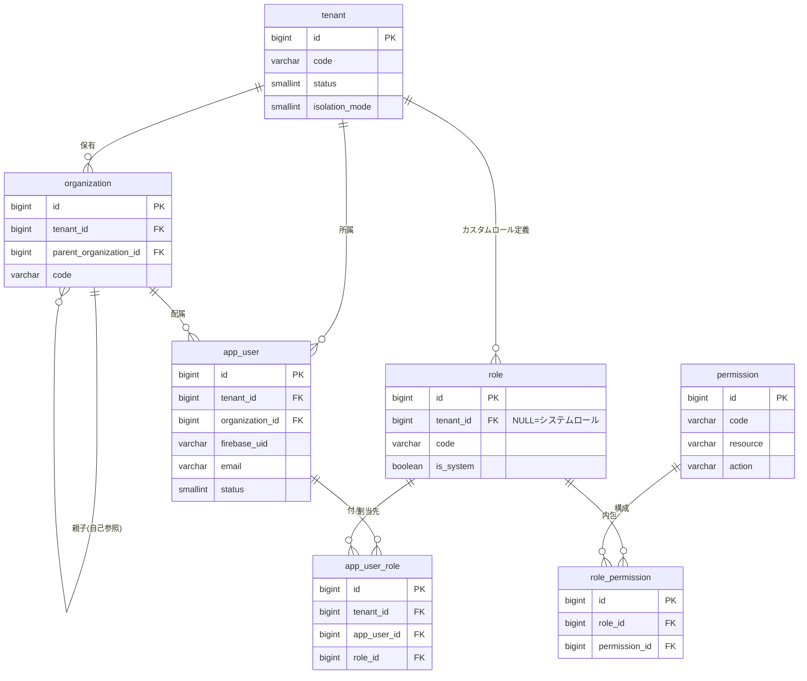
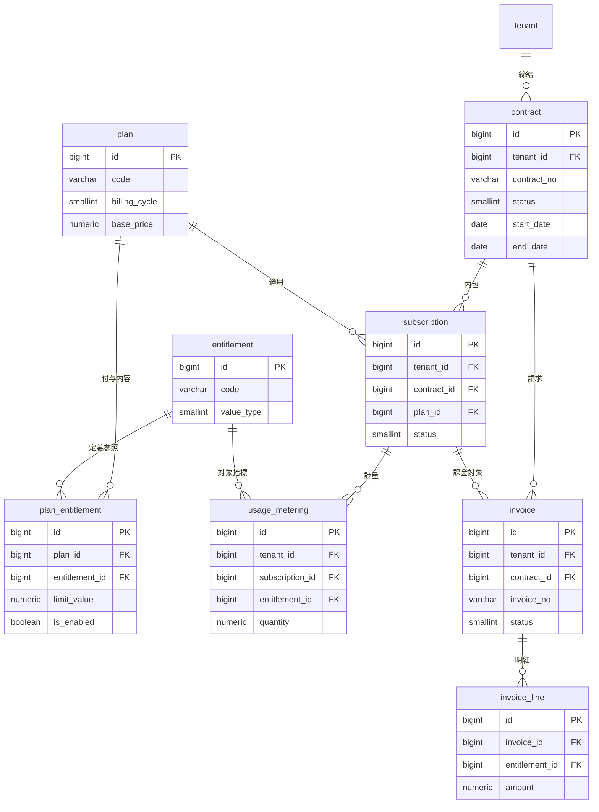
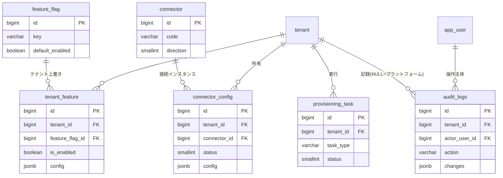
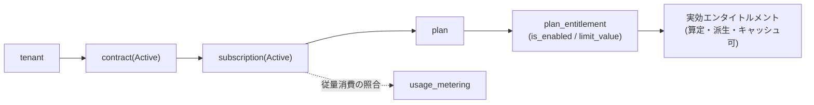

# DBスキーマ設計: コントロールプレーン / バックオフィス

本ドキュメントは SCIP（Supply Chain Intelligence Platform）の **Control Plane（コントロールプレーン / バックオフィス）** の物理スキーマを権威的に定義する。テナント・組織・ユーザ・権限（RBAC）・契約・プラン・エンタイトルメント・サブスクリプション・使用量計量・請求・フィーチャーフラグ・SI 設定・コネクタ・プロビジョニング・監査ログの CREATE TABLE、制約、索引、RLS ポリシー、および Firebase Custom Claims との同期パスを確定する。

> **本ドキュメントが権威的に所有する範囲（owns / ブリーフ §14）:** `tenant`, `organization`, `app_user`, `role`, `permission`（および関連ジャンクション `role_permission`, `app_user_role`）, `contract`, `plan`, `entitlement`（および `plan_entitlement`）, `subscription`, `usage_metering`, `invoice`, `invoice_line`, `feature_flag`, `tenant_feature`, `connector`, `connector_config`, `provisioning_task`, `audit_logs`。
>
> **所有しない範囲:** 業務トランザクション/マスタ（31/32/33）、Canonical/MDM（34）、DWH（35）、マッピングメタデータ（36）、AI/ベクター（38）。これらは各所有ドキュメントの定義を **参照するのみ**で再定義しない。命名/DDL/テナンシーの横断規約は [30 スキーマ戦略と SoT](./30-schema-strategy-and-sot.md) に従う。

コントロールプレーンは **プラットフォームの背骨**であり、他の全スキーマ（テナントスコープテーブル）が参照する `tenant(id)` と `app_user(id)` をここが供給する。物理配置は Control Plane 専用の RDS PostgreSQL 16（[30 §7](./30-schema-strategy-and-sot.md) の `RDS PostgreSQL (Control/Meta)`）。

---

## 1. スコープと責務境界

| 領域 | 本ドキュメント | 参照先 |
|------|--------------|--------|
| テナント/組織/ユーザ/権限の物理スキーマ | ◎ 所有 | — |
| 契約/プラン/課金/エンタイトルメントの物理スキーマ | ◎ 所有 | — |
| SI 設定（フィーチャーフラグ/コネクタ/プロビジョニング）の物理スキーマ | ◎ 所有 | 27 / [si-customization-provisioning](./../detailed-design/27-si-customization-and-provisioning.md) |
| 監査ログの物理スキーマ・パーティション方針 | ◎ 所有 | [11 非機能/セキュリティ](./../basic-design/11-nonfunctional-security-tenancy.md) |
| バックオフィスの業務フロー/画面/API | 参照 | [09 バックオフィス](./../basic-design/09-service-backoffice.md) |
| プロビジョニングのオーケストレーション詳細 | 参照 | 27 SI カスタマイズ/プロビジョニング |
| 認証情報（UID/Email/PW ハッシュ） | 参照（SoT=Firebase） | ブリーフ §5 / §7 |
| Canonical `canonical_party` 等との関係 | 参照 | [34 MDM/Canonical](./34-mdm-canonical-schema.md) |

**責務分離の原則:** コントロールプレーンは「誰が」「どの契約で」「どの機能を」「いくらで」使えるかを管理する。**業務データそのものは持たない**（それは各 OLTP の責務）。`app_user` は業務データへのアクセス主体（監査列の参照先）だが、業務レコードは各 OLTP スキーマが所有する。

---

## 2. SoT 宣言と同期パス

### 2.1 SoT マップ（本ドメイン / ブリーフ §5・[30 §2](./30-schema-strategy-and-sot.md) 準拠）

| データ | SoT | 派生 / キャッシュ | 同期方向 |
|------|-----|------------------|---------|
| 認証情報（UID / Email / パスワードハッシュ） | **Firebase Authentication** | — | Firebase が唯一の正 |
| ユーザ業務情報 / 権限ロール / 所属 | **RDS Control Plane（`app_user`, `app_user_role`, `role`, `permission`）** | Firebase Custom Claims | **RDS 先行 → Claims 後追い** |
| テナント識別子 `tenant_id` | **RDS Control Plane（`tenant`）** | Firebase Custom Claims（`tenant_id`） | RDS 先行 → Claims 後追い |
| 契約 / プラン割当 / エンタイトルメント | **RDS Control Plane** | 実行時の認可判定キャッシュ（Redis 任意） | RDS 先行 → キャッシュ後追い |
| 使用量計量 | **RDS Control Plane（`usage_metering`）** | 集計スナップショット（請求生成の入力） | 計量 → 集計 → 請求 |
| 請求 | **RDS Control Plane（`invoice`）** | 外部会計/決済連携（将来） | RDS 先行 |
| SI 設定 / フィーチャーフラグ状態 | **RDS Control Plane（`tenant_feature`）** | アプリ起動時ロードのメモリ/Redis キャッシュ | RDS 先行 → キャッシュ後追い |
| 監査ログ | **RDS Control Plane（`audit_logs`, append-only）** | S3 Glacier IR（長期アーカイブ） | INSERT 専用 → アーカイブ |

> **原則（CLAUDE.md 開発原則 6 / ブリーフ §5）:** SoT 側書込を先行し、キャッシュ/派生は後追いで反映する。逆順（Claims を先に書く等）は SoT から復元不能な不整合を生むため禁止。

### 2.2 認証と業務情報の分離

認証の SoT は Firebase、業務情報・権限の SoT は RDS という**二層構造**を採る。`app_user.firebase_uid` が両者を結ぶ唯一のキーである。

- **Firebase が持つ**: UID、Email、パスワードハッシュ、メール検証状態、MFA 設定（Firebase 管轄）。
- **RDS が持つ**: 表示名、所属組織、ロール、権限、有効/無効、テナント帰属、監査列参照。
- **Custom Claims（キャッシュ）が持つ**: `tenant_id`、`roles`（コード配列）、`isolation_mode`（Pooled/Silo）。API はトークン検証時にこれを読み、DB クエリ前に `SET app.tenant_id`（[30 §4.2](./30-schema-strategy-and-sot.md) の RLS）を張る。

### 2.3 Custom Claims 同期パス（イベント受信 + 手動再同期の両方）



**同期の設計要件（CLAUDE.md 原則 2・4・6）:**

1. **RDS 先行**: `app_user_role` / `role_permission` / `tenant.status` の変更を先にコミットし、その後 `claims_dirty` を発火する。Claims 単独更新は禁止。
2. **非ブロッキング**: Claims 再発行の失敗は業務フローを止めない（グレースフルデグラデーション）。失敗は `provisioning_task`（`task_type='claims_sync'`）に記録し再試行する。
3. **手動再同期パス（欠落禁止）**: イベント欠損時に備え、`POST /api/v1/tenants/{id}/users/{uid}:resync-claims` で RDS を正として Claims を強制再構築できる。日次バッチで全ユーザの Claims と RDS の差分検知も行う。
4. **反映遅延の許容**: Claims はトークン発行時点のスナップショット。既発行トークンは失効まで旧 Claims を保持しうる。**認可の最終判定は RDS を正**とし（重要操作は都度 `app_user_role` を照合）、Claims は RLS スコープ設定と粗い画面制御に用いる。トークン強制失効が必要な場合は `tenant.status=Suspended` で API 側 fail-closed とする。

想定エラー: `TEN-020`（Claims 同期失敗、非ブロッキングで再試行キューへ）、`TEN-021`（RDS と Claims の不整合検知）。

---

## 3. ER 図

ドメインを 4 群に分けて図示する（1 図に詰め込みすぎない / DOCUMENTATION_VISUALIZATION_RULES）。

### 3.1 アイデンティティ / RBAC（tenant → organization → app_user、role/permission）



### 3.2 契約 / 課金 / エンタイトルメント



### 3.3 SI 設定 / コネクタ / プロビジョニング / 監査



---

## 4. テナンシー方針（コントロールプレーンの特殊性）

コントロールプレーンは **`tenant` テーブル自身を持つため、例外的にテナント横断**である（[30 §7 注記](./30-schema-strategy-and-sot.md)）。テーブルを 3 種に分類し、RLS 適用方針を変える。

| 分類 | 該当テーブル | `tenant_id` 列 | RLS |
|------|------------|:-------------:|-----|
| **プラットフォーム横断（テナント台帳）** | `tenant` | 無（`id` が tenant_id そのもの） | 自テナント行のみ可視化する RLS（§10.1） |
| **グローバルカタログ（全テナント共通のメタ）** | `permission`, `role_permission`, `plan`, `entitlement`, `plan_entitlement`, `feature_flag`, `connector` | 無 | RLS なし。読取は全テナント可、書込はプラットフォーム管理ロールのみ |
| **テナントスコープ** | `organization`, `app_user`, `role`(*), `app_user_role`, `contract`, `subscription`, `usage_metering`, `invoice`, `invoice_line`, `tenant_feature`, `connector_config`, `provisioning_task`, `audit_logs` | 有 `tenant_id BIGINT NOT NULL` | [30 §4.2](./30-schema-strategy-and-sot.md) の RLS ポリシーを適用 |

(*) `role` は **システムロール（`tenant_id IS NULL`）+ テナント固有カスタムロール（`tenant_id` 有）**の混在。RLS は「`tenant_id IS NULL OR tenant_id = current_setting('app.tenant_id')::bigint`」でシステムロールとの併存を許す（§10.2）。

**RLS の起点（重要）:** 全ての業務スキーマの `tenant_id` は本ドキュメントの `tenant(id)` を参照する。RLS が効くための `app.tenant_id` セッション変数は、API が Firebase Custom Claims の `tenant_id`（本 `tenant.id` のキャッシュ）から解決してセットする（§2.3）。すなわち **`tenant` テーブルがマルチテナンシー全体の根**である。

**プラットフォーム管理コンテキスト:** バックオフィス運営者（TSUNAGUBA 側）はテナント横断で操作する必要があるため、限定的な `BYPASSRLS` 付き DB ロール（`scip_platform_admin`）で接続する。この接続の利用は全て `audit_logs` に `actor_type=2(platform)` で記録する（§9）。

---

## 5. DDL: アイデンティティ / RBAC

### 5.1 tenant（テナント台帳 / owns・全テナンシーの根）

```sql
-- テナント台帳。プラットフォーム横断テーブル。全業務スキーマの tenant_id はここを参照する
CREATE TABLE tenant (
    id                  BIGSERIAL   PRIMARY KEY,                        -- テナントID(= 全スキーマの tenant_id)
    code                VARCHAR(64) NOT NULL,                           -- テナントコード(URL/識別子, グローバル一意)
    name                VARCHAR(255) NOT NULL,                          -- テナント表示名
    kind                SMALLINT    NOT NULL DEFAULT 0,                 -- 種別 0=Retailer/1=Manufacturer/2=Warehouse/3=Mixed
    status              SMALLINT    NOT NULL DEFAULT 0,                 -- 状態 0=Provisioning/1=Active/2=Suspended/3=Terminated
    isolation_mode      SMALLINT    NOT NULL DEFAULT 0,                 -- 分離方式 0=Pooled/1=Silo-Schema/2=Silo-DB
    home_region         VARCHAR(32) NOT NULL DEFAULT 'ap-northeast-1',  -- 主リージョン
    display_timezone    VARCHAR(64) NOT NULL DEFAULT 'Asia/Tokyo',      -- 表示タイムゾーン(TIMESTAMPTZ のローカル表示用)
    default_currency    CHAR(3)     NOT NULL DEFAULT 'JPY',             -- 既定通貨(ISO 4217)
    db_connection_ref   VARCHAR(255) NULL,                              -- Silo時の接続情報参照(Secrets Manager キー。生値は保持しない)
    attributes          JSONB       NOT NULL DEFAULT '{}'::jsonb,       -- テナント固有拡張属性
    provisioned_at      TIMESTAMPTZ NULL,                               -- プロビジョニング完了日時
    suspended_at        TIMESTAMPTZ NULL,                               -- 停止日時
    is_deleted          BOOLEAN     NOT NULL DEFAULT FALSE,             -- 論理削除フラグ
    created_at          TIMESTAMPTZ NOT NULL DEFAULT now(),             -- 作成日時(UTC保存)
    updated_at          TIMESTAMPTZ NOT NULL DEFAULT now(),             -- 更新日時(UTC保存)
    CONSTRAINT chk_tenant_status       CHECK (status IN (0, 1, 2, 3)),
    CONSTRAINT chk_tenant_kind         CHECK (kind IN (0, 1, 2, 3)),
    CONSTRAINT chk_tenant_isolation    CHECK (isolation_mode IN (0, 1, 2))
);

-- テナントコードはプラットフォーム全体でグローバル一意(tenant_id スコープではない例外)
ALTER TABLE tenant
    ADD CONSTRAINT uq_tenant_code UNIQUE (code);

CREATE INDEX idx_tenant_status ON tenant (status) WHERE is_deleted = FALSE;

COMMENT ON TABLE  tenant IS 'テナント台帳。マルチテナンシーの根。全業務スキーマの tenant_id が参照する';
COMMENT ON COLUMN tenant.code IS 'テナントコード。グローバル一意(RLS 対象外の例外)';
COMMENT ON COLUMN tenant.isolation_mode IS '分離方式。Pooled/Silo の物理配置切替。DDL は同一';
COMMENT ON COLUMN tenant.db_connection_ref IS 'Silo 時の接続情報の Secrets Manager キー。接続文字列の生値は DB に保持しない';
```

> **命名の注記:** ブリーフ §9・[30 §3.1](./30-schema-strategy-and-sot.md) の規約に従い、共通/正準エンティティは **単数形テーブル名**（`tenant`, `organization`, `app_user`, `role`, `permission`）を用いる。継承実装の `users` テーブルは本プラットフォームでは `app_user` に一般化する（`user` は PostgreSQL 予約語のため接頭辞 `app_` を付す）。継承実装からの移行対応表は 32 メーカー OLTP と本ドキュメント §12 に記す。

### 5.1.1 予約共有テナント（`PLATFORM_SHARED` / `tenant.id = 0`）— 全プラットフォームの確定・シード源

**本サブセクションが予約共有テナントの確定・シードを権威的に所有する。** 他ドキュメントはこの確定値を参照するのみで再定義しない（[22 §3.2](./../detailed-design/22-star-schema-transformation.md)・[35 DWH](./35-star-schema-dwh.md)・[38 §3.1](./38-ai-vector-knowledge-schema.md) の各記述が本節へ確定を委譲している）。

**確定した予約値（プラットフォーム定数 / 全ドキュメント共通の単一値）:**

| 項目 | 確定値 | 用途 |
|------|:------:|------|
| **予約共有テナント `id`** | **`0`**（`PLATFORM_SHARED`） | テナント横断で内容が共通の共有参照データ専用の sentinel。実テナントは `1` 起点（BIGSERIAL 採番）で衝突しない |

この `tenant.id = 0` が、以下すべての FK/共有判定の**唯一の参照先**である。

- [38](./38-ai-vector-knowledge-schema.md) の共有ナレッジ（`kb_document.tenant_id = 0`、`knowledge_scope=1 / is_shared=TRUE`）の FK 参照先。`ai.platform_shared_tenant_id()`（38 §3.1）は**本節が確定した値 `0` を返す**（38 側の暫定注記は本節の確定により解消。値の変更が生じた場合は本節を唯一の変更点とし、38 の関数戻り値はこれに追随する）。
- [22 §3.2](./../detailed-design/22-star-schema-transformation.md)・[35](./35-star-schema-dwh.md) の共有ディメンション（`dim_date`・`dim_region` 等、`tenant_id = 0`）および予約メンバー行の FK/整合の参照先。

> **予約テナント行の DDL/シード（idempotent・BIGSERIAL 非干渉）:** `tenant.id` は `BIGSERIAL PRIMARY KEY`（採番は `1` 起点、§5.1）であり、既定の採番では `0` は生成されない。予約行は **`id = 0` を明示指定して INSERT** する。明示 INSERT はシーケンスを前進させないため、後続の実テナント採番（Honshu=1 等）と衝突しない。テナント作成・共有ナレッジ投入・共有ディメンション生成の**いずれよりも先**に、Control Plane スキーマ初期化（マイグレーション）の一部として自動実行し、手動ステップを残さない（CLAUDE.md 原則 1）。

```sql
-- 予約共有テナント(PLATFORM_SHARED / id=0)を固定シードする。
-- 共有ナレッジ(38: kb_document.tenant_id=0)・共有ディメンション(22/35: dim_* の tenant_id=0)の FK 参照先。
-- BIGSERIAL 採番は 1 起点。id=0 の明示 INSERT はシーケンスを前進させないため実テナント採番と衝突しない。
-- ON CONFLICT で冪等(再実行しても既存の予約行を破壊しない / CLAUDE.md 原則 2)。
INSERT INTO tenant (id, code, name, kind, status, isolation_mode, attributes)
VALUES (
    0,                                            -- 予約 id(全ドキュメント共通の確定値)
    'PLATFORM_SHARED',                            -- 予約テナントコード(グローバル一意)
    'プラットフォーム共有(予約テナント)',           -- 表示名
    3,                                            -- kind=3(Mixed。特定業種に属さない共有枠)
    1,                                            -- status=1(Active。共有参照データを常時提供)
    0,                                            -- isolation_mode=0(Pooled。共有 DB 上に存在)
    '{"reserved": true, "purpose": "platform_shared"}'::jsonb  -- 予約フラグ(運用ガードの判定に使用)
)
ON CONFLICT (id) DO NOTHING;

-- 念のためシーケンスに触れない(setval しない)。既定 last_value は 1(is_called=FALSE)のままとし、
-- 最初の実テナント採番が id=1(Honshu)となることを保証する。id=0 の明示 INSERT はこれを乱さない。
```

**運用上のガード（予約テナントの保護）:**

- 予約行（`id = 0`）は通常のプロビジョニング/停止/削除フローの対象外とする。`tenant.status` 遷移・`is_deleted` 化・`DELETE` はアプリ層で拒否し、`TEN-004`（予約テナントの改変/削除禁止）を返す（下位互換・データ保護 / CLAUDE.md 原則 7）。
- RLS（§10.1 `tenant_self`）により、一般テナントセッションからは `id = 0` 行は**不可視**（`0 = app.tenant_id` は自テナントでない限り偽）。ただし FK 検証はシステム権限で RLS を迂回するため、共有ナレッジ/共有ディメンションへの `tenant_id = 0` 投入は参照先が存在し FK 違反を起こさない。共有データの**読取可視化**（テナントに共有ナレッジ/共有次元を見せる）は各所有ドキュメント（38 §10 の共有読取ポリシー等）が RLS 述語で定義し、本節はあくまで参照先行（sentinel 行の先行登録）を担保する。

> **命名/確定の統一（22 の直書き `tenant_id=0` と 38 の関数参照の齟齬解消）:** 予約値は本節が `0` に確定する。DDL・シード・マイグレーション等の静的コンテキストでは確定値 `0` の直書きを許容する（22 の共有ディメンション DDL 等）。一方、アプリ/クエリ/RLS 述語では [38 §3.1](./38-ai-vector-knowledge-schema.md) の `ai.platform_shared_tenant_id()` を参照して直書きを避ける（将来の値変更に単一箇所で追随するため）。両者は「同一の確定値 `0` を指す」点で整合しており、38 の関数戻り値は本節の確定値と常に一致させる。

### 5.2 organization（組織 / owns・自己参照階層）

```sql
-- テナント内組織。tenant → organization → app_user の中間階層。自己参照で階層を表現
CREATE TABLE organization (
    id                      BIGSERIAL   PRIMARY KEY,                    -- 組織ID
    tenant_id               BIGINT      NOT NULL REFERENCES tenant(id), -- テナント識別子(RLS対象)
    parent_organization_id  BIGINT      NULL REFERENCES organization(id), -- 親組織(NULL=ルート)
    code                    VARCHAR(64) NOT NULL,                       -- 組織コード(テナント内一意)
    name                    VARCHAR(255) NOT NULL,                      -- 組織名
    org_type                SMALLINT    NOT NULL DEFAULT 0,             -- 種別 0=Company/1=Division/2=Department/3=Team
    sort_order              INTEGER     NOT NULL DEFAULT 0,             -- 表示順
    attributes              JSONB       NOT NULL DEFAULT '{}'::jsonb,   -- 拡張属性
    is_deleted              BOOLEAN     NOT NULL DEFAULT FALSE,         -- 論理削除フラグ
    created_at              TIMESTAMPTZ NOT NULL DEFAULT now(),         -- 作成日時(UTC保存)
    updated_at              TIMESTAMPTZ NOT NULL DEFAULT now(),         -- 更新日時(UTC保存)
    created_by_user_id      BIGINT      NULL REFERENCES app_user(id),  -- 作成者
    updated_by_user_id      BIGINT      NULL REFERENCES app_user(id),  -- 更新者
    CONSTRAINT chk_organization_type   CHECK (org_type IN (0, 1, 2, 3)),
    CONSTRAINT chk_organization_noself CHECK (parent_organization_id IS NULL OR parent_organization_id <> id)
);

-- code は全行対象の恒久一意(is_deleted を条件に含めない)。組織コードは監査/参照整合の観点で恒久予約し、
-- 論理削除後の再利用は許容しない(app_user.email と同方針。意図的な非統一は §13 論点参照)。
ALTER TABLE organization
    ADD CONSTRAINT uq_organization_tenant_code UNIQUE (tenant_id, code);

CREATE INDEX idx_organization_tenant_parent ON organization (tenant_id, parent_organization_id) WHERE is_deleted = FALSE;

COMMENT ON COLUMN organization.tenant_id IS 'テナント識別子。RLS により current_setting(app.tenant_id) と照合';
COMMENT ON COLUMN organization.parent_organization_id IS '親組織。自己参照で可変段数の階層を表現。ルートは NULL';
```

> `app_user` と `organization` は相互参照（`organization.created_by_user_id → app_user`、`app_user.organization_id → organization`）を持つ。EF Core Migration では制約を後付け（`ALTER TABLE ... ADD CONSTRAINT`）して循環依存を回避する。DDL 掲載順は説明の都合上 `organization` を先に置くが、監査列 FK は §5.3 の `app_user` 作成後に有効化する。

### 5.3 app_user（ユーザ / owns・Firebase UID 連携・業務情報/権限の SoT）

```sql
-- アプリケーションユーザ。認証は Firebase(UID/Email が SoT)、業務情報/権限は本テーブルが SoT
CREATE TABLE app_user (
    id                  BIGSERIAL    PRIMARY KEY,                        -- ユーザID(監査列/各OLTPが参照)
    tenant_id           BIGINT       NOT NULL REFERENCES tenant(id),     -- テナント識別子(RLS対象)
    organization_id     BIGINT       NULL REFERENCES organization(id),   -- 主所属組織
    firebase_uid        VARCHAR(128) NOT NULL,                           -- Firebase UID(認証SoTとの連携キー)
    email               VARCHAR(320) NOT NULL,                           -- メール(Firebase の Email のキャッシュ)
    display_name        VARCHAR(255) NOT NULL,                           -- 表示名(業務情報。本テーブルが SoT)
    employee_no         VARCHAR(32)  NULL,                               -- 社員番号(テナント内一意, 任意)
    status              SMALLINT     NOT NULL DEFAULT 0,                 -- 状態 0=Invited/1=Active/2=Suspended/3=Deactivated
    is_tenant_admin     BOOLEAN      NOT NULL DEFAULT FALSE,             -- テナント管理者フラグ
    last_login_at       TIMESTAMPTZ  NULL,                              -- 最終ログイン日時
    claims_synced_at    TIMESTAMPTZ  NULL,                              -- Custom Claims 最終同期日時(§2.3)
    attributes          JSONB        NOT NULL DEFAULT '{}'::jsonb,       -- 拡張属性
    legacy_id           VARCHAR(64)  NULL,                              -- 移行元レコードID(継承実装 users.id 等)
    is_deleted          BOOLEAN      NOT NULL DEFAULT FALSE,             -- 論理削除フラグ
    created_at          TIMESTAMPTZ  NOT NULL DEFAULT now(),             -- 作成日時(UTC保存)
    updated_at          TIMESTAMPTZ  NOT NULL DEFAULT now(),             -- 更新日時(UTC保存)
    created_by_user_id  BIGINT       NULL REFERENCES app_user(id),      -- 作成者(自己参照)
    updated_by_user_id  BIGINT       NULL REFERENCES app_user(id),      -- 更新者(自己参照)
    CONSTRAINT chk_app_user_status CHECK (status IN (0, 1, 2, 3))
);

-- firebase_uid は認証 SoT のグローバル一意 ID に対応するためプラットフォーム全体で一意
-- 【論理削除との整合(設計判断)】firebase_uid / email は全行対象の恒久一意(is_deleted を条件に含めない)。
--   認証SoT(Firebase)の UID/Email との一意対応と監査追跡性(削除済ユーザの再利用による同一性の取り違え防止)を
--   優先し、論理削除後もキーを恒久予約する。一方 employee_no は業務上の再割当(退職者の社員番号再利用)を許容するため
--   WHERE is_deleted=FALSE の部分一意とする。この非統一は意図的である(§13 論点参照)。
ALTER TABLE app_user ADD CONSTRAINT uq_app_user_firebase_uid UNIQUE (firebase_uid);
-- email はテナントスコープ一意かつ全行対象(恒久予約)。同一メールが別テナントに存在しうる想定は §13 で論点化
ALTER TABLE app_user ADD CONSTRAINT uq_app_user_tenant_email UNIQUE (tenant_id, email);

-- employee_no はテナント内で NULL 以外一意(部分一意索引)。論理削除済は対象外=社員番号の再割当を許容
CREATE UNIQUE INDEX uq_app_user_tenant_employee_no
    ON app_user (tenant_id, employee_no)
    WHERE employee_no IS NOT NULL AND is_deleted = FALSE;

CREATE INDEX idx_app_user_tenant_status ON app_user (tenant_id, status) WHERE is_deleted = FALSE;
CREATE INDEX idx_app_user_tenant_org    ON app_user (tenant_id, organization_id) WHERE is_deleted = FALSE;

-- organization の監査列 FK を app_user 作成後に有効化(§5.2 の循環依存解決)
ALTER TABLE organization ADD CONSTRAINT fk_organization_created_by FOREIGN KEY (created_by_user_id) REFERENCES app_user(id);
ALTER TABLE organization ADD CONSTRAINT fk_organization_updated_by FOREIGN KEY (updated_by_user_id) REFERENCES app_user(id);

COMMENT ON TABLE  app_user IS 'アプリユーザ。認証=Firebase(UID/Email が SoT)、業務情報/権限=本テーブルが SoT';
COMMENT ON COLUMN app_user.firebase_uid IS 'Firebase UID。認証 SoT との唯一の連携キー。グローバル一意';
COMMENT ON COLUMN app_user.email IS 'メール。Firebase Email のキャッシュ。SoT は Firebase 側';
COMMENT ON COLUMN app_user.claims_synced_at IS 'Custom Claims 最終同期日時。NULL/古い場合は再同期対象';
```

### 5.4 permission（権限 / owns・グローバルカタログ）

```sql
-- 権限カタログ。プラットフォーム定義の resource×action。全テナント共通(RLSなし)
CREATE TABLE permission (
    id          BIGSERIAL   PRIMARY KEY,                    -- 権限ID
    code        VARCHAR(128) NOT NULL,                      -- 権限コード(例 sales.read, tenant.manage)
    resource    VARCHAR(64) NOT NULL,                       -- 対象リソース(例 sales, product, tenant)
    action      VARCHAR(32) NOT NULL,                       -- 操作(例 read, write, delete, manage)
    description VARCHAR(255) NULL,                           -- 説明(日本語)
    is_sensitive BOOLEAN    NOT NULL DEFAULT FALSE,          -- 機微操作フラグ(仕入単価開示等。付与時に追加監査)
    created_at  TIMESTAMPTZ NOT NULL DEFAULT now(),          -- 作成日時(UTC保存)
    updated_at  TIMESTAMPTZ NOT NULL DEFAULT now(),          -- 更新日時(UTC保存)
    CONSTRAINT uq_permission_code UNIQUE (code)
);

CREATE INDEX idx_permission_resource ON permission (resource, action);

COMMENT ON TABLE permission IS '権限カタログ。プラットフォーム定義。グローバル(tenant_id なし・RLSなし)';
COMMENT ON COLUMN permission.is_sensitive IS '機微操作フラグ。付与/行使時に audit_logs へ追加記録(ブリーフ §11 機微値開示)';
```

### 5.5 role（ロール / owns・システム+テナントカスタム混在）

```sql
-- ロール。tenant_id NULL = プラットフォーム定義システムロール、非NULL = テナント固有カスタムロール
CREATE TABLE role (
    id                  BIGSERIAL   PRIMARY KEY,                        -- ロールID
    tenant_id           BIGINT      NULL REFERENCES tenant(id),         -- テナント識別子(NULL=システムロール)
    code                VARCHAR(64) NOT NULL,                           -- ロールコード(Claims に載る値)
    name                VARCHAR(255) NOT NULL,                          -- ロール名(日本語)
    description         VARCHAR(255) NULL,                              -- 説明
    is_system           BOOLEAN     NOT NULL DEFAULT FALSE,             -- システムロール(改変/削除不可)
    is_deleted          BOOLEAN     NOT NULL DEFAULT FALSE,             -- 論理削除フラグ
    created_at          TIMESTAMPTZ NOT NULL DEFAULT now(),             -- 作成日時(UTC保存)
    updated_at          TIMESTAMPTZ NOT NULL DEFAULT now(),             -- 更新日時(UTC保存)
    created_by_user_id  BIGINT      NULL REFERENCES app_user(id),      -- 作成者
    updated_by_user_id  BIGINT      NULL REFERENCES app_user(id),      -- 更新者
    CONSTRAINT chk_role_system_scope CHECK ( (is_system AND tenant_id IS NULL) OR (NOT is_system) )
);

-- システムロール(tenant_id NULL)はコードでグローバル一意
CREATE UNIQUE INDEX uq_role_system_code ON role (code) WHERE tenant_id IS NULL;
-- テナントカスタムロールはテナント内一意
CREATE UNIQUE INDEX uq_role_tenant_code ON role (tenant_id, code) WHERE tenant_id IS NOT NULL;

COMMENT ON COLUMN role.tenant_id IS 'NULL=システムロール(全テナント適用)、非NULL=テナント固有カスタムロール';
COMMENT ON COLUMN role.code IS 'ロールコード。Custom Claims の roles 配列に載る値';
```

### 5.6 role_permission / app_user_role（ジャンクション / owns）

```sql
-- ロール×権限。ロールが内包する権限集合。role がテナント文脈を持つため本表に tenant_id は置かない
CREATE TABLE role_permission (
    id            BIGSERIAL PRIMARY KEY,                              -- ID
    role_id       BIGINT    NOT NULL REFERENCES role(id) ON DELETE CASCADE,       -- ロール(親削除で連鎖)
    permission_id BIGINT    NOT NULL REFERENCES permission(id) ON DELETE CASCADE, -- 権限
    created_at    TIMESTAMPTZ NOT NULL DEFAULT now(),                 -- 作成日時(UTC保存)
    CONSTRAINT uq_role_permission UNIQUE (role_id, permission_id)
);

CREATE INDEX idx_role_permission_perm ON role_permission (permission_id);

COMMENT ON TABLE role_permission IS 'ロール×権限ジャンクション。role の tenant 文脈を継承(本表に tenant_id なし)';

-- ユーザ×ロール。テナントスコープ。Claims の roles 配列の SoT
CREATE TABLE app_user_role (
    id            BIGSERIAL PRIMARY KEY,                              -- ID
    tenant_id     BIGINT    NOT NULL REFERENCES tenant(id),          -- テナント識別子(RLS対象)
    app_user_id   BIGINT    NOT NULL REFERENCES app_user(id) ON DELETE CASCADE, -- ユーザ(削除で連鎖)
    role_id       BIGINT    NOT NULL REFERENCES role(id),            -- ロール
    granted_at    TIMESTAMPTZ NOT NULL DEFAULT now(),                 -- 付与日時(UTC保存)
    granted_by_user_id BIGINT NULL REFERENCES app_user(id),          -- 付与者
    CONSTRAINT uq_app_user_role UNIQUE (tenant_id, app_user_id, role_id)
);

CREATE INDEX idx_app_user_role_user ON app_user_role (tenant_id, app_user_id);
CREATE INDEX idx_app_user_role_role ON app_user_role (role_id);

COMMENT ON TABLE app_user_role IS 'ユーザ×ロールジャンクション(テナントスコープ)。Custom Claims roles の SoT';
```

> **整合性の注記:** `app_user_role.role_id` が指す `role` は、システムロール（`tenant_id IS NULL`）またはユーザと同一テナントのカスタムロールのいずれかでなければならない。DB の FK では「同一テナント or NULL」の条件を表現できないため、アプリ層（サービス）で検証し、`TEN-012`（ロールのテナント不整合）を返す。RLS の `role` ポリシー（§10.2）が他テナントのカスタムロール可視化を防ぐため、通常経路では発生しない。

---

## 6. DDL: 契約 / プラン / エンタイトルメント / 課金

### 6.1 plan / entitlement / plan_entitlement（グローバルカタログ / owns）

```sql
-- プランカタログ。プラットフォーム定義の料金プラン。グローバル(RLSなし)
CREATE TABLE plan (
    id             BIGSERIAL   PRIMARY KEY,                     -- プランID
    code           VARCHAR(64) NOT NULL,                        -- プランコード(例 starter, standard, enterprise)
    name           VARCHAR(255) NOT NULL,                       -- プラン名
    billing_cycle  SMALLINT    NOT NULL DEFAULT 0,              -- 課金周期 0=Monthly/1=Annual
    base_price     NUMERIC(14,2) NOT NULL DEFAULT 0,            -- 基本料金
    currency_code  CHAR(3)     NOT NULL DEFAULT 'JPY',          -- 通貨(ISO 4217)
    is_public      BOOLEAN     NOT NULL DEFAULT TRUE,           -- 公開プラン(FALSE=個別見積)
    is_active      BOOLEAN     NOT NULL DEFAULT TRUE,           -- 販売中フラグ
    valid_from     DATE        NULL,                            -- 提供開始日
    valid_to       DATE        NULL,                            -- 提供終了日
    created_at     TIMESTAMPTZ NOT NULL DEFAULT now(),          -- 作成日時(UTC保存)
    updated_at     TIMESTAMPTZ NOT NULL DEFAULT now(),          -- 更新日時(UTC保存)
    CONSTRAINT uq_plan_code UNIQUE (code),
    CONSTRAINT chk_plan_billing_cycle CHECK (billing_cycle IN (0, 1))
);

COMMENT ON TABLE plan IS '料金プランカタログ。グローバル(全テナント共通・RLSなし)';

-- エンタイトルメント定義。機能ON/OFF or 数量上限の抽象。グローバル(RLSなし)
CREATE TABLE entitlement (
    id           BIGSERIAL   PRIMARY KEY,                      -- エンタイトルメントID
    code         VARCHAR(64) NOT NULL,                         -- コード(例 max_users, analytics_advanced, api_calls)
    name         VARCHAR(255) NOT NULL,                        -- 名称
    value_type   SMALLINT    NOT NULL DEFAULT 0,               -- 値種別 0=Boolean(機能ON/OFF)/1=Limit(上限)/2=Quota(消費枠)
    unit         VARCHAR(32) NULL,                             -- 単位(users, calls, GB 等。Boolean は NULL)
    is_meterable BOOLEAN     NOT NULL DEFAULT FALSE,           -- 従量計量対象(usage_metering の対象になるか)
    description  VARCHAR(255) NULL,                            -- 説明
    created_at   TIMESTAMPTZ NOT NULL DEFAULT now(),           -- 作成日時(UTC保存)
    updated_at   TIMESTAMPTZ NOT NULL DEFAULT now(),           -- 更新日時(UTC保存)
    CONSTRAINT uq_entitlement_code UNIQUE (code),
    CONSTRAINT chk_entitlement_value_type CHECK (value_type IN (0, 1, 2))
);

COMMENT ON TABLE entitlement IS 'エンタイトルメント定義(機能ON/OFF・数量上限・消費枠の抽象)。グローバル';
COMMENT ON COLUMN entitlement.is_meterable IS '従量計量対象か。TRUE のとき usage_metering に消費量が記録される';

-- プラン×エンタイトルメント。プランが付与する内容(値)。グローバル(RLSなし)
CREATE TABLE plan_entitlement (
    id             BIGSERIAL   PRIMARY KEY,                    -- ID
    plan_id        BIGINT      NOT NULL REFERENCES plan(id) ON DELETE CASCADE,  -- プラン(親削除で連鎖)
    entitlement_id BIGINT      NOT NULL REFERENCES entitlement(id),             -- エンタイトルメント
    is_enabled     BOOLEAN     NOT NULL DEFAULT TRUE,          -- Boolean 型の場合の有効/無効
    limit_value    NUMERIC(18,4) NULL,                         -- Limit/Quota 型の上限値(NULL=無制限)
    created_at     TIMESTAMPTZ NOT NULL DEFAULT now(),         -- 作成日時(UTC保存)
    updated_at     TIMESTAMPTZ NOT NULL DEFAULT now(),         -- 更新日時(UTC保存)
    CONSTRAINT uq_plan_entitlement UNIQUE (plan_id, entitlement_id)
);

CREATE INDEX idx_plan_entitlement_ent ON plan_entitlement (entitlement_id);

COMMENT ON TABLE plan_entitlement IS 'プランが付与するエンタイトルメントの値(ON/OFF・上限)。実効値の算定元';
```

### 6.2 contract / subscription（テナントスコープ / owns）

```sql
-- 契約。テナントとプラットフォーム間の契約単位。テナントスコープ
CREATE TABLE contract (
    id                  BIGSERIAL   PRIMARY KEY,                        -- 契約ID
    tenant_id           BIGINT      NOT NULL REFERENCES tenant(id),     -- テナント識別子(RLS対象)
    contract_no         VARCHAR(64) NOT NULL,                           -- 契約番号(テナント内一意)
    status              SMALLINT    NOT NULL DEFAULT 0,                 -- 状態 0=Draft/1=Active/2=Expired/3=Terminated
    start_date          DATE        NOT NULL,                           -- 契約開始日(業務日付)
    end_date            DATE        NULL,                               -- 契約終了日(NULL=無期限/自動更新)
    auto_renew          BOOLEAN     NOT NULL DEFAULT TRUE,              -- 自動更新フラグ
    billing_account_ref VARCHAR(255) NULL,                              -- 請求先アカウント参照(外部会計連携キー)
    notes               VARCHAR(1000) NULL,                             -- 備考
    attributes          JSONB       NOT NULL DEFAULT '{}'::jsonb,       -- 拡張属性
    is_deleted          BOOLEAN     NOT NULL DEFAULT FALSE,             -- 論理削除フラグ
    created_at          TIMESTAMPTZ NOT NULL DEFAULT now(),             -- 作成日時(UTC保存)
    updated_at          TIMESTAMPTZ NOT NULL DEFAULT now(),             -- 更新日時(UTC保存)
    created_by_user_id  BIGINT      NULL REFERENCES app_user(id),      -- 作成者
    updated_by_user_id  BIGINT      NULL REFERENCES app_user(id),      -- 更新者
    CONSTRAINT uq_contract_tenant_no UNIQUE (tenant_id, contract_no),
    CONSTRAINT chk_contract_status   CHECK (status IN (0, 1, 2, 3)),
    CONSTRAINT chk_contract_period   CHECK (end_date IS NULL OR end_date >= start_date)
);

CREATE INDEX idx_contract_tenant_status ON contract (tenant_id, status) WHERE is_deleted = FALSE;

COMMENT ON TABLE contract IS '契約。テナント×プラットフォームの契約単位。subscription/invoice の親';

-- サブスクリプション。契約配下でプランを適用する稼働単位。テナントスコープ
CREATE TABLE subscription (
    id                  BIGSERIAL   PRIMARY KEY,                        -- サブスクID
    tenant_id           BIGINT      NOT NULL REFERENCES tenant(id),     -- テナント識別子(RLS対象)
    contract_id         BIGINT      NOT NULL REFERENCES contract(id),   -- 親契約
    plan_id             BIGINT      NOT NULL REFERENCES plan(id),       -- 適用プラン(グローバルカタログ参照)
    status              SMALLINT    NOT NULL DEFAULT 0,                 -- 状態 0=Trialing/1=Active/2=PastDue/3=Canceled/4=Paused
    quantity            INTEGER     NOT NULL DEFAULT 1,                 -- 数量(席数等)
    current_period_start DATE       NOT NULL,                           -- 当課金期間開始
    current_period_end   DATE       NOT NULL,                           -- 当課金期間終了
    trial_end_date      DATE        NULL,                               -- トライアル終了日
    canceled_at         TIMESTAMPTZ NULL,                               -- 解約日時
    attributes          JSONB       NOT NULL DEFAULT '{}'::jsonb,       -- 拡張属性
    is_deleted          BOOLEAN     NOT NULL DEFAULT FALSE,             -- 論理削除フラグ
    created_at          TIMESTAMPTZ NOT NULL DEFAULT now(),             -- 作成日時(UTC保存)
    updated_at          TIMESTAMPTZ NOT NULL DEFAULT now(),             -- 更新日時(UTC保存)
    created_by_user_id  BIGINT      NULL REFERENCES app_user(id),      -- 作成者
    updated_by_user_id  BIGINT      NULL REFERENCES app_user(id),      -- 更新者
    CONSTRAINT chk_subscription_status CHECK (status IN (0, 1, 2, 3, 4)),
    CONSTRAINT chk_subscription_qty    CHECK (quantity >= 1),
    CONSTRAINT chk_subscription_period CHECK (current_period_end >= current_period_start)
);

CREATE INDEX idx_subscription_tenant_status ON subscription (tenant_id, status) WHERE is_deleted = FALSE;
CREATE INDEX idx_subscription_contract      ON subscription (contract_id);
-- 1契約1プラン1アクティブを表現(部分一意)。プラン切替は旧を Canceled にしてから新規発行
CREATE UNIQUE INDEX uq_subscription_active_plan
    ON subscription (tenant_id, contract_id, plan_id)
    WHERE status IN (0, 1) AND is_deleted = FALSE;

COMMENT ON TABLE subscription IS 'サブスクリプション。契約配下でプランを適用する稼働単位。実効エンタイトルメントの起点';
```

### 6.3 entitlement 実効値の算定（正規化された参照）

テナントの**実効エンタイトルメント**は物理テーブルとして持たず、`subscription`（Active）→ `plan_entitlement` を辿って算定する（派生値の二重管理を避ける / IQ-1）。認可判定はこの算定結果を Redis に短期キャッシュしてよいが、SoT は常に `plan_entitlement` である。個別テナントの上書き（営業上の特例枠）が必要な場合は `tenant_feature`（§7.1、`config` JSONB に上限）で表現するか、`subscription.attributes` に override を持たせる（§13 で論点化）。



### 6.4 usage_metering（使用量計量 / owns）

```sql
-- 使用量計量。従量課金/上限超過検知の入力。テナントスコープ。記録系(冪等・巻き戻し禁止)
CREATE TABLE usage_metering (
    id                  BIGSERIAL   PRIMARY KEY,                        -- 計量ID
    tenant_id           BIGINT      NOT NULL REFERENCES tenant(id),     -- テナント識別子(RLS対象)
    subscription_id     BIGINT      NOT NULL REFERENCES subscription(id), -- 対象サブスク
    entitlement_id      BIGINT      NOT NULL REFERENCES entitlement(id),  -- 対象指標(is_meterable=TRUE)
    period_start        DATE        NOT NULL,                           -- 計量期間開始(業務日付)
    period_end          DATE        NOT NULL,                           -- 計量期間終了
    quantity            NUMERIC(18,4) NOT NULL DEFAULT 0,               -- 消費量(累積)
    source_event_key    VARCHAR(128) NULL,                             -- 冪等キー(取込イベントの一意ID)
    recorded_at         TIMESTAMPTZ NOT NULL DEFAULT now(),             -- 記録日時(UTC保存)
    CONSTRAINT chk_usage_metering_period CHECK (period_end >= period_start),
    CONSTRAINT chk_usage_metering_qty    CHECK (quantity >= 0)
);

-- 期間×指標で1行(UPSERT 集計)。source_event_key があれば重複取込を冪等排除
CREATE UNIQUE INDEX uq_usage_metering_period
    ON usage_metering (tenant_id, subscription_id, entitlement_id, period_start, period_end);
CREATE UNIQUE INDEX uq_usage_metering_event
    ON usage_metering (tenant_id, source_event_key)
    WHERE source_event_key IS NOT NULL;
CREATE INDEX idx_usage_metering_tenant_period ON usage_metering (tenant_id, period_start DESC);

COMMENT ON TABLE usage_metering IS '使用量計量。従量課金/上限監視の入力。記録系のため再取込で巻き戻さない(冪等UPSERT)';
COMMENT ON COLUMN usage_metering.source_event_key IS '取込イベント冪等キー。重複計量を排除(CLAUDE.md 原則2)';
```

> **冪等性（CLAUDE.md 原則 2）:** 計量は「記録系データ」であり、再取込で既存の消費量を巻き戻してはならない。期間集計行は `INSERT ... ON CONFLICT (tenant_id, subscription_id, entitlement_id, period_start, period_end) DO UPDATE SET quantity = ...` で更新し、明細レベルの重複は `source_event_key` で排除する。

### 6.5 invoice / invoice_line（請求 / owns）

```sql
-- 請求。契約/サブスクに対する請求書ヘッダ。テナントスコープ
CREATE TABLE invoice (
    id                  BIGSERIAL   PRIMARY KEY,                        -- 請求ID
    tenant_id           BIGINT      NOT NULL REFERENCES tenant(id),     -- テナント識別子(RLS対象)
    contract_id         BIGINT      NOT NULL REFERENCES contract(id),   -- 対象契約
    subscription_id     BIGINT      NULL REFERENCES subscription(id),   -- 対象サブスク(横断請求は NULL)
    invoice_no          VARCHAR(64) NOT NULL,                           -- 請求番号(テナント内一意)
    status              SMALLINT    NOT NULL DEFAULT 0,                 -- 状態 0=Draft/1=Issued/2=Paid/3=Overdue/4=Void
    billing_period_start DATE       NOT NULL,                           -- 請求対象期間開始
    billing_period_end   DATE       NOT NULL,                           -- 請求対象期間終了
    currency_code       CHAR(3)     NOT NULL DEFAULT 'JPY',             -- 通貨(ISO 4217)
    subtotal_amount     NUMERIC(16,2) NOT NULL DEFAULT 0,              -- 小計
    tax_amount          NUMERIC(16,2) NOT NULL DEFAULT 0,              -- 消費税
    total_amount        NUMERIC(16,2) NOT NULL DEFAULT 0,              -- 合計(subtotal+tax)
    issued_at           TIMESTAMPTZ NULL,                              -- 発行日時
    due_date            DATE        NULL,                              -- 支払期限
    paid_at             TIMESTAMPTZ NULL,                              -- 入金日時
    external_ref        VARCHAR(255) NULL,                             -- 外部会計/決済連携ID
    is_deleted          BOOLEAN     NOT NULL DEFAULT FALSE,            -- 論理削除フラグ
    created_at          TIMESTAMPTZ NOT NULL DEFAULT now(),            -- 作成日時(UTC保存)
    updated_at          TIMESTAMPTZ NOT NULL DEFAULT now(),            -- 更新日時(UTC保存)
    created_by_user_id  BIGINT      NULL REFERENCES app_user(id),     -- 作成者
    updated_by_user_id  BIGINT      NULL REFERENCES app_user(id),     -- 更新者
    CONSTRAINT uq_invoice_tenant_no UNIQUE (tenant_id, invoice_no),
    CONSTRAINT chk_invoice_status   CHECK (status IN (0, 1, 2, 3, 4)),
    CONSTRAINT chk_invoice_period   CHECK (billing_period_end >= billing_period_start)
);

CREATE INDEX idx_invoice_tenant_status ON invoice (tenant_id, status) WHERE is_deleted = FALSE;
CREATE INDEX idx_invoice_contract      ON invoice (contract_id);

COMMENT ON TABLE invoice IS '請求書ヘッダ。テナントスコープ。明細は invoice_line(CASCADE)';

-- 請求明細。invoice の子。ヘッダ削除で連鎖(明細は論理削除を持たない = ブリーフ §9)
CREATE TABLE invoice_line (
    id             BIGSERIAL   PRIMARY KEY,                            -- 明細ID
    tenant_id      BIGINT      NOT NULL REFERENCES tenant(id),         -- テナント識別子(RLS対象・親と一致)
    invoice_id     BIGINT      NOT NULL REFERENCES invoice(id) ON DELETE CASCADE, -- 親請求(削除で連鎖)
    line_no        INTEGER     NOT NULL,                               -- 明細行番号
    entitlement_id BIGINT      NULL REFERENCES entitlement(id),        -- 対象エンタイトルメント(従量明細)
    description    VARCHAR(500) NOT NULL,                              -- 明細説明
    quantity       NUMERIC(14,4) NOT NULL DEFAULT 1,                  -- 数量
    unit_price     NUMERIC(12,2) NOT NULL DEFAULT 0,                  -- 単価
    amount         NUMERIC(16,2) NOT NULL                             -- 金額(quantity×unit_price をアプリで確定)
                   GENERATED ALWAYS AS (ROUND(quantity * unit_price, 2)) STORED, -- 計算列
    created_at     TIMESTAMPTZ NOT NULL DEFAULT now(),                 -- 作成日時(UTC保存)
    CONSTRAINT uq_invoice_line_no UNIQUE (invoice_id, line_no),
    CONSTRAINT chk_invoice_line_qty CHECK (quantity >= 0)
);

CREATE INDEX idx_invoice_line_invoice ON invoice_line (invoice_id);

COMMENT ON TABLE invoice_line IS '請求明細。invoice の子(CASCADE)。amount は計算列(STORED)';
COMMENT ON COLUMN invoice_line.tenant_id IS 'テナント識別子。親 invoice と一致。RLS を明細でも効かせるため冗長保持';
```

> **論理削除方針（ブリーフ §9）:** `invoice_line` は明細テーブルのため論理削除を持たず `ON DELETE CASCADE`。ただし **発行済（`status>=1`）の invoice は物理削除せず `status=4(Void)` で無効化**する（下位互換・監査要件）。Draft のみ物理削除を許容する。

---

## 7. DDL: SI 設定 / コネクタ / プロビジョニング

### 7.1 feature_flag / tenant_feature（owns）

```sql
-- フィーチャーフラグ定義。プラットフォーム定義のカタログ。グローバル(RLSなし)
CREATE TABLE feature_flag (
    id              BIGSERIAL   PRIMARY KEY,                    -- フラグID
    key             VARCHAR(128) NOT NULL,                      -- フラグキー(例 analytics.forecast, ui.dark_mode)
    name            VARCHAR(255) NOT NULL,                      -- 名称
    description     VARCHAR(500) NULL,                          -- 説明
    default_enabled BOOLEAN     NOT NULL DEFAULT FALSE,         -- 既定値(tenant_feature 未設定時)
    requires_entitlement_id BIGINT NULL REFERENCES entitlement(id), -- 有効化に必要なエンタイトルメント(任意)
    is_active       BOOLEAN     NOT NULL DEFAULT TRUE,          -- 提供中フラグ
    created_at      TIMESTAMPTZ NOT NULL DEFAULT now(),         -- 作成日時(UTC保存)
    updated_at      TIMESTAMPTZ NOT NULL DEFAULT now(),         -- 更新日時(UTC保存)
    CONSTRAINT uq_feature_flag_key UNIQUE (key)
);

COMMENT ON TABLE feature_flag IS 'フィーチャーフラグ定義カタログ。グローバル。SI 設定の対象(27参照)';
COMMENT ON COLUMN feature_flag.requires_entitlement_id IS '有効化にエンタイトルメントを要する場合の参照。契約未充足なら ON にできない';

-- テナント別フラグ上書き。SI 設定の SoT。テナントスコープ
CREATE TABLE tenant_feature (
    id              BIGSERIAL   PRIMARY KEY,                        -- ID
    tenant_id       BIGINT      NOT NULL REFERENCES tenant(id),     -- テナント識別子(RLS対象)
    feature_flag_id BIGINT      NOT NULL REFERENCES feature_flag(id), -- 対象フラグ
    is_enabled      BOOLEAN     NOT NULL DEFAULT FALSE,             -- 有効/無効(default_enabled を上書き)
    config          JSONB       NOT NULL DEFAULT '{}'::jsonb,       -- フラグ付随設定(テーマ/閾値/上限上書き等)
    is_deleted      BOOLEAN     NOT NULL DEFAULT FALSE,             -- 論理削除フラグ
    created_at      TIMESTAMPTZ NOT NULL DEFAULT now(),             -- 作成日時(UTC保存)
    updated_at      TIMESTAMPTZ NOT NULL DEFAULT now(),             -- 更新日時(UTC保存)
    created_by_user_id BIGINT   NULL REFERENCES app_user(id),      -- 作成者
    updated_by_user_id BIGINT   NULL REFERENCES app_user(id),      -- 更新者
    CONSTRAINT uq_tenant_feature UNIQUE (tenant_id, feature_flag_id)
);

CREATE INDEX idx_tenant_feature_tenant ON tenant_feature (tenant_id) WHERE is_deleted = FALSE;

COMMENT ON TABLE tenant_feature IS 'テナント別 SI 設定(フラグ上書き)の SoT。アプリ起動時ロードのキャッシュは派生';
```

### 7.2 connector / connector_config（owns）

```sql
-- コネクタ定義。取込/連携コネクタの種別カタログ。グローバル(RLSなし)
CREATE TABLE connector (
    id           BIGSERIAL   PRIMARY KEY,                       -- コネクタID
    code         VARCHAR(64) NOT NULL,                          -- コード(例 s3_dropbox, sftp, rest_webhook, csv_upload)
    name         VARCHAR(255) NOT NULL,                         -- 名称
    direction    SMALLINT    NOT NULL DEFAULT 0,                -- 方向 0=Inbound(取込)/1=Outbound(配信)/2=Bidirectional
    protocol     VARCHAR(32) NOT NULL,                          -- プロトコル(s3/sftp/https/webhook 等)
    config_schema JSONB      NOT NULL DEFAULT '{}'::jsonb,      -- 設定スキーマ(JSON Schema。connector_config.config の検証用)
    is_active    BOOLEAN     NOT NULL DEFAULT TRUE,             -- 提供中フラグ
    created_at   TIMESTAMPTZ NOT NULL DEFAULT now(),            -- 作成日時(UTC保存)
    updated_at   TIMESTAMPTZ NOT NULL DEFAULT now(),            -- 更新日時(UTC保存)
    CONSTRAINT uq_connector_code UNIQUE (code),
    CONSTRAINT chk_connector_direction CHECK (direction IN (0, 1, 2))
);

COMMENT ON TABLE connector IS 'コネクタ種別カタログ。グローバル。取込パイプライン(21/36)の接続口定義';

-- コネクタ接続インスタンス。テナントのコネクタ設定。テナントスコープ
CREATE TABLE connector_config (
    id              BIGSERIAL   PRIMARY KEY,                        -- 設定ID
    tenant_id       BIGINT      NOT NULL REFERENCES tenant(id),     -- テナント識別子(RLS対象)
    connector_id    BIGINT      NOT NULL REFERENCES connector(id),  -- コネクタ種別
    name            VARCHAR(255) NOT NULL,                          -- 接続名(テナント内一意)
    status          SMALLINT    NOT NULL DEFAULT 0,                 -- 状態 0=Draft/1=Active/2=Disabled/3=Error
    config          JSONB       NOT NULL DEFAULT '{}'::jsonb,       -- 接続設定(エンドポイント/スケジュール等。機密は含めない)
    secret_ref      VARCHAR(255) NULL,                              -- 認証情報の Secrets Manager キー(生値は保持しない)
    source_system   VARCHAR(64) NULL,                               -- 対応する source_system(36 マッピングと連携)
    last_run_at     TIMESTAMPTZ NULL,                               -- 最終実行日時
    last_status_msg VARCHAR(500) NULL,                              -- 最終実行メッセージ
    is_deleted      BOOLEAN     NOT NULL DEFAULT FALSE,             -- 論理削除フラグ
    created_at      TIMESTAMPTZ NOT NULL DEFAULT now(),             -- 作成日時(UTC保存)
    updated_at      TIMESTAMPTZ NOT NULL DEFAULT now(),             -- 更新日時(UTC保存)
    created_by_user_id BIGINT   NULL REFERENCES app_user(id),      -- 作成者
    updated_by_user_id BIGINT   NULL REFERENCES app_user(id),      -- 更新者
    CONSTRAINT uq_connector_config_name UNIQUE (tenant_id, name),
    CONSTRAINT chk_connector_config_status CHECK (status IN (0, 1, 2, 3))
);

CREATE INDEX idx_connector_config_tenant ON connector_config (tenant_id, status) WHERE is_deleted = FALSE;

COMMENT ON TABLE connector_config IS 'テナントのコネクタ接続インスタンス。認証情報は secret_ref 参照のみ(生値非保持)';
COMMENT ON COLUMN connector_config.secret_ref IS '認証情報の Secrets Manager キー。DB に生の資格情報を保持しない(ブリーフ §5)';
```

### 7.3 provisioning_task（owns）

```sql
-- プロビジョニングタスク。テナント初期化/変更の非同期処理記録。テナントスコープ・記録系
CREATE TABLE provisioning_task (
    id              BIGSERIAL   PRIMARY KEY,                        -- タスクID
    tenant_id       BIGINT      NOT NULL REFERENCES tenant(id),     -- テナント識別子(RLS対象)
    task_type       VARCHAR(64) NOT NULL,                          -- 種別(例 tenant_init, schema_provision, claims_sync, connector_setup)
    status          SMALLINT    NOT NULL DEFAULT 0,                 -- 状態 0=Pending/1=Running/2=Succeeded/3=Failed/4=Canceled
    idempotency_key VARCHAR(128) NULL,                             -- 冪等キー(再実行の重複起動防止)
    payload         JSONB       NOT NULL DEFAULT '{}'::jsonb,       -- 入力パラメータ
    result          JSONB       NULL,                              -- 実行結果/エラー詳細
    attempts        INTEGER     NOT NULL DEFAULT 0,                 -- 試行回数
    max_attempts    INTEGER     NOT NULL DEFAULT 3,                 -- 最大試行回数
    scheduled_at    TIMESTAMPTZ NOT NULL DEFAULT now(),            -- 予定日時
    started_at      TIMESTAMPTZ NULL,                              -- 開始日時
    finished_at     TIMESTAMPTZ NULL,                              -- 終了日時
    created_at      TIMESTAMPTZ NOT NULL DEFAULT now(),            -- 作成日時(UTC保存)
    updated_at      TIMESTAMPTZ NOT NULL DEFAULT now(),            -- 更新日時(UTC保存)
    CONSTRAINT chk_provisioning_task_status   CHECK (status IN (0, 1, 2, 3, 4)),
    CONSTRAINT chk_provisioning_task_attempts CHECK (attempts >= 0 AND attempts <= max_attempts + 1)
);

CREATE INDEX idx_provisioning_task_tenant ON provisioning_task (tenant_id, status, scheduled_at);
-- 同一タスクの重複起動を冪等排除(進行中/未着手のみ)
CREATE UNIQUE INDEX uq_provisioning_task_idem
    ON provisioning_task (tenant_id, task_type, idempotency_key)
    WHERE idempotency_key IS NOT NULL AND status IN (0, 1);

COMMENT ON TABLE provisioning_task IS 'プロビジョニング/同期の非同期タスク記録(27参照)。冪等キーで重複起動を排除';
COMMENT ON COLUMN provisioning_task.task_type IS 'claims_sync はユーザ権限変更後の Custom Claims 再発行に用いる(§2.3)';
```

> **非ブロッキング設計（CLAUDE.md 原則 4）:** プロビジョニングの補助タスク（コネクタ登録・Claims 同期等）の失敗は主要フローを止めず、`status=3(Failed)` として記録し `attempts < max_attempts` の間リトライする。致命的失敗のみ運用者へエスカレーションする。

---

## 8. DDL: audit_logs（append-only / 月次パーティション / owns）

継承実装（`db/init/01-schema.sql` の `audit_logs`）を **プラットフォーム化**する。差分: `tenant_id`（NULL 許容=プラットフォーム操作）、`trace_id`（分散トレース連携）、`changes JSONB`（変更前後差分）、`actor_type`、`TIMESTAMPTZ` 化、そして**月次レンジパーティション**。

```sql
-- 監査ログ(append-only)。INSERT 専用。UPDATE/DELETE は DB ロールで REVOKE。月次パーティション
CREATE TABLE audit_logs (
    id            BIGSERIAL   NOT NULL,                          -- 監査ID(パーティションのため単独PK不可)
    tenant_id     BIGINT      NULL REFERENCES tenant(id),        -- テナント識別子(NULL=プラットフォーム横断操作)
    occurred_at   TIMESTAMPTZ NOT NULL DEFAULT now(),            -- 発生日時(UTC保存・パーティションキー)
    actor_user_id BIGINT      NULL REFERENCES app_user(id),      -- 操作主体ユーザ(システム操作は NULL)
    actor_type    SMALLINT    NOT NULL DEFAULT 0,                -- 主体種別 0=User/1=System/2=PlatformAdmin/3=Connector
    action        VARCHAR(64) NOT NULL,                          -- 操作(例 tenant.suspend, role.grant, invoice.issue)
    entity_type   VARCHAR(64) NULL,                              -- 対象エンティティ種別(例 app_user, contract)
    entity_id     BIGINT      NULL,                              -- 対象エンティティID
    result        SMALLINT    NOT NULL DEFAULT 0,                -- 結果 0=Success/1=Failure/2=Denied
    changes       JSONB       NULL,                              -- 変更前後差分 { "before": {...}, "after": {...} }
    trace_id      VARCHAR(64) NULL,                              -- 分散トレースID(X-Ray/リクエスト相関)
    ip_address    INET        NULL,                              -- 送信元IP
    user_agent    VARCHAR(512) NULL,                             -- UA
    note          VARCHAR(1000) NULL,                            -- 備考
    PRIMARY KEY (id, occurred_at),                               -- パーティションキーを含む複合PK(PG制約)
    CONSTRAINT chk_audit_logs_actor_type CHECK (actor_type IN (0, 1, 2, 3)),
    CONSTRAINT chk_audit_logs_result     CHECK (result IN (0, 1, 2))
) PARTITION BY RANGE (occurred_at);

-- 月次パーティション(例: 2026年7月・8月)。作成は自動化する(下記メンテ関数)
CREATE TABLE audit_logs_2026_07 PARTITION OF audit_logs
    FOR VALUES FROM ('2026-07-01 00:00:00+00') TO ('2026-08-01 00:00:00+00');
CREATE TABLE audit_logs_2026_08 PARTITION OF audit_logs
    FOR VALUES FROM ('2026-08-01 00:00:00+00') TO ('2026-09-01 00:00:00+00');

-- 各パーティションに索引(親宣言でも可。パーティションローカル索引が自動継承される)
CREATE INDEX idx_audit_logs_tenant_time ON audit_logs (tenant_id, occurred_at DESC);
CREATE INDEX idx_audit_logs_actor_time  ON audit_logs (actor_user_id, occurred_at DESC);
CREATE INDEX idx_audit_logs_entity      ON audit_logs (entity_type, entity_id, occurred_at DESC);
CREATE INDEX idx_audit_logs_trace       ON audit_logs (trace_id) WHERE trace_id IS NOT NULL;

COMMENT ON TABLE  audit_logs IS '監査ログ(append-only)。INSERT 専用・月次レンジパーティション。UPDATE/DELETE は REVOKE で禁止';
COMMENT ON COLUMN audit_logs.changes IS '変更前後差分 JSONB。{before, after}。機微値はマスク済で格納';
COMMENT ON COLUMN audit_logs.tenant_id IS 'テナント識別子。NULL=プラットフォーム横断操作(actor_type=2)';
```

### 8.1 append-only の強制（UPDATE / DELETE REVOKE）

```sql
-- アプリ実行ロールには INSERT/SELECT のみ許可。UPDATE/DELETE を明示的に剥奪(改竄防止)
REVOKE UPDATE, DELETE, TRUNCATE ON audit_logs FROM scip_app;
GRANT  INSERT, SELECT           ON audit_logs TO   scip_app;
-- 追加防御: 行単位で UPDATE/DELETE を拒否するトリガ(スーパーユーザ経由の事故も防ぐ)
CREATE OR REPLACE FUNCTION audit_logs_block_mutation()
RETURNS TRIGGER AS $$
BEGIN
    RAISE EXCEPTION 'audit_logs is append-only (% denied)', TG_OP;
END;
$$ LANGUAGE plpgsql;

CREATE TRIGGER trg_audit_logs_no_update BEFORE UPDATE ON audit_logs
    FOR EACH ROW EXECUTE FUNCTION audit_logs_block_mutation();
CREATE TRIGGER trg_audit_logs_no_delete BEFORE DELETE ON audit_logs
    FOR EACH ROW EXECUTE FUNCTION audit_logs_block_mutation();
```

> **注記:** パーティション DROP（古い月のアーカイブ後のパーティション切り離し）は `DETACH PARTITION` を用い、`DELETE` 経路を通らないため上記トリガに抵触しない。アーカイブは §8.3 参照。

### 8.2 パーティション自動生成（手動ステップを残さない / CLAUDE.md 原則 1）

翌月パーティションを毎月自動作成する。EF Core では表現できないため Flyway/pg_cron で運用する。

```sql
-- 指定月の翌月分パーティションを冪等に作成(既存ならスキップ)
CREATE OR REPLACE FUNCTION ensure_audit_logs_partition(p_month DATE)
RETURNS void AS $$
DECLARE
    v_start DATE := date_trunc('month', p_month)::date;
    v_end   DATE := (date_trunc('month', p_month) + INTERVAL '1 month')::date;
    v_name  TEXT := 'audit_logs_' || to_char(v_start, 'YYYY_MM');
    -- 重要: 境界は UTC 固定。静的パーティション(FROM '...+00' 明示)と計算方式を一致させる。
    -- v_start::timestamptz はセッションの TimeZone に依存し、DBレベル Asia/Tokyo(ブリーフ §4/§9)前提の
    -- pg_cron セッションでは '2026-09-01'::timestamptz が 2026-08-31 15:00Z となり、UTC基準の隣接
    -- パーティションと overlap して CREATE ... PARTITION OF が失敗する(またはデータ誤ルーティング)。
    -- そのため UTC 境界(+00)を文字列で明示構築する。
    v_start_ts TEXT := to_char(v_start, 'YYYY-MM-DD') || ' 00:00:00+00';
    v_end_ts   TEXT := to_char(v_end,   'YYYY-MM-DD') || ' 00:00:00+00';
BEGIN
    IF NOT EXISTS (SELECT 1 FROM pg_class WHERE relname = v_name) THEN
        EXECUTE format(
            'CREATE TABLE %I PARTITION OF audit_logs FOR VALUES FROM (%L) TO (%L)',
            v_name, v_start_ts, v_end_ts);
    END IF;
END;
$$ LANGUAGE plpgsql;

-- pg_cron 例: 毎月25日に翌月分を先行作成(冪等)
-- SELECT cron.schedule('audit-part', '0 0 25 * *',
--   $$SELECT ensure_audit_logs_partition((now() + interval '1 month')::date)$$);
```

### 8.3 長期アーカイブ（S3 Glacier IR）

保持ポリシー: RDS に直近 N か月（既定 13 か月=前年同月比較可）を保持。それ以前は月次パーティションを Parquet に書き出し S3 Glacier IR へ退避後、`DETACH PARTITION` + `DROP TABLE` する。書き出しジョブは `provisioning_task`（`task_type='audit_archive'`）で管理し、記録の完全性（件数照合）を検証してから DROP する（下位互換・監査要件 / CLAUDE.md 原則 7）。

---

## 9. 監査記録の運用規約（IF 層・データフロー整合）

| 記録すべき操作 | action 例 | 主体 | 備考 |
|--------------|----------|------|------|
| テナント状態変更 | `tenant.provision` / `tenant.suspend` / `tenant.terminate` | PlatformAdmin | `BYPASSRLS` 接続は必ず記録 |
| ユーザ権限変更 | `role.grant` / `role.revoke` / `user.deactivate` | User/PlatformAdmin | Claims 同期の起点。§2.3 |
| 契約/請求操作 | `contract.activate` / `invoice.issue` / `invoice.void` | User | 金額系は before/after を changes に |
| 機微値開示 | `permission.sensitive_access` | User | `permission.is_sensitive=TRUE` の行使時 |
| コネクタ設定変更 | `connector.configure` / `connector.enable` | User | secret_ref のみ記録(生値禁止) |
| プロビジョニング | `provision.start` / `provision.complete` / `provision.fail` | System | provisioning_task と相関(trace_id) |

**設計原則:** 監査ログ書込は業務トランザクションと**同一 TX 内**で行い（SoT 側の確定と監査記録の原子性）、失敗時は業務操作もロールバックする。ただし append-only の性質上、監査書込自体は UPDATE を伴わないため巻き戻しリスクはない。`changes` の機微値（仕入単価等）はマスク済で格納する（ブリーフ §11）。

---

## 10. RLS ポリシー（テナントスコープ確定版）

[30 §4.2](./30-schema-strategy-and-sot.md) の共通ポリシーを本ドメインの各テーブルへ適用する。標準形（`organization`, `app_user`, `app_user_role`, `contract`, `subscription`, `usage_metering`, `invoice`, `invoice_line`, `tenant_feature`, `connector_config`, `provisioning_task`, および `audit_logs`）は下記。`tenant`（§10.1）・`role`（§10.2）・`audit_logs`（§10.4、`tenant_id` NULL 行の扱いが特殊）は個別サブセクションで定義する。§4 分類表・§11 サマリで「RLS ○」とした全テーブルが本節に実 DDL を持つ（○表記と DDL の一致）。

```sql
-- 標準テナントスコープテーブル(app_user を例に。他も同型)
ALTER TABLE app_user ENABLE ROW LEVEL SECURITY;
ALTER TABLE app_user FORCE  ROW LEVEL SECURITY;
CREATE POLICY tenant_isolation ON app_user
    USING      (tenant_id = current_setting('app.tenant_id')::bigint)
    WITH CHECK (tenant_id = current_setting('app.tenant_id')::bigint);
```

### 10.1 tenant テーブルの RLS（自テナント行のみ）

```sql
-- テナント台帳は自テナント行のみ可視(id = app.tenant_id)。プラットフォーム管理は BYPASSRLS ロール
ALTER TABLE tenant ENABLE ROW LEVEL SECURITY;
ALTER TABLE tenant FORCE  ROW LEVEL SECURITY;
CREATE POLICY tenant_self ON tenant
    USING (id = current_setting('app.tenant_id')::bigint);
-- 挿入(新規テナント作成)は PlatformAdmin(BYPASSRLS)のみ。一般ロールは WITH CHECK を満たせず拒否
```

### 10.2 role テーブルの RLS（システムロール併存）

```sql
-- ロールはシステムロール(tenant_id NULL)と自テナントカスタムロールの双方を可視化
ALTER TABLE role ENABLE ROW LEVEL SECURITY;
ALTER TABLE role FORCE  ROW LEVEL SECURITY;
CREATE POLICY role_visibility ON role
    USING (tenant_id IS NULL OR tenant_id = current_setting('app.tenant_id')::bigint)
    WITH CHECK (tenant_id = current_setting('app.tenant_id')::bigint);  -- 挿入はテナントロールのみ(システムロールは PlatformAdmin)
```

### 10.3 グローバルカタログの扱い

`permission`, `role_permission`, `plan`, `entitlement`, `plan_entitlement`, `feature_flag`, `connector` は RLS を**設定しない**（全テナント共通の読取専用メタ）。書込は `scip_platform_admin` ロールのみに `GRANT`、`scip_app` は `SELECT` のみとする。これにより一般テナントがカタログを改変できない。

```sql
GRANT SELECT ON permission, plan, entitlement, plan_entitlement, feature_flag, connector, role_permission TO scip_app;
-- INSERT/UPDATE/DELETE は付与しない(PlatformAdmin のみ)
```

### 10.4 audit_logs テーブルの RLS（テナントスコープ + NULL 行のプラットフォーム分離）

`audit_logs` は §4 分類表・§11 サマリで「テナントスコープ・RLS ○」としているため、他のテナントスコープテーブルと同様に RLS を有効化する。ただし `audit_logs.tenant_id` は **NULL 許容**（`actor_type=2(PlatformAdmin)` のプラットフォーム横断操作）であり、標準の等値ポリシーでは NULL 行が誰にも可視化されない点を意図的な設計として明示する。

```sql
-- 監査ログ。テナントスコープ行(tenant_id 有)は自テナントのみ可視。
-- tenant_id IS NULL のプラットフォーム横断行(actor_type=2)は等値比較が UNKNOWN となり一般ロールには不可視。
-- これらは BYPASSRLS ロール(scip_platform_admin)経由でのみ参照する(§4 プラットフォーム管理コンテキスト)。
ALTER TABLE audit_logs ENABLE ROW LEVEL SECURITY;
ALTER TABLE audit_logs FORCE  ROW LEVEL SECURITY;
CREATE POLICY audit_logs_tenant_isolation ON audit_logs
    USING      (tenant_id = current_setting('app.tenant_id')::bigint)
    WITH CHECK (tenant_id = current_setting('app.tenant_id')::bigint);
```

**NULL 行（プラットフォーム横断監査）の可視性設計:**

- 一般テナントロール（`scip_app`）: `tenant_id = app.tenant_id` を満たす自テナント行のみ SELECT 可能。`tenant_id IS NULL` 行は等値比較が UNKNOWN 判定となり **可視化されない**（テナントに他テナント/プラットフォーム運営の監査を見せない fail-closed）。
- プラットフォーム運営（`scip_platform_admin`, `BYPASSRLS`）: RLS を迂回し全行（NULL 行含む）を参照でき、この参照自体を `audit_logs` に `actor_type=2` で記録する（§4 / §9）。
- INSERT: 一般ロールは `WITH CHECK` により自テナントの `tenant_id` を持つ行のみ追記可能。`tenant_id IS NULL` のプラットフォーム操作ログの追記は `BYPASSRLS` 経路で行う。
- RLS は親テーブルへの POLICY が各月次パーティションに継承される（§8）。append-only（UPDATE/DELETE 禁止, §8.1）と併用する。

> **○表記との一致:** 本サブセクションにより、§4 分類表（`audit_logs` = テナントスコープ・RLS ○）および §11 索引・制約サマリ（`audit_logs` = RLS ○）の宣言に対応する実 DDL が本節に揃う。

> **fail-closed（[30 §4.2](./30-schema-strategy-and-sot.md)）:** `current_setting('app.tenant_id')` 未設定時は型変換で例外となり全行漏洩を防ぐ。アプリ層で全クエリ前の `SET LOCAL app.tenant_id` を強制する。ETL/バッチ横断は `scip_platform_admin`（`BYPASSRLS`）で行い、利用を監査ログに残す。

---

## 11. 索引・制約サマリ

| テーブル | 一意制約 | 主要索引 | RLS |
|---------|---------|---------|:---:|
| `tenant` | `uq_tenant_code`(グローバル) | `idx_tenant_status`(部分) | 自テナント(§10.1) |
| `organization` | `uq_organization_tenant_code` | `idx_organization_tenant_parent`(部分) | ○ |
| `app_user` | `uq_app_user_firebase_uid`(グローバル), `uq_app_user_tenant_email`, `uq_app_user_tenant_employee_no`(部分) | `idx_app_user_tenant_status`/`_org`(部分) | ○ |
| `permission` | `uq_permission_code` | `idx_permission_resource` | なし(カタログ) |
| `role` | `uq_role_system_code`/`uq_role_tenant_code`(部分) | — | 併存(§10.2) |
| `role_permission` | `uq_role_permission` | `idx_role_permission_perm` | なし |
| `app_user_role` | `uq_app_user_role` | `idx_app_user_role_user`/`_role` | ○ |
| `plan` | `uq_plan_code` | — | なし(カタログ) |
| `entitlement` | `uq_entitlement_code` | — | なし(カタログ) |
| `plan_entitlement` | `uq_plan_entitlement` | `idx_plan_entitlement_ent` | なし |
| `contract` | `uq_contract_tenant_no` | `idx_contract_tenant_status`(部分) | ○ |
| `subscription` | `uq_subscription_active_plan`(部分) | `idx_subscription_tenant_status`/`_contract` | ○ |
| `usage_metering` | `uq_usage_metering_period`, `uq_usage_metering_event`(部分) | `idx_usage_metering_tenant_period` | ○ |
| `invoice` | `uq_invoice_tenant_no` | `idx_invoice_tenant_status`(部分)/`_contract` | ○ |
| `invoice_line` | `uq_invoice_line_no` | `idx_invoice_line_invoice` | ○ |
| `feature_flag` | `uq_feature_flag_key` | — | なし(カタログ) |
| `tenant_feature` | `uq_tenant_feature` | `idx_tenant_feature_tenant`(部分) | ○ |
| `connector` | `uq_connector_code` | — | なし(カタログ) |
| `connector_config` | `uq_connector_config_name` | `idx_connector_config_tenant`(部分) | ○ |
| `provisioning_task` | `uq_provisioning_task_idem`(部分) | `idx_provisioning_task_tenant` | ○ |
| `audit_logs` | PK`(id, occurred_at)` | `idx_audit_logs_tenant_time`/`_actor_time`/`_entity`/`_trace` | ○ |

全テナントスコープテーブルに `trg_<table>_set_updated_at`（[30 §5.1](./30-schema-strategy-and-sot.md) の共通 `set_updated_at()`）を適用する（`usage_metering`/`audit_logs`/`role_permission` 等の追記専用/計量系を除く）。

---

## 12. 継承実装からの移行差分

継承実装（`db/init/01-schema.sql`）の `users` / `audit_logs` からプラットフォーム化する差分。詳細な横断移行方針は [30 §8](./30-schema-strategy-and-sot.md)。

| # | 対象 | 継承実装 | プラットフォーム | 移行方式 |
|---|------|---------|----------------|---------|
| U1 | `users` → `app_user` | `employee_no`/`login_id` 自然キー, 単一テナント | `firebase_uid` 連携, `tenant_id`+RLS, `email` | 既定テナント(Honshu=1)付与 + Firebase UID 紐付けバックフィル。`users.id` を `legacy_id` に退避 |
| U2 | 認証方式 | `login_id`(独自) | Firebase UID/Email | Firebase へユーザ移行、`firebase_uid` を後付け(NULL 不可のため移行完了まで暫定 UID) |
| U3 | `audit_logs` TZ/構造 | `TIMESTAMP`(JST-naive), 単純列 | `TIMESTAMPTZ`(UTC), `tenant_id`/`trace_id`/`changes`, 月次パーティション | 既存行は `occurred_at AT TIME ZONE 'Asia/Tokyo'` で UTC 化。既定テナント付与 |
| U4 | `result` 意味 | 0=Success/1=Failure | 0=Success/1=Failure/2=Denied | 値互換(拡張のみ)。下位互換維持 |

> **予約共有テナントの先行シード（§5.1.1）:** 上記の既定テナント付与（Honshu=1）に**先立ち**、予約共有テナント（`id=0` / `PLATFORM_SHARED`）をスキーマ初期化時にシードする。`id=0` の明示 INSERT は BIGSERIAL 採番（1 起点）を乱さないため、最初の実テナントは従来どおり `id=1`（Honshu）となる。予約行が先に存在することで、共有ナレッジ（38）・共有ディメンション（22/35）の `tenant_id=0` 投入が FK 違反を起こさない。

移行は EF Core Migration + バックフィルパッチで行い、既存行を壊さない（NULL 許容追加 → バックフィル → NOT NULL 化 / CLAUDE.md 原則 7）。パッチ手順と検証はオペレーターに提示する。

---

## 13. 想定エラーコード（TEN ドメイン / ブリーフ §10）

| コード | 事象 | HTTP | 備考 |
|-------|------|:----:|------|
| `TEN-001` | テナントが存在しない/無効 | 404/403 | `status` が Suspended/Terminated は 403(fail-closed) |
| `TEN-002` | テナントコード重複 | 409 | `uq_tenant_code` 違反 |
| `TEN-003` | テナント境界違反(他テナント資源アクセス) | 403 | RLS/アプリ層で検知。監査記録 |
| `TEN-004` | 予約テナントの改変/削除禁止 | 409 | `id=0`(PLATFORM_SHARED)の status 遷移/論理削除/DELETE を拒否(§5.1.1) |
| `TEN-010` | ユーザが存在しない/無効 | 404/403 | `app_user.status` 参照 |
| `TEN-011` | firebase_uid 重複/未紐付け | 409/422 | `uq_app_user_firebase_uid` |
| `TEN-012` | ロールのテナント不整合 | 422 | `app_user_role` のロールが他テナントカスタムロール(§5.6) |
| `TEN-013` | メール重複(テナント内) | 409 | `uq_app_user_tenant_email` |
| `TEN-020` | Custom Claims 同期失敗 | 202/500 | 非ブロッキング。再試行キューへ(§2.3) |
| `TEN-021` | RDS と Claims の不整合検知 | 409 | 日次差分検知/手動再同期で解消 |
| `TEN-030` | 契約が無効/期限切れ | 403 | `contract.status`/期間 |
| `TEN-031` | エンタイトルメント上限超過 | 402/403 | `plan_entitlement.limit_value` 超過 |
| `TEN-032` | 機能がプランに含まれない | 403 | `feature_flag.requires_entitlement_id` 未充足 |
| `TEN-040` | 請求番号重複 | 409 | `uq_invoice_tenant_no` |
| `TEN-041` | 発行済請求の物理削除禁止 | 409 | `status>=1` は Void のみ許容 |
| `TEN-050` | コネクタ設定検証失敗 | 422 | `connector.config_schema` 不適合 |
| `TEN-060` | プロビジョニングタスク重複起動 | 409 | `uq_provisioning_task_idem` |
| `TEN-070` | 監査ログの UPDATE/DELETE 試行 | 500 | append-only 違反(§8.1)。実装バグを示す |

エラーエンベロープは RFC 7807 Problem Details（ブリーフ §11、`code` に上記を格納、`trace_id` を付与）。

---

## 14. 未決事項 / 論点

1. **クロステナントユーザ（同一人物の複数テナント所属）:** 現設計は `app_user` を単一テナント帰属とし、`firebase_uid` をグローバル一意にしている。1人が複数テナント（例: SIer 運用者が複数顧客を横断）を扱うには「`app_user` を firebase_uid ごとに複製」か「`user`(グローバル) + `tenant_membership`(テナント別) の分離」が要る。後者は正規化上望ましいが Claims 設計（複数 tenant_id）とテナント切替 UX を要する。**選択肢A**: 現状維持(単純・テナント切替はログイン切替)、**選択肢B**: membership 分離(柔軟だが複雑)。PoC は A、本番前に再評価。
2. **エンタイトルメント実効値の個別上書き:** 営業特例（標準プラン + 個別増枠）を `subscription.attributes` の override か、専用 `subscription_entitlement_override` テーブルで持つか。JSONB は柔軟だが集計・監査が弱い。上書き頻度が高いなら型付きテーブルを推奨。
3. **請求計算ロジックの所在:** `invoice_line.amount` は計算列だが、税計算・従量集計・比例配分（日割り）は税制/契約で複雑。DB 計算列に留めるか、アプリ/請求サービスで確定して格納するか。複雑化するなら後者（DB は結果保持）に寄せる。
4. **監査 `changes` JSONB のサイズ肥大:** 大きな before/after を全件保持するとパーティションが肥大。差分のみ/しきい値超は S3 参照に切替、等のポリシーが要る（26 スナップショット/DocDB と整合）。
5. **role_permission の RLS 非適用:** カスタムロールの権限構成が他テナントに漏れないよう、`role_permission` はアプリ層でロールのテナントを検証している。将来テナント数が増えたら `role_permission` にも `tenant_id` 冗長列 + RLS を検討（現状は結合コスト回避で非保持）。
6. **Silo テナントの Control Plane 配置:** Silo（DB 分離）テナントでも `tenant`/`contract`/`invoice` 等のコントロールプレーンは共有 Control Plane RDS に集約する想定。高分離要件（データ主権）でコントロールプレーンまで分離する需要があるか要確認。
7. **論理削除運用における一意制約の統一方針（意図的な非統一）:** 同一テーブル内で一意制約の論理削除考慮が非統一である。`app_user.firebase_uid`/`app_user.email`/`organization.code` は **全行対象の恒久一意**（`is_deleted` を条件に含めない＝論理削除後もキーを恒久予約）、`app_user.employee_no` は **`WHERE is_deleted=FALSE` の部分一意**（削除済の値の再利用を許容）である。これは「認証 SoT（Firebase）との一意対応・監査追跡性（削除済ユーザ/組織と同一メール・同一コードでの再作成による同一性の取り違え防止）を優先して恒久予約する」意図的な設計判断であり、employee_no は業務上の再割当（退職者の社員番号再利用）を許容するため部分索引とした。**選択肢A**（現状維持＝email/code は恒久予約、employee_no は再利用可。監査上安全だがソフト削除済ユーザと同一メールでの再招待は不可）、**選択肢B**（email/code も `WHERE is_deleted=FALSE` の部分索引に揃え再利用を許容。運用は柔軟だが削除済との突合・監査が複雑化）。PoC は A（恒久予約）、メール再利用による再招待要件が顕在化したら B を再評価。

---

## 15. 関連ドキュメント

- [30 スキーマ戦略と SoT](./30-schema-strategy-and-sot.md) — 命名/DDL 規約・SoT マップ・テナンシー物理設計・共通列テンプレート・移行方針（本ドキュメントの上位規約）
- [34 MDM/Canonical](./34-mdm-canonical-schema.md) — `canonical_party` 等。`app_user`/`organization` と業務当事者の関係
- [09 バックオフィス（basic-design）](./../basic-design/09-service-backoffice.md) — 契約/課金/エンタイトルメントの業務フロー・画面・API
- [27 SI カスタマイズ / プロビジョニング（detailed-design）](./../detailed-design/27-si-customization-and-provisioning.md) — `feature_flag`/`connector`/`provisioning_task` の運用詳細
- [11 非機能 / セキュリティ / テナンシー（basic-design）](./../basic-design/11-nonfunctional-security-tenancy.md) — RLS/監査/機微値マスキングの非機能要件
- [22 スタースキーマ変換（detailed-design）](./../detailed-design/22-star-schema-transformation.md) — 共有ディメンションの `tenant_id=0` 割当（本 §5.1.1 の予約テナントを参照）
- [35 スタースキーマ DWH](./35-star-schema-dwh.md) — 共有次元/予約メンバーの物理 DDL（`tenant_id=0` sentinel）
- [38 AI/ベクター/ナレッジ](./38-ai-vector-knowledge-schema.md) — 共有ナレッジの `tenant_id=0`・`ai.platform_shared_tenant_id()`（本 §5.1.1 が確定値 `0` を供給）
- ブリーフ §5（SoT マップ）・§6（マルチテナンシー）・§9（DDL 規約）・§10（エラーコード）・§14（テーブル所有マップ）
