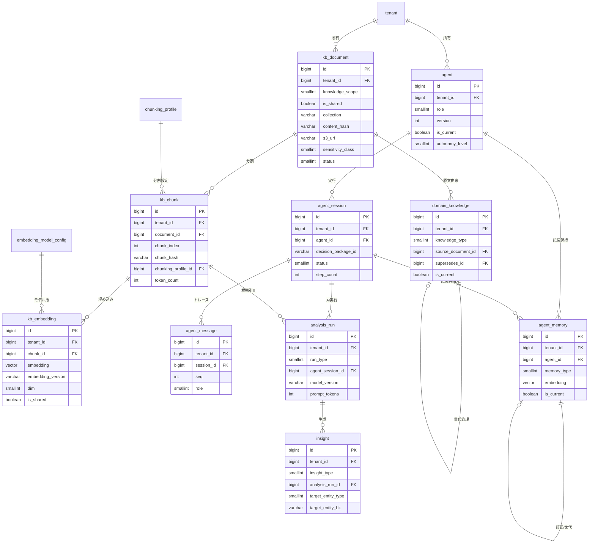

# DBスキーマ設計: AI / ベクター / ナレッジ

本ドキュメントは **SCIP（Supply Chain Intelligence Platform、コード名。正式名称は未確定）** の **Intelligence Plane（AI層、ブリーフ §3）** を支える物理スキーマを権威的に所有する。
すなわち **ナレッジベース原文メタ・チャンク・埋め込み（pgvector）・ドメイン知識・生成インサイト・分析実行ログ・AIエージェント定義/セッション/メッセージ/長期記憶** の各テーブル（PostgreSQL on Aurora）と、
これらの派生・補助として **DocDB（Amazon DynamoDB）に置くアイテム形状**（意思決定パッケージ・エージェントセッションキャッシュ）を定義する。

> **位置づけ / 所有範囲（owns。ブリーフ §14 テーブル所有マップ準拠）:**
> 本書は次を**権威的に所有（CREATE TABLE・列・型・制約・索引・`tenant_id`・RLS・列コメント）**する:
> `kb_document`, `kb_chunk`, `kb_embedding`, `chunking_profile`, `embedding_model_config`, `domain_knowledge`, `insight`, `analysis_run`,
> `agent`, `agent_session`, `agent_message`, `agent_memory`、および DocDB(DynamoDB) の `decision_package`（DECPKG）アイテム形状と `agent_session` の DocDB キャッシュ投影（SESS）形状。
> 以下は **参照するが再定義しない**:
> - **ベクターインデックスの設計ロジック**（HNSW/IVFFlat の選択根拠・パラメータ・再インデックス手順・ハイブリッド検索・リランキング）は [`23 AI/RAG/ベクター化`](../detailed-design/23-ai-rag-and-vectorization.md)（`ai-rag-vectorization`）が所有。本書は索引 DDL を**確定して敷設**するが、パラメータ選定根拠は 23 が正。
> - **エージェント編成・オーケストレーション・ツール実行・メモリ運用ロジック**は [`24 AIエージェント/バーチャルカンパニー`](../detailed-design/24-ai-agent-and-virtual-company.md)（`ai-agent-virtual-company`）が所有。本書は状態の物理格納先を定義する。
> - **DocDB のキー設計方針・スナップショットカタログ形状（`snapcat`/`ext`/`rm`）** は [`26 スナップショット/DocDB`](../detailed-design/26-snapshot-and-document-db.md)（`snapshot-document-db`）が所有。本書は `decpkg`/`sess` 形状のみ所有。
> - **横断規約（命名/DDL/共通列/RLS 雛形/マイグレーション）** は [`30 スキーマ戦略と SoT`](./30-schema-strategy-and-sot.md)（`schema-strategy-sot`）が正。本書はこれに厳密準拠する。
> - **数値の SoT（dim/fact・メトリクス）** は [`35 スタースキーマ DWH`](./35-star-schema-dwh.md)、`tenant`/`app_user`/`audit_logs`/`usage_metering` は [`37 コントロールプレーン`](./37-control-plane-backoffice-schema.md) が所有。本書は FK/論理参照に留める。

- **物理配置（ブリーフ §4 / 30 §7）:** 本書のリレーショナル表は **Amazon Aurora PostgreSQL（pgvector 併載, 30 の S2/S8）** に置く。Canonical/MDM（34）と同一クラスタに同居し、名寄せベクターと基盤を共有する。DocDB 分は **Amazon DynamoDB（30 の S7）**。原本バイトは **S3（30 の S10）**。
- **Redshift 非対象:** 本書のテーブルは OLAP ではないため **Redshift の DISTKEY/SORTKEY は適用しない**（それは DWH（35）の関心事）。本書のベクター検索最適化は pgvector の HNSW 索引（§11）で行う。

---

## 1. SoT 宣言（本書スコープ）

ブリーフ §5 のデータストアカタログと 30 §2 の SoT マップに厳密準拠する。**中核原則: 原文（S3/RDS メタ）が SoT、チャンク・埋め込みは派生であり原文から冪等に再生成可能**（CLAUDE.md 原則2/6）。

| データ | SoT | 派生/キャッシュ | 再構築 | 本書の所有 |
|--------|-----|----------------|--------|-----------|
| KB 原本バイト | **S3（30 S10）** | — | — | 参照（`kb_document.s3_uri`） |
| KB 原文メタ | **RDS `kb_document`** | — | — | 所有 |
| チャンク | **派生**（原文から再チャンク） | `kb_chunk` | ○ | 所有 |
| 埋め込みベクター | **派生**（チャンク×モデル版から再エンベッド） | `kb_embedding` | ○ | 所有 |
| チャンク設定・埋め込みモデル版 | **設定は AI DB が SoT** | `chunking_profile` / `embedding_model_config` | — | 所有 |
| ドメイン知識（構造化ナレッジ） | **原文=S3/`kb_document`、構造化行=`domain_knowledge`（キュレーション結果の SoT）** | ベクターは派生 | ○ | 所有 |
| 生成インサイト（生成メタ・文面） | **生成メタ/文面は `insight`（AI DB）が SoT。内包する数値は DWH（35）が SoT** | — | 数値再取得・文面再生成 | 所有 |
| 分析実行ログ | **`analysis_run`（AI DB, append-only）** | — | × 不変保持 | 所有 |
| エージェント定義 | **`agent`（版管理）** | — | — | 所有 |
| エージェント会話/トレース | **`agent_message`（append-only）** | DocDB `sess`・Redis はキャッシュ | セッションから再構成 | 所有 |
| エージェントセッション | **`agent_session`（RDS）** | DocDB `sess`（キャッシュ投影） | — | 所有（DocDB 投影形状も） |
| エージェント長期/手続き記憶 | **`agent_memory`（RDS）**、埋め込みは派生 | `agent_memory.embedding` | ○ 再エンベッド | 所有 |
| 意思決定パッケージ | **DocDB `decision_package`（本書所有形状）** | 確定操作は `audit_logs`(37) へ二重記録 | — | 所有（DocDB 形状） |
| メトリクス値・dim/fact | **DWH（35）/メトリクス層（07）** | 参照のみ | — | 参照 |
| tenant/app_user/権限/監査/計量 | **Control Plane（37）** | 参照のみ | — | 参照（FK/論理参照） |

> **SoT 先行 → 派生後追いの徹底:** 埋め込み（`kb_embedding` / `agent_memory.embedding`）は必ず**原文行（`kb_chunk` / `agent_memory`）の確定後**に生成する（逆順禁止）。障害復旧・モデル更新時は原文を源泉に再エンベッドする（手順は 23 §4.6）。原文を伴わないベクターの手修正は禁止（SoT から復元不能な状態を作らない）。

---

## 2. ER 図

AI/ベクター/ナレッジ系エンティティの関係を示す（`tenant`/`app_user` は 37 が所有する外部参照）。



---

## 3. 前提: 拡張・スキーマ・列挙値

### 3.1 PostgreSQL 拡張とスキーマ

```sql
-- pgvector 拡張（Aurora PostgreSQL）。ベクター型と HNSW/IVFFlat 索引を提供
CREATE EXTENSION IF NOT EXISTS vector;
-- 日本語全文検索（ハイブリッド検索の語彙側, 23 §5.2）。小規模はこれで足りる
CREATE EXTENSION IF NOT EXISTS pg_trgm;

-- AI 層専用スキーマ（30 §7 の物理配置に従い Aurora 上へ）
CREATE SCHEMA IF NOT EXISTS ai;
-- 以降の CREATE TABLE は search_path=ai を前提に記す（明示時は ai.<table>）
```

### 3.2 共有列挙値（SMALLINT + CHECK。ブリーフ §9・30 §3.2）

本書のテーブル横断で用いる列挙をここに集約する（日本語文字列ステータスは使わない）。

| 列 | 値 | 意味 |
|----|----|------|
| `knowledge_scope` | 1 | `industry_shared`（業界横断・共有テナント） |
| | 2 | `tenant_specific`（クライアント固有） |
| `sensitivity_class` | 0 / 1 / 2 / 3 | なし / 社内限 / 機微（原価・仕入単価） / 個人情報(PII) |
| `collection` | `domain_industry` / `domain_client` / `metric_semantics` / `decision_history` | ベクター名前空間（23 §4.4） |
| `agent.role` | 1..10 | planner / sales / procurement / production / inventory / logistics / executive / analytics / knowledge / simulation（24 §2.2） |
| `agent_message.role` | 1..7 | system / user / assistant / tool / planner / executor / verifier（24 §2.1） |
| `memory_type` | 1 / 2 / 3 | fact（事実） / procedure（手続き） / decision（過去判断） |
| `run_type` | 1..7 | aggregate / classify / index / insight / rag_search / simulation / workflow |
| `insight_type` | 1..5 | trend / anomaly / opportunity / risk / recommendation |
| `target_entity_type` | 1..8 | product / sku / location / region / customer / supplier / channel / tenant |

> **共有テナント予約値:** 業界横断ナレッジ（`knowledge_scope=1`）は **予約済みプラットフォーム共有テナント**（`tenant_id` 予約値、例: `0` = `PLATFORM_SHARED`。確定は 37）に格納し `is_shared = TRUE` とする。`tenant` テーブルにこの予約行をシード（37 が所有）。RLS はこの共有分を全テナントに**読取専用**で開放する（§10）。

---

## 4. ナレッジベース原文メタ: `kb_document`

原文（S3 バイト）のメタを保持する。原文取込は [`21`](../detailed-design/21-ingestion-and-mapping-pipeline.md) が S3 へ着地させ、本テーブルへメタ登録する。**原本は S3 が SoT、本テーブルはそのインデックス**（§1）。

```sql
CREATE TABLE kb_document (
    id                  BIGSERIAL    PRIMARY KEY,                        -- 代理主キー
    tenant_id           BIGINT       NOT NULL REFERENCES tenant(id),     -- テナント識別子（RLS対象。共有ナレッジは予約テナント）
    knowledge_scope     SMALLINT     NOT NULL,                           -- 1=industry_shared 2=tenant_specific（§3.2）
    is_shared           BOOLEAN      NOT NULL DEFAULT FALSE,             -- 共有読取可否（scope=1 のとき TRUE。RLS/索引の駆動列）
    collection          VARCHAR(64)  NOT NULL,                           -- ベクター名前空間（domain_industry 等, 23 §4.4）
    title               VARCHAR(512) NOT NULL,                           -- 文書タイトル（引用表示・全文検索対象）
    doc_type            SMALLINT     NOT NULL DEFAULT 0,                 -- 文書種別 0=other/1=regulation/2=practice/3=decision/4=metric_doc
    language            CHAR(5)      NOT NULL DEFAULT 'ja',              -- 言語コード（BCP47 簡易, 例 ja/en）
    s3_uri              VARCHAR(1024) NOT NULL,                          -- 原本バイトの S3 URI（SoT はここが指す実体）
    content_type        VARCHAR(128) NULL,                              -- MIME（application/pdf 等）
    content_hash        VARCHAR(64)  NOT NULL,                           -- 正規化本文の sha256（冪等・重複取込判定, 23 §3.1）
    byte_size           BIGINT       NULL,                               -- 原本サイズ（バイト）
    sensitivity_class   SMALLINT     NOT NULL DEFAULT 0,                 -- 機微区分（§3.2）。埋め込み前マスキング判定に使用
    effective_from      TIMESTAMPTZ  NULL,                              -- 有効開始（鮮度管理, 23 §5.3）
    effective_to        TIMESTAMPTZ  NULL,                              -- 有効終了（NULL=無期限）。失効版は検索除外
    status              SMALLINT     NOT NULL DEFAULT 0,                 -- 0=pending/1=ready/2=superseded/3=retired/9=failed
    source_system       VARCHAR(64)  NULL,                              -- 来歴: 取込元システム（30 §3.2）
    source_record_id    VARCHAR(128) NULL,                              -- 来歴: 取込元レコードID
    legacy_id           VARCHAR(64)  NULL,                              -- 移行元ID（来歴）
    is_deleted          BOOLEAN      NOT NULL DEFAULT FALSE,            -- 論理削除
    created_at          TIMESTAMPTZ  NOT NULL DEFAULT now(),            -- 作成日時（UTC保存）
    updated_at          TIMESTAMPTZ  NOT NULL DEFAULT now(),            -- 更新日時（UTC保存）
    created_by_user_id  BIGINT       NULL REFERENCES app_user(id),     -- 作成者（登録者。取込は連携ユーザ）
    updated_by_user_id  BIGINT       NULL REFERENCES app_user(id),     -- 更新者
    CONSTRAINT chk_kb_document_scope       CHECK (knowledge_scope IN (1, 2)),
    CONSTRAINT chk_kb_document_sensitivity CHECK (sensitivity_class IN (0, 1, 2, 3)),
    CONSTRAINT chk_kb_document_status      CHECK (status IN (0, 1, 2, 3, 9)),
    CONSTRAINT chk_kb_document_shared      CHECK ((knowledge_scope = 1) = is_shared)  -- 共有=業界横断の整合を強制
);

-- 同一原文の再取込を冪等スキップ（content_hash 一致, 23 §3.1 / AI-701）
ALTER TABLE kb_document
    ADD CONSTRAINT uq_kb_document_tenant_hash UNIQUE (tenant_id, content_hash);

-- テナント×コレクション×有効文書の索引（検索前段のフィルタ, 23 §5.3）
CREATE INDEX idx_kb_document_tenant_coll
    ON kb_document (tenant_id, collection, status)
    WHERE is_deleted = FALSE;
-- 共有ナレッジの横断読取用（is_shared 部分索引）
CREATE INDEX idx_kb_document_shared_coll
    ON kb_document (collection, status)
    WHERE is_shared = TRUE AND is_deleted = FALSE;
-- 日本語タイトル全文検索（ハイブリッド検索の語彙側補助）
CREATE INDEX idx_kb_document_title_trgm
    ON kb_document USING gin (title gin_trgm_ops);

COMMENT ON TABLE  kb_document IS 'ナレッジベース原文メタ。原本バイトの SoT は S3、本表はそのインデックス';
COMMENT ON COLUMN kb_document.content_hash IS '正規化本文の sha256。同一 tenant 内で一意（重複取込の冪等判定）';
COMMENT ON COLUMN kb_document.is_shared IS '業界横断共有フラグ。RLS の共有読取ポリシーと部分索引の駆動列';
```

---

## 5. チャンク: `kb_chunk`

原文を意味境界で分割した検索粒度の断片（**派生**。原文から再チャンク可能）。チャンク化ロジックは 23 §3.2 が所有。

```sql
CREATE TABLE kb_chunk (
    id                  BIGSERIAL    PRIMARY KEY,                        -- 代理主キー
    tenant_id           BIGINT       NOT NULL REFERENCES tenant(id),     -- テナント識別子（親文書から継承。RLS対象）
    document_id         BIGINT       NOT NULL REFERENCES kb_document(id) ON DELETE CASCADE, -- 親文書（明細→ヘッダの親子はCASCADE, 30 §6）
    chunking_profile_id BIGINT       NOT NULL REFERENCES chunking_profile(id), -- 分割設定版（§8）
    chunk_index         INTEGER      NOT NULL,                           -- 文書内の連番（0起点）
    chunk_text          TEXT         NOT NULL,                           -- 分割済みテキスト（機微はマスキング後, 23 §9.2）
    chunk_hash          VARCHAR(64)  NOT NULL,                           -- sha256(chunk_text + profile)。再埋め込み要否判定（AI-702抑止）
    breadcrumb          VARCHAR(1024) NULL,                             -- 見出しパス（引用生成・文脈保存, 23 §3.2）
    token_count         INTEGER      NOT NULL DEFAULT 0,                 -- 概算トークン数（予算計算用）
    knowledge_scope     SMALLINT     NOT NULL,                           -- 親文書から継承（フィルタ高速化のため非正規化）
    is_shared           BOOLEAN      NOT NULL DEFAULT FALSE,             -- 親文書から継承（RLS/索引駆動）
    collection          VARCHAR(64)  NOT NULL,                           -- 親文書から継承（名前空間）
    sensitivity_class   SMALLINT     NOT NULL DEFAULT 0,                 -- 親文書から継承（取得時マスク判定）
    effective_from      TIMESTAMPTZ  NULL,                              -- 鮮度（親から継承）
    effective_to        TIMESTAMPTZ  NULL,                              -- 鮮度（親から継承）
    is_deleted          BOOLEAN      NOT NULL DEFAULT FALSE,            -- 論理削除（再分割時に旧チャンクを無効化）
    created_at          TIMESTAMPTZ  NOT NULL DEFAULT now(),            -- 作成日時（UTC保存）
    updated_at          TIMESTAMPTZ  NOT NULL DEFAULT now(),            -- 更新日時（UTC保存）
    CONSTRAINT chk_kb_chunk_scope CHECK (knowledge_scope IN (1, 2)),
    CONSTRAINT chk_kb_chunk_shared CHECK ((knowledge_scope = 1) = is_shared)
);

-- チャンク冪等キー: 同一文書×同一プロファイルで chunk_hash 一意（再インジェスト時の重複防止, 23 §3.2）
ALTER TABLE kb_chunk
    ADD CONSTRAINT uq_kb_chunk_doc_profile_hash UNIQUE (document_id, chunking_profile_id, chunk_hash);
-- 文書内の順序一意
ALTER TABLE kb_chunk
    ADD CONSTRAINT uq_kb_chunk_doc_profile_index UNIQUE (document_id, chunking_profile_id, chunk_index);

CREATE INDEX idx_kb_chunk_tenant_doc
    ON kb_chunk (tenant_id, document_id)
    WHERE is_deleted = FALSE;
-- 日本語全文検索（ベクターと融合する語彙側, 23 §5.2）
CREATE INDEX idx_kb_chunk_text_trgm
    ON kb_chunk USING gin (chunk_text gin_trgm_ops)
    WHERE is_deleted = FALSE;

COMMENT ON TABLE  kb_chunk IS 'チャンク（派生）。原文から再チャンク可能。chunk_hash で再埋め込み要否を判定';
COMMENT ON COLUMN kb_chunk.knowledge_scope IS '親 kb_document から継承（検索フィルタ高速化のための非正規化。整合はアプリ層で保証）';
```

> **非正規化の意図（IQ-2）:** `knowledge_scope`/`is_shared`/`collection`/`sensitivity_class` を親文書から継承コピーするのは、**ベクター検索の WHERE で親テーブルを JOIN せずにフィルタを効かせる**ため（HNSW のフィルタ付き探索の recall 対策, 23 §4.3）。継承値は再インジェスト時に親から必ず再設定し、親との乖離を作らない。

---

## 6. 埋め込み: `kb_embedding`（pgvector）

チャンク × 埋め込みモデル版のベクター（**派生**。再エンベッド可能）。**ベクター/次元/索引パラメータの設計根拠は 23 §3.3/§4 が所有**し、本書はその確定 DDL を敷設する。

```sql
CREATE TABLE kb_embedding (
    id                  BIGSERIAL    PRIMARY KEY,                        -- 代理主キー
    tenant_id           BIGINT       NOT NULL REFERENCES tenant(id),     -- テナント識別子（RLS対象。境界の最終防衛線, 23 §4.3）
    chunk_id            BIGINT       NOT NULL REFERENCES kb_chunk(id) ON DELETE CASCADE, -- 対象チャンク
    embedding           vector(1024) NOT NULL,                           -- 埋め込みベクター（L2正規化済。次元1024固定, 23 §3.3）
    embedding_model     VARCHAR(64)  NOT NULL,                           -- モデル識別（titan-embed-text-v2 等。config と対応）
    embedding_version   VARCHAR(32)  NOT NULL,                           -- モデル版（版切替のブルーグリーン識別, 23 §4.6）
    dim                 SMALLINT     NOT NULL DEFAULT 1024,              -- 次元数（vector 型と一致検証。不一致は AI-713）
    normalized          BOOLEAN      NOT NULL DEFAULT TRUE,              -- L2 正規化済フラグ（cosine 前提）
    collection          VARCHAR(64)  NOT NULL,                           -- 名前空間（チャンクから継承。検索対象の一貫性, 23 §4.5）
    knowledge_scope     SMALLINT     NOT NULL,                           -- チャンクから継承（RLS/フィルタ）
    is_shared           BOOLEAN      NOT NULL DEFAULT FALSE,             -- チャンクから継承（共有読取・部分索引）
    effective_from      TIMESTAMPTZ  NULL,                              -- 鮮度（チャンクから継承）
    effective_to        TIMESTAMPTZ  NULL,                              -- 鮮度（チャンクから継承）
    is_deleted          BOOLEAN      NOT NULL DEFAULT FALSE,            -- 論理削除（失効・再分割で無効化。物理削除は再索引時に一括）
    created_at          TIMESTAMPTZ  NOT NULL DEFAULT now(),            -- 生成日時（UTC保存）
    CONSTRAINT chk_kb_embedding_dim   CHECK (dim = 1024),
    CONSTRAINT chk_kb_embedding_scope CHECK (knowledge_scope IN (1, 2))
);

-- upsert 冪等キー: 同一チャンク×同一モデル版は1行（重複行を作らない, 23 §3.4）
ALTER TABLE kb_embedding
    ADD CONSTRAINT uq_kb_embedding_chunk_version UNIQUE (chunk_id, embedding_version);

-- ★ HNSW 索引（既定・cosine 距離）。有効行のみ部分索引化（23 §4.2）
--   パラメータ根拠は 23 §4.1/§4.2。検索は ORDER BY embedding <=> :q（cosine）
CREATE INDEX idx_kb_embedding_hnsw_cos
    ON kb_embedding
    USING hnsw (embedding vector_cosine_ops)
    WITH (m = 16, ef_construction = 64)
    WHERE is_deleted = FALSE;

-- フィルタ前段の複合索引（版×コレクション×テナント一貫性の強制, 23 §4.5）
CREATE INDEX idx_kb_embedding_scope_ver
    ON kb_embedding (tenant_id, collection, embedding_version)
    WHERE is_deleted = FALSE;
CREATE INDEX idx_kb_embedding_shared_ver
    ON kb_embedding (collection, embedding_version)
    WHERE is_shared = TRUE AND is_deleted = FALSE;

COMMENT ON TABLE  kb_embedding IS '埋め込みベクター（派生）。原文→チャンク→再エンベッドで冪等再構築。SoT ではない';
COMMENT ON COLUMN kb_embedding.embedding IS 'pgvector(1024)。L2正規化済。近傍探索は cosine（<=>）を用いる';
COMMENT ON COLUMN kb_embedding.embedding_version IS '検索時は同一版のみを対象にする（混在は距離を無意味化, 23 §4.5）';
```

> **索引方式の切替（23 §4.1）:** 極大規模・更新疎なテナントでは IVFFlat（`ivfflat (embedding vector_cosine_ops) WITH (lists = …)`）へ切替、それでも要件を超える場合は OpenSearch へ移行する。いずれも `kb_embedding` を原文から再生成できる設計により**破壊的にならない**（§1）。切替判断・パラメータは 23 §4 / 未決 §13。

---

## 7. 埋め込みモデル設定: `embedding_model_config`

埋め込みモデル版・次元・正規化の**設定 SoT**（23 §3.3）。全テナント統一版を管理し、`kb_embedding.embedding_version` はここを参照する。テナント横断のプラットフォーム設定のため RLS 対象外（共有参照）。

```sql
CREATE TABLE embedding_model_config (
    id                  BIGSERIAL    PRIMARY KEY,                        -- 代理主キー
    embedding_version   VARCHAR(32)  NOT NULL,                           -- 版識別（kb_embedding/agent_memory が参照）
    embedding_model     VARCHAR(64)  NOT NULL,                           -- モデル識別（Bedrock 上の埋め込みモデル）
    provider            VARCHAR(32)  NOT NULL DEFAULT 'bedrock',        -- 提供元（bedrock 等）
    dim                 SMALLINT     NOT NULL DEFAULT 1024,              -- 次元数（テナント横断で統一, 23 §3.3）
    normalized          BOOLEAN      NOT NULL DEFAULT TRUE,              -- L2 正規化前提
    distance_op         VARCHAR(16)  NOT NULL DEFAULT 'cosine',         -- 距離オペレータ（cosine 固定, 23 §4.2）
    is_active           BOOLEAN      NOT NULL DEFAULT TRUE,             -- 現行検索対象版か（版切替のフラグ, 23 §4.6）
    is_deleted          BOOLEAN      NOT NULL DEFAULT FALSE,            -- 論理削除
    created_at          TIMESTAMPTZ  NOT NULL DEFAULT now(),
    updated_at          TIMESTAMPTZ  NOT NULL DEFAULT now(),
    CONSTRAINT chk_emc_dim  CHECK (dim > 0 AND dim <= 2000)              -- pgvector 索引上限（23 §4.2）
);
ALTER TABLE embedding_model_config
    ADD CONSTRAINT uq_emc_version UNIQUE (embedding_version);

COMMENT ON TABLE embedding_model_config IS '埋め込みモデル版設定の SoT（テナント横断。RLS 対象外の共有設定）';
```

---

## 8. チャンク設定: `chunking_profile`

チャンク化戦略（サイズ・オーバーラップ・分割器）の**設定 SoT**（23 §3.2）。`kb_chunk.chunking_profile_id` が参照。テナント横断のプラットフォーム設定 + テナント別上書きを許容するため `tenant_id` を NULL 許容で持つ（NULL=プラットフォーム既定）。

```sql
CREATE TABLE chunking_profile (
    id                  BIGSERIAL    PRIMARY KEY,                        -- 代理主キー
    tenant_id           BIGINT       NULL REFERENCES tenant(id),         -- NULL=プラットフォーム既定、値ありはテナント上書き
    profile_key         VARCHAR(64)  NOT NULL,                           -- プロファイル識別（default/regulation/practice 等）
    target_tokens       INTEGER      NOT NULL DEFAULT 500,               -- 目標チャンクサイズ（トークン, 23 §3.2）
    max_tokens          INTEGER      NOT NULL DEFAULT 800,               -- 上限（二次分割の閾値）
    overlap_tokens      INTEGER      NOT NULL DEFAULT 60,                -- オーバーラップ（40〜80）
    splitter            VARCHAR(64)  NOT NULL DEFAULT 'structure_aware', -- 分割器（構造認識型が既定）
    profile_version     VARCHAR(32)  NOT NULL DEFAULT '1.0.0',          -- 版（戦略変更時の再チャンク対象特定, 23 §3.2）
    is_active           BOOLEAN      NOT NULL DEFAULT TRUE,
    is_deleted          BOOLEAN      NOT NULL DEFAULT FALSE,
    created_at          TIMESTAMPTZ  NOT NULL DEFAULT now(),
    updated_at          TIMESTAMPTZ  NOT NULL DEFAULT now(),
    CONSTRAINT chk_chunking_sizes CHECK (target_tokens > 0 AND max_tokens >= target_tokens AND overlap_tokens >= 0)
);
-- テナント既定/上書きの一意（tenant_id NULL は既定。COALESCE で一意化）
CREATE UNIQUE INDEX uq_chunking_profile_key
    ON chunking_profile (COALESCE(tenant_id, 0), profile_key, profile_version)
    WHERE is_deleted = FALSE;

COMMENT ON TABLE chunking_profile IS 'チャンク化戦略設定の SoT。tenant_id NULL はプラットフォーム既定、値ありはテナント上書き';
```

> **RLS の扱い（設定系）:** `chunking_profile` は「既定（NULL）＋テナント上書き」の混在参照が必要なため、標準の `tenant_isolation` ではなく **`tenant_id IS NULL OR tenant_id = current_setting('app.tenant_id')::bigint`** の読取ポリシーを敷く（§10 に併記）。書込はテナント上書き行のみ当該テナント、既定行はプラットフォーム管理ロール。

---

## 9. ドメイン知識: `domain_knowledge`

業界横断 + クライアント固有の**キュレーション済み構造化ナレッジ**（慣行・ルール・過去判断・ベンチマーク）。原文（`kb_document`）由来だが、検索・世代管理・引用のために構造化した行を持つ。**キュレーション結果の SoT は本表、原文は `kb_document`/S3**（§1）。

```sql
CREATE TABLE domain_knowledge (
    id                  BIGSERIAL    PRIMARY KEY,                        -- 代理主キー
    tenant_id           BIGINT       NOT NULL REFERENCES tenant(id),     -- テナント識別子（共有は予約テナント。RLS対象）
    knowledge_scope     SMALLINT     NOT NULL,                           -- 1=industry_shared 2=tenant_specific
    is_shared           BOOLEAN      NOT NULL DEFAULT FALSE,             -- 共有読取フラグ
    collection          VARCHAR(64)  NOT NULL,                           -- 名前空間（domain_industry/domain_client/decision_history）
    knowledge_type      SMALLINT     NOT NULL,                           -- 1=fact 2=procedure 3=decision（§3.2 memory_type と整合）
    title               VARCHAR(512) NOT NULL,                           -- 見出し
    body_text           TEXT         NOT NULL,                           -- 本文（解釈・慣行・ルール。変動数値は載せない, 23 §6.2）
    source_document_id  BIGINT       NULL REFERENCES kb_document(id),    -- 原文由来（NULL=直接登録）。ベクター化は kb 経由
    sensitivity_class   SMALLINT     NOT NULL DEFAULT 0,                 -- 機微区分（再蓄積時マスキング判定, 23 §6.2）
    effective_from      TIMESTAMPTZ  NOT NULL DEFAULT now(),            -- 有効開始（鮮度・版管理, 23 §6.2）
    effective_to        TIMESTAMPTZ  NULL,                              -- 有効終了（NULL=現行）。失効は新版追加＋旧版失効
    version             INTEGER      NOT NULL DEFAULT 1,                 -- 世代番号
    supersedes_id       BIGINT       NULL REFERENCES domain_knowledge(id), -- 旧版（世代連鎖。打ち消しでなく世代管理）
    is_current          BOOLEAN      NOT NULL DEFAULT TRUE,             -- 現行版フラグ（過去版は当時参照可, 23 §6.2）
    is_deleted          BOOLEAN      NOT NULL DEFAULT FALSE,
    created_at          TIMESTAMPTZ  NOT NULL DEFAULT now(),
    updated_at          TIMESTAMPTZ  NOT NULL DEFAULT now(),
    created_by_user_id  BIGINT       NULL REFERENCES app_user(id),
    updated_by_user_id  BIGINT       NULL REFERENCES app_user(id),
    CONSTRAINT chk_dk_scope       CHECK (knowledge_scope IN (1, 2)),
    CONSTRAINT chk_dk_type        CHECK (knowledge_type IN (1, 2, 3)),
    CONSTRAINT chk_dk_sensitivity CHECK (sensitivity_class IN (0, 1, 2, 3)),
    CONSTRAINT chk_dk_shared      CHECK ((knowledge_scope = 1) = is_shared)
);

-- 現行版はテナント×コレクション×タイトルで一意（世代は version で区別）
CREATE UNIQUE INDEX uq_dk_tenant_coll_title_current
    ON domain_knowledge (tenant_id, collection, title)
    WHERE is_current = TRUE AND is_deleted = FALSE;
CREATE INDEX idx_dk_tenant_coll
    ON domain_knowledge (tenant_id, collection, knowledge_type)
    WHERE is_current = TRUE AND is_deleted = FALSE;
CREATE INDEX idx_dk_shared_coll
    ON domain_knowledge (collection, knowledge_type)
    WHERE is_shared = TRUE AND is_current = TRUE AND is_deleted = FALSE;

COMMENT ON TABLE  domain_knowledge IS 'キュレーション済みドメイン知識。原文は kb_document/S3、構造化行の SoT は本表。ベクター化は kb パイプライン経由';
COMMENT ON COLUMN domain_knowledge.is_current IS '現行版フラグ。改訂は新版 INSERT＋旧版 is_current=FALSE（世代管理・当時参照可）';
```

> **ベクター化の経路:** `domain_knowledge` の検索可能テキスト（`body_text`）は、`source_document_id` を介して `kb_document`→`kb_chunk`→`kb_embedding` のパイプラインで索引化する（23 §6.1）。直接登録（`source_document_id IS NULL`）の場合も、登録時に `kb_document` を生成してから本表へ紐づけ、**原文＝SoT の不変条件**を維持する。

---

## 10. RLS とテナント境界（共有ナレッジの読取開放）

30 §4.2 の RLS 雛形に準拠しつつ、**業界横断ナレッジの共有読取**を許すため、ナレッジ系（`kb_document`/`kb_chunk`/`kb_embedding`/`domain_knowledge`）には **① 自テナント全操作ポリシー + ② 共有読取ポリシー** の 2 本を敷く（PERMISSIVE は OR 合成）。境界は 23 §4.3 の多層防御の DB 層に当たる。

```sql
-- 代表例: kb_embedding（他のナレッジ系表も同型。テーブル名のみ差し替え）
ALTER TABLE kb_embedding ENABLE ROW LEVEL SECURITY;
ALTER TABLE kb_embedding FORCE  ROW LEVEL SECURITY;   -- 所有ロールにも適用

-- ① 自テナント: 読み書き全操作を tenant_id でスコープ
CREATE POLICY tenant_isolation ON kb_embedding
    USING      (tenant_id = current_setting('app.tenant_id')::bigint)
    WITH CHECK (tenant_id = current_setting('app.tenant_id')::bigint);

-- ② 共有ナレッジ: 業界横断（is_shared）は全テナントに読取のみ開放（書込不可）
CREATE POLICY shared_knowledge_read ON kb_embedding
    FOR SELECT
    USING (is_shared = TRUE AND knowledge_scope = 1);
```

- **共有分の書込制御:** 共有ナレッジの登録・更新は**プラットフォーム管理ロール**（予約テナントコンテキスト）でのみ行う。テナントセッション（`app.tenant_id` = 一般値）からは②が SELECT 限定のため書込不可（`WITH CHECK` を持たない）。
- **fail-closed（30 §4.2）:** `app.tenant_id` 未設定時は `current_setting` が例外となり全行漏洩を防ぐ（CMN-001）。
- **エージェント/実行ログ系（`agent`/`agent_session`/`agent_message`/`agent_memory`/`insight`/`analysis_run`）** は共有読取が不要なため、30 §4.2 の**標準 `tenant_isolation` 単独**を適用する（共有ポリシーは付けない）。`agent_memory` のクロス部門想起も検索フィルタ（`agent_id`/`role`）で別途制限する（24 §5.2）。
- **`chunking_profile`（既定＋上書き混在）** は §8 のとおり `tenant_id IS NULL OR tenant_id = current_setting('app.tenant_id')::bigint` の読取ポリシーを敷く。`embedding_model_config` はテナント横断設定のため RLS 対象外（GRANT で読取を全ロールへ、書込は管理ロール限定）。

> **ベクター検索での境界（23 §4.3 と本層の関係）:** RLS は DB 層の最終防衛線。アプリは加えて WHERE に `tenant_id`＋`is_shared`＋`collection`＋`embedding_version` を**明示付与**し（呼び出し側で強制注入、プロンプト経由でテナントを渡さない）、近傍探索を境界内集合に閉じる。違反検出は AI-751（23 §12・CRITICAL）で `audit_logs`(37) へ二重記録。

---

## 11. ベクター索引運用（本書が敷設・23 が設計）

`kb_embedding`（§6）と `agent_memory`（§15）が HNSW 索引を持つ。**索引方式・パラメータ・再インデックス手順の設計根拠は 23 §4 が所有**し、本書は確定 DDL の敷設・運用注記のみ行う。

| 項目 | 本書の敷設 | 根拠（所有） |
|------|-----------|-------------|
| 索引方式 | HNSW（`m=16, ef_construction=64`）部分索引（`WHERE is_deleted=FALSE`） | 23 §4.1/§4.2 |
| 距離 | cosine（`vector_cosine_ops`、`<=>`） | 23 §4.2 |
| 検索時パラメータ | セッションで `SET hnsw.ef_search`（既定40、精度優先80-100） | 23 §4.2 |
| 版分離 | `embedding_version` を WHERE 束縛（混在探索禁止） | 23 §4.5 |
| 再インデックス | ブルーグリーン（新版並行構築→検証→切替→旧版 VACUUM） | 23 §4.6 |
| フィルタ recall 対策 | pgvector 0.8 反復スキャン or テナント別パーティション/部分索引 | 23 §4.3・未決 §13 |

> **物理削除と VACUUM:** 失効ベクターは `is_deleted=TRUE` で論理無効化し検索から除外、物理削除は再インデックス時にまとめて実施し VACUUM 負荷を平準化する（23 §3.4）。

---

## 12. 生成インサイト: `insight`

DWH の数値（正）と RAG の文脈（解釈）を組み合わせた根拠付きの気づき（23 §7.4）。**生成メタ・文面の SoT は本表。内包する数値の SoT は DWH（35）**であり、再表示時は必要に応じ数値を再取得する。

```sql
CREATE TABLE insight (
    id                  BIGSERIAL    PRIMARY KEY,                        -- 代理主キー
    tenant_id           BIGINT       NOT NULL REFERENCES tenant(id),     -- テナント識別子（RLS対象）
    insight_type        SMALLINT     NOT NULL,                           -- 1=trend/2=anomaly/3=opportunity/4=risk/5=recommendation
    title               VARCHAR(512) NOT NULL,                           -- 見出し
    narrative_text      TEXT         NOT NULL,                           -- 言語化された気づき（数値は取得結果からの引用のみ, 23 §8）
    target_entity_type  SMALLINT     NULL,                               -- 対象種別（product/region 等, §3.2）
    target_entity_bk    VARCHAR(128) NULL,                               -- 対象の業務自然キー（dim の *_bk。DWH は別クラスタのため疎参照）
    period_start        DATE         NULL,                               -- 対象期間開始（業務日付は DATE, ブリーフ §9）
    period_end          DATE         NULL,                               -- 対象期間終了
    analysis_run_id     BIGINT       NOT NULL REFERENCES analysis_run(id), -- 生成した分析実行（根拠・再現の起点）
    evidence            JSONB        NOT NULL DEFAULT '[]'::jsonb,       -- 根拠[]（引用 kb_chunk id・metric_id・期間・値のスナップ）
    generated_at        TIMESTAMPTZ  NOT NULL DEFAULT now(),            -- 生成時点（数値の as_of。鮮度提示, 23 §7.4）
    model               VARCHAR(64)  NULL,                              -- 生成モデル（用途×能力層。ID は設定切替, 23 §10.1）
    confidence          NUMERIC(5,4) NULL,                              -- 確度（0..1。断定回避のため明示, 23 §8.3）
    status              SMALLINT     NOT NULL DEFAULT 1,                 -- 1=active/2=stale(数値陳腐化)/3=dismissed
    is_deleted          BOOLEAN      NOT NULL DEFAULT FALSE,
    created_at          TIMESTAMPTZ  NOT NULL DEFAULT now(),
    updated_at          TIMESTAMPTZ  NOT NULL DEFAULT now(),
    created_by_user_id  BIGINT       NULL REFERENCES app_user(id),
    updated_by_user_id  BIGINT       NULL REFERENCES app_user(id),
    CONSTRAINT chk_insight_type       CHECK (insight_type IN (1, 2, 3, 4, 5)),
    CONSTRAINT chk_insight_status     CHECK (status IN (1, 2, 3)),
    CONSTRAINT chk_insight_confidence CHECK (confidence IS NULL OR (confidence >= 0 AND confidence <= 1)),
    CONSTRAINT chk_insight_target     CHECK ((target_entity_type IS NULL) = (target_entity_bk IS NULL))
);

CREATE INDEX idx_insight_tenant_type
    ON insight (tenant_id, insight_type, generated_at DESC)
    WHERE is_deleted = FALSE;
CREATE INDEX idx_insight_tenant_target
    ON insight (tenant_id, target_entity_type, target_entity_bk)
    WHERE is_deleted = FALSE;
-- 根拠検索（evidence 内の引用参照）
CREATE INDEX idx_insight_evidence_gin
    ON insight USING gin (evidence jsonb_path_ops);

COMMENT ON TABLE  insight IS '生成インサイト。生成メタ/文面の SoT は本表、内包数値の SoT は DWH（再取得可能）';
COMMENT ON COLUMN insight.target_entity_bk IS 'DWH dim の業務自然キー(*_bk)。Redshift は別クラスタのため FK でなく疎参照';
COMMENT ON COLUMN insight.evidence IS '根拠配列: [{kb_chunk_id|metric_id, period, value_as_of, citation}]。08 の意思決定 evidence[] から参照';
```

---

## 13. 分析実行ログ: `analysis_run`

全 AI 実行（集計/分類/インデックス化/インサイト/RAG 取得/シミュレーション/ワークフロー）の**append-only 不変ログ**（23 §7.5・24 §1）。監査・再現・コスト計測の源泉。**更新・削除しない**（`updated_at`/`is_deleted` を持たない）。

```sql
CREATE TABLE analysis_run (
    id                  BIGSERIAL    PRIMARY KEY,                        -- 代理主キー
    tenant_id           BIGINT       NOT NULL REFERENCES tenant(id),     -- テナント識別子（RLS対象）
    run_type            SMALLINT     NOT NULL,                           -- 1=aggregate/2=classify/3=index/4=insight/5=rag_search/6=simulation/7=workflow
    agent_session_id    BIGINT       NULL REFERENCES agent_session(id),  -- エージェント起動時のセッション（NULL=非エージェント実行）
    agent_id            BIGINT       NULL REFERENCES agent(id),          -- 実行エージェント（NULL=システム/ユーザ直）
    input_summary       JSONB        NOT NULL DEFAULT '{}'::jsonb,       -- 入力要約（問い・パラメータ。生機微は載せない）
    model               VARCHAR(64)  NULL,                              -- 生成/分類モデル（用途×能力層）
    model_version       VARCHAR(32)  NULL,                              -- モデル版
    embedding_version   VARCHAR(32)  NULL,                              -- 使用した埋め込み版（RAG 検索時）
    metrics_used        JSONB        NOT NULL DEFAULT '[]'::jsonb,       -- 参照した許可メトリクス定義[]（数値の SoT は 07/35）
    rag_citations       JSONB        NOT NULL DEFAULT '[]'::jsonb,       -- 参照 kb_chunk id[]＋引用メタ（根拠追跡）
    prompt_tokens       INTEGER      NOT NULL DEFAULT 0,                 -- 入力トークン（コスト計量→usage_metering(37)）
    completion_tokens   INTEGER      NOT NULL DEFAULT 0,                 -- 出力トークン
    embedding_tokens    INTEGER      NOT NULL DEFAULT 0,                 -- 埋め込みトークン
    latency_ms          INTEGER      NULL,                               -- レイテンシ（ミリ秒）
    result_type         SMALLINT     NULL,                               -- 結果参照種別 1=insight/2=decision_package/3=classification/4=none
    result_ref          VARCHAR(128) NULL,                              -- 結果参照（insight.id 文字列 or decision_package_id）
    status              SMALLINT     NOT NULL DEFAULT 1,                 -- 1=success/2=partial/3=failed
    error_code          VARCHAR(16)  NULL,                              -- 想定エラーコード（AI-NNN。逆引き）
    actor_user_id       BIGINT       NULL REFERENCES app_user(id),      -- 実行者（対話起点時）
    created_at          TIMESTAMPTZ  NOT NULL DEFAULT now(),            -- 実行日時（UTC保存。append-only の唯一の時刻）
    CONSTRAINT chk_ar_run_type CHECK (run_type IN (1, 2, 3, 4, 5, 6, 7)),
    CONSTRAINT chk_ar_status   CHECK (status IN (1, 2, 3))
);

CREATE INDEX idx_analysis_run_tenant_time
    ON analysis_run (tenant_id, created_at DESC);
CREATE INDEX idx_analysis_run_session
    ON analysis_run (agent_session_id)
    WHERE agent_session_id IS NOT NULL;
CREATE INDEX idx_analysis_run_type_time
    ON analysis_run (tenant_id, run_type, created_at DESC);

COMMENT ON TABLE analysis_run IS '分析実行の append-only 不変ログ（監査/再現/コスト計測）。UPDATE/DELETE 禁止（GRANT で INSERT/SELECT のみ）';

-- RLS（標準 tenant_isolation）
ALTER TABLE analysis_run ENABLE ROW LEVEL SECURITY;
ALTER TABLE analysis_run FORCE  ROW LEVEL SECURITY;
CREATE POLICY tenant_isolation ON analysis_run
    USING      (tenant_id = current_setting('app.tenant_id')::bigint)
    WITH CHECK (tenant_id = current_setting('app.tenant_id')::bigint);
```

> **append-only の強制（CLAUDE.md 原則2）:** アプリの実行ロールには `INSERT`/`SELECT` のみを GRANT し `UPDATE`/`DELETE` を与えない。再実行で既存ログが巻き戻る副作用を許容しない（`audit_logs`(37) と同型の不変ログ運用）。トークン計量は本表を源泉に集計し `usage_metering`(37) へ後追い連携（23 §10.3・24 §7.4）。

---

## 14. エージェント: `agent` / `agent_session` / `agent_message`

エージェントの定義・実行セッション・トレースを保持する（状態遷移・ツール実行・メモリ運用ロジックは 24 が所有）。

### 14.1 `agent`（エージェント定義・版管理）

```sql
CREATE TABLE agent (
    id                  BIGSERIAL    PRIMARY KEY,                        -- 代理主キー
    tenant_id           BIGINT       NOT NULL REFERENCES tenant(id),     -- テナント識別子（RLS対象。編成はテナントカスタム, 24 §2.2）
    role                SMALLINT     NOT NULL,                           -- 部門ロール 1..10（§3.2。08 §2.2）
    name                VARCHAR(128) NOT NULL,                           -- 表示名（例「在庫エージェント」）
    system_prompt_template TEXT      NOT NULL,                           -- システムプロンプト構成（役割/制約/出力契約, 24 §6.1）
    tool_allowlist      JSONB        NOT NULL DEFAULT '[]'::jsonb,       -- 許可ツール集合（read/write 区別, 24 §4.1）
    autonomy_level      SMALLINT     NOT NULL DEFAULT 1,                 -- 自律レベル 0..3（既定L1=提案のみ, 24 §7.2）
    knowledge_scope     JSONB        NOT NULL DEFAULT '{}'::jsonb,       -- 参照可能ナレッジスコープ（固有+公開業界横断）
    metric_focus        JSONB        NOT NULL DEFAULT '[]'::jsonb,       -- 主参照 fact/メトリクス（コンテキスト構築ヒント）
    budget_policy       JSONB        NOT NULL DEFAULT '{}'::jsonb,       -- ステップ上限/トークン予算/タイムアウト（24 §3.4）
    version             INTEGER      NOT NULL DEFAULT 1,                 -- 編成版（過去意思決定は当時版を参照, 24 §7.3）
    supersedes_id       BIGINT       NULL REFERENCES agent(id),          -- 旧版（版連鎖）
    is_current          BOOLEAN      NOT NULL DEFAULT TRUE,             -- 現行版フラグ
    is_active           BOOLEAN      NOT NULL DEFAULT TRUE,             -- 有効化（フィーチャーフラグで部門有効化, 24 §2.2）
    is_deleted          BOOLEAN      NOT NULL DEFAULT FALSE,
    created_at          TIMESTAMPTZ  NOT NULL DEFAULT now(),
    updated_at          TIMESTAMPTZ  NOT NULL DEFAULT now(),
    created_by_user_id  BIGINT       NULL REFERENCES app_user(id),
    updated_by_user_id  BIGINT       NULL REFERENCES app_user(id),
    CONSTRAINT chk_agent_role     CHECK (role BETWEEN 1 AND 10),
    CONSTRAINT chk_agent_autonomy CHECK (autonomy_level BETWEEN 0 AND 3)
);
-- 現行版はテナント×ロールで一意（版は version で区別。統合/複数化は 24 §2.2 の編成に従う）
CREATE UNIQUE INDEX uq_agent_tenant_role_current
    ON agent (tenant_id, role)
    WHERE is_current = TRUE AND is_deleted = FALSE;

COMMENT ON TABLE  agent IS 'エージェント定義（版管理）。編成はテナントカスタム。過去意思決定は当時の version を参照';
COMMENT ON COLUMN agent.autonomy_level IS '自律レベル 0..3。既定 L1（提案のみ）。L3 は Control Plane(37) のオプトイン必須（24 §7.2）';
```

### 14.2 `agent_session`（セッション・SoT。DocDB `sess` はキャッシュ投影）

```sql
CREATE TABLE agent_session (
    id                  BIGSERIAL    PRIMARY KEY,                        -- 代理主キー
    tenant_id           BIGINT       NOT NULL REFERENCES tenant(id),     -- テナント識別子（RLS対象）
    agent_id            BIGINT       NOT NULL REFERENCES agent(id),      -- 実行エージェント
    parent_session_id   BIGINT       NULL REFERENCES agent_session(id),  -- 親セッション（スーパーバイザー→部門のファンアウト, 24 §2.3）
    decision_package_id VARCHAR(128) NULL,                               -- 意思決定パッケージ（DocDB DECPKG）への疎参照
    user_id             BIGINT       NULL REFERENCES app_user(id),       -- 起動オペレーター（対話起点時）
    status              SMALLINT     NOT NULL DEFAULT 0,                 -- 0=active/1=summarized/2=completed/3=timeout/4=killed
    step_count          INTEGER      NOT NULL DEFAULT 0,                 -- Planner ループ回数（暴走防止カウンタ, 24 §3.4）
    token_used          INTEGER      NOT NULL DEFAULT 0,                 -- 累計トークン（予算連動）
    summary             TEXT         NULL,                               -- rolling summary（長期昇格の要約, 24 §5.2）
    started_at          TIMESTAMPTZ  NOT NULL DEFAULT now(),            -- 開始日時
    ended_at            TIMESTAMPTZ  NULL,                               -- 終了日時
    expires_at          TIMESTAMPTZ  NULL,                               -- 有効期限（対話は短め。DocDB キャッシュ TTL の源泉）
    is_deleted          BOOLEAN      NOT NULL DEFAULT FALSE,
    created_at          TIMESTAMPTZ  NOT NULL DEFAULT now(),
    updated_at          TIMESTAMPTZ  NOT NULL DEFAULT now(),
    CONSTRAINT chk_agent_session_status CHECK (status IN (0, 1, 2, 3, 4))
);
CREATE INDEX idx_agent_session_tenant_agent
    ON agent_session (tenant_id, agent_id, status)
    WHERE is_deleted = FALSE;
CREATE INDEX idx_agent_session_package
    ON agent_session (decision_package_id)
    WHERE decision_package_id IS NOT NULL;

COMMENT ON TABLE agent_session IS 'エージェントセッションの SoT（RDS）。DocDB の SESS はこの低レイテンシキャッシュ投影（§17）';
```

### 14.3 `agent_message`（トレース・append-only）

```sql
CREATE TABLE agent_message (
    id                  BIGSERIAL    PRIMARY KEY,                        -- 代理主キー
    tenant_id           BIGINT       NOT NULL REFERENCES tenant(id),     -- テナント識別子（RLS対象）
    session_id          BIGINT       NOT NULL REFERENCES agent_session(id) ON DELETE CASCADE, -- 親セッション
    seq                 INTEGER      NOT NULL,                           -- セッション内連番（順序保証）
    role                SMALLINT     NOT NULL,                           -- 1=system/2=user/3=assistant/4=tool/5=planner/6=executor/7=verifier
    message_type        SMALLINT     NOT NULL DEFAULT 0,                 -- 0=text/1=tool_call/2=tool_result/3=state_transition
    content             TEXT         NULL,                               -- 本文（LLM 入出力。生機微はマスク後, 24 §6）
    tool_name           VARCHAR(64)  NULL,                               -- ツール呼び出し名（message_type=1/2 時）
    tool_input          JSONB        NULL,                               -- ツール入力（tenant_id は含めない=強制注入, 24 §4.3）
    tool_output         JSONB        NULL,                               -- ツール結果
    citations           JSONB        NOT NULL DEFAULT '[]'::jsonb,       -- 引用根拠（kb_chunk id/metric ref。根拠強制, 24 §6.2）
    prompt_tokens       INTEGER      NOT NULL DEFAULT 0,                 -- 入力トークン
    completion_tokens   INTEGER      NOT NULL DEFAULT 0,                 -- 出力トークン
    created_at          TIMESTAMPTZ  NOT NULL DEFAULT now(),            -- 記録日時（append-only の唯一の時刻）
    CONSTRAINT chk_agent_message_role CHECK (role BETWEEN 1 AND 7),
    CONSTRAINT chk_agent_message_type CHECK (message_type IN (0, 1, 2, 3))
);
-- セッション内の順序一意（トレース再現）
ALTER TABLE agent_message
    ADD CONSTRAINT uq_agent_message_session_seq UNIQUE (session_id, seq);
CREATE INDEX idx_agent_message_tenant_session
    ON agent_message (tenant_id, session_id, seq);

COMMENT ON TABLE agent_message IS '会話/ツール実行/状態遷移の append-only トレース（監査/再現の源泉）。短期メモリの SoT。UPDATE/DELETE 禁止';
```

> **append-only（24 §3.1/§7.3）:** `agent_message`・`analysis_run` は実行ロールに `INSERT`/`SELECT` のみ GRANT。確定承認・機微アクション・自律レベル変更・キルスイッチは `audit_logs`(37) へ**二重記録**（改竄防止・逆引き）。短期メモリは本表が SoT、Redis/DocDB SESS はキャッシュ（揮発）でセッション終了時に要約して長期へ昇格（24 §5.1）。

---

## 15. 長期/手続き記憶: `agent_memory`（ベクター併設）

テナント × 部門スコープの確定事実・過去判断・成功手順（24 §5.1）。テキスト事実に埋め込みを併設し、現課題に関連する過去判断を意味検索で想起する。**SoT 先行 = レコード INSERT → 埋め込み（派生）後追い。訂正は打ち消し/世代レコードで、履歴を破壊しない**（24 §5.1・AI-403）。

```sql
CREATE TABLE agent_memory (
    id                  BIGSERIAL    PRIMARY KEY,                        -- 代理主キー
    tenant_id           BIGINT       NOT NULL REFERENCES tenant(id),     -- テナント識別子（RLS対象。クロステナント想起禁止, 24 §5.2）
    agent_id            BIGINT       NULL REFERENCES agent(id),          -- 関連エージェント（NULL=部門横断）
    agent_role          SMALLINT     NOT NULL,                           -- 部門スコープ 1..10（クロス部門想起の制限, §3.2）
    memory_type         SMALLINT     NOT NULL,                           -- 1=fact/2=procedure/3=decision（§3.2）
    title               VARCHAR(512) NOT NULL,                           -- 見出し
    body_text           TEXT         NOT NULL,                           -- 事実/手順/判断の文脈（変動数値は載せない, 24 §5.2）
    embedding           vector(1024) NULL,                               -- 埋め込み（派生・後追い。NULL=未ベクター化 or 重要度未達, 24 §10-5）
    embedding_model     VARCHAR(64)  NULL,                              -- 埋め込みモデル（config 参照）
    embedding_version   VARCHAR(32)  NULL,                              -- 埋め込み版（検索対象の版一貫性）
    importance          NUMERIC(5,4) NOT NULL DEFAULT 0.5,              -- 重要度（選別ベクター化のしきい値, 24 §10-5）
    source_session_id   BIGINT       NULL REFERENCES agent_session(id),  -- 昇格元セッション（要約由来）
    source_run_id       BIGINT       NULL REFERENCES analysis_run(id),   -- 昇格元実行
    valid_from          TIMESTAMPTZ  NOT NULL DEFAULT now(),            -- 有効開始
    valid_to            TIMESTAMPTZ  NULL,                               -- 有効終了（NULL=現行。失効/訂正で設定）
    version             INTEGER      NOT NULL DEFAULT 1,                 -- 世代
    supersedes_id       BIGINT       NULL REFERENCES agent_memory(id),   -- 旧版/打ち消し対象（履歴保持）
    is_current          BOOLEAN      NOT NULL DEFAULT TRUE,             -- 現行版フラグ
    is_deleted          BOOLEAN      NOT NULL DEFAULT FALSE,
    created_at          TIMESTAMPTZ  NOT NULL DEFAULT now(),
    updated_at          TIMESTAMPTZ  NOT NULL DEFAULT now(),
    CONSTRAINT chk_agent_memory_role       CHECK (agent_role BETWEEN 1 AND 10),
    CONSTRAINT chk_agent_memory_type       CHECK (memory_type IN (1, 2, 3)),
    CONSTRAINT chk_agent_memory_importance CHECK (importance >= 0 AND importance <= 1)
);

-- 部門スコープ想起の索引（テナント×部門×現行）
CREATE INDEX idx_agent_memory_tenant_role
    ON agent_memory (tenant_id, agent_role, memory_type)
    WHERE is_current = TRUE AND is_deleted = FALSE;
-- ★ HNSW 索引（長期記憶の意味検索。cosine・部分索引）
CREATE INDEX idx_agent_memory_hnsw_cos
    ON agent_memory
    USING hnsw (embedding vector_cosine_ops)
    WITH (m = 16, ef_construction = 64)
    WHERE is_current = TRUE AND is_deleted = FALSE AND embedding IS NOT NULL;

COMMENT ON TABLE  agent_memory IS '長期/手続き記憶（テナント×部門）。SoT 先行→埋め込み後追い。訂正は打ち消し/世代で履歴保持';
COMMENT ON COLUMN agent_memory.embedding IS '派生ベクター。原文(body_text)が SoT。重要度しきい値未満は NULL（選別ベクター化, 24 §10-5）';

-- RLS（標準 tenant_isolation。共有読取なし。部門境界は検索フィルタ agent_role で追加制限）
ALTER TABLE agent_memory ENABLE ROW LEVEL SECURITY;
ALTER TABLE agent_memory FORCE  ROW LEVEL SECURITY;
CREATE POLICY tenant_isolation ON agent_memory
    USING      (tenant_id = current_setting('app.tenant_id')::bigint)
    WITH CHECK (tenant_id = current_setting('app.tenant_id')::bigint);
```

---

## 16. 共通トリガ（updated_at 自動更新）

30 §5.1 の共通関数 `set_updated_at()` を、`updated_at` を持つ本書の各表に適用する（append-only の `agent_message`/`analysis_run` は対象外）。

```sql
-- 例（全対象表に同型で適用。関数は 30 §5.1 が定義）
CREATE TRIGGER trg_kb_document_set_updated_at
    BEFORE UPDATE ON kb_document
    FOR EACH ROW EXECUTE FUNCTION set_updated_at();
-- kb_chunk / kb_embedding は updated_at を持つ表のみ（kb_embedding は created_at のみのため対象外）
-- domain_knowledge / insight / agent / agent_session / agent_memory /
-- chunking_profile / embedding_model_config に同型で適用（DROP TRIGGER IF EXISTS → CREATE で冪等化, 30 §8.5）
```

> `kb_embedding`・`agent_message`・`analysis_run` は `updated_at` を持たない（それぞれ再エンベッド上書き／append-only）ためトリガ対象外。

---

## 17. DocDB（DynamoDB）アイテム形状

26 が DocDB のキー設計方針・シングルテーブル方針・テナント分離（`LeadingKeys`）を所有する。本書は **`decision_package`（DECPKG）** と **`agent_session` キャッシュ投影（SESS）** の 2 形状を所有する。テーブルは 26 §5.2 の `scip_docdb_<env>`、PK 先頭は必ず `TENANT#<tenant_id>`（テナント境界）。

### 17.1 意思決定パッケージ `decision_package`（DECPKG）— 本書所有・DocDB が SoT

段階的に部分更新される半構造ドキュメント（24 §3.1 の状態機械の実体）。確定操作は `audit_logs`(37) へ二重記録。

```json
{
  "PK": "TENANT#1024",
  "SK": "DECPKG#dp_9f2a71",
  "entity_type": "decpkg",
  "schema_version": "1.0.0",
  "GSI2PK": "TENANT#1024#STATUS#pending_approval",
  "GSI2SK": "DECPKG#2026-07-05T02:14:33Z",
  "data": {
    "package_id": "dp_9f2a71",
    "tenant_id": 1024,
    "status": "pending_approval",
    "revision": 3,
    "issue": {
      "source": "anomaly", "subject_ref": "product:62513AB09M",
      "detected_at": "2026-07-05T01:00:00Z", "dedupe_key": "1024|anomaly|62513AB09M|2026W27",
      "severity": 0.82, "summary": "関東エリアで粗利率が前年比で低下"
    },
    "options": [
      { "option_id": "opt1", "title": "値引率を5%縮小", "expected_effect": "…",
        "risks": "…", "evidence": [{ "kb_chunk_id": 88123, "citation": "季節性慣行 v2" }] },
      { "option_id": "opt2", "title": "現状維持", "expected_effect": "…", "evidence": [] }
    ],
    "simulations": [
      { "option_id": "opt1", "engine_version": "sim@1.2.0",
        "inputs": { "metric_ref": "gross_margin_rate", "period": "2026-06", "as_of": "2026-07-01T00:00:00Z" },
        "assumptions": { "price_elasticity": -1.3 },
        "result": { "sell_through_days": 41, "margin_impact": 0.031 },
        "sensitivity": { "margin_impact": [0.018, 0.044] } }
    ],
    "approvals": [
      { "approver_user_id": 88, "decision": "pending", "autonomy_level": 1,
        "requested_at": "2026-07-05T02:14:33Z", "expires_at": "2026-07-06T02:14:33Z" }
    ],
    "actions": [
      { "action_id": "act1", "option_id": "opt1", "status": "not_started",
        "idempotency_key": "sha256:dp_9f2a71|act1|3",
        "target_api": "/api/v1/price-adjustments",
        "kpi": { "metric": "gross_margin_rate", "baseline": 0.28, "window": "2026-07..2026-08" } }
    ],
    "agent_org_version": 5
  },
  "created_at": "2026-07-05T01:05:00Z",
  "updated_at": "2026-07-05T02:14:33Z"
}
```

| 属性 | 役割 | 整合/SoT 注記 |
|------|------|--------------|
| `status` | 状態機械の現在状態（24 §3.1） | 確定状態（approved/rejected/executed/closed）は終端・巻き戻し禁止（AI-601） |
| `revision` | 差し戻し版更新（Revising, 24 §3.1） | 破棄せず版を増やす（再現性） |
| `options[]`/`simulations[]` | 選択肢・試算 | 数値は決定論計算・DWH 取得のみ（LLM 生成禁止, 24 §3.3） |
| `actions[].idempotency_key` | `hash(package_id+action_id+revision)`（24 §4.4） | 業務 API の冪等化キー。逆引き保持 |
| `agent_org_version` | 当時の `agent` 編成版 | 過去意思決定の再現（24 §7.3） |

- **アクセスパターン（26 §4.2）:** AP8（GetItem/UpdateItem: `PK=TENANT#<t>` `SK=DECPKG#<id>`）、AP9（GSI2 ステータス走査: `GSI2PK=TENANT#<t>#STATUS#<status>`）。
- **書込順序:** ステージ毎の部分更新（`options[]`→`simulations[]`→`approvals[]`→`actions[]` を追記）。確定操作（承認/実行）は本アイテム更新後に `audit_logs`(37) へ二重記録（SoT 先行→監査後追い, 24 §7.3）。

### 17.2 エージェントセッションキャッシュ `agent_session`（SESS）— 本書所有・派生（SoT は RDS `agent_session`）

低レイテンシのループ制御・カウンタ・作業状態のキャッシュ。TTL 自動失効。**SoT は RDS `agent_session`/`agent_message`**（§14）であり、喪失時は SoT から再構成（AI-020, 26 §9）。

```json
{
  "PK": "TENANT#1024",
  "SK": "SESS#as_5521",
  "entity_type": "sess",
  "schema_version": "1.0.0",
  "GSI1PK": "TENANT#1024#USER#u_88",
  "GSI1SK": "SESS#2026-07-05T02:14:33Z",
  "data": {
    "session_id": "as_5521",
    "rds_session_id": 5521,
    "agent_id": 312, "agent_role": 5,
    "status": "active",
    "step_count": 7, "token_used": 18342,
    "decision_package_id": "dp_9f2a71",
    "working_state": { "current_stage": "analyzing", "pending_tools": ["metrics_query"] },
    "rolling_summary_ref": "agent_session.summary@rds"
  },
  "created_at": "2026-07-05T02:00:00Z",
  "updated_at": "2026-07-05T02:14:33Z",
  "ttl": 1751770800
}
```

| 側面 | 方針 |
|------|------|
| SoT/派生 | 派生（SoT=RDS `agent_session`）。`rds_session_id` で SoT 行に対応 |
| 強整合 | カウンタ加算（`step_count`/`token_used`）は DynamoDB 条件付き書込（楽観ロック, 26 §6.3・CMN-004）で競合防止 |
| TTL | `expires_at`（RDS）由来の epoch。失効後は SoT から再構成 |
| アクセスパターン | AP5（GetItem/UpdateItem: `SK=SESS#<id>`）、AP6（GSI1: ユーザーのアクティブセッション列挙） |
| テナント境界 | PK 先頭 `TENANT#<t>` + `LeadingKeys`（26 §5.3）。GSI1PK にも `TENANT#<t>` を含める |

> **DocDB シングルテーブル同居の判断（26 §5.1）:** `decpkg`/`sess` を 26 のシングルテーブル `scip_docdb_<env>` に同居させるか AI 専用テーブルに分けるかは 26 が決定する。本書は**アイテム形状（`data` ペイロード・`schema_version`・テナント境界）とアクセスパターンの前提**のみを確定する（Firestore 代替時も形状を共通に保つ, 26 §8）。

---

## 18. 想定エラーコード

ブリーフ §10 の `AI`（AI/RAG/エージェント）と `CMN`（共通）に準拠する。**AI 名前空間は複数ドキュメントで共有**する（機能帯: 08=AI-0xx〜6xx、23=AI-7xx、24=AI-3xx/4xx 追補）。本書は**永続化/スキーマ層に固有のコードを AI-8xx 帯で新規登録**し、既存の機能コードは再定義しない。

| コード | 発生機能（本書の実装点） | 意味 | 重大度 | 対処/誘導 |
|--------|------------------------|------|--------|-----------|
| AI-801 | `analysis_run`/`agent_message`（§13/§14.3） | append-only 表への UPDATE/DELETE 試行 | CRITICAL | 実行拒否（GRANT で構造的に不可）・監査記録 |
| AI-802 | ナレッジ系 RLS（§10） | 共有ナレッジ（`is_shared`）への一般テナントからの書込試行 | CRITICAL | 拒否（②は SELECT 限定）・管理ロール経由へ誘導 |
| AI-803 | `kb_embedding`/`agent_memory`（§6/§15） | ベクター次元不一致（`vector(1024)` と不一致。CHECK/型違反） | CRITICAL | 格納拒否・埋め込み版/設定の是正（23 §AI-713 と整合） |
| AI-804 | `kb_embedding`（§6） | 孤児ベクター（対象 `kb_chunk` が論理削除済/不在） | WARNING | 再インデックス時に整理・原文から再エンベッド |
| AI-805 | `domain_knowledge`（§9） | 世代整合違反（現行版が複数、または supersedes 循環） | WARNING | is_current 一意索引で防止・世代連鎖を修復 |
| AI-806 | 埋め込み順序（§1/§15） | SoT 未確定でのベクター先行書込（原文行不在） | WARNING | 原文行 INSERT 先行を強制・後追い再生成 |
| CMN-001 | RLS（§10） | `app.tenant_id` 未設定でクエリ実行（fail-closed） | CRITICAL | セッション確立時に `SET app.tenant_id` 必須化（30 §9） |
| CMN-004 | DocDB SESS（§17.2） | 条件付き書込競合（楽観ロック失敗） | WARNING | 最新読込後に再試行（26 §9） |
| AI-020 | DocDB SESS（§17.2） | エージェント短期状態のキャッシュミス | INFO | SoT（`agent_message`/`agent_session`）から再構成（26 §9） |

> **エラーハンドリング（CLAUDE.md 原則4 / review-standards 3.4）:** 補助処理（チャンク化・埋め込み・投影・キャッシュ）の失敗は主要フローを止めないグレースフルデグラデーション。致命的（AI-801/802/803・CMN-001）のみ例外を投げ拒否・監査記録する。機能層のコード（RAG ゼロ件 AI-731、境界違反 AI-751 等）は 23/08/24 が所有し、本書はデータ層の実装点にマッピングして参照する。

---

## 19. SoT 宣言（本ドキュメント）

- 本書は **`kb_document`/`kb_chunk`/`kb_embedding`/`chunking_profile`/`embedding_model_config`/`domain_knowledge`/`insight`/`analysis_run`/`agent`/`agent_session`/`agent_message`/`agent_memory` の物理スキーマ**、および **DocDB `decision_package`(DECPKG)/`agent_session`(SESS) のアイテム形状**の SoT である。
- **中核不変条件:** 原文（S3/`kb_document`）が SoT、チャンク・埋め込みは**派生**であり原文から冪等に再生成可能。埋め込みは常に原文行の確定後に後追い生成する（逆順禁止）。
- 数値の SoT は DWH（35）/メトリクス層（07）。`insight`/`analysis_run` が内包する数値は再取得可能な参照であり、本書は数値を生成・確定しない。
- `tenant`/`app_user`/`audit_logs`/`usage_metering` は 37、dim/fact は 35 が SoT。本書は FK/疎参照に留める。
- 横断規約（命名/DDL/共通列/RLS 雛形/マイグレーション）は 30 が上位。矛盾時は 30・方法論（`.ai-native/methodology/`）を優先する。

---

## 20. 未決事項 / 論点

| # | 論点 | 選択肢とトレードオフ | 暫定方針 |
|---|------|--------------------|----------|
| 1 | 出力ファイル名の不一致 | 本書の指定パスは `38-ai-vector-and-knowledge-schema.md` だが、兄弟4文書（23/24/26/30）は `38-ai-vector-knowledge-schema.md` を参照 | **`38-ai-vector-knowledge-schema.md`（兄弟整合・リンク解決可能な名）で作成**。document_id は `ai-vector-knowledge-schema`。オペレーター確認事項 |
| 2 | 埋め込み次元の固定 | `vector(1024)` 固定 vs 可変。将来の高次元/半精度（`halfvec`） | 1024 固定（Titan V2 / Cohere, 23 §3.3）。>2000 次元採用時は `halfvec` を検討（23 §4.2） |
| 3 | 共有テナント予約値 | `tenant_id=0` を予約 vs 専用 UUID/大きな予約ID | 37 が確定。RLS の共有読取ポリシー（§10）は `is_shared`＋`knowledge_scope=1` で駆動し予約値に非依存に保つ |
| 4 | `domain_knowledge` と `kb_*` の重複範囲 | 構造化行 + 原文チャンクの二重保持 | 構造化行は検索/世代/引用のメタ、ベクターは `kb_*` 経由に一本化（重複ベクター化を避ける, §9） |
| 5 | `analysis_run` の保持期間/パーティション | 全量 RDS 保持 vs 月次パーティション + S3 アーカイブ | append-only 大量化に備え月次レンジパーティション + Glacier IR アーカイブを検討（`audit_logs`(37) と同型。11/37 と協議） |
| 6 | `agent_memory` のベクター化選別しきい値 | 全メモリ vs 重要度選別（`importance`） | 選別（24 §10-5）。しきい値は運用調整。未ベクター化行は `embedding IS NULL`（部分索引で除外） |
| 7 | DocDB `decpkg`/`sess` の同居 vs 分離 | シングルテーブル同居 vs AI 専用テーブル | 26 が決定（26 §5.1）。本書は形状・アクセスパターンのみ確定 |
| 8 | フィルタ付き HNSW の recall | pgvector 0.8 反復スキャン vs テナント別パーティション/部分索引 | 23 §4.3 に従う。大規模テナントはパーティション化を 11/12 で確定 |

---

## 21. 関連ドキュメント

- [`23 AI/RAG/ベクター化`](../detailed-design/23-ai-rag-and-vectorization.md)（`ai-rag-vectorization`） — チャンク化/埋め込み/**ベクターインデックス設計（HNSW/IVFFlat・パラメータ・再インデックス）**/RAG 取得/ハルシネーション抑制の**詳細ロジックを所有**。本書はその確定 DDL を敷設する。
- [`24 AIエージェント/バーチャルカンパニー`](../detailed-design/24-ai-agent-and-virtual-company.md)（`ai-agent-virtual-company`） — エージェント編成/オーケストレーション/ツール実行/メモリ運用/意思決定ワークフローの**実装ロジックを所有**。本書は `agent`/`agent_session`/`agent_message`/`agent_memory` と `decision_package` の物理を所有。
- [`26 スナップショット/DocDB`](../detailed-design/26-snapshot-and-document-db.md)（`snapshot-document-db`） — DocDB の**キー設計方針・シングルテーブル・テナント分離**を所有。本書は `decpkg`/`sess` アイテム形状を所有。
- [`30 スキーマ戦略と SoT`](./30-schema-strategy-and-sot.md)（`schema-strategy-sot`） — 命名/DDL/共通列/RLS 雛形/マイグレーションの**横断規約 SoT**。本書はこれに準拠。
- 参考: [`35 スタースキーマ DWH`](./35-star-schema-dwh.md)（`star-schema-dwh`, 数値の SoT）、[`37 コントロールプレーン`](./37-control-plane-backoffice-schema.md)（`control-plane-backoffice-schema`, `tenant`/`app_user`/`audit_logs`/`usage_metering`）、[`34 MDM/Canonical`](./34-mdm-canonical-schema.md)（`mdm-canonical-schema`, 正準エンティティ）、[`07 分析・可視化`](../basic-design/07-service-analytics.md)、[`08 意思決定支援/AIエージェント`](../basic-design/08-service-decision-support-ai.md)、[`11 非機能/セキュリティ/テナンシー`](../basic-design/11-nonfunctional-security-tenancy.md)。
