# 詳細設計: Canonical / MDM / 名寄せ

本書は **SCIP（Supply Chain Intelligence Platform、コード名。正式名称は未確定）** の
**Canonical / MDM（Master Data Management）／エンティティ解決（名寄せ）** の
**詳細ロジック**を実装者が着手できる粒度で定義する。対象は「取引先（Party）・拠点（Location）・
商品（Product/SKU）・地域（Region）」の正準化であり、
(1) アプリローカル ID から正準 ID へのクロスウォーク機構、
(2) 決定的マッチ + 確率的/AI 支援マッチによるエンティティ解決、
(3) 生存規則（survivorship）とゴールデンレコード生成、
(4) 地域の動的粒度階層と粒度切替、
(5) 商品コード体系の吸収と Honshu 11 桁品番の写像、
(6) 新規ソース追加時の名寄せ運用と人的レビュー、SoT からの書込順序 — を扱う。

> **位置づけ / 所有範囲（ブリーフ §14）:** 本書は **Canonical/MDM/名寄せの詳細ロジック**を権威的に所有する。
> 正準エンティティの**物理スキーマ（CREATE TABLE・制約・索引・RLS）は [MDM/Canonical スキーマ設計](../database-design/34-mdm-canonical-schema.md)（34）が所有**する。
> 本書は 34 が所有するテーブル（`canonical_party`, `party_role`, `canonical_location`, `canonical_product`,
> `canonical_sku`, `product_category`, `region`, `uom`, `currency`, および `party_xref`/`product_xref`/`sku_xref`/`location_xref`）を
> **参照するのみで再定義しない**。概念・論理モデルは [正準ドメインモデル](../basic-design/03-canonical-domain-model.md)（03）が所有し、
> 本書はその状態遷移（03 §10.1）を実装アルゴリズムへ展開する。マッピングメタデータ（`mapping_rule`, `mapping_review`,
> `load_run`, `data_lineage` 等）は [マッピングメタデータ](../database-design/36-mapping-metadata-schema.md)（36）が所有する。

---

## 1. 目的・スコープと責務境界

### 1.1 MDM が解く問題

SCIP は「自社アプリ（小売/メーカー/倉庫）の利用」と「他社アプリのデータ連携」の双方を受け入れ、
すべてを同一のスタースキーマへ集約して「商品 × 地域 × 販売先」で分析する（ブリーフ §2）。
アプリ・ソースごとに異なる名前・粒度・コード体系で表現された同一実体（例: 「(株)しまむら」と
「シマムラ」と `CUST-0012`）を**一意の正準実体へ束ねる**のが MDM の中核責務である。
名寄せが失敗すると分析の分母がブレ、集計値が二重計上・過小計上され、分析サービスの信頼性が崩れる。

### 1.2 スコープ（本書が所有するロジック）

| # | 領域 | 本書の責務 | 物理/メタ所有 |
|---|------|-----------|--------------|
| 1 | クロスウォーク機構 | app-local id → canonical id の解決・登録・不変性ルール | 34（xref テーブル）/ 36（解決記録） |
| 2 | エンティティ解決 | 正規化・ブロッキング・決定的/確率的/AI 支援マッチ・スコアリング・閾値判定 | 36（`mapping_rule`, `mapping_review`） |
| 3 | 生存規則 | 属性ごとの survivorship・provenance 保持 | 34（ゴールデン列）/ 本書（規則） |
| 4 | ゴールデンレコード | マージ結果の生成・分割（split）・再計算 | 34（`canonical_*`） |
| 5 | Region 動的粒度 | 階層の構築・level 属性・商圏規模による粒度切替 | 34（`region`）/ 35（`dim_region`） |
| 6 | Product 正準化 | 商品コード体系吸収・11桁写像・カテゴリ階層マッピング | 34（`canonical_product/sku`, `product_category`） |
| 7 | MDM 運用 | 新規ソース追加フロー・人的レビュー・SoT→Canonical 書込順序・再同期 | 36（`load_run`, `data_lineage`）/ 21 |

### 1.3 スコープ外（他ドキュメントへ委譲）

- **物理 DDL・索引・RLS:** 34。本書のロジックが要求する索引（ブロッキングキー索引等）は「要求仕様」として提示し、実 DDL は 34 が確定する。
- **取込・ステージング・項目マッピング適用（Raw→Canonical の ETL 実行基盤）:** [取込とマッピングパイプライン](./21-ingestion-and-mapping-pipeline.md)（21）と 36。本書は「名寄せがパイプラインのどのステージで起動されるか」を定義する。
- **Canonical→dim_* のスタースキーマ変換:** [スタースキーマ変換](../detailed-design/22-star-schema-transformation.md)（22）。ゴールデンレコードの改定が `dim_*` の SCD2 をどう駆動するかの**契約**のみ本書で示す。

---

## 2. 全体像 — 名寄せデータフロー

正準化は「取込 → 正規化 → 候補生成 → マッチング → マージ/レビュー → ゴールデン確定 → クロスウォーク登録 → 下流公開」の一連のパイプラインである。

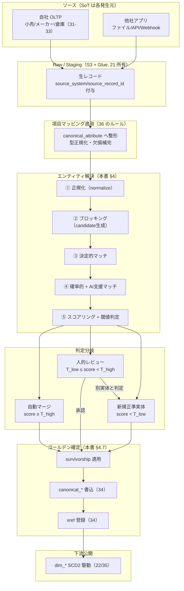

- **SoT の方向（ブリーフ §5）:** ソース側（各 OLTP・他社）が発生源。Canonical DB は**名寄せ解決結果の SoT**であり、正準側から OLTP へは書き戻さない（逆流は不整合の温床）。
- **クロスウォーク（xref）は解決の SoT:** app-local id ⇄ canonical id の対応表は Canonical DB が唯一の権威。
- **人的レビュー**は決定不能ケースのみに絞り、決定的マッチと高スコア自動マージで人手を最小化する（IQ 原則: 手動ステップを残さない）。

---

## 3. 正準エンティティ詳細とクロスウォーク機構

### 3.1 4 正準エンティティと自然キー候補

名寄せの識別に用いる「自然キー候補（match key）」を正準エンティティごとに定義する。物理列は 34 所有のため、ここでは**論理属性と名寄せ用途**を示す。

| 正準エンティティ | 物理テーブル（34 所有・参照のみ） | 強識別子（決定的マッチ用） | 弱識別子（確率的マッチ用） |
|-----------------|--------------------------------|--------------------------|--------------------------|
| Party（取引先） | `canonical_party` + `party_role` | 法人番号（13桁）, 適格請求書登録番号, GLN | 正規化名称, 住所, 電話, 代表者 |
| Location（拠点） | `canonical_location` | GLN, 郵便番号+建物, 施設コード | 正規化住所, 緯度経度, 名称 |
| Product/SKU | `canonical_product` / `canonical_sku` | GTIN/JAN(13/8), 自社正規品番 | 正規化品名, brand+season+type, color+size |
| Region（地域） | `region` | JIS X 0401/0402 コード, 標準地域メッシュ | 地域名（表記ゆれ吸収） |

> 強識別子が一致すれば**決定的マッチ（§4.3）で確定**し、確率的マッチをスキップする。強識別子が欠落するソース（多くの中小レガシー）では弱識別子の確率的マッチ（§4.4）へ回す。

### 3.2 クロスウォーク（xref）機構

xref は「あるソースのあるローカルレコードが、どの正準実体に対応するか」を記録する対応表である。物理定義は 34 所有。本書は**論理構造と不変性ルール**を定義する。

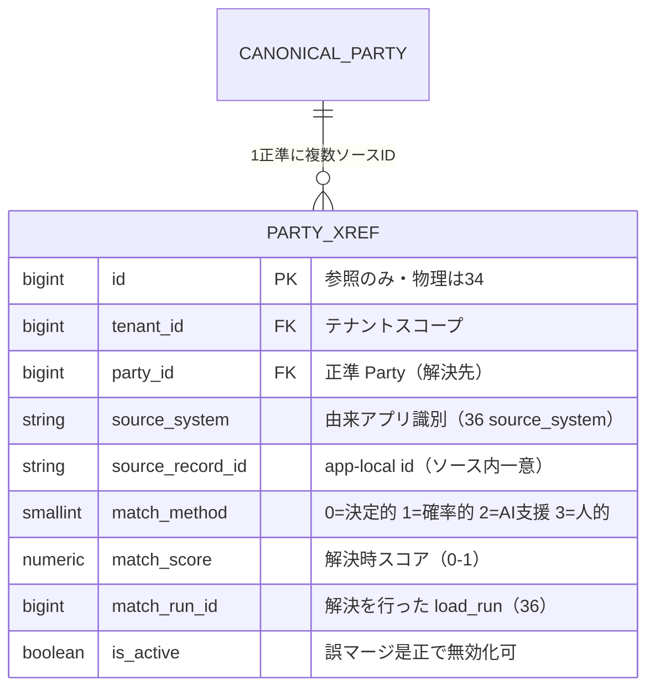

**クロスウォークの不変性・整合ルール:**

1. **一意性:** `uq_party_xref_tenant_source_record`（`tenant_id, source_system, source_record_id`）で、同一ソースの同一ローカル ID は**高々1つの正準実体**に対応する（多重対応を禁止）。逆に 1 正準実体は複数ソース ID を集約できる（1 対多）。
2. **canonical id の安定性:** 一度採番した canonical id（`canonical_*.id = BIGSERIAL`, ブリーフ §9）は**再割当しない**。誤マージ是正（split）でも新 id を切り、旧 id は履歴として残す。下流（dim_* の `*_bk`）が canonical id を参照するため、id の使い回しは分析の破壊につながる。
3. **来歴列（ブリーフ §9）:** すべての xref は `source_system` / `source_record_id` を必須とし、`legacy_id` を補助的に保持する。これにより Raw（21）へのリプレイ・再名寄せが可能。
4. **解決メソッド記録:** `match_method` / `match_score` / `match_run_id` を保持し、後日の監査・再学習（AI 支援マッチの改善）・誤マージ分析に用いる（36 `data_lineage` と連携）。

### 3.3 クロスウォーク解決の状態

app-local レコードが正準実体へ解決されるまでの状態。03 §10.1 の Party 名寄せライフサイクルを、4 エンティティ共通の解決状態として一般化する。

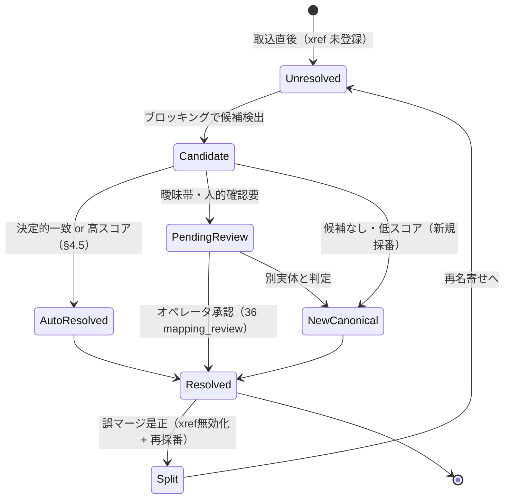

---

## 4. エンティティ解決（名寄せ）詳細

### 4.1 パイプライン 5 ステージ

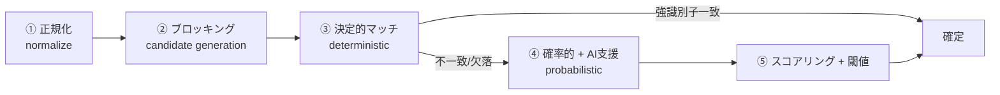

名寄せは**冪等**でなければならない（CLAUDE.md 原則2）。同一入力・同一ルールバージョン・同一正準スナップショットに対して、何度実行しても同じ解決結果を返す。ルール改定時は `mapping_rule.version`（36）を上げ、`match_run_id` に紐付けて「どのルール版で解決したか」を追跡する。

### 4.2 ① 正規化（normalize）

決定的・確率的いずれの前段でも、比較キーは正規化してから使う。正規化は決定的（純関数）であることを保証する。

| 対象 | 正規化ルール | 例 |
|------|-------------|----|
| 全角/半角 | 英数記号は半角、カナは全角へ統一（NFKC 基準） | `ＡＢＣ１２３` → `ABC123` |
| 法人格 | `株式会社`/`(株)`/`㈱` 等を除去または `_KK_` へ正規化し、名寄せ時は除去版で比較 | `(株)しまむら` → `しまむら` |
| 空白・記号 | 前後空白トリム、連続空白を単一化、中黒/ハイフンの表記統一 | `イオン　リテール` → `イオンリテール` |
| 住所 | 都道府県/市区町村/丁目番地を分割、漢数字↔算用数字、ビル名分離 | `東京都渋谷区１−２−３` → 構造化 |
| 電話 | 数字のみ抽出、国番号正規化 | `03-1234-5678` → `0312345678` |
| 品名 | 型番・色・サイズトークンを抽出、記号除去、小文字化 | `スニーカー RED 25.0cm` → tokens |
| 地域名 | 旧字体/新字体、「ケ/ヶ」「が/ヶ」等のゆれ吸収 | `龍ケ崎` ↔ `竜ヶ崎` |

> **法人番号・GTIN の桁検証:** 法人番号（13桁チェックデジット）、JAN/EAN（モジュラス10）を検証し、不正桁は強識別子から除外する（誤った決定的マッチを防ぐ）。検証失敗は `CMN-002`（必須属性欠落相当）ではなく `MAP-005`（識別子妥当性エラー、§9）として弱識別子側にフォールバックする。

### 4.3 ③ 決定的マッチ（deterministic）

強識別子（§3.1）の完全一致で確定する。人手不要・高信頼のため**最優先**で評価し、一致すれば確率的マッチをスキップする。

| エンティティ | 決定的マッチキー（優先順） | 一致時の扱い |
|-------------|--------------------------|-------------|
| Party | 法人番号 → 適格請求書登録番号 → GLN | `match_method=0`, `match_score=1.0`, 即 `AutoResolved` |
| Location | GLN → 施設コード → 郵便番号+正規化建物名 | 同上 |
| Product/SKU | GTIN/JAN → テナント内正規品番（`uq(tenant_id, code)`） | 同上 |
| Region | JIS X 0401/0402 コード → 標準地域メッシュコード | 同上（§5） |

- **テナントスコープ厳守:** 決定的マッチも**テナント境界内でのみ**成立させる（`tenant_id` を必ず条件に含める）。テナント跨ぎの名寄せは禁止（RLS 前提、ブリーフ §6）。共通地域（Region）のテナント共有可否は §5.5 / 未決事項。
- **決定的マッチの索引要求:** 34 に対し、強識別子列への部分一意索引（例: 法人番号が非 NULL の行に対する `uq`）を要求する。

### 4.4 ④ ブロッキング + 確率的 / AI 支援マッチ

強識別子が無い/一致しない場合、弱識別子で確率的に照合する。全件総当たり（O(n²)）を避けるため**ブロッキング**で候補を絞る。

#### 4.4.1 ② ブロッキング（候補生成）

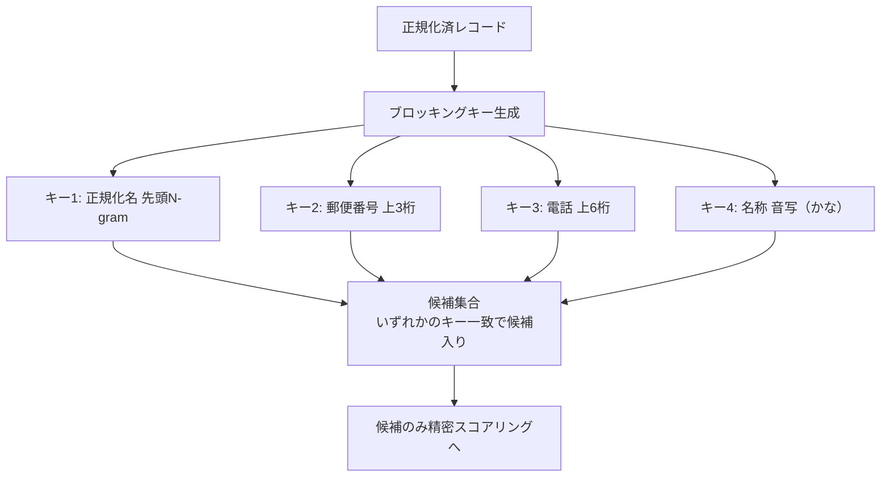

- **複数ブロッキングキーの OR 結合**で再現率（recall）を確保しつつ、各キーで候補数を抑える。
- ブロッキングキーは正準側に事前計算・索引化しておく（34 へ「ブロッキングキー列 + 索引」を要求）。
- 候補が閾値（例: 200 件）を超えるブロックは、追加キーで再分割し肥大化を防ぐ。

#### 4.4.2 確率的マッチ（文字列類似度）

弱識別子ごとに類似度を算出し、重み付き合成する。

| 属性 | 類似度関数 | 重み(例, Party) | 備考 |
|------|-----------|----------------|------|
| 正規化名称 | Jaro-Winkler + トークン Jaccard の最大値 | 0.45 | 前方一致に強い JW と語順非依存の Jaccard を併用 |
| 住所 | 構造化住所の階層一致（都道府県→番地）加重 | 0.25 | 丁目まで一致で高得点 |
| 電話 | 完全一致=1, 局番一致=0.4 | 0.15 | 代表電話は共有され得るため過信しない |
| 代表者/担当 | 正規化名 Jaro-Winkler | 0.05 | 補助 |
| AI 埋め込み類似（§4.4.3） | コサイン類似 | 0.10 | 表記大幅ゆれ・略称の救済 |

合成スコア `score = Σ(wᵢ × simᵢ)`（Σwᵢ = 1）。重みはエンティティ別・テナント別にチューニング可能とし、`mapping_rule`（36）にバージョン管理して保存する。

#### 4.4.3 AI 支援マッチ（埋め込み類似）

表記の大幅なゆれ・略称・語順入替（例: 「イオンリテール」と「AEON RETAIL」）は文字列類似度で拾いにくい。ここで **Bedrock 埋め込み（Titan/Cohere, ブリーフ §4/§12）** による意味的類似を補助信号として用いる。

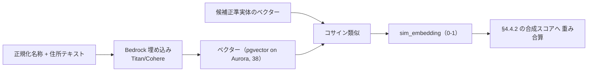

- **ガードレール（ブリーフ §12）:** 埋め込み検索は**テナントスコープ厳守**。RAG 用途の `kb_embedding`(pgvector) を名寄せ用途に流用せず、名寄せ専用の埋め込みインデックスを別管理とする（用途混在を避ける。共用/分離の最終決定は未決事項 §10-4）。
- **名寄せ用埋め込みインデックスの物理所有:** 分離採用時も、名寄せ専用の埋め込み（ベクター物理格納）の**物理所有は 38（AI/ベクター/ナレッジ）**に置き（`kb_embedding` と同じ pgvector 基盤上に別テーブル/別コレクションとして仮置き。運用集約の観点。代替として 23 側で管理する選択肢も §10-4 で併記）、テーブル所有マップ（ブリーフ §14）の欠落を作らない。本書は名寄せに必要な**論理要件**（テナントスコープ、モデル ID/バージョンの追跡、コサイン類似の一信号としての利用）を提示し、物理スキーマは 38（分離時）を参照する。**34 所有の正準列（`canonical_*`）とは混線させない**（名寄せ用ベクターはゴールデン属性ではなく、正準実体の物理列に埋め込みを持たせない）。
- **決定は数値で、生成は AI に委ねない:** LLM に「同一か否か」を**最終判定させない**。埋め込みは類似度スコアの一信号にとどめ、閾値判定（§4.5）は決定的な数値ルールで行う。ハルシネーション抑制の原則（ブリーフ §12）に従う。
- **AI 支援の可監査性:** `match_method=2`（AI 支援）で記録し、埋め込みモデル ID・バージョンを `match_run_id` 経由で追跡する。

### 4.5 ⑤ スコアリングと閾値判定

合成スコアを 2 閾値で 3 分岐する。

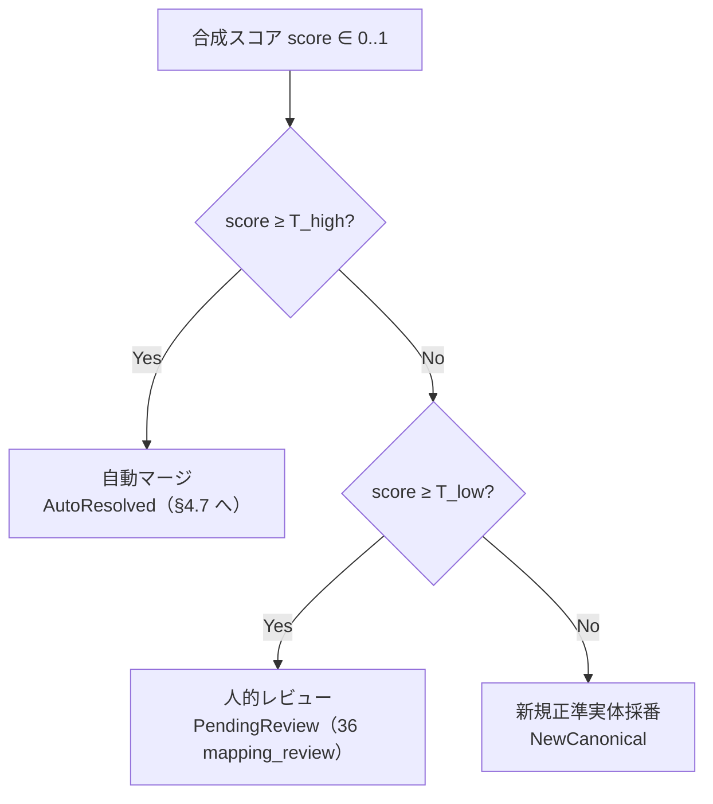

| パラメータ | 既定（初期） | 意味 | 調整方針 |
|-----------|-------------|------|----------|
| `T_high` | 0.92 | これ以上は自動マージ | 誤マージ（false merge）を許容しない業務は上げる |
| `T_low` | 0.75 | これ未満は新規採番 | 見逃し（false split）を嫌う業務は下げてレビューに回す |
| レビュー帯 | [0.75, 0.92) | 人的確認へ | 帯を広げると人手増・精度向上 |

- **複数候補が高スコア:** 2 件以上が `T_high` を超える場合は自動マージせず `PendingReview`（`MAP-002` 複数一致）へ回す。自動での恣意的タイブレークをしない。
- **閾値はテナント/エンティティ別:** `mapping_rule`（36）に保存し、運用でチューニング可能。変更は版管理し、過去解決の再現性を保つ。
- **評価指標:** 名寄せ品質は precision（自動マージの正確さ）/ recall（取りこぼしの少なさ）で監視し、レビュー結果を正解データとして閾値・重みを見直す（36 `mapping_review` を教師信号に）。

### 4.6 生存規則（survivorship）

複数ソースのレコードを 1 正準実体へ束ねる際、**属性ごとに**どのソース値を採用するかを決める規則。全属性を単純に「最新ソース優先」にすると、信頼度の低いソースが良質な値を上書きする事故が起きる。

| 生存規則 | 説明 | 適用属性の例 |
|---------|------|-------------|
| ソース優先度（source priority） | ソースに信頼度ランクを付与し高い方を採用 | 正式名称（法定書類ソース優先） |
| 最新性（recency） | `updated_at` が新しい値を採用 | 住所・電話・ステータス |
| 完全性（completeness） | 非 NULL・より詳細な値を採用 | 郵便番号+建物、住所階層 |
| 最頻値（most frequent） | 複数ソースで多数を占める値を採用 | 表記ゆれのある名称 |
| 決して上書きしない（no-overwrite） | 一度確定した強識別子は保護 | 法人番号・GTIN |

- **属性単位の provenance 保持:** ゴールデンレコードの各属性について「どのソース・どの xref・いつ・どの規則で採用したか」を保持する（34 のゴールデン列 + 36 `data_lineage`）。これにより「なぜこの正準値になったか」を逆引きできる（監査・信頼性）。
- **規則はエンティティ別に構成:** 例えば Party 正式名称は「ソース優先度」、住所は「最新性 + 完全性」の合成。規則セットは `mapping_rule`（36）にバージョン管理。
- **記録系の保護（CLAUDE.md 原則2）:** 名寄せ再実行で確定済みの人的レビュー結果・split 履歴を巻き戻さない。survivorship はゴールデン**属性値**を再計算するが、xref の解決履歴・レビュー承認は保護する。

### 4.7 ゴールデンレコード生成

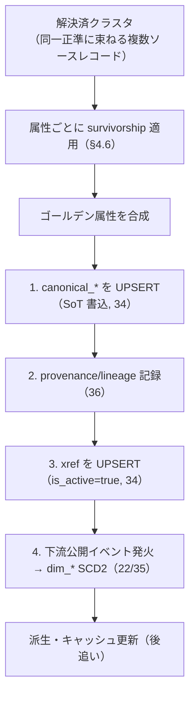

**書込順序（ブリーフ §5 / CLAUDE.md 原則6: SoT 先行）:**
1. **canonical_\*（ゴールデン, SoT）**を先に書く。
2. **provenance / lineage（36）**を記録。
3. **xref（解決の SoT）**を確定。
4. **下流（dim_\*）**へ公開イベントを発火（後追い・非同期）。派生の失敗が SoT 書込をブロックしない（原則4: 非ブロッキング）。

- **ゴールデン改定 → SCD2 の契約:** ゴールデン属性が変化したら、DWH 側 `dim_product`/`dim_customer` 等の SCD Type2（valid_from/valid_to/is_current/row_hash）で履歴化する（22/35 所有）。本書は「ゴールデン変化を検知して公開する」責務、22 は「dim へ反映する」責務。
- **分割（split）:** 誤マージ検出時は当該 xref を `is_active=false` にし、切り出す実体へ**新 canonical id を採番**、下流へ split イベントを公開する（`MAP-003`）。旧 id は再利用しない（§3.2 不変性）。

---

## 5. Region 動的粒度階層の詳細と粒度切替

### 5.1 単一自己参照階層 + level 属性（03 §6 の実装）

地域は「都道府県テーブル」「市区町村テーブル」と固定分割せず、**単一 `region` エンティティ（34 所有）の `level` 付き自己参照階層**で表す。動的粒度切替を可能にするための設計判断（03 §6.1）。

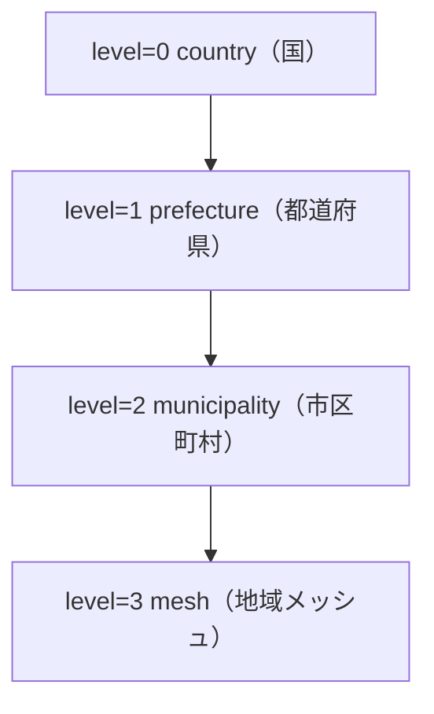

| level | 粒度 | 標準コード（推奨） | 用途 |
|-------|------|-------------------|------|
| 0 | country（国） | ISO 3166-1 | 海外生産/輸入分析 |
| 1 | prefecture（都道府県） | JIS X 0401 | 全国メーカーの標準粒度 |
| 2 | municipality（市区町村） | JIS X 0402 | 中規模小売の商圏分析 |
| 3 | mesh（地域メッシュ） | JIS X 0410 標準地域メッシュ | 大規模小売の高解像度商圏 |

### 5.2 階層構築と整合性検証

- **親子整合:** `parent_region_id` の指す親は必ず `level - 1`（隣接段のみ許可、段飛ばし禁止）。CHECK 相当のロジックを名寄せ/取込時に検証（`CMN-004` 循環参照、`MAP-006` 階層不整合）。
- **循環検出:** parent チェーンを辿り自分に戻るループを禁止（`CMN-004`）。取込時に閉路検出を行う。
- **コード → 階層解決:** ソースが「市区町村コード（JIS X 0402, 5桁）」のみ持つ場合、上位 2桁から都道府県（JIS X 0401）を導出して親を自動補完する（決定的解決）。

### 5.3 地域名の名寄せ（表記ゆれ吸収）

標準コードを持たないソース（住所文字列のみ）は、正規化住所（§4.2）から地域を**決定的に解決**する。解決不能な表記ゆれ（「龍ケ崎/竜ヶ崎」等）は確率的マッチで救済する。

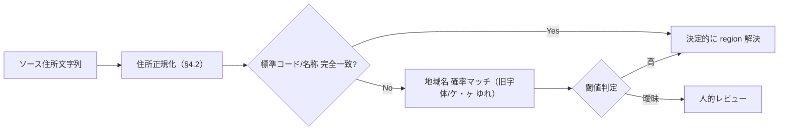

### 5.4 商圏規模による粒度切替ロジック

クライアント（テナント）の商売規模に応じ、**分析の既定粒度**を切り替える。`region` 階層は常に最深段（可能なら mesh）まで保持し、集計側で roll-up する。切替は「どの level を分析の既定表示粒度にするか」の選択であり、階層データ自体を削らない。

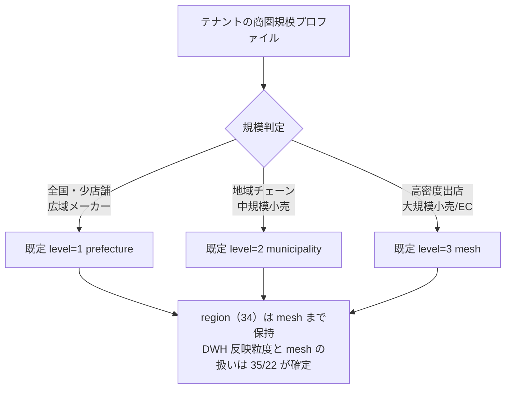

| 商圏規模プロファイル | 既定分析粒度 | 判定根拠（例） |
|--------------------|-------------|--------------|
| 広域・少拠点（全国メーカー） | prefecture | 拠点数 < 閾値かつ全国分散 |
| 地域チェーン（中規模小売） | municipality | 特定都道府県に拠点集中 |
| 高密度（大規模小売/EC） | mesh | 拠点密度 or 会員住所密度が高い |

- **プロファイルの保持:** テナントの既定粒度は Control Plane（37）のテナント設定 or SI カスタマイズ（27）で保持する（本書は切替ロジックの契約を定義、値の保管は 37/27）。
- **粒度の非破壊性:** 既定粒度を下げても（prefecture へ）、mesh データを削除しない。将来の規模拡大で再度深掘りできる（CLAUDE.md 原則2/7: データ保護・下位互換）。
- **roll-up は DWH 側:** 実際の集計 roll-up は `dim_region` の階層属性（35）とメトリクス層で行う。本書は「動的粒度を実現する階層構造」を正準側 `region`（34）で保証するにとどめる。
- **dim_region の粒度範囲は 35 が SoT:** ブリーフ §8 のスタースキーマ・カタログでは `dim_region` は `country/prefecture/municipality`（動的粒度）と定義され、**mesh（level=3）は現時点で `dim_region` の対象外**である。したがって「正準 `region` が mesh まで保持する」ことと「`dim_region` が mesh 行を保持する」ことは同一ではない。大規模小売の mesh 粒度分析を DWH 側でどう成立させるか（`dim_region` に mesh を含めるか、別次元/別テーブルで扱うか）は **35（`dim_region` 所有）/ 22（変換契約）が確定**する。本書は「正準 `region` が mesh まで動的粒度を保持する」論理要件を提示するのみで、`dim_region` の粒度範囲を断定しない（未決事項 §10-2 の地域コード標準準拠、§10-6 の split 時 dim 再処理と連動）。

### 5.5 Region のテナント共有 vs スコープ

標準地域（JIS コードの都道府県・市区町村）は全テナントで不変・共通のため重複保持は無駄だが、テナント境界厳格化（RLS 一貫）とはトレードオフ。ハイブリッド案（標準地域は共有マスタ、テナント固有の商圏定義はスコープ）を第一候補とする（03 §15-2 と整合、確定は 34/11）。未決事項 §10-1。

---

## 6. Product 正準化

### 6.1 多様な商品コード体系の吸収

ソースごとに異なる商品識別体系を、正準 `canonical_product`（企画）/ `canonical_sku`（SKU, 34 所有）へ束ねる。

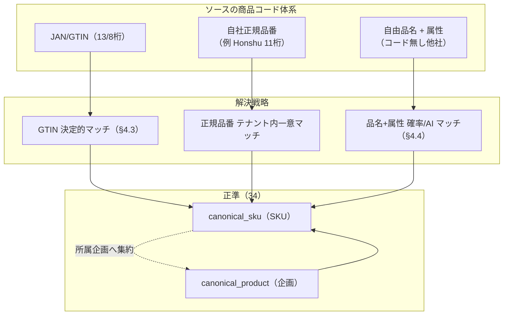

- **GTIN 優先:** JAN/GTIN があれば決定的マッチで SKU を確定（最も信頼できる）。
- **正規品番:** テナント内 `uq(tenant_id, code)` で一意なら決定的。ただし**コード体系はソース固有**なのでテナント跨ぎでは使えない。
- **コード無し（他社の自由記述）:** 品名トークン + brand/season/type/color/size の属性合成で確率的/AI 支援マッチ（表記ゆれの多い実務データの主戦場）。

### 6.2 Honshu 11 桁品番の写像

Honshu の 2 層商品（`product_families`/`products`, 32 所有）と 11 桁品番は、正準 Product/SKU の**一実装**である。桁構成ルール自体はメーカー固有知識であり**共有カーネルに持ち込まない**（03 §7.3）。正準側は「企画・SKU の粒度と正準識別子」だけを持ち、xref で対応づける。

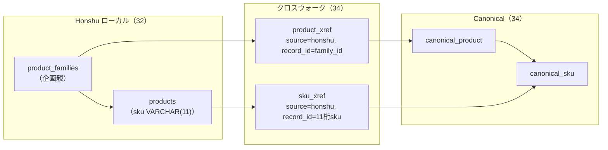

11 桁品番の桁ソース（Honshu マスタ仕様 §3.2）→ 正準属性の写像。桁構成の詳細ソースは 03 §7.3 が定義、本書は「正準属性へどう積むか」を実装観点で整理する。

| 11桁の桁 | Honshu ソース | 正準写像先（canonical_*） | 名寄せ寄与 |
|----------|--------------|--------------------------|-----------|
| 1桁目（年式） | コードロジック（`planned_year_code`） | `canonical_product.season` の年次要素 | 弱（属性） |
| 2桁目 | `product_types.item_conversion_code` | `canonical_product.product_type` | 弱 |
| 3桁目 | `product_seasons.item_conversion_code` | `canonical_product.season` | 弱 |
| 4-6桁目 | `product_families.sequence_no` | `canonical_product.family_code` 連番部 | 中（企画識別） |
| 7桁目 | `suppliers.item_conversion_code`（工場） | 発注側 supplier Party へ関連づけ（Product 属性にしない） | — |
| 8-9桁目 | `colors.item_conversion_code` | `canonical_sku.color` | 弱 |
| 10-11桁目 | `sizes.item_conversion_code` 由来 | `canonical_sku.size` | 弱 |

> **写像の非可逆性（03 §7.3 と整合）:** 正準 SKU から 11 桁を**一意に再構築することは保証しない**（`item_conversion_code` の逆変換を共有カーネルに持たない）。ローカル品番の SoT は 32、正準側は `sku_xref` の対応関係のみを SoT とする。決定的マッチには**正規化済み 11 桁品番そのもの**を強識別子（テナント内一意）として使い、桁分解には依存しない。

### 6.3 カテゴリ階層マッピング

ソースの多様な分類（Honshu の `product_group`/`department`, 他社の任意カテゴリツリー）を、正準 `product_category`（自己参照階層, 34 所有）へ写像する。

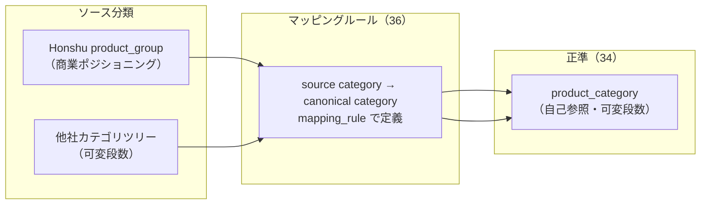

- **段数非対称の吸収:** ソースが 3 段、正準が 4 段のように段数が異なる場合、`mapping_rule`（36）でソースカテゴリを正準の適切な level ノードへ対応づける。未マップは「未分類」正準ノードへ退避し、人的レビュー（36 `mapping_review`）で解消（`MAP-004` 分類未解決、§9）。
- **循環検出:** `product_category` の parent ループは `CMN-004` で拒否（Region と共通ロジック）。
- **Honshu の `product_group`:** 「衣料カテゴリではなく商業ポジショニング」（Honshu マスタ仕様 §2.9）である点に注意。純粋な商品分類（category）とは軸が異なるため、`product_category` へ機械的に写像せず、ポジショニングは別属性/タグとして保持する設計を推奨（未決事項 §10-3）。

---

## 7. MDM 運用

### 7.1 新規ソース追加時の名寄せフロー（sequenceDiagram）

他社アプリ（または新規自社テナント）を初めて連携する際の、取込〜正準化〜下流公開の一連のシーケンス。人的レビューと SoT→Canonical 書込順序を明示する。

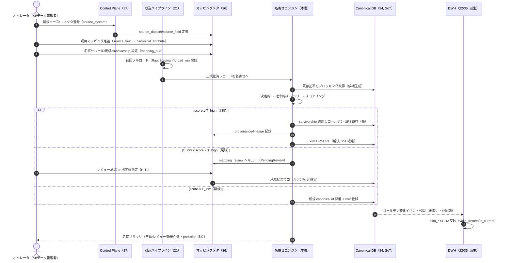

- **書込順序の厳守（5〜9行目, 10〜12行目）:** ゴールデン（SoT）→ lineage → xref → 下流公開の順。下流公開は非同期で、失敗しても SoT はロールバックしない（非ブロッキング, 原則4）。
- **HITL（Human-in-the-loop）:** 曖昧帯のみオペレータへ。承認結果は `mapping_review`（36）に記録し、閾値/重みの再学習の教師信号とする。
- **初回フルロード後は増分:** 以降は CDC/Webhook イベント（§8.2）で増分名寄せ。

### 7.2 人的レビューの運用

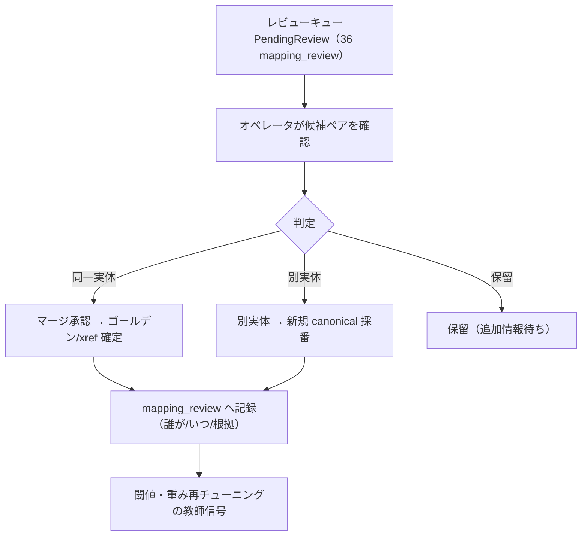

- **提示情報:** 候補ペアのスコア内訳（属性別 sim）、provenance、両レコードの原文リンク（Raw, 21）を提示し、判断根拠を可視化する（U 原則: 出力の直感性）。
- **モバイル対応（CLAUDE.md 原則8）:** レビュー UI は PC のペア比較テーブルに加え、モバイルではカード型（左右比較を縦積み）で可読性を確保する（実装は該当 UI ドキュメント/27 と連携）。
- **監査性:** 承認/却下は誰が・いつ・どの根拠で行ったかを `mapping_review` に append-only で記録（改竄防止, ブリーフ §5 監査ログ方針と整合）。

### 7.3 SoT → Canonical 書込順序（再掲・要点）

CLAUDE.md 原則6・ブリーフ §5 の徹底。誤順序は同期バグの温床。

| 順 | 対象 | ストア | 理由 |
|----|------|--------|------|
| 1 | ソース書込 | 各 OLTP / Raw（SoT） | 発生源が権威 |
| 2 | ゴールデン UPSERT | Canonical DB（34, SoT of 名寄せ結果） | 解決結果の権威を先に確定 |
| 3 | provenance/lineage | 36 | 「なぜこの値か」を記録 |
| 4 | xref UPSERT | 34（解決 SoT） | 対応表を確定 |
| 5 | 下流公開 | DWH dim_*（派生, 後追い） | SoT 確定後に非同期反映 |

---

## 8. データフロー整合性と SoT 宣言

### 8.1 SoT マップ（本書が扱うデータ）

ブリーフ §5 準拠。CLAUDE.md 原則6。

| データ | SoT | 派生/キャッシュ | 同期方向 |
|--------|-----|----------------|----------|
| 各アプリのローカルエンティティ（商品/取引先/拠点/取引） | 各 OLTP（31-33）/ Raw（21） | — | 発生元が権威 |
| ゴールデンレコード（正準属性） | Canonical DB（34） | OLTP から名寄せ派生 | OLTP → 名寄せ → Canonical（一方向） |
| クロスウォーク（app-local id ⇄ canonical id） | Canonical DB（34） | — | 名寄せ解決の SoT |
| 名寄せルール/閾値/survivorship 設定 | `mapping_rule`（36） | — | 定義が SoT・版管理 |
| 人的レビュー記録 | `mapping_review`（36） | — | append-only・記録系保護 |
| 解決 provenance/lineage | `data_lineage`（36） | — | 記録系 |
| 適合次元 dim_*（分析用） | 派生（Canonical/Raw 由来, 35） | ○ | Canonical → DWH（一方向） |
| 名寄せ用埋め込みベクター | 派生（正規化名/住所由来） | ○ | 原文変化で再生成 |

### 8.2 同期パス — イベント受信 + 手動再同期の両建て

CLAUDE.md 原則6-変更時確認2/3。片方だけでは欠落が起きる。

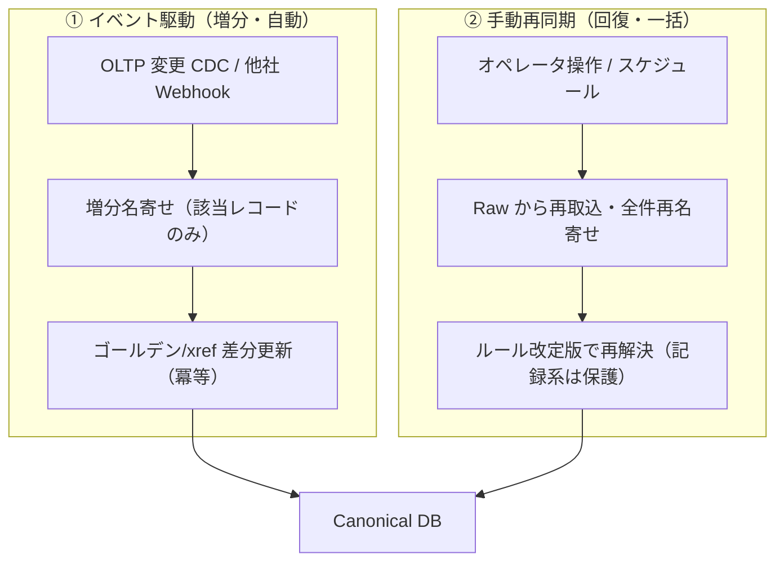

- **イベント駆動（主）:** OLTP の CDC / 他社 Webhook で変更レコードのみ増分名寄せ。冪等キー（`Idempotency-Key`, ブリーフ §11）で重複イベントを吸収。
- **手動再同期（回復パス）:** Raw（21, リプレイ可能）から全件再名寄せ。ルール/閾値を改定した際の再解決、イベント取りこぼしの回復に用いる。**再実行しても人的レビュー承認・split 履歴は保護**（原則2）。
- **冪等性の担保:** 名寄せは「同一入力 + 同一ルール版 + 同一正準スナップショット」で決定的。`match_run_id` にルール版・モデル版を刻み、再現可能にする。

### 8.3 冪等性チェックリスト（Push 前・CLAUDE.md 準拠）

| 問い | 本書での担保 |
|------|-------------|
| 2 回実行で既存データが壊れないか | xref は UPSERT・一意制約で重複防止。ゴールデンは決定的合成で同値収束 |
| 記録系が巻き戻らないか | `mapping_review`/`data_lineage` は append-only・再名寄せで保護 |
| 補助処理失敗が主フローを止めないか | 下流公開・埋め込み再生成は非同期・非ブロッキング（原則4） |
| SoT → 派生の順序 | ゴールデン→lineage→xref→dim の順（§7.3） |

---

## 9. 想定エラーコード

ブリーフ §10、`DOMAIN-NNN` 形式。本書の名寄せ・正準化・地域/商品処理で発生しうる想定エラー。既存コード（03 §13）を継承し、本書固有を追加する。

| コード | 意味 | 発生箇所 | 主所有 |
|--------|------|----------|--------|
| MAP-001 | クロスウォーク解決失敗（app-local id に対応する正準未確定） | 名寄せ/取込 | 20/36 |
| MAP-002 | 名寄せ候補が複数一致し自動解決不能（人的レビュー要） | スコアリング §4.5 | 20/36 |
| MAP-003 | 誤マージ検出（split 要求） | ゴールデン是正 §4.7 | 20 |
| MAP-004 | 商品分類マッピング未解決（未分類退避） | カテゴリ写像 §6.3 | 20/36 |
| MAP-005 | 強識別子の妥当性エラー（法人番号/GTIN チェックデジット不正） | 正規化 §4.2 | 20 |
| MAP-006 | 地域階層の不整合（親 level 不連続・段飛ばし） | Region 構築 §5.2 | 20/34 |
| MAP-007 | ブロッキング候補過多（ブロック肥大で再分割要） | 候補生成 §4.4.1 | 20 |
| CMN-001 | テナントスコープ違反（tenant_id 不一致の名寄せ試行） | 全処理 | 11/37 |
| CMN-002 | 正準必須属性欠落（canonical_name/level 等） | ゴールデン検証 | 34 |
| CMN-003 | 不正な列挙値（role/location_type/match_method が CHECK 範囲外） | 検証 | 34 |
| CMN-004 | 階層の循環参照（Region/ProductCategory の parent ループ） | 階層検証 §5.2/§6.3 | 20/34 |
| ETL-001 | 写像元 source_system/source_record_id の欠落 | 取込 | 21/36 |

---

## 10. 未決事項 / 論点

| # | 論点 | 選択肢とトレードオフ | 委譲先 |
|---|------|---------------------|--------|
| 1 | Region をテナント共有にするか、スコープにするか | 共有=標準地域の重複排除・コード一元化／スコープ=RLS 一貫・境界厳格。標準地域は共有・商圏定義はスコープのハイブリッドが第一候補（03 §15-2） | 34 / 11 で確定 |
| 2 | 地域コードの標準準拠（JIS X 0401/0402/0410 vs 独自 vs ISO 3166） | 標準=外部データ結合容易／独自=既存資産流用。mesh は JIS X 0410 採用可否 | 34 で確定 |
| 3 | Honshu `product_group`（商業ポジショニング）の正準表現 | `product_category` へ写像＝分類軸と混線／別タグ属性化＝軸分離だが正準属性増。ポジショニングは分析上重要 | 20 継続 / 34 |
| 4 | 名寄せ用埋め込みインデックスを 38 の `kb_embedding` と共用するか分離するか | 共用=基盤集約・運用簡素／分離=用途混在回避・チューニング独立。テナント境界ガードレールは双方必須 | 23 / 38 で確定 |
| 5 | 閾値 `T_high`/`T_low` と属性重みの初期値・自動学習の可否 | 固定初期値＋手動チューニング（初期）／レビュー結果からの自動再学習（将来）。過学習・再現性リスク | 20 継続（PoC 実測後） |
| 6 | 誤マージ split 時の下流影響（dim_* の既存 fact 参照の付け替え） | canonical id 再採番で fact の dim FK 再解決要。22 の再処理契約と連動 | 22 / 35 で確定 |
| 7 | AI 支援マッチの最終判定への関与度 | 補助信号のみ（本書採用・ハルシネーション抑制）／LLM 判定併用（recall 向上だが可監査性低下） | 20 / 23 |
| 8 | Party 階層（親会社-子会社-事業所）を名寄せ対象に含めるか | 含める＝グループ分析可だが名寄せ複雑化／含めない＝単純だがグループ集計は別途 | 34 / 03 §15-5 と連動 |

---

## 関連ドキュメント

- [基本設計: 正準ドメインモデル](../basic-design/03-canonical-domain-model.md)（03） — 本書の上位。概念・論理モデル・状態遷移の出所。本書はその名寄せライフサイクル（03 §10.1）を実装展開する。
- [データベース設計: MDM/Canonical スキーマ](../database-design/34-mdm-canonical-schema.md)（34） — 本書が扱う正準エンティティ・xref の**物理所有**。索引/RLS/制約の確定先。
- [詳細設計: 取込とマッピングパイプライン](./21-ingestion-and-mapping-pipeline.md)（21） — Raw/Staging・項目マッピング適用・名寄せ起動ステージの実装。
- [データベース設計: マッピングメタデータ](../database-design/36-mapping-metadata-schema.md)（36） — `mapping_rule`/`mapping_review`/`load_run`/`data_lineage` の物理所有。名寄せルール・レビュー・来歴の記録先。
- [詳細設計: スタースキーマ変換](../detailed-design/22-star-schema-transformation.md)（22） — ゴールデン改定 → `dim_*` SCD2 反映の下流契約。
- [データベース設計: スタースキーマ DWH](../database-design/35-star-schema-dwh.md)（35） — 適合次元・ファクトの物理所有。
- グラウンディング: [Honshu マスタ仕様](../../../.ai-native/domain-context/industry/honshu-master-schema.md)（17/18 マスタ・11桁品番・item_conversion_code）
