# 詳細設計: 取込 & 項目マッピングパイプライン

本書は **SCIP（Supply Chain Intelligence Platform、コード名。正式名称は未確定）** における
**取込（Ingestion）・項目マッピング（Mapping）・変換（Transform / ELT）** の**詳細実装ロジック**を定義する。
基本設計（[10 データ連携と項目マッピング](../basic-design/10-data-integration-and-mapping.md)）が確立した
「二系統モデル・取込方式カタログ・人が解決し機械が適用する責務分離・DQ/冪等/来歴/リプレイの方針」を土台に、
**コネクタの実行モデル・Raw ランディングの物理レイアウト・マッピング DSL と変換式言語・変換ジョブのオーケストレーション（Glue/Step Functions/EventBridge）・
DQ 評価エンジン・冪等キーの計算方法・リカバリ手順**を、実装可能な粒度まで落とし込む。

> **位置づけ / 所有範囲（ブリーフ §14 テーブル所有マップ準拠）:**
> 本書は**取込・マッピング・変換の「詳細ロジック」を権威的に所有する**（コネクタ実行モデル、Raw/Staging 物理レイアウトとパーティション、
> スキーマ推定手順、マッピング DSL / 変換式言語の文法、変換ジョブのステートマシン、DQ 評価エンジン、冪等キー計算、リプレイ/リカバリ手順、
> 人的マッピング UX の画面設計）。以下は**参照するが再定義しない**:
> - **マッピングメタデータの物理スキーマ**（`source_system`/`source_dataset`/`source_field`/`canonical_attribute`/`mapping_rule`/
>   `transform_expression`/`dq_rule`/`load_run`/`data_lineage`/`mapping_review` の CREATE TABLE）は
>   [36 マッピングメタデータスキーマ](../database-design/36-mapping-metadata-schema.md)が所有。本書は**論理構造と使い方**のみ示す。
> - **Canonical → dim/fact の変換（SCD Type2・サロゲートキー採番・ロード）** は
>   [22 スタースキーマ変換](./22-star-schema-transformation.md)が所有。本書は**Canonical 手前まで**（Raw → Canonical への正準化入力の整備）を主担当とする。
> - **名寄せ / ゴールデンレコード / クロスウォーク解決**は
>   [20 Canonical/MDM/名寄せ](./20-canonical-mdm-and-entity-resolution.md)、物理は [34 MDM/Canonical スキーマ](../database-design/34-mdm-canonical-schema.md)が所有。
> - **物理 dim/fact** は [35 スタースキーマ DWH](../database-design/35-star-schema-dwh.md)、
>   **コネクタ登録テーブル**（`connector`/`connector_config`）は [37 コントロールプレーン](../database-design/37-control-plane-backoffice-schema.md)が所有。
> - **ETL/MAP エラーコードの権威的レジストリ**は基本設計 [10 §8](../basic-design/10-data-integration-and-mapping.md) が所有。本書は各コードの**送出箇所とリカバリ手順**を具体化する。

---

## 1. パイプライン全体アーキテクチャ

取込〜変換は **メダリオン構成（Bronze/Silver/Gold）** をブリーフ §3 Data Plane の各層に対応づける。
各層は**独立にリプレイ可能**で、上流（SoT/Raw）から下流（DWH）へ一方向にのみデータが流れる（逆流禁止, ブリーフ §5）。

| メダリオン層 | ブリーフ Data Plane | 物理ストア | 本書の担当 | 所有 |
|---|---|---|---|---|
| **Bronze** | Raw/Staging（取込生データ・不変） | S3(Parquet/JSON) + Glue Catalog | ◎ 主担当 | 本書（レイアウト） |
| **Silver** | Canonical/MDM（名寄せ済 正準） | Aurora/RDS PostgreSQL | ○ 正準化入力の整備まで | 20/34（名寄せ本体） |
| **Gold** | Star Schema DWH（dim/fact） | Redshift Serverless | △ トリガのみ | 22/35 |

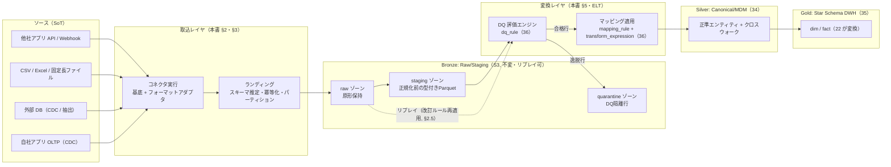

> **設計の肝:** 変換レイヤ（DQ + マッピング適用）が読むのは **Bronze の staging ゾーン**であり、`raw` ゾーンは**一切書き換えない**。
> これにより、マッピング改訂・変換バグ修正・DQ ルール更新のいずれが起きても **raw を源泉に完全再生成**できる（ブリーフ §5 / 原則2・原則6）。

---

## 2. コネクタフレームワークとソース登録

### 2.1 コネクタの構造モデル

コネクタは「新規ソースごとにコードを書かない」（基本設計 §2.2 / ブリーフ原則3）を実装レベルで担保するため、
**取得プロトコルの基底（Base）× フォーマットアダプタ（Adapter）× ソース設定（Config）** の直交する 3 要素で構成する。

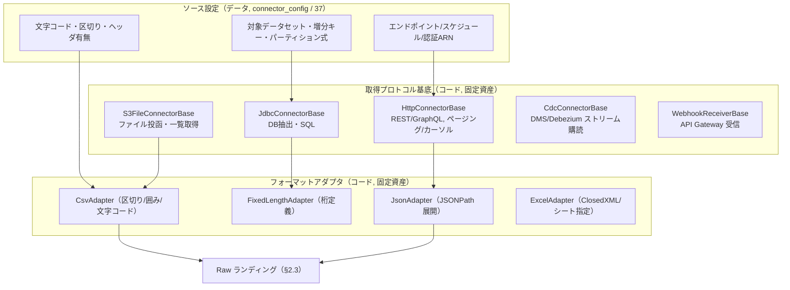

- **基底とアダプタはコード資産**（`Microsoft.NET.Sdk` クラスライブラリ。ブリーフ §4 の継承スタック。`Microsoft.Extensions.*` は明示 `using` 必須 — CLAUDE.md 技術スタック確認ポイント）。
- **ソース固有差分はすべて `connector_config`（37 所有）に設定として吸収**し、コード変更なしで新規ソースを追加できる（原則1「手動ステップを残さない」）。
- 認証情報は **Secrets Manager + KMS**（ブリーフ §5）に格納し、`connector_config` は **ARN 参照のみ**保持（平文資格情報をテーブル/リポジトリに置かない）。

### 2.2 ソース登録シーケンス

新規ソースの立ち上げは **Control Plane（バックオフィス）** の宣言的登録で完結させ、手動デプロイを挟まない。

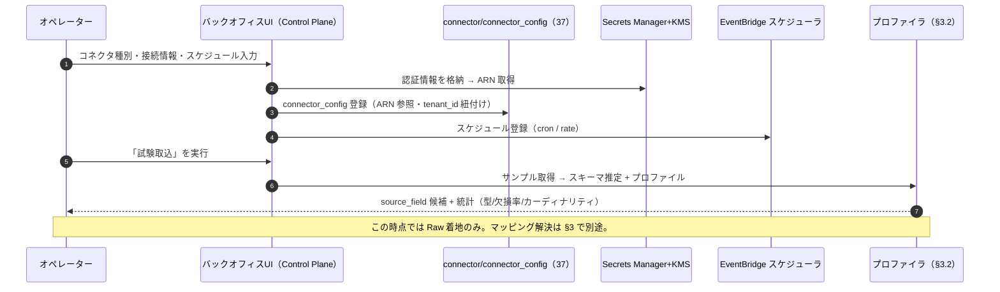

### 2.3 コネクタ実行の状態遷移とリトライ

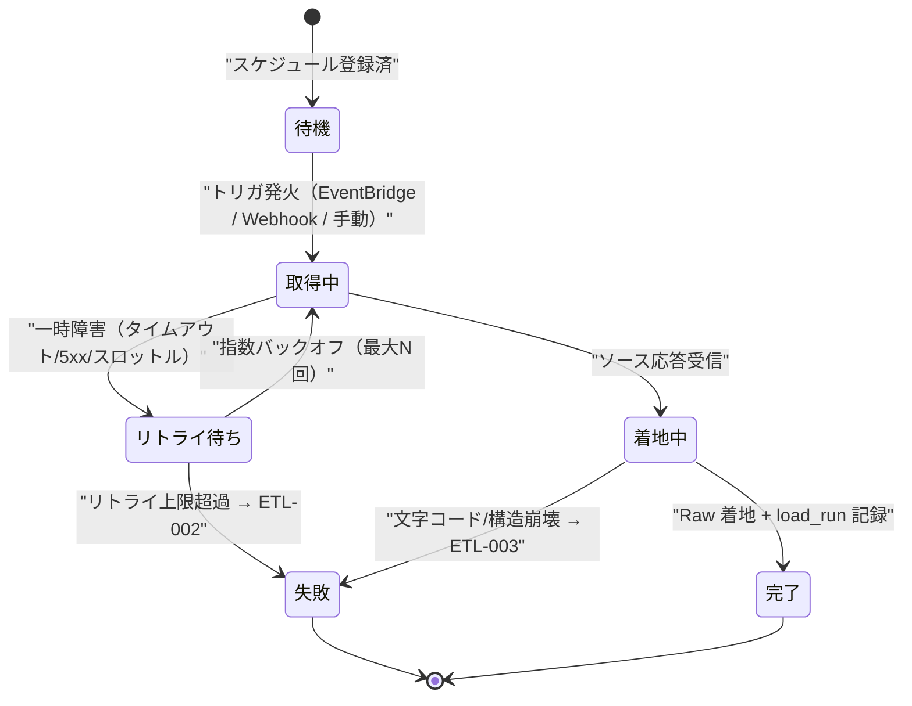

- **リトライは冪等前提**（§4.1 の冪等キー）。同一 `load_run` の再試行が二重ロードを生まないため、一時障害は安全に自動リトライできる。
- **バックオフ:** 指数バックオフ + ジッタ。上限超過で `ETL-002`（コネクタ認証/接続失敗, 致命）として停止・通知（非ブロッキングにしない=データ欠落を隠さない）。
- **非ブロッキング補助処理:** 取込完了通知・カタログ更新・成功ラベル付けの失敗は**取込本体を止めない**（原則4）。これらは警告ログのみで継続する。

### 2.4 取込方式ごとの実装マッピング

基本設計 §2.1 の取込方式カタログを、AWS マネージド実装（ブリーフ §4）に対応づける。

| 方式 | 実装 | トリガ | 冪等キー（§4.1） | 増分制御 |
|---|---|---|---|---|
| バッチ（Pull） | Glue Job（Spark/Python Shell） | EventBridge cron | `load_run_id` + 自然キー | ウォーターマーク列（`updated_at` 上限）を `load_run` に記録し次回開始点に |
| ストリーミング | Kinesis Data Streams → Firehose → S3 | イベント到達 | イベント ID | 追記のみ（append） |
| Webhook（Push） | API Gateway → Lambda → S3 | 外部 POST | `Idempotency-Key` / イベント ID | 追記のみ |
| ファイル投函 | S3 PutObject イベント → Glue | S3 イベント通知 | `file_sha256` + 行番号 | ファイル単位 |
| CDC | DMS / Debezium → Kinesis → S3 | コミット連動 | LSN / トランザクション ID | LSN 単調増加 |
| API（ページング） | Lambda / Glue（`HttpConnectorBase`） | cron / オンデマンド | カーソル + 自然キー | カーソル継続を `load_run` に保持 |

> **CDC 実装方式は未決**（基本設計 論点 D-1）: DMS（マネージド）／ Debezium（柔軟・自前運用）／ 論理レプリケーション／ アプリイベント。
> ソース DB 種別と鮮度要件で決定する。本書は CDC を「LSN を冪等キーとする追記ストリーム」として抽象化し、実装差分を吸収する。

### 2.5 Raw ランディングの物理レイアウト（Bronze）

S3 のプレフィックス設計で **テナント境界・リプレイ単位・パーティションプルーニング**を同時に満たす。

```
s3://scip-datalake-<env>/
  raw/     tenant=<tenant_id>/source=<source_system>/dataset=<source_dataset>/
             ingest_date=YYYY-MM-DD/load_run_id=<uuid>/part-*.<ext>   ← 原形（不変・KMS暗号化）
  staging/ tenant=<tenant_id>/source=<source_system>/dataset=<source_dataset>/
             business_date=YYYY-MM-DD/part-*.parquet                  ← 型付きParquet（推定スキーマ適用後）
  quarantine/ tenant=<tenant_id>/source=<source_system>/dataset=<source_dataset>/
             load_run_id=<uuid>/part-*.parquet                        ← DQ隔離行（§6.2）
```

- **テナントを最上位プレフィックスに**置き、S3 バケットポリシー + IAM + Lake Formation でテナント越境アクセスを遮断（ブリーフ §6, CLAUDE.md AWS 確認ポイント: S3 はバケットポリシーと IAM の両方が許可する必要がある）。
- **`load_run_id` を raw のパーティションに含める**ことで、特定取込のみの**部分リプレイ・部分削除**を可能にする。
- Glue Catalog にテーブルとして登録し、Athena/Redshift Spectrum から参照可能にする（レイクハウス代替経路, ブリーフ §4）。
- **リプレイ:** `raw` を源泉に staging 以降を再生成する。`raw` は不変・KMS 暗号化・バージョニング有効で、`ETL-006`（Raw 欠落/破損）検知時のみリプレイ停止。

---

## 3. 項目マッピングの詳細

### 3.1 スキーマ推定とプロファイリング

Raw 着地後、**Glue Crawler（構造推定）+ 自作プロファイラ（統計・意味推定）** の二段でソース項目を把握する。

| 段 | 実装 | 出力 | 用途 |
|---|---|---|---|
| 構造推定 | Glue Crawler | 列名・物理型・パーティション | Glue Catalog テーブル生成 |
| プロファイル | プロファイラ（Glue Python Shell） | 型分布・欠損率・カーディナリティ・サンプル値・正規表現パターン | `source_field` 候補（36）+ AI 支援入力（§4） |

- プロファイル結果は `source_field`（36 所有）へ**候補として**登録し、統計を `source_field.attributes JSONB` に保持する（物理定義は 36）。
- **ソース側スキーマ変更検知:** 既存 `source_field` とのハッシュ差分で列追加/削除/型変化を検出し、`MAP-005`（スキーマ変更検知）→ 該当マッピングを「要改訂」へ遷移させる（§3.5 状態遷移）。

### 3.2 マッピング DSL（宣言的定義）

`mapping_rule`（36 所有）1 行が「1 つのソース項目 → 1 つの正準属性」への写像を宣言する。物理列は 36 が定義するが、
**本書はその論理構造と DSL 文法を所有する**。マッピング定義は以下の JSON 構造で表現し、`mapping_rule` + `transform_expression`（36）へ永続化する。

```jsonc
// mapping_rule の論理表現（物理スキーマは 36 が所有）
{
  "mapping_rule_id": 4821,
  "tenant_id": 12,
  "source_dataset_id": 301,          // source_dataset（36）参照
  "source_field": "得意先CD",         // source_field.name（36）
  "canonical_target": "canonical_party.customer_bk",  // canonical_attribute（36→34）
  "transform": {                     // transform_expression（36）へ格納
    "type": "expression",
    "expr": "lpad(trim($source), 8, '0')",   // §3.3 変換式言語
    "on_error": "quarantine"         // 失敗時: quarantine | null | default
  },
  "dq_refs": [ "dq_customer_code_format" ],   // dq_rule（36）参照
  "review_status": "approved",       // mapping_review（36）が管理
  "confidence": 0.94,                // AI 支援の信頼度（§4）
  "template_origin": "apparel_sales_v2"        // 由来テンプレート（§4.4）
}
```

### 3.3 変換式言語（transform_expression）

変換式は**決定論的・副作用なし・冪等**な純関数のみを許可する（機械適用の前提, 基本設計 §3.1）。
副問合せ・外部 I/O・乱数・現在時刻依存は**禁止**（リプレイ再現性の担保）。関数ライブラリは以下をコア集合とする。

| カテゴリ | 関数 | 用途 |
|---|---|---|
| 文字列 | `trim / upper / lower / lpad / rpad / substr / regexp_replace / concat` | コード整形・ゼロ埋め（例: 旧カラー "11" → "011"） |
| 数値 | `to_number / round / mul / div / abs` | 単価・数量の正規化 |
| 日付 | `parse_date($src,'YYYYMMDD') / to_date / date_trunc` | 伝票日付パース → `DATE` |
| UoM/単位 | `convert_uom($v, from, to)` | 数量の単位正規化（uom マスタ, 34 参照） |
| コード変換 | `lookup($v,'<mapping_table>')` | 有限集合の値写像（承認済み対応表のみ） |
| Null 処理 | `coalesce / nullif / default($v, <lit>)` | 欠損の既定値化 |
| 条件 | `case_when([...], else)` | 分岐（enum は SMALLINT+CHECK へ正規化, ブリーフ §9） |

> **禁止事項の根拠:** 変換式に時刻依存・乱数・外部参照を許すと**リプレイで結果が変わり** SoT からの再生成不能（ブリーフ §5）に反する。
> `lookup` の参照先は「承認済みの静的対応表」に限定し、動的な名寄せ解決（非決定的）は変換式ではなく **20 の名寄せエンジン**に委ねる。
> 変換式実行時エラーは `MAP-004`（当該行を quarantine）。

### 3.4 三層写像の機械適用

基本設計 §3.2 の三層（ソース → 正準 → スタースキーマ）のうち、**人が解決するのは第1層のみ**。本書は第1層の**機械適用**を担う。

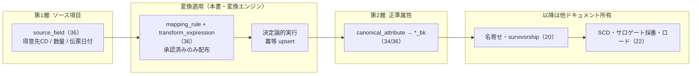

- 本書の責務終端は **「正準属性のキー（`*_bk`）を確定させ、名寄せ入力を整える」** まで（基本設計 §4.1 と整合）。
- 第2層以降（名寄せ・サロゲート採番・SCD）は 20/22 に**明示的にハンドオフ**し、本書では再定義しない。

### 3.5 マッピング状態遷移（実装ビュー）

基本設計 §3.4 の状態機械を、**配布・適用の実装イベント**まで具体化する。`mapping_review`（36）が状態を保持し、**未承認は適用不可**（`MAP-003`）。

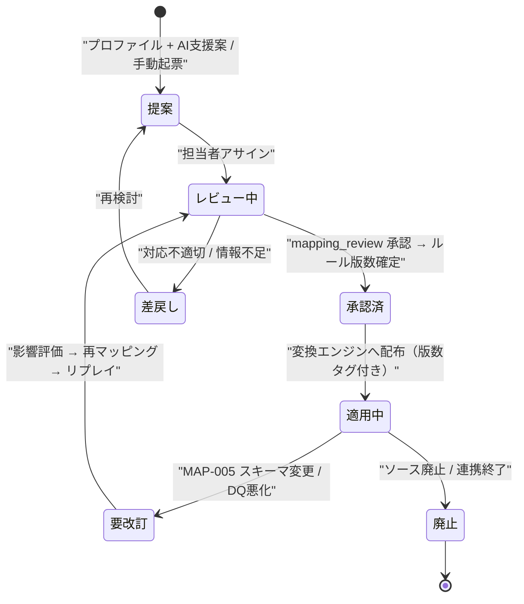

- **ルールは版数管理**する。適用中データは `data_lineage`（36）に「どの版数のルールで生成されたか」を記録し、改訂時は影響 `load_run` を特定してリプレイ（§6.4）。

### 3.6 人的マッピングレビュー UX

マッピング解決 UI は Control Plane（Nuxt 3, ブリーフ §4）に実装する。**PC はソース列×正準属性のマトリクス**、
**モバイルはカード型**で 1 マッピングずつレビューする（ブリーフ §0 / CLAUDE.md 原則8 レスポンシブ、review-standards U-1〜U-4）。

| UX 観点 | 設計 |
|---|---|
| U-1 入力最適化 | 正準属性はマスタ選択式（autocomplete）。AI 候補を初期選択に充当し、人は「確認/修正」に軽減 |
| U-2 出力直感性 | 各行にサンプル値 3 件・欠損率・信頼度バッジを併記。信頼度で並べ替え（低信頼を先頭） |
| U-3 操作フロー | 承認は一括/個別両対応。差戻しは理由必須 → `mapping_review` に記録 |
| U-4 エラー誘導 | 変換式プレビューでサンプル入力→出力を即時表示。式エラーはその場で表示し次アクションを明示 |
| レスポンシブ | PC=マトリクス表、モバイル=1マッピング/カード（スワイプで次項目） |

---

## 4. AI によるマッピング支援

### 4.1 支援の原則（責務分離を崩さない）

**AI は「対応関係の推定」までを担い、確定は必ず人が行う**（基本設計 §3.1・§5.2 / ブリーフ §12）。
数値・実データの生成は AI にさせず、変換適用・集計は決定論的な変換エンジンが担う（ハルシネーション抑制）。

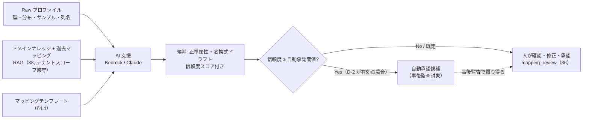

### 4.2 信頼度スコアの構成

信頼度は単一の LLM 出力ではなく、**複数シグナルの合成**で算出し、根拠を提示する（説明可能性）。

| シグナル | 内容 | 重み例 |
|---|---|---|
| 列名意味類似 | 列名の埋め込み（Bedrock Titan）と正準属性名の類似度 | 高 |
| 値分布適合 | サンプル値の型/正規表現/カーディナリティが正準属性の想定と一致 | 高 |
| テンプレート一致 | 業種/SaaS テンプレート（§4.4）に同名/同義の写像が存在 | 中 |
| 過去承認履歴 | `mapping_review` 履歴に類似ソースの承認実績 | 中 |

### 4.3 自動承認の扱い（未決 D-2）

既定は**「候補提示のみ・人が全確定」**（安全側）。「高信頼度は自動承認 + 事後監査」を採るかは基本設計 論点 D-2 で未決。
自動承認を有効化する場合も **`mapping_review` に auto-approved フラグ + 監査ログ**を残し、事後に人が覆せる設計とする（原則7 データ保護）。

### 4.4 マッピングテンプレート

- テンプレートは `mapping_rule` の**再利用可能プリセット**（業種 × 製品カテゴリ × 代表 SaaS 単位）。新規ソース登録時に「近いテンプレート」を初期値採用。
- **テンプレートは提案の初期値であって確定ではない**。必ず人が `mapping_review` で承認（誤テンプレ適用防止, 基本設計 §5.1）。
- 蓄積源: 過去承認マッピングの頻出パターン抽出 + ドメインナレッジ（38）。テンプレート生成失敗は `MAP-006`（非ブロッキング、手動起票にフォールバック）。

---

## 5. 変換ジョブ（ELT）の実行制御

### 5.1 オーケストレーション（Step Functions）

変換は **EventBridge（トリガ）→ Step Functions（オーケストレーション）→ Glue Job（実行）** の構成（ブリーフ §4）。
1 回の変換実行を `load_run`（36 所有）1 行で追跡し、**冪等・再入可能**にする。

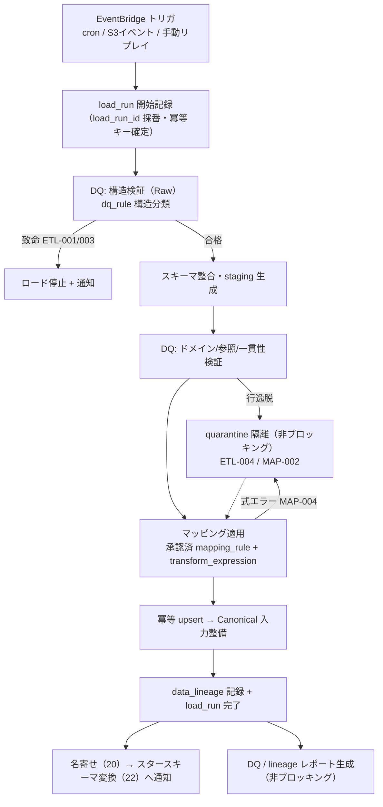

- **状態機械のべき等性:** Step Functions の各状態は再入可能。途中失敗時は同一 `load_run_id` で再開し、完了済みステップは冪等 upsert によりスキップ相当となる（原則2）。
- **補助ステップ（REPORT・通知・カタログ更新）の失敗は主フローを止めない**（原則4）。`load_run` は「主フロー完了」と「補助完了」を別フラグで持つ。

### 5.2 増分 / 全量ロード

| モード | トリガ | 制御 | 用途 |
|---|---|---|---|
| **増分（差分）** | 日次 cron / CDC | ウォーターマーク（前回 `load_run` の `updated_at` 上限 or LSN）以降のみ処理 | 常用。低コスト |
| **全量** | 手動 / 初回 / スキーマ大変更時 | ソース全件を再取得し冪等 upsert | 立ち上げ・整合性回復 |
| **リプレイ** | 手動 / ルール改訂 | `raw` を源泉に staging 以降を再生成（対象 load_run/期間/テナント限定可） | 誤マッピング修正・変換バグ修正（§6.4） |

- ウォーターマークは `load_run`（36）に永続化し、増分の開始点を SoT 化する。全量とリプレイはウォーターマークを無視して範囲指定する。

### 5.3 遅延到着（Late-arriving）データ

分散ソース・ファイル遅延・CDC 遅延により、**業務日付が過去のデータが後から届く**ケースを扱う。

| ケース | 対応 |
|---|---|
| 遅延ファクト（過去日付の売上等） | `business_date` パーティションへ**遡って冪等 upsert**。周期スナップショット（fact_inventory_snapshot 等）は 22 が再集計トリガ |
| 遅延ディメンション（未登録の顧客/商品が先に事実で出現） | **推定次元（inferred member）**を仮登録して FK を解決し、後続で本登録に置換（詳細ロジックは 22 が所有）。本書は「未解決キーを `MAP-002` で保留 → マスタ自動補完 or 人的解決」を担当 |
| 順序逆転（更新が挿入より先に到着） | 冪等 upsert + バージョン（ソース更新時刻 / LSN）比較で**新しい版のみ反映**（古い版で上書きしない） |

> **遅延ディメンションの本登録・SCD 適用は 22 が所有**。本書は「正準属性キーが未解決のまま事実行が来た場合の保留・後追い解決」までを担う（責務境界を明確化）。

---

## 6. データ品質・隔離・来歴・冪等・監査

### 6.1 DQ 評価エンジン

`dq_rule`（36 所有）を **Raw 直後・変換前後の複数段**で評価する（基本設計 §6.1）。ルールは宣言的定義とし、エンジンが解釈実行する。

| 分類 | 例 | 失敗時の扱い | コード |
|---|---|---|---|
| 構造 | 列数・型・必須・文字コード | 致命 → 当該ロード停止・隔離 | `ETL-001` / `ETL-003` |
| ドメイン | コード値許容集合・範囲（数量 ≥ 0）・日付妥当性 | 行単位隔離（非ブロッキング）・レポート | `ETL-004`（一貫性系） |
| 参照整合 | 正準キー解決可否（未知コード） | 未解決行を保留 → マスタ自動補完 or 人的解決 | `MAP-002` |
| 一貫性 | 明細合計とヘッダ金額一致・重複検知 | 警告 + 隔離。閾値超過で停止 | `ETL-004` |

> **非ブロッキング原則（原則4）:** 行単位 DQ 逸脱は**当該行のみ quarantine し残りを流す**（グレースフルデグラデーション）。
> 全体停止は構造崩壊・認証不能など致命的失敗のみ。隔離行は DQ レポート・`mapping_review` に可視化し人的回復へ。

### 6.2 隔離（Quarantine）ゾーン

- DQ 逸脱行は `quarantine/` ゾーン（§2.5）へ **原因コード・違反ルール ID・load_run_id を付与**して退避し、主ロードから除外する。
- 隔離行は**再処理可能**: マスタ補完 / 人的マッピング解決 / ルール改訂の後、対象 `load_run` をリプレイして復帰させる。
- 保持期間・再処理 SLA は未決（基本設計 論点 D-4）。既定は「保持し続け、手動再処理」を想定。

### 6.3 来歴（Lineage）

- すべての正準化出力に**来歴列**（`source_system` / `source_record_id` / `legacy_id`, ブリーフ §9）を保持。
- `data_lineage`（36 所有）に **「どの Raw の、どのルール版で、どの load_run で生成されたか」** を記録し、誤マッピング発覚時の**影響範囲特定と部分リプレイ**を可能にする（原則6・原則7）。

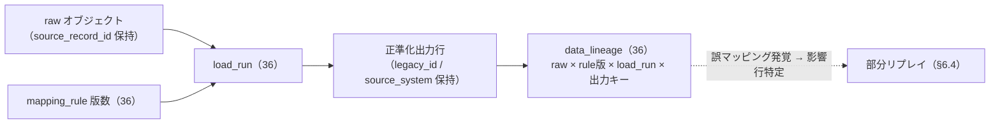

### 6.4 冪等キーとリプレイ / リカバリ

**冪等キーの計算方法**（本書所有ロジック）:

| 方式 | 冪等キー計算 |
|---|---|
| ファイル投函 | `sha256(file_bytes)` + 行番号（`file_sha256:row_no`） |
| Webhook | `Idempotency-Key`（クライアント UUID, ブリーフ §11）優先、無ければイベント ID |
| CDC | `LSN` / トランザクション ID（単調増加） |
| バッチ/API | `load_run_id` + ソース自然キー |

- **取込冪等化:** 同一冪等キーの再投入は `ETL-005`（冪等キー衝突）として**無害化**（再実行抑止, 二重ロードなし）。
- **変換/ロード冪等化:** 自然キー + `load_run_id` の**冪等 upsert**。再実行で確定データ・進捗・DQ ログ・`mapping_review` を**巻き戻さない**（記録系は保護, 設定系のみ更新, 原則2）。
- **リプレイ:** `raw`（不変）を源泉に staging 以降を再生成。対象を `load_run` / 期間 / テナントで限定可能。Raw 欠落/破損時は `ETL-006` で当該リプレイ停止。

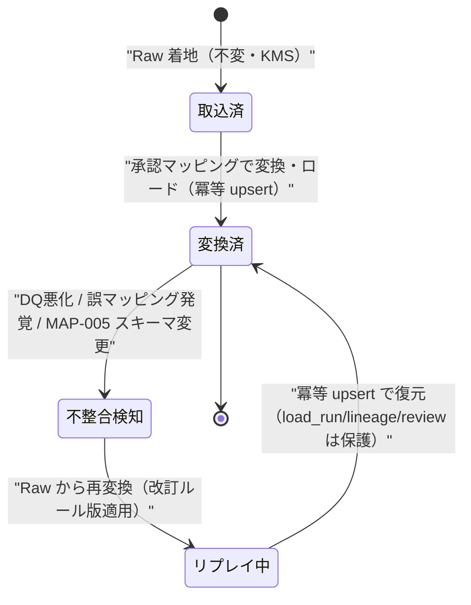

### 6.5 監査

- `load_run` / `data_lineage` / `mapping_review` は **append 中心の記録系**（36 所有）で、変換の全実行を追跡可能にする。
- Control Plane のマッピング承認・差戻し・自動承認は `audit_logs`（37 所有, INSERT 専用 append-only, ブリーフ §5）へ記録し、**誰がいつどのマッピングを承認したか**を改竄不能に保持する。

---

## 7. エラーハンドリング（ETL-NNN / MAP-NNN）

コード体系は `DOMAIN-NNN`（ブリーフ §10）。**権威的レジストリは基本設計 [10 §8](../basic-design/10-data-integration-and-mapping.md) が所有**。
本書は各コードの**送出箇所・ブロッキング性・リカバリ手順**を実装レベルで具体化する。

| コード | 送出箇所（本書内） | ブロッキング | リカバリ手順 |
|---|---|---|---|
| `ETL-001` | DQ 構造検証（Raw / staging 生成前） | 当該ロード停止 | 構造修正 or ソース再送 → 該当 load_run リプレイ |
| `ETL-002` | コネクタ実行（認証/接続, リトライ上限超過） | 停止・通知 | 認証情報（Secrets Manager）更新 → 再取込 |
| `ETL-003` | フォーマットアダプタ（文字コード/構造） | 当該ファイル停止 | アダプタ設定（文字コード等）修正 → リプレイ |
| `ETL-004` | DQ 一貫性（合計不一致/重複超過） | 隔離 + 閾値超で停止 | quarantine 行確認 → ルール/データ修正 → 再処理 |
| `ETL-005` | 取込冪等化（同一冪等キー再投入） | 無害化（再実行抑止） | 対応不要（設計どおり）。ログのみ |
| `ETL-006` | リプレイ（Raw 欠落/破損） | 当該リプレイ停止 | S3 バージョン復元 or ソース再取得 |
| `MAP-001` | 変換適用（項目対応表欠落） | 当該項目/行を保留 | マッピング起票 → `mapping_review` 承認 → リプレイ |
| `MAP-002` | 正準キー解決（未知コード/名寄せ不成立） | 行隔離（保留） | マスタ自動補完（未決 D-3）or 人的解決 → 再処理 |
| `MAP-003` | 変換配布（未承認ルール適用要求） | 適用拒否 | `mapping_review` で承認 → 再配布 |
| `MAP-004` | 変換式実行エラー | 当該行隔離 | 式修正（プレビュー検証）→ 承認 → リプレイ |
| `MAP-005` | プロファイラ（ソーススキーマ変更検知） | 要改訂へ遷移 | 影響評価 → 再マッピング → リプレイ |
| `MAP-006` | AI 支援/テンプレート生成失敗 | 非ブロッキング | 手動起票にフォールバック（自動継続） |

> **横断コードの委譲:** 認証/認可/テナント境界（`CMN-401/403`, `TEN-001/002`）は 02/11、AI 越境遮断は `AI-001`（23/38）。
> API 応答は RFC 7807 Problem Details（`code` に上記を格納, ブリーフ §11）。

---

## 8. SoT とデータフロー整合性

ブリーフ §5 / 原則6 に従い、本書が扱うデータの SoT と同期方向を宣言する（基本設計 §7 と整合）。

| データ | SoT | 派生/キャッシュ | 同期方向 |
|---|---|---|---|
| 取込生データ（raw ゾーン） | **ソース側システム** | staging/quarantine | ソース → raw（不変保持）|
| staging（型付き Parquet） | 派生（raw 由来） | — | raw → staging（リプレイ可）|
| マッピング定義（`mapping_rule`/`transform_expression`/`dq_rule`） | **メタデータ DB（36）** | 変換エンジンへ配布 | 定義(SoT) → 適用(後追い) |
| 記録系（`load_run`/`data_lineage`/`mapping_review`） | **メタデータ DB（36, append）** | — | 保護対象（巻き戻さない）|
| クロスウォーク（app-local ⇄ canonical） | **Canonical DB（34）** | — | 名寄せ解決の SoT（20）|
| 正準エンティティ | **Canonical DB（34）** | DWH dim へ反映 | 正準(SoT) → dim(後追い, 22) |

**整合原則:**
1. **SoT 先行・派生後追い:** ソース/raw → Canonical → DWH の一方向。逆流（DWH→正準の書き戻し等）禁止。
2. **同期パス + 手動再同期の両立:** イベント受信（CDC/Webhook）に加え、**raw からのリプレイ**と **Reconciler（SoT⇄派生の差分照合）** を手動回復パスとして常備（原則6-2）。
3. **SoT から復元不能な派生を持たない:** staging/Canonical/DWH は raw から常に再生成可能に保つ。

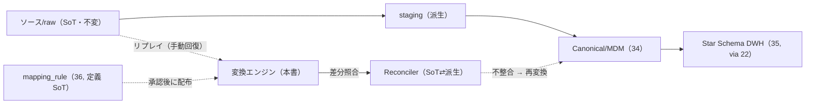

---

## 未決事項 / 論点

| # | 論点 | 選択肢 / トレードオフ | 一次議論先 |
|---|---|---|---|
| D-1 | CDC 実装方式 | DMS（マネージド）／ Debezium（柔軟・自前運用）／ 論理レプリケーション／ アプリイベント。ソース DB 種別と鮮度で判断 | [12 ADR](../basic-design/12-architecture-decision-records.md) / §2.4 |
| D-2 | AI 支援の自動承認 | 「候補提示のみ（既定・安全）」か「高信頼度は自動承認 + 事後監査」か | [23 AI/RAG](./23-ai-rag-and-vectorization.md) / §4.3 |
| D-3 | 未知マスタコードの自動補完 | MIG-3 型「自動 INSERT（legacy_id 保存）+ 後追い確定」を標準にするか、常に人的承認か | [20](./20-canonical-mdm-and-entity-resolution.md) / [34](../database-design/34-mdm-canonical-schema.md) |
| D-4 | 隔離行の保持期間・再処理 SLA | 自動リトライ有無・保持期間・エスカレーション | [11 NFR](../basic-design/11-nonfunctional-security-tenancy.md) / §6.2 |
| D-5 | 遅延ディメンションの推定次元方針 | inferred member を採るか、事実を保留するか（本登録・SCD は 22 所有） | [22](./22-star-schema-transformation.md) / §5.3 |
| D-6 | 変換エンジンの実装形態 | Glue(Spark) 主体か、自社変換エンジン（.NET）併用か。式言語の実行基盤選定 | [12 ADR](../basic-design/12-architecture-decision-records.md) / §5.1 |
| D-7 | ETL/MAP 追加サブコードの要否 | 運用細分（リトライ枯渇・部分リプレイ失敗等）を 10 レジストリへ追加するか | [10 §8](../basic-design/10-data-integration-and-mapping.md) |

---

## 関連ドキュメント

- [`../basic-design/10-data-integration-and-mapping.md`](../basic-design/10-data-integration-and-mapping.md) — データ連携と項目マッピング（基本設計・二系統モデル・ETL/MAP レジストリ所有）
- [`../basic-design/02-overall-architecture.md`](../basic-design/02-overall-architecture.md) — 全体アーキテクチャ（プレーン構成・横断エラーコード）
- [`../basic-design/11-nonfunctional-security-tenancy.md`](../basic-design/11-nonfunctional-security-tenancy.md) — 非機能 / セキュリティ / テナンシー（RLS・境界・SLA）
- [`../basic-design/12-architecture-decision-records.md`](../basic-design/12-architecture-decision-records.md) — ADR（CDC/DWH/変換基盤選定の根拠）
- [`./20-canonical-mdm-and-entity-resolution.md`](./20-canonical-mdm-and-entity-resolution.md) — Canonical/MDM/名寄せ（マッチング・ゴールデンレコード・survivorship）
- [`./22-star-schema-transformation.md`](./22-star-schema-transformation.md) — スタースキーマ変換（SCD Type2・サロゲート採番・遅延ディメンション本登録）
- [`./23-ai-rag-and-vectorization.md`](./23-ai-rag-and-vectorization.md) — AI/RAG/ベクター化（マッピング支援の RAG 基盤）
- [`../database-design/34-mdm-canonical-schema.md`](../database-design/34-mdm-canonical-schema.md) — MDM/Canonical スキーマ（正準エンティティ・クロスウォーク物理）
- [`../database-design/35-star-schema-dwh.md`](../database-design/35-star-schema-dwh.md) — スタースキーマ DWH（dim/fact 物理定義）
- [`../database-design/36-mapping-metadata-schema.md`](../database-design/36-mapping-metadata-schema.md) — マッピングメタデータスキーマ（source/rule/transform/dq/load_run/lineage/review 物理）
- [`../database-design/37-control-plane-backoffice-schema.md`](../database-design/37-control-plane-backoffice-schema.md) — コントロールプレーン（connector/connector_config/audit_logs）
- [`../../migration/mig-3-strategy.md`](../../migration/mig-3-strategy.md) — 既存生産管理システム CSV 取込戦略（レガシー人的マッピングの実例）
- [`../README.md`](../README.md) — ドキュメント索引 / 全体マップ
