# 詳細設計: スタースキーマ変換

本書は **SCIP（Supply Chain Intelligence Platform、コード名。正式名称は未確定）** における
**Canonical / MDM（34）および Raw/Staging（21）から スタースキーマ（`dim_*` / `fact_*`）への ELT 変換**の
**詳細ロジック**を、実装者が着手できる粒度で定義する。対象は
(1) 適合次元（conformed dimension）の生成・共有とサロゲートキーの採番・解決、
(2) SCD Type2 の実装（`valid_from`/`valid_to`/`is_current`/`row_hash`・変更検知・遅延到着次元/ファクト）、
(3) ファクトのグレイン定義とロード（売上/在庫スナップショット/移動/発注/生産/出荷/請求）、
(4) 自社アプリ（スタースキーマ前提スキーマ）と他社アプリ（マッピング経由）の変換差分、
(5) 増分ロード/バックフィル/再構築、Redshift の DISTKEY/SORTKEY 最適化とパーティション方針、
(6) スナップショット静的ファイル生成（26）への接続、
(7) データ整合性検証（件数/合計照合）・冪等性・失敗時のリラン — である。

> **位置づけ / 所有範囲（ブリーフ §14）:** 本書は **スタースキーマ変換の詳細ロジック**を権威的に所有する。
> `dim_*` / `fact_*` の**物理スキーマ（CREATE TABLE・列定義・制約・DISTKEY/SORTKEY・RLS 相当のテナント分離）は
> [スタースキーマ DWH](../database-design/35-star-schema-dwh.md)（35）が所有**する。本書は 35 が所有する
> テーブル（`dim_date`, `dim_product`, `dim_location`, `dim_region`, `dim_customer`, `dim_supplier`,
> `dim_channel`, `dim_party`, `dim_tenant`, `dim_currency`, `dim_uom`, `dim_promotion`, `dim_employee`,
> および `fact_sales`, `fact_inventory_snapshot`, `fact_inventory_movement`, `fact_purchase_order`,
> `fact_production`, `fact_shipment`, `fact_billing`）を**参照するのみで再定義しない**。
> 変換の入力である正準エンティティ・ゴールデンレコード・クロスウォークは
> [Canonical/MDM/名寄せ](./20-canonical-mdm-and-entity-resolution.md)（20）と
> [MDM/Canonical スキーマ](../database-design/34-mdm-canonical-schema.md)（34）が所有し、
> 取込・項目マッピング適用・`load_run`/`data_lineage` は
> [取込とマッピングパイプライン](./21-ingestion-mapping-pipeline.md)（21）と
> [マッピングメタデータ](../database-design/36-mapping-metadata.md)（36）が所有する。
> スナップショット静的ファイルの生成・配信詳細は [スナップショット/DocDB](./26-snapshot-document-db.md)（26）が所有する。

---

## 1. 目的・スコープと責務境界

### 1.1 スタースキーマ変換が解く問題

SCIP の差別化の源泉は「分析サービスへの連携難易度の低さ」と「各分析機能の実現性」である（ブリーフ §1）。
その中核が、名寄せ済みの正準データ（Canonical/MDM）と取込生データ（Raw）を、Kimball 準拠の
**適合次元 + ファクト**へ確定的・冪等・追跡可能に変換する ELT である。ここが崩れると、
「商品 × 地域 × 販売先」（ブリーフ §2）の集計が二重計上・履歴喪失・グレイン崩壊を起こし、
分析・可視化・意思決定支援の全機能が信頼を失う。

本書は「**どのように**正準/生データを `dim_*`/`fact_*` へ写すか」の変換アルゴリズムを定義する。
`dim_*`/`fact_*` が「**何を**持つか」（列・制約・物理配置）は 35 が定義する。

### 1.2 スコープ（本書が所有するロジック）

| # | 領域 | 本書の責務 | 物理/上流所有 |
|---|------|-----------|--------------|
| 1 | 適合次元生成 | conformed dimension の構築・fact 間共有・サロゲートキー採番/解決 | 35（`dim_*` 物理） |
| 2 | SCD Type2 | 変更検知（`row_hash`）・版遷移（`valid_from`/`valid_to`/`is_current`）・MERGE ロジック | 35（列） |
| 3 | 遅延到着 | 遅延到着次元（推論メンバー）・遅延到着ファクト（point-in-time 解決） | 本書 |
| 4 | ファクトロード | グレイン定義・サロゲート解決・メジャー算出・degenerate dimension | 35（`fact_*` 物理） |
| 5 | 自社/他社差分 | スタースキーマ前提スキーマ vs マッピング経由の変換差 | 21/36（マッピング） |
| 6 | ロード運用 | 増分/バックフィル/再構築・DISTKEY/SORTKEY 活用・パーティション・整合性検証・リラン | 35（物理配置確定） |
| 7 | スナップショット接続 | 事前集計 → 静的ファイル生成の起動点と契約 | 26（生成/配信） |

### 1.3 スコープ外（他ドキュメントへ委譲）

- **`dim_*`/`fact_*` の物理 DDL・DISTKEY/SORTKEY・エンコード・テナント分離の確定:** 35。本書は「変換が要求する物理最適化」を**要求仕様**として提示し、実 DDL は 35 が確定する。
- **取込・ステージング・項目マッピング適用・名寄せ（Raw→Canonical）:** 21 / 36 / 20。本書は「変換が Canonical/Staging のどの状態を入力とするか」の**契約**を定義する。
- **正準エンティティ・ゴールデンレコード・xref の生成:** 20 / 34。本書はゴールデン改定イベントを入力として受け、`dim_*` の SCD2 を駆動する下流側。
- **スナップショット静的ファイルの生成実装・DocDB 読み取りモデル・CDN 配信:** 26。本書は事前集計の**起動点と入力契約**まで。
- **メトリクス/セマンティック層の指標定義・サービング API:** [分析可視化サービス](../basic-design/07-service-analytics.md)（07）／ 25。本書は指標が参照する `fact_*` の加法性を保証する。

---

## 2. 全体像 — ELT 変換パイプライン

変換は「抽出/着地 → 正準化 → **次元ロード（本書）** → **ファクトロード（本書）** → 事前集計/スナップショット → 整合性検証」の
段階パイプラインである。**ELT**（Extract-Load-Transform）を採用し、変換ロジックを DWH（Redshift Serverless）内で
SQL 実行する。理由は (a) 大量結合・集計は MPP エンジンが最速、(b) 変換 SQL を宣言的に記述でき再現性が高い、
(c) Raw を S3 に保持し何度でもリプレイできる（ブリーフ §4/§5）。オーケストレーションは Step Functions +
Glue（COPY/UNLOAD・PySpark 前処理）+ EventBridge（トリガ）（ブリーフ §4）。

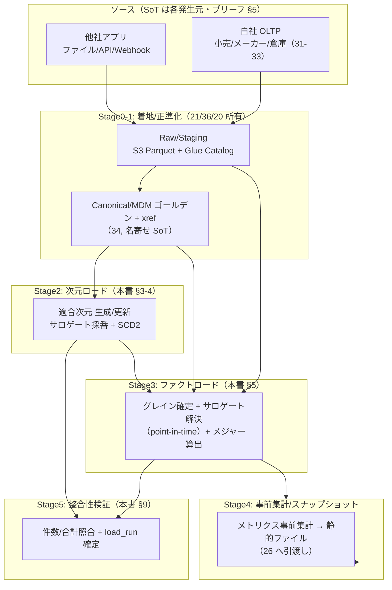

**変換の 3 つの不変則:**

1. **次元先行・ファクト後行:** ファクトはサロゲートキーで次元を参照するため、対象バッチに現れる次元メンバーを**先に確定**してからファクトをロードする（参照整合性）。順序違反は未解決サロゲート（`ANL-001`）を生む。
2. **SoT → 派生の一方向（ブリーフ §5）:** DWH は Canonical/Raw 由来の**派生**であり、DWH から上流へは書き戻さない。次元の属性 SoT は Canonical（34, ゴールデン）、ファクトの事実 SoT は各 OLTP/Raw。
3. **冪等（CLAUDE.md 原則2）:** 同一バッチ・同一ルール版を何度ロードしても、版重複・二重計上を生まない。`load_run_id`（36）＋ 一意グレイン ＋ MERGE/差分置換で担保する（§9）。

---

## 3. 適合次元とサロゲートキー管理

### 3.1 適合次元（conformed dimension）の共有

適合次元とは「複数ファクトで**同一の意味・粒度・サロゲートキー**を共有する次元」である。
例: `dim_product` は `fact_sales`・`fact_inventory_snapshot`・`fact_purchase_order`・`fact_production`・`fact_shipment`
のすべてから同一 `product_key` で参照される。これにより「売上と在庫と発注を同じ商品軸で突合」できる（drill-across）。

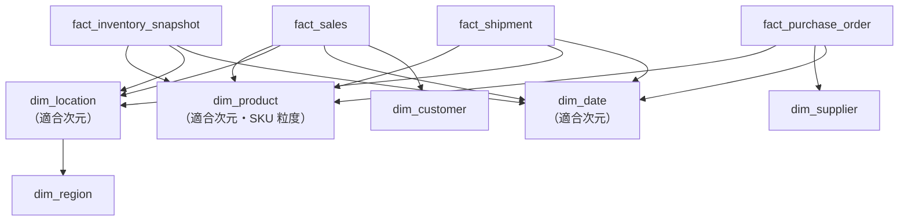

**適合の担保ルール（本書が保証、`ANL-005` で検出）:**

- 各次元は**単一のロードジョブ**が唯一の生成者。ファクトジョブは次元を**参照のみ**（次元を作らない）。ファクト側で場当たり的に次元行を作ると適合が崩れる。例外は「推論メンバー」だが、これも `dim_*` の同一構造で生成し後で正規化する（§4.5）。
- サロゲートキーは次元横断で意味を持たない（`product_key=100` と `location_key=100` は無関係）。ファクトは各次元の `*_key` を独立に保持する。
- 粒度は次元定義（35 / ブリーフ §8）で固定。`dim_product` は SKU 粒度、`dim_region` は最深段（可能なら mesh, 20 §5）まで保持しクエリで roll-up する。

### 3.2 サロゲートキー採番

各次元 PK は業務自然キーではなく**サロゲートキー `*_key BIGINT`**（ブリーフ §9）。自然キー（ビジネスキー `*_bk`）は
別列に保持する。サロゲートを使う理由: (a) SCD2 で同一自然キーに複数版が生じるため自然キーは PK になれない、
(b) 名寄せで canonical id が付け替わっても分析側のキー体系を安定させる、(c) 結合が固定幅整数で高速。

| 対象 | ビジネスキー `*_bk`（自然キー） | サロゲート採番元 |
|------|-------------------------------|----------------|
| `dim_product` | `tenant_id` + canonical_sku_id（34） | 新規 SKU 出現時に採番 |
| `dim_location` | `tenant_id` + canonical_location_id | 新規拠点出現時 |
| `dim_customer` | `tenant_id` + canonical_party_id（role=customer） | 新規顧客出現時 |
| `dim_supplier` | `tenant_id` + canonical_party_id（role=supplier/manufacturer） | 新規仕入先出現時 |
| `dim_region` | `tenant_id`（共有なら NULL 相当）+ region_code | 地域階層構築時（20 §5） |
| `dim_date` | `date_key`（YYYYMMDD 整数、自然キー兼サロゲート） | 事前生成（§3.5） |

**採番方式（35 で物理確定、本書は要求と手順を定義）:**

- Redshift の `IDENTITY(1,1)` 列を第一候補とする。ただし Redshift の IDENTITY は**並列ロードで連番・単調性を保証しない**（スライスごとに歯抜けが出る）。分析上は「一意であればよい」ため許容するが、連番前提のロジックを書かない。
- テナント境界: サロゲートは**プラットフォーム全体で一意**（テナント跨ぎで衝突しない単一採番）。テナント分離は各行の `tenant_id`（+ 予約メンバーを除く）で担保する。DISTKEY/パーティション方針は §7.4 / 35。
- 予約メンバー（§3.3）は採番前に固定値（`-1`,`-2`,`0`）で先行 INSERT し、IDENTITY レンジと衝突しないよう 35 の DDL 側で開始値を正数に設定する。

### 3.3 予約メンバー（unknown / not-applicable）— 早期到着ファクト対策

ファクトが参照する次元メンバーが未確定でも、ファクトを**捨てず**にロードするため、各次元に固定サロゲートの
**予約メンバー**を用意する（Kimball 標準）。

| `*_key` | 意味 | 用途 |
|---------|------|------|
| `-1` | Unknown（未解決） | ファクト到着時に自然キーが xref 未解決（`MAP-001`）→ 一旦 `-1` に紐付け、後で再解決 |
| `-2` | Invalid（不正/検証失敗） | 桁検証失敗の識別子等（`MAP-005`）を分離 |
| `0` | Not Applicable（該当なし） | その次元が業務上存在しない事実（例: 卸取引に店舗次元が無い） |

- **早期到着ファクトの扱い:** サロゲート解決に失敗したファクトは破棄せず `-1` を割り当ててロードし、`ANL-001` を warning として `load_run` に記録。次元が後から到着したら**再解決バッチ**（§5.2 手順6）で `-1` を実キーへ更新する。これにより「売上はあるが商品マスタが未着」でも売上金額の総計は保全される（下位互換・データ保護, CLAUDE.md 原則7）。

### 3.4 サロゲート解決（自然キー → `*_key`）

ファクトロードの中核は「ステージングの自然キー（canonical id / コード）から、有効な `*_key` を引く」ルックアップである。
SCD2 次元では**イベント日時点で `is_current` だった版**ではなく、**イベント日を含む有効区間の版**を引く（point-in-time, §4.6）。

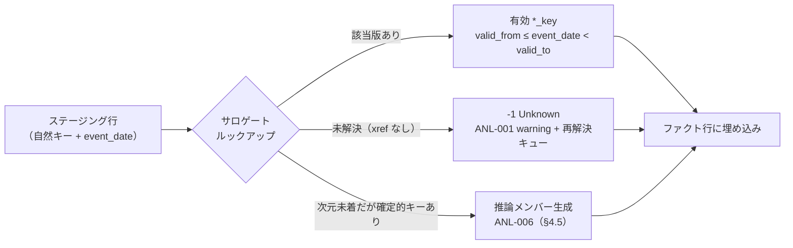

### 3.5 `dim_date`（事前生成・SCD1）

`dim_date` は業務発生前に**将来分まで一括生成**する（例: 2000-01-01 〜 20 年後）。`date_key`（YYYYMMDD 整数）を
自然キー兼サロゲートとし、暦属性（年/四半期/月/週/曜日/会計期/祝日/営業日フラグ）を持つ。生成は決定的・冪等で、
再実行は既存行を UPSERT するのみ（記録系ではないため巻き戻し問題なし）。会計期・祝日カレンダーは
テナント設定（37/27）由来のため、テナント差がある場合は `dim_date` にテナント非依存の基本属性を持たせ、
会計期マッピングは別次元 or 属性で吸収する（未決事項 §12-4）。

---

## 4. SCD Type2 の実装

### 4.1 次元ごとの SCD タイプ

| 次元 | SCD タイプ | 根拠 |
|------|-----------|------|
| `dim_date` | 1（事前生成・不変） | 暦は履歴を持たない |
| `dim_product` | 2 | 商品属性（category/brand/season/color/size/family）の変化を時系列で分析するため履歴必須 |
| `dim_location` | 2 | 拠点の業態変更・移転を履歴化 |
| `dim_customer` | 2 | 顧客の属性・地域紐付けの変化を履歴化 |
| `dim_supplier` | 2 | 仕入先/工場の属性変化を履歴化 |
| `dim_region` | 2 / 固定 | 標準地域は原則不変（1相当）、動的粒度・行政区再編のみ 2 で履歴化 |
| `dim_channel` / `dim_currency` / `dim_uom` / `dim_tenant` | 1（小規模・上書き） | 履歴分析価値が低い属性は Type1 で単純上書き |
| `dim_promotion` / `dim_employee` | 2 | 施策・担当者の期間帰属を分析するため |

> Type2 次元でも**すべての属性が Type2 とは限らない**。属性を「Type2 追跡（版を切る）」と「Type1 上書き（版を切らず現行を更新）」に分類し、`row_hash`（§4.2）は Type2 追跡属性のみで計算する。例: `dim_product` の `color`/`size`/`category` は Type2、表記ゆれ修正のみの `display_name` は Type1、といった分類を 35 の列設計と合わせて確定する。

### 4.2 変更検知 — `row_hash`

SCD2 の変更検知は、Type2 追跡属性を正規化連結したハッシュ `row_hash` の差分で行う。属性ごとの逐次比較より
高速・簡潔で、追跡属性の増減にも `row_hash` の計算式変更のみで追随できる。

```sql
-- Redshift 内・ステージングビュー（擬似）: Type2 追跡属性から row_hash を算出
-- NULL は固定トークンへ、順序・区切りを固定し衝突と表記ゆれを防ぐ
SELECT
    tenant_id,
    canonical_sku_id            AS product_bk,
    ...,
    MD5(
        COALESCE(product_family_code,'∅') || '|' ||
        COALESCE(category_code,'∅')       || '|' ||
        COALESCE(brand_code,'∅')          || '|' ||
        COALESCE(season_code,'∅')         || '|' ||
        COALESCE(color_code,'∅')          || '|' ||
        COALESCE(size_code,'∅')           || '|' ||
        COALESCE(material_code,'∅')
    )                            AS row_hash
FROM stg_dim_product_src;
```

- **決定性:** ハッシュ入力は正規化済み（20 §4.2 と同基準）・列順固定・区切り文字固定・NULL トークン固定。これにより「同一実体は常に同一 `row_hash`」＝冪等な変更検知になる。
- **`ANL-002`:** 追跡属性に想定外の欠落（NULL でなく列自体が来ない）があれば `row_hash` が破綻するため、算出前にスキーマ検証し `ANL-002` を投げる。
- **ハッシュ衝突:** MD5 の実務衝突確率は無視できるが、金額に直結する識別属性は `row_hash` に加え自然キー一致も併用し二重化する。

### 4.3 版遷移 — `valid_from` / `valid_to` / `is_current`

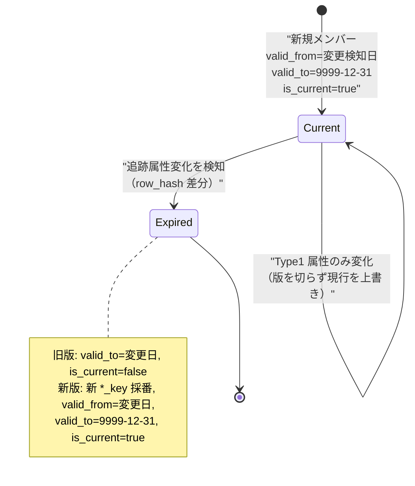

- **無限大境界:** 現行版の `valid_to` は `9999-12-31`（または `TIMESTAMPTZ` の遠未来）。`is_current=true` は `valid_to` 無限大の冗長フラグだが、現行版フィルタを高速化するため保持する。
- **境界規約:** 区間は `[valid_from, valid_to)`（左閉右開）。隣接版の `valid_to` と次版 `valid_from` を一致させ、point-in-time 検索（§4.6）で重複・空白を防ぐ。
- **有効日（effective date）:** 版の切り替え日は「属性変化を**業務上いつから**有効とみなすか」で決める。既定はゴールデン改定の検知日（20 §4.7 のイベント時刻）。バックデート補正が必要な場合は §4.6 と連動。

### 4.4 SCD2 MERGE ロジック

Redshift は `MERGE` を提供するが、SCD2 の「旧版クローズ + 新版挿入」は 1 文で表現しづらいため、
**2 フェーズ（① 変更/新規の抽出 → ② 旧版クローズ → ③ 新版挿入）**の staging パターンを標準とする。全ステップは
同一トランザクション内で実行し、途中失敗で中間状態が残らないようにする（冪等・原子性）。

```sql
-- 前提: stg_dim_product は §4.2 で row_hash を付与済みのソース断面
-- ① 変更対象（現行版と row_hash が異なる）と新規（現行版なし）を抽出
CREATE TEMP TABLE chg AS
SELECT s.*
FROM stg_dim_product s
LEFT JOIN dim_product d
  ON  d.tenant_id  = s.tenant_id
  AND d.product_bk = s.product_bk
  AND d.is_current = TRUE
WHERE d.product_key IS NULL              -- 新規メンバー
   OR d.row_hash <> s.row_hash;          -- 追跡属性が変化

-- ② 変化した既存メンバーの現行版をクローズ（Type2）
UPDATE dim_product
SET valid_to   = :effective_date,
    is_current = FALSE
WHERE is_current = TRUE
  AND (tenant_id, product_bk) IN (
        SELECT tenant_id, product_bk FROM chg
        WHERE product_bk IN (SELECT product_bk FROM dim_product WHERE is_current = TRUE)
      );

-- ③ 新版/新規を挿入（product_key は IDENTITY で採番）
INSERT INTO dim_product (tenant_id, product_bk, /* 属性... */, row_hash,
                         valid_from, valid_to, is_current, load_run_id)
SELECT tenant_id, product_bk, /* 属性... */, row_hash,
       :effective_date, '9999-12-31', TRUE, :load_run_id
FROM chg;

-- ④ Type1 のみの変化（row_hash 不変・Type1 属性差分）は現行版を上書き（版を切らない）
UPDATE dim_product d
SET display_name = s.display_name, updated_at = now()
FROM stg_dim_product s
WHERE d.tenant_id = s.tenant_id AND d.product_bk = s.product_bk
  AND d.is_current = TRUE AND d.row_hash = s.row_hash
  AND d.display_name IS DISTINCT FROM s.display_name;
```

- **冪等性:** 同一 `stg_dim_product` 断面を再ロードしても、②③ の条件（`row_hash <>`）が偽になり版は増えない。`load_run_id` を各版に刻み、どのランで生成された版かを追跡する。
- **削除（論理）:** ゴールデンが論理削除された場合、現行版をクローズし `is_current=false` にする（物理削除しない）。ファクトが過去版を参照し続けられるようにする（データ保護）。
- **代替: Redshift `MERGE`:** ③ の挿入のみ `MERGE ... WHEN NOT MATCHED` で書けるが、②のクローズは別 UPDATE が必要なため、可読性優先で上記 2 フェーズを標準とし、`MERGE` は 35 の性能検証で採否を確定する（未決事項 §12-1）。

### 4.5 遅延到着次元（late-arriving dimension / 推論メンバー）

ファクトが参照する次元メンバーが、ファクトより**後に**到着することがある（例: 新規 SKU の売上が先、SKU マスタが後）。
このとき早期到着ファクトを `-1` に固定すると集計軸が失われるため、**推論メンバー（inferred member）**を先行生成する。

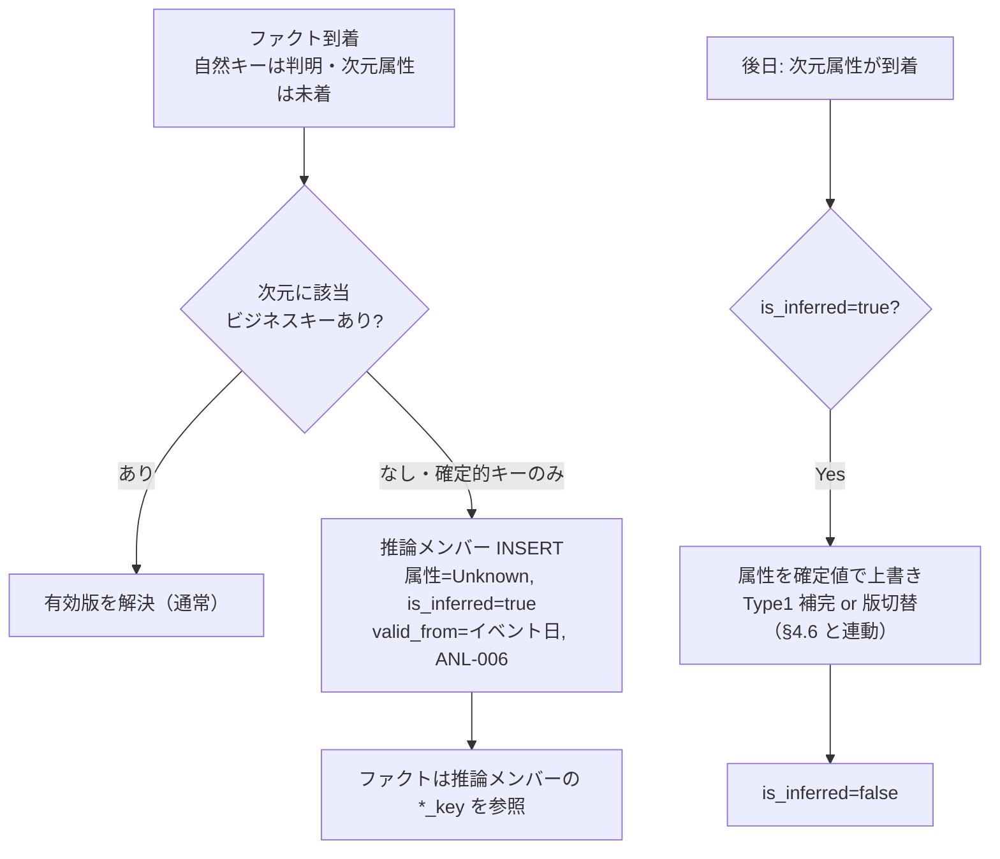

- **推論メンバー**は正規の `dim_*` 行として採番（`*_key` は本物）。属性は Unknown プレースホルダ、`is_inferred=true`（35 に列を要求）。ファクトは実キーを参照するため、後で属性が埋まっても**ファクトの付け替えは不要**（`-1` 方式との差）。
- **属性到着時:** 到着属性で埋める。到着時点が「最初から有効だった」なら Type1 上書き、「途中で変わった」なら §4.6 の遡及版切替。既定は Type1 補完（推論期間の属性を確定値で埋める）。
- **`-1` との使い分け:** 自然キー（xref）が解決できるなら**推論メンバー**、xref 自体が未解決なら `-1 Unknown`（§3.3）。前者は軸を保全、後者は再解決待ち。

### 4.6 遅延到着ファクト（late-arriving fact / point-in-time 解決）

過去日付のファクトが遅れて到着した場合、**現行版**ではなく**イベント日に有効だった版**へ紐付けねばならない（さもなくば
過去の売上が現在の商品属性で集計され履歴が歪む）。

```sql
-- point-in-time サロゲート解決: イベント日を含む有効区間の版を引く
SELECT f.*, d.product_key
FROM stg_fact_sales f
LEFT JOIN dim_product d
  ON  d.tenant_id  = f.tenant_id
  AND d.product_bk = f.product_bk
  AND f.event_date >= d.valid_from
  AND f.event_date <  d.valid_to;      -- [valid_from, valid_to) 左閉右開
```

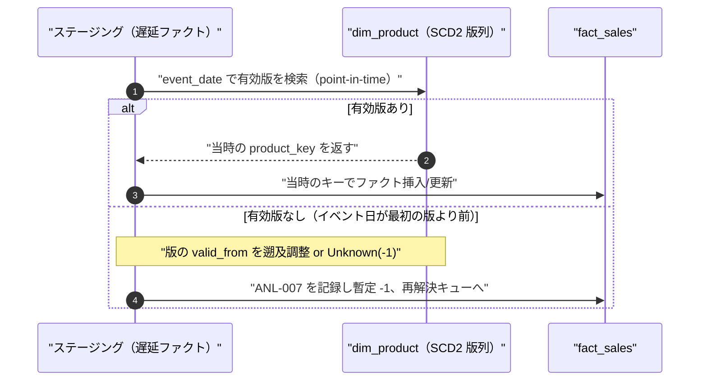

- **常に point-in-time で解決:** ファクトロードのサロゲート解決（§3.4）は既定で `event_date` を用いた区間結合とする。`is_current=true` 結合は「今日時点のスナップショット分析」専用ビューでのみ許可する（誤用は履歴歪曲）。
- **イベント日が最古版より前:** 版の `valid_from` を遡らせる（当時未整備の属性は Unknown のまま）か、Unknown(-1) に暫定紐付けし `ANL-007` を記録。どちらを既定にするかは 35 とメトリクス層要件で確定（未決事項 §12-2）。
- **再処理:** 既にロード済みのファクトが「本来別版に紐付くべき」と後で判明した場合（誤マージ split 等, 20 §4.7）、対象グレインを差分置換で再ロードし正しい `*_key` に付け替える（§5.2 / §7.2）。

### 4.7 ゴールデン改定 → SCD2 駆動（20 との契約）

20（Canonical/MDM）は「ゴールデン属性が変化したら**下流公開イベントを発火**する」責務を負う（20 §4.7）。
本書はそのイベントを受け、SCD2 の版を切る責務を負う。両者の契約は以下。

| 20 が発火するイベント | 本書の反応 | エラー |
|----------------------|-----------|--------|
| ゴールデン属性更新（`canonical_*` UPSERT） | 該当 `dim_*` を §4.4 で SCD2 更新（Type2 属性差分なら版切替、Type1 なら上書き） | `ANL-002` |
| 新規 canonical id 採番 | `dim_*` に新規メンバー INSERT（`*_key` 採番） | — |
| 誤マージ split（`MAP-003`, 新 canonical id 採番） | 新メンバー生成 + 影響ファクトの `*_key` 付け替え再処理（§7.2） | `ANL-007` |
| 論理削除 | 現行版クローズ（`is_current=false`）、物理削除しない | — |

- **駆動方式:** イベント駆動（EventBridge / CDC）が主、手動再同期（§7）が回復パス。両建てで欠落を防ぐ（CLAUDE.md 原則6）。
- **非ブロッキング（原則4）:** 下流 dim 反映の失敗は Canonical（SoT）をロールバックさせない。失敗は `load_run` に記録しリランで回復する。

---

## 5. ファクトのグレインとロード

### 5.1 グレイン定義（宣言）

グレイン（粒度）は「ファクト 1 行が表す業務事実の最小単位」。**グレインを最初に固定**することが Kimball 設計の第一原則で、
これが曖昧だと二重計上（`ANL-003`）を招く。ブリーフ §8 のファクトカタログを、変換の観点で宣言する
（物理列は 35 所有）。

| ファクト | ファクトタイプ | グレイン（1 行 = 何か） | 主なメジャー | 加法性 |
|---------|--------------|----------------------|-------------|--------|
| `fact_sales` | トランザクション | SKU × 拠点/チャネル × 日付 × 販売先 の売上明細 1 行 | qty, gross/net/cost/margin/discount_amount, return_qty | 全加法 |
| `fact_inventory_snapshot` | 周期スナップショット | SKU × 拠点 × 日付（在庫締め断面）1 行 | on_hand_qty/value, allocated/available/in_transit_qty | **半加法**（時間軸で非加法） |
| `fact_inventory_movement` | トランザクション | 入出庫移動イベント 1 行 | qty(±), value | 全加法 |
| `fact_purchase_order` | トランザクション | 発注明細 × 日付 1 行 | order_qty, order_amount, received_qty | 全加法 |
| `fact_production` | トランザクション | 生産指示明細 × 日付 1 行 | planned_qty, produced_qty, defect_qty | 全加法 |
| `fact_shipment` | トランザクション | 出荷明細 1 行 | shipped_qty, shipment_weight, package_count | 全加法 |
| `fact_billing` | トランザクション | 請求明細 1 行 | billed_amount, tax_amount, quantity | 全加法 |

- **半加法メジャーの明示（`ANL-004`）:** `fact_inventory_snapshot` の在庫残高は「拠点・商品では合計できるが、日付では合計してはいけない（最新 or 平均を取る）」。メトリクス層（07）へこの制約を伝達し、誤集計を防ぐ。本書は加法性区分をファクトのメタとして 26/07 へ引き渡す。
- **degenerate dimension:** 伝票番号・明細番号など次元化しない業務キーはファクトに列として残す（degenerate dimension）。これで明細トレースが可能（監査・突合）。

### 5.2 ファクトロード標準手順

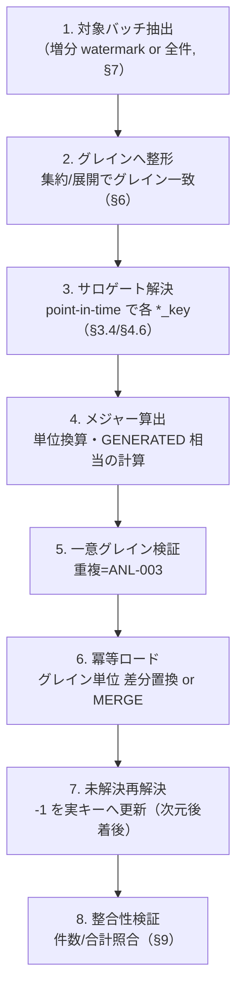

1. **対象バッチ抽出:** 増分は `load_run` の watermark（前回成功時刻/最大 id）以降を Raw/Staging から抽出（§7.1）。
2. **グレインへ整形:** ソースのグレインがファクトグレインと異なる場合、集約（粗→細は不可、細→粗は SUM）または按分展開（§6.2）。自社アプリは明細粒度がほぼ一致するため整形は軽い。
3. **サロゲート解決:** 各次元の `*_key` を point-in-time で解決（§3.4）。未解決は `-1`、確定的キーのみは推論メンバー（§4.5）。
4. **メジャー算出:** 単価×数量、値引・返品符号、通貨/単位換算（`dim_currency`/`dim_uom` 参照）。計算式は宣言的に一元管理。
5. **一意グレイン検証:** グレインキー（自然キー + degenerate）で重複がないか検証。重複は `ANL-003`。
6. **冪等ロード:** 対象バッチのグレイン範囲を**差分置換**（該当パーティション/キー範囲を DELETE → INSERT）または `MERGE`。同一バッチ再実行で二重計上しない（§9）。
7. **未解決の再解決:** 次元が後着した後、`-1`/推論メンバーを参照するファクトを実キーへ更新（§3.3/§4.5）。
8. **整合性検証:** §9 の件数/合計照合を実施し `load_run` を確定。

### 5.3 ファクトタイプ別のロード特性

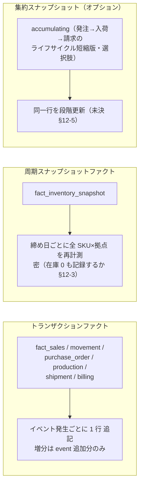

- **トランザクションファクト:** 追記中心。増分ロードは「前回以降の新規/更新イベント」を差分置換。返品・訂正は反対符号行 or 更新（業務ポリシー次第、35/07 と確定）。
- **周期スナップショット（`fact_inventory_snapshot`）:** 締め日ごとに在庫断面を再計測して**日付付きで全件**書く。密度（在庫ゼロ SKU も行を作るか）はストレージと分析要件のトレードオフ（未決 §12-3）。半加法（§5.1）。
- **集約スナップショット:** 発注→入荷→検収→請求のパイプライン日数分析などは accumulating snapshot が有効だが、初期スコープでは各段をトランザクションファクトで持ち、必要になれば派生ファクトを追加する（未決 §12-5）。

### 5.4 主要ファクトのソース対応（自社リファレンス Honshu の例）

| ファクト | 自社 OLTP ソース（32/33 等） | 変換要点 |
|---------|----------------------------|----------|
| `fact_sales` | メーカー売上（受注/売上, 32）、小売 `sales_transaction`（31, POS/EC）、卸 | 明細 → SKU×拠点×日付×販売先。値引/返品/原価を分解。継承の日本語ステータス層（07 ops-data）は SMALLINT 正規化後に投入（ブリーフ §15） |
| `fact_inventory_snapshot` | メーカー在庫、WMS `wms_inventory`（33, bin 単位を SKU×拠点へ集約） | bin → 拠点粒度へ roll-up。締め日基準で全 SKU×拠点 |
| `fact_inventory_movement` | WMS `inventory_movement`（33）、入出庫 | 移動イベントを ±qty で。入=+, 出=- を符号正規化 |
| `fact_purchase_order` | メーカー `purchase_orders`+lines / `material_orders`（32） | 発注明細 × 日付。受領数との差分は別メジャー |
| `fact_production` | メーカー `production_instructions`+lines（32） | 生産指示明細 × 日付。計画/実績/不良を分解 |
| `fact_shipment` | WMS `shipment`+lines（33） | 出荷明細。荷姿・重量を付与 |
| `fact_billing` | WMS `shipper_billing`+lines（33, 荷主請求）、請求 | 請求明細。課金レート（33 `billing_rate`）適用結果を格納 |

---

## 6. 自社アプリ vs 他社アプリの変換差分

両者とも最終的に同一 `dim_*`/`fact_*` へ収束するが、変換の重心が異なる。差別化の源泉（連携難易度の低さ, ブリーフ §1）を
実現するため、自社アプリは**スタースキーマ前提スキーマ**で最初から設計され、写像がほぼ機械的である。

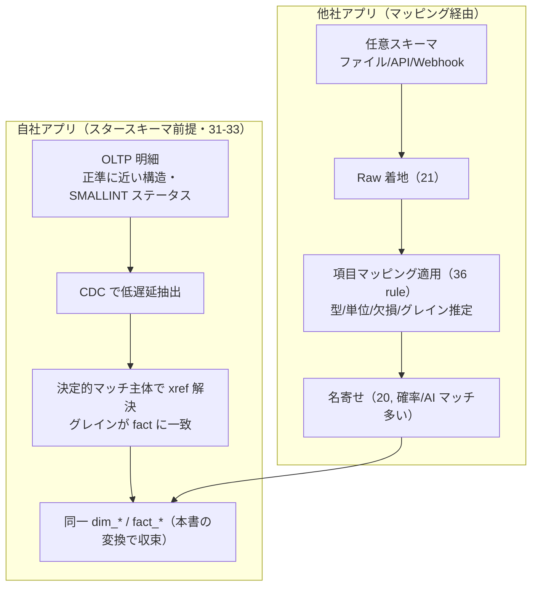

| 観点 | 自社アプリ（スタースキーマ前提） | 他社アプリ（マッピング経由） |
|------|-------------------------------|---------------------------|
| ソース構造 | 正準に近い設計・SMALLINT+CHECK ステータス（ブリーフ §9） | 任意・未知スキーマ、コード体系不定 |
| 抽出 | CDC/イベントで低遅延 | バッチ/ファイル投函で相対的に高遅延 |
| 正準化（xref 解決） | 決定的マッチ主体（GTIN/正規品番, 20 §4.3）で高確度 | 確率的 + AI 支援マッチ多く曖昧帯→人的レビュー発生 |
| グレイン | OLTP 明細 = fact グレインにほぼ一致（整形軽） | 集計済み/粗いことが多く按分展開 or 集約が必要（§6.2） |
| メジャー正規化 | 単位・通貨・符号が既に整合 | 単位換算・符号統一・欠損補完が必須（`ETL` 系） |
| SCD2 駆動 | ゴールデン改定 + OLTP 属性変更を直接検知 | ゴールデン改定経由が主 |
| 変換コスト | 低（写像がほぼ 1:1） | 高（マッピングルール + DQ ルールに依存） |

### 6.1 収束点の共通化（IQ-1: 汎用化はユーザー価値がある場合）

差分は「Raw → Canonical」段（21/36/20）に閉じ込め、「Canonical/Staging → dim/fact」段（本書）は
**ソース種別に依存しない単一変換**とする。これにより新規他社ソース追加時も本書の変換コードを変更せず、
36 のマッピングルール登録のみで取り込める（手動ステップを残さない, CLAUDE.md 原則1）。

### 6.2 グレイン不一致の吸収（他社アプリ主戦場）

- **集計済みソース（粗いグレイン）:** 例「日次・店舗合計の売上」しか無い他社データは、SKU 粒度へ**按分**できない場合はより粗い派生ファクト（or `-1` 商品次元）で受け、粒度制約をメタで明示する。恣意的按分はしない（数値の信頼性優先）。
- **明細より細かいソース:** トランザクションログ等はグレインへ SUM 集約。
- **グレイン推定の記録:** どのルールでグレインを合わせたかを `data_lineage`（36）へ記録し、後日の検証を可能にする。

---

## 7. 増分ロード・バックフィル・再構築

### 7.1 増分ロード（incremental）

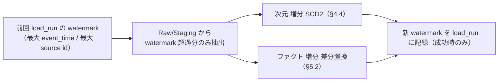

- **watermark:** ソースの単調増加列（`updated_at` / 連番 id / CDC LSN）を使う。**成功コミット後にのみ** watermark を前進させる（失敗時は据え置き→次回リランで取りこぼしを回復, `ANL-008`）。
- **重複耐性:** watermark 境界での二重取り込みを、グレイン差分置換（§5.2 手順6）＋ `Idempotency-Key`（ブリーフ §11）で吸収。
- **CDC:** 自社 OLTP は CDC（Glue/DMS 等）で更新/削除も伝播。削除はファクトの取消行 or 論理削除で反映（業務ポリシーは 35/07 と確定）。

### 7.2 バックフィル（backfill / 部分再処理）

過去の特定期間・特定テナント・特定次元起因（誤マージ split 等）で再計算が必要な場合の局所再処理。

- **範囲指定:** テナント × 日付レンジ × ファクト種別で対象を限定。当該範囲を差分置換で再ロードし、範囲外は不変（局所性）。
- **記録系の保護（CLAUDE.md 原則2）:** バックフィルは派生（dim/fact）を作り直すが、Canonical のゴールデン/xref・36 の `mapping_review`・`data_lineage` は SoT/記録系のため巻き戻さない。
- **split 連動:** canonical id 再採番（`MAP-003`）に伴う `*_key` 付け替えは、影響ファクトのグレイン範囲を特定してバックフィル（§4.6/§4.7 の契約）。

### 7.3 フル再構築（rebuild）

ルール/スキーマの大改定時に DWH を Raw/Canonical から作り直す。Raw はリプレイ可能（ブリーフ §5）なため常に可能。

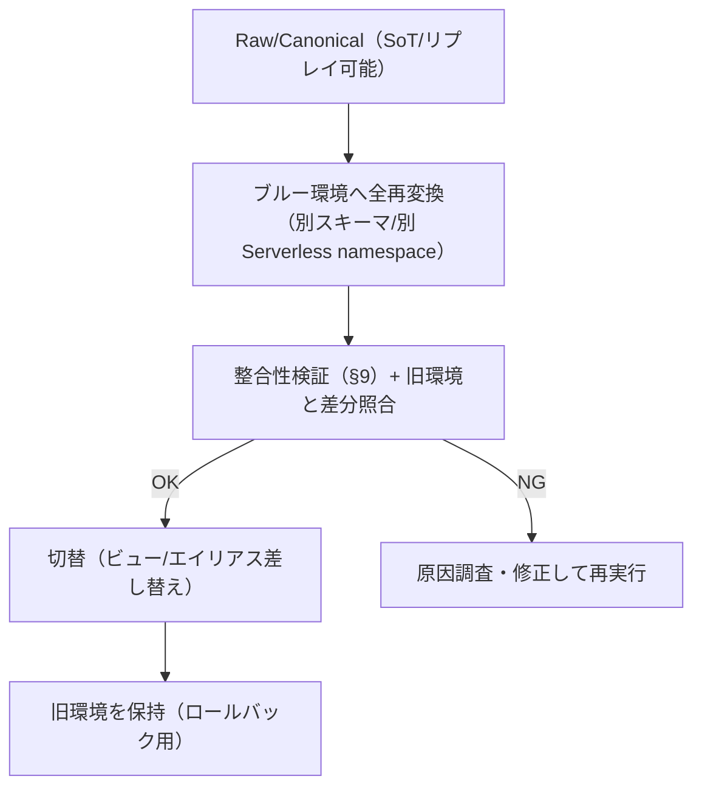

- **ブルー/グリーン再構築:** 稼働中スキーマを壊さず別領域で再構築 → 検証 → 切替。分析サービス停止を避ける（ユーザー体感の劣化コスト, SP-7）。
- **サロゲート安定性:** 再構築でサロゲートが振り直されると、スナップショット（26）や外部参照が壊れ得る。ビジネスキー（`*_bk`）ベースの再マッピング表を保持し、可能な限りサロゲートを維持する（未決 §12-6）。

### 7.4 Redshift DISTKEY / SORTKEY 最適化（変換側の要求・物理は 35）

物理配置の確定は 35 が所有するが、変換とクエリ性能に直結するため**要求方針**を提示する。

| テーブル | DISTSTYLE / DISTKEY（推奨） | SORTKEY（推奨） | 根拠 |
|---------|---------------------------|----------------|------|
| 小規模次元（date/channel/currency/uom/tenant/region） | `ALL`（全ノード複製） | 自然キー | 小さくファクトと頻繁結合。複製で結合ブロードキャスト回避 |
| 大規模次元（`dim_product` SKU 粒度） | `KEY(product_key)` | `(tenant_id, product_bk)` | ファクトと `product_key` で co-locate |
| `fact_sales` 等トランザクションファクト | `KEY(product_key)`（最大カーディナリティ結合キー）| 複合 `(tenant_id, date_key)` | 時間レンジ枝刈り + `dim_product` と co-locate |
| `fact_inventory_snapshot` | `KEY(product_key)` | `(tenant_id, date_key, location_key)` | 締め日 + 拠点での枝刈り |

- **テナント分離（ブリーフ §6）:** テナントは各行 `tenant_id` + SORTKEY 先頭で分離。DISTKEY を `tenant_id` にすると少数の巨大テナントで**データスキュー**が出るため、原則 DISTKEY は結合キー（`product_key`）、`tenant_id` は SORTKEY 先頭 + クエリ述語で枝刈りする。Silo テナント（大規模）は別 namespace 分離も選択肢（35 と確定）。
- **ロード時最適化:** COPY は S3 Parquet から並列ロード、事前に SORTKEY 順へ整列した Parquet を出力すると VACUUM 負荷が減る。Redshift Serverless の自動 VACUUM/ANALYZE を前提とし、大量差分置換後は必要に応じ明示 ANALYZE。

### 7.5 パーティション方針

- **Redshift（主）:** ネイティブパーティションは持たないため、**SORTKEY（ゾーンマップ）**で時間・テナント枝刈りを実現する（§7.4）。古いデータは UNLOAD で S3 へアーカイブし DWH を軽量に保つ選択肢。
- **レイクハウス代替（Athena + Iceberg, ブリーフ §4）:** こちらを採る場合は `tenant_id` / `date`（年月）で物理パーティション。Iceberg のパーティション進化・スナップショット隔離を活用。DWH 実体の最終選択は 35 / ADR。

---

## 8. スナップショット静的ファイル生成との接続（→ 26）

高頻度アクセスの定型集計（例: 商品 × 地域 × 月次の売上サマリ）は、DWH へ都度クエリせず**事前集計 → 静的ファイル
（S3 Parquet/JSON + CloudFront, ブリーフ §5）**として配信する。本書はその**起動点と入力契約**まで所有し、生成実装・
DocDB 読み取りモデル・配信は 26 が所有する。

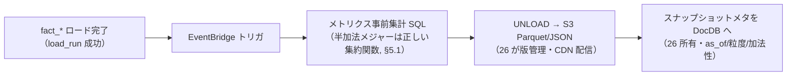

- **接続契約:** 本書は「ファクトロード成功後、対象スナップショットの再集計を発火する」ことと、「メジャーの加法性区分（§5.1）を伝達する」ことを保証する。26 は「静的ファイルの生成・版管理・`as_of` 一貫性・配信」を担う。
- **一貫性:** スナップショットは特定 `load_run`/`as_of` の断面。ファクト再ロード（§7）が走ったら該当スナップショットを再生成する（古い集計の残存を防ぐ）。生成失敗はサービング全体を止めない（非ブロッキング, 原則4）。

---

## 9. データ整合性検証・冪等性・失敗時のリラン

### 9.1 整合性検証（件数・合計照合）

各 `load_run`（36 所有）ごとに、ソース断面と DWH 投入結果の**コントロールトータル**を照合する。不一致は
`ANL-009` で失敗扱いにし、当該ランをコミットしない（部分投入の防止）。

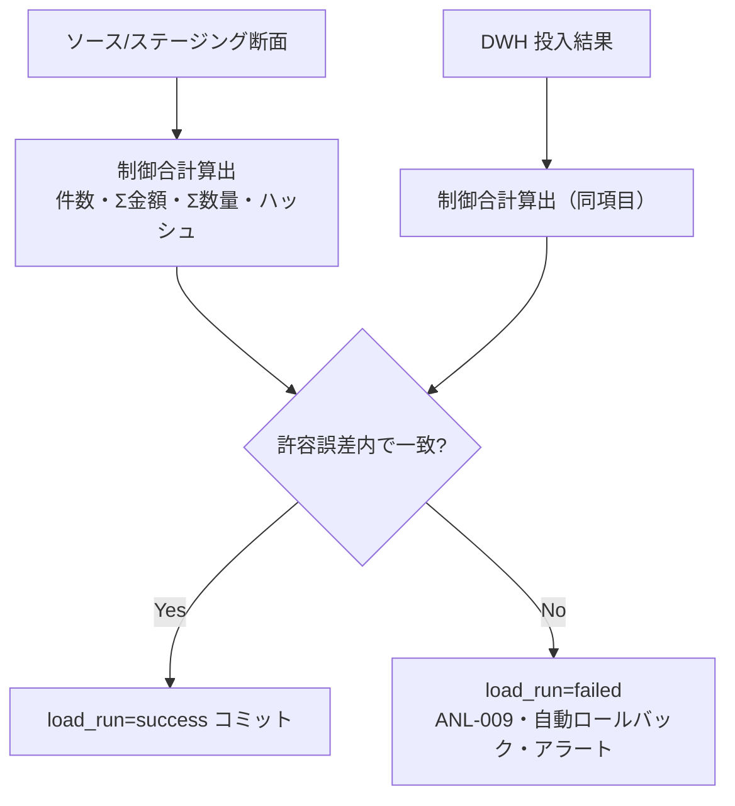

| 照合項目 | 内容 | 許容 |
|---------|------|------|
| 件数照合 | ソース対象件数 = ファクト投入件数 + Unknown(-1) 件数 + 明示除外件数 | 完全一致（差は必ず説明可能に分解） |
| 金額合計 | `SUM(gross_amount)` 等がソースと一致 | 丸め起因の微小誤差のみ許容（閾値定義） |
| 数量合計 | `SUM(qty)` 一致 | 同上 |
| 次元被覆 | ファクトが参照する `*_key` が dim に存在（`-1` 除く） | 孤児ゼロ（`ANL-001`） |
| 重複グレイン | 一意グレイン違反ゼロ | ゼロ（`ANL-003`） |

- **分解可能性:** 件数差は「Unknown 送り」「検証除外」「重複排除」に必ず内訳分解できること。説明不能な差は障害。
- **半加法メジャー:** 在庫スナップショットの合計照合は日付軸で SUM せず、締め日ごとの断面で照合（§5.1）。

### 9.2 冪等性チェックリスト（Push 前・CLAUDE.md 準拠）

| 問い | 本書での担保 |
|------|-------------|
| 2 回ロードで二重計上しないか | ファクトはグレイン単位 差分置換 or MERGE、次元は `row_hash` 差分で版を増やさない（§4.4/§5.2） |
| 記録系が巻き戻らないか | Canonical ゴールデン/xref・36 `mapping_review`/`data_lineage`・監査ログは SoT/記録系で不可侵。DWH は再生成可能な派生のみ |
| watermark 取りこぼし | 成功コミット後のみ watermark 前進、境界重複は差分置換で吸収（§7.1, `ANL-008`） |
| 補助処理失敗が主フローを止めないか | スナップショット再生成・ANALYZE は非同期・非ブロッキング（§8, 原則4） |
| SoT → 派生の順序 | Canonical → dim → fact → snapshot の一方向（§2 不変則2） |

### 9.3 失敗時のリラン

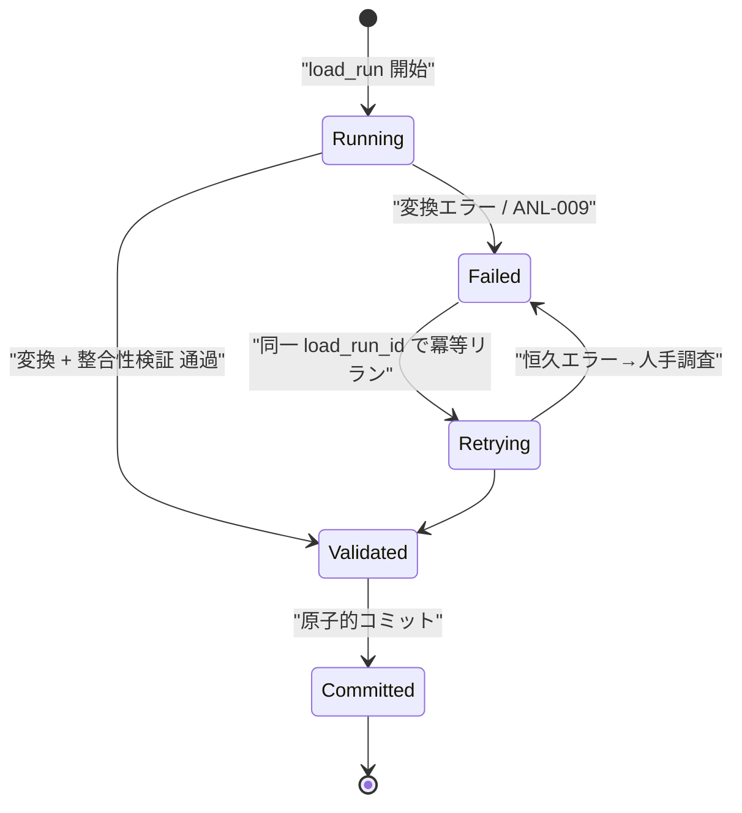

- **原子性:** 次元 SCD2 更新・ファクト差分置換・検証を可能な限り同一トランザクション/単一 load_run で束ね、途中失敗は全ロールバック（部分状態を残さない）。
- **冪等リラン:** 失敗ランは同一 `load_run_id` で再実行。差分置換 + `row_hash` 判定により、成功済み部分は再実行しても不変。
- **恒久 vs 一時エラー:** 一時（ロック競合・スロットリング）は自動リトライ、恒久（スキーマ不整合・ルール矛盾）は `load_run=failed` で停止し人手調査へ（IQ-3: 動くだけでレビューに出さない）。

---

## 10. データフロー整合性と SoT 宣言

### 10.1 SoT マップ（本書が扱うデータ）

ブリーフ §5 準拠。CLAUDE.md 原則6。

| データ | SoT | 派生/キャッシュ | 同期方向 |
|--------|-----|----------------|----------|
| ファクトの事実（取引/在庫/移動/発注/生産/出荷/請求） | 各 OLTP（31-33）/ Raw（21） | `fact_*`（35, 派生） | ソース → 本書変換 → fact（一方向） |
| 次元の属性（商品/拠点/顧客/仕入先/地域） | Canonical ゴールデン（34） | `dim_*`（35, 派生） | Canonical → 本書変換 → dim（一方向） |
| サロゲートキー ⇄ ビジネスキー対応 | `dim_*`（35, `*_key`/`*_bk`） | — | 本書が採番・DWH が保持 |
| SCD2 版履歴（valid_from/to/is_current/row_hash） | `dim_*`（35） | — | 本書が生成・記録系として保護 |
| ロード来歴（load_run/watermark/lineage） | 36 | — | 記録系・append |
| スナップショット静的ファイル | 派生（fact 由来, 26） | ○ | fact → 事前集計 → 静的ファイル |

### 10.2 変更時の必須確認（CLAUDE.md 原則6 準拠）

- **新規ファクト/次元を追加する場合:** グレイン宣言（§5.1）・加法性区分・適合次元共有（§3.1）・SCD タイプ（§4.1）を同時に定義したか。物理は 35 に反映したか。
- **サロゲート/SCD ロジックを変更する場合:** 既存版履歴・既存ファクト参照を壊さないか（下位互換, 原則7）。バックフィル手順（§7.2）を用意したか。
- **上流（Canonical）契約変更:** 20 の発火イベント（§4.7）との整合を確認したか。

---

## 11. 想定エラーコード

ブリーフ §10、`DOMAIN-NNN` 形式。本書（スタースキーマ変換）で発生しうる想定エラーを `ANL`（分析）系で採番し、
上流連携由来は `ETL`/`MAP` を参照する。

| コード | 意味 | 発生箇所 | 主所有 |
|--------|------|----------|--------|
| ANL-001 | ファクトのサロゲート解決失敗（次元未解決 → Unknown(-1) 送り） | ファクトロード §3.4/§5.2 | 22 |
| ANL-002 | SCD2 変更検知の row_hash 対象属性欠落（スキーマ不整合） | 次元ロード §4.2 | 22 |
| ANL-003 | ファクトの一意グレイン違反（重複行・二重計上リスク） | ファクトロード §5.2 | 22 |
| ANL-004 | 非加法/半加法メジャーの不正集計（時間軸 SUM 等） | 集計/スナップショット §5.1/§8 | 22/07 |
| ANL-005 | 適合次元の粒度不一致（fact 間で dim 粒度が食い違う） | 次元共有 §3.1 | 22/35 |
| ANL-006 | 遅延到着次元：推論メンバー生成（warning・後日補完要） | 次元ロード §4.5 | 22 |
| ANL-007 | 遅延到着ファクト：point-in-time 版解決失敗（暫定 -1） | ファクトロード §4.6 | 22 |
| ANL-008 | 増分ロードの watermark 不整合（前進失敗/巻き戻り疑い） | 増分ロード §7.1 | 22 |
| ANL-009 | 整合性検証の件数/合計照合不一致（コミット中止） | 検証 §9.1 | 22 |
| ANL-010 | リラン冪等性違反（差分置換不能・重複ロード検出） | リラン §9.3 | 22 |
| MAP-001 | クロスウォーク未解決（app-local id に正準未確定） | サロゲート解決入力 | 20/36（参照） |
| MAP-003 | 誤マージ split（canonical id 再採番→ファクト付け替え） | SCD2 駆動 §4.7/§7.2 | 20（参照） |
| ETL-001 | source_system/source_record_id 欠落 | 取込入力 | 21/36（参照） |
| CMN-001 | テナントスコープ違反（tenant_id 不整合の変換） | 全処理 | 11/37（参照） |

---

## 12. 未決事項 / 論点

| # | 論点 | 選択肢とトレードオフ | 委譲先 |
|---|------|---------------------|--------|
| 1 | SCD2 更新を 2 フェーズ staging vs Redshift `MERGE` | staging=可読・移植性／MERGE=文数削減だが SCD2 のクローズ+挿入を 1 文化しづらい。性能実測で決定 | 22/35（PoC 実測後） |
| 2 | 遅延到着ファクトが最古版より前の場合の既定 | valid_from 遡及調整（当時属性は Unknown）／Unknown(-1) 暫定紐付け。履歴正確性 vs 単純性 | 22/35/07 |
| 3 | `fact_inventory_snapshot` の密度（在庫 0 SKU も行を作るか） | 密=全 SKU×拠点で欠品分析容易だがストレージ増／疎=軽量だが 0 在庫の可視化に補完要 | 22/35 |
| 4 | `dim_date` の会計期/祝日のテナント差の吸収方法 | 単一 dim_date + 会計期別次元／テナント別 dim_date。共有と個別のトレードオフ | 22/35/37 |
| 5 | 発注→入荷→請求のライフサイクル分析を accumulating snapshot 化するか | 段階更新 fact=パイプライン日数分析容易／トランザクション fact 複数=単純だが結合コスト | 22/07（要件確定後） |
| 6 | フル再構築時のサロゲート安定性の担保方式 | `*_bk` ベース再マッピング表で維持／振り直し許容（外部参照は再解決）。26 スナップショット参照への影響大 | 22/26/35 |
| 7 | DWH 実体の最終選択（Redshift Serverless vs Athena+Iceberg） | Redshift=低レイテンシ結合／レイクハウス=安価・柔軟パーティション。DISTKEY/SORTKEY vs パーティション設計が分岐 | 35 / ADR（12） |
| 8 | CDC の削除イベントのファクト反映（取消行 vs 論理削除 vs 物理削除） | 取消行=監査追跡容易・行増／論理削除=軽量／物理=最軽量だが履歴喪失 | 22/35/07 |

---

## 関連ドキュメント

- [データベース設計: スタースキーマ DWH](../database-design/35-star-schema-dwh.md)（35） — 本書が変換対象とする `dim_*`/`fact_*` の**物理所有**（列・制約・DISTKEY/SORTKEY・テナント分離）。本書の物理最適化要求（§7.4）の確定先。
- [詳細設計: Canonical / MDM / 名寄せ](./20-canonical-mdm-and-entity-resolution.md)（20） — 本書の入力であるゴールデンレコード・xref の生成、ゴールデン改定 → SCD2 駆動の上流契約（§4.7）の出所。
- [詳細設計: 取込とマッピングパイプライン](./21-ingestion-mapping-pipeline.md)（21） — Raw/Staging・項目マッピング適用・`load_run`/watermark の実装。本書のステージング入力の供給元。
- [データベース設計: マッピングメタデータ](../database-design/36-mapping-metadata.md)（36） — `mapping_rule`/`data_lineage`/`load_run`/`mapping_review` の物理所有。変換来歴・グレイン推定記録の格納先。
- [詳細設計: スナップショット / DocDB](./26-snapshot-document-db.md)（26） — 事前集計静的ファイルの生成・版管理・CDN 配信・DocDB 読み取りモデル。本書の集計起動点（§8）の下流。
- [基本設計: 分析・可視化サービス](../basic-design/07-service-analytics.md)（07） — メトリクス/セマンティック層・加法性制約の消費者。本書のファクト加法性区分（§5.1）を利用する。
