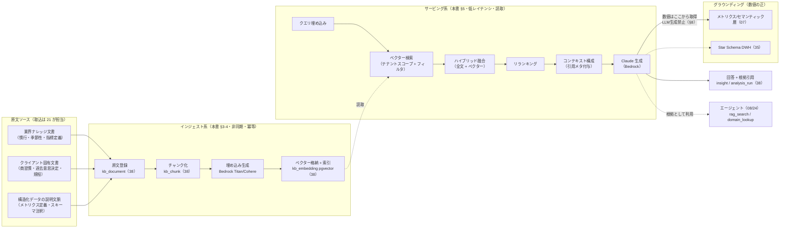
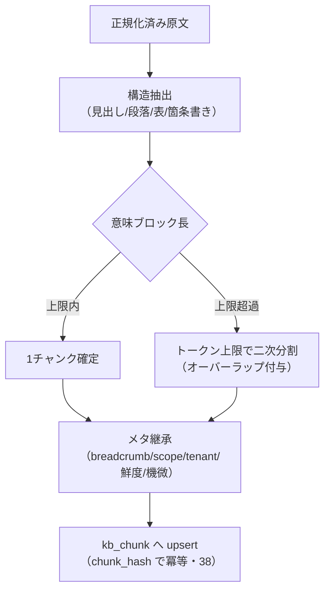
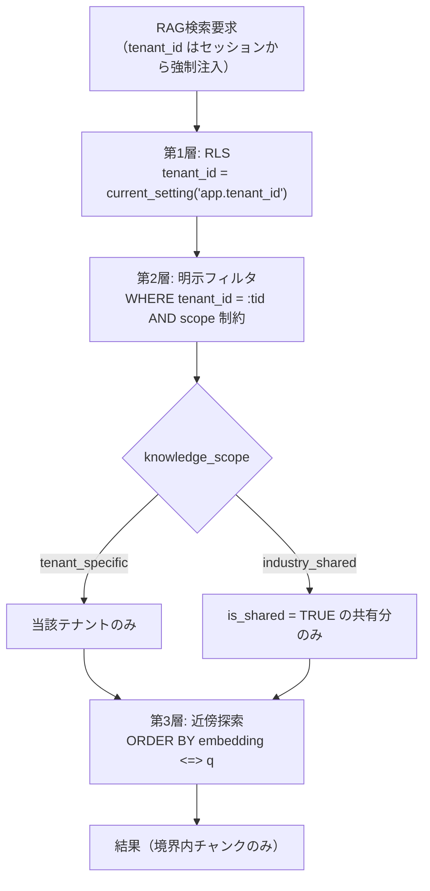
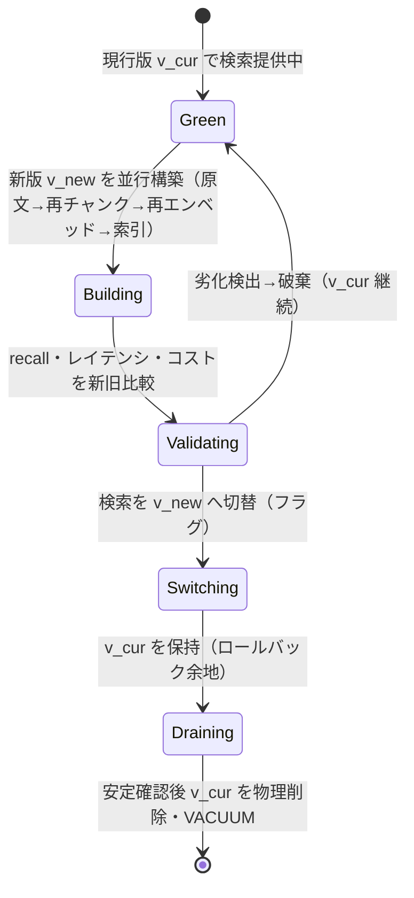
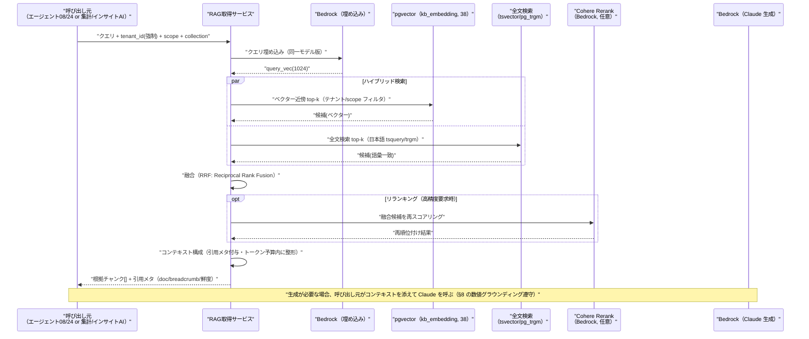
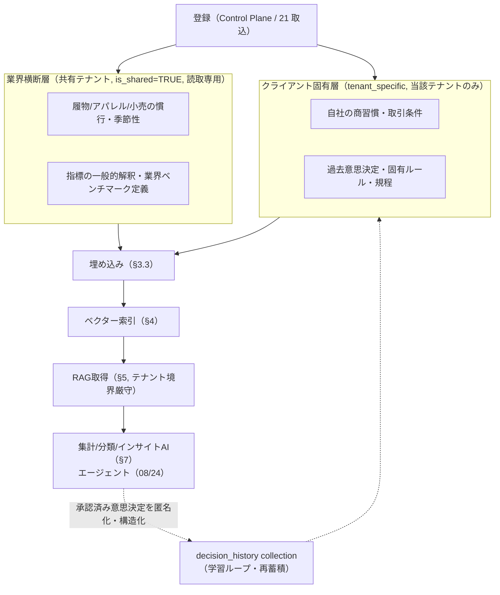
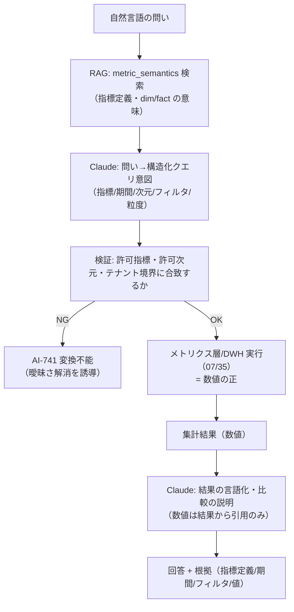
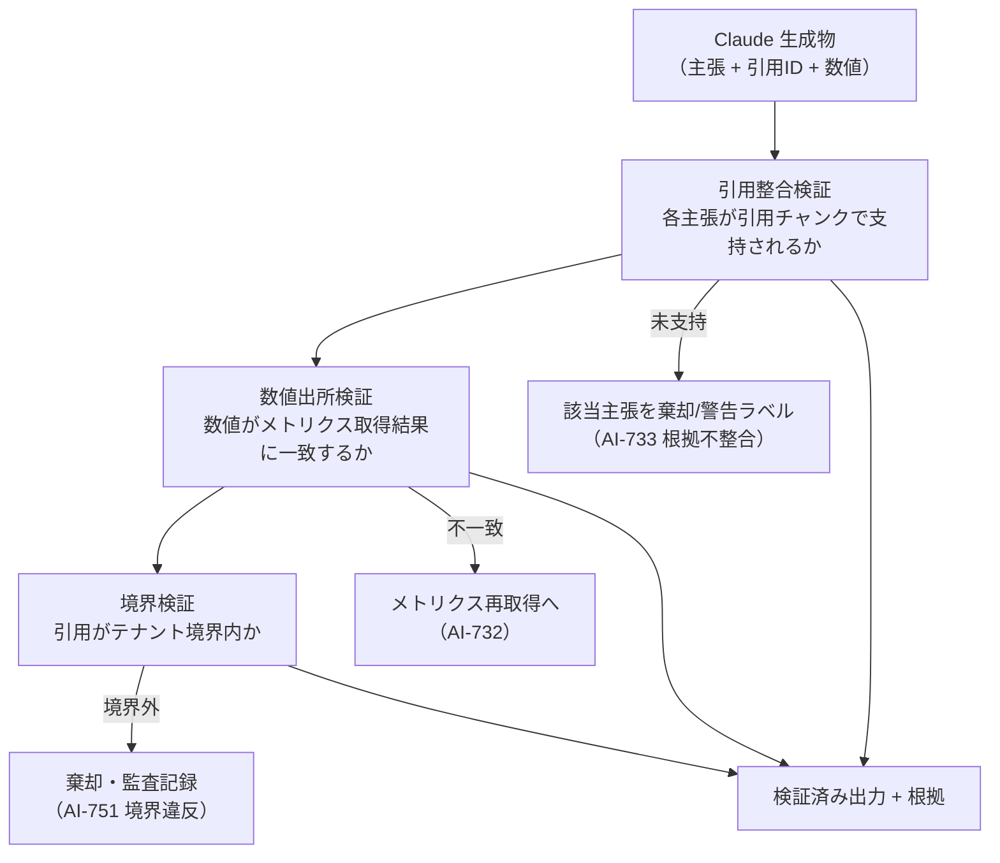

# 詳細設計: AI / RAG / ベクター化

本書は **SCIP（Supply Chain Intelligence Platform、コード名。正式名称は未確定）** の **Intelligence Plane（AI層、ブリーフ §3）** を支える
**RAG（Retrieval-Augmented Generation）パイプライン**と**ベクター化基盤**の詳細実装ロジックを定義する。
すなわち **原文取込 → チャンク化 → 埋め込み（Amazon Bedrock）→ pgvector 格納 → RAG 取得 → Claude（Bedrock）生成** の各段と、
その上に載る **集計・分類・インデックス化・ベクター化・インサイト生成** の AI ユースケース、
そして **ハルシネーション抑制・ガードレール・モデル/コスト運用** を、実装者が着手できる粒度まで落とし込む。

> **位置づけ / 所有範囲（owns。ブリーフ §14 テーブル所有マップ準拠）:**
> 本書は **RAG / ベクター化の「詳細ロジック」を権威的に所有する** — チャンク化戦略、埋め込み生成方式、
> **ベクターインデックス設計（pgvector: HNSW/IVFFlat・次元・距離・テナント/名前空間分離・再インデックス）**、
> RAG 取得アルゴリズム（ハイブリッド検索・リランキング・コンテキスト構成）、集計/分類/インサイト生成の実行ロジック、
> ハルシネーション抑制方式、AI ガードレールの実装、Bedrock モデル/コスト運用。
> 以下は **参照するが再定義しない**:
> - **物理スキーマ**（`kb_document` / `kb_chunk` / `kb_embedding`(pgvector) / `domain_knowledge` / `insight` / `analysis_run` の CREATE TABLE・列・制約・`tenant_id`・RLS、および DocDB(DynamoDB) アイテム形状）は
>   [`38 AI/ベクター/ナレッジスキーマ`](../database-design/38-ai-vector-knowledge-schema.md) が所有。本書はベクターインデックスの**設計仕様（索引 DDL パターン・パラメータ）を提示**するが、テーブル本体の DDL は 38 が権威。
> - **エージェント編成・意思決定支援ワークフロー・HITL** は [`08 意思決定支援/AIエージェント`](../basic-design/08-service-decision-support-ai.md)、詳細実装は [`24 AIエージェント/バーチャルカンパニー`](./24-ai-agent-and-virtual-company.md) が所有。本書はエージェントに**根拠検索（`rag_search`/`domain_lookup`）を供給する基盤**に徹する。
> - **メトリクス/セマンティック層・集計・異常検知の本体**は [`07 分析・可視化`](../basic-design/07-service-analytics.md)、物理 dim/fact は [`35 スタースキーマ DWH`](../database-design/35-star-schema-dwh.md) が所有。**数値はここから取得し、LLM に生成させない**（§8）。
> - **原文の取込パイプライン（コネクタ・Raw ランディング）** は [`21 取込 & 項目マッピング`](./21-ingestion-and-mapping-pipeline.md) が所有。本書は **KB 原文が取込まれた後の「ベクター化」以降**を主担当とする。

- **土台:** ブリーフ §12（AI/RAG/エージェント規約）を実装方針の起点とする。LLM は **Amazon Bedrock 上の Anthropic Claude モデル群**、埋め込みは **Bedrock（Titan / Cohere）**、ベクターストアは **pgvector on Aurora PostgreSQL**（主）／ Amazon OpenSearch Service（大規模代替）（ブリーフ §4）。

---

## 1. SoT 宣言とデータフロー整合性

本書が扱うデータの Source of Truth（SoT）と派生関係を明示する（ブリーフ §5 の原則: SoT 先行書込 → 派生後追い。CLAUDE.md 原則6）。

| データ | SoT | 本書での扱い | 再構築可否 | 所有 |
|--------|-----|------------|-----------|------|
| KB 原文（ドキュメント本体・添付） | **S3（原本バイト）+ RDS メタ**（`kb_document`） | 参照（取込は 21） | — | 38 / 21 |
| チャンク（分割済みテキスト片） | **派生**（原文から再生成可能） | 本書が生成ロジックを所有 | ○ 原文から再チャンク | 38（`kb_chunk`） |
| 埋め込みベクター | **派生**（チャンク × 埋め込みモデル版から再生成可能） | 本書が生成・索引を所有 | ○ 再エンベッド | 38（`kb_embedding`） |
| ドメイン知識（業界横断 + クライアント固有） | **原文=SoT（S3/RDS）**、ベクター=派生 | 本書が活用ロジックを所有 | ○ | 38（`domain_knowledge`）/ 23 |
| インサイト（生成メタ） | **生成メタは AI DB が SoT**、内包する**数値は DWH が SoT** | 本書が生成ロジックを所有 | 数値は再取得、文面は再生成 | 38（`insight`）|
| 分析実行ログ（どのメトリクス/RAG/モデルを使ったか） | **AI DB が SoT（append-only）** | 本書が記録項目を定義 | × 再現用に不変保持 | 38（`analysis_run`）|
| メトリクス値・集計値・dim/fact | **DWH / メトリクス層が SoT** | 参照のみ（数値取得元） | — | 07 / 35 |
| 埋め込みモデル版・チャンク設定・索引設定 | **設定は AI DB が SoT** | 本書が定義 | — | 38 / 本書 |

> **中核原則:** ベクター/チャンクは**すべて派生データ**であり、原文（SoT）から**冪等に再構築可能**でなければならない（CLAUDE.md 原則2）。
> 埋め込みモデルの更新・チャンク戦略の変更・障害復旧時は、原文を源泉に**再エンベッド／再インデックス**するパス（§4.6）を常設する。逆に、原文を伴わないベクターだけの手修正は禁止（SoT から復元不能な状態を作らない）。

---

## 2. AI / RAG 全体アーキテクチャ

Intelligence Plane の RAG パイプラインは、**インジェスト系（書込・非同期・冪等）** と **サービング系（読取・低レイテンシ）** の 2 系統に分かれる。
インジェストは原文の変化に追随してベクターを最新化し、サービングは確定済みベクターに対して検索・生成を行う。



- **インジェストとサービングの分離理由:** 埋め込み生成は高コスト・高レイテンシ（Bedrock API 呼び出し）であり、サービング要求ごとに実行すると SLA を満たせない。原文更新イベントでのみインジェストを走らせ、サービングは索引済みベクターの近傍探索に徹する。
- **非ブロッキング（CLAUDE.md 原則4）:** インジェストの失敗（1 文書の埋め込み失敗等）は他文書・サービングを止めない。失敗は隔離（DLQ）し、部分成功で前進、手動再エンベッドで回復する。

---

## 3. RAG インジェスト・パイプライン詳細

### 3.1 原文取込と正規化（KB Document）

原文は [`21`](./21-ingestion-and-mapping-pipeline.md) の取込基盤で S3 に着地し、`kb_document`（38）へメタ登録される。本書はその後段、**ベクター化前の正規化**を定義する。

| 段 | 処理 | 実装ポイント |
|----|------|------------|
| 抽出 | PDF/Docx/HTML/CSV/メール等からプレーンテキスト + 構造（見出し・表・箇条書き）を抽出 | 表は行単位に線形化しつつ、列見出しを各行に添えて文脈を保存。画像内テキストは OCR（範囲外・未決 §13-5） |
| 正規化 | 文字コード統一（UTF-8）、全角/半角・改行・制御文字の正規化、重複空白除去 | 日本語は形態素境界を壊さない。過度な正規化で意味単位を崩さない |
| メタ付与 | `knowledge_scope`（industry_shared / tenant_specific）、`source_system`、`legacy_id`、言語、鮮度（`effective_from`/`effective_to`）、機微区分 | メタは検索フィルタ・テナント境界・鮮度管理の基盤（§5.3 / §6） |
| 冪等キー | `content_hash = sha256(正規化本文)` を `kb_document` に保持 | 同一原文の再取込は content_hash 一致でスキップ（AI-701） |

> **機微区分の早期判定:** 原価・仕入単価・個人情報を含む文書は取込段でフラグ付けし、埋め込み前マスキング（§9.2）の対象にする。**機微生値をそのままベクター化しない**（ベクターは復元耐性が完全でなく、また RAG で意図せず露出しうる）。

### 3.2 チャンク化戦略

チャンク化は RAG 品質を左右する最重要工程。**構造認識型（structure-aware）チャンク化**を標準とする。

| 方針 | 既定値 | 理由 / 調整指針 |
|------|--------|---------------|
| 分割単位 | 見出し・段落・表行の**意味境界優先**、その上でトークン上限で二次分割 | 文の途中切断を避ける。日本語は句点・箇条書き・見出しを境界候補にする |
| チャンクサイズ | 目標 300〜600 トークン（上限 800） | 埋め込みモデルの文脈長と検索粒度のバランス。長文規程は小さめ、慣行解説は大きめ |
| オーバーラップ | 前後 10〜15%（40〜80 トークン） | 境界跨ぎの文脈欠落を緩和。過大なオーバーラップは重複ヒット・コスト増を招く |
| メタ継承 | 各チャンクに `document_id`・見出しパス（breadcrumb）・`knowledge_scope`・`tenant_id`・鮮度・機微区分を継承 | 検索後の引用生成・フィルタ・境界強制に必須 |
| チャンク版管理 | `chunking_profile_id`（サイズ/オーバーラップ/分割器の版）を `kb_chunk` に保持 | 戦略変更時に旧チャンクと区別し、再チャンク対象を特定（§4.6） |



- **冪等性:** チャンクは `chunk_hash = sha256(chunk_text + chunking_profile_id)` で識別。再インジェスト時、ハッシュ一致チャンクは埋め込みをスキップ（コスト削減 + AI-702 の抑止）。

### 3.3 埋め込み生成（Bedrock）

| 項目 | 標準方針 | 備考 |
|------|----------|------|
| 埋め込みモデル | **Amazon Titan Text Embeddings V2**（主, 次元 1024）／ **Cohere Embed Multilingual**（多言語代替, 1024） | 日本語比率が高いため多言語性能を評価。最終選定は ADR（未決 §13-1） |
| 次元 | **1024**（Titan V2 は 256/512/1024 可変。索引コストと精度のバランスで 1024） | 次元は索引・ストレージ・検索速度に直結。テナント横断で統一 |
| 正規化 | 単位ベクターに L2 正規化（cosine 距離前提） | Titan V2 は正規化オプションあり。距離オペレータと整合させる |
| バッチ | インジェストは**バッチ埋め込み**（複数チャンクをまとめて送信）。クエリ埋め込みは単発・低レイテンシ | スループット確保とコスト最適化。レート超過は指数バックオフ（AI-711） |
| モデル版記録 | `embedding_model`・`embedding_version`・`dim`・`normalized` を `kb_embedding` に保持 | 混在検索を防ぐ。検索時は同一モデル版のみを対象にする（§4.5） |

> **モデル版の一貫性（重要）:** クエリとドキュメントは**必ず同一の埋め込みモデル・同一次元**でベクター化する。異なるモデル版のベクターを同一索引で近傍探索すると距離が無意味になる。モデル更新時は §4.6 の**版切替（ブルーグリーン再インデックス）**で移行する。

### 3.4 ベクター格納

埋め込みは `kb_embedding`（38 所有）へ格納する。本書は**格納の論理契約**を定義する（列の権威定義は 38）。

- 各行は `(tenant_id, chunk_id, collection, embedding vector(1024), embedding_model, embedding_version, knowledge_scope, is_shared, effective_from, effective_to, is_deleted)` を持つ想定（列の正は 38）。
- **`collection`（NOT NULL、論理名前空間識別子）:** 用途分離の要であり、§4.4 の用途別コレクション、§4.5 の一貫性ルール（`embedding_version` × `collection` × `tenant_id`）、§5.3 の必須フィルタが機能上依存する。**本書がベクター検索の設計仕様として `collection` の存在を要求する**。その所在（`kb_embedding` に列として保持するか、`kb_chunk` から継承するか）と権威的な列定義・型・制約は **38 が定める**（未確定なら 38 側の設計判断とする）。いずれの所在でも近傍探索時に `collection` で絞り込めることを 38 に要求する。
- **upsert 冪等:** `(chunk_id, embedding_version)` を一意キーとし、同一チャンク×同一モデル版の再格納は上書き（重複行を作らない）。`collection` はチャンクの用途で一意に定まるため、この一意キーと矛盾しない（同一チャンクは単一 collection に属する）。
- **論理削除:** 原文失効・チャンク再分割時は `is_deleted` で無効化し、検索から除外。物理削除は再インデックス時にまとめる（VACUUM 負荷平準化）。

---

## 4. ベクターインデックス設計（pgvector）

本節は本書が権威的に所有する**ベクター索引の設計仕様**である。索引 DDL パターン・パラメータ・テナント分離・再インデックス手順を定義する（`kb_embedding` テーブル本体の列定義は 38 が所有）。

### 4.1 索引方式の選択: HNSW vs IVFFlat

| 観点 | HNSW（既定） | IVFFlat |
|------|-------------|---------|
| 検索精度（recall） | 高い（グラフ探索） | 中（クラスタ近似。lists/probes 依存） |
| 検索速度 | 高速・安定 | 高速だが probes で精度とトレードオフ |
| 構築コスト/時間 | 高い（グラフ構築） | 低い（k-means クラスタリング） |
| メモリ使用 | 多い | 少ない |
| 追加挿入 | インクリメンタル可（構築不要） | 挿入は可だが**事前にデータ投入後の再構築で品質確保**が必要 |
| 推奨規模 | 中〜大（更新頻度あり） | 大規模・バルクロード後に固定的な集合 |

> **既定は HNSW。** ドメインナレッジは逐次追加・更新されるため、再構築不要でインクリメンタルに挿入できる HNSW を標準とする。
> 極めて大規模（テナント単位で数千万ベクター超）で更新が疎な場合のみ IVFFlat を検討し、それでも要件を超える場合は **OpenSearch Service（大規模代替、ブリーフ §4）** へ移行する（未決 §13-2）。

### 4.2 距離オペレータと索引 DDL

L2 正規化済みベクターに対し **cosine 距離**（`vector_cosine_ops`）を用いる。索引の設計仕様は以下（38 のテーブル定義前提）。

```sql
-- 前提: pgvector 拡張（Aurora PostgreSQL）。テーブル本体の CREATE は 38 が所有。
-- CREATE EXTENSION IF NOT EXISTS vector;

-- HNSW 索引（既定）。cosine 距離。
-- m: 各ノードの最大接続数（既定16）。ef_construction: 構築時の探索幅（既定64）。
CREATE INDEX idx_kb_embedding_hnsw_cos
    ON kb_embedding
    USING hnsw (embedding vector_cosine_ops)
    WITH (m = 16, ef_construction = 64)
    WHERE is_deleted = FALSE;                 -- 部分索引: 有効行のみ索引化

-- 検索時の探索幅（recall と速度のトレードオフ。セッション単位）
-- SET hnsw.ef_search = 40;                   -- 既定40。精度優先で 80-100 まで上げる

-- 代替: IVFFlat（大規模・更新疎な場合）。lists は行数に応じて調整。
-- 目安: 行数 <= 1M なら lists = 行数/1000、> 1M なら lists = sqrt(行数)
-- CREATE INDEX idx_kb_embedding_ivf_cos
--     ON kb_embedding USING ivfflat (embedding vector_cosine_ops)
--     WITH (lists = 1000) WHERE is_deleted = FALSE;
-- SET ivfflat.probes = 10;                   -- probes を上げると精度↑速度↓
```

- **距離クエリの記法:** 近傍探索は `ORDER BY embedding <=> :query_vec LIMIT :k`（`<=>` = cosine 距離）。`<->`（L2）や `<#>`（内積）は正規化前提が異なるため混用しない。
- **次元制約:** pgvector の `vector` 型は HNSW/IVFFlat で **2000 次元まで**索引可能。本設計は 1024 次元のため余裕がある（将来 2000 超の高次元モデルを使う場合は `halfvec`（半精度、最大 4000 次元）を検討。未決 §13-1）。

### 4.3 テナント / 名前空間分離（最重要ガードレール）

ベクター検索は **テナント境界の最終防衛線**である。**アプリのクエリ条件だけに依存せず、多層で境界を強制**する（ブリーフ §6/§12、CLAUDE.md 原則6）。



| 層 | 機構 | 目的 |
|----|------|------|
| RLS | PostgreSQL Row-Level Security（`tenant_id = current_setting('app.tenant_id')::bigint`。38 が定義） | DB レベルでクロステナント読取を構造的に不可にする |
| 明示フィルタ | クエリ WHERE に `tenant_id` + `knowledge_scope` + `is_shared` を必須付与（呼び出し側で強制注入、プロンプト経由でテナントを渡さない） | RLS の二重化 + 名前空間（scope）分離 |
| 近傍探索 | フィルタ後集合に対してのみ `<=>` 探索 | 境界外ベクターは探索対象に入らない |

- **共有ナレッジの扱い:** 業界横断ナレッジは、専用の**プラットフォーム共有テナント**（`tenant_id` = 予約値、`is_shared = TRUE`）に格納し、全テナントが**読取のみ**アクセスできる RLS ポリシーを 38 で定義する。クライアント固有ナレッジ（`tenant_specific`）は当該 `tenant_id` のみ。両者を1クエリで検索する場合も、共有分は `is_shared = TRUE` に限定する（§6.2）。
- **フィルタ付き近傍探索の recall 対策:** HNSW でフィルタ（`tenant_id` 等）を伴う探索は、素朴に実装すると `ef_search` 分の候補がフィルタで削られ recall が落ちる。対策として **pgvector 0.8 の反復インデックススキャン（iterative index scan）** を有効化するか、大規模テナントは **テナント別パーティション/部分索引**で物理分離する（未決 §13-2）。

### 4.4 名前空間（コレクション）による用途分離

同一テナント内でも用途の異なるベクターを混ぜない。`collection`（論理名前空間）で分離する。

| collection 例 | 内容 | 検索文脈 |
|--------------|------|---------|
| `domain_industry` | 業界横断ナレッジ（共有テナント） | 慣行・季節性・指標解釈 |
| `domain_client` | クライアント固有ナレッジ | 自社規程・過去意思決定・取引条件 |
| `metric_semantics` | メトリクス/dim/fact の定義説明文（07/35 由来） | 集計AI の NL→クエリ変換の根拠 |
| `decision_history` | 匿名化・構造化された過去意思決定（学習ループ、§6.2） | 類似課題の前例参照 |

### 4.5 検索対象の一貫性ルール

近傍探索は必ず **同一 `embedding_version` かつ同一 `collection`（+ テナント境界）** の集合に閉じる。クエリ埋め込みは検索対象と同じモデル版で生成する。混在は距離を無意味化するため、検索サービスはモデル版を検索パラメータとして受け取り WHERE に付与する。

### 4.6 再エンベッド / 再インデックス（版切替）

埋め込みモデル更新・チャンク戦略変更・障害復旧は、**原文（SoT）からの再構築**で行う。稼働中サービスへの影響を避けるため**ブルーグリーン方式**を採る。



- **冪等・非破壊:** 再構築は原文から冪等に生成でき、旧版を残したまま新版を構築するため、失敗しても現行検索は無傷（CLAUDE.md 原則2/4）。
- **検証ゲート:** 切替前に代表クエリ集合で recall@k・p95 レイテンシ・コストを新旧比較し、劣化があれば切替を中止する。

---

## 5. RAG 取得（Retrieval）詳細

### 5.1 取得パイプライン



### 5.2 ハイブリッド検索と融合

- **ベクター検索**は意味的類似（言い換え・同義）に強いが、固有名詞・型番・略語の完全一致に弱い。**全文検索**（PostgreSQL `tsvector` + 日本語トークナイザ、または `pg_trgm`）はその逆。両者を並行実行し **RRF（Reciprocal Rank Fusion）** で融合する（片方のスコア尺度に依存しない安定した統合）。
- 小規模テナントは pg_trgm/tsvector で十分。大規模は OpenSearch の BM25 に委譲（ブリーフ §4）。

### 5.3 メタデータフィルタと鮮度

- **必須フィルタ:** `tenant_id`（強制）、`knowledge_scope`/`is_shared`、`collection`、`is_deleted = FALSE`、鮮度（`effective_from <= now() < effective_to` または最新版）。
- **鮮度優先:** 同一テーマで新旧版が併存する場合、失効版（`effective_to` 経過）を除外し、最新有効版を優先する。過去意思決定の再現用途では、当時点の版を明示指定できる（監査要件、§6）。

### 5.4 リランキングとコンテキスト構成

- **リランキング（任意）:** 融合上位を **Cohere Rerank（Bedrock 経由）** 等のクロスエンコーダで再スコアリングし、精度を底上げする。コスト増のため、高精度要求（意思決定支援の根拠収集等）でのみ有効化。
- **コンテキスト構成:** 上位チャンクを**引用メタ（`kb_document` タイトル・見出しパス・鮮度・scope）付き**でトークン予算内に整形する。各チャンクに一意の**引用 ID**を振り、生成時に引用マーカーで参照させる（§8.2 の根拠引用の基盤）。
- **結果ゼロ時:** 該当ナレッジなし（AI-731）を明示し、**根拠を捏造せず**「根拠不足」を返す。ナレッジ登録を提案する（§6）。

---

## 6. ドメイン知識 RAG（業界横断 + クライアント固有）

### 6.1 二層構造と名前空間

ブリーフ §12 / 08 §6 に従い、ドメイン知識は**業界横断層**と**クライアント固有層**の 2 層で管理する。物理は `domain_knowledge` + `kb_*`（38）、ベクターは `collection` で分離（§4.4）。



### 6.2 活用と更新の原則

- **テナント境界厳守:** クライアント固有層は当該テナントのエージェント/AIのみ参照可（§4.3）。業界横断層は `is_shared = TRUE` の公開分のみ全テナント共有。
- **数値は載せない:** 変動する数値（在庫・売上）は RAG に埋め込まず、常に DWH/メトリクスからライブ取得（§8、陳腐化・矛盾回避）。ナレッジは「解釈・慣行・ルール・過去判断の文脈」を担う。
- **鮮度・版管理:** ナレッジは `effective_from`/`effective_to` で有効期間を持ち、改訂は**新版追加 + 旧版失効**（打ち消しではなく世代管理）。過去意思決定の再現には当時版を参照可能にする。
- **学習ループ（再蓄積）:** 承認された意思決定パッケージ（08）は、**個人情報・原価等を再蓄積前にマスキング**（§9.2）したうえで構造化し、`decision_history` コレクションへ戻す。以降の類似課題の前例根拠に再利用する。マスキング基準は 11（セキュリティ）と協議（未決 §13-6）。
- **更新の SoT 順序:** ナレッジ更新は**原文（SoT）更新が先、ベクター再生成が後**（ブリーフ §5、CLAUDE.md 原則6）。イベント受信（原文更新 Webhook/変更検知）と手動再エンベッド（再同期パス）の両方を備える。

---

## 7. AI ユースケース詳細（集計 / 分類 / ベクター化 / インサイト生成）

Intelligence Plane が提供する AI 機能を、実行ロジックと SoT 遵守の観点で定義する。**すべての実行は `analysis_run`（38）に append-only で記録**し、再現性・監査性を担保する。

### 7.1 集計 AI（自然言語 → メトリクスクエリ変換）

自然言語の問い（例「先月の関東エリアで粗利率が低下した SKU は？」）を、**メトリクス/セマンティック層（07）が定義する指標クエリへ変換**して実行する。**LLM は数値を計算せず、クエリ（意図）を構成するのみ**。



- **グラウンディング:** 変換結果は必ずセマンティック層の**許可された指標・次元**に写像し、非許可・未定義の指標は拒否（AI-741）。実行は 07/35 が行い、**数値の SoT は DWH**（§8）。
- **曖昧性解消:** 期間・地域粒度（ブリーフ §7 の動的粒度）等が曖昧な場合は断定せず、確認（Guided Prompt 相当）または既定を明示して補う。

### 7.2 分類 AI（カテゴリ付与・名寄せ補助・異常分類）

| ユースケース | 入力 | 手法 | 出力 / 連携先 |
|------------|------|------|-------------|
| 商品/取引先の分類補助 | 名称・属性テキスト | 埋め込み近傍 + LLM 分類（few-shot） | 分類候補 + 確信度。確定は人間（21/34 の名寄せ・マッピングレビューへ） |
| 名寄せ候補提示 | 未解決の app-local レコード | ベクター類似 + ルール | クロスウォーク候補（**確定は 20/34 が SoT**、AI は候補提示のみ） |
| 異常の分類・要因タグ付け | 07 の異常検知イベント | LLM 分類 + RAG 文脈 | 異常種別・推定要因タグ（意思決定支援 08 のトリアージ入力） |

> **責務境界:** 分類 AI は**候補と根拠を提示するのみ**。名寄せ/マッピングの**確定は人間 + 20/34/36 の解決記録が SoT**（ブリーフ §14）。AI が正準データを直接確定しない（誤学習の伝播防止）。

### 7.3 インデックス化 / ベクター化（非構造データの索引付け）

非構造・半構造データ（規程・議事録・レポート・添付）を検索可能にする。実体は §3-4 のインジェストパイプラインそのもの。ユースケース観点では「**何を索引するか**」の登録管理（`knowledge_scope`・`collection`・機微区分）を Control Plane 連携で行う。

### 7.4 インサイト生成

DWH のメトリクス（数値の正）と RAG の文脈（解釈）を組み合わせ、**根拠付きの気づき**を `insight`（38）として生成・蓄積する。

- **入力:** メトリクス層の集計結果（数値）+ RAG の業界/固有ナレッジ（解釈）+ 過去 insight。
- **生成:** Claude は数値を**取得結果から引用**し、傾向の言語化・要因の仮説（断定でなく仮説として）・推奨の種を構成する。**数値は生成しない**。
- **記録:** `insight` には生成メタ（対象エンティティ・期間・根拠 `analysis_run` 参照・引用元）を保持。**内包する数値の SoT は DWH**（再取得可能）。08 の意思決定パッケージ evidence[] から参照される。
- **鮮度:** 数値の陳腐化を避けるため、insight は「生成時点」を明示し、再表示時は必要に応じ数値を再取得する。

### 7.5 分析実行ログ（analysis_run）

すべての AI 実行（集計/分類/インサイト/RAG 取得）は `analysis_run`（38）に記録する。記録項目（論理）: 実行種別・入力要約・使用モデル/版・使用メトリクス定義・RAG で参照した `kb_chunk` 引用・トークン消費・レイテンシ・結果参照・`tenant_id`・実行者。**append-only・不変**（監査・再現・コスト計測の源泉）。

---

## 8. ハルシネーション抑制

### 8.1 数値グラウンディング（最重要）

**数値は必ず DWH / メトリクス層（07/35）から取得し、LLM に計算・生成させない**（ブリーフ §12）。

| 対象 | やること | やらないこと |
|------|---------|------------|
| 集計値・KPI・在庫/売上 | メトリクス層/DWH のクエリ結果を取得し、そのまま引用 | LLM に足し算・平均・前年比を計算させる |
| 比較・傾向 | 取得済みの複数値を LLM に**説明・言語化**させる | LLM に値そのものを推定/補完させる |
| 予測 | 決定論的モデル/予測基盤（24 のシミュレーション・07 の派生指標）で算出 | LLM に将来値を直感で出させる |

- **検出:** LLM 出力に**取得根拠のない数値**が現れた場合、**グラウンディング違反（AI-732）**として出力を棄却し、メトリクス取得へ再ルーティングする。数値トークンの出所を照合する検証プロンプト/後処理を設ける。

### 8.2 根拠引用（Citation Grounding）

- コンテキストの各チャンクに引用 ID を振り（§5.4）、生成物の各主張に**引用 ID を必須付与**させる。引用 ID を伴わない断定は「根拠不足」として抑制または明示ラベル付け。
- 引用は `kb_document` タイトル・見出しパス・鮮度・`analysis_run` 参照へ解決可能にし、ユーザ/監査官が原文まで辿れる（説明可能性）。

### 8.3 検証（Groundedness Check）



- **断定を避ける（ブリーフ §0）:** 根拠が不足する場合は「根拠不足」「仮説」であることを明示し、確度を偽らない。空の RAG 結果で無理に回答を生成しない（AI-731）。

---

## 9. ガードレール

### 9.1 テナント境界

§4.3 の三層（RLS + 明示フィルタ + 近傍探索）に加え、**呼び出し側で `tenant_id` を強制注入**し、プロンプト経由でテナントを渡さない。クロステナント参照は構造的に不可（ブリーフ §6/§12）。違反検出は AI-751（CRITICAL、監査記録）。

### 9.2 機微データマスキング

| 段 | 方針 |
|----|------|
| 埋め込み前 | 機微区分（原価・仕入単価・個人情報）を持つ文書は**マスキング後にベクター化**。機微生値をベクター/チャンクに残さない（§3.1） |
| 取得時 | 検索結果チャンクに機微が含まれる場合、既定マスク。開示は権限 + 明示フラグ + 監査（ブリーフ §11、業務 API のマスク方針を継承） |
| プロンプト投入時 | 機微生値をプロンプトへ安易に載せない。必要時は権限確認済みのマスク解除値のみ |
| 権限外開示要求 | 拒否・マスク維持・監査記録（AI-752、CRITICAL） |

### 9.3 プロンプトインジェクション対策

- **信頼境界:** 取込ドメイン文書・ユーザ入力・RAG で取得した外部由来テキストは**信頼境界外**として扱い、そこに含まれる「指示」を**システム指示として実行しない**（データと命令の分離）。
- **ツール権限を昇格させない:** RAG コンテキストや発話でツール allowlist を変更・拡張できない（ツール権限は 24 が管理）。
- **入力サニタイズ:** 既知の攻撃パターン（指示上書き・ロール剥奪・区切り注入）を検出し、隔離・警告（AI-753、CRITICAL）。
- **出力側:** 生成物が機微露出・境界越え・命令実行を試みていないか §8.3 の検証で後段チェック。

### 9.4 出力監査

全 AI 実行（入出力参照・使用モデル版・引用根拠・トークン消費）を `analysis_run`（38、append-only）に記録。機微操作・境界違反・グラウンディング違反は Control Plane の `audit_logs`（37、append-only）にも二重記録し、改竄防止・逆引きを担保（ブリーフ §5、CLAUDE.md 原則2/6）。

---

## 10. モデル / コスト運用（Bedrock）

### 10.1 モデルの使い分け

| 用途 | モデル層（Bedrock） | 選定観点 |
|------|-------------------|---------|
| 埋め込み（インジェスト/クエリ） | Titan Text Embeddings V2（主）/ Cohere Embed Multilingual | 多言語（日本語）性能・次元・コスト。全テナント統一版（§3.3） |
| リランキング | Cohere Rerank（任意・高精度要求時） | コスト増、高精度検索でのみ |
| 軽量生成（分類・タグ付け・短文整形・NL→クエリ意図） | Claude 廉価/高速層（Haiku 相当） | 低レイテンシ・低コスト。高頻度処理 |
| 標準生成（インサイト言語化・回答生成・要約） | Claude 中位層（Sonnet 相当） | 品質とコストの均衡。既定の生成モデル |
| 高度推論（複雑な意思決定支援の統合・多段推論） | Claude 上位層（Opus 相当） | 高難度のみ。コスト高のため限定 |

> **モデル ID の固定を避ける:** 具体的なモデル ID/世代は Bedrock 側の更新で陳腐化するため、**設定（Control Plane / パラメータストア）で切替可能**にし、本設計は「用途 × 能力層」で規定する（推測を断定で書かない、ブリーフ §0）。最終選定は ADR（[`12`](../basic-design/12-architecture-decision-records.md)、未決 §13-1）。

### 10.2 キャッシュ戦略

| キャッシュ | 対象 | 効果 | 無効化 |
|-----------|------|------|--------|
| 埋め込みキャッシュ | チャンク埋め込み（`chunk_hash` + `embedding_version` キー） | 再エンベッド回避。インジェストコスト最大の削減源 | チャンク変更 or モデル版変更で失効 |
| クエリ埋め込みキャッシュ | 頻出クエリ文字列 → ベクター | 反復質問の埋め込み往復を削減 | モデル版変更で失効 |
| プロンプトキャッシュ | 固定の大きな前置き（システム指示・共有ナレッジ断片）を Bedrock のプロンプトキャッシュで再利用 | 入力トークンコスト削減・レイテンシ改善 | 前置き内容変更で失効 |
| 結果キャッシュ | 集計 AI/インサイトの確定結果（ElastiCache Redis） | 同一問いの再計算回避 | **数値を含む結果は短 TTL** + DWH 更新イベントで失効（陳腐化防止、§8） |

> **結果キャッシュと鮮度の両立:** 数値を含む結果のキャッシュは短 TTL とし、DWH ロード完了イベントで能動失効させる。ナレッジ由来の解釈（変動しない）は長 TTL 可。**キャッシュが数値の陳腐化を招かない**ことを最優先（CLAUDE.md 原則2）。

### 10.3 コスト計測と上限

- 全 Bedrock 呼び出しのトークン消費を `analysis_run`（38）に記録し、テナント別に集計して `usage_metering`（37）へ連携、エンタイトルメントと連動（ブリーフ §5）。
- **暴走防止:** エージェント/パイプラインにステップ上限・トークン予算・タイムアウトを設定。上限到達は部分結果を返し人間へエスカレーション（AI-761）。無制限ループを構造的に禁止。
- **バッチ vs リアルタイム:** インジェスト埋め込みはバッチ（スループット/コスト最適）、クエリ埋め込み・生成はリアルタイム（レイテンシ優先）で経路を分離（§2）。

---

## 11. 非機能・可用性（本書固有の要点）

詳細は [`11 非機能/セキュリティ/テナンシー`](../basic-design/11-nonfunctional-security-tenancy.md) が所有。本書固有の要点のみ記す。

- **劣化耐性（CLAUDE.md 原則4）:** 埋め込み/RAG/生成の遅延・失敗は、タイムアウト + フォールバック（部分結果 + 「根拠不足」明示）で吸収し、呼び出し元（エージェント・分析）の主要フローを止めない。インジェスト失敗は DLQ 隔離 + 再エンベッドで回復。
- **TZ:** プラットフォーム標準 `TIMESTAMPTZ`（UTC 保存・テナントローカル表示、ブリーフ §9）。鮮度（`effective_from`/`effective_to`）・`analysis_run` 時刻も TIMESTAMPTZ。
- **可搬性:** ベクターストアは pgvector（主）だが、`kb_embedding` を SoT（原文）から再生成できる設計により、大規模化時の **OpenSearch 移行**（ブリーフ §4）が破壊的にならない。
- **レスポンシブ（CLAUDE.md 原則8）に該当する UI 表示（RAG 根拠の一覧・引用展開）は 08/24 の UI が担当。本書は API/データを供給する層であり直接 UI を持たない**（適用条件外）。

---

## 12. 想定エラーコード（AI-NNN）

ブリーフ §10 のドメイン接頭辞 `AI` に準拠（3 桁ゼロ埋め）。**AI 名前空間は複数ドキュメントで共有する**ため、本書は**RAG/ベクター化パイプライン層に固有のコードを AI-7xx 帯で新規登録**する。共通コード（AI-001/002/003）および LLM/ガードレールの一部（AI-301/302/303/304）は [`08`](../basic-design/08-service-decision-support-ai.md) が登録済みのものを共有し、本書では再定義しない（衝突回避のため帯を分離）。

| コード | 発生機能 | 意味 | 重大度 | 対処/誘導 |
|--------|----------|------|--------|-----------|
| AI-701 | 取込 | 原文の重複取込（`content_hash` 一致） | INFO | 既存版を返却・冪等スキップ |
| AI-702 | チャンク化 | チャンク生成失敗（構造抽出/文字化け） | WARNING | 隔離・原本再取得を誘導。他文書は継続 |
| AI-703 | 取込 | 機微区分未判定でベクター化不可 | WARNING | 機微区分の付与を要求（マスキング前提） |
| AI-711 | 埋め込み | Bedrock 埋め込みのレート超過/タイムアウト | WARNING | 指数バックオフ再試行・バッチ縮小 |
| AI-712 | 埋め込み | 埋め込みモデル版不一致（クエリとインデックス） | WARNING | 同一版で再エンベッド/検索対象を版で限定 |
| AI-713 | 埋め込み | 次元不整合（`vector(N)` と不一致） | CRITICAL | 格納拒否・設定/版の是正 |
| AI-721 | ベクター格納 | upsert 競合（同一 `chunk_id`×版の同時書込） | INFO | 冪等上書きで無害化 |
| AI-722 | 索引 | 索引構築失敗/劣化（recall 低下検出） | WARNING | 再インデックス（ブルーグリーン §4.6）へ |
| AI-731 | RAG取得 | 検索結果ゼロ（該当ナレッジなし） | INFO | 根拠なしを明示・捏造しない・ナレッジ登録提案 |
| AI-732 | グラウンディング | LLM が取得根拠のない数値を生成 | WARNING | 出力棄却・メトリクス取得へ再ルーティング |
| AI-733 | グラウンディング | 主張が引用チャンクで支持されない（根拠不整合） | WARNING | 該当主張を棄却/警告ラベル・断定回避 |
| AI-741 | 集計AI | 自然言語→メトリクスクエリ変換不能（曖昧/非許可指標） | WARNING | 曖昧さ解消を誘導・許可指標へ限定 |
| AI-742 | 分類AI | 分類確信度が閾値未満 | INFO | 候補提示に留め人間確定へ（20/34 へ委譲） |
| AI-743 | インサイト | 数値取得失敗でインサイト構成不可 | WARNING | 根拠不足を明示・部分提示・再試行 |
| AI-751 | ガードレール | テナント境界外アクセス（RLS/フィルタ違反検出） | CRITICAL | 実行拒否・監査記録（37 audit_logs 二重記録）|
| AI-752 | ガードレール | 機微データの権限外開示要求 | CRITICAL | マスク維持・拒否・監査記録 |
| AI-753 | ガードレール | プロンプトインジェクション/ツール権限昇格の試行 | CRITICAL | 隔離・実行拒否・監査記録 |
| AI-761 | コスト運用 | トークン予算/ステップ上限に到達 | WARNING | 部分結果提示・人間へエスカレーション |

> **エラーハンドリング（review-standards 3.4 / CLAUDE.md 原則4）:** 補助処理（取込・埋め込み・RAG・インサイト供給）の失敗は主要フローを止めないグレースフルデグラデーション。
> 致命的（AI-713/751/752/753）のみ例外を投げ、実行を拒否して監査記録する。全想定エラーにコードを付与し逆引き可能に一元管理する。

---

## 13. 未決事項 / 論点

| # | 論点 | 選択肢とトレードオフ | 暫定方針 |
|---|------|--------------------|----------|
| 1 | 埋め込みモデルの選定 | (a) Titan Text Embeddings V2 / (b) Cohere Embed Multilingual / (c) 併用（用途別） | 暫定(a)主・(b)代替。日本語比率の高い実データで recall を比較し ADR（12）で確定。次元 1024 統一 |
| 2 | 大規模時のベクターストア | (a) pgvector on Aurora（HNSW）継続 / (b) IVFFlat 化 / (c) OpenSearch 移行 | 規模・フィルタ recall・運用性で判定。フィルタ付き探索は pgvector 0.8 反復スキャン or テナント別パーティションで対応。閾値は 11/12 で定義 |
| 3 | チャンク化戦略のチューニング | サイズ/オーバーラップ/構造認識の粒度。文書種別ごとに最適が異なる | 既定（§3.2）を初期値とし、`chunking_profile` で文書種別別に調整可能に。評価は recall/回答品質で反復 |
| 4 | リランキングの常時適用範囲 | (a) 高精度要求のみ / (b) 全 RAG に適用 | 暫定(a)。コスト増のため意思決定支援の根拠収集等に限定。効果測定後に拡大検討 |
| 5 | 非構造データの取込範囲（OCR/音声） | 画像内テキスト・音声議事録まで索引するか | 初期はテキスト/表を主。OCR/文字起こしは段階導入（21 の取込基盤と協議） |
| 6 | 学習ループ再蓄積の匿名化基準 | どこまで固有ナレッジへ戻すか・PII/原価のマスキング範囲 | 個人情報・原価は再蓄積前マスキング必須。基準詳細は 11（セキュリティ）と確定 |
| 7 | 微調整（ファインチューニング）適用 | (a) RAG のみ / (b) 業界横断層のみ微調整 / (c) テナント別 | 暫定(a)。コスト・データ境界・陳腐化リスク大。RAG で頭打ちの領域のみ(b)を検討（08 §12-3 と整合） |
| 8 | 埋め込みキャッシュ/結果キャッシュの TTL 設計 | 鮮度と再計算コストの均衡。数値含有結果の失効タイミング | 数値含有は短 TTL + DWH ロードイベント失効。解釈系は長 TTL。実測で調整（10 §10.2）|

---

## 14. 関連ドキュメント

- [`38 AI/ベクター/ナレッジスキーマ`](../database-design/38-ai-vector-knowledge-schema.md)（document_id: ai-vector-knowledge-schema） — `kb_document`/`kb_chunk`/`kb_embedding`(pgvector)/`domain_knowledge`/`insight`/`analysis_run` の**物理スキーマ・列・制約・`tenant_id`・RLS**、および DocDB アイテム形状を**所有**。本書のベクターインデックス設計仕様（§4）を実装する。
- [`07 分析・可視化サービス`](../basic-design/07-service-analytics.md)（document_id: service-analytics） — メトリクス/セマンティック層・集計・異常検知の本体。**数値の SoT**。本書の集計 AI/インサイトはここから数値を取得。
- [`08 意思決定支援/AIエージェント`](../basic-design/08-service-decision-support-ai.md)（document_id: decision-support-ai） — 本書の `rag_search`/`domain_lookup` を消費する意思決定支援サービス。AI エラーコードの共通/エージェント帯（AI-0xx/1xx-6xx）を登録。
- [`24 AIエージェント/バーチャルカンパニー`](./24-ai-agent-and-virtual-company.md)（document_id: ai-agent-virtual-company） — エージェントのオーケストレーション・ツール実行基盤・シミュレーション計算エンジンを所有。本書は根拠検索基盤を供給。
- 参考: [`21 取込 & 項目マッピング`](./21-ingestion-and-mapping-pipeline.md)（原文取込）、[`22 スタースキーマ変換`](./22-star-schema-transformation.md)、[`11 非機能/セキュリティ/テナンシー`](../basic-design/11-nonfunctional-security-tenancy.md)、[`12 ADR`](../basic-design/12-architecture-decision-records.md)、[`37 コントロールプレーン`](../database-design/37-control-plane-backoffice-schema.md)（`usage_metering`/`audit_logs`）。
