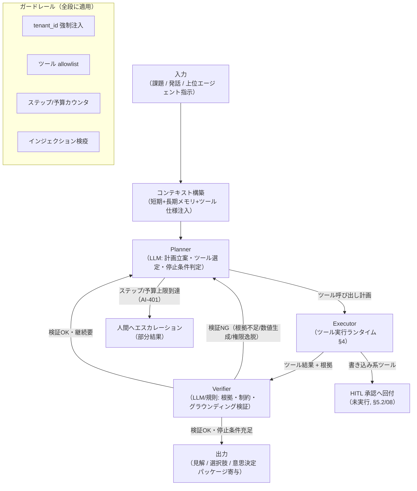
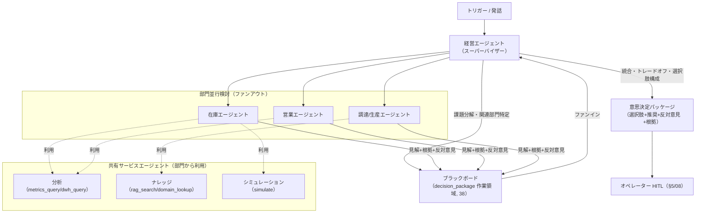
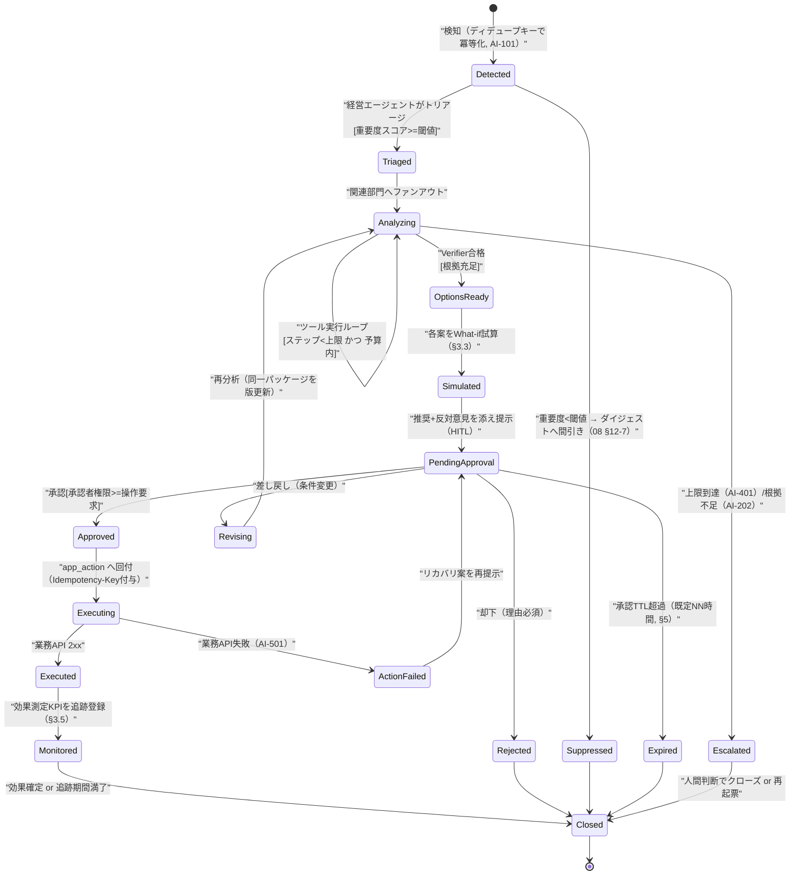
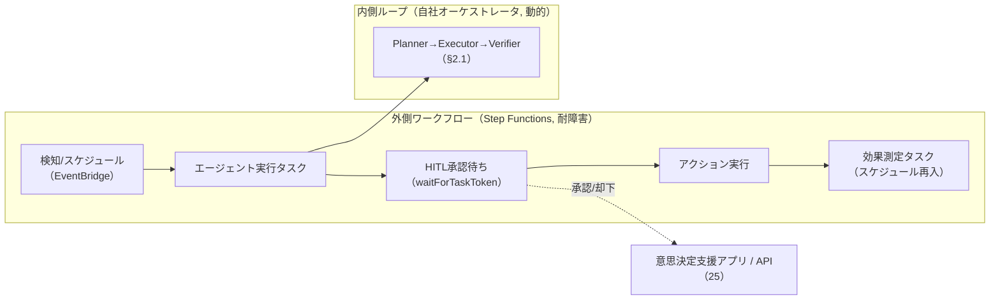
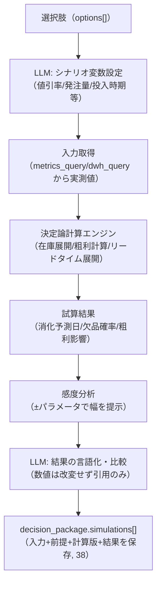
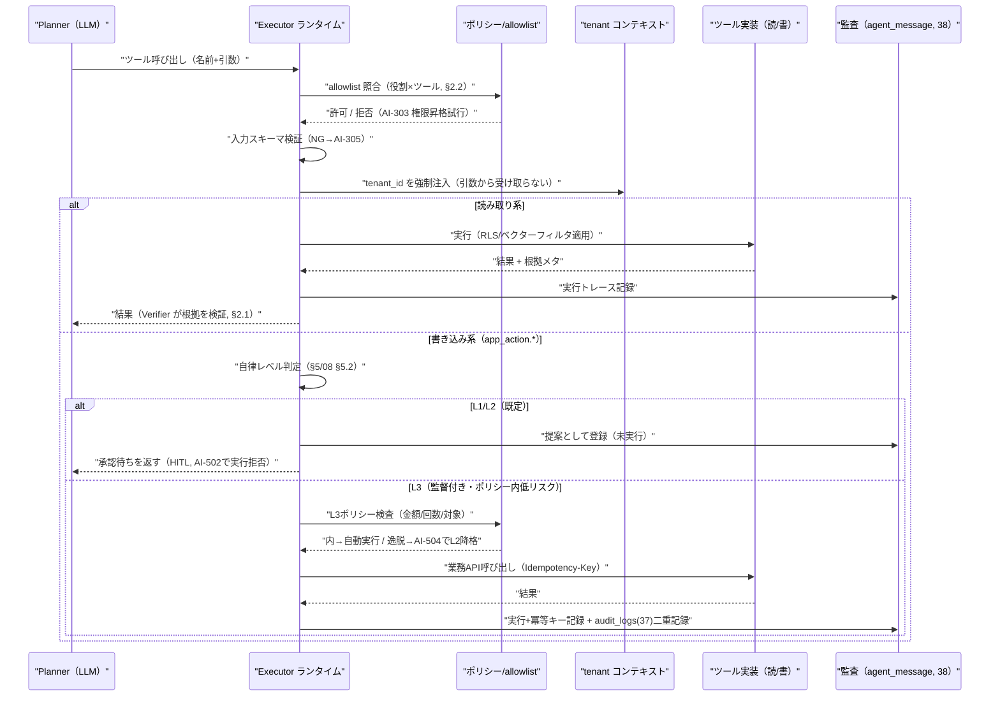
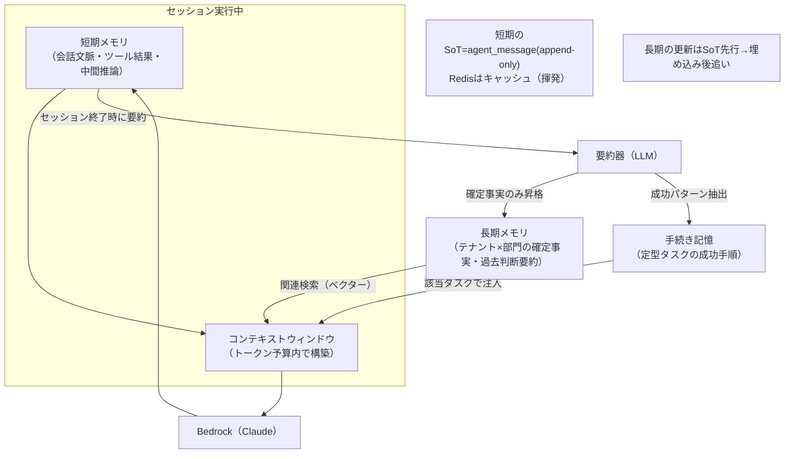
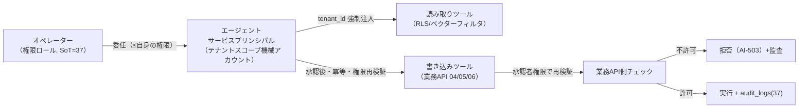
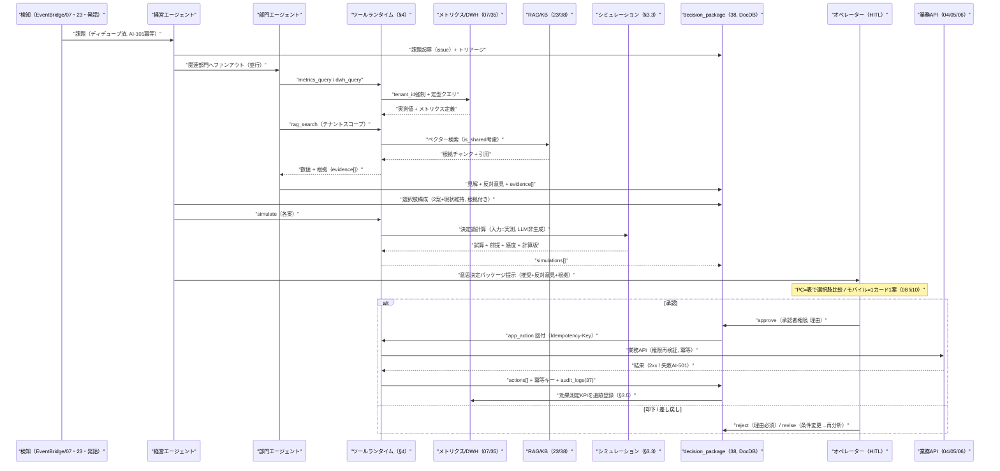

# 詳細設計: AIエージェント / バーチャルカンパニー

本書は **SCIP（Supply Chain Intelligence Platform、コード名。正式名称は未確定）** の **Intelligence Plane（AI層、ブリーフ §3）** における
**AIエージェント / バーチャルカンパニーの詳細アーキテクチャ**を、実装者が着手できる粒度で定義する。基本設計
[`08 意思決定支援 / AIエージェント`](../basic-design/08-service-decision-support-ai.md)（document_id: `decision-support-ai`）が
「何を・なぜ」（サービス責務・部門編成・意思決定支援ワークフロー・HITL/ガバナンス方針・ドメイン知識活用方針）を所有するのに対し、
本書は **「どのように」** — すなわち

1. **エージェント内部アーキテクチャ**（Planner / Executor / Verifier の三分割、部門ロールの構成、マルチエージェント協調プロトコル）、
2. **オーケストレーション実装**（意思決定ワークフロー状態機械、実行基盤の選択、ステップ/予算/ループ制御）、
3. **ツール実行基盤**（ツールレジストリ・スキーマ・allowlist・`tenant_id` 強制注入・冪等キー導出・read/write 分離）、
4. **メモリ / セッション / コンテキスト管理**（短期/長期/手続き記憶の実装、コンテキストウィンドウ運用、要約・トークン予算、ベクター長期記憶）、
5. **意思決定支援ワークフローの詳細シーケンス**（課題検知 → 分析 → 選択肢+シミュレーション → HITL → アクション → 効果測定）と **シミュレーション計算エンジン**、
6. **プロンプト設計 / グラウンディング**（システムプロンプト構成・ツール仕様注入・根拠強制・インジェクション対策）、
7. **ガバナンス実装**（権限委任・監査・テナント境界・暴走防止・コスト上限・HITL 必須点）

を権威的に所有する。

> **所有境界（ブリーフ §14）:**
> - **物理スキーマ**（`agent` / `agent_session` / `agent_message` / `agent_memory` / `insight` / `analysis_run` の CREATE TABLE・索引・制約・`tenant_id`・RLS、および `decision_package` の DocDB アイテム形状）は
>   [`38 AI/ベクター/ナレッジ`](../database-design/38-ai-vector-knowledge-schema.md)（document_id: `ai-vector-knowledge-schema`）が所有する。本書は **論理構造と、38 に要求する索引/アクセスパターンの根拠**を示すに留め、DDL を再定義しない。
> - **RAG パイプライン**（チャンク化・埋め込み・ベクター検索・`kb_*`/`domain_knowledge`）は [`23 AI/RAG/ベクター化`](./23-ai-rag-and-vectorization.md)（document_id: `ai-rag-vectorization`）が所有する。本書の `rag_search` / `domain_lookup` ツールはその基盤を消費する。
> - **メトリクス/セマンティック層・dim/fact の数値** は 07/35 が所有する。本書のエージェントは **数値を計算しない**（数値の SoT は常に DWH / メトリクス層。ブリーフ §12 ハルシネーション抑制）。
> - **API コントラクトの正**は [`25 API/連携コントラクト`](./25-api-and-integration-contracts.md)（document_id: `api-integration-contracts`）が所有する。本書は内部実行フローの観点でエンドポイントを参照する。

---

## 1. 詳細レベル SoT 宣言（本書が所有する実装関心事）

基本設計 08 §1.3 の論理 SoT を継承しつつ、本書は **実行時の状態・成果物の物理的な所在と書込順序**を確定する。ブリーフ §5 の原則（SoT 先行書込 → 派生後追い）を全ての書込パスに適用する。

| 実装関心事 | 本書の扱い | 物理 SoT（所有ドキュメント） | 書込順序 / 整合性方針 |
|-----------|-----------|--------------------------|----------------------|
| ワークフロー実行状態（state machine の現在状態） | 本書が状態遷移を定義 | オーケストレーション実行レコード = `analysis_run`（38）+ ワークフロー実体は `decision_package`（DocDB, 38） | 状態遷移は append-only の遷移ログ。現在状態は `decision_package.status` に反映（後追い） |
| エージェントセッション / メッセージ / ツール実行トレース | 本書がトレース項目を定義 | `agent_session` / `agent_message`（38, append-only） | LLM 呼び出し・ツール呼び出しの前後で必ず 1 レコード。監査・再現の源泉 |
| 短期メモリ（会話文脈） | 本書が構造・寿命を定義 | `agent_session` の作業領域 + ElastiCache(Redis) キャッシュ | セッション終了時に要約して長期へ昇格。Redis はキャッシュ（揮発）、SoT は `agent_message` |
| 長期メモリ / 手続き記憶 | 本書が更新規約を定義 | `agent_memory`（38, テナント×部門スコープ、ベクター併設） | **SoT 先行** = `agent_memory` へ INSERT → 埋め込み（派生）を後追い生成。訂正は打ち消しレコード |
| 意思決定パッケージ（課題/選択肢/シミュ/承認/アクション） | 本書がライフサイクルを定義 | `decision_package`（DocDB アイテム, 38） | ステージ毎に部分更新（options[]/simulations[]/approvals[]/actions[] を追記）。確定操作は `audit_logs`(37) へ二重記録 |
| シミュレーション結果（決定論計算の出力） | 本書が計算契約を定義 | `decision_package.simulations[]`（38）に埋め込み | 入力（メトリクス値・前提）と計算バージョンを併記し再現可能に |
| コスト計量（トークン/呼び出し回数） | 本書が計量点を定義 | `usage_metering`（37 所有） | 各 LLM/埋め込み呼び出し後に加算。エンタイトルメントと連動（§8.4） |
| メトリクス値・dim/fact・KB ベクター | **参照のみ** | 07/35/23/38 | LLM 生成禁止。ツール経由で取得し evidence[] に根拠添付 |

---

## 2. エージェント内部アーキテクチャ

### 2.1 Planner / Executor / Verifier の三分割

各エージェント（部門ロール・共有サービス・経営）は、単一の LLM 呼び出しではなく **役割分割された制御ループ**として実装する。
この三分割は「計画（何をすべきか）・実行（ツールを呼ぶ）・検証（根拠と制約を満たすか）」を分離し、**ハルシネーション抑制**（Verifier が数値の出所と根拠を強制）と**暴走防止**（Planner のステップ予算、Executor の allowlist）を構造的に担保する。

| 構成要素 | 実体 | 責務 | 失敗時の扱い |
|---------|------|------|------------|
| **Planner** | LLM 呼び出し（Bedrock/Claude）+ 制御コード | 課題の分解、次に呼ぶツールの選定、停止条件（十分な根拠が揃ったか）の判定 | ステップ/予算上限で打ち切り、部分結果を返す（AI-401） |
| **Executor** | ツール実行ランタイム（§4）。LLM ではない | Planner が指定したツールを allowlist 照合・`tenant_id` 注入のうえ実行 | 読み取り失敗は非ブロッキング（AI-201/203）、書き込みは HITL 前提（AI-502 で拒否） |
| **Verifier** | 規則チェック + 軽量 LLM 検証 | 出力に根拠（メトリクス定義/期間/値/引用）が付くか、数値を LLM が生成していないか（AI-302）、権限逸脱がないか | NG は Planner へ差し戻し。規定回数超で AI-202（根拠不足）として断定を回避 |

> **設計原則:** LLM は「計画・言語化・検証の判断」を担い、**副作用（外部システムへの作用）は Executor のみが行う**（ブリーフ §12「LLM の直接的副作用を禁止」の実装）。数値は Executor が取得した実測値のみを根拠とし、Planner/Verifier は数値を創作しない。

### 2.2 部門ロールエージェントの構成

部門編成・責務・関心メトリクスの一覧は **08 §2.2 が所有**する（企画・営業・調達・生産・在庫・物流・経営 + 分析/RAG/シミュレーションの共有サービス）。本書は各エージェントを構成する **実装パラメータ**を定義する。これらは `agent`（38 所有）の1レコードに対応する。

| パラメータ | 内容 | 由来 / 参照 |
|-----------|------|-----------|
| `role` | 部門ロール識別子（`planning`/`sales`/`procurement`/`production`/`inventory`/`logistics`/`executive`/`analytics`/`knowledge`/`simulation`）。※企画部門ロールは §2.1 のアーキ構成要素 `Planner` との語彙衝突を避けるため `planning` とする（08 §2.2 の `planner` からリネーム） | 08 §2.2、SMALLINT+CHECK（ブリーフ §9） |
| `system_prompt_template` | システムプロンプト構成（§6.1）。役割・制約・出力契約 | 本書 §6 |
| `tool_allowlist` | 呼び出し可能ツールの集合（read/write 区別、§4.1） | 本書 §4 |
| `autonomy_level` | 自律レベル L0-L3（テナント×部門×アクション種別、既定 L1） | 08 §5.2、Control Plane(37) で制御 |
| `knowledge_scope` | 参照可能なドメイン知識スコープ（テナント固有 + 公開業界横断） | 23/38、§6/08 |
| `metric_focus` | 主に参照する fact/メトリクス（既定コンテキスト構築のヒント） | 07/35 |
| `budget_policy` | ステップ上限・トークン予算・タイムアウト（§3.4/§8.4） | 本書 §8 |

> **編成のテナントカスタム性（SI戦略）:** 標準編成はテンプレート。テナントの業態に応じ Control Plane(37) のフィーチャーフラグ/エンタイトルメントで部門を有効化/統合/追加する（08 §2.2）。`agent` 定義は版管理し、過去意思決定は当時の編成版を参照可能にする（08 §12-8、監査要件）。

### 2.3 マルチエージェント協調プロトコル（スーパーバイザー階層 + ブラックボード）

経営エージェントを **スーパーバイザー**とする階層型オーケストレーションを標準とする（08 §2.3）。詳細実装として、部門間の中間成果物を共有する **ブラックボード**（= 当該 `decision_package` の作業領域）を採用する。各部門エージェントは独立に分析し、**反対意見・少数意見をブラックボードに併記**する（潰さない）。経営エージェントはブラックボードを読み、トレードオフを評価して統合案を構成する。

**協調の実装規則:**
- **ファンアウトは並行**（サブエージェント並行実行、CLAUDE.md TOOL_CAPABILITY_MAPPING）。部門間にデータ依存がなければ並行、依存があれば経営エージェントが直列化する。
- **共有サービスエージェントはステートレス**（メモリを持たず、ツールの薄いラッパ）。分析/RAG/シミュレーションは副作用のない読み取り/計算に限定。
- **循環参照・デッドロック検知**（AI-402）: 経営→部門→経営 の再委譲深さに上限（既定 3）。委譲グラフに閉路を検出したら打ち切り、課題を再トリアージする。
- **合議の非決定性の抑制:** 経営エージェントの統合はテンプレート化された出力契約（§6.2）で構造化し、「推奨1案 + 対立案 + 現状維持案 + 各根拠」を必ず埋める（単一案の押し付け禁止、08 §3.3）。

---

## 3. オーケストレーション

### 3.1 意思決定ワークフロー状態機械（詳細）

08 §3.1 の 6 ステージ（課題検知 → 分析 → 選択肢 → シミュレーション → HITL → アクション）を、**ガード条件・アクション・失敗遷移を含む実装レベルの状態機械**として定義する。状態は `decision_package.status`（DocDB, 38）に反映し、遷移は append-only の遷移ログとして `agent_message`/`analysis_run`（38）に記録する。

**状態遷移の実装上の要点:**
- **冪等な検知（Detected）:** 検知イベントは `(tenant_id, source, subject_ref, window)` から導出したディデュープキーで冪等化。既存オープン課題があれば新規起票せず既存に集約（AI-101, INFO）。
- **確定状態の巻き戻し禁止:** `Approved`/`Rejected`/`Executed`/`Closed` は終端的。確定済パッケージへの再承認要求は AI-601 で拒否し、訂正は**新規パッケージ**へ誘導する（CLAUDE.md 原則2、状態保護）。
- **差し戻し（Revising）は版更新:** 同一 `decision_package` を破棄せず、`revision` を増やして履歴を保つ（再現性）。
- **全遷移に監査:** 状態遷移・LLM 入出力参照・ツール実行を `agent_message`（append-only, 38）へ。確定承認・機微アクションは `audit_logs`（37）へ二重記録（08 §5.4）。

### 3.2 オーケストレーション実行基盤の選択

08 §12-1 の未決事項（実装基盤）に対し、詳細設計として **3 案の比較と推奨レイヤ分割**を提示する。ブリーフ §4（マネージド + 自社変換エンジン）およびデータ境界制御・自律レベル制御の作り込み容易性を評価軸とする。

| 案 | 基盤 | 長所 | 短所 | 本書の位置づけ |
|----|------|------|------|--------------|
| (a) 自社オーケストレータ | ECS/App Runner 上の .NET 常駐 + 状態は DocDB/RDS | 自律レベル・テナント境界・HITL 差込・監査を完全制御。既存 .NET 8 スタック継承 | 実装/運用コスト。分散リトライ・タイムアウトを自作 | **主（Planner/Executor/Verifier ループと HITL 制御を担う中核）** |
| (b) AWS Step Functions | マネージド状態機械 + Lambda タスク | 長時間ワークフロー・リトライ・待機（HITL 承認待ち = `waitForTaskToken`）が堅牢。可視化 | エージェント内ループ（動的なツール選定）表現に不向き。粒度が粗い | **併用（外側の長時間ワークフロー = 承認待ち/効果測定/スケジュール検知の耐障害オーケストレーション）** |
| (c) Bedrock Agents | マネージドエージェント（ツール=Action Group） | ツール呼び出し/セッション管理が組込。実装量小 | 自律レベル/テナント境界/監査の作り込み自由度が低い。ベンダーロックイン | **選択肢（PoC・限定領域で評価。08 §12-1）** |

> **推奨:** **(a) を主・(b) を外殻に併用**する。動的なツール選定を伴うエージェント内ループは自社オーケストレータ（(a)）が担い、承認待ち・効果測定・スケジュール検知の**長時間・耐障害**な外側ワークフローを Step Functions（(b)）が担う。(c) は限定領域の PoC 評価に留める。最終確定は [`12 ADR`](../basic-design/12-architecture-decision-records.md) と本書の改訂で行う（08 §12-1）。

### 3.3 シミュレーション計算エンジン（決定論・LLM 非生成）

08 §3.4 のシミュレーションを、本書が **計算契約**として所有する。原則は **数値は決定論的計算モデルで算出し、LLM に生成させない**（ブリーフ §12、AI-302）。LLM はシナリオ設定・結果の説明・比較の言語化のみを担う。

| シミュレーション種別 | 入力（実測） | 計算モデル | 出力 | 計算基盤の所在 |
|--------------------|------------|-----------|------|--------------|
| 在庫消化 | 販売ペース・値引率・入荷予定 | 消化曲線展開（在庫÷日販、値引弾力性は推定パラメータ） | 消化完了予測日・欠品/過剰リスク | 本書エンジン（08 §12-4 暫定(a)） |
| 発注/生産量 | 需要予測・現在庫・リードタイム・安全在庫 | 補充計算（発注点/EOQ 系） | 推奨発注量・欠品確率 | 同上（決定論部は 22 変換エンジンと共通化余地） |
| 価格/値引 | 弾力性推定・在庫・粗利目標 | 需要弾力性 × 粗利計算 | 想定販売数・粗利影響 | 同上 |

**計算契約の実装規則:**
- **再現可能性:** `simulations[]` には入力値・前提パラメータ・**計算エンジンバージョン**を保存。同一入力+同一版なら同一出力（決定論）。
- **前提の明示:** 弾力性・需要予測は推定を含むため、結果に**信頼区間 / 感度**と免責を必ず添える（推測を断定で書かない、ブリーフ §0）。断定的な単一値提示を禁止。
- **予測モデルの所在:** 需要予測モデル（統計/Bedrock 自社実装 vs Amazon Forecast）は 08 §12-5 の未決事項。予測結果は DWH に書き戻して数値 SoT を一元化する方式を検討（§10-4）。
- **共通化境界:** 決定論計算部（在庫展開・粗利計算）は [`22 スタースキーマ変換`](./22-star-schema-transformation.md) の変換エンジンやメトリクス層の派生指標と共通化余地がある（08 §12-4）。予測を含む部分のみ本書エンジンが担う。

### 3.4 暴走防止（ステップ・予算・ループ制御）

無制限のエージェントループを構造的に防ぐ（08 §10 コスト管理、ブリーフ §12）。全カウンタは `agent_session`（38）に保持し、超過は非ブロッキングにエスカレーションする。

| 制御 | 既定値（テナント/部門で調整可） | 超過時挙動 | エラーコード |
|------|------------------------------|-----------|------------|
| ステップ上限（Planner ループ回数） | 例: 20 ステップ/セッション | 部分結果を提示し人間へエスカレーション | AI-401 |
| トークン予算（入出力トークン累計） | エンタイトルメント連動（37） | ソフト上限で警告、ハード上限で打ち切り | AI-401 |
| 委譲深さ（経営→部門→…の再帰） | 3 | 打ち切り・再トリアージ | AI-402 |
| セッションタイムアウト（実時間） | 例: 5 分（対話）/ 非同期は長時間可 | タイムアウト → 非同期化 or 部分結果 | AI-301 |
| ツール呼び出し回数/種別上限 | ツール毎に設定 | allowlist 超過は拒否 | AI-401 |

> **キルスイッチ（サーキットブレーカ）:** テナント単位・エージェント単位で即時停止できる緊急停止フラグを Control Plane(37) に置く。異常なコスト急増・インジェクション検出（AI-303）連発時に自動発火し、以後の LLM/ツール実行を遮断する。既存の非ブロッキング原則（CLAUDE.md 原則4）に従い、業務アプリの主要フローは停止させない。

---

## 4. ツール実行基盤

### 4.1 ツールレジストリとツール契約

エージェントは **ツール（関数）呼び出し**を通じてのみ外部システムに作用する（08 §4.1）。ツールカタログの一覧・種別・接続先・所有は **08 §4.1 が所有**する。本書は各ツールの **入出力契約（スキーマ）とランタイム挙動**を定義する。全ツールは JSON Schema で入出力を定義し、Executor が実行前後で検証する（スキーマ違反は AI-305（WARNING）として拒否。AI-002 はスキーマ以外のバリデーション専用であり本用途では使わない、§9）。

| ツール | 種別 | 主要入力（`tenant_id` は呼び出し側注入・非入力） | 主要出力 | ランタイム制約 |
|--------|------|-----------------------------------------------|---------|--------------|
| `metrics_query` | 読 | `metric_id`, `period`, `filters`, `grain` | 値 + メトリクス定義参照 + 期間 | セマンティック層経由。生 SQL 不可 |
| `dwh_query` | 読 | `template_id`, `params` | 行集合（上限あり） | **パラメタライズド定型のみ**・読み取り専用ロール・行数上限 |
| `snapshot_fetch` | 読 | `snapshot_id`, `dimensions` | 事前集計 JSON/Parquet | CDN 経由、キャッシュ可（26） |
| `rag_search` | 読 | `query`, `top_k`, `knowledge_scope` | チャンク + 引用メタ + スコア | テナントスコープ強制（+公開分）。23 が実装 |
| `domain_lookup` | 読 | `key`, `scope` | ルール/慣行テキスト + 出典 | 同上 |
| `simulate` | 読(計算) | `scenario`, `variables`, `inputs` | 試算結果 + 前提 + 感度 + 計算版 | §3.3 の決定論エンジン。副作用なし |
| `insight_read` | 読 | `filter` | 既存インサイト | `insight`（38）参照 |
| `app_action.*` | **書** | 業務操作ペイロード + `Idempotency-Key` | 業務API結果 | **HITL 承認後のみ**・業務API経由（04/05/06） |
| `notify` | 書(低リスク) | `channel`, `payload` | 送達結果 | 非ブロッキング（失敗しても主フロー継続） |

### 4.2 ツール実行ランタイム（Executor）の処理シーケンス

### 4.3 テナント境界の強制注入（プロンプト経由禁止）

全読み取り系ツールは、セッションが属する `tenant_id` を **Executor が呼び出し側で強制注入**する。**プロンプト経由でテナントを渡さない**（プロンプトインジェクションで別テナントを指定される攻撃を構造的に無効化、AI-001/303）。
- **RDS/Aurora（メトリクス定義・insight・memory）:** DB セッションで `SET app.tenant_id` を張り RLS を効かせる（ブリーフ §6）。
- **Redshift（dwh_query）:** 定型テンプレートの WHERE に `tenant_id` を必須束縛。テンプレートに `tenant_id` 束縛がなければ Executor が実行を拒否。
- **ベクター検索（rag_search/domain_lookup）:** 検索フィルタに `tenant_id` + `is_shared`（公開業界横断のみ）を強制（23 が実装、08 §5.3）。
- **スナップショット（snapshot_fetch）:** パス/キーにテナント境界を含め、CDN 署名 URL をテナントスコープで発行（26）。

### 4.4 書き込み系ツール（app_action）と冪等キー導出

- **業務アプリ API 経由のみ**（08 §4.4）。本サービスは OLTP を直接書かない。呼び先は 04/05/06 の公開 `/api/v1`。API 側がバリデーション・権限・監査・冪等性を再度通す（多層防御）。
- **冪等キー導出:** `Idempotency-Key = hash(decision_package_id + action_id + revision)`。同一アクションの再実行（リトライ・二重承認）を業務 API 側で無害化（AI-505, INFO）。冪等キーは `decision_package.actions[]`（38）に保存し逆引き可能にする。
- **権限の下位性:** エージェントのサービスプリンシパルが持つ権限は**承認オペレーターの権限を超えない**。API 側が承認者権限で再検証し、不許可なら拒否（AI-503, CRITICAL）。
- **承認なし実行の拒否:** L1/L2 で承認前に書き込みを試みたら AI-502（CRITICAL）で拒否し HITL へ差し戻し・監査記録。

---

## 5. メモリ / セッション / コンテキスト管理

### 5.1 3 種のメモリの実装

08 §7 の論理定義（短期/長期/手続き記憶）を、本書が **物理保存・寿命・更新規約**として実装レベルで定義する。物理テーブルは `agent_session`/`agent_message`/`agent_memory`（38 所有）。

| メモリ種別 | 物理保存 | 寿命 | 更新規約 |
|-----------|---------|------|---------|
| 短期（会話文脈） | `agent_message`（SoT, append-only）+ Redis（作業キャッシュ, 揮発） | セッション終了で要約化 | 追記のみ。生の全文を長期へ持ち越さず要約して昇格 |
| 長期（学習事実） | `agent_memory`（テナント×部門, ベクター併設） | 永続 | **SoT 先行**（レコード INSERT）→ 埋め込み（派生）後追い。誤学習は打ち消しレコードで訂正（履歴破壊禁止, AI-403） |
| 手続き記憶（ツール手順） | `agent_memory`（種別=procedure） | 永続（改善で版更新） | 成功パターン抽出時に追記。旧版は無効化フラグで保持 |

### 5.2 コンテキストウィンドウ運用とトークン予算

限られたコンテキストウィンドウを、根拠の質を落とさず運用するための構築規約。

1. **優先度付き詰め込み:** システムプロンプト（役割・制約・出力契約）→ ツール仕様 → 直近会話 → 長期メモリ（ベクター関連検索の上位）→ RAG 根拠、の優先順で詰める。予算超過分は低優先から要約/切り詰め。
2. **要約による圧縮:** 会話が長くなると古い往復を逐次要約（rolling summary）し、`agent_session` の要約フィールドへ退避。原文は `agent_message`（SoT）に残す（要約は派生・再生成可能）。
3. **数値はメモリに埋めない:** 変動数値（在庫・売上）は長期メモリ/RAG に埋め込まず、常にツールでライブ取得（陳腐化・矛盾回避。08 §6.2）。メモリが担うのは「解釈・慣行・過去判断の文脈」。
4. **トークン計量と超過の振り分け:** 各 LLM 呼び出しの入出力トークンを `usage_metering`（37）に加算し、コスト上限（§8.4）と連動。**トークン予算（エンタイトルメント連動の累計予算）の超過は AI-401**（ステップ/予算上限）として打ち切り・エスカレーション。一方、**単一呼び出しでコンテキストウィンドウ（モデルの最大コンテキスト長）が要約後も収まらないケースは AI-404**（WARNING）とし、要約強化・スコープ縮小・部分結果提示で対処する（§9）。両者を混同せず、予算超過（AI-401）とコンテキスト窓超過（AI-404）を明確に区別する。

> **長期メモリのベクター検索:** `agent_memory` はテキスト事実に加え埋め込み（Bedrock, 23 のパイプライン）を併設し、現課題に関連する過去判断を意味検索で想起する。テナント×部門スコープを検索フィルタで強制（クロステナント/クロス部門の想起を構造的に禁止, §7）。埋め込みは派生であり、原文（memory レコード）が SoT（ブリーフ §5）。

---

## 6. プロンプト設計 / グラウンディング

### 6.1 システムプロンプトの構成

各エージェントのシステムプロンプトは、`agent.system_prompt_template`（38）から以下の層を合成して構築する。プロンプトは信頼境界の内側（プラットフォーム定義）と外側（取込文書・ユーザ入力）を明確に分離する。

| 層 | 内容 | 信頼境界 |
|----|------|---------|
| 役割定義 | 部門ロール・責務・意思決定の観点（08 §2.2） | 内（プラットフォーム定義） |
| 制約・ガードレール | 数値生成禁止・根拠必須・テナント境界・機微マスキング・自律レベル | 内 |
| 出力契約 | 見解/選択肢の構造化フォーマット（§6.2）。JSON スキーマ準拠 | 内 |
| ツール仕様 | allowlist されたツールの名前・用途・入出力スキーマ（§4.1） | 内 |
| コンテキスト | 短期/長期メモリ・RAG 根拠・メトリクス実測値 | **外（取込文書・ユーザ入力は要検疫）** |

### 6.2 出力契約（構造化・根拠強制）

エージェントの出力は自由文ではなく **構造化フォーマット**を強制し、Verifier（§2.1）が機械検証する。これにより「根拠なき主張」「単一案の押し付け」を防ぐ。

- **見解/選択肢**は必ず `{ 概要, 前提, 期待効果, 副作用/リスク, 必要アクション, 関与部門, evidence[] }` を持つ。`evidence[]` が空なら AI-202（根拠不足）で棄却。
- **数値には必ず出所**（`metric_id` / `template_id` / 期間 / フィルタ / 引用 KB チャンク）を付す。出所のない数値は AI-302（グラウンディング違反）で出力棄却しメトリクス取得へ再ルーティング。
- **選択肢は 2 案以上 + 現状維持案**（08 §3.3）。単一案のみの出力は Verifier が差し戻す。

### 6.3 プロンプトインジェクション対策

取込ドメイン文書・ユーザ発話・RAG 取得チャンクは **信頼境界の外**として扱う（08 §5.3）。
- **検疫:** 外部由来テキスト内の「指示的文言（ツールを呼べ・権限を昇格せよ・別テナントを見よ）」を無害化してからコンテキストへ注入。ツール権限はプロンプト内容では昇格しない（allowlist は `agent` 定義のみが決定）。
- **テナント指定の無視:** プロンプト内の `tenant_id` 指定は一切採用しない（§4.3）。テナントはセッションのクレームからのみ解決。
- **検出時の隔離:** 権限昇格・別テナント参照の試行を検出したら実行拒否・セッション隔離・監査記録（AI-303, CRITICAL）。

---

## 7. ガバナンス実装

08 §5 のガバナンス方針（権限モデル・自律レベル・テナント境界・監査）を、本書が **実装機構**として具体化する。

### 7.1 権限委任と多層防御

権限ロールの SoT は Control Plane(37)。エージェントの権限は**委任元オペレーターの権限の部分集合**に制約され、`app_action.*` 実行時に業務 API 側が承認者権限で再検証する（08 §5.1、多層防御）。

### 7.2 自律レベルのポリシー実装

08 §5.2 の L0-L3 を、本書が **ポリシー表現と評価**として実装する。既定は L1（提案のみ）。レベルはテナント×部門×アクション種別ごとに Control Plane(37) のフィーチャーフラグ/エンタイトルメントで設定する。

**L3 ポリシー DSL（監督付き自動実行の明示的制約）:** L3 は以下の**全条件を満たす場合のみ**自動実行を許可し、逸脱は自動的に L2（人間承認）へ降格する（AI-504）。

| ポリシー項目 | 表現 | 例 |
|------------|------|-----|
| 金額上限 | `amount <= limit`（通貨別） | 補充発注 1 件 ≤ NN 円 |
| 対象許可リスト | `sku ∈ allowlist AND supplier ∈ allowlist` | 定番 SKU・契約済取引先のみ |
| 時間帯 / 頻度 | `time ∈ window AND daily_count <= N` | 営業時間内・1日 N 件まで |
| 操作種別 | `action_type ∈ {reorder}` | 定型補充発注のみ（価格変更は不可） |

> **L3 の既定無効・オプトイン必須:** L3 はテナントのオプトインを必須とし、全自動実行は事後に必ず通知・監査記録する（08 §5.2）。ポリシー逸脱・キルスイッチ発火時は即座に L2 以下へ降格。

### 7.3 監査と再現性

意思決定の全過程は再現可能でなければならない（08 §5.4）。
- `agent_message`（38, append-only）: LLM 入出力参照・ツール呼び出し・引用根拠・状態遷移。
- `decision_package.approvals[]`（38）: 承認者・日時・判断・理由・適用自律レベル。
- `audit_logs`（37, append-only）: 機微操作（`app_action.*` 実行・L3 自動実行・自律レベル変更・キルスイッチ）を二重記録し改竄防止・逆引きを担保。
- **編成版の固定:** 過去意思決定は当時の `agent` 編成版を参照可能にする（08 §12-8）。

### 7.4 コスト上限とエンタイトルメント連動

- LLM/埋め込みのトークン消費・ツール呼び出し回数を `usage_metering`（37）で計測し、プラン/エンタイトルメント（37）と連動（08 §10）。
- ソフト上限（警告・ダイジェスト化）→ ハード上限（打ち切り AI-401）→ キルスイッチ（テナント緊急停止, §3.4）の 3 段階。
- AI 機能未契約テナントの要求は AI-003（エンタイトルメント外）で拒否し契約プラン確認へ誘導。

### 7.5 HITL 必須点（一覧）

| 必須点 | 条件 | 根拠 |
|--------|------|------|
| 全書き込みアクション | L1/L2 では承認前の実行を禁止（AI-502） | 08 §4.4/§5.2 |
| 自律レベル変更 | L2→L3 昇格はオペレーター承認 + 監査 | 08 §5.2 |
| L3 ポリシー逸脱 | 金額/回数/対象/時間帯の逸脱は L2 承認へ降格（AI-504） | §7.2 |
| 機微データ開示 | 原価/仕入単価等は権限 + 明示フラグ + 監査（AI-304） | 08 §5.3、ブリーフ §11 |
| 却下/差し戻し理由 | 却下・差し戻しは理由必須（監査） | §3.1 |

---

## 8. 意思決定支援ワークフロー全体シーケンス（エンドツーエンド）

課題検知から効果測定までの詳細シーケンスを、本書のツール/メモリ/ガバナンス機構を含めて示す。

### 8.1 効果測定（ステージ6）

承認・実行されたアクションの効果を追跡し、意思決定の質を学習ループへ還元する（08 §6.2）。
- **KPI 追跡登録:** アクション実行時に「測定対象メトリクス・ベースライン・測定期間」を `decision_package.actions[].kpi` に登録し、スケジュール（Step Functions 再入, §3.2）で追跡。
- **数値は DWH から:** 効果測定の数値も metrics_query/dwh_query でライブ取得（LLM 生成禁止）。
- **学習ループ:** 効果が確定した意思決定は、**匿名化・PII/機微マスキングのうえ**クライアント固有ナレッジ（`domain_knowledge`, 23/38）へ再蓄積し、以降の類似課題の根拠に再利用（08 §6.2、マスキング基準は 08 §12-6）。

---

## 9. 想定エラーコード（AI-NNN）

ブリーフ §10 のドメイン接頭辞 `AI` に準拠する。**エラーレジストリの正は基本設計 [`08 §11`](../basic-design/08-service-decision-support-ai.md) が所有**し、本書はそれに準拠する（重複定義せず整合を保つ）。本書の詳細実装で新たに識別した実装レベルのコードのみを以下に追補する（08 の既存コードと重複しない番号帯）。

| コード | 発生機能（本書での実装点） | 意味 | 重大度 | 対処/誘導 |
|--------|--------------------------|------|--------|-----------|
| AI-305 | ツールランタイム（§4.1） | ツール入出力スキーマ検証失敗（JSON Schema 不一致） | WARNING | 引数を補正し再実行。Executor が実行前に拒否 |
| AI-306 | dwh_query（§4.3） | 定型クエリに `tenant_id` 束縛が欠落 | CRITICAL | 実行拒否・クエリテンプレート是正・監査 |
| AI-404 | コンテキスト管理（§5.2） | コンテキストウィンドウ超過（要約後も予算超過） | WARNING | 要約強化・スコープ縮小・部分結果提示 |
| AI-405 | オーケストレーション（§3.4） | キルスイッチ発火によるエージェント実行遮断 | WARNING | テナント/エージェント停止中を通知・原因調査へ誘導 |

> **08 の既存コードとの関係（重複定義しない）:** テナント越境=AI-001、スキーマ以外のバリデーション=AI-002、エンタイトルメント外=AI-003、検知重複=AI-101、検知失敗=AI-102、数値取得失敗=AI-201、根拠不足=AI-202、RAG ゼロ件=AI-203、LLM タイムアウト=AI-301、グラウンディング違反=AI-302、インジェクション/権限昇格=AI-303、機微開示=AI-304、ステップ/予算上限=AI-401、循環/デッドロック=AI-402、長期メモリ競合=AI-403、アクション失敗=AI-501、承認なし実行=AI-502、権限再検証拒否=AI-503、L3 逸脱=AI-504、冪等重複=AI-505、確定済再承認=AI-601 は **08 §11 が正**。本書はこれらを実装点にマッピングして参照する。
>
> **エラーハンドリング原則（CLAUDE.md 原則4 / review-standards 3.4）:** 補助処理（検知・RAG・通知・分析供給・効果測定）の失敗は主要フローを止めないグレースフルデグラデーション。致命的（AI-001/303/304/306/502/503）のみ例外を投げ実行を拒否し監査記録する。

---

## 10. 未決事項 / 論点

基本設計 08 §12 の未決事項を継承し、詳細設計レベルで本書が確定/深掘りすべき論点を整理する。08 と重複する論点は 08 の暫定方針を踏襲する。

| # | 論点 | 選択肢とトレードオフ | 暫定方針 |
|---|------|--------------------|----------|
| 1 | オーケストレーション実装基盤の確定 | (a) 自社 / (b) Step Functions 外殻 / (c) Bedrock Agents | **(a) 主 + (b) 外殻併用**（§3.2）。(c) は限定 PoC。最終は 12 ADR + 本書改訂で確定 |
| 2 | Planner/Executor/Verifier の LLM 分割粒度 | (a) 3 段別 LLM 呼び出し / (b) 単一 LLM の内部役割分担 / (c) Verifier のみ規則ベース | 暫定(a)。コスト増だが検証の独立性が高い。低リスク領域は(c)でトークン節約 |
| 3 | シミュレーション計算エンジンの共通化境界 | (a) 24 専用 / (b) 22 変換エンジン再利用 / (c) メトリクス派生指標 | 暫定(a)。決定論部（在庫展開・粗利）は(b)/(c)と共通化余地。22 と境界協議（08 §12-4） |
| 4 | 需要予測モデルの実装 | (a) 自社統計/Bedrock / (b) Amazon Forecast | 未定。精度/コスト/運用で 12 ADR 決定。予測結果は DWH 書戻しで数値 SoT 一元化（08 §12-5） |
| 5 | 長期メモリの想起精度 vs コスト | (a) 全メモリをベクター化 / (b) 重要度スコアで選別ベクター化 | 暫定(b)。埋め込みコストと想起ノイズを抑制。しきい値は運用で調整 |
| 6 | HITL 承認 TTL / エスカレーション時間 | 承認待ち（PendingApproval）の TTL とエスカレーション先 | 承認 TTL・失効（Expired）挙動は 11（非機能）と協議し確定。既定値は運用検証で決める |
| 7 | 対話型アシストのセッション永続化範囲 | (a) 全発話を長期昇格 / (b) 明示保存のみ | 暫定(b)。プライバシー・コスト観点。昇格前 PII マスキング必須（08 §12-6） |
| 8 | Bedrock モデル選定（部門/タスク別） | 高精度モデル vs 低コストモデルの使い分け | 計画（Planner）は高精度、要約/検証は低コストの階層化を検討。コスト計量（§7.4）で評価 |

---

## 11. 関連ドキュメント

- [`08 意思決定支援 / AIエージェント`](../basic-design/08-service-decision-support-ai.md)（document_id: `decision-support-ai`） — 本書の**基本設計**。サービス責務・部門編成・意思決定支援ワークフロー・HITL/ガバナンス方針・ドメイン知識活用方針・**エラーレジストリの正（§11）**を所有。
- [`23 AI/RAG/ベクター化`](./23-ai-rag-and-vectorization.md)（document_id: `ai-rag-vectorization`） — RAG パイプライン（チャンク化・埋め込み・ベクター検索）。本書の `rag_search`/`domain_lookup` および長期メモリ埋め込みの基盤。
- [`38 AI/ベクター/ナレッジ`](../database-design/38-ai-vector-knowledge-schema.md)（document_id: `ai-vector-knowledge-schema`） — `agent`/`agent_session`/`agent_message`/`agent_memory`/`insight`/`analysis_run` の**物理スキーマ**、および `decision_package`（DocDB アイテム形状）を所有。本書はこれらを論理参照する。
- [`25 API/連携コントラクト`](./25-api-and-integration-contracts.md)（document_id: `api-integration-contracts`） — エージェントセッション・意思決定パッケージ・承認/却下/差し戻し・`app_action` 経由の業務 API コントラクトの正。
- 参考: [`07 分析・可視化`](../basic-design/07-service-analytics.md)（数値の SoT = メトリクス/DWH）、[`22 スタースキーマ変換`](./22-star-schema-transformation.md)（決定論計算の共通化余地）、[`11 非機能/セキュリティ/テナンシー`](../basic-design/11-nonfunctional-security-tenancy.md)（テナント境界・監査・可用性）、[`12 ADR`](../basic-design/12-architecture-decision-records.md)（オーケストレーション基盤・予測モデルの最終決定）、[`37 コントロールプレーン`](../database-design/37-control-plane-backoffice-schema.md)（権限・エンタイトルメント・`usage_metering`・`audit_logs`・キルスイッチ）。
