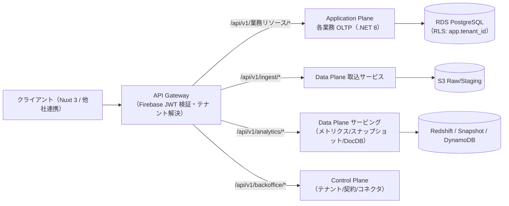
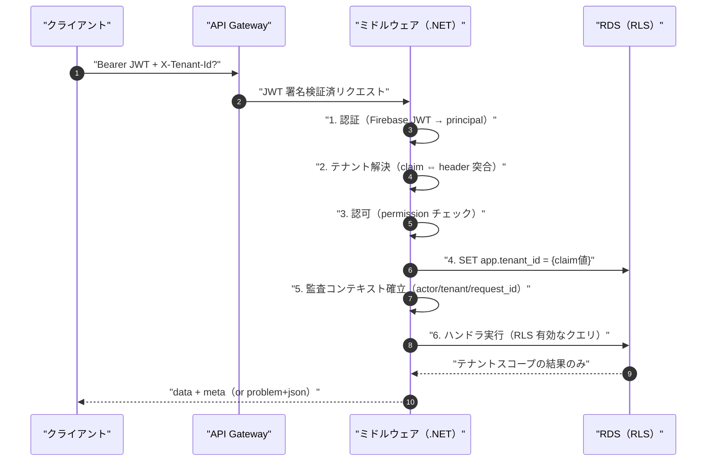
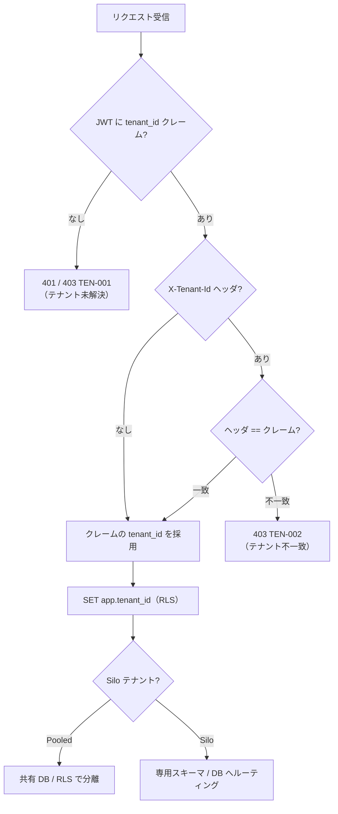
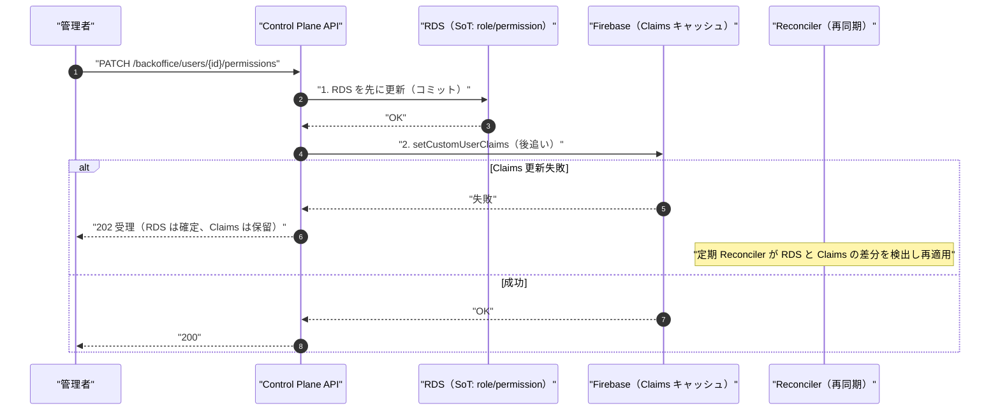
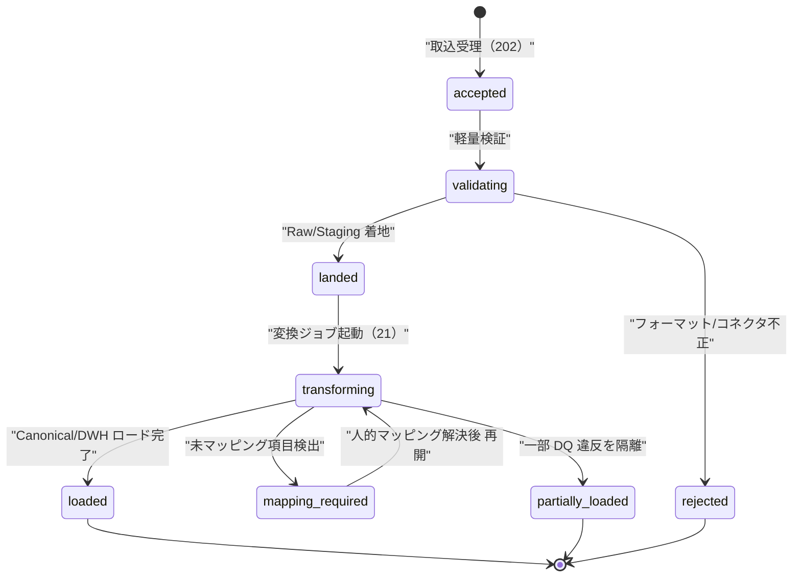
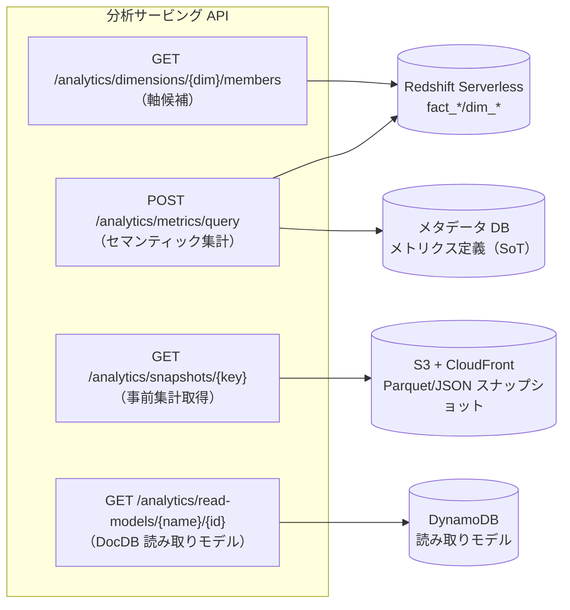
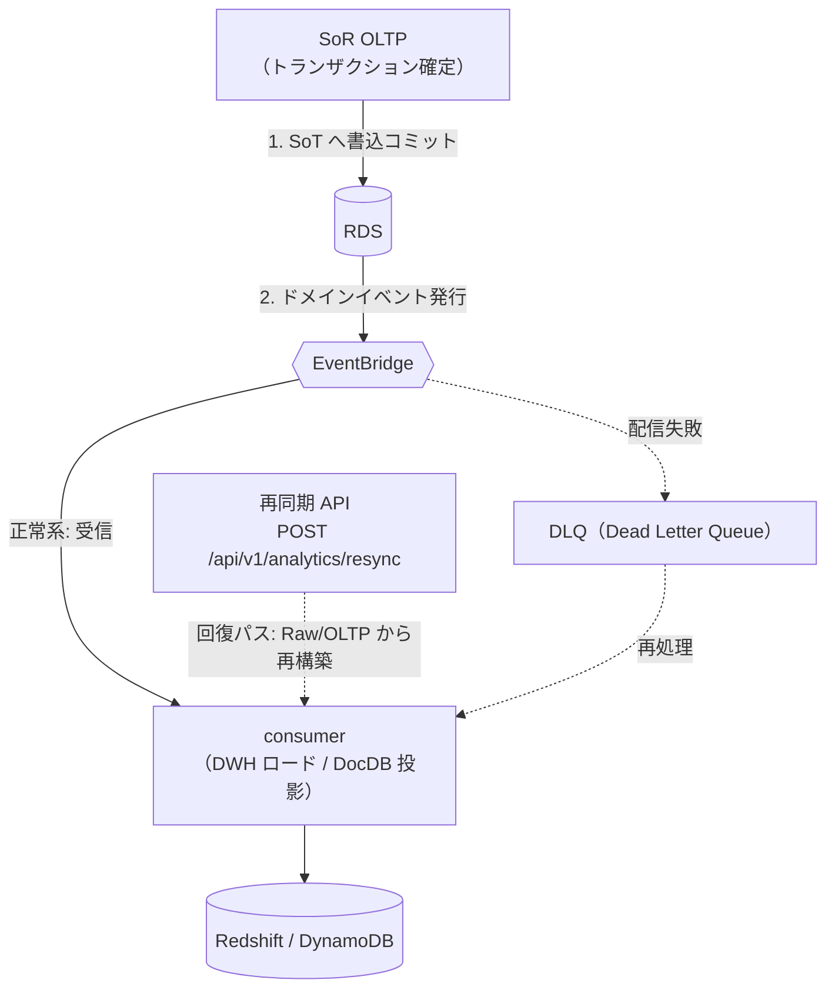

# 詳細設計: API / 連携コントラクト

本書は **SCIP（Supply Chain Intelligence Platform、コード名。正式名称は未確定）** における
**API と連携コントラクトの詳細規約**を、実装者が着手できる粒度で権威的に定義する。
対象は (1) REST API 規約（バージョニング・リソース命名・エンベロープ・ページング・冪等性）、
(2) 認証・認可・マルチテナンシー、(3) API 責務分離の適用、(4) 取込 / 連携コントラクト（バッチ / ストリーミング / Webhook / ファイル）、
(5) 分析サービング API（メトリクス / セマンティッククエリ / スナップショット / DocDB 読み取りモデル）、
(6) ドメインイベントスキーマ（EventBridge・同期 / 再同期パス）、(7) エラーコントラクトとバージョニング / 後方互換ポリシー、
(8) 代表エンドポイントの OpenAPI 断片である。

継承実装 **akebono-honshu**（履物メーカー Honshu の .NET 8 + Nuxt 3 + RDS PostgreSQL）が確立した
API 規約（`/api/v1`・複数形 kebab-case・Firebase Bearer・RFC 7807 Problem Details・`{data, meta}` エンベロープ・
`page`/`per_page`・`Idempotency-Key`）を土台とし（[Phase 5 API 設計](../../../.ai-native/outputs/phase5/api-design.md)）、
これに**マルチテナント（tenant クレーム / ヘッダ）・取込 / 連携 I/F・分析サービング・イベント駆動**を加えて
プラットフォーム規約へ一般化する。

## 本書の所有範囲（owns）と SoT 宣言

| 区分 | 本書の扱い |
|------|-----------|
| **owns（権威的定義）** | API/連携コントラクトの**詳細規約**: バージョニング・命名・エンベロープ・認証認可・テナンシー解決・取込 I/F 契約・分析サービング契約・イベント封筒（envelope）・エラーコントラクト・後方互換ポリシー |
| **参照（再定義しない）** | 個別業務 API の全列挙（各サービス基本設計 04/05/06/07/09 が所有）、テーブル DDL（DB 設計 30-38 が所有）、マルチテナント分離の非機能方針（[11 非機能/セキュリティ/テナンシー](../basic-design/11-nonfunctional-security-tenancy.md) が所有）、取込パイプラインの内部処理（[21 取込&マッピング](./21-ingestion-and-mapping-pipeline.md) が所有）、スナップショット/DocDB の物理設計（[26 スナップショット/DocDB](./26-snapshot-and-document-db.md) が所有） |

> **SoT 宣言（本書が扱うデータの Source of Truth）:** 本書は API という**インターフェース契約**を所有し、データ自体の SoT は持たない。
> API が参照 / 更新するデータの SoT はブリーフ §5 のデータストアカタログに従う。特に本書で重要なのは以下:
> - **ユーザ業務情報 / 権限ロール** の SoT は RDS（Control Plane、`app_user`/`role`/`permission`、[37](../database-design/37-control-plane-backoffice-schema.md) 所有）。Firebase Custom Claims は**キャッシュ**であり、権限変更は RDS 先行 → Claims 後追いの順序を守る（後述 §3.4）。
> - **テナント識別（tenant_id）** の SoT は RDS（`tenant`、[37](../database-design/37-control-plane-backoffice-schema.md) 所有）。JWT クレームはその写像。
> - **分析メトリクス数値** の SoT は DWH（`fact_*`、[35](../database-design/35-star-schema-dwh.md) 所有）/ メトリクス定義（メタデータ DB）。サービング API はこれを読み取り専用で提供し、値を生成しない。
> - **取込生データ** の SoT は**ソース側システム**。取込 API は Raw/Staging（S3、[21](./21-ingestion-and-mapping-pipeline.md) 所有）への着地口であり、それ自体は SoT を作らない。

---

## 1. REST API 規約

### 1.1 URL / バージョニング

```
https://<gateway-host>/api/v1/<resource>[/<id>[/<sub-resource>]]
```

| 規約 | 内容 |
|------|------|
| バージョン | URL 埋込 `/api/v1/`。破壊的変更は `/api/v2/` を並行運用（§8 後方互換ポリシー参照） |
| リソース名 | **複数形 kebab-case**（例 `/purchase-orders`, `/sales-transactions`, `/inventory-snapshots`）。継承実装の `snake_case` テーブル名を URL では kebab に変換 |
| ID | 数値（`BIGINT`、ブリーフ §9 の `id BIGSERIAL` PK に対応）。正準エンティティの外部参照はサロゲート `id` を用い、業務自然キー（`code`/`sku`/`mgmt_no`）はフィルタ用途に限定 |
| サブリソース | 親子集約は `/<parent>/{id}/<child>`（例 `/purchase-orders/{id}/lines`）。ただし「子リソースとして独立して意味を持つ」場合のみ切り出す（§4 責務分離） |
| プレーン別ホスト | Application Plane（業務 OLTP API）と Data Plane（取込 / 分析サービング API）は論理的に別サービス。API Gateway で `/api/v1/ingest/*`・`/api/v1/analytics/*` をルーティング分離（後述 §5/§6） |

> **サービス境界とルーティング:** SCIP は 5 プレーン（[02 全体アーキテクチャ](../basic-design/02-overall-architecture.md)）で構成される。
> API 名前空間はプレーンに対応させる。業務トランザクション API は各アプリ OLTP（App Runner）に、取込 / 分析サービングは Data Plane サービスに到達する。
> クライアントから見た統一エントリは API Gateway だが、責務は物理的に分離される。



### 1.2 成功エンベロープ

単一 / コレクションいずれも `data` + `meta` の 2 キー封筒に統一する（ブリーフ §11）。

```jsonc
// 単一リソース
{
  "data": { "id": 42, "sku": "FA20710F1110", "...": "..." },
  "meta": { "request_id": "01J...ULID", "timestamp": "2026-07-04T12:00:00Z" }
}

// コレクション（ページング）
{
  "data": [ { "...": "..." } ],
  "meta": {
    "request_id": "01J...ULID",
    "timestamp": "2026-07-04T12:00:00Z",
    "pagination": { "page": 1, "per_page": 50, "total_count": 1234, "total_pages": 25 }
  }
}
```

| フィールド | 説明 |
|-----------|------|
| `meta.request_id` | リクエスト相関 ID。X-Ray トレース ID / ULID を採用し、レスポンスヘッダ `X-Request-Id` と一致させる。ログ・監査・エラー封筒 `trace_id` と突合可能 |
| `meta.timestamp` | サーバ生成時刻（**UTC / RFC 3339**、ブリーフ §9 の TIMESTAMPTZ 標準に整合）。テナントローカル表示への変換はクライアント責務 |
| `meta.pagination` | コレクション時のみ付与 |

> **時刻表現の統一:** プラットフォーム標準は UTC 保存 / テナントローカル表示（ブリーフ §9）。API はワイヤ上すべて **UTC（`Z` サフィックス付き RFC 3339）** で返し、業務日付は `date`（`YYYY-MM-DD`）で返す。
> 継承実装の JST-naive `TIMESTAMP` はメーカー OLTP 移行時に TIMESTAMPTZ へ是正される（[32 メーカー OLTP](../database-design/32-oltp-manufacturer-schema.md) 参照）。API 層はこの差分を吸収し、常に UTC を返す。

### 1.3 ページング / ソート / フィルタ

| パラメータ | 例 | 補足 |
|-----------|-----|------|
| `page` | `?page=1` | 1 起点、既定 1 |
| `per_page` | `?per_page=50` | 既定 50、**最大 200**（超過は 422 CMN-002） |
| `sort` | `?sort=-updated_at,sku` | カンマ区切り、`-` 接頭で降順。許可列はエンドポイントごとにホワイトリスト化（任意列ソートは索引外走査を招くため不可） |
| `q` | `?q=サンダル` | フリーワード検索（対象列はエンドポイントが定義） |
| `filter[<field>]` | `?filter[status]=1&filter[brand_id]=12` | フィールド別。複数値は `?filter[status]=1,2`（IN 解釈） |
| `include_deleted` | `?include_deleted=true` | 論理削除済を含む（既定 false）。ブリーフ §9 の `is_deleted`/`delete_flag` に対応 |

- **カーソルページング（大規模用）:** 分析サービングやイベントログ等、総件数取得がコスト高となる大規模コレクションでは `?cursor=<opaque>` を提供する（`meta.pagination` に `next_cursor` を返す）。`page` 方式と `cursor` 方式はエンドポイントごとに一方を採用し、混在させない。
- **フィルタとテナント境界:** `filter[tenant_id]` は**受け付けない**。テナントは常に JWT クレームで解決され（§3.3）、クライアントがフィルタで指定することを禁止する。RLS（`app.tenant_id`）でも二重にガードされる。

### 1.4 HTTP ステータス規約

| 範囲 | 用途 |
|------|------|
| 200 | 取得・更新成功 |
| 201 | 作成成功（`Location` ヘッダで新リソース URL）|
| 202 | 受理（非同期処理: 取込ジョブ登録・スナップショット再生成トリガ等）|
| 204 | 削除成功・本文なし |
| 400 | リクエスト形式不正（JSON パース失敗、必須ヘッダ欠落）|
| 401 | 未認証（トークン欠落 / 失効 / 署名不正）|
| 403 | 認可拒否（権限不足 / テナント不一致）|
| 404 | リソース未存在（**他テナントのリソースも 404 で秘匿**、403 で存在を示唆しない）|
| 409 | 衝突（コード重複、状態遷移不整合、冪等キー競合）|
| 422 | バリデーションエラー（必須欠落、値域違反、参照整合違反）|
| 429 | レート制限超過（プラットフォーム規模で導入、`Retry-After` 付与）|
| 500 | サーバ内部エラー |
| 503 | 依存停止（DB / DWH / Bedrock / S3 の一時不能）|

> **他テナント秘匿:** テナント境界を越えたリソースへのアクセスは、権限有無に関わらず **404** を返す。403 は「存在するが権限なし」を示唆し情報漏洩となるため、テナント越境では使わない（§3.3、[11](../basic-design/11-nonfunctional-security-tenancy.md) のテナント境界方針に整合）。

### 1.5 冪等性

| メソッド | 冪等性 | 補足 |
|---------|--------|------|
| GET / HEAD | 冪等 | 副作用なし |
| PUT / DELETE | 冪等 | 同一結果を保証 |
| PATCH | 実装依存 | 差分更新。楽観ロック `If-Match: <etag>` を推奨（競合は 409 CMN-003）|
| POST | 非冪等 | 下記の**リスク操作**は `Idempotency-Key` 必須 |

**`Idempotency-Key` 必須エンドポイント（クライアント生成 UUID）:**

| 種別 | 例 | 理由 |
|------|-----|------|
| 業務トランザクション作成 | `POST /purchase-orders`, `POST /sales-transactions`, `POST /outbound-orders` | ネットワーク再送による二重発番防止 |
| 採番副作用を伴う取得 | `GET /purchase-orders/{id}/excel`（初回 `order_no` 採番）| 継承実装の慣習を尊重、二重採番防止 |
| 取込ジョブ登録 | `POST /ingest/batches` | バッチ二重取込防止（§5.3 冪等キー） |
| スナップショット再生成 | `POST /analytics/snapshots/{id}/refresh` | 重複ジョブ抑止 |

- **サーバ実装:** `Idempotency-Key` + `tenant_id` + エンドポイントを複合キーに、処理結果（ステータス・レスポンス本文ハッシュ）を短期ストア（ElastiCache for Redis、TTL 24h）に保持。同一キー再送時は保存済みレスポンスを再生する。処理中の同一キーは 409 CMN-004（`Idempotency-Key 競合`）を返す。
- **冪等性と状態保護（CLAUDE.md 原則 2）:** 再送で記録系データ（採番・監査ログ・取込 run）が巻き戻らないこと。採番は DB シーケンス、監査ログは append-only で保護する。

### 1.6 リクエスト / レスポンスヘッダ規約

| ヘッダ | 方向 | 内容 |
|--------|------|------|
| `Authorization: Bearer <Firebase ID Token>` | Req | 全エンドポイント必須（匿名なし） |
| `X-Tenant-Id: <id>` | Req（任意） | JWT の `tenant_id` クレームと突合。不一致は 403 TEN-002（§3.3）|
| `Idempotency-Key: <uuid>` | Req | §1.5 の必須エンドポイントで付与 |
| `If-Match: <etag>` | Req（任意） | 楽観ロック（PATCH / PUT）|
| `Content-Type: application/json; charset=utf-8` | Req | 既定。ファイル取込は `multipart/form-data` |
| `X-Request-Id: <ulid>` | Res | `meta.request_id` と一致 |
| `Retry-After: <sec>` | Res | 429 / 503 時 |
| `Content-Type: application/problem+json` | Res | エラー時（RFC 7807、§8）|

---

## 2. リクエスト処理パイプライン（横断ミドルウェア）

全 API に共通する ASP.NET Core Minimal API のミドルウェア実行順序を定義する。**順序は認可 → テナント解決 → RLS 設定 → ハンドラの前に監査コンテキスト確立**の順を厳守する（CLAUDE.md の .NET Middleware パイプライン注意点）。



| 段 | ミドルウェア | 責務 | 失敗時 |
|----|------------|------|--------|
| 1 | 認証 | Firebase ID Token 検証（署名 / 有効期限 / issuer / audience）→ `ClaimsPrincipal` | 401 |
| 2 | テナント解決 | JWT `tenant_id` クレーム抽出、`X-Tenant-Id` ヘッダがあれば突合 | 403 TEN-002 / 400 TEN-001 |
| 3 | 認可 | エンドポイント要求権限を `permissions` クレームで評価（AND / OR 明示） | 403 CMN-001 |
| 4 | DB セッション | 接続取得直後に `SET app.tenant_id = current_setting`、Silo テナントはルーティング切替 | 500（設定失敗はリクエスト中断） |
| 5 | 監査コンテキスト | `actor_user_id`/`tenant_id`/`request_id` を AsyncLocal に確立、`AuditLogInterceptor` が参照 | — |
| 6 | ハンドラ | FluentValidation → ドメイン処理 → Mapster で DTO 変換 → エンベロープ | 422 / 409 / ... |

> **RLS を効かせる要点（CLAUDE.md Firestore/PostgreSQL 注意の応用）:** `SET app.tenant_id` は**同一 DB セッション / トランザクション内**で有効。EF Core の接続プールを使うため、接続チェックアウトごとに `SET LOCAL app.tenant_id`（トランザクション内）または接続オープン時フックで設定する。設定漏れは全テナント露出に直結するため、`DbConnection` インターセプタで**強制**し、未設定クエリを検知したら即例外とする。

---

## 3. 認証・認可・テナンシー

### 3.1 認証（Firebase Authentication）

- 認証主体は **Firebase Authentication**（Email/Password、Custom Claims）。継承実装から継承（ブリーフ §4）。
- ワイヤ上は `Authorization: Bearer <Firebase ID Token>`（JWT）。API Gateway / .NET 側で公開鍵により署名検証（issuer=`securetoken.google.com/<project>`、audience=`<project>`）。
- ログイン本体（`signInWithEmailAndPassword`）・パスワードリセット・MFA は Firebase SDK でフロント完結。バックエンドは検証のみ。
- **SoT:** UID/Email/PW ハッシュの SoT は Firebase。ユーザ業務情報 / 権限の SoT は RDS（Control Plane）。ログイン直後に `POST /api/v1/auth/sync` で RDS の `app_user` を解決し、未登録なら 403 TEN-011。

### 3.2 認可（権限モデル）

権限モデルは **RBAC + パーミッションクレーム**。ロールは RDS（`role`/`permission`、[37](../database-design/37-control-plane-backoffice-schema.md) 所有）で定義し、ユーザの実効権限を Firebase Custom Claims に**キャッシュ**する。

```jsonc
// Firebase Custom Claims（デコード後の JWT ペイロード抜粋）
{
  "tenant_id": 1001,                    // テナント識別（SoT: RDS tenant）
  "org_id": 12,                         // 組織（任意）
  "roles": ["manufacturer_planner"],    // 付与ロール
  "permissions": {                       // 実効権限マップ（キャッシュ）
    "product:read": 1, "product:write": 1,
    "price:read": 1, "price:write": 0,
    "purchase_order:read": 1, "purchase_order:write": 1
  },
  "plane_scope": ["manufacturer", "analytics"]  // 到達可能プレーン
}
```

| 権限記法 | 意味 |
|---------|------|
| `<resource>:<action>` | 例 `product:read` / `purchase_order:write` / `price:read` |
| 値 | `0`=不可 / `1`=可（継承実装の数値権限を踏襲。将来的な段階（閲覧/編集/承認）拡張は 2 以上で表現可能） |
| 複合認可 | エンドポイントは AND / OR を明示（例: 発注 Excel は `purchase_order:read` AND `price:read`）|

- **クレームサイズ制約:** Firebase Custom Claims は 1000 バイト上限。権限が肥大するテナントは、Claims には `roles` と `plane_scope` のみ格納し、細粒度 `permissions` は `POST /auth/sync` 時に RDS から解決してサーバ側キャッシュ（Redis, TTL 短）に載せる**フォールバック**を用意する（クレーム肥大の回避策、§11 論点 API-C1）。

### 3.3 テナンシー解決



| 事項 | 規約 |
|------|------|
| テナント識別の唯一の源 | **JWT の `tenant_id` クレーム**（SoT: RDS `tenant`）。クライアントがボディ / クエリで tenant を指定しても無視 |
| `X-Tenant-Id` ヘッダ | 任意。付与時はクレームと突合し、不一致は 403 TEN-002。マルチテナント管理者（クロステナント運用者）が明示的にコンテキスト切替する用途に限定し、その権限（`platform:cross_tenant`）を持つ場合のみ他テナント値を許可 |
| Pooled / Silo | ブリーフ §6 のハイブリッド。Pooled は RLS、Silo はルーティング切替。**API 契約は両方式で不変**（クライアントは意識しない） |
| DWH / 分析 | 分析サービング API も同じ tenant クレームで解決。Redshift 側は `tenant_id` 述語 + `dim_tenant` で分離（[35](../database-design/35-star-schema-dwh.md) 所有） |
| 越境アクセス | 他テナントリソースは 404 で秘匿（§1.4） |

### 3.4 権限変更の同期パス（SoT 先行 → キャッシュ後追い）

権限 / ロール変更は **RDS 先行 → Firebase Custom Claims 後追い**の順序を厳守する（ブリーフ §5 原則、CLAUDE.md 原則 6）。



| 事項 | 規約 |
|------|------|
| 書込順序 | RDS（SoT）へコミット後に Claims 更新。逆順は不整合の温床（ブリーフ §5） |
| 失敗時 | Claims 更新失敗でも RDS は確定済。非ブロッキング（CLAUDE.md 原則 4）で 202 を返し、Reconciler が回復 |
| 回復パス | イベント受信（正常系）+ 手動 / 定期再同期（Reconciler）の**両方**を用意（review-standards 2.3、CLAUDE.md 原則 6）|
| 反映遅延 | Claims 反映まで最大でトークン有効期限（1h）。即時反映が必要な操作は RDS を直接参照する（`auth/me` フォールバック）|

### 3.5 機微値マスキング

継承実装の「仕入単価デフォルトマスク」を一般化する。機微値（仕入原価 / 個別単価 / マージン / 個人情報等）は**既定でマスク**し、明示フラグ + 権限 + 監査ログの 3 条件で開示する。

| 事項 | 規約 |
|------|------|
| 既定挙動 | レスポンスで機微値は `"***"`（文字列）または省略。金額系は `*_masked` フィールドで表現 |
| 開示条件 | `?include_sensitive=true`（or 個別 `?include_amount=true`）+ 該当権限（例 `price:read`、`cost:read`）保有 |
| 開示時の監査 | 開示に成功した場合は監査ログに `Sensitive.View`（対象エンティティ・actor・tenant）を記録。**値自体は監査ログにも残さない**（マスクして記録）|
| 分析サービング | メトリクス API で原価 / マージン系は権限に応じて列 / 値をマスク。RAG / エージェントへは機微値をコンテキスト投入しない（ブリーフ §12 ガードレール）|

---

## 4. API 責務分離（review-standards 2.1 の適用）

「1 API = 1 責務」「一覧と詳細の分離」「クライアントに集約責務を押し付けない」を全プレーンで適用する。

| 原則 | 適用例 |
|------|--------|
| 一覧 / 詳細の分離 | `GET /products`（一覧・軽量）と `GET /products/families/{id}`（詳細・集約）を分離。一覧はカード / テーブル両ビュー共通の 1 データソース（ビュー切替はフロント責務）|
| 集約責務をサーバに置く | 一覧の `price_range`（min/max）・`line_count`・在庫の `available_qty` は **DB 側 SQL 集計**で返却。クライアントに N+1 呼び分けや加算を強いない |
| 別リソースを混在させない | `GET /purchase-orders` は発注のみ。関連マスタは詳細で子リソースとして含める |
| 意図が伝わる動詞的サブリソース | `/complete`（一括登録）, `/cancel`, `/excel`, `/refresh`, `/replay` 等で操作意図を明示 |
| 集約取得は「単一概念」に限る | `GET /products/families/{id}` が family + SKU + 画像 + 単価を返すのは「企画詳細」という単一概念への集約であり許容。無関係リソースの相乗りは不可 |

> **分析サービングでの責務分離:** メトリクスクエリ（集計値）とディメンションメンバー取得（軸の候補値）を分離する。
> フロントのフィルタ UI（select/autocomplete）は `GET /analytics/dimensions/{dim}/members` から候補を得（review-standards 1.3 マスタ設計・U-1 入力最適化）、
> メトリクス取得は `POST /analytics/metrics/query` に集約する。1 エンドポイントに軸候補と集計を混載しない。

---

## 5. 取込 / 連携コントラクト（Data Plane）

自社アプリは OLTP 経由でイベント / 直結取込されるため人的マッピング不要。**他社アプリ / レガシー**は本節の取込 I/F でデータを受け入れ、Raw/Staging（S3）へ着地させる（[10 データ連携](../basic-design/10-data-integration-and-mapping.md) / [21 取込パイプライン](./21-ingestion-and-mapping-pipeline.md) の入口契約）。

### 5.1 取込方式カタログ

| 方式 | エンドポイント / 経路 | 用途 | 冪等性 |
|------|---------------------|------|--------|
| バッチアップロード | `POST /api/v1/ingest/batches`（multipart or presigned）| CSV/Excel/JSON の定期 / 手動投入 | `Idempotency-Key` + `source_batch_id` |
| ファイル投函（S3） | Presigned PUT → S3 プレフィックス `raw/{tenant}/{dataset}/` → イベント通知 | 大容量・自動連携 | S3 オブジェクトキー（dataset+期間+ハッシュ）|
| ストリーミング / Webhook | `POST /api/v1/ingest/events`（他社システムからの push）| 準リアルタイム連携 | `event_id`（送信側 UUID）|
| コネクタ pull | Control Plane 登録の `connector` 設定に基づき SCIP 側が定期 pull | API/DB コネクタ | ウォーターマーク（増分キー）|

> **コネクタ / データセット定義の SoT:** 取込を受け付ける前提となる `connector`/`connector_config`（[37](../database-design/37-control-plane-backoffice-schema.md) 所有）、
> `source_system`/`source_dataset`/`source_field`（[36 マッピングメタデータ](../database-design/36-mapping-metadata-schema.md) 所有）は本書では**再定義せず参照**する。
> 取込 API はこれらの登録済みメタデータを参照して受入検証を行う。

### 5.2 取込リクエスト契約

**バッチ登録 `POST /api/v1/ingest/batches`:**

```jsonc
// multipart/form-data の JSON パート（file パートは別途）
{
  "connector_id": 55,             // Control Plane 登録済コネクタ（参照）
  "source_dataset_code": "sales_daily",  // 36 の source_dataset を参照
  "source_batch_id": "2026-07-04-A",     // 送信側の一意バッチ識別（冪等キー）
  "format": "csv",                 // csv | xlsx | json | ndjson
  "encoding": "UTF-8",
  "period": { "from": "2026-07-01", "to": "2026-07-03" },  // 業務対象期間（任意）
  "options": { "header_row": 1, "delimiter": "," }
}
```

**Response 202（受理・非同期）:**

```jsonc
{
  "data": {
    "load_run_id": 90210,          // 36 の load_run を参照（取込ラン識別）
    "status": "accepted",           // accepted | validating | landed | rejected
    "raw_object_key": "raw/1001/sales_daily/2026-07-04-A.csv",
    "status_url": "/api/v1/ingest/load-runs/90210"
  },
  "meta": { "request_id": "01J...", "timestamp": "2026-07-04T12:00:00Z" }
}
```

| 契約項目 | 規約 |
|---------|------|
| 受入検証 | 同期では**軽量検証のみ**（コネクタ / データセット存在・フォーマット・サイズ）。スキーマ / DQ 検証は非同期（[21](./21-ingestion-and-mapping-pipeline.md) のパイプラインが実施）|
| 冪等キー | `(tenant_id, connector_id, source_dataset_code, source_batch_id)` で重複取込を抑止。既登録は同一 `load_run_id` を返す（再送安全、CLAUDE.md 原則 2）|
| 来歴保持 | Raw 着地時に `source_system`/`source_record_id`/`legacy_id` を保持（ブリーフ §9 来歴列）。SoT はソース側システム、Raw はリプレイ源泉 |
| ステータス取得 | `GET /api/v1/ingest/load-runs/{id}` で取込ラン状態（受理→着地→変換→ロード）を照会。状態は `load_run`（[36](../database-design/36-mapping-metadata-schema.md) 所有）が SoT |
| 非ブロッキング | 一部レコードの DQ 違反は取込全体を止めず、`rejected_count` + 隔離（quarantine）で部分成功を報告（CLAUDE.md 原則 4）|

### 5.3 取込ステータスモデル



> 状態遷移の詳細ロジック・DQ・リプレイは [21 取込パイプライン](./21-ingestion-and-mapping-pipeline.md) が所有。本書は API から観測可能な**外部ステータス契約**のみを定義する。

### 5.4 Webhook 受信契約（他社システム → SCIP）

`POST /api/v1/ingest/events` は他社システムからのイベント push を受ける。**署名検証 + 冪等 + 非ブロッキング**を必須とする。

```jsonc
{
  "event_id": "ext-uuid-...",       // 送信側一意 ID（冪等キー）
  "connector_id": 55,
  "event_type": "order.created",
  "occurred_at": "2026-07-04T11:59:00Z",  // UTC
  "payload": { "...": "ソース固有スキーマ（Raw のまま保持）" }
}
```

| 契約項目 | 規約 |
|---------|------|
| 署名検証 | `X-SCIP-Signature`（HMAC-SHA256、コネクタ共有シークレット。SoT: Secrets Manager）。不一致は 401 ETL-003 |
| 冪等 | `event_id` で重複排除（受信済は 200 で ack、再処理しない）|
| 受理 | 検証後即 202 で ack し、payload は Raw へ着地。以降の処理は非同期（送信側をブロックしない）|
| 順序非依存 | `occurred_at` に基づき後段が整列。API は到着順を保証しない |

---

## 6. 分析サービング API（Data Plane）

分析サービングは**読み取り専用**で、DWH（`fact_*`/`dim_*`、[35](../database-design/35-star-schema-dwh.md) 所有）・メトリクス定義（メタデータ DB）・スナップショット（S3+CDN）・DocDB（DynamoDB）を提供する。**数値の SoT は DWH / メトリクス層であり、API はこれを生成しない**（ブリーフ §12 ガードレール: 数値は DWH から取得、LLM に生成させない）。



### 6.1 メトリクスクエリ（セマンティック層）

`POST /api/v1/analytics/metrics/query` — 指標と軸を宣言的に指定し、DWH 集計を返す。SQL を露出せず、メトリクス定義（`metric_id`）と適合ディメンション（ブリーフ §8）で表現する。

```jsonc
// Request
{
  "metrics": ["net_amount", "qty", "margin_amount"],  // メトリクス定義参照（SoT: メタデータDB）
  "dimensions": ["date.month", "product.category", "region.prefecture"],
  "filters": {
    "date.range": { "from": "2026-01-01", "to": "2026-06-30" },
    "channel.type": ["store", "ec"]
  },
  "granularity": "month",
  "order_by": ["-net_amount"],
  "limit": 500
}
```

```jsonc
// Response 200
{
  "data": {
    "columns": [
      { "key": "date.month", "type": "dimension" },
      { "key": "product.category", "type": "dimension" },
      { "key": "region.prefecture", "type": "dimension" },
      { "key": "net_amount", "type": "metric", "unit": "JPY" },
      { "key": "qty", "type": "metric", "unit": "unit" },
      { "key": "margin_amount", "type": "metric", "unit": "JPY", "masked": true }
    ],
    "rows": [
      ["2026-01", "サンダル", "東京都", 12500000, 8200, "***"]
    ],
    "query_id": "01J...",         // 再現・監査用
    "source": "fact_sales",         // 由来ファクト（35 所有、参照）
    "as_of": "2026-07-04T06:00:00Z" // DWH ロード基準時刻
  },
  "meta": { "request_id": "01J...", "timestamp": "2026-07-04T12:00:00Z" }
}
```

| 契約項目 | 規約 |
|---------|------|
| POST を採用する理由 | クエリ本体が構造化 / 長大なため。副作用はなく冪等（キャッシュ可）。GET のクエリ文字列長制約を回避 |
| 数値の権威 | `data.source`（fact テーブル）と `as_of`（ロード基準時刻）を必ず返し、数値の由来を明示。値は DWH の集計結果であり API は再計算しない |
| 機微メトリクス | `margin_amount`/`cost_amount` 等は権限に応じ `masked=true`（§3.5）|
| テナント境界 | tenant クレームで解決、Redshift 述語 + `dim_tenant` で分離。`filter` で他テナント指定不可 |
| 地域動的粒度 | `region.prefecture` / `region.municipality` はテナント商圏規模に応じ切替（ブリーフ §7、[20](./20-canonical-mdm-and-entity-resolution.md) 所有の Region 階層を参照）|

### 6.2 スナップショット取得

`GET /api/v1/analytics/snapshots/{snapshot_key}` — 事前集計された静的ファイル（S3 Parquet/JSON + CloudFront）を高速サービング。ダッシュボード初期表示等に用いる。

| 契約項目 | 規約 |
|---------|------|
| 応答 | 直接 CloudFront URL（署名付き、テナントスコープ）へ 302、または JSON 本文で返す。大容量は署名 URL 方式 |
| 鮮度 | `meta.as_of`（生成時刻）を返す。派生データ（SoT は DWH）であることを明示 |
| 再生成 | `POST /api/v1/analytics/snapshots/{key}/refresh`（202、`Idempotency-Key` 必須）でジョブ登録。物理設計・生成ロジックは [26 スナップショット/DocDB](./26-snapshot-and-document-db.md) が所有 |
| SoT | スナップショットは**派生 / キャッシュ**。SoT は DWH。復元不能データは持たせない（ブリーフ §5）|

### 6.3 DocDB 読み取りモデル

`GET /api/v1/analytics/read-models/{model}/{id}` — DynamoDB の柔軟属性 / 読み取りモデル / スナップショットメタを取得（[26](./26-snapshot-and-document-db.md) / [38](../database-design/38-ai-vector-knowledge-schema.md) が形状を所有）。

| 用途区分 | SoT | API の扱い |
|---------|-----|-----------|
| テナント拡張属性 | DynamoDB がその属性の SoT | 読み書き両可（更新は Control Plane 経由） |
| 読み取りモデル（CQRS 投影） | 派生（DWH / OLTP 由来） | 読み取り専用。イベントで更新（§7） |

---

## 7. イベントスキーマ（ドメインイベント / EventBridge）

プレーン間 / サービス間の疎結合連携は **Amazon EventBridge** を介したドメインイベントで行う（ブリーフ §4）。すべてのイベントは共通封筒（envelope）を持ち、**テナント境界・冪等・順序非依存**を前提とする。

### 7.1 イベント封筒（共通スキーマ）

```jsonc
{
  "event_id": "01J...ULID",         // 一意（冪等キー）
  "event_type": "sales.transaction.created",  // <domain>.<entity>.<action>
  "event_version": "1.0",            // イベントスキーマ版（§8 後方互換）
  "tenant_id": 1001,                 // テナント境界（必須）
  "occurred_at": "2026-07-04T11:59:00Z",  // ドメイン発生時刻（UTC）
  "produced_at": "2026-07-04T11:59:01Z",  // 発行時刻（UTC）
  "producer": "manufacturer-oltp",   // 発行元サービス
  "correlation_id": "01J...",        // 発端リクエストの request_id
  "idempotency_key": "...",           // 元操作の冪等キー（あれば）
  "data": { "...": "エンティティ固有ペイロード" },
  "sensitivity": "internal"          // internal | sensitive（機微はマスク後に発行）
}
```

| フィールド | 規約 |
|-----------|------|
| `event_type` | `<domain>.<entity>.<action>` の 3 階層。domain は**業務ドメイン**（`sales`/`inventory`/`purchase_order`/`shipment`/`mapping`/`tenant`/`canonical` 等、§7.2 の実例参照）を表す。これはブリーフ §10 の**エラーコード接頭辞レジストリ**（RTL/WMS/ANL 等）とは**別軸**であり、両者は 1:1 対応しない（イベント domain は業務概念単位、エラー接頭辞はサービス / ドメイン領域単位）|
| `tenant_id` | 全イベント必須。consumer はテナントスコープを厳守（RAG 検索含む）|
| `event_version` | スキーマ進化に備えた版。破壊的変更は `event_type` を新設 or version 増分（§8）|
| `sensitivity` | 機微イベントは機微値をマスク / 参照 ID 化してから発行（ブリーフ §12）|

### 7.2 主要ドメインイベント（例）

| event_type | 発行元 | 主 consumer | 用途 |
|-----------|--------|------------|------|
| `sales.transaction.created` | 小売 / メーカー OLTP | Data Plane（取込→DWH）| 売上の DWH 反映 |
| `inventory.snapshot.captured` | WMS / メーカー OLTP | Data Plane | 在庫スナップショットの fact 化 |
| `purchase_order.created` | メーカー OLTP | Data Plane, 通知 | 発注 fact 化 |
| `shipment.completed` | WMS OLTP | Data Plane, 荷主請求 | 出荷 fact・請求連携 |
| `mapping.resolved` | Control Plane（マッピング）| 取込パイプライン | 未マッピング解決の再開トリガ（[21](./21-ingestion-and-mapping-pipeline.md)）|
| `tenant.permission.changed` | Control Plane | 各 OLTP | Claims 再同期トリガ（§3.4）|
| `canonical.entity.merged` | MDM | DWH, DocDB | 名寄せ結果の SCD2 反映（[20](./20-canonical-mdm-and-entity-resolution.md)/[22](./22-star-schema-transformation.md)）|

### 7.3 同期 / 再同期パス

すべてのイベント連携は「**イベント受信（正常系）+ 手動 / 定期再同期（回復）**」の両パスを持つ（CLAUDE.md 原則 6-2、review-standards 2.3）。



| パス | 規約 |
|------|------|
| 正常系 | SoT（OLTP）コミット後にイベント発行。consumer は冪等に反映（`event_id` で重複排除）|
| 配信失敗 | DLQ に退避、再処理。非ブロッキング（発行元をブロックしない）|
| 手動再同期 | `POST /api/v1/analytics/resync`（範囲指定、`Idempotency-Key`）で Raw/OLTP から DWH/DocDB を再構築。イベント欠落時の回復手段 |
| 冪等反映 | consumer 側の upsert は自然キー + version で冪等化。再送 / 再同期で重複行を作らない |

---

## 8. エラーコントラクトと後方互換ポリシー

### 8.1 エラー封筒（RFC 7807 Problem Details）

```jsonc
// Content-Type: application/problem+json
{
  "type": "https://errors.scip.example/ETL-002",
  "title": "取込フォーマット不正",
  "status": 422,
  "detail": "sales_daily の 3 行目: 数量列が数値ではありません",
  "code": "ETL-002",                 // §9 DOMAIN-NNN
  "instance": "/api/v1/ingest/batches",
  "errors": [
    { "field": "quantity", "code": "ETL-002", "message": "数値である必要があります" }
  ],
  "trace_id": "01J...ULID"           // meta.request_id と一致
}
```

| 事項 | 規約 |
|------|------|
| `code` | §9 の `DOMAIN-NNN`（3 桁ゼロ埋め）。ブリーフ §10 のレジストリに準拠 |
| `errors[]` | バリデーション複数エラーを列挙（フィールド単位）|
| `trace_id` | `meta.request_id` / `X-Request-Id` と一致し、ログ / 監査へ追跡可能 |
| `type` | エラーコード解説ページ URI（機械可読・人可読の両立）|

### 8.2 バージョニング / 後方互換ポリシー（CLAUDE.md 原則 7）

| 変更種別 | 分類 | 対応 |
|---------|------|------|
| フィールド**追加**（任意） | 後方互換 | 同一 `v1` 内で可。クライアントは未知フィールドを無視すべき（tolerant reader）|
| フィールド**削除** / 型変更 / 意味変更 | 破壊的 | `/api/v2/` 新設で並行運用。`v1` は非推奨告知 + 猶予期間後に廃止 |
| Enum 値**追加** | 準破壊的 | クライアントは未知値を許容する設計を前提。追加時はリリースノートに明記 |
| 必須リクエスト項目**追加** | 破壊的 | v2、または既定値で後方互換化 |
| エラーコード**追加** | 後方互換 | §9 レジストリに追記。既存コードの意味は変えない |
| イベントスキーマ変更 | §7.1 の `event_version` で管理。破壊的変更は新 `event_type` |

- **非推奨（Deprecation）通知:** 廃止予定エンドポイント / フィールドは `Deprecation: <date>` + `Sunset: <date>` レスポンスヘッダで告知（RFC 8594）。猶予期間中は両バージョン稼働。
- **データ更新パッチ:** I/F 変更が既存データ / クライアントに影響する場合、移行手順とデータ更新パッチを用意しオペレーターへ説明する（ブリーフ / CLAUDE.md 原則 7）。

---

## 9. 想定エラーコード一覧（本書が扱う API 横断コード）

ブリーフ §10 レジストリに準拠。**業務個別コードは各サービス設計が所有**し、本書は API 横断（CMN / TEN / ETL / ANL / MAP）で発生する契約レベルのコードを定義する。

| コード | HTTP | 意味 | 主な発生箇所 |
|--------|------|------|------------|
| `CMN-001` | 403 | 権限不足（permission 不足）| 認可ミドルウェア（§2/§3.2）|
| `CMN-002` | 422 | ページング / ソートパラメータ不正（per_page 超過・許可外ソート列）| §1.3 |
| `CMN-003` | 409 | 楽観ロック競合（If-Match 不一致）| PATCH/PUT（§1.5）|
| `CMN-004` | 409 | Idempotency-Key 競合（処理中の同一キー）| §1.5 |
| `CMN-005` | 400 | リクエスト形式不正（JSON パース / 必須ヘッダ欠落）| §1.6 |
| `CMN-006` | 429 | レート制限超過 | §1.4 |
| `TEN-001` | 403 | テナント未解決（tenant_id クレーム欠落）| テナント解決（§3.3）|
| `TEN-002` | 403 | テナント不一致（ヘッダ ⇔ クレーム）| §3.3 |
| `TEN-011` | 403 | ユーザ未登録（Firebase 認証済だが RDS app_user 未登録）| `POST /auth/sync`（§3.1）|
| `TEN-012` | 403 | ユーザ無効（is_active=false）| 認可（§3.2）|
| `ETL-001` | 422 | 取込コネクタ / データセット未登録 | `POST /ingest/*`（§5.2）|
| `ETL-002` | 422 | 取込フォーマット不正 | §5.2/§8.1 |
| `ETL-003` | 401 | Webhook 署名検証失敗 | §5.4 |
| `ETL-004` | 409 | 取込バッチ重複（冪等キー既登録）| §5.2（既存 load_run 返却で解消可）|
| `ANL-001` | 422 | 不明なメトリクス / ディメンション参照 | `POST /analytics/metrics/query`（§6.1）|
| `ANL-002` | 422 | クエリ制約違反（軸数 / 期間範囲 / limit 超過）| §6.1 |
| `ANL-003` | 404 | スナップショット未存在 / 未生成 | §6.2 |
| `ANL-004` | 503 | DWH 一時不能（Redshift 起動待ち等）| §6 |
| `MAP-001` | 409 | 未マッピング項目により変換保留（mapping_required）| 取込ステータス（§5.3、[21](./21-ingestion-and-mapping-pipeline.md) 所有の詳細）|

> 認証系（AUTH）・業務系（PROD/ORDER/MASTER/PRICE/IMAGE/EXPORT/USR）等の継承コードは各サービス設計 / 継承実装が所有。本書はそれらを**参照**する。

---

## 10. 代表エンドポイントの OpenAPI 断片

各プレーンから 1 つ以上。完全版は各サービス実装時に Swashbuckle で自動生成する（本書は契約の骨格を示す）。共通の `securitySchemes` / `ProblemDetails` / `Pagination` は全 API 共通コンポーネントとして定義する。

```yaml
openapi: 3.0.3
info:
  title: SCIP Platform API
  version: 1.0.0
  description: |
    SCIP（Supply Chain Intelligence Platform）統合 API。
    Firebase Authentication（Bearer JWT）+ マルチテナント（tenant_id クレーム）。
    成功エンベロープ { data, meta }、エラーは RFC 7807 problem+json。
servers:
  - url: https://api.scip.example/api/v1
components:
  securitySchemes:
    FirebaseAuth: { type: http, scheme: bearer, bearerFormat: JWT }
  parameters:
    TenantHeader:
      name: X-Tenant-Id
      in: header
      required: false
      schema: { type: integer, format: int64 }
      description: JWT の tenant_id クレームと突合（不一致は 403 TEN-002）
    Page: { name: page, in: query, schema: { type: integer, default: 1, minimum: 1 } }
    PerPage: { name: per_page, in: query, schema: { type: integer, default: 50, maximum: 200 } }
    IdempotencyKey:
      name: Idempotency-Key
      in: header
      schema: { type: string, format: uuid }
  schemas:
    Meta:
      type: object
      properties:
        request_id: { type: string }
        timestamp: { type: string, format: date-time }
        pagination: { $ref: '#/components/schemas/Pagination' }
    Pagination:
      type: object
      properties:
        page: { type: integer }
        per_page: { type: integer }
        total_count: { type: integer }
        total_pages: { type: integer }
    ProblemDetails:
      type: object
      properties:
        type: { type: string, format: uri }
        title: { type: string }
        status: { type: integer }
        detail: { type: string }
        code: { type: string, description: "DOMAIN-NNN（ブリーフ §10）" }
        instance: { type: string }
        errors:
          type: array
          items:
            type: object
            properties:
              field: { type: string }
              code: { type: string }
              message: { type: string }
        trace_id: { type: string }
  responses:
    Unauthorized:
      description: 401 未認証
      content: { application/problem+json: { schema: { $ref: '#/components/schemas/ProblemDetails' } } }
    Forbidden:
      description: 403 認可拒否 / テナント不一致
      content: { application/problem+json: { schema: { $ref: '#/components/schemas/ProblemDetails' } } }
    UnprocessableEntity:
      description: 422 バリデーションエラー
      content: { application/problem+json: { schema: { $ref: '#/components/schemas/ProblemDetails' } } }
security:
  - FirebaseAuth: []
paths:

  # --- 小売（Retail）: 売上トランザクション作成 ---
  /sales-transactions:
    post:
      summary: 売上トランザクション作成（小売 POS/EC 共通）
      parameters:
        - $ref: '#/components/parameters/TenantHeader'
        - $ref: '#/components/parameters/IdempotencyKey'
      requestBody:
        required: true
        content:
          application/json:
            schema:
              type: object
              required: [store_id, channel, occurred_at, lines]
              properties:
                store_id: { type: integer, format: int64 }
                channel: { type: integer, description: "0=store,1=ec,2=wholesale（SMALLINT+CHECK）" }
                occurred_at: { type: string, format: date-time }
                customer_id: { type: integer, format: int64, nullable: true }
                lines:
                  type: array
                  items:
                    type: object
                    required: [sku_id, quantity, unit_price]
                    properties:
                      sku_id: { type: integer, format: int64 }
                      quantity: { type: number }
                      unit_price: { type: number }
      responses:
        '201': { description: 作成成功, headers: { Location: { schema: { type: string } } } }
        '401': { $ref: '#/components/responses/Unauthorized' }
        '403': { $ref: '#/components/responses/Forbidden' }
        '422': { $ref: '#/components/responses/UnprocessableEntity' }

  # --- メーカー（Manufacturer）: 発注書作成 ---
  /purchase-orders:
    post:
      summary: 発注書作成（status=Active で作成、初回 Excel 出力時に order_no 採番）
      parameters:
        - $ref: '#/components/parameters/TenantHeader'
        - $ref: '#/components/parameters/IdempotencyKey'
      requestBody:
        required: true
        content:
          application/json:
            schema:
              type: object
              required: [supplier_id, due_date, lines]
              properties:
                supplier_id: { type: integer, format: int64 }
                delivery_destination_id: { type: integer, format: int64 }
                due_date: { type: string, format: date }
                lines:
                  type: array
                  items:
                    type: object
                    required: [product_id, quantity]
                    properties:
                      product_id: { type: integer, format: int64 }
                      quantity: { type: number }
                      unit_price_snapshot: { type: number, description: "クライアント入力値を凍結（サーバ上書きしない）" }
      responses:
        '201': { description: 作成成功 }
        '409': { description: "409 状態/冪等競合（ORDER-* / CMN-004）" }
        '422': { $ref: '#/components/responses/UnprocessableEntity' }

  # --- WMS: 出庫オーダー作成 ---
  /outbound-orders:
    post:
      summary: 出庫オーダー作成（WMS）
      parameters:
        - $ref: '#/components/parameters/TenantHeader'
        - $ref: '#/components/parameters/IdempotencyKey'
      requestBody:
        required: true
        content:
          application/json:
            schema:
              type: object
              required: [shipper_id, warehouse_id, lines]
              properties:
                shipper_id: { type: integer, format: int64, description: "荷主（Party role=shipper）" }
                warehouse_id: { type: integer, format: int64 }
                requested_ship_date: { type: string, format: date }
                lines:
                  type: array
                  items:
                    type: object
                    required: [sku_id, quantity]
                    properties:
                      sku_id: { type: integer, format: int64 }
                      quantity: { type: number }
                      bin_id: { type: integer, format: int64, nullable: true }
      responses:
        '201': { description: 作成成功 }
        '422': { $ref: '#/components/responses/UnprocessableEntity' }

  # --- 分析サービング: メトリクスクエリ ---
  /analytics/metrics/query:
    post:
      summary: セマンティックメトリクスクエリ（読み取り専用・DWH 集計）
      parameters:
        - $ref: '#/components/parameters/TenantHeader'
      requestBody:
        required: true
        content:
          application/json:
            schema:
              type: object
              required: [metrics, dimensions]
              properties:
                metrics: { type: array, items: { type: string } }
                dimensions: { type: array, items: { type: string } }
                filters: { type: object, additionalProperties: true }
                granularity: { type: string, enum: [day, week, month, quarter, year] }
                order_by: { type: array, items: { type: string } }
                limit: { type: integer, maximum: 10000 }
      responses:
        '200':
          description: 集計結果（columns/rows + source/as_of）
          content:
            application/json:
              schema:
                type: object
                properties:
                  data:
                    type: object
                    properties:
                      columns: { type: array, items: { type: object } }
                      rows: { type: array, items: { type: array, items: {} } }
                      source: { type: string }
                      as_of: { type: string, format: date-time }
                  meta: { $ref: '#/components/schemas/Meta' }
        '422': { $ref: '#/components/responses/UnprocessableEntity' }

  # --- 取込: バッチ登録（非同期 202）---
  /ingest/batches:
    post:
      summary: 取込バッチ登録（他社連携、Raw/Staging 着地・非同期）
      parameters:
        - $ref: '#/components/parameters/TenantHeader'
        - $ref: '#/components/parameters/IdempotencyKey'
      requestBody:
        required: true
        content:
          multipart/form-data:
            schema:
              type: object
              required: [connector_id, source_dataset_code, source_batch_id, format, file]
              properties:
                connector_id: { type: integer, format: int64 }
                source_dataset_code: { type: string }
                source_batch_id: { type: string, description: "冪等キー" }
                format: { type: string, enum: [csv, xlsx, json, ndjson] }
                file: { type: string, format: binary }
      responses:
        '202':
          description: 受理（load_run_id + status_url）
        '409': { description: "409 ETL-004 バッチ重複（既存 load_run を返却）" }
        '422': { $ref: '#/components/responses/UnprocessableEntity' }
```

> **フロント連携:** `openapi-typescript` で TypeScript 型を自動生成し、`useApi` composable が型安全に消費（継承実装の方針を踏襲）。

---

## 11. 未決事項 / 論点

| # | 論点 | 選択肢とトレードオフ | 暫定方針 |
|---|------|-------------------|---------|
| API-C1 | Custom Claims 肥大（1000B 上限）| (a) Claims に細粒度 permissions 全格納（上限リスク）/ (b) Claims は roles のみ + サーバ側で permissions 解決（+1 ルックアップ）| (b) を暫定。多ロールテナントで (a) は破綻。§3.2 |
| API-C2 | メトリクスクエリの露出面 | (a) 宣言的 DSL（本書案、安全 / 表現力制限）/ (b) 制限付き SQL（表現力高 / インジェクション・コスト暴走リスク）| (a)。SQL 直叩きは分析基盤の内部運用に限定 |
| API-C3 | 分析サービングのリアルタイム性 | (a) スナップショット中心（低コスト / 鮮度は as_of）/ (b) ライブ DWH クエリ中心（高鮮度 / Redshift コスト）| ダッシュボードは (a)、探索は (b)。エンドポイントで明示（§6）|
| API-C4 | GET の副作用（Excel 初回採番）| 継承実装慣習を尊重し GET + Idempotency-Key / REST 純度を優先し POST 化 | 継承尊重で GET 維持。プラットフォーム新規機能は POST を推奨 |
| API-C5 | `X-Tenant-Id` の役割 | クロステナント運用者のコンテキスト切替のみ許可 / 一般ユーザにも突合を必須化 | 一般は突合（任意ヘッダ）、越境は `platform:cross_tenant` 権限必須（§3.3）|
| API-C6 | イベントバス選定 | EventBridge（マネージド / スキーマレジストリ）/ SNS+SQS（低コスト / 手組）| EventBridge 主。ADR で確定（[12 ADR] 参照）|
| API-C7 | ページング方式の統一 | 全 API `page` / 大規模のみ `cursor` | 混在。エンドポイント単位で一方を採用し `meta` に明示（§1.3）|

---

## 12. 関連ドキュメント

| document_id | 関係 |
|------------|------|
| [overall-architecture](../basic-design/02-overall-architecture.md) | プレーン構成・サービス境界・API ルーティングの前提 |
| [data-integration-mapping](../basic-design/10-data-integration-and-mapping.md) | 取込二系統モデル・コネクタ・マッピングの基本設計（取込 I/F の親） |
| [service-analytics](../basic-design/07-service-analytics.md) | 分析軸・メトリクス / セマンティック層・サービング方式（分析 API の親） |
| [nonfunctional-security-tenancy](../basic-design/11-nonfunctional-security-tenancy.md) | マルチテナント分離・セキュリティ・テナント境界の非機能方針（本書の認証認可 / テナンシーの上位方針） |
| [ingestion-mapping-pipeline](./21-ingestion-and-mapping-pipeline.md) | 取込ステータス遷移・DQ・冪等・リプレイの内部詳細（本書は外部契約のみ） |
| [star-schema-transformation](./22-star-schema-transformation.md) | fact/dim 変換（メトリクスクエリが読む対象の生成） |
| [snapshot-document-db](./26-snapshot-and-document-db.md) | スナップショット / DocDB 読み取りモデルの物理設計 |
| [control-plane-backoffice-schema](../database-design/37-control-plane-backoffice-schema.md) | tenant/app_user/role/permission/connector 等のテーブル所有（本書は参照） |

> **参照テーブル（本書は再定義しない）:** `tenant`/`app_user`/`role`/`permission`/`connector`/`connector_config`（[37](../database-design/37-control-plane-backoffice-schema.md) 所有）、`source_system`/`source_dataset`/`source_field`/`load_run`/`mapping_rule`（[36](../database-design/36-mapping-metadata-schema.md) 所有）、`fact_*`/`dim_*`（[35](../database-design/35-star-schema-dwh.md) 所有）、`canonical_*`/`region`（[34](../database-design/34-mdm-canonical-schema.md) 所有）。
