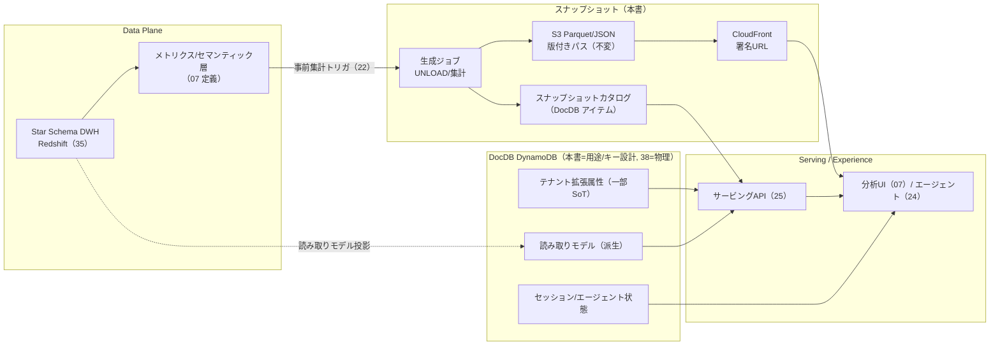
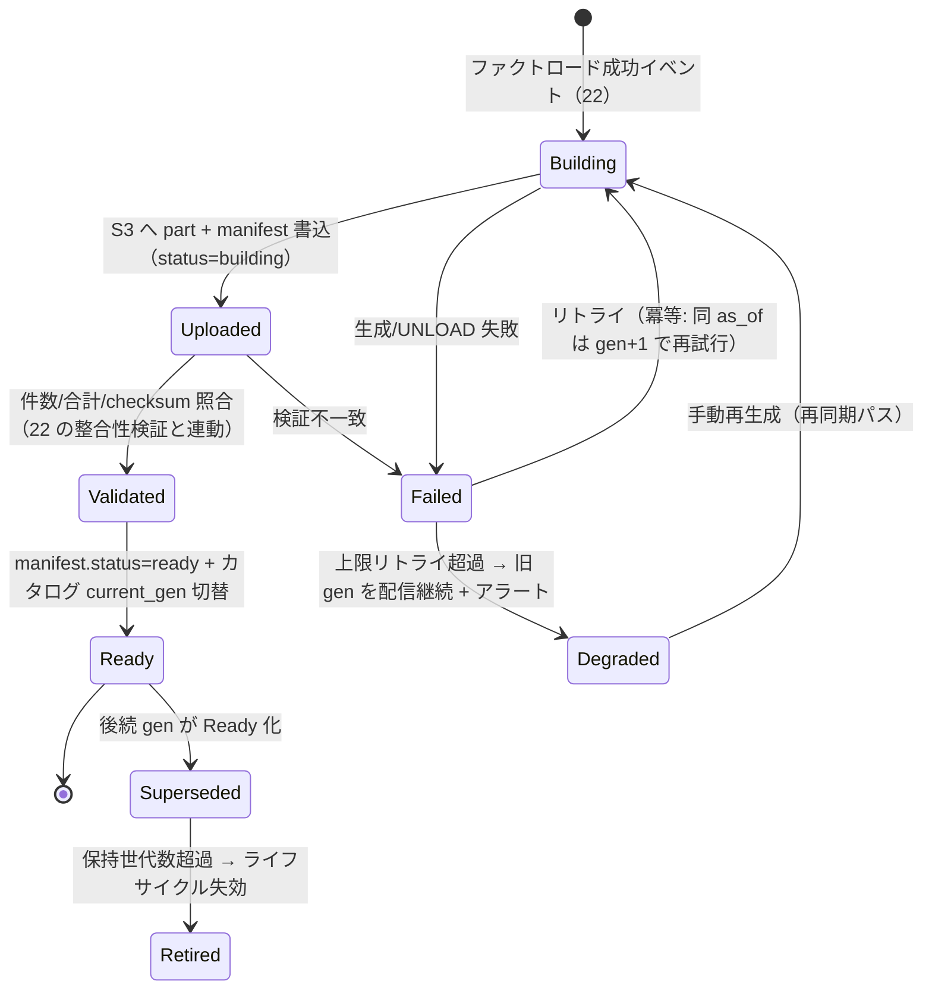
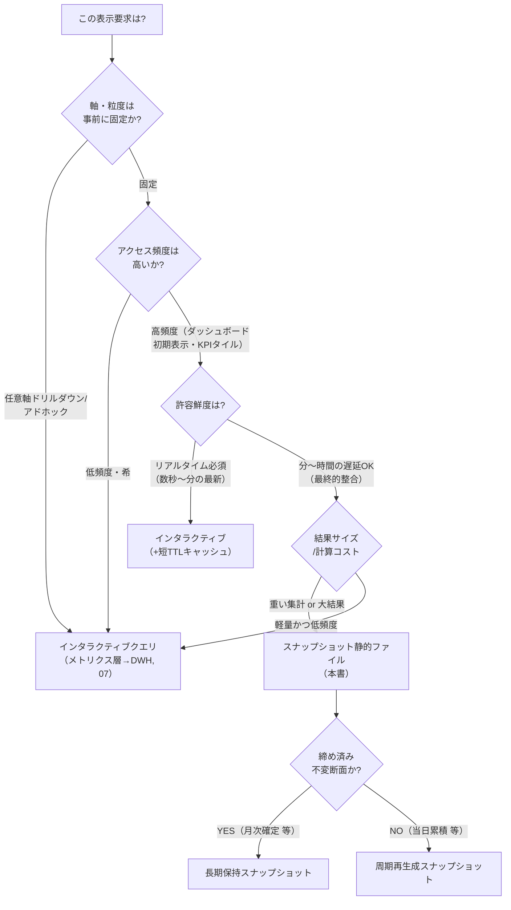
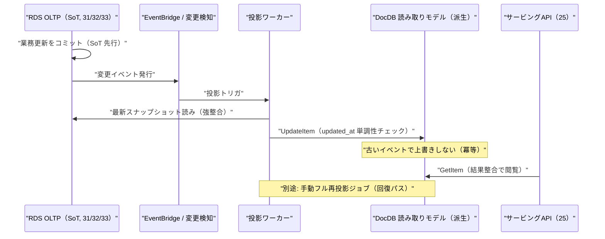

# 詳細設計: スナップショット静的ファイル & ドキュメントDB

本書は **SCIP（Supply Chain Intelligence Platform、コード名。正式名称は未確定）** における
2 つの派生・補助データストア —
(A) **スナップショット静的ファイル**（S3 上の Parquet/JSON による事前集計 + CloudFront 配信）と、
(B) **ドキュメントDB**（Amazon DynamoDB、Firestore を代替として併記）—
の**活用設計**を、実装者が着手できる粒度で定義する。

対象は、(1) スナップショット静的ファイルの物理レイアウト・事前集計・世代/版管理・無効化・CDN 配信、
(2) いつスナップショットを使い、いつインタラクティブクエリ（DWH/メトリクス層）を使うかの**判断基準**、
(3) DynamoDB の用途（テナント拡張属性 / 読み取りモデル / セッション / エージェント状態 / スナップショットカタログ）と
アクセスパターン、(4) DynamoDB の**キー設計**（PK/SK・GSI・テナント分離・シングルテーブル方針）、
(5) DocDB と RDS/DWH の**役割分担・SoT と派生の区別・整合性戦略**、
(6) パフォーマンス最適化としての静的生成（review-standards 非機能層 4.1 の UI 体感基準への接続）、
(7) Firestore を代替とする場合の差分 — である。

> **位置づけ / 所有範囲（ブリーフ §14）:** 本書は **スナップショット静的ファイルの生成・世代管理・無効化・CDN 配信の詳細**と、
> **DocDB の用途別アクセスパターン設計**を権威的に所有する。
> **DocDB アイテムの物理形状（属性定義・型・GSI 射影の確定版）は
> [AI/ベクター/ナレッジ スキーマ](../database-design/38-ai-vector-knowledge-schema.md)（38）が併記・所有**し、本書は
> それを論理参照する。スナップショットの**入力（事前集計の起動点・入力契約・メジャー加法性区分）は
> [スタースキーマ変換](./22-star-schema-transformation.md)（22）が所有**し、本書はその下流。
> `dim_*` / `fact_*` の物理は [スタースキーマ DWH](../database-design/35-star-schema-dwh.md)（35）、
> メトリクス/セマンティック定義と可視化要件は [分析・可視化](../basic-design/07-service-analytics.md)（07）、
> テナント拡張項目（フィーチャーフラグ・拡張スキーマ）の登録は
> [SIカスタマイズ/プロビジョニング](./27-si-customization-and-provisioning.md)（27）が所有する。本書はこれらを再定義しない。

---

## 1. 目的・スコープと責務境界

### 1.1 この 2 ストアが解く問題

SCIP の差別化は「分析サービスへの連携難易度の低さ」と「各分析機能の実現性」（ブリーフ §1）である。
DWH（Redshift Serverless）にスタースキーマが載っても、**ダッシュボード初期表示のたびに大規模 GROUP BY を叩けば
UI 体感基準（初期表示 200ms 以下, review-standards 4.1）を満たせない**。ここを埋めるのが 2 つの補助ストアである。

| ストア | 何を解くか | 主なユーザー価値 |
|--------|-----------|------------------|
| スナップショット静的ファイル | 「よく見る集計」を**事前計算して静的配信**し、DWH を叩かず CDN からミリ秒で返す | ダッシュボード初期表示・KPI タイルの体感速度、DWH 負荷/コスト削減 |
| ドキュメントDB（DynamoDB） | RDS/DWH に載せにくい**柔軟属性・非構造・高頻度 KVS・読み取りモデル・セッション/エージェント状態**を担う | テナント拡張の柔軟性、読み取りモデルの単一取得高速化、エージェント実行状態の低レイテンシ管理 |

いずれも **SoT ではなく派生・補助**が原則である（一部のテナント拡張属性のみ DocDB が SoT。§5）。
「派生は SoT から必ず再生成できる」ことを設計不変条件とする（原則2・原則6）。

### 1.2 スコープと責務境界

| # | 領域 | 本書の責務 | 上流/物理の所有 |
|---|------|-----------|----------------|
| 1 | スナップショット静的ファイル | S3 レイアウト・世代/版・無効化・CDN 配信・生成ジョブ・カタログ登録 | 事前集計の起動点/入力契約=22、加法性区分=22/07 |
| 2 | スナップショット vs 対話クエリ | 判断基準（デシジョンツリー・分岐条件） | メトリクス層定義=07、DWH=35 |
| 3 | DocDB 用途分類 | 用途別アクセスパターン・キー設計方針 | アイテム物理形状=38 |
| 4 | DocDB キー設計 | PK/SK・GSI・テナント分離・シングルテーブル方針 | 確定版アイテム属性=38 |
| 5 | 役割分担/整合性 | DocDB↔RDS/DWH の SoT・派生区分・最終的整合の許容範囲 | 各 SoT テーブル=各所有ドキュメント |
| 6 | 静的生成による体感最適化 | UI 体感基準への接続・キャッシュ/フォールバック戦略 | UI 要件=07 |
| 7 | Firestore 代替 | DynamoDB との差分・移行時の判断 | — |

**本書が所有しないもの:** `dim_*`/`fact_*` の CREATE TABLE（35）、`agent_session`/`agent_message`/`decision_package` 等の
確定アイテム属性（38）、メトリクス定義 SQL（07）、拡張スキーマ登録 UI/メタ（27）。これらは参照に留める。

### 1.3 データフローにおける位置



---

## 2. スナップショット静的ファイル

### 2.1 定義と役割

**スナップショット静的ファイル**とは、DWH/メトリクス層から**特定の `as_of` 時点で事前集計した結果**を、
S3 上に **Parquet（機械可読・大容量）または JSON（UI 直配信・小容量）**として書き出し、CloudFront で配信する派生成果物である。

- **SoT はあくまで DWH（35）/メトリクス定義（07）**。スナップショットはそこから決定的に再生成できる派生（データストアカタログ, ブリーフ §5）。
- 「よく叩かれる」「粒度が固定」「テナント横断で共通の型」の集計をスナップショット化する。任意軸のドリルダウン等は対話クエリに委ねる（§3）。
- スナップショットは**特定 `load_run` / `as_of` の断面**（22 §8）。ファクト再ロードが走ったら該当スナップショットを再生成する。

### 2.2 スナップショットの種別

| 種別 | 形式 | 典型サイズ | 用途 | 例 |
|------|------|-----------|------|----|
| KPI タイル | JSON | 数KB | ダッシュボード上部の単値/前期比 | 当月売上・前年比・在庫回転 |
| 定型集計テーブル | JSON/Parquet | 数十KB〜数MB | 決まった軸のランキング/推移 | 商品別売上 TOP50、地域別売上 |
| 時系列 | JSON/Parquet | 数十KB〜数MB | 折れ線・棒グラフの系列 | 日次/週次/月次売上・在庫推移 |
| 明細抽出（限定） | Parquet | 数MB〜数百MB | ダウンロード/BI 取込用の締め済み断面 | 月次確定売上明細 |
| 集約スナップショット断面 | Parquet | 中 | 在庫締め断面（半加法メジャー） | `fact_inventory_snapshot` 由来の締め在庫 |

> **半加法メジャーの伝達（22 §5.1・`ANL-004`）:** 在庫残高は「拠点・商品では合計可、日付では合計不可」。
> スナップショットのメタ（カタログの `additivity`）に加法性区分を必ず持たせ、UI/メトリクス層が誤って日付軸 SUM しないようにする。

### 2.3 S3 物理レイアウトと世代/版管理

**不変（immutable）オブジェクト + ポインタ切替**を採る。既存オブジェクトを上書きしない（原則2：状態保護／原則7：下位互換）。
版は `as_of`（データ基準時点）と `gen`（生成通番/世代）で識別し、パスに埋め込む。

```
s3://scip-snapshots-<env>/
  tenant=<tenant_id>/
    domain=<sales|inventory|purchase|...>/
      snapshot=<snapshot_key>/          # 例: sales_by_product_top50
        as_of=<YYYY-MM-DDTHH:MM:SSZ>/   # データ基準時点（UTC, ブリーフ §9）
          gen=<generation>/            # 単調増加の世代番号（同一 as_of の再生成で +1）
            manifest.json               # 版メタ（下記 §2.4）
            data.json                   # UI 直配信（JSON 種別）
            part-0000.parquet ...       # 大容量（Parquet 種別）
            _CHECKSUM                    # SHA-256（全 part の整合検証）
```

- **パスは版ごとに一意**（`as_of` + `gen`）。よって S3/CloudFront では**長期 immutable キャッシュ**（`Cache-Control: public, max-age=31536000, immutable`）を付与できる。
- **上書きしないため、無効化（invalidation）はパス切替で行う**（§2.6）。「最新はどれか」を**実行時に参照する現在版の権威**は**カタログ（DocDB）のポインタ**である。ただしこのカタログは**派生**であり、恒久的な復元可能 SoT は**S3 manifest 集合**（§2.4）にある。カタログ喪失時は manifest 再スキャンで再構築できる（§10）。S3 は全世代の履歴を保持する。
- **世代の保持期間:** 直近 N 世代（既定 3）+ 締め断面（月次確定）は長期保持。古い世代は S3 ライフサイクルで Glacier IR → 失効（未決 §11-2）。

### 2.4 マニフェスト（manifest.json）

各版に**自己記述メタ**を同梱する。カタログ（DocDB）と S3 の二重管理だが、S3 側 manifest は**再スキャンによるカタログ復元の源泉**（原則6：手動回復パス）。

```json
{
  "snapshot_key": "sales_by_product_top50",
  "tenant_id": 1024,
  "domain": "sales",
  "grain": ["product_key", "month"],
  "measures": ["net_amount", "qty", "margin_amount"],
  "additivity": { "net_amount": "additive", "qty": "additive", "margin_amount": "additive" },
  "as_of": "2026-07-01T00:00:00Z",
  "generation": 7,
  "source_load_run_id": 88213,
  "format": "json",
  "row_count": 50,
  "byte_size": 41230,
  "checksum_sha256": "…",
  "produced_at": "2026-07-01T02:14:33Z",
  "producer": "snapshot-generator@v1",
  "schema_version": "1.0.0",
  "status": "ready"
}
```

- `source_load_run_id` で **22 の `load_run` / `data_lineage`** に紐づく（リネージ追跡・再生成再現性）。
- `status`（`building` → `ready` → `superseded` → `retired`）は生成の状態機械（§2.5）。カタログの `current_gen` は `ready` になって初めて切替える（half-written を配信しない）。
- **`additivity` のキーは当該 `measures` と一致させる**（欠落・余分を作らない）。上例は売上スナップショット（`sales_by_product_top50`）なので全メジャーが加法（`additive`）。

半加法メジャー（`semi_additive_time`）は在庫ドメインの別スナップショットで現れる。例として `fact_inventory_snapshot`（35/§8）由来の締め在庫断面（grain = `[product_key, location_key, date]`）の manifest を示す。

```json
{
  "snapshot_key": "inventory_on_hand_by_location",
  "tenant_id": 1024,
  "domain": "inventory",
  "grain": ["product_key", "location_key", "date"],
  "measures": ["on_hand_qty", "on_hand_value", "available_qty"],
  "additivity": {
    "on_hand_qty": "semi_additive_time",
    "on_hand_value": "semi_additive_time",
    "available_qty": "semi_additive_time"
  },
  "as_of": "2026-07-01T00:00:00Z",
  "generation": 3,
  "source_load_run_id": 88250,
  "format": "parquet",
  "schema_version": "1.0.0",
  "status": "ready"
}
```

> 在庫残高メジャーは「拠点・商品では合計可、日付では合計不可（`semi_additive_time`）」（§2.2・22 §5.1・`ANL-013`）。この加法性区分をカタログ／UI に必ず伝達し、日付軸 SUM を防ぐ。

### 2.5 生成ジョブと状態機械

生成は 22 の**ファクトロード成功イベント**（EventBridge, ブリーフ §4）を起点に発火する。生成失敗は**サービング全体を止めない**（原則4：非ブロッキング。古い版が残っていればそれを配信し続ける）。



**冪等性（原則2・API §Idempotency）:** 同一 `(tenant_id, snapshot_key, as_of)` の再生成要求は**新しい `gen` を採番**して実行し、
検証成功時にのみポインタを進める。途中失敗が既存の `ready` 版を破壊しない。生成要求には `Idempotency-Key` を付し、重複発火を抑止。

### 2.6 無効化（Invalidation）とキャッシュ整合

不変パス方式のため、**個別オブジェクトの CloudFront invalidation は原則不要**。UI は次の 2 経路で「最新版」を得る。

1. **カタログ経由（推奨）:** UI/サービングAPI はまず**カタログ（DocDB）に現在の `current_gen` を問合せ**、返ってきた版付き URL を叩く。カタログ更新（`current_gen` 切替）が事実上の無効化。カタログ応答は短 TTL（例 30s）でキャッシュ。
2. **manifest ポインタ経由:** `…/snapshot=<key>/latest.json` に**現在版へのリダイレクト/参照だけ**を置く場合、この 1 オブジェクトのみ短 TTL + 更新時に CloudFront invalidation（1 パスのみ、低コスト）。

| 無効化トリガ | アクション |
|--------------|-----------|
| ファクト増分ロード成功（22） | 影響 `snapshot_key` を `gen+1` で再生成 → 検証 → カタログ切替 |
| ファクト再構築/バックフィル（22 §7） | 影響範囲の全 `snapshot_key` を一括再生成（`as_of` は再構築断面） |
| メトリクス定義変更（07） | `schema_version` を上げ、全世代を再生成（旧版は `retired` へ） |
| テナント設定変更（地域粒度切替 等） | 該当テナント・該当ドメインのスナップショットを再生成 |

> **一貫性（原則6）:** SoT（DWH）書込 → スナップショット再生成 → カタログポインタ切替の順序を厳守する。逆順（先にポインタを未生成版へ向ける）は禁止。

### 2.7 CDN 配信とテナント分離セキュリティ

- **CloudFront + 署名付き URL/Cookie**。パス/キーに `tenant=<tenant_id>` を必ず含め、**署名スコープをテナント境界に限定**する（24 §スナップショット・ブリーフ §12 テナント境界）。
- サービングAPI（25）が Firebase ID Token の `tenant_id` クレームを検証（ブリーフ §11）→ **要求テナントと一致した場合のみ**、そのテナントのプレフィックスに限定した署名 URL を発行する。クロステナント参照は 403（`CMN-003`）。
- S3 バケットは OAC（Origin Access Control）で CloudFront 経由のみ許可。直接 GET は拒否（review-standards 4.2 アクセス経路）。
- 明細抽出（機微含む可能性）は**既定マスク + 権限 + 監査ログ**（ブリーフ §11）。仕入単価等はスナップショット化しない、またはマスク済みメジャーのみ格納。

---

## 3. スナップショット vs インタラクティブクエリの判断基準

### 3.1 デシジョンツリー



### 3.2 判断マトリクス

| 判断軸 | スナップショット向き | インタラクティブクエリ向き |
|--------|---------------------|--------------------------|
| 軸/粒度 | 固定（事前に列挙可能） | 任意・ドリルダウン・ピボット可変 |
| アクセス頻度 | 高（全ユーザーの初期表示） | 低〜中（探索的） |
| 許容鮮度 | 分〜時間の遅延を許容（最終的整合） | 直近/リアルタイム |
| 計算コスト | 重い（大規模 GROUP BY/JOIN） | 軽い or 選択的 |
| 結果の再利用性 | 多数のユーザー・画面で共通 | クエリ毎に異なる |
| UI 体感要件 | 初期表示 200ms 以下必達（4.1） | 検索結果は非同期+スケルトンで補償 |
| コスト最適化 | DWH スキャン回数を削減したい | 都度課金でも許容 |

### 3.3 ハイブリッド運用

- **土台はスナップショット、深掘りは対話クエリ**: ダッシュボード初期ロードはスナップショットで即描画（体感 200ms 以下）。ユーザーが特定セルをドリルダウンしたら、その時だけメトリクス層 → DWH の対話クエリを非同期実行し、スケルトン + 完了時プッシュで補償（4.1）。
- **鮮度表示（原則: 誤解を招かない）:** スナップショット由来の数値には `as_of`（例「2026-07-01 02:14 時点」）を UI に併記する（U-2 出力の直感性）。最新でないことを隠さない。
- **フォールバック:** カタログに `ready` 版が無い（未生成）の場合は対話クエリへフォールバック（非ブロッキング, `ANL-010`）。生成が Degraded（上限リトライ超過で旧版を継続配信中）の場合は旧版を配信しつつ対話クエリで補完（`ANL-011`）。逆に DWH が高負荷/障害時は直近スナップショットで縮退表示。

---

## 4. ドキュメントDB（DynamoDB）の用途とアクセスパターン

### 4.1 DocDB を使う判断（RDB/DWH/物理ファイルとの切り分け）

review-standards 2.2 の I/F 6視点①（技術スタック制約: RDB / ドキュメントDB / 物理ファイル）に従い、以下を DocDB に置く。

| 用途 | DocDB に置く理由 | SoT/派生 | 物理形状の所有 |
|------|-----------------|----------|----------------|
| テナント拡張属性（型付き列に載らない可変オプション項目） | スキーマレスな柔軟属性。テナント毎に形が違う | **一部 SoT**（拡張値の一次格納。§5） | 27（登録メタ）/ 本書（保存形状方針）/ 38（確定形状） |
| 読み取りモデル（read model / 単一取得用の非正規化ビュー） | RDS/DWH の JOIN 結果を単一 GET で返す非正規化投影 | 派生 | 本書（キー設計）/ 38 |
| スナップショットカタログ（現在版ポインタ・メタ索引） | 高頻度・低レイテンシの KVS 参照。§2 と直結。**配信時の権威ある高速索引** | 派生（S3 manifest から再スキャンで再構築可能） | 本書 |
| エージェントセッション/短期状態（実行中のカウンタ・作業状態） | 低レイテンシ更新・TTL 自動失効。24 のループ制御 | 派生（SoT は `agent_message` 等 RDS, 38） | 38（`agent_session` は RDS が SoT）/ 本書（DocDB キャッシュ形状） |
| 意思決定パッケージ（`decision_package`） | 段階的に部分更新される半構造ドキュメント | DocDB アイテム（24/38 が定義） | **38 が所有** |
| セッション/一時トークン・冪等キー記録 | TTL 付き揮発データ。高頻度 read/write | 揮発（SoT なし） | 本書 |

**DocDB に置かないもの:** 業務トランザクション/マスタ（RDS OLTP が SoT）、正準エンティティ（34）、分析ファクト（35=DWH）。
これらは各所有ストアの SoT に置き、DocDB には**派生/読み取りモデルとしてのみ**投影する。

### 4.2 アクセスパターン一覧（キー設計の前提）

DynamoDB はアクセスパターン先行設計（access-pattern-first）が鉄則。主要パターンを列挙する。

| # | アクセスパターン | 操作 | 主キー/索引 |
|---|-----------------|------|-------------|
| AP1 | あるテナントのスナップショットカタログの現在版を取得 | GetItem | PK=`TENANT#<t>` SK=`SNAPCAT#<domain>#<snapshot_key>` |
| AP2 | あるテナント・ドメインのスナップショット一覧 | Query（SK begins_with） | PK=`TENANT#<t>` SK begins_with `SNAPCAT#<domain>#` |
| AP3 | あるエンティティのテナント拡張属性を取得 | GetItem | PK=`TENANT#<t>` SK=`EXT#<entity_type>#<entity_id>` |
| AP4 | ある読み取りモデル（例: 商品360ビュー）を単一取得 | GetItem | PK=`TENANT#<t>` SK=`RM#<model>#<key>` |
| AP5 | 実行中エージェントセッション状態を取得/更新 | GetItem/UpdateItem | PK=`TENANT#<t>` SK=`SESS#<session_id>` |
| AP6 | あるユーザーのアクティブセッション列挙 | Query（GSI1） | GSI1PK=`TENANT#<t>#USER#<uid>` GSI1SK=`SESS#<updated_at>` |
| AP7 | 冪等キーの存在確認・記録（TTL 失効） | GetItem/PutItem(条件) | PK=`TENANT#<t>` SK=`IDEMP#<key>` + `ttl` |
| AP8 | 意思決定パッケージの取得/段階更新 | GetItem/UpdateItem | PK=`TENANT#<t>` SK=`DECPKG#<package_id>`（形状=38） |
| AP9 | ステータス別に処理待ちパッケージを走査 | Query（GSI2） | GSI2PK=`TENANT#<t>#STATUS#<status>` GSI2SK=`DECPKG#<updated_at>` |

---

## 5. DynamoDB キー設計

### 5.1 シングルテーブル方針

**シングルテーブル設計を主とする**（AWS 推奨。テーブル数・IAM・運用を最小化し、原則3：既存パターン再利用にも合致）。
用途別に**エンティティ種別を SK プレフィックスで名前空間分離**する。ただし以下は例外的にテーブルを分ける（未決 §11-1）。

- **物理的に寿命/課金特性が大きく異なるもの**（例: 高頻度・短命の冪等キー/セッション TTL データ）は、ホットパーティション回避・TTL 一括運用のため別テーブル化を検討。
- **エージェント/意思決定系（38 所有）**は 38 の設計判断に従う（本書のシングルテーブルに同居させるか、AI 専用テーブルにするかは 38 が決定。本書は用途とキー方針のみ提示）。

### 5.2 テーブル定義（論理）

テーブル名: `scip_docdb_<env>`（例 `scip_docdb_prod`）。**課金モードは On-Demand を既定**（スパイクの読めない分析/エージェント用途, ブリーフ §4 マネージド志向）。

| 属性 | 役割 | 例 |
|------|------|----|
| `PK`（パーティションキー, S） | **テナント境界を最上位に**。`TENANT#<tenant_id>` | `TENANT#1024` |
| `SK`（ソートキー, S） | エンティティ種別プレフィックス + 識別子 | `SNAPCAT#sales#sales_by_product_top50` |
| `GSI1PK` / `GSI1SK` | ユーザー軸/セッション軸の逆引き | `TENANT#1024#USER#u_88` / `SESS#2026-07-01T02:14:33Z` |
| `GSI2PK` / `GSI2SK` | ステータス軸の走査 | `TENANT#1024#STATUS#pending` / `DECPKG#2026-07-01T…` |
| `entity_type`（S） | アイテム種別（`snapcat`/`ext`/`rm`/`sess`/`idemp`/`decpkg`） | `snapcat` |
| `data`（M） | 種別ごとのペイロード（形状は §5.4 / 38） | `{…}` |
| `schema_version`（S） | ペイロードスキーマ版（前方/後方互換の識別） | `1.0.0` |
| `tenant_id`（N） | 冗長保持（フィルタ/移行用。PK からも導出可） | `1024` |
| `created_at` / `updated_at`（S, ISO8601 UTC） | 監査（ブリーフ §9 TIMESTAMPTZ 相当を文字列で） | `2026-07-01T02:14:33Z` |
| `ttl`（N, epoch 秒） | DynamoDB TTL（セッション/冪等キー等の自動失効） | `1751340000` |

> **キー設計原則（review-standards 1.2）:** PK/SK は**意味を持つが変更されない合成キー**。`tenant_id` は契約単位で不変、
> `snapshot_key`/`session_id`/`package_id` は採番後不変。業務的に変わり得る値（名称・ステータス）は SK に埋めず属性 or GSI に置く。

### 5.3 テナント分離（最重要）

- **PK 先頭が必ず `TENANT#<tenant_id>`**。これにより 1 テナントのデータが同一論理パーティション名前空間に収まり、
  **IAM の `dynamodb:LeadingKeys` 条件でテナント越境を構造的に禁止**できる（Pooled マルチテナンシー, ブリーフ §6）。

```json
{
  "Effect": "Allow",
  "Action": ["dynamodb:GetItem","dynamodb:Query","dynamodb:PutItem","dynamodb:UpdateItem"],
  "Resource": "arn:aws:dynamodb:ap-northeast-1:*:table/scip_docdb_prod",
  "Condition": {
    "ForAllValues:StringEquals": { "dynamodb:LeadingKeys": ["TENANT#${aws:PrincipalTag/tenant_id}"] }
  }
}
```

- アプリ層でも**全 DynamoDB 呼び出しに `tenant_id` プレフィックスを強制するリポジトリ層**を用意し、二重防御（RDS の RLS `SET app.tenant_id` に相当する境界。ブリーフ §6）。
- **Silo テナント（大規模/高分離要件, ブリーフ §6）**は、テーブルを分離（`scip_docdb_<env>_t<tenant_id>`）してルーティング切替。同一アイテム形状を保つ。
- GSI の PK にも必ず `TENANT#<t>` を含め、GSI 経由のクロステナント漏れを防ぐ。

### 5.4 用途別アイテム形状（`data` ペイロード）

本書が所有する 3 種の形状を定義する（`decpkg` / `sess`（SoT 側属性）は 38 が所有、ここでは DocDB キャッシュ投影のみ）。

**(a) スナップショットカタログ（`entity_type=snapcat`）— 本書所有:**

```json
{
  "PK": "TENANT#1024", "SK": "SNAPCAT#sales#sales_by_product_top50",
  "entity_type": "snapcat", "schema_version": "1.0.0",
  "data": {
    "domain": "sales", "snapshot_key": "sales_by_product_top50",
    "current_gen": 7, "current_as_of": "2026-07-01T00:00:00Z",
    "current_url_path": "tenant=1024/domain=sales/snapshot=sales_by_product_top50/as_of=2026-07-01T00:00:00Z/gen=7/data.json",
    "format": "json", "additivity": {"net_amount": "additive"},
    "status": "ready", "row_count": 50, "byte_size": 41230,
    "source_load_run_id": 88213, "retained_gens": [7, 6, 5]
  },
  "updated_at": "2026-07-01T02:14:33Z"
}
```

**(b) テナント拡張属性（`entity_type=ext`）— 一部 SoT（§6）:**

```json
{
  "PK": "TENANT#1024", "SK": "EXT#product#90231",
  "entity_type": "ext", "schema_version": "1.2.0",
  "data": {
    "entity_type": "product", "entity_id": 90231,
    "attributes": { "eco_label": "GRS認証", "target_gender": "kids", "custom_tags": ["限定","再入荷"] },
    "schema_ref": "ext_schema:product@1.2.0"
  },
  "updated_at": "2026-06-28T10:00:00Z"
}
```

**(c) 読み取りモデル（`entity_type=rm`）— 派生:**

```json
{
  "PK": "TENANT#1024", "SK": "RM#product360#90231",
  "entity_type": "rm", "schema_version": "1.0.0",
  "data": { "product_key": 90231, "sku": "62513AB09M", "name": "…",
            "latest_price": 4980, "on_hand_total": 320, "last_sold_at": "2026-06-30",
            "top_regions": ["東京都","大阪府"] },
  "source_as_of": "2026-07-01T00:00:00Z", "updated_at": "2026-07-01T02:20:00Z"
}
```

> 拡張属性 `attributes` の形状は継承実装の**型付き拡張テーブル + `attributes JSONB`**（ブリーフ §9 拡張）と対を成す。
> RDS 側に型付き拡張列で持つか DocDB の JSONB 相当で持つかは 27 の登録メタが決める。本書は DocDB 保存時の**キー・スキーマ版・テナント境界**を規定する。

---

## 6. DocDB と RDS/DWH の役割分担・SoT・整合性戦略

### 6.1 SoT / 派生マップ（本書スコープの再掲・確定）

| データ | SoT | DocDB の役割 | 整合方式 |
|--------|-----|--------------|----------|
| 業務トランザクション/マスタ | RDS OLTP（31/32/33） | 読み取りモデル投影（派生） | イベント駆動投影 + 手動再投影 |
| 正準エンティティ | Canonical DB（34） | 読み取りモデル投影（派生） | 同上 |
| 分析ファクト/集計 | DWH（35）/メトリクス（07） | スナップショットカタログ（派生） | ファクトロード後に再生成（§2.5） |
| テナント拡張属性 | **DocDB（一部）** or RDS 拡張テーブル | 拡張値の一次格納（§6.2） | 27 の登録スキーマに従属 |
| エージェント会話/メッセージ | RDS `agent_message`（38, append-only） | 短期状態/カウンタのキャッシュ | セッション終了時に要約昇格（24 §メモリ） |
| 意思決定パッケージ | **DocDB `decision_package`（38 所有）** | 段階的更新の本体 | 確定操作は `audit_logs`(37) へ二重記録 |
| 冪等キー/一時トークン | 揮発（SoT なし） | TTL 付き記録 | TTL 自動失効 |

### 6.2 テナント拡張属性の SoT 判断

拡張属性は **2 通りの持ち方**があり、27（拡張スキーマ登録）が選択する。本書は両者の整合ルールのみ規定する。

1. **型付き拡張テーブル（RDS, `*_ext` + `attributes JSONB`）を SoT とする**（構造化・検索/集計が必要な項目）: DocDB には**読み取りモデルとして投影のみ**（派生）。DWH 連携（35/22）も RDS 側を源泉にする。
2. **DocDB を SoT とする**（純粋に表示のみ・DWH 連携不要・高頻度可変なメモ的項目）: この場合 DocDB が唯一の格納先。**DWH には流れない**ことを設計判断として明記（ブリーフ §5「SoT から復元できないデータの文書化」）。

> **原則（ブリーフ §5・原則6）:** SoT が RDS 側なら **RDS 書込 → DocDB 投影**の順序を厳守（逆順禁止）。DocDB が SoT の項目は
> 「DWH 分析対象外」であることを 07/22 に伝達し、分析要件が生じたら (1) へ移行する（下位互換パッチを 27 が用意）。

### 6.3 整合性戦略（最終的整合の許容範囲）

派生（読み取りモデル/スナップショット/カタログ）は**最終的整合（eventual consistency）**を許容する。許容範囲を明示する。

| データ | 許容遅延（目安） | 整合の仕組み | 不整合検知/回復 |
|--------|-----------------|--------------|----------------|
| スナップショット | 分〜時間（バッチ周期依存） | ファクトロード後の再生成（§2.5） | カタログ `as_of` と `load_run` の突合。定期リコンサイル |
| 読み取りモデル（rm） | 秒〜分 | OLTP/DWH 変更イベントで投影更新 | 定期フル再投影（原則6：手動回復パス）。`source_as_of` で鮮度検証 |
| スナップショットカタログ | ほぼ即時（生成完了時） | 生成状態機械の `ready` 遷移で切替 | S3 manifest 再スキャンでカタログ復元 |
| エージェント短期状態 | 即時（強整合が必要な更新は条件付き書込） | UpdateItem の条件式（楽観ロック） | SoT（`agent_message`）から再構成 |

- **強整合が必要な更新**（例: エージェントループのカウンタ加算、冪等キー登録）は **DynamoDB 条件付き書込 + `ConsistentRead`** を使う（読み取りモデル等の閲覧は結果整合で十分）。
- **投影の冪等性:** 同一ソースイベントの再投影は同じ結果に収束するよう、`updated_at`/`source_as_of` の**単調性チェック**（古いイベントで新しい投影を上書きしない）を入れる（原則2）。
- **回復パス（必須）:** すべての派生は「イベント受信ハンドラ（EventBridge/変更ストリーム）」+「手動フル再同期ジョブ」の**両方**を持つ（ブリーフ §5・原則6 の変更時確認2）。



---

## 7. パフォーマンス最適化としての静的生成（UI 体感基準への接続）

review-standards 4.1（UI 体感）の数値基準にスナップショット/DocDB がどう寄与するかを明示する。

| UI シーン | 基準（4.1） | 実現手段 |
|-----------|-------------|----------|
| ダッシュボード初期表示 | 200ms 以下 | スナップショット JSON を CDN から取得（DWH を叩かない）。CloudFront エッジキャッシュ |
| KPI タイル/単値 | 100ms 以下（変化なし時間） | KPI スナップショット JSON（数KB）。DocDB カタログで版解決 1 hop |
| 商品360/読み取りモデル単一取得 | 100ms 以下 | DynamoDB GetItem（single-digit ms）。JOIN 済み投影 |
| ドリルダウン/アドホック | 100ms 超は非同期 | メトリクス層 → DWH 対話クエリ + スケルトン + 完了時プッシュ |
| エージェント状態参照 | 低レイテンシ | DynamoDB GetItem。ElastiCache 併用（24） |

- **体感補償（4.1）:** スナップショット未ヒット（`ready` 版なし）/生成中は、スケルトン表示 + 対話クエリフォールバック（`ANL-010`）。生成 Degraded で旧版を配信中の場合は旧版描画 + 補完クエリ（`ANL-011`）。いずれも「画面が止まる」体験を排除。
- **コスト最適化（4.3）:** スナップショットは DWH スキャン回数を削減し、Redshift Serverless の RPU 課金を抑える。頻出集計を静的化することで「同一集計を毎表示で再計算」を回避。
- **キャッシュ階層:** ①CloudFront（静的ファイル）→ ②DocDB カタログ（版ポインタ, 短TTL）→ ③ElastiCache（メトリクス結果, 24/07）→ ④DWH（最終ソース）。上位でヒットするほど速い・安い。

---

## 8. Firestore を代替とする場合の差分

既存 Firebase 資産（Authentication・Hosting, ブリーフ §4）を活かし、DynamoDB の代わりに **Cloud Firestore** を採る選択肢（データストアカタログ, ブリーフ §5）。主に**小規模テナント/PoC/既存 Firebase 運用に寄せる**判断で採用しうる。

| 観点 | DynamoDB（主） | Firestore（代替） | 差分の含意 |
|------|----------------|-------------------|-----------|
| データモデル | テーブル + PK/SK + GSI | コレクション/ドキュメント + サブコレクション | Firestore はパス階層でテナント分離（`tenants/{tid}/…`）。SK プレフィックス設計は不要 |
| クエリ | アクセスパターン先行・GSI 必須 | 複合インデックス（自動/手動）・より柔軟な where | Firestore は探索的クエリに強いが、大規模走査コストに注意 |
| テナント分離 | `LeadingKeys` + IAM + RLS 相当リポジトリ | セキュリティルール（`request.auth.token.tenant_id == tid`） | Firestore はルールで宣言的分離。Custom Claims の `tenant_id`（ブリーフ §6）と直結。**ルールは list/get で評価差**（CLAUDE.md Firestore 注意点）に留意 |
| TTL | ネイティブ TTL 属性 | TTL ポリシー（フィールド指定） | 同等機能あり |
| 整合性 | 結果整合 + 条件付き強整合 | ドキュメント単位で強整合（トランザクション可） | Firestore は単一ドキュメント強整合が既定で扱いやすい |
| コスト/課金 | RCU/WCU or On-Demand | 読み書き/ドキュメント課金 | 高頻度読取（読み取りモデル）は Firestore の read 課金が効きやすい。規模で逆転 |
| リージョン/データ境界 | AWS ap-northeast-1（他 AWS と同一境界） | GCP asia-northeast1 | **AWS 単一クラウド境界を崩す**。KMS/Secrets/監査の統制が二重化 |
| AWS 連携 | Glue/EventBridge/IAM とネイティブ | 連携にブリッジ実装が必要 | 投影パイプライン（§6.3）が跨クラウドになり複雑化 |

**推奨方針（未決 §11-4）:** プラットフォーム標準は **DynamoDB**（AWS 単一境界・IAM 統制・分析パイプライン親和性）。Firestore は
「Firebase に強く依存する小規模テナント」「クライアント直結のリアルタイム購読が要る画面」に限定した代替とし、**アイテム形状（`data` ペイロード・`schema_version`・テナント境界）は共通に保つ**（移行容易性を確保）。抽象化はリポジトリ層で吸収し、上位ロジックはストア非依存にする。

---

## 9. 想定エラーコード

ブリーフ §10 のドメイン接頭辞に従う（スナップショット/DocDB サービングは主に **ANL**、テナント境界/共通は **CMN**、エージェント状態連携は **AI**）。

| コード | 事象 | 発生箇所 | ハンドリング |
|--------|------|----------|-------------|
| `ANL-010` | スナップショット未生成（該当 `snapshot_key`/`as_of` に `ready` 版なし） | カタログ参照 | 対話クエリへフォールバック（非ブロッキング） |
| `ANL-011` | スナップショット生成 Degraded（上限リトライ超過・旧版配信中） | 生成ジョブ | 旧版継続配信 + アラート + 手動再生成誘導 |
| `ANL-012` | スナップショット検証不一致（件数/合計/checksum） | 生成状態機械 | `ready` 昇格を中止・`gen+1` で再試行・旧版維持 |
| `ANL-013` | 半加法メジャーの誤集計要求（日付軸 SUM 等） | メトリクス層/UI 契約 | 集計拒否 + 正しい集計方法を提示（22 §5.1 連動） |
| `ANL-014` | スナップショット鮮度超過（`as_of` が許容遅延を超過） | サービングAPI | 鮮度警告表示 + 再生成トリガ |
| `CMN-003` | クロステナント参照（PK/署名スコープ不一致） | DocDB/CDN 署名 | 403 + 監査ログ（改竄検知） |
| `CMN-004` | DocDB 条件付き書込競合（楽観ロック失敗） | UpdateItem | リトライ or 最新読込後再試行 |
| `CMN-005` | DocDB 読み取りモデル鮮度不整合（`source_as_of` が古い） | 投影/参照 | フル再投影ジョブを起動 |
| `CMN-006` | 冪等キー重複（同一 `Idempotency-Key` 再送） | PutItem 条件 | 既存結果を返す（副作用なし） |
| `AI-020` | エージェント短期状態の DocDB キャッシュミス | セッション参照 | SoT（`agent_message`, 38）から再構成 |

---

## 10. SoT 宣言（本書スコープ）

| データ | SoT | 派生/キャッシュ | 備考 |
|--------|-----|----------------|------|
| スナップショット静的ファイル | **DWH（35）/ メトリクス定義（07）** | S3 Parquet/JSON + CloudFront（派生） | `load_run`（22）から決定的再生成 |
| スナップショットカタログ（現在版ポインタ） | **S3 manifest（再スキャン復元可）** | DocDB アイテム（派生・索引） | カタログ喪失時は manifest 再スキャンで復元 |
| 読み取りモデル（rm） | **各 OLTP/Canonical/DWH** | DocDB アイテム（派生） | イベント投影 + 手動再投影 |
| テナント拡張属性 | **RDS 拡張テーブル or DocDB（27 が選択）** | 他方は投影 | DocDB が SoT の場合 DWH 非連携を明記 |
| エージェント短期状態 | **RDS `agent_message`/`agent_session`（38）** | DocDB/Redis（キャッシュ） | セッション終了時に要約昇格 |
| 意思決定パッケージ | **DocDB `decision_package`（38 所有）** | `audit_logs`(37) へ確定操作を二重記録 | 本書は用途参照のみ |

**原則:** SoT 書込先行 → 派生後追い（逆順禁止）。全派生に「イベント受信 + 手動再同期」の両経路を備える（ブリーフ §5・原則6）。

---

## 11. 未決事項 / 論点

1. **DocDB シングル vs マルチテーブル:** 冪等キー/セッション等の高頻度・短命データを同一テーブルに同居させるか分離するか。同居は運用簡素・ホットパーティション懸念、分離は TTL/課金分離が容易。→ 初期はシングル、負荷計測後に高頻度系のみ分離を再評価（§5.1）。
2. **スナップショット世代保持数とライフサイクル:** 直近何世代を即時保持し、いつ Glacier IR/失効させるか。締め済み月次断面の長期保持年数（監査/再現要件）と S3 コストのトレードオフ（§2.3）。
3. **読み取りモデルの投影粒度:** どの JOIN 済みビューを DocDB に持つか（商品360/顧客360/在庫サマリ 等）。過剰投影はストレージと再投影コスト、過少は API 側 JOIN 責務の押し付け（review-standards 2.1）。07 の画面要件と突合して確定。
4. **Firestore 代替の適用境界:** どのテナント規模/画面要件で Firestore を選ぶか。跨クラウド境界の統制コストと Firebase リアルタイム購読の価値の比較（§8）。ADR（12）で最終判断。
5. **スナップショット鮮度 SLA:** ドメイン別（売上/在庫）の許容遅延（`ANL-014` 閾値）を 07 の分析要件から確定する。当日累積 KPI は分単位、月次確定は日次で十分か。
6. **カタログの強整合要件:** `current_gen` 切替の可視性。DynamoDB 結果整合読みでの版ずれ許容範囲（30s TTL）で UI 体感と一貫性が両立するか要検証。

---

## 12. 関連ドキュメント

- [`22 スタースキーマ変換`](./22-star-schema-transformation.md)（document_id: `star-schema-transformation`） — スナップショット事前集計の**起動点・入力契約・メジャー加法性区分**を所有。本書はその下流（生成・版管理・配信）。
- [`07 分析・可視化`](../basic-design/07-service-analytics.md)（document_id: `service-analytics`） — メトリクス/セマンティック層定義、ダッシュボード/UI 要件。スナップショット vs 対話クエリの利用側。
- [`38 AI/ベクター/ナレッジ スキーマ`](../database-design/38-ai-vector-knowledge-schema.md)（document_id: `ai-vector-knowledge-schema`） — DocDB アイテムの**物理形状**（`decision_package` 等）、`agent_session`/`agent_message` の SoT を所有。本書は用途・キー方針を提示し物理は参照。
- [`27 SIカスタマイズ/プロビジョニング`](./27-si-customization-and-provisioning.md)（document_id: `si-customization-provisioning`） — テナント拡張スキーマ・フィーチャーフラグの登録メタを所有。拡張属性の SoT 選択（§6.2）を決定。
- [`35 スタースキーマ DWH`](../database-design/35-star-schema-dwh.md)（document_id: `star-schema-dwh`） — `dim_*`/`fact_*` 物理。スナップショットの上流 SoT。
- [`25 API/連携コントラクト`](./25-api-and-integration-contracts.md)（document_id: `api-integration-contract`） — スナップショット取得・メトリクスクエリのサービングAPI 契約。
- [`24 AIエージェント/バーチャルカンパニー`](./24-ai-agent-and-virtual-company.md)（document_id: `ai-agent-virtual-company`） — エージェント短期状態/セッションの DocDB 利用側。
