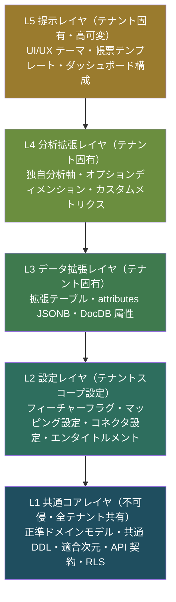
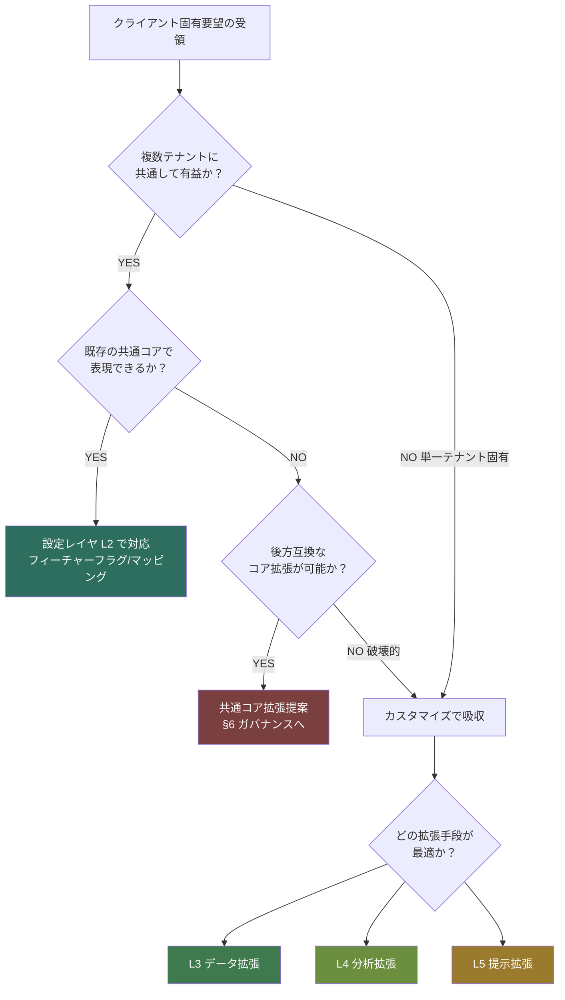
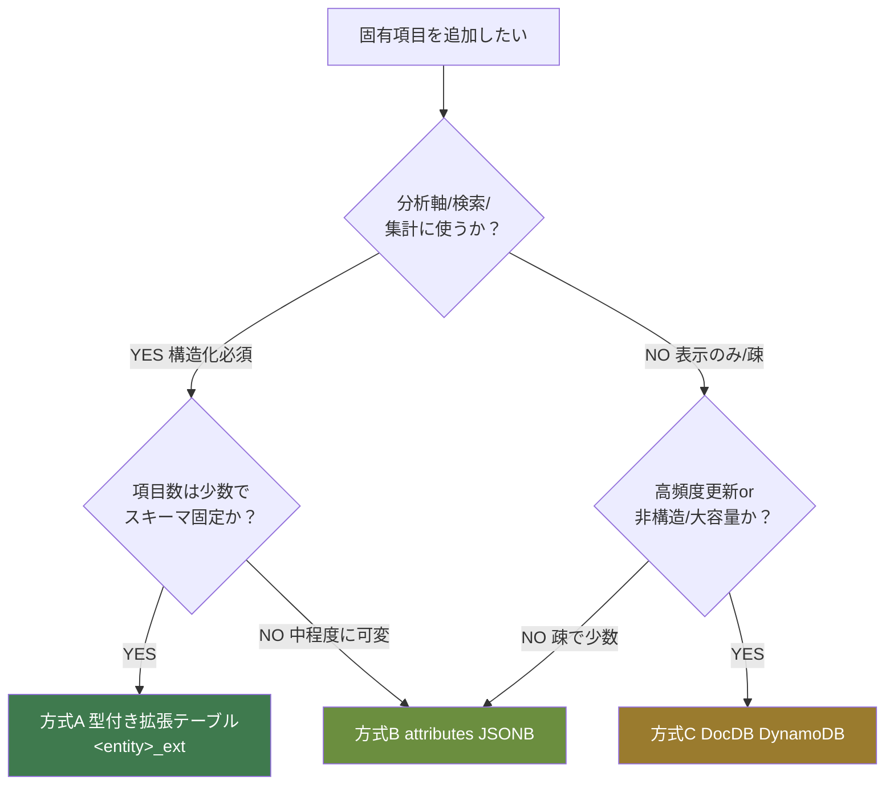
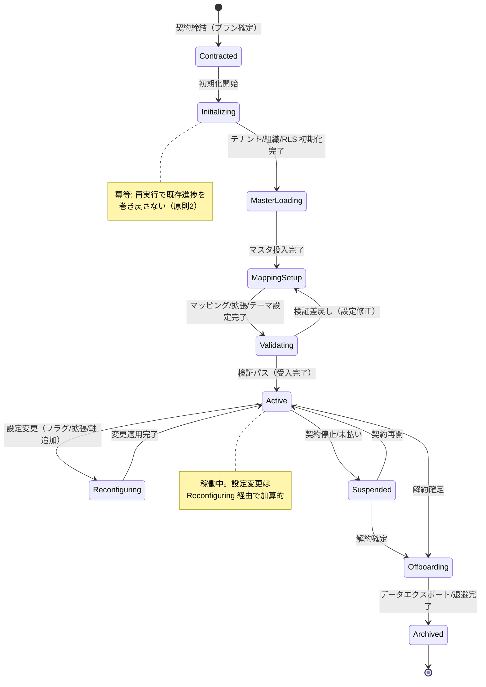
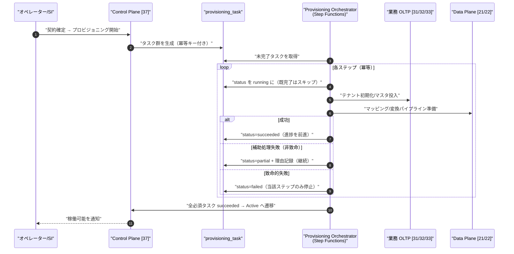
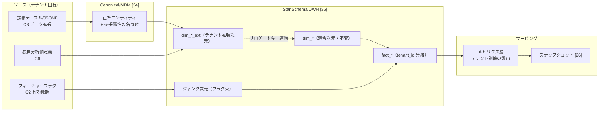
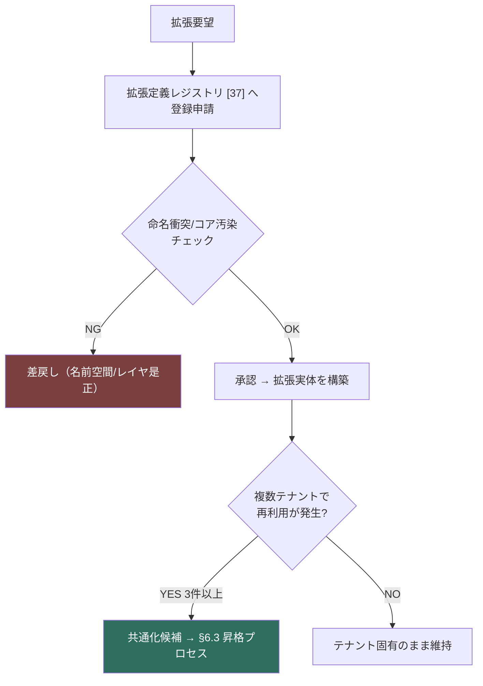

# 詳細設計: SIカスタマイズ & プロビジョニング

本書は **SCIP（Supply Chain Intelligence Platform、コード名。正式名称は未確定）** における
**SI（システムインテグレーション）カスタマイズとテナントプロビジョニング**の詳細設計を、
実装者が着手できる粒度で権威的に定義する。

SCIP は「共通データ基盤の上に分析・可視化・意思決定支援を載せる」マルチテナント SaaS である。
その SI 戦略の核心は **「共通化できる部分は最大限共通化し、固有事情のみをカスタマイズする」**（ブリーフ §2）。
本書は、この戦略を (1) レイヤ分割で構造化し、(2) カスタマイズ手段のカタログとして体系化し、
(3) テナント契約から稼働までのプロビジョニング・ライフサイクルとして定義し、
(4) カスタマイズがスタースキーマ / 分析へどう波及するかを設計し、
(5) 下位互換性・データ保護・ガバナンス（共通コアの汚染防止とアップグレード可能性の維持）を規定する。

継承実装 **akebono-honshu**（履物メーカー Honshu の単一テナント実装）は、
本来「1 社固有の作り込み」であったものを一般化した最初のメーカーテナントである（ブリーフ §15）。
Honshu 固有だった要素（11 桁品番構成・18 マスタ・履物特有の分類軸など）を
**「共通コア」と「テナント固有カスタマイズ」に切り分ける**ことが、本書の設計対象そのものである。

---

## 本書の所有範囲（owns）と SoT 宣言

| 区分 | 本書の扱い |
|------|-----------|
| **owns（権威的定義）** | 共通化 vs カスタマイズの**レイヤ戦略**、カスタマイズ**手段カタログ**とその選択基準、テナントプロビジョニングの**ライフサイクル / 状態遷移 / オーケストレーション手順**、拡張がスタースキーマへ波及する**設計パターン**、カスタマイズの**下位互換・データ保護ルール**、共通コア汚染防止と**アップグレード可能性のガバナンス** |
| **参照（再定義しない）** | 設定・プロビジョニングの**物理スキーマ**（`feature_flag`/`tenant_feature`/`connector`/`connector_config`/`provisioning_task`/`plan`/`entitlement` 等は [37 コントロールプレーン/バックオフィス](../database-design/37-control-plane-backoffice-schema.md) が所有）、マッピングメタデータの物理スキーマ（`mapping_rule`/`source_field` 等は [36 マッピング](../database-design/36-mapping-metadata-schema.md) が所有）、DocDB / スナップショットの物理設計（[26 スナップショット/DocDB](./26-snapshot-and-document-db.md) が所有）、DWH の `dim_*`/`fact_*`（[35 DWH](../database-design/35-star-schema-dwh.md) が所有）、各 OLTP の DDL（[31 小売](../database-design/31-oltp-retail-schema.md)/[32 メーカー](../database-design/32-oltp-manufacturer-schema.md)/[33 WMS](../database-design/33-oltp-wms-schema.md) が所有）、バックオフィスの業務フロー（[09 バックオフィス](../basic-design/09-service-backoffice.md) が所有） |

> **SoT 宣言（本書が扱う「カスタマイズ設定」の Source of Truth）:**
> カスタマイズ設定は**それ自体が独立したデータ種別**であり、以下のとおり複数の SoT に分散する。
> 本書はこれらの**設定を横断する意味づけ・整合ルール**を所有し、物理格納の SoT は各所有ドキュメントに委ねる。
>
> | カスタマイズ設定の種別 | SoT ストア | 所有ドキュメント |
> |----------------------|-----------|----------------|
> | フィーチャーフラグ / オプション機能の有効化 | RDS Control Plane（`feature_flag`/`tenant_feature`） | [37] |
> | プラン / エンタイトルメント（機能の課金境界） | RDS Control Plane（`plan`/`entitlement`） | [37] |
> | コネクタ設定 / 接続先 | RDS Control Plane（`connector`/`connector_config`） | [37] |
> | プロビジョニング進捗 / タスク状態 | RDS Control Plane（`provisioning_task`） | [37] |
> | 項目マッピング設定 | RDS メタデータ DB（`mapping_rule` ほか） | [36] |
> | テナント拡張属性（構造化された固有項目の値） | 拡張テーブル（各 OLTP）／ DynamoDB（柔軟属性） | 各 OLTP 所有 [31/32/33] ／ [26] |
> | UI/UX テーマ設定 | RDS Control Plane（`tenant_feature` の一種）／ DocDB | [37] ／ [26] |
> | レポート / 帳票テンプレート定義 | RDS メタデータ + S3（テンプレート本体） | [37] / オブジェクトは S3 |
> | 独自分析軸（オプションディメンション）の定義 | RDS メタデータ + DWH 実体（`dim_*_ext` 等） | 定義は暫定 [37]（未決 #1、確定は [37]/[36] 調整時）／ 実体は [35] |
>
> **原則（ブリーフ §5）:** 設定の SoT（Control Plane / メタデータ DB）への書込を**先行**し、
> それを反映する派生（Custom Claims・DWH 拡張列・DocDB 読み取りモデル・スナップショット）は**後追い**で更新する。
> 逆順は不整合の温床となる。カスタマイズも例外なくこの順序に従う。

---

## 1. 共通化 vs カスタマイズの戦略（レイヤモデル）

### 1.1 設計の基本思想

カスタマイズを「なんでも自由に変えられる」と設計すると、共通コアが汚染されアップグレード不能になる。
逆に「一切変えられない」と設計すると、クライアント固有事情を吸収できず SI として成立しない。
SCIP は両者を **「不可侵の共通コア」と「明示的な拡張ポイント」を分離する**ことで両立させる。

> **中核原則:** **カスタマイズは共通コアの *上に載せる* ものであり、共通コアを *書き換える* ものではない。**
> クライアント固有事情は「共通汎用データ構造という土台に、固有部分のみを反映する」（ブリーフ §2）。
> したがって、あらゆるカスタマイズは後述の**拡張レイヤ**に閉じ込め、共通コア（正準ドメインモデル・共通 DDL・スタースキーマの適合次元）には触れない。

### 1.2 カスタマイズ・レイヤモデル（5 レイヤ）

SCIP のスタックを「カスタマイズ可能性」の観点で 5 レイヤに分割する。
下層ほど共通・不可侵、上層ほどテナント固有・可変である。



| レイヤ | 内容 | 可変性 | 変更主体 | 変更手段 |
|-------|------|--------|---------|---------|
| **L1 共通コア** | 正準ドメインモデル（Party/Product/Location/Region）、共通 DDL 規約、スタースキーマの適合次元、API 契約、RLS 境界 | **不可侵**（プラットフォーム全体で単一）| プラットフォーム開発チームのみ | コアリリース（全テナント一斉、後方互換必須）|
| **L2 設定** | フィーチャーフラグ、プラン / エンタイトルメント、項目マッピング、コネクタ、UI 表示設定の一部 | 設定値のみ可変（構造は不変）| オペレーター / SI 担当 | Control Plane の設定 CRUD（[37]）|
| **L3 データ拡張** | テナント固有の追加項目（型付き拡張テーブル・`attributes JSONB`・DocDB 柔軟属性）| 追加のみ（既存列は不変）| SI 担当（登録は要ガバナンス）| 拡張定義登録 → 拡張テーブル / DocDB へ格納 |
| **L4 分析拡張** | 独自分析軸（オプションディメンション）、カスタムメトリクス定義、テナント固有の集計軸 | 追加のみ | SI 担当 / 分析担当 | メトリクス定義登録 → DWH 拡張（§4）|
| **L5 提示** | UI/UX テーマ（配色・ロゴ・レイアウト）、帳票 / レポートテンプレート、ダッシュボード構成 | 高可変 | オペレーター / エンドユーザー（一部）| テーマ設定 / テンプレート編集 |

**設計上の含意:**
- **L1 は絶対に触らない。** クライアント固有の要望は必ず L2〜L5 のいずれかへ写像する。写像できない要望は「共通コアの変更提案」として §6 のガバナンスプロセスに乗せ、全テナント共通の後方互換な機能追加として扱う。
- **上位レイヤは下位レイヤに依存してよいが、逆は不可。** L3 の拡張項目が L1 のエンティティに `tenant_id` + FK でぶら下がるのは可。L1 のテーブルが特定テナントの拡張列を持つことは不可。
- **カスタマイズの「重さ」は L5 → L2 → L3 → L4 の順で軽い。** UI テーマ変更は即時・低リスク、独自分析軸追加は DWH 変換への波及があり最も重い。SI はまず軽いレイヤで要望を満たせないかを検討する。

### 1.3 「共通化の判断」フローチャート

新しいクライアント要望が来たとき、SI 担当が「共通コアに入れるか / カスタマイズで吸収するか」を判断する基準。



---

## 2. カスタマイズ手段カタログ

カスタマイズの実現手段を体系化する。各手段は**「何を変えるか」「どのレイヤか」「物理実現」「設定 SoT」「アップグレード影響」**を明示する。
SI 担当はこのカタログから手段を選択し、独自の作り込みを最小化する。

### 2.1 手段一覧（サマリ）

| # | 手段 | レイヤ | 変えられるもの | 物理実現 | 設定 SoT | アップグレード影響 |
|---|------|-------|--------------|---------|---------|-----------------|
| C1 | UI/UX テーマ | L5 | 配色・ロゴ・フォント・レイアウト密度・用語ラベル | テーマトークン（JSON）+ アセット（S3）| `tenant_feature`（[37]）/ DocDB（[26]）| なし（宣言的トークン）|
| C2 | フィーチャーフラグ | L2 | オプション機能の ON/OFF・プラン別機能境界 | フラグ評価（実行時）| `feature_flag`/`tenant_feature`（[37]）| なし（既定 OFF で追加）|
| C3 | データ項目追加 | L3 | エンティティへの固有項目追加 | 型付き拡張テーブル / `attributes JSONB` / DocDB | 拡張定義 [37] + 値は拡張テーブル / DynamoDB | 加算的（既存不変）|
| C4 | マッピング設定 | L2 | 他社データ→正準モデルの項目対応 | `mapping_rule`/`transform_expression`（[36]）| メタデータ DB（[36]）| なし（ルール追加）|
| C5 | レポート / 帳票テンプレート | L5 | 帳票レイアウト・出力項目・様式 | テンプレート定義 + S3 + ClosedXML | メタデータ + S3 | なし（テンプレート版管理）|
| C6 | 独自分析軸 | L4 | オプションディメンション・カスタム集計軸 | `dim_*_ext` / ブリッジ / ジャンク次元（[35]）| メトリクス定義 [37] + DWH 実体 [35] | 加算的（適合次元は不変）|

以下、各手段を詳述する。物理スキーマの権威定義は各所有ドキュメントにあり、本書は**「カスタマイズ手段としての使い方・選択基準・境界」**を所有する。

### 2.2 C1: UI/UX テーマ（L5）

**目的:** テナントごとのブランド適用（配色・ロゴ・用語）。継承実装の Nuxt 3 + TailwindCSS + Reka UI を土台に、テーマトークンで外観を切替える。

- **物理実現:** テーマは **宣言的なデザイントークン（JSON）** として定義する。CSS を直接書かせない（汚染・アップグレード不能化の防止）。
  - 例トークン: `primary_color`, `logo_url`, `density`（compact/comfortable）, `label_overrides`（用語辞書: 例「取引先」→「お得意先」）。
  - トークンは実行時に Nuxt の `useState`（plain object 化、ブリーフ Vue 規約）へ流し、Tailwind の CSS 変数へバインドする。
- **設定 SoT:** テナントスコープ設定として `tenant_feature`（[37]）に格納、またはリッチな構造は DocDB（[26]）に格納。ロゴ等のバイナリは S3、参照は Pre-signed URL。
- **レスポンシブ（CLAUDE.md 原則 8）:** テーマはブレークポイントに依存しない。density トークンはモバイルでは自動的に comfortable に丸める。テーマ変更でモバイル可読性が壊れないことをテーマ検証で担保する。
- **アップグレード影響:** なし。トークンは宣言的で、コアの UI コンポーネント改修と独立。未定義トークンは既定値にフォールバック（グレースフルデグラデーション、原則 4）。

### 2.3 C2: フィーチャーフラグ / オプション機能（L2）

**目的:** 機能の ON/OFF をテナント単位で制御し、プラン / エンタイトルメントと連動させる。

- **物理実現:** フラグ定義は `feature_flag`（グローバルなフラグカタログ）、テナント別の有効化は `tenant_feature`（いずれも [37] 所有）。実行時にフラグを評価し、UI 表示 / API エンドポイント有効化 / バッチ処理の分岐を制御する。
- **エンタイトルメント連動:** フラグは**プランのエンタイトルメント（[37] `entitlement`）を上限とする**。契約プランで許可されていない機能はフラグ ON にできない（課金境界の担保）。フラグ評価は `min(plan_entitlement, tenant_feature)` の論理積。
- **既定は OFF・後方互換:** 新機能は**既定 OFF で追加**する（原則 7）。既存テナントは明示的に ON にしない限り挙動が変わらない。これによりコアリリースが既存テナントを壊さない。
- **エラー:** 無効機能へのアクセスは `TEN-###`（機能未エンタイトル）で 403。フラグ未定義は既定 OFF に fallback（例外を投げない、原則 4）。

> **注意:** フラグの物理スキーマ・評価キャッシュ設計は [37] が所有する。本書は「フラグを**カスタマイズ手段として**どう位置づけるか（エンタイトルメント連動・既定 OFF・後方互換）」を所有する。

### 2.4 C3: データ項目追加（L3）— 3 方式と選択基準

クライアント固有の追加項目（例: 履物なら「ラスト番号」「甲革素材ランク」、アパレルなら「品質表示区分」）を、
**共通コアのテーブルを改変せずに**保持する。3 つの物理方式を用意し、項目の性質で使い分ける。



| 観点 | 方式A: 型付き拡張テーブル | 方式B: `attributes JSONB` | 方式C: DocDB（DynamoDB）|
|------|------------------------|--------------------------|------------------------|
| 適する項目 | 分析軸・集計・検索・制約が必要な**準構造化**項目 | 疎・可変・表示中心の項目 | 非構造・高可変・大容量・読み取りモデル |
| スキーマ強制 | あり（型・CHECK・FK・索引）| 弱い（JSONB 検証はアプリ / dq_rule）| なし（スキーマレス）|
| クエリ性能 | 高（B-tree 索引）| 中（GIN 索引）| キー / GSI 依存 |
| DWH 取込容易性 | 高（列として写像）| 中（抽出変換要）| 低（別パイプライン）|
| SoT | 各 OLTP（[31/32/33]）| 各 OLTP | DynamoDB（[26]）テナント拡張属性=SoT |
| 主用途 | オプション分析軸の源泉、業務制約付き固有項目 | 補足属性、メモ的項目 | 画面固有の読み取りモデル、大量メタ |

**方式A の設計パターン（型付き拡張テーブル）:**
共通コアのエンティティ（例: `products`）に対し、**1:1 の拡張テーブル**をテナント別に持たせる。
コアテーブルには列を追加しない（L1 不可侵）。拡張テーブルは各 OLTP 所有ドキュメントの DDL 規約（ブリーフ §9）に従う。

以下は**設計パターンの例示**であり、物理 DDL の権威定義は各 OLTP 所有ドキュメント（[32] 等）に属する。

```sql
-- 例示: メーカー OLTP（[32] 所有）の products に対する型付き拡張テーブル。
-- 実際の CREATE TABLE の権威定義は [32] 側に置く。本書はパターンを示すのみ。
CREATE TABLE product_ext (
    id                   BIGSERIAL PRIMARY KEY,                    -- 拡張行 ID
    tenant_id            BIGINT NOT NULL REFERENCES tenant(id),    -- テナント（RLS 対象）
    product_id           BIGINT NOT NULL REFERENCES products(id),  -- 拡張元 SKU（1:1）
    last_number          VARCHAR(32),                              -- 例: 履物ラスト番号（固有項目）
    upper_material_rank  SMALLINT,                                 -- 例: 甲革素材ランク（分析軸候補）
    attributes           JSONB NOT NULL DEFAULT '{}'::jsonb,       -- 疎な補足属性（方式B 併用）
    is_deleted           BOOLEAN NOT NULL DEFAULT FALSE,           -- 論理削除（プラットフォーム標準）
    created_at           TIMESTAMPTZ NOT NULL DEFAULT now(),       -- 作成時刻（UTC 保存）
    updated_at           TIMESTAMPTZ NOT NULL DEFAULT now(),       -- 更新時刻（UTC 保存）
    created_by_user_id   BIGINT REFERENCES app_user(id),           -- 作成者
    updated_by_user_id   BIGINT REFERENCES app_user(id),           -- 更新者
    CONSTRAINT uq_product_ext_tenant_product UNIQUE (tenant_id, product_id),
    CONSTRAINT chk_product_ext_upper_material_rank CHECK (upper_material_rank BETWEEN 1 AND 9)
);
-- RLS: tenant_id = current_setting('app.tenant_id')::bigint を強制（ブリーフ §6）
-- 拡張属性の JSONB 検索用: CREATE INDEX idx_product_ext_attributes ON product_ext USING GIN (attributes);
```

**拡張定義の登録（メタデータ）:** どのテナントがどの拡張項目を持つか（項目名・型・分析軸か否か・表示ラベル）は
**拡張定義レジストリ**に登録する。この定義が UI の動的フォーム生成・DWH 取込マッピング・dq_rule の源泉となる。
拡張テーブルの**実データ**は各 OLTP が SoT、**拡張の定義**はメタデータ側の SoT が保持する。
なお拡張定義レジストリの物理配置（[37] Control Plane へ集約するか、[36] メタデータ DB 寄りにするか）は
**暫定的に [37] に集約する扱い（未決事項 #1）**であり、ブリーフ §14 の [37] 所有テーブル一覧には未掲載の暫定判断である。確定は [37]/[36] 調整時に行う。

### 2.5 C4: マッピング設定（L2）

**目的:** 他社アプリのデータを正準モデル（Canonical/MDM）へ写像する項目対応を、コードでなく設定で表現する。

- **物理実現:** [36 マッピング] が所有する `source_field` → `canonical_attribute` の `mapping_rule` と `transform_expression`。SI 担当が人的にマッピングを解決し `mapping_review` に記録する（ブリーフ §14）。
- **本書での位置づけ:** マッピングは**「他社データを共通化に取り込む」カスタマイズ手段**。自社アプリは最初からスタースキーマ連携前提のスキーマなのでマッピングは最小、他社アプリは項目マッピングを介する（ブリーフ §2/§8）。
- **詳細:** マッピングパイプラインの内部処理は [21 取込&マッピングパイプライン](./21-ingestion-and-mapping-pipeline.md)、物理スキーマは [36] が所有。本書は「テナントプロビジョニングの一工程としてのマッピング設定」（§3）として扱う。
- **エラー:** 未解決マッピング `MAP-###`、変換式エラー `ETL-###`。未解決項目があっても取込全体は止めず、解決済み項目まで処理し未解決を報告（グレースフルデグラデーション、原則 4）。

### 2.6 C5: レポート / 帳票テンプレート（L5）

**目的:** テナント固有の帳票様式（納品書・請求書・出荷作業帳票など）を、コア改修なしに差し替える。

- **物理実現:** テンプレート定義（出力項目・レイアウト・条件）をメタデータ DB に、テンプレート本体（Excel 雛形等）を S3 に格納。継承実装の **ClosedXML**（ブリーフ §4）で Excel 出力、PDF は別途レンダラ。
- **テンプレート版管理（原則 5・原則 7）:** テンプレートは版管理し、**コア側の出力項目追加で既存テンプレートが壊れないよう**、テンプレートが参照する項目は「論理項目名 → 実データ」の間接参照とする。項目が消える破壊的変更時はテンプレート移行パッチを生成しオペレーターへ説明。
- **フォールバック:** テナント固有テンプレート未設定時は**共通標準テンプレート**にフォールバック（原則 4）。帳票出力の失敗は当該帳票のみで完結させ、業務トランザクションはコミット済みとする（非ブロッキング）。
- **エラー:** テンプレート不整合 `EXPORT-###`（継承ドメイン接頭辞を尊重、ブリーフ §10）。

### 2.7 C6: 独自分析軸（L4）

**目的:** テナント固有の分析軸（例: 履物なら「用途区分」、小売なら「フランチャイズ / 直営区分」）を、
共通の適合次元を壊さずに分析へ追加する。詳細な波及設計は §4 で述べる。

- **物理実現（[35] 所有の設計に従う）:** 適合次元（`dim_product` 等）は**共有・不変**とし、テナント固有軸は次のいずれかで表現する。
  - **拡張ディメンション `dim_*_ext`**（適合次元にサロゲートキーで 1:1 連結する拡張属性群）、
  - **ジャンク次元**（複数の低カーディナリティフラグを束ねる）、
  - **ブリッジテーブル**（多対多の軸）。
- **設定 SoT:** 分析軸の**定義**（軸名・粒度・所属ファクト・集計方法）はメトリクス / 次元定義レジストリ（暫定 [37]、未決 #1。ブリーフ §5 の SoT マップでは「メトリクス / セマンティック定義 = メタデータ DB(RDS)」であり配置は [37]/[36] 調整時に確定）、**実体**は DWH（[35]）。定義先行 → 実体構築の順序（SoT 先行）。
- **アップグレード影響:** 加算的。適合次元の列・キーは不変のため、独自軸追加が他テナント / コア分析を壊さない。

---

## 3. テナントプロビジョニングのライフサイクル

新規テナントを「契約」から「稼働」まで導く一連の工程を定義する。
プロビジョニングは**冪等・状態保護・非ブロッキング**（CLAUDE.md 原則 1/2/4）で設計する。

### 3.1 ライフサイクル状態遷移



| 状態 | 意味 | 主要処理 | 完了条件 |
|------|------|---------|---------|
| **Contracted** | 契約締結。プラン / エンタイトルメント確定 | `contract`/`subscription`/`plan` 確定（[37]）| プラン・課金境界確定 |
| **Initializing** | テナント初期化 | `tenant`/`organization` 作成、RLS ポリシー確認、初期 `app_user`（オペレーター）作成、Firebase Custom Claims 付与（`tenant_id`）、既定フィーチャーフラグ適用 | テナント境界が有効化 |
| **MasterLoading** | マスタ投入 | 正準マスタ（Party/Product/Location/Region）投入、または既存 OLTP マスタ移行、クロスウォーク初期化 | 必須マスタ充足 |
| **MappingSetup** | 固有設定 | 項目マッピング（C4）、データ拡張定義（C3）、独自分析軸（C6）、UI テーマ（C1）、帳票テンプレート（C5）の登録 | 必須設定完了 |
| **Validating** | 検証 / 受入 | サンプル取込 → DWH 変換 → 分析表示のエンドツーエンド検証、テナント境界の隔離検証 | 受入基準クリア |
| **Active** | 稼働 | 通常運用。設定変更は Reconfiguring 経由 | — |
| **Reconfiguring** | 設定変更 | 稼働中の加算的変更（フラグ・拡張・軸の追加）。既存データ保護 | 変更適用・整合確認 |
| **Suspended** | 停止 | 未払い / 契約停止。データ保持・アクセス遮断 | — |
| **Offboarding** | 解約処理 | データエクスポート（テナントデータ一括）、外部連携停止 | エクスポート完了 |
| **Archived** | 退避完了 | データ退避 / 削除、テナント無効化 | — |

### 3.2 プロビジョニング・オーケストレーション（冪等ステップ実行）

初期化〜稼働は複数の非同期ステップからなる。各ステップを **`provisioning_task`（[37] 所有）** に記録し、
**冪等・再実行可能・状態保護**で実行する。手動手順書に頼らず（原則 1）、コード側で完結させる。



**冪等性・状態保護の設計（原則 2）:**
- 各タスクは**冪等キー**（`tenant_id` + ステップ種別 + 対象）を持ち、再実行時に既完了（`succeeded`）はスキップする。
- 記録系（`provisioning_task` の進捗・ログ・タイムスタンプ）は**保護**し、再実行で巻き戻さない。設定系（未完了タスクのパラメータ）のみ更新する。
- 例: マスタ投入を 2 回実行しても、投入済みレコードは `Idempotency-Key`（ブリーフ §11）と自然キー突合で重複挿入せず、未投入分のみ追加する。

**非ブロッキング（原則 4）:**
- 補助的ステップ（テーマ適用・帳票テンプレート登録・Webhook 登録）の失敗はプロビジョニング全体を止めず、`partial` として記録し「できたところまで進めて報告」する。
- 致命的ステップ（テナント作成・RLS 有効化・課金境界確定）の失敗のみ当該テナントのプロビジョニングを停止し、他テナントには波及させない。

**SoT 先行 → キャッシュ後追い（原則 6）:**
- 権限 / テナント情報は RDS Control Plane が SoT。初期化では **RDS 書込を先行**し、その後 Firebase Custom Claims（`tenant_id`）を付与する（キャッシュ後追い）。逆順にしない。
- Claims 付与失敗時は RDS 側は確定済みなので、**手動再同期パス**（Claims 再発行）で回復可能とする（ブリーフ §5 の「イベント受信 + 手動再同期の両方」）。

### 3.3 契約変更・解約時のデータ保護

- **プラン変更（アップグレード / ダウングレード）:** エンタイトルメント境界が変わる。ダウングレードで無効化される機能のデータは**削除せず保持**（フラグ OFF）し、再アップグレードで復元可能とする（原則 2/7）。
- **解約（Offboarding）:** テナントデータの一括エクスポート（正準形式 + Raw）を提供してから退避する。監査ログ（append-only、[37]）は保持ポリシーに従い別途保存。
- **データ削除:** 論理削除（`is_deleted`）を基本とし、物理削除は保持期間経過後にバッチで実行。RLS によりテナント間のデータ混線は構造的に防止。

---

## 4. カスタマイズのスタースキーマ / 分析への波及

カスタマイズが分析（スタースキーマ）へどう反映されるかを設計する。
**適合次元（conformed dimension）は全テナント共有・不変**（ブリーフ §8）を大前提に、
テナント固有軸を「加算的に」取り込む。共通コアの分析定義を壊さないことが最重要。

### 4.1 波及の全体像



### 4.2 波及パターン（3 種）

| パターン | 適用 | DWH での表現 | 適合次元への影響 |
|---------|------|-------------|----------------|
| **拡張ディメンション** | オプション分析軸（C3/C6 由来）| `dim_product_ext` 等を適合次元にサロゲートキーで 1:1 連結。テナント固有列を保持 | なし（適合次元は列追加せず不変）|
| **ジャンク次元** | フィーチャーフラグ由来の低カーディナリティ区分 | 複数フラグを 1 次元に束ね、fact から参照 | なし |
| **ブリッジテーブル** | 多対多の固有軸（例: SKU × 用途タグ）| `bridge_*` で多対多を解消 | なし |

**設計ルール（[35] の適合次元設計に従属）:**
- 適合次元（`dim_product`/`dim_location`/`dim_region`/`dim_date` など）には**テナント固有列を足さない**。固有属性は必ず `dim_*_ext` へ隔離する。これにより、あるテナントの拡張が他テナントのクエリ / スキーマに影響しない。
- ファクトは `tenant_id`（Redshift DISTKEY / パーティション、ブリーフ §6/§8）でテナント分離。テナント固有軸を使わないクエリは拡張次元を JOIN しないため、コストゼロ。
- 独自分析軸の**取込は取込パイプライン（[21/22]）**が担い、拡張定義レジストリ（暫定 [37]、未決 #1）の定義に従って `dim_*_ext` 列へ写像する。定義先行 → 実体構築（SoT 先行）。

### 4.3 地域粒度の動的切替との整合

分析の基本軸は **商品 × 地域 × 販売先**、地域粒度はクライアントの商圏規模で動的（都道府県〜市区町村、ブリーフ §2/§7）。
これはカスタマイズではなく**共通コアの `dim_region` の `level` 属性**で吸収する（テナントごとに集計 `level` を設定レイヤ L2 で指定）。
固有軸ではないため `dim_region` 本体で処理し、拡張次元は使わない。テナント設定として集計既定 `level` を Control Plane に保持する。

---

## 5. 下位互換性とデータ保護

カスタマイズとコアリリースの両方が**既存テナントデータを壊さない**ことを保証する（CLAUDE.md 原則 2/7）。

### 5.1 拡張の後方互換ルール

| 変更種別 | 可否 | 条件 |
|---------|------|------|
| 拡張項目の**追加** | 可 | 既定 NULL / 既定値付き。既存行に影響なし（加算的）|
| フィーチャーフラグの**新設** | 可 | 既定 OFF。既存テナント挙動不変 |
| 独自分析軸の**追加** | 可 | `dim_*_ext` / ジャンク次元で隔離。適合次元不変 |
| 拡張項目の**型変更 / 削除** | 原則不可 | やむを得ない場合はデータ更新パッチ生成 + オペレーター説明（原則 7）|
| 適合次元 / コア DDL の**破壊的変更** | 不可 | §6 ガバナンスで後方互換な代替を設計 |

### 5.2 コアリリース時の既存テナント保護

- **加算的スキーマ変更のみ:** コアの新機能は「列追加（NULL 許容 / 既定値）」「テーブル追加」「フラグ追加（既定 OFF）」に限る。既存列の意味変更・削除は禁止。
- **拡張との衝突回避:** コアが新列を追加する際、テナント拡張テーブル / JSONB キーと**名前空間を分離**（コア列は素の名前、拡張は `ext_` プレフィックス or 拡張テーブル隔離）。これによりコア列追加がテナント拡張と衝突しない。
- **移行パッチ（原則 7）:** 既存データに影響する変更がやむを得ない場合、データ更新パッチ（冪等な SQL / スクリプト）を生成し、変更内容と手順をオペレーターへ説明する。適用は冪等（原則 2）。

### 5.3 冪等プロビジョニングによる保護

§3.2 のとおり、初期化 / 再構成の再実行は記録系を保護し設定系のみ更新する。
特に **Reconfiguring**（稼働中の設定変更）では、既存の分析データ・取込ログ・マッピング解決結果を巻き戻さない。

---

## 6. カスタマイズのガバナンス

「共通コアの汚染を防ぎ、アップグレード可能性を永続的に維持する」ための運用規律。
これがないと、テナントごとの作り込みが蓄積し、SaaS が「N 個の個別システム」に退化する。

### 6.1 共通コア不可侵の 3 原則

1. **コア改変の禁止:** テナント固有要望で L1（正準ドメインモデル・共通 DDL・適合次元・API 契約・RLS）を改変しない。要望は必ず L2〜L5 へ写像する。
2. **拡張は隔離:** テナント固有項目 / 軸は拡張テーブル / `dim_*_ext` / DocDB に隔離し、コアテーブルへ列を足さない。
3. **設定で表現:** 分岐可能な差異はコード分岐でなく設定（フラグ / マッピング / テーマ）で表現する。テナント別 `if` をコアコードに埋め込まない。

### 6.2 拡張の登録ガバナンス



- **全拡張はレジストリ登録必須:** 拡張テーブル・JSONB キー・独自軸・フラグは**拡張定義レジストリ（暫定 [37]、未決 #1）**に登録する。野良拡張（登録なしのスキーマ変更）を禁止し、棚卸し・影響分析を可能にする。
- **命名 / 名前空間検査:** 登録時にコア列名・他拡張との衝突を検査。衝突は差戻し。

### 6.3 共通化への昇格（Promotion）プロセス

複数テナントで同種の拡張が発生したら、それは「共通コアに入れるべき機能」のシグナルである。

- **トリガー:** 同種の拡張が**一定数（暫定 3 テナント）以上**で登録されたら、共通化候補として棚卸しする。
- **昇格:** 候補を後方互換なコア機能（既定 OFF フラグ + コア列 / 適合次元列の加算的追加）としてコアリリースに取り込む。取り込み後、各テナントの拡張を新コア機能へ移行し、拡張定義を廃止（移行パッチ + オペレーター説明、原則 7）。
- **効果:** 拡張の増殖を抑制し、共通コアの価値を高め、アップグレード可能性を維持する。

### 6.4 アップグレード可能性の維持

- **コアと拡張の疎結合:** 拡張はコアに FK でぶら下がるのみ。コアは拡張を知らない。コアリリースは拡張を破壊しない（加算的変更に限定、§5.2）。
- **バージョン整合（原則 5）:** コア機能の追加時は、関連ドキュメント（本書・[37]・[35]・[26]）を全件チェックし、カスタマイズカタログ / レジストリ定義を更新する。「コアだけ直してカタログが旧情報」を未完了とする。

---

## 7. 想定エラーコード一覧

本書の機能（プロビジョニング / カスタマイズ）で発生する想定エラー。コード体系はブリーフ §10（`DOMAIN-NNN`）に従う。
プラットフォーム接頭辞 **TEN**（テナント / バックオフィス）、**ETL**（取込 / マッピング）、**MAP**（マッピング解決）、**ANL**（分析）、**CMN**（共通）を用い、
帳票は継承接頭辞 **EXPORT** を尊重する。

| コード | 事象 | HTTP | 分類 | 挙動 |
|-------|------|------|------|------|
| `TEN-201` | 契約 / プランで未エンタイトルの機能を有効化しようとした | 403 | 致命的（拒否）| フラグ ON を拒否 |
| `TEN-202` | 未エンタイトル機能 / フィーチャーへのアクセス | 403 | 致命的（拒否）| アクセス拒否 |
| `TEN-203` | プロビジョニング致命ステップ失敗（テナント作成 / RLS 有効化 / 課金境界）| 500 | 致命的 | 当該テナントのプロビジョニング停止・要調査 |
| `TEN-204` | プロビジョニング補助ステップ失敗（テーマ / テンプレート / Webhook 登録）| 207 | 非致命 | `partial` 記録し継続（原則 4）|
| `TEN-205` | Custom Claims 同期失敗（RDS は確定済み）| 502 | 回復可能 | 手動再同期パスで Claims 再発行 |
| `TEN-206` | 拡張定義の命名衝突 / コア汚染検査 NG | 409 | 致命的（拒否）| 登録差戻し |
| `TEN-207` | 非冪等な再プロビジョニング検出（既完了ステップへの破壊的再実行）| 409 | 致命的（拒否）| スキップし既存進捗を保護（原則 2）|
| `TEN-208` | ダウングレードで無効化される機能データの保護違反（削除要求）| 422 | 致命的（拒否）| データ保持・フラグ OFF に誘導 |
| `MAP-101` | 必須マッピング未解決のまま稼働遷移を試行 | 422 | 致命的（差戻し）| MappingSetup へ差戻し |
| `ETL-151` | 拡張項目 / 独自軸の変換式エラー | 422 | 非致命 | 解決済みまで処理・未解決を報告 |
| `ANL-131` | 独自分析軸が適合次元と衝突（コア列名重複）| 409 | 致命的（拒否）| `dim_*_ext` への隔離を強制 |
| `EXPORT-071` | テナント帳票テンプレート不整合 | 422 | 非致命 | 共通標準テンプレートにフォールバック |
| `CMN-001` | 拡張レジストリ未登録の野良拡張を検出 | 409 | 致命的（拒否）| 登録を要求 |

> 具体的なコード番号は暫定。確定は [37] のエラーコードレジストリ集約時に整合させる（未決事項参照）。

---

## 8. review-standards 適合サマリ

| 層 | 視点 | 本書での担保 |
|----|------|-------------|
| データ層 1.1 正規化 | 拡張は正規化（型付き拡張テーブル）を基本、非正規（JSONB/DocDB）は疎 / 非構造の根拠を明記（§2.4）|
| データ層 1.2 キー設計 | 拡張テーブルは意味を持たない `id BIGSERIAL` PK、`tenant_id + product_id` は UNIQUE 制約（複合 PK にしない）（§2.4）|
| データ層 1.3 マスタ設計 | 拡張定義 / フラグ / テーマ / テンプレートは Control Plane で CRUD 可能な動的マスタとして管理（§2）|
| IF 層 2.1 責務分離 | プロビジョニングは Control Plane、業務データは各 OLTP、分析は DWH と責務分離。カスタマイズ設定 API と業務 API を癒着させない |
| IF 層 2.2 6 視点 | 拡張手段を「構造化 / 疎 / 非構造」で技術スタック（RDB/JSONB/DocDB）を選択（§2.4 の選択基準）|
| IF 層 2.3 データフロー整合 | 設定 SoT（Control Plane / メタデータ）先行 → 派生（Claims / DWH 拡張 / スナップショット）後追いを全カスタマイズで徹底（本書 SoT 宣言・§3.2）|
| 非機能層 セキュリティ | 全拡張テーブルに `tenant_id` + RLS。テナント境界を拡張でも維持（§2.4）|

---

## 9. 未決事項 / 論点

1. **拡張定義レジストリの物理配置:** 拡張項目 / 独自軸の**定義**メタデータを [37] Control Plane に集約するか、[36] マッピングメタデータへ寄せるか。
   - 選択肢A: [37] に一元化（プロビジョニング / エンタイトルメントと同居、設定の一貫性）。
   - 選択肢B: 分析軸定義は [36]/[35] 寄り、機能フラグは [37]。
   - トレードオフ: A は設定 SoT が単純だが [37] が肥大化。B は関心の分離だが設定横断の整合が複雑。**暫定 A**、[37] 確定時に再評価。
2. **DocDB（DynamoDB）vs Firestore の選択:** ブリーフ §4 は DynamoDB を主・Firestore を代替とする。テナント拡張の柔軟属性を DynamoDB に寄せるか、既存 Firebase 資産（Firestore）を活かすか。[26] の決定に従属。
3. **共通化昇格のしきい値:** §6.3 の「3 テナント」は暫定。実運用データで調整。オペレーター判断（SP-1）で確定。
4. **エラーコード番号の確定:** §7 の番号は暫定。[37] のレジストリ集約時に全ドメイン横断で採番整合。
5. **テーマの CSS 変数バインド範囲:** 宣言的トークンでどこまで表現できるか（複雑なレイアウト変更は不可の想定）。表現限界を超える要望はコンポーネント差し替え（重い L5 カスタマイズ）となり、アップグレード可能性とのトレードオフを要検討。
6. **Silo テナントでのカスタマイズ差異:** Pooled と Silo（ブリーフ §6）で拡張の物理配置が異なる可能性。Silo はスキーマ / DB 分離のため拡張の自由度が高いが、同一 DDL 維持ポリシーとの整合を [30 スキーマ戦略] と調整。

---

## 10. 関連ドキュメント

- [09 バックオフィス（サービス）](../basic-design/09-service-backoffice.md) — 契約 / 稼働設定 / 課金 / エンタイトルメントの業務フロー（`service-backoffice`）
- [37 コントロールプレーン / バックオフィス スキーマ](../database-design/37-control-plane-backoffice-schema.md) — `feature_flag`/`tenant_feature`/`connector`/`provisioning_task`/`plan`/`entitlement` 等の物理スキーマ（`control-plane-backoffice-schema`）
- [26 スナップショット / DocDB](./26-snapshot-and-document-db.md) — DocDB（DynamoDB）のテナント拡張属性・読み取りモデルの物理設計（`snapshot-document-db`）
- [10 データ連携とマッピング](../basic-design/10-data-integration-and-mapping.md) — マッピング設定（C4）の全体像（`data-integration-mapping`）
- [21 取込 & マッピングパイプライン](./21-ingestion-and-mapping-pipeline.md) — マッピング / 拡張取込の内部処理
- [22 スタースキーマ変換](./22-star-schema-transformation.md) — 独自分析軸（C6）の DWH 変換
- [25 API / 連携コントラクト](./25-api-and-integration-contracts.md) — 設定 API・冪等性・エンタイトルメント連携
- [11 非機能 / セキュリティ / テナンシー](../basic-design/11-nonfunctional-security-tenancy.md) — RLS・テナント境界の非機能方針
